# 第一节 基础概念

## [#](http://heavy_code_industry.gitee.io/code_heavy_industry/pro017-JUC/lecture/chapter01/verse01.html#_1、程序、进程、线程)1、程序、进程、线程

### [#](http://heavy_code_industry.gitee.io/code_heavy_industry/pro017-JUC/lecture/chapter01/verse01.html#_1程序)①程序

程序从开发到发布的过程：源程序（源代码） → 打包封装 → 应用软件

笼统的来说，源程序、应用软件都可以称之为『程序』。

相对于进程、线程来说，程序是一个**静态**的概念。

### [#](http://heavy_code_industry.gitee.io/code_heavy_industry/pro017-JUC/lecture/chapter01/verse01.html#_2进程)②进程

- 内部视角：程序运行起来就是一个进程。所以相对于程序来说，进程是一个**动态**的概念。
- 外部视角：站在操作系统的层次上来说，现代的大型操作系统都是支持多进程模式运行的，这样操作系统就可以同时执行很多个任务。

### [#](http://heavy_code_industry.gitee.io/code_heavy_industry/pro017-JUC/lecture/chapter01/verse01.html#_3线程)③线程

在一个进程中，需要同时处理多个不同任务，每一个任务由一个线程来执行。从这个意义上来说，我们可以把进程看做是线程的**容器**。

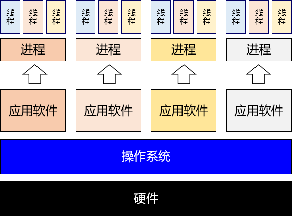

## [#](http://heavy_code_industry.gitee.io/code_heavy_industry/pro017-JUC/lecture/chapter01/verse01.html#_2、串行、并行、并发)2、串行、并行、并发

### [#](http://heavy_code_industry.gitee.io/code_heavy_industry/pro017-JUC/lecture/chapter01/verse01.html#_1串行)①串行

多个操作在同一个线程内**按顺序**执行。这种情况下的工作模式我们往往也称之为：**同步**。按照同步模式执行的多个操作，当前操作没有结束时，下一个操作就必须等待。处于等待中的状态往往也称为：**阻塞**（block）。

### [#](http://heavy_code_industry.gitee.io/code_heavy_industry/pro017-JUC/lecture/chapter01/verse01.html#_2并行、并发)②并行、并发

并行和并发都是以**异步**的模式来执行操作的。异步工作模式下不同线程内的操作互相不需要等待。

- 并行：**多个** CPU（或 CPU 核心）同时执行**多个任务**
- 并发：**一个** CPU（或 CPU 核心）同时执行**多个任务**

## [#](http://heavy_code_industry.gitee.io/code_heavy_industry/pro017-JUC/lecture/chapter01/verse01.html#_3、sleep-和-wait-区别)3、sleep() 和 wait() 区别

二者最关键的区别是下面两点：

- sleep() 会让线程**拿着锁**去睡
- wait() 会让线程**放开锁**去睡

### [#](http://heavy_code_industry.gitee.io/code_heavy_industry/pro017-JUC/lecture/chapter01/verse01.html#_1sleep-进入等待状态不释放锁)①sleep() 进入等待状态不释放锁

```java
Object commonObject = new Object();

new Thread(()->{

    try {
        synchronized (commonObject) {
            System.out.println(Thread.currentThread().getName() + " begin");
            Thread.sleep(10000);
            System.out.println(Thread.currentThread().getName() + " end");
        }
    } catch (InterruptedException e) {
        e.printStackTrace();
    }

}, "AAA").start();

new Thread(()->{

    synchronized (commonObject) {
        System.out.println(Thread.currentThread().getName() + " is working");
    }

}, "BBB").start();
```

打印结果：

> AAA begin
> AAA end
> BBB is working

### [#](http://heavy_code_industry.gitee.io/code_heavy_industry/pro017-JUC/lecture/chapter01/verse01.html#_2wait-进入等待状态释放锁)②wait() 进入等待状态释放锁

```java
Object commonLock = new Object();

new Thread(()->{

    try {
        synchronized (commonLock) {
            System.out.println(Thread.currentThread().getName() + " begin");
            commonLock.wait(10000);
            System.out.println(Thread.currentThread().getName() + " end");
        }
    } catch (InterruptedException e) {
        e.printStackTrace();
    }

}, "AAA").start();

new Thread(()->{

    synchronized (commonLock) {
        System.out.println(Thread.currentThread().getName() + " is working");
    }

}, "BBB").start();
```

打印结果：

> AAA begin
> BBB is working
> AAA end

### [#](http://heavy_code_industry.gitee.io/code_heavy_industry/pro017-JUC/lecture/chapter01/verse01.html#_3小结)③小结

|            | wait()                       | sleep()              |
| ---------- | ---------------------------- | -------------------- |
| 声明位置   | Object 类                    | Thread 类            |
| 作用对象   | 作用于调用 wait() 方法的对象 | 作用于当前线程       |
| 性质       | 非静态方法                   | 静态方法             |
| 释放锁资源 | **放开锁进入等待**           | **不释放锁进入等待** |
| 同步要求   | 必须在同步上下文中使用       | 不要求在同步上下文中 |

## [#](http://heavy_code_industry.gitee.io/code_heavy_industry/pro017-JUC/lecture/chapter01/verse01.html#_4、同步方法和同步代码块)4、同步方法和同步代码块

### [#](http://heavy_code_industry.gitee.io/code_heavy_industry/pro017-JUC/lecture/chapter01/verse01.html#_1区别)①区别

|            | 锁对象                      | 锁定范围             |
| ---------- | --------------------------- | -------------------- |
| 同步代码块 | 由程序员指定                | 代码块的范围（灵活） |
| 同步方法   | 静态：类.class 非静态：this | 整个方法体           |

### [#](http://heavy_code_industry.gitee.io/code_heavy_industry/pro017-JUC/lecture/chapter01/verse01.html#_2同步方法锁对象案例)②同步方法锁对象案例

#### [#](http://heavy_code_industry.gitee.io/code_heavy_industry/pro017-JUC/lecture/chapter01/verse01.html#_1-第一种情况)[1]第一种情况

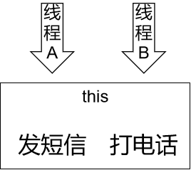

```java
public class Demo04SynchMethod {

    // 第一种情况：用同一个对象调用两个非静态的同步方法
    // 执行的效果：等发短信执行完成之后，才打印打电话
    public static void situation01(String[] args) {

        // 1、创建 Phone 对象作为多个线程共享的对象
        Phone phone = new Phone();

        // 2、创建发短信的线程
        new Thread(()->{

            phone.sendShortMessage();

        }, "thread-a").start();

        try {TimeUnit.SECONDS.sleep(1);} catch (InterruptedException e) {}

        // 3、创建打电话的线程
        new Thread(()->{

            phone.call();

        }, "thread-b").start();

    }

}

class Phone {

    // this
    public synchronized void sendShortMessage() {

        System.out.println(Thread.currentThread().getName() + " 发短信");

        try { TimeUnit.SECONDS.sleep(5);} catch (InterruptedException e) {}
    }

    // this
    public synchronized void call() {
        System.out.println(Thread.currentThread().getName() + " 打电话");
    }

}
```

#### [#](http://heavy_code_industry.gitee.io/code_heavy_industry/pro017-JUC/lecture/chapter01/verse01.html#_2-第二种情况)[2]第二种情况

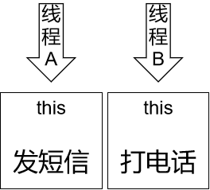

```java
// 第二种情况：用两个不同的对象调用分别两个非静态的同步方法
// 执行的效果：各自执行，不需要等待
// 1、创建 Phone 对象作为多个线程共享的对象
Phone phone01 = new Phone();
Phone phone02 = new Phone();

// 2、创建发短信的线程
new Thread(()->{

    phone01.sendShortMessage();

}, "thread-a").start();

try {TimeUnit.SECONDS.sleep(1);} catch (InterruptedException e) {}

// 3、创建打电话的线程
new Thread(()->{

    phone02.call();

}, "thread-b").start();
```

#### [#](http://heavy_code_industry.gitee.io/code_heavy_industry/pro017-JUC/lecture/chapter01/verse01.html#_3-第三种情况)[3]第三种情况

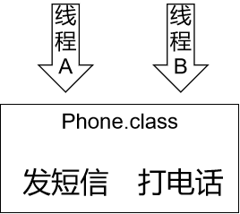

```java
public class Demo04SynchMethod {

    // 第三种情况：两个线程分别调用两个静态同步方法
    // 执行效果：等发短信执行完成之后，才打印打电话
    public static void main(String[] args) {

        // 1、创建 A 线程发短信
        new Thread(()->{

            Phone.sendShortMessage();

        }, "thread-a").start();

        try {TimeUnit.SECONDS.sleep(1);} catch (InterruptedException e) {}

        // 2、创建 B 线程打电话
        new Thread(()->{

            Phone.call();

        }, "thread-b").start();

    }

}

class Phone {

    // Phone.class
    public static synchronized void sendShortMessage() {

        System.out.println(Thread.currentThread().getName() + " 发短信");

        try {
            System.out.println(Thread.currentThread().getName() + " 开始睡觉");
            TimeUnit.SECONDS.sleep(5);
            System.out.println(Thread.currentThread().getName() + " 结束睡觉");
        } catch (InterruptedException e) {}
    }

    // Phone.class
    public static synchronized void call() {
        System.out.println(Thread.currentThread().getName() + " 打电话");
    }

}
```

#### [#](http://heavy_code_industry.gitee.io/code_heavy_industry/pro017-JUC/lecture/chapter01/verse01.html#_4-第四种情况)[4]第四种情况

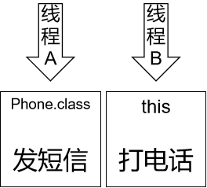

```java
public class Demo04SynchMethod {

    public static void main(String[] args) {

        // 第四种情况：类名调用静态同步方法；对象调用非静态同步方法
        // 执行效果：各自执行，不需要等待
        // 1、创建 A 线程发短信
        new Thread(()->{

            Phone.sendShortMessage();

        }, "thread-a").start();

        try {TimeUnit.SECONDS.sleep(2);} catch (InterruptedException e) {}

        // 2、创建 Phone 对象
        Phone phone = new Phone();

        // 3、创建 B 线程打电话
        new Thread(()->{

            phone.call();

        }, "thread-b").start();
    }
}

class Phone {

    // Phone.class
    public static synchronized void sendShortMessage() {

        System.out.println(Thread.currentThread().getName() + " 发短信");

        try {
            System.out.println(Thread.currentThread().getName() + " 开始睡觉");
            TimeUnit.SECONDS.sleep(5);
            System.out.println(Thread.currentThread().getName() + " 结束睡觉");
        } catch (InterruptedException e) {}
    }

    // this
    public synchronized void call() {
        System.out.println(Thread.currentThread().getName() + " 打电话");
    }

}
```

#### [#](http://heavy_code_industry.gitee.io/code_heavy_industry/pro017-JUC/lecture/chapter01/verse01.html#_5-结论)[5]结论

- 结论1：静态同步方法使用类.class作为锁对象；非静态同步方法使用this作为锁对象
- 结论2：多个线程如果使用同一个锁对象就会有竞争关系；否则没有竞争关系

## [#](http://heavy_code_industry.gitee.io/code_heavy_industry/pro017-JUC/lecture/chapter01/verse01.html#_5、练习-卖票的例子)5、练习：卖票的例子

```java
public class Demo05SaleTicket {

    // 票库存数量
    private int stock = 10;

    // 声明卖票的方法
    public synchronized void saleTicket() {
        if (stock > 0) {
            System.out.println(Thread.currentThread().getName() + " 号窗口操作：还剩" + --stock + "张票，");
        }else{
            System.out.println("票卖完了！！！");
        }
    }

    public static void main(String[] args) {

        // 创建当前类的对象
        Demo05SaleTicket demo = new Demo05SaleTicket();

        // 开三个窗口卖票
        new Thread(()->{

            while (true) {

                try {
                    TimeUnit.SECONDS.sleep(1);} catch (InterruptedException e) {}

                demo.saleTicket();

            }

        }, "0001").start();

        new Thread(()->{

            while (true) {

                try {
                    TimeUnit.SECONDS.sleep(1);} catch (InterruptedException e) {}

                demo.saleTicket();

            }

        }, "0002").start();

        new Thread(()->{

            while (true) {

                try {
                    TimeUnit.SECONDS.sleep(1);} catch (InterruptedException e) {}

                demo.saleTicket();

            }

        }, "0003").start();

    }
}
```

# 第二节 创建多线程

TIP

无论有多少种形式，创建多线程的真正的方法，其实只有两种：

- 继承 Thread 类
- 实现 Runnable 接口

其它形式都是这两种方式的变体。

## [#](http://heavy_code_industry.gitee.io/code_heavy_industry/pro017-JUC/lecture/chapter01/verse02.html#_1、继承-thread-类)1、继承 Thread 类

### [#](http://heavy_code_industry.gitee.io/code_heavy_industry/pro017-JUC/lecture/chapter01/verse02.html#_1实现方式)①实现方式

- 第一步：继承 Thread 类
- 第二步：重写 run() 方法
- 第三步：创建 Thread 子类对象
- 第四步：调用 start() 方法启动线程

```java
public class CreateThread01Extends {

    public static void main(String[] args) {
        DemoThread demo = new DemoThread("AAA");
        demo.start();
    }

}

class DemoThread extends Thread {

    public DemoThread(String threadName) {
        super(threadName);
    }

    @Override
    public void run() {
        System.out.println(Thread.currentThread().getName() + " thread working ...");
    }
}
```

### [#](http://heavy_code_industry.gitee.io/code_heavy_industry/pro017-JUC/lecture/chapter01/verse02.html#_2start-方法和-run-方法区别)②start() 方法和 run() 方法区别

调用 run() 方法仅仅只是调用了一个子类中重写的父类方法，并没有真正开启一个新的线程，还是在当前线程运行，也就是 main 线程。

## [#](http://heavy_code_industry.gitee.io/code_heavy_industry/pro017-JUC/lecture/chapter01/verse02.html#_2、实现-runnable-接口)2、实现 Runnable 接口

### [#](http://heavy_code_industry.gitee.io/code_heavy_industry/pro017-JUC/lecture/chapter01/verse02.html#_1实现-runnable-接口形式)①实现 Runnable 接口形式

```java
public class CreateThread02Impl {

    public static void main(String[] args) {

        // 第四步：创建实现了 Runnable 接口的类的对象
        MyRunnableThread runnable = new MyRunnableThread();

        // 第五步：创建 Thread 类对象
        // 参数1：runnable 对象
        // 参数2：线程名称
        Thread thread = new Thread(runnable, "thread 002");

        // 第六步：调用 Thread 对象的 start() 方法启动线程
        thread.start();
    }

}

// 第一步：实现 Runnable 接口
class MyRunnableThread implements Runnable {

    // 第二步：实现 run() 方法
    @Override
    public void run() {

        // 第三步：编写线程中的逻辑代码
        System.out.println(Thread.currentThread().getName() + " is working");
    }
}
```

### [#](http://heavy_code_industry.gitee.io/code_heavy_industry/pro017-JUC/lecture/chapter01/verse02.html#_2匿名内部类形式)②匿名内部类形式

```java
// 第一步：以匿名内部类的方式创建 Runnable 接口类型的对象
Runnable runnable = new Runnable() {
    @Override
    public void run() {
        // 第二步：编写线程中的逻辑代码
        System.out.println(Thread.currentThread().getName() + " is working");
    }
};

// 第三步：创建 Thread 类对象
// 参数1：runnable 对象
// 参数2：线程名称
Thread thread = new Thread(runnable, "thread 003");

// 第四步：调用 Thread 对象的 start() 方法启动线程
thread.start();
```

### [#](http://heavy_code_industry.gitee.io/code_heavy_industry/pro017-JUC/lecture/chapter01/verse02.html#_3lambda-表达式形式)③Lambda 表达式形式

#### [#](http://heavy_code_industry.gitee.io/code_heavy_industry/pro017-JUC/lecture/chapter01/verse02.html#_1-有声明变量的形式)[1]有声明变量的形式

```java
// 编写 Lambda 表达式的口诀：
// 复制小括号
// 写死右箭头
// 落地大括号

// 第一步：以匿名内部类的方式创建 Runnable 接口类型的对象
Runnable runnable = () -> {
    // 第二步：编写线程中的逻辑代码
    System.out.println(Thread.currentThread().getName() + " is working");
};

// 第三步：创建 Thread 类对象
// 参数1：runnable 对象
// 参数2：线程名称
Thread thread = new Thread(runnable, "thread 004");

// 第四步：调用 Thread 对象的 start() 方法启动线程
thread.start();
```

#### [#](http://heavy_code_industry.gitee.io/code_heavy_industry/pro017-JUC/lecture/chapter01/verse02.html#_2-不声明变量形式)[2]不声明变量形式

```java
// 第一步：创建 Thread 类对象并调用 start() 方法启动线程
// 参数1：以Lambda 表达式形式创建的 runnable 对象
// 参数2：线程名称
new Thread(() -> {
    // 第二步：编写线程中的逻辑代码
    System.out.println(Thread.currentThread().getName() + " is working");
}, "thread 005").start();
```

## [#](http://heavy_code_industry.gitee.io/code_heavy_industry/pro017-JUC/lecture/chapter01/verse02.html#_3、使用-callable-接口配合-futuretask)3、使用 Callable 接口配合 FutureTask

TIP

该方案最核心的价值是：使用 Callable 接口限定的功能 + Future 接口限定的功能 = **汇总**各个线程执行结果

最终执行汇总操作的这一步会被阻塞，直到前面各个线程完成了计算。

### [#](http://heavy_code_industry.gitee.io/code_heavy_industry/pro017-JUC/lecture/chapter01/verse02.html#_1futuretask类和runnable接口的关系)①FutureTask类和Runnable接口的关系

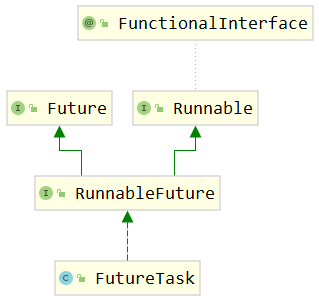

从继承关系能够看到，FutureTask本身也间接实现了Runnable接口。FutureTask类的对象也是Runnable接口的实例，可以用于在创建Thread对象时，传入Thread构造器。

### [#](http://heavy_code_industry.gitee.io/code_heavy_industry/pro017-JUC/lecture/chapter01/verse02.html#_2future-接口)②Future 接口

#### [#](http://heavy_code_industry.gitee.io/code_heavy_industry/pro017-JUC/lecture/chapter01/verse02.html#_1-停止任务)[1]停止任务

方法声明：

```java
boolean cancel(boolean mayInterruptIfRunning);
```

如果尚未启动，它将停止任务。如果已启动，则仅在 mayInterrupt 为 true 时才会中断任务。

#### [#](http://heavy_code_industry.gitee.io/code_heavy_industry/pro017-JUC/lecture/chapter01/verse02.html#_2-获取任务的结果)[2]获取任务的结果

```java
V get() throws InterruptedException, ExecutionException;
```

如果任务完成，它将立即返回结果，否则将等待任务完成，然后返回结果。

#### [#](http://heavy_code_industry.gitee.io/code_heavy_industry/pro017-JUC/lecture/chapter01/verse02.html#_3-判断任务是否完成)[3]判断任务是否完成

```java
boolean isDone();
```

如果任务完成，则返回true，否则返回false。

### [#](http://heavy_code_industry.gitee.io/code_heavy_industry/pro017-JUC/lecture/chapter01/verse02.html#_3futuretask-类的构造器)③FutureTask 类的构造器

#### [#](http://heavy_code_industry.gitee.io/code_heavy_industry/pro017-JUC/lecture/chapter01/verse02.html#_1-介绍)[1]介绍

FutureTask 类兼具 Runnable 和 Future 接口的功能，并方便地将两种功能组合在一起。关于 FutureTask 类的使用有如下建议：

- 在主线程中需要执行比较耗时的操作时，但又不想阻塞主线程时，可以把这些作业交给 Future 对象在后台完成
- 当主线程将来需要时，就可以通过 Future 对象获得后台作业的计算结果或者执行状态
- 一般 FutureTask 多用于耗时的计算，主线程可以在完成自己的任务后，再去获取结果。
- 仅在计算完成时才能检索结果；如果计算尚未完成，则阻塞 get() 方法
- 一旦计算完成，就不能再重新开始或取消计算
- get() 方法而获取结果只有在计算完成时获取，否则会一直阻塞直到任务转入完成状态，然后会返回结果或者抛出异常
- get() 只执行一次，因此get() 方法放到最后

#### [#](http://heavy_code_industry.gitee.io/code_heavy_industry/pro017-JUC/lecture/chapter01/verse02.html#_2-可以使用的构造器)[2]可以使用的构造器

```java
    public FutureTask(Callable<V> callable) {
        if (callable == null)
            throw new NullPointerException();
        this.callable = callable;
        this.state = NEW;       // ensure visibility of callable
    }
```

根据这个构造器，我们知道，创建 FutureTask 对象时，传入一个 Callable 类型的对象即可。

### [#](http://heavy_code_industry.gitee.io/code_heavy_industry/pro017-JUC/lecture/chapter01/verse02.html#_4callable-接口)④Callable 接口

```java
@FunctionalInterface
public interface Callable<V> {
    /**
     * Computes a result, or throws an exception if unable to do so.
     *
     * @return computed result
     * @throws Exception if unable to compute a result
     */
    V call() throws Exception;
}
```

从 call() 方法的声明我们可以看出，它有一个返回值。这个返回值可以将当前线程内计算结果返回。

### [#](http://heavy_code_industry.gitee.io/code_heavy_industry/pro017-JUC/lecture/chapter01/verse02.html#_5测试代码)⑤测试代码

```java
// 1.创建三个FutureTask对象，封装三个线程的执行逻辑
FutureTask<Integer> task01 = new FutureTask<>(() -> {

    int result = (int) (Math.random() * Math.random() * 100);

    System.out.println(Thread.currentThread().getName());

    return result;
});
FutureTask<Integer> task02 = new FutureTask<>(() -> {

    int result = (int) (Math.random() * Math.random() * 1000);

    System.out.println(Thread.currentThread().getName());

    return result;
});
FutureTask<Integer> task03 = new FutureTask<>(() -> {

    int result = (int) (Math.random() * Math.random() * 10000);

    System.out.println(Thread.currentThread().getName());

    return result;
});

// 2.创建三个线程对象，然后启动线程
new Thread(task01, "thread01").start();
new Thread(task02, "thread02").start();
new Thread(task03, "thread03").start();

// 3.上面三个线程执行完成后，可以收集它们各自运算的结果
Integer task01Result = task01.get();
Integer task02Result = task02.get();
Integer task03Result = task03.get();

System.out.println("task01Result = " + task01Result);
System.out.println("task02Result = " + task02Result);
System.out.println("task03Result = " + task03Result);
```

### [#](http://heavy_code_industry.gitee.io/code_heavy_industry/pro017-JUC/lecture/chapter01/verse02.html#_6callable和runnable对比)⑥Callable和Runnable对比

| Runnable接口               | Callable接口             |
| -------------------------- | ------------------------ |
| 重写run()方法              | 重写call()方法           |
| run()没有返回值            | call()有返回值           |
| run()没有声明抛出异常      | call()声明抛出Exception  |
| 没有汇总各个线程结果的机制 | 有汇总各个线程结果的机制 |

### [#](http://heavy_code_industry.gitee.io/code_heavy_industry/pro017-JUC/lecture/chapter01/verse02.html#_7callable接口方案的特点)⑦Callable接口方案的特点

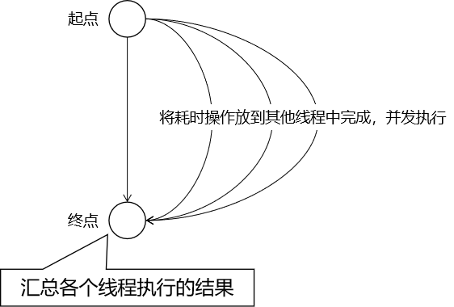

该方案仅在计算完成时才能检索结果；如果计算尚未完成，则阻塞 get() 方法。一旦计算完成，就不能再重新开始或取消计算。get() 方法而获取结果只有在计算完成时获取，否则会一直阻塞直到任务转入完成状态，然后会返回结果或者抛出异常， 且只计算一次。

## [#](http://heavy_code_industry.gitee.io/code_heavy_industry/pro017-JUC/lecture/chapter01/verse02.html#_4、线程池)4、线程池

### [#](http://heavy_code_industry.gitee.io/code_heavy_industry/pro017-JUC/lecture/chapter01/verse02.html#_1参考代码)①参考代码

```java
// 1.创建线程池对象
ExecutorService pool = Executors.newFixedThreadPool(5);

// 2.给线程池对象分配任务，每一个任务是一个线程
pool.execute(() -> {
    System.out.println(Thread.currentThread().getName() + " " + new Date());
});

pool.execute(() -> {
    System.out.println(Thread.currentThread().getName() + " " + new Date());
});

pool.execute(() -> {
    System.out.println(Thread.currentThread().getName() + " " + new Date());
});
```

### [#](http://heavy_code_industry.gitee.io/code_heavy_industry/pro017-JUC/lecture/chapter01/verse02.html#_2开发建议)②开发建议

阿里开发手册中对线程创建的规定：


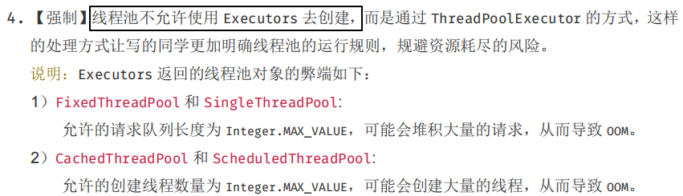

结论：实际开发中，建议使用**『自定义线程池』**的方式创建多线程。

## [#](http://heavy_code_industry.gitee.io/code_heavy_industry/pro017-JUC/lecture/chapter01/verse02.html#_5、并行计算-了解)5、并行计算[了解]

```java
List<String> list = Arrays.asList("a", "b", "c", "d", "e");

// 串行计算
list.stream().forEach(System.out::print);

System.out.println();

// 并行计算
list.parallelStream().forEach(System.out::print);
```

## [#](http://heavy_code_industry.gitee.io/code_heavy_industry/pro017-JUC/lecture/chapter01/verse02.html#_6、timer-定时任务-了解)6、Timer 定时任务[了解]

```java
// 1、创建 Timer 对象封装定时任务中要执行的操作
// 每一个 Timer 对象会使用一个线程来执行定时任务
Timer timer01 = new Timer();

// 2、调用 schedule() 指定任务和执行周期
// 参数1：timerTask 封装具体任务操作
// 参数2：delay 指定定时任务延迟多久后开始执行
// 参数3：period 指定定时任务执行的时间间隔
timer01.schedule(new TimerTask() {
    @Override
    public void run() {
        System.out.println(Thread.currentThread().getName() +" is working");
    }
}, 0, 1000);

Timer timer02 = new Timer();

timer02.schedule(new TimerTask() {
    @Override
    public void run() {
        System.out.println(Thread.currentThread().getName() +" is working");
    }
}, 0, 1000);
```

> Timer-0 is working
> Timer-1 is working
> Timer-0 is working
> Timer-1 is working

## [#](http://heavy_code_industry.gitee.io/code_heavy_industry/pro017-JUC/lecture/chapter01/verse02.html#_7、spring-异步方法-了解)7、Spring 异步方法[了解]

TIP

使用场景：

在 Spring 环境下，如果组件 A（假设是 ControllerA）要调用组件 B（假设是 ServiceB）的多个方法，而且希望这些方法能够异步执行。

### [#](http://heavy_code_industry.gitee.io/code_heavy_industry/pro017-JUC/lecture/chapter01/verse02.html#_1准备-springboot-环境)①准备 SpringBoot 环境

#### [#](http://heavy_code_industry.gitee.io/code_heavy_industry/pro017-JUC/lecture/chapter01/verse02.html#_1-引入依赖)[1]引入依赖

```xml
<dependencies>
    <dependency>
        <groupId>org.springframework.boot</groupId>
        <artifactId>spring-boot-starter-web</artifactId>
        <version>2.5.2</version>
    </dependency>
</dependencies>
```

#### [#](http://heavy_code_industry.gitee.io/code_heavy_industry/pro017-JUC/lecture/chapter01/verse02.html#_2-创建主启动类)[2]创建主启动类

```java
@SpringBootApplication
public class Application {

    public static void main(String[] args) {
        SpringApplication.run(Application.class, args);
    }

}
```

#### [#](http://heavy_code_industry.gitee.io/code_heavy_industry/pro017-JUC/lecture/chapter01/verse02.html#_3-创建-service)[3]创建 Service

```java
@Service
public class DemoService {
    
    public void doSth() {
        System.out.println("Demo Service " + Thread.currentThread().getName());
    }

}
```

#### [#](http://heavy_code_industry.gitee.io/code_heavy_industry/pro017-JUC/lecture/chapter01/verse02.html#_4-创建-controller)[4]创建 Controller

```java
@RestController
public class DemoController {

    @Autowired
    private DemoService demoService;

    @RequestMapping("/demo/test/async")
    public String callServiceMethod() {

        demoService.doSth();
        demoService.doSth();
        demoService.doSth();
        demoService.doSth();
        demoService.doSth();

        return "success";
    }

}
```

### [#](http://heavy_code_industry.gitee.io/code_heavy_industry/pro017-JUC/lecture/chapter01/verse02.html#_2使用异步方法)②使用异步方法

#### [#](http://heavy_code_industry.gitee.io/code_heavy_industry/pro017-JUC/lecture/chapter01/verse02.html#_1-开启异步功能)[1]开启异步功能

在主启动类使用 @EnableAsync 注解：

```java
// 开启支持异步方法调用功能
@EnableAsync
@SpringBootApplication
public class Application {

    public static void main(String[] args) {
        SpringApplication.run(Application.class, args);
    }

}
```

#### [#](http://heavy_code_industry.gitee.io/code_heavy_industry/pro017-JUC/lecture/chapter01/verse02.html#_2-标记异步方法)[2]标记异步方法

在想要异步调用的方法上使用 @Async 注解：

```java
@Service
public class DemoService {

    // 在想要实现异步调用的方法上加 @Async注解
    @Async
    public void doSth() {
        System.out.println("Demo Service " + Thread.currentThread().getName());
    }

}
```

## [#](http://heavy_code_industry.gitee.io/code_heavy_industry/pro017-JUC/lecture/chapter01/verse02.html#_8、小结)8、小结

面试中如果被问到：创建多线程有哪些方法，至少要能说上来前四种。后面三种是用来卷别人、吹牛的。

其实 Fork Join、CompletableFuture 也可以，后面会讲到。

- [基本] 继承 Thread 类
- [基本] 实现 Runnable 接口
- [基本] 线程池
- [基本] Callable + FutureTask
- [内卷] CompletableFuture
- [内卷] Fork Join
- [内卷] 并行计算
- [内卷] Timer 定时任务
- [内卷] Spring 的异步方法调用

# 第三节 线程状态与生命周期

## [#](http://heavy_code_industry.gitee.io/code_heavy_industry/pro017-JUC/lecture/chapter01/verse03.html#_1、线程状态枚举类)1、线程状态枚举类

### [#](http://heavy_code_industry.gitee.io/code_heavy_industry/pro017-JUC/lecture/chapter01/verse03.html#_1源代码)①源代码

在 java.lang.Thread 类中有一个内部类：

```java
    public enum State {
        /**
         * Thread state for a thread which has not yet started.
         */
        NEW,

        /**
         * Thread state for a runnable thread.  A thread in the runnable
         * state is executing in the Java virtual machine but it may
         * be waiting for other resources from the operating system
         * such as processor.
         */
        RUNNABLE,

        /**
         * Thread state for a thread blocked waiting for a monitor lock.
         * A thread in the blocked state is waiting for a monitor lock
         * to enter a synchronized block/method or
         * reenter a synchronized block/method after calling
         * {@link Object#wait() Object.wait}.
         */
        BLOCKED,

        /**
         * Thread state for a waiting thread.
         * A thread is in the waiting state due to calling one of the
         * following methods:
         * <ul>
         *   <li>{@link Object#wait() Object.wait} with no timeout</li>
         *   <li>{@link #join() Thread.join} with no timeout</li>
         *   <li>{@link LockSupport#park() LockSupport.park}</li>
         * </ul>
         *
         * <p>A thread in the waiting state is waiting for another thread to
         * perform a particular action.
         *
         * For example, a thread that has called <tt>Object.wait()</tt>
         * on an object is waiting for another thread to call
         * <tt>Object.notify()</tt> or <tt>Object.notifyAll()</tt> on
         * that object. A thread that has called <tt>Thread.join()</tt>
         * is waiting for a specified thread to terminate.
         */
        WAITING,

        /**
         * Thread state for a waiting thread with a specified waiting time.
         * A thread is in the timed waiting state due to calling one of
         * the following methods with a specified positive waiting time:
         * <ul>
         *   <li>{@link #sleep Thread.sleep}</li>
         *   <li>{@link Object#wait(long) Object.wait} with timeout</li>
         *   <li>{@link #join(long) Thread.join} with timeout</li>
         *   <li>{@link LockSupport#parkNanos LockSupport.parkNanos}</li>
         *   <li>{@link LockSupport#parkUntil LockSupport.parkUntil}</li>
         * </ul>
         */
        TIMED_WAITING,

        /**
         * Thread state for a terminated thread.
         * The thread has completed execution.
         */
        TERMINATED;
    }
```

### [#](http://heavy_code_industry.gitee.io/code_heavy_industry/pro017-JUC/lecture/chapter01/verse03.html#_2说明)②说明

| 英文名称      | 中文名称 | 含义                                                    |
| ------------- | -------- | ------------------------------------------------------- |
| NEW           | 新建     | 线程对象刚创建                                          |
| RUNNABLE      | 就绪     | 等待 CPU 时间片                                         |
| RUNNING       | 运行     | 得到了 CPU 时间片，正在执行                             |
| BLOCKED       | 阻塞     | 等待同步锁                                              |
| WAITING       | 等待     | 等待被唤醒                                              |
| TIMED_WAITING | 限时等待 | 在进入等待状态时设定了等待时间 时间一到自动回到就绪状态 |
| TERMINATED    | 终止     | 线程因为代码执行完成或抛异常而停止执行                  |

TIP

- WAITING：睡美人自己醒不过来，必须由王子来唤醒——体现到程序中是必须由其它线程唤醒。
- TIMED_WAITING：上闹钟睡觉，闹钟一响就醒来——体现到程序中是过了超时时间就能被唤醒。
- RUNNING：在 Thread.State 枚举类中并没有定义，是我们自己补充上去的。

## [#](http://heavy_code_industry.gitee.io/code_heavy_industry/pro017-JUC/lecture/chapter01/verse03.html#_2、线程的生命周期)2、线程的生命周期

### [#](http://heavy_code_industry.gitee.io/code_heavy_industry/pro017-JUC/lecture/chapter01/verse03.html#_1新建)①新建

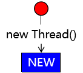

### [#](http://heavy_code_industry.gitee.io/code_heavy_industry/pro017-JUC/lecture/chapter01/verse03.html#_2就绪)②就绪

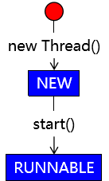

### [#](http://heavy_code_industry.gitee.io/code_heavy_industry/pro017-JUC/lecture/chapter01/verse03.html#_3运行)③运行

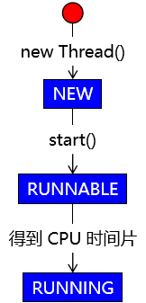

### [#](http://heavy_code_industry.gitee.io/code_heavy_industry/pro017-JUC/lecture/chapter01/verse03.html#_4回到就绪状态)④回到就绪状态

本次得到的 CPU 时间片用完，重新回到就绪状态，等待下一个 CPU 时间片。

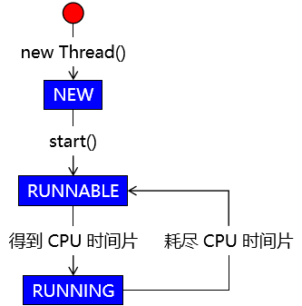

### [#](http://heavy_code_industry.gitee.io/code_heavy_industry/pro017-JUC/lecture/chapter01/verse03.html#_5结束)⑤结束

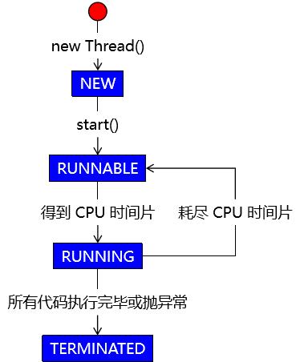

### [#](http://heavy_code_industry.gitee.io/code_heavy_industry/pro017-JUC/lecture/chapter01/verse03.html#_6等待)⑥等待

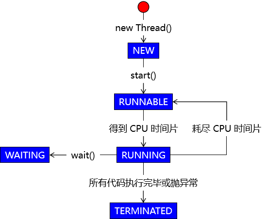

### [#](http://heavy_code_industry.gitee.io/code_heavy_industry/pro017-JUC/lecture/chapter01/verse03.html#_7唤醒)⑦唤醒

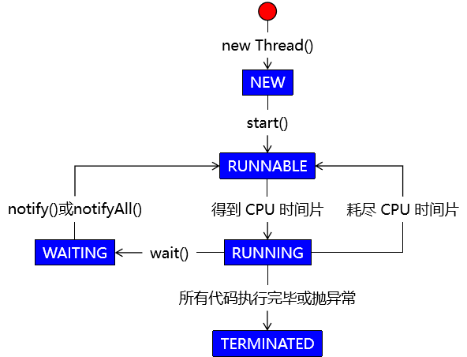

WARNING

本土中的 notify()、notifyAll() 方法应该是由**其它线程**调用，而不是当前线程自己。

### [#](http://heavy_code_industry.gitee.io/code_heavy_industry/pro017-JUC/lecture/chapter01/verse03.html#_8超时等待与唤醒)⑧超时等待与唤醒

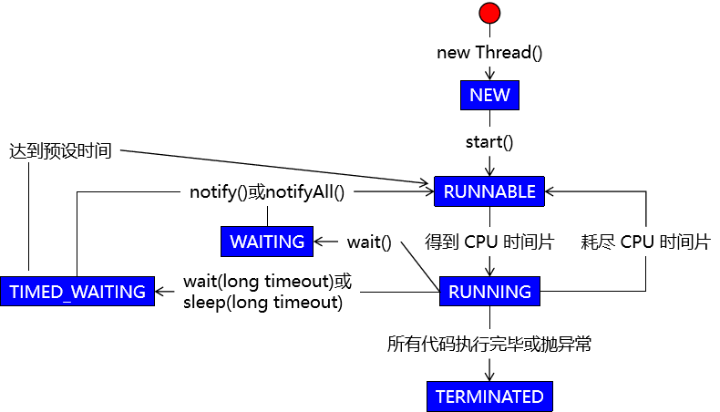

### [#](http://heavy_code_industry.gitee.io/code_heavy_industry/pro017-JUC/lecture/chapter01/verse03.html#_9阻塞)⑨阻塞

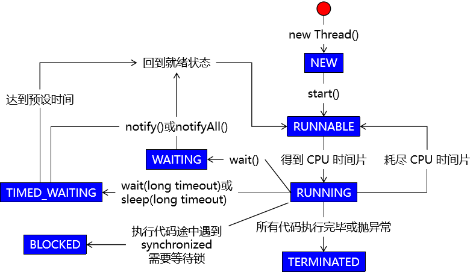

### [#](http://heavy_code_industry.gitee.io/code_heavy_industry/pro017-JUC/lecture/chapter01/verse03.html#_10得到锁)⑩得到锁

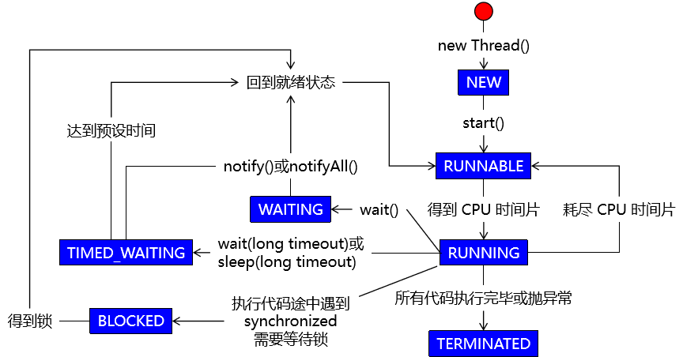

## [#](http://heavy_code_industry.gitee.io/code_heavy_industry/pro017-JUC/lecture/chapter01/verse03.html#_3、dump-threads)3、Dump Threads

学习目标：只是帮助大家理解，不做强制性要求。

### [#](http://heavy_code_industry.gitee.io/code_heavy_industry/pro017-JUC/lecture/chapter01/verse03.html#_1演示就绪状态)①演示就绪状态

#### [#](http://heavy_code_industry.gitee.io/code_heavy_industry/pro017-JUC/lecture/chapter01/verse03.html#_1-java代码)[1]Java代码

```java
new Thread(()->{
    while (true){}
}, "my-thread").start();
```

#### [#](http://heavy_code_industry.gitee.io/code_heavy_industry/pro017-JUC/lecture/chapter01/verse03.html#_2-查看线程状态)[2]查看线程状态

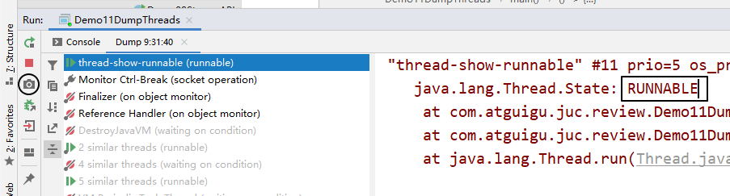

### [#](http://heavy_code_industry.gitee.io/code_heavy_industry/pro017-JUC/lecture/chapter01/verse03.html#_2演示等待状态)②演示等待状态

#### [#](http://heavy_code_industry.gitee.io/code_heavy_industry/pro017-JUC/lecture/chapter01/verse03.html#_1-java代码-2)[1] Java代码

```java
// 创建一个对象用来操作线程状态
Object commonObject = new Object();

// 创建一个线程对象
new Thread(()->{

    synchronized (commonObject) {

        try {
            // 进入等待状态
            commonObject.wait();
        } catch (InterruptedException e) {
            e.printStackTrace();
        }

    }

}).start();
```

#### [#](http://heavy_code_industry.gitee.io/code_heavy_industry/pro017-JUC/lecture/chapter01/verse03.html#_2-查看线程状态-2)[2]查看线程状态

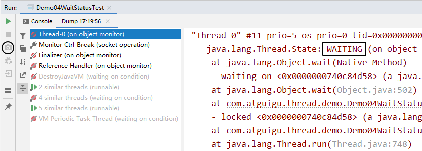

### [#](http://heavy_code_industry.gitee.io/code_heavy_industry/pro017-JUC/lecture/chapter01/verse03.html#_3演示阻塞状态)③演示阻塞状态

#### [#](http://heavy_code_industry.gitee.io/code_heavy_industry/pro017-JUC/lecture/chapter01/verse03.html#_1-java代码-3)[1] Java代码

```java
// 创建一个普通对象作为同步锁
Object commonObject = new Object();

// 创建两个线程，其中一个线程睡眠时另一个就是阻塞状态
new Thread(()->{

    try {
        synchronized (commonObject) {

            Thread.sleep(10000);

        }
    } catch (InterruptedException e) {
        e.printStackTrace();
    }

}, "AAA").start();

new Thread(()->{

    try {
        synchronized (commonObject) {

            Thread.sleep(10000);

        }
    } catch (InterruptedException e) {
        e.printStackTrace();
    }

}, "BBB").start();
```

#### [#](http://heavy_code_industry.gitee.io/code_heavy_industry/pro017-JUC/lecture/chapter01/verse03.html#_2-查看线程状态-3)[2]查看线程状态

- 状态一：AAA 线程获取同步锁，执行同步代码块，进入 TIMED_WAITING 状态。

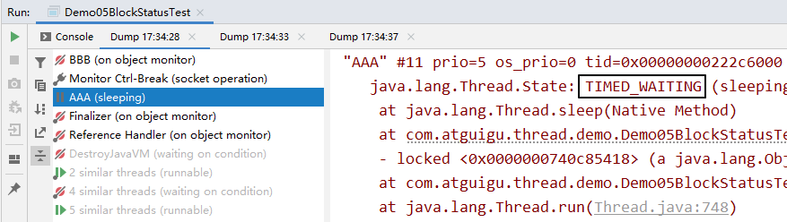

- 状态二：AAA 线程未释放同步锁时，BBB 线程处于 BLOCKED 状态

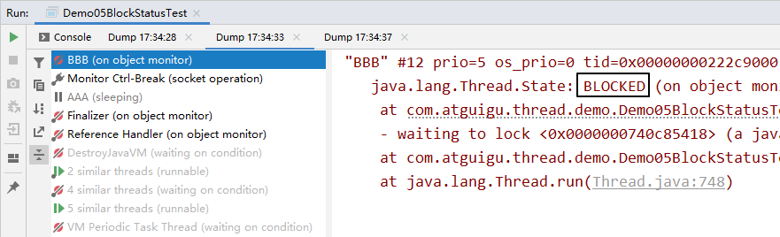

- 状态三：AAA 线程执行完成，释放同步锁，BBB 线程获得同步锁，执行代码块，进入 TIMED_WAITING 状态。

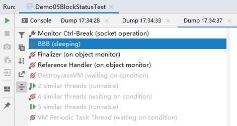

# 第四节 线程间通信

TIP

在多线程模式下进行工作，除了要考虑各个线程之间是否同步、如何竞争锁等问题，还要考虑这样一个问题：线程之间有的时候需要**相互配合**来共同完成一件事情。

把一个大的任务拆分成多个不同的任务线，每个任务线中都有更小的执行步骤。各个线程之间需要彼此配合：A 线程执行一步唤醒 B 线程，自己等待；B 线程执行一步，唤醒 A 线程，自己等待……

## [#](http://heavy_code_industry.gitee.io/code_heavy_industry/pro017-JUC/lecture/chapter01/verse04.html#_1、核心语法)1、核心语法

### [#](http://heavy_code_industry.gitee.io/code_heavy_industry/pro017-JUC/lecture/chapter01/verse04.html#_1object-类的-wait-方法)①Object 类的 wait() 方法

官方文档对 wait() 方法的说明（节选）：

> Causes the current thread to wait until another thread invokes the java.lang.Object#notify() method or the java.lang.Object#notifyAll() method for this object.

拆解要点：

- wait() 方法会导致当前线程进入等待状态
- 必须是**另外一个线程**调用 notify() 或 notifyAll() 方法来唤醒
- “for this object” 表示还是要使用**同一个对象**分别调用 wait()、notify()、notifyAll() 这些方法

### [#](http://heavy_code_industry.gitee.io/code_heavy_industry/pro017-JUC/lecture/chapter01/verse04.html#_2object-类的-notify-方法)②Object 类的 notify() 方法

官方文档对 notify() 方法的说明（节选）：

> Wakes up a single thread that is waiting on this object's monitor. If any threads are waiting on this object, one of them is chosen to be awakened.

拆解要点：

- notify() 方法**只唤醒一个**线程
- 处于等待状态的线程会被存放在对象监视器中的一个数组中
- 如果在这个对象的监视器中维护的处于等待状态的线程是多个，那么 notify() 方法会**随机唤醒一个**
- notfiy() 方法**无法精确唤醒一个指定的线程**，这个需求可以通过 Lock + Condition 方式实现（定制化通信）

### [#](http://heavy_code_industry.gitee.io/code_heavy_industry/pro017-JUC/lecture/chapter01/verse04.html#_3object-类的-notifyall-方法)③Object 类的 notifyAll() 方法

官方文档对 notifyAll() 方法的说明（节选）：

> Wakes up all threads that are waiting on this object's monitor.
>
> 翻译：唤醒当前对象监视器上等待的**所有线程**。

## [#](http://heavy_code_industry.gitee.io/code_heavy_industry/pro017-JUC/lecture/chapter01/verse04.html#_2、案例演示)2、案例演示

### [#](http://heavy_code_industry.gitee.io/code_heavy_industry/pro017-JUC/lecture/chapter01/verse04.html#_1需求说明)①需求说明

- 设定一个成员变量，作为两个线程都要操作的共享数据，设置初始化值为 0
- A 线程执行 +1 操作
- B 线程执行 -1 操作
- A、B 两个线程交替执行

### [#](http://heavy_code_industry.gitee.io/code_heavy_industry/pro017-JUC/lecture/chapter01/verse04.html#_2实现代码)②实现代码

```java
public class Demo01TwoThreads {

    // 声明成员变量作为共享数据
    private int number = 0;

    // 声明一个执行加法的方法
    public void add() {

        // wait()、notify() 方法要求工作在同步上下文中
        synchronized (this) {

            try {
                // 判断当前 number 的数值
                if (number > 0) {

                    // 如果 number 大于 0，则当前线程等待
                    this.wait();
                }

                // 线程被唤醒后，执行 +1 操作
                System.out.println(Thread.currentThread().getName() + " 线程：" + ++number);

                // 执行完成后，唤醒减法线程
                this.notifyAll();
            } catch (InterruptedException e) {
                e.printStackTrace();
            }
        }

    }

    // 声明一个执行减法的方法
    public void sub() {

        // wait()、notify() 方法要求工作在同步上下文中
        synchronized (this) {

            try {
                // 判断当前 number 的数值
                if (number <= 0) {

                    // 如果 number 小于等于 0，则当前线程等待
                    this.wait();
                }

                // 线程被唤醒后，执行 -1 操作
                System.out.println(Thread.currentThread().getName() + " 线程：" + --number);

                // 执行完成后，唤醒加法线程
                this.notifyAll();
            } catch (InterruptedException e) {
                e.printStackTrace();
            }
        }
    }

    public static void main(String[] args) {

        // 1、创建当前类对象
        Demo01TwoThreads demo = new Demo01TwoThreads();

        // 2、创建 A 线程执行加法操作
        new Thread(()->{

            for (int i = 0; i < 50; i++) {
                demo.add();
                try {
                    TimeUnit.SECONDS.sleep(1);} catch (InterruptedException e) {}
            }

        }, "thread-a").start();


        // 3、创建 B 线程执行减法操作
        new Thread(()->{

            for (int i = 0; i < 50; i++) {
                demo.sub();
                try {
                    TimeUnit.SECONDS.sleep(1);} catch (InterruptedException e) {}
            }

        }, "thread-b").start();
    }

}
```

TIP

测试多线程程序的基本逻辑：

代码的某些错误→运行结果部分正确
代码完全正确→运行结果全部正确

运行结果的一次错误→证明代码肯定有问题
运行结果的一次正确→没法证明代码正确

结论：不能全看运行结果。

如果我们希望能够尽可能通过运行结果证明代码正确，那就需要增加运行的次数，或者有可能需要取消执行过程中的时间间隔。

## [#](http://heavy_code_industry.gitee.io/code_heavy_industry/pro017-JUC/lecture/chapter01/verse04.html#_3、虚假唤醒)3、虚假唤醒

### [#](http://heavy_code_industry.gitee.io/code_heavy_industry/pro017-JUC/lecture/chapter01/verse04.html#_1问题描述)①问题描述

当上面的例子中，线程数量从两个增加到四个，计算结果就会出错：

> thread-a 线程：1 thread-c 线程：2 thread-a 线程：3 thread-d 线程：2 thread-d 线程：1 thread-d 线程：0 thread-b 线程：-1 thread-d 线程：-2 thread-a 线程：-1 thread-a 线程：0 thread-a 线程：1 thread-c 线程：2 thread-a 线程：3 thread-d 线程：2 thread-d 线程：1

### [#](http://heavy_code_industry.gitee.io/code_heavy_industry/pro017-JUC/lecture/chapter01/verse04.html#_2问题分析)②问题分析

#### [#](http://heavy_code_industry.gitee.io/code_heavy_industry/pro017-JUC/lecture/chapter01/verse04.html#_1-使用-if-的情况)[1]使用 if 的情况

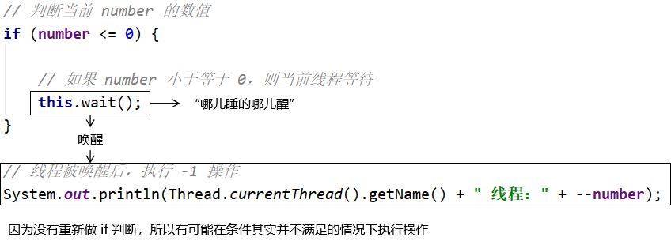

这种情况，我们称之为：**虚假唤醒**。

#### [#](http://heavy_code_industry.gitee.io/code_heavy_industry/pro017-JUC/lecture/chapter01/verse04.html#_2-使用-while-解决问题)[2]使用 while 解决问题

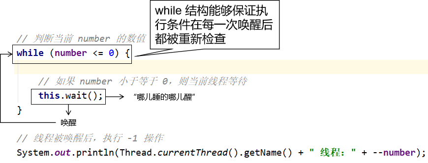

### [#](http://heavy_code_industry.gitee.io/code_heavy_industry/pro017-JUC/lecture/chapter01/verse04.html#_3小结)③小结

要解决虚假唤醒问题，就需要对线程间通信时的判断条件使用 while 循环结构来执行，而不是 if 分支判断。

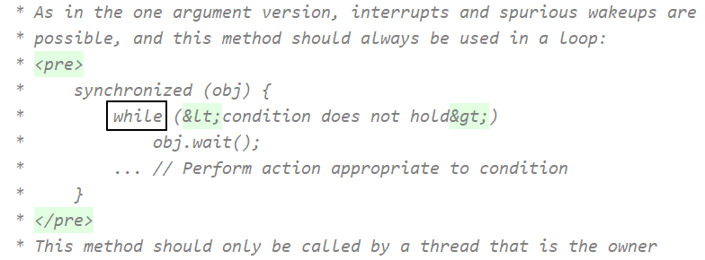