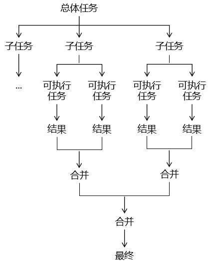
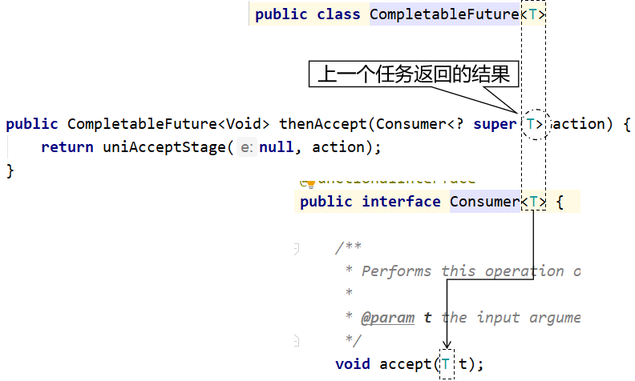
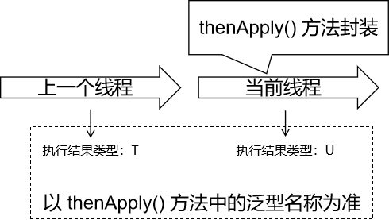
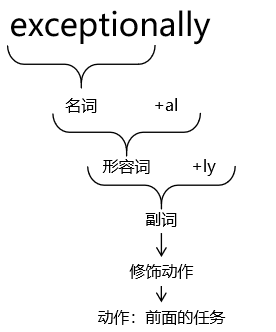
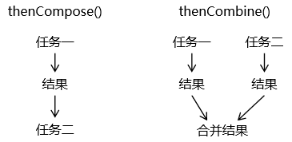

# 第一节 CountDownLatch

效果：指定一个操作步骤数量，在各个子线程中，每完成一个任务就给步骤数量 - 1；在步骤数量减到0之前，CountDownLatch 可以帮我们把最后一步操作抑制住（阻塞），让最后一步操作一直等到步骤被减到 0 的时候执行。

## [#](http://heavy_code_industry.gitee.io/code_heavy_industry/pro017-JUC/lecture/chapter04/verse01.html#_1、班长锁门)1、班长锁门

有六名同学在值日，班长负责锁门。班长必须确保所有同学都离开教室再锁门。

```java
// 声明一个变量，用来保存同学的数量
int stuNum = 6;

// 创建CountDownLatch对象
CountDownLatch countDownLatch = new CountDownLatch(stuNum);

// 创建和同学数量相等的线程
for (int i = 0; i < stuNum; i++) {

    String num = String.valueOf(i + 1);

    new Thread(()->{

        // 完成一次操作
        System.out.println(Thread.currentThread().getName() + " " + num + "号同学离开教室");

        // 让countDownLatch管理的数量-1
        countDownLatch.countDown();

    }).start();

}

// 让countDownLatch负责将最后一步操作抑制住
countDownLatch.await();

System.out.println("班长锁门");
```


## [#](http://heavy_code_industry.gitee.io/code_heavy_industry/pro017-JUC/lecture/chapter04/verse01.html#_2、集齐七颗龙珠召唤神龙)2、集齐七颗龙珠召唤神龙

```java
// 声明龙珠数量
int dragonBall = 7;

// 创建CountdownLatch对象
CountDownLatch countDownLatch = new CountDownLatch(dragonBall);

// 创建七个线程收集龙珠
for (int i = 0; i < 7; i++) {

    String num = String.valueOf(i);

    new Thread(()->{

        System.out.println("现在拿到了" + num + "号龙珠");

        countDownLatch.countDown();

    }).start();

}

// 让countDownLatch对象抑制最后一步
countDownLatch.await();

System.out.println("龙珠集齐，召唤神龙");
```

# 第二节 CyclicBarrier

支持多线程在执行各自任务的时候，到达某个状态点就等待，等所有线程都到达这个状态点再继续执行后步骤。

```java
public class O19CyclicBarrierTest {

    private static List<List<String>> matrix = new ArrayList<>();

    static {
        matrix.add(Arrays.asList("normal","special","end"));
        matrix.add(Arrays.asList("normal","normal","special","end"));
        matrix.add(Arrays.asList("normal","normal","normal","special","end"));
    }

    public static void main(String[] args) {


        // 1.创建CyclicBarrier对象
        CyclicBarrier barrier = new CyclicBarrier(3);

        // 2.创建3个线程分别执行各自的任务
        new Thread(()->{

            try {
                List<String> list = matrix.get(0);

                for (String value : list) {

                    TimeUnit.SECONDS.sleep(1);

                    System.out.println(Thread.currentThread().getName() + " value = " + value);

                    if ("special".equals(value)) {

                        // 遇到特殊任务标记，就让当前线程等一下
                        barrier.await();
                    }

                }

            } catch (InterruptedException e) {
                e.printStackTrace();
            } catch (BrokenBarrierException e) {
                e.printStackTrace();
            }

        }, "thread01").start();

        new Thread(()->{

            try {
                List<String> list = matrix.get(1);

                for (String value : list) {

                    TimeUnit.SECONDS.sleep(1);

                    System.out.println(Thread.currentThread().getName() + " value = " + value);

                    if ("special".equals(value)) {

                        // 遇到特殊任务标记，就让当前线程等一下
                        barrier.await();
                    }

                }

            } catch (InterruptedException e) {
                e.printStackTrace();
            } catch (BrokenBarrierException e) {
                e.printStackTrace();
            }

        }, "thread02").start();
        new Thread(()->{

            try {
                List<String> list = matrix.get(2);

                for (String value : list) {

                    TimeUnit.SECONDS.sleep(1);

                    System.out.println(Thread.currentThread().getName() + " value = " + value);

                    if ("special".equals(value)) {

                        // 遇到特殊任务标记，就让当前线程等一下
                        barrier.await();
                    }

                }

            } catch (InterruptedException e) {
                e.printStackTrace();
            } catch (BrokenBarrierException e) {
                e.printStackTrace();
            }

        }, "thread03").start();
    }

}
```

# 第三节 Semaphore

## [#](http://heavy_code_industry.gitee.io/code_heavy_industry/pro017-JUC/lecture/chapter04/verse03.html#_1、常规方式使用)1、常规方式使用

使用 Semaphore 可以帮助我们管理资源位；当某个线程申请资源时，由 Semaphore 检查这个资源是否可用；如果其他线程释放了这个资源，那么申请资源的线程就可以使用。

```java
// 1、创建 Semaphore 对象，指定资源数量为 3
Semaphore semaphore = new Semaphore(3);

// 2、创建 10 个线程争夺这 3 个资源
for (int i = 0; i < 10; i++) {

    new Thread(() -> {

        try {
            // 申请资源
            semaphore.acquire();

            // 拿到资源执行操作
            System.out.println("【" + Thread.currentThread().getName() + "】号车辆【驶入】车位");

            TimeUnit.SECONDS.sleep(3);

            System.out.println("【" + Thread.currentThread().getName() + "】号车辆【驶出】车位");

        } catch (InterruptedException e) {
            e.printStackTrace();
        } finally {

            // 操作完成释放资源
            semaphore.release();
        }

    }, i + "").start();
}
```


## [#](http://heavy_code_industry.gitee.io/code_heavy_industry/pro017-JUC/lecture/chapter04/verse03.html#_2、引入超时机制)2、引入超时机制

```java
// 1、设定车位数量
int carPositionCount = 3;

// 2、创建 Semaphore 对象
Semaphore semaphore = new Semaphore(carPositionCount);

// 3、创建 50 个线程抢车位
for (int i = 0; i < 50; i++) {

    int carNum = i;

    new Thread(()->{

        boolean acquireResult = false;

        try {

            // 线程开始时先申请资源，申请不到会进入等待状态
            // 申请资源方式一：不见不散，等不到资源就一直等
            // semaphore.acquire();

            // 申请资源方式二：过时不候
            acquireResult = semaphore.tryAcquire(3, TimeUnit.SECONDS);

            if (acquireResult) {
                // 申请到资源时，线程会继续执行
                System.out.println(carNum + "号车辆驶入车位");

                // 车辆在车位停放一段时间
                TimeUnit.SECONDS.sleep(2);

                // 停放完成离开车位
                System.out.println(carNum + "号车辆驶出车位");

            } else {

                System.out.println(carNum + "号车辆放弃等待");

            }


        } catch (Exception e) {

            e.printStackTrace();

        } finally {

            // 判断当前线程释放拿到了资源
            if (acquireResult) {
                // 任务执行完成释放资源
                semaphore.release();

            }

        }

    }).start();

}
```

# 第四节 Fork Join 框架

## [#](http://heavy_code_industry.gitee.io/code_heavy_industry/pro017-JUC/lecture/chapter04/verse04.html#_1、介绍)1、介绍

使用 Fork Join 框架能够帮助我们把一个大型任务，根据一定规律，拆分成小任务执行。如果拆分后的任务还不够小，可以以**递归**模式继续拆分，直到拆分到可以执行的程度。然后再把各个子任务执行的结果汇总到一起。

- Fork：拆分：把大任务拆分成小任务。
- Join：合并：把小任务执行的结果合并到一起。



## [#](http://heavy_code_industry.gitee.io/code_heavy_industry/pro017-JUC/lecture/chapter04/verse04.html#_2、框架中-api-介绍)2、框架中 API 介绍

### [#](http://heavy_code_industry.gitee.io/code_heavy_industry/pro017-JUC/lecture/chapter04/verse04.html#_1recursivetask)①RecursiveTask


我们使用 Fork Join 框架只需要继承 RecursiveTask，然后重写 compute() 方法即可。在 compute() 方法中需要包含：

- 任务拆分的逻辑
- 任务拆分的操作：调用 fork() 方法
- 已拆分任务的合并：调用 join() 方法
- 子任务结果的合并：将 join() 方法的返回值合并起来

### [#](http://heavy_code_industry.gitee.io/code_heavy_industry/pro017-JUC/lecture/chapter04/verse04.html#_2forkjointask)②ForkJoinTask

ForkJoinTask 类是 RecursiveTask 的父类。


## [#](http://heavy_code_industry.gitee.io/code_heavy_industry/pro017-JUC/lecture/chapter04/verse04.html#_3、案例)3、案例

### [#](http://heavy_code_industry.gitee.io/code_heavy_industry/pro017-JUC/lecture/chapter04/verse04.html#_1需求)①需求

完成从 1~100 的累加。

### [#](http://heavy_code_industry.gitee.io/code_heavy_industry/pro017-JUC/lecture/chapter04/verse04.html#_2思路)②思路

通过任务拆分、合并的方式来实现。拆分的逻辑是：

- 将大范围数值累加拆分为小范围数值累加。
- 在 1~10 区间范围内执行计算。

### [#](http://heavy_code_industry.gitee.io/code_heavy_industry/pro017-JUC/lecture/chapter04/verse04.html#_3代码)③代码

#### [#](http://heavy_code_industry.gitee.io/code_heavy_industry/pro017-JUC/lecture/chapter04/verse04.html#_1-任务类)[1]任务类

```java
class MyTask extends RecursiveTask {

    // 区间开始位置
    private int begin;

    // 区间结束位置
    private int end;

    // 区间调整值：要通过拆分任务将区间调整到 10 以内
    public static final int ADJUST_VALUE = 10;

    // 保存当前任务的结果
    private int result = 0;

    // 声明构造器，设定当前任务的开始和结束位置
    public MyTask(int begin, int end) {
        this.begin = begin;
        this.end = end;
    }

    @Override
    protected Object compute() {

        // 1、判断当前区间是否是原子任务中可以执行计算的范围
        if (end - begin <= ADJUST_VALUE) {

            for (int i = begin; i <= end ; i++) {
                result  = result + i;
            }

        } else {

            // 2、计算新拆分任务的区间范围
            int leftBegin = begin;
            int leftEnd = (begin + end) / 2;

            int rightBegin = leftEnd + 1;
            int rightEnd = end;

            // 3、创建两个新的任务（子任务）
            MyTask myTaskLeft = new MyTask(leftBegin, leftEnd);
            MyTask myTaskRight = new MyTask(rightBegin, rightEnd);

            // 4、调用框架提供的 fork() 进一步拆分任务
            myTaskLeft.fork();
            myTaskRight.fork();

            // 5、调用框架提供的 join() 获取子任务计算的结果
            int leftResult = (int) myTaskLeft.join();
            int rightResult = (int) myTaskRight.join();

            // 6、把子任务的结果合并到一起
            result = leftResult + rightResult;
        }

        return result;
    }

}
```


#### [#](http://heavy_code_industry.gitee.io/code_heavy_industry/pro017-JUC/lecture/chapter04/verse04.html#_2-测试代码)[2]测试代码

```java
// 1、创建 Fork Join 任务池
ForkJoinPool pool = new ForkJoinPool();

// 2、创建任务对象
MyTask myTask = new MyTask(1, 100);

// 3、将任务对象提交到任务池
ForkJoinTask forkJoinTask = pool.submit(myTask);

// 4、获取任务执行结果
int finalResult = (int) forkJoinTask.get();

System.out.println("finalResult = " + finalResult);
```

# 第五节 CompletableFuture

## [#](http://heavy_code_industry.gitee.io/code_heavy_industry/pro017-JUC/lecture/chapter04/verse05.html#_1、简介)1、简介

简单来说，CompletableFuture 就是 Callable + FutureTask 组合的『**超级强化版**』。

FutureTask 的核心接口 Futrue 通常用来表示一个异步任务的引用，比如我们将任务提交到线程池里面，然后我们会得到一个 Futrue 对象。在 Future 里面有 isDone() 方法来判断任务是否处理结束，还有 get() 方法可以一直阻塞直到任务结束然后获取结果。但整体来说这种方式，还是**同步**的，因为需要客户端不断阻塞等待或者不断轮询才能知道任务是否完成。

TIP

Future 的主要缺点如下：

- 不支持手动完成

我提交了一个任务，但是执行太慢了，我通过其他路径已经获取到了任务结果，现在没法把这个任务结果通知到正在执行的线程，所以必须主动取消或者一直等待它执行完成

- 不支持进一步的非阻塞调用

通过Future的get方法会一直阻塞到任务完成，但是想在获取任务之后执行额外的任务，因为Future不支持回调函数，所以无法实现这个功能

- 不支持链式调用

对于 Future 的执行结果，我们想继续传到下一个 Future 处理使用，从而形成一个链式的 pipeline 调用，这在Future 中是没法实现的。

- 不支持多个 Future 合并

比如我们有 10 个 Future 并行执行，我们想在所有的Future运行完毕之后，执行某些函数，是没法通过 Future 实现的。

- 不支持异常处理

Future 的 API 没有任何的异常处理的 api，所以在异步运行时，如果出了问题是不好定位的。

## [#](http://heavy_code_industry.gitee.io/code_heavy_industry/pro017-JUC/lecture/chapter04/verse05.html#_2、用法)2、用法

- 先调静态方法：既封装线程任务，又返回 CompletableFuture 对象。
- 通过 CompletableFuture 对象调用非静态方法：对任务进行进一步处理。

## [#](http://heavy_code_industry.gitee.io/code_heavy_industry/pro017-JUC/lecture/chapter04/verse05.html#_3、静态方法)3、静态方法

### [#](http://heavy_code_industry.gitee.io/code_heavy_industry/pro017-JUC/lecture/chapter04/verse05.html#_1无返回值的异步任务)①无返回值的异步任务

方法名：runAsync()

封装任务的线程接口：Runnable 接口

```java
// 1、调用 CompletableFuture 类的静态方法
// 目标1：封装线程内要执行的任务
// 目标2：返回 CompletableFuture 对象
// CompletableFuture<泛型>说明：泛型类型是用来表示线程执行任务的返回值的类型；
// 现在这个任务没有返回值，所以使用了 Void。
CompletableFuture<Void> future = CompletableFuture.runAsync(() -> {
    System.out.println(Thread.currentThread().getName() + " working");
});

// 2、调用 CompletableFuture 对象的 get() 方法
// 目标1：启动 CompletableFuture 对象封装任务的线程
// 目标2：获取当前任务执行的结果
Void taskResult = future.get();
System.out.println("taskResult = " + taskResult);
```


### [#](http://heavy_code_industry.gitee.io/code_heavy_industry/pro017-JUC/lecture/chapter04/verse05.html#_2有返回值的异步任务)②有返回值的异步任务

方法名：supplyAsync()

封装任务的线程接口：Supplier 接口

```java
// 对 CompletableFuture 类以及方法返回值进行链式调用：
// 目标1：将线程任务封装到 Supplier 对象中。
// 目标2：启动封装指定任务的线程
// 目标3：获取线程执行任务后返回的结果
String currentTaskComputeResult =
        CompletableFuture.supplyAsync(() -> {

            return "current thread compute result";
        }).get();

System.out.println("currentTaskComputeResult = " + currentTaskComputeResult);
```


TIP

链式调用是如何实现的？

一个方法希望实现链式调用，那么只需要让这个方法的返回值是可以调用下一个方法的对象即可；

- 静态方法：创建一个调用后面方法的对象，返回这个对象。

```java
    static <U> CompletableFuture<U> asyncSupplyStage(Executor e,
                                                     Supplier<U> f) {
        if (f == null) throw new NullPointerException();
        CompletableFuture<U> d = new CompletableFuture<U>();
        e.execute(new AsyncSupply<U>(d, f));
        return d;
    }
```


- 非静态方法：返回 this 即可

```java
    public AbstractStringBuilder append(String str) {
        if (str == null)
            return appendNull();
        int len = str.length();
        ensureCapacityInternal(count + len);
        str.getChars(0, len, value, count);
        count += len;
        return this;
    }
```


### [#](http://heavy_code_industry.gitee.io/code_heavy_industry/pro017-JUC/lecture/chapter04/verse05.html#_3同步多个任务)③同步多个任务

#### [#](http://heavy_code_industry.gitee.io/code_heavy_industry/pro017-JUC/lecture/chapter04/verse05.html#_1-allof-方法)[1]allOf() 方法

- 调用 allOf 方法后返回一个 CompletableFuture 对象，调用这个对象的 get() 方法能够启动汇总的各个任务的线程
- 所有具体任务线程结束后，get() 方法结束阻塞，但是不返回任何结果。
- 如果需要各个具体任务各自的结果，那就调用各自的 get() 方法

```java
CompletableFuture<String> future01 = CompletableFuture.supplyAsync(() -> {

    System.out.println("任务 1 开始");
    try {
        TimeUnit.SECONDS.sleep(1);} catch (InterruptedException e) {}
    System.out.println("任务 1 结束");

    return "task01 result";
});

CompletableFuture<String> future02 = CompletableFuture.supplyAsync(() -> {

    System.out.println("任务 2 开始");
    try {
        TimeUnit.SECONDS.sleep(2);} catch (InterruptedException e) {}
    System.out.println("任务 2 结束");

    return "task02 result";
});

CompletableFuture<String> future03 = CompletableFuture.supplyAsync(() -> {

    System.out.println("任务 3 开始");
    try {
        TimeUnit.SECONDS.sleep(3);} catch (InterruptedException e) {}
    System.out.println("任务 3 结束");

    return "task03 result";
});

// allOf 方法用来汇总各个任务
CompletableFuture<Void> future = CompletableFuture.allOf(future01, future02, future03);

// 调用 allOf 方法后返回一个 CompletableFuture 对象，调用这个对象的 get() 方法能够启动汇总的各个任务的线程
System.out.println("all of future 的 get() 方法开始");

// 所有具体任务线程结束后，get() 方法结束阻塞，但是不返回任何结果。
Void nullResult = future.get();
System.out.println("all of future 的 get() 方法结束");

System.out.println("nullResult = " + nullResult);

// 如果需要各个具体任务各自的结果，那就调用各自的 get() 方法
String task01Result = future01.get();
System.out.println("task01Result = " + task01Result);

String task02Result = future02.get();
System.out.println("task02Result = " + task02Result);

String task03Result = future03.get();
System.out.println("task03Result = " + task03Result);
```


#### [#](http://heavy_code_industry.gitee.io/code_heavy_industry/pro017-JUC/lecture/chapter04/verse05.html#_2-anyof-方法)[2]anyOf() 方法

- 汇总各个具体任务
- 在各个具体任务中有任何一个返回，汇总得到的 future 对象的 get() 方法就会返回
- 而且返回的是当前完成的任务的返回值
- 其它没有完成的任务不再继续执行
- 如果想要其它任务的结果，需要调用其它任务的 get() 方法，此时没有完成的任务会继续执行

```java
CompletableFuture<String> future01 = CompletableFuture.supplyAsync(() -> {

    System.out.println("任务 1 开始");
    try {
        TimeUnit.SECONDS.sleep(1);} catch (InterruptedException e) {}
    System.out.println("任务 1 结束");

    return "task01 result";
});

CompletableFuture<String> future02 = CompletableFuture.supplyAsync(() -> {

    System.out.println("任务 2 开始");
    try {
        TimeUnit.SECONDS.sleep(2);} catch (InterruptedException e) {}
    System.out.println("任务 2 结束");

    return "task02 result";
});

CompletableFuture<String> future03 = CompletableFuture.supplyAsync(() -> {

    System.out.println("任务 3 开始");
    try {
        TimeUnit.SECONDS.sleep(3);} catch (InterruptedException e) {}
    System.out.println("任务 3 结束");

    return "task03 result";
});

// 汇总各个具体任务
CompletableFuture<Object> future = CompletableFuture.anyOf(future01, future02, future03);

System.out.println("总的 get() 方法开始了");
// 在各个具体任务中有任何一个返回，汇总得到的 future 对象的 get() 方法就会返回
// 而且返回的是当前完成的任务的返回值
// 其它没有完成的任务不再继续执行
Object summaryResult = future.get();
System.out.println("总的 get() 方法结束了");

System.out.println("summaryResult = " + summaryResult);

// 如果想要其它任务的结果，需要调用其它任务的 get() 方法
String task01Result = future01.get();
System.out.println("task01Result = " + task01Result);

String task02Result = future02.get();
System.out.println("task02Result = " + task02Result);

String task03Result = future03.get();
System.out.println("task03Result = " + task03Result);
```


## [#](http://heavy_code_industry.gitee.io/code_heavy_industry/pro017-JUC/lecture/chapter04/verse05.html#_4、非静态方法)4、非静态方法

### [#](http://heavy_code_industry.gitee.io/code_heavy_industry/pro017-JUC/lecture/chapter04/verse05.html#_1获取任务线程结果-get)①获取任务线程结果 get()

- 显式功能：获取任务线程执行的结果，对于没有返回值的线程会返回 null。
- 隐式功能：启动任务线程。如果只是封装了任务，但是没有调用 get() 方法，那么任务线程不会被启动。
- 特点：在线程内的任务还没有完成的时候，get() 方法会一直阻塞，直到任务完成。

### [#](http://heavy_code_industry.gitee.io/code_heavy_industry/pro017-JUC/lecture/chapter04/verse05.html#_2后续操作-thenrun)②后续操作 thenRun()

在上一个任务之后，单纯的执行下一个任务。不涉及数据传递，也没有返回值。

```java
Void finalResult = CompletableFuture.supplyAsync(() -> {

    System.out.println("上一个任务 " + Thread.currentThread().getName());

    return "prev task result";
})
        // 在上一个任务之后，单纯的执行下一个任务。不涉及数据传递，也没有返回值。
        .thenRun(() -> {
    System.out.println("then run 执行当前任务 " + Thread.currentThread().getName());
}).get();

System.out.println("finalResult = " + finalResult);
```


### [#](http://heavy_code_industry.gitee.io/code_heavy_industry/pro017-JUC/lecture/chapter04/verse05.html#_3消费处理结果-thenaccept)③消费处理结果 thenAccept()

能够接收上一个任务的结果，但是不返回新的结果。所涉及到的泛型类型分析如下：



```java
CompletableFuture.supplyAsync(()->{
    return "prev task result";
})
        // 消费上一个任务的结果：接收上一个任务的结果，但是当前任务没有返回值
        .thenAccept((String prevTaskResult)->{
    System.out.println("prevTaskResult = " + prevTaskResult);
}).get();
```


### [#](http://heavy_code_industry.gitee.io/code_heavy_industry/pro017-JUC/lecture/chapter04/verse05.html#_4线程依赖-thenapply)④线程依赖 thenApply()

#### [#](http://heavy_code_industry.gitee.io/code_heavy_industry/pro017-JUC/lecture/chapter04/verse05.html#_1-function-接口中泛型-t-的含义)[1]Function 接口中泛型 T 的含义


#### [#](http://heavy_code_industry.gitee.io/code_heavy_industry/pro017-JUC/lecture/chapter04/verse05.html#_2-function-接口中泛型-u-的含义)[2]Function 接口中泛型 U 的含义


#### [#](http://heavy_code_industry.gitee.io/code_heavy_industry/pro017-JUC/lecture/chapter04/verse05.html#_3-thenapply-方法的作用)[3]thenApply() 方法的作用



#### [#](http://heavy_code_industry.gitee.io/code_heavy_industry/pro017-JUC/lecture/chapter04/verse05.html#_4-示例代码)[4]示例代码

```java
Integer finalTaskResult = CompletableFuture.supplyAsync(() -> {

    System.out.println(Thread.currentThread().getName() + " 上一个任务");

    return "prev task result";
}).thenApply((String prevTaskResult) -> {

    System.out.println("上一个任务的返回值：" + prevTaskResult);

    System.out.println(Thread.currentThread().getName() + " 当前任务");

    // 返回当前任务的返回值
    return new Integer(100);
}).get();

System.out.println("最终任务的返回值 = " + finalTaskResult);
```


#### [#](http://heavy_code_industry.gitee.io/code_heavy_industry/pro017-JUC/lecture/chapter04/verse05.html#_5-用法说明)[5]用法说明

- 调用 thenApply() 方法需要传入 java.util.function.Function<T,R> 类型的对象。
- java.util.function.Function<T,R> 类型的对象可以通过 Lambda 表达式来创建。
- 泛型 T：上一个任务执行的结果的数据类型。
- 泛型 R：当前 thenApply() 方法封装的任务执行的结果的数据类型。
- 从 T 和 R 是两个不同类型可以看出：前一个任务和后一个任务可以返回不同数据类型的结果。
- 在 thenApply() 方法后面调用 get() 方法可以启动线程执行已封装的所有任务。

#### [#](http://heavy_code_industry.gitee.io/code_heavy_industry/pro017-JUC/lecture/chapter04/verse05.html#_6-扩展-thenapplyasync-方法)[6]扩展：thenApplyAsync() 方法

- 示例代码：

```java
String finalResult = CompletableFuture.supplyAsync(() -> {

    System.out.println(Thread.currentThread().getName() + " 上一个任务");

    return "prev task result";
}).thenApplyAsync((String t) -> {

    System.out.println(Thread.currentThread().getName() + " 当前任务");

    return "current task result";
}).get();

System.out.println("finalResult = " + finalResult);
```


- 运行结果：

> ForkJoinPool.commonPool-worker-1 上一个任务 ForkJoinPool.commonPool-worker-1 当前任务 finalResult = current task result

- 说明：
  - thenApply()：回到上一个任务所在线程的父线程执行；站在父线程的角度来看这里封装的新任务是在同一个线程（父线程）中执行的，所以算是同步的模式。
  - thenApply**Async**()：还在上一个任务所在的线程中执行；站在父线程的角度来看这里封装的新任务是在子线程中执行的，所以算是异步模式。

### [#](http://heavy_code_industry.gitee.io/code_heavy_industry/pro017-JUC/lecture/chapter04/verse05.html#_5异常处理-exceptionally)⑤异常处理 exceptionally()

- 作用：针对前面的所有任务，提供异常处理的功能。
- 特点：
  - 能够接收前面任务执行过程中抛出的异常对象
  - 能够在前面任务抛出异常后返回一个相同类型的备用结果，让上层程序可以继续执行（类似于 SpringCloud 中服务降级、熔断思想。）



```java
String finalResult = CompletableFuture.supplyAsync(() -> {
    System.out.println("第一个任务");
    return "first task result";
}).thenApply((String prevTaskResult) -> {
    System.out.println("第二个任务 " + (10 / 0));

    return prevTaskResult;
})
        // 针对前面所有任务提供异常处理的功能
        // 需要传入的对象：Function<Throwable, ? extends T> fn 类型
        .exceptionally((Throwable t) -> {

            String exceptionFullName = t.getClass().getName();
            System.out.println("exceptionFullName = " + exceptionFullName);

            Throwable cause = t.getCause();
            System.out.println("cause.getClass().getName() = " + cause.getClass().getName());

            String message = t.getMessage();
            System.out.println("message = " + message);

            return "前面任务抛出了异常，由 exceptionally() 方法提供一个备选任务结果。";
        }).get();

System.out.println("finalResult = " + finalResult);
```


### [#](http://heavy_code_industry.gitee.io/code_heavy_industry/pro017-JUC/lecture/chapter04/verse05.html#_6结果合并-thencompose)⑥结果合并：thenCompose()

- 合并两个任务
- 合并的两个任务可以传递任务结果：将第一个任务的结果传给第二个任务

```java
String finalResult = CompletableFuture.supplyAsync(() -> {

    return "first task result";
})

        // 将两个任务合并。
        // 第二个任务可以接收上一个任务的结果
        .thenCompose((String prevTaskResult) -> {

            // 封装任务的方法返回值：要求返回一个新的 CompletableFuture 对象，
            // 在这个新的对象中封装第二个任务并执行任务结果的合并
            return CompletableFuture.supplyAsync(() -> {

                // 当前任务执行的结果
                String currentTaskResult = "second task result";

                // 将两个任务的结果合并
                String composedTaskResult = prevTaskResult + "@" + currentTaskResult;

                return composedTaskResult;
            });
        })
        
        // 如果需要继续合并更多任务，那么就继续调用 thenCompose() 方法
        .thenCompose((String prevTaskResult) -> {
            return CompletableFuture.supplyAsync(() -> {

                // 当前任务执行的结果
                String currentTaskResult = "third task result";

                // 将两个任务的结果合并
                String composedTaskResult = prevTaskResult + "@" + currentTaskResult;

                return composedTaskResult;
            });
        }).get();

System.out.println("finalResult = " + finalResult);
```


### [#](http://heavy_code_industry.gitee.io/code_heavy_industry/pro017-JUC/lecture/chapter04/verse05.html#_7结果合并-thencombine)⑦结果合并：thenCombine

作用：组合两个任务，这两个任务之间不传递数据。但是通过 BiFunction 接口类型的对象将两个任务的结果合并到一起。

```java
CompletableFuture<String> future01 = CompletableFuture.supplyAsync(() -> {
    System.out.println(Thread.currentThread().getName() + " 第一个任务。");
    return "first task result";
});

CompletableFuture<String> future02 = CompletableFuture.supplyAsync(() -> {
    System.out.println(Thread.currentThread().getName() + " 第二个任务。");
    return "second task result";
});

CompletableFuture<String> futureCombined =

        // 合并前面两个任务，通过 BiFunction 接口类型的对象接收两个任务的返回值
        future01.thenCombine(future02, (String firstTaskResult, String secondTaskResult) -> {

    String finalResult = firstTaskResult + " @ " + secondTaskResult;

    return finalResult;
});

String finalResult = futureCombined.get();

System.out.println("finalResult = " + finalResult);
```


两种合并方式对比：



### [#](http://heavy_code_industry.gitee.io/code_heavy_industry/pro017-JUC/lecture/chapter04/verse05.html#_8手动完成任务-complete)⑧手动完成任务：complete()

作用：如果我们能够在负责具体任务的线程返回计算结果之前，能够在别的地方拿到任务结果，那么就可以调用 complete() 方法提前结束任务。

### [#](http://heavy_code_industry.gitee.io/code_heavy_industry/pro017-JUC/lecture/chapter04/verse05.html#_9最后的处理-handle)⑨最后的处理：handle()

相当于在处理整个任务的过程中，在最后的环节做最后的处理。 如果前面的操作中有抛出异常，那么从 Throwable throwable 参数这里可以传进来 如果前面的操作没有抛异常，那么 Throwable throwable 参数传入的就是 null

```java
String finalResult = CompletableFuture.supplyAsync(() -> {

    return "task result 0001";
}).thenApply((String prevTaskResult) -> {
    System.out.println("在第二个任务中获取到的上一个任务的结果 = " + prevTaskResult);
    return "task result 0002";
})
        
        // 相当于在处理整个任务的过程中，在最后的环节做最后的处理。
        // 如果前面的操作中有抛出异常，那么从 Throwable throwable 参数这里可以传进来
        // 如果前面的操作没有抛异常，那么 Throwable throwable 参数传入的就是 null
        .handle((String prevTaskResult, Throwable throwable) -> {

    System.out.println("handle 方法中获取到的上一个任务的结果 = " + prevTaskResult);

    System.out.println("handle 方法中获取到的异常：throwable = " + throwable);

    return "current task result";
}).get();

System.out.println("finalResult = " + finalResult);
```


## [#](http://heavy_code_industry.gitee.io/code_heavy_industry/pro017-JUC/lecture/chapter04/verse05.html#_5、典型应用)5、典型应用

从其他渠道获取到计算结果后，get() 方法结束阻塞。

```java
CompletableFuture<String> future = CompletableFuture.supplyAsync(()->{

    for (int i = 0; i < 20; i++) {
        System.out.println(Thread.currentThread().getName() + " is working");
        try {TimeUnit.SECONDS.sleep(1);} catch (InterruptedException e) {}
    }

    return "original result";
});

new Thread(()->{

    try {TimeUnit.SECONDS.sleep(5);} catch (InterruptedException e) {}

    // 在另一个线程中结束执行任务的原本那个线程
    boolean finishResult = future.complete("new result from another way");

    System.out.println("finishResult = " + finishResult);

}).start();

String finalResult = future.get();

System.out.println("finalResult = " + finalResult);
```


## [#](http://heavy_code_industry.gitee.io/code_heavy_industry/pro017-JUC/lecture/chapter04/verse05.html#_6、电商项目)6、电商项目

异步编排的功能需要用到 CompletableFuture 这个类。