# 第一章 Maven概述

## 第一节 为什么要学习Maven？

## [#](http://heavy_code_industry.gitee.io/code_heavy_industry/pro002-maven/chapter01/verse01.html#_1、maven-作为依赖管理工具)1、Maven 作为依赖管理工具

### [#](http://heavy_code_industry.gitee.io/code_heavy_industry/pro002-maven/chapter01/verse01.html#_1jar-包的规模)①jar 包的规模

随着我们使用越来越多的框架，或者框架封装程度越来越高，项目中使用的jar包也越来越多。项目中，一个模块里面用到上百个jar包是非常正常的。


比如下面的例子，我们只用到 SpringBoot、SpringCloud 框架中的三个功能：

- Nacos 服务注册发现
- Web 框架环境
- 图模板技术 Thymeleaf


最终却导入了 106 个 jar 包：

> org.springframework.security:spring-security-rsa:jar:1.0.9.RELEASE:compile
> com.netflix.ribbon: ribbon:jar:2.3.0:compile
> org.springframework.boot:spring-boot-starter-thymeleaf:jar:2.3.6.RELEASE:compile
> commons-configuration:commons-configuration:jar:1.8:compile
> org.apache.logging.log4j:log4j-api:jar:2.13.3:compile
> org.springframework:spring-beans:jar:5.2.11.RELEASE:compile
> org.springframework.cloud:spring-cloud-starter-netflix-ribbon:jar:2.2.6.RELEASE:compile
> org.apache.tomcat.embed:tomcat-embed-websocket:jar:9.0.39:compile
> com.alibaba.cloud:spring-cloud-alibaba-commons:jar:2.2.6.RELEASE:compile
> org.bouncycastle:bcprov-jdk15on:jar:1.64:compile
> org.springframework.security:spring-security-crypto:jar:5.3.5.RELEASE:compile
> org.apache.httpcomponents:httpasyncclient:jar:4.1.4:compile
> com.google.j2objc:j2objc-annotations:jar:1.3:compile
> com.fasterxml.jackson.core:jackson-databind:jar:2.11.3:compile
> io.reactivex:rxjava:jar:1.3.8:compile
> ch.qos.logback:logback-classic:jar:1.2.3:compile
> org.springframework:spring-web:jar:5.2.11.RELEASE:compile
> io.reactivex:rxnetty-servo:jar:0.4.9:runtime
> org.springframework:spring-core:jar:5.2.11.RELEASE:compile
> io.github.openfeign.form:feign-form-spring:jar:3.8.0:compile
> io.github.openfeign.form:feign-form:jar:3.8.0:compile
> com.netflix.ribbon:ribbon-loadbalancer:jar:2.3.0:compile
> org.apache.httpcomponents:httpcore:jar:4.4.13:compile
> org.thymeleaf.extras:thymeleaf-extras-java8time:jar:3.0.4.RELEASE:compile
> org.slf4j:jul-to-slf4j:jar:1.7.30:compile
> com.atguigu.demo:demo09-base-entity:jar:1.0-SNAPSHOT:compile
> org.yaml:snakeyaml:jar:1.26:compile
> org.springframework.boot:spring-boot-starter-logging:jar:2.3.6.RELEASE:compile
> io.reactivex:rxnetty-contexts:jar:0.4.9:runtime
> org.apache.httpcomponents:httpclient:jar:4.5.13:compile
> io.github.openfeign:feign-core:jar:10.10.1:compile
> org.springframework.boot:spring-boot-starter-aop:jar:2.3.6.RELEASE:compile
> org.hdrhistogram:HdrHistogram:jar:2.1.9:compile
> org.springframework:spring-context:jar:5.2.11.RELEASE:compile
> commons-lang:commons-lang:jar:2.6:compile
> io.prometheus:simpleclient:jar:0.5.0:compile
> ch.qos.logback:logback-core:jar:1.2.3:compile
> org.springframework:spring-webmvc:jar:5.2.11.RELEASE:compile
> com.sun.jersey:jersey-core:jar:1.19.1:runtime
> javax.ws.rs:jsr311-api:jar:1.1.1:runtime
> javax.inject:javax.inject:jar:1:runtime
> org.springframework.cloud:spring-cloud-openfeign-core:jar:2.2.6.RELEASE:compile
> com.netflix.ribbon:ribbon-core:jar:2.3.0:compile
> com.netflix.hystrix:hystrix-core:jar:1.5.18:compile
> com.netflix.ribbon:ribbon-transport:jar:2.3.0:runtime
> org.springframework.boot:spring-boot-starter-json:jar:2.3.6.RELEASE:compile
> org.springframework.cloud:spring-cloud-starter-openfeign:jar:2.2.6.RELEASE:compile
> com.fasterxml.jackson.module:jackson-module-parameter-names:jar:2.11.3:compile
> com.sun.jersey.contribs:jersey-apache-client4:jar:1.19.1:runtime
> io.github.openfeign:feign-hystrix:jar:10.10.1:compile
> io.github.openfeign:feign-slf4j:jar:10.10.1:compile
> com.alibaba.nacos:nacos-client:jar:1.4.2:compile
> org.apache.httpcomponents:httpcore-nio:jar:4.4.13:compile
> com.sun.jersey:jersey-client:jar:1.19.1:runtime
> org.springframework.cloud:spring-cloud-context:jar:2.2.6.RELEASE:compile
> org.glassfish:jakarta.el:jar:3.0.3:compile
> org.apache.logging.log4j:log4j-to-slf4j:jar:2.13.3:compile
> com.fasterxml.jackson.datatype:jackson-datatype-jsr310:jar:2.11.3:compile
> org.springframework.cloud:spring-cloud-commons:jar:2.2.6.RELEASE:compile
> org.aspectj:aspectjweaver:jar:1.9.6:compile
> com.alibaba.cloud:spring-cloud-starter-alibaba-nacos-discovery:jar:2.2.6.RELEASE:compile
> com.google.guava:listenablefuture:jar:9999.0-empty-to-avoid-conflict-with-guava:compile
> com.alibaba.spring:spring-context-support:jar:1.0.10:compile
> jakarta.annotation:jakarta.annotation-api:jar:1.3.5:compile
> org.bouncycastle:bcpkix-jdk15on:jar:1.64:compile
> com.netflix.netflix-commons:netflix-commons-util:jar:0.3.0:runtime
> com.fasterxml.jackson.core:jackson-annotations:jar:2.11.3:compile
> com.google.guava:guava:jar:29.0-jre:compile
> com.google.guava:failureaccess:jar:1.0.1:compile
> org.springframework.boot:spring-boot:jar:2.3.6.RELEASE:compile
> com.fasterxml.jackson.datatype:jackson-datatype-jdk8:jar:2.11.3:compile
> com.atguigu.demo:demo08-base-api:jar:1.0-SNAPSHOT:compile
> org.springframework.cloud:spring-cloud-starter-netflix-archaius:jar:2.2.6.RELEASE:compile
> org.springframework.boot:spring-boot-autoconfigure:jar:2.3.6.RELEASE:compile
> org.slf4j:slf4j-api:jar:1.7.30:compile
> commons-io:commons-io:jar:2.7:compile
> org.springframework.cloud:spring-cloud-starter:jar:2.2.6.RELEASE:compile
> org.apache.tomcat.embed:tomcat-embed-core:jar:9.0.39:compile
> io.reactivex:rxnetty:jar:0.4.9:runtime
> com.fasterxml.jackson.core:jackson-core:jar:2.11.3:compile
> com.google.code.findbugs:jsr305:jar:3.0.2:compile
> com.netflix.archaius:archaius-core:jar:0.7.6:compile
> org.springframework.boot:spring-boot-starter-web:jar:2.3.6.RELEASE:compile
> commons-codec:commons-codec:jar:1.14:compile
> com.netflix.servo:servo-core:jar:0.12.21:runtime
> com.google.errorprone:error_prone_annotations:jar:2.3.4:compile
> org.attoparser:attoparser:jar:2.0.5.RELEASE:compile
> com.atguigu.demo:demo10-base-util:jar:1.0-SNAPSHOT:compile
> org.checkerframework:checker-qual:jar:2.11.1:compile
> org.thymeleaf:thymeleaf-spring5:jar:3.0.11.RELEASE:compile
> commons-fileupload:commons-fileupload:jar:1.4:compile
> com.netflix.ribbon:ribbon-httpclient:jar:2.3.0:compile
> com.netflix.netflix-commons:netflix-statistics:jar:0.1.1:runtime
> org.unbescape:unbescape:jar:1.1.6.RELEASE:compile
> org.springframework:spring-jcl:jar:5.2.11.RELEASE:compile
> com.alibaba.nacos:nacos-common:jar:1.4.2:compile
> commons-collections:commons-collections:jar:3.2.2:runtime
> javax.persistence:persistence-api:jar:1.0:compile
> com.alibaba.nacos:nacos-api:jar:1.4.2:compile
> org.thymeleaf:thymeleaf:jar:3.0.11.RELEASE:compile
> org.springframework:spring-aop:jar:5.2.11.RELEASE:compile
> org.springframework.boot:spring-boot-starter:jar:2.3.6.RELEASE:compile
> org.springframework.boot:spring-boot-starter-tomcat:jar:2.3.6.RELEASE:compile
> org.springframework.cloud:spring-cloud-netflix-ribbon:jar:2.2.6.RELEASE:compile
> org.springframework:spring-expression:jar:5.2.11.RELEASE:compile
> org.springframework.cloud:spring-cloud-netflix-archaius:jar:2.2.6.RELEASE:compile

而如果使用 Maven 来引入这些 jar 包只需要配置三个『**依赖**』：

```xml
    <!-- Nacos 服务注册发现启动器 -->
    <dependency>
        <groupId>com.alibaba.cloud</groupId>
        <artifactId>spring-cloud-starter-alibaba-nacos-discovery</artifactId>
    </dependency>

    <!-- web启动器依赖 -->
    <dependency>
        <groupId>org.springframework.boot</groupId>
        <artifactId>spring-boot-starter-web</artifactId>
    </dependency>

    <!-- 视图模板技术 thymeleaf -->
    <dependency>
        <groupId>org.springframework.boot</groupId>
        <artifactId>spring-boot-starter-thymeleaf</artifactId>
    </dependency>
```

### [#](http://heavy_code_industry.gitee.io/code_heavy_industry/pro002-maven/chapter01/verse01.html#_2jar-包的来源)②jar 包的来源

- 这个jar包所属技术的官网。官网通常是英文界面，网站的结构又不尽相同，甚至找到下载链接还发现需要通过特殊的工具下载。
- 第三方网站提供下载。问题是不规范，在使用过程中会出现各种问题。
  - jar包的名称
  - jar包的版本
  - jar包内的具体细节
- 而使用 Maven 后，依赖对应的 jar 包能够**自动下载**，方便、快捷又规范。

#### [#](http://heavy_code_industry.gitee.io/code_heavy_industry/pro002-maven/chapter01/verse01.html#_3jar-包之间的依赖关系)③jar 包之间的依赖关系

框架中使用的 jar 包，不仅数量庞大，而且彼此之间存在错综复杂的依赖关系。依赖关系的复杂程度，已经上升到了完全不能靠人力手动解决的程度。另外，jar 包之间有可能产生冲突。进一步增加了我们在 jar 包使用过程中的难度。

下面是前面例子中 jar 包之间的依赖关系：


而实际上 jar 包之间的依赖关系是普遍存在的，如果要由程序员手动梳理无疑会增加极高的学习成本，而这些工作又对实现业务功能毫无帮助。

而使用 Maven 则几乎不需要管理这些关系，极个别的地方调整一下即可，极大的减轻了我们的工作量。

### [#](http://heavy_code_industry.gitee.io/code_heavy_industry/pro002-maven/chapter01/verse01.html#_2、maven-作为构建管理工具)2、Maven 作为构建管理工具

#### [#](http://heavy_code_industry.gitee.io/code_heavy_industry/pro002-maven/chapter01/verse01.html#_1你没有注意过的构建)①你没有注意过的构建

你可以不使用 Maven，但是构建必须要做。当我们使用 IDEA 进行开发时，构建是 IDEA 替我们做的。

#### [#](http://heavy_code_industry.gitee.io/code_heavy_industry/pro002-maven/chapter01/verse01.html#_2脱离-ide-环境仍需构建)②脱离 IDE 环境仍需构建


### [#](http://heavy_code_industry.gitee.io/code_heavy_industry/pro002-maven/chapter01/verse01.html#_3、结论)3、结论

- **管理规模庞大的 jar 包，需要专门工具。**
- **脱离 IDE 环境执行构建操作，需要专门工具。**

## 第二节 什么是 Maven？

Maven 是 Apache 软件基金会组织维护的一款专门为 Java 项目提供**构建**和**依赖**管理支持的工具。


### [#](http://heavy_code_industry.gitee.io/code_heavy_industry/pro002-maven/chapter01/verse02.html#_1、构建)1、构建

Java 项目开发过程中，构建指的是使用**『原材料生产产品』**的过程。

- 原材料

  - Java 源代码

  - 基于 HTML 的 Thymeleaf 文件

  - 图片

  - 配置文件

  - ###### [#](http://heavy_code_industry.gitee.io/code_heavy_industry/pro002-maven/chapter01/verse02.html#)……

- 产品

  - 一个可以在服务器上运行的项目

**构建过程包含的主要的环节：**

- 清理：删除上一次构建的结果，为下一次构建做好准备
- 编译：Java 源程序编译成 *.class 字节码文件
- 测试：运行提前准备好的测试程序
- 报告：针对刚才测试的结果生成一个全面的信息
- 打包
  - Java工程：jar包
  - Web工程：war包
- 安装：把一个 Maven 工程经过打包操作生成的 jar 包或 war 包存入 Maven 仓库
- 部署
  - 部署 jar 包：把一个 jar 包部署到 Nexus 私服服务器上
  - 部署 war 包：借助相关 Maven 插件（例如 cargo），将 war 包部署到 Tomcat 服务器上

### [#](http://heavy_code_industry.gitee.io/code_heavy_industry/pro002-maven/chapter01/verse02.html#_2、依赖)2、依赖

如果 A 工程里面用到了 B 工程的类、接口、配置文件等等这样的资源，那么我们就可以说 A 依赖 B。例如：

- junit-4.12 依赖 hamcrest-core-1.3
- thymeleaf-3.0.12.RELEASE 依赖 ognl-3.1.26
  - ognl-3.1.26 依赖 javassist-3.20.0-GA
- thymeleaf-3.0.12.RELEASE 依赖 attoparser-2.0.5.RELEASE
- thymeleaf-3.0.12.RELEASE 依赖 unbescape-1.1.6.RELEASE
- thymeleaf-3.0.12.RELEASE 依赖 slf4j-api-1.7.26


依赖管理中要解决的具体问题：

- jar 包的下载：使用 Maven 之后，jar 包会从规范的远程仓库下载到本地
- jar 包之间的依赖：通过依赖的传递性自动完成
- jar 包之间的冲突：通过对依赖的配置进行调整，让某些jar包不会被导入

### [#](http://heavy_code_industry.gitee.io/code_heavy_industry/pro002-maven/chapter01/verse02.html#_3、maven-的工作机制)3、Maven 的工作机制


# 第二章 Maven 核心程序解压和配置

## 第一节 Maven核心程序解压与配置

### [#](http://heavy_code_industry.gitee.io/code_heavy_industry/pro002-maven/chapter02/verse01.html#_1、maven-官网地址)1、Maven 官网地址

首页：

[Maven – Welcome to Apache Maven(opens new window)](https://maven.apache.org/)

下载页面：

[Maven – Download Apache Maven(opens new window)](https://maven.apache.org/download.cgi)

下载链接：

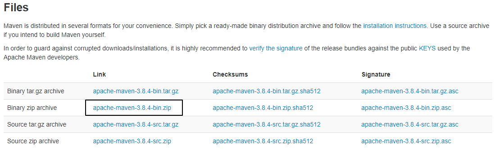

具体下载地址：https://dlcdn.apache.org/maven/maven-3/3.8.4/binaries/apache-maven-3.8.4-bin.zip

### [#](http://heavy_code_industry.gitee.io/code_heavy_industry/pro002-maven/chapter02/verse01.html#_2、解压maven核心程序)2、解压Maven核心程序

核心程序压缩包：apache-maven-3.8.4-bin.zip，解压到**非中文、没有空格**的目录。例如：


在解压目录中，我们需要着重关注 Maven 的核心配置文件：**conf/settings.xml**

### [#](http://heavy_code_industry.gitee.io/code_heavy_industry/pro002-maven/chapter02/verse01.html#_3、指定本地仓库)3、指定本地仓库

本地仓库默认值：用户家目录/.m2/repository。由于本地仓库的默认位置是在用户的家目录下，而家目录往往是在 C 盘，也就是系统盘。将来 Maven 仓库中 jar 包越来越多，仓库体积越来越大，可能会拖慢 C 盘运行速度，影响系统性能。所以建议将 Maven 的本地仓库放在其他盘符下。配置方式如下：

```xml
<!-- localRepository
| The path to the local repository maven will use to store artifacts.
|
| Default: ${user.home}/.m2/repository
<localRepository>/path/to/local/repo</localRepository>
-->
<localRepository>D:\maven-repository</localRepository>
```

本地仓库这个目录，我们手动创建一个空的目录即可。

**记住**：一定要把 localRepository 标签**从注释中拿出来**。

**注意**：本地仓库本身也需要使用一个**非中文、没有空格**的目录。

### [#](http://heavy_code_industry.gitee.io/code_heavy_industry/pro002-maven/chapter02/verse01.html#_4、配置阿里云提供的镜像仓库)4、配置阿里云提供的镜像仓库

Maven 下载 jar 包默认访问境外的中央仓库，而国外网站速度很慢。改成阿里云提供的镜像仓库，**访问国内网站**，可以让 Maven 下载 jar 包的时候速度更快。配置的方式是：

#### [#](http://heavy_code_industry.gitee.io/code_heavy_industry/pro002-maven/chapter02/verse01.html#_1将原有的例子配置注释掉)①将原有的例子配置注释掉

```xml
<!-- <mirror>
  <id>maven-default-http-blocker</id>
  <mirrorOf>external:http:*</mirrorOf>
  <name>Pseudo repository to mirror external repositories initially using HTTP.</name>
  <url>http://0.0.0.0/</url>
  <blocked>true</blocked>
</mirror> -->
```

#### [#](http://heavy_code_industry.gitee.io/code_heavy_industry/pro002-maven/chapter02/verse01.html#_2加入我们的配置)②加入我们的配置

将下面 mirror 标签整体复制到 settings.xml 文件的 mirrors 标签的内部。

```xml
	<mirror>
		<id>nexus-aliyun</id>
		<mirrorOf>central</mirrorOf>
		<name>Nexus aliyun</name>
		<url>http://maven.aliyun.com/nexus/content/groups/public</url>
	</mirror>
```

### [#](http://heavy_code_industry.gitee.io/code_heavy_industry/pro002-maven/chapter02/verse01.html#_5、配置-maven-工程的基础-jdk-版本)5、配置 Maven 工程的基础 JDK 版本

如果按照默认配置运行，Java 工程使用的默认 JDK 版本是 1.5，而我们熟悉和常用的是 JDK 1.8 版本。修改配置的方式是：将 profile 标签整个复制到 settings.xml 文件的 profiles 标签内。

```xml
	<profile>
	  <id>jdk-1.8</id>
	  <activation>
		<activeByDefault>true</activeByDefault>
		<jdk>1.8</jdk>
	  </activation>
	  <properties>
		<maven.compiler.source>1.8</maven.compiler.source>
		<maven.compiler.target>1.8</maven.compiler.target>
		<maven.compiler.compilerVersion>1.8</maven.compiler.compilerVersion>
	  </properties>
	</profile>
```

## 第二节 配置环境变量

### [#](http://heavy_code_industry.gitee.io/code_heavy_industry/pro002-maven/chapter02/verse02.html#_1、检查-java-home-配置是否正确)1、检查 JAVA_HOME 配置是否正确

Maven 是一个用 Java 语言开发的程序，它必须基于 JDK 来运行，需要通过 JAVA_HOME 来找到 JDK 的安装位置。


可以使用下面的命令验证：

```shell
C:\Users\Administrator>echo %JAVA_HOME%
D:\software\Java

C:\Users\Administrator>java -version
java version "1.8.0_141"
Java(TM) SE Runtime Environment (build 1.8.0_141-b15)
Java HotSpot(TM) 64-Bit Server VM (build 25.141-b15, mixed mode)
```

### [#](http://heavy_code_industry.gitee.io/code_heavy_industry/pro002-maven/chapter02/verse02.html#_2、配置-maven-home)2、配置 MAVEN_HOME

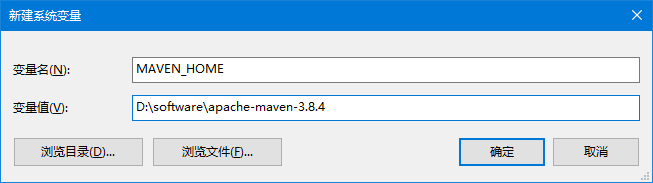

> TIP
>
> 配置环境变量的规律：
>
> ​	XXX_HOME 通常指向的是 bin 目录的上一级
>
> ​	PATH 指向的是 bin 目录


### [#](http://heavy_code_industry.gitee.io/code_heavy_industry/pro002-maven/chapter02/verse02.html#_3、配置path)3、配置PATH


### [#](http://heavy_code_industry.gitee.io/code_heavy_industry/pro002-maven/chapter02/verse02.html#_4、验证)4、验证

```bash
C:\Users\Administrator>mvn -v
Apache Maven 3.8.4 (9b656c72d54e5bacbed989b64718c159fe39b537)
Maven home: D:\software\apache-maven-3.8.4
Java version: 1.8.0_141, vendor: Oracle Corporation, runtime: D:\software\Java\jre
Default locale: zh_CN, platform encoding: GBK
OS name: "windows 10", version: "10.0", arch: "amd64", family: "windows"
```

# 第三章 使用 Maven：命令行环境

## 第一节 实验一：根据坐标创建 Maven 工程

### [#](http://heavy_code_industry.gitee.io/code_heavy_industry/pro002-maven/chapter03/verse01.html#_1、maven-核心概念-坐标)1、Maven 核心概念：坐标

#### [#](http://heavy_code_industry.gitee.io/code_heavy_industry/pro002-maven/chapter03/verse01.html#_1数学中的坐标)①数学中的坐标


使用 x、y、z 三个**『向量』**作为空间的坐标系，可以在**『空间』**中唯一的定位到一个**『点』**。

#### [#](http://heavy_code_industry.gitee.io/code_heavy_industry/pro002-maven/chapter03/verse01.html#_2maven中的坐标)②Maven中的坐标

##### [#](http://heavy_code_industry.gitee.io/code_heavy_industry/pro002-maven/chapter03/verse01.html#_1-向量说明)[1]向量说明

使用三个**『向量』**在**『Maven的仓库』**中**唯一**的定位到一个**『jar』**包。

- **groupId**：公司或组织的 id
- **artifactId**：一个项目或者是项目中的一个模块的 id
- **version**：版本号

##### [#](http://heavy_code_industry.gitee.io/code_heavy_industry/pro002-maven/chapter03/verse01.html#_2-三个向量的取值方式)[2]三个向量的取值方式

- groupId：公司或组织域名的倒序，通常也会加上项目名称
  - 例如：com.atguigu.maven
- artifactId：模块的名称，将来作为 Maven 工程的工程名
- version：模块的版本号，根据自己的需要设定
  - 例如：SNAPSHOT 表示快照版本，正在迭代过程中，不稳定的版本
  - 例如：RELEASE 表示正式版本

举例：

- groupId：com.atguigu.maven
- artifactId：pro01-atguigu-maven
- version：1.0-SNAPSHOT

#### [#](http://heavy_code_industry.gitee.io/code_heavy_industry/pro002-maven/chapter03/verse01.html#_3坐标和仓库中-jar-包的存储路径之间的对应关系)③坐标和仓库中 jar 包的存储路径之间的对应关系

坐标：

```xml
  <groupId>javax.servlet</groupId>
  <artifactId>servlet-api</artifactId>
  <version>2.5</version>
```

上面坐标对应的 jar 包在 Maven 本地仓库中的位置：

```text
Maven本地仓库根目录\javax\servlet\servlet-api\2.5\servlet-api-2.5.jar
```

一定要学会根据坐标到本地仓库中找到对应的 jar 包。

### [#](http://heavy_code_industry.gitee.io/code_heavy_industry/pro002-maven/chapter03/verse01.html#_2、实验操作)2、实验操作

#### [#](http://heavy_code_industry.gitee.io/code_heavy_industry/pro002-maven/chapter03/verse01.html#_1创建目录作为后面操作的工作空间)①创建目录作为后面操作的工作空间

例如：`D:\maven-workspace\space201026`

WARNING

此时我们已经有了三个目录，分别是：

- Maven 核心程序：中军大帐
- Maven 本地仓库：兵营
- 本地工作空间：战场

#### [#](http://heavy_code_industry.gitee.io/code_heavy_industry/pro002-maven/chapter03/verse01.html#_2在工作空间目录下打开命令行窗口)②在工作空间目录下打开命令行窗口

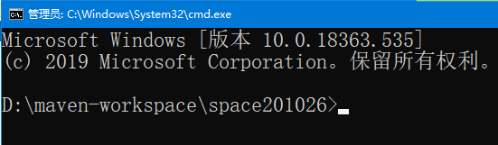

#### [#](http://heavy_code_industry.gitee.io/code_heavy_industry/pro002-maven/chapter03/verse01.html#_3使用命令生成maven工程)③使用命令生成Maven工程


运行 **`mvn archetype:generate`** 命令

下面根据提示操作

> TIP
>
> Choose a number or apply filter (format: [groupId:]artifactId, case sensitive contains): 7:*【直接回车，使用默认值】*
>
> Define value for property 'groupId': *com.atguigu.maven*
>
> Define value for property 'artifactId': *pro01-maven-java*
>
> Define value for property 'version' 1.0-SNAPSHOT: :*【直接回车，使用默认值】*
>
> Define value for property 'package' com.atguigu.maven: :*【直接回车，使用默认值】*
>
> Confirm properties configuration: groupId: com.atguigu.maven artifactId: pro01-maven-java version: 1.0-SNAPSHOT package: com.atguigu.maven Y: :*【直接回车，表示确认。如果前面有输入错误，想要重新输入，则输入 N 再回车。】*

#### [#](http://heavy_code_industry.gitee.io/code_heavy_industry/pro002-maven/chapter03/verse01.html#_4调整)④调整

Maven 默认生成的工程，对 junit 依赖的是较低的 3.8.1 版本，我们可以改成较适合的 4.12 版本。

自动生成的 App.java 和 AppTest.java 可以删除。

```xml
<!-- 依赖信息配置 -->
<!-- dependencies复数标签：里面包含dependency单数标签 -->
<dependencies>
	<!-- dependency单数标签：配置一个具体的依赖 -->
	<dependency>
		<!-- 通过坐标来依赖其他jar包 -->
		<groupId>junit</groupId>
		<artifactId>junit</artifactId>
		<version>4.12</version>
		
		<!-- 依赖的范围 -->
		<scope>test</scope>
	</dependency>
</dependencies>
```

#### [#](http://heavy_code_industry.gitee.io/code_heavy_industry/pro002-maven/chapter03/verse01.html#_5自动生成的-pom-xml-解读)⑤自动生成的 pom.xml 解读

```xml
  <!-- 当前Maven工程的坐标 -->
  <groupId>com.atguigu.maven</groupId>
  <artifactId>pro01-maven-java</artifactId>
  <version>1.0-SNAPSHOT</version>
  
  <!-- 当前Maven工程的打包方式，可选值有下面三种： -->
  <!-- jar：表示这个工程是一个Java工程  -->
  <!-- war：表示这个工程是一个Web工程 -->
  <!-- pom：表示这个工程是“管理其他工程”的工程 -->
  <packaging>jar</packaging>

  <name>pro01-maven-java</name>
  <url>http://maven.apache.org</url>

  <properties>
	<!-- 工程构建过程中读取源码时使用的字符集 -->
    <project.build.sourceEncoding>UTF-8</project.build.sourceEncoding>
  </properties>

  <!-- 当前工程所依赖的jar包 -->
  <dependencies>
	<!-- 使用dependency配置一个具体的依赖 -->
    <dependency>
	
	  <!-- 在dependency标签内使用具体的坐标依赖我们需要的一个jar包 -->
      <groupId>junit</groupId>
      <artifactId>junit</artifactId>
      <version>4.12</version>
	  
	  <!-- scope标签配置依赖的范围 -->
      <scope>test</scope>
    </dependency>
  </dependencies>
```

### [#](http://heavy_code_industry.gitee.io/code_heavy_industry/pro002-maven/chapter03/verse01.html#_3、maven核心概念-pom)3、Maven核心概念：POM

#### [#](http://heavy_code_industry.gitee.io/code_heavy_industry/pro002-maven/chapter03/verse01.html#_1含义)①含义

POM：**P**roject **O**bject **M**odel，项目对象模型。和 POM 类似的是：DOM（Document Object Model），文档对象模型。它们都是模型化思想的具体体现。

#### [#](http://heavy_code_industry.gitee.io/code_heavy_industry/pro002-maven/chapter03/verse01.html#_2模型化思想)②模型化思想

POM 表示将工程抽象为一个模型，再用程序中的对象来描述这个模型。这样我们就可以用程序来管理项目了。我们在开发过程中，最基本的做法就是将现实生活中的事物抽象为模型，然后封装模型相关的数据作为一个对象，这样就可以在程序中计算与现实事物相关的数据。

#### [#](http://heavy_code_industry.gitee.io/code_heavy_industry/pro002-maven/chapter03/verse01.html#_3对应的配置文件)③对应的配置文件

POM 理念集中体现在 Maven 工程根目录下 **pom.xml** 这个配置文件中。所以这个 pom.xml 配置文件就是 Maven 工程的核心配置文件。其实学习 Maven 就是学这个文件怎么配置，各个配置有什么用。

### [#](http://heavy_code_industry.gitee.io/code_heavy_industry/pro002-maven/chapter03/verse01.html#_4、maven核心概念-约定的目录结构)4、Maven核心概念：约定的目录结构

#### [#](http://heavy_code_industry.gitee.io/code_heavy_industry/pro002-maven/chapter03/verse01.html#_1各个目录的作用)①各个目录的作用


另外还有一个 target 目录专门存放构建操作输出的结果。

#### [#](http://heavy_code_industry.gitee.io/code_heavy_industry/pro002-maven/chapter03/verse01.html#_2约定目录结构的意义)②约定目录结构的意义

Maven 为了让构建过程能够尽可能自动化完成，所以必须约定目录结构的作用。例如：Maven 执行编译操作，必须先去 Java 源程序目录读取 Java 源代码，然后执行编译，最后把编译结果存放在 target 目录。

#### [#](http://heavy_code_industry.gitee.io/code_heavy_industry/pro002-maven/chapter03/verse01.html#_3约定大于配置)③约定大于配置

Maven 对于目录结构这个问题，没有采用配置的方式，而是基于约定。这样会让我们在开发过程中非常方便。如果每次创建 Maven 工程后，还需要针对各个目录的位置进行详细的配置，那肯定非常麻烦。

目前开发领域的技术发展趋势就是：`约定大于配置，配置大于编码`。

## 第二节 实验二：在 Maven 工程中编写代码

### [#](https://heavy_code_industry.gitee.io/code_heavy_industry/pro002-maven/chapter03/verse02.html#_1、主体程序)1、主体程序


主体程序指的是被测试的程序，同时也是将来在项目中真正要使用的程序。

```java
package com.atguigu.maven;
	
public class Calculator {
	
	public int sum(int i, int j){
		return i + j;
	}
	
}
```

### [#](https://heavy_code_industry.gitee.io/code_heavy_industry/pro002-maven/chapter03/verse02.html#_2、测试程序)2、测试程序


```java
package com.atguigu.maven;
	
import org.junit.Test;
import com.atguigu.maven.Calculator;
	
// 静态导入的效果是将Assert类中的静态资源导入当前类
// 这样一来，在当前类中就可以直接使用Assert类中的静态资源，不需要写类名
import static org.junit.Assert.*;
	
public class CalculatorTest{
	
	@Test
	public void testSum(){
		
		// 1.创建Calculator对象
		Calculator calculator = new Calculator();
		
		// 2.调用Calculator对象的方法，获取到程序运行实际的结果
		int actualResult = calculator.sum(5, 3);
		
		// 3.声明一个变量，表示程序运行期待的结果
		int expectedResult = 8;
		
		// 4.使用断言来判断实际结果和期待结果是否一致
		// 如果一致：测试通过，不会抛出异常
		// 如果不一致：抛出异常，测试失败
		assertEquals(expectedResult, actualResult);

	}
}
```

## 实验三：手动执行 Maven 的构建命令

### [#](https://heavy_code_industry.gitee.io/code_heavy_industry/pro002-maven/chapter03/verse03.html#_1、要求)1、要求

运行 Maven 中和构建操作相关的命令时，必须进入到 pom.xml 所在的目录。如果没有在 pom.xml 所在的目录运行 Maven 的构建命令，那么会看到下面的错误信息：

```java
The goal you specified requires a project to execute but there is no POM in this directory
```

> TIP
>
> `mvn -v` 命令和构建操作无关，只要正确配置了 PATH，在任何目录下执行都可以。而构建相关的命令要在 pom.xml 所在目录下运行——操作哪个工程，就进入这个工程的 pom.xml 目录。

### [#](https://heavy_code_industry.gitee.io/code_heavy_industry/pro002-maven/chapter03/verse03.html#_2、清理操作)2、清理操作`mvn clean`

`mvn clean`

效果：删除 target 目录

### [#](https://heavy_code_industry.gitee.io/code_heavy_industry/pro002-maven/chapter03/verse03.html#_3、编译操作)3、编译操作`mvn compile`、`mvn test-compile`

主程序编译：`mvn compile`

测试程序编译：`mvn test-compile`

主体程序编译结果存放的目录：target/classes

测试程序编译结果存放的目录：target/test-classes

### [#](https://heavy_code_industry.gitee.io/code_heavy_industry/pro002-maven/chapter03/verse03.html#_4、测试操作)4、测试操作`mvn test`

`mvn test`

测试的报告存放的目录：target/surefire-reports

### [#](https://heavy_code_industry.gitee.io/code_heavy_industry/pro002-maven/chapter03/verse03.html#_5、打包操作)5、打包操作`mvn package`

`mvn package`

打包的结果——jar 包，存放的目录：target

### [#](https://heavy_code_industry.gitee.io/code_heavy_industry/pro002-maven/chapter03/verse03.html#_6、安装操作)6、安装到本地仓库操作`mvn install`

`mvn install`

```log
[INFO] Installing D:\maven-workspace\space201026\pro01-maven-java\target\pro01-maven-java-1.0-SNAPSHOT.jar to D:\maven-rep1026\com\atguigu\maven\pro01-maven-java\1.0-SNAPSHOT\pro01-maven-java-1.0-SNAPSHOT.jar
[INFO] Installing D:\maven-workspace\space201026\pro01-maven-java\pom.xml to D:\maven-rep1026\com\atguigu\maven\pro01-maven-java\1.0-SNAPSHOT\pro01-maven-java-1.0-SNAPSHOT.pom
```

安装的效果是将本地构建过程中生成的 jar 包存入 Maven 本地仓库。这个 jar 包在 Maven 仓库中的路径是根据它的坐标生成的。

坐标信息如下：

```xml
  <groupId>com.atguigu.maven</groupId>
  <artifactId>pro01-maven-java</artifactId>
  <version>1.0-SNAPSHOT</version>
```

在 Maven 仓库中生成的路径如下：

```log
D:\maven-rep1026\com\atguigu\maven\pro01-maven-java\1.0-SNAPSHOT\pro01-maven-java-1.0-SNAPSHOT.jar
```

另外，安装操作还会将 pom.xml 文件转换为 XXX.pom 文件一起存入本地仓库。所以我们在 Maven 的本地仓库中想看一个 jar 包原始的 pom.xml 文件时，查看对应 XXX.pom 文件即可，它们是名字发生了改变，本质上是同一个文件。

## 实验四：创建 Maven 版的 Web 工程

### [#](https://heavy_code_industry.gitee.io/code_heavy_industry/pro002-maven/chapter03/verse04.html#_1、说明)1、说明

使用 `mvn archetype:generate` 命令生成 Web 工程时，需要使用一个专门的 archetype。这个专门生成 Web 工程骨架的 archetype 可以参照官网看到它的用法：


参数 archetypeGroupId、archetypeArtifactId、archetypeVersion 用来指定现在使用的 maven-archetype-webapp 的坐标。

### [#](https://heavy_code_industry.gitee.io/code_heavy_industry/pro002-maven/chapter03/verse04.html#_2、操作)2、操作

注意：如果在上一个工程的目录下执行 mvn archetype:generate 命令，那么 Maven 会报错：不能在一个非 pom 的工程下再创建其他工程。所以不要再刚才创建的工程里再创建新的工程，**请回到工作空间根目录**来操作。

然后运行生成工程的命令：

```bash
mvn archetype:generate -DarchetypeGroupId=org.apache.maven.archetypes -DarchetypeArtifactId=maven-archetype-webapp -DarchetypeVersion=1.4
```

下面的操作按照提示执行：

> TIP
>
> Define value for property 'groupId': com.atguigu.maven 
>
> Define value for property 'artifactId': pro02-maven-web 
>
> Define value for property 'version' 1.0-SNAPSHOT: :【直接回车，使用默认值】
>
> Define value for property 'package' com.atguigu.maven: :【直接回车，使用默认值】 Confirm properties configuration: groupId: com.atguigu.maven artifactId: pro02-maven-web version: 1.0-SNAPSHOT package: com.atguigu.maven Y: :【直接回车，表示确认】

### [#](https://heavy_code_industry.gitee.io/code_heavy_industry/pro002-maven/chapter03/verse04.html#_3、生成的pom-xml)3、生成的pom.xml

确认打包的方式是war包形式

```xml
<packaging>war</packaging>
```

### [#](https://heavy_code_industry.gitee.io/code_heavy_industry/pro002-maven/chapter03/verse04.html#_4、生成的web工程的目录结构)4、生成的Web工程的目录结构


webapp 目录下有 index.jsp

WEB-INF 目录下有 web.xml

### [#](https://heavy_code_industry.gitee.io/code_heavy_industry/pro002-maven/chapter03/verse04.html#_5、创建-servlet)5、创建 Servlet

#### [#](https://heavy_code_industry.gitee.io/code_heavy_industry/pro002-maven/chapter03/verse04.html#_1在-main-目录下创建-java-目录)①在 main 目录下创建 java 目录


#### [#](https://heavy_code_industry.gitee.io/code_heavy_industry/pro002-maven/chapter03/verse04.html#_2在-java-目录下创建-servlet-类所在的包的目录)②在 java 目录下创建 Servlet 类所在的包的目录


#### [#](https://heavy_code_industry.gitee.io/code_heavy_industry/pro002-maven/chapter03/verse04.html#_3在包下创建-servlet-类)③在包下创建 Servlet 类

```java
package com.atguigu.maven;
	
import javax.servlet.http.HttpServlet;
import javax.servlet.http.HttpServletRequest;
import javax.servlet.http.HttpServletResponse;
import javax.servlet.ServletException;
import java.io.IOException;
	
public class HelloServlet extends HttpServlet{
	
	protected void doGet(HttpServletRequest request, HttpServletResponse response) throws ServletException, IOException {
		
		response.getWriter().write("hello maven web");
		
	}
	
}
```

#### [#](https://heavy_code_industry.gitee.io/code_heavy_industry/pro002-maven/chapter03/verse04.html#_4在-web-xml-中注册-servlet)④在 web.xml 中注册 Servlet

```xml
  <servlet>
	<servlet-name>helloServlet</servlet-name>
	<servlet-class>com.atguigu.maven.HelloServlet</servlet-class>
  </servlet>
  <servlet-mapping>
	<servlet-name>helloServlet</servlet-name>
	<url-pattern>/helloServlet</url-pattern>
  </servlet-mapping>
```

### [#](https://heavy_code_industry.gitee.io/code_heavy_industry/pro002-maven/chapter03/verse04.html#_6、在-index-jsp-页面编写超链接)6、在 index.jsp 页面编写超链接

```html
<html>
<body>
<h2>Hello World!</h2>
<a href="helloServlet">Access Servlet</a>
</body>
</html>
```

> TIP
>
> JSP全称是 Java Server Page，和 Thymeleaf 一样，是服务器端页面渲染技术。这里我们不必关心 JSP 语法细节，编写一个超链接标签即可。

### [#](https://heavy_code_industry.gitee.io/code_heavy_industry/pro002-maven/chapter03/verse04.html#_7、编译)7、编译

此时直接执行 mvn compile 命令出错：

DANGER

程序包 javax.servlet.http 不存在

程序包 javax.servlet 不存在

找不到符号

符号: 类 HttpServlet

……

上面的错误信息说明：我们的 Web 工程用到了 HttpServlet 这个类，而 HttpServlet 这个类属于 servlet-api.jar 这个 jar 包。此时我们说，Web 工程需要依赖 servlet-api.jar 包。


### [#](https://heavy_code_industry.gitee.io/code_heavy_industry/pro002-maven/chapter03/verse04.html#_8、配置对-servlet-api-jar-包的依赖)8、配置对 servlet-api.jar 包的依赖

对于不知道详细信息的依赖可以到https://mvnrepository.com/网站查询。使用关键词搜索，然后在搜索结果列表中选择适合的使用。


比如，我们找到的 servlet-api 的依赖信息：

```xml
<!-- https://mvnrepository.com/artifact/javax.servlet/javax.servlet-api -->
<dependency>
    <groupId>javax.servlet</groupId>
    <artifactId>javax.servlet-api</artifactId>
    <version>3.1.0</version>
    <scope>provided</scope>
</dependency>
```

这样就可以把上面的信息加入 pom.xml。重新执行 mvn compile 命令。

### [#](https://heavy_code_industry.gitee.io/code_heavy_industry/pro002-maven/chapter03/verse04.html#_9、将-web-工程打包为-war-包)9、将 Web 工程打包为 war 包

运行 mvn package 命令，生成 war 包的位置如下图所示：

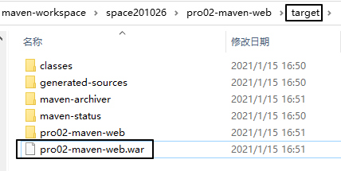

### [#](https://heavy_code_industry.gitee.io/code_heavy_industry/pro002-maven/chapter03/verse04.html#_10、将-war-包部署到-tomcat-上运行)10、将 war 包部署到 Tomcat 上运行

将 war 包复制到 Tomcat/webapps 目录下


启动 Tomcat：

访问：http://localhost/pro02-maven-web/

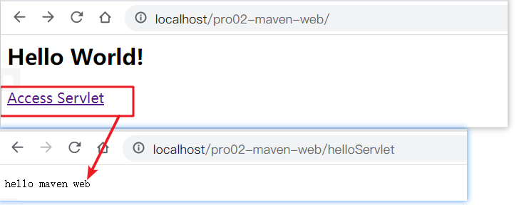

## 实验五：让 Web 工程依赖 Java 工程

### [#](https://heavy_code_industry.gitee.io/code_heavy_industry/pro002-maven/chapter03/verse05.html#_1、观念)1、观念

明确一个意识：从来只有 Web 工程依赖 Java 工程，没有反过来 Java 工程依赖 Web 工程。本质上来说，Web 工程依赖的 Java 工程其实就是 Web 工程里导入的 jar 包。最终 Java 工程会变成 jar 包，放在 Web 工程的 WEB-INF/lib 目录下。

### [#](https://heavy_code_industry.gitee.io/code_heavy_industry/pro002-maven/chapter03/verse05.html#_2、操作)2、操作

在 pro02-maven-web 工程的 pom.xml 中，找到 dependencies 标签，在 dependencies 标签中做如下配置：

```xml
<!-- 配置对Java工程pro01-maven-java的依赖 -->
<!-- 具体的配置方式：在dependency标签内使用坐标实现依赖 -->
<dependency>
	<groupId>com.atguigu.maven</groupId>
	<artifactId>pro01-maven-java</artifactId>
	<version>1.0-SNAPSHOT</version>
</dependency>
```

### [#](https://heavy_code_industry.gitee.io/code_heavy_industry/pro002-maven/chapter03/verse05.html#_3、在-web-工程中-编写测试代码)3、在 Web 工程中，编写测试代码

#### [#](https://heavy_code_industry.gitee.io/code_heavy_industry/pro002-maven/chapter03/verse05.html#_1补充创建目录)①补充创建目录

pro02-maven-web**\src\test\java\com\atguigu\maven**

#### [#](https://heavy_code_industry.gitee.io/code_heavy_industry/pro002-maven/chapter03/verse05.html#_2确认-web-工程依赖了-junit)②确认 Web 工程依赖了 junit

```xml
    <dependency>
      <groupId>junit</groupId>
      <artifactId>junit</artifactId>
      <version>4.12</version>
      <scope>test</scope>
    </dependency>
```

#### [#](https://heavy_code_industry.gitee.io/code_heavy_industry/pro002-maven/chapter03/verse05.html#_3创建测试类)③创建测试类

把 Java 工程的 CalculatorTest.java 类复制到 pro02-maven-wb**\src\test\java\com\atguigu\maven** 目录下

### [#](https://heavy_code_industry.gitee.io/code_heavy_industry/pro002-maven/chapter03/verse05.html#_4、执行maven命令)4、执行Maven命令

#### [#](https://heavy_code_industry.gitee.io/code_heavy_industry/pro002-maven/chapter03/verse05.html#_1测试命令)①测试命令

mvn test

说明：测试操作中会提前自动执行编译操作，测试成功就说明编译也是成功的。

#### [#](https://heavy_code_industry.gitee.io/code_heavy_industry/pro002-maven/chapter03/verse05.html#_2打包命令)②打包命令

mvn package


通过查看 war 包内的结构，我们看到被 Web 工程依赖的 Java 工程确实是会变成 Web 工程的 WEB-INF/lib 目录下的 jar 包。

![./images]()

#### [#](https://heavy_code_industry.gitee.io/code_heavy_industry/pro002-maven/chapter03/verse05.html#_3查看当前-web-工程所依赖的-jar-包的列表)③查看当前 Web 工程所依赖的 jar 包的列表

`mvn dependency:list`

> TIP
>
> [INFO] The following files have been resolved:
> [INFO] org.hamcrest:hamcrest-core:jar:1.3:test
> [INFO] javax.servlet:javax.servlet-api:jar:3.1.0:provided
> [INFO] com.atguigu.maven:pro01-maven-java:jar:1.0-SNAPSHOT:compile
> [INFO] junit:junit:jar:4.12:test

说明：javax.servlet:javax.servlet-api:jar:3.1.0:provided 格式显示的是一个 jar 包的坐标信息。格式是：

> TIP
>
> groupId:artifactId:打包方式:version:依赖的范围
>

这样的格式虽然和我们 XML 配置文件中坐标的格式不同，但是本质上还是坐标信息，大家需要能够认识这样的格式，将来从 Maven 命令的日志或错误信息中看到这样格式的信息，就能够识别出来这是坐标。进而根据坐标到Maven 仓库找到对应的jar包，用这样的方式解决我们遇到的报错的情况。

#### [#](https://heavy_code_industry.gitee.io/code_heavy_industry/pro002-maven/chapter03/verse05.html#_4以树形结构查看当前-web-工程的依赖信息)④以树形结构查看当前 Web 工程的依赖信息

`mvn dependency:tree`

> TIP
>
> [INFO] com.atguigu.maven:pro02-maven-web:war:1.0-SNAPSHOT
> [INFO] +- junit:junit:jar:4.12:test
> [INFO] | \- org.hamcrest:hamcrest-core:jar:1.3:test
> [INFO] +- javax.servlet:javax.servlet-api:jar:3.1.0:provided
> [INFO] \- com.atguigu.maven:pro01-maven-java:jar:1.0-SNAPSHOT:compile

我们在 pom.xml 中并没有依赖 hamcrest-core，但是它却被加入了我们依赖的列表。原因是：junit 依赖了hamcrest-core，然后基于依赖的传递性，hamcrest-core 被传递到我们的工程了。

## 实验六：测试依赖的范围

### [#](https://heavy_code_industry.gitee.io/code_heavy_industry/pro002-maven/chapter03/verse06.html#_1、依赖范围)1、依赖范围

标签的位置：dependencies/dependency/**scope**

标签的可选值：**compile**/**test**/**provided**/system/runtime/**import**

#### [#](https://heavy_code_industry.gitee.io/code_heavy_industry/pro002-maven/chapter03/verse06.html#_1compile-和-test-对比)①compile 和 test 对比

|         | main目录（空间） | test目录（空间） | 开发过程（时间） | 部署到服务器（时间） |
| ------- | ---------------- | ---------------- | ---------------- | -------------------- |
| compile | 有效             | 有效             | 有效             | 有效                 |
| test    | 无效             | 有效             | 有效             | 无效                 |

#### [#](https://heavy_code_industry.gitee.io/code_heavy_industry/pro002-maven/chapter03/verse06.html#_2compile-和-provided-对比)②compile 和 provided 对比

|          | main目录（空间） | test目录（空间） | 开发过程（时间） | 部署到服务器（时间） |
| -------- | ---------------- | ---------------- | ---------------- | -------------------- |
| compile  | 有效             | 有效             | 有效             | 有效                 |
| provided | 有效             | 有效             | 有效             | 无效                 |

#### [#](https://heavy_code_industry.gitee.io/code_heavy_industry/pro002-maven/chapter03/verse06.html#_3结论)③结论

`compile`：通常使用的第三方框架的 jar 包这样在项目实际运行时真正要用到的 jar 包都是以 compile 范围进行依赖的。比如 SSM 框架所需jar包。

`test`：测试过程中使用的 jar 包，以 test 范围依赖进来。比如 junit。

`provided`：在开发过程中需要用到的“服务器上的 jar 包”通常以 provided 范围依赖进来。比如 servlet-api、jsp-api。而这个范围的 jar 包之所以不参与部署、不放进 war 包，就是避免和服务器上已有的同类 jar 包产生冲突，同时减轻服务器的负担。说白了就是：“**服务器上已经有了，你就别带啦！**”

### [#](https://heavy_code_industry.gitee.io/code_heavy_industry/pro002-maven/chapter03/verse06.html#_2、测试)2、测试

#### [#](https://heavy_code_industry.gitee.io/code_heavy_industry/pro002-maven/chapter03/verse06.html#_1验证-compile-范围对-main-目录有效)①验证 compile 范围对 main 目录有效

> TIP
>
> main目录下的类：HelloServlet 使用compile范围导入的依赖：pro01-atguigu-maven
>
> 验证：使用compile范围导入的依赖对main目录下的类来说是有效的
>
> 有效：HelloServlet 能够导入使用 pro01-atguigu-maven 工程中的 Calculator 类
>
> **验证方式：在 HelloServlet 类中`import com.atguigu.maven.Calculator` 类，然后编译通过就说明有效。**

```java
// 在main空间导入scope周期的 pro01-atguigu-maven【compile】 jar包里面的Calculator
import com.atguigu.maven.Calculator
```

#### [#](https://heavy_code_industry.gitee.io/code_heavy_industry/pro002-maven/chapter03/verse06.html#_2验证test范围对main目录无效)②验证test范围对main目录无效

测试方式：在主体程序中导入`org.junit.Test`这个注解，然后执行编译。

具体操作：在pro01-maven-java\src\main\java\com\atguigu\maven目录下修改Calculator.java

```java
package com.atguigu.maven;

// @Test  注解是junit包里面的，scope是test，在main空间中导入验证是否对main空间有效
// 在main空间导入scope周期的 junit【test】 jar包里面的Test
import org.junit.Test;

public class Calculator {
	
	public int sum(int i, int j){
		return i + j;
	}
	
}
```

执行Maven编译命令：

```java
[ERROR] /D:/maven-workspace/space201026/pro01-maven-java/src/main/java/com/atguigu/maven/Calculator.java:[3,17] 程序包org.junit不存在
```

#### [#](https://heavy_code_industry.gitee.io/code_heavy_industry/pro002-maven/chapter03/verse06.html#_3验证test和provided范围不参与服务器部署)③验证test和provided范围不参与服务器部署

其实就是验证：**通过compile范围依赖的jar包会放入war包，通过test范围依赖的jar包不会放入war包。**


#### [#](https://heavy_code_industry.gitee.io/code_heavy_industry/pro002-maven/chapter03/verse06.html#_4验证provided范围对测试程序有效)④验证provided范围对测试程序有效

测试方式是在pro02-maven-web的测试程序中加入servlet-api.jar包中的类。

修改：`pro02-maven-web\src\test\java\com\atguigu\maven\CalculatorTest.java`

```java
package com.atguigu.maven;

import javax.servlet.http.HttpServlet;
import javax.servlet.http.HttpServletRequest;
import javax.servlet.http.HttpServletResponse;
import javax.servlet.ServletException;

import org.junit.Test;
import com.atguigu.maven.Calculator;

// 静态导入的效果是将Assert类中的静态资源导入当前类
// 这样一来，在当前类中就可以直接使用Assert类中的静态资源，不需要写类名
import static org.junit.Assert.*;

public class CalculatorTest{
	
	@Test
	public void testSum(){
		
		// 1.创建Calculator对象
		Calculator calculator = new Calculator();
		
		// 2.调用Calculator对象的方法，获取到程序运行实际的结果
		int actualResult = calculator.sum(5, 3);
		
		// 3.声明一个变量，表示程序运行期待的结果
		int expectedResult = 8;
		
		// 4.使用断言来判断实际结果和期待结果是否一致
		// 如果一致：测试通过，不会抛出异常
		// 如果不一致：抛出异常，测试失败
		assertEquals(expectedResult, actualResult);
		
	}
	
}
```

然后运行Maven的编译命令：mvn compile

然后看到编译成功。

## 实验七：测试依赖的传递性

### [#](https://heavy_code_industry.gitee.io/code_heavy_industry/pro002-maven/chapter03/verse07.html#_1、依赖的传递性)1、依赖的传递性

#### [#](https://heavy_code_industry.gitee.io/code_heavy_industry/pro002-maven/chapter03/verse07.html#_1概念)①概念

A 依赖 B，B 依赖 C，那么在 A 没有配置对 C 的依赖的情况下，A 里面能不能直接使用 C？

#### [#](https://heavy_code_industry.gitee.io/code_heavy_industry/pro002-maven/chapter03/verse07.html#_2传递的原则)②传递的原则

在 A 依赖 B，B 依赖 C 的前提下，C 是否能够传递到 A，取决于 B 依赖 C 时使用的依赖范围。

- B 依赖 C 时使用 compile 范围：可以传递
- B 依赖 C 时使用 test 或 provided 范围：不能传递，所以需要这样的 jar 包时，就必须在需要的地方明确配置依赖才可以。

### [#](https://heavy_code_industry.gitee.io/code_heavy_industry/pro002-maven/chapter03/verse07.html#_2、使用-compile-范围依赖-spring-core)2、使用 compile 范围依赖 spring-core

测试方式：让 pro01-maven-java 工程依赖 spring-core

具体操作：编辑 pro01-maven-java 工程根目录下 pom.xml

```xml
<!-- https://mvnrepository.com/artifact/org.springframework/spring-core -->
<dependency>
	<groupId>org.springframework</groupId>
	<artifactId>spring-core</artifactId>
	<version>4.0.0.RELEASE</version>
</dependency>
```

使用 mvn dependency:tree 命令查看效果：

> TIP
>
> [INFO] com.atguigu.maven:pro01-maven-java:jar:1.0-SNAPSHOT
> [INFO] +- junit:junit:jar:4.12:test
> [INFO] | \- org.hamcrest:hamcrest-core:jar:1.3:test
>
> <u>[INFO] \- org.springframework:spring-core:jar:4.0.0.RELEASE:compile
> [INFO] \- commons-logging:commons-logging:jar:1.1.1:compile</u>


（ps：需要重新将 pro01-maven-java 安装到仓库【mvn install】）


还可以在 Web 工程【pro02-maven-web】中，使用 mvn dependency:tree 命令查看效果

> TIP
>
> [INFO] com.atguigu.maven:pro02-maven-web:war:1.0-SNAPSHOT
> [INFO] +- junit:junit:jar:4.12:test
> [INFO] | \- org.hamcrest:hamcrest-core:jar:1.3:test
> [INFO] +- javax.servlet:javax.servlet-api:jar:3.1.0:provided
>
> <u>[INFO] \- com.atguigu.maven:pro01-maven-java:jar:1.0-SNAPSHOT:compile
> [INFO] \- org.springframework:spring-core:jar:4.0.0.RELEASE:compile
> [INFO] \- commons-logging:commons-logging:jar:1.1.1:compile</u>

### [#](https://heavy_code_industry.gitee.io/code_heavy_industry/pro002-maven/chapter03/verse07.html#_3、验证-test-和-provided-范围不能传递)3、验证 test 和 provided 范围不能传递

从上面的例子已经能够看到，pro01-maven-java 依赖了 junit，但是在 pro02-maven-web 工程中查看依赖树的时候并没有看到 junit。

要验证 provided 范围不能传递，可以在 pro01-maven-java 工程中加入 servlet-api 的依赖。

```xml
<dependency>
	<groupId>javax.servlet</groupId>
	<artifactId>javax.servlet-api</artifactId>
	<version>3.1.0</version>
	<scope>provided</scope>
</dependency>
```

效果还是和之前一样：

> TIP
>
> [INFO] com.atguigu.maven:pro02-maven-web:war:1.0-SNAPSHOT
> [INFO] +- junit:junit:jar:4.12:test
> [INFO] | \- org.hamcrest:hamcrest-core:jar:1.3:test
> [INFO] +- javax.servlet:javax.servlet-api:jar:3.1.0:provided
> [INFO] \- com.atguigu.maven:pro01-maven-java:jar:1.0-SNAPSHOT:compile
> [INFO] \- org.springframework:spring-core:jar:4.0.0.RELEASE:compile
> [INFO] \- commons-logging:commons-logging:jar:1.1.1:compile

## 第八节 实验八：测试依赖的排除

### [#](http://heavy_code_industry.gitee.io/code_heavy_industry/pro002-maven/chapter03/verse08.html#_1、概念)1、概念

当 A 依赖 B，B 依赖 C 而且 C 可以传递到 A 的时候，A 不想要 C，需要在 A 里面把 C 排除掉。而往往这种情况都是为了避免 jar 包之间的冲突。


所以配置依赖的排除其实就是阻止某些 jar 包的传递。因为这样的 jar 包传递过来会和其他 jar 包冲突。

### [#](http://heavy_code_industry.gitee.io/code_heavy_industry/pro002-maven/chapter03/verse08.html#_2、配置方式)2、配置方式

```xml
<dependency>
	<groupId>com.atguigu.maven</groupId>
	<artifactId>pro01-maven-java</artifactId>
	<version>1.0-SNAPSHOT</version>
	<scope>compile</scope>
	<!-- 使用excludes标签配置依赖的排除	-->
	<exclusions>
		<!-- 在exclude标签中配置一个具体的排除 -->
		<exclusion>
			<!-- 指定要排除的依赖的坐标（不需要写version） -->
			<groupId>commons-logging</groupId>
			<artifactId>commons-logging</artifactId>
		</exclusion>
	</exclusions>
</dependency>
```

### [#](http://heavy_code_industry.gitee.io/code_heavy_industry/pro002-maven/chapter03/verse08.html#_3、测试)3、测试

测试的方式：在 pro02-maven-web 工程中配置对 commons-logging 的排除

```xml
<dependency>
	<groupId>com.atguigu.maven</groupId>
	<artifactId>pro01-maven-java</artifactId>
	<version>1.0-SNAPSHOT</version>
	<scope>compile</scope>
	<!-- 使用excludes标签配置依赖的排除	-->
	<exclusions>
		<!-- 在exclude标签中配置一个具体的排除 -->
		<exclusion>
			<!-- 指定要排除的依赖的坐标（不需要写version） -->
			<groupId>commons-logging</groupId>
			<artifactId>commons-logging</artifactId>
		</exclusion>
	</exclusions>
</dependency>
```

运行 mvn dependency:tree 命令查看效果：

> TIP
>
> [INFO] com.atguigu.maven:pro02-maven-web:war:1.0-SNAPSHOT
> [INFO] +- junit:junit:jar:4.12:test
> [INFO] | \- org.hamcrest:hamcrest-core:jar:1.3:test
> [INFO] +- javax.servlet:javax.servlet-api:jar:3.1.0:provided
>
> <u>[INFO] \- com.atguigu.maven:pro01-maven-java:jar:1.0-SNAPSHOT:compile
> [INFO] \- org.springframework:spring-core:jar:4.0.0.RELEASE:compile</u>

发现在 spring-core 下面就没有 commons-logging 了。

## 第九节 实验九：继承

### [#](http://heavy_code_industry.gitee.io/code_heavy_industry/pro002-maven/chapter03/verse09.html#_1、概念)1、概念

Maven工程之间，A 工程继承 B 工程

- B 工程：父工程
- A 工程：子工程

本质上是 A 工程的 pom.xml 中的配置继承了 B 工程中 pom.xml 的配置。

### [#](http://heavy_code_industry.gitee.io/code_heavy_industry/pro002-maven/chapter03/verse09.html#_2、作用)2、作用

在父工程中统一管理项目中的依赖信息，具体来说是管理依赖信息的版本。

它的背景是：

- 对一个比较大型的项目进行了模块拆分。
- 一个 project 下面，创建了很多个 module。
- 每一个 module 都需要配置自己的依赖信息。

它背后的需求是：

- 在每一个 module 中各自维护各自的依赖信息很容易发生出入，不易统一管理。
- 使用同一个框架内的不同 jar 包，它们应该是同一个版本，所以整个项目中使用的框架版本需要统一。
- 使用框架时所需要的 jar 包组合（或者说依赖信息组合）需要经过长期摸索和反复调试，最终确定一个可用组合。这个耗费很大精力总结出来的方案不应该在新的项目中重新摸索。

通过在父工程中为整个项目维护依赖信息的组合既**保证了整个项目使用规范、准确的 jar 包**；又能够将**以往的经验沉淀**下来，节约时间和精力。

### [#](http://heavy_code_industry.gitee.io/code_heavy_industry/pro002-maven/chapter03/verse09.html#_3、举例)3、举例

在一个工程中依赖多个 Spring 的 jar 包

> TIP
>
> [INFO] +- org.springframework:**spring-core**:jar:**4.0.0**.RELEASE:compile
> [INFO] | \- commons-logging:commons-logging:jar:1.1.1:compile
> [INFO] +- org.springframework:**spring-beans**:jar:**4.0.0**.RELEASE:compile
> [INFO] +- org.springframework:**spring-context**:jar:**4.0.0**.RELEASE:compile
> [INFO] +- org.springframework:**spring-expression**:jar:4.0.0.RELEASE:compile
> [INFO] +- org.springframework:**spring-aop**:jar:**4.0.0**.RELEASE:compile
> [INFO] | \- aopalliance:aopalliance:jar:1.0:compile

使用 Spring 时要求所有 Spring 自己的 jar 包版本必须一致。为了能够对这些 jar 包的版本进行统一管理，我们使用继承这个机制，将所有版本信息统一在父工程中进行管理。

### [#](http://heavy_code_industry.gitee.io/code_heavy_industry/pro002-maven/chapter03/verse09.html#_4、操作)4、操作

#### [#](http://heavy_code_industry.gitee.io/code_heavy_industry/pro002-maven/chapter03/verse09.html#_1创建父工程)①创建父工程

创建的过程和前面创建 pro01-maven-java 一样。

`mvn archetype:generate`

工程名称：pro03-maven-parent

工程创建好之后，要修改它的打包方式：

```xml
  <groupId>com.atguigu.maven</groupId>
  <artifactId>pro03-maven-parent</artifactId>
  <version>1.0-SNAPSHOT</version>

  <!-- 当前工程作为父工程，它要去管理子工程，所以打包方式必须是 pom -->
  <packaging>pom</packaging>
```

只有打包方式为 pom 的 Maven 工程能够管理其他 Maven 工程。打包方式为 pom 的 Maven 工程中不写业务代码，它是专门管理其他 Maven 工程的工程。

#### [#](http://heavy_code_industry.gitee.io/code_heavy_industry/pro002-maven/chapter03/verse09.html#_2创建模块工程)②创建模块工程

模块工程类似于 IDEA 中的 module，所以需要**进入 pro03-maven-parent 工程的根目录**，然后运行 `mvn archetype:generate` 命令来创建模块工程。

假设，我们创建三个模块工程：


#### [#](http://heavy_code_industry.gitee.io/code_heavy_industry/pro002-maven/chapter03/verse09.html#_3查看被添加新内容的父工程-pom-xml)③查看被添加新内容的父工程【pro03-maven-parent】pom.xml

下面 modules 和 module 标签是聚合功能的配置

```xml
<modules>  
	<module>pro04-maven-module</module>
	<module>pro05-maven-module</module>
	<module>pro06-maven-module</module>
</modules>
```

#### [#](http://heavy_code_industry.gitee.io/code_heavy_industry/pro002-maven/chapter03/verse09.html#_4解读子工程的pom-xml)④解读子工程的pom.xml

> 如果子工程坐标中的groupId和version与父工程一致，那么可以省略

```xml
<!-- 使用parent标签指定当前工程的父工程 -->
<parent>
	<!-- 父工程的坐标 -->
	<groupId>com.atguigu.maven</groupId>
	<artifactId>pro03-maven-parent</artifactId>
	<version>1.0-SNAPSHOT</version>
</parent>

<!-- 子工程的坐标 -->
<!-- 如果子工程坐标中的groupId和version与父工程一致，那么可以省略 -->
<!-- <groupId>com.atguigu.maven</groupId> -->
<artifactId>pro04-maven-module</artifactId>
<!-- <version>1.0-SNAPSHOT</version> -->
```

#### [#](http://heavy_code_industry.gitee.io/code_heavy_industry/pro002-maven/chapter03/verse09.html#_5在父工程中配置依赖的统一管理)⑤在父工程中配置依赖的统一管理

```xml
<!-- 使用dependencyManagement标签配置对依赖的管理 -->
<!-- 被管理的依赖并没有真正被引入到工程 -->
<!-- 注意：即使在父工程配置了对依赖的管理，子工程需要使用具体哪一个依赖还是要明确配置。-->
<!--只是统一定义版本信息，如果哪个模块需要，需要单独引入-->
<dependencyManagement>
	<dependencies>
		<dependency>
			<groupId>org.springframework</groupId>
			<artifactId>spring-core</artifactId>
			<version>4.0.0.RELEASE</version>
		</dependency>
		<dependency>
			<groupId>org.springframework</groupId>
			<artifactId>spring-beans</artifactId>
			<version>4.0.0.RELEASE</version>
		</dependency>
		<dependency>
			<groupId>org.springframework</groupId>
			<artifactId>spring-context</artifactId>
			<version>4.0.0.RELEASE</version>
		</dependency>
		<dependency>
			<groupId>org.springframework</groupId>
			<artifactId>spring-expression</artifactId>
			<version>4.0.0.RELEASE</version>
		</dependency>
		<dependency>
			<groupId>org.springframework</groupId>
			<artifactId>spring-aop</artifactId>
			<version>4.0.0.RELEASE</version>
		</dependency>
	</dependencies>
</dependencyManagement>
```

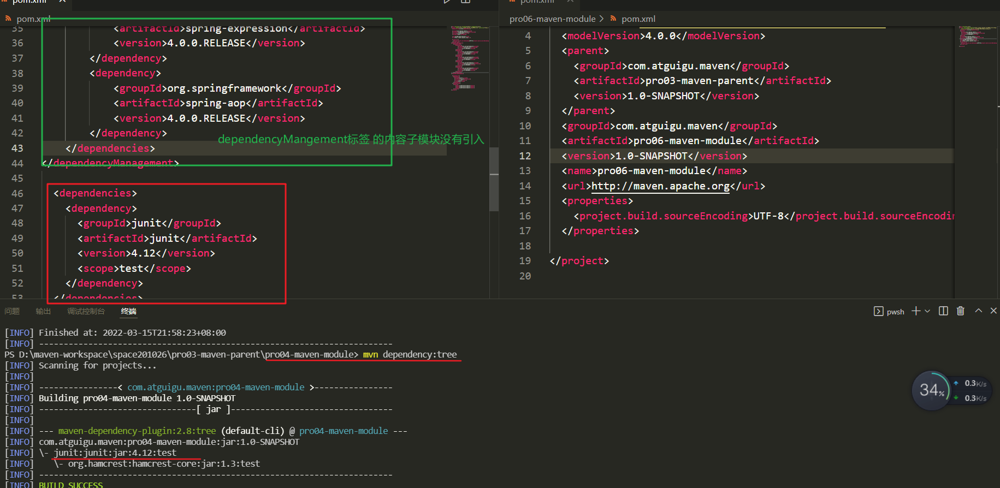

> dependencyManagement标签内的依赖子模块没有引入时，不会导入依赖


#### [#](http://heavy_code_industry.gitee.io/code_heavy_industry/pro002-maven/chapter03/verse09.html#_6子工程中引用那些被父工程管理的依赖)⑥子工程中按需引用那些被父工程管理的依赖

关键点：省略版本号

子工程可以按需导入dependencyManagement管理依赖，父工程中没有管理的依赖依然可以单独引入

```xml
<!-- 子工程引用父工程中的依赖信息时，可以把版本号去掉。	-->
<!-- 把版本号去掉就表示子工程中这个依赖的版本由父工程决定。 -->
<!-- 具体来说是由父工程的dependencyManagement来决定。 -->
<dependencies>
	<dependency>
		<groupId>org.springframework</groupId>
		<artifactId>spring-core</artifactId>
        <!--  对于父工程中进行了管理的依赖dependencyManagement，子工程中引用时可以不写version -->
        <!-- <version>4.0.0.RELEASE</version> -->
        <!--情况1确实省略了version标签：子工程采纳的就是父工程管理的版本-->
	    <!--情况2没有省略version标签：
			A：这里配置了version和父工程管理的版本一致，最终还是采纳这个版本。
			B：这里配置了version但是和父工程管理的版本不一致，那么这里子工程配置的版本会覆盖父工程管理的版本并最终采纳。
    -->    
        
        
	</dependency>
	<dependency>
		<groupId>org.springframework</groupId>
		<artifactId>spring-beans</artifactId>
	</dependency>
	<dependency>
		<groupId>org.springframework</groupId>
		<artifactId>spring-context</artifactId>
	</dependency>
	<dependency>
		<groupId>org.springframework</groupId>
		<artifactId>spring-expression</artifactId>
	</dependency>
	<dependency>
		<groupId>org.springframework</groupId>
		<artifactId>spring-aop</artifactId>
	</dependency>
</dependencies>
```

#### [#](http://heavy_code_industry.gitee.io/code_heavy_industry/pro002-maven/chapter03/verse09.html#_7在父工程中升级依赖信息的版本)⑦在父工程中升级依赖信息的版本

```xml
……
			<dependency>
				<groupId>org.springframework</groupId>
				<artifactId>spring-beans</artifactId>
				<version>4.1.4.RELEASE</version>
			</dependency>
……
```

然后在子工程中运行`mvn dependency:list`，效果如下：

> TIP
>
> [INFO] org.springframework:spring-aop:jar:4.1.4.RELEASE:compile
> [INFO] org.springframework:spring-core:jar:4.1.4.RELEASE:compile
> [INFO] org.springframework:spring-context:jar:4.1.4.RELEASE:compile
> [INFO] org.springframework:spring-beans:jar:4.1.4.RELEASE:compile
> [INFO] org.springframework:spring-expression:jar:4.1.4.RELEASE:compile

#### [#](http://heavy_code_industry.gitee.io/code_heavy_industry/pro002-maven/chapter03/verse09.html#_8在父工程中声明自定义属性)⑧在父工程中声明自定义属性

```xml
<!-- 通过自定义属性，统一指定Spring的版本 -->
<properties>
	<project.build.sourceEncoding>UTF-8</project.build.sourceEncoding>
    <maven.compiler.source>1.8</maven.compiler.source>
    <maven.compiler.target>1.8</maven.compiler.target>
	
	<!-- 自定义标签，维护Spring版本数据 -->
	<atguigu.spring.version>4.3.6.RELEASE</atguigu.spring.version>
</properties>
```

在需要的地方使用`${}`的形式来引用自定义的属性名：

```xml
<dependency>
    <groupId>org.springframework</groupId>
    <artifactId>spring-core</artifactId>
    <version>${atguigu.spring.version}</version>
</dependency>
```

真正实现“一处修改，处处生效”。

### [#](http://heavy_code_industry.gitee.io/code_heavy_industry/pro002-maven/chapter03/verse09.html#_5、实际意义)5、实际意义


编写一套符合要求、开发各种功能都能正常工作的依赖组合并不容易。如果公司里已经有人总结了成熟的组合方案，那么再开发新项目时，如果不使用原有的积累，而是重新摸索，会浪费大量的时间。为了提高效率，我们可以使用工程继承的机制，让成熟的依赖组合方案能够保留下来。

如上图所示，公司级的父工程中管理的就是成熟的依赖组合方案，各个新项目、子系统各取所需即可。

## 实验十：聚合

### [#](http://heavy_code_industry.gitee.io/code_heavy_industry/pro002-maven/chapter03/verse10.html#_1、聚合本身的含义)1、聚合本身的含义

部分组成整体


动画片《战神金刚》中的经典台词：“我来组成头部！我来组成手臂！”就是聚合关系最生动的体现。

### [#](http://heavy_code_industry.gitee.io/code_heavy_industry/pro002-maven/chapter03/verse10.html#_2、maven-中的聚合)2、Maven 中的聚合

使用一个“总工程”将各个“模块工程”汇集起来，作为一个整体对应完整的项目。

- 项目：整体
- 模块：部分

> TIP
>
> 概念的对应关系：
>
> 从继承关系角度来看：
>
> - 父工程
> - 子工程
>
> 从聚合关系角度来看：
>
> - 总工程
> - 模块工程

### [#](http://heavy_code_industry.gitee.io/code_heavy_industry/pro002-maven/chapter03/verse10.html#_3、好处)3、好处

- 一键执行 Maven 命令：很多构建命令都可以在“总工程”中一键执行。

  以 mvn install 命令为例：Maven 要求有父工程时先安装父工程；有依赖的工程时，先安装被依赖的工程。我们自己考虑这些规则会很麻烦。但是工程聚合之后，在总工程执行 mvn install 可以一键完成安装，而且会自动按照正确的顺序执行。

- 配置聚合之后，各个模块工程会在总工程中展示一个列表，让项目中的各个模块一目了然。

### [#](http://heavy_code_industry.gitee.io/code_heavy_industry/pro002-maven/chapter03/verse10.html#_4、聚合的配置)4、聚合的配置

在总工程中配置 modules 即可：

```xml
	<modules>  
		<module>pro04-maven-module</module>
		<module>pro05-maven-module</module>
		<module>pro06-maven-module</module>
	</modules>
```

### [#](http://heavy_code_industry.gitee.io/code_heavy_industry/pro002-maven/chapter03/verse10.html#_5、依赖循环问题)5、依赖循环问题

如果 A 工程依赖 B 工程，B 工程依赖 C 工程，C 工程又反过来依赖 A 工程，那么在执行构建操作时会报下面的错误：


[ERROR] [ERROR] The projects in the reactor contain a cyclic reference:

这个错误的含义是：循环引用。


# 第四章 使用Maven：IDEA环境

TIP

各个 IDEA 不同版本在具体操作方面存在一定差异，这里我们以 2019.3.3 版本为例进行演示。其它版本大家灵活变通即可。

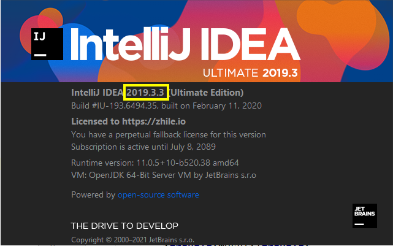

## [#](http://heavy_code_industry.gitee.io/code_heavy_industry/pro002-maven/chapter04/verse01.html#第一节-创建父工程)第一节 创建父工程

### [#](http://heavy_code_industry.gitee.io/code_heavy_industry/pro002-maven/chapter04/verse01.html#_1、创建-project)1、创建 Project


### [#](http://heavy_code_industry.gitee.io/code_heavy_industry/pro002-maven/chapter04/verse01.html#_2、开启自动导入)2、开启自动导入

创建 Project 后，IDEA 会自动弹出下面提示，我们选择**『Enable Auto-Import』**，意思是启用自动导入。


这个自动导入**一定要开启**，因为 Project、Module 新创建或 pom.xml 每次修改时都应该让 IDEA 重新加载 Maven 信息。这对 Maven 目录结构认定、Java 源程序编译、依赖 jar 包的导入都有非常关键的影响。

另外也可以通过 IDEA 的 Settings 设置来开启：


## 第二节 配置Maven信息

每次创建 Project 后都需要设置 Maven 家目录位置，否则 IDEA 将使用内置的 Maven 核心程序（不稳定）并使用默认的本地仓库位置。这样一来，我们在命令行操作过程中已下载好的 jar 包就白下载了，默认的本地仓库通常在 C 盘，还影响系统运行。

配置之后，IDEA 会根据我们在这里指定的 Maven 家目录自动识别到我们在 settings.xml 配置文件中指定的本地仓库。


## 第三节 创建Java模块工程

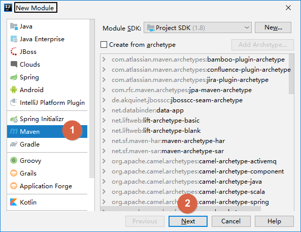


## 第四节 创建Web模块工程

### [#](http://heavy_code_industry.gitee.io/code_heavy_industry/pro002-maven/chapter04/verse04.html#_1、创建模块)1、创建模块

按照前面的同样操作创建模块，**此时**这个模块其实还是一个**Java模块**。

### [#](http://heavy_code_industry.gitee.io/code_heavy_industry/pro002-maven/chapter04/verse04.html#_2、修改打包方式)2、修改打包方式

Web 模块将来打包当然应该是 **war** 包。

```xml
<packaging>war</packaging>
```

### [#](http://heavy_code_industry.gitee.io/code_heavy_industry/pro002-maven/chapter04/verse04.html#_3、web-设定)3、Web 设定

首先打开项目结构菜单：


然后到 Facets 下查看 IDEA 是否已经帮我们自动生成了 Web 设定。正常来说只要我们确实设置了打包方式为 war，那么 IDEA 2019 版就会自动生成 Web 设定。


另外，对于 IDEA 2018 诸版本没有自动生成 Web 设定，那么请参照下面两图，我们自己创建：


### [#](http://heavy_code_industry.gitee.io/code_heavy_industry/pro002-maven/chapter04/verse04.html#_4、借助idea生成web-xml)4、借助IDEA生成web.xml

需要手动指定到   `模块路径下：src\main\webapp\WEB-INF\web.xml`


### [#](http://heavy_code_industry.gitee.io/code_heavy_industry/pro002-maven/chapter04/verse04.html#_5、设置-web-资源的根目录)5、设置 Web 资源的根目录

结合 Maven 的目录结构，Web 资源的根目录需要设置为 `src/main/webapp` 目录。


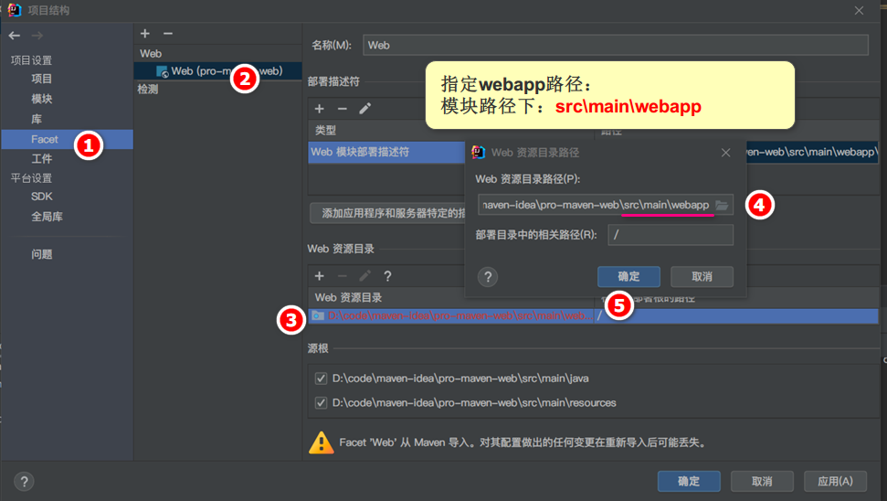

### 6、maven web工程约定目录结构 

```sh
# maven web 工程约定目录结构
pro-maven-web
├─src
│  ├─main
│  │  ├─java # java程序目录
│  │  │  └─com.atguigu.maven
│  │  │           
│  │  ├─resources  # 配置文件目录
│  │  │ 
│  │  └─webapp   # maven web工程默认目录
│  │      └─WEB-INF
│  │		└─web.xml # web配置文件
│  └─test   # 测试目录
│      └─java
└─target  # maven打包文件目录
    ├─classes
    │  └─com
    │      └─atguigu
    │          └─maven
    └─generated-sources
        └─annotations
```

### #7、添加tomcat运行，测试

创建测试类、index.jsp


添加tomcat配置，部署工件，指定webContext


访问首页

## 第五节 其他操作

### [#](http://heavy_code_industry.gitee.io/code_heavy_industry/pro002-maven/chapter04/verse05.html#_1、在idea中执行maven命令)1、在IDEA中执行Maven命令

#### [#](http://heavy_code_industry.gitee.io/code_heavy_industry/pro002-maven/chapter04/verse05.html#_1直接执行)①直接双击执行

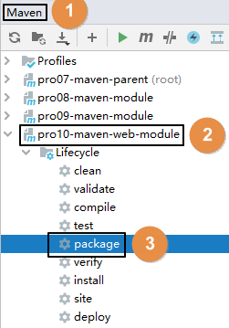

#### [#](http://heavy_code_industry.gitee.io/code_heavy_industry/pro002-maven/chapter04/verse05.html#_2手动输入)②手动输入命令

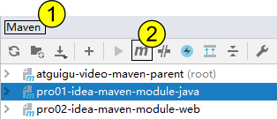


如果有需要，还可以给命令后面附加参数：

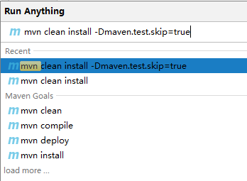

```sh
## -D 表示后面要附加命令的参数，字母 D 和后面的参数是紧挨着的，中间没有任何其它字符
## maven.test.skip=true 表示在执行命令的过程中跳过测试
mvn clean install -Dmaven.test.skip=true
```

### [#](http://heavy_code_industry.gitee.io/code_heavy_industry/pro002-maven/chapter04/verse05.html#_2、在idea中查看某个模块的依赖信息)2、在IDEA中查看某个模块的依赖信息


### [#](http://heavy_code_industry.gitee.io/code_heavy_industry/pro002-maven/chapter04/verse05.html#_3、工程导入)3、工程导入

Maven工程除了自己创建的，还有很多情况是别人创建的。而为了参与开发或者是参考学习，我们都需要导入到 IDEA 中。下面我们分几种不同情况来说明：

#### [#](http://heavy_code_industry.gitee.io/code_heavy_industry/pro002-maven/chapter04/verse05.html#_1来自版本控制系统)①来自版本控制系统

目前我们通常使用的都是 Git（本地库） + 码云（远程库）的版本控制系统，结合 IDEA 的相关操作方式请点[**这里** (opens new window)](http://heavy_code_industry.gitee.io/code_heavy_industry/pro008-Git/lecture/chapter05/verse03.html)查看**克隆远程库**部分。

#### [#](http://heavy_code_industry.gitee.io/code_heavy_industry/pro002-maven/chapter04/verse05.html#_2来自工程目录)②来自工程目录

直接使用 IDEA 打开工程目录即可。下面咱们举个例子：

##### [#](http://heavy_code_industry.gitee.io/code_heavy_industry/pro002-maven/chapter04/verse05.html#_1-工程压缩包)[1]工程压缩包

假设别人发给我们一个 Maven 工程的 zip 压缩包：maven-rest-demo.zip。从码云或GitHub上也可以以 ZIP 压缩格式对项目代码打包下载。

##### [#](http://heavy_code_industry.gitee.io/code_heavy_industry/pro002-maven/chapter04/verse05.html#_2-解压)[2]解压

如果你的所有 IDEA 工程有一个专门的目录来存放，而不是散落各处，那么首先我们就把 ZIP 包解压到这个指定目录中。

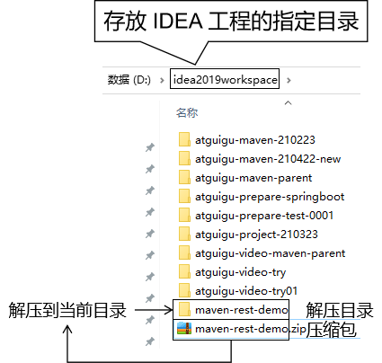

##### [#](http://heavy_code_industry.gitee.io/code_heavy_industry/pro002-maven/chapter04/verse05.html#_3-打开)[3]打开

只要我们确认在解压目录下可以直接看到 pom.xml，那就能证明这个解压目录就是我们的工程目录。那么接下来让 IDEA 打开这个目录就可以了。


##### [#](http://heavy_code_industry.gitee.io/code_heavy_industry/pro002-maven/chapter04/verse05.html#_4-设置-maven-核心程序位置)[4]设置 Maven 核心程序位置

打开一个新的 Maven 工程，和新创建一个 Maven 工程是一样的，此时 IDEA 的 settings 配置中关于 Maven 仍然是默认值：


所以我们还是需要像新建 Maven 工程那样，指定一下 Maven 核心程序位置：


### [#](http://heavy_code_industry.gitee.io/code_heavy_industry/pro002-maven/chapter04/verse05.html#_4、模块导入)4、模块导入

#### [#](http://heavy_code_industry.gitee.io/code_heavy_industry/pro002-maven/chapter04/verse05.html#_1情景重现)①情景重现

在实际开发中，通常会忽略模块（也就是module）所在的项目（也就是project）仅仅导入某一个模块本身。这么做很可能是类似这样的情况：比如基于 Maven 学习 SSM 的时候，做练习需要导入老师发给我们的代码参考。

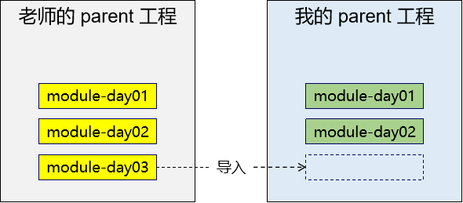

#### [#](http://heavy_code_industry.gitee.io/code_heavy_industry/pro002-maven/chapter04/verse05.html#_2导入-java-类型模块)②导入 Java 类型模块

##### [#](http://heavy_code_industry.gitee.io/code_heavy_industry/pro002-maven/chapter04/verse05.html#_1-找到老师发的工程目录)[1]找到老师发的工程目录


##### [#](http://heavy_code_industry.gitee.io/code_heavy_industry/pro002-maven/chapter04/verse05.html#_2-复制我们想要导入的模块目录)[2]复制我们想要导入的模块目录


##### [#](http://heavy_code_industry.gitee.io/code_heavy_industry/pro002-maven/chapter04/verse05.html#_3-粘贴到我们自己工程目录下)[3]粘贴到我们自己工程目录下

这个工程（project）是我们事先在 IDEA 中创建好的。

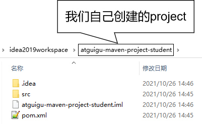

------

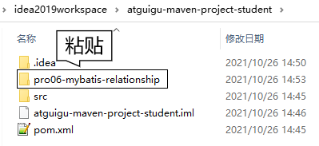

##### [#](http://heavy_code_industry.gitee.io/code_heavy_industry/pro002-maven/chapter04/verse05.html#_4-在-idea-中执行导入)[4]在 IDEA 中执行导入

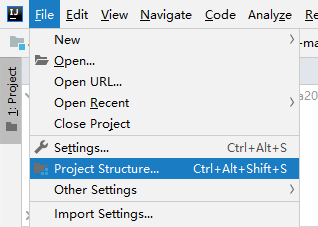

------


------

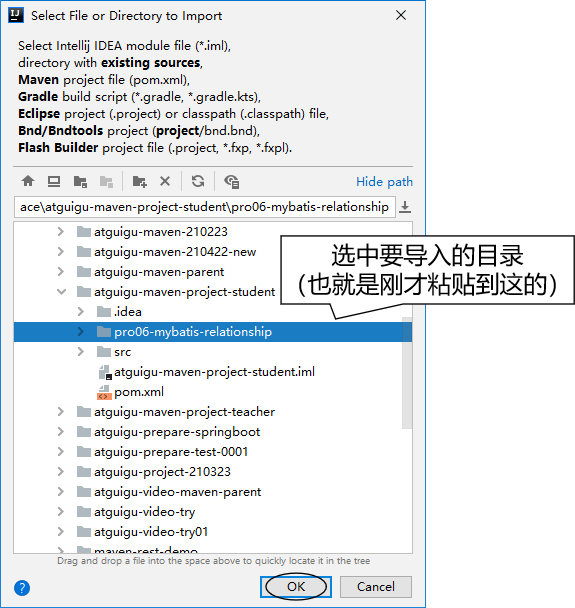

------

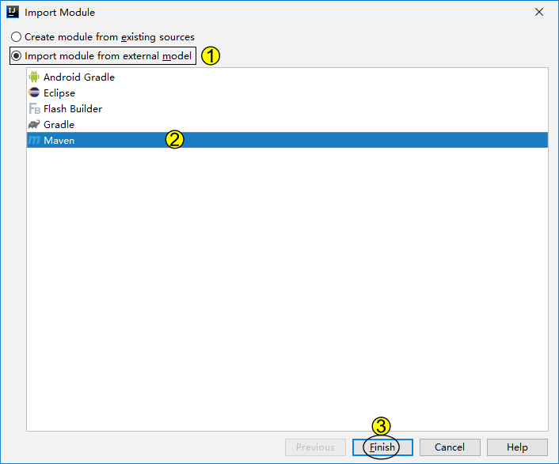

------

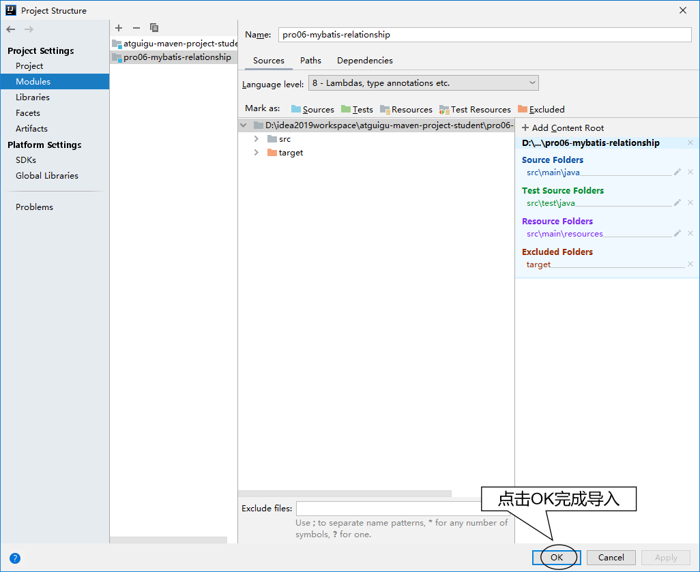

##### [#](http://heavy_code_industry.gitee.io/code_heavy_industry/pro002-maven/chapter04/verse05.html#_5-修改-pom-xml)[5]修改 pom.xml

刚刚导入的 module 的父工程坐标还是以前的，需要改成我们自己的 project。

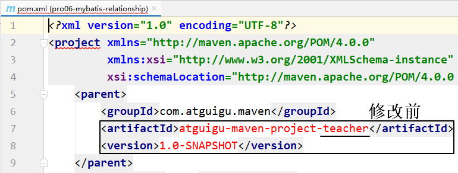

------


##### [#](http://heavy_code_industry.gitee.io/code_heavy_industry/pro002-maven/chapter04/verse05.html#_6-最终效果)[6]最终效果


#### [#](http://heavy_code_industry.gitee.io/code_heavy_industry/pro002-maven/chapter04/verse05.html#_3导入-web-类型模块)③导入 Web 类型模块

其它操作和上面演示的都一样，只是多一步：删除多余的、不正确的 web.xml 设置。如下图所示：


# 第五章 其他核心概念

## [#](http://heavy_code_industry.gitee.io/code_heavy_industry/pro002-maven/chapter05/#_1、生命周期)1、生命周期

### [#](http://heavy_code_industry.gitee.io/code_heavy_industry/pro002-maven/chapter05/#_1作用)①作用

为了让构建过程自动化完成，Maven 设定了三个生命周期，生命周期中的每一个环节对应构建过程中的一个操作。

### [#](http://heavy_code_industry.gitee.io/code_heavy_industry/pro002-maven/chapter05/#_2三个生命周期)②三个生命周期

| 生命周期名称 | 作用         | 各个环节                                                     |
| ------------ | ------------ | ------------------------------------------------------------ |
| Clean        | 清理操作相关 | pre-clean <br/>clean <br/>post-clean                         |
| Site         | 生成站点相关 | pre-site<br/>site<br/>post-site<br/>deploy-site              |
| Default      | 主要构建过程 | validate<br/><br/>generate-sources<br/>process-sources<br/>generate-resources-<br/>process-resources 复制并处理资源文件，至目标目录，准备打包。 <br/>compile 编译项目 main 目录下的源代码。 <br/>process-classes <br/><br/>generate-test-sources <br/>process-test-sources <br/>generate-test-resources <br/>process-test-resources 复制并处理资源文件，至目标测试目录。 <br/>test-compile 编译测试源代码。 <br/>process-test-classes test 使用合适的单元测试框架运行测试。这些测试代码不会被打包或部署。 <br/>prepare-package <br/>package 接受编译好的代码，打包成可发布的格式，如JAR。 <br/>pre-integration-test <br/>integration-test <br/>post-integration-test verify <br/>install将包安装至本地仓库，以让其它项目依赖。 <br/>deploy将最终的包复制到远程的仓库，以让其它开发人员共享；或者部署到服务器上运行（需借助插件，例如：cargo）。 |

### [#](http://heavy_code_industry.gitee.io/code_heavy_industry/pro002-maven/chapter05/#_3特点)③特点

- 前面三个生命周期彼此是独立的。
- 在任何一个生命周期内部，执行任何一个具体环节的操作，都是从本周期最初的位置开始执行，直到指定的地方。（本节记住这句话就行了，其他的都不需要记）

Maven 之所以这么设计其实就是为了提高构建过程的自动化程度：让使用者只关心最终要干的即可，过程中的各个环节是自动执行的。

> 这就是为什么前面 `mvn clean install` ？
>
> 因为 clean 不属于default声明周期的,属于单独的clean声明周期。即默认mvn install 会执行默认  validate compile   compile-test test  package等

## [#](http://heavy_code_industry.gitee.io/code_heavy_industry/pro002-maven/chapter05/#_2、插件和目标)2、插件和目标

### [#](http://heavy_code_industry.gitee.io/code_heavy_industry/pro002-maven/chapter05/#_1插件)①插件

Maven 的核心程序仅仅负责宏观调度，不做具体工作。具体工作都是由 Maven 插件完成的。例如：编译就是由 maven-compiler-plugin-3.1.jar 插件来执行的。

### [#](http://heavy_code_industry.gitee.io/code_heavy_industry/pro002-maven/chapter05/#_2目标)②目标

一个插件可以对应多个目标，而每一个目标都和生命周期中的某一个环节对应。

Default 生命周期中有 compile 和 test-compile 两个和编译相关的环节，这两个环节对应 compile 和 test-compile 两个目标，而这两个目标都是由 maven-compiler-plugin-3.1.jar 插件来执行的。

## [#](http://heavy_code_industry.gitee.io/code_heavy_industry/pro002-maven/chapter05/#_3、仓库)3、仓库

- 本地仓库：在当前电脑上，为电脑上所有 Maven 工程服务
- 远程仓库：需要联网
  - 局域网：我们自己搭建的 Maven 私服，例如使用 Nexus 技术。
  - Internet
    - 中央仓库
    - 镜像仓库：内容和中央仓库保持一致，但是能够分担中央仓库的负载，同时让用户能够就近访问提高下载速度，例如：Nexus aliyun

建议：不要中央仓库和阿里云镜像混用，否则 jar 包来源不纯，彼此冲突。

专门搜索 Maven 依赖信息的网站：https://mvnrepository.com/

#  第六章 单一架构案例

## 第一节 创建工程，引入依赖

### [#](http://heavy_code_industry.gitee.io/code_heavy_industry/pro002-maven/chapter06/verse01.html#_1、架构)1、架构

#### [#](http://heavy_code_industry.gitee.io/code_heavy_industry/pro002-maven/chapter06/verse01.html#_1架构的概念)①架构的概念

『架构』其实就是『项目的**结构**』，只是因为架构是一个更大的词，通常用来形容比较大规模事物的结构。

#### [#](http://heavy_code_industry.gitee.io/code_heavy_industry/pro002-maven/chapter06/verse01.html#_2单一架构)②单一架构

单一架构也叫『all-in-one』结构，就是所有代码、配置文件、各种资源都在同一个工程。

- 一个项目包含一个工程
- 导出一个 war 包
- 放在一个 Tomcat 上运行

### [#](http://heavy_code_industry.gitee.io/code_heavy_industry/pro002-maven/chapter06/verse01.html#_2、创建工程)2、创建工程

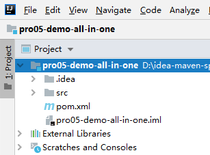

### [#](http://heavy_code_industry.gitee.io/code_heavy_industry/pro002-maven/chapter06/verse01.html#_3、引入依赖)3、引入依赖

#### [#](http://heavy_code_industry.gitee.io/code_heavy_industry/pro002-maven/chapter06/verse01.html#_1搜索依赖信息的网站)①搜索依赖信息的网站

##### [#](http://heavy_code_industry.gitee.io/code_heavy_industry/pro002-maven/chapter06/verse01.html#_1-到哪儿找)[1]到哪儿找？

https://mvnrepository.com/

##### [#](http://heavy_code_industry.gitee.io/code_heavy_industry/pro002-maven/chapter06/verse01.html#_2-怎么选择)[2]怎么选择？

- 确定技术选型：确定我们项目中要使用哪些技术
- 到 mvnrepository 网站搜索具体技术对应的具体依赖信息

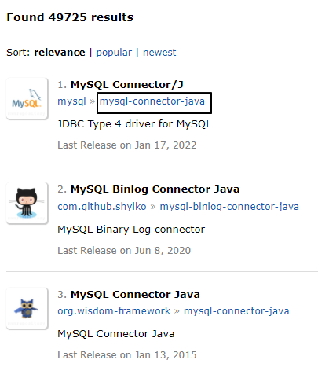

- 确定这个技术使用哪个版本的依赖
  - 考虑因素1：看是否有别的技术要求这里必须用某一个版本
  - 考虑因素2：如果没有硬性要求，那么选择较高版本或下载量大的版本

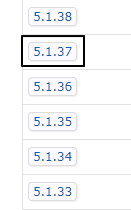

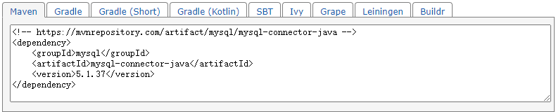

- 在实际使用中检验所有依赖信息是否都正常可用

::: TIP

确定技术选型、组建依赖列表、项目划分模块……等等这些操作其实都属于**架构设计**的范畴。

- 项目本身所属行业的基本特点
- 项目具体的功能需求
- 项目预计访问压力程度
- 项目预计将来需要扩展的功能
- 设计项目总体的体系结构

:::

#### [#](http://heavy_code_industry.gitee.io/code_heavy_industry/pro002-maven/chapter06/verse01.html#_2持久化层所需依赖)②持久化层所需依赖

- mysql:mysql-connector-java:5.1.37
- com.alibaba:druid:1.2.8
- commons-dbutils:commons-dbutils:1.6

#### [#](http://heavy_code_industry.gitee.io/code_heavy_industry/pro002-maven/chapter06/verse01.html#_3表述层所需依赖)③表述层所需依赖

- javax.servlet:javax.servlet-api:3.1.0
- org.thymeleaf:thymeleaf:3.0.11.RELEASE

#### [#](http://heavy_code_industry.gitee.io/code_heavy_industry/pro002-maven/chapter06/verse01.html#_4辅助功能所需依赖)④辅助功能所需依赖

- junit:junit:4.12
- ch.qos.logback:logback-classic:1.2.3

#### [#](http://heavy_code_industry.gitee.io/code_heavy_industry/pro002-maven/chapter06/verse01.html#_5最终完整依赖信息)⑤最终完整依赖信息

```xml
<!-- https://mvnrepository.com/artifact/mysql/mysql-connector-java -->
<dependency>
    <groupId>mysql</groupId>
    <artifactId>mysql-connector-java</artifactId>
    <version>5.1.37</version>
</dependency>
<!-- https://mvnrepository.com/artifact/com.alibaba/druid -->
<dependency>
    <groupId>com.alibaba</groupId>
    <artifactId>druid</artifactId>
    <version>1.2.8</version>
</dependency>
<!-- https://mvnrepository.com/artifact/commons-dbutils/commons-dbutils -->
<dependency>
    <groupId>commons-dbutils</groupId>
    <artifactId>commons-dbutils</artifactId>
    <version>1.6</version>
</dependency>
<!-- https://mvnrepository.com/artifact/javax.servlet/javax.servlet-api -->
<dependency>
    <groupId>javax.servlet</groupId>
    <artifactId>javax.servlet-api</artifactId>
    <version>3.1.0</version>
    <scope>provided</scope>
</dependency>
<!-- https://mvnrepository.com/artifact/org.thymeleaf/thymeleaf -->
<dependency>
    <groupId>org.thymeleaf</groupId>
    <artifactId>thymeleaf</artifactId>
    <version>3.0.11.RELEASE</version>
</dependency>

<!-- 如果使用jsp  导入如下依赖-->
<!--        <dependency>-->
<!--            <groupId>javax.servlet.jsp</groupId>-->
<!--            <artifactId>jsp-api</artifactId>-->
<!--            <version>2.1</version>-->
<!--            <scope>provided</scope>-->
<!--        </dependency>-->

<!-- https://mvnrepository.com/artifact/junit/junit -->
<dependency>
    <groupId>junit</groupId>
    <artifactId>junit</artifactId>
    <version>4.12</version>
    <scope>test</scope>
</dependency>
<!-- https://mvnrepository.com/artifact/ch.qos.logback/logback-classic -->
<dependency>
    <groupId>ch.qos.logback</groupId>
    <artifactId>logback-classic</artifactId>
    <version>1.2.3</version>
<!-- <scope>test</scope>-->
     <scope>compile</scope>
</dependency>
```

### [#](http://heavy_code_industry.gitee.io/code_heavy_industry/pro002-maven/chapter06/verse01.html#_4、建包)4、建包

| package 功能          | package 名称                              |
| --------------------- | ----------------------------------------- |
| 主包                  | com.atguigu.imperial.court                |
| 子包[实体类]          | com.atguigu.imperial.court.entity         |
| 子包[Servlet基类包]   | com.atguigu.imperial.court.servlet.base   |
| 子包[Servlet模块包]   | com.atguigu.imperial.court.servlet.module |
| 子包[Service接口包]   | com.atguigu.imperial.court.service.api    |
| 子包[Service实现类包] | com.atguigu.imperial.court.service.impl   |
| 子包[Dao接口包]       | com.atguigu.imperial.court.dao.api        |
| 子包[Dao实现类包]     | com.atguigu.imperial.court.dao.impl       |
| 子包[Filter]          | com.atguigu.imperial.court.filter         |
| 子包[异常类包]        | com.atguigu.imperial.court.exception      |
| 子包[工具类]          | com.atguigu.imperial.court.util           |
| 子包[测试类]          | com.atguigu.imperial.court.test           |

## 第二节 搭建环境：持久化层

### [#](https://heavy_code_industry.gitee.io/code_heavy_industry/pro002-maven/chapter06/verse02.html#_1、数据建模)1、数据建模

#### [#](https://heavy_code_industry.gitee.io/code_heavy_industry/pro002-maven/chapter06/verse02.html#_1物理建模)①物理建模

```sql
create database db_imperial_court;

use db_imperial_court;

create table t_emp
(
    emp_id         int primary key auto_increment,
    emp_name       char(100) not null,
    emp_position   char(100) not null,
    login_account  char(100) not null unique,
    login_password char(100) not null
);

insert into t_emp(emp_name, emp_position, login_account, login_password)
values ('爱新觉罗·玄烨', 'emperor', 'xiaoxuanzi1654', '25325C896624D444B2E241807DCAC98B'), # 16540504
       ('纳兰明珠', 'minister', 'brightball1635', 'A580D0EF93C22036C859E194C14CB777'),   # 16351119
       ('赫舍里·索额图', 'minister', 'tutu1636', 'E40FD7D49B8B7EF46F47407D583C3538'); # 17030921

create table t_memorials
(
    memorials_id          int primary key auto_increment,
    memorials_title       char(100)     not null,
    memorials_content     varchar(5000) not null,
    memorials_emp         int           not null,
    memorials_create_time char(100),
    feedback_time       char(100),
    feedback_content    varchar(1000),
    memorials_status      int           not null
);

insert into t_memorials(memorials_title,
                      memorials_content,
                      memorials_emp,
                      memorials_create_time,
                      feedback_time,
                      feedback_content,
                      memorials_status)
values ('浙江巡抚奏钱塘堤决口疏', '皇上啊，不好啦！钱塘江发大水啦！堤坝冲毁啦！您看这咋弄啊！', 2, '1690-05-07', null, null, 0),
       ('左都御史参鳌拜圈地疏', '皇上啊，鳌拜这厮不是东西呀！占老百姓的地哇！还打人呀！您看咋弄啊！', 3, '1690-04-14', null, null, 0),
       ('都察院劾吴三桂不臣疏', '皇上啊，不得了啦！吴三桂那孙子想造反呀！', 2, '1693-11-18', null, null, 0),
       ('兵部奏准噶尔犯境疏', '皇上啊，不得了啦！葛尔丹要打过来了呀！', 3, '1693-11-18', null, null, 0),
       ('朝鲜使臣朝拜事宜呈皇上御览', '皇上啊！朝鲜国的人要来啦！咱们请他们吃猪肉炖粉条子吧！', 2, '1680-06-11', null, null, 0),
       ('英吉利炮舰购买事宜疏', '皇上啊！英国的小船船咱们买多少啊？', 3, '1680-06-12', null, null, 0),
       ('劾杭州织造贪墨疏', '皇上啊！杭州织造有问题啊！', 2, '1680-06-13', null, null, 0),
       ('禀畅春园落成疏', '皇上啊！畅春园修好了哇！您啥时候过来看看呀！', 3, '1680-06-14', null, null, 0),
       ('请旨木兰秋狝疏', '皇上啊！秋天到啦，又该打猎啦！', 2, '1680-06-15', null, null, 0),
       ('核准西北军饷银两疏', '皇上啊！您看看这钱数算的对不对呀！', 3, '1680-06-16', null, null, 0),
       ('请旨裁撤三藩疏', '皇上啊！咱们不裁撤三藩就芭比Q了哇！', 2, '1680-06-17', null, null, 0),
       ('蒙古王公进京朝拜疏', '皇上啊！蒙古王公要来啦！咱们请他们吃猪肉炖粉条子吧！', 3, '1680-06-18', null, null, 0),
       ('礼部请旨九阿哥赐名疏', '皇上啊！您看九阿哥该叫什么名字呀？', 2, '1680-06-19', null, null, 0),
       ('户部尚书请旨告老还乡疏', '皇上啊！臣想回家养老啦！您看看啥时候给臣把俸禄结一下啊！', 3, '1680-06-20', null, null, 0),
       ('查江宁织造贪墨疏', '皇上啊！江宁织造有问题啊！', 2, '1680-06-21', null, null, 0)
       ;
```

#### [#](https://heavy_code_industry.gitee.io/code_heavy_industry/pro002-maven/chapter06/verse02.html#_2逻辑建模)②逻辑建模

##### [#](https://heavy_code_industry.gitee.io/code_heavy_industry/pro002-maven/chapter06/verse02.html#_1-emp-实体类)[1] Emp 实体类

```java
public class Emp {

    private Integer empId;
    private String empName;
    private String empPosition;
    private String loginAccount;
    private String loginPassword;
```

##### [#](https://heavy_code_industry.gitee.io/code_heavy_industry/pro002-maven/chapter06/verse02.html#_2-memorials-实体类)[2] Memorials 实体类

```java
public class Memorials {

    private Integer memorialsId;
    private String memorialsTitle;
    private String memorialsContent;
    
    // 奏折摘要数据库没有，这里是为了配和页面显示
    private String memorialsContentDigest;
    private Integer memorialsEmp;

    // 员工姓名数据库没有，这里是为了配合页面显示
    private String memorialsEmpName;
    private String memorialsCreateTime;
    private String feedbackTime;
    private String feedbackContent;
    private Integer memorialsStatus;
```

### [#](https://heavy_code_industry.gitee.io/code_heavy_industry/pro002-maven/chapter06/verse02.html#_2、数据库连接信息)2、数据库连接信息

说明：这是我们第一次用到 Maven 约定目录结构中的 resources 目录，这个目录存放各种配置文件。jdbc.properties

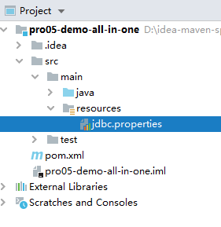

```properties
driverClassName=com.mysql.jdbc.Driver
url=jdbc:mysql://192.168.198.100:3306/db_imperial_court
username=root
password=atguigu
initialSize=10
maxActive=20
maxWait=10000
```

### [#](https://heavy_code_industry.gitee.io/code_heavy_industry/pro002-maven/chapter06/verse02.html#_3、获取数据库连接)3、获取数据库连接

#### [#](https://heavy_code_industry.gitee.io/code_heavy_industry/pro002-maven/chapter06/verse02.html#_1创建-jdbcutils-工具类)①创建 JDBCUtils 工具类

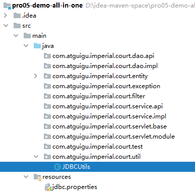

#### [#](https://heavy_code_industry.gitee.io/code_heavy_industry/pro002-maven/chapter06/verse02.html#_2创建-javax-sql-datasource-对象)②创建 javax.sql.DataSource 对象

```java
// 将数据源对象设置为静态属性，保证大对象的单一实例
private static DataSource dataSource;

static {

    // 1.创建一个用于存储外部属性文件信息的Properties对象
    Properties properties = new Properties();

    // 2.使用当前类的类加载器加载外部属性文件：jdbc.properties
    InputStream inputStream = JDBCUtils.class.getClassLoader().getResourceAsStream("jdbc.properties");

    try {

        // 3.将外部属性文件jdbc.properties中的数据加载到properties对象中
        properties.load(inputStream);

        // 4.创建数据源对象
        dataSource = DruidDataSourceFactory.createDataSource(properties);

    } catch (Exception e) {
        e.printStackTrace();
    }

}
```

#### [#](https://heavy_code_industry.gitee.io/code_heavy_industry/pro002-maven/chapter06/verse02.html#_3创建-threadlocal-对象)③创建 ThreadLocal 对象

##### [#](https://heavy_code_industry.gitee.io/code_heavy_industry/pro002-maven/chapter06/verse02.html#_1-提出需求)[1]提出需求

###### [#](https://heavy_code_industry.gitee.io/code_heavy_industry/pro002-maven/chapter06/verse02.html#_1-在一个方法内控制事务)(1)在一个方法内控制事务

如果在每一个 Service 方法中都写下面代码，那么代码重复性就太高了：

```java
try{

	// 1、获取数据库连接
	// 重要：要保证参与事务的多个数据库操作（SQL 语句）使用的是同一个数据库连接
	Connection conn = JDBCUtils.getConnection();
	conn.setAutoCommit(false);
    
	// 2、核心操作
	// ...
	
	// 3、核心操作成功结束，可以提交事务
	conn.commit();

}catch(Exception e){

	// 4、核心操作抛出异常，必须回滚事务
	conn.rollBack();

}finally{

	// 5、释放数据库连接
	JDBCUtils.releaseConnection(conn);
	
}
```

###### [#](https://heavy_code_industry.gitee.io/code_heavy_industry/pro002-maven/chapter06/verse02.html#_2-将重复代码抽取到-filter)(2)将重复代码抽取到 Filter

所谓『当前请求覆盖的 Servlet 方法、Service 方法、Dao 方法』其实就是 chain.doFilter(request, response) **间接调用**的方法。

```java
public void doFilter(ServletRequest request, ServletResponse response, FilterChain chain){

	try{

		// 1、获取数据库连接
		// 重要：要保证参与事务的多个数据库操作（SQL 语句）使用的是同一个数据库连接
		Connection conn = JDBCUtils.getConnection();
        
        // 重要操作：关闭自动提交功能
        connection.setAutoCommit(false);
		
		// 2、核心操作：通过 chain 对象放行当前请求
		// 这样就可以保证当前请求覆盖的 Servlet 方法、Service 方法、Dao 方法都在同一个事务中。
		// 同时各个请求都经过这个 Filter，所以当前事务控制的代码在这里只写一遍就行了，
		// 避免了代码的冗余。
		chain.doFilter(request, response);
		
		// 3、核心操作成功结束，可以提交事务
		conn.commit();

	}catch(Exception e){

		// 4、核心操作抛出异常，必须回滚事务
		conn.rollBack();

	}finally{

		// 5、释放数据库连接
		JDBCUtils.releaseConnection(conn);
		
	}

}
```

###### [#](https://heavy_code_industry.gitee.io/code_heavy_industry/pro002-maven/chapter06/verse02.html#_3-数据的跨方法传递)(3)数据的跨方法传递

通过 JDBCUtils 工具类获取到的 Connection 对象需要传递给 Dao 方法，让事务涉及到的所有 Dao 方法用的都是同一个 Connection 对象。

但是 Connection 对象无法通过 chain.doFilter() 方法以参数的形式传递过去。

所以从获取到 Connection 对象到使用 Connection 对象中间隔着很多不是我们自己声明的方法——我们无法决定它们的参数。

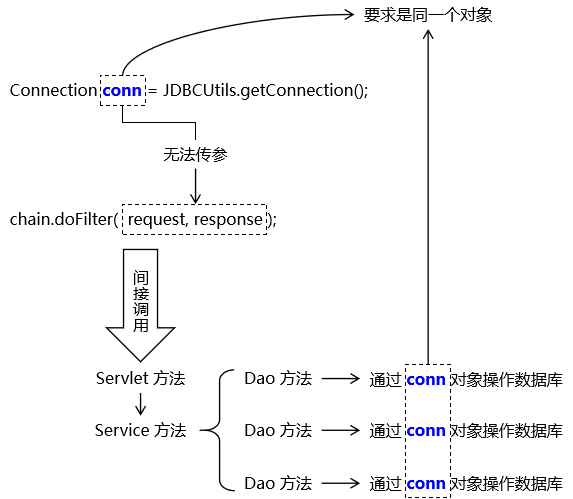

##### [#](https://heavy_code_industry.gitee.io/code_heavy_industry/pro002-maven/chapter06/verse02.html#_2-threadlocal-对象的功能)[2] ThreadLocal 对象的功能


- 全类名：`java.lang.ThreadLocal<T>`
- 泛型 T：要绑定到当前线程的数据的类型
- 具体三个主要的方法：

| 方法名       | 功能                       |
| ------------ | -------------------------- |
| set(T value) | 将数据绑定到当前线程       |
| get()        | 从当前线程获取已绑定的数据 |
| remove()     | 将数据从当前线程移除       |

```java
	ThreadLocal<T>  内部源码分析

	// 绑定线程私有变量
    public void set(T value) {
        Thread t = Thread.currentThread();
        ThreadLocalMap map = getMap(t);//通过当前Tread对象获取内部绑定的属性ThreadLocal.ThreadLocalMap threadLocals = null;
        
        if (map != null)
            map.set(this, value);//将当前ThreadLocal当做key，存入的值当做value
        else
            createMap(t, value);
    }
    
    
    
    ThreadLocal.ThreadLocalMap内部结构  Entry数组
    
     static class Entry extends WeakReference<ThreadLocal<?>> {
            /** The value associated with this ThreadLocal. */
            Object value;

            Entry(ThreadLocal<?> k, Object v) {
                super(k);
                value = v;
            }
        }

        private Entry[] table;

强：A a=new A(); 此时引用a强引用对象A；不会被GC
软：SoftReference.java，在内存不够时引用对象会被GC；
弱：WeakReference.java，每次GC都会被回收；
虚：PhantomReference.java，每次GC都会被回收；
```


##### [#](https://heavy_code_industry.gitee.io/code_heavy_industry/pro002-maven/chapter06/verse02.html#_3-java-代码)[3] Java 代码

```java
// 由于 ThreadLocal 对象需要作为绑定数据时 k-v 对中的 key，所以要保证唯一性
// 加 static 声明为静态资源即可保证唯一性
private static ThreadLocal<Connection> threadLocal = new ThreadLocal<>();
```

#### [#](https://heavy_code_industry.gitee.io/code_heavy_industry/pro002-maven/chapter06/verse02.html#_4声明方法-获取数据库连接)④声明方法：获取数据库连接

```java
/**
 * 工具方法：获取数据库连接并返回
 * @return
 */
public static Connection getConnection() {

    Connection connection = null;

    try {
        // 1、尝试从当前线程检查是否存在已经绑定的 Connection 对象
        connection = threadLocal.get();

        // 2、检查 Connection 对象是否为 null
        if (connection == null) {
            
            // 3、如果为 null，则从数据源获取数据库连接
            connection = dataSource.getConnection();

            // 4、获取到数据库连接后绑定到当前线程
            threadLocal.set(connection);
            
        }
    } catch (SQLException e) {
        e.printStackTrace();
        
        // 为了调用工具方法方便，编译时异常不往外抛
        // 为了不掩盖问题，捕获到的编译时异常封装为运行时异常抛出
        throw new RuntimeException(e);
    }

    return connection;
}
```

#### [#](https://heavy_code_industry.gitee.io/code_heavy_industry/pro002-maven/chapter06/verse02.html#_5声明方法-释放数据库连接)⑤声明方法：释放数据库连接

```java
/**
 * 释放数据库连接
 */
public static void releaseConnection(Connection connection) {

    if (connection != null) {

        try {
            // 在数据库连接池中将当前连接对象标记为空闲
            connection.close();

            // 将当前数据库连接从当前线程上移除
            threadLocal.remove();

        } catch (SQLException e) {
            e.printStackTrace();
            throw new RuntimeException(e);
        }

    }

}
```

#### [#](https://heavy_code_industry.gitee.io/code_heavy_industry/pro002-maven/chapter06/verse02.html#_6初步测试)⑥初步测试


```java
public class ImperialCourtTest {

    @Test
    public void testGetConnection() {

        Connection connection = JDBCUtils.getConnection();

        Statement statement = connection.createStatement();

        ResultSet resultSet = statement.executeQuery("SELECT * FROM t_emp");
        while (resultSet.next()) {
            Integer id = resultSet.getInt("emp_id");
            String empName = resultSet.getString("emp_name");
            String empPosition = resultSet.getString("emp_position");
            String loginAccount = resultSet.getString("login_account");
            String loginPassword = resultSet.getString("login_password");

            Emp emp = new Emp(id, empName, empPosition, loginAccount, loginPassword);
            System.out.println("emp = " + emp);
        }

        JDBCUtils.releaseConnection(connection);

    }

}
```

#### [#](https://heavy_code_industry.gitee.io/code_heavy_industry/pro002-maven/chapter06/verse02.html#_7完整代码)⑦完整代码

[传送门](https://heavy_code_industry.gitee.io/code_heavy_industry/pro002-maven/chapter06/jdbc-utils.html)

```java
/**
 * 功能1：从数据源获取数据库连接
 * 功能2：从数据库获取到数据库连接后，绑定到本地线程（借助 ThreadLocal）
 * 功能3：释放线程时和本地线程解除绑定
 */
public class JDBCUtils {

    // 数据源成员变量设置为静态资源，保证大对象的单例性；同时保证静态方法中可以访问
    private static DataSource dataSource;

    // 由于 ThreadLocal 对象需要作为绑定数据时 k-v 对中的 key，所以要保证唯一性
    // 加 static 声明为静态资源即可保证唯一性
    private static ThreadLocal<Connection> threadLocal = new ThreadLocal<>();

    // 在静态代码块中初始化数据源
    static {

        try {
            // 操作思路分析：
            // 从 jdbc.properties 文件中读取连接数据库的信息
            // 为了保证程序代码的可移植性，需要基于一个确定的基准来读取这个文件
            // 确定的基准：类路径的根目录。resources 目录下的内容经过构建操作中的打包操作后会确定放在 WEB-INF/classes 目录下。
            // WEB-INF/classes 目录存放编译好的 *.class 字节码文件，所以这个目录我们就称之为类路径。
            // 类路径无论在本地运行还是在服务器端运行都是一个确定的基准。
            // 操作具体代码：
            // 1、获取当前类的类加载器
            ClassLoader classLoader = JDBCUtils.class.getClassLoader();

            // 2、通过类加载器对象从类路径根目录下读取文件
            InputStream stream = classLoader.getResourceAsStream("jdbc.properties");

            // 3、使用 Properties 类封装属性文件中的数据
            Properties properties = new Properties();
            properties.load(stream);

            // 4、根据 Properties 对象（已封装了数据库连接信息）来创建数据源对象
            dataSource = DruidDataSourceFactory.createDataSource(properties);
        } catch (Exception e) {
            e.printStackTrace();

            // 为了避免在真正抛出异常后，catch 块捕获到异常从而掩盖问题，
            // 这里将所捕获到的异常封装为运行时异常继续抛出
            throw new RuntimeException(e);
        }
    }

    /**
     * 工具方法：获取数据库连接并返回
     * @return
     */
    public static Connection getConnection() {

        Connection connection = null;

        try {
            // 1、尝试从当前线程检查是否存在已经绑定的 Connection 对象
            connection = threadLocal.get();

            // 2、检查 Connection 对象是否为 null
            if (connection == null) {

                // 3、如果为 null，则从数据源获取数据库连接
                connection = dataSource.getConnection();

                // 4、获取到数据库连接后绑定到当前线程
                threadLocal.set(connection);
            }
        } catch (SQLException e) {
            e.printStackTrace();

            // 为了调用工具方法方便，编译时异常不往外抛
            // 为了不掩盖问题，捕获到的编译时异常封装为运行时异常抛出
            throw new RuntimeException(e);
        }

        return connection;
    }

    /**
     * 释放数据库连接
     */
    public static void releaseConnection(Connection connection) {

        if (connection != null) {

            try {
                // 在数据库连接池中将当前连接对象标记为空闲
                connection.close();

                // 将当前数据库连接从当前线程上移除
                threadLocal.remove();

            } catch (SQLException e) {
                e.printStackTrace();
                throw new RuntimeException(e);
            }

        }

    }

}
```

### [#](https://heavy_code_industry.gitee.io/code_heavy_industry/pro002-maven/chapter06/verse02.html#_4、basedao)4、BaseDao

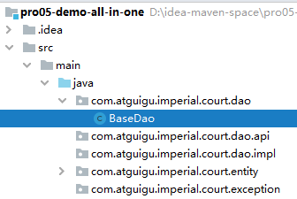

#### [#](https://heavy_code_industry.gitee.io/code_heavy_industry/pro002-maven/chapter06/verse02.html#_1泛型的说明)①泛型的说明


#### [#](https://heavy_code_industry.gitee.io/code_heavy_industry/pro002-maven/chapter06/verse02.html#_2创建-queryrunner-对象)②创建 QueryRunner 对象

```java
    // DBUtils 工具包提供的数据库操作对象
    private QueryRunner runner = new QueryRunner();
```

#### [#](https://heavy_code_industry.gitee.io/code_heavy_industry/pro002-maven/chapter06/verse02.html#_3通用增删改方法)③通用增删改方法

**特别说明**：在 BaseDao 方法中获取数据库连接但是不做释放，因为我们要在<u>控制事务的 Filter 中统一释放。</u>

```java
/**
 * 通用的增删改方法，insert、delete、update 操作都可以用这个方法
 * @param sql 执行操作的 SQL 语句
 * @param parameters SQL 语句的参数
 * @return 受影响的行数
 */
public int update(String sql, Object ... parameters) {

    try {
        Connection connection = JDBCUtils.getConnection();

        int affectedRowNumbers = runner.update(connection, sql, parameters);
        
        return affectedRowNumbers;
    } catch (SQLException e) {
        e.printStackTrace();

        // 如果真的抛出异常，则将编译时异常封装为运行时异常抛出
        new RuntimeException(e);
        
        return 0;
    }

}
```

#### [#](https://heavy_code_industry.gitee.io/code_heavy_industry/pro002-maven/chapter06/verse02.html#_4查询单个对象)④查询单个对象

```java
/**
 * 查询单个对象
 * @param sql 执行查询的 SQL 语句
 * @param entityClass 实体类对应的 Class 对象
 * @param parameters 传给 SQL 语句的参数
 * @return 查询到的实体类对象
 */
public T getSingleBean(String sql, Class<T> entityClass, Object ... parameters) {

    try {
        // 获取数据库连接
        Connection connection = JDBCUtils.getConnection();

        return runner.query(connection, sql, new BeanHandler<>(entityClass), parameters);

    } catch (SQLException e) {
        e.printStackTrace();

        // 如果真的抛出异常，则将编译时异常封装为运行时异常抛出
        new RuntimeException(e);
    }

    return null;
}
```

#### [#](https://heavy_code_industry.gitee.io/code_heavy_industry/pro002-maven/chapter06/verse02.html#_5查询多个对象)⑤查询多个对象

```java
/**
 * 查询返回多个对象的方法
 * @param sql 执行查询操作的 SQL 语句
 * @param entityClass 实体类的 Class 对象
 * @param parameters SQL 语句的参数
 * @return 查询结果
 */
public List<T> getBeanList(String sql, Class<T> entityClass, Object ... parameters) {
    try {
        // 获取数据库连接
        Connection connection = JDBCUtils.getConnection();

        return runner.query(connection, sql, new BeanListHandler<>(entityClass), parameters);

    } catch (SQLException e) {
        e.printStackTrace();

        // 如果真的抛出异常，则将编译时异常封装为运行时异常抛出
        new RuntimeException(e);
    }

    return null;
}
```

#### [#](https://heavy_code_industry.gitee.io/code_heavy_industry/pro002-maven/chapter06/verse02.html#_6测试)⑥测试

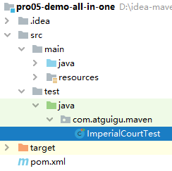

```java
private BaseDao<Emp> baseDao = new BaseDao<>();

@Test
public void testGetSingleBean() {
	// 返回的结果集字段名称和实体类名称需要对应，使用字段别名
    String sql = "select emp_id empId,emp_name empName,emp_position empPosition,login_account loginAccount,login_password loginPassword from t_emp where emp_id=?";

    Emp emp = baseDao.getSingleBean(sql, Emp.class, 1);

    System.out.println("emp = " + emp);

}

@Test
public void testGetBeanList() {

    String sql = "select emp_id empId,emp_name empName,emp_position empPosition,login_account loginAccount,login_password loginPassword from t_emp";

    List<Emp> empList = baseDao.getBeanList(sql, Emp.class);

    for (Emp emp : empList) {
        System.out.println("emp = " + emp);
    }

}

@Test
public void testUpdate() {

    String sql = "update t_emp set emp_position=? where emp_id=?";

    String empPosition = "minister";
    String empId = "3";

    int affectedRowNumber = baseDao.update(sql, empPosition, empId);

    System.out.println("affectedRowNumber = " + affectedRowNumber);

}
```

### [#](https://heavy_code_industry.gitee.io/code_heavy_industry/pro002-maven/chapter06/verse02.html#_5、子类-dao)5、子类 Dao

创建接口和实现类如下：

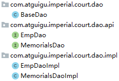

## 第三节 搭建环境：事务控制

### [#](https://heavy_code_industry.gitee.io/code_heavy_industry/pro002-maven/chapter06/verse03.html#_1、总体思路)1、总体思路


### [#](https://heavy_code_industry.gitee.io/code_heavy_industry/pro002-maven/chapter06/verse03.html#_2、transactionfilter)2、TransactionFilter

#### [#](https://heavy_code_industry.gitee.io/code_heavy_industry/pro002-maven/chapter06/verse03.html#_1创建-filter-类)①创建 Filter 类

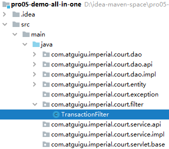

#### [#](https://heavy_code_industry.gitee.io/code_heavy_industry/pro002-maven/chapter06/verse03.html#_2transactionfilter-完整代码)②TransactionFilter 完整代码

```java
public class TransactionFilter implements Filter {

    // 声明集合保存静态资源扩展名
    private static Set<String> staticResourceExtNameSet;

    static {
        staticResourceExtNameSet = new HashSet<>();
        staticResourceExtNameSet.add(".png");
        staticResourceExtNameSet.add(".jpg");
        staticResourceExtNameSet.add(".css");
        staticResourceExtNameSet.add(".js");
    }

    @Override
    public void doFilter(ServletRequest servletRequest, ServletResponse servletResponse, FilterChain filterChain) throws IOException, ServletException {

        // 前置操作：排除静态资源
        HttpServletRequest request = (HttpServletRequest) servletRequest;
        String servletPath = request.getServletPath();
        if (servletPath.contains(".")) {
            String extName = servletPath.substring(servletPath.lastIndexOf("."));

            if (staticResourceExtNameSet.contains(extName)) {

                // 如果检测到当前请求确实是静态资源，则直接放行，不做事务操作
                filterChain.doFilter(servletRequest, servletResponse);

                // 当前方法立即返回
                return ;
            }

        }

        Connection connection = null;

        try{

            // 1、获取数据库连接
            connection = JDBCUtils.getConnection();

            // 重要操作：关闭自动提交功能
            connection.setAutoCommit(false);

            // 2、核心操作
            filterChain.doFilter(servletRequest, servletResponse);

            // 3、提交事务
            connection.commit();

        }catch (Exception e) {

            try {
                // 4、回滚事务
                connection.rollback();
            } catch (SQLException ex) {
                ex.printStackTrace();
            }

            // 页面显示：将这里捕获到的异常发送到指定页面显示
            // 获取异常信息
            String message = e.getMessage();

            // 将异常信息存入请求域
            request.setAttribute("systemMessage", message);

            // 将请求转发到指定页面
            request.getRequestDispatcher("/").forward(request, servletResponse);

        }finally {

            // 5、释放数据库连接
            JDBCUtils.releaseConnection(connection);

        }

    }

    @Override
    public void init(FilterConfig filterConfig) throws ServletException {}
    @Override
    public void destroy() {}
}
```

#### [#](https://heavy_code_industry.gitee.io/code_heavy_industry/pro002-maven/chapter06/verse03.html#_3配置-web-xml)③配置 web.xml

**注意**：需要首先将当前工程改成 Web 工程。

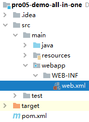

```xml
<filter>
    <filter-name>txFilter</filter-name>
    <filter-class>com.atguigu.imperial.court.filter.TransactionFilter</filter-class>
</filter>
<filter-mapping>
    <filter-name>txFilter</filter-name>
    <url-pattern>/*</url-pattern>
</filter-mapping>
```

#### [#](https://heavy_code_industry.gitee.io/code_heavy_industry/pro002-maven/chapter06/verse03.html#_4注意点)④注意点

##### [#](https://heavy_code_industry.gitee.io/code_heavy_industry/pro002-maven/chapter06/verse03.html#_1-确保异常回滚)[1]确保异常回滚

在程序执行的过程中，必须让所有 catch 块都把编译时异常转换为运行时异常抛出；如果不这么做，在 TransactionFilter 中 catch 就无法捕获到底层抛出的异常，那么该回滚的时候就无法回滚。

##### [#](https://heavy_code_industry.gitee.io/code_heavy_industry/pro002-maven/chapter06/verse03.html#_2-谨防数据库连接提前释放)[2]谨防数据库连接提前释放

由于诸多操作都是在使用同一个数据库连接，那么中间任何一个环节释放数据库连接都会导致后续操作无法正常完成。

## 第四节 搭建环境：表述层

### 视图层拓展
#### 后端工程师与前端工程师交互

##### [#](http://heavy_code_industry.gitee.io/code_heavy_industry/pro000-dev-story/chapter05/content.html#服务器端渲染)**服务器端渲染**

除了我们熟悉的JSP，还有Velocity、Freemarker、Thymeleaf等视图模板技术。虽然具体语法各不相同，但是它们都有一个共通的特点，就是在固定内容中可以穿插表达式等形式的动态内容。将视图模板中的动态内容转换为对应的Java代码并执行，然后使用计算得到的具体数据替换原来的动态部分。这样整个文件的动态内容就可以作为确定的响应结果返回给浏览器。在这种模式下，前端工程师将前端页面全部开发完成，交给后端程序员加入到项目中。此时不可避免的需要后端程序员根据需要对前端代码进行补充和调整。


##### [#](http://heavy_code_industry.gitee.io/code_heavy_industry/pro000-dev-story/chapter05/content.html#前后端分离)**前后端分离**

前后端分离模式下，前端程序和后端程序使用JSON格式进行交互，所以项目启动时前端工程和后端工程师需要坐在一起开会，商量确定JSON格式的具体细节。然后分头开发。后端工程师在把后端的代码发布到测试服务器前，前端工程师无法调用后端程序拿到真实数据，所以使用Mock.js生成假数据。直到后端工程师开发完成，后端程序发布到了测试服务器上，前端工程师再从Mock.js切换到实际后端代码。

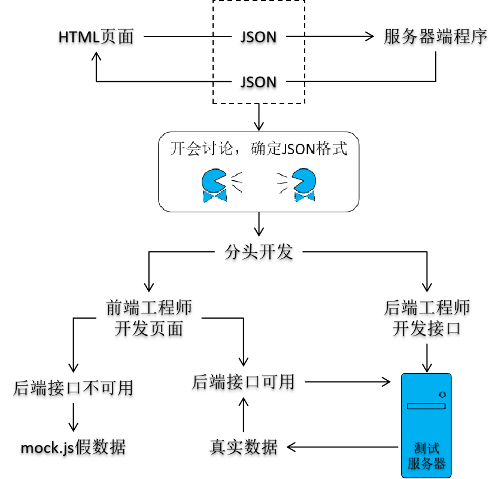

#### [#](http://heavy_code_industry.gitee.io/code_heavy_industry/pro000-dev-story/chapter05/content.html#开发工程师与运维工程师交互)开发工程师与运维工程师交互

开发工程师有项目需要部署的时候，如果需要交给运维工程操作，那么除了要部署的项目本身，还要编写可以自动化部署项目的Shell脚本，一起交给运维工程师去部署项目。

另外还有一种情况，程序员开发具体模块时需要设计创建本模块的数据库表，本地建表调试确定后，把建表语句发送给运维工程师，在正式环境服务器上创建数据库表。因为正式服务器上通常是不给开发工程师操作权限的。

#### [#](http://heavy_code_industry.gitee.io/code_heavy_industry/pro000-dev-story/chapter05/content.html#开发工程师与产品经理交互)开发工程师与产品经理交互

你以为完成组长交给的任务就可以轻松优雅的下班？图样图森破！产品经理会直接找到你，让你改需求！你90%的精力其实都用来忍住揍他的冲动。


#### [#](http://heavy_code_industry.gitee.io/code_heavy_industry/pro000-dev-story/chapter05/content.html#开发工程师与测试工程师)开发工程师与测试工程师

开发工程师将代码提交到版本控制服务器（SVN或Git的代码托管中心），然后根据版本控制服务器上的代码部署到测试服务器上，测试工程师访问测试服务器上的应用进行测试。发现Bug通过Bug管理软件通知开发工程师。

### [#](https://heavy_code_industry.gitee.io/code_heavy_industry/pro002-maven/chapter06/verse04.html#_1、视图模板技术-thymeleaf)1、视图模板技术 Thymeleaf

#### [#](https://heavy_code_industry.gitee.io/code_heavy_industry/pro002-maven/chapter06/verse04.html#_1服务器端渲染)①服务器端渲染

[参考资料(opens new window)](http://heavy_code_industry.gitee.io/code_heavy_industry/pro000-dev-story/chapter05/content.html)


#### [#](https://heavy_code_industry.gitee.io/code_heavy_industry/pro002-maven/chapter06/verse04.html#_2thymeleaf-简要工作机制)②Thymeleaf 简要工作机制

##### [#](https://heavy_code_industry.gitee.io/code_heavy_industry/pro002-maven/chapter06/verse04.html#_1-初始化阶段)[1]初始化阶段

- 目标：创建 TemplateEngine 对象
- 封装：因为对每一个请求来说，TemplateEngine 对象使用的都是同一个，所以在初始化阶段准备好

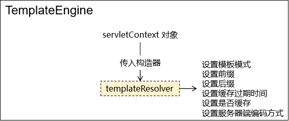

##### [#](https://heavy_code_industry.gitee.io/code_heavy_industry/pro002-maven/chapter06/verse04.html#_2-请求处理阶段)[2]请求处理阶段


#### [#](https://heavy_code_industry.gitee.io/code_heavy_industry/pro002-maven/chapter06/verse04.html#_3逻辑视图与物理视图)③逻辑视图与物理视图

假设有下列页面地址：

> /WEB-INF/pages/apple.html
> /WEB-INF/pages/banana.html
> /WEB-INF/pages/orange.html
> /WEB-INF/pages/grape.html
> /WEB-INF/pages/egg.html

这样的地址可以**直接访问**到页面本身，我们称之为：**物理视图**。而将物理视图中前面、后面的固定内容抽取出来，让每次请求指定中间变化部分即可，那么**中间变化**部分就叫：**逻辑视图**。


#### [#](https://heavy_code_industry.gitee.io/code_heavy_industry/pro002-maven/chapter06/verse04.html#_4viewbaseservlet-完整代码)④ViewBaseServlet 完整代码

为了简化视图页面处理过程，我们将 Thymeleaf 模板引擎的初始化和请求处理过程封装到一个 Servlet 基类中：ViewBaseServlet。以后负责具体模块业务功能的 Servlet 继承该基类即可直接使用。

[传送门](https://heavy_code_industry.gitee.io/code_heavy_industry/pro002-maven/chapter06/verse04-extend01.html)

```java
public class ViewBaseServlet extends HttpServlet {

    private TemplateEngine templateEngine;

    @Override
    public void init() throws ServletException {

        // 1.获取ServletContext对象
        ServletContext servletContext = this.getServletContext();

        // 2.创建Thymeleaf解析器对象
        ServletContextTemplateResolver templateResolver = new ServletContextTemplateResolver(servletContext);

        // 3.给解析器对象设置参数
        // ①HTML是默认模式，明确设置是为了代码更容易理解
        templateResolver.setTemplateMode(TemplateMode.HTML);

        // ②设置前缀
        String viewPrefix = servletContext.getInitParameter("view-prefix");

        templateResolver.setPrefix(viewPrefix);

        // ③设置后缀
        String viewSuffix = servletContext.getInitParameter("view-suffix");

        templateResolver.setSuffix(viewSuffix);

        // ④设置缓存过期时间（毫秒）
        templateResolver.setCacheTTLMs(60000L);

        // ⑤设置是否缓存
        templateResolver.setCacheable(true);

        // ⑥设置服务器端编码方式
        templateResolver.setCharacterEncoding("utf-8");

        // 4.创建模板引擎对象
        templateEngine = new TemplateEngine();

        // 5.给模板引擎对象设置模板解析器
        templateEngine.setTemplateResolver(templateResolver);

    }

    protected void processTemplate(String templateName, HttpServletRequest req, HttpServletResponse resp) throws IOException {
        // 1.设置响应体内容类型和字符集
        resp.setContentType("text/html;charset=UTF-8");

        // 2.创建WebContext对象
        WebContext webContext = new WebContext(req, resp, getServletContext());

        // 3.处理模板数据
        templateEngine.process(templateName, webContext, resp.getWriter());
    }
}
```

**特别提醒**：这个类**不需要掌握**，因为以后都被框架封装了，我们现在只是暂时用一下。

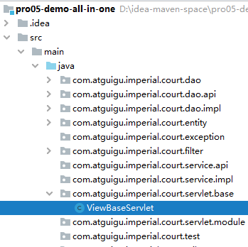

#### [#](https://heavy_code_industry.gitee.io/code_heavy_industry/pro002-maven/chapter06/verse04.html#_5声明初始化参数)⑤声明初始化参数

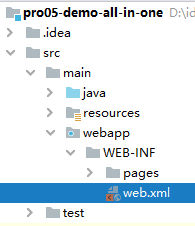

```xml
<!-- 配置 Web 应用初始化参数指定视图前缀、后缀 -->
<!-- 
    物理视图举例：/WEB-INF/pages/index.html
    对应逻辑视图：index
-->
<context-param>
    <param-name>view-prefix</param-name>
    <param-value>/WEB-INF/pages/</param-value>
</context-param>
<context-param>
    <param-name>view-suffix</param-name>
    <param-value>.html</param-value>
</context-param>
```

#### [#](https://heavy_code_industry.gitee.io/code_heavy_industry/pro002-maven/chapter06/verse04.html#_6thymeleaf-的页面语法)⑥Thymeleaf 的页面语法

[传送门(opens new window)](http://heavy_code_industry.gitee.io/code_heavy_industry/pro001-javaweb/lecture/chapter08)

### [#](https://heavy_code_industry.gitee.io/code_heavy_industry/pro002-maven/chapter06/verse04.html#_2、modelbaseservlet)2、ModelBaseServlet

#### [#](https://heavy_code_industry.gitee.io/code_heavy_industry/pro002-maven/chapter06/verse04.html#_1提出问题)①提出问题

##### [#](https://heavy_code_industry.gitee.io/code_heavy_industry/pro002-maven/chapter06/verse04.html#_1-我们的需求)[1]我们的需求

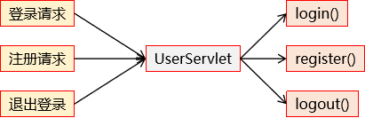

##### [#](https://heavy_code_industry.gitee.io/code_heavy_industry/pro002-maven/chapter06/verse04.html#_2-httpservlet-的局限)[2]HttpServlet 的局限

- doGet() 方法：处理 GET 请求
- doPost() 方法：处理 POST 请求

#### [#](https://heavy_code_industry.gitee.io/code_heavy_industry/pro002-maven/chapter06/verse04.html#_2解决方案)②解决方案

- 每个请求附带一个**请求参数**，表明自己要调用的目标方法
- Servlet 根据目标方法名通过**反射**调用目标方法

#### [#](https://heavy_code_industry.gitee.io/code_heavy_industry/pro002-maven/chapter06/verse04.html#_3modelbaseservlet-完整代码)③ModelBaseServlet 完整代码

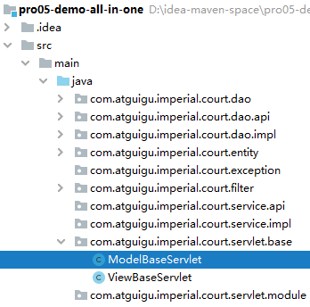

**特别提醒**：为了配合 TransactionFilter 实现事务控制，捕获的异常必须抛出。

[传送门](https://heavy_code_industry.gitee.io/code_heavy_industry/pro002-maven/chapter06/verse04-extend02.html)

```java
public class ModelBaseServlet extends ViewBaseServlet {

    @Override
    protected void doGet(HttpServletRequest request, HttpServletResponse response) throws ServletException, IOException {

        // 在doGet()方法中调用doPost()方法，这样就可以在doPost()方法中集中处理所有请求
        doPost(request, response);
    }

    @Override
    protected void doPost(HttpServletRequest request, HttpServletResponse response) throws ServletException, IOException {

        // 1.在所有request.getParameter()前面设置解析请求体的字符集
        request.setCharacterEncoding("UTF-8");

        // 2.从请求参数中获取method对应的数据
        String method = request.getParameter("method");

        // 3.通过反射调用method对应的方法
        // ①获取Class对象
        Class<? extends ModelBaseServlet> clazz = this.getClass();

        try {
            // ②获取method对应的Method对象  ，约定所有方法都需要传入HttpServletRequest  HttpServletResponse
            Method methodObject = clazz.getDeclaredMethod(method, HttpServletRequest.class, HttpServletResponse.class);

            // ③打开访问权限
            methodObject.setAccessible(true);

            // ④通过Method对象调用目标方法
            methodObject.invoke(this, request, response);
        } catch (Exception e) {
            e.printStackTrace();

            // 重要提醒：为了配合 TransactionFilter 实现事务控制，捕获的异常必须抛出。
            throw new RuntimeException(e);
        }
    }

}
```

#### [#](https://heavy_code_industry.gitee.io/code_heavy_industry/pro002-maven/chapter06/verse04.html#_4继承关系)④继承关系


## 第五节 搭建环境：辅助功能

### [#](https://heavy_code_industry.gitee.io/code_heavy_industry/pro002-maven/chapter06/verse05.html#_1、常量类)1、常量类

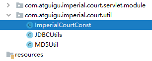

```java
public class ImperialCourtConst {
    public static final String LOGIN_FAILED_MESSAGE = "账号、密码错误，不可进宫！";
    public static final String ACCESS_DENIED_MESSAGE = "宫闱禁地，不得擅入！";
}
```

### [#](https://heavy_code_industry.gitee.io/code_heavy_industry/pro002-maven/chapter06/verse05.html#_2、md5-加密工具方法)2、MD5 加密工具方法

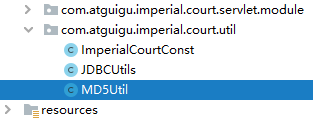

```java
public class MD5Util {

    /**
     * 针对明文字符串执行MD5加密
     * @param source
     * @return
     */
    public static String encode(String source) {

        // 1.判断明文字符串是否有效
        if (source == null || "".equals(source)) {
            throw new RuntimeException("用于加密的明文不可为空");
        }

        // 2.声明算法名称
        String algorithm = "md5";

        // 3.获取MessageDigest对象
        MessageDigest messageDigest = null;
        try {
            messageDigest = MessageDigest.getInstance(algorithm);
        } catch (NoSuchAlgorithmException e) {
            e.printStackTrace();
        }

        // 4.获取明文字符串对应的字节数组
        byte[] input = source.getBytes();

        // 5.执行加密
        byte[] output = messageDigest.digest(input);

        // 6.创建BigInteger对象
        int signum = 1;
        BigInteger bigInteger = new BigInteger(signum, output);

        // 7.按照16进制将bigInteger的值转换为字符串
        int radix = 16;
        String encoded = bigInteger.toString(radix).toUpperCase();

        return encoded;
    }

}
```


### [#](https://heavy_code_industry.gitee.io/code_heavy_industry/pro002-maven/chapter06/verse05.html#_3、日志配置文件)3、日志配置文件

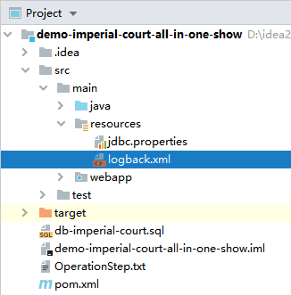

```xml
<?xml version="1.0" encoding="UTF-8"?>
<configuration debug="true">
    <!-- 指定日志输出的位置 -->
    <appender name="STDOUT"
              class="ch.qos.logback.core.ConsoleAppender">
        <encoder>
            <!-- 日志输出的格式 -->
            <!-- 按照顺序分别是：时间、日志级别、线程名称、打印日志的类、日志主体内容、换行 -->
            <pattern>[%d{HH:mm:ss.SSS}] [%-5level] [%thread] [%logger] [%msg]%n</pattern>
            <charset>UTF-8</charset>
        </encoder>
    </appender>

    <!-- 设置全局日志级别。日志级别按顺序分别是：DEBUG、INFO、WARN、ERROR -->
    <!-- 指定任何一个日志级别都只打印当前级别和后面级别的日志。 -->
    <root level="INFO">
        <!-- 指定打印日志的appender，这里通过“STDOUT”引用了前面配置的appender -->
        <appender-ref ref="STDOUT" />
    </root>

    <!-- 专门给某一个包指定日志级别 -->
    <logger name="com.atguigu" level="DEBUG" additivity="false">
        <appender-ref ref="STDOUT" />
    </logger>

</configuration>
```

## 第六节 业务功能：登录

### [#](https://heavy_code_industry.gitee.io/code_heavy_industry/pro002-maven/chapter06/verse06.html#_1、显示首页)1、显示首页

#### [#](https://heavy_code_industry.gitee.io/code_heavy_industry/pro002-maven/chapter06/verse06.html#_1流程图)①流程图


#### [#](https://heavy_code_industry.gitee.io/code_heavy_industry/pro002-maven/chapter06/verse06.html#_2创建-portalservlet)②创建 PortalServlet

##### [#](https://heavy_code_industry.gitee.io/code_heavy_industry/pro002-maven/chapter06/verse06.html#_1-创建-java-类)[1]创建 Java 类

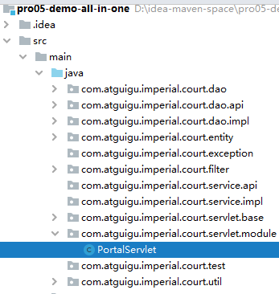

```java
public class PortalServlet extends ViewBaseServlet {

    @Override
    protected void doGet(HttpServletRequest req, HttpServletResponse resp) throws ServletException, IOException {
        doPost(req, resp);
    }

    @Override
    protected void doPost(HttpServletRequest req, HttpServletResponse resp) throws ServletException, IOException {
        // 声明要访问的首页的逻辑视图
        String templateName = "index";
        
        // 调用父类的方法根据逻辑视图名称渲染视图
        processTemplate(templateName, req, resp);
    }
}
```

##### [#](https://heavy_code_industry.gitee.io/code_heavy_industry/pro002-maven/chapter06/verse06.html#_2-注册)[2]注册


```xml
<servlet>
    <servlet-name>portalServlet</servlet-name>
    <servlet-class>com.atguigu.imperial.court.servlet.module.PortalServlet</servlet-class>
</servlet>
<servlet-mapping>
    <servlet-name>portalServlet</servlet-name>
    <url-pattern>/</url-pattern>
</servlet-mapping>
```

#### [#](https://heavy_code_industry.gitee.io/code_heavy_industry/pro002-maven/chapter06/verse06.html#_3在-index-html-中编写登录表单)③在 index.html 中编写登录表单

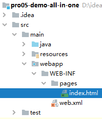

```html
<!DOCTYPE html>
<html lang="en" xml:th="http://www.thymeleaf.org">
<head>
    <meta charset="UTF-8">
    <title>Title</title>
</head>
<body>
<!-- @{/auth} 解析后：/demo/auth   添加contextPath路径 getServletContext().getContextPath()   request.getContextPath()-->
<form th:action="@{/auth}" method="post">
    <!-- 传递 method 请求参数，目的是为了让当前请求调用 AuthServlet 中的 login() 方法 -->
    <input type="hidden" name="method" value="login" />

    <!-- th:text 解析表达式后会替换标签体 -->
    <!-- ${attrName} 从请求域获取属性名为 attrName 的属性值 -->
    <p th:text="${message}"></p>
    <p th:text="${systemMessage}"></p>
    
    账号：<input type="text" name="loginAccount"/><br/>
    密码：<input type="password" name="loginPassword"><br/>
    <button type="submit">进宫</button>
</form>

</body>
</html>
```

### [#](https://heavy_code_industry.gitee.io/code_heavy_industry/pro002-maven/chapter06/verse06.html#_2、登录操作)2、登录操作

#### [#](https://heavy_code_industry.gitee.io/code_heavy_industry/pro002-maven/chapter06/verse06.html#_1流程图-2)①流程图

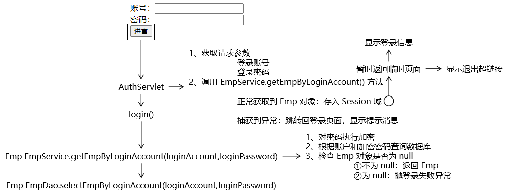

#### [#](https://heavy_code_industry.gitee.io/code_heavy_industry/pro002-maven/chapter06/verse06.html#_2创建-empservice)②创建 EmpService

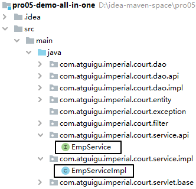

#### [#](https://heavy_code_industry.gitee.io/code_heavy_industry/pro002-maven/chapter06/verse06.html#_3创建登录失败异常)③创建登录失败异常

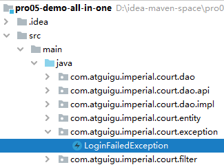

```java
public class LoginFailedException extends RuntimeException {

    public LoginFailedException() {
    }

    public LoginFailedException(String message) {
        super(message);
    }

    public LoginFailedException(String message, Throwable cause) {
        super(message, cause);
    }

    public LoginFailedException(Throwable cause) {
        super(cause);
    }

    public LoginFailedException(String message, Throwable cause, boolean enableSuppression, boolean writableStackTrace) {
        super(message, cause, enableSuppression, writableStackTrace);
    }
}
```

#### [#](https://heavy_code_industry.gitee.io/code_heavy_industry/pro002-maven/chapter06/verse06.html#_4增加常量声明)④增加常量声明

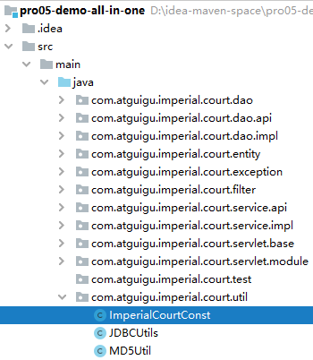

```java
public class ImperialCourtConst {

    public static final String LOGIN_FAILED_MESSAGE = "账号、密码错误，不可进宫！";
    public static final String ACCESS_DENIED_MESSAGE = "宫闱禁地，不得擅入！";
    public static final String LOGIN_EMP_ATTR_NAME = "loginInfo";

}
```

#### [#](https://heavy_code_industry.gitee.io/code_heavy_industry/pro002-maven/chapter06/verse06.html#_5创建-authservlet)⑤创建 AuthServlet

##### [#](https://heavy_code_industry.gitee.io/code_heavy_industry/pro002-maven/chapter06/verse06.html#_1-创建-java-类-2)[1]创建 Java 类


```java
public class AuthServlet extends ModelBaseServlet {

    private EmpService empService = new EmpServiceImpl();

    protected void login(
            HttpServletRequest request,
            HttpServletResponse response)
            throws ServletException, IOException {

        try {
            // 1、获取请求参数
            String loginAccount = request.getParameter("loginAccount");
            String loginPassword = request.getParameter("loginPassword");

            // 2、调用 EmpService 方法执行登录逻辑
            Emp emp = empService.getEmpByLoginAccount(loginAccount, loginPassword);

            // 3、通过 request 获取 HttpSession 对象
            HttpSession session = request.getSession();

            // 4、将查询到的 Emp 对象存入 Session 域
            session.setAttribute(ImperialCourtConst.LOGIN_EMP_ATTR_NAME, emp);

            // 5、前往指定页面视图
            String templateName = "temp";
            processTemplate(templateName, request, response);

        } catch (Exception e) {
            e.printStackTrace();

            // 6、判断此处捕获到的异常是否是登录失败异常
            if (e instanceof LoginFailedException) {
                // 7、如果是登录失败异常则跳转回登录页面
                // ①将异常信息存入请求域
                request.setAttribute("message", e.getMessage());

                // ②处理视图：index
                processTemplate("index", request, response);

            }else {
                // 8、如果不是登录异常则封装为运行时异常继续抛出
                throw new RuntimeException(e);

            }

        }

    }
}
```

##### [#](https://heavy_code_industry.gitee.io/code_heavy_industry/pro002-maven/chapter06/verse06.html#_2-注册-2)[2]注册


```xml
<servlet>
    <servlet-name>authServlet</servlet-name>
    <servlet-class>com.atguigu.imperial.court.servlet.module.AuthServlet</servlet-class>
</servlet>
<servlet-mapping>
    <servlet-name>authServlet</servlet-name>
    <url-pattern>/auth</url-pattern>
</servlet-mapping>
```


#### [#](https://heavy_code_industry.gitee.io/code_heavy_industry/pro002-maven/chapter06/verse06.html#_6empservice-方法)⑥EmpService 方法

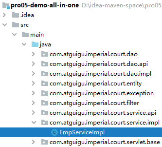

```java
public class EmpServiceImpl implements EmpService {

    private EmpDao empDao = new EmpDaoImpl();

    @Override
    public Emp getEmpByLoginAccount(String loginAccount, String loginPassword) {

        // 1、对密码执行加密
        String encodedLoginPassword = MD5Util.encode(loginPassword);

        // 2、根据账户和加密密码查询数据库
        Emp emp = empDao.selectEmpByLoginAccount(loginAccount, encodedLoginPassword);

        // 3、检查 Emp 对象是否为 null
        if (emp != null) {
            //	①不为 null：返回 Emp
            return emp;
        } else {
            //	②为 null：抛登录失败异常
            throw new LoginFailedException(ImperialCourtConst.LOGIN_FAILED_MESSAGE);
        }
    }
}
```

#### [#](https://heavy_code_industry.gitee.io/code_heavy_industry/pro002-maven/chapter06/verse06.html#_7empdao-方法)⑦EmpDao 方法

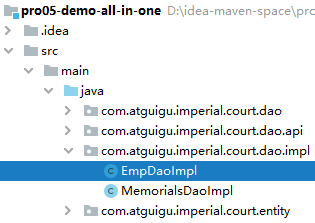

```java
public class EmpDaoImpl extends BaseDao<Emp> implements EmpDao {
    @Override
    public Emp selectEmpByLoginAccount(String loginAccount, String encodedLoginPassword) {

        // 1、编写 SQL 语句
        String sql = "select emp_id empId," +
                "emp_name empName," +
                "emp_position empPosition," +
                "login_account loginAccount," +
                "login_password loginPassword " +
                "from t_emp where login_account=? and login_password=?";

        // 2、调用父类方法查询单个对象
        return super.getSingleBean(sql, Emp.class, loginAccount, encodedLoginPassword);
    }
}
```

#### [#](https://heavy_code_industry.gitee.io/code_heavy_industry/pro002-maven/chapter06/verse06.html#_8临时页面)⑧临时页面

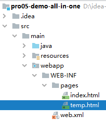

```html
<!DOCTYPE html>
<html lang="en" xml:th="http://www.thymeleaf.org">
<head>
    <meta charset="UTF-8">
    <title>临时</title>
</head>
<body>

    <p th:text="${session.loginInfo}"></p>

</body>
</html>
```

### [#](https://heavy_code_industry.gitee.io/code_heavy_industry/pro002-maven/chapter06/verse06.html#_3、退出登录)3、退出登录

#### [#](https://heavy_code_industry.gitee.io/code_heavy_industry/pro002-maven/chapter06/verse06.html#_1在临时页面编写超链接)①在临时页面编写超链接

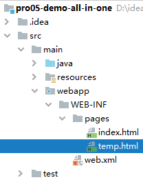

```html
<a th:href="@{/auth?method=logout}">退朝</a>
```

#### [#](https://heavy_code_industry.gitee.io/code_heavy_industry/pro002-maven/chapter06/verse06.html#_2在-authservlet-编写退出逻辑)②在 AuthServlet 编写退出逻辑

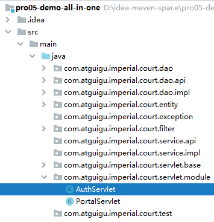

```java
protected void logout(HttpServletRequest request, HttpServletResponse response) throws ServletException, IOException {

    // 1、通过 request 对象获取 HttpSession 对象
    HttpSession session = request.getSession();

    // 2、将 HttpSession 对象强制失效
    session.invalidate();

    // 3、回到首页
    String templateName = "index";
    processTemplate(templateName, request, response);
}
```

## 第七节 业务功能：显示奏折列表

### [#](https://heavy_code_industry.gitee.io/code_heavy_industry/pro002-maven/chapter06/verse07.html#_1、流程图)1、流程图


### [#](https://heavy_code_industry.gitee.io/code_heavy_industry/pro002-maven/chapter06/verse07.html#_2、创建组件)2、创建组件

#### [#](https://heavy_code_industry.gitee.io/code_heavy_industry/pro002-maven/chapter06/verse07.html#_1创建-workservlet)①创建 WorkServlet

##### [#](https://heavy_code_industry.gitee.io/code_heavy_industry/pro002-maven/chapter06/verse07.html#_1-创建-java-类)[1]创建 Java 类

刚开始是空的，还没有写方法：

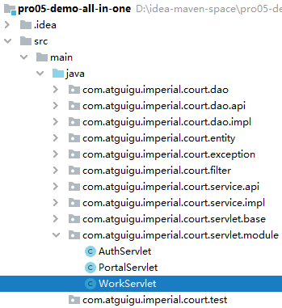

```java
public class WorkServlet extends ModelBaseServlet {
    
    private MemorialsService memorialsService = new MemorialsServiceImpl();
    
}
```

##### [#](https://heavy_code_industry.gitee.io/code_heavy_industry/pro002-maven/chapter06/verse07.html#_2-注册)[2]注册

```xml
<servlet>
    <servlet-name>workServlet</servlet-name>
    <servlet-class>com.atguigu.imperial.court.servlet.module.WorkServlet</servlet-class>
</servlet>
<servlet-mapping>
    <servlet-name>workServlet</servlet-name>
    <url-pattern>/work</url-pattern>
</servlet-mapping>
```


#### [#](https://heavy_code_industry.gitee.io/code_heavy_industry/pro002-maven/chapter06/verse07.html#_2创建-memorialsservice)②创建 MemorialsService

##### [#](https://heavy_code_industry.gitee.io/code_heavy_industry/pro002-maven/chapter06/verse07.html#_1-接口)[1]接口

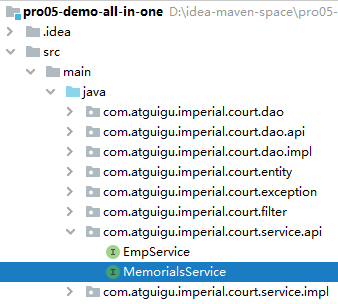

##### [#](https://heavy_code_industry.gitee.io/code_heavy_industry/pro002-maven/chapter06/verse07.html#_2-实现类)[2]实现类

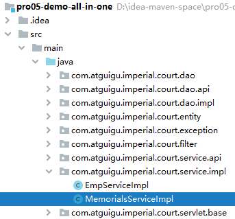

```java
public class MemorialsServiceImpl implements MemorialsService {

    private MemorialsDao memorialsDao = new MemorialsDaoImpl();

}
```


### [#](https://heavy_code_industry.gitee.io/code_heavy_industry/pro002-maven/chapter06/verse07.html#_3、workservlet-方法)3、WorkServlet 方法


```java
protected void showMemorialsDigestList(HttpServletRequest request, HttpServletResponse response) throws ServletException, IOException {

    // 1、调用 Service 方法查询数据
    List<Memorials> memorialsList = memorialsService.getAllMemorialsDigest();

    // 2、将查询得到的数据存入请求域
    request.setAttribute("memorialsList", memorialsList);

    // 3、渲染视图
    String templateName = "memorials-list";
    processTemplate(templateName, request, response);
}
```


### [#](https://heavy_code_industry.gitee.io/code_heavy_industry/pro002-maven/chapter06/verse07.html#_4、memorialsservice-方法)4、MemorialsService 方法


```java
@Override
public List<Memorials> getAllMemorialsDigest() {
    return memorialsDao.selectAllMemorialsDigest();
}
```


### [#](https://heavy_code_industry.gitee.io/code_heavy_industry/pro002-maven/chapter06/verse07.html#_5、memorialsdao-方法)5、MemorialsDao 方法

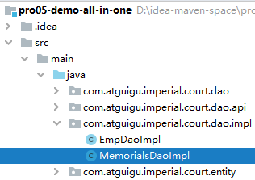

```java
@Override
public List<Memorials> selectAllMemorialsDigest() {

    String sql = "select memorials_id memorialsId,\n" +
            "       memorials_title memorialsTitle,\n" +
            "       concat(left(memorials_content, 10), \"...\") memorialsContentDigest,\n" +
            "       emp_name memorialsEmpName,\n" +
            "       memorials_create_time memorialsCreateTime,\n" +
            "       memorials_status memorialsStatus\n" +
            "from t_memorials m left join  t_emp e on m.memorials_emp=e.emp_id;";

    return getBeanList(sql, Memorials.class);
}
```

### [#](https://heavy_code_industry.gitee.io/code_heavy_industry/pro002-maven/chapter06/verse07.html#_6、页面显示)6、页面显示

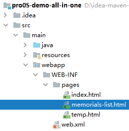

#### [#](https://heavy_code_industry.gitee.io/code_heavy_industry/pro002-maven/chapter06/verse07.html#_1页面上的样式声明)①页面上的样式声明

```html
<style type="text/css">
    table {
        border-collapse: collapse;
        margin: 0px auto 0px auto;
    }

    table th, td {
        border: 1px solid black;
        text-align: center;
    }

    div {
        text-align: right;
    }
</style>
```

#### [#](https://heavy_code_industry.gitee.io/code_heavy_industry/pro002-maven/chapter06/verse07.html#_2用户登录信息部分)②用户登录信息部分

```html
<!-- 登录信息部分 -->
<div>
    <span th:if="${session.loginInfo.empPosition == 'emperor'}">恭请皇上圣安</span>
    <span th:if="${session.loginInfo.empPosition == 'minister'}">
        给
        <span th:text="${session.loginInfo.empName}">XXX</span>
        大人请安
    </span>
    <a th:href="@{/auth?method=logout}">退朝</a>
</div>
```

#### [#](https://heavy_code_industry.gitee.io/code_heavy_industry/pro002-maven/chapter06/verse07.html#_3数据展示信息部分)③数据展示信息部分

>  Thymeleaf  :if   switch case   遍历

```html
<!-- 数据显示部分 -->
<table>
    <thead>
        <tr>
            <th>奏折标题</th>
            <th>内容摘要</th>
            <th>上疏大臣</th>
            <th>上疏时间</th>
            <th>奏折状态</th>
            <th>奏折详情</th>
        </tr>
    </thead>
    <tbody th:if="${#lists.isEmpty(memorialsList)}">
        <tr>
            <td colspan="6">没有人上过折子</td>
        </tr>
    </tbody>
    <tbody th:if="${not #lists.isEmpty(memorialsList)}">
        <tr th:each="memorials : ${memorialsList}">
            <td th:switch="${memorials.memorialsStatus}">
                <span th:text="${memorials.memorialsTitle}" th:case="0" style="color: red;">奏折标题</span>
                <span th:text="${memorials.memorialsTitle}" th:case="1" style="color: blue;">奏折标题</span>
                <span th:text="${memorials.memorialsTitle}" th:case="2">奏折标题</span>
            </td>
            <td th:switch="${memorials.memorialsStatus}">
                <span th:text="${memorials.memorialsContentDigest}" th:case="0" style="color: red;">内容摘要</span>
                <span th:text="${memorials.memorialsContentDigest}" th:case="1" style="color: blue;">内容摘要</span>
                <span th:text="${memorials.memorialsContentDigest}" th:case="2">内容摘要</span>
            </td>
            <td th:switch="${memorials.memorialsStatus}">
                <span th:text="${memorials.memorialsEmpName}" th:case="0" style="color: red;">上疏大臣</span>
                <span th:text="${memorials.memorialsEmpName}" th:case="1" style="color: blue;">上疏大臣</span>
                <span th:text="${memorials.memorialsEmpName}" th:case="2">上疏大臣</span>
            </td>
            <td th:switch="${memorials.memorialsStatus}">
                <span th:text="${memorials.memorialsCreateTime}" th:case="0" style="color: red;">上疏时间</span>
                <span th:text="${memorials.memorialsCreateTime}" th:case="1" style="color: blue;">上疏时间</span>
                <span th:text="${memorials.memorialsCreateTime}" th:case="2">上疏时间</span>
            </td>
            <td th:switch="${memorials.memorialsStatus}">
                <span th:case="0" style="color: red;">未读</span>
                <span th:case="1" style="color: blue;">已读</span>
                <span th:case="2">已批示</span>
            </td>

            <td>
                <a th:href="@{/work?method=detail}">奏折详情</a>
            </td>
        </tr>
    </tbody>
</table>
```

### [#](https://heavy_code_industry.gitee.io/code_heavy_industry/pro002-maven/chapter06/verse07.html#_7、和登录成功对接)7、和登录成功对接 【重定向到列表页面】


```java
protected void login(
        HttpServletRequest request,
        HttpServletResponse response)
        throws ServletException, IOException {

    try {
        // 1、获取请求参数
        String loginAccount = request.getParameter("loginAccount");
        String loginPassword = request.getParameter("loginPassword");

        // 2、调用 EmpService 方法执行登录逻辑
        Emp emp = empService.getEmpByLoginAccount(loginAccount, loginPassword);

        // 3、通过 request 获取 HttpSession 对象
        HttpSession session = request.getSession();

        // 4、将查询到的 Emp 对象存入 Session 域
        session.setAttribute(ImperialCourtConst.LOGIN_EMP_ATTR_NAME, emp);

        // 5、前往指定页面视图
        // 前往临时页面
        // String templateName = "temp";
        // processTemplate(templateName, request, response);

        // 前往正式的目标地址
        response.sendRedirect(request.getContextPath() + "/work?method=showMemorialsDigestList");

    } catch (Exception e) {
        e.printStackTrace();

        // 6、判断此处捕获到的异常是否是登录失败异常
        if (e instanceof LoginFailedException) {
            // 7、如果是登录失败异常则跳转回登录页面
            // ①将异常信息存入请求域
            request.setAttribute("message", e.getMessage());

            // ②处理视图：index
            processTemplate("index", request, response);

        }else {
            // 8、如果不是登录异常则封装为运行时异常继续抛出
            throw new RuntimeException(e);

        }

    }

}
```

## 第八节 业务功能：显示奏折详情

### [#](https://heavy_code_industry.gitee.io/code_heavy_industry/pro002-maven/chapter06/verse08.html#_1、流程图)1、流程图


### [#](https://heavy_code_industry.gitee.io/code_heavy_industry/pro002-maven/chapter06/verse08.html#_2、调整奏折列表页面的超链接)2、调整奏折列表页面的超链接

```html
<a th:href="@{/work(method='showMemorialsDetail',memorialsId=${memorials.memorialsId})}">奏折详情</a>
```

### [#](https://heavy_code_industry.gitee.io/code_heavy_industry/pro002-maven/chapter06/verse08.html#_3、workservlet-方法)3、WorkServlet 方法

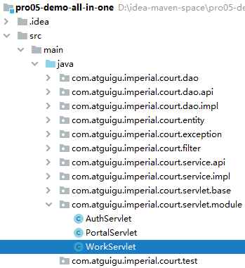

```java
protected void showMemorialsDetail(
        HttpServletRequest request,
        HttpServletResponse response)
        throws ServletException, IOException {

    // 1、从请求参数读取 memorialsId
    String memorialsId = request.getParameter("memorialsId");

    // 2、根据 memorialsId 从 Service 中查询 Memorials 对象
    Memorials memorials = memorialsService.getMemorialsDetailById(memorialsId);

    // 3、将 Memorials 对象存入请求域
    request.setAttribute("memorials", memorials);

    // 4、解析渲染视图
    String templateName = "memorials_detail";
    processTemplate(templateName, request, response);

}
```


### [#](https://heavy_code_industry.gitee.io/code_heavy_industry/pro002-maven/chapter06/verse08.html#_4、memorialsservice-方法)4、MemorialsService 方法


```java
    @Override
    public Memorials getMemorialsDetailById(String memorialsId) {

        return memorialsDao.selectMemorialsById(memorialsId);

    }
```

### [#](https://heavy_code_industry.gitee.io/code_heavy_industry/pro002-maven/chapter06/verse08.html#_5、memorialsdao-方法)5、MemorialsDao 方法


```java
@Override
public Memorials selectMemorialsById(String memorialsId) {

    String sql = "select memorials_id memorialsId,\n" +
            "       memorials_title memorialsTitle,\n" +
            "       memorials_content memorialsContent,\n" +
            "       emp_name memorialsEmpName,\n" +
            "       memorials_create_time memorialsCreateTime,\n" +
            "       memorials_status memorialsStatus,\n" +
            "       feedback_time feedbackTime,\n" +
            "       feedback_content feedbackContent\n" +
            "from t_memorials m left join  t_emp e on m.memorials_emp=e.emp_id " +
            "where memorials_id=?;";

    return getSingleBean(sql, Memorials.class, memorialsId);
}
```

### [#](https://heavy_code_industry.gitee.io/code_heavy_industry/pro002-maven/chapter06/verse08.html#_6、详情页)6、详情页

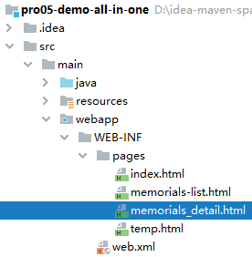

```html
<!-- 登录信息部分 -->
<div>
    <span th:if="${session.loginInfo.empPosition == 'emperor'}">恭请皇上圣安</span>
    <span th:if="${session.loginInfo.empPosition == 'minister'}">给<span th:text="${session.loginInfo.empName}">XXX</span>大人请安</span>
    <a th:href="@{/auth?method=logout}">退朝</a>
</div>

<table>
    <tr>
        <td>奏折标题</td>
        <td th:text="${memorials.memorialsTitle}"></td>
    </tr>
    <tr>
        <td>上疏大臣</td>
        <td th:text="${memorials.memorialsEmpName}"></td>
    </tr>
    <tr>
        <td>上疏时间</td>
        <td th:text="${memorials.memorialsCreateTime}"></td>
    </tr>
    <tr>
        <td>奏折内容</td>
        <td th:text="${memorials.memorialsContent}"></td>
    </tr>
    <tr th:if="${memorials.memorialsStatus == 2}">
        <td>批复时间</td>
        <td th:text="${memorials.feedbackTime}"></td>
    </tr>
    <tr th:if="${memorials.memorialsStatus == 2}">
        <td>批复时间</td>
        <td th:text="${memorials.feedbackContent}"></td>
    </tr>
</table>

<div th:if="${memorials.memorialsStatus != 2}">
    <form th:action="@{/work}" method="post">

        <input type="hidden" name="method" value="feedBack" />
        <input type="hidden" name="memorialsId" th:value="${memorials.memorialsId}"/>

        <textarea name="feedbackContent"></textarea>

        <button type="submit">御批</button>

    </form>
</div>

<a th:href="@{/work?method=showMemorialsDigestList}">返回列表</a>
```


### [#](https://heavy_code_industry.gitee.io/code_heavy_industry/pro002-maven/chapter06/verse08.html#_7、更新状态)7、更新状态

#### [#](https://heavy_code_industry.gitee.io/code_heavy_industry/pro002-maven/chapter06/verse08.html#_1业务逻辑规则)①业务逻辑规则

一份**未读**奏折，点击查看后，需要从未读变成已读。

#### [#](https://heavy_code_industry.gitee.io/code_heavy_industry/pro002-maven/chapter06/verse08.html#_2workservlet-方法)②WorkServlet 方法


增加判断：

```java
protected void showMemorialsDetail(
        HttpServletRequest request,
        HttpServletResponse response)
        throws ServletException, IOException {

    // 1、从请求参数读取 memorialsId
    String memorialsId = request.getParameter("memorialsId");

    // 2、根据 memorialsId 从 Service 中查询 Memorials 对象
    Memorials memorials = memorialsService.getMemorialsDetailById(memorialsId);

    // **********************补充功能**********************
    // 获取当前奏折对象的状态
    Integer memorialsStatus = memorials.getMemorialsStatus();
    
    // 判断奏折状态
    if (memorialsStatus == 0) {
        // 更新奏折状态：数据库修改
        memorialsService.updateMemorialsStatusToRead(memorialsId);

        // 更新奏折状态：当前对象修改
        memorials.setMemorialsStatus(1);
    }
    // **********************补充功能**********************

    // 3、将 Memorials 对象存入请求域
    request.setAttribute("memorials", memorials);

    // 4、解析渲染视图
    String templateName = "memorials_detail";
    processTemplate(templateName, request, response);

}
```


#### [#](https://heavy_code_industry.gitee.io/code_heavy_industry/pro002-maven/chapter06/verse08.html#_3memorialsservice-方法)③MemorialsService 方法

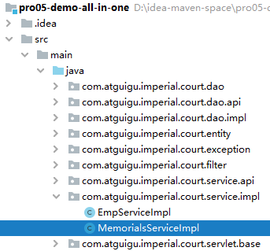

```java
@Override
public void updateMemorialsStatusToRead(String memorialsId) {
    memorialsDao.updateMemorialsStatusToRead(memorialsId);
}
```

#### [#](https://heavy_code_industry.gitee.io/code_heavy_industry/pro002-maven/chapter06/verse08.html#_4memorialsdao-方法)④MemorialsDao 方法

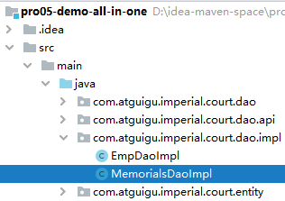

```java
@Override
public void updateMemorialsStatusToRead(String memorialsId) {
    String sql = "update t_memorials set memorials_status=1 where memorials_id=?";
    update(sql, memorialsId);
}
```

## 第九节 业务功能：批复奏折

### [#](https://heavy_code_industry.gitee.io/code_heavy_industry/pro002-maven/chapter06/verse09.html#_1、本质)1、本质

提交表单，更新数据。

### [#](https://heavy_code_industry.gitee.io/code_heavy_industry/pro002-maven/chapter06/verse09.html#_2、workservlet-方法)2、WorkServlet 方法

```java
protected void feedBack(HttpServletRequest request, HttpServletResponse response) throws ServletException, IOException {

    // 获取表单提交的请求参数
    String memorialsId = request.getParameter("memorialsId");
    String feedbackContent = request.getParameter("feedbackContent");

    // 执行更新
    memorialsService.updateMemorialsFeedBack(memorialsId, feedbackContent);

    // 重定向回显示奏折列表页面
    response.sendRedirect(request.getContextPath() + "/work?method=showMemorialsDigestList");
}
```

### [#](https://heavy_code_industry.gitee.io/code_heavy_industry/pro002-maven/chapter06/verse09.html#_3、memorialsservice-方法)3、MemorialsService 方法

```java
@Override
public void updateMemorialsFeedBack(String memorialsId, String feedbackContent) {
    memorialsDao.updateMemorialsFeedBack(memorialsId, feedbackContent);
}
```

### [#](https://heavy_code_industry.gitee.io/code_heavy_industry/pro002-maven/chapter06/verse09.html#_4、memorialsdao-方法)4、MemorialsDao 方法

```java
@Override
public void updateMemorialsFeedBack(String memorialsId, String feedbackContent) {

    String feedbackTime = new SimpleDateFormat("yyyy-MM-dd").format(new Date());

    String sql = "update t_memorials set memorials_status=2,feedback_content=?,feedback_time=? where memorials_id=?";
    
    update(sql, feedbackContent, feedbackTime, memorialsId);
}
```

## 第十节 业务功能：登录检查

### [#](https://heavy_code_industry.gitee.io/code_heavy_industry/pro002-maven/chapter06/verse10.html#_1、流程图)1、流程图


### [#](https://heavy_code_industry.gitee.io/code_heavy_industry/pro002-maven/chapter06/verse10.html#_2、创建-loginfilter)2、创建 LoginFilter

#### [#](https://heavy_code_industry.gitee.io/code_heavy_industry/pro002-maven/chapter06/verse10.html#_1创建-java-类)①创建 Java 类

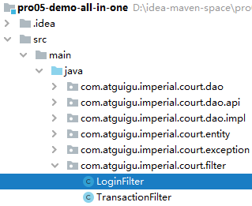

```java
public class LoginFilter implements Filter {
    @Override
    public void init(FilterConfig filterConfig) throws ServletException {}

    @Override
    public void doFilter(ServletRequest servletRequest, ServletResponse servletResponse, FilterChain filterChain) throws IOException, ServletException {
        // 1、获取 HttpSession 对象
        HttpServletRequest request = (HttpServletRequest) servletRequest;

        HttpSession session = request.getSession();
        
        // 2、尝试从 Session 域获取已登录的对象
        Object loginEmp = session.getAttribute(ImperialCourtConst.LOGIN_EMP_ATTR_NAME);
        
        // 3、判断 loginEmp 是否为空
        if (loginEmp != null) {
            
            // 4、若不为空则说明当前请求已登录，直接放行
            filterChain.doFilter(request, servletResponse);
            
            return ;
        }
        
        // 5、若为空说明尚未登录，则回到登录页面
        request.setAttribute("systemMessage", ImperialCourtConst.ACCESS_DENIED_MESSAGE);
        request.getRequestDispatcher("/").forward(request, servletResponse);
    }

    @Override
    public void destroy() {}
}
```

#### [#](https://heavy_code_industry.gitee.io/code_heavy_industry/pro002-maven/chapter06/verse10.html#_2注册)②注册

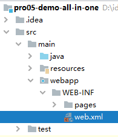

把 LoginFilter 放在 TransactionFilter 前面声明，原因是：如果登录检查失败不放行，直接跳转到页面，此时将不必执行 TransactionFilter 中的事务操作，可以节约性能。

```xml
<filter>
    <filter-name>loginFilter</filter-name>
    <filter-class>com.atguigu.imperial.court.filter.LoginFilter</filter-class>
</filter>
<filter-mapping>
    <filter-name>loginFilter</filter-name>
    <url-pattern>/work</url-pattern>
</filter-mapping>
```

## 第十一节 打包部署

友情提示：[Linux教程目录 | 代码重工 (gitee.io)(opens new window)](http://heavy_code_industry.gitee.io/code_heavy_industry/pro006-Linux/lecture/)

### [#](https://heavy_code_industry.gitee.io/code_heavy_industry/pro002-maven/chapter06/verse11.html#_1、适配部署环境)1、适配部署环境

MySQL 连接信息中，IP 地址部分需要改成 localhost。

![images]()

```properties
url=jdbc:mysql://localhost:3306/db_imperial_court
```

### [#](https://heavy_code_industry.gitee.io/code_heavy_industry/pro002-maven/chapter06/verse11.html#_2、跳过测试打包)2、跳过测试打包

```sh
mvn clean package -Dmaven.test.skip=true
```

可以人为指定最终 war 包名称：

```xml
    <!-- 对构建过程进行自己的定制 -->
    <build>
        <!-- 当前工程在构建过程中使用的最终名称 -->
        <finalName>demo-me</finalName>
    </build>
```

### [#](https://heavy_code_industry.gitee.io/code_heavy_industry/pro002-maven/chapter06/verse11.html#_3、部署执行)3、部署执行

#### [#](https://heavy_code_industry.gitee.io/code_heavy_industry/pro002-maven/chapter06/verse11.html#_1上传-war-包)①上传 war 包

[略]

#### [#](https://heavy_code_industry.gitee.io/code_heavy_industry/pro002-maven/chapter06/verse11.html#_2启动-tomcat)②启动 Tomcat

```sh
/opt/apache-tomcat-8.5.75/bin/startup.sh
```

#### [#](https://heavy_code_industry.gitee.io/code_heavy_industry/pro002-maven/chapter06/verse11.html#_3访问测试)③访问测试

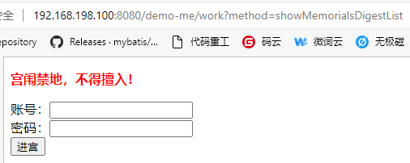

# 第七章 SSM 整合伪分布式案例

## 第一节 创建工程，引入依赖

### [#](http://heavy_code_industry.gitee.io/code_heavy_industry/pro002-maven/chapter07/verse01.html#_1、创建工程)1、创建工程

#### [#](http://heavy_code_industry.gitee.io/code_heavy_industry/pro002-maven/chapter07/verse01.html#_1工程清单)①工程清单

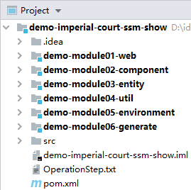

| 工程名                       | 地位   | 说明                 |
| ---------------------------- | ------ | -------------------- |
| demo-imperial-court-ssm-show | 父工程 | 总体管理各个子工程   |
| demo-module01-web            | 子工程 | 唯一的 war 包工程    |
| demo-module02-component      | 子工程 | 管理项目中的各种组件 |
| demo-module03-entity         | 子工程 | 管理项目中的实体类   |
| demo-module04-util           | 子工程 | 管理项目中的工具类   |
| demo-module05-environment    | 子工程 | 框架环境所需依赖     |
| demo-module06-generate       | 子工程 | Mybatis 逆向工程     |

#### [#](http://heavy_code_industry.gitee.io/code_heavy_industry/pro002-maven/chapter07/verse01.html#_2工程间关系)②工程间关系


### [#](http://heavy_code_industry.gitee.io/code_heavy_industry/pro002-maven/chapter07/verse01.html#_2、各工程-pom-配置)2、各工程 POM 配置

#### [#](http://heavy_code_industry.gitee.io/code_heavy_industry/pro002-maven/chapter07/verse01.html#_1父工程)①父工程

POM 位置如下：

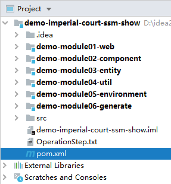

各子工程创建好之后就会有下面配置，不需要手动编辑：

```xml
<groupId>com.atguigu</groupId>
<artifactId>demo-imperial-court-ssm-show</artifactId>
<packaging>pom</packaging>
<version>1.0-SNAPSHOT</version>
<modules>
    <module>demo-module01-web</module>
    <module>demo-module02-component</module>
    <module>demo-module03-entity</module>
    <module>demo-module04-util</module>
    <module>demo-module05-environment</module>
    <module>demo-module06-generate</module>
</modules>
```

#### [#](http://heavy_code_industry.gitee.io/code_heavy_industry/pro002-maven/chapter07/verse01.html#_2mybatis-逆向工程)②Mybatis 逆向工程

POM 位置如下：

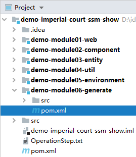

```xml
<!-- 依赖MyBatis核心包 -->
<dependencies>
    <dependency>
        <groupId>org.mybatis</groupId>
        <artifactId>mybatis</artifactId>
        <version>3.5.7</version>
    </dependency>
</dependencies>

<!-- 控制Maven在构建过程中相关配置 -->
<build>

    <!-- 构建过程中用到的插件 -->
    <plugins>

        <!-- 具体插件，逆向工程的操作是以构建过程中插件形式出现的 -->
        <plugin>
            <groupId>org.mybatis.generator</groupId>
            <artifactId>mybatis-generator-maven-plugin</artifactId>
            <version>1.3.0</version>

            <!-- 插件的依赖 -->
            <dependencies>

                <!-- 逆向工程的核心依赖 -->
                <dependency>
                    <groupId>org.mybatis.generator</groupId>
                    <artifactId>mybatis-generator-core</artifactId>
                    <version>1.3.2</version>
                </dependency>

                <!-- 数据库连接池 -->
                <dependency>
                    <groupId>com.mchange</groupId>
                    <artifactId>c3p0</artifactId>
                    <version>0.9.2</version>
                </dependency>

                <!-- MySQL驱动 -->
                <dependency>
                    <groupId>mysql</groupId>
                    <artifactId>mysql-connector-java</artifactId>
                    <version>5.1.8</version>
                </dependency>
            </dependencies>
        </plugin>
    </plugins>
</build>
```


#### [#](http://heavy_code_industry.gitee.io/code_heavy_industry/pro002-maven/chapter07/verse01.html#_3环境依赖工程)③环境依赖工程

POM 位置如下：

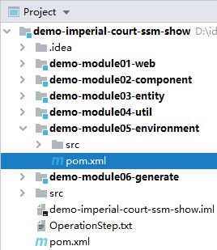

```xml
<!-- SpringMVC -->
<dependency>
    <groupId>org.springframework</groupId>
    <artifactId>spring-webmvc</artifactId>
    <version>5.3.1</version>
</dependency>

<!-- Spring 持久化层所需依赖 -->
<dependency>
    <groupId>org.springframework</groupId>
    <artifactId>spring-orm</artifactId>
    <version>5.3.1</version>
</dependency>

<!-- 日志 -->
<dependency>
    <groupId>ch.qos.logback</groupId>
    <artifactId>logback-classic</artifactId>
    <version>1.2.3</version>
</dependency>

<!-- Spring5和Thymeleaf整合包 -->
<dependency>
    <groupId>org.thymeleaf</groupId>
    <artifactId>thymeleaf-spring5</artifactId>
    <version>3.0.12.RELEASE</version>
</dependency>

<!-- Mybatis 和 Spring 的整合包 -->
<dependency>
    <groupId>org.mybatis</groupId>
    <artifactId>mybatis-spring</artifactId>
    <version>2.0.6</version>
</dependency>

<!-- Mybatis核心 -->
<dependency>
    <groupId>org.mybatis</groupId>
    <artifactId>mybatis</artifactId>
    <version>3.5.7</version>
</dependency>

<!-- MySQL驱动 -->
<dependency>
    <groupId>mysql</groupId>
    <artifactId>mysql-connector-java</artifactId>
    <version>5.1.3</version>
</dependency>

<!-- 数据源 -->
<dependency>
    <groupId>com.alibaba</groupId>
    <artifactId>druid</artifactId>
    <version>1.0.31</version>
</dependency>
```


#### [#](http://heavy_code_industry.gitee.io/code_heavy_industry/pro002-maven/chapter07/verse01.html#_4工具类工程)④工具类工程

无配置。

#### [#](http://heavy_code_industry.gitee.io/code_heavy_industry/pro002-maven/chapter07/verse01.html#_5实体类工程)⑤实体类工程

无配置。

#### [#](http://heavy_code_industry.gitee.io/code_heavy_industry/pro002-maven/chapter07/verse01.html#_6组件工程)⑥组件工程

POM 位置如下：

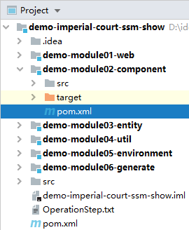

```xml
<dependency>
    <groupId>com.atguigu</groupId>
    <artifactId>demo-module03-entity</artifactId>
    <version>1.0-SNAPSHOT</version>
</dependency>
<dependency>
    <groupId>com.atguigu</groupId>
    <artifactId>demo-module04-util</artifactId>
    <version>1.0-SNAPSHOT</version>
</dependency>
<dependency>
    <groupId>com.atguigu</groupId>
    <artifactId>demo-module05-environment</artifactId>
    <version>1.0-SNAPSHOT</version>
</dependency>

<!-- ServletAPI -->
<dependency>
    <groupId>javax.servlet</groupId>
    <artifactId>javax.servlet-api</artifactId>
    <version>3.1.0</version>
    <scope>provided</scope>
</dependency>
```


#### [#](http://heavy_code_industry.gitee.io/code_heavy_industry/pro002-maven/chapter07/verse01.html#_7web-工程)⑦Web 工程

POM 位置如下：

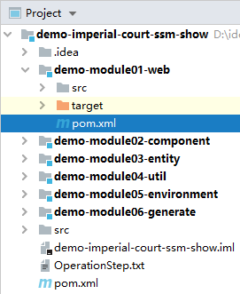

```xml
<dependency>
    <groupId>com.atguigu</groupId>
    <artifactId>demo-module02-component</artifactId>
    <version>1.0-SNAPSHOT</version>
</dependency>

<!-- junit5 -->
<dependency>
    <groupId>org.junit.jupiter</groupId>
    <artifactId>junit-jupiter-api</artifactId>
    <version>5.7.0</version>
    <scope>test</scope>
</dependency>

<!-- Spring 的测试功能 -->
<dependency>
    <groupId>org.springframework</groupId>
    <artifactId>spring-test</artifactId>
    <version>5.3.1</version>
    <scope>test</scope>
</dependency>
```

## 第二节 搭建环境：持久化层

### [#](https://heavy_code_industry.gitee.io/code_heavy_industry/pro002-maven/chapter07/verse02.html#_1、物理建模)1、物理建模

我们仍然继续使用《第六章 单一架构案例》中创建的数据库和表。

### [#](https://heavy_code_industry.gitee.io/code_heavy_industry/pro002-maven/chapter07/verse02.html#_2、mybatis-逆向工程)2、Mybatis 逆向工程

#### [#](https://heavy_code_industry.gitee.io/code_heavy_industry/pro002-maven/chapter07/verse02.html#_1generatorconfig-xml)①generatorConfig.xml

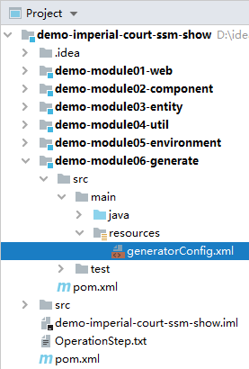

[查看详细配置信息](https://heavy_code_industry.gitee.io/code_heavy_industry/pro002-maven/chapter07/generatorConfig.html)


```xml
<?xml version="1.0" encoding="UTF-8"?>
<!DOCTYPE generatorConfiguration
        PUBLIC "-//mybatis.org//DTD MyBatis Generator Configuration 1.0//EN"
        "http://mybatis.org/dtd/mybatis-generator-config_1_0.dtd">
<generatorConfiguration>
    <!--
            targetRuntime: 执行生成的逆向工程的版本
                    MyBatis3Simple: 生成基本的CRUD（清新简洁版）
                    MyBatis3: 生成带条件的CRUD（奢华尊享版）
     -->
    <context id="DB2Tables" targetRuntime="MyBatis3">
        <!-- 数据库的连接信息 -->
        <jdbcConnection driverClass="com.mysql.jdbc.Driver"
                        connectionURL="jdbc:mysql://192.168.198.100:3306/db_imperial_court"
                        userId="root"
                        password="atguigu">
        </jdbcConnection>
        <!-- javaBean的生成策略-->
        <javaModelGenerator targetPackage="com.atguigu.imperial.court.entity" targetProject=".\src\main\java">
            <property name="enableSubPackages" value="true" />
            <property name="trimStrings" value="true" />
        </javaModelGenerator>
        <!-- SQL映射文件的生成策略 -->
        <sqlMapGenerator targetPackage="com.atguigu.imperial.court.mapper"  targetProject=".\src\main\java">
            <property name="enableSubPackages" value="true" />
        </sqlMapGenerator>
        <!-- Mapper接口的生成策略 -->
        <javaClientGenerator type="XMLMAPPER" targetPackage="com.atguigu.imperial.court.mapper"  targetProject=".\src\main\java">
            <property name="enableSubPackages" value="true" />
        </javaClientGenerator>
        <!-- 逆向分析的表 -->
        <!-- tableName设置为*号，可以对应所有表，此时不写domainObjectName -->
        <!-- domainObjectName属性指定生成出来的实体类的类名 -->
        <table tableName="t_emp" domainObjectName="Emp"/>
        <table tableName="t_memorials" domainObjectName="Memorials"/>
    </context>
</generatorConfiguration>
```


#### [#](https://heavy_code_industry.gitee.io/code_heavy_industry/pro002-maven/chapter07/verse02.html#_2执行逆向生成)②执行逆向生成

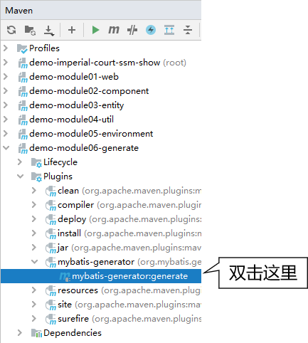

#### [#](https://heavy_code_industry.gitee.io/code_heavy_industry/pro002-maven/chapter07/verse02.html#_3资源归位)③资源归位

下面罗列各种资源应该存放的位置，排名不分先后：

##### [#](https://heavy_code_industry.gitee.io/code_heavy_industry/pro002-maven/chapter07/verse02.html#_1-mapper-配置文件)[1]Mapper 配置文件

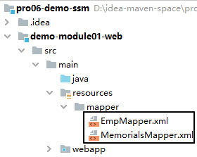

##### [#](https://heavy_code_industry.gitee.io/code_heavy_industry/pro002-maven/chapter07/verse02.html#_2-mapper-接口)[2]Mapper 接口

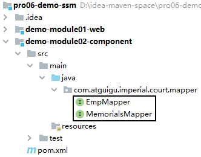

##### [#](https://heavy_code_industry.gitee.io/code_heavy_industry/pro002-maven/chapter07/verse02.html#_3-实体类)[3]实体类

Mybatis 逆向工程生成的实体类只有字段和 get、set 方法，我们可以自己添加无参构造器、有参构造器、toString() 方法。

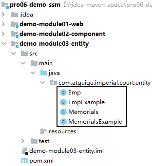

### [#](https://heavy_code_industry.gitee.io/code_heavy_industry/pro002-maven/chapter07/verse02.html#_3、建立数据库连接)3、建立数据库连接

#### [#](https://heavy_code_industry.gitee.io/code_heavy_industry/pro002-maven/chapter07/verse02.html#_1数据库连接信息)①数据库连接信息

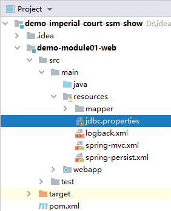

```properties
dev.driverClassName=com.mysql.jdbc.Driver
dev.url=jdbc:mysql://192.168.198.100:3306/db_imperial_court
dev.username=root
dev.password=atguigu
dev.initialSize=10
dev.maxActive=20
dev.maxWait=10000
```


#### [#](https://heavy_code_industry.gitee.io/code_heavy_industry/pro002-maven/chapter07/verse02.html#_2配置数据源)②配置数据源

![images]()

```xml
<?xml version="1.0" encoding="UTF-8"?>
<beans xmlns="http://www.springframework.org/schema/beans"
       xmlns:xsi="http://www.w3.org/2001/XMLSchema-instance"
       xmlns:context="http://www.springframework.org/schema/context"
       xsi:schemaLocation="http://www.springframework.org/schema/beans http://www.springframework.org/schema/beans/spring-beans.xsd http://www.springframework.org/schema/context https://www.springframework.org/schema/context/spring-context.xsd">

    <!-- 加载外部属性文件 -->
    <context:property-placeholder location="classpath:jdbc.properties"/>

    <!-- 配置数据源 -->
    <bean id="dataSource" class="com.alibaba.druid.pool.DruidDataSource">
        <property name="username" value="${dev.username}"/>
        <property name="password" value="${dev.password}"/>
        <property name="url" value="${dev.url}"/>
        <property name="driverClassName" value="${dev.driverClassName}"/>
        <property name="initialSize" value="${dev.initialSize}"/>
        <property name="maxActive" value="${dev.maxActive}"/>
        <property name="maxWait" value="${dev.maxWait}"/>
    </bean>
    
</beans>
```


#### [#](https://heavy_code_industry.gitee.io/code_heavy_industry/pro002-maven/chapter07/verse02.html#_3测试)③测试

![images]()

```java
@ExtendWith(SpringExtension.class)
@ContextConfiguration(value = {"classpath:spring-persist.xml"})
public class ImperialCourtTest {

    @Autowired
    private DataSource dataSource;

    private Logger logger = LoggerFactory.getLogger(ImperialCourtTest.class);

    @Test
    public void testConnection() throws SQLException {
        Connection connection = dataSource.getConnection();
        logger.debug(connection.toString());
    }

}
```


TIP

配置文件为什么要放到 Web 工程里面？

- Web 工程将来生成 war 包。
- war 包直接部署到 Tomcat 运行。
- Tomcat 从 war 包（解压目录）查找配置文件最直接。
- 如果不是把配置文件放在 Web 工程，而是放在 Java 工程，那就等于将配置文件放在了 war 包内的 jar 包中。
- 配置文件在 jar 包中读取相对困难。

### [#](https://heavy_code_industry.gitee.io/code_heavy_industry/pro002-maven/chapter07/verse02.html#_4、spring-整合-mybatis)4、Spring 整合 Mybatis

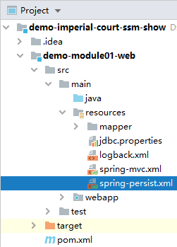

#### [#](https://heavy_code_industry.gitee.io/code_heavy_industry/pro002-maven/chapter07/verse02.html#_1配置-sqlsessionfactorybean)①配置 SqlSessionFactoryBean

**目的**1：装配数据源

**目的**2：指定 Mapper 配置文件的位置

```xml
<!-- 配置 SqlSessionFactoryBean -->
<bean id="sqlSessionFactory" class="org.mybatis.spring.SqlSessionFactoryBean">

    <!-- 装配数据源 -->
    <property name="dataSource" ref="druidDataSource"/>

    <!-- 指定 Mapper 配置文件的位置 -->
    <property name="mapperLocations" value="classpath:mapper/*Mapper.xml"/>
</bean>
```

#### [#](https://heavy_code_industry.gitee.io/code_heavy_industry/pro002-maven/chapter07/verse02.html#_2扫描-mapper-接口)②扫描 Mapper 接口

```xml
<mybatis:scan base-package="com.atguigu.imperial.court.mapper"/>
```

#### [#](https://heavy_code_industry.gitee.io/code_heavy_industry/pro002-maven/chapter07/verse02.html#_3测试-2)③测试

![images]()

```java
@Autowired
private EmpMapper empMapper;

@Test
public void testEmpMapper() {
    List<Emp> empList = empMapper.selectByExample(new EmpExample());
    for (Emp emp : empList) {
        System.out.println("emp = " + emp);
    }
}
```

## 第三节 搭建环境：事务控制

### [#](https://heavy_code_industry.gitee.io/code_heavy_industry/pro002-maven/chapter07/verse03.html#_1、声明式事务配置)1、声明式事务配置


```xml
<!-- 配置事务管理器 -->
<bean id="transactionManager" class="org.springframework.jdbc.datasource.DataSourceTransactionManager">
    <!-- 装配数据源 -->
    <property name="dataSource" ref="dataSource"/>
</bean>

<!-- 配置事务的注解驱动，开启基于注解的声明式事务功能 -->
<tx:annotation-driven transaction-manager="transactionManager"/>
```

### [#](https://heavy_code_industry.gitee.io/code_heavy_industry/pro002-maven/chapter07/verse03.html#_2、注解写法)2、注解写法

#### [#](https://heavy_code_industry.gitee.io/code_heavy_industry/pro002-maven/chapter07/verse03.html#_1查询操作)①查询操作

```java
@Transactional(readOnly = true)
```

#### [#](https://heavy_code_industry.gitee.io/code_heavy_industry/pro002-maven/chapter07/verse03.html#_2增删改操作)②增删改操作

```java
@Transactional(propagation = Propagation.REQUIRES_NEW, readOnly = false)
```

TIP

在具体代码开发中可能会将相同设置的 @Transactional 注解提取到 Service 类上。

## 第四节 搭建环境：表述层

### [#](https://heavy_code_industry.gitee.io/code_heavy_industry/pro002-maven/chapter07/verse04.html#_1、设定-web-工程)1、设定 Web 工程

[传送门(opens new window)](http://heavy_code_industry.gitee.io/code_heavy_industry/pro002-maven/chapter04/verse04.html)

### [#](https://heavy_code_industry.gitee.io/code_heavy_industry/pro002-maven/chapter07/verse04.html#_2、web-xml-配置)2、web.xml 配置

#### [#](https://heavy_code_industry.gitee.io/code_heavy_industry/pro002-maven/chapter07/verse04.html#_1配置-contextloaderlistener)①配置 ContextLoaderListener

```xml
<!-- 第一部分：加载 spring-persist.xml 配置文件 -->
<context-param>
    <param-name>contextConfigLocation</param-name>
    <param-value>classpath:spring-persist.xml</param-value>
</context-param>
<listener>
    <listener-class>org.springframework.web.context.ContextLoaderListener</listener-class>
</listener>
```

#### [#](https://heavy_code_industry.gitee.io/code_heavy_industry/pro002-maven/chapter07/verse04.html#_2配置-dispatcherservlet)②配置 DispatcherServlet

```xml
<!-- 第二部分：加载 spring-mvc.xml 配置文件 -->
<servlet>
    <servlet-name>dispatcherServlet</servlet-name>
    <servlet-class>org.springframework.web.servlet.DispatcherServlet</servlet-class>
    <init-param>
        <param-name>contextConfigLocation</param-name>
        <param-value>classpath:spring-mvc.xml</param-value>
    </init-param>
    <load-on-startup>1</load-on-startup>
</servlet>
<servlet-mapping>
    <servlet-name>dispatcherServlet</servlet-name>
    <url-pattern>/</url-pattern>
</servlet-mapping>
```

#### [#](https://heavy_code_industry.gitee.io/code_heavy_industry/pro002-maven/chapter07/verse04.html#_3配置-characterencodingfilter)③配置 CharacterEncodingFilter

```xml
<!-- 第三部分：设置字符集的 Filter -->
<filter>
    <filter-name>characterEncodingFilter</filter-name>
    <filter-class>org.springframework.web.filter.CharacterEncodingFilter</filter-class>
    <init-param>
        <param-name>encoding</param-name>
        <param-value>UTF-8</param-value>
    </init-param>
    <init-param>
        <param-name>forceRequestEncoding</param-name>
        <param-value>true</param-value>
    </init-param>
    <init-param>
        <param-name>forceResponseEncoding</param-name>
        <param-value>true</param-value>
    </init-param>
</filter>
<filter-mapping>
    <filter-name>characterEncodingFilter</filter-name>
    <url-pattern>/*</url-pattern>
</filter-mapping>
```

#### [#](https://heavy_code_industry.gitee.io/code_heavy_industry/pro002-maven/chapter07/verse04.html#_4配置-hiddenhttpmethodfilter)④配置 HiddenHttpMethodFilter

```xml
<!-- 第四部分：按照 RESTFul 风格负责转换请求方式的 Filter -->
<filter>
    <filter-name>hiddenHttpMethodFilter</filter-name>
    <filter-class>org.springframework.web.filter.HiddenHttpMethodFilter</filter-class>
</filter>
<filter-mapping>
    <filter-name>hiddenHttpMethodFilter</filter-name>
    <url-pattern>/*</url-pattern>
</filter-mapping>
```

### [#](https://heavy_code_industry.gitee.io/code_heavy_industry/pro002-maven/chapter07/verse04.html#_3、显示首页)3、显示首页

#### [#](https://heavy_code_industry.gitee.io/code_heavy_industry/pro002-maven/chapter07/verse04.html#_1配置-springmvc)①配置 SpringMVC

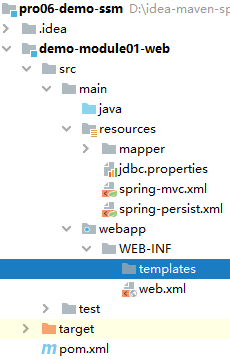

##### [#](https://heavy_code_industry.gitee.io/code_heavy_industry/pro002-maven/chapter07/verse04.html#_1-标配)[1]标配

```xml
<?xml version="1.0" encoding="UTF-8"?>
<beans xmlns="http://www.springframework.org/schema/beans"
       xmlns:xsi="http://www.w3.org/2001/XMLSchema-instance" xmlns:mvn="http://www.springframework.org/schema/mvc"
       xmlns:mvc="http://www.springframework.org/schema/mvc"
       xmlns:context="http://www.springframework.org/schema/context"
       xsi:schemaLocation="http://www.springframework.org/schema/beans http://www.springframework.org/schema/beans/spring-beans.xsd http://www.springframework.org/schema/mvc https://www.springframework.org/schema/mvc/spring-mvc.xsd http://www.springframework.org/schema/context https://www.springframework.org/schema/context/spring-context.xsd">
    
    <!-- 开启 SpringMVC 的注解驱动功能 -->
    <mvn:annotation-driven />

    <!-- 让 SpringMVC 对没有 @RequestMapping 的请求直接放行 -->
    <mvc:default-servlet-handler />

</beans>
```

##### [#](https://heavy_code_industry.gitee.io/code_heavy_industry/pro002-maven/chapter07/verse04.html#_2-配置视图解析相关)[2]配置视图解析相关

```xml
<!-- 配置视图解析器 -->
<bean id="thymeleafViewResolver" class="org.thymeleaf.spring5.view.ThymeleafViewResolver">
	<property name="order" value="1"/>
	<property name="characterEncoding" value="UTF-8"/>
	<property name="templateEngine">
		<bean class="org.thymeleaf.spring5.SpringTemplateEngine">
			<property name="templateResolver">
				<bean class="org.thymeleaf.spring5.templateresolver.SpringResourceTemplateResolver">
					<property name="prefix" value="/WEB-INF/templates/"/>
					<property name="suffix" value=".html"/>
					<property name="characterEncoding" value="UTF-8"/>
					<property name="templateMode" value="HTML5"/>
				</bean>
			</property>
		</bean>
	</property>
</bean>
```

**注意**：需要我们自己手动创建 templates 目录。


##### [#](https://heavy_code_industry.gitee.io/code_heavy_industry/pro002-maven/chapter07/verse04.html#_3-配置自动扫描的包)[3]配置自动扫描的包

```xml
<!-- 配置自动扫描的包 -->
<context:component-scan base-package="com.atguigu.imperial.court.controller"/>
<!-- 配置对 Service 所在包的自动扫描 -->
<context:component-scan base-package="com.atguigu.imperial.court.service"/>
```

#### [#](https://heavy_code_industry.gitee.io/code_heavy_industry/pro002-maven/chapter07/verse04.html#_2配置-view-controller-访问首页)②配置 view-controller 访问首页

```xml
<!-- 配置 view-controller -->
<mvc:view-controller path="/" view-name="index" />
```

#### [#](https://heavy_code_industry.gitee.io/code_heavy_industry/pro002-maven/chapter07/verse04.html#_3创建首页模板文件)③创建首页模板文件

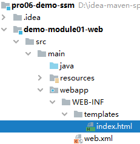

```html
<!DOCTYPE html>
<html lang="en" xml:th="http://www.thymeleaf.org">
<head>
    <meta charset="UTF-8">
    <title>首页</title>
</head>
<body>

<!-- @{/auth} 解析后：/demo/auth -->
<form th:action="@{/auth/login}" method="post">

    <!-- th:text 解析表达式后会替换标签体 -->
    <!-- ${attrName} 从请求域获取属性名为 attrName 的属性值 -->
    <p style="color: red;font-weight: bold;" th:text="${message}"></p>
    <p style="color: red;font-weight: bold;" th:text="${systemMessage}"></p>

    账号：<input type="text" name="loginAccount"/><br/>
    密码：<input type="password" name="loginPassword"><br/>
    <button type="submit">进宫</button>
</form>

</body>
</html>
```

## 第五节 搭建环境：辅助功能

### [#](https://heavy_code_industry.gitee.io/code_heavy_industry/pro002-maven/chapter07/verse05.html#_1、登录失败异常)1、登录失败异常


```java
public class LoginFailedException extends RuntimeException {

    public LoginFailedException() {
    }

    public LoginFailedException(String message) {
        super(message);
    }

    public LoginFailedException(String message, Throwable cause) {
        super(message, cause);
    }

    public LoginFailedException(Throwable cause) {
        super(cause);
    }

    public LoginFailedException(String message, Throwable cause, boolean enableSuppression, boolean writableStackTrace) {
        super(message, cause, enableSuppression, writableStackTrace);
    }
}
```


### [#](https://heavy_code_industry.gitee.io/code_heavy_industry/pro002-maven/chapter07/verse05.html#_2、常量类)2、常量类


```java
public class ImperialCourtConst {

    public static final String LOGIN_FAILED_MESSAGE = "账号、密码错误，不可进宫！";
    public static final String ACCESS_DENIED_MESSAGE = "宫闱禁地，不得擅入！";
    public static final String LOGIN_EMP_ATTR_NAME = "loginInfo";

}
```


### [#](https://heavy_code_industry.gitee.io/code_heavy_industry/pro002-maven/chapter07/verse05.html#_3、md5-工具)3、MD5 工具


```java
public class MD5Util {

    /**
     * 针对明文字符串执行MD5加密
     * @param source
     * @return
     */
    public static String encode(String source) {

        // 1.判断明文字符串是否有效
        if (source == null || "".equals(source)) {
            throw new RuntimeException("用于加密的明文不可为空");
        }

        // 2.声明算法名称
        String algorithm = "md5";

        // 3.获取MessageDigest对象
        MessageDigest messageDigest = null;
        try {
            messageDigest = MessageDigest.getInstance(algorithm);
        } catch (NoSuchAlgorithmException e) {
            e.printStackTrace();
        }

        // 4.获取明文字符串对应的字节数组
        byte[] input = source.getBytes();

        // 5.执行加密
        byte[] output = messageDigest.digest(input);

        // 6.创建BigInteger对象
        int signum = 1;
        BigInteger bigInteger = new BigInteger(signum, output);

        // 7.按照16进制将bigInteger的值转换为字符串
        int radix = 16;
        String encoded = bigInteger.toString(radix).toUpperCase();

        return encoded;
    }

}
```


### [#](https://heavy_code_industry.gitee.io/code_heavy_industry/pro002-maven/chapter07/verse05.html#_4、日志配置文件)4、日志配置文件


```xml
<?xml version="1.0" encoding="UTF-8"?>
<configuration debug="true">
    <!-- 指定日志输出的位置 -->
    <appender name="STDOUT"
              class="ch.qos.logback.core.ConsoleAppender">
        <encoder>
            <!-- 日志输出的格式 -->
            <!-- 按照顺序分别是：时间、日志级别、线程名称、打印日志的类、日志主体内容、换行 -->
            <pattern>[%d{HH:mm:ss.SSS}] [%-5level] [%thread] [%logger] [%msg]%n</pattern>
            <charset>UTF-8</charset>
        </encoder>
    </appender>

    <!-- 设置全局日志级别。日志级别按顺序分别是：DEBUG、INFO、WARN、ERROR -->
    <!-- 指定任何一个日志级别都只打印当前级别和后面级别的日志。 -->
    <root level="INFO">
        <!-- 指定打印日志的appender，这里通过“STDOUT”引用了前面配置的appender -->
        <appender-ref ref="STDOUT" />
    </root>

    <!-- 专门给某一个包指定日志级别 -->
    <logger name="com.atguigu" level="DEBUG" additivity="false">
        <appender-ref ref="STDOUT" />
    </logger>

</configuration>
```

## 第六节 业务功能：登录

### [#](https://heavy_code_industry.gitee.io/code_heavy_industry/pro002-maven/chapter07/verse06.html#_1、authcontroller)1、AuthController

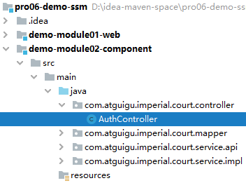

```java
@Controller
public class AuthController {

    @Autowired
    private EmpService empService;

    @RequestMapping("/auth/login")
    public String doLogin(
            @RequestParam("loginAccount") String loginAccount,
            @RequestParam("loginPassword") String loginPassword,
            HttpSession session,
            Model model
    ) {

        // 1、尝试查询登录信息
        Emp emp = empService.getEmpByLogin(loginAccount, loginPassword);

        // 2、判断登录是否成功
        if (emp == null) {

            // 3、如果登录失败则回到登录页面显示提示消息
            model.addAttribute("message", ImperialCourtConst.LOGIN_FAILED_MESSAGE);

            return "index";

        } else {

            // 4、如果登录成功则将登录信息存入 Session 域
            session.setAttribute("loginInfo", emp);

            return "target";
        }
    }

}
```

### [#](https://heavy_code_industry.gitee.io/code_heavy_industry/pro002-maven/chapter07/verse06.html#_2、empservice)2、EmpService

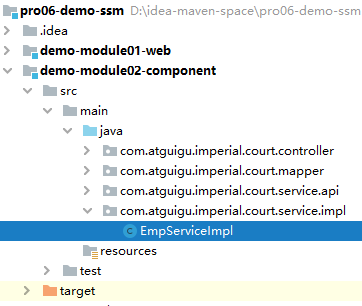

```java
@Service
@Transactional(readOnly = true)
public class EmpServiceImpl implements EmpService {

    @Autowired
    private EmpMapper empMapper;


    @Override
    public Emp getEmpByLogin(String loginAccount, String loginPassword) {

        // 1、密码加密
        String encodedLoginPassword = MD5Util.encode(loginPassword);

        // 2、通过 QBC 查询方式封装查询条件
        EmpExample example = new EmpExample();

        EmpExample.Criteria criteria = example.createCriteria();

        criteria.andLoginAccountEqualTo(loginAccount).andLoginPasswordEqualTo(encodedLoginPassword);

        List<Emp> empList = empMapper.selectByExample(example);

        if (empList != null && empList.size() > 0) {

            // 3、返回查询结果
            return empList.get(0);
        }

        return null;
    }
}
```

---

**xml形式：**

`com.atguigu.imperial.court.mapper.EmpMapper`

```java
public interface EmpMapper {
    //...
    Emp login(String loginAccount, String newPwd);
}
```

`src/main/resources/mapper/EmpMapper.xml`

```java
<?xml version="1.0" encoding="UTF-8" ?>
<!DOCTYPE mapper PUBLIC "-//mybatis.org//DTD Mapper 3.0//EN" "http://mybatis.org/dtd/mybatis-3-mapper.dtd" >
<mapper namespace="com.atguigu.imperial.court.mapper.EmpMapper">
    <resultMap id="BaseResultMap" type="com.atguigu.imperial.court.entity.Emp">
        <id column="emp_id" property="empId" jdbcType="INTEGER"/>
        <result column="emp_name" property="empName" jdbcType="CHAR"/>
        <result column="emp_position" property="empPosition" jdbcType="CHAR"/>
        <result column="login_account" property="loginAccount" jdbcType="CHAR"/>
        <result column="login_password" property="loginPassword" jdbcType="CHAR"/>
    </resultMap>
  
    <select id="login" resultMap="BaseResultMap">
        SELECT *
        FROM t_emp
        WHERE login_account = #{arg0}
          AND login_password = #{arg1}
    </select>
</mapper>
```


### [#](https://heavy_code_industry.gitee.io/code_heavy_industry/pro002-maven/chapter07/verse06.html#_3、target-html)3、target.html

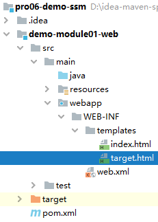

```html
<!DOCTYPE html>
<html lang="en" xml:th="http://www.thymeleaf.org">
<head>
    <meta charset="UTF-8">
    <title>Title</title>
</head>
<body>

    <p th:text="${session.loginInfo}"></p>

</body>
</html>
```

# 第八章 微服务架构案例

## 第一节 创建工程

### [#](http://heavy_code_industry.gitee.io/code_heavy_industry/pro002-maven/chapter08/verse01.html#_1、创建工程)1、创建工程

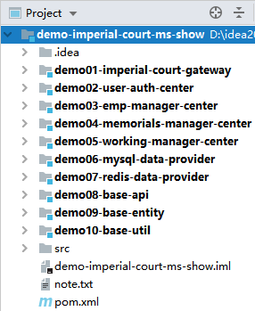

| 工程名                          | 地位   | 说明               |
| ------------------------------- | ------ | ------------------ |
| **demo-imperial-court-ms-show** | 父工程 | 总体管理各个子工程 |
| demo01-imperial-court-gateway   | 子工程 | 网关               |
| **demo02-user-auth-center**     | 子工程 | 用户中心           |
| demo03-emp-manager-center       | 子工程 | 员工数据维护中心   |
| demo04-memorials-manager-center | 子工程 | 奏折数据维护中心   |
| demo05-working-manager-center   | 子工程 | 批阅奏折工作中心   |
| **demo06-mysql-data-provider**  | 子工程 | MySQL 数据提供者   |
| demo07-redis-data-provider      | 子工程 | Redis 数据提供者   |
| **demo08-base-api**             | 子工程 | 声明 Feign 接口    |
| **demo09-base-entity**          | 子工程 | 实体类             |
| **demo10-base-util**            | 子工程 | 工具类             |

### [#](http://heavy_code_industry.gitee.io/code_heavy_industry/pro002-maven/chapter08/verse01.html#_2、建立工程间依赖关系)2、建立工程间依赖关系

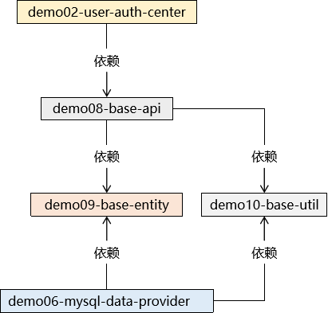

## 第二节 父工程管理依赖


```xml
<dependencyManagement>
    <dependencies>

        <!-- SpringCloud 依赖导入 -->
        <dependency>
            <groupId>org.springframework.cloud</groupId>
            <artifactId>spring-cloud-dependencies</artifactId>
            <version>Hoxton.SR9</version>
            <type>pom</type>
            <scope>import</scope>
        </dependency>

        <!-- SpringCloud Alibaba 依赖导入 -->
        <dependency>
            <groupId>com.alibaba.cloud</groupId>
            <artifactId>spring-cloud-alibaba-dependencies</artifactId>
            <version>2.2.6.RELEASE</version>
            <type>pom</type>
            <scope>import</scope>
        </dependency>

        <!-- SpringBoot 依赖导入 -->
        <dependency>
            <groupId>org.springframework.boot</groupId>
            <artifactId>spring-boot-dependencies</artifactId>
            <version>2.3.6.RELEASE</version>
            <type>pom</type>
            <scope>import</scope>
        </dependency>

        <!-- 通用 Mapper 依赖 -->
        <dependency>
            <groupId>tk.mybatis</groupId>
            <artifactId>mapper-spring-boot-starter</artifactId>
            <version>2.1.5</version>
        </dependency>

        <!-- Druid 数据源依赖 -->
        <dependency>
            <groupId>com.alibaba</groupId>
            <artifactId>druid-spring-boot-starter</artifactId>
            <version>1.1.10</version>
        </dependency>

        <!-- JPA 依赖 -->
        <dependency>
            <groupId>javax.persistence</groupId>
            <artifactId>persistence-api</artifactId>
            <version>1.0</version>
        </dependency>
    </dependencies>
</dependencyManagement>
```

## 第三节 打基础

### [#](http://heavy_code_industry.gitee.io/code_heavy_industry/pro002-maven/chapter08/verse03.html#_1、demo10-base-util)1、demo10-base-util

#### [#](http://heavy_code_industry.gitee.io/code_heavy_industry/pro002-maven/chapter08/verse03.html#_1imperialcourtconst-常量类)①ImperialCourtConst 常量类

```java
public class ImperialCourtConst {

    public static final String LOGIN_FAILED_MESSAGE = "账号、密码错误，不可进宫！";
    public static final String ACCESS_DENIED_MESSAGE = "宫闱禁地，不得擅入！";

}
```


#### [#](http://heavy_code_industry.gitee.io/code_heavy_industry/pro002-maven/chapter08/verse03.html#_2字符串加密工具类)②字符串加密工具类

```java
public class MD5Util {

    /**
     * 针对明文字符串执行MD5加密
     * @param source
     * @return
     */
    public static String encode(String source) {

        // 1.判断明文字符串是否有效
        if (source == null || "".equals(source)) {
            throw new RuntimeException("用于加密的明文不可为空");
        }

        // 2.声明算法名称
        String algorithm = "md5";

        // 3.获取MessageDigest对象
        MessageDigest messageDigest = null;
        try {
            messageDigest = MessageDigest.getInstance(algorithm);
        } catch (NoSuchAlgorithmException e) {
            e.printStackTrace();
        }

        // 4.获取明文字符串对应的字节数组
        byte[] input = source.getBytes();

        // 5.执行加密
        byte[] output = messageDigest.digest(input);

        // 6.创建BigInteger对象
        int signum = 1;
        BigInteger bigInteger = new BigInteger(signum, output);

        // 7.按照16进制将bigInteger的值转换为字符串
        int radix = 16;
        String encoded = bigInteger.toString(radix).toUpperCase();

        return encoded;
    }

}
```


#### [#](http://heavy_code_industry.gitee.io/code_heavy_industry/pro002-maven/chapter08/verse03.html#_3登录失败异常)③登录失败异常

```java
public class LoginFailedException extends RuntimeException {

    public LoginFailedException() {
    }

    public LoginFailedException(String message) {
        super(message);
    }

    public LoginFailedException(String message, Throwable cause) {
        super(message, cause);
    }

    public LoginFailedException(Throwable cause) {
        super(cause);
    }

    public LoginFailedException(String message, Throwable cause, boolean enableSuppression, boolean writableStackTrace) {
        super(message, cause, enableSuppression, writableStackTrace);
    }
}
```


#### [#](http://heavy_code_industry.gitee.io/code_heavy_industry/pro002-maven/chapter08/verse03.html#_4远程方法调用统一返回结果)④远程方法调用统一返回结果

```java
/**
 * 统一整个项目中远程方法调用返回的结果
 * @author Lenovo
 *
 * @param <T>
 */
public class ResultEntity<T> {
	
	public static final String SUCCESS = "SUCCESS";
	public static final String FAILED = "FAILED";
	
	// 用来封装当前请求处理的结果是成功还是失败
	private String result;
	
	// 请求处理失败时返回的错误消息
	private String message;
	
	// 要返回的数据
	private T data;
	
	/**
	 * 请求处理成功且不需要返回数据时使用的工具方法
	 * @return
	 */
	public static <Type> ResultEntity<Type> successWithoutData() {
		return new ResultEntity<Type>(SUCCESS, null, null);
	}
	
	/**
	 * 请求处理成功且需要返回数据时使用的工具方法
	 * @param data 要返回的数据
	 * @return
	 */
	public static <Type> ResultEntity<Type> successWithData(Type data) {
		return new ResultEntity<Type>(SUCCESS, null, data);
	}
	
	/**
	 * 请求处理失败后使用的工具方法
	 * @param message 失败的错误消息
	 * @return
	 */
	public static <Type> ResultEntity<Type> failed(String message) {
		return new ResultEntity<Type>(FAILED, message, null);
	}
	
	public ResultEntity() {
		
	}

	public ResultEntity(String result, String message, T data) {
		super();
		this.result = result;
		this.message = message;
		this.data = data;
	}

	@Override
	public String toString() {
		return "ResultEntity [result=" + result + ", message=" + message + ", data=" + data + "]";
	}

	public String getResult() {
		return result;
	}

	public void setResult(String result) {
		this.result = result;
	}

	public String getMessage() {
		return message;
	}

	public void setMessage(String message) {
		this.message = message;
	}

	public T getData() {
		return data;
	}

	public void setData(T data) {
		this.data = data;
	}

}
```


### [#](http://heavy_code_industry.gitee.io/code_heavy_industry/pro002-maven/chapter08/verse03.html#_2、demo09-base-entity)2、demo09-base-entity

#### [#](http://heavy_code_industry.gitee.io/code_heavy_industry/pro002-maven/chapter08/verse03.html#_1引入依赖)①引入依赖

```xml
<dependency>
    <groupId>javax.persistence</groupId>
    <artifactId>persistence-api</artifactId>
</dependency>
```

#### [#](http://heavy_code_industry.gitee.io/code_heavy_industry/pro002-maven/chapter08/verse03.html#_2创建实体类)②创建实体类

在 MySQL 数据提供服务中用到的通用 Mapper 技术需要借助 **@Table 注解**将实体类和数据库表关联起来。

```java
@Table(name = "t_emp")
public class Emp implements Serializable {

    private Integer empId;

    private String empName;

    private String empPosition;

    private String loginAccount;

    private String loginPassword;

    public Integer getEmpId() {
        return empId;
    }

    public void setEmpId(Integer empId) {
        this.empId = empId;
    }

    public String getEmpName() {
        return empName;
    }

    public void setEmpName(String empName) {
        this.empName = empName == null ? null : empName.trim();
    }

    public String getEmpPosition() {
        return empPosition;
    }

    public void setEmpPosition(String empPosition) {
        this.empPosition = empPosition == null ? null : empPosition.trim();
    }

    public String getLoginAccount() {
        return loginAccount;
    }

    public void setLoginAccount(String loginAccount) {
        this.loginAccount = loginAccount == null ? null : loginAccount.trim();
    }

    public String getLoginPassword() {
        return loginPassword;
    }

    public void setLoginPassword(String loginPassword) {
        this.loginPassword = loginPassword == null ? null : loginPassword.trim();
    }
}
```

## 第四节 用户登录认证服务：提供端

### [#](http://heavy_code_industry.gitee.io/code_heavy_industry/pro002-maven/chapter08/verse04.html#_1、总体分析)1、总体分析

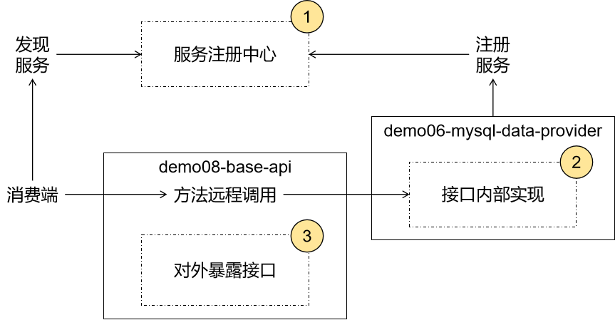


### [#](http://heavy_code_industry.gitee.io/code_heavy_industry/pro002-maven/chapter08/verse04.html#_2、注册中心)2、注册中心

在本地启动 Nacos 注册中心：

```sh
d:\software\nacos\bin>startup.cmd -m standalone
```


### [#](http://heavy_code_industry.gitee.io/code_heavy_industry/pro002-maven/chapter08/verse04.html#_3、声明接口-暴露服务)3、声明接口，暴露服务

#### [#](http://heavy_code_industry.gitee.io/code_heavy_industry/pro002-maven/chapter08/verse04.html#_1接口文档)①接口文档

[点此查看接口文档](http://heavy_code_industry.gitee.io/code_heavy_industry/pro002-maven/chapter08/api.html)


#### [#](http://heavy_code_industry.gitee.io/code_heavy_industry/pro002-maven/chapter08/verse04.html#_2-feign-接口代码)② Feign 接口代码

##### [#](http://heavy_code_industry.gitee.io/code_heavy_industry/pro002-maven/chapter08/verse04.html#_1-接口位置)[1]接口位置

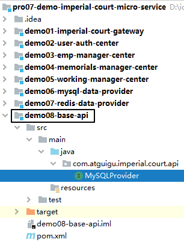


##### [#](http://heavy_code_industry.gitee.io/code_heavy_industry/pro002-maven/chapter08/verse04.html#_2-引入依赖)[2]引入依赖

```xml
<!-- OpenFeign 专用依赖 -->
<dependency>
    <groupId>org.springframework.cloud</groupId>
    <artifactId>spring-cloud-starter-openfeign</artifactId>
</dependency>

<!-- 提供 Emp 实体类使用 -->
<dependency>
    <groupId>com.atguigu.demo</groupId>
    <artifactId>demo09-base-entity</artifactId>
    <version>1.0-SNAPSHOT</version>
</dependency>

<!-- 提供 ResultEntity 工具类使用 -->
<dependency>
    <groupId>com.atguigu.demo</groupId>
    <artifactId>demo10-base-util</artifactId>
    <version>1.0-SNAPSHOT</version>
</dependency>
```


##### [#](http://heavy_code_industry.gitee.io/code_heavy_industry/pro002-maven/chapter08/verse04.html#_3-接口代码)[3]接口代码

**注意**：@FeignClient 注解中指定的是提供服务的微服务名称，要和注册中心注册的一致

```java
// @FeignClient 注解将当前接口标记为服务暴露接口
// name 属性：指定被暴露服务的微服务名称
@FeignClient(name = "demo06-mysql-data-provider")
public interface MySQLProvider {

    @RequestMapping("/remote/get/emp/by/login/info")
    ResultEntity<Emp> getEmpByLoginInfo(

            // @RequestParam 无论如何不能省略
            @RequestParam("loginAccount") String loginAccount,
            @RequestParam("loginPassword") String loginPassword);
}
```


### [#](http://heavy_code_industry.gitee.io/code_heavy_industry/pro002-maven/chapter08/verse04.html#_4、实现接口)4、实现接口

#### [#](http://heavy_code_industry.gitee.io/code_heavy_industry/pro002-maven/chapter08/verse04.html#_1所在工程)①所在工程


#### [#](http://heavy_code_industry.gitee.io/code_heavy_industry/pro002-maven/chapter08/verse04.html#_2引入依赖)②引入依赖

```xml
<!-- Nacos 服务注册发现启动器 -->
<dependency>
    <groupId>com.alibaba.cloud</groupId>
    <artifactId>spring-cloud-starter-alibaba-nacos-discovery</artifactId>
</dependency>

<!--通用mapper启动器依赖-->
<dependency>
    <groupId>tk.mybatis</groupId>
    <artifactId>mapper-spring-boot-starter</artifactId>
</dependency>

<!--mysql驱动-->
<dependency>
    <groupId>mysql</groupId>
    <artifactId>mysql-connector-java</artifactId>
</dependency>

<!--druid启动器依赖-->
<dependency>
    <groupId>com.alibaba</groupId>
    <artifactId>druid-spring-boot-starter</artifactId>
</dependency>

<!--web启动器依赖-->
<dependency>
    <groupId>org.springframework.boot</groupId>
    <artifactId>spring-boot-starter-web</artifactId>
</dependency>

<!--编码工具包-->
<dependency>
    <groupId>org.apache.commons</groupId>
    <artifactId>commons-lang3</artifactId>
</dependency>

<!--单元测试启动器-->
<dependency>
    <groupId>org.springframework.boot</groupId>
    <artifactId>spring-boot-starter-test</artifactId>
    <scope>test</scope>
</dependency>

<!--热部署 -->
<dependency>
    <groupId>org.springframework.boot</groupId>
    <artifactId>spring-boot-devtools</artifactId>
    <scope>runtime</scope>
    <optional>true</optional>
</dependency>
<dependency>
    <groupId>com.atguigu.demo</groupId>
    <artifactId>demo09-base-entity</artifactId>
    <version>1.0-SNAPSHOT</version>
</dependency>

<dependency>
    <groupId>com.atguigu.demo</groupId>
    <artifactId>demo10-base-util</artifactId>
    <version>1.0-SNAPSHOT</version>
</dependency>
```


#### [#](http://heavy_code_industry.gitee.io/code_heavy_industry/pro002-maven/chapter08/verse04.html#_3java-代码)③Java 代码

##### [#](http://heavy_code_industry.gitee.io/code_heavy_industry/pro002-maven/chapter08/verse04.html#_1-总体结构)[1]总体结构

![images]()

##### [#](http://heavy_code_industry.gitee.io/code_heavy_industry/pro002-maven/chapter08/verse04.html#_2-empmapper)[2]EmpMapper

继承 tk.mybatis.mapper.common.Mapper 后就可以使用通用 Mapper 提供的常规代码实现。除非有非常规需求，否则我们自己什么都不用写。

![images]()

```java
public interface EmpMapper extends Mapper<Emp> {
}
```


##### [#](http://heavy_code_industry.gitee.io/code_heavy_industry/pro002-maven/chapter08/verse04.html#_3-service-接口)[3]Service 接口

![images]()

```java
public interface EmpService {
    Emp getEmpByLoginInfo(String loginAccount, String loginPassword);
}
```

##### [#](http://heavy_code_industry.gitee.io/code_heavy_industry/pro002-maven/chapter08/verse04.html#_4-service-实现)[4]Service 实现

```java
@Service
@Transactional(propagation = Propagation.REQUIRES_NEW, readOnly = true)
public class EmpServiceImpl implements EmpService {

    @Autowired
    private EmpMapper empMapper;

    @Override
    public Emp getEmpByLoginInfo(String loginAccount, String loginPassword) {

        String encodedLoginPassword = MD5Util.encode(loginPassword);

        Example example = new Example(Emp.class);

        example
                .createCriteria()
                .andEqualTo("loginAccount", loginAccount)
                .andEqualTo("loginPassword", encodedLoginPassword);

        List<Emp> empList = empMapper.selectByExample(example);

        if (empList == null || empList.size() == 0) {
            throw new LoginFailedException(ImperialCourtConst.LOGIN_FAILED_MESSAGE);
        }

        return empList.get(0);
    }
}
```


##### [#](http://heavy_code_industry.gitee.io/code_heavy_industry/pro002-maven/chapter08/verse04.html#_5-empcontroller)[5]EmpController

![images]()

```java
@RestController
public class EmpController {

    @Autowired
    private EmpService empService;

    @RequestMapping("remote/get/emp/by/login/info")
    ResultEntity<Emp> getEmpByLoginInfo(
            @RequestParam("loginAccount") String loginAccount,
            @RequestParam("loginPassword") String loginPassword) {

        try {
            Emp emp = empService.getEmpByLoginInfo(loginAccount, loginPassword);

            return ResultEntity.successWithData(emp);

        } catch (Exception e) {
            e.printStackTrace();
            String message = e.getMessage();
            return ResultEntity.failed(message);
        }

    }

}
```


##### [#](http://heavy_code_industry.gitee.io/code_heavy_industry/pro002-maven/chapter08/verse04.html#_6-主启动类)[6]主启动类

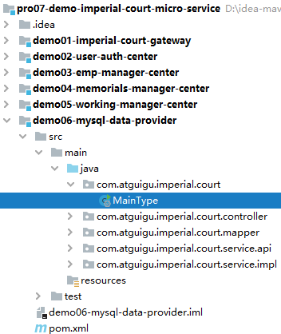

```java
// 为了让当前微服务对接（注册或发现服务）注册中心
@EnableDiscoveryClient

// SpringBoot 标配注解
@SpringBootApplication

// 扫描通用 Mapper 的 Mapper 接口所在包
// 这个注解全类名：tk.mybatis.spring.annotation.MapperScan
// basePackage 属性：指定要扫描的 Mapper 接口所在的包
@MapperScan(basePackages = "com.atguigu.imperial.court.mapper")
public class MainType {

    public static void main(String[] args) {
        SpringApplication.run(MainType.class, args);
    }

}
```


#### [#](http://heavy_code_industry.gitee.io/code_heavy_industry/pro002-maven/chapter08/verse04.html#_4yaml-配置文件)④YAML 配置文件

![images]()

```yaml
server:
  port: 10001
spring:
  datasource:
    driver-class-name: com.mysql.jdbc.Driver
    url: jdbc:mysql://192.168.198.100:3306/db_imperial_court
    username: root
    password: atguigu
    type: com.alibaba.druid.pool.DruidDataSource
  application:
    name: demo06-mysql-data-provider
  cloud:
    nacos:
      discovery:
        server-addr: localhost:8848
```

## 第五节 用户登录认证服务：消费端

### [#](http://heavy_code_industry.gitee.io/code_heavy_industry/pro002-maven/chapter08/verse05.html#_1、所在工程)1、所在工程

![images]()

### [#](http://heavy_code_industry.gitee.io/code_heavy_industry/pro002-maven/chapter08/verse05.html#_2、引入依赖)2、引入依赖

```xml
<!-- Nacos 服务注册发现启动器 -->
<dependency>
    <groupId>com.alibaba.cloud</groupId>
    <artifactId>spring-cloud-starter-alibaba-nacos-discovery</artifactId>
</dependency>

<!-- web启动器依赖 -->
<dependency>
    <groupId>org.springframework.boot</groupId>
    <artifactId>spring-boot-starter-web</artifactId>
</dependency>

<!-- 视图模板技术 thymeleaf -->
<dependency>
    <groupId>org.springframework.boot</groupId>
    <artifactId>spring-boot-starter-thymeleaf</artifactId>
</dependency>

<dependency>
    <groupId>com.atguigu.demo</groupId>
    <artifactId>demo08-base-api</artifactId>
    <version>1.0-SNAPSHOT</version>
</dependency>
```


### [#](http://heavy_code_industry.gitee.io/code_heavy_industry/pro002-maven/chapter08/verse05.html#_3、yaml-配置文件)3、YAML 配置文件

![images]()

```yaml
server:
  port: 10002
spring:
  application:
    name: demo02-user-auth-center
  cloud:
    nacos:
      discovery:
        server-addr: localhost:8848
```


TIP

就 Thymeleaf 而言，有两个常用属性，但我们全部都使用的是默认值，所以可以省略。

### [#](http://heavy_code_industry.gitee.io/code_heavy_industry/pro002-maven/chapter08/verse05.html#_4、显示首页)4、显示首页

#### [#](http://heavy_code_industry.gitee.io/code_heavy_industry/pro002-maven/chapter08/verse05.html#_1配置-view-controller)①配置 view-controller

![images]()

```java
@SpringBootConfiguration
public class DemoConfig implements WebMvcConfigurer {

    @Override
    public void addViewControllers(ViewControllerRegistry registry) {
        registry.addViewController("/").setViewName("portal");
    }
}
```


#### [#](http://heavy_code_industry.gitee.io/code_heavy_industry/pro002-maven/chapter08/verse05.html#_2thymeleaf-视图模板页面)②Thymeleaf 视图模板页面

![images]()

```html
<!DOCTYPE html>
<html lang="en" xml:th="http://www.thymeleaf.org">
<head>
    <meta charset="UTF-8">
    <title>首页</title>
</head>
<body>

<form th:action="@{/consumer/do/login}" method="post">
    <p style="color: red;font-weight: bold;" th:if="${not #strings.isEmpty(authMessage)}" th:text="${authMessage}">
        这里根据条件显示登录失败消息</p>
    <p style="color: red;font-weight: bold;" th:if="${not #strings.isEmpty(systemMessage)}" th:text="${systemMessage}">
        这里根据条件显示系统消息</p>
    账号：<input type="text" name="loginAccount"/><br/>
    密码：<input type="password" name="loginPassword"><br/>
    <button type="submit">进宫</button>
</form>
</body>
</html>
```


### [#](http://heavy_code_industry.gitee.io/code_heavy_industry/pro002-maven/chapter08/verse05.html#_5、登录验证)5、登录验证

#### [#](http://heavy_code_industry.gitee.io/code_heavy_industry/pro002-maven/chapter08/verse05.html#_1流程图)①流程图

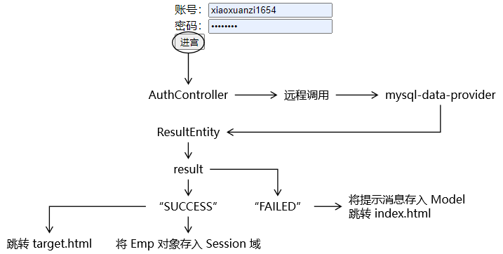

#### [#](http://heavy_code_industry.gitee.io/code_heavy_industry/pro002-maven/chapter08/verse05.html#_2主启动类)②主启动类

**注意**：一定要标记 @EnableFeignClients 注解。

![images]()

```java
@EnableFeignClients
@EnableDiscoveryClient
@SpringBootApplication
public class MainType {

    public static void main(String[] args) {
        SpringApplication.run(MainType.class, args);
    }

}
```


#### [#](http://heavy_code_industry.gitee.io/code_heavy_industry/pro002-maven/chapter08/verse05.html#_3authcontroller)③AuthController

##### [#](http://heavy_code_industry.gitee.io/code_heavy_industry/pro002-maven/chapter08/verse05.html#_1-装配远程接口分析)[1]装配远程接口分析

![images]()

```java
@Controller
public class AuthController {

    // 1、本地使用 @Autowired 注解装配远程接口类型即可实现方法的远程调用，
    // 看起来就像是调用本地方法一样，我们管这种特性叫方法的声明式远程调用。
    // 2、凭啥通过 @Autowired 注解就能够导入远程接口对应的 bean
    //      ①当前环境包含 Feign 相关 jar 包。
    //      ②当前微服务的主启动类上标记 @EnableFeignClients
    //      ③符合 SpringBoot 自动扫描包的约定规则：默认情况下主启动类所在的包、以及主启动类所在包的子包都会被自动扫描
    //          主启动类所在包：     com.atguigu.imperial.court
    //          被扫描的接口所在的包：com.atguigu.imperial.court.api
    @Autowired
    private MySQLProvider mySQLProvider;

}
```


##### [#](http://heavy_code_industry.gitee.io/code_heavy_industry/pro002-maven/chapter08/verse05.html#_2-执行登录验证的方法)[2]执行登录验证的方法

```java
@RequestMapping("/consumer/do/login")
public String doLogin(@RequestParam("loginAccount") String loginAccount,
                      @RequestParam("loginPassword") String loginPassword, HttpSession session, Model model) {

    // 1、调用远程接口根据登录账号、密码查询 Emp 对象
    ResultEntity<Emp> resultEntity = mySQLProvider.getEmpByLoginInfo(loginAccount, loginPassword);

    // 2、验证远程接口调用是否成功
    String result = resultEntity.getResult();
    
    if ("SUCCESS".equals(result)) {

        // 3、从 ResultEntity 中获取查询得到的 Emp 对象
        Emp emp = resultEntity.getData();
        
        // 4、将 Emp 对象存入 Session 域
        session.setAttribute("loginInfo", emp);

        // 5、前往 target 页面
        return "target";
    } else {
        
        // 6、获取失败消息
        String message = resultEntity.getMessage();
        
        // 7、将失败消息存入模型
        model.addAttribute("message", message);
        
        // 8、回到登录页面
        return "index";

    }
}
```

## 第六节 部署运行

### [#](http://heavy_code_industry.gitee.io/code_heavy_industry/pro002-maven/chapter08/verse06.html#_1、最终目标)1、最终目标

![images]()

### [#](http://heavy_code_industry.gitee.io/code_heavy_industry/pro002-maven/chapter08/verse06.html#_2、微服务打包)2、微服务打包

#### [#](http://heavy_code_industry.gitee.io/code_heavy_industry/pro002-maven/chapter08/verse06.html#_1修改-mysql-连接信息)①修改 MySQL 连接信息

![images]()

```yaml
server:
  port: 10001
spring:
  datasource:
    driver-class-name: com.mysql.jdbc.Driver
    
    # 当前微服务和 MySQL 位于同一个服务器上，需要把访问地址改成 localhost
    url: jdbc:mysql://localhost:3306/db_imperial_court
    username: root
    password: atguigu
    type: com.alibaba.druid.pool.DruidDataSource
  application:
    name: demo06-mysql-data-provider
  cloud:
    nacos:
      discovery:
        server-addr: localhost:8848
```


#### [#](http://heavy_code_industry.gitee.io/code_heavy_industry/pro002-maven/chapter08/verse06.html#_2在父工程执行-install-命令)②在父工程执行 install 命令

##### [#](http://heavy_code_industry.gitee.io/code_heavy_industry/pro002-maven/chapter08/verse06.html#_1-why-parent-工程间关系梳理)[1]Why parent？工程间关系梳理

正确的安装顺序：

- ①父工程：pro07-demo-imperial-court-micro-service
- ②被依赖的 module：demo10-base-util 或 demo09-base-entity
- ③当前 module：demo06-mysql-data-provider

![images]()

##### [#](http://heavy_code_industry.gitee.io/code_heavy_industry/pro002-maven/chapter08/verse06.html#_2-执行命令)[2]执行命令

![images]()

#### [#](http://heavy_code_industry.gitee.io/code_heavy_industry/pro002-maven/chapter08/verse06.html#_3生成微服务可运行-jar-包)③生成微服务可运行 jar 包

##### [#](http://heavy_code_industry.gitee.io/code_heavy_industry/pro002-maven/chapter08/verse06.html#_1-应用微服务打包插件)[1]应用微服务打包插件

可以以 SpringBoot 微服务形式直接运行的 jar 包包括：

- 当前微服务本身代码
- 当前微服务所依赖的 jar 包
- 内置 Tomcat（Servlet 容器）
- 与 jar 包可以通过 java -jar 方式直接启动相关的配置

要加入额外的资源、相关配置等等，仅靠 Maven 自身的构建能力是不够的，所以要通过 build 标签引入下面的插件。

```xml
<!-- build 标签：用来配置对构建过程的定制 -->
<build>
    <!-- plugins 标签：定制化构建过程中所使用到的插件 -->
	<plugins>
        <!-- plugin 标签：一个具体插件 -->
		<plugin>
			<groupId>org.springframework.boot</groupId>
			<artifactId>spring-boot-maven-plugin</artifactId>
		</plugin>
	</plugins>
</build>
```


加入这个插件后的效果：


提示：IDEA 对于我们这里 build 标签里加入的 plugin 的配置没有能够很好的识别到插件的版本。如果我们能够保证其它操作都正常执行完成，准备工作都准备好了，那么这里我们判定是 IDEA 识别能力不足导致。一切以实际执行的结果为准：**运行结果是最高权威**

请对 demo02-user-auth-center 和 demo06-mysql-data-provider 都添加上面的 build 配置。

##### [#](http://heavy_code_industry.gitee.io/code_heavy_industry/pro002-maven/chapter08/verse06.html#_2-执行插件目标)[2]执行插件目标

请对 demo02-user-auth-center 和 demo06-mysql-data-provider 都执行下面的命令：

- clean 子命令：清理之前构建的结果
- package 子命令：我们真正要调用的 spring-boot:repackage 要求必须将当前微服务本身的 jar 包提前准备好，所以必须在它之前执行 package 子命令。
- spring-boot:repackage 子命令：调用 spring-boot 插件的 repackage 目标
- -Dmaven.test.skip=true 参数：跳过测试

```sh
mvn clean package spring-boot:repackage -Dmaven.test.skip=true
```

### [#](http://heavy_code_industry.gitee.io/code_heavy_industry/pro002-maven/chapter08/verse06.html#_3、执行部署)3、执行部署

#### [#](http://heavy_code_industry.gitee.io/code_heavy_industry/pro002-maven/chapter08/verse06.html#_1启动-nacos)①启动 Nacos

```sh
sh /opt/nacos/bin/startup.sh -m standalone
```

#### [#](http://heavy_code_industry.gitee.io/code_heavy_industry/pro002-maven/chapter08/verse06.html#_2上传微服务-jar-包)②上传微服务 jar 包

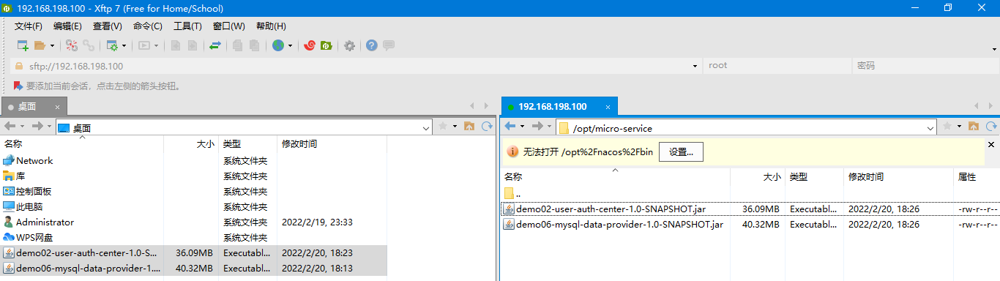

#### [#](http://heavy_code_industry.gitee.io/code_heavy_industry/pro002-maven/chapter08/verse06.html#_2启动微服务)②启动微服务

```sh
nohup java -jar demo06-mysql-data-provider-1.0-SNAPSHOT.jar>demo06.log 2>&1 &
nohup java -jar demo02-user-auth-center-1.0-SNAPSHOT.jar>demo02.log 2>&1 &
```

# 第九章 POM 深入与强化

## 第一节 重新认识Maven

### [#](http://heavy_code_industry.gitee.io/code_heavy_industry/pro002-maven/chapter09/verse01.html#_1、maven-的完整功能)1、Maven 的完整功能

在入门的时候我们介绍说 Maven 是一款『**构建**管理』和『**依赖**管理』的工具。但事实上这只是 Maven 的一部分功能。Maven 本身的产品定位是一款『**项目**管理工具』。

### [#](http://heavy_code_industry.gitee.io/code_heavy_industry/pro002-maven/chapter09/verse01.html#_2、项目管理功能的具体体现)2、项目管理功能的具体体现

下面是 spring-boot-starter 的 POM 文件，可以看到：除了我们熟悉的坐标标签、dependencies 标签，还有 description、url、organization、licenses、developers、scm、issueManagement 等这些描述项目信息的标签。

```xml
<?xml version="1.0" encoding="UTF-8"?>
<project xsi:schemaLocation="http://maven.apache.org/POM/4.0.0 http://maven.apache.org/xsd/maven-4.0.0.xsd" xmlns="http://maven.apache.org/POM/4.0.0"
    xmlns:xsi="http://www.w3.org/2001/XMLSchema-instance">
  <!-- This module was also published with a richer model, Gradle metadata,  -->
  <!-- which should be used instead. Do not delete the following line which  -->
  <!-- is to indicate to Gradle or any Gradle module metadata file consumer  -->
  <!-- that they should prefer consuming it instead. -->
  <!-- do_not_remove: published-with-gradle-metadata -->
  <modelVersion>4.0.0</modelVersion>
  <groupId>org.springframework.boot</groupId>
  <artifactId>spring-boot-starter</artifactId>
  <version>2.5.6</version>
  <name>spring-boot-starter</name>
  <description>Core starter, including auto-configuration support, logging and YAML</description>
  <url>https://spring.io/projects/spring-boot</url>
  <organization>
    <name>Pivotal Software, Inc.</name>
    <url>https://spring.io</url>
  </organization>
  <licenses>
    <license>
      <name>Apache License, Version 2.0</name>
      <url>https://www.apache.org/licenses/LICENSE-2.0</url>
    </license>
  </licenses>
  <developers>
    <developer>
      <name>Pivotal</name>
      <email>info@pivotal.io</email>
      <organization>Pivotal Software, Inc.</organization>
      <organizationUrl>https://www.spring.io</organizationUrl>
    </developer>
  </developers>
  <scm>
    <connection>scm:git:git://github.com/spring-projects/spring-boot.git</connection>
    <developerConnection>scm:git:ssh://git@github.com/spring-projects/spring-boot.git</developerConnection>
    <url>https://github.com/spring-projects/spring-boot</url>
  </scm>
  <issueManagement>
    <system>GitHub</system>
    <url>https://github.com/spring-projects/spring-boot/issues</url>
  </issueManagement>

  <dependencies>
    <dependency>
      ……
    </dependency>
  </dependencies>
</project>
```


所以从『项目管理』的角度来看，Maven 提供了如下这些功能：

- 项目对象模型（POM）：将整个项目本身抽象、封装为应用程序中的一个对象，以便于管理和操作。
- 全局性构建逻辑重用：Maven 对整个构建过程进行封装之后，程序员只需要指定配置信息即可完成构建。让构建过程从 Ant 的『编程式』升级到了 Maven 的『声明式』。
- 构件的标准集合：在 Maven 提供的标准框架体系内，所有的构件都可以按照统一的规范生成和使用。
- 构件关系定义：Maven 定义了构件之间的三种基本关系，让大型应用系统可以使用 Maven 来进行管理
  - 继承关系：通过从上到下的继承关系，将各个子构件中的重复信息提取到父构件中统一管理
  - 聚合关系：将多个构件聚合为一个整体，便于统一操作
  - 依赖关系：Maven 定义了依赖的范围、依赖的传递、依赖的排除、版本仲裁机制等一系列规范和标准，让大型项目可以有序容纳数百甚至更多依赖
- 插件目标系统：Maven 核心程序定义抽象的生命周期，然后将插件的目标绑定到生命周期中的特定阶段，实现了标准和具体实现解耦合，让 Maven 程序极具扩展性
- 项目描述信息的维护：我们不仅可以在 POM 中声明项目描述信息，更可以将整个项目相关信息收集起来生成 HTML 页面组成的一个可以直接访问的站点。这些项目描述信息包括：
  - 公司或组织信息
  - 项目许可证
  - 开发成员信息
  - issue 管理信息
  - SCM 信息

## 第二节 POM 的四个层次

### [#](http://heavy_code_industry.gitee.io/code_heavy_industry/pro002-maven/chapter09/verse02.html#_1、超级-pom)1、超级 POM

经过我们前面的学习，我们看到 Maven 在构建过程中有很多默认的设定。例如：源文件存放的目录、测试源文件存放的目录、构建输出的目录……等等。但是其实这些要素也都是被 Maven 定义过的。定义的位置就是：**超级 POM**。

关于超级 POM，Maven 官网是这样介绍的：

> The Super POM is Maven's default POM. All POMs extend the Super POM unless explicitly set, meaning the configuration specified in the Super POM is inherited by the POMs you created for your projects.
>
> 译文：Super POM 是 Maven 的默认 POM。除非明确设置，否则所有 POM 都扩展 Super POM，这意味着 Super POM 中指定的配置由您为项目创建的 POM 继承。

所以我们自己的 POM 即使没有明确指定一个父工程（父 POM），其实也默认继承了超级 POM。就好比一个 Java 类默认继承了 Object 类。

那么超级 POM 中定义了哪些东西呢？点击[这里](http://heavy_code_industry.gitee.io/code_heavy_industry/pro002-maven/chapter09/super-pom-content.html)查看。

### [#](http://heavy_code_industry.gitee.io/code_heavy_industry/pro002-maven/chapter09/verse02.html#_2、父-pom)2、父 POM

和 Java 类一样，POM 之间其实也是**单继承**的。如果我们给一个 POM 指定了父 POM，那么继承关系如下图所示：

![images]()

### [#](http://heavy_code_industry.gitee.io/code_heavy_industry/pro002-maven/chapter09/verse02.html#_3、有效-pom)3、有效 POM

#### [#](http://heavy_code_industry.gitee.io/code_heavy_industry/pro002-maven/chapter09/verse02.html#_1概念)①概念

有效 POM 英文翻译为 effective POM，它的概念是这样的——在 POM 的继承关系中，子 POM 可以覆盖父 POM 中的配置；如果子 POM 没有覆盖，那么父 POM 中的配置将会被继承。按照这个规则，继承关系中的所有 POM 叠加到一起，就得到了一个最终生效的 POM。显然 Maven 实际运行过程中，执行构建操作就是按照这个最终生效的 POM 来运行的。这个最终生效的 POM 就是**有效 POM**，英文叫**effective POM**。

#### [#](http://heavy_code_industry.gitee.io/code_heavy_industry/pro002-maven/chapter09/verse02.html#_2查看有效-pom)②查看有效 POM

> mvn help:effective-pom

运行效果[点击这里](http://heavy_code_industry.gitee.io/code_heavy_industry/pro002-maven/chapter09/effective-pom-content)查看。

### [#](http://heavy_code_industry.gitee.io/code_heavy_industry/pro002-maven/chapter09/verse02.html#_4、小结)4、小结

综上所述，平时我们使用和配置的 POM 其实大致是由四个层次组成的：

- 超级 POM：所有 POM 默认继承，只是有直接和间接之分。
- 父 POM：这一层可能没有，可能有一层，也可能有很多层。
- 当前 pom.xml 配置的 POM：我们最多关注和最多使用的一层。
- 有效 POM：隐含的一层，但是实际上真正生效的一层。

## 第三节 属性的声明与引用

### [#](http://heavy_code_industry.gitee.io/code_heavy_industry/pro002-maven/chapter09/verse03.html#_1、help-插件的各个目标)1、help 插件的各个目标

官网说明地址：https://maven.apache.org/plugins/maven-help-plugin

| 目标                    | 说明                                              |
| ----------------------- | ------------------------------------------------- |
| help:active-profiles    | 列出当前已激活的 profile                          |
| help:all-profiles       | 列出当前工程所有可用 profile                      |
| help:describe           | 描述一个插件和/或 Mojo 的属性                     |
| help:effective-pom      | 以 XML 格式展示有效 POM                           |
| help:effective-settings | 为当前工程以 XML 格式展示计算得到的 settings 配置 |
| **help:evaluate**       | 计算用户在交互模式下给出的 Maven 表达式           |
| help:system             | 显示平台详细信息列表，如系统属性和环境变量        |

### [#](http://heavy_code_industry.gitee.io/code_heavy_industry/pro002-maven/chapter09/verse03.html#_2、使用-help-evaluate-查看属性值)2、使用 help:evaluate 查看属性值

#### [#](http://heavy_code_industry.gitee.io/code_heavy_industry/pro002-maven/chapter09/verse03.html#_1定义属性)①定义属性

```xml
<properties>
    <com.atguigu.hello>good morning maven</com.atguigu.hello>
</properties>
```


#### [#](http://heavy_code_industry.gitee.io/code_heavy_industry/pro002-maven/chapter09/verse03.html#_2运行命令)②运行命令

![images]()

#### [#](http://heavy_code_industry.gitee.io/code_heavy_industry/pro002-maven/chapter09/verse03.html#_3运行结果)③运行结果

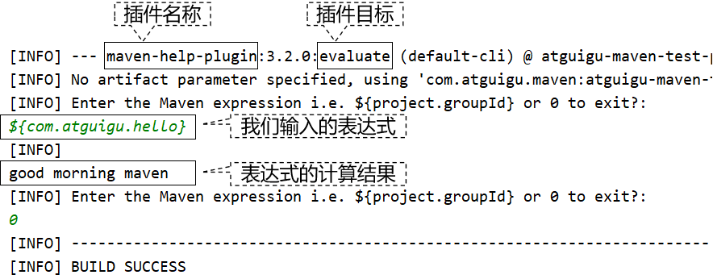

### [#](http://heavy_code_industry.gitee.io/code_heavy_industry/pro002-maven/chapter09/verse03.html#_3、通过-maven-访问系统属性)3、通过 Maven 访问系统属性

#### [#](http://heavy_code_industry.gitee.io/code_heavy_industry/pro002-maven/chapter09/verse03.html#_1-java-系统属性一览)① Java 系统属性一览

##### [#](http://heavy_code_industry.gitee.io/code_heavy_industry/pro002-maven/chapter09/verse03.html#_1-java-代码)[1] Java 代码

```java
Properties properties = System.getProperties();
Set<Object> propNameSet = properties.keySet();
for (Object propName : propNameSet) {
    String propValue = properties.getProperty((String) propName);
    System.out.println(propName + " = " + propValue);
}
```


##### [#](http://heavy_code_industry.gitee.io/code_heavy_industry/pro002-maven/chapter09/verse03.html#_2-运行结果)[2]运行结果

> java.runtime.name = Java(TM) SE Runtime Environment
> sun.boot.library.path = D:\software\Java\jre\bin
> java.vm.version = 25.141-b15
> java.vm.vendor = Oracle Corporation
> java.vendor.url = http://java.oracle.com/
> path.separator = ;
> java.vm.name = Java HotSpot(TM) 64-Bit Server VM
> file.encoding.pkg = sun.io
> user.country = CN
> user.script =
> sun.java.launcher = SUN_STANDARD
> sun.os.patch.level =
> java.vm.specification.name = Java Virtual Machine Specification
> user.dir = D:\idea2019workspace\atguigu-maven-test-prepare
> java.runtime.version = 1.8.0_141-b15
> java.awt.graphicsenv = sun.awt.Win32GraphicsEnvironment
> java.endorsed.dirs = D:\software\Java\jre\lib\endorsed
> os.arch = amd64
> java.io.tmpdir = C:\Users\ADMINI~1\AppData\Local\Temp\
> line.separator =
> java.vm.specification.vendor = Oracle Corporation
> user.variant =
> os.name = Windows 10
> sun.jnu.encoding = GBK
> java.library.path = D:\software\Java\bin;C:\WINDOWS\Sun\Java\bin;C:\WIN……
> java.specification.name = Java Platform API Specification
> java.class.version = 52.0
> sun.management.compiler = HotSpot 64-Bit Tiered Compilers
> os.version = 10.0
> user.home = C:\Users\Administrator
> user.timezone =
> java.awt.printerjob = sun.awt.windows.WPrinterJob
> file.encoding = UTF-8
> java.specification.version = 1.8
> java.class.path = D:\software\Java\jre\lib\charsets.jar;D:\softw……
> user.name = Administrator
> java.vm.specification.version = 1.8
> sun.java.command = com.atguigu.maven.MyTest
> java.home = D:\software\Java\jre
> sun.arch.data.model = 64
> user.language = zh
> java.specification.vendor = Oracle Corporation
> awt.toolkit = sun.awt.windows.WToolkit
> java.vm.info = mixed mode
> java.version = 1.8.0_141
> java.ext.dirs = D:\software\Java\jre\lib\ext;C:\WINDOWS\Sun\Java\lib\ext
> sun.boot.class.path = D:\software\Java\jre\lib\resources.jar;D:\sof……
> java.vendor = Oracle Corporation
> file.separator = \
> java.vendor.url.bug = http://bugreport.sun.com/bugreport/
> sun.io.unicode.encoding = UnicodeLittle
> sun.cpu.endian = little
> sun.desktop = windows
> sun.cpu.isalist = amd64

#### [#](http://heavy_code_industry.gitee.io/code_heavy_industry/pro002-maven/chapter09/verse03.html#_2使用-maven-访问系统属性)②使用 Maven 访问系统属性


### [#](http://heavy_code_industry.gitee.io/code_heavy_industry/pro002-maven/chapter09/verse03.html#_4、访问系统环境变量)4、访问系统环境变量

${env.系统环境变量名}

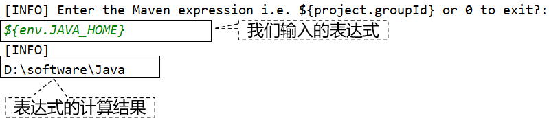

### [#](http://heavy_code_industry.gitee.io/code_heavy_industry/pro002-maven/chapter09/verse03.html#_5、访问-project-属性)5、访问 project 属性

#### [#](http://heavy_code_industry.gitee.io/code_heavy_industry/pro002-maven/chapter09/verse03.html#_1含义)①含义

使用表达式 ${project.xxx} 可以访问当前 POM 中的元素值。

#### [#](http://heavy_code_industry.gitee.io/code_heavy_industry/pro002-maven/chapter09/verse03.html#_2访问一级标签)②访问一级标签

${project.标签名}


#### [#](http://heavy_code_industry.gitee.io/code_heavy_industry/pro002-maven/chapter09/verse03.html#_3访问子标签)③访问子标签

${project.标签名.子标签名}

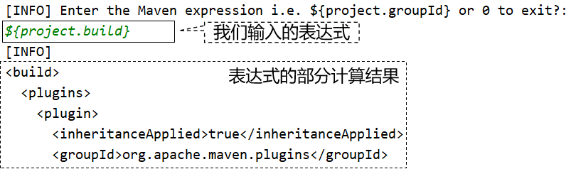

#### [#](http://heavy_code_industry.gitee.io/code_heavy_industry/pro002-maven/chapter09/verse03.html#_4访问列表标签)④访问列表标签

${project.标签名[下标]}

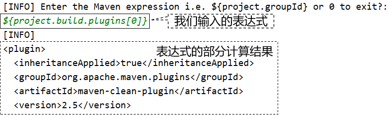

### [#](http://heavy_code_industry.gitee.io/code_heavy_industry/pro002-maven/chapter09/verse03.html#_6、访问-settings-全局配置)6、访问 settings 全局配置

${settings.标签名} 可以访问 settings.xml 中配置的元素值。

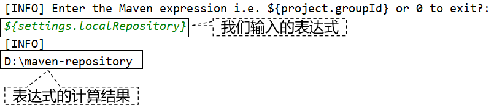

### [#](http://heavy_code_industry.gitee.io/code_heavy_industry/pro002-maven/chapter09/verse03.html#_7、用途)7、用途

- 在当前 pom.xml 文件中引用属性
- 资源过滤功能：在非 Maven 配置文件中引用属性，由 Maven 在处理资源时将引用属性的表达式替换为属性值

## 第四节 build 标签详解

### [#](http://heavy_code_industry.gitee.io/code_heavy_industry/pro002-maven/chapter09/verse04.html#_1、一睹真容)1、一睹真容

在实际使用 Maven 的过程中，我们会发现 build 标签有时候有，有时候没，这是怎么回事呢？其实通过有效 POM 我们能够看到，build 标签的相关配置其实一直都在，只是在我们需要定制构建过程的时候才会通过配置 build 标签覆盖默认值或补充配置。这一点我们可以通过打印有效 POM 来看到。

[点我查看 build 标签的完整示例](http://heavy_code_industry.gitee.io/code_heavy_industry/pro002-maven/chapter09/whole-build.html)

所以**本质**上来说：我们配置的 build 标签都是对**超级 POM 配置**的**叠加**。那我们又为什么要在默认配置的基础上叠加呢？很简单，在默认配置无法满足需求的时候**定制构建过程**。

### [#](http://heavy_code_industry.gitee.io/code_heavy_industry/pro002-maven/chapter09/verse04.html#_2、build-标签组成)2、build 标签组成

从完整示例中我们能够看到，build 标签的子标签大致包含三个主体部分：

#### [#](http://heavy_code_industry.gitee.io/code_heavy_industry/pro002-maven/chapter09/verse04.html#_1定义约定的目录结构)①定义约定的目录结构

参考示例中的如下部分：

```xml
<sourceDirectory>D:\idea2019workspace\atguigu-maven-test-prepare\src\main\java</sourceDirectory>
<scriptSourceDirectory>D:\idea2019workspace\atguigu-maven-test-prepare\src\main\scripts</scriptSourceDirectory>
<testSourceDirectory>D:\idea2019workspace\atguigu-maven-test-prepare\src\test\java</testSourceDirectory>
<outputDirectory>D:\idea2019workspace\atguigu-maven-test-prepare\target\classes</outputDirectory>
<testOutputDirectory>D:\idea2019workspace\atguigu-maven-test-prepare\target\test-classes</testOutputDirectory>
<resources>
    <resource>
        <directory>D:\idea2019workspace\atguigu-maven-test-prepare\src\main\resources</directory>
    </resource>
</resources>
<testResources>
    <testResource>
        <directory>D:\idea2019workspace\atguigu-maven-test-prepare\src\test\resources</directory>
    </testResource>
</testResources>
<directory>D:\idea2019workspace\atguigu-maven-test-prepare\target</directory>
```


我们能看到各个目录的作用如下：

| 目录名                | 作用                       |
| --------------------- | -------------------------- |
| sourceDirectory       | 主体源程序存放目录         |
| scriptSourceDirectory | 脚本源程序存放目录         |
| testSourceDirectory   | 测试源程序存放目录         |
| outputDirectory       | 主体源程序编译结果输出目录 |
| testOutputDirectory   | 测试源程序编译结果输出目录 |
| resources             | 主体资源文件存放目录       |
| testResources         | 测试资源文件存放目录       |
| directory             | 构建结果输出目录           |

#### [#](http://heavy_code_industry.gitee.io/code_heavy_industry/pro002-maven/chapter09/verse04.html#_2备用插件管理)②备用插件管理

pluginManagement 标签存放着几个极少用到的插件：

- maven-antrun-plugin
- maven-assembly-plugin
- maven-dependency-plugin
- maven-release-plugin

通过 pluginManagement 标签管理起来的插件就像 dependencyManagement 一样，子工程使用时可以省略版本号，起到在父工程中统一管理版本的效果。情看下面例子：

- 被 spring-boot-dependencies 管理的插件信息：

```xml
<plugin>
	<groupId>org.springframework.boot</groupId>
	<artifactId>spring-boot-maven-plugin</artifactId>
	<version>2.6.2</version>
</plugin>
```


- 子工程使用的插件信息：

```xml
<build>
    <plugins>
        <plugin>
            <groupId>org.springframework.boot</groupId>
            <artifactId>spring-boot-maven-plugin</artifactId>
        </plugin>
    </plugins>
</build>
```


#### [#](http://heavy_code_industry.gitee.io/code_heavy_industry/pro002-maven/chapter09/verse04.html#_3生命周期插件)③生命周期插件

plugins 标签存放的是默认生命周期中实际会用到的插件，这些插件想必大家都不陌生，所以抛开插件本身不谈，我们来看看 plugin 标签的结构：

```xml
<plugin>
    <artifactId>maven-compiler-plugin</artifactId>
    <version>3.1</version>
    <executions>
        <execution>
            <id>default-compile</id>
            <phase>compile</phase>
            <goals>
                <goal>compile</goal>
            </goals>
        </execution>
        <execution>
            <id>default-testCompile</id>
            <phase>test-compile</phase>
            <goals>
                <goal>testCompile</goal>
            </goals>
        </execution>
    </executions>
</plugin>
```


##### [#](http://heavy_code_industry.gitee.io/code_heavy_industry/pro002-maven/chapter09/verse04.html#_1-坐标部分)[1]坐标部分

artifactId 和 version 标签定义了插件的坐标，作为 Maven 的自带插件这里省略了 groupId。

##### [#](http://heavy_code_industry.gitee.io/code_heavy_industry/pro002-maven/chapter09/verse04.html#_2-执行部分)[2]执行部分

executions 标签内可以配置多个 execution 标签，execution 标签内：

- id：指定唯一标识
- phase：关联的生命周期阶段
- goals/goal：关联指定生命周期的目标
  - goals 标签中可以配置多个 goal 标签，表示一个生命周期环节可以对应当前插件的多个目标。

另外，插件目标的执行过程可以进行配置，例如 maven-site-plugin 插件的 site 目标：

```xml
<execution>
    <id>default-site</id>
    <phase>site</phase>
    <goals>
        <goal>site</goal>
    </goals>
    <configuration>
        <outputDirectory>D:\idea2019workspace\atguigu-maven-test-prepare\target\site</outputDirectory>
        <reportPlugins>
            <reportPlugin>
                <groupId>org.apache.maven.plugins</groupId>
                <artifactId>maven-project-info-reports-plugin</artifactId>
            </reportPlugin>
        </reportPlugins>
    </configuration>
</execution>
```


configuration 标签内进行配置时使用的标签是插件本身定义的。就以 maven-site-plugin 插件为例，它的核心类是 org.apache.maven.plugins.site.render.SiteMojo，在这个类中我们看到了 outputDirectory 属性：

![images]()

SiteMojo 的父类是：AbstractSiteRenderingMojo，在父类中我们看到 reportPlugins 属性：

![images]()

**结论**：每个插件能够做哪些设置都是各个插件自己规定的，无法一概而论。

### [#](http://heavy_code_industry.gitee.io/code_heavy_industry/pro002-maven/chapter09/verse04.html#_3、典型应用-指定-jdk-版本)3、典型应用：指定 JDK 版本

#### [#](http://heavy_code_industry.gitee.io/code_heavy_industry/pro002-maven/chapter09/verse04.html#_1提出问题)①提出问题

前面我们在 settings.xml 中配置了 JDK 版本，那么将来把 Maven 工程部署都服务器上，脱离了 settings.xml 配置，如何保证程序正常运行呢？思路就是我们直接把 JDK 版本信息告诉负责编译操作的 maven-compiler-plugin 插件，让它在构建过程中，按照我们指定的信息工作。

#### [#](http://heavy_code_industry.gitee.io/code_heavy_industry/pro002-maven/chapter09/verse04.html#_2暂时取消-settings-xml-配置)②暂时取消 settings.xml 配置

为了测试对 maven-compiler-plugin 插件进行配置的效果，我们暂时取消 settings.xml 中的 profile 配置。

```xml
<!-- 配置Maven工程的默认JDK版本 -->
<!-- <profile>
  <id>jdk-1.8</id>
  <activation>
	<activeByDefault>true</activeByDefault>
	<jdk>1.8</jdk>
  </activation>
  <properties>
	<maven.compiler.source>1.8</maven.compiler.source>
	<maven.compiler.target>1.8</maven.compiler.target>
	<maven.compiler.compilerVersion>1.8</maven.compiler.compilerVersion>
  </properties>
</profile> -->
```


#### [#](http://heavy_code_industry.gitee.io/code_heavy_industry/pro002-maven/chapter09/verse04.html#_3编写源文件代码)③编写源文件代码

很明显这里用到了 Lambda 表达式，这是 JDK 1.8 才支持的语法。

```java
package com.atguigu.maven;

public class Hello {

    public void hello() {
        new Thread(()->{
            System.out.println("thread ...");
        }).start();
    }

}
```


此时我们执行编译命令：


#### [#](http://heavy_code_industry.gitee.io/code_heavy_industry/pro002-maven/chapter09/verse04.html#_4配置构建过程)④配置构建过程

```xml
<!-- build 标签：意思是告诉 Maven，你的构建行为，我要开始定制了！ -->
<build>
    <!-- plugins 标签：Maven 你给我听好了，你给我构建的时候要用到这些插件！ -->
    <plugins>
        <!-- plugin 标签：这是我要指定的一个具体的插件 -->
        <plugin>
            <!-- 插件的坐标。此处引用的 maven-compiler-plugin 插件不是第三方的，是一个 Maven 自带的插件。 -->
            <groupId>org.apache.maven.plugins</groupId>
            <artifactId>maven-compiler-plugin</artifactId>
            <version>3.1</version>
            
            <!-- configuration 标签：配置 maven-compiler-plugin 插件 -->
            <configuration>
                <!-- 具体配置信息会因为插件不同、需求不同而有所差异 -->
                <source>1.8</source>
                <target>1.8</target>
                <encoding>UTF-8</encoding>
            </configuration>
        </plugin>
    </plugins>
</build>
```


#### [#](http://heavy_code_industry.gitee.io/code_heavy_industry/pro002-maven/chapter09/verse04.html#_5再次执行编译命令)⑤再次执行编译命令


#### [#](http://heavy_code_industry.gitee.io/code_heavy_industry/pro002-maven/chapter09/verse04.html#_6两种配置方式比较)⑥两种配置方式比较

- settings.xml 中配置：仅在本地生效，如果脱离当前 settings.xml 能够覆盖的范围，则无法生效。
- 在当前 Maven 工程 pom.xml 中配置：无论在哪个环境执行编译等构建操作都有效。

#### [#](http://heavy_code_industry.gitee.io/code_heavy_industry/pro002-maven/chapter09/verse04.html#_7补充说明)⑦补充说明

##### [#](http://heavy_code_industry.gitee.io/code_heavy_industry/pro002-maven/chapter09/verse04.html#_1-source-标签含义)[1]source 标签含义

查看 [Maven 官网页面 (opens new window)](http://maven.apache.org/plugins/maven-compiler-plugin/compile-mojo.html)，我们找到 source 标签的介绍：

![images]()

翻译过来就是：调用 Java 编译器命令时传入的 -source 参数。那对编译器来说，-source 参数是啥意思呢？

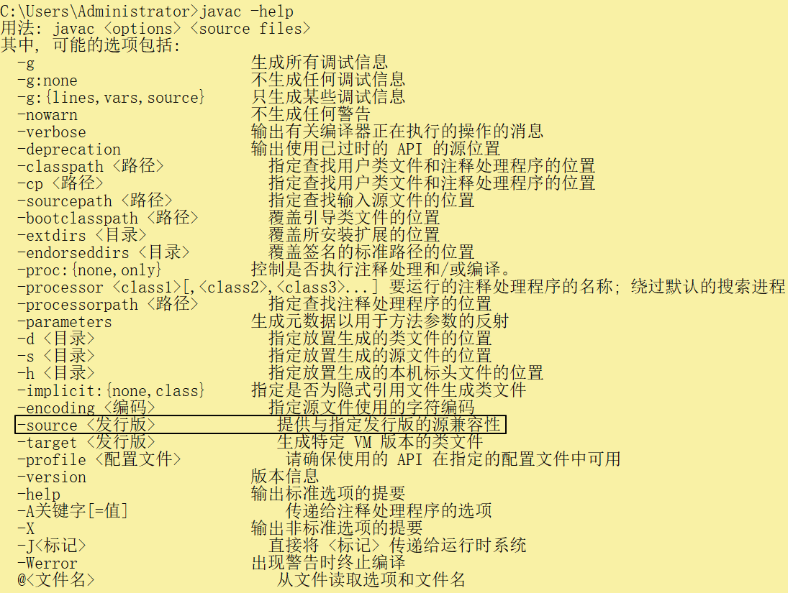


『提供与指定发行版的源兼容性』这句话我的理解是：

- 我们写代码是按 JDK 1.8 写的——这就是『源兼容性』里的『源』。
- 指定发行版就是我们指定的 JDK 1.8。
- 『兼容性』是谁和谁兼容呢？现在源代码是既定的，所以就是要求编译器使用指定的 JDK 版本来兼容我们的源代码。


另外我们还看到：

![images]()

这个功能还可以通过在 properties 标签中配置 maven.compiler.source 属性来实现。所以我们也经常会看到类似这样的配置：

```xml
<properties>
    <maven.compiler.source>1.8</maven.compiler.source>
    <maven.compiler.target>1.8</maven.compiler.target>
    <project.build.sourceEncoding>UTF-8</project.build.sourceEncoding>
</properties>
```

1
2
3
4
5

##### [#](http://heavy_code_industry.gitee.io/code_heavy_industry/pro002-maven/chapter09/verse04.html#_2-target-标签含义)[2]target 标签含义

![images]()

翻译过来就是：调用 Java 编译器命令时传入的 -target 参数。那对编译器来说，-target 参数是啥意思呢？

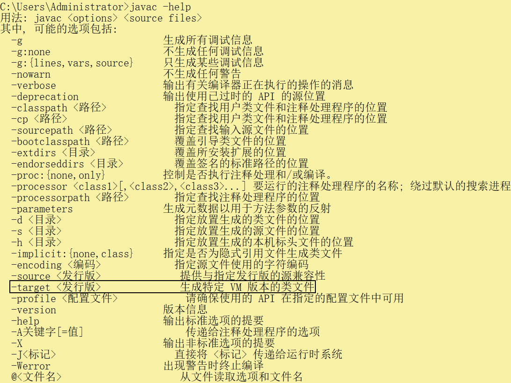

『生成特定 VM 版本的类文件』这句话我的理解是：

- VM 指 JVM
- 类文件指 *.class 字节码文件
- 整体意思就是源文件编译后，生成的 *.class 字节码文件要符合指定的 JVM 版本

### [#](http://heavy_code_industry.gitee.io/code_heavy_industry/pro002-maven/chapter09/verse04.html#_4、典型应用-springboot-定制化打包)4、典型应用：SpringBoot 定制化打包

#### [#](http://heavy_code_industry.gitee.io/code_heavy_industry/pro002-maven/chapter09/verse04.html#_1需求)①需求

很显然 spring-boot-maven-plugin 并不是 Maven 自带的插件，而是 SpringBoot 提供的，用来改变 Maven 默认的构建行为。具体来说是改变打包的行为。默认情况下 Maven 调用 maven-jar-plugin 插件的 jar 目标，生成普通的 jar 包。

普通 jar 包没法使用 java -jar xxx.jar 这样的命令来启动、运行，但是 SpringBoot 的设计理念就是每一个『微服务』导出为一个 jar 包，这个 jar 包可以使用 java -jar xxx.jar 这样的命令直接启动运行。

这样一来，打包的方式肯定要进行调整。所以 SpringBoot 提供了 spring-boot-maven-plugin 这个插件来定制打包行为。


#### [#](http://heavy_code_industry.gitee.io/code_heavy_industry/pro002-maven/chapter09/verse04.html#_2示例代码)②示例代码

所有的一切已经都被 SpringBoot 封装好了，所以配置非常简单，提供插件坐标即可。

```xml
<build>
	<plugins>
		<plugin>
			<groupId>org.springframework.boot</groupId>
			<artifactId>spring-boot-maven-plugin</artifactId>
			<version>2.5.5</version>
		</plugin>
	</plugins>
</build>
```

1
2
3
4
5
6
7
8
9

#### [#](http://heavy_code_industry.gitee.io/code_heavy_industry/pro002-maven/chapter09/verse04.html#_3插件的七个目标)③插件的七个目标


| 目标名称                | 作用                                                         |
| ----------------------- | ------------------------------------------------------------ |
| spring-boot:build-image | Package an application into a OCI image using a buildpack.   |
| spring-boot:build-info  | Generate a build-info.properties file based on the content of the current MavenProject. |
| spring-boot:help        | Display help information on spring-boot-maven-plugin. Call mvn spring-boot:help -Ddetail=true -Dgoal=<goal-name> to display parameter details. |
| spring-boot:repackage   | Repackage existing JAR and WAR archives so that they can be executed from the command line using java -jar. With layout=NONE can also be used simply to package a JAR with nested dependencies (and no main class, so not executable). |
| spring-boot:run         | Run an application in place.                                 |
| spring-boot:start       | Start a spring application. Contrary to the run goal, this does not block and allows other goals to operate on the application. This goal is typically used in integration test scenario where the application is started before a test suite and stopped after. |
| spring-boot:stop        | Stop an application that has been started by the 'start' goal. Typically invoked once a test suite has completed. |

### [#](http://heavy_code_industry.gitee.io/code_heavy_industry/pro002-maven/chapter09/verse04.html#_5、典型应用-mybatis-逆向工程)5、典型应用：Mybatis 逆向工程

使用 Mybatis 的逆向工程需要使用如下配置，MBG 插件的特点是需要提供插件所需的依赖：

```xml
<!-- 控制 Maven 在构建过程中相关配置 -->
<build>
		
	<!-- 构建过程中用到的插件 -->
	<plugins>
		
		<!-- 具体插件，逆向工程的操作是以构建过程中插件形式出现的 -->
		<plugin>
			<groupId>org.mybatis.generator</groupId>
			<artifactId>mybatis-generator-maven-plugin</artifactId>
			<version>1.3.0</version>
	
			<!-- 插件的依赖 -->
			<dependencies>
				
				<!-- 逆向工程的核心依赖 -->
				<dependency>
					<groupId>org.mybatis.generator</groupId>
					<artifactId>mybatis-generator-core</artifactId>
					<version>1.3.2</version>
				</dependency>
					
				<!-- 数据库连接池 -->
				<dependency>
					<groupId>com.mchange</groupId>
					<artifactId>c3p0</artifactId>
					<version>0.9.2</version>
				</dependency>
					
				<!-- MySQL驱动 -->
				<dependency>
					<groupId>mysql</groupId>
					<artifactId>mysql-connector-java</artifactId>
					<version>5.1.8</version>
				</dependency>
			</dependencies>
		</plugin>
	</plugins>
</build>
```

1
2
3
4
5
6
7
8
9
10
11
12
13
14
15
16
17
18
19
20
21
22
23
24
25
26
27
28
29
30
31
32
33
34
35
36
37
38
39

### [#](http://heavy_code_industry.gitee.io/code_heavy_industry/pro002-maven/chapter09/verse04.html#_6、小结)6、小结

不知大家有没有发现，通常需要用到 build 标签的时候底层都会帮我们封装好，需要我们配置的地方不多。即使有些地方需要我们配置，也不会真的我们自己去写，把现成的案例复制过来就行。

所以对 build 标签来说，我们的掌握要求就是：**能大致看懂**就行。

## 第五节 依赖配置补充

TIP

[Maven 官网介绍依赖机制(opens new window)](https://maven.apache.org/guides/introduction/introduction-to-dependency-mechanism.html)

### [#](http://heavy_code_industry.gitee.io/code_heavy_industry/pro002-maven/chapter09/verse05.html#_1、依赖范围)1、依赖范围

#### [#](http://heavy_code_industry.gitee.io/code_heavy_industry/pro002-maven/chapter09/verse05.html#_1import)①import

管理依赖最基本的办法是继承父工程，但是和 Java 类一样，Maven 也是单继承的。如果不同体系的依赖信息封装在不同 POM 中了，没办法继承多个父工程怎么办？这时就可以使用 import 依赖范围。

典型案例当然是在项目中引入 SpringBoot、SpringCloud 依赖：

```xml
<dependencyManagement>
    <dependencies>

        <!-- SpringCloud 依赖导入 -->
        <dependency>
            <groupId>org.springframework.cloud</groupId>
            <artifactId>spring-cloud-dependencies</artifactId>
            <version>Hoxton.SR9</version>
            <type>pom</type>
            <scope>import</scope>
        </dependency>

        <!-- SpringCloud Alibaba 依赖导入 -->
        <dependency>
            <groupId>com.alibaba.cloud</groupId>
            <artifactId>spring-cloud-alibaba-dependencies</artifactId>
            <version>2.2.6.RELEASE</version>
            <type>pom</type>
            <scope>import</scope>
        </dependency>

        <!-- SpringBoot 依赖导入 -->
        <dependency>
            <groupId>org.springframework.boot</groupId>
            <artifactId>spring-boot-dependencies</artifactId>
            <version>2.3.6.RELEASE</version>
            <type>pom</type>
            <scope>import</scope>
        </dependency>
    </dependencies>
</dependencyManagement>
```

1
2
3
4
5
6
7
8
9
10
11
12
13
14
15
16
17
18
19
20
21
22
23
24
25
26
27
28
29
30
31

import 依赖范围使用要求：

- 打包类型必须是 pom
- 必须放在 dependencyManagement 中

> 官网说明如下：
>
> This scope is only supported on a dependency of type `pom` in the `<dependencyManagement>` section. It indicates the dependency is to be replaced with the effective list of dependencies in the specified POM's `<dependencyManagement>` section. Since they are replaced, dependencies with a scope of `import` do not actually participate in limiting the transitivity of a dependency.

#### [#](http://heavy_code_industry.gitee.io/code_heavy_industry/pro002-maven/chapter09/verse05.html#_2system)②system

以 Windows 系统环境下开发为例，假设现在 D:\tempare\atguigu-maven-test-aaa-1.0-SNAPSHOT.jar 想要引入到我们的项目中，此时我们就可以将依赖配置为 system 范围：

```xml
<dependency>
    <groupId>com.atguigu.maven</groupId>
    <artifactId>atguigu-maven-test-aaa</artifactId>
    <version>1.0-SNAPSHOT</version>
    <systemPath>D:\tempare\atguigu-maven-test-aaa-1.0-SNAPSHOT.jar</systemPath>
    <scope>system</scope>
</dependency>
```

1
2
3
4
5
6
7

但是很明显：这样引入依赖完全不具有可移植性，所以**不要使用**。如果需要引入体系外 jar 包我们后面会讲专门的办法。

#### [#](http://heavy_code_industry.gitee.io/code_heavy_industry/pro002-maven/chapter09/verse05.html#_3runtime)③runtime

专门用于编译时不需要，但是运行时需要的 jar 包。比如：编译时我们根据接口调用方法，但是实际运行时需要的是接口的实现类。典型案例是：

```xml
<!--热部署 -->
<dependency>
    <groupId>org.springframework.boot</groupId>
    <artifactId>spring-boot-devtools</artifactId>
    <scope>runtime</scope>
    <optional>true</optional>
</dependency>
```

1
2
3
4
5
6
7

### [#](http://heavy_code_industry.gitee.io/code_heavy_industry/pro002-maven/chapter09/verse05.html#_2、可选依赖)2、可选依赖

#### [#](http://heavy_code_industry.gitee.io/code_heavy_industry/pro002-maven/chapter09/verse05.html#_1配置举例)①配置举例

```xml
<!--热部署 -->
<dependency>
    <groupId>org.springframework.boot</groupId>
    <artifactId>spring-boot-devtools</artifactId>
    <scope>runtime</scope>
    <optional>true</optional>
</dependency>
```

1
2
3
4
5
6
7

#### [#](http://heavy_code_industry.gitee.io/code_heavy_industry/pro002-maven/chapter09/verse05.html#_2本质含义)②本质含义

可选其实就是『可有可无』。官网的解释是：


其核心含义是：Project X 依赖 Project A，A 中一部分 X 用不到的代码依赖了 B，那么对 X 来说 B 就是『可有可无』的。

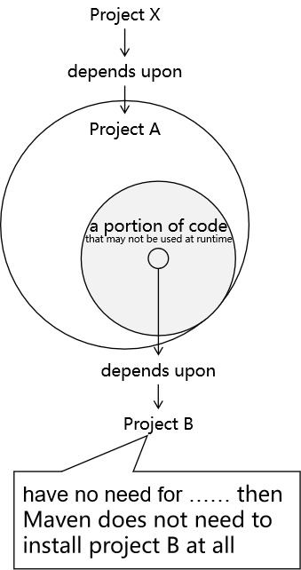

### [#](http://heavy_code_industry.gitee.io/code_heavy_industry/pro002-maven/chapter09/verse05.html#_3、版本仲裁)3、版本仲裁

#### [#](http://heavy_code_industry.gitee.io/code_heavy_industry/pro002-maven/chapter09/verse05.html#_1最短路径优先)①最短路径优先

在下图的例子中，对模块 pro25-module-a 来说，Maven 会采纳 1.2.12 版本。

![images]()

#### [#](http://heavy_code_industry.gitee.io/code_heavy_industry/pro002-maven/chapter09/verse05.html#_2路径相同时先声明者优先)②路径相同时先声明者优先

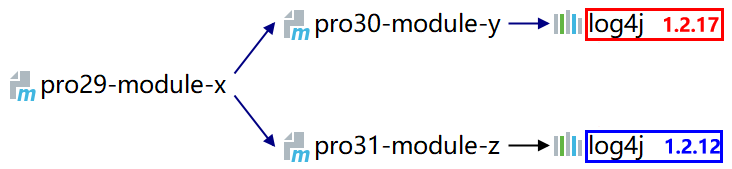

此时 Maven 采纳哪个版本，取决于在 pro29-module-x 中，对 pro30-module-y 和 pro31-module-z 两个模块的依赖哪一个先声明。

#### [#](http://heavy_code_industry.gitee.io/code_heavy_industry/pro002-maven/chapter09/verse05.html#_3小结)③小结

其实 Maven 的版本仲裁机制只是在没有人为干预的情况下，自主决定 jar 包版本的一个办法。而实际上我们要使用具体的哪一个版本，还要取决于项目中的实际情况。所以在项目正常运行的情况下，jar 包版本可以由 Maven 仲裁，不必我们操心；而发生冲突时 Maven 仲裁决定的版本无法满足要求，此时就应该由程序员明确指定 jar 包版本。

## 第六节 Maven 自定义插件

### [#](http://heavy_code_industry.gitee.io/code_heavy_industry/pro002-maven/chapter09/verse06.html#_1、本节定位)1、本节定位

其实实际开发中几乎没有什么场景需要我们开发自定义 Maven 插件，所以本节只是通过这个角度帮助我们更好的理解插件的目标和生命周期阶段之间的关系。

### [#](http://heavy_code_industry.gitee.io/code_heavy_industry/pro002-maven/chapter09/verse06.html#_2、插件开发)2、插件开发

#### [#](http://heavy_code_industry.gitee.io/code_heavy_industry/pro002-maven/chapter09/verse06.html#_1创建工程)①创建工程

[略]

#### [#](http://heavy_code_industry.gitee.io/code_heavy_industry/pro002-maven/chapter09/verse06.html#_2设定打包方式)②设定打包方式

```xml
<packaging>maven-plugin</packaging>
```

1

#### [#](http://heavy_code_industry.gitee.io/code_heavy_industry/pro002-maven/chapter09/verse06.html#_3引入依赖)③引入依赖

下面两种方式二选一：

##### [#](http://heavy_code_industry.gitee.io/code_heavy_industry/pro002-maven/chapter09/verse06.html#_1-将来在文档注释中使用注解)[1]将来在文档注释中使用注解

```xml
<dependency>
    <groupId>org.apache.maven</groupId>
    <artifactId>maven-plugin-api</artifactId>
    <version>3.5.2</version>
</dependency>
```

1
2
3
4
5

##### [#](http://heavy_code_industry.gitee.io/code_heavy_industry/pro002-maven/chapter09/verse06.html#_2-将来直接使用注解)[2]将来直接使用注解

```xml
<dependency>
    <groupId>org.apache.maven.plugin-tools</groupId>
    <artifactId>maven-plugin-annotations</artifactId>
    <version>3.5.2</version>
</dependency>
```

1
2
3
4
5

#### [#](http://heavy_code_industry.gitee.io/code_heavy_industry/pro002-maven/chapter09/verse06.html#_4创建-mojo-类)④创建 Mojo 类

Mojo 类是一个 Maven 插件的核心类。

Mojo 这个单词的意思是：Maven Old Java Object，其实 mojo 这个单词本身包含魔力;符咒(袋);护身符;(人的)魅力的含义，Maven 用 Mojo 是因为它是对 POJO 开的一个小玩笑。

##### [#](http://heavy_code_industry.gitee.io/code_heavy_industry/pro002-maven/chapter09/verse06.html#_1-mojo-接口)[1] Mojo 接口

每一个 Mojo 都需要实现 org.apache.maven.plugin.Mojo 接口。

![images]()

##### [#](http://heavy_code_industry.gitee.io/code_heavy_industry/pro002-maven/chapter09/verse06.html#_2-abstractmojo-抽象类)[2] AbstractMojo 抽象类

我们实现 Mojo 接口比较困难，幸好可以继承 AbstractMojo，此时我们只要实现 execute() 这一个方法即可。

```java
public class MyHelloPlugin extends AbstractMojo {
    @Override
    public void execute() throws MojoExecutionException, MojoFailureException {
        getLog().info("---> This is my first maven plugin. <---");
    }
}
```

1
2
3
4
5
6

### [#](http://heavy_code_industry.gitee.io/code_heavy_industry/pro002-maven/chapter09/verse06.html#_3、插件配置)3、插件配置

#### [#](http://heavy_code_industry.gitee.io/code_heavy_industry/pro002-maven/chapter09/verse06.html#_1mojo-类中的配置)①Mojo 类中的配置

##### [#](http://heavy_code_industry.gitee.io/code_heavy_industry/pro002-maven/chapter09/verse06.html#_1-文档注释中用注解)[1]文档注释中用注解

对应的 pom.xml 中的依赖： maven-plugin-api


##### [#](http://heavy_code_industry.gitee.io/code_heavy_industry/pro002-maven/chapter09/verse06.html#_2-直接在类上标记注解)[2]直接在类上标记注解

对应 pom.xml 中的依赖：maven-plugin-annotations

```java
// name 属性：指定目标名称
@Mojo(name = "firstBlood")
public class MyPluginOfFistBlood extends AbstractMojo {
    @Override
    public void execute() throws MojoExecutionException, MojoFailureException {
        getLog().info("---> first blood <---");
    }
}
```

1
2
3
4
5
6
7
8

#### [#](http://heavy_code_industry.gitee.io/code_heavy_industry/pro002-maven/chapter09/verse06.html#_2安装插件)②安装插件

要在后续使用插件，就必须至少将插件安装到本地仓库。

#### [#](http://heavy_code_industry.gitee.io/code_heavy_industry/pro002-maven/chapter09/verse06.html#_3注册插件)③注册插件

我们需要将插件坐标中的 groupId 部分注册到 **settings.xml** 中。

```xml
<pluginGroups>
	<!-- pluginGroup
	 | Specifies a further group identifier to use for plugin lookup.
	<pluginGroup>com.your.plugins</pluginGroup>
	-->
	<pluginGroup>com.atguigu.maven</pluginGroup>
</pluginGroups>
```

1
2
3
4
5
6
7

### [#](http://heavy_code_industry.gitee.io/code_heavy_industry/pro002-maven/chapter09/verse06.html#_4、使用插件)4、使用插件

#### [#](http://heavy_code_industry.gitee.io/code_heavy_industry/pro002-maven/chapter09/verse06.html#_1识别插件前缀)①识别插件前缀

Maven 根据插件的 artifactId 来识别插件前缀。例如下面两种情况：

##### [#](http://heavy_code_industry.gitee.io/code_heavy_industry/pro002-maven/chapter09/verse06.html#_1-前置匹配)[1]前置匹配

- 匹配规则：${prefix}-maven-plugin
- artifactId：hello-maven-plugin
- 前缀：hello

##### [#](http://heavy_code_industry.gitee.io/code_heavy_industry/pro002-maven/chapter09/verse06.html#_2-中间匹配)[2]中间匹配

- 匹配规则：maven-${prefix}-plugin
- artifactId：maven-good-plugin
- 前缀：good

#### [#](http://heavy_code_industry.gitee.io/code_heavy_industry/pro002-maven/chapter09/verse06.html#_2在命令行直接用)②在命令行直接用

- 命令：

```sh
mvn hello:sayHello
```

1

- 效果：


#### [#](http://heavy_code_industry.gitee.io/code_heavy_industry/pro002-maven/chapter09/verse06.html#_3配置到-build-标签里)③配置到 build 标签里

这里找一个和插件无关的 Maven 工程配置才有说服力。

##### [#](http://heavy_code_industry.gitee.io/code_heavy_industry/pro002-maven/chapter09/verse06.html#_1-配置)[1]配置

```xml
<build>
	<plugins>
		<plugin>
			<groupId>com.atguigu.maven</groupId>
			<artifactId>hello-maven-plugin</artifactId>
			<version>1.0-SNAPSHOT</version>
			<executions>
				<execution>
                    <id>hello</id>
                    <!-- 指定和目标关联的生命周期阶段 -->
					<phase>clean</phase>
					<goals>
						<goal>sayHello</goal>
					</goals>
				</execution>
                <execution>
                    <id>blood</id>
                    <phase>validate</phase>
                    <goals>
                        <goal>firstBlood</goal>
                    </goals>
                </execution>
			</executions>
		</plugin>
	</plugins>
</build>
```

1
2
3
4
5
6
7
8
9
10
11
12
13
14
15
16
17
18
19
20
21
22
23
24
25
26

##### [#](http://heavy_code_industry.gitee.io/code_heavy_industry/pro002-maven/chapter09/verse06.html#_2-效果)[2]效果

![images]()

##### [#](http://heavy_code_industry.gitee.io/code_heavy_industry/pro002-maven/chapter09/verse06.html#_3-图形化界面使用)[3]图形化界面使用


##### [#](http://heavy_code_industry.gitee.io/code_heavy_industry/pro002-maven/chapter09/verse06.html#_4-命令行使用)[4]命令行使用

执行已和插件目标绑定的生命周期：


## 第七节 profile 详解

### [#](http://heavy_code_industry.gitee.io/code_heavy_industry/pro002-maven/chapter09/verse07.html#_1、profile-概述)1、profile 概述

#### [#](http://heavy_code_industry.gitee.io/code_heavy_industry/pro002-maven/chapter09/verse07.html#_1单词释义)①单词释义

![images]()

这里我们可以对接 profile 这个单词中『侧面』这个含义：项目的每一个运行环境，相当于是项目整体的一个侧面。

![images]()

#### [#](http://heavy_code_industry.gitee.io/code_heavy_industry/pro002-maven/chapter09/verse07.html#_2项目的不同运行环境)②项目的不同运行环境


通常情况下，我们至少有三种运行环境：

- 开发环境：供不同开发工程师开发的各个模块之间互相调用、访问；内部使用
- 测试环境：供测试工程师对项目的各个模块进行功能测试；内部使用
- 生产环境：供最终用户访问——所以这是正式的运行环境，对外提供服务

而我们这里的『环境』仍然只是一个笼统的说法，实际工作中一整套运行环境会包含很多种不同服务器：

- MySQL
- Redis
- ElasticSearch
- RabbitMQ
- FastDFS
- Nginx
- Tomcat
- ……

就拿其中的 MySQL 来说，不同环境下的访问参数肯定完全不同：

| 开发环境                                                     | 测试环境                                                     | 生产环境                                                     |
| ------------------------------------------------------------ | ------------------------------------------------------------ | ------------------------------------------------------------ |
| dev.driver=com.mysql.jdbc.Driver dev.url=jdbc:mysql://124.71.36.17:3306/db-sys dev.username=root dev.password=atguigu | test.driver=com.mysql.jdbc.Driver test.url=jdbc:mysql://124.71.36.89:3306/db-sys test.username=dev-team test.password=atguigu | product.driver=com.mysql.jdbc.Driver product.url=jdbc:mysql://39.107.88.164:3306/prod-db-sys product.username=root product.password=atguigu |

可是代码只有一套。如果在 jdbc.properties 里面来回改，那就太麻烦了，而且很容易遗漏或写错，增加调试的难度和工作量。所以最好的办法就是把适用于各种不同环境的配置信息分别准备好，部署哪个环境就激活哪个配置。

在 Maven 中，使用 profile 机制来管理不同环境下的配置信息。但是解决同类问题的类似机制在其他框架中也有，而且从模块划分的角度来说，持久化层的信息放在构建工具中配置也违反了『高内聚，低耦合』的原则。

所以 Maven 的 profile 我们了解一下即可，不必深究。

#### [#](http://heavy_code_industry.gitee.io/code_heavy_industry/pro002-maven/chapter09/verse07.html#_3profile-声明和使用的基本逻辑)③profile 声明和使用的基本逻辑

- 首先为每一个环境声明一个 profile
  - 环境 A：profile A
  - 环境 B：profile B
  - 环境 C：profile C
  - ……
- 然后激活某一个 profile

#### [#](http://heavy_code_industry.gitee.io/code_heavy_industry/pro002-maven/chapter09/verse07.html#_4默认-profile)④默认 profile

其实即使我们在 pom.xml 中不配置 profile 标签，也已经用到 profile了。为什么呢？因为根标签 project 下所有标签相当于都是在设定默认的 profile。这样一来我们也就很容易理解下面这句话：project 标签下除了 modelVersion 和坐标标签之外，其它标签都可以配置到 profile 中。

### [#](http://heavy_code_industry.gitee.io/code_heavy_industry/pro002-maven/chapter09/verse07.html#_2、profile-配置)2、profile 配置

#### [#](http://heavy_code_industry.gitee.io/code_heavy_industry/pro002-maven/chapter09/verse07.html#_1外部视角-配置文件)①外部视角：配置文件

从外部视角来看，profile 可以在下面两种配置文件中配置：

- settings.xml：全局生效。其中我们最熟悉的就是配置 JDK 1.8。
- pom.xml：当前 POM 生效

#### [#](http://heavy_code_industry.gitee.io/code_heavy_industry/pro002-maven/chapter09/verse07.html#_2内部实现-具体标签)②内部实现：具体标签

从内部视角来看，配置 profile 有如下语法要求：

##### [#](http://heavy_code_industry.gitee.io/code_heavy_industry/pro002-maven/chapter09/verse07.html#_1-profiles-profile-标签)[1] profiles/profile 标签

- 由于 profile 天然代表众多可选配置中的一个所以由复数形式的 profiles 标签统一管理。
- 由于 profile 标签覆盖了 pom.xml 中的默认配置，所以 profiles 标签通常是 pom.xml 中的最后一个标签。

##### [#](http://heavy_code_industry.gitee.io/code_heavy_industry/pro002-maven/chapter09/verse07.html#_2-id-标签)[2]id 标签

每个 profile 都必须有一个 id 标签，指定该 profile 的唯一标识。这个 id 标签的值会在命令行调用 profile 时被用到。这个命令格式是：-D<profile id>。

##### [#](http://heavy_code_industry.gitee.io/code_heavy_industry/pro002-maven/chapter09/verse07.html#_3-其它允许出现的标签)[3]其它允许出现的标签

一个 profile 可以覆盖项目的最终名称、项目依赖、插件配置等各个方面以影响构建行为。

- build
  - defaultGoal
  - finalName
  - resources
  - testResources
  - plugins
- reporting
- modules
- dependencies
- dependencyManagement
- repositories
- pluginRepositories
- properties

### [#](http://heavy_code_industry.gitee.io/code_heavy_industry/pro002-maven/chapter09/verse07.html#_3、激活-profile)3、激活 profile

#### [#](http://heavy_code_industry.gitee.io/code_heavy_industry/pro002-maven/chapter09/verse07.html#_1默认配置默认被激活)①默认配置默认被激活

前面提到了，POM 中没有在 profile 标签里的就是默认的 profile，当然默认被激活。

#### [#](http://heavy_code_industry.gitee.io/code_heavy_industry/pro002-maven/chapter09/verse07.html#_2基于环境信息激活)②基于环境信息激活

环境信息包含：JDK 版本、操作系统参数、文件、属性等各个方面。一个 profile 一旦被激活，那么它定义的所有配置都会覆盖原来 POM 中对应层次的元素。大家可以参考下面的标签结构：

```xml
<profile>
	<id>dev</id>
    <activation>
        <!-- 配置是否默认激活 -->
    	<activeByDefault>false</activeByDefault>
        <jdk>1.5</jdk>
        <os>
        	<name>Windows XP</name>
            <family>Windows</family>
            <arch>x86</arch>
            <version>5.1.2600</version>
        </os>
        <property>
        	<name>mavenVersion</name>
            <value>2.0.5</value>
        </property>
        <file>
        	<exists>file2.properties</exists>
            <missing>file1.properties</missing>
        </file>
    </activation>
</profile>
```

1
2
3
4
5
6
7
8
9
10
11
12
13
14
15
16
17
18
19
20
21
22

这里有个问题是：多个激活条件之间是什么关系呢？

- Maven **3.2.2 之前**：遇到第一个满足的条件即可激活——**或**的关系。
- Maven **3.2.2 开始**：各条件均需满足——**且**的关系。

下面我们来看一个具体例子。假设有如下 profile 配置，在 JDK 版本为 1.6 时被激活：

```xml
<profiles>
	<profile>
    	<id>JDK1.6</id>
        <activation>
            <!-- 指定激活条件为：JDK 1.6 -->
        	<jdk>1.6</jdk>
        </activation>
        ……
    </profile>
</profiles>
```

1
2
3
4
5
6
7
8
9
10

这里需要指出的是：Maven 会自动检测当前环境安装的 JDK 版本，只要 JDK 版本是以 1.6 开头都算符合条件。下面几个例子都符合：

- 1.6.0_03
- 1.6.0_02
- ……

#### [#](http://heavy_code_industry.gitee.io/code_heavy_industry/pro002-maven/chapter09/verse07.html#_3命令行激活)③命令行激活

##### [#](http://heavy_code_industry.gitee.io/code_heavy_industry/pro002-maven/chapter09/verse07.html#_1-列出活动的-profile)[1]列出活动的 profile

```sh
## 列出所有激活的 profile，以及它们在哪里定义
mvn help:active-profiles
```

1
2

##### [#](http://heavy_code_industry.gitee.io/code_heavy_industry/pro002-maven/chapter09/verse07.html#_2-指定某个具体-profile)[2]指定某个具体 profile

```xml
mvn compile -P<profile id>
```

1

### [#](http://heavy_code_industry.gitee.io/code_heavy_industry/pro002-maven/chapter09/verse07.html#_4、操作举例)4、操作举例

#### [#](http://heavy_code_industry.gitee.io/code_heavy_industry/pro002-maven/chapter09/verse07.html#_1编写-lambda-表达式代码)①编写 Lambda 表达式代码

Lambda 表达式代码要求 JDK 版本必须是 1.8，我们可以以此来判断某个指定更低 JDK 版本的 profile 是否被激活生效。

```java
@Test
public void test() {
    new Thread(()->{
        System.out.println(Thread.currentThread().getName() + " is working");
    }).start();
}
```

1
2
3
4
5
6

以目前配置运行这个测试方法：

![images]()

#### [#](http://heavy_code_industry.gitee.io/code_heavy_industry/pro002-maven/chapter09/verse07.html#_2配置-profile)②配置 profile

```xml
<profiles>
    <profile>
        <id>myJDKProfile</id>
        <!-- build 标签：意思是告诉 Maven，你的构建行为，我要开始定制了！ -->
        <build>
            <!-- plugins 标签：Maven 你给我听好了，你给我构建的时候要用到这些插件！ -->
            <plugins>
                <!-- plugin 标签：这是我要指定的一个具体的插件 -->
                <plugin>
                    <!-- 插件的坐标。此处引用的 maven-compiler-plugin 插件不是第三方的，是一个 Maven 自带的插件。 -->
                    <groupId>org.apache.maven.plugins</groupId>
                    <artifactId>maven-compiler-plugin</artifactId>
                    <version>3.1</version>

                    <!-- configuration 标签：配置 maven-compiler-plugin 插件 -->
                    <configuration>
                        <!-- 具体配置信息会因为插件不同、需求不同而有所差异 -->
                        <source>1.6</source>
                        <target>1.6</target>
                        <encoding>UTF-8</encoding>
                    </configuration>
                </plugin>
            </plugins>
        </build>
    </profile>
</profiles>
```

1
2
3
4
5
6
7
8
9
10
11
12
13
14
15
16
17
18
19
20
21
22
23
24
25
26

#### [#](http://heavy_code_industry.gitee.io/code_heavy_industry/pro002-maven/chapter09/verse07.html#_3执行构建命令)③执行构建命令

```sh
mvn clean test -PmyJDKProfile
```

1

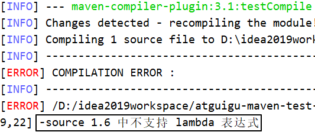

### [#](http://heavy_code_industry.gitee.io/code_heavy_industry/pro002-maven/chapter09/verse07.html#_5、资源属性过滤)5、资源属性过滤

#### [#](http://heavy_code_industry.gitee.io/code_heavy_industry/pro002-maven/chapter09/verse07.html#_1简介)①简介

Maven 为了能够通过 profile 实现各不同运行环境切换，提供了一种『资源属性过滤』的机制。通过属性替换实现不同环境使用不同的参数。

#### [#](http://heavy_code_industry.gitee.io/code_heavy_industry/pro002-maven/chapter09/verse07.html#_2操作演示)②操作演示

##### [#](http://heavy_code_industry.gitee.io/code_heavy_industry/pro002-maven/chapter09/verse07.html#_1-配置-profile)[1]配置 profile

```xml
<profiles>
    <profile>
        <id>devJDBCProfile</id>
        <properties>
            <dev.jdbc.user>root</dev.jdbc.user>
            <dev.jdbc.password>atguigu</dev.jdbc.password>
            <dev.jdbc.url>http://localhost:3306/db_good</dev.jdbc.url>
            <dev.jdbc.driver>com.mysql.jdbc.Driver</dev.jdbc.driver>
        </properties>
        <build>
            <resources>
                <resource>
                    <!-- 表示为这里指定的目录开启资源过滤功能 -->
                    <directory>src/main/resources</directory>

                    <!-- 将资源过滤功能打开 -->
                    <filtering>true</filtering>
                </resource>
            </resources>
        </build>
    </profile>
</profiles>
```

1
2
3
4
5
6
7
8
9
10
11
12
13
14
15
16
17
18
19
20
21
22

##### [#](http://heavy_code_industry.gitee.io/code_heavy_industry/pro002-maven/chapter09/verse07.html#_2-创建待处理的资源文件)[2]创建待处理的资源文件

```properties
dev.user=${dev.jdbc.user}
dev.password=${dev.jdbc.password}
dev.url=${dev.jdbc.url}
dev.driver=${dev.jdbc.driver}
```

1
2
3
4

##### [#](http://heavy_code_industry.gitee.io/code_heavy_industry/pro002-maven/chapter09/verse07.html#_3-执行处理资源命令)[3]执行处理资源命令

```sh
mvn clean resources:resources -PdevJDBCProfile
```

1

##### [#](http://heavy_code_industry.gitee.io/code_heavy_industry/pro002-maven/chapter09/verse07.html#_4-找到处理得到的资源文件)[4]找到处理得到的资源文件

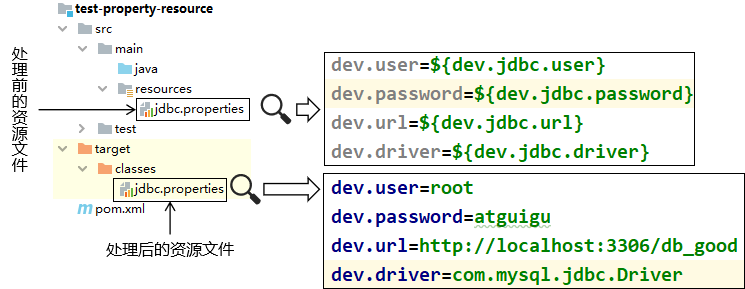

##### [#](http://heavy_code_industry.gitee.io/code_heavy_industry/pro002-maven/chapter09/verse07.html#_5-延伸)[5]延伸

我们时不时会在 resource 标签下看到 includes 和 excludes 标签。它们的作用是：

- includes：指定执行 resource 阶段时要包含到目标位置的资源
- excludes：指定执行 resource 阶段时要排除的资源

情看下面的例子：

```xml
<build>
    <resources>
        <resource>
            <!-- 表示为这里指定的目录开启资源过滤功能 -->
            <directory>src/main/resources</directory>

            <!-- 将资源过滤功能打开 -->
            <filtering>true</filtering>

            <includes>
                <include>*.properties</include>
            </includes>

            <excludes>
                <exclude>happy.properties</exclude>
            </excludes>
        </resource>
    </resources>
</build>
```

1
2
3
4
5
6
7
8
9
10
11
12
13
14
15
16
17
18
19

执行处理资源命令：

```sh
mvn clean resources:resources -PdevJDBCProfile
```

1

执行效果如下：

![images]()

当然我们这里只是以 properties 文件为例，并不是只能处理 properties 文件。

#  第十章 生产实践

## 第一节 搭建 Maven 私服：Nexus

### [#](http://heavy_code_industry.gitee.io/code_heavy_industry/pro002-maven/chapter10/verse01.html#_1、nexus-安装)1、Nexus 安装

#### [#](http://heavy_code_industry.gitee.io/code_heavy_industry/pro002-maven/chapter10/verse01.html#_1下载地址)①下载地址

小诀窍：使用迅雷下载比直接用浏览器下载快很多

https://download.sonatype.com/nexus/3/latest-unix.tar.gz

#### [#](http://heavy_code_industry.gitee.io/code_heavy_industry/pro002-maven/chapter10/verse01.html#_2上传、解压)②上传、解压

上传到 Linux 系统，解压后即可使用，不需要安装。但是需要**注意**：必须提前安装 JDK。

> [root@x nexus-3.37.0-01]# ll
> 总用量 96
> drwxr-xr-x. 3 root root 4096 2月 13 17:33 bin
> drwxr-xr-x. 2 root root 4096 2月 13 17:33 deploy
> drwxr-xr-x. 7 root root 4096 2月 13 17:33 etc
> drwxr-xr-x. 5 root root 4096 2月 13 17:33 lib
> -rw-r--r--. 1 root root 651 11月 20 01:40 NOTICE.txt
> -rw-r--r--. 1 root root 17321 11月 20 01:40 OSS-LICENSE.txt
> -rw-r--r--. 1 root root 41954 11月 20 01:40 PRO-LICENSE.txt
> drwxr-xr-x. 3 root root 4096 2月 13 17:33 public
> drwxr-xr-x. 3 root root 4096 2月 13 17:33 replicator
> drwxr-xr-x. 23 root root 4096 2月 13 17:33 system

#### [#](http://heavy_code_industry.gitee.io/code_heavy_industry/pro002-maven/chapter10/verse01.html#_3启动-nexus)③启动 Nexus

> [root@x ~]# /opt/nexus-3.37.0-01/bin/**nexus start**
> WARNING: ************************************************************
> WARNING: Detected execution as "root" user. This is NOT recommended!
> WARNING: ************************************************************
> Starting nexus
> [root@x ~]# /opt/nexus-3.37.0-01/bin/**nexus status**
> WARNING: ************************************************************
> WARNING: Detected execution as "root" user. This is NOT recommended!
> WARNING: ************************************************************
> nexus is running.

#### [#](http://heavy_code_industry.gitee.io/code_heavy_industry/pro002-maven/chapter10/verse01.html#_4查看端口占用情况)④查看端口占用情况

> [root@x ~]# netstat -anp | grep java
> tcp 0 0 127.0.0.1:**45614** 0.0.0.0:* LISTEN 9872/java
> tcp 0 0 0.0.0.0:**8081** 0.0.0.0:* LISTEN 9872/java

上面 45614 这个每次都不一样，不用管它。我们要访问的是 8081 这个端口。但是需要**注意**：8081 端口的这个进程要在启动 /opt/nexus-3.37.0-01/bin/nexus 这个主体程序**一、两分钟**后才会启动，请耐心等待。

#### [#](http://heavy_code_industry.gitee.io/code_heavy_industry/pro002-maven/chapter10/verse01.html#_5访问-nexus-首页)⑤访问 Nexus 首页

首页地址：http://[Linux 服务器地址]:8081/

初始化界面还是很酷的：


### [#](http://heavy_code_industry.gitee.io/code_heavy_industry/pro002-maven/chapter10/verse01.html#_2、初始设置)2、初始设置


这里参考提示：

- 用户名：admin
- 密码：查看 /opt/sonatype-work/nexus3/admin.password 文件

> [root@hello ~]# cat /opt/sonatype-work/nexus3/admin.password
> ed5e96a8-67aa-4dca-9ee8-1930b1dd5415

所以登录信息输入如下：

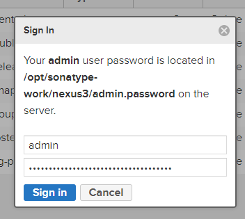

继续执行初始化：


给 admin 用户指定新密码：


匿名登录，启用还是禁用？由于启用匿名登录后，后续操作比较简单，这里我们演示禁用匿名登录的操作方式：

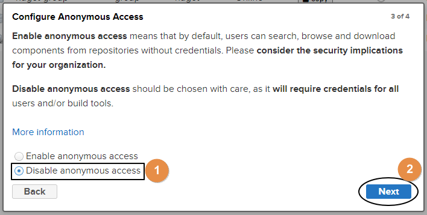

完成：

![images]()

### [#](http://heavy_code_industry.gitee.io/code_heavy_industry/pro002-maven/chapter10/verse01.html#_3、对接-nexus)3、对接 Nexus

#### [#](http://heavy_code_industry.gitee.io/code_heavy_industry/pro002-maven/chapter10/verse01.html#_1通过-nexus-下载-jar-包)①通过 Nexus 下载 jar 包

##### [#](http://heavy_code_industry.gitee.io/code_heavy_industry/pro002-maven/chapter10/verse01.html#_1-了解-nexus-上的各种仓库)[1]了解 Nexus 上的各种仓库


| 仓库类型 | 说明                                           |
| -------- | ---------------------------------------------- |
| proxy    | 某个远程仓库的代理                             |
| group    | 存放：通过 Nexus 获取的第三方 jar 包           |
| hosted   | 存放：本团队其他开发人员部署到 Nexus 的 jar 包 |

| 仓库名称        | 说明                                                         |
| --------------- | ------------------------------------------------------------ |
| maven-central   | Nexus 对 Maven 中央仓库的代理                                |
| maven-public    | Nexus 默认创建，供开发人员下载使用的组仓库                   |
| maven-releasse  | Nexus 默认创建，供开发人员部署自己 jar 包的宿主仓库 要求 releasse 版本 |
| maven-snapshots | Nexus 默认创建，供开发人员部署自己 jar 包的宿主仓库 要求 snapshots 版本 |

初始状态下，这几个仓库都没有内容：


##### [#](http://heavy_code_industry.gitee.io/code_heavy_industry/pro002-maven/chapter10/verse01.html#_2-使用空的本地仓库)[2]使用空的本地仓库

![images]()

```xml
  <!-- 配置一个新的 Maven 本地仓库 -->
  <localRepository>D:/maven-repository-new</localRepository>
```

##### [#](http://heavy_code_industry.gitee.io/code_heavy_industry/pro002-maven/chapter10/verse01.html#_3-指定-nexus-服务器地址)[3]指定 Nexus 服务器地址

把我们原来配置阿里云仓库地址的 mirror 标签改成下面这样：

```xml
<mirror>
	<id>nexus-mine</id>
	<mirrorOf>central</mirrorOf>
	<name>Nexus mine</name>
	<url>http://192.168.198.100:8081/repository/maven-public/</url>
</mirror>
```

这里的 url 标签是这么来的：


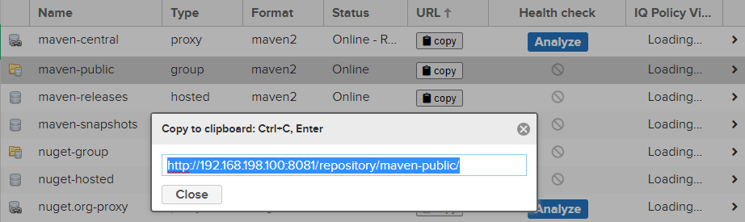

把上图中看到的地址复制出来即可。如果我们在前面允许了匿名访问，到这里就够了。但如果我们禁用了匿名访问，那么接下来我们还要继续配置 settings.xml：

```xml
<server>
  <id>nexus-mine</id>
  <username>admin</username>
  <password>atguigu</password>
</server>
```

这里需要**格外注意**：server 标签内的 id 标签值必须和 mirror 标签中的 id 值一样。

##### [#](http://heavy_code_industry.gitee.io/code_heavy_industry/pro002-maven/chapter10/verse01.html#_4-效果)[4]效果

找一个用到框架的 Maven 工程，执行命令：

```sh
mvn clean compile
```

1

下载过程日志：

> Downloading from nexus-mine: http://192.168.198.100:8081/repository/maven-public/com/jayway/jsonpath/json-path/2.4.0/json-path-2.4.0.pom
> Downloaded from nexus-mine: http://192.168.198.100:8081/repository/maven-public/com/jayway/jsonpath/json-path/2.4.0/json-path-2.4.0.pom (2.6 kB at 110 kB/s)
> Downloading from nexus-mine: http://192.168.198.100:8081/repository/maven-public/net/minidev/json-smart/2.3/json-smart-2.3.pom
> Downloaded from nexus-mine: http://192.168.198.100:8081/repository/maven-public/net/minidev/json-smart/2.3/json-smart-2.3.pom (9.0 kB at 376 kB/s)
> Downloading from nexus-mine: http://192.168.198.100:8081/repository/maven-public/net/minidev/minidev-parent/2.3/minidev-parent-2.3.pom
> Downloaded from nexus-mine: http://192.168.198.100:8081/repository/maven-public/net/minidev/minidev-parent/2.3/minidev-parent-2.3.pom (8.5 kB at 404 kB/s)
> Downloading from nexus-mine: http://192.168.198.100:8081/repository/maven-public/net/minidev/accessors-smart/1.2/accessors-smart-1.2.pom
> Downloaded from nexus-mine: http://192.168.198.100:8081/repository/maven-public/net/minidev/accessors-smart/1.2/accessors-smart-1.2.pom (12 kB at 463 kB/s)

下载后，Nexus 服务器上就有了 jar 包：


#### [#](http://heavy_code_industry.gitee.io/code_heavy_industry/pro002-maven/chapter10/verse01.html#_2将-jar-包部署到-nexus)②将 jar 包部署到 Nexus

##### [#](http://heavy_code_industry.gitee.io/code_heavy_industry/pro002-maven/chapter10/verse01.html#_1-配置-maven-工程)[1]配置 Maven 工程

```xml
<distributionManagement>
    <snapshotRepository>
        <id>nexus-mine</id>
        <name>Nexus Snapshot</name>
        <url>http://192.168.198.100:8081/repository/maven-snapshots/</url>
    </snapshotRepository>
</distributionManagement>
```

1
2
3
4
5
6
7

这里 snapshotRepository 的 id 标签也必须和 settings.xml 中指定的 mirror 标签的 id 属性一致。

##### [#](http://heavy_code_industry.gitee.io/code_heavy_industry/pro002-maven/chapter10/verse01.html#_2-执行部署命令)[2]执行部署命令

```sh
mvn deploy
```

1

> Uploading to nexus-mine: http://192.168.198.100:8081/repository/maven-snapshots/com/atguigu/demo/demo07-redis-data-provider/1.0-SNAPSHOT/maven-metadata.xml
> Uploaded to nexus-mine: http://192.168.198.100:8081/repository/maven-snapshots/com/atguigu/demo/demo07-redis-data-provider/1.0-SNAPSHOT/maven-metadata.xml (786 B at 19 kB/s)
> Uploading to nexus-mine: http://192.168.198.100:8081/repository/maven-snapshots/com/atguigu/demo/demo07-redis-data-provider/maven-metadata.xml
> Uploaded to nexus-mine: http://192.168.198.100:8081/repository/maven-snapshots/com/atguigu/demo/demo07-redis-data-provider/maven-metadata.xml (300 B at 6.5 kB/s)
> [INFO] ------------------------------------------------------------------------
> [INFO] Reactor Summary:
> [INFO]
> [INFO] demo-imperial-court-ms-show 1.0-SNAPSHOT ........... SUCCESS [ 1.875 s]
> [INFO] demo09-base-entity ................................. SUCCESS [ 21.883 s]
> [INFO] demo10-base-util ................................... SUCCESS [ 0.324 s]
> [INFO] demo08-base-api .................................... SUCCESS [ 1.171 s]
> [INFO] demo01-imperial-court-gateway ...................... SUCCESS [ 0.403 s]
> [INFO] demo02-user-auth-center ............................ SUCCESS [ 2.932 s]
> [INFO] demo03-emp-manager-center .......................... SUCCESS [ 0.312 s]
> [INFO] demo04-memorials-manager-center .................... SUCCESS [ 0.362 s]
> [INFO] demo05-working-manager-center ...................... SUCCESS [ 0.371 s]
> [INFO] demo06-mysql-data-provider ......................... SUCCESS [ 6.779 s]
> [INFO] demo07-redis-data-provider 1.0-SNAPSHOT ............ SUCCESS [ 0.273 s]


#### [#](http://heavy_code_industry.gitee.io/code_heavy_industry/pro002-maven/chapter10/verse01.html#_3引用别人部署的-jar-包)③引用别人部署的 jar 包

##### [#](http://heavy_code_industry.gitee.io/code_heavy_industry/pro002-maven/chapter10/verse01.html#_1-提出问题)[1]提出问题

- 默认访问的 Nexus 仓库：maven-public
- 存放别人部署 jar 包的仓库：maven-snapshots

##### [#](http://heavy_code_industry.gitee.io/code_heavy_industry/pro002-maven/chapter10/verse01.html#_2-配置-maven-工程)[2]配置 Maven 工程

```xml
<repositories>
    <repository>
        <id>nexus-mine</id>
        <name>nexus-mine</name>
        <url>http://192.168.198.100:8081/repository/maven-snapshots/</url>
        <snapshots>
            <enabled>true</enabled>
        </snapshots>
        <releases>
            <enabled>true</enabled>
        </releases>
    </repository>
</repositories>
```


### [#](http://heavy_code_industry.gitee.io/code_heavy_industry/pro002-maven/chapter10/verse01.html#_4、修改仓库配置)4、修改仓库配置

举例：修改 maven-central 仓库代理的远程库地址


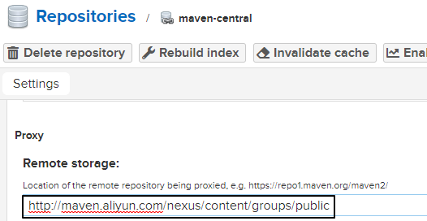

![images]()

## 第二节 jar包冲突问题

### [#](http://heavy_code_industry.gitee.io/code_heavy_industry/pro002-maven/chapter10/verse02.html#_1、谁需要面对-jar-包冲突)1、谁需要面对 jar 包冲突？

先给结论：编订依赖列表的程序员。初次设定一组依赖，因为尚未经过验证，所以确实有可能存在各种问题，需要做有针对性的调整。那么谁来做这件事呢？我们最不希望看到的就是：团队中每个程序员都需要自己去找依赖，即使是做同一个项目，每个模块也各加各的依赖，没有统一管理。那前人踩过的坑，后人还要再踩一遍。而且大家用的依赖有很多细节都不一样，版本更是五花八门，这就让事情变得更加复杂。

所以虽然初期需要根据项目开发和实际运行情况对依赖配置不断调整，最终确定一个各方面都 OK 的版本。但是一旦确定下来，放在父工程中做依赖管理，各个子模块各取所需，这样基本上就能很好的避免问题的扩散。

即使开发中遇到了新问题，也可以回到源头检查、调整 dependencyManagement 配置的列表——而不是每个模块都要改。所以学完这一节你应该就会对前面讲过的『继承』有了更深的理解。

### [#](http://heavy_code_industry.gitee.io/code_heavy_industry/pro002-maven/chapter10/verse02.html#_2、表现形式)2、表现形式

由于实际开发时我们往往都会整合使用很多大型框架，所以一个项目中哪怕只是一个模块也会涉及到大量 jar 包。数以百计的 jar 包要彼此协调、精密配合才能保证程序正常运行。而规模如此庞大的 jar 包组合在一起难免会有磕磕碰碰。最关键的是由于 jar 包冲突所导致的问题非常诡异，这里我们只能罗列较为典型的问题，而没法保证穷举。

但是我们仍然能够指出一点：一般来说，由于我们自己编写代码、配置文件写错所导致的问题通常能够在异常信息中看到我们自己类的全类名或配置文件的所在路径。如果整个错误信息中完全没有我们负责的部分，全部是框架、第三方工具包里面的类报错，这往往就是 jar 包的问题所引起的。

而具体的表现形式中，主要体现为找不到类或找不到方法。

#### [#](http://heavy_code_industry.gitee.io/code_heavy_industry/pro002-maven/chapter10/verse02.html#_1抛异常-找不到类)①抛异常：找不到类

此时抛出的常见的异常类型：

- java.lang.**ClassNotFoundException**：编译过程中找不到类
- java.lang.**NoClassDefFoundError**：运行过程中找不到类
- java.lang.**LinkageError**：不同类加载器分别加载的多个类有相同的全限定名

我们来举个例子：

```xml
<dependency>
    <groupId>org.apache.httpcomponents</groupId>
    <artifactId>httpclient</artifactId>
    <version>4.x.x</version>
</dependency>
```


httpclient 这个 jar 包中有一个类：org.apache.http.conn.ssl.NoopHostnameVerifier。这个类在较低版本中没有，但在较高版本存在。比如：

| jar 包版本 | 是否存在 |
| ---------- | -------- |
| 4.3.6      | 否       |
| 4.4        | 是       |

那当我们确实需要用到 NoopHostnameVerifier 这个类，我们看到 Maven 通过依赖传递机制引入了这个 jar 包，所以没有明确地显式声明对这个 jar 包的依赖。可是 Maven 传递过来的 jar 包是 4.3.6 版本，里面没有包含我们需要的类，就会抛出异常。

而『冲突』体现在：4.3.6 和 4.4 这两个版本的 jar 包都被框架所依赖的 jar 包给传递进来了，但是假设 Maven 根据**『版本仲裁』**规则实际采纳的是 4.3.6。

#### [#](http://heavy_code_industry.gitee.io/code_heavy_industry/pro002-maven/chapter10/verse02.html#_2抛异常-找不到方法)②抛异常：找不到方法

程序找不到符合预期的方法。这种情况多见于通过反射调用方法，所以经常会导致：java.lang.NoSuchMethodError。比如 antlr:antlr:x.x.x 这个包中有一个接口：antlr.collections.AST

| 版本  | getLine()方法 |
| ----- | ------------- |
| 2.7.2 | 无            |
| 2.7.6 | 有            |

#### [#](http://heavy_code_industry.gitee.io/code_heavy_industry/pro002-maven/chapter10/verse02.html#_3没报错但结果不对)③没报错但结果不对

发生这种情况比较典型的原因是：两个 jar 包中的类分别实现了同一个接口，这本来是很正常的。但是问题在于：由于没有注意命名规范，两个不同实现类恰巧是同一个名字。

![images]()

具体例子是有的同学在实际工作中遇到过：项目中部分模块使用 log4j 打印日志；其它模块使用 logback，编译运行都不会冲突，但是会引起日志服务降级，让你的 log 配置文件失效。比如：你指定了 error 级别输出，但是冲突就会导致 info、debug 都在输出。

### [#](http://heavy_code_industry.gitee.io/code_heavy_industry/pro002-maven/chapter10/verse02.html#_3、本质)3、本质

以上表现形式归根到底是**两种基本情况**导致的：

#### [#](http://heavy_code_industry.gitee.io/code_heavy_industry/pro002-maven/chapter10/verse02.html#_1同一jar包的不同版本)①同一jar包的不同版本


#### [#](http://heavy_code_industry.gitee.io/code_heavy_industry/pro002-maven/chapter10/verse02.html#_3不同jar包中包含同名类)③不同jar包中包含同名类

这里我们拿 netty 来举个例子，netty 是一个类似 Tomcat 的 Servlet 容器。通常我们不会直接依赖它，所以基本上都是框架传递进来的。那么当我们用到的框架很多时，就会有不同的框架用不同的坐标导入 netty。大家可以参照下表对比一下两组坐标：

| 截止到3.2.10.Final版本以前的坐标形式：                       | 从3.3.0.Final版本开始以后的坐标形式：                        |
| ------------------------------------------------------------ | ------------------------------------------------------------ |
| <dependency> <groupId>**org.jboss.netty**</groupId> <artifactId>**netty**</artifactId> <version>**3.2.10.Final**</version> </dependency> | <dependency> <groupId>**io.netty**</groupId> <artifactId>**netty**</artifactId> <version>**3.9.2.Final**</version> </dependency> |

但是偏偏这两个**『不同的包』**里面又有很多**『全限定名相同』**的类。例如：

> org.jboss.netty.channel.socket.ServerSocketChannelConfig.class org.jboss.netty.channel.socket.nio.NioSocketChannelConfig.class org.jboss.netty.util.internal.jzlib.Deflate.class org.jboss.netty.handler.codec.serialization.ObjectDecoder.class org.jboss.netty.util.internal.ConcurrentHashMap$HashIterator.class org.jboss.netty.util.internal.jzlib.Tree.class org.jboss.netty.util.internal.ConcurrentIdentityWeakKeyHashMap$Segment.class org.jboss.netty.handler.logging.LoggingHandler.class org.jboss.netty.channel.ChannelHandlerLifeCycleException.class org.jboss.netty.util.internal.ConcurrentIdentityHashMap$ValueIterator.class org.jboss.netty.util.internal.ConcurrentIdentityWeakKeyHashMap$Values.class org.jboss.netty.util.internal.UnterminatableExecutor.class org.jboss.netty.handler.codec.compression.ZlibDecoder.class org.jboss.netty.handler.codec.rtsp.RtspHeaders$Values.class org.jboss.netty.handler.codec.replay.ReplayError.class org.jboss.netty.buffer.HeapChannelBufferFactory.class
>
> ……

其实还有很多，这里列出的只是冰山一角。

当然，如果全限定名相同，类中的代码也完全相同，那么用着也行。问题是如果**『全限定名相同』**，但是**『代码不同』**，那可太坑了。我们随便找一个来看看：

| 坐标信息：org.jboss.netty:netty:jar:3.2.10.Final             |
| ------------------------------------------------------------ |
| **代码截图：**  |

| 坐标信息：io.netty:netty:jar:3.9.2.Final                     |
| ------------------------------------------------------------ |
| **代码截图：**  |

### [#](http://heavy_code_industry.gitee.io/code_heavy_industry/pro002-maven/chapter10/verse02.html#_4、解决办法)4、解决办法

#### [#](http://heavy_code_industry.gitee.io/code_heavy_industry/pro002-maven/chapter10/verse02.html#_1概述)①概述

很多情况下常用框架之间的整合容易出现的冲突问题都有人总结过了，拿抛出的异常搜索一下基本上就可以直接找到对应的 jar 包。我们接下来要说的是通用方法。

不管具体使用的是什么工具，基本思路无非是这么两步：

- 第一步：把彼此冲突的 jar 包找到
- 第二步：在冲突的 jar 包中选定一个。具体做法无非是通过 exclusions 排除依赖，或是明确声明依赖。

#### [#](http://heavy_code_industry.gitee.io/code_heavy_industry/pro002-maven/chapter10/verse02.html#_2idea-的-maven-helper-插件)②IDEA 的 Maven Helper 插件

这个插件是 IDEA 中安装的插件，不是 Maven 插件。它能够给我们罗列出来同一个 jar 包的不同版本，以及它们的来源。但是对不同 jar 包中同名的类没有办法。

- [在 IDEA 中安装 Maven helper 插件](http://heavy_code_industry.gitee.io/code_heavy_industry/pro002-maven/chapter10/verse02-part01.html)。
- [基于 pom.xml 的依赖冲突分析](http://heavy_code_industry.gitee.io/code_heavy_industry/pro002-maven/chapter10/verse02-part02.html)。

#### [#](http://heavy_code_industry.gitee.io/code_heavy_industry/pro002-maven/chapter10/verse02.html#_3maven-的-enforcer-插件)③Maven 的 enforcer 插件

使用 Maven 的 enforcer 插件既可以检测同一个 jar 包的不同版本，又可以检测不同 jar 包中同名的类。

##### [#](http://heavy_code_industry.gitee.io/code_heavy_industry/pro002-maven/chapter10/verse02.html#_1-引入-netty-依赖)[1]引入 netty 依赖

这里我们引入两个对 netty 的依赖，展示不同 jar 包中有同名类的情况。

```xml
<dependencies>
    <dependency>
        <groupId>org.jboss.netty</groupId>
        <artifactId>netty</artifactId>
        <version>3.2.10.Final</version>
    </dependency>

    <dependency>
        <groupId>io.netty</groupId>
        <artifactId>netty</artifactId>
        <version>3.9.2.Final</version>
    </dependency>
</dependencies>
```


##### [#](http://heavy_code_industry.gitee.io/code_heavy_industry/pro002-maven/chapter10/verse02.html#_2-配置-enforcer-插件)[2]配置 enforcer 插件

```xml
<build>
    <pluginManagement>
        <plugins>
            <plugin>
                <groupId>org.apache.maven.plugins</groupId>
                <artifactId>maven-enforcer-plugin</artifactId>
                <version>1.4.1</version>
                <executions>
                    <execution>
                        <id>enforce-dependencies</id>
                        <phase>validate</phase>
                        <goals>
                            <goal>display-info</goal>
                            <goal>enforce</goal>
                        </goals>
                    </execution>
                </executions>
                <dependencies>
                    <dependency>
                        <groupId>org.codehaus.mojo</groupId>
                        <artifactId>extra-enforcer-rules</artifactId>
                        <version>1.0-beta-4</version>
                    </dependency>
                </dependencies>
                <configuration>
                    <rules>
                        <banDuplicateClasses>
                            <findAllDuplicates>true</findAllDuplicates>
                        </banDuplicateClasses>
                    </rules>
                </configuration>
            </plugin>
        </plugins>
    </pluginManagement>
</build>
```


##### [#](http://heavy_code_industry.gitee.io/code_heavy_industry/pro002-maven/chapter10/verse02.html#_3-测试)[3]测试

执行如下 Maven 命令：

```sh
mvn clean package enforcer:enforce
```


部分运行结果：

> [INFO] --- maven-enforcer-plugin:1.4.1:enforce (default-cli) @ pro32-duplicate-class ---
> [WARNING] Rule 0: org.apache.maven.plugins.enforcer.BanDuplicateClasses failed with message:
> Duplicate classes found:
>
> Found in:
> io.netty:netty:jar:3.9.2.Final:compile
> org.jboss.netty:netty:jar:3.2.10.Final:compile
> Duplicate classes:
> org/jboss/netty/channel/socket/ServerSocketChannelConfig.class
> org/jboss/netty/channel/socket/nio/NioSocketChannelConfig.class
> org/jboss/netty/util/internal/jzlib/Deflate.class
> org/jboss/netty/handler/codec/serialization/ObjectDecoder.class
> org/jboss/netty/util/internal/ConcurrentHashMap$HashIterator.class
>
> ……

TIP

最后，问你一个问题：解决 jar 包冲突问题这么麻烦，是不是不该用 Maven？

## 第三节 体系外 jar 包引入

### [#](http://heavy_code_industry.gitee.io/code_heavy_industry/pro002-maven/chapter10/verse03.html#_1、提出问题)1、提出问题

『体系外 jar 包』这个名字是我起的，来源是这样——目前来说我们在 Maven 工程中用到的 jar 包都是通过 Maven 本身的机制导入进来的。

而实际开发中确实有可能用到一些 jar 包并非是用 Maven 的方式发布，那自然也没法通过 Maven 导入。

此时如果我们能够拿到该 jar 包的源码那还可以自己建一个 Maven 工程，自己打包。可是如果连源码都没有呢？

这方面的例子包括一些人脸识别用的 jar 包、海康视频监控 jar 包等等。

### [#](http://heavy_code_industry.gitee.io/code_heavy_industry/pro002-maven/chapter10/verse03.html#_2、解决办法)2、解决办法

#### [#](http://heavy_code_industry.gitee.io/code_heavy_industry/pro002-maven/chapter10/verse03.html#_1准备一个体系外-jar-包)①准备一个体系外 jar 包

我们通过学 Maven 以前的方式创建一个 Java 工程，然后导出 jar 包即可用来测试。


![images]()

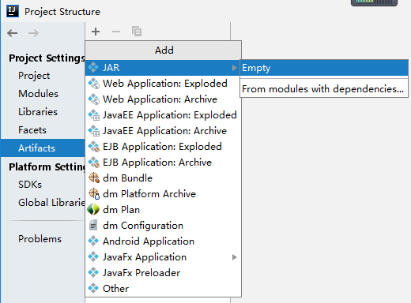

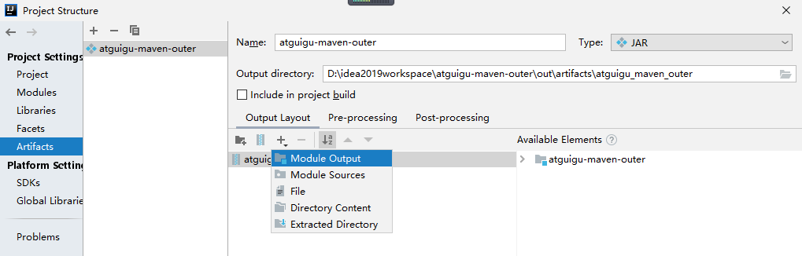

![images]()

![images]()

![images]()

![images]()

#### [#](http://heavy_code_industry.gitee.io/code_heavy_industry/pro002-maven/chapter10/verse03.html#_2将该-jar-包安装到-maven-仓库)②将该 jar 包安装到 Maven 仓库

这里我们使用 install 插件的 install-file 目标：

```sh
mvn install:install-file -Dfile=[体系外 jar 包路径] \
-DgroupId=[给体系外 jar 包强行设定坐标] \
-DartifactId=[给体系外 jar 包强行设定坐标] \
-Dversion=1 \
-Dpackage=jar
```


例如（Windows 系统下使用 ^ 符号换行；Linux 系统用 \）：

```sh
mvn install:install-file -Dfile=D:\idea2019workspace\atguigu-maven-outer\out\artifacts\atguigu_maven_outer\atguigu-maven-outer.jar ^
-DgroupId=com.atguigu.maven ^
-DartifactId=atguigu-maven-outer ^
-Dversion=1 ^
-Dpackaging=jar
```


执行结果：

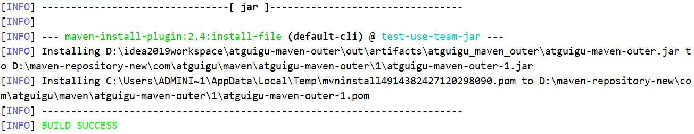

再看本地仓库中确实有：

![imags]()

我们打开 POM 文件看看：

```xml
<?xml version="1.0" encoding="UTF-8"?>
<project xsi:schemaLocation="http://maven.apache.org/POM/4.0.0 http://maven.apache.org/xsd/maven-4.0.0.xsd" xmlns="http://maven.apache.org/POM/4.0.0"
    xmlns:xsi="http://www.w3.org/2001/XMLSchema-instance">
  <modelVersion>4.0.0</modelVersion>
  <groupId>com.atguigu.maven</groupId>
  <artifactId>atguigu-maven-outer</artifactId>
  <version>1</version>
  <description>POM was created from install:install-file</description>
</project>
```

#### [#](http://heavy_code_industry.gitee.io/code_heavy_industry/pro002-maven/chapter10/verse03.html#_3测试)③测试

在其它地方依赖这个 jar 包：

```xml
<dependency>
    <groupId>com.atguigu.maven</groupId>
    <artifactId>atguigu-maven-outer</artifactId>
    <version>1</version>
</dependency>
```

创建对象、调用方法：

