# SpringBoot

最简单的方式，快速整合所有技术栈

## 1、快速入门

### SpringBoot特性

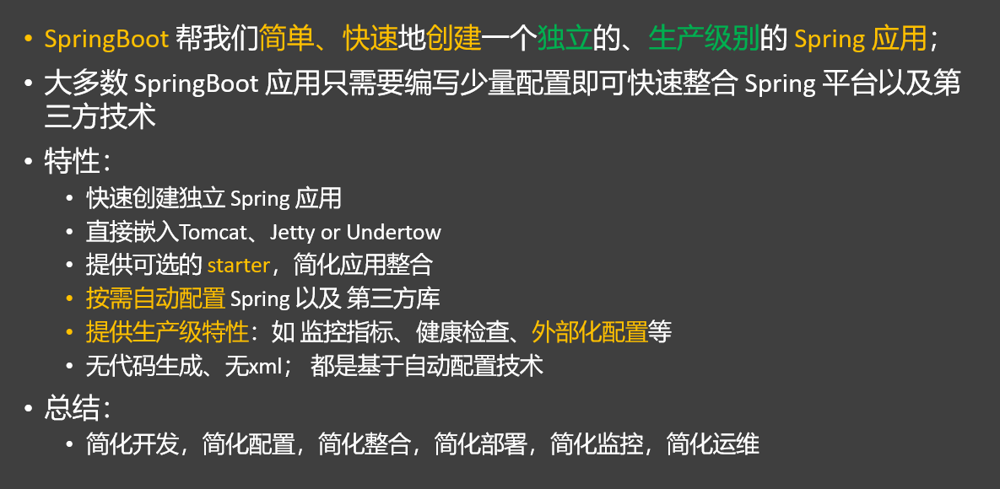

#### SpringBoot特性 - 快速部署

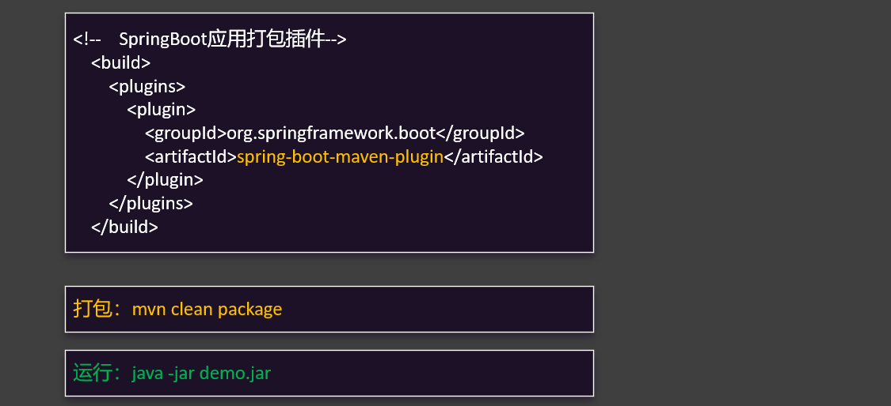


### 场景启动器

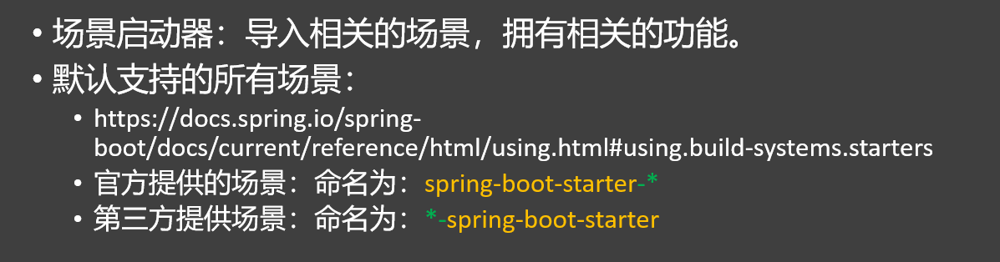


```xml
<!--
     SpringBoot场景启动器：
        官方写的：spring-boot-starter-*
        第三方的：*-spring-boot-starter
            把当前场景用的jar包都引入进来；
            每个场景启动器都有一个基础依赖：spring-boot-starter
                spring-boot-starter-web
                spring-boot-starter-aop
                spring-boot-starter-data-jdbc
                spring-boot-starter-test
                spring-boot-starter-tomcat
                spring-boot-starter-json
     依赖管理：父项目不管理的所有依赖，导入的时候都需要写版本
        修改版本：
          1）、写上：就近优先原则
          2）、自己声明属性：mysql.version

  -->
<dependency>
    <groupId>org.springframework.boot</groupId>
    <artifactId>spring-boot-starter-web</artifactId>
</dependency>
```


### 依赖管理

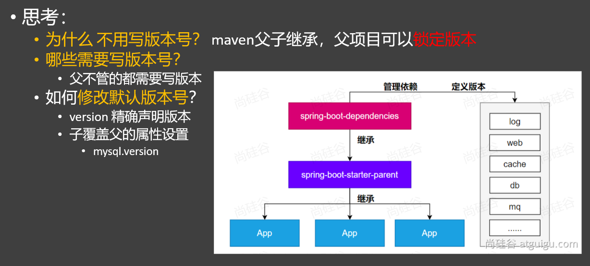


### 自动配置机制

#### 初步理解

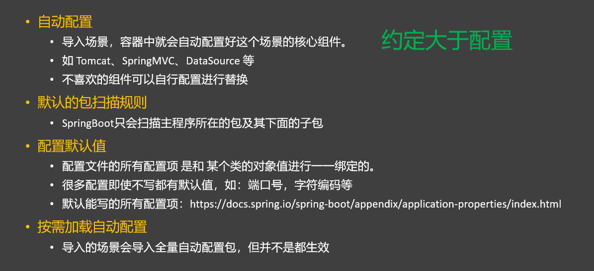

自定义替换数据源

```java
@Configuration
public class DataSourceConfig {


    @Value("${spring.datasource.username}")
    String username;
    @Value("${spring.datasource.password}")
    String password;
    @Value("${spring.datasource.url}")
    String url;
    @Value("${spring.datasource.driver-class-name}")
    String driverClassName;


    //SpringBoot默认约定：用户配了的用用户的，没配的用默认的
    @Bean
    DataSource dataSource(){
        DruidDataSource dataSource = new DruidDataSource();

        dataSource.setUsername(username);
        dataSource.setPassword(password);
        dataSource.setUrl(url);
        dataSource.setDriverClassName(driverClassName);

        return dataSource;
    }
}

```


或者

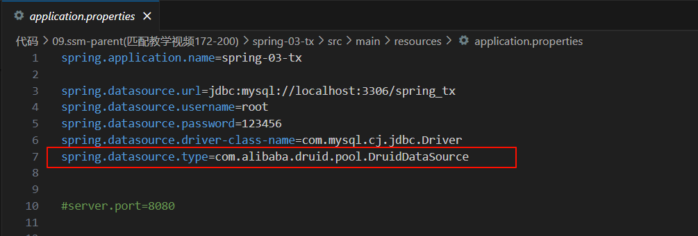


#### 完整流程

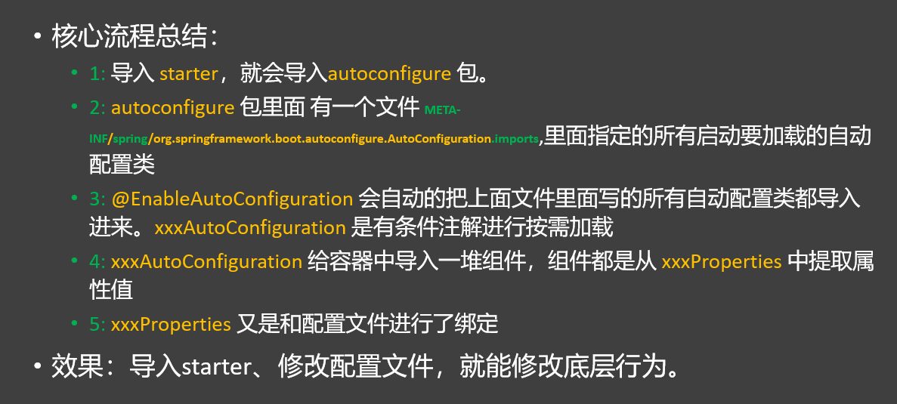

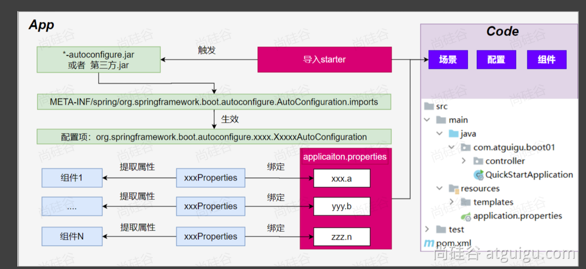


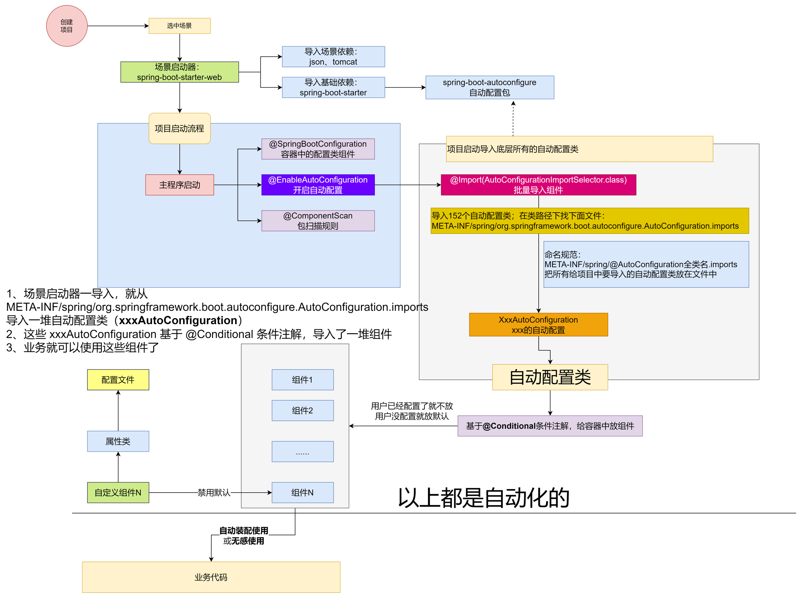


**DataSourceAutoConfiguration 组件分析**

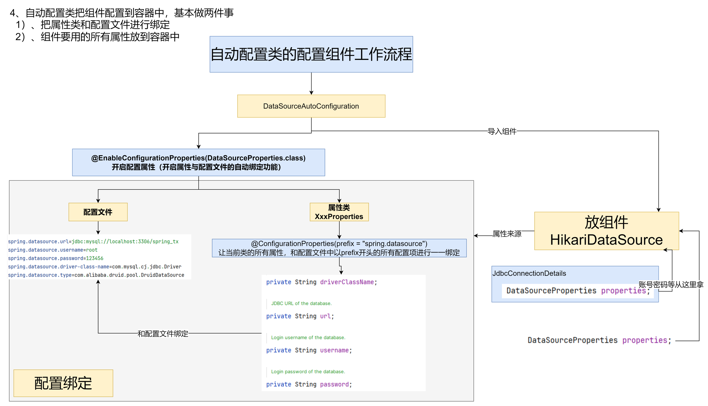

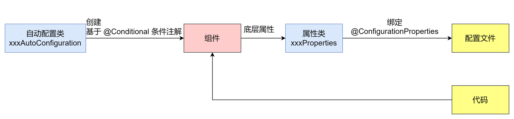


## 2、基础功能
