# 先从阿里及其他大厂面试题说起


1、Object object = new Object() 谈谈你对这句话的理解?
==============================================

一般而言 JDK8 按照默认情况下，new 一个对象占多少内存空间？

**位置所在**：[JVM](https://so.csdn.net/so/search?q=JVM&spm=1001.2101.3001.7020) 里堆→新生区→伊甸园区

**构成布局**：头体？想想我们的 HTML 报文

2、对象在堆内存中布局
===============

2.1、权威定义
------------

周志明老师 JVM 第 3 版


2.2、对象在堆内存中的存储布局
--------------------

下面分别是 **java对象** 和**数组**（数组对象会多一个length），原理其实类似

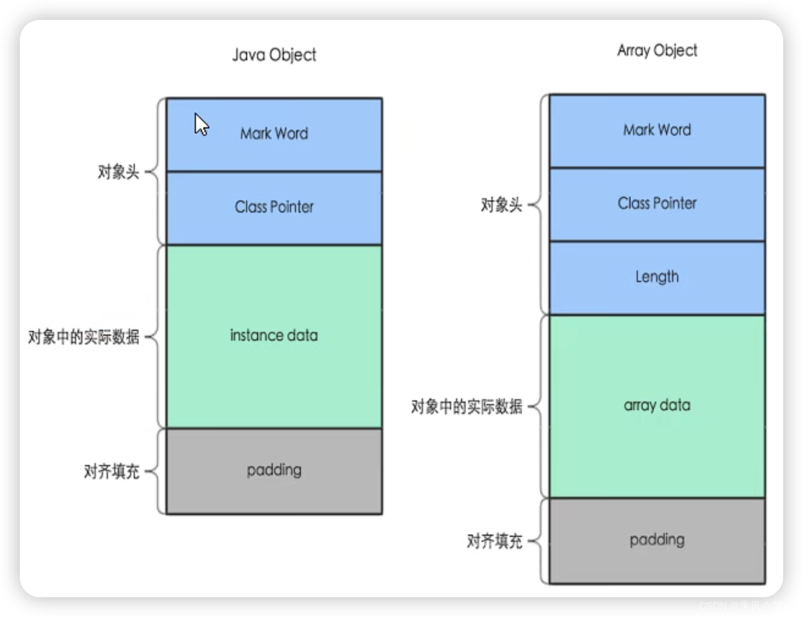

对象内部结构分为：对象头、实例数据、对齐填充（保证8个字节的倍数）

对象头分为对象标记（markOop）和类元信息（klassOop），类元信息存储的是指向该对象类元数据（klass）的首地址。

### 2.2.1、对象头

#### **1、对象标记 Mark Word**

它保存什么

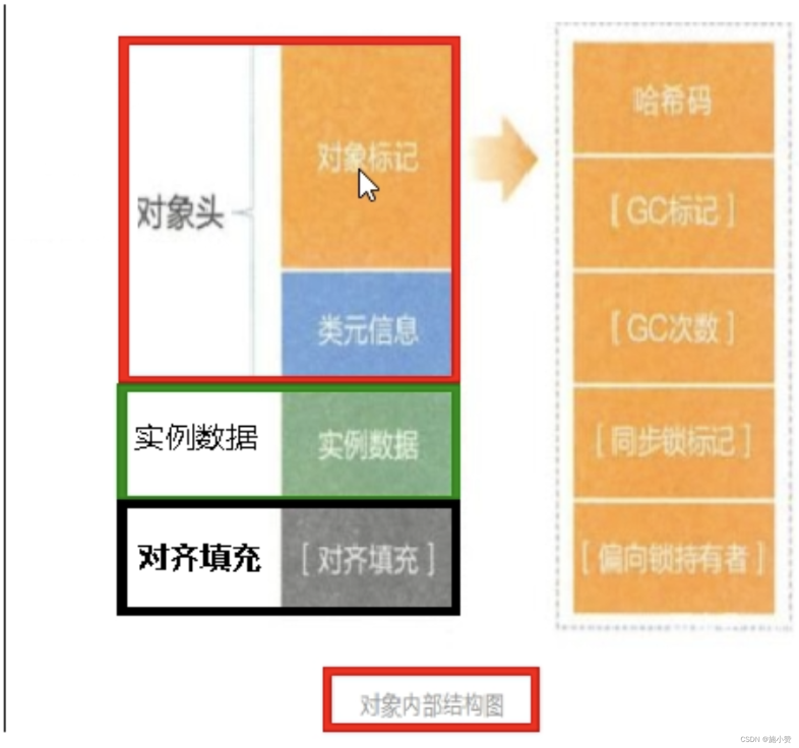


**在 64 位系统中， `Mark Word 占了 8 个字节`，`类型指针占了 8 个字节`，一共是 16 个字节** 


默认存储对象的 HashCode、分代年龄和锁标志位等信息。

这些信息都是与对象自身定义无关的数据，所以 MarkWord 被设计成一个非固定的数据结构以便在极小的空间内存存储尽量多的数据。

它会**根据对象的状态复用自己的存储空间，也就是说在运行期间 MarkWord 里存储的数据会随着锁标志位的变化而变化**。

#### **2、类元信息 (又叫类型指针class pointer)**

参考尚硅谷宋红康老师原图

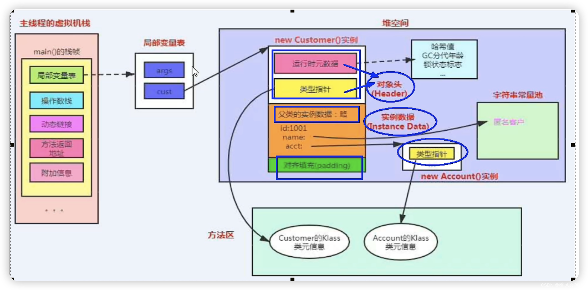

对象指向它的类元数据的指针，虚拟机通过这个指针来确定这个对象是哪个类的实例【class保存在方法区】。

#### 对象头多大=16bit

在 64 位系统中，Mark Word 占了 8 个字节，类型指针占了 8 个字节，一共是 16 个字节。

### **2.2.2、实例数据**

存放类的属性 (Field) 数据信息，包括父类的属性信息，

> 如果是数组的实例部分还包括`数组的长度`，这部分内存按 `4 字节`对齐。


### **2.2.3、对齐填充**

虚拟机要求对象起始地址必须是 8 字节的整数倍。填充数据不是必须存在的，仅仅是为了字节对齐这部分内存按 8 字节补充对齐。

有个案例，`对象头16`+`实例数据（int 4 + boolean 1）5`+`对齐填充3`=`24字节`


2.3、官网理论
------------

Hotspot 术语表官网 [HotSpot Glossary of Terms](http://openjdk.java.net/groups/hotspot/docs/HotSpotGlossary.html "HotSpot Glossary of Terms")


## 2.3、底层源码理论证明

```
http://hg.openjdk.java.netjidlk8u/jdk8u/hotspot/file/89fb452b3688/src/share/vm/oops/oop.hpp
```

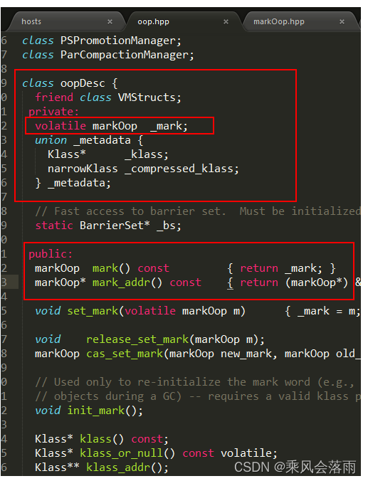

*mark 字段是 mark word，* metadata 是类指针 klass pointer，
对象头（object header）即是由这两个字段组成，这些术语可以参考 Hotspot 术语表，


**3、再说对象头的 MarkWord**
=====================

**3.1、32 位 (看一下即可，不用学了，以 64 位为准)**
----------------------------------


3.2、64位重要
------------------------

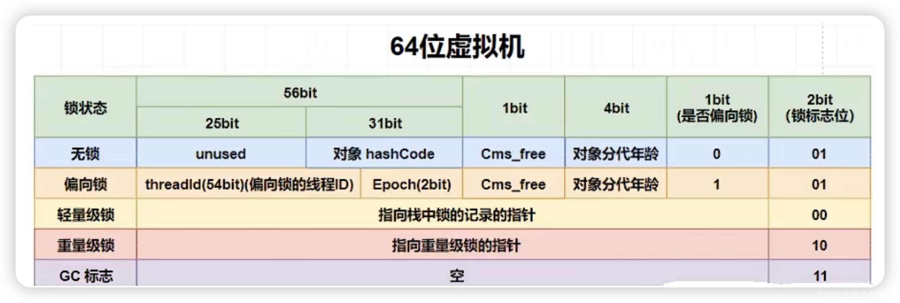

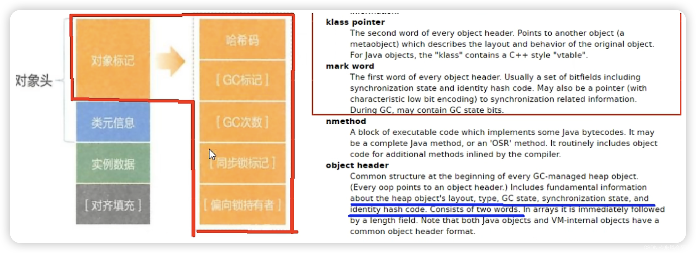

**oop.hpp**

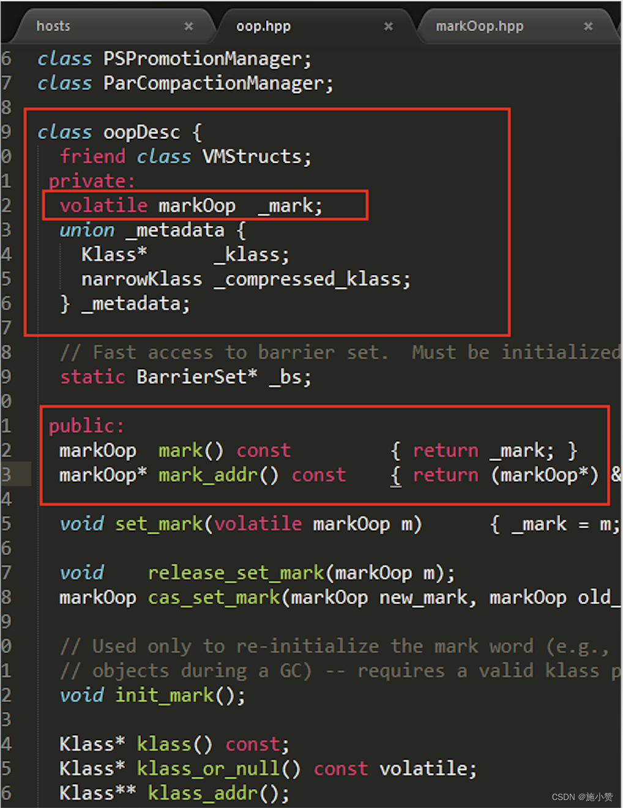


**markOop.hpp**

hash： 保存对象的哈希码

age： 保存对象的分代年龄  

biased_lock： 偏向锁标识位 

lock： 锁状态标识位 

JavaThread ：保存持有偏向锁的线程 ID 

epoch： 保存偏向时间戳 

> GC 年龄采用 4 位 bit 存储，最大为 15，
>
> 例如 MaxTenuringThreshold 参数默认值就是 15


**markword(64 位) 分布图，**

对象布局、GC 回收和后面的锁升级就是对象标记 MarkWord 里面标志位的变化


4、聊聊 Object obj = new Object()  --JOL 证明 
==================================

JOL 证明【Java Object Layout】

JOL 官网：[OpenJDK: jol](http://openjdk.java.net/projects/code-tools/jol/ "OpenJDK: jol")

## POM

```xml
<!-- 定位：分析对象在JVM的大小和分布 -->
<dependency>
    <groupId>org.openjdk.jol</groupId>
    <artifactId>jol-core</artifactId>
    <version>0.9</version>
    <scope>provided</scope>
</dependency>
```

## **小试一下**

```java
import org.openjdk.jol.info.ClassLayout;
import org.openjdk.jol.vm.VM;
 
public class MyObject {
    public static void main(String[] args) {
        //VM 的细节详细情况
        System.out.println(VM.current().details());
        // 所有的对象分配的字节都是 8 的整数倍。
        System.out.println(VM.current().objectAlignment());
    }
}
```

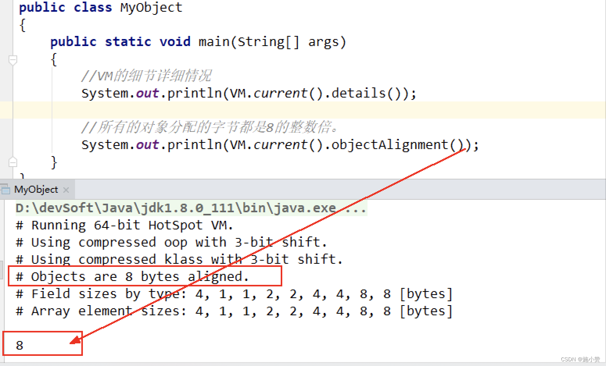

## **代码**

```java
import org.openjdk.jol.info.ClassLayout;

public class JOLDemo {
    public static void main(String[] args) {
 
        Object o = new Object();
 		//打印 o的 内存布局
        System.out.println(ClassLayout.parseInstance(o).toPrintable());
    }
}
```

## **结果呈现说明**

对象头 markword 8字节    类型指针8字节，但是这里显示4字节，默认开启指针压缩


| 表头名      | 说明                                       |
| ----------- | ------------------------------------------ |
| OFFSET      | 偏移量，也就是到这个字段位置所占用的byte数 |
| SIZE        | 后面类型的字节大小                         |
| TYPE        | 是Class中定义的类型                        |
| DESCRIPTION | DESCRIPTION是类型的描述                    |
| VALUE       | VALUE是TYPE在内存中的值                    |

## 尾巴参数说明+压缩指针

> 命令 `java -XX:+PrintCommandLineFlags -version`
>
> 说明：启动是打印VM参数


> 默认开启压缩说明
>
> `-XX:+UseCompressedClassPointers`

**结果**


上述表示开启了类型指针的压缩，以节约空间，假如不加压缩？？？

>**手动关闭压缩**再看看  `＋是开启，- 就是关闭`

`-XX:-UseCompressedClassPointers`

**结果**


## GC 年龄采用 4 位 bit 存储，最大位 15

例如 MaxTenuringThreshold 参数默认值就是 15

- 对象分代年龄最大就是 15

  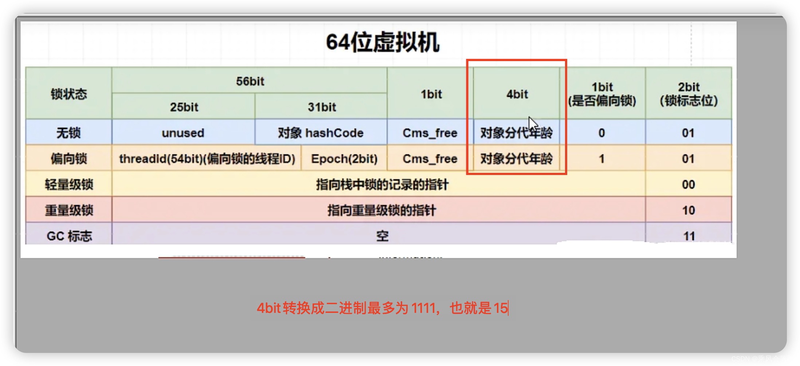

如果想证明一下

- 我们假如想直接把分代最大年龄修改为 16 会直接报错。

```
-XX:MaxTenurningThreshold=16
```

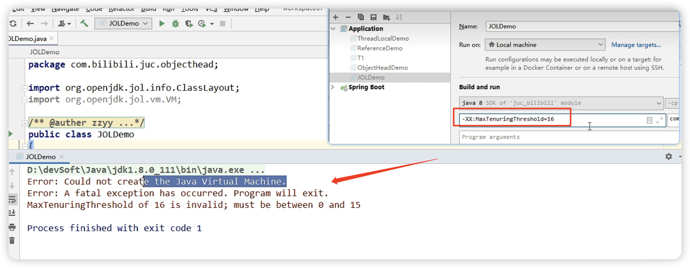

5、换成带字段的对象试试
==============

**结果**

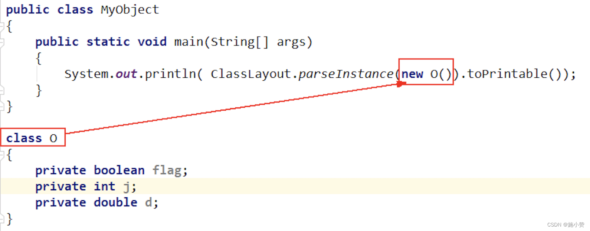

