1、线程中断机制
========

1.1、阿里蚂蚁金服面试题
---------

如何停止、中断一个运行中的线程？

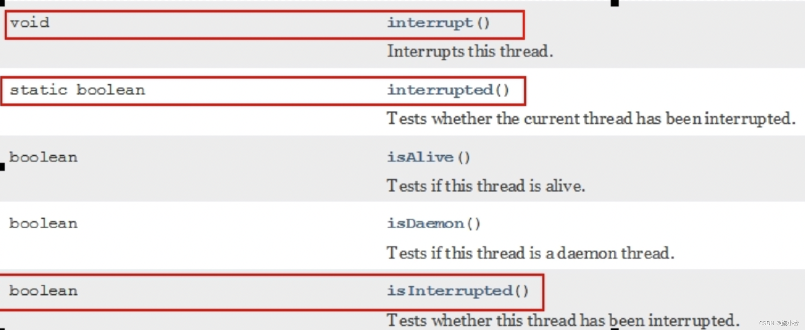

1.2、什么是中断？
----------

+ 首先

一个线程不应该由其他线程来强制中断或停止，而是应该由线程自己自行停止。

所以，`Thread.stop`, `Thread.suspend`, `Thread.resume` 都已经被废弃了。

+ 其次

在 Java 中没有办法立即停止一条线程，然而停止线程却显得尤为重要，如取消一个耗时操作。

因此，Java提供了一种用于停止线程的**协商机制**——**中断**。


中断只是一种协作机制，Java 没有给中断增加任何语法，中断的过程完全需要程序员自己实现。

若要中断一个线程，你需要`手动调用该线程的 interrupt() 方法`， 该方法也仅仅是将线程对象的`中断标识设成 true` ；

接着你需要自己写代码不断地检测当前线程的标识位，如果为 true，表示别的线程要求这条线程中断，

此时究竟该做什么需要你自己写代码实现。


每个线程对象中都有一个标识，用于表示线程是否被中断；该标识位为 true 表示中断，为 false 表示未中断；

**通过调用线程对象的 `interrupt() 方法将该线程的标识位设为 true`；可以在别的线程中调用，也可以在自己的线程中调用。**

1.3、中断的相关 API 方法
----------------

 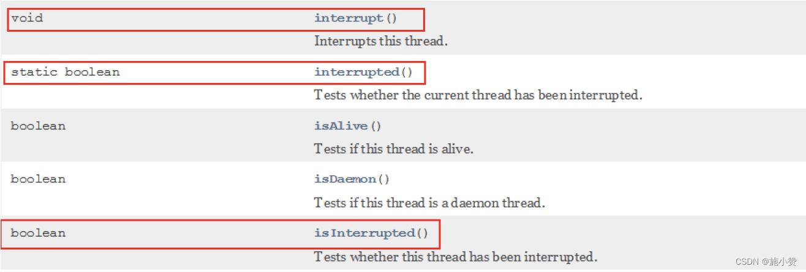


| 方法                                  | 说明                                                         |
| ------------------------------------- | ------------------------------------------------------------ |
| `public void interrupt()`             | 实例方法，<br>实例方法 `interrupt() 仅仅是设置线程的中断状态为 true`，不会停止线程 ,`发起协商` |
| `public static boolean interrupted()` | 静态方法，Thread.interrupted();  <br/>判断线程是否被中断，并清除当前中断状态 这个方法做了两件事： <br/>1 返回当前线程的中断状态 <br/>2 将当前线程的中断状态设为 false，清除线程的中断状态 <br/>这个方法有点不好理解，因为连续调用两次的结果可能不一样 。 |
| `public boolean isInterrupted()`      | 实例方法，<br/>判断当前线程是否被中断（通过检查中断标志位）  |


1.4、面试题：
---------------------

### 1.4.1 如何使用中断标识停止线程？  协商

在需要中断的线程中不断监听中断状态，

一旦发生中断，就执行相应的中断处理业务逻辑。

修改状态

停止程序的运行。。。

#### 方法一：通过一个 volatile 变量实现  

```java
package com.atguigu.juc.interrupt;
 
import java.util.concurrent.TimeUnit;
import java.util.concurrent.atomic.AtomicBoolean;
 
/**
 * @auther zzyy
 * @create 2021-03-03 18:20
 */
public class InterruptDemoCopy {
    static volatile boolean isStop = false;
 
    public static void main(String[] args) {
 
        new Thread(() -> {
            while (true) {
                if (isStop) {
                    System.out.println("-----isStop = true，程序结束。");
                    break;
                }
                System.out.println("------hello isStop");
            }
        }, "t1").start();
 
        //暂停几秒钟线程
        try {
            TimeUnit.SECONDS.sleep(1);
        } catch (InterruptedException e) {
            e.printStackTrace();
        }
 
        new Thread(() -> {
            isStop = true;
        }, "t2").start();
 
    }
 
}
 
返回结果：
------hello isStop
------hello isStop
------hello isStop
------hello isStop
------hello isStop
------hello isStop
-----isStop = true，程序结束。
```

代码中启动了一个线程，线程的run方法中有个死循环，内部通过exit变量的值来控制是否退出。`TimeUnit.SECONDS.sleep(3);`让主线程休眠3秒，此处为什么使用TimeUnit？TimeUnit使用更方便一些，能够很清晰的控制休眠时间，底层还是转换为Thread.sleep实现的。程序有个重点：**volatile**关键字，exit变量必须通过这个修饰，如果把这个去掉，程序无法正常退出。volatile控制了变量在多线程中的可见性。

#### 方法二：通过 AtomicBoolean 原子类

```java
public class InterruptDemoCopy {
 
    static AtomicBoolean atomicBoolean = new AtomicBoolean(false);
    public static void main(String[] args) {
 
        new Thread(() -> {
            while(true)
            {
                if(atomicBoolean.get())
                {
                    System.out.println("-----atomicBoolean.get() = true，程序结束。");
                    break;
                }
                System.out.println("------hello atomicBoolean");
            }
        },"t1").start();
 
        //暂停几秒钟线程
        try { TimeUnit.SECONDS.sleep(1); } catch (InterruptedException e) { e.printStackTrace(); }
 
        new Thread(() -> {
            atomicBoolean.set(true);
        },"t2").start();
 
    }
 
}
 
返回结果：
------hello atomicBoolean
------hello atomicBoolean
------hello atomicBoolean
------hello atomicBoolean
------hello atomicBoolean
------hello atomicBoolean
------hello atomicBoolean
-----atomicBoolean.get() = true，程序结束。
```

#### 方法三：通过 Thread 类自带的中断 api 方法实现

> 在需要中断的线程中不断监听中断状态，一旦发生中断，就执行相应的中断处理业务逻辑stop线程

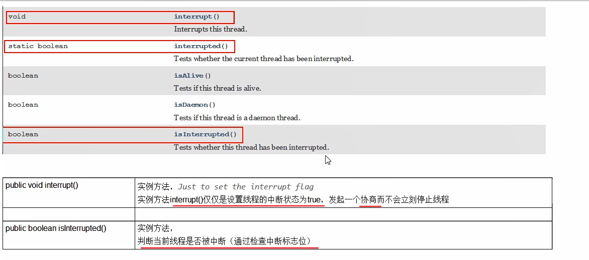

**code**

```java
public class InterruptDemo{
    public static void main(String[] args){
        Thread t1 = new Thread(() -> {
            while (true)
            {
                if(Thread.currentThread().isInterrupted())
                {
                    System.out.println(Thread.currentThread().getName()+"\t isInterrupted()被修改为true，程序停止");
                    break;
                }
                System.out.println("t1 -----hello interrupt api");
            }
        }, "t1");
        t1.start();

        System.out.println("-----t1的默认中断标志位："+t1.isInterrupted());

        //暂停毫秒
        try { TimeUnit.MILLISECONDS.sleep(20); } catch (InterruptedException e) { e.printStackTrace(); }

        //t2向t1发出协商，将t1的中断标志位设为true希望t1停下来
        new Thread(() -> {
            t1.interrupt();
        },"t2").start();

    }
```

运行上面的程序，程序可以正常结束。线程内部有个中断标志，当调用线程的interrupt()实例方法之后，线程的中断标志会被置为true，可以通过线程的实例方法isInterrupted()获取线程的中断标志。

**源码分析：**

实例方法 `interrupt()`，没有返回值

```java
//Thread.java
public void interrupt() {
        if (this != Thread.currentThread())
            checkAccess();

        synchronized (blockerLock) {
            Interruptible b = blocker;
            if (b != null) {
                interrupt0();           // Just to set the interrupt flag----调用了interrupt0（）方法
                b.interrupt(this);
                return;
            }
        }
        interrupt0();
    }
```

```java
//Thread.java
    /* Some private helper methods */
    private native void setPriority0(int newPriority);
    private native void stop0(Object o);
    private native void suspend0();
    private native void resume0();
    private native void interrupt0();  //-------------调用了c底层
    private native void setNativeName(String name);
```


**实例方法 isInterrupted，返回布尔值**

```java
    //Thread.java
    public boolean isInterrupted() {
        return isInterrupted(false);
    }

    //Thread.java
    private native boolean isInterrupted(boolean ClearInterrupted);//也调用了c底层
```

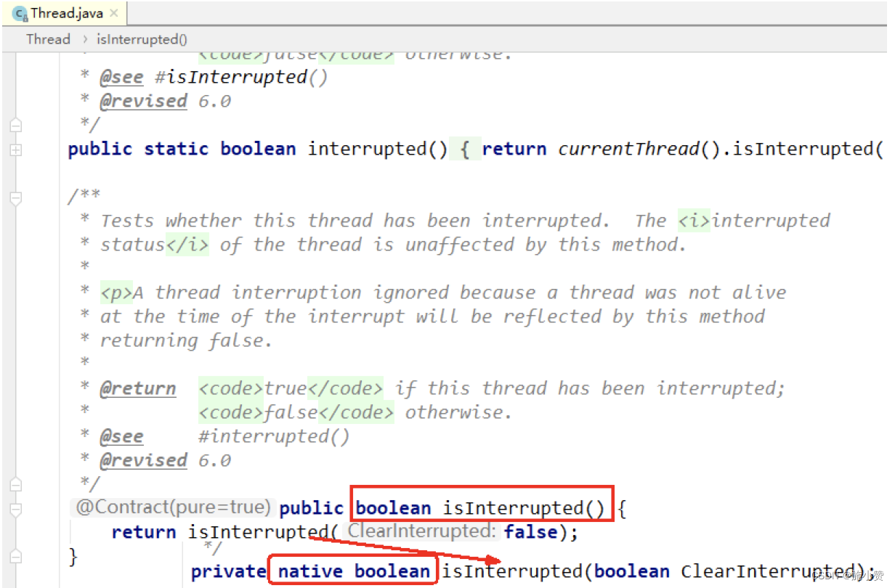


### 1.4.2、当前线程的中断标识为 true，是不是就立刻停止？

#### 说明

- 具体来说，当对一个线程，调用 interrupt() 时：
  1. 如果线程处于**正常活动状态**，那么会将该线程的中断标志设置为 true，仅此而已。被设置中断标志的线程将继续正常运行，不受影响。所以， interrupt() 并不能真正的中断线程，需要被调用的线程自己进行配合才行。
  2. 如果线程处于**被阻塞状态**（例如处于 sleep, wait, join 等状态），在别的线程中调用当前线程对象的`interrupt`方法，那么线程将**立即退出被阻塞状态**（并中断状态将被清除），并抛出一个 InterruptedException 异常。
  3. （**中断不活动**的线程**不会**产生任何影响，看下面案例）

**code1 **  验证1、3 点

```java
public class InterruptDemo2
{
    public static void main(String[] args)
    {
        //实例方法interrupt()仅仅是设置线程的中断状态位设置为true，不会停止线程
        Thread t1 = new Thread(() -> {
            for (int i = 1; i <=300; i++)
            {
                System.out.println("-----: "+i);
            }
            System.out.println("t1线程调用interrupt()后的的中断标识02："+Thread.currentThread().isInterrupted());
        }, "t1");
        t1.start();

        System.out.println("t1线程默认的中断标识："+t1.isInterrupted());//false

        //暂停毫秒
        try { TimeUnit.MILLISECONDS.sleep(2); } catch (InterruptedException e) { e.printStackTrace(); }
        t1.interrupt();//true
        System.out.println("t1线程调用interrupt()后的的中断标识01："+t1.isInterrupted());//true

        try { TimeUnit.MILLISECONDS.sleep(2000); } catch (InterruptedException e) { e.printStackTrace(); }
        System.out.println("t1线程调用interrupt()后的的中断标识03："+t1.isInterrupted());//????---false中断不活动的线程不会产生任何影响。
    }
}

//before t1.interrupt()----false
//---------0
//---------1
//---------2
//---------3
//....
//---------136
//after t1.interrupt()---第1次---true    ------此处中断标志位设置为了true,但是t1仍然在运行
//---------137
//---------298
//---------299
//after t1.interrupt()---第2次----true
//after t1.interrupt()---第3次---false  //中断不活动的线程不会产生任何影响，线程结束后应该是自动变为了false
```


**后手案例 - 深入 code2**

- 在我们基本中断程序的骨架上 + 一个 sleep 阻塞
- 中断异常 且 会导致程序无限循环.

```java
public class InterruptDemo03 {
    public static void main(String[] args) {
        Thread t1 =  new Thread(()->{
            while(true){
                if(Thread.currentThread().isInterrupted()){
                    System.out.println(Thread.currentThread().getName()+"\t"+
                            "中断标志位："+Thread.currentThread().isInterrupted()+"程序终止");
                    break;
                }
                try {
                    Thread.sleep(200);
                } catch (InterruptedException e) {
                    e.printStackTrace();
                    // Thread.currentThread().interrupt();  假如加了这个，程序可以终止，只会爆异常
                }
                System.out.println("-----hello InterruptDemo03");
            }
        },"t1");
        t1.start();
        try {TimeUnit.MILLISECONDS.sleep(1);} catch (InterruptedException e) {e.printStackTrace();}
        new Thread(() -> t1.interrupt()).start();
    }
}
//爆异常了，并且程序一直在跑
//java.lang.InterruptedException: sleep interrupted
//  at java.lang.Thread.sleep(Native Method)
//-----hello InterruptDemo03
//-----hello InterruptDemo03
//-----hello InterruptDemo03
//......
//----------------------------
//---------加了Thread.currentThread().interrupt();
//java.lang.InterruptedException: sleep interrupted
// at java.lang.Thread.sleep(Native Method)
//  at com.zhang.admin.controller.InterruptDemo03.lambda$main$0(InterruptDemo03.java:15)
//  at java.lang.Thread.run(Thread.java:748)
//-----hello InterruptDemo03
//t1  中断标志位：true程序终止
```

> ② 如果线程处于被阻塞状态（例如处于 sleep, wait, join 等状态），在别的线程中调用当前线程对象的`interrupt`方法，那么线程将**立即退出被阻塞状态**（中断状态将被清除），并抛出一个 InterruptedException 异常。

分析：

```
/**
 * 1 中断标志位 默认是false
 * 2 t2 ----->t1发出了中断协商，t2调用t1.interrupt()，中断标志位true
 * 3 中断标志位true，正常情况下，程序停止，^-^
 * 4 中断标志位true，异常情况下，InterruptedException，将会把中断状态清除，并且将收到InterruptedException。中断标志位false导致无限循环。
 * 
 * 5 在catch块中，需要再次给中断标志位设置为true，2次调用停止
 */
```

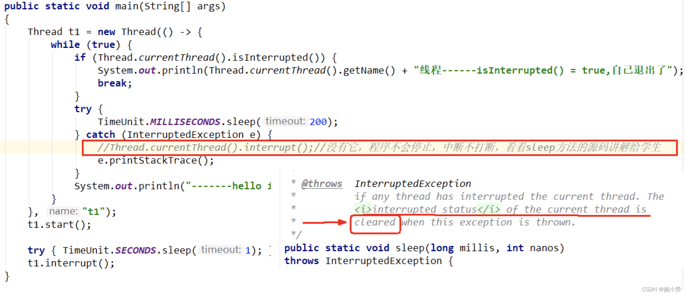

```
sleep方法抛出InterruptedException后，中断标识也被清空置为false,我们在catch没有通过th.interrupt()方法再次将中断标志设置为true，这就导致无限循环了
```

小总结：

中断只是一种协同机制，修改中断标识位仅此而已，不是立刻 stop 打断

### 1.4.3、静态方法 `Thread.interrupted()`

静态方法 `public static boolean interrupted()`：

- 静态方法，`Thread.interrupted();`判断线程是否被中断，并清除当前中断状态这个方法做了**两件事**：
  - 1 返回当前线程的中断状态
  -  2 将当前线程的中断状态设为 false（这个方法有点不好理解，因为连续调用两次的结果可能不一样。

```java
public class InterruptDemo04 {
    public static void main(String[] args) {
        System.out.println(Thread.currentThread().getName()+"\t"+Thread.interrupted());
        System.out.println(Thread.currentThread().getName()+"\t"+Thread.interrupted());
        System.out.println("-----1");
        Thread.currentThread().interrupt();//中断标志位设置为true
        System.out.println("-----2");
        System.out.println(Thread.currentThread().getName()+"\t"+Thread.interrupted());
        System.out.println(Thread.currentThread().getName()+"\t"+Thread.interrupted());
    }
}
//main  false
//main  false
//-----1
//-----2
//main  true
//main  false
```


#### 静态方法与实例方法的对比

 

 

- 看下源码，`interrupted()`对比`isInterrupted()`

  ```java
  public static boolean interrupted() {
          return currentThread().isInterrupted(true);
      }
      
  private native boolean isInterrupted(boolean ClearInterrupted);
  
  
  
  public boolean isInterrupted() {
          return isInterrupted(false);
      }
  
  private native boolean isInterrupted(boolean ClearInterrupted);
  ```

  - 他们在底层都调用了 native 方法 isInterrupted。
  - 只不过传入参数 ClearInterrupted 一个传参传了`true`，一个传了`false`。
    - 静态方法`interrupted() `中`true`表示清空当前中断状态。
    - 实例方法`isInterrupted` 则不会。


> 方法的注释也清晰的表达了 “中断状态将会根据传入的 ClearInterrupted 参数值确定是否重置”。  
>
> 所以， 
>
> + 静态方法 interrupted 将       会清除中断状态（传入的参数 ClearInterrupted 为 true）
>
> + 实例方法 isInterrupted 则不会（传入的参数 ClearInterrupted 为 false）。 


1.5、总结
------

  线程中断相关的方法：  

+ `interrupt()` 方法是一个`实例方法` 
  + 它通知目标线程中断，也就是设置目标线程的中断标志位为 true，中断标志位表示当前线程已经被中断了。 

+  `isInterrupted()` 方法也是一个`实例方法` 
  + 它判断当前线程是否被中断（通过检查中断标志位）并获取中断标志  ,
  + 调用p`rivate native boolean isInterrupted(boolean ClearInterrupted);`传入`ClearInterrupted = false`

+ Thread 类的`静态方法 interrupted()` 
  + 返回当前线程的中断状态 (boolean 类型) 且将当前线程的中断状态设为 false，此方法调用之后会清除当前线程的中断标志位的状态（将中断标志置为 false 了），返回当前值并清零置 false 
  + 调用`private native boolean isInterrupted(boolean ClearInterrupted);`传入`ClearInterrupted = true`


2、LockSupport 是什么
=================

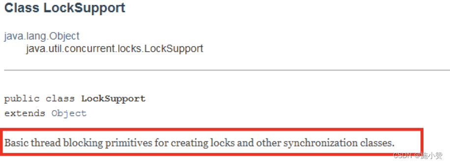

`LockSupport` 是用来创建锁和其他同步类的基本线程阻塞原语。 

**核心**就是`park()`和`unpark()`方法

- `park()`方法是**阻塞线程**

- `unpark()`方法是**解除阻塞线程**

  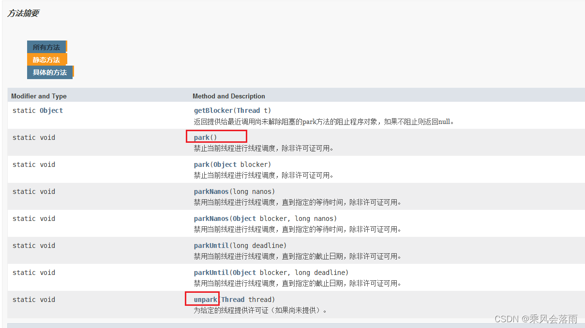

  


3、线程等待唤醒机制
==========

3.1、3 种让线程等待和唤醒的方法
------------------

方式 1：使用 Object 中的 `wait()` 方法让线程等待，使用 Object 中的 `notify()` 方法唤醒线程

方式 2：使用 JUC 包中 `Condition` 的 `await()` 方法让线程等待，使用 `signal()` 方法唤醒线程

方式 3：`LockSupport` 类可以阻塞当前线程以及唤醒指定被阻塞的线程


3.2、`Object` 类中的 `wait` 和 `notify` 方法实现线程等待和唤醒
----------------------------------------

### 正常代码：

```java
public class LockSupportDemoCopy {
    public static void main(String[] args)//main 方法，主线程一切程序入口
    {
        Object objectLock = new Object();
        // 同一把锁，类似资源类
        new Thread(() -> {
            synchronized (objectLock) {
                System.out.println(Thread.currentThread().getName()+"\t"+"---come in");
                try {
                    objectLock.wait();
                } catch (InterruptedException e) {
                    e.printStackTrace();
                }
            }
            System.out.println(Thread.currentThread().getName() + " \t " + " 被唤醒了 ");
        }, "t1").start();
        // 暂停几秒钟线程
        try {
            TimeUnit.SECONDS.sleep(3L);
        } catch (InterruptedException e) {
            e.printStackTrace();
        }
        new Thread(() -> {
            synchronized (objectLock) {
                objectLock.notify();
                System.out.println(Thread.currentThread().getName()+"\t"+"---发出通知");
            }
        }, "t2").start();
    }
 
 
}
```

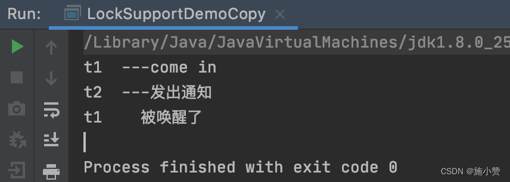

### 异常代码 1：wait 方法和 notify 方法，两个都去掉同步代码块,

- 说明要使用`wait`和`notify`必须加`synchronized`

```java
public class LockSupportDemoCopy {
    public static void main(String[] args)//main 方法，主线程一切程序入口
    {
        Object objectLock = new Object();
        // 同一把锁，类似资源类
        new Thread(() -> {
            System.out.println(Thread.currentThread().getName() + "\t" + "---come in");
            try {
                objectLock.wait();
            } catch (InterruptedException e) {
                e.printStackTrace();
            }
            System.out.println(Thread.currentThread().getName() + " \t " + " 被唤醒了 ");
        }, "t1").start();
        // 暂停几秒钟线程
        try {
            TimeUnit.SECONDS.sleep(3L);
        } catch (InterruptedException e) {
            e.printStackTrace();
        }
        new Thread(() -> {
            objectLock.notify();
            System.out.println(Thread.currentThread().getName() + "\t" + "---发出通知");
        }, "t2").start();
    }
 
 
}
```


### 异常代码 2：将 notify 放在 wait 方法前面，程序无法执行，无法唤醒

- 说明顺序不能对换

```java
public class LockSupportDemoCopy {
    public static void main(String[] args)//main 方法，主线程一切程序入口
    {
        Object objectLock = new Object();
        // 同一把锁，类似资源类
        new Thread(() -> {
            synchronized (objectLock) {
                System.out.println(Thread.currentThread().getName() + "\t" + "---come in");
                objectLock.notify();
                System.out.println(Thread.currentThread().getName() + "\t" + "---发出通知");
 
            }
        }, "t1").start();
        // 暂停几秒钟线程
        try {
            TimeUnit.SECONDS.sleep(3L);
        } catch (InterruptedException e) {
            e.printStackTrace();
        }
        new Thread(() -> {
            synchronized (objectLock) {
                try {
                    objectLock.wait();
                } catch (InterruptedException e) {
                    e.printStackTrace();
                }
            }
            System.out.println(Thread.currentThread().getName() + " \t " + " 被唤醒了 ");
        }, "t2").start();
    }
}
```

 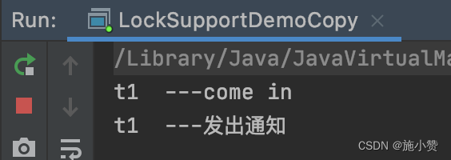

### 小总结：

*   wait 和 notify 方法必须要在同步块或者方法里面，且成对出现使用   否则会出现IllegalMonitorStateException
*   先 wait 后 notify 才 OK, **顺序**

3.3、`Condition` 接口中的 `await` 后 `signal` 方法实现线程的等待和唤醒
----------------------------------------------

### 正常代码：

```java
public class LockSupportDemoCopy {
    static Lock lock = new ReentrantLock();
    static Condition condition = lock.newCondition();
 
    public static void main(String[] args)//main 方法，主线程一切程序入口
    {
 
        new Thread(() -> {
 
            lock.lock();
            try {
                System.out.println(Thread.currentThread().getName() + "\t" + "---come in");
                condition.await();
                System.out.println(Thread.currentThread().getName() + "\t" + "---被唤醒");
            } catch (InterruptedException e) {
                e.printStackTrace();
            } finally {
                lock.unlock();
            }
        }, "t1").start();
        // 暂停几秒钟线程
        try {
            TimeUnit.SECONDS.sleep(3L);
        } catch (InterruptedException e) {
            e.printStackTrace();
        }
 
        new Thread(() -> {
            lock.lock();
            try {
                condition.signal();
                System.out.println(Thread.currentThread().getName() + "\t" + "---发出通知");
            } finally {
                lock.unlock();
            }
        }, "t2").start();
    }
}
```

 

### 异常代码 1：去掉 lock/unlock

```java
public class LockSupportDemoCopy {
    static Lock lock = new ReentrantLock();
    static Condition condition = lock.newCondition();
 
    public static void main(String[] args)//main 方法，主线程一切程序入口
    {
 
        new Thread(() -> {
 
            try {
                System.out.println(Thread.currentThread().getName() + "\t" + "---come in");
                condition.await();
                System.out.println(Thread.currentThread().getName() + "\t" + "---被唤醒");
            } catch (InterruptedException e) {
                e.printStackTrace();
            }
        }, "t1").start();
        // 暂停几秒钟线程
        try {
            TimeUnit.SECONDS.sleep(3L);
        } catch (InterruptedException e) {
            e.printStackTrace();
        }
 
        new Thread(() -> {
            try {
                condition.signal();
                System.out.println(Thread.currentThread().getName() + "\t" + "---发出通知");
            } catch (Exception e) {
                e.printStackTrace();
            }
        }, "t2").start();
    }
 
 
}
```


condition.await(); 和 condition.signal(); 都触发了 IllegalMonitorStateException 异常。 

#### 结论： 

lock、unlock 对里面才能正确调用调用 condition 中线程等待和唤醒的方法

### 异常代码 2：先 signal 后 await

```java
public class LockSupportDemoCopy {
    static Lock lock = new ReentrantLock();
    static Condition condition = lock.newCondition();
 
    public static void main(String[] args)//main 方法，主线程一切程序入口
    {
 
        new Thread(() -> {
 
            lock.lock();
            try {
                condition.signal();
                System.out.println(Thread.currentThread().getName() + "\t" + "---发出通知");
 
            } finally {
                lock.unlock();
            }
        }, "t1").start();
        // 暂停几秒钟线程
        try {
            TimeUnit.SECONDS.sleep(3L);
        } catch (InterruptedException e) {
            e.printStackTrace();
        }
 
        new Thread(() -> {
            lock.lock();
            try {
                System.out.println(Thread.currentThread().getName() + "\t" + "---come in");
                condition.await();
                System.out.println(Thread.currentThread().getName() + "\t" + "---被唤醒");
            } catch (InterruptedException e) {
                e.printStackTrace();
            } finally {
                lock.unlock();
            }
        }, "t2").start();
    }
 
 
}
```

代码运行无法结束：线程无法被唤醒

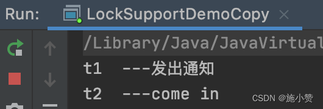

### 小总结：

*   Condtion 中的线程等待和唤醒方法之前，需要先获取锁
*   一定要先 await 后 signal，不要反了

## 3.4、`Object` 和 `Condition` 使用的限制条件 -->LockSupport 

线程先要获得并持有锁，必须在锁块 (synchronized 或 lock) 中

必须要先等待后唤醒，线程才能够被唤醒

3.5、`LockSupport` 类中的 `park` 等待和 `unpark` 唤醒
--------------------------------------

### 3.5.1、是什么

通过 park() 和 unpark(thread) 方法来实现阻塞和唤醒线程的操作

官方解释：


+ LockSupport 是用来创建锁和其他同步类的基本线程阻塞原语。 
+ LockSupport 类使用了一种名为 Permit（许可）的概念来做到 阻塞和唤醒线程 的功能， 每个线程都有一个许可 (permit)， 
+ permit 只有两个值 1 和零，默认是零。 
+ 可以把许可看成是一种 (0,1) 信号量（Semaphore），但与 Semaphore 不同的是，许可的累加上限是 1。 

### 3.5.2、主要方法

#### 3.5.2.1、API

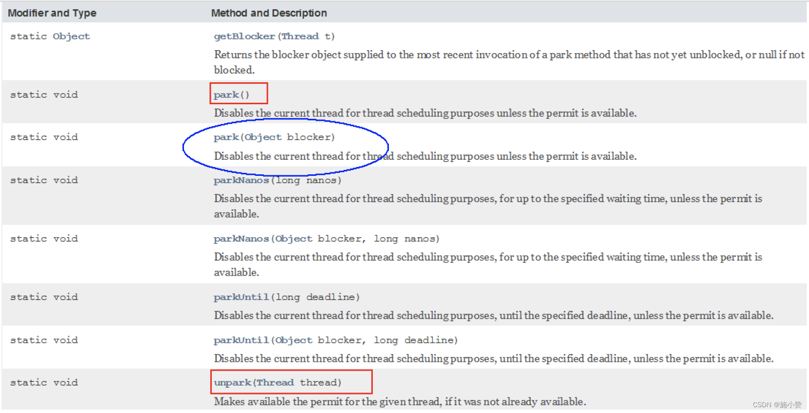

#### 3.5.2.2、阻塞`park()`

- `park()/park(Object blocker)`

- 调用`LockSupport.park()`时，发现它调用了`unsafe类`，并且默认传了一个 0

  ```java
  public static void park() {
          UNSAFE.park(false, 0L);
  }
  ```


- permit 默认是零，所以一开始调用 park() 方法，当前线程就会阻塞，直到别的线程将当前线程的 permit 设置为 1 时，park 方法会被唤醒，然后会将 permit 再次设置为零并返回。

#### 3.5.2.3、唤醒`unpark`

- 调用`LockSupport.unpark();`时，也调用了`unsafe类`

  ```java
  public static void unpark(Thread thread) {
          if (thread != null)
              UNSAFE.unpark(thread);
      }
  ```


- 调用 `unpark(thread)` 方法后，就会将 thread 线程的许可 permit 设置成 **1**(注意多次调用 unpark 方法，不会累加，permit 值还是 1) 会自动唤醒 thread 线程，即之前阻塞中的 LockSupport.park() 方法会立即返回。

### 3.5.3、代码

#### 3.5.3.1、正常 + 无锁块要求

```java
public class LockSupportDemoCopy {
    static Lock lock = new ReentrantLock();
    static Condition condition = lock.newCondition();
 
    public static void main(String[] args)//main 方法，主线程一切程序入口
    {
 
        Thread t1 = new Thread(() -> {
            System.out.println(Thread.currentThread().getName() + "\t" + "---come in");
            LockSupport.park();
            System.out.println(Thread.currentThread().getName() + "\t" + "---被唤醒");
        }, "t1");
        t1.start();
        try { TimeUnit.SECONDS.sleep(3); } catch (InterruptedException e) { e.printStackTrace(); }
        new Thread(() -> {
            LockSupport.unpark(t1);
            System.out.println(Thread.currentThread().getName()+"\t"+"---发出通知");
        },"t2").start();
    }
}
```

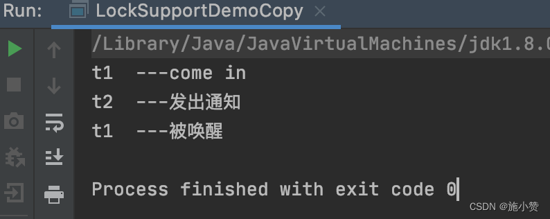

#### 3.5.3.2、之前错误的先唤醒后等待，LockSupport 照样支持

```java
public class LockSupportDemoCopy {
    static Lock lock = new ReentrantLock();
    static Condition condition = lock.newCondition();
 
    public static void main(String[] args)//main 方法，主线程一切程序入口
    {
 
        Thread t1 = new Thread(() -> {
            try {
                TimeUnit.SECONDS.sleep(3);
            } catch (InterruptedException e) {
                e.printStackTrace();
            }
            System.out.println(Thread.currentThread().getName() + "\t" + System.currentTimeMillis() + "\t" + "---come in");
            LockSupport.park();
            System.out.println(Thread.currentThread().getName() + "\t" + System.currentTimeMillis() + "\t" + "---被唤醒");
        }, "t1");
        t1.start();
        try {
            TimeUnit.SECONDS.sleep(1);
        } catch (InterruptedException e) {
            e.printStackTrace();
        }
        new Thread(() -> {
            LockSupport.unpark(t1);
            System.out.println(Thread.currentThread().getName() + "\t" + System.currentTimeMillis() + "\t" + "---发出通知");
        }, "t2").start();
    }
}
```


####  3.5.3.3、异常情况：没有考虑到 permit 上限值为 1

```java
public class LockSupportDemoCopy {
    static Lock lock = new ReentrantLock();
    static Condition condition = lock.newCondition();
 
    public static void main(String[] args)//main 方法，主线程一切程序入口
    {
 
        Thread t1 = new Thread(() -> {
            try {
                TimeUnit.SECONDS.sleep(3);
            } catch (InterruptedException e) {
                e.printStackTrace();
            }
            System.out.println(Thread.currentThread().getName() + "\t" + "---come in");
            LockSupport.park();//消费一个许可证
            LockSupport.park();//消费一个许可证
            System.out.println(Thread.currentThread().getName() + "\t" + "---被唤醒");
        }, "t1");
        t1.start();
 
        new Thread(() -> {
            LockSupport.unpark(t1);//发放一个许可证，许可证最多为1，不会累计
			 LockSupport.unpark(t1);
            LockSupport.unpark(t1);
            LockSupport.unpark(t1);
            System.out.println(Thread.currentThread().getName() + "\t" + "---发出通知");
        }, "t2").start();
    }
}
```

 程序运行结果：**由于 permit 的上限值为 1，所以执行两次 LockSupport.park() 操作将导致 t1 线程阻塞**


### 小总结

+ Lock Support 是用来创建锁和其他同步类的基本线程阻塞原语。
+ Lock Support 是一个`线程阻塞工具类`， 所有的方法都是静态方法， 可以让线程在任意位置阻塞， 阻塞之后也有对应的唤醒方法。归根结底， Lock Support 调用的 Unsafe 中的 native 代码。
+ Lock Support 提供`park()` 和`unpark() `方法实现**阻塞线程**和**解除线程阻塞**的过程
+ Lock Support 和每个使用它的线程都有一个许可 (permit) 关联。
+ 每个线程都有一个相关的 permit， permit 最多只有一个， 重复调用 un park 也不会积累凭证。


> **形象的理解**
> 线程阻塞需要消耗凭证 (permit) ， 这个凭证最多只有 **1** 个。
>
> + 当调用park()方法时
>
>   + 如果有凭证，则会直接消耗掉这个凭证然后正常退出；
>
>   + 如果无凭证，就必须阻塞等待凭证可用；
>
> + 而unpark() 则相反， 它会增加一个凭证， 但凭证最多只能有 1个， 累加无效。


#### 面试题

- **为什么可以突破 wait/notify 的原有调用顺序?**
  因为 unpark 获得了一个凭证， 之后再调用 park 方法， 就可以名正言顺的凭证消费， 故不会阻塞。
  先发放了凭证后续可以畅通无阻。
- **为什么唤醒两次后阻塞两次，但最终结果还会阻塞线程?**
  因为凭证的数量最多为 1， 连续调用两次 unpark 和调用一次 unpark 效果一样， 只会增加一个凭证；
  而调用两次 park 却需要消费两个凭证， 证不够， 不能放行。