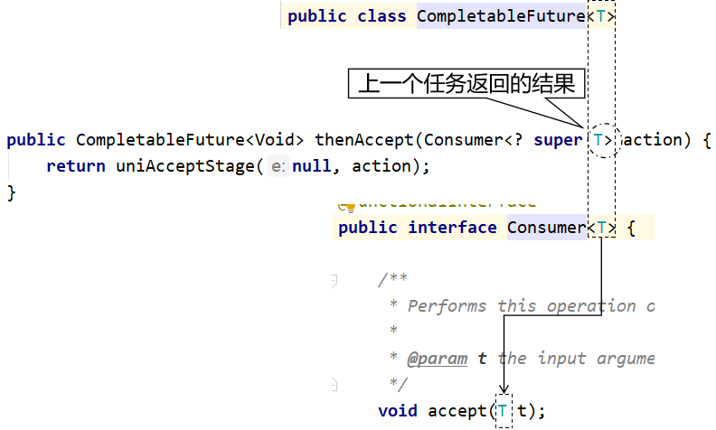
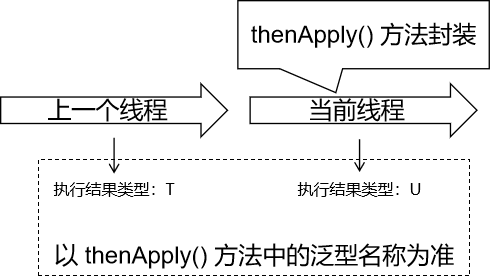
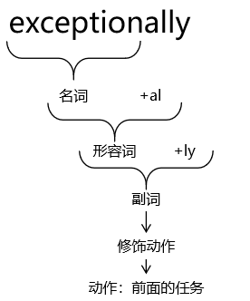

# 第一节 [CountDownLatch]

效果：指定一个操作步骤数量，在各个子线程中，每完成一个任务就给步骤数量 - 1；在步骤数量减到0之前，CountDownLatch 可以帮我们把最后一步操作抑制住（阻塞），让最后一步操作一直等到步骤被减到 0 的时候执行。

## 1、班长锁门

有六名同学在值日，班长负责锁门。班长必须确保所有同学都离开教室再锁门。

```Java
// 声明一个变量，用来保存同学的数量
int stuNum = 6;

// 创建CountDownLatch对象
CountDownLatch countDownLatch = new CountDownLatch(stuNum);

// 创建和同学数量相等的线程
for (int i = 0; i < stuNum; i++) {

    String num = String.valueOf(i + 1);

    new Thread(()->{

        // 完成一次操作
        System.out.println(Thread.currentThread().getName() + " " + num + "号同学离开教室");

        // 让countDownLatch管理的数量-1
        countDownLatch.countDown();

    }).start();

}

// 让countDownLatch负责将最后一步操作抑制住
countDownLatch.await();

System.out.println("班长锁门");
```

## 2、集齐七颗龙珠召唤神龙

```Java
// 声明龙珠数量
int dragonBall = 7;

// 创建CountdownLatch对象
CountDownLatch countDownLatch = new CountDownLatch(dragonBall);

// 创建七个线程收集龙珠
for (int i = 0; i < 7; i++) {

    String num = String.valueOf(i);

    new Thread(()->{

        System.out.println("现在拿到了" + num + "号龙珠");

        countDownLatch.countDown();

    }).start();

}

// 让countDownLatch对象抑制最后一步
countDownLatch.await();

System.out.println("龙珠集齐，召唤神龙");
```


## 深入

**常用方法：**

**public CountDownLatch(int count)**：构造方法，count表示计数器的值，不能小于0，否者会报异常。

**public void await() throws InterruptedException**：调用await()会让当前线程等待，直到计数器为0的时候，方法才会返回，此方法会响应线程中断操作。

**public boolean await(long timeout, TimeUnit unit) throws InterruptedException**：限时等待，在超时之前，计数器变为了0，方法返回true，否者直到超时，返回false，此方法会响应线程中断操作。

**public void countDown()**：让计数器减1

CountDownLatch使用步骤：

1. 创建CountDownLatch对象
2. 调用其实例方法`await()`，让当前线程等待
3. 调用`countDown()`方法，让计数器减1
4. 当计数器变为0的时候，`await()`方法会返回

#### 示例1  --解析多sheet  与join对比

假如有这样一个需求，当我们需要解析一个Excel里多个sheet的数据时，可以考虑使用多线程，每个线程解析一个sheet里的数据，等到所有的sheet都解析完之后，程序需要统计解析总耗时。分析一下：解析每个sheet耗时可能不一样，总耗时就是最长耗时的那个操作。

我们能够想到的最简单的做法是使用join，代码如下：

```java
import java.util.concurrent.TimeUnit;

public class Demo1 {
    public static class T extends Thread {
        //休眠时间（秒）
        int sleepSeconds;
        public T(String name, int sleepSeconds) {
            super(name);
            this.sleepSeconds = sleepSeconds;
        }
        @Override
        public void run() {
            Thread ct = Thread.currentThread();
            long startTime = System.currentTimeMillis();
            System.out.println(startTime + "," + ct.getName() + ",开始处理!");
            try {
                //模拟耗时操作，休眠sleepSeconds秒
                TimeUnit.SECONDS.sleep(this.sleepSeconds);
            } catch (InterruptedException e) {
                e.printStackTrace();
            }
            long endTime = System.currentTimeMillis();
            System.out.println(endTime + "," + ct.getName() + ",处理完毕,耗时:" + (endTime - startTime));
        }
    }
    public static void main(String[] args) throws InterruptedException {
        long starTime = System.currentTimeMillis();
        T t1 = new T("解析sheet1线程", 2);
        t1.start();
        T t2 = new T("解析sheet2线程", 5);
        t2.start();
        t1.join();
        t2.join();
        long endTime = System.currentTimeMillis();
        System.out.println("总耗时:" + (endTime - starTime));
    }
}
```

```java
1563767560271,解析sheet1线程,开始处理!
1563767560272,解析sheet2线程,开始处理!
1563767562273,解析sheet1线程,处理完毕,耗时:2002
1563767565274,解析sheet2线程,处理完毕,耗时:5002
总耗时:5005
```

代码中启动了2个解析sheet的线程，第一个耗时2秒，第二个耗时5秒，最终结果中总耗时：5秒。上面的关键技术点是线程的`join()`方法，此方法会让当前线程等待被调用的线程完成之后才能继续。可以看一下join的源码，内部其实是在synchronized方法中调用了线程的wait方法，最后被调用的线程执行完毕之后，由jvm自动调用其notifyAll()方法，唤醒所有等待中的线程。这个notifyAll()方法是由jvm内部自动调用的，jdk源码中是看不到的，需要看jvm源码，有兴趣的同学可以去查一下。所以JDK不推荐在线程上调用wait、notify、notifyAll方法。

而在JDK1.5之后的并发包中提供的CountDownLatch也可以实现join的这个功能。

我们使用CountDownLatch来完成上面示例中使用join实现的功能，代码如下：

```java
import java.util.concurrent.CountDownLatch;
import java.util.concurrent.TimeUnit;

public class Demo2 {
    public static class T extends Thread {
        //休眠时间（秒）
        int sleepSeconds;
        CountDownLatch countDownLatch;
        public T(String name, int sleepSeconds, CountDownLatch countDownLatch) {
            super(name);
            this.sleepSeconds = sleepSeconds;
            this.countDownLatch = countDownLatch;
        }
        @Override
        public void run() {
            Thread ct = Thread.currentThread();
            long startTime = System.currentTimeMillis();
            System.out.println(startTime + "," + ct.getName() + ",开始处理!");
            try {
                //模拟耗时操作，休眠sleepSeconds秒
                TimeUnit.SECONDS.sleep(this.sleepSeconds);
            } catch (InterruptedException e) {
                e.printStackTrace();
            } finally {
                countDownLatch.countDown();
            }
            long endTime = System.currentTimeMillis();
            System.out.println(endTime + "," + ct.getName() + ",处理完毕,耗时:" + (endTime - startTime));
        }
    }
    public static void main(String[] args) throws InterruptedException {
        System.out.println(System.currentTimeMillis() + "," + Thread.currentThread().getName() + "线程 start!");
        CountDownLatch countDownLatch = new CountDownLatch(2);
        long starTime = System.currentTimeMillis();
        T t1 = new T("解析sheet1线程", 2, countDownLatch);
        t1.start();
        T t2 = new T("解析sheet2线程", 5, countDownLatch);
        t2.start();
        countDownLatch.await();
        System.out.println(System.currentTimeMillis() + "," + Thread.currentThread().getName() + "线程 end!");
        long endTime = System.currentTimeMillis();
        System.out.println("总耗时:" + (endTime - starTime));
    }
}
```

```java
1563767580511,main线程 start!
1563767580513,解析sheet1线程,开始处理!
1563767580513,解析sheet2线程,开始处理!
1563767582515,解析sheet1线程,处理完毕,耗时:2002
1563767585515,解析sheet2线程,处理完毕,耗时:5002
1563767585515,main线程 end!
总耗时:5003
```

从结果中看出，效果和join实现的效果一样，代码中创建了计数器为2的`CountDownLatch`，主线程中调用`countDownLatch.await();`会让主线程等待，t1、t2线程中模拟执行耗时操作，最终在finally中调用了`countDownLatch.countDown();`,此方法每调用一次，CountDownLatch内部计数器会减1，当计数器变为0的时候，主线程中的await()会返回，然后继续执行。注意：上面的`countDown()`这个是必须要执行的方法，所以放在finally中执行。

#### 示例2

等待指定的时间

还是上面的示例，2个线程解析2个sheet，主线程等待2个sheet解析完成。主线程说，我等待2秒，你们还是无法处理完成，就不等待了，直接返回。如下代码：

```java
import java.util.concurrent.CountDownLatch;
import java.util.concurrent.TimeUnit;

public class Demo3 {
    public static class T extends Thread {
        //休眠时间（秒）
        int sleepSeconds;
        CountDownLatch countDownLatch;
        public T(String name, int sleepSeconds, CountDownLatch countDownLatch) {
            super(name);
            this.sleepSeconds = sleepSeconds;
            this.countDownLatch = countDownLatch;
        }
        @Override
        public void run() {
            Thread ct = Thread.currentThread();
            long startTime = System.currentTimeMillis();
            System.out.println(startTime + "," + ct.getName() + ",开始处理!");
            try {
                //模拟耗时操作，休眠sleepSeconds秒
                TimeUnit.SECONDS.sleep(this.sleepSeconds);
            } catch (InterruptedException e) {
                e.printStackTrace();
            } finally {
                countDownLatch.countDown();
            }
            long endTime = System.currentTimeMillis();
            System.out.println(endTime + "," + ct.getName() + ",处理完毕,耗时:" + (endTime - startTime));
        }
    }
    public static void main(String[] args) throws InterruptedException {
        System.out.println(System.currentTimeMillis() + "," + Thread.currentThread().getName() + "线程 start!");
        CountDownLatch countDownLatch = new CountDownLatch(2);
        long starTime = System.currentTimeMillis();
        T t1 = new T("解析sheet1线程", 2, countDownLatch);
        t1.start();
        T t2 = new T("解析sheet2线程", 5, countDownLatch);
        t2.start();
        boolean result = countDownLatch.await(2, TimeUnit.SECONDS);
        System.out.println(System.currentTimeMillis() + "," + Thread.currentThread().getName() + "线程 end!");
        long endTime = System.currentTimeMillis();
        System.out.println("主线程耗时:" + (endTime - starTime) + ",result:" + result);
    }
}
```

```java
1563767637316,main线程 start!
1563767637320,解析sheet1线程,开始处理!
1563767637320,解析sheet2线程,开始处理!
1563767639321,解析sheet1线程,处理完毕,耗时:2001
1563767639322,main线程 end!
主线程耗时:2004,result:false
1563767642322,解析sheet2线程,处理完毕,耗时:5002
```

从输出结果中可以看出，线程2耗时了5秒，主线程耗时了2秒，主线程中调用`countDownLatch.await(2, TimeUnit.SECONDS);`，表示最多等2秒，不管计数器是否为0，await方法都会返回，若等待时间内，计数器变为0了，立即返回true，否则超时后返回false。

#### 示例3

2个CountDown结合使用的示例

有3个人参见跑步比赛，需要先等指令员发指令枪后才能开跑，所有人都跑完之后，指令员喊一声，大家跑完了。

示例代码：

```java
import java.util.concurrent.CountDownLatch;
import java.util.concurrent.TimeUnit;

public class Demo4 {
    public static class T extends Thread {
        //跑步耗时（秒）
        int runCostSeconds;
        CountDownLatch commanderCd;
        CountDownLatch countDown;
        public T(String name, int runCostSeconds, CountDownLatch commanderCd, CountDownLatch countDown) {
            super(name);
            this.runCostSeconds = runCostSeconds;
            this.commanderCd = commanderCd;
            this.countDown = countDown;
        }
        @Override
        public void run() {
            //等待指令员枪响
            try {
                commanderCd.await();
            } catch (InterruptedException e) {
                e.printStackTrace();
            }
            Thread ct = Thread.currentThread();
            long startTime = System.currentTimeMillis();
            System.out.println(startTime + "," + ct.getName() + ",开始跑!");
            try {
                //模拟耗时操作，休眠runCostSeconds秒
                TimeUnit.SECONDS.sleep(this.runCostSeconds);
            } catch (InterruptedException e) {
                e.printStackTrace();
            } finally {
                countDown.countDown();
            }
            long endTime = System.currentTimeMillis();
            System.out.println(endTime + "," + ct.getName() + ",跑步结束,耗时:" + (endTime - startTime));
        }
    }
    public static void main(String[] args) throws InterruptedException {
        System.out.println(System.currentTimeMillis() + "," + Thread.currentThread().getName() + "线程 start!");
        CountDownLatch commanderCd = new CountDownLatch(1);
        CountDownLatch countDownLatch = new CountDownLatch(3);
        long starTime = System.currentTimeMillis();
        T t1 = new T("小张", 2, commanderCd, countDownLatch);
        t1.start();
        T t2 = new T("小李", 5, commanderCd, countDownLatch);
        t2.start();
        T t3 = new T("路人甲", 10, commanderCd, countDownLatch);
        t3.start();
        //主线程休眠5秒,模拟指令员准备发枪耗时操作
        TimeUnit.SECONDS.sleep(5);
        System.out.println(System.currentTimeMillis() + ",枪响了，大家开始跑");
        commanderCd.countDown();
        countDownLatch.await();
        long endTime = System.currentTimeMillis();
        System.out.println(System.currentTimeMillis() + "," + Thread.currentThread().getName() + "所有人跑完了，主线程耗时:" + (endTime - starTime));
    }
}
```

```java
1563767691087,main线程 start!
1563767696092,枪响了，大家开始跑
1563767696092,小张,开始跑!
1563767696092,小李,开始跑!
1563767696092,路人甲,开始跑!
1563767698093,小张,跑步结束,耗时:2001
1563767701093,小李,跑步结束,耗时:5001
1563767706093,路人甲,跑步结束,耗时:10001
1563767706093,main所有人跑完了，主线程耗时:15004
```

代码中，t1、t2、t3启动之后，都阻塞在`commanderCd.await();`，主线程模拟发枪准备操作耗时5秒，然后调用`commanderCd.countDown();`模拟发枪操作，此方法被调用以后，阻塞在`commanderCd.await();`的3个线程会向下执行。主线程调用`countDownLatch.await();`之后进行等待，每个人跑完之后，调用`countDown.countDown();`通知一下`countDownLatch`让计数器减1，最后3个人都跑完了，主线程从`countDownLatch.await();`返回继续向下执行。

#### 手写一个并行处理任务的工具类

```java
import org.springframework.util.CollectionUtils;
import java.util.List;
import java.util.concurrent.CountDownLatch;
import java.util.concurrent.ExecutorService;
import java.util.concurrent.Executors;
import java.util.concurrent.TimeUnit;
import java.util.function.Consumer;
import java.util.stream.Collectors;
import java.util.stream.Stream;

public class TaskDisposeUtils {
    //并行线程数
    public static final int POOL_SIZE;
    static {
        POOL_SIZE = Integer.max(Runtime.getRuntime().availableProcessors(), 5);
    }
    /**
     * 并行处理，并等待结束
     *
     * @param taskList 任务列表
     * @param consumer 消费者
     * @param <T>
     * @throws InterruptedException
     */
    public static <T> void dispose(List<T> taskList, Consumer<T> consumer) throws InterruptedException {
        dispose(true, POOL_SIZE, taskList, consumer);
    }
    /**
     * 并行处理，并等待结束
     *
     * @param moreThread 是否多线程执行
     * @param poolSize   线程池大小
     * @param taskList   任务列表
     * @param consumer   消费者
     * @param <T>
     * @throws InterruptedException
     */
    public static <T> void dispose(boolean moreThread, int poolSize, List<T> taskList, Consumer<T> consumer) throws InterruptedException {
        if (CollectionUtils.isEmpty(taskList)) {
            return;
        }
        if (moreThread && poolSize > 1) {
            poolSize = Math.min(poolSize, taskList.size());
            ExecutorService executorService = null;
            try {
                executorService = Executors.newFixedThreadPool(poolSize);
                CountDownLatch countDownLatch = new CountDownLatch(taskList.size());
                for (T item : taskList) {
                    executorService.execute(() -> {
                        try {
                            consumer.accept(item);
                        } finally {
                            countDownLatch.countDown();
                        }
                    });
                }
                countDownLatch.await();
            } finally {
                if (executorService != null) {
                    executorService.shutdown();
                }
            }
        } else {
            for (T item : taskList) {
                consumer.accept(item);
            }
        }
    }
    public static void main(String[] args) throws InterruptedException {
        //生成1-10的10个数字，放在list中，相当于10个任务
        List<Integer> list = Stream.iterate(1, a -> a + 1).limit(10).collect(Collectors.toList());
        //启动多线程处理list中的数据，每个任务休眠时间为list中的数值
        TaskDisposeUtils.dispose(list, item -> {
            try {
                long startTime = System.currentTimeMillis();
                TimeUnit.SECONDS.sleep(item);
                long endTime = System.currentTimeMillis();
                System.out.println(System.currentTimeMillis() + ",任务" + item + "执行完毕，耗时:" + (endTime - startTime));
            } catch (InterruptedException e) {
                e.printStackTrace();
            }
        });
        //上面所有任务处理完毕完毕之后，程序才能继续
        System.out.println(list + "中的任务都处理完毕!");
    }
}
```

运行代码输出：

```java
1563769828130,任务1执行完毕，耗时:1000
1563769829130,任务2执行完毕，耗时:2000
1563769830131,任务3执行完毕，耗时:3001
1563769831131,任务4执行完毕，耗时:4001
1563769832131,任务5执行完毕，耗时:5001
1563769833130,任务6执行完毕，耗时:6000
1563769834131,任务7执行完毕，耗时:7001
1563769835131,任务8执行完毕，耗时:8001
1563769837131,任务9执行完毕，耗时:9001
1563769839131,任务10执行完毕，耗时:10001
[1, 2, 3, 4, 5, 6, 7, 8, 9, 10]中的任务都处理完毕!
```

**TaskDisposeUtils是一个并行处理的工具类，可以传入n个任务内部使用线程池进行处理，等待所有任务都处理完成之后，方法才会返回。比如我们发送短信，系统中有1万条短信，我们使用上面的工具，每次取100条并行发送，待100个都处理完毕之后，再取一批按照同样的逻辑发送。**

# 第二节 CyclicBarrier  同步点

支持多线程在执行各自任务的时候，到达某个状态点就等待，等所有线程都到达这个状态点再继续执行后步骤。


CyclicBarrier通常称为循环屏障。它和CountDownLatch很相似，都可以使线程先等待然后再执行。不过CountDownLatch是使一批线程等待另一批线程执行完后再执行；而CyclicBarrier只是使等待的线程达到一定数目后再让它们继续执行。故而CyclicBarrier内部也有一个计数器,计数器的初始值在创建对象时通过构造参数指定,如下所示：

```java
public CyclicBarrier(int parties) {
    this(parties, null);
}
```

每调用一次await()方法都将使阻塞的线程数+1，只有阻塞的线程数达到设定值时屏障才会打开，允许阻塞的所有线程继续执行。除此之外，CyclicBarrier还有几点需要注意的地方:

- CyclicBarrier的计数器可以重置而CountDownLatch不行，这意味着CyclicBarrier实例可以被重复使用而CountDownLatch只能被使用一次。而这也是循环屏障循环二字的语义所在。
- CyclicBarrier允许用户自定义barrierAction操作，这是个可选操作，可以在创建CyclicBarrier对象时指定

```java
public CyclicBarrier(int parties, Runnable barrierAction) {
    if (parties <= 0) throw new IllegalArgumentException();
    this.parties = parties;
    this.count = parties;
    this.barrierCommand = barrierAction;
}
```

一旦用户在创建CyclicBarrier对象时设置了barrierAction参数，则在阻塞线程数达到设定值屏障打开前，会调用barrierAction的run()方法完成用户自定义的操作。


集齐7颗龙珠就可以召唤神龙

```java
package com.xue.thread;
 
import java.util.concurrent.BrokenBarrierException;
import java.util.concurrent.CyclicBarrier;
 
/**
 * 
 *
 * CyclicBarrier
 * 的字面意思是可循环（Cyclic）使用的屏障（Barrier）。它要做的事情是，
 * 让一组线程到达一个屏障（也可以叫同步点）时被阻塞，
 * 直到最后一个线程到达屏障时，屏障才会开门，所有
 * 被屏障拦截的线程才会继续干活。
 * 线程进入屏障通过CyclicBarrier的await()方法。
 * 
 * 集齐7颗龙珠就可以召唤神龙
 */
public class CyclicBarrierDemo
{
  private static final int NUMBER = 7;
  
  public static void main(String[] args)
  {
     //CyclicBarrier(int parties, Runnable barrierAction) 
     
     CyclicBarrier cyclicBarrier = new CyclicBarrier(NUMBER, ()->{System.out.println("*****集齐7颗龙珠就可以召唤神龙");}) ;
     
     for (int i = 1; i <= 7; i++) {
       new Thread(() -> {
          try {
            System.out.println(Thread.currentThread().getName()+"\t 星龙珠被收集 ");
            cyclicBarrier.await();
          } catch (InterruptedException | BrokenBarrierException e) {
            // TODO Auto-generated catch block
            e.printStackTrace();
          }
       
       }, String.valueOf(i)).start();
     }
     
 
  }
}
```

- CyclicBarrier的字面意思是可循环（Cyclic）使用的屏障（Barrier）。它要做的事情是，
- 让一组线程到达一个屏障（也可以叫同步点）时被阻塞，
- 直到最后一个线程到达屏障时，屏障才会开门，所有
- 被屏障拦截的线程才会继续干活。
- 线程进入屏障通过CyclicBarrier的await()方法。

#### 示例1 简单使用CyclicBarrier

公司组织旅游，大家都有经历过，10个人，中午到饭点了，需要等到10个人都到了才能开饭，先到的人坐那等着，代码如下：

```java
import java.util.concurrent.BrokenBarrierException;
import java.util.concurrent.CyclicBarrier;
import java.util.concurrent.TimeUnit;

public class Demo1 {
    public static CyclicBarrier cyclicBarrier = new CyclicBarrier(10);
    public static class T extends Thread {
        int sleep;
        public T(String name, int sleep) {
            super(name);
            this.sleep = sleep;
        }
        @Override
        public void run() {
            try {
                //模拟休眠
                TimeUnit.SECONDS.sleep(sleep);
                long starTime = System.currentTimeMillis();
                //调用await()的时候，当前线程将会被阻塞，需要等待其他员工都到达await了才能继续
                cyclicBarrier.await();
                long endTime = System.currentTimeMillis();
                System.out.println(this.getName() + ",sleep:" + this.sleep + " 等待了" + (endTime - starTime) + "(ms),开始吃饭了！");
            } catch (InterruptedException e) {
                e.printStackTrace();
            } catch (BrokenBarrierException e) {
                e.printStackTrace();
            }
        }
    }
    public static void main(String[] args) throws InterruptedException {
        for (int i = 1; i <= 10; i++) {
            new T("员工" + i, i).start();
        }
    }
}
```

```java
员工1,sleep:1 等待了9000(ms),开始吃饭了！
员工9,sleep:9 等待了1000(ms),开始吃饭了！
员工8,sleep:8 等待了2001(ms),开始吃饭了！
员工7,sleep:7 等待了3001(ms),开始吃饭了！
员工6,sleep:6 等待了4001(ms),开始吃饭了！
员工4,sleep:4 等待了6000(ms),开始吃饭了！
员工5,sleep:5 等待了5000(ms),开始吃饭了！
员工10,sleep:10 等待了0(ms),开始吃饭了！
员工2,sleep:2 等待了7999(ms),开始吃饭了！
员工3,sleep:3 等待了7000(ms),开始吃饭了！
```

代码中模拟了10个员工上桌吃饭的场景，等待所有员工都到齐了才能开发，可以看到第10个员工最慢，前面的都在等待第10个员工，员工1等待了9秒，上面代码中调用`cyclicBarrier.await();`会让当前线程等待。当10个员工都调用了`cyclicBarrier.await();`之后，所有处于等待中的员工都会被唤醒，然后继续运行。

#### 示例2 循环使用CyclicBarrier

对示例1进行改造一下，吃饭完毕之后，所有人都去车上，待所有人都到车上之后，驱车去下一景点玩。

```java
import java.util.concurrent.BrokenBarrierException;
import java.util.concurrent.CyclicBarrier;
import java.util.concurrent.TimeUnit;

public class Demo2 {
    public static CyclicBarrier cyclicBarrier = new CyclicBarrier(10);
    public static class T extends Thread {
        int sleep;
        public T(String name, int sleep) {
            super(name);
            this.sleep = sleep;
        }
        //等待吃饭
        void eat() {
            try {
                //模拟休眠
                TimeUnit.SECONDS.sleep(sleep);
                long starTime = System.currentTimeMillis();
                //调用await()的时候，当前线程将会被阻塞，需要等待其他员工都到达await了才能继续
                cyclicBarrier.await();
                long endTime = System.currentTimeMillis();
                System.out.println(this.getName() + ",sleep:" + this.sleep + " 等待了" + (endTime - starTime) + "(ms),开始吃饭了！");
                //休眠sleep时间，模拟当前员工吃饭耗时
                TimeUnit.SECONDS.sleep(sleep);
            } catch (InterruptedException e) {
                e.printStackTrace();
            } catch (BrokenBarrierException e) {
                e.printStackTrace();
            }
        }
        //等待所有人到齐之后，开车去下一站
        void drive() {
            try {
                long starTime = System.currentTimeMillis();
                //调用await()的时候，当前线程将会被阻塞，需要等待其他员工都到达await了才能继续
                cyclicBarrier.await();
                long endTime = System.currentTimeMillis();
                System.out.println(this.getName() + ",sleep:" + this.sleep + " 等待了" + (endTime - starTime) + "(ms),去下一景点的路上！");
            } catch (InterruptedException e) {
                e.printStackTrace();
            } catch (BrokenBarrierException e) {
                e.printStackTrace();
            }
        }
        @Override
        public void run() {
            //等待所有人到齐之后吃饭，先到的人坐那等着，什么事情不要干
            this.eat();
            //等待所有人到齐之后开车去下一景点，先到的人坐那等着，什么事情不要干
            this.drive();
        }
    }
    public static void main(String[] args) throws InterruptedException {
        for (int i = 1; i <= 10; i++) {
            new T("员工" + i, i).start();
        }
    }
}
```

```java
员工10,sleep:10 等待了0(ms),开始吃饭了！
员工5,sleep:5 等待了5000(ms),开始吃饭了！
员工6,sleep:6 等待了4000(ms),开始吃饭了！
员工9,sleep:9 等待了1001(ms),开始吃饭了！
员工4,sleep:4 等待了6000(ms),开始吃饭了！
员工3,sleep:3 等待了7000(ms),开始吃饭了！
员工1,sleep:1 等待了9001(ms),开始吃饭了！
员工2,sleep:2 等待了8000(ms),开始吃饭了！
员工8,sleep:8 等待了2001(ms),开始吃饭了！
员工7,sleep:7 等待了3000(ms),开始吃饭了！
员工10,sleep:10 等待了0(ms),去下一景点的路上！
员工1,sleep:1 等待了8998(ms),去下一景点的路上！
员工5,sleep:5 等待了4999(ms),去下一景点的路上！
员工4,sleep:4 等待了5999(ms),去下一景点的路上！
员工3,sleep:3 等待了6998(ms),去下一景点的路上！
员工2,sleep:2 等待了7998(ms),去下一景点的路上！
员工9,sleep:9 等待了999(ms),去下一景点的路上！
员工8,sleep:8 等待了1999(ms),去下一景点的路上！
员工7,sleep:7 等待了2999(ms),去下一景点的路上！
员工6,sleep:6 等待了3999(ms),去下一景点的路上！
```

坑，又是员工10最慢，要提升效率了，不能吃的太多，得减肥。

代码中CyclicBarrier相当于使用了2次，第一次用于等待所有人到达后开饭，第二次用于等待所有人上车后驱车去下一景点。注意一些先到的员工会在其他人到达之前，都处于等待状态（`cyclicBarrier.await();`会让当前线程阻塞），无法干其他事情，等到最后一个人到了会唤醒所有人，然后继续。

> CyclicBarrier内部相当于有个计数器（构造方法传入的），每次调用`await();`后，计数器会减1，并且await()方法会让当前线程阻塞，等待计数器减为0的时候，所有在await()上等待的线程被唤醒，然后继续向下执行，此时计数器又会被还原为创建时的值，然后可以继续再次使用。

#### 示例3 最后到的人给大家上酒，然后开饭

还是示例1中的例子，员工10是最后到达的，让所有人都久等了，那怎么办，得给所有人倒酒，然后开饭，代码如下：

```java
import java.util.concurrent.BrokenBarrierException;
import java.util.concurrent.CyclicBarrier;
import java.util.concurrent.TimeUnit;

public class Demo3 {
    public static CyclicBarrier cyclicBarrier = new CyclicBarrier(10, () -> {
        //模拟倒酒，花了2秒，又得让其他9个人等2秒
        try {
            TimeUnit.SECONDS.sleep(2);
        } catch (InterruptedException e) {
            e.printStackTrace();
        }
        System.out.println(Thread.currentThread().getName() + "说，不好意思，让大家久等了，给大家倒酒赔罪!");
    });
    public static class T extends Thread {
        int sleep;
        public T(String name, int sleep) {
            super(name);
            this.sleep = sleep;
        }
        @Override
        public void run() {
            try {
                //模拟休眠
                TimeUnit.SECONDS.sleep(sleep);
                long starTime = System.currentTimeMillis();
                //调用await()的时候，当前线程将会被阻塞，需要等待其他员工都到达await了才能继续
                cyclicBarrier.await();
                long endTime = System.currentTimeMillis();
                System.out.println(this.getName() + ",sleep:" + this.sleep + " 等待了" + (endTime - starTime) + "(ms),开始吃饭了！");
            } catch (InterruptedException e) {
                e.printStackTrace();
            } catch (BrokenBarrierException e) {
                e.printStackTrace();
            }
        }
    }
    public static void main(String[] args) throws InterruptedException {
        for (int i = 1; i <= 10; i++) {
            new T("员工" + i, i).start();
        }
    }
}
```

```java
员工10说，不好意思，让大家久等了，给大家倒酒赔罪!
员工10,sleep:10 等待了2000(ms),开始吃饭了！
员工1,sleep:1 等待了11000(ms),开始吃饭了！
员工2,sleep:2 等待了10000(ms),开始吃饭了！
员工5,sleep:5 等待了7000(ms),开始吃饭了！
员工7,sleep:7 等待了5000(ms),开始吃饭了！
员工9,sleep:9 等待了3000(ms),开始吃饭了！
员工4,sleep:4 等待了8000(ms),开始吃饭了！
员工3,sleep:3 等待了9001(ms),开始吃饭了！
员工8,sleep:8 等待了4001(ms),开始吃饭了！
员工6,sleep:6 等待了6001(ms),开始吃饭了！
```

代码中创建`CyclicBarrier`对象时，多传入了一个参数（内部是倒酒操作），先到的人先等待，待所有人都到齐之后，需要先给大家倒酒，然后唤醒所有等待中的人让大家开饭。从输出结果中我们发现，倒酒操作是由最后一个人操作的，最后一个人倒酒完毕之后，才唤醒所有等待中的其他员工，让大家开饭。

#### 示例4 其中一个人等待中被打断了

员工5等待中，突然接了个电话，有点急事，然后就拿起筷子开吃了，其他人会怎么样呢？看着他吃么？

```java
import java.sql.Time;
import java.util.concurrent.BrokenBarrierException;
import java.util.concurrent.CyclicBarrier;
import java.util.concurrent.TimeUnit;

public class Demo4 {
    public static CyclicBarrier cyclicBarrier = new CyclicBarrier(10);
    public static class T extends Thread {
        int sleep;
        public T(String name, int sleep) {
            super(name);
            this.sleep = sleep;
        }
        @Override
        public void run() {
            long starTime = 0, endTime = 0;
            try {
                //模拟休眠
                TimeUnit.SECONDS.sleep(sleep);
                starTime = System.currentTimeMillis();
                //调用await()的时候，当前线程将会被阻塞，需要等待其他员工都到达await了才能继续
                System.out.println(this.getName() + "到了！");
                cyclicBarrier.await();
            } catch (InterruptedException e) {
                e.printStackTrace();
            } catch (BrokenBarrierException e) {
                e.printStackTrace();
            }
            endTime = System.currentTimeMillis();
            System.out.println(this.getName() + ",sleep:" + this.sleep + " 等待了" + (endTime - starTime) + "(ms),开始吃饭了！");
        }
    }
    public static void main(String[] args) throws InterruptedException {
        for (int i = 1; i <= 10; i++) {
            int sleep = 0;
            if (i == 10) {
                sleep = 10;
            }
            T t = new T("员工" + i, sleep);
            t.start();
            if (i == 5) {
                //模拟员工5接了个电话，将自己等待吃饭给打断了
                TimeUnit.SECONDS.sleep(1);
                System.out.println(t.getName() + ",有点急事，我先开干了！");
                t.interrupt();
                TimeUnit.SECONDS.sleep(2);
            }
        }
    }
}
```

```java
员工4到了！
员工3到了！
员工5到了！
员工1到了！
员工2到了！
员工5,有点急事，我先开干了！
java.util.concurrent.BrokenBarrierException
员工1,sleep:0 等待了1001(ms),开始吃饭了！
    at java.util.concurrent.CyclicBarrier.dowait(CyclicBarrier.java:250)
员工3,sleep:0 等待了1001(ms),开始吃饭了！
    at java.util.concurrent.CyclicBarrier.await(CyclicBarrier.java:362)
员工4,sleep:0 等待了1001(ms),开始吃饭了！
    at com.itsoku.chat15.Demo4$T.run(Demo4.java:31)
员工2,sleep:0 等待了1001(ms),开始吃饭了！
员工5,sleep:0 等待了1002(ms),开始吃饭了！
java.util.concurrent.BrokenBarrierException
    at java.util.concurrent.CyclicBarrier.dowait(CyclicBarrier.java:250)
    at java.util.concurrent.CyclicBarrier.await(CyclicBarrier.java:362)
    at com.itsoku.chat15.Demo4$T.run(Demo4.java:31)
java.util.concurrent.BrokenBarrierException
    at java.util.concurrent.CyclicBarrier.dowait(CyclicBarrier.java:250)
    at java.util.concurrent.CyclicBarrier.await(CyclicBarrier.java:362)
    at com.itsoku.chat15.Demo4$T.run(Demo4.java:31)
java.util.concurrent.BrokenBarrierException
    at java.util.concurrent.CyclicBarrier.dowait(CyclicBarrier.java:250)
    at java.util.concurrent.CyclicBarrier.await(CyclicBarrier.java:362)
    at com.itsoku.chat15.Demo4$T.run(Demo4.java:31)
java.lang.InterruptedException
    at java.util.concurrent.locks.AbstractQueuedSynchronizer$ConditionObject.reportInterruptAfterWait(AbstractQueuedSynchronizer.java:2014)
    at java.util.concurrent.locks.AbstractQueuedSynchronizer$ConditionObject.await(AbstractQueuedSynchronizer.java:2048)
    at java.util.concurrent.CyclicBarrier.dowait(CyclicBarrier.java:234)
    at java.util.concurrent.CyclicBarrier.await(CyclicBarrier.java:362)
    at com.itsoku.chat15.Demo4$T.run(Demo4.java:31)
java.util.concurrent.BrokenBarrierException
    at java.util.concurrent.CyclicBarrier.dowait(CyclicBarrier.java:207)
    at java.util.concurrent.CyclicBarrier.await(CyclicBarrier.java:362)
    at com.itsoku.chat15.Demo4$T.run(Demo4.java:31)
java.util.concurrent.BrokenBarrierException
员工6到了！
    at java.util.concurrent.CyclicBarrier.dowait(CyclicBarrier.java:207)
    at java.util.concurrent.CyclicBarrier.await(CyclicBarrier.java:362)
员工9到了！
    at com.itsoku.chat15.Demo4$T.run(Demo4.java:31)
员工8到了！
员工7到了！
员工6,sleep:0 等待了0(ms),开始吃饭了！
员工7,sleep:0 等待了1(ms),开始吃饭了！
java.util.concurrent.BrokenBarrierException
    at java.util.concurrent.CyclicBarrier.dowait(CyclicBarrier.java:207)
    at java.util.concurrent.CyclicBarrier.await(CyclicBarrier.java:362)
    at com.itsoku.chat15.Demo4$T.run(Demo4.java:31)
java.util.concurrent.BrokenBarrierException
    at java.util.concurrent.CyclicBarrier.dowait(CyclicBarrier.java:207)
    at java.util.concurrent.CyclicBarrier.await(CyclicBarrier.java:362)
    at com.itsoku.chat15.Demo4$T.run(Demo4.java:31)
员工8,sleep:0 等待了1(ms),开始吃饭了！
员工9,sleep:0 等待了1(ms),开始吃饭了！
Disconnected from the target VM, address: '127.0.0.1:64413', transport: 'socket'
java.util.concurrent.BrokenBarrierException
    at java.util.concurrent.CyclicBarrier.dowait(CyclicBarrier.java:207)
    at java.util.concurrent.CyclicBarrier.await(CyclicBarrier.java:362)
    at com.itsoku.chat15.Demo4$T.run(Demo4.java:31)
员工10到了！
员工10,sleep:10 等待了0(ms),开始吃饭了！
```

输出的信息看着有点乱，给大家理一理，员工5遇到急事，拿起筷子就是吃，这样好么，当然不好，他这么做了，后面看他这么做了都跟着这么做（这种场景是不是很熟悉，有一个人拿起筷子先吃起来，其他人都跟着上了），直接不等其他人了，拿起筷子就开吃了。CyclicBarrier遇到这种情况就是这么处理的。前面4个员工都在`await()`处等待着，员工5也在`await()`上等待着，等了1秒（`TimeUnit.SECONDS.sleep(1);`），接了个电话，然后给员工5发送中断信号后（`t.interrupt();`），员工5的await()方法会触发`InterruptedException`异常，此时其他等待中的前4个员工，看着5开吃了，自己立即也不等了，内部从`await()`方法中触发`BrokenBarrierException`异常，然后也开吃了，后面的6/7/8/9/10员工来了以后发现大家都开吃了，自己也不等了，6-10员工调用`await()`直接抛出了`BrokenBarrierException`异常，然后继续向下。

**结论：**

1. **内部有一个人把规则破坏了（接收到中断信号），其他人都不按规则来了，不会等待了**
2. **接收到中断信号的线程，await方法会触发InterruptedException异常，然后被唤醒向下运行**
3. **其他等待中 或者后面到达的线程，会在await()方法上触发`BrokenBarrierException`异常，然后继续执行**

#### 示例5 其中一个人只愿意等的5秒

基于示例1，员工1只愿意等的5秒，5s后如果大家还没到期，自己要开吃了，员工1开吃了，其他人会怎么样呢？

```java
import java.util.concurrent.BrokenBarrierException;
import java.util.concurrent.CyclicBarrier;
import java.util.concurrent.TimeUnit;
import java.util.concurrent.TimeoutException;

public class Demo5 {
    public static CyclicBarrier cyclicBarrier = new CyclicBarrier(10);
    public static class T extends Thread {
        int sleep;
        public T(String name, int sleep) {
            super(name);
            this.sleep = sleep;
        }
        @Override
        public void run() {
            long starTime = 0, endTime = 0;
            try {
                //模拟休眠
                TimeUnit.SECONDS.sleep(sleep);
                starTime = System.currentTimeMillis();
                //调用await()的时候，当前线程将会被阻塞，需要等待其他员工都到达await了才能继续
                System.out.println(this.getName() + "到了！");
                if (this.getName().equals("员工1")) {
                    cyclicBarrier.await(5, TimeUnit.SECONDS);
                } else {
                    cyclicBarrier.await();
                }
            } catch (InterruptedException e) {
                e.printStackTrace();
            } catch (BrokenBarrierException e) {
                e.printStackTrace();
            } catch (TimeoutException e) {
                e.printStackTrace();
            }
            endTime = System.currentTimeMillis();
            System.out.println(this.getName() + ",sleep:" + this.sleep + " 等待了" + (endTime - starTime) + "(ms),开始吃饭了！");
        }
    }
    public static void main(String[] args) throws InterruptedException {
        for (int i = 1; i <= 10; i++) {
            T t = new T("员工" + i, i);
            t.start();
        }
    }
}
```

```java
员工1到了！
员工2到了！
员工3到了！
员工4到了！
员工5到了！
员工6到了！
员工1,sleep:1 等待了5001(ms),开始吃饭了！
员工5,sleep:5 等待了1001(ms),开始吃饭了！
java.util.concurrent.TimeoutException
    at java.util.concurrent.CyclicBarrier.dowait(CyclicBarrier.java:257)
    at java.util.concurrent.CyclicBarrier.await(CyclicBarrier.java:435)
    at com.itsoku.chat15.Demo5$T.run(Demo5.java:32)
java.util.concurrent.BrokenBarrierException
    at java.util.concurrent.CyclicBarrier.dowait(CyclicBarrier.java:250)
    at java.util.concurrent.CyclicBarrier.await(CyclicBarrier.java:362)
    at com.itsoku.chat15.Demo5$T.run(Demo5.java:34)
java.util.concurrent.BrokenBarrierException
    at java.util.concurrent.CyclicBarrier.dowait(CyclicBarrier.java:207)
    at java.util.concurrent.CyclicBarrier.await(CyclicBarrier.java:362)
    at com.itsoku.chat15.Demo5$T.run(Demo5.java:34)
员工6,sleep:6 等待了2(ms),开始吃饭了！
java.util.concurrent.BrokenBarrierException
员工2,sleep:2 等待了4002(ms),开始吃饭了！
    at java.util.concurrent.CyclicBarrier.dowait(CyclicBarrier.java:250)
员工3,sleep:3 等待了3001(ms),开始吃饭了！
    at java.util.concurrent.CyclicBarrier.await(CyclicBarrier.java:362)
员工4,sleep:4 等待了2001(ms),开始吃饭了！
    at com.itsoku.chat15.Demo5$T.run(Demo5.java:34)
java.util.concurrent.BrokenBarrierException
    at java.util.concurrent.CyclicBarrier.dowait(CyclicBarrier.java:250)
    at java.util.concurrent.CyclicBarrier.await(CyclicBarrier.java:362)
    at com.itsoku.chat15.Demo5$T.run(Demo5.java:34)
java.util.concurrent.BrokenBarrierException
    at java.util.concurrent.CyclicBarrier.dowait(CyclicBarrier.java:250)
    at java.util.concurrent.CyclicBarrier.await(CyclicBarrier.java:362)
    at com.itsoku.chat15.Demo5$T.run(Demo5.java:34)
java.util.concurrent.BrokenBarrierException
员工7到了！
    at java.util.concurrent.CyclicBarrier.dowait(CyclicBarrier.java:207)
员工7,sleep:7 等待了0(ms),开始吃饭了！
    at java.util.concurrent.CyclicBarrier.await(CyclicBarrier.java:362)
    at com.itsoku.chat15.Demo5$T.run(Demo5.java:34)
员工8到了！
员工8,sleep:8 等待了0(ms),开始吃饭了！
java.util.concurrent.BrokenBarrierException
    at java.util.concurrent.CyclicBarrier.dowait(CyclicBarrier.java:207)
    at java.util.concurrent.CyclicBarrier.await(CyclicBarrier.java:362)
    at com.itsoku.chat15.Demo5$T.run(Demo5.java:34)
员工9到了！
java.util.concurrent.BrokenBarrierException
员工9,sleep:9 等待了0(ms),开始吃饭了！
    at java.util.concurrent.CyclicBarrier.dowait(CyclicBarrier.java:207)
    at java.util.concurrent.CyclicBarrier.await(CyclicBarrier.java:362)
    at com.itsoku.chat15.Demo5$T.run(Demo5.java:34)
java.util.concurrent.BrokenBarrierException
员工10到了！
    at java.util.concurrent.CyclicBarrier.dowait(CyclicBarrier.java:207)
    at java.util.concurrent.CyclicBarrier.await(CyclicBarrier.java:362)
员工10,sleep:10 等待了0(ms),开始吃饭了！
    at com.itsoku.chat15.Demo5$T.run(Demo5.java:34)
```

从输出结果中我们可以看到：1等待5秒之后，开吃了，其他等待人都开吃了，后面来的人不等待，直接开吃了。

员工1调用有参`await`方法等待5秒之后，触发了`TimeoutException`异常，然后继续向下运行，其他的在5开吃之前已经等了一会的的几个员工，他们看到5开吃了，自己立即不等待了，也也开吃了（他们的`await`抛出了`BrokenBarrierException`异常）；还有几个员工在5开吃之后到达的，他们直接不等待了，直接抛出`BrokenBarrierException`异常，然后也开吃了。

**结论：**

1. **等待超时的方法**

   ```java
   public int await(long timeout, TimeUnit unit) throws InterruptedException,BrokenBarrierException,TimeoutException
   ```

2. **内部有一个人把规则破坏了（等待超时），其他人都不按规则来了，不会等待了**

3. **等待超时的线程，await方法会触发TimeoutException异常，然后被唤醒向下运行**

4. **其他等待中 或者后面到达的线程，会在await()方法上触发`BrokenBarrierException`异常，然后继续执行**

#### 示例6 重建规则

示例5中改造一下，员工1等待5秒超时之后，开吃了，打破了规则，先前等待中的以及后面到达的都不按规则来了，都拿起筷子开吃。过了一会，导游重新告知大家，要按规则来，然后重建了规则，大家都按规则来了。

```java
import java.util.concurrent.BrokenBarrierException;
import java.util.concurrent.CyclicBarrier;
import java.util.concurrent.TimeUnit;
import java.util.concurrent.TimeoutException;

public class Demo6 {
    public static CyclicBarrier cyclicBarrier = new CyclicBarrier(10);
    //规则是否已重建
    public static boolean guizhe = false;
    public static class T extends Thread {
        int sleep;
        public T(String name, int sleep) {
            super(name);
            this.sleep = sleep;
        }
        @Override
        public void run() {
            long starTime = 0, endTime = 0;
            try {
                //模拟休眠
                TimeUnit.SECONDS.sleep(sleep);
                starTime = System.currentTimeMillis();
                //调用await()的时候，当前线程将会被阻塞，需要等待其他员工都到达await了才能继续
                System.out.println(this.getName() + "到了！");
                if (!guizhe) {
                    if (this.getName().equals("员工1")) {
                        cyclicBarrier.await(5, TimeUnit.SECONDS);
                    } else {
                        cyclicBarrier.await();
                    }
                } else {
                    cyclicBarrier.await();
                }
            } catch (InterruptedException e) {
                e.printStackTrace();
            } catch (BrokenBarrierException e) {
                e.printStackTrace();
            } catch (TimeoutException e) {
                e.printStackTrace();
            }
            endTime = System.currentTimeMillis();
            System.out.println(this.getName() + ",sleep:" + this.sleep + " 等待了" + (endTime - starTime) + "(ms),开始吃饭了！");
        }
    }
    public static void main(String[] args) throws InterruptedException {
        for (int i = 1; i <= 10; i++) {
            T t = new T("员工" + i, i);
            t.start();
        }
        //等待10秒之后，重置，重建规则
        TimeUnit.SECONDS.sleep(15);
        cyclicBarrier.reset();
        guizhe = true;
        System.out.println("---------------大家太皮了，请大家按规则来------------------");
        //再来一次
        for (int i = 1; i <= 10; i++) {
            T t = new T("员工" + i, i);
            t.start();
        }
    }
}
```

```java
员工1到了！
员工2到了！
员工3到了！
员工4到了！
员工5到了！
java.util.concurrent.TimeoutException
    at java.util.concurrent.CyclicBarrier.dowait(CyclicBarrier.java:257)
    at java.util.concurrent.CyclicBarrier.await(CyclicBarrier.java:435)
    at com.itsoku.chat15.Demo6$T.run(Demo6.java:36)
java.util.concurrent.BrokenBarrierException
    at java.util.concurrent.CyclicBarrier.dowait(CyclicBarrier.java:250)
    at java.util.concurrent.CyclicBarrier.await(CyclicBarrier.java:362)
    at com.itsoku.chat15.Demo6$T.run(Demo6.java:38)
java.util.concurrent.BrokenBarrierException
    at java.util.concurrent.CyclicBarrier.dowait(CyclicBarrier.java:250)
    at java.util.concurrent.CyclicBarrier.await(CyclicBarrier.java:362)
    at com.itsoku.chat15.Demo6$T.run(Demo6.java:38)
java.util.concurrent.BrokenBarrierException
    at java.util.concurrent.CyclicBarrier.dowait(CyclicBarrier.java:250)
    at java.util.concurrent.CyclicBarrier.await(CyclicBarrier.java:362)
    at com.itsoku.chat15.Demo6$T.run(Demo6.java:38)
java.util.concurrent.BrokenBarrierException
    at java.util.concurrent.CyclicBarrier.dowait(CyclicBarrier.java:250)
    at java.util.concurrent.CyclicBarrier.await(CyclicBarrier.java:362)
    at com.itsoku.chat15.Demo6$T.run(Demo6.java:38)
java.util.concurrent.BrokenBarrierException
    at java.util.concurrent.CyclicBarrier.dowait(CyclicBarrier.java:250)
    at java.util.concurrent.CyclicBarrier.await(CyclicBarrier.java:362)
    at com.itsoku.chat15.Demo6$T.run(Demo6.java:38)
员工6到了！
员工1,sleep:1 等待了5002(ms),开始吃饭了！
员工6,sleep:6 等待了4(ms),开始吃饭了！
员工4,sleep:4 等待了2004(ms),开始吃饭了！
员工5,sleep:5 等待了1004(ms),开始吃饭了！
员工3,sleep:3 等待了3002(ms),开始吃饭了！
员工2,sleep:2 等待了4004(ms),开始吃饭了！
员工7到了！
员工7,sleep:7 等待了0(ms),开始吃饭了！
java.util.concurrent.BrokenBarrierException
    at java.util.concurrent.CyclicBarrier.dowait(CyclicBarrier.java:207)
    at java.util.concurrent.CyclicBarrier.await(CyclicBarrier.java:362)
    at com.itsoku.chat15.Demo6$T.run(Demo6.java:38)
java.util.concurrent.BrokenBarrierException
    at java.util.concurrent.CyclicBarrier.dowait(CyclicBarrier.java:207)
    at java.util.concurrent.CyclicBarrier.await(CyclicBarrier.java:362)
    at com.itsoku.chat15.Demo6$T.run(Demo6.java:38)
员工8到了！
员工8,sleep:8 等待了0(ms),开始吃饭了！
java.util.concurrent.BrokenBarrierException
员工9到了！
    at java.util.concurrent.CyclicBarrier.dowait(CyclicBarrier.java:207)
员工9,sleep:9 等待了0(ms),开始吃饭了！
    at java.util.concurrent.CyclicBarrier.await(CyclicBarrier.java:362)
    at com.itsoku.chat15.Demo6$T.run(Demo6.java:38)
java.util.concurrent.BrokenBarrierException
员工10到了！
    at java.util.concurrent.CyclicBarrier.dowait(CyclicBarrier.java:207)
员工10,sleep:10 等待了0(ms),开始吃饭了！
    at java.util.concurrent.CyclicBarrier.await(CyclicBarrier.java:362)
    at com.itsoku.chat15.Demo6$T.run(Demo6.java:38)
---------------大家太皮了，请大家按规则来------------------
员工1到了！
员工2到了！
员工3到了！
员工4到了！
员工5到了！
员工6到了！
员工7到了！
员工8到了！
员工9到了！
员工10到了！
员工10,sleep:10 等待了0(ms),开始吃饭了！
员工1,sleep:1 等待了9000(ms),开始吃饭了！
员工2,sleep:2 等待了8000(ms),开始吃饭了！
员工3,sleep:3 等待了6999(ms),开始吃饭了！
员工7,sleep:7 等待了3000(ms),开始吃饭了！
员工6,sleep:6 等待了4000(ms),开始吃饭了！
员工5,sleep:5 等待了5000(ms),开始吃饭了！
员工4,sleep:4 等待了6000(ms),开始吃饭了！
员工9,sleep:9 等待了999(ms),开始吃饭了！
员工8,sleep:8 等待了1999(ms),开始吃饭了！
```

第一次规则被打乱了，过了一会导游重建了规则（`cyclicBarrier.reset();`），接着又重来来了一次模拟等待吃饭的操作，正常了。

#### CountDownLatch和CyclicBarrier的区别

还是举例子说明一下：

**CountDownLatch示例**

主管相当于 **CountDownLatch**，干活的小弟相当于做事情的线程。

老板交给主管了一个任务，让主管搞完之后立即上报给老板。主管下面有10个小弟，接到任务之后将任务划分为10个小任务分给每个小弟去干，主管一直处于等待状态（主管会调用`await()`方法，此方法会阻塞当前线程），让每个小弟干完之后通知一下主管（调用`countDown()`方法通知主管，此方法会立即返回），主管等到所有的小弟都做完了，会被唤醒，从await()方法上苏醒，然后将结果反馈给老板。期间主管会等待，会等待所有小弟将结果汇报给自己。

**而CyclicBarrier是一批线程让自己等待，等待所有的线程都准备好了，自己才能继续。**

# 第三节 Semaphore

## 1、常规方式使用  --抢车位
使用 Semaphore 可以帮助我们管理资源位；当某个线程申请资源时，由 Semaphore 检查这个资源是否可用；如果其他线程释放了这个资源，那么申请资源的线程就可以使用。
```java
// 1、创建 Semaphore 对象，指定资源数量为 3
Semaphore semaphore = new Semaphore(3);

// 2、创建 10 个线程争夺这 3 个资源
for (int i = 0; i < 10; i++) {

    new Thread(() -> {
        try {
            // 申请资源
            semaphore.acquire();
            // 拿到资源执行操作
            System.out.println("【" + Thread.currentThread().getName() + "】号车辆【驶入】车位");
            TimeUnit.SECONDS.sleep(3);
            System.out.println("【" + Thread.currentThread().getName() + "】号车辆【驶出】车位");
        } catch (InterruptedException e) {
            e.printStackTrace();
        } finally {
            // 操作完成释放资源
            semaphore.release();
        }
    }, i + "").start();
}
```
## 2、引入超时机制
```java
// 1、设定车位数量
int carPositionCount = 3;

// 2、创建 Semaphore 对象
Semaphore semaphore = new Semaphore(carPositionCount);

// 3、创建 50 个线程抢车位
for (int i = 0; i < 50; i++) {

    int carNum = i;
    new Thread(()->{
        boolean acquireResult = false;
        try {
            // 线程开始时先申请资源，申请不到会进入等待状态
            // 申请资源方式一：不见不散，等不到资源就一直等
            // semaphore.acquire();

            // 申请资源方式二：过时不候
            acquireResult = semaphore.tryAcquire(3, TimeUnit.SECONDS);
            if (acquireResult) {
                // 申请到资源时，线程会继续执行
                System.out.println(carNum + "号车辆驶入车位");
                // 车辆在车位停放一段时间
                TimeUnit.SECONDS.sleep(2);
                // 停放完成离开车位
                System.out.println(carNum + "号车辆驶出车位");
            } else {
                System.out.println(carNum + "号车辆放弃等待");
            }
        }  finally {

            // 判断当前线程释放拿到了资源
            if (acquireResult) {
                // 任务执行完成释放资源
                semaphore.release();
            }
        }
    }).start();
}
```
## 3、应用场景举例

借助Semaphore实现『限流』操作。

- 当前服务器实例能够承受多大的访问量——设置为资源的数量。
- 根据资源的数量创建Semaphore对象。
- 服务器实例接收到请求通过Semaphore对象管理处理请求数量。
  - 在能力范围内：处理请求。
  - 超过能力范围：设定等待时间，看是否能够得到别的请求处理完成释放资源。


## 深入

Semaphore（信号量）为多线程协作提供了更为强大的控制方法，前面的文章中我们学了synchronized和重入锁ReentrantLock，这2种锁一次都只能允许一个线程访问一个资源，而信号量可以控制有多少个线程可以**同时访问**特定的资源。

**Semaphore常用场景：限流**

举个例子：

比如有个停车场，有5个空位，门口有个门卫，手中5把钥匙分别对应5个车位上面的锁，来一辆车，门卫会给司机一把钥匙，然后进去找到对应的车位停下来，出去的时候司机将钥匙归还给门卫。停车场生意比较好，同时来了100两车，门卫手中只有5把钥匙，同时只能放5辆车进入，其他车只能等待，等有人将钥匙归还给门卫之后，才能让其他车辆进入。

上面的例子中门卫就相当于Semaphore，车钥匙就相当于许可证，车就相当于线程。

#### 1、Semaphore主要方法

- **Semaphore(int permits)**：构造方法，参数表示许可证数量，用来创建信号量
- **Semaphore(int permits,boolean fair)**：构造方法，当fair等于true时，创建具有给定许可数的计数信号量并设置为公平信号量
- **void acquire() throws InterruptedException**：从此信号量获取1个许可前线程将一直阻塞，相当于一辆车占了一个车位，此方法会响应线程中断，表示调用线程的interrupt方法，会使该方法抛出InterruptedException异常
- **void acquire(int permits) throws InterruptedException** ：和acquire()方法类似，参数表示需要获取许可的数量；比如一个大卡车要入停车场，由于车比较大，需要申请3个车位才可以停放
- **void acquireUninterruptibly(int permits)** ：和acquire(int permits) 方法类似，只是不会响应线程中断
- **boolean tryAcquire()**：尝试获取1个许可，不管是否能够获取成功，都立即返回，true表示获取成功，false表示获取失败
- **boolean tryAcquire(int permits)**：和tryAcquire()，表示尝试获取permits个许可
- **boolean tryAcquire(long timeout, TimeUnit unit) throws InterruptedException**：尝试在指定的时间内获取1个许可，获取成功返回true，指定的时间过后还是无法获取许可，返回false
- **boolean tryAcquire(int permits, long timeout, TimeUnit unit) throws InterruptedException**：和tryAcquire(long timeout, TimeUnit unit)类似，多了一个permits参数，表示尝试获取permits个许可
- **void release()**：释放一个许可，将其返回给信号量，相当于车从停车场出去时将钥匙归还给门卫
- **void release(int n)**：释放n个许可
- **int availablePermits()**：当前可用的许可数

```java
package com.xue.thread;
 
import java.util.Random;
import java.util.concurrent.Semaphore;
import java.util.concurrent.TimeUnit;
 
/**
 * 
 * @Description: TODO(这里用一句话描述这个类的作用)  
 * 
 * 在信号量上我们定义两种操作：
 * acquire（获取） 当一个线程调用acquire操作时，它要么通过成功获取信号量（信号量减1），
 *             要么一直等下去，直到有线程释放信号量，或超时。
 * release（释放）实际上会将信号量的值加1，然后唤醒等待的线程。
 * 
 * 信号量主要用于两个目的，一个是用于多个共享资源的互斥使用，另一个用于并发线程数的控制。
 */
public class SemaphoreDemo
{
  public static void main(String[] args)
  {
     Semaphore semaphore = new Semaphore(3);//模拟3个停车位
     
     for (int i = 1; i <=6; i++) //模拟6部汽车
     {
       new Thread(() -> {
          try 
          {
            semaphore.acquire();
            System.out.println(Thread.currentThread().getName()+"\t 抢到了车位");
            TimeUnit.SECONDS.sleep(new Random().nextInt(5));
            System.out.println(Thread.currentThread().getName()+"\t------- 离开");
          } catch (InterruptedException e) {
            e.printStackTrace();
          }finally {
            semaphore.release();
          }
       }, String.valueOf(i)).start();
     }
     
  }
}
```

在信号量上我们定义两种操作：

- acquire（获取） 当一个线程调用acquire操作时，它要么通过成功获取信号量（信号量减1），要么一直等下去，直到有线程释放信号量，或超时。
- release（释放）实际上会将信号量的值加1，然后唤醒等待的线程。
- 信号量主要用于两个目的，一个是用于多个共享资源的互斥使用，另一个用于并发线程数的控制。

#### 2、Semaphore简单的使用

```java
import java.util.concurrent.Semaphore;
import java.util.concurrent.TimeUnit;

public class Demo1 {
    static Semaphore semaphore = new Semaphore(2);
    public static class T extends Thread {
        public T(String name) {
            super(name);
        }
        @Override
        public void run() {
            Thread thread = Thread.currentThread();
            try {
                semaphore.acquire();
                System.out.println(System.currentTimeMillis() + "," + thread.getName() + ",获取许可!");
                TimeUnit.SECONDS.sleep(3);
            } catch (InterruptedException e) {
                e.printStackTrace();
            } finally {
                semaphore.release();
                System.out.println(System.currentTimeMillis() + "," + thread.getName() + ",释放许可!");
            }
        }
    }
    public static void main(String[] args) throws InterruptedException {
        for (int i = 0; i < 10; i++) {
            new T("t-" + i).start();
        }
    }
}
```

代码中`new Semaphore(2)`创建了许可数量为2的信号量，每个线程获取1个许可，同时允许两个线程获取许可，从输出中也可以看出，同时有两个线程可以获取许可，其他线程需要等待已获取许可的线程释放许可之后才能运行。为获取到许可的线程会阻塞在`acquire()`方法上，直到获取到许可才能继续。

#### 3、获取许可之后不释放

门卫（Semaphore）有点呆，司机进去的时候给了钥匙，出来的时候不归还，门卫也不会说什么。最终结果就是其他车辆都无法进入了。

```java
import java.util.concurrent.Semaphore;
import java.util.concurrent.TimeUnit;

public class Demo2 {
    static Semaphore semaphore = new Semaphore(2);
    public static class T extends Thread {
        public T(String name) {
            super(name);
        }
        @Override
        public void run() {
            Thread thread = Thread.currentThread();
            try {
                semaphore.acquire();
                System.out.println(System.currentTimeMillis() + "," + thread.getName() + ",获取许可!");
                TimeUnit.SECONDS.sleep(3);
                System.out.println(System.currentTimeMillis() + "," + thread.getName() + ",运行结束!");
                System.out.println(System.currentTimeMillis() + "," + thread.getName() + ",当前可用许可数量:" + semaphore.availablePermits());
            } catch (InterruptedException e) {
                e.printStackTrace();
            }
        }
    }
    public static void main(String[] args) throws InterruptedException {
        for (int i = 0; i < 10; i++) {
            new T("t-" + i).start();
        }
    }
}
```

上面程序运行后一直无法结束，观察一下代码，代码中获取许可后，没有释放许可的代码，最终导致，可用许可数量为0，其他线程无法获取许可，会在`semaphore.acquire();`处等待，导致程序无法结束。

#### 4、释放许可正确的姿势

示例1中，在finally里面释放锁，会有问题么？

如果获取锁的过程中发生异常，导致获取锁失败，最后finally里面也释放了许可，最终会怎么样，导致许可数量凭空增长了。

示例代码：

```java
import java.util.concurrent.Semaphore;
import java.util.concurrent.TimeUnit;

public class Demo3 {
    static Semaphore semaphore = new Semaphore(1);
    public static class T extends Thread {
        public T(String name) {
            super(name);
        }
        @Override
        public void run() {
            Thread thread = Thread.currentThread();
            try {
                semaphore.acquire();
                System.out.println(System.currentTimeMillis() + "," + thread.getName() + ",获取许可,当前可用许可数量:" + semaphore.availablePermits());
                //休眠100秒
                TimeUnit.SECONDS.sleep(100);
                System.out.println(System.currentTimeMillis() + "," + thread.getName() + ",运行结束!");
            } catch (InterruptedException e) {
                e.printStackTrace();
            } finally {
                semaphore.release();
            }
            System.out.println(System.currentTimeMillis() + "," + thread.getName() + ",当前可用许可数量:" + semaphore.availablePermits());
        }
    }
    public static void main(String[] args) throws InterruptedException {
        T t1 = new T("t1");
        t1.start();
        //休眠1秒
        TimeUnit.SECONDS.sleep(1);
        T t2 = new T("t2");
        t2.start();
        //休眠1秒
        TimeUnit.SECONDS.sleep(1);
        T t3 = new T("t3");
        t3.start();
        //给t2和t3发送中断信号
        t2.interrupt();
        t3.interrupt();
    }
}
```

程序中信号量许可数量为1，创建了3个线程获取许可，线程t1获取成功了，然后休眠100秒。其他两个线程阻塞在`semaphore.acquire();`方法处，代码中对线程t2、t3发送中断信号，我们看一下Semaphore中acquire的源码：

```java
public void acquire() throws InterruptedException
```

这个方法会响应线程中断，主线程中对t2、t3发送中断信号之后，`acquire()`方法会触发`InterruptedException`异常，t2、t3最终没有获取到许可，但是他们都执行了finally中的释放许可的操作，最后导致许可数量变为了2，导致许可数量增加了。所以程序中释放许可的方式有问题。需要改进一下，获取许可成功才去释放锁。

**正确的释放锁的方式，如下：**

```java
import java.util.concurrent.Semaphore;
import java.util.concurrent.TimeUnit;

public class Demo4 {
    static Semaphore semaphore = new Semaphore(1);
    public static class T extends Thread {
        public T(String name) {
            super(name);
        }
        @Override
        public void run() {
            Thread thread = Thread.currentThread();
            //获取许可是否成功
            boolean acquireSuccess = false;
            try {
                semaphore.acquire();
                acquireSuccess = true;
                System.out.println(System.currentTimeMillis() + "," + thread.getName() + ",获取许可,当前可用许可数量:" + semaphore.availablePermits());
                //休眠100秒
                TimeUnit.SECONDS.sleep(5);
                System.out.println(System.currentTimeMillis() + "," + thread.getName() + ",运行结束!");
            } catch (InterruptedException e) {
                e.printStackTrace();
            } finally {
                if (acquireSuccess) {
                    semaphore.release();
                }
            }
            System.out.println(System.currentTimeMillis() + "," + thread.getName() + ",当前可用许可数量:" + semaphore.availablePermits());
        }
    }
    public static void main(String[] args) throws InterruptedException {
        T t1 = new T("t1");
        t1.start();
        //休眠1秒
        TimeUnit.SECONDS.sleep(1);
        T t2 = new T("t2");
        t2.start();
        //休眠1秒
        TimeUnit.SECONDS.sleep(1);
        T t3 = new T("t3");
        t3.start();
        //给t2和t3发送中断信号
        t2.interrupt();
        t3.interrupt();
    }
}
```

程序中增加了一个变量`acquireSuccess`用来标记获取许可是否成功，在finally中根据这个变量是否为true，来确定是否释放许可。

#### 5、在规定的时间内希望获取许可

司机来到停车场，发现停车场已经满了，只能在外等待内部的车出来之后才能进去，但是要等多久，他自己也不知道，他希望等10分钟，如果还是无法进去，就不到这里停车了。

Semaphore内部2个方法可以提供超时获取许可的功能：

```java
public boolean tryAcquire(long timeout, TimeUnit unit) throws InterruptedException
public boolean tryAcquire(int permits, long timeout, TimeUnit unit)
        throws InterruptedException
```

在指定的时间内去尝试获取许可，如果能够获取到，返回true，获取不到返回false。

```java
import java.util.concurrent.Semaphore;
import java.util.concurrent.TimeUnit;

public class Demo5 {
    static Semaphore semaphore = new Semaphore(1);
    public static class T extends Thread {
        public T(String name) {
            super(name);
        }
        @Override
        public void run() {
            Thread thread = Thread.currentThread();
            //获取许可是否成功
            boolean acquireSuccess = false;
            try {
                //尝试在1秒内获取许可，获取成功返回true，否则返回false
                System.out.println(System.currentTimeMillis() + "," + thread.getName() + ",尝试获取许可,当前可用许可数量:" + semaphore.availablePermits());
                acquireSuccess = semaphore.tryAcquire(1, TimeUnit.SECONDS);
                //获取成功执行业务代码
                if (acquireSuccess) {
                    System.out.println(System.currentTimeMillis() + "," + thread.getName() + ",获取许可成功,当前可用许可数量:" + semaphore.availablePermits());
                    //休眠5秒
                    TimeUnit.SECONDS.sleep(5);
                } else {
                    System.out.println(System.currentTimeMillis() + "," + thread.getName() + ",获取许可失败,当前可用许可数量:" + semaphore.availablePermits());
                }
            } catch (InterruptedException e) {
                e.printStackTrace();
            } finally {
                if (acquireSuccess) {
                    semaphore.release();
                }
            }
        }
    }
    public static void main(String[] args) throws InterruptedException {
        T t1 = new T("t1");
        t1.start();
        //休眠1秒
        TimeUnit.SECONDS.sleep(1);
        T t2 = new T("t2");
        t2.start();
        //休眠1秒
        TimeUnit.SECONDS.sleep(1);
        T t3 = new T("t3");
        t3.start();
    }
}
```

代码中许可数量为1，`semaphore.tryAcquire(1, TimeUnit.SECONDS);`：表示尝试在1秒内获取许可，获取成功立即返回true，超过1秒还是获取不到，返回false。线程t1获取许可成功，之后休眠了5秒，从输出中可以看出t2和t3都尝试了1秒，获取失败。

#### 6、其他一些使用说明

1. Semaphore默认创建的是非公平的信号量，什么意思呢？这个涉及到公平与非公平。举个例子：5个车位，允许5个车辆进去，来了100辆车，只能进去5辆，其他95在外面排队等着。里面刚好出来了1辆，此时刚好又来了10辆车，这10辆车是直接插队到其他95辆前面去，还是到95辆后面去排队呢？排队就表示公平，直接去插队争抢第一个，就表示不公平。对于停车场，排队肯定更好一些咯。不过对于信号量来说不公平的效率更高一些，所以默认是不公平的。
2. 建议阅读以下Semaphore的源码，对常用的方法有个了解，不需要都记住，用的时候也方便查询就好。
3. 方法中带有`throws InterruptedException`声明的，表示这个方法会响应线程中断信号，什么意思？表示调用线程的`interrupt()`方法，会让这些方法触发`InterruptedException`异常，即使这些方法处于阻塞状态，也会立即返回，并抛出`InterruptedException`异常，线程中断信号也会被清除。

# 第四节 Fork Join 框架

## 1、介绍
使用 Fork Join 框架能够帮助我们把一个大型任务，根据一定规律，拆分成小任务执行。如果拆分后的任务还不够小，可以以**递归**模式继续拆分，直到拆分到可以执行的程度。然后再把各个子任务执行的结果汇总到一起。
- Fork：拆分：把大任务拆分成小任务。
- Join：合并：把小任务执行的结果合并到一起。


## 2、框架中 API 介绍
### ①RecursiveTask


我们使用 Fork Join 框架只需要继承 RecursiveTask，然后重写 compute() 方法即可。在 compute() 方法中需要包含：
- 任务拆分的逻辑
- 任务拆分的操作：调用 fork() 方法
- 已拆分任务的合并：调用 join() 方法
- 子任务结果的合并：将 join() 方法的返回值合并起来
### ②ForkJoinTask
ForkJoinTask 类是 RecursiveTask 的父类。


## 3、案例
### ①需求
完成从 1~100 的累加。
### ②思路
通过任务拆分、合并的方式来实现。拆分的逻辑是：
- 将大范围数值累加拆分为小范围数值累加。
- 在 1~10 区间范围内执行计算。
### ③代码
#### [1] 任务类
```java
class MyTask extends RecursiveTask {

    // 区间开始位置
    private int begin;

    // 区间结束位置
    private int end;

    // 区间调整值：要通过拆分任务将区间调整到 10 以内
    public static final int ADJUST_VALUE = 10;

    // 保存当前任务的结果
    private int result = 0;

    // 声明构造器，设定当前任务的开始和结束位置
    public MyTask(int begin, int end) {
        this.begin = begin;
        this.end = end;
    }

    @Override
    protected Object compute() {

        // 1、判断当前区间是否是原子任务中可以执行计算的范围
        if (end - begin <= ADJUST_VALUE) {

            for (int i = begin; i <= end ; i++) {
                result  = result + i;
            }

        } else {

            // 2、计算新拆分任务的区间范围
            int leftBegin = begin;
            int leftEnd = (begin + end) / 2;

            int rightBegin = leftEnd + 1;
            int rightEnd = end;

            // 3、创建两个新的任务（子任务）
            MyTask myTaskLeft = new MyTask(leftBegin, leftEnd);
            MyTask myTaskRight = new MyTask(rightBegin, rightEnd);

            // 4、调用框架提供的 fork() 进一步拆分任务
            myTaskLeft.fork();
            myTaskRight.fork();

            // 5、调用框架提供的 join() 获取子任务计算的结果
            int leftResult = (int) myTaskLeft.join();
            int rightResult = (int) myTaskRight.join();

            // 6、把子任务的结果合并到一起
            result = leftResult + rightResult;
        }

        return result;
    }

}
```
#### [2] 测试代码
```java
// 1、创建 Fork Join 任务池
ForkJoinPool pool = new ForkJoinPool();

// 2、创建任务对象
MyTask myTask = new MyTask(1, 100);

// 3、将任务对象提交到任务池
ForkJoinTask forkJoinTask = pool.submit(myTask);

// 4、获取任务执行结果
int finalResult = (int) forkJoinTask.get();

System.out.println("finalResult = " + finalResult);
```
# 第五节 CompletableFuture
## 1、简介
简单来说，CompletableFuture 就是 Callable + FutureTask 组合的『**超级强化版**』。
FutureTask 的核心接口 Futrue 通常用来表示一个异步任务的引用，比如我们将任务提交到线程池里面，然后我们会得到一个 Futrue 对象。在 Future 里面有 isDone() 方法来判断任务是否处理结束，还有 get() 方法可以一直阻塞直到任务结束然后获取结果。但整体来说这种方式，还是**同步**的，因为需要客户端不断阻塞等待或者不断轮询才能知道任务是否完成。
TIP
Future 的主要缺点如下：
- 不支持手动完成
我提交了一个任务，但是执行太慢了，我通过其他路径已经获取到了任务结果，现在没法把这个任务结果通知到正在执行的线程，所以必须主动取消或者一直等待它执行完成
- 不支持进一步的非阻塞调用
通过 Future 的 get 方法会一直阻塞到任务完成，但是想在获取任务之后执行额外的任务，因为 Future 不支持回调函数，所以无法实现这个功能
- 不支持链式调用
对于 Future 的执行结果，我们想继续传到下一个 Future 处理使用，从而形成一个链式的 pipeline 调用，这在 Future 中是没法实现的。
- 不支持多个 Future 合并
比如我们有 10 个 Future 并行执行，我们想在所有的 Future 运行完毕之后，执行某些函数，是没法通过 Future 实现的。
- 不支持异常处理
Future 的 API 没有任何的异常处理的 api，所以在异步运行时，如果出了问题是不好定位的。
## 2、用法
- 先调静态方法：既封装线程任务，又返回 CompletableFuture 对象。
- 通过 CompletableFuture 对象调用非静态方法：对任务进行进一步处理。
## 3、静态方法
### ①无返回值的异步任务
方法名：runAsync()
封装任务的线程接口：Runnable 接口
```
// 1、调用 CompletableFuture 类的静态方法
// 目标1：封装线程内要执行的任务
// 目标2：返回 CompletableFuture 对象
// CompletableFuture<泛型>说明：泛型类型是用来表示线程执行任务的返回值的类型；
// 现在这个任务没有返回值，所以使用了 Void。
CompletableFuture<Void> future = CompletableFuture.runAsync(() -> {
    //封装需要在线程中执行的任务
    System.out.println(Thread.currentThread().getName() + " working");
});

// 2、调用 CompletableFuture 对象的 get() 方法
// 目标1：启动 CompletableFuture 对象封装任务的线程
// 目标2：获取当前任务执行的结果
Void taskResult = future.get();
System.out.println("taskResult = " + taskResult);
```
### ②有返回值的异步任务
方法名：supplyAsync()
封装任务的线程接口：Supplier 接口
```
// 对 CompletableFuture 类以及方法返回值进行链式调用：
// 目标1：将线程任务封装到 Supplier 对象中。
// 目标2：启动封装指定任务的线程
// 目标3：获取线程执行任务后返回的结果
String currentTaskComputeResult =
        CompletableFuture.supplyAsync(() -> {

            //封装需要在线程中执行的任务
             System.out.println(Thread.currentThread().getName() + " working");
            
            return "current thread compute result";
        }).get();

System.out.println("currentTaskComputeResult = " + currentTaskComputeResult);
```
TIP
链式调用是如何实现的？
一个方法希望实现链式调用，那么只需要让这个方法的返回值是可以调用下一个方法的对象即可；
- 静态方法：创建一个调用后面方法的对象，返回这个对象。
```
    static <U> CompletableFuture<U> asyncSupplyStage(Executor e,
                                                     Supplier<U> f) {
        if (f == null) throw new NullPointerException();
        CompletableFuture<U> d = new CompletableFuture<U>();
        e.execute(new AsyncSupply<U>(d, f));
        return d;
    }
```
- 非静态方法：返回 this 即可
```
    public AbstractStringBuilder append(String str) {
        if (str == null)
            return appendNull();
        int len = str.length();
        ensureCapacityInternal(count + len);
        str.getChars(0, len, value, count);
        count += len;
        return this;
    }
```
### ③同步多个任务
#### [1]allOf() 方法
- 调用 allOf 方法后返回一个 CompletableFuture 对象，调用这个对象的 get() 方法能够启动汇总的各个任务的线程
- 所有具体任务线程结束后，get() 方法结束阻塞，但是不返回任何结果。
- 如果需要各个具体任务各自的结果，那就调用各自的 get() 方法
```
CompletableFuture<String> future01 = CompletableFuture.supplyAsync(() -> {

    System.out.println("任务 1 开始");
    try {
        TimeUnit.SECONDS.sleep(1);} catch (InterruptedException e) {}
    System.out.println("任务 1 结束");

    return "task01 result";
});

CompletableFuture<String> future02 = CompletableFuture.supplyAsync(() -> {

    System.out.println("任务 2 开始");
    try {
        TimeUnit.SECONDS.sleep(2);} catch (InterruptedException e) {}
    System.out.println("任务 2 结束");

    return "task02 result";
});

CompletableFuture<String> future03 = CompletableFuture.supplyAsync(() -> {

    System.out.println("任务 3 开始");
    try {
        TimeUnit.SECONDS.sleep(3);} catch (InterruptedException e) {}
    System.out.println("任务 3 结束");

    return "task03 result";
});

// allOf 方法用来汇总各个任务
CompletableFuture<Void> future = CompletableFuture.allOf(future01, future02, future03);

// 调用 allOf 方法后返回一个 CompletableFuture 对象，调用这个对象的 get() 方法能够启动汇总的各个任务的线程
System.out.println("all of future 的 get() 方法开始");

// 所有具体任务线程结束后，get() 方法结束阻塞，但是不返回任何结果。
Void nullResult = future.get();
System.out.println("all of future 的 get() 方法结束");

System.out.println("nullResult = " + nullResult);

// 如果需要各个具体任务各自的结果，那就调用各自的 get() 方法
String task01Result = future01.get();
System.out.println("task01Result = " + task01Result);

String task02Result = future02.get();
System.out.println("task02Result = " + task02Result);

String task03Result = future03.get();
System.out.println("task03Result = " + task03Result);
```
#### [2]anyOf() 方法
- 汇总各个具体任务
- 在各个具体任务中有任何一个返回，汇总得到的 future 对象的 get() 方法就会返回
- 而且返回的是当前完成的任务的返回值
- 其它没有完成的任务不再继续执行
- 如果想要其它任务的结果，需要调用其它任务的 get() 方法，此时没有完成的任务会继续执行
```
CompletableFuture<String> future01 = CompletableFuture.supplyAsync(() -> {

    System.out.println("任务 1 开始");
    try {
        TimeUnit.SECONDS.sleep(1);} catch (InterruptedException e) {}
    System.out.println("任务 1 结束");

    return "task01 result";
});

CompletableFuture<String> future02 = CompletableFuture.supplyAsync(() -> {

    System.out.println("任务 2 开始");
    try {
        TimeUnit.SECONDS.sleep(2);} catch (InterruptedException e) {}
    System.out.println("任务 2 结束");

    return "task02 result";
});

CompletableFuture<String> future03 = CompletableFuture.supplyAsync(() -> {

    System.out.println("任务 3 开始");
    try {
        TimeUnit.SECONDS.sleep(3);} catch (InterruptedException e) {}
    System.out.println("任务 3 结束");

    return "task03 result";
});

// 汇总各个具体任务
CompletableFuture<Object> future = CompletableFuture.anyOf(future01, future02, future03);

System.out.println("总的 get() 方法开始了");
// 在各个具体任务中有任何一个返回，汇总得到的 future 对象的 get() 方法就会返回
// 而且返回的是当前完成的任务的返回值
// 其它没有完成的任务不再继续执行
Object summaryResult = future.get();
System.out.println("总的 get() 方法结束了");

System.out.println("summaryResult = " + summaryResult);

// 如果想要其它任务的结果，需要调用其它任务的 get() 方法
String task01Result = future01.get();
System.out.println("task01Result = " + task01Result);

String task02Result = future02.get();
System.out.println("task02Result = " + task02Result);

String task03Result = future03.get();
System.out.println("task03Result = " + task03Result);
```
## 4、非静态方法
### ①获取任务线程结果 get()
- 显式功能：获取任务线程执行的结果，对于没有返回值的线程会返回 null。
- 隐式功能：启动任务线程。如果只是封装了任务，但是没有调用 get() 方法，那么任务线程不会被启动。
- 特点：在线程内的任务还没有完成的时候，get() 方法会一直阻塞，直到任务完成。
### ②后续操作 thenRun()
在上一个任务之后，单纯的执行下一个任务。不涉及数据传递，也没有返回值。
```
Void finalResult = CompletableFuture.supplyAsync(() -> {

    System.out.println("上一个任务 " + Thread.currentThread().getName());

    return "prev task result";
})
        // 在上一个任务之后，单纯的执行下一个任务。不涉及数据传递，也没有返回值。
        .thenRun(() -> {
    System.out.println("then run 执行当前任务 " + Thread.currentThread().getName());
}).get();

System.out.println("finalResult = " + finalResult);
```
### ③消费处理结果 thenAccept()
能够接收上一个任务的结果，但是不返回新的结果。所涉及到的泛型类型分析如下：





```
CompletableFuture.supplyAsync(()->{
    return "prev task result";
})
        // 消费上一个任务的结果：接收上一个任务的结果，但是当前任务没有返回值
        .thenAccept((String prevTaskResult)->{
    System.out.println("prevTaskResult = " + prevTaskResult);
}).get();
```
### ④线程依赖 thenApply()
#### [1]Function 接口中泛型 T 的含义


#### [2]Function 接口中泛型 U 的含义


#### [3]thenApply() 方法的作用





#### [4] 示例代码
```
Integer finalTaskResult = CompletableFuture.supplyAsync(() -> {

    System.out.println(Thread.currentThread().getName() + " 上一个任务");

    return "prev task result";
}).thenApply((String prevTaskResult) -> {

    System.out.println("上一个任务的返回值：" + prevTaskResult);

    System.out.println(Thread.currentThread().getName() + " 当前任务");

    // 返回当前任务的返回值
    return new Integer(100);
}).get();

System.out.println("最终任务的返回值 = " + finalTaskResult);
```
#### [5] 用法说明
- 调用 thenApply() 方法需要传入 java.util.function.Function<T,R> 类型的对象。
- java.util.function.Function<T,R> 类型的对象可以通过 Lambda 表达式来创建。
- 泛型 T：上一个任务执行的结果的数据类型。
- 泛型 R：当前 thenApply() 方法封装的任务执行的结果的数据类型。
- 从 T 和 R 是两个不同类型可以看出：前一个任务和后一个任务可以返回不同数据类型的结果。
- 在 thenApply() 方法后面调用 get() 方法可以启动线程执行已封装的所有任务。
#### [6] 扩展：thenApplyAsync() 方法
- 示例代码：
```
String finalResult = CompletableFuture.supplyAsync(() -> {

    System.out.println(Thread.currentThread().getName() + " 上一个任务");

    return "prev task result";
}).thenApplyAsync((String t) -> {

    System.out.println(Thread.currentThread().getName() + " 当前任务");

    return "current task result";
}).get();

System.out.println("finalResult = " + finalResult);
```
- 运行结果：
ForkJoinPool.commonPool-worker-1 上一个任务 ForkJoinPool.commonPool-worker-1 当前任务 finalResult = current task result
- 说明：
  - thenApply()：回到上一个任务所在线程的父线程执行；站在父线程的角度来看这里封装的新任务是在同一个线程（父线程）中执行的，所以算是同步的模式。
  - thenApply**Async**()：还在上一个任务所在的线程中执行；站在父线程的角度来看这里封装的新任务是在子线程中执行的，所以算是异步模式。
### ⑤异常处理 exceptionally()
- 作用：针对前面的所有任务，提供异常处理的功能。
- 特点：
  - 能够接收前面任务执行过程中抛出的异常对象
  - 能够在前面任务抛出异常后返回一个相同类型的备用结果，让上层程序可以继续执行（类似于 SpringCloud 中服务降级、熔断思想。）





```
String finalResult = CompletableFuture.supplyAsync(() -> {
    System.out.println("第一个任务");
    return "first task result";
}).thenApply((String prevTaskResult) -> {
    System.out.println("第二个任务 " + (10 / 0));

    return prevTaskResult;
})
        // 针对前面所有任务提供异常处理的功能
        // 需要传入的对象：Function<Throwable, ? extends T> fn 类型
        .exceptionally((Throwable t) -> {

            String exceptionFullName = t.getClass().getName();
            System.out.println("exceptionFullName = " + exceptionFullName);

            Throwable cause = t.getCause();
            System.out.println("cause.getClass().getName() = " + cause.getClass().getName());

            String message = t.getMessage();
            System.out.println("message = " + message);

            return "前面任务抛出了异常，由 exceptionally() 方法提供一个备选任务结果。";
        }).get();

System.out.println("finalResult = " + finalResult);
```
### ⑥结果合并：thenCompose()
- 合并两个任务
- 合并的两个任务可以传递任务结果：将第一个任务的结果传给第二个任务
```
String finalResult = CompletableFuture.supplyAsync(() -> {

    return "first task result";
})

        // 将两个任务合并。
        // 第二个任务可以接收上一个任务的结果
        .thenCompose((String prevTaskResult) -> {

            // 封装任务的方法返回值：要求返回一个新的 CompletableFuture 对象，
            // 在这个新的对象中封装第二个任务并执行任务结果的合并
            return CompletableFuture.supplyAsync(() -> {

                // 当前任务执行的结果
                String currentTaskResult = "second task result";

                // 将两个任务的结果合并
                String composedTaskResult = prevTaskResult + "@" + currentTaskResult;

                return composedTaskResult;
            });
        })
        
        // 如果需要继续合并更多任务，那么就继续调用 thenCompose() 方法
        .thenCompose((String prevTaskResult) -> {
            return CompletableFuture.supplyAsync(() -> {

                // 当前任务执行的结果
                String currentTaskResult = "third task result";

                // 将两个任务的结果合并
                String composedTaskResult = prevTaskResult + "@" + currentTaskResult;

                return composedTaskResult;
            });
        }).get();

System.out.println("finalResult = " + finalResult);
```
### ⑦结果合并：thenCombine
作用：组合两个任务，这两个任务之间不传递数据。但是通过 BiFunction 接口类型的对象将两个任务的结果合并到一起。
```
CompletableFuture<String> future01 = CompletableFuture.supplyAsync(() -> {
    System.out.println(Thread.currentThread().getName() + " 第一个任务。");
    return "first task result";
});

CompletableFuture<String> future02 = CompletableFuture.supplyAsync(() -> {
    System.out.println(Thread.currentThread().getName() + " 第二个任务。");
    return "second task result";
});

CompletableFuture<String> futureCombined =

        // 合并前面两个任务，通过 BiFunction 接口类型的对象接收两个任务的返回值
        future01.thenCombine(future02, (String firstTaskResult, String secondTaskResult) -> {

    String finalResult = firstTaskResult + " @ " + secondTaskResult;

    return finalResult;
});

String finalResult = futureCombined.get();

System.out.println("finalResult = " + finalResult);
```
两种合并方式对比：


### ⑧手动完成任务：complete()
作用：如果我们能够在负责具体任务的线程返回计算结果之前，能够在别的地方拿到任务结果，那么就可以调用 complete() 方法提前结束任务。
```
       CompletableFuture<String> future = CompletableFuture.supplyAsync(() -> {
            try {
                TimeUnit.SECONDS.sleep(10);
            } catch (InterruptedException e) {
            }
            return "normal task result";
        });

        try {
            TimeUnit.SECONDS.sleep(3);
        } catch (InterruptedException e) {
        }
        //如果在任务之外提前拿到了任务执行的结果，可以使用这个结果提前结束任务
        // 提前结束任务 返回值类型必须和原类型一直，类似spring Cloud 中 服务熔断，降级思想
        future.complete("special task result");

        //获取最终结果
        String s = future.get();
        System.out.println(s);
```
### ⑨最后的处理：handle()
相当于在处理整个任务的过程中，在最后的环节做最后的处理。 如果前面的操作中有抛出异常，那么从 Throwable throwable 参数这里可以传进来 如果前面的操作没有抛异常，那么 Throwable throwable 参数传入的就是 null
```
String finalResult = CompletableFuture.supplyAsync(() -> {

    return "task result 0001";
}).thenApply((String prevTaskResult) -> {
    System.out.println("在第二个任务中获取到的上一个任务的结果 = " + prevTaskResult);
    return "task result 0002";
})
        
        // 相当于在处理整个任务的过程中，在最后的环节做最后的处理。
        // 如果前面的操作中有抛出异常，那么从 Throwable throwable 参数这里可以传进来
        // 如果前面的操作没有抛异常，那么 Throwable throwable 参数传入的就是 null
        .handle((String prevTaskResult, Throwable throwable) -> {

    System.out.println("handle 方法中获取到的上一个任务的结果 = " + prevTaskResult);

    System.out.println("handle 方法中获取到的异常：throwable = " + throwable);

    return "current task result";
}).get();

System.out.println("finalResult = " + finalResult);
```
## 5、典型应用
从其他渠道获取到计算结果后，get() 方法结束阻塞。
```
CompletableFuture<String> future = CompletableFuture.supplyAsync(()->{

    for (int i = 0; i < 20; i++) {
        System.out.println(Thread.currentThread().getName() + " is working");
        try {TimeUnit.SECONDS.sleep(1);} catch (InterruptedException e) {}
    }

    return "original result";
});

new Thread(()->{

    try {TimeUnit.SECONDS.sleep(5);} catch (InterruptedException e) {}

    // 在另一个线程中结束执行任务的原本那个线程
    boolean finishResult = future.complete("new result from another way");

    System.out.println("finishResult = " + finishResult);

}).start();

String finalResult = future.get();

System.out.println("finalResult = " + finalResult);
```
## 6、电商项目
异步编排的功能需要用到 CompletableFuture 这个类。