> 笔记来源：[尚硅谷 JVM 全套教程，百万播放，全网巅峰（宋红康详解 java 虚拟机）](https://www.bilibili.com/video/BV1PJ411n7xZ "尚硅谷JVM全套教程，百万播放，全网巅峰（宋红康详解java虚拟机）")
>
> 同步更新：https://gitee.com/vectorx/NOTE_JVM
>
> https://codechina.csdn.net/qq_35925558/NOTE_JVM
>
> https://github.com/uxiahnan/NOTE_JVM

[toc]

# 2. JVM 监控及诊断工具-命令行篇

## 2.1. 概述

性能诊断是软件工程师在日常工作中需要经常面对和解决的问题，在用户体验至上的今天，解决好应用的性能问题能带来非常大的收益。

Java 作为最流行的编程语言之一，其应用性能诊断一直受到业界广泛关注。可能造成 Java 应用出现性能问题的因素非常多，例如线程控制、磁盘读写、数据库访问、网络 I/O、垃圾收集等。想要定位这些问题，一款优秀的性能诊断工具必不可少。

体会 1：使用数据说明问题，使用知识分析问题，使用工具处理问题。

体会 2：无监控、不调优！

**简单命令行工具**

在我们刚接触 java 学习的时候，大家肯定最先了解的两个命令就是 javac，java，那么除此之外，还有没有其他的命令可以供我们使用呢？

我们进入到**安装 jdk 的 bin 目录**，发现还有一系列辅助工具。这些辅助工具用来获取目标 JVM 不同方面、不同层次的信息，帮助开发人员很好地解决 Java 应用程序的一些疑难杂症。


java、javac、jps等对于源码class  ：`D:\Java\SDK\jdk1.8\jdk1.8.0_241\lib\tools.jar`

官方源码地址：[http://hg.openjdk.java.net/jdk/jdk11/file/1ddf9a99e4ad/src/jdk.jcmd/share/classes/sun/tools](http://hg.openjdk.java.net/jdk/jdk11/file/1ddf9a99e4ad/src/jdk.jcmd/share/classes/sun/tools)

### 在IDEA中配置JVM参数


## 2.2. jps：查看正在运行的 Java 进程

### **jps(Java Process Status)：**

显示指定系统内所有的 HotSpot 虚拟机进程（查看虚拟机进程信息），可用于查询正在运行的虚拟机进程。

说明：对于本地虚拟机进程来说，进程的本地虚拟机 ID 与操作系统的进程 ID 是一致的，是唯一的。

**语法**

基本使用语法为：`jps [options] [hostid]`

我们还可以通过追加参数，来打印额外的信息。分为options  和hostid参数分别说明

**options 参数**

- `-q`：仅仅显示 LVMID（local virtual machine id），即本地虚拟机唯一 id。不显示主类的名称等  显示简洁
- `-l`：输出应用程序主类的全类名 或 如果进程执行的是 jar 包，则输出 jar 完整路径
- `-m`：输出虚拟机进程启动时传递给主类 main()的参数
- `-v`：列出虚拟机进程启动时的 JVM 参数。比如：-Xms20m -Xmx50m 是启动程序指定的 jvm 参数。

说明：以上参数可以综合使用。

信息量大 `jps -lmv`

```sh
>>> jps -q
17968
9344
11892


>>> jps -l
17968 com.atguigu.jps.ScannerTest
9344
1320 jdk.jcmd/sun.tools.jps.Jps

>>> jps -m
17968 ScannerTest mainArg
9344
7816 Jps -m

>>> jps -v
17968 ScannerTest -javaagent:D:\Java\IntelliJ IDEA 241.14494.127\lib\idea_rt.jar=14754:D:\Java\IntelliJ IDEA 241.14494.127\bin -Dfile.encoding=UTF-8
9344  exit -XX:ErrorFile=C:\Users\gouwe\\java_error_in_idea64_%p.log -XX:HeapDumpPath=C:\Users\gouwe\\java_error_in_idea64.hprof -Xms2048m -Xmx3051m -XX:ReservedCodeCacheSize=512m -XX:+IgnoreUnrecognizedVMOptions -XX:+UseG1GC -XX:SoftRefLRUPolicyMSPerMB=50 -XX:CICompilerCount=2 -XX:+HeapDumpOnOutOfMemoryError -XX:-OmitStackTraceInFastThrow -ea -Dsun.io.useCanonCaches=false -Djdk.http.auth.tunneling.disabledSchemes="" -Djdk.attach.allowAttachSelf=true -Djdk.module.illegalAccess.silent=true -Dkotlinx.coroutines.debug=off -XX:ErrorFile=$USER_HOME/java_error_in_idea_%p.log -XX:HeapDumpPath=$USER_HOME/java_error_in_idea.hprof --add-opens=java.base/jdk.internal.org.objectweb.asm=ALL-UNNAMED --add-opens=java.base/jdk.internal.org.objectweb.asm.tree=ALL-UNNAMED -javaagent:D:\Java\ja-netfilter.v3.1\ja-netfilter.v3.1\ja-netfilter.jar -Djb.vmOptionsFile=D:\Java\ja-netfilter.v3.1\ja-netfilter.v3.1\vmoptions\idea.vmoptions -Djava.system.class.loader=com.intellij.util.lang.PathClassLoader -Didea.vendor.name=JetBrains -Didea.path
14708 Jps -Dapplication.home=D:\Java\SDK\jdk-17.0.2 -Xms8m -Djdk.module.main=jdk.jcmd
```

> 补充：如果某 Java 进程关闭了默认开启的 UsePerfData 参数（即使用参数`-XX：-UsePerfData`），那么 jps 命令（以及下面介绍的 jstat）将无法探知该 Java 进程。

**hostid 参数**

RMI 注册表中注册的主机名。如果想要远程监控主机上的 java 程序，需要安装 jstatd。

对于具有更严格的安全实践的网络场所而言，可能使用一个自定义的策略文件来显示对特定的可信主机或网络的访问，尽管这种技术容易受到 IP 地址欺诈攻击。

如果安全问题无法使用一个定制的策略文件来处理，那么最安全的操作是不运行 jstatd 服务器，而是在本地使用 jstat 和 jps 工具。

## 2.3. jstat：查看 JVM 统计信息

jstat（JVM Statistics Monitoring Tool）：用于监视虚拟机各种运行状态信息的命令行工具。它可以显示本地或者远程虚拟机进程中的类装载、内存、垃圾收集、JIT 编译等运行数据。

在没有 GUI 图形界面，只提供了纯文本控制台环境的服务器上，它将是运行期定位虚拟机性能问题的首选工具。常用于检测垃圾回收问题以及内存泄漏问题。

官方文档：[https://docs.oracle.com/javase/8/docs/technotes/tools/unix/jstat.html](https://docs.oracle.com/javase/8/docs/technotes/tools/unix/jstat.html)


**基本使用语法**为：`jstat -<option> [-t] [-h<lines>] <vmid> [<interval> [<count>]]`

查看命令相关参数：`jstat -h` 或 `jstat -help`

其中 vmid 是进程 id 号，也就是 jps 之后看到的前面的号码，如下：

```sh
# 查进程pid
>>> jps
17860 ScannerTest
2604 Jps

#一共查询10次，每次间隔1000ms，并且-t打印运行时间
#			option    -t       vmid     interval  count
>>>  jstat -class      -t      17860    1000       10
Timestamp       Loaded  Bytes  Unloaded  Bytes     Time
           37.9    687  1380.7        0     0.0       0.12
           38.9    687  1380.7        0     0.0       0.12
           39.9    687  1380.7        0     0.0       0.12
           40.9    687  1380.7        0     0.0       0.12
```

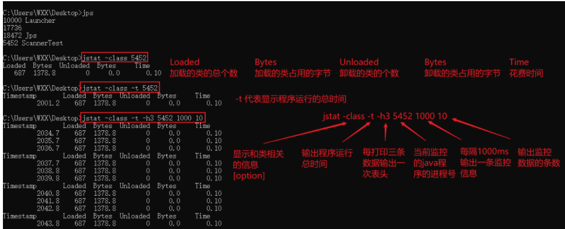

**option 参数**

选项 option 可以由以下值构成。

<mark>类装载相关的：</mark>

- `-class`：显示 ClassLoader 的相关信息：类的装载、卸载数量、总空间、类装载所消耗的时间等

<mark>垃圾回收相关的：</mark>

- `-gc`：显示与 GC 相关的堆信息。包括 Eden 区、两个 Survivor 区、老年代、永久代等的容量、已用空间、GC 时间合计等信息。
- `-gccapacity`：显示内容与-gc 基本相同，但输出主要关注 Java 堆各个区域使用到的最大、最小空间。
- `-gcutil`：显示内容与-gc 基本相同，但输出主要关注已使用空间占总空间的百分比。
- `-gccause`：与-gcutil 功能一样，但是会额外输出导致最后一次或当前正在发生的 GC 产生的原因。
- `-gcnew`：显示新生代 GC 状况
- `-gcnewcapacity`：显示内容与-gcnew 基本相同，输出主要关注使用到的最大、最小空间
- `-geold`：显示老年代 GC 状况
- `-gcoldcapacity`：显示内容与-gcold 基本相同，输出主要关注使用到的最大、最小空间
- `-gcpermcapacity`：显示永久代使用到的最大、最小空间。

<mark>JIT 相关的：</mark>

- `-compiler`：显示 JIT 编译器编译过的方法、耗时等信息

- `-printcompilation`：输出已经被 JIT 编译的方法

  

**`jstat -class`**


**`jstat -compiler`**


**`jstat -printcompilation`**


**`jstat -gc`**


**`jstat -gccapacity`**


**`jstat -gcutil`**


**`jstat -gccause`**


**`jstat -gcnew`**


**`jstat -gcnewcapacity`**


**`jstat -gcold`**


**`jstat -gcoldcapacity`**


**`jstat -t`**


**`jstat -t -h`**


| 表头 | 含义（字节）                                      |
| :--- | :------------------------------------------------ |
| EC   | Eden 区的大小                                     |
| EU   | Eden 区已使用的大小                               |
| S0C  | 幸存者 0 区的大小                                 |
| S1C  | 幸存者 1 区的大小                                 |
| S0U  | 幸存者 0 区已使用的大小                           |
| S1U  | 幸存者 1 区已使用的大小                           |
| MC   | 元空间的大小                                      |
| MU   | 元空间已使用的大小                                |
| OC   | 老年代的大小                                      |
| OU   | 老年代已使用的大小                                |
| CCSC | 压缩类空间的大小                                  |
| CCSU | 压缩类空间已使用的大小                            |
| YGC  | 从应用程序启动到采样时 young gc 的次数            |
| YGCT | 从应用程序启动到采样时 young gc 消耗时间（秒）    |
| FGC  | 从应用程序启动到采样时 full gc 的次数             |
| FGCT | 从应用程序启动到采样时的 full gc 的消耗时间（秒） |
| GCT  | 从应用程序启动到采样时 gc 的总时间                |

**interval 参数：** 用于指定输出统计数据的周期，单位为毫秒。即：查询间隔

**count 参数：** 用于指定查询的总次数

**-h 参数：** 可以在周期性数据输出时，输出多少行数据后输出一个表头信息

**-t 参数：** 可以在输出信息前加上一个 Timestamp 列，显示程序的运行时间。单位：秒

> 经验：
>
> 我们可以比较 Java 进程的启动时间以及总GC时间（GCT 列），或者两次测量的间隔时间以及总GC时间的增量，来得出GC时间占运行时间的比例。
>
> 如果该比例超过20％，则说明目前堆的压力较大；如果该比例超过90％，则说明堆里几乎没有可用空间，随时都可能**抛出 OOM 异常**。


> **补充：** jstat 还可以用来判断是否出现**内存泄漏**。
>
> 第 1 步：在长时间运行的 Java 程序中，我们可以运行 jstat 命令连续获取多行性能数据，并取这几行数据中 OU 列（即已占用的老年代内存）的最小值。
>
> 第 2 步：然后，我们每隔一段较长的时间重复一次上述操作，来获得多组 OU 最小值。如果这些值呈上涨趋势，则说明该 Java 程序的老年代内存已使用量在不断上涨，这意味着无法回收的对象在不断增加，因此很有可能存在内存泄漏。

```java
/**
 * -Xms60m -Xmx60m -XX:SurvivorRatio=8
 -gc：显示与GC相关的堆信息。包括Eden区，两个Survivor区、老年代、永久代的用量、已用空间、GC时间合计等信息。
-XX：NewRatio=2  因此新生代和老年代比例为1:2，新生代20M，老年代40M
-XX:SurvivorRatio=8 S0:S1:E=1:1:8，S0和S1都为2M，Eden为16M
 */
public class GCTest {
    public static void main(String[] args) {
        ArrayList<byte[]> list = new ArrayList<>();

        for (int i = 0; i < 1000; i++) {
            byte[] arr = new byte[1024 * 100];  // 100KB
            list.add(arr);
            try {
                Thread.sleep(120);
            } catch (InterruptedException e) {
                e.printStackTrace();
            }
        }
    }
}
```


## 2.4. jinfo：实时查看和修改 JVM 配置参数

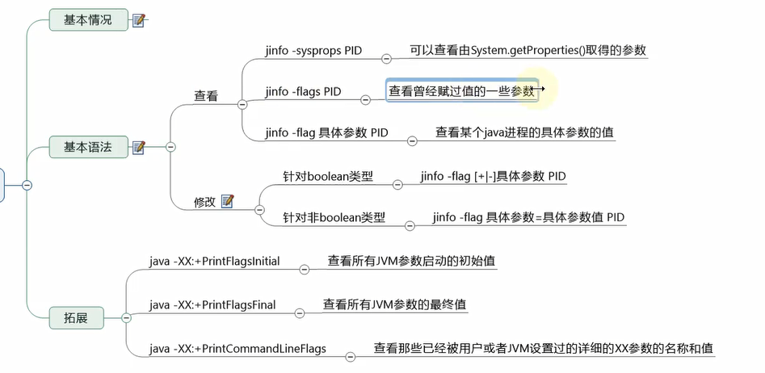

jinfo(Configuration Info for Java)：查看虚拟机配置参数信息，也可用于调整虚拟机的配置参数。在很多情况卡，Java 应用程序不会指定所有的 Java 虚拟机参数。而此时，开发人员可能不知道某一个具体的 Java 虚拟机参数的默认值。在这种情况下，可能需要通过查找文档获取某个参数的默认值。这个查找过程可能是非常艰难的。但有了 jinfo 工具，开发人员可以很方便地找到 Java 虚拟机参数的当前值。

基本使用语法为：`jinfo [options] pid`

说明：java 进程 ID 必须要加上

| 选项             | 选项说明                                                     |
| ---------------- | ------------------------------------------------------------ |
| 查看             |                                                              |
| no option        | 输出全部的参数和系统属性                                     |
| -flag name       | 输出对应名称的参数                                           |
| -flags           | 输出全部的参数                                               |
| -sysprops        | 输出系统属性                                                 |
| 修改             |                                                              |
| -flag [+-]name   | 开启或者关闭对应名称的参数 只有被标记为 manageable 的参数才可以被动态修改 |
| -flag name=value | 设定对应名称的参数                                           |

### **查看**

**`jinfo -sysprops pid`**

**可以查看由`System.getProperties()`取得参数行**

```properties
> jinfo -sysprops
jboss.modules.system.pkgs = com.intellij.rt
java.vendor = Oracle Corporation
sun.java.launcher = SUN_STANDARD
sun.management.compiler = HotSpot 64-Bit Tiered Compilers
catalina.useNaming = true
os.name = Windows 10
...
```

**`jinfo -flags pid`**

查看曾经赋过值的一些参数

```shell
> jinfo -flags 25592
Non-default VM flags: -XX:CICompilerCount=4 -XX:InitialHeapSize=333447168 -XX:MaxHeapSize=5324668928 -XX:MaxNewSize=1774714880 -XX:MinHeapDeltaBytes=524288 -XX:NewSize=111149056 -XX:OldSize=222298112 -XX:+UseCompressedClassPointers -XX:+UseCompressedOops -XX:+UseFastUnorderedTimeStamps -XX:-UseLargePagesIndividualAllocation -XX:+UseParallelGC
Command line:  -agentlib:jdwp=transport=dt_socket,address=127.0.0.1:8040,suspend=y,server=n -Drebel.base=C:\Users\Vector\.jrebel -Drebel.env.ide.plugin.version=2021.1.2 -Drebel.env.ide.version=2020.3.3 -Drebel.env.ide.product=IU -Drebel.env.ide=intellij -Drebel.notification.url=http://localhost:7976 -agentpath:C:\Users\Vector\AppData\Roaming\JetBrains\IntelliJIdea2020.3\plugins\jr-ide-idea\lib\jrebel6\lib\jrebel64.dll -Dmaven.home=D:\eclipse\env\maven -Didea.modules.paths.file=C:\Users\Vector\AppData\Local\JetBrains\IntelliJIdea2020.3\Maven\idea-projects-state-596682c7.properties -Dclassworlds.conf=C:\Users\Vector\AppData\Local\Temp\idea-6755-mvn.conf -Dmaven.ext.class.path=D:\IDEA\plugins\maven\lib\maven-event-listener.jar -javaagent:D:\IDEA\plugins\java\lib\rt\debugger-agent.jar -Dfile.encoding=UTF-8
```

**`jinfo -flag 具体参数 pid`** 

查看某个Java进程的具体参数的值

```shell
> jinfo -flag UseParallelGC 25592
-XX:+UseParallelGC

> jinfo -flag UseG1GC 25592
-XX:-UseG1GC
```

### 修改

 jinfo不仅可以查看运行时某一个Java虚拟机参数的实际取值，而且还可以在运行修改部分参数，并使之立即生效。但是并不是所有参数都支持动态修改。参数之后被标记为manageable 的flag 才可以被实时修改。修改能力极为有限。

```sh
# 可以查看被标记为manageable的参数
java -XX:+PrintFlagsFinal -version | grep manageable
```


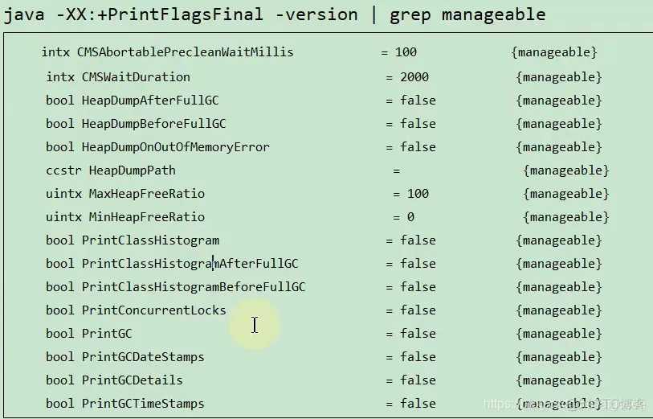

**jinfo -flag [+-]name**

```shell
> jinfo -flag +PrintGCDetails 25592
> jinfo -flag PrintGCDetails 25592
-XX:+PrintGCDetails

> jinfo -flag -PrintGCDetails 25592
> jinfo -flag PrintGCDetails 25592
-XX:-PrintGCDetails
```

### 拓展：

- `java -XX:+PrintFlagsInitial` 查看所有 JVM 参数启动的初始值

  ```shell
  [Global flags]
       intx ActiveProcessorCount                      = -1                                  {product}
      uintx AdaptiveSizeDecrementScaleFactor          = 4                                   {product}
      uintx AdaptiveSizeMajorGCDecayTimeScale         = 10                                  {product}
      uintx AdaptiveSizePausePolicy                   = 0                                   {product}
  ...
  ```

- `java -XX:+PrintFlagsFinal` 查看所有 JVM 参数的最终值

  ```shell
  [Global flags]
       intx ActiveProcessorCount                      = -1                                  {product}
  ...
       intx CICompilerCount                          := 4                                   {product}
      uintx InitialHeapSize                          := 333447168                           {product}
      uintx MaxHeapSize                              := 1029701632                          {product}
      uintx MaxNewSize                               := 1774714880                          {product}
  ```

- `java -XX:+PrintCommandLineFlags` 查看哪些已经被用户或者 JVM 设置过的详细的 XX 参数的名称和值

  ```shell
  -XX:InitialHeapSize=332790016 -XX:MaxHeapSize=5324640256 -XX:+PrintCommandLineFlags -XX:+UseCompressedClassPointers -XX:+UseCompressedOops -XX:-UseLargePagesIndividualAllocation -XX:+UseParallelGC
  ```

## 2.5. jmap：导出内存映像文件&内存使用情况

jmap（JVM Memory Map）：作用**一方面是获取 dump 文件**（堆转储快照文件，二进制文件），它还可以获取目标 Java 进程的内存相关信息，包括 Java 堆各区域的使用情况、堆中对象的统计信息、类加载信息等。

开发人员可以在控制台中输入命令“`jmap -help`”查阅 jmap 工具的具体使用方式和一些标准选项配置。

官方帮助文档：[https://docs.oracle.com/en/java/javase/11/tools/jmap.html](https://docs.oracle.com/en/java/javase/11/tools/jmap.html)

基本使用语法为：

- `jmap [option] <pid>`
- `jmap [option] <executable <core>`
- `jmap [option] [server_id@] <remote server IP or hostname>`

其中option选项：

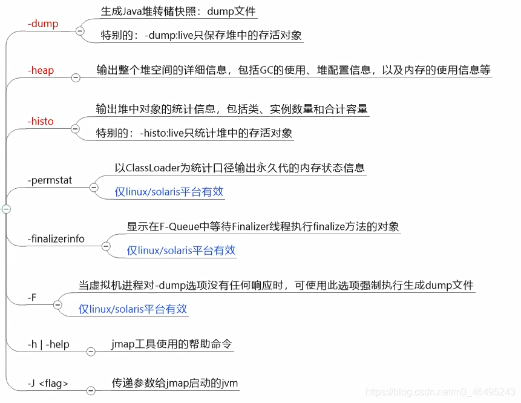

| 选项            | 作用                                                         |
| :-------------- | :----------------------------------------------------------- |
| `-dump`         | 生成 dump 文件（Java 堆转储快照），特别的：`-dump:live` 只保存堆中的存活对象 |
| `-heap`         | 输出整个堆空间的详细信息，包括 GC 的使用、堆配置信息，以及内存的使用信息等 |
| `-histo`        | 输出堆空间中对象的统计信息，包括类、实例数量和合计容量，特别的：-histo:live 只统计堆中的存活对象 |
| -J &lt;flag&gt; | 传递参数给 jmap 启动的 jvm                                   |
| -finalizerinfo  | 显示在 F-Queue 中等待 Finalizer 线程执行 finalize 方法的对象，仅 linux/solaris 平台有效 |
| -permstat       | 以 ClassLoader 为统计口径输出永久代的内存状态信息，仅 linux/solaris 平台有效 |
| -F              | 当虚拟机进程对-dump 选项没有任何响应时，强制执行生成 dump 文件，仅 linux/solaris 平台有效 |
| -h   \| -help   | jmap工具使用的帮助命令                                       |


#### 使用1：导出内存映像文件(dump文件)


```sh
手动方式
jmap -dump:format=b,file=<filename.hprof> <pid>
jmap -dump:live,format=b,file=<filename.hprof> <pid>
自动方式
-XX:+HeapDumpOnOutOfMemoryError
-XX:+HeapDumpAfterFullGC
-XX:HeapDumpPath=<filename.hprof>
```


一般来说，使用jmap指令生成dump文件的操作算得上是最常用的jmap命令之一，将堆中所有存活对象导出至一个文件之中。

Heap Dump又叫做堆存储文件，指一个Java进程在某个时间点的内存快照。Heap Dump在触发内存快照的时候会保存此刻的信息如下：

- All Objects：Class，field，primitive values and references
- All Classes：ClassLoader，name，super class，static fields
- Garbage Collection Roots：Objects defined to be reachable by the JVM
- Thread Stacks and Local Variables：The call-stacks of threads at the moment of the snapshot，and per-frame information about local objects

**说明**

- 通常在写Heap Dump文件前会触发一次Full GC，所以heap dump 文件里保存的都是Full GC后留下的对象信息。针对的是自动方式。
- 由于生成dump文件比较耗时，所以需要等待一段时间，尤其是大内存镜像生成dump文件，耗费的时间会更长。


注意：

1. 对于以上说明中的第1点是自动方式才会这样做，而手动不会在Full GC之后生成Dump
2. 使用手动方式生成dump文件，一般指令执行之后就会生成，不用等到快出现OOM的时候
3. 使用自动方式生成dump文件，当出现OOM之前先生成dump文件
4. 如果使用手动方式，一般使用第2种，毕竟生成堆中存活对象的dump文件是比较小的，便于传输和分析

##### 手动的方式

```sh
jmap -dump:format=b,file=<filename.hprof> <pid>

# 只保留存活对象,生成文件比较小
jmap -dump:live,format=b,file=<filename.hprof> <pid>
```


------

```java
/**
 * -Xms60m -Xmx60m -XX:SurvivorRatio=8
 */
public class GCTest {
    public static void main(String[] args) {
        ArrayList<byte[]> list = new ArrayList<>();

        for (int i = 0; i < 1000; i++) {
            byte[] arr = new byte[1024 * 100];//100KB
            list.add(arr);
            try {
                Thread.sleep(60);
            } catch (InterruptedException e) {
                e.printStackTrace();
            }
        }
    }
}

```


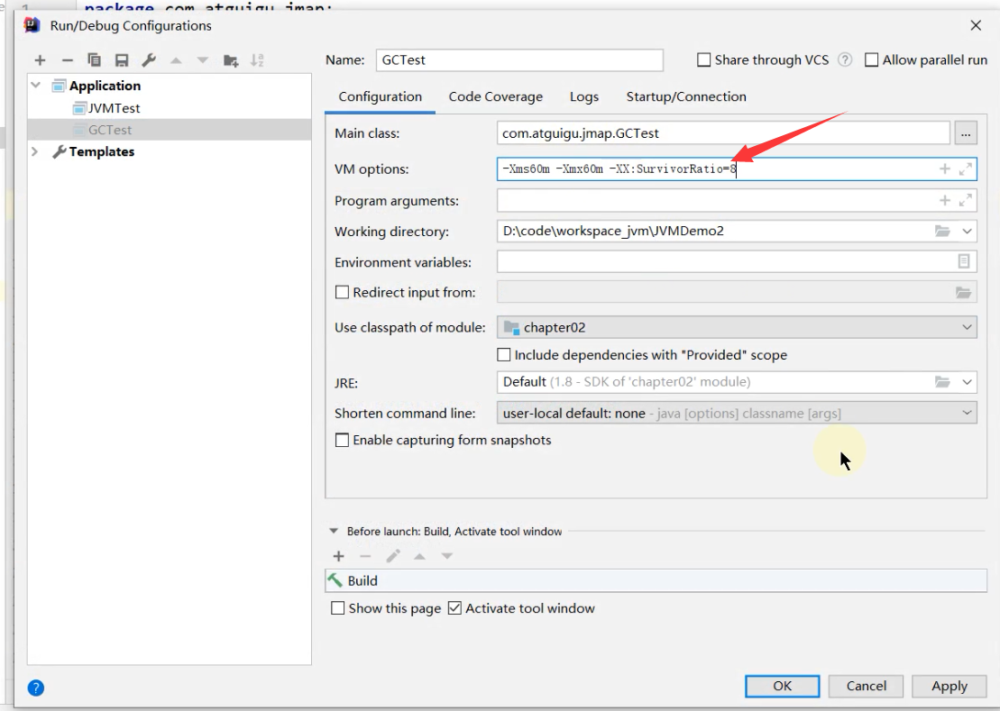

生产dump文件

```sh
jps
jmap -dump:live,format=b,file=D:\2024-3-39-OOM.hpof 31596
```


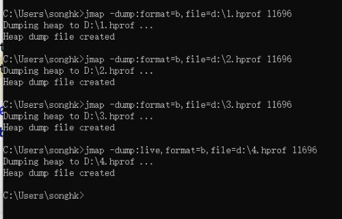


你会发现导出的hprof文件会越来越大,就是因为随着应用的执行,相关的数据也会越来越多,当然如果你参数配置带有-dump:live参数的话,代表hprof只保存堆中存货的对象. , 那么你生成的hprof文件也有可能会变小.
在实际的生产环境中,你生成的hprof文件可能会有几百mb大小,这样文件就有点大了,dump指令如果带有live之后,这样hprof文件可能就不会那么大了, 实际情况下oom 情况大多数原因是gc回收不走的对象存活导致的,所以实际生产环境,绝大多数都是用-dump:live指令

##### 自动的方式

当程序发生oom退出应用的时候,一些顺势信息都会随着程序的终止而消失,这样重现oom问题就比较困难了,如果能在发生oom的时候,自动导出dump文件就更好了.

```sh
-XX:+HeapDumpOnOutOfMemoryError:在程序发生oom的时候,导出应用程序的当前dump文件.
-XX:HeapDumpPath=<filename.hprof> 指定堆快照的保存位置..
```

比如:
```sh
-Xmx100m -XX:+HeapDumpOnOutOfMemoryError -XX:HeapDumpPath=D:\m.hprof
```


具体使用如下：


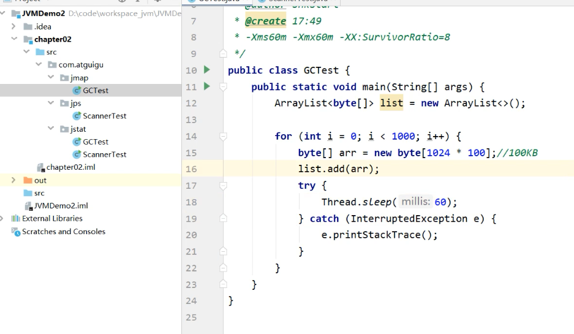

启动程序之后等待

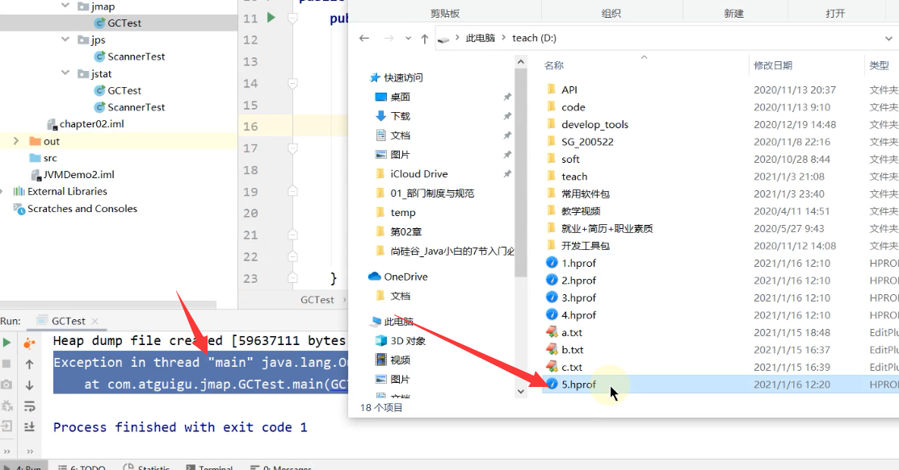

当发生oom的一瞬间,立马就生成了一个hprof文件出来

#### 使用2：显示堆内存相关信息

##### jmap -heap 进程id

`jmap -heap 进程id` 只是时间点上的堆信息，而jstat后面可以添加参数，可以指定时间动态观察数据改变情况，而图形化界面工具，例如jvisualvm等，它们可以用图表的方式动态展示出相关信息，更加直观明了
例子如下：

```sh
jmap -heap 28264 > a.txt
```


> 文件内容:  文件内容有堆空间的配置信息, 新生代和老年代的占用情况,
> ```
> Attaching to process ID 28264, please wait...
> Debugger attached successfully.
> Server compiler detected.
> JVM version is 25.241-b07
> 
> using thread-local object allocation.
> Parallel GC with 8 thread(s)
> 
> Heap Configuration:
>    MinHeapFreeRatio         = 0
>    MaxHeapFreeRatio         = 100
>    MaxHeapSize              = 6400507904 (6104.0MB)
>    NewSize                  = 133169152 (127.0MB)
>    MaxNewSize               = 2133327872 (2034.5MB)
>    OldSize                  = 267386880 (255.0MB)
>    NewRatio                 = 2
>    SurvivorRatio            = 8
>    MetaspaceSize            = 21807104 (20.796875MB)
>    CompressedClassSpaceSize = 1073741824 (1024.0MB)
>    MaxMetaspaceSize         = 17592186044415 MB
>    G1HeapRegionSize         = 0 (0.0MB)
> 
> Heap Usage:
> PS Young Generation
> Eden Space:
>    capacity = 100663296 (96.0MB)
>    used     = 52911352 (50.46019744873047MB)
>    free     = 47751944 (45.53980255126953MB)
>    52.5627056757609% used
> From Space:
>    capacity = 16252928 (15.5MB)
>    used     = 0 (0.0MB)
>    free     = 16252928 (15.5MB)
>    0.0% used
> To Space:
>    capacity = 16252928 (15.5MB)
>    used     = 0 (0.0MB)
>    free     = 16252928 (15.5MB)
>    0.0% used
> PS Old Generation
>    capacity = 267386880 (255.0MB)
>    used     = 0 (0.0MB)
>    free     = 267386880 (255.0MB)
>    0.0% used
> 
> 3152 interned Strings occupying 258936 bytes.
> ```

##### jmap -histo 进程id

输出堆中对象的同级信息，包括类、实例数量和合计容量，也是这一时刻的内存中的对象信息
例子如下：

```sh
jmap -histo  28264 > b.txt
```

### 使用3：其他作用


仅 linux/solaris 平台有效

### 小结

`jmap`（以及`jinfo`、`jstack`和`jcmd`）依赖于 Java 虚拟机的Attach API，因此只能监控本地 Java 进程。一旦开启 Java 虚拟机参数DisableAttachMechanism（即使用参数-XX:+DisableAttachMechanism），基于 Attach API 的命令将无法执行。反过来说，如果你不想被其他进程监控，那么你需要开启该参数。


由于 jmap 将访问堆中的所有对象，为了保证在此过程中不被应用线程干扰，jmap 需要借助安全点机制，让所有线程停留在不改变堆中数据的状态。也就是说，由 jmap 导出的堆快照必定是安全点位置的。这可能导致基于该堆快照的分析结果存在偏差。

举个例子，假设在编译生成的机器码中，某些对象的生命周期在两个安全点之间，那么:live 选项将无法探知到这些对象。

另外，如果某个线程长时间无法跑到安全点，jmap 将一直等下去。与前面讲的 jstat 则不同，垃圾回收器会主动将 jstat 所需要的摘要数据保存至固定位置之中，而 jstat 只需直接读取即可。

## 2.6. jhat：JDK 自带堆分析工具

jhat(JVM Heap Analysis Tool)：Sun JDK 提供的 jhat 命令与 jmap 命令搭配使用，**用于分析 jmap 生成的 heap dump 文件（堆转储快照）**。jhat 内置了一个微型的 HTTP/HTML 服务器，生成 dump 文件的分析结果后，用户可以在浏览器中查看分析结果（分析虚拟机转储快照信息）。

使用了 jhat 命令，就启动了一个 http 服务，端口是 7000，即 http://localhost:7000/，就可以在浏览器里分析。

说明：jhat 命令在 JDK9、JDK10 中已经被删除，官方建议用 VisualVM 代替。

基本适用语法：jhat &lt;option&gt; &lt;dumpfile&gt;

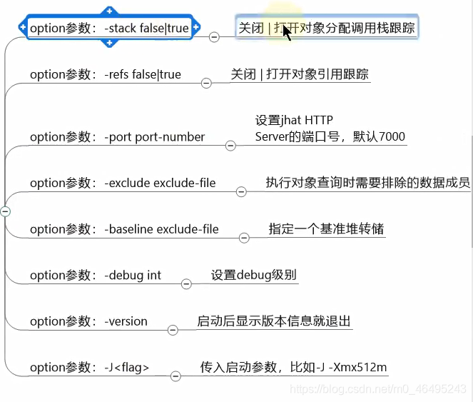

| option 参数            | 作用                                      |
| :--------------------- | :---------------------------------------- |
| -stack false ｜ true   | 关闭｜打开对象分配调用栈跟踪              |
| -refs false ｜ true    | 关闭｜打开对象引用跟踪                    |
| -port port-number      | 设置 jhat HTTP Server 的端口号，默认 7000 |
| -exclude exclude-file  | 执行对象查询时需要排除的数据成员          |
| -baseline exclude-file | 指定一个基准堆转储                        |
| -debug int             | 设置 debug 级别                           |
| -version               | 启动后显示版本信息就退出                  |
| -J &lt;flag&gt;        | 传入启动参数，比如-J-Xmx512m              |

**dumpfile参数**

要查看的二进制 Java 堆转储文件（Java binary heap dump file）。如果某个转储文件中包含了多份 heap dumps，可在文件名之后加上 #<number> 的方式指定解析哪一个 dump，如：myfile.hprof#3。

 **jhat 示例**

使用 jmap 工具转储堆内存、可以使用如下方式：

```
jmap -dump:file=DumpFileName.txt,format=b <pid>
```

然后分析时使用 jhat 命令，如下所示：

```
jhat -J-Xmx1024m D:/javaDump.hprof
```

使用参数 -J-Xmx1024m 是因为默认 JVM 的堆内存可能不足以加载整个 dump 文件，可根据需要进行调整。然后我们可以根据提示知道端口号是 7000，接着使用浏览器访问 http://localhost:7000/ 即可看到相关分析结果。


 

**详细说明**

jhat 命令支持预先设计的查询，比如显示某个类的所有实例。还支持 对象查询语言（OQL，Object Query Language），OQL 有点类似 SQL，专门用来查询堆转储。OQL 相关的帮助信息可以在 jhat 命令所提供的服务器页面最底部。如果使用默认端口，则 OQL 帮助信息页面为：http://localhost:7000/oqlhelp/

Java 生成堆转储的方式有多种：

- 使用 jmap -dump 选项可以在 JVM 运行时获取 heap dump（可以参考上面的示例）。
- 使用 jconsole 选项通过 HotSpotDiagnosticMXBean 从运行时获得堆转储。
- 在虚拟机启动时如果指定了 -XX:+HeapDumpOnOutOfMemoryError 选项，则抛出 OutOfMemoryError 时，会自动执行堆转储。
- 使用 hprof 命令。

## 2.7. jstack：打印 JVM 中线程快照

### 概述

jstack（JVM Stack Trace）：用于生成虚拟机指定进程当前时刻的线程快照（虚拟机堆栈跟踪）。线程快照就是当前虚拟机内指定进程的每一条线程正在执行的方法堆栈的集合。

生成线程快照的作用：可用于定位线程出现长时间停顿的原因，如线程间死锁、死循环、请求外部资源导致的长时间等待等问题。这些都是导致线程长时间停顿的常见原因。当线程出现停顿时，就可以用 jstack 显示各个线程调用的堆栈情况。

官方帮助文档：[https://docs.oracle.com/en/java/javase/11/tools/jstack.html](https://docs.oracle.com/en/java/javase/11/tools/jstack.html)

在 thread dump 中，要留意下面几种状态

- <mark>死锁，Deadlock（重点关注）</mark>
- <mark>等待资源，Waiting on condition（重点关注）</mark>
- <mark>等待获取监视器，Waiting on monitor entry（重点关注）</mark>
- <mark>阻塞，Blocked（重点关注）</mark>
- 执行中，Runnable
- 暂停，Suspended
- 对象等待中，Object.wait() 或 TIMED＿WAITING
- 停止，Parked


### **基本使用：**

```java
    jstack [-l] <pid>
        (to connect to running process)
    jstack -F [-m] [-l] <pid>
        (to connect to a hung process)
    jstack [-m] [-l] <executable> <core>
        (to connect to a core file)
    jstack [-m] [-l] [server_id@]<remote server IP or hostname>
        (to connect to a remote debug server)
```

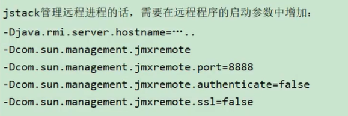

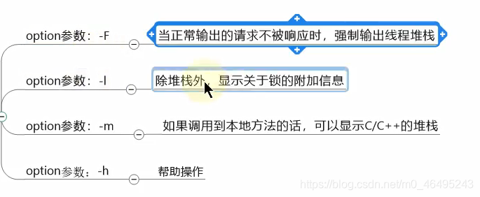

| option 参数 | 作用                                         |
| :---------- | :------------------------------------------- |
| -F          | 当正常输出的请求不被响应时，强制输出线程堆栈 |
| -l          | 除堆栈外，显示关于锁的附加信息               |
| -m          | 如果调用本地方法的话，可以显示 C/C++的堆栈   |

常用的选项是 `-l`，示例用法。
如果程序出现等待问题，可以使用该指令去查看问题所在，结果中也会提示你问题所在

```sh
jstack 4524
jstack -l 4524
```

在 Linux 和 macOS 上，`jstack pid` 的效果跟 `kill -3 pid` 相同。


```java
// Java代码中打印线程堆栈
public class AllStackTrace {
    public static void main(String[] args) {
        Map<Thread, StackTraceElement[]> all = Thread.getAllStackTraces();
        Set<Map.Entry<Thread, StackTraceElement[]>> entries = all.entrySet();
        for(Map.Entry<Thread, StackTraceElement[]> en : entries){
            Thread t = en.getKey();
            StackTraceElement[] v = en.getValue();
            System.out.println("【Thread name is :" + t.getName() + "】");
            for(StackTraceElement s : v){
                System.out.println("\t" + s.toString());
            }
        }
    }
}

```


### 演示1：死锁问题排查

```java
/**
 * 演示线程的死锁问题
 
 */
public class ThreadDeadLock {

    public static void main(String[] args) {

        StringBuilder s1 = new StringBuilder();
        StringBuilder s2 = new StringBuilder();

        new Thread(){
            @Override
            public void run() {

                synchronized (s1){

                    s1.append("a");
                    s2.append("1");

                    try {
                        Thread.sleep(100);
                    } catch (InterruptedException e) {
                        e.printStackTrace();
                    }

                    synchronized (s2){
                        s1.append("b");
                        s2.append("2");

                        System.out.println(s1);
                        System.out.println(s2);
                    }

                }

            }
        }.start();


        new Thread(new Runnable() {
            @Override
            public void run() {
                synchronized (s2){

                    s1.append("c");
                    s2.append("3");

                    try {
                        Thread.sleep(100);
                    } catch (InterruptedException e) {
                        e.printStackTrace();
                    }

                    synchronized (s1){
                        s1.append("d");
                        s2.append("4");

                        System.out.println(s1);
                        System.out.println(s2);
                    }
                }
            }
        }).start();

        try {
            Thread.sleep(1000);
        } catch (InterruptedException e) {
            e.printStackTrace();
        }

        new Thread(new Runnable() {
            @Override
            public void run() {
                Map<Thread, StackTraceElement[]> all = Thread.getAllStackTraces();//追踪当前进程中的所有的线程
                Set<Map.Entry<Thread, StackTraceElement[]>> entries = all.entrySet();
                for(Map.Entry<Thread, StackTraceElement[]> en : entries){
                    Thread t = en.getKey();
                    StackTraceElement[] v = en.getValue();
                    System.out.println("【Thread name is :" + t.getName() + "】");
                    for(StackTraceElement s : v){
                        System.out.println("\t" + s.toString());
                    }
                }
            }
        }).start();
    }


}
```

说明,第一个线程先获取s1锁,再获取s2锁 , 第二个线程先获取s2锁,再获取s1锁,这样就很容易出现死锁了

##### 用命令排查

启动上面的代码


这是就打印了线程的相关信息了,

箭头标识的这两个线程出现了阻塞状态,就是因为死锁了,


然后里面就显示deadlock了.


### 演示2：线程睡眠问题排查

```java
public class TreadSleepTest {
    public static void main(String[] args) {
        System.out.println("hello - 1");
        try {
            Thread.sleep(1000 * 60 * 10);
        } catch (InterruptedException e) {
            e.printStackTrace();
        }

        System.out.println("hello - 2");
    }
}
```

上面的代码会睡眠10分钟.让代码不执行

##### 用命令排查

启动上面的main方法

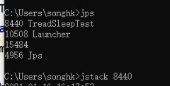

可以看到main线程是time waiting状态了.
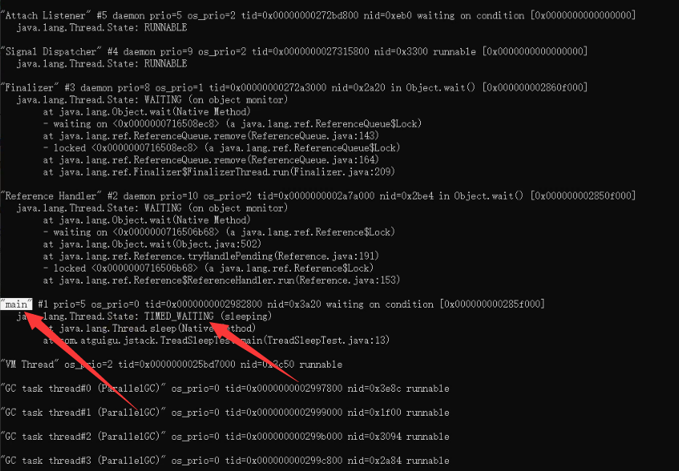

### 演示3：多线程同步问题

```java
/**
 * 演示线程的同步
 */
public class ThreadSyncTest {
    public static void main(String[] args) {
        Number number = new Number();
        Thread t1 = new Thread(number);
        Thread t2 = new Thread(number);

        t1.setName("线程1");
        t2.setName("线程2");

        t1.start();
        t2.start();
    }
}

class Number implements Runnable {
    private int number = 1;

    @Override
    public void run() {
        while (true) {
            synchronized (this) {

                if (number <= 100) {

                    try {
                        Thread.sleep(500);
                    } catch (InterruptedException e) {
                        e.printStackTrace();
                    }

                    System.out.println(Thread.currentThread().getName() + ":" + number);
                    number++;

                } else {
                    break;
                }
            }
        }
    }

}
```

上面代码说明,创建两个Number线程 ,然后去给number变量自增,其中锁对象是this, 这样就是同步

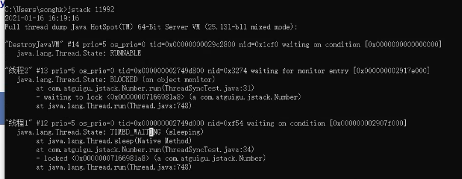

## 2.8. jcmd：多功能命令行

在 JDK 1.7 以后，新增了一个命令行工具 jcmd。它是一个多功能的工具，可以用来实现前面除了 jstat 之外所有命令的功能。比如：用它来导出堆、内存使用、查看 Java 进程、导出线程信息、执行 GC、JVM 运行时间等。

官方帮助文档：[https://docs.oracle.com/en/java/javase/11/tools/jcmd.html](https://docs.oracle.com/en/java/javase/11/tools/jcmd.html)

jcmd 拥有 jmap 的大部分功能，并且在 Oracle 的官方网站上也推荐使用 jcmd 命令代 jmap 命令


**基本语法：**

**jcmd -l：**列出所有的 JVM 进程

**jcmd 进程号 help：**针对指定的进程，列出支持的所有具体命令


**jcmd 进程号 具体命令：**显示指定进程的指令命令的数据

- Thread.print 可以替换 jstack 指令
- GC.class_histogram 可以替换 jmap 中的-histo 操作
- GC.heap_dump 可以替换 jmap 中的-dump 操作
- GC.run 可以查看 GC 的执行情况
- VM.uptime 可以查看程序的总执行时间，可以替换 jstat 指令中的-t 操作
- VM.system_properties 可以替换 jinfo -sysprops 进程 id
- VM.flags 可以获取 JVM 的配置参数信息


可以试试这些命令。查看 VM 相关的信息：

查看进程信息：

```
jcmd
jcmd -l
jps -lm

75768 org.jetbrains.idea.maven.server.RemoteMavenServer
```

这几个命令的结果差不多。可以看到其中有一个 PID 为 75768 的进程，下面看看可以用这个 PID 做什么。

给这个进程发一个 help 指令：

```
jcmd 75768 help
jcmd RemoteMavenServer help
```

pid 和 main-class 输出信息是一样的：

```
75768:
The following commands are available:
Compiler.CodeHeap_Analytics
Compiler.codecache
Compiler.codelist
Compiler.directives_add
Compiler.directives_clear
Compiler.directives_print
Compiler.directives_remove
Compiler.queue
GC.class_histogram
GC.class_stats
GC.finalizer_info
GC.heap_dump
GC.heap_info
GC.run
GC.run_finalization
JFR.check
JFR.configure
JFR.dump
JFR.start
JFR.stop
JVMTI.agent_load
JVMTI.data_dump
ManagementAgent.start
ManagementAgent.start_local
ManagementAgent.status
ManagementAgent.stop
Thread.print
VM.class_hierarchy
VM.classloader_stats
VM.classloaders
VM.command_line
VM.dynlibs
VM.flags
VM.info
VM.log
VM.metaspace
VM.native_memory
VM.print_touched_methods
VM.set_flag
VM.start_java_debugging
VM.stringtable
VM.symboltable
VM.system_properties
VM.systemdictionary
VM.uptime
VM.version
help
```


可以试试这些命令。查看 VM 相关的信息：

```
# JVM 实例运行时间
jcmd 75768 VM.uptime
596.145 s

#JVM 版本号
jcmd 75768 VM.version
OpenJDK 64-Bit Server VM version 11.0.6+8-b520.43
JDK 11.0.6

# JVM 实际生效的配置参数
jcmd 75768 VM.flags
-XX:CICompilerCount=4 -XX:ConcGCThreads=2 -XX:G1ConcRefinementThreads=8 -XX:G1HeapRegionSize=1048576 -XX:GCDrainStackTargetSize=64 -XX:InitialHeapSize=268435456 -XX:MarkStackSize=4194304 -XX:MaxHeapSize=805306368 -XX:MaxNewSize=482344960 -XX:MinHeapDeltaBytes=1048576 -XX:NonNMethodCodeHeapSize=5836300 -XX:NonProfiledCodeHeapSize=122910970 -XX:ProfiledCodeHeapSize=122910970 -XX:ReservedCodeCacheSize=251658240 -XX:+SegmentedCodeCache -XX:+UseCompressedClassPointers -XX:+UseCompressedOops -XX:+UseG1GC -XX:-UseLargePagesIndividualAllocation
```

GC 相关的命令，统计每个类的实例占用字节数。

```
jcmd 75768 GC.class_histogram
```

```
 num     #instances         #bytes  class name (module)
-------------------------------------------------------
   1:         26469        2722896  [B (java.base@11.0.6)
   2:         25224         605376  java.lang.String (java.base@11.0.6)
   3:          4278         505368  java.lang.Class (java.base@11.0.6)
   4:          2236         337328  [I (java.base@11.0.6)
   5:         10031         320992  java.util.concurrent.ConcurrentHashMap$Node (java.base@11.0.6)
   6:          3146         276848  java.lang.reflect.Method (java.base@11.0.6)
   7:          4617         276176  [Ljava.lang.Object; (java.base@11.0.6)
   8:           740         258464  [C (java.base@11.0.6)
   9:          6910         221120  java.util.HashMap$Node (java.base@11.0.6)
  10:          4765         190600  java.util.LinkedHashMap$Entry (java.base@11.0.6)
  11:          1676         168864  [Ljava.util.HashMap$Node; (java.base@11.0.6)
  12:          4680         119952  [Ljava.lang.Class; (java.base@11.0.6)
```


jcmd 75768 help GC.heap_dump

```
GC.heap_dump
Generate a HPROF format dump of the Java heap.

Impact: High: Depends on Java heap size and content. Request a full GC unless the '-all' option is specified.

Permission: java.lang.management.ManagementPermission(monitor)

Syntax : GC.heap_dump [options] <filename>

Arguments:
        filename :  Name of the dump file (STRING, no default value)

Options: (options must be specified using the <key> or <key>=<value> syntax)
        -all : [optional] Dump all objects, including unreachable objects (BOOLEAN, false)
# 两者效果差不多; jcmd 需要指定绝对路径； jmap 不能指定绝对路径
jcmd 75768GC.heap_dump -all=true ~/75768-by-jcmd.hprof
jmap -dump:file=./75768-by-jmap.hprof 75768
```

jcmd 必须指定绝对路径，否则导出的 hprof 文件就以 JVM 所在的目录计算。（因为是发命令交给 JVM 执行的）

## 2.9. jstatd：远程主机信息收集

之前的指令只涉及到监控本机的 Java 应用程序，而在这些工具中，一些监控工具也支持对远程计算机的监控（如 jps、jstat）。为了启用远程监控，则需要配合使用 jstatd 工具。命令 jstatd 是一个 RMI 服务端程序，它的作用相当于代理服务器，建立本地计算机与远程监控工具的通信。jstatd 服务器将本机的 Java 应用程序信息传递到远程计算机。


<hr/>

## 2.10.jrunscript 和 jjs 工具

jrunscript 和 jjs 工具用来执行脚本，只要安装了 JDK 8+，就可以像 shell 命令一样执行相关的操作了。这两个工具背后，都是 JDK 8 自带的 JavaScript 引擎 Nashorn。

执行交互式操作：

```
$ jrunscript
nashorn> 66+88
154
```

或者：

```
$ jjs
jjs> 66+88
154
```

按 CTRL+C 或者输入 exit() 回车，退出交互式命令行。

其中 jrunscript 可以直接用来执行 JS 代码块或 JS 文件。比如类似 curl 这样的操作：

```
jrunscript -e "cat('http://www.baidu.com')"
```

或者这样：

```
jrunscript -e "print('hello,kk.jvm'+1)"
```

甚至可以执行 JS 脚本：

```
jrunscript -l js -f /XXX/XXX/test.js
```

而 jjs 则只能交互模式，但是可以指定 JavaScript 支持的 ECMAScript 语言版本，比如 ES5 或者 ES6。

这个工具在某些情况下还是有用的，还可以在脚本中执行 Java 代码，或者调用用户自己的 jar 文件或者 Java 类。

如果是 JDK 9 及以上的版本，则有一个更完善的 REPL 工具——JShell，可以直接解释执行 Java 代码。

**参考文档：https://docs.oracle.com/javase/8/docs/technotes/tools/index.html**
