以下是学习 B 站老韩的正则表达式专题视频总结，[传送门](https://www.bilibili.com/video/BV1Eq4y1E79W)。相关代码仓库地址：[https://github.com/CoderBleu/learn_regular](https://github.com/CoderBleu/learn_regular)


- [快速入门](#快速入门)
  - [初识](#初识)
    - [百度热搜榜](#百度热搜榜)
  - [原理剖析](#原理剖析)
    - [原理剖析_带括号分组查询](#原理剖析_带括号分组查询)
  - [元字符](#元字符)
    - [^ 用法](#-用法)
    - [转义字符的使用](#转义字符的使用)
    - [字符匹配案例](#字符匹配案例)
    - [选择匹配符](#选择匹配符)
    - [正则限定符](#正则限定符)
    - [正则定位符](#正则定位符)
  - [正则表达式三个常用类](#正则表达式三个常用类)
    - [Pattern类](#pattern类)
    - [Matcher类](#matcher类)
    - [PatternSyntaxException](#patternsyntaxexception)
- [进阶](#进阶)
    - [捕获分组](#捕获分组)
    - [非捕获分组](#非捕获分组)
    - [非贪婪匹配](#非贪婪匹配)
    - [反向引用](#反向引用)
    - [去重](#去重)
    - [String类的正则使用](#string类的正则使用)
    - [验证是否为整数或小数](#验证是否为整数或小数)
    - [正则匹配 URL](#正则匹配-url)
- [常用](#常用)
    - [校验数字的表达式](#校验数字的表达式)
    - [校验字符的表达式](#校验字符的表达式)
    - [特殊需求表达式](#特殊需求表达式)

快速入门
====================

## 初识

```java
public class Demo {
    public static void main(String[] args) {
        String content = "1995年，互联网的蓬勃发展给了Oak机会。业界为了使死板、单调的静态网页能够“灵活”起来，急需一种软件技术来开发一种程序，" +
                "这种程序可以通过网络传播并且能够跨平台运行。于是，世界各大IT企业为此纷纷投入了大量的人力、物力和财力。这个时候，" +
                "Sun公司想起了那个被搁置起来很久的Oak，并且重新审视了那个用软件编写的试验平台，由于它是按照嵌入式系统硬件平台体系结构进行编写的，所以非常小，" +
                "特别适用于网络上的传输系统，而Oak也是一种精简的语言，程序非常小，适合在网络上传输。Sun公司首先推出了可以嵌入网页并且可以随同网页在网络上传输的Applet（Applet是一种将小程序嵌入到网页中进行执行的技术），并将Oak更名为Java（在申请注册商标时，发现Oak已经被人使用了，再想了一系列名字之后，最终，使用了提议者在喝一杯Java咖啡时无意提到的Java词语）。5月23日，Sun公司在Sun world会议上正式发布Java和HotJava浏览器。IBM、Apple、DEC、Adobe、HP、Oracle、Netscape和微软等各大公司都纷纷停止了自己的相关开发项目，竞相购买了Java使用许可证，并为自己的产品开发了相应的Java平台。";


        Pattern compile = Pattern.compile("([0-9]+)|([a-zA-Z]+)");
        Matcher matcher = compile.matcher(content);
        
        while (matcher.find()) {
            System.out.println("找到：" + matcher.group(0));
        }
    }
}
```

### 百度热搜榜

```java
public class Demo {
    public static void main(String[] args) {
        String content = "<div class=\"avator selected\" data-uid=\"ea1c30cc\" data-uname=\"大良家的张先生\">\n" +
                "\n" +
                "<div class=\"avator_shd\"></div>\n" +
                "</div>\n" +
                "<div class=\"avator\" data-uid=\"2f941cd9\" data-uname=\"浅听寒雨\">\n" +
                "\n" +
                "<div class=\"avator_shd\"></div>\n" +
                "</div>\n" +
                "<div class=\"avator\" data-uid=\"f2b1g7f2601000000\" data-uname=\"巧若南00u\">\n" +
                "\n" +
                "<div class=\"avator_shd\"></div>\n" +
                "</div>\n" +
                "<div class=\"avator\" data-uid=\"cc9495e7\" data-uname=\"三岁就很萌hhh\">\n" +
                "\n" +
                "<div class=\"avator_shd\"></div>\n" +
                "</div>\n" +
                "<div class=\"avator\" data-uid=\"8c32b7e7\" data-uname=\"箬翊玖\">\n" +
                "\n" +
                "<div class=\"avator_shd\"></div>\n" +
                "</div>\n" ;

        
        Pattern compile = Pattern.compile("<img data-name=\"(\\S*)\"");
        
        Matcher matcher = compile.matcher(content);
        
        while (matcher.find()) {
            
            
            System.out.println("找到：" + matcher.group(1));
        }
    }
}
```

## 原理剖析

```java
public class Demo {
    public static void main(String[] args) {
        String content = "2000年5月，JDK1.3、JDK1.4和J2SE1.3相继发布，几周后其获得了Apple公司Mac OS X的工业标准的支持。2001年9月24日，J2EE1.3发布。" +
                "2002年2月26日，J2SE1.4发布。自此Java的计算能力有了大幅提升，与J2SE1.3相比，其多了近62%的类和接口。在这些新特性当中，还提供了广泛的XML支持、安全套接字（Socket）支持（通过SSL与TLS协议）、全新的I/OAPI、正则表达式、日志与断言。" +
                "2004年9月30日，J2SE1.5发布，成为Java语言发展史上的又一里程碑。为了表示该版本的重要性，J2SE 1.5更名为Java SE 5.0（内部版本号1.5.0），" +
                "代号为“Tiger”，Tiger包含了从1996年发布1.0版本以来的最重大的更新，其中包括泛型支持、基本类型的自动装箱、改进的循环、枚举类型、" +
                "格式化I/O及可变参数。";

        Pattern compile = Pattern.compile("\\d\\d\\d\\d");
        Matcher matcher = compile.matcher(content);
       while (matcher.find()) {
            System.out.println("找到：" + matcher.group(0));
        }
    }
}
```

**查找过程：**

1.  根据指定的规则，定位满足规则的字符串，比如 2000
2.  找到后将 子字符串的开始索引 group[0]=0 记录到 matcher 对象的 `int[] groups` 数组中；

**Debug如下图所示，第一次匹配成功：**

3.  同时记录 `oldLast` 的值为 子字符串的结束的 索引 + 1 的位置值索引 group[1]=4，下次执行 `find()` 是，就从记录的索引开始匹配
4.  如果 matcher.group(i)，i 超过了范围，就会报索引越界异常，因为 getSubSequence(groups[group * 2], groups[group * 2 + 1]).toString();

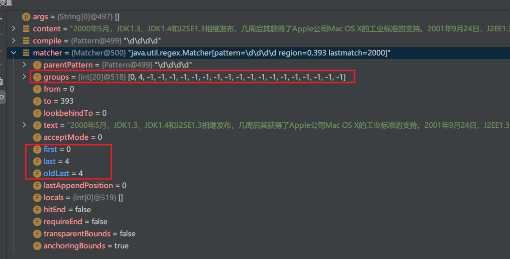

**第二次匹配成功：**

5.  继续向下找的时候同理, 找到后将 子字符串的开始索引记录 group[0]=65 到 matcher 对象的 int[] groups 数组中；同时记录 oldLast 的值为 子字符串的结束的 索引 + 1 的位置值索引为 group[1]=69，下次执行 find 是，就从记录的索引开始匹配

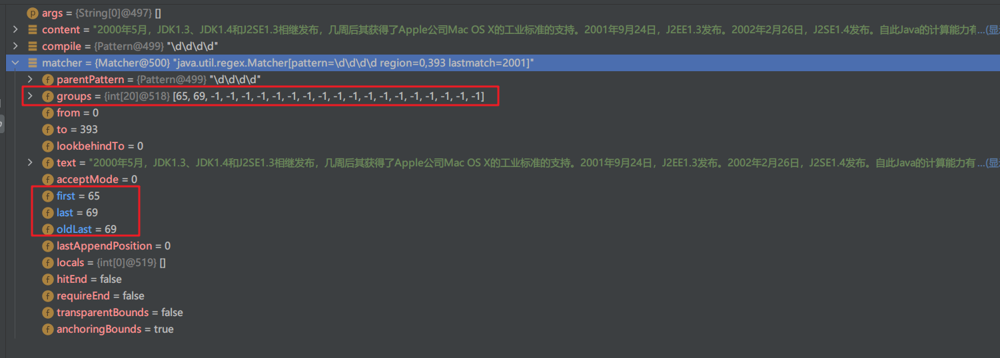

### 原理剖析_带括号分组查询

```java
public class Demo {
    public static void main(String[] args) {
        String content = "2000年5月，JDK1.3、JDK1.4和J2SE1.3相继发布，几周后其获得了Apple公司Mac OS X的工业标准的支持。2001年9月24日，J2EE1.3发布。" +
                "2002年2月26日，J2SE1.4发布。自此Java的计算能力有了大幅提升，与J2SE1.3相比，其多了近62%的类和接口。在这些新特性当中，还提供了广泛的XML支持、安全套接字（Socket）支持（通过SSL与TLS协议）、全新的I/OAPI、正则表达式、日志与断言。" +
                "2004年9月30日，J2SE1.5发布，成为Java语言发展史上的又一里程碑。为了表示该版本的重要性，J2SE 1.5更名为Java SE 5.0（内部版本号1.5.0），" +
                "代号为“Tiger”，Tiger包含了从1996年发布1.0版本以来的最重大的更新，其中包括泛型支持、基本类型的自动装箱、改进的循环、枚举类型、" +
                "格式化I/O及可变参数。";

        Pattern compile = Pattern.compile("(\\d)(\\d\\d\\d)");
        Matcher matcher = compile.matcher(content);
        while (matcher.find()) {
            System.out.println("找到：" + matcher.group(0));
            System.out.println("找到：" + matcher.group(1));
            System.out.println("找到：" + matcher.group(2));

        }
    }
}
```

首先先了解下什么是`分组`？比如 (\d\d)(\d\d) , 则会功能则表达式中有 () 表示分组，第一个 ()表示第 1 组，第二个 () 表示第 2 组…

`查找过程：`

1.  根据指定的规则，定位欸满足规则的子字符串 (比如 (20)(00))
2.  找到后将 子字符串的开始索引 group[0]=0 记录到 matcher 对象的熟悉 int[] groups 数组中；
        *   2.1 groups[0] = 0, 把该子字符串的结束的索引 + 1 的值记录到 groups[1] = 4
            *   2.2 记录 1 组 () 匹配到的子字符串 groups[2] = 0 groups[3] = 2
                *   2.3 记录 2 组 () 匹配到的子字符串 groups[4] = 2 groups[5] = 4

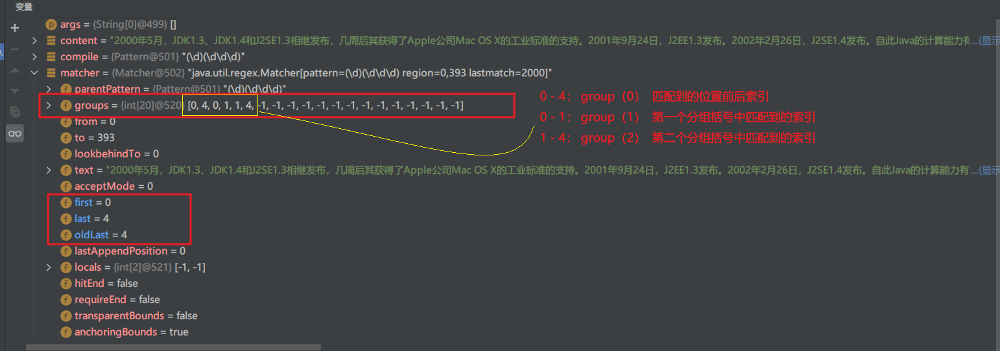

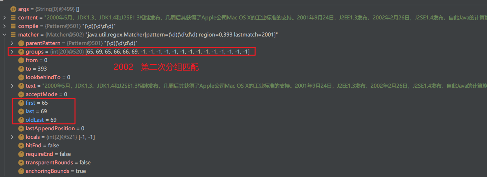

2.4 如果有更多的分组，同理

3.  同时记录 oldLast 的值为 子字符串的结束的 索引 + 1 的值即 69，即下次执行 find 时，就从 69 开始匹配。


## 元字符

### ^ 用法

```java
public class Demo {
    public static void main(String[] args) {
        String content = "abc$(a.bc(123(";

        Pattern compile = Pattern.compile("[^a-z]");

        Matcher matcher = compile.matcher(content);

        while (matcher.find()) {
            System.out.println("找到：" + matcher.group(0));
        }
    }
}

--------------------
找到：$
找到：(
找到：.
找到：(
找到：1
找到：2
找到：3
找到：(
```

`注意：在 ^ 为正则定位符时表示起始字符，比如^[0-9]+[a-z]*，表示以至少一个数字开头，然后任意小写字母字符串`

### 转义字符的使用

元字符（Metacharacter）-转义号`\\`
`\`符号说明：在我们使用正则表达式去检索某些特殊字符的时候，需要用到转义符号，否则检索不到结果，甚至会报错的。

案例：用$去匹配"abcs$("会怎样？
用（去匹配"abcs$("会怎样？

再次提示：

在Java的正则表达式中，两个`\\`代表

其他语言中的一个`\`


**需要用到转义符号的字符有以下**：`. * +( ) $ / \ ?[ ] ^ { }`

```java
public class Demo {
    public static void main(String[] args) {
        String content = "abc$(a.bc(123(";

        Pattern compile = Pattern.compile("\\(");

        Matcher matcher = compile.matcher(content);

        while (matcher.find()) {

            System.out.println("找到：" + matcher.group(0));
        }
    }
}
----------------------
找到：(
找到：(
找到：(
```

### 字符匹配案例

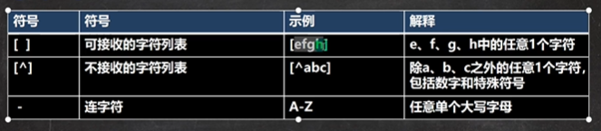

元字符

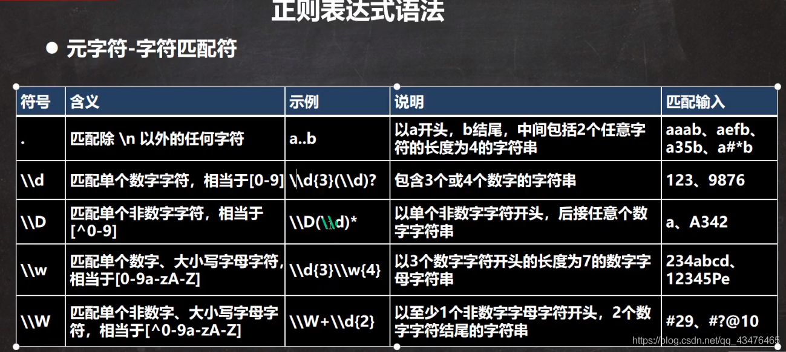

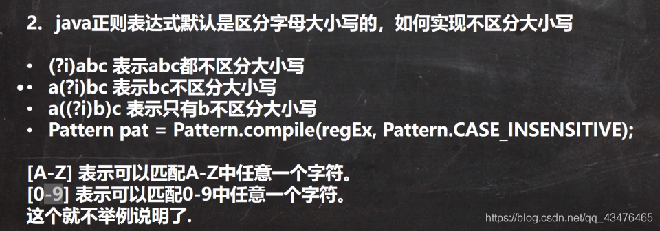


```java
public class Demo {
    public static void main(String[] args) {
        String content = "a11c8abcAB\nCy_ABC abc@!  .";

        String reg = "[a-z]"; // 匹配 a-z之间任意一个字符
        String reg1 = "[A-Z]"; // 匹配 A-Z之间任意一个字符
        String reg2 = "abc"; // 匹配 abc字符串(默认区分大小写)
        String reg3 = "(?i)abc"; // TODO 有问题 匹配 abc 字符串(不区分大小写)，a(?!)bc表示bc不区分大小写
        String reg4 = "[0-9]"; // 匹配 0-9之间任意一个字符
        String reg5 = "[^a-z]"; // 匹配 不在 a-z之间任意一个字符
        String reg6 = "[^0-9]"; // 匹配 不在 0-9之间任意一个字符
        String reg7 = "[abcd]"; // 匹配 在 abcd中任意一个字符
        String reg8 = "\\D"; // 匹配 不在 0-9的任意一个字符
        String reg9 = "\\w"; // 等价于 [a-zA-Z0-9_] 匹配 大小写英文字母，数字，下划线
        String reg10 = "\\W"; // 等价于 [^a-zA-Z0-9_]，比如空格，感叹号!，艾特@
        String reg11 = "\\s"; // 匹配任何空白字符(空格，制表符等)
        String reg12 = "\\S";// 匹配任何非空白字符(空格，制表符等)
        String reg13 = "\\."; // "."匹配出 \n之外的所有字符，如果要匹配，本身则需要使用 \\.

        Pattern compile = Pattern.compile(reg12);
        // 启用不区分大小写的匹配。
        // Pattern compile = Pattern.compile(reg2, Pattern.CASE_INSENSITIVE);
        Matcher matcher = compile.matcher(content);
        while (matcher.find()) {
            System.out.println("找到：" + matcher.group(0));
        }
    }
}
```

### 选择匹配符

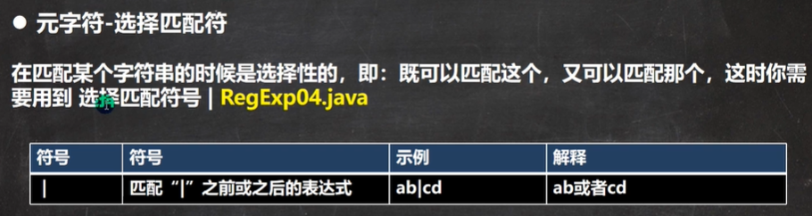

```java
public class Demo {
    public static void main(String[] args) {
        String content = "lauy 木艺术";
        String regStr = "lauy|木|艺";

        Pattern pattern = Pattern.compile(regStr, Pattern.CASE_INSENSITIVE);
        Matcher matcher = pattern.matcher(content);

        while (matcher.find()) {
            System.out.println("找到：" + matcher.group(0));
        }

    }
}
```

### 正则限定符

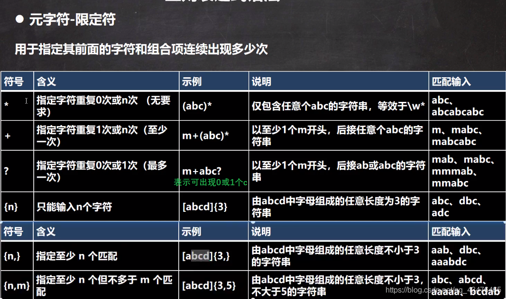

```java
public class Demo {
    public static void main(String[] args) {
        String content = "111112141aaaaa1ahello";

        String reg1 = "a{3}"; // 表示匹配 aaa
        String reg2 = "1{4}"; // 表示匹配 1111
        String reg3 = "\\d{2}"; // 表示匹配 两位的任意数字字符

        // 细节：java匹配默认贪婪匹配，尽可能的匹配多的
        String reg4 = "a{3,4}"; //表示匹配aaa 或者 aaaa，优先aaaa多的
        String reg5 = "1{4,5}"; // 表示匹配 1111 或者 11111(优先)
        String reg6 = "\\d{2,5}"; // 匹配2位数或者3，4，5，如下会找到找到：11111 和 11

        // + 号使用  1次到任意多次
        String reg7 = "1+"; // 匹配一个1或者多个1
        String reg8 = "\\d+"; // 匹配一个或多个数字
        String reg11 = "\\d*"; // 匹配0个或多个数字

        // * 号使用  0次或任意多次-
        String reg9 = "1*"; // 匹配0个1或者多个1

        // ? 号使用，遵守贪婪匹配  表示0次或者1次
        String reg10 = "a1?"; // 匹配 a 或者 a1


        Pattern pattern = Pattern.compile(reg11, Pattern.CASE_INSENSITIVE);
        Matcher matcher = pattern.matcher(content);

        while (matcher.find()) {
            System.out.println("找到：" + matcher.group(0));
        }
        }

    }
}
```

### 正则定位符

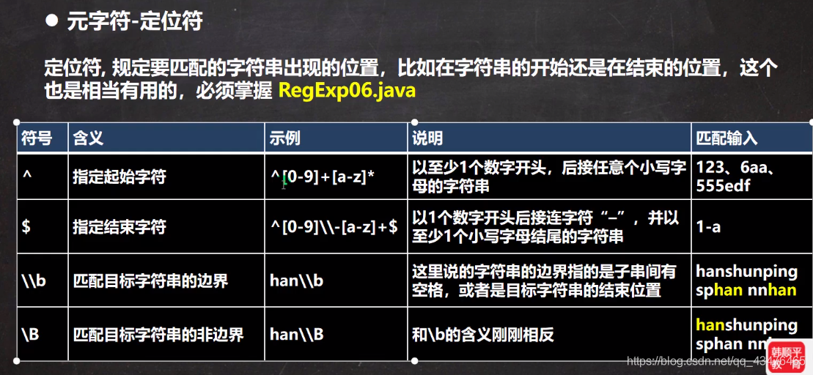

```java
public class Demo {
    public static void main(String[] args) {
        String content = "21lauyhelloworld hilauy lauyu Hilauy123";
        // 以至少1个数字开头，后接0或者任意个小写字符串
        String reg1 = "^[0-9]+[a-z]*";
        // 以至少1个数字开头，必须以至少一个小写字母结束,比如仅仅跟 2-lauyhelloworld 匹配，就符合要求
        String reg2 = "^[0-9]+\\-[a-z]+$";

        // \b 匹配一个单词边界，即字与空格间的位置。如果它位于要匹配的字符串的开始，它在单词的开始处查找匹配项。如果它位于字符串的结尾，它在单词的结尾处查找匹配项。
        // 上述例子，我们可以找字符串结尾处的，比如 21lauyh...，lauyu，lauy123
        String reg3 = "lauy\\b";

        // \B和\\b含义相反，详细：面表达式匹配 minelauyo 中的字符串 apt，但不匹配 lauyo 中的字符串 apt：
        String reg4 = "lauy\\B";
        Pattern pattern = Pattern.compile(reg4);
        Matcher matcher = pattern.matcher(content);

        while (matcher.find()) {
            System.out.println("找到：" + matcher.group(0));
        }
    }
}
```

## 正则表达式三个常用类

java.util.regex包主要包括以下三个类Pattern类、Matcher类和PatternSyntaxException 

### Pattern类

pattern对象是一个正则表达式对象。Pattern类没有公共构造方法。要创建一个Pattern对象，调用其公共静态方法，它返回一个Pattern对象。该方法接受一个正则表达式作为它的第

+ 一个参数，比如：`Pattern r= Pattern.compile(pattern);`
+ Pattern类的方法matches()

```java
    public static void main(String[] args) {
        String content = "helLo abc helLo，韩顺平教育";
        String regStr = "hello";
        //这里如果使用Pattern的matches整体匹配比较简洁
        boolean matches = Pattern.matches(regStr,content);
        System.out.println("整体匹配=" + matches);
    }
```

源码

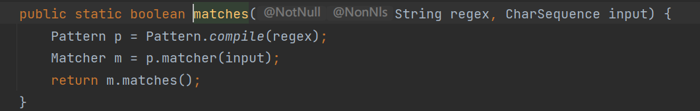


### Matcher类

Matcher对象是对输入字符串进行解释和匹配的引擎。与Pattern类一样，Matcher也没有公共构造方法。你需要调用Pattern对象的matcher方法来获得一个Matcher对象

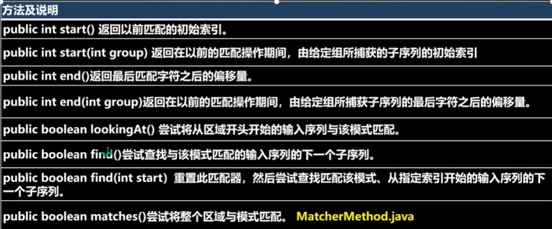


```java
  public static void main(String[] args) {
        String content = "helLo edu jack tom helLo smith helLo";
        String regStr = "helLo";
        Pattern pattern = Pattern.compile(regStr);
        Matcher matcher = pattern.matcher(content);
        while (matcher.find()) {
            System.out.println("====================");
            System.out.println(matcher.start());
            System.out.println(matcher.end());
            System.out.println("找到：" + content.substring(matcher.start(), matcher.end()));
            
        }
        //整体匹配方法，常用于，去校验某个字符串是香满足某个规则
        System.out.println("整体匹配"+matcher.matches());


        //将helLo替换成你好
        String str = matcher.replaceAll("你好");//返回新串，之前的不变
        System.out.println(str);
        System.out.println(content);
    }
```

### PatternSyntaxException 

PatternSyntaxException是一个非强制异常类，它表示一个正则表达式模式中的语法错误。


进阶
==============

### 捕获分组

```java
public class Demo {
    public static void main(String[] args) {
 		String content = "1324324332423";

        /* 捕获分组*/
        String reg1 = "(\\d\\d)(\\d\\d)"; // 匹配4个数字的字符串
        // 命名分组：即可以给分组取名
        String reg2 = "(?<g1>\\d\\d)(?<g2>\\d\\d)";

        Pattern pattern = Pattern.compile(reg2);
        Matcher matcher = pattern.matcher(content);

        while (matcher.find()) {
            /*找到：1324
            找到第一个分组的第一个内容：13
            找到第一个分组的第一个内容：24*/
            System.out.println("找到捕获分组：" + matcher.group(0));
            System.out.println("找到捕获分组的第一个内容：" + matcher.group(1));
            System.out.println("找到捕获分组的第二个内容：" + matcher.group(2));

            /*命名分组方式*/
            // System.out.println("找到捕获分组：" + matcher.group(0));
            // System.out.println("找到第捕获分组的第一个内容：" + matcher.group("g1"));
            // System.out.println("找到第捕获分组的第二个内容：" + matcher.group("g2"));

        }
    }
}

--------------
找到捕获分组：1324
找到捕获分组的第一个内容：13
找到捕获分组的第二个内容：24
找到捕获分组：3243
找到捕获分组的第一个内容：32
找到捕获分组的第二个内容：43
找到捕获分组：3242
找到捕获分组的第一个内容：32
找到捕获分组的第二个内容：42
```

| 常用分组构造形式     | 说明                                                         |
| -------------------- | ------------------------------------------------------------ |
| `(pattern)`          | 非命名捕获。捕获匹配的子字符串。编号为零的第一个捕获是由整个<br>正则表达式模式匹配的文本，其它捕获结果则根据左括号的顺序从1开始自动编号， |
| `(? <name> pattern)` | 命名捕获。将匹配的子字符串捕获到一个组名称或编号名称中。<br/>用于name的字R不能包含Ea标点符号，并且不能以数字开头。可以使用单引号替代A括号，例如（？'name'） |

### 非捕获分组

```java
public class Demo {
    public static void main(String[] args) {

        /* 非捕获分组，注意不能 matcher.group(1) */
        String content1 = "梦想天空分外蓝啊、分外蓝呀、分外蓝";

        // 等同于 "分外蓝|分外蓝啊|分外蓝呀"
        // 输出：找到非捕获分组：分外蓝啊 找到非捕获分组：分外蓝呀
        String reg3 = "分外蓝(?:啊|呀)";

        // 找到分外蓝关键字，但是要求只是查询 分外蓝啊 和 分外蓝呀 中的分外蓝
        // 输出：找到非捕获分组：分外蓝
        String reg4= "分外蓝(?=啊|呀)";

        // 找到分外蓝关键字，但是要求只是查询匹配 不是 分外蓝啊 和 分外蓝呀 中包含有的分外蓝
        // 输出：找到非捕获分组：分外蓝啊 找到非捕获分组：分外蓝呀
        String reg5= "分外蓝(?!啊|呀)";

        Pattern pattern = Pattern.compile(reg5);
        Matcher matcher = pattern.matcher(content1);

        while (matcher.find()) {
            System.out.println("找到非捕获分组：" + matcher.group(0));
        }

    }
}


        Pattern compile = Pattern.compile("95\\d(?!win)", Pattern.DOTALL);
        Matcher matcher = compile.matcher("951win  952doc 953x");
        while (matcher.find()) {
            String group = matcher.group();
            System.out.println(group);
        }
//  952   953


        Pattern compile = Pattern.compile("95\\d(?=win)", Pattern.DOTALL);
        Matcher matcher = compile.matcher("951win  952doc 953x");
        while (matcher.find()) {
            String group = matcher.group();
            System.out.println(group);
        }

//  951

          Pattern compile=Pattern.compile("(?<!win)95\\d",Pattern.DOTALL);//952    953
          Matcher matcher=compile.matcher("win951  doc952 x953");

```

| 常用分组构造形式 | 说明                                                         |
| ---------------- | ------------------------------------------------------------ |
| `(pattern)`      | 匹配pattern并获取这一匹配。所获取的匹配可以从产生的Matches集合得到，在VBScript中使用SubMatches集合，在 JScript中则使用`＄0．．．＄9`属性。要匹配圆括号字符，请使用`”\(”`或`“\)”`。<br />在java中可以使用`\1`  `\2..`反向引用 ，替换是使用`$1` 引用列如，<br />`Pattern compile = Pattern.compile("(\\w)\\1");` <br />`Matcher matcher = compile.matcher("aa bb ac ab a2");//aa     bb` |
| `(?:pattern)`    | 匹配 pattern但不捕获该匹配的子表达式，即它是一个非捕获匹配，不存储供以后使用的匹配。这对于用"or"字（`\|`）组合模式部件的情况很有用.<br />例如，`industr（?:y|ies）`是`industry|industries`更经济的表达式。<br /> |
| `(?=pattern)`    | 非获取匹配，正向肯定预查，在任何匹配pattern的字符串开始处匹配查找字符串，该匹配不需要获取供以后使用。<br />例如，“`Windows(?＝95｜98｜NT｜2000)`” 能 匹 配“**Windows2000**”中 的“Windows”，但**不能匹配“Windows3.1”中的“Windows**”。<br />预查 不消耗字符，也就是说，在一个匹配发生后，在最后一次匹配之后立即开始下一次匹配的搜索，而不是从包含预查的字符之后开始。 |
| `(?!pattern)`    | 非获取匹配，正向否定预查，在任何不匹配pattern的字符串开始处匹配查找字符串，该匹配不需要获取供以后使用。<br />例如“Windows(?!95\|98\|NT\|2000)”能 匹配“Windows3.1”中 的“Windows”，但不能匹配“Windows2000”中的“Windows”。 |
| `(?< =pattern)`  | 非获取匹配，反向肯定预查，与正向肯定预查类似，只是方向相反。<br />例如，“(?<=95\|98\|NT\|2000)Windows”能匹 配“2000Windows”中的“Windows”，但不能匹配“3.1Windows”中 的“Windows”。<br />＊python的正则表达式没有完全按照正则表达式规范实现，所以一些高级特性建议使用其他语言如java、scala等 |
| `(?<!pattern)`   | 非获取匹配，反向否定预查，与正向否定预查类似，只是方向相反。<br />例如“（？＜！95｜98｜NT｜2000）Windows＂能匹配“3.1Windows”中<br/>的“Windows”，但不能匹配“2000Windows”中的“Windows”。<br />＊python的正则表达式没有完全按照正则表达式规范实现，所以一 些高级特性建议使用其他语言如java、scala等 |
> 说明：非捕获匹配**[即不能使用标号获取，不能使用matcher.group（1）]**

更多详细语法参考

[]: ./常用正则表达式最强整理（速查手册）.md


### 非贪婪匹配

```java
public class Demo {
    public static void main(String[] args) {
        String content = "hello 1oo123111";


        // String reg = "\\d+"; //默认是贪婪匹配，找到：1，找到：123111
        String reg = "\\d+?"; //非贪婪匹配，找到：1，找到：1，找到：2...

        Pattern pattern = Pattern.compile(reg);
        Matcher matcher = pattern.matcher(content);

        while (matcher.find()) {
            System.out.println("非贪婪模式找到：" + matcher.group(0));
        }

        System.out.println("");
        reg = "\\d+";
        pattern = Pattern.compile(reg);
        matcher = pattern.matcher(content);

        while (matcher.find()) {
            System.out.println("贪婪模式找到：" + matcher.group(0));
        }
    }
}

------
非贪婪模式找到：1
非贪婪模式找到：1
非贪婪模式找到：2
非贪婪模式找到：3
非贪婪模式找到：1
非贪婪模式找到：1
非贪婪模式找到：1

贪婪模式找到：1
贪婪模式找到：123111

```

### 反向引用\

**1.分组**
我们可以用圆括号组成一个比较复杂的匹配模式，那么一个圆括号的部分我们可以看作是一个子表达/一个分组

**2.捕获**
把正则表达式中子表达式/分组匹配的内容，保存到内存中以数字编号或显式命名的组里，方便后面引用，从左向右，以分组的左括号为标志，*第一个出现的分组的组号为1，第二个为2，以此类推，组0代表的是整个正则式*

**3.反向引用**
圆括号的内容被捕获后，可以在这个括号后被使用，从而写出一个比较实用的匹配模式，这个我们称为反向引用，这种引用既可以是在正则表达式内部，也可以是在正则表达式外部，`内部`反向引用`\\分组号`，`外部`反向引用`$分组号`

```java
public class Demo {
    public static void main(String[] args) {

        String content = "1221 1111 1111 123213";

        // 匹配两个连续的相同数字：(\\d)\\1
        String reg1 = "(\\d)\\1";
        // 匹配五个连续的相同的数字 11111
        String reg2 = "(\\d)\\1{4}";
        // 匹配个位与千位相同，十位与百位相同的数,匹配1111
        String reg3 = "(\\d)(\\d)\\2\\1";
        // 匹配前面是一个五位数，然后一个 -号，然后是一个九位数，连续的每三位要相同，匹配12321-333444555
        String reg4 = "\\d{5}-(\\d)\\1{2}(\\d)\\2{2}(\\d)\\3{2}";
        // 匹配123213，(\\d)(\\d)(\\d)\\2\\1中 \\2表示反向引用123三个数字中的第二位2，同理\\1,\\3也是如此
        String reg5 = "(\\d)(\\d)(\\d)\\2\\1\\3";

        Pattern compile = Pattern.compile(reg5);
        Matcher matcher = compile.matcher(content);
        while (matcher.find()) {
            System.out.println("匹配格式:" + matcher.group(0));
        }
    }
}
---------------
匹配格式:123213
```


### 去重

```java
   public static void main(String[] args) {
        String content = "我...我要....学学学学....编程java！";

        //1.去掉所有的.
        Pattern pattern = Pattern.compile("\\.");
        Matcher matcher = pattern.matcher(content);
        content = matcher.replaceAll("");

        //去掉重复的字   我我要学学学学编程java！
        /*
        思路：
            1）使用 (.)\+ 查找重复的字
            2）使用反向应用$1 替换匹配到的内容     使用 我  替换 我我   学 替换 学学学学
         */

        Pattern compile = Pattern.compile("(.)\\1+");
        matcher = compile.matcher(content);
        String res = matcher.replaceAll("$1");
        System.out.println(res);//我要学编程java！

    }
```

### String类的正则使用

```sh
   public static void main(String[] args) {
        String content = "2000年5月，JDK1.3、JDK1.4和J2SE1.3相继发布，几周后其获得了Apple公司Mac os X的工业" +
                "标准的支持。2001年9月24日，J2EE1.3发布.2002年2月26日，J2SE1.4发布。自此J" +
                "ava的计算能力有了大幅提升，与J2SE1.3相比，其多了近62%的类和接口。在";

        //将JDK1.3 JDK1.4 替换成JDK

        String $1 = content.replaceAll("(JDK)1\\.(3|4)", "$1");
        System.out.println($1);

        //要求验证一个手机号，要求必须是以138 139开头的
        content ="13888889999";
        boolean matches = content.matches("^(138|139)\\d{8}$");
        System.out.println(matches);


        //要求按照#或者-或者~或者数字来分割
        content ="helLo#tabc-jack12smith~北京";

        String[] split = content.split("#|-|~|\\d+");
        System.out.println(Arrays.toString(split));

    }
```


### 验证是否为整数或小数

```java
public class Demo {
    public static void main(String[] args) {

        String content = "-0.89";

        String reg = "[+-]?[0|[1-9]\\d*](\\.\\d+)?$";

        if (content.matches(reg)) {
            System.out.println("匹配成功");
        } else {
            System.out.println("匹配失败");
        }
    }
}
```

### 正则匹配 URL

```java
public class Demo {
    public static void main(String[] args) {
        String content = "https://mbd.baidu.com/newspage/data/landingsuper?context=%7B%22nid%22%3A%22news_9599029349875218161%22%7D&n_type=0&p_from=1";
        
		//[\\w-] 域名可以有‘-’，表示字符和-
        String reg = "^((http|https)://)?([\\w-]+\\.)+[\\w]+(\\/[\\w-=%.&?]*)*$";

        Pattern compile = Pattern.compile(reg);
        Matcher matcher = compile.matcher(content);
        if (matcher.find()) {
            System.out.println("匹配格式" + matcher.group(0));
        } else {
            System.out.println("不匹配格式");
        }
    }
}
```

常用
==============

### 校验数字的表达式

```
数字：^[0-9]*$
n位的数字：^\d{n}$
至少n位的数字：^\d{n,}$
m-n位的数字：^\d{m,n}$
零和非零开头的数字：^(0|[1-9][0-9]*)$
非零开头的最多带两位小数的数字：^([1-9][0-9]*)+(.[0-9]{1,2})?$
带1-2位小数的正数或负数：^(\-)?\d+(\.\d{1,2})?$
正数、负数、和小数：^(\-|\+)?\d+(\.\d+)?$
有两位小数的正实数：^[0-9]+(.[0-9]{2})?$
有1~3位小数的正实数：^[0-9]+(.[0-9]{1,3})?$
非零的正整数：^[1-9]\d*$ 或 ^([1-9][0-9]*){1,3}$ 或 ^\+?[1-9][0-9]*$
非零的负整数：^\-[1-9][]0-9"*$ 或 ^-[1-9]\d*$
非负整数：^\d+$ 或 ^[1-9]\d*|0$
非正整数：^-[1-9]\d*|0$ 或 ^((-\d+)|(0+))$
非负浮点数：^\d+(\.\d+)?$ 或 ^[1-9]\d*\.\d*|0\.\d*[1-9]\d*|0?\.0+|0$
非正浮点数：^((-\d+(\.\d+)?)|(0+(\.0+)?))$ 或 ^(-([1-9]\d*\.\d*|0\.\d*[1-9]\d*))|0?\.0+|0$
正浮点数：^[1-9]\d*\.\d*|0\.\d*[1-9]\d*$ 或 ^(([0-9]+\.[0-9]*[1-9][0-9]*)|([0-9]*[1-9][0-9]*\.[0-9]+)|([0-9]*[1-9][0-9]*))$
负浮点数：^-([1-9]\d*\.\d*|0\.\d*[1-9]\d*)$ 或 ^(-(([0-9]+\.[0-9]*[1-9][0-9]*)|([0-9]*[1-9][0-9]*\.[0-9]+)|([0-9]*[1-9][0-9]*)))$
浮点数：^(-?\d+)(\.\d+)?$ 或 ^-?([1-9]\d*\.\d*|0\.\d*[1-9]\d*|0?\.0+|0)$
```

### 校验字符的表达式

```
汉字：^[\u4e00-\u9fa5]{0,}$
英文和数字：^[A-Za-z0-9]+$ 或 ^[A-Za-z0-9]{4,40}$
长度为3-20的所有字符：^.{3,20}$
由26个英文字母组成的字符串：^[A-Za-z]+$
由26个大写英文字母组成的字符串：^[A-Z]+$
由26个小写英文字母组成的字符串：^[a-z]+$
由数字和26个英文字母组成的字符串：^[A-Za-z0-9]+$
由数字、26个英文字母或者下划线组成的字符串：^\w+$ 或 ^\w{3,20}$
中文、英文、数字包括下划线：^[\u4E00-\u9FA5A-Za-z0-9_]+$
中文、英文、数字但不包括下划线等符号：^[\u4E00-\u9FA5A-Za-z0-9]+$ 或 ^[\u4E00-\u9FA5A-Za-z0-9]{2,20}$
可以输入含有^%&',;=?$\"等字符：[^%&',;=?$\x22]+
禁止输入含有~的字符：[^~\x22]+
```

### 特殊需求表达式

```
Email地址：^\w+@[a-zA-Z0-9]{2,10}(?:\.[a-z]{2,4}){1,3}$
域名：[a-zA-Z0-9][-a-zA-Z0-9]{0,62}(/.[a-zA-Z0-9][-a-zA-Z0-9]{0,62})+/.?
InternetURL：[a-zA-z]+:
手机号码1：^(13[0-9]|14[0-9]|15[0-9]|16[0-9]|17[0-9]|18[0-9]|19[0-9])\d{8}$ (由于工信部放号段不定时，所以建议使用泛解析 ^([1][3,4,5,6,7,8,9])\d{9}$)
手机号码2：^[1][3,4,5,6,7,8,9][0-9]{9}$
电话号码("XXX-XXXXXXX"、"XXXX-XXXXXXXX"、"XXX-XXXXXXX"、"XXX-XXXXXXXX"、"XXXXXXX"和"XXXXXXXX)：^(\(\d{3,4}-)|\d{3.4}-)?\d{7,8}$ 
国内电话号码(0511-4405222、021-87888822)：\d{3}-\d{8}|\d{4}-\d{7} 
18或15位身份证号码(数字、字母x结尾)：^(^[1-9]\d{7}((0\d)|(1[0-2]))(([0|1|2]\d)|3[0-1])\d{3}$)|(^[1-9]\d{5}[1-9]\d{3}((0\d)|(1[0-2]))(([0|1|2]\d)|3[0-1])((\d{4})|\d{3}[Xx])$)$
帐号是否合法(字母开头，允许5-16字节，允许字母数字下划线)：^[a-zA-Z][a-zA-Z0-9_]{4,15}$
密码(以字母开头，长度在6~18之间，只能包含字母、数字和下划线)：^[a-zA-Z]\w{5,17}$
强密码(必须包含大小写字母和数字的组合，不能使用特殊字符，长度在8-10之间)：^(?=.*\d)(?=.*[a-z])(?=.*[A-Z])[\da-zA-Z]{8,10}$ 
日期格式：^\d{4}-\d{1,2}-\d{1,2}
一年的12个月(01～09和1～12)：^(0?[1-9]|1[0-2])$
一个月的31天(01～09和1～31)：^((0?[1-9])|((1|2)[0-9])|30|31)$ 
钱的输入格式：
   1.有四种钱的表示形式我们可以接受:"10000.00" 和 "10,000.00", 和没有 "分" 的 "10000" 和 "10,000"：^[1-9][0-9]*$ 
   2.这表示任意一个不以0开头的数字,但是,这也意味着一个字符"0"不通过,所以我们采用下面的形式：^(0|[1-9][0-9]*)$ 
   3.一个0或者一个不以0开头的数字.我们还可以允许开头有一个负号：^(0|-?[1-9][0-9]*)$ 
   4.这表示一个0或者一个可能为负的开头不为0的数字.让用户以0开头好了.把负号的也去掉,因为钱总不能是负的吧.下面我们要加的是说明可能的小数部分：^[0-9]+(.[0-9]+)?$ 
   5.必须说明的是,小数点后面至少应该有1位数,所以"10."是不通过的,但是 "10" 和 "10.2" 是通过的：^[0-9]+(.[0-9]{2})?$ 
   6.这样我们规定小数点后面必须有两位,如果你认为太苛刻了,可以这样：^[0-9]+(.[0-9]{1,2})?$ 
   7.这样就允许用户只写一位小数.下面我们该考虑数字中的逗号了,我们可以这样：^[0-9]{1,3}(,[0-9]{3})*(.[0-9]{1,2})?$ 
   8.1到3个数字,后面跟着任意个 逗号+3个数字,逗号成为可选,而不是必须：^([0-9]+|[0-9]{1,3}(,[0-9]{3})*)(.[0-9]{1,2})?$ 
   备注：这就是最终结果了,别忘了"+"可以用"*"替代如果你觉得空字符串也可以接受的话(奇怪,为什么?)最后,别忘了在用函数时去掉去掉那个反斜杠,一般的错误都在这里
xml文件：^([a-zA-Z]+-?)+[a-zA-Z0-9]+\\.[x|X][m|M][l|L]$
中文字符的正则表达式：[\u4e00-\u9fa5]
双字节字符：[^\x00-\xff]    (包括汉字在内，可以用来计算字符串的长度(一个双字节字符长度计2，ASCII字符计1))
空白行的正则表达式：\n\s*\r    (可以用来删除空白行)
HTML标记的正则表达式：<(\S*?)[^>]*>.*?</\1>|<.*? />    (网上流传的版本太糟糕，上面这个也仅仅能部分，对于复杂的嵌套标记依旧无能为力)
首尾空白字符的正则表达式：^\s*|\s*$或(^\s*)|(\s*$)    (可以用来删除行首行尾的空白字符(包括空格、制表符、换页符等等)，非常有用的表达式)
腾讯QQ号：[1-9][0-9]{4,}    (腾讯QQ号从10000开始)
中国邮政编码：[1-9]\d{5}(?!\d)    (中国邮政编码为6位数字)
IP地址：\d+\.\d+\.\d+\.\d+    (提取IP地址时有用)
IP地址：((?:(?:25[0-5]|2[0-4]\\d|[01]?\\d?\\d)\\.){3}(?:25[0-5]|2[0-4]\\d|[01]?\\d?\\d))    (由@飞龙三少 提供,感谢共享)
```
