## 如何捕获报文

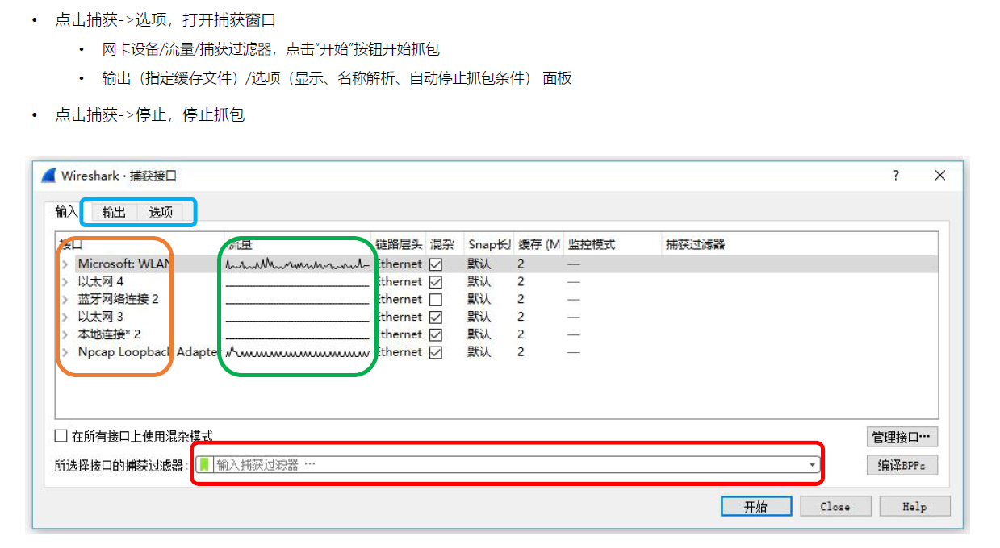

输出选项： 控制抓取报文的存储方式，存储到文件 临时

选项：自动停止抓包的条件

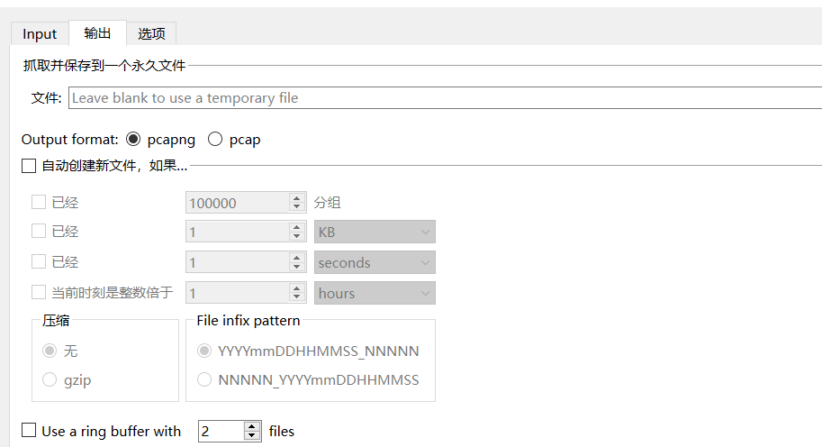

## Wireshark 面板

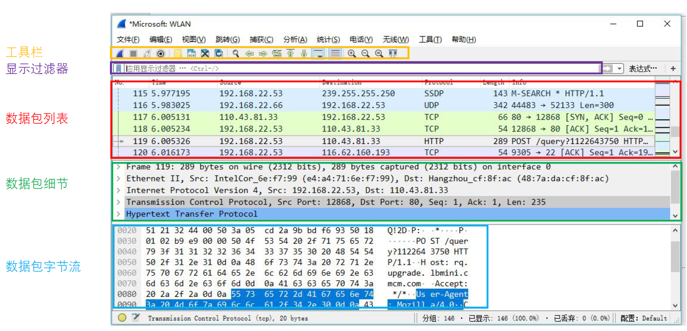

### 快捷方式工具栏

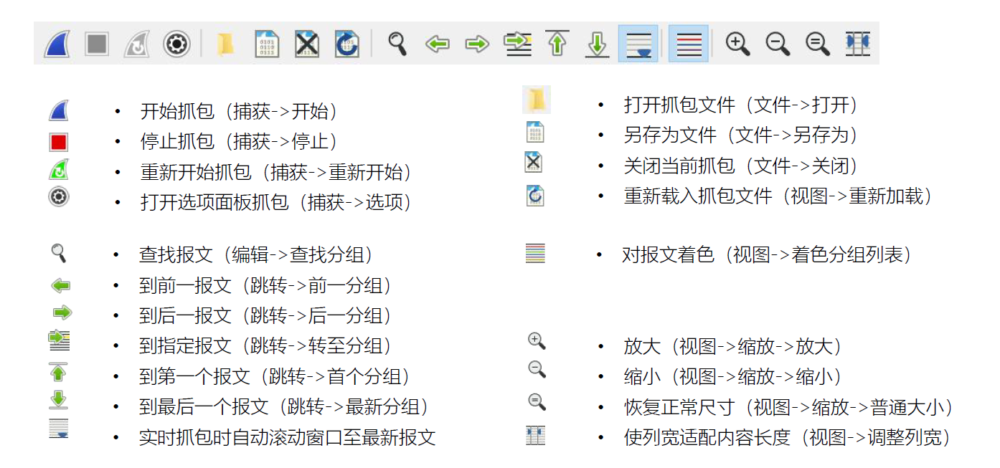

## 数据包的颜色（视图->着色规则）

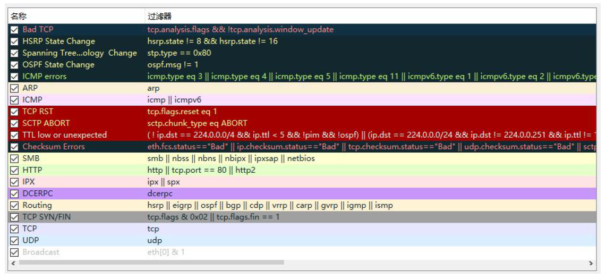

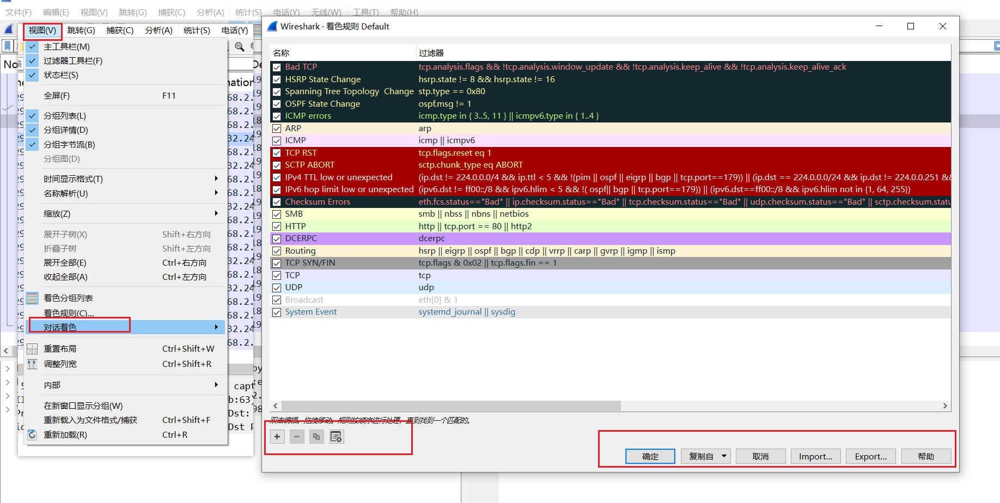

## 设定时间显示格式

#### 绝对时间/相对时间

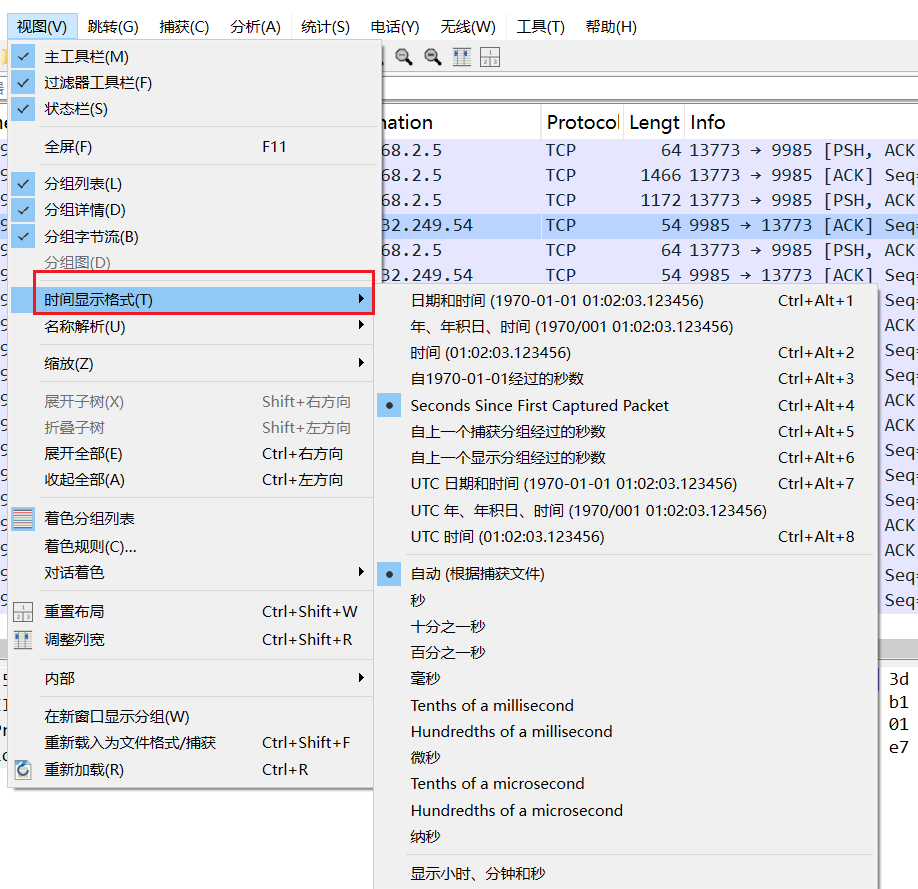

#### 设定基于某一个数据包的相对时间

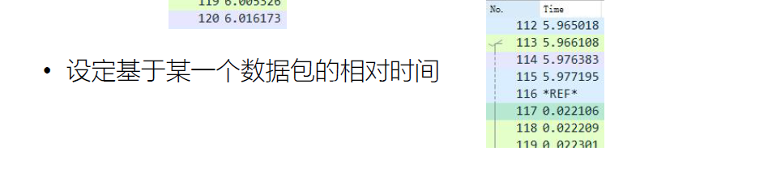

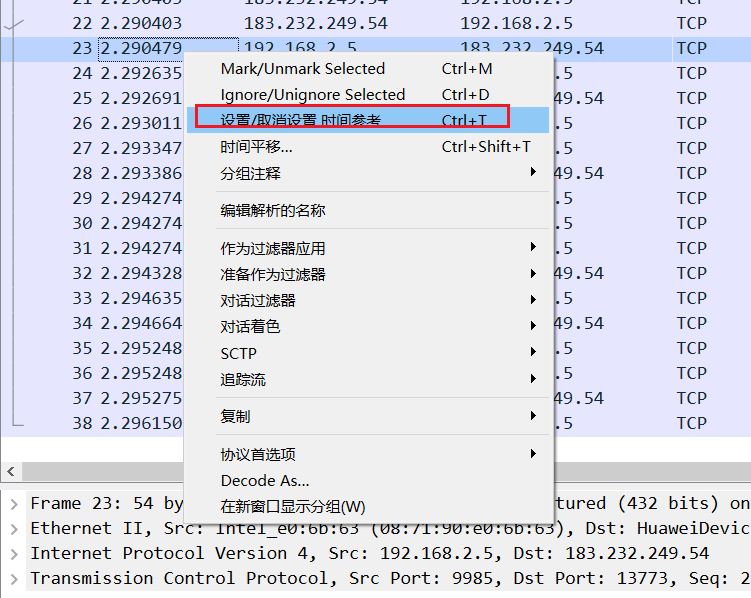

## 数据包列表面板的标记符号

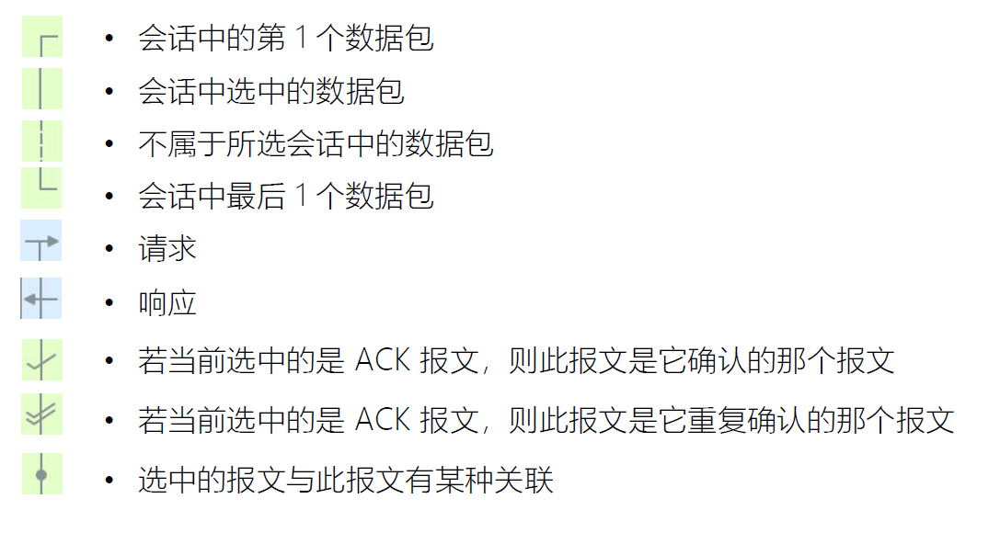

## 四种流跟踪

• TCP
• UDP
• SSL
• HTTP

## 文件操作

• 标记报文 Ctrl+M
• 导出标记报文（文件->导出特定分组），亦可按过滤器导出报文
• 合并读入多个报文（文件->合并）

## 如何快速抓取移动设备的报文？

1. 在操作系统上打开 wifi 热点
2. 手机连接 wifi 热点
3. 用 Wireshark 打开捕获->选项面板，选择 wifi 热点对应的接口设备抓包

# Wireshark 过滤器

• **捕获过滤器**
	• 用于减少抓取的报文体积
	• 使用 BPF 语法，功能相对有限

• **显示过滤器**
	• 对已经抓取到的报文过滤显示
	• 功能强大

## BPF 过滤器：Wireshark 捕获过滤器

• Berkeley Packet Filter，在设备驱动级别提供抓包过滤接口，多数抓包工具都支持此语法
• expression 表达式：由多个原语组成

### Expression 表达式

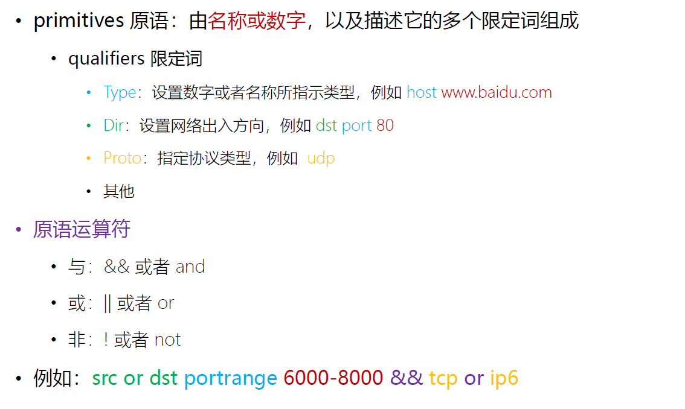

### 限定词

**Type**：设置数字或者名称所指示类型
• host、port
• net ，设定子网，net 192.168.0.0 mask 255.255.255.0 等价于 net 192.168.0.0/24
• portrange，设置端口范围，例如 portrange 6000-8000

**Dir**：设置网络出入方向
• src、dst、src or dst、src and dst
• ra、ta、addr1、addr2、addr3、addr4（仅对 IEEE 802.11 Wireless LAN 有效）

**Proto**：指定协议类型
• ether、fddi、tr、 wlan、 ip、 ip6、 arp、 rarp、 decnet、 tcp、udp、icmp、igmp、icmp、
igrp、pim、ah、esp、vrrp

**其他**

• gateway：指明网关 IP 地址，等价于 ether host ehost and not host host
• broadcast：广播报文，例如 ether broadcast 或者 ip broadcast
• multicast：多播报文，例如 ip multicast 或者 ip6 multicast
• less, greater：小于或者大于

### 基于协议域过滤

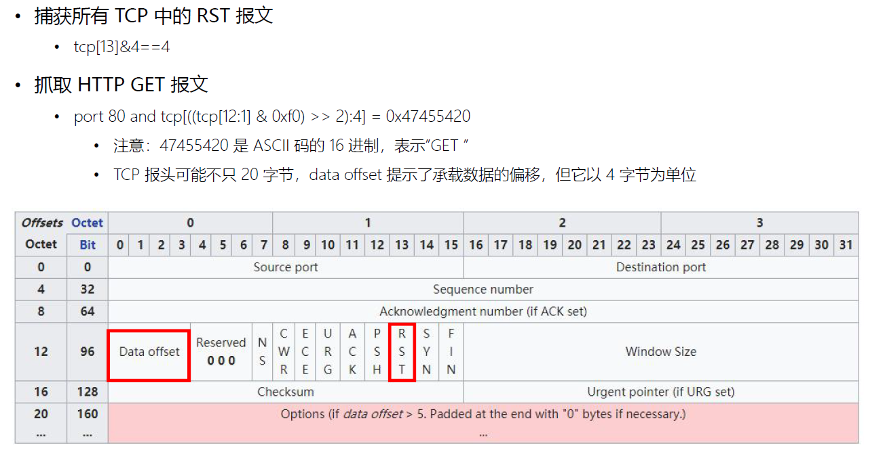

## 显示过滤器的过滤属性

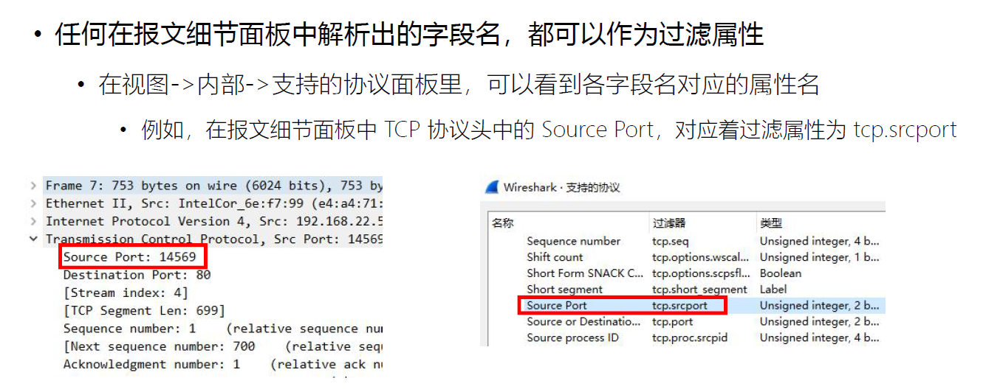

### 过滤值比较符号

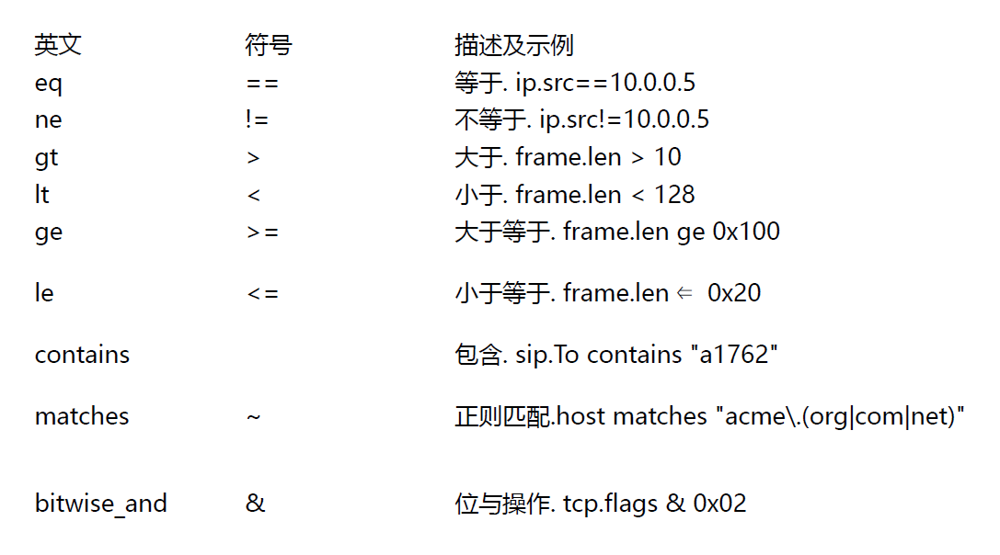

### 过滤值类型

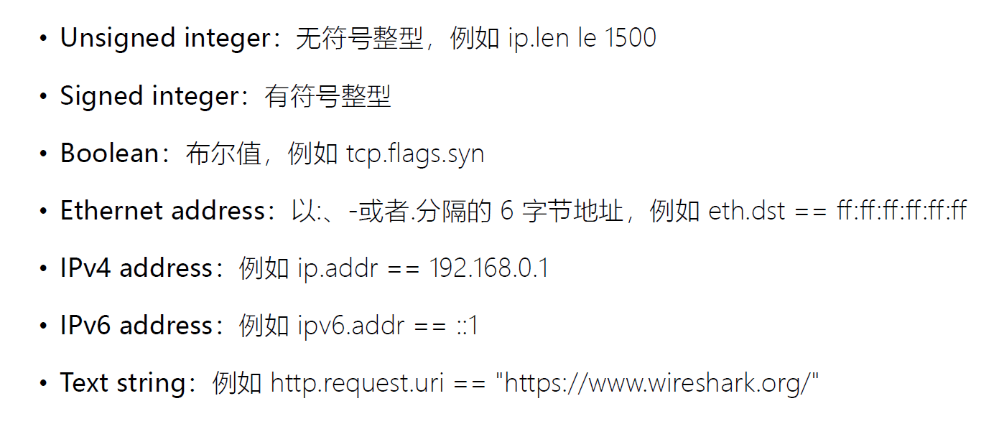

### 多个表达式间的组合

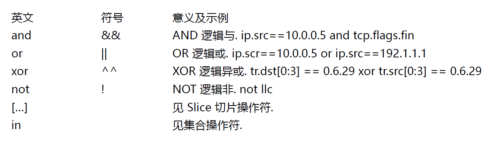

### 其他常用操作符

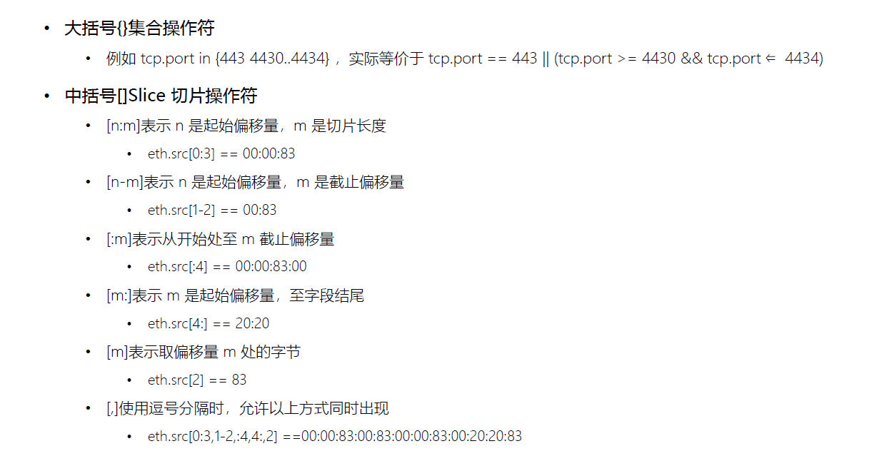

### 可用函数

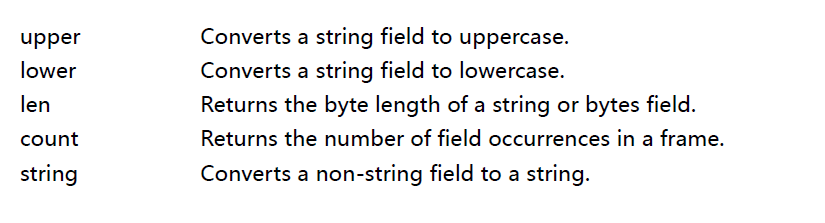

### 显示过滤器的可视化对话框

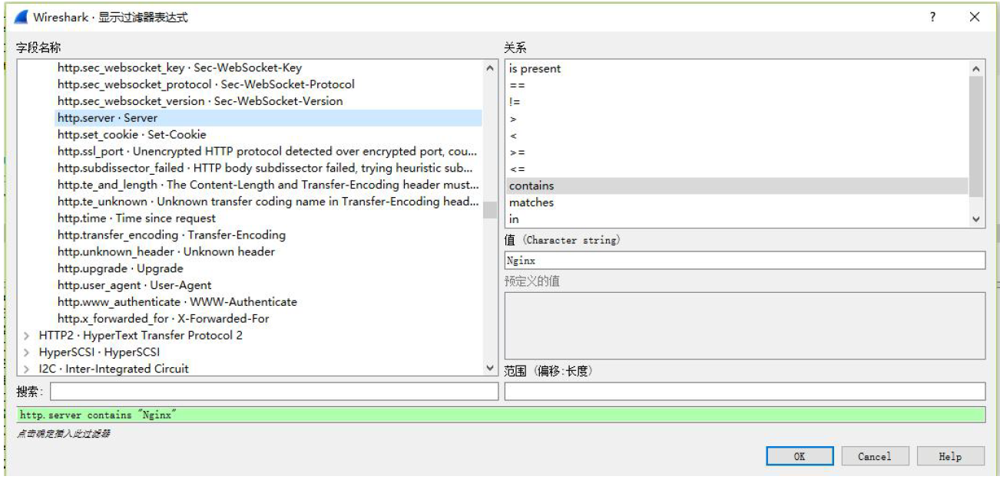