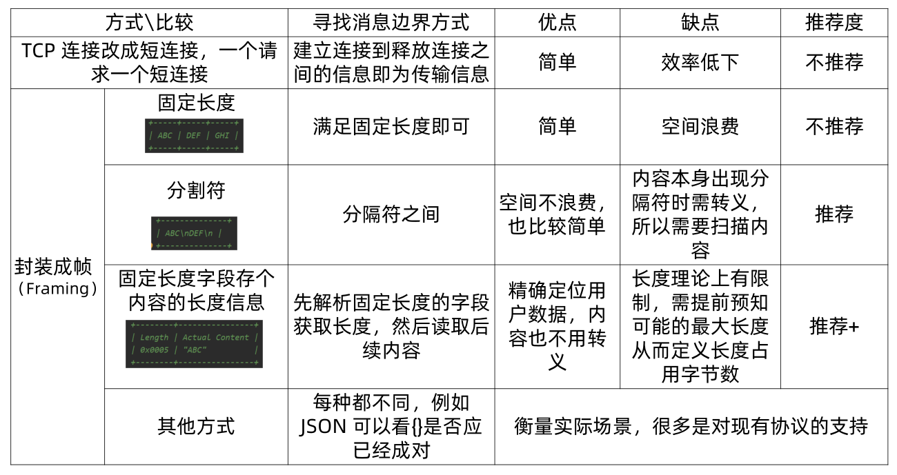
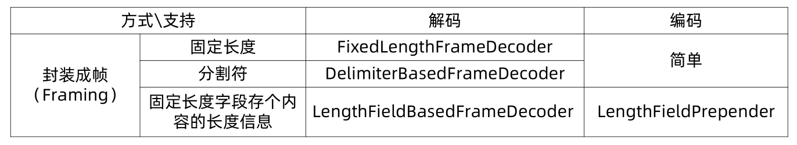
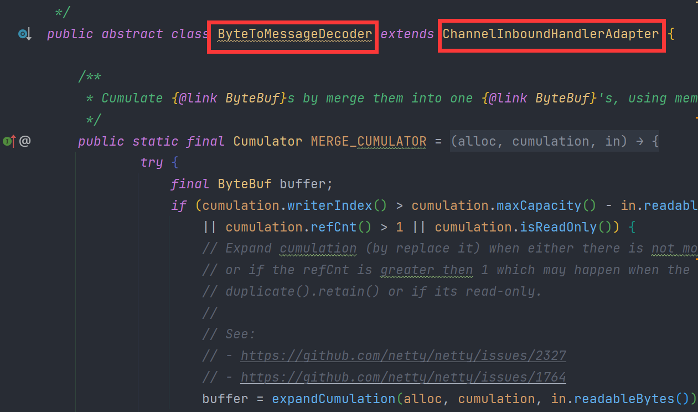
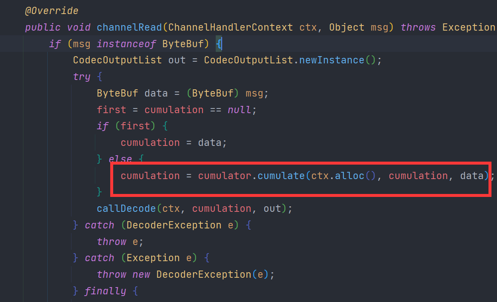

> 本文由 [简悦 SimpRead](http://ksria.com/simpread/) 转码， 原文地址 [www.sikun.top](http://www.sikun.top/archives/-si-nettyru-he-chu-li-tcpzhan-bao--ban-bao)

> 参考学习资料：

参考学习资料：

*   极客时间傅健老师的《Netty 源码剖析与实战》Talk is cheap.show me the code!
*   课程链接：[https://time.geekbang.org/course/detail/100036701-146703](https://time.geekbang.org/course/detail/100036701-146703)

#### 什么是粘包和半包？

在客户端发送数据时，实际是把数据写入到了 TCP 发送缓存里面的。

**半包**：顾名思义就是接收到半个包，如果发送的包的大小比 TCP 发送缓存的容量大，那么这个数据包就会被分成多个包，通过 socket 多次发送到服务端，服务端第一次从接受缓存里面获取的数据，实际是整个包的一部分，半包不是说只收到了全包的一半，是说收到了全包的一部分。

**粘包**：如果发送的包的大小比 TCP 发送缓存容量小，并且 TCP 缓存可以存放多个包，那么客户端和服务端的一次通信就可能传递了多个包，这时候服务端从接受缓存就可能一下读取了多个包

示例：

　　我们现在发送两条消息：“ABC”,“DEF”，那么对方接收到的消息不一定是这种格式的，对方可能一次性就接收到 “ABCDEF”, 也可能分好几次接收到 “AB”，“CD”，“EF”, 或者更为恶劣一次接收到了两个消息 “A”，“BCDEF”。那么这样一次接收两个消息的称为粘包现象，分三次四接收到多个不完整的现象是半包现象。

#### 为什么 TCP 应用中会出现粘包和半包现象？

**粘包的主要原因：**

　　发送方每次写入数据 < 套接字缓冲区大小，接收方读取套接字缓冲区数据不够及时。

**半包的主要原因：**

　　　发送方写入数据 > 套接字缓冲区大小，还有就是发送的数据大于协议的 MTU(Maximum Transmission Unit 最大传输单元) 的时候必须拆包。（MTU 其实就是 TCP 协议每层的大小）

**换个角度：**

　　收发：一个发送可能被多次接收，多次发送可能被一次接收

　　传输：一个发送可能占用多个传输包，多个发送可能公用一个传输包

**根本原因：**

　　TCP 是流动协议，消息无边界。（UDP 像邮寄的包裹，虽然一次运输多个的，但每个包裹都有 “界限”，一个一个签收，所以无粘包、半包问题）

#### 解决粘包和半包问题的几种常用方法

解决问题的根本手段：找出消息的边界



#### Netty 对三种常用封帧方式的支持

（三个类都继承 ByteTomessageDecoder.java）



#### 解读 Netty 处理粘包、半包的源码

##### 核心工作流程

先找到 ByteToMessageDecoder.java，可以看到它继承了 ChannelInboundHandlerAdapter.java



　这个 ChannelInboundHandlerAdapter 有个核心的入口方法 “channelRead()”，源码如下：

```java
@Override
    public void channelRead(ChannelHandlerContext ctx, Object msg) throws Exception {
        if (msg instanceof ByteBuf) {
            CodecOutputList out = CodecOutputList.newInstance();
            try {
                ByteBuf data = (ByteBuf) msg;
                first = cumulation == null;
                if (first) {
                    cumulation = data;
                } else {
                    cumulation = cumulator.cumulate(ctx.alloc(), cumulation, data);
                }
                callDecode(ctx, cumulation, out);
            } catch (DecoderException e) {
                throw e;
            } catch (Exception e) {
                throw new DecoderException(e);
            } finally {
                if (cumulation != null && !cumulation.isReadable()) {
                    numReads = 0;
                    cumulation.release();
                    cumulation = null;
                } else if (++ numReads >= discardAfterReads) {
                    // We did enough reads already try to discard some bytes so we not risk to see a OOME.
                    // See https://github.com/netty/netty/issues/4275
                    numReads = 0;
                    discardSomeReadBytes();
                }
 
                int size = out.size();
                firedChannelRead |= out.insertSinceRecycled();
                fireChannelRead(ctx, out, size);
                out.recycle();
            }
        } else {
            ctx.fireChannelRead(msg);
        }
    }
```

分析：

> msg 就相当于我们的数据，开始就把数据转换成 data
>
> ```java
> ByteBuf data = (ByteBuf) msg;
> ```
>
> 然后判断 cumulation 是否为 null，cumulation 是数据积累器，用来积累数据
>
> ```java
> ByteBuf cumulation;
> ```
>
> ```java
> first = cumulation == null;
> if (first) {
>  	cumulation = data;
> } else {
>   	cumulation = cumulator.cumulate(ctx.alloc(), cumulation, data);
> }
> ```
>
> 第一次的时候肯定为 null 所以 first 是 true，直接把 data 数据给了 cumulation。再接下来就是解码：
>
> ```
> callDecode(ctx, cumulation, out);
> ```

callDecode 源码如下：

```java
protected void callDecode(ChannelHandlerContext ctx, ByteBuf in, List<Object> out) {
    try {
        while (in.isReadable()) {
            int outSize = out.size();
 
            if (outSize > 0) {
                fireChannelRead(ctx, out, outSize);
                out.clear();
 
                // Check if this handler was removed before continuing with decoding.
                // If it was removed, it is not safe to continue to operate on the buffer.
                //
                // See:
                // - https://github.com/netty/netty/issues/4635
                if (ctx.isRemoved()) {
                    break;
                }
                outSize = 0;
            }
 
            int oldInputLength = in.readableBytes();
            decodeRemovalReentryProtection(ctx, in, out);
 
            // Check if this handler was removed before continuing the loop.
            // If it was removed, it is not safe to continue to operate on the buffer.
            //
            // See https://github.com/netty/netty/issues/1664
            if (ctx.isRemoved()) {
                break;
            }
 
            if (outSize == out.size()) {
                if (oldInputLength == in.readableBytes()) {
                    break;
                } else {
                    continue;
                }
            }
 
            if (oldInputLength == in.readableBytes()) {
                throw new DecoderException(
                    StringUtil.simpleClassName(getClass()) +
                    ".decode() did not read anything but decoded a message.");
            }
 
            if (isSingleDecode()) {
                break;
            }
        }
    } catch (DecoderException e) {
        throw e;
    } catch (Exception cause) {
        throw new DecoderException(cause);
    }
}
```

分析：

> 参数中的 in 就是数据积累器中的数据，也就是我们传入的数据。往下走又这么个方法调用：
> 
> ```
> decodeRemovalReentryProtection(ctx, in, out);
> ```
> 
> 需要注意的是：decode 中时，不能执行完 handler remove 清理操作，decode 完之后需要清理数据，改方法的名称长久是标识功能的。

decodeRemovalReentryProtection 源码如下：

```java
final void decodeRemovalReentryProtection(ChannelHandlerContext ctx, ByteBuf in, List<Object> out)
    throws Exception {
    decodeState = STATE_CALLING_CHILD_DECODE;
    try {
        decode(ctx, in, out);
    } finally {
        boolean removePending = decodeState == STATE_HANDLER_REMOVED_PENDING;
        decodeState = STATE_INIT;
        if (removePending) {
            handlerRemoved(ctx);
        }
    }
}
```

分析：

> 可以看出有个 decodeState = STATE_CALLING_CHILD_DECODE; 这个就是处理刚才 remove handler 的；接下来就是 “decode(ctx, in, out);”；这个 decode 是个抽象方法
> 
> ```java
> protected abstract void decode(ChannelHandlerContext ctx, ByteBuf in, List<Object> out) throws Exception;
> ```

Netty 对三种封帧的支持分别是：“FixedLengthFrameDecoder”，“DelimiterBasedFrameDecoder”，“LengthFieldBasedFrameDecoder”。这里以 “FixedLengthFrameDecoder” 为例，所以点开 FixedLengthFrameDecoder 的 decode()，源码如下：

```java
@Override
protected final void decode(ChannelHandlerContext ctx, ByteBuf in, List<Object> out) throws Exception {
    Object decoded = decode(ctx, in);
    if (decoded != null) {
        out.add(decoded);
    }
}
```

decode(ctx, in) 源码如下：

```java
protected Object decode(
    @SuppressWarnings("UnusedParameters") ChannelHandlerContext ctx, ByteBuf in) throws Exception {
    // 关键点
    if (in.readableBytes() < frameLength) {
        return null;
    } else {
        return in.readRetainedSlice(frameLength);
    }
}
```

分析：

> 这个 in 还是数据积累器的数据，取得之后进行判断，如果小于则返回 null 不能解出, 否则解出。这样一来就完成了一个数据解析的过程。

##### 两种数据积累器（Cumulator）的区别

核心工作流程中，里面有个数据积累器的存在（Cumulator），其实解码中有两种 Cumulator，那他们的区别是什么呢？

还是先打开 ByteToMessageDecoder 的 channelRead();



cumulate() 源码如下：

```java
public interface Cumulator {
        /**
         * Cumulate the given {@link ByteBuf}s and return the {@link ByteBuf} that holds the cumulated bytes.
         * The implementation is responsible to correctly handle the life-cycle of the given {@link ByteBuf}s and so
         * call {@link ByteBuf#release()} if a {@link ByteBuf} is fully consumed.
         */
        ByteBuf cumulate(ByteBufAllocator alloc, ByteBuf cumulation, ByteBuf in);
    }
```

又是一个抽象方法，看实现不难发现它有两种实现方式:


实现方式 1 为：**MERGE_CUMULATOR**（默认的）：采用的是内存复制，先扩容空间，再追加数据

```java
public static final Cumulator MERGE_CUMULATOR = new Cumulator() {
    @Override
    public ByteBuf cumulate(ByteBufAllocator alloc, ByteBuf cumulation, ByteBuf in) {
        try {
            final ByteBuf buffer;
            if (cumulation.writerIndex() > cumulation.maxCapacity() - in.readableBytes()
                || cumulation.refCnt() > 1 || cumulation.isReadOnly()) {
                // Expand cumulation (by replace it) when either there is not more room in the buffer
                // or if the refCnt is greater then 1 which may happen when the user use slice().retain() or
                // duplicate().retain() or if its read-only.
                //
                // See:
                // - https://github.com/netty/netty/issues/2327
                // - https://github.com/netty/netty/issues/1764
                buffer = expandCumulation(alloc, cumulation, in.readableBytes());
            } else {
                buffer = cumulation;
            }
            buffer.writeBytes(in);
            return buffer;
        } finally {
            // We must release in in all cases as otherwise it may produce a leak if writeBytes(...) throw
            // for whatever release (for example because of OutOfMemoryError)
            in.release();
        }
    }
};
```

实现方式 2 ：**COMPOSITE_CUMULATOR** ：不是复制而是组合，先扩容，如果数据够了的话就直接把数据给组合起来，避免了内存复制

```java
public static final Cumulator COMPOSITE_CUMULATOR = new Cumulator() {
    @Override
    public ByteBuf cumulate(ByteBufAllocator alloc, ByteBuf cumulation, ByteBuf in) {
        ByteBuf buffer;
        try {
            if (cumulation.refCnt() > 1) {
                // Expand cumulation (by replace it) when the refCnt is greater then 1 which may happen when the
                // user use slice().retain() or duplicate().retain().
                //
                // See:
                // - https://github.com/netty/netty/issues/2327
                // - https://github.com/netty/netty/issues/1764
                buffer = expandCumulation(alloc, cumulation, in.readableBytes());
                buffer.writeBytes(in);
            } else {
                CompositeByteBuf composite;
                if (cumulation instanceof CompositeByteBuf) {
                    composite = (CompositeByteBuf) cumulation;
                } else {
                    composite = alloc.compositeBuffer(Integer.MAX_VALUE);
                    composite.addComponent(true, cumulation);
                }
                composite.addComponent(true, in);
                in = null;
                buffer = composite;
            }
            return buffer;
        } finally {
            if (in != null) {
                // We must release if the ownership was not transferred as otherwise it may produce a leak if
                // writeBytes(...) throw for whatever release (for example because of OutOfMemoryError).
                in.release();
            }
        }
    }
};
```