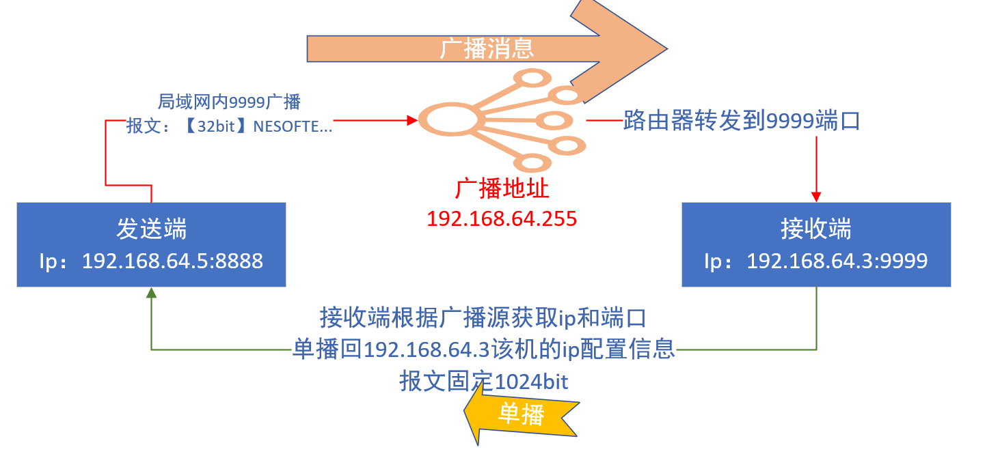
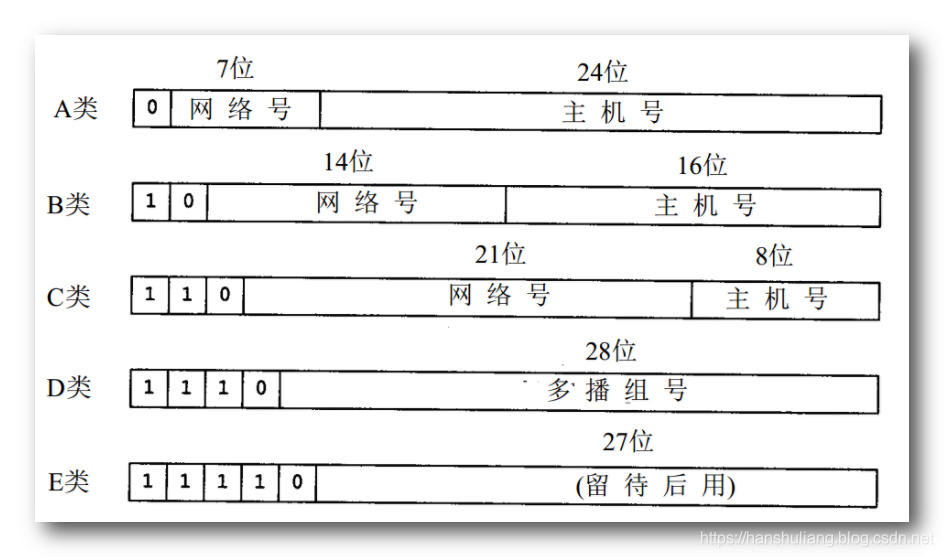
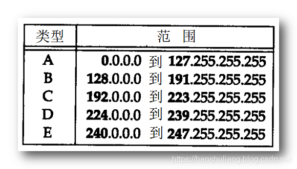
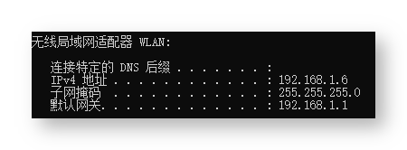

# 探测局域网内设备

注意这是发的广播信息，同一网段中其它机器都会收到这个信息（只有特殊的监听这类消息的机器会做出回应）：

```
实现探测局域网内设备

探测方：
1、发送端在192.168.64.5:8888 启动
2、启动一个线程通过本地8888端口向广播地址192.168.64.255:9999发送报文，报文固定长度32字节，内容NESOFTECHOOHCETFOSEN【自定】
3、广播消息在路由器内转发【广播消息不回跨路由器，否则会网络风暴】到该广播地址下的所有设备的9999端口，如192.168.64.3:9999
3、启动另一个线程监听其他客户端发送到192.168.64.5:8888的UDP报文

被发现方
2、接收端192.168.64.3在9999监听UDP广播报文
3、接收到消息后，解析广播源ip和端口packet.getSocketAddress()并响应，向192.168.64.5:8888单播回本机的ip
```




## SendUDP.java

```java
import java.io.BufferedReader;
import java.io.IOException;
import java.io.InputStreamReader;
import java.net.DatagramPacket;
import java.net.DatagramSocket;
import java.net.InetAddress;
import java.net.UnknownHostException;
import java.nio.ByteBuffer;

public class SendUDP {
    public static void main(String[] args) throws Exception {
        // Use this port to send broadcast packet 使用此端口发送广播数据包
        @SuppressWarnings("resource") final DatagramSocket detectSocket = new DatagramSocket(8888);
        detectSocket.setBroadcast(true);

        // Send packet thread  192.168.64.5：8888  -->192.168.64.255:9999  暴露探测方，用于告知被探测设备上报的ip和端口
        new Thread(new Runnable() {
            @Override
            public void run() {
                System.out.println("Send thread started.");
                while (true) {
                    try {

                        //获取报文内容
                        BufferedReader stdin = new BufferedReader(new InputStreamReader(System.in));
                        String outMessage = stdin.readLine();

                        if (outMessage.equals("bye"))
                            break;
                        outMessage = "NESOFTECHOOHCETFOSEN";//协议固定解析


                        // Send packet to hostAddress:9999, server that listen
                        // 9999 would reply this packet
                        // fix： 搜不到局域网IP 时排查报文长度必须大于一定值
                        int capacity = 32;
                        ByteBuffer buff = ByteBuffer.allocate(capacity);
                        buff.put(outMessage.getBytes());

                        // Broadcast address  192.168.64.255:9999
                        InetAddress hostAddress = InetAddress.getByName("192.168.64.255");
                        int packetPort = 9999;//需要与接收端ReceiveUDP监听端口一致
                        DatagramPacket out = new DatagramPacket(buff.array(), capacity, hostAddress, packetPort);
                        detectSocket.send(out);//发送到192.168.64.255:9999 路由器内广播

                        System.out.println("Send " + outMessage + " to " + hostAddress);
                    } catch (UnknownHostException e) {
                        e.printStackTrace();
                    } catch (IOException e) {
                        e.printStackTrace();
                    }
                }
            }
        }).start();

        // Receive packet thread.  192.168.64.255:9999  --》192.168.64.5：8888 接收
        new Thread(new Runnable() {
            @Override
            public void run() {
                System.out.println("Receive thread started.");
                while (true) {
                    byte[] buf = new byte[1024];
                    DatagramPacket packet = new DatagramPacket(buf, buf.length);
                    try {
                        //detectSocket.setSoTimeout(1000);//设置超时
                        detectSocket.receive(packet);
                        String rcvd = "Received from " + packet.getSocketAddress() + ", Data="
                                + new String(packet.getData(), 0, packet.getLength());
                        System.out.println(rcvd);
                    } catch (IOException e) {
                        e.printStackTrace();
                    }

                }
            }
        }).start();
    }
}
```

## ReceiveUDP.java

```java

import java.net.*;
import java.nio.ByteBuffer;
import java.util.ArrayList;
import java.util.Enumeration;
import java.util.List;

//接收端监听9999端口的UDP广播，接收到后判断是否满足协议
//满足后获取发送端ip和端口，单播回ip地址列表
public class ReceiveUDP {
    public static void main(String[] args) throws Exception {

        int listenPort = 9999;
        @SuppressWarnings("resource")
        DatagramSocket responseSocket = new DatagramSocket(listenPort);

        byte[] buf = new byte[32];
        DatagramPacket packet = new DatagramPacket(buf, buf.length);//按协议接受32个字节


        System.out.println("Server  started,  Listen  port:  " + listenPort);
        while (true) {
            responseSocket.receive(packet);//接受广播消息
            SocketAddress srcAddress = packet.getSocketAddress();//获取发送端 ip和端口

            String rcvd = "Received  "
                    + new String(packet.getData(), 0, packet.getLength())
                    + "  from  address:  " + srcAddress;
            System.out.println(rcvd);//打印广播源地址

            //  Send  a  response  packet  to  sender  上报本机ip列表  按协议填充到1024
            String backData = getIpAddress().toString();
            byte[] data = backData.getBytes();
            int receiveLen = 1024;
            ByteBuffer buffer = ByteBuffer.allocate(receiveLen);
            buffer.put(data);
            System.out.println("Send  " + backData + "  to  " + srcAddress);
            DatagramPacket backPacket = new DatagramPacket(buffer.array(), receiveLen, srcAddress);
            responseSocket.send(backPacket);
        }
    }

    public static List<String> getIpAddress() {
        List<String> ips = new ArrayList<>();
        try {
            Enumeration<NetworkInterface> allNetInterfaces = NetworkInterface.getNetworkInterfaces();
            InetAddress ip = null;
            while (allNetInterfaces.hasMoreElements()) {
                NetworkInterface netInterface = (NetworkInterface) allNetInterfaces.nextElement();
                if (netInterface.isLoopback() || netInterface.isVirtual() || !netInterface.isUp()) {
                    continue;
                } else {
                    Enumeration<InetAddress> addresses = netInterface.getInetAddresses();
                    while (addresses.hasMoreElements()) {
                        ip = addresses.nextElement();
                        if (ip != null && ip instanceof Inet4Address ) {
                            ips.add(ip.getHostName());
                        }
                    }
                }
            }
        } catch (Exception e) {
            System.err.println("IP地址获取失败" + e.toString());
        }
        return ips;
    }
}
```

## 测试

下图是 SendUDP 端【192.168.64.5】的执行截图，发送内容为 Message：

```java
Send thread started.
Receive thread started.
kk
Send NESOFTECHOOHCETFOSEN to /192.168.64.255
Received from /192.168.64.3:9999, Data=[172.17.0.1, 192.168.64.3]     
```

在 SendUDP 端发送了消息后，ReceiveUDP端【192.168.64.3】会立即显示收到消息，如下图：

```java
Server  started,  Listen  port:  9999
Received  NESOFTECHOOHCETFOSEN              from  address:  /192.168.64.5:8888
Send  [172.17.0.1, 192.168.64.3]  to  /192.168.64.5:8888
```


在**同一子网下的两台机器上运行着 ReceiveUDP**，于是机器都做出了回应。

如果将这种方式移植到 Android 手机上，可以用来探测同一 WiFi 下的其它设备（前提是这些设备上运行着类似 ReceiveUDP 的），以获取它们的 IP 地址。此后可以建立 TCP 连接，做其他的事情。有人说可以用 Ping 网段的方式来发现其它设备，但对于 Android 来说，这个方式并不可靠。因为判定消息不可达的时间难以确定。


# 理论介绍

## IP 地址分类 _ 广播 _ 广播地址运算

#### I UDP 单播 广播 多播

* * *

**1. 单播 : 两个设备之间相互通信 , 不涉及第三方的网络设备 ; 两者间通信 , 不被第三方感知 ;**

**2. 多播 (组播) : 一个设备给一组设备发送信息 , 并不是给所有的设备发送信息 ;**

**3. 广播 : 给所有设备发送信息 , 这个所有设备指的是局域网的所有设备 , 或者一定范围内的所有设备 ;**

**4. 广播局限性 : 如果某些设备一直发送广播 , 会导致网络带宽被占满 , 影响网络使用 , 因此路由器都会拒绝发送广播 ; 广播发送之后 , 一般只能在路由器内部进行广播 , 不能发送到路由器之外 , 路由器防火墙会拦截向外发送的广播 ;**

**5. 多播就是为了解决广播的局限性产生的 , 多播可以尽量少的给某一组设备精准发送信息 , 比广播要更能节省带宽 ; 多播比广播更好 ;**

#### II IP 地址类别

* * *

**IP 地址由两部分组成 : ① 网络地址 , ② 主机地址 ;**

*   **① 网络地址 : 表示当前设备处于哪个网络 ;**
*   **② 主机地址 : 表示当前设备是网络中的哪一台主机 ;**



**IP 地址分类 :**

*   **① A 类 IP 地址 : 第一个字节是网络地址 , 后面三个字节是主机地址 ;**
*   **② B 类 IP 地址 : 前两个字节是网络地址 , 后两个字节是主机地址 ;**
*   **③ C 类 IP 地址 : 前三个字节是网络地址 , 后一个字节是主机地址 ;**
*   **④ D 类 IP 地址 : 该类地址 , 专门为多播预留 , 多播比广播优越 , 也是因为有这些预留的多播地址 , 可以被所有的路由器所感知的 ;**
*   **E 类 IP 地址 : 该类地址是用于研究的实验型地址 ;**



#### III 广播地址

* * *

**1. 受限广播地址 : 255.255.255.255 是受限广播地址 , 向该地址的某端口号发送 UDP 数据包 , 只有局域网内部的设备能收到该信息 , 如果局域网内的设备对该端口进行了监听 , 那么就会收到该数据 ;**

**2. C 类网络的广播地址 : C 网广播地址格式 xxx.yyy.zzz.255 , 第一位 xxx 取值范围 192 ~ 223 , 剩下的 yyy 和 zzz 取值范围不限制 , 即 0 ~ 255 ; 在普通家庭的路由器局域网中没有设置的情况下可能是 192.168.1.255 ;**

#### IV 网络配置信息

* * *

**在 Windows 上的命令行中 , 执行 ipconfig 命令 , 会打印出相关网络的配置信息 ;**  


*   **① IPv4 地址是 : 192.168.1.6 ;**
*   **② 路由器地址 (网关地址) : 192.168.1.1 ;**
*   **③ 子网掩码 : 255.255.255.0 , 前三位都是 255 ; 最后一位取决于路由器的分配策略 , 一般情况下最后一位是 0 ,**

#### V 广播地址计算

* * *

**1. IP 地址构成 : IP 地址由 32 位构成 , 拆分成 4 个 byte 值 , 每个 8 位 , 就是三个点之间的数字 , 每个 byte 数字取值范围 0 ~ 255 ;**

**2. 广播地址运算 1 :**

*   **① IP 地址 : 192.168.1.6 , 转为二进制形式是 11000000 10101000 00000001 00000110 ;**
*   **② 子网掩码 255.255.255.0 ; 转为二进制形式是 11111111 11111111 11111111 00000000 ;**
*   **③ 计算网络地址 : IP 地址 和 子网掩码都是 32 位的二进制数组成 , 使用 IP 地址与子网掩码进行按位与操作 , 得到的就是网络地址 , 11000000 10101000 00000001 00000000 , 即 192.168.1.0 ;**
*   **④ 广播地址 : 网络地址的最后一位 , 就是广播地址 , 192.168.1.255 ;**

**3. 广播地址运算示例 2 :**

*   **① IP 地址 : 192.168.73.88 ;**
*   **② 子网掩码 : 255.255.255.192 , 这里着重说明下 , 子网掩码转为二进制后为 11111111 11111111 11111111 11000000 , 最后一位为 11000000 , 该子网掩码说明该局域网其可划分为 4 个网段 , 分别是 0 ~ 63 , 64 ~ 127 , 128 ~ 191 , 192 ~ 255 ;**
*   **③ 网络地址 : 每个网段第一位是网络地址 , 分别是 192.168.73.0 , 192.168.73.64 , 192.168.73.128 , 192.168.73.192 ; 此处 192.168.73.88 处于第二网段 64 ~ 127 网段 , 其网络地址是 192.168.73.64 ;**
*   **④ 广播地址 : 每个网段最后一位就是该网段的广播地址 , 分别是 192.168.73.63 , 192.168.73.127 , 192.168.73.191 , 192.168.73.255 ; 此处 192.168.73.88 处于第二网段 64 ~ 127 网段 , 其广播地址是 192.168.73.127 ;**

#### VI 广播通信

* * *

**广播通信 : 广播只能在本网段进行发送和接收 , 不能给其它网段发送广播 , 如上面的示例 , 子网掩码为 255.255.255.192 , 其网络有四个网段 , 分别是 0 ~ 63 , 64 ~ 127 , 128 ~ 191 , 192 ~ 255 , 网段之间是不能发送广播的 , 只能在网段内部发送广播 ; 如 192.168.73.88 是不能给 192.168.73.44 发送广播的 , 可以给 192.168.73.89 发送广播 ;**


