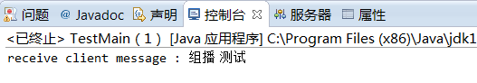

# 探测局域网内设备

注意这是发的广播信息，同一网段中其它机器都会收到这个信息（只有特殊的监听这类消息的机器会做出回应）：

```
实现探测局域网内设备

探测方：
1、发送端在192.168.64.5:8888 启动
2、启动一个线程通过本地8888端口向广播地址192.168.64.255:9999发送报文，报文固定长度32字节，内容NESOFTECHOOHCETFOSEN【自定】
3、广播消息在路由器内转发【广播消息不回跨路由器，否则会网络风暴】到该广播地址下的所有设备的9999端口，如192.168.64.3:9999
3、启动另一个线程监听其他客户端发送到192.168.64.5:8888的UDP报文

被发现方
2、接收端192.168.64.3在9999监听UDP广播报文
3、接收到消息后，解析广播源ip和端口packet.getSocketAddress()并响应，向192.168.64.5:8888单播回本机的ip
```


## SendUDP.java

```java
import java.io.BufferedReader;
import java.io.IOException;
import java.io.InputStreamReader;
import java.net.DatagramPacket;
import java.net.DatagramSocket;
import java.net.InetAddress;
import java.net.UnknownHostException;
import java.nio.ByteBuffer;

public class SendUDP {
    public static void main(String[] args) throws Exception {
        // Use this port to send broadcast packet 使用此端口发送广播数据包
        final DatagramSocket detectSocket = new DatagramSocket(8888);
        detectSocket.setBroadcast(true);

        // Send packet thread  192.168.64.5：8888  向192.168.64.255:9999 广播， 用于告知被探测设备上报的ip和端口
        new Thread(new Runnable() {
            @Override
            public void run() {
                System.out.println("Send thread started.");
                while (true) {
                    try {

                        //获取报文内容
                        BufferedReader stdin = new BufferedReader(new InputStreamReader(System.in));
                        String outMessage = stdin.readLine();

                        if (outMessage.equals("bye"))
                            break;
                        outMessage = "NESOFTECHOOHCETFOSEN";//协议固定解析


                        // Send packet to hostAddress:9999, server that listen
                        // 9999 would reply this packet
                        // fix： 搜不到局域网IP 时排查报文长度必须大于一定值
                        int capacity = 32;
                        ByteBuffer buff = ByteBuffer.allocate(capacity);
                        buff.put(outMessage.getBytes());

                        // Broadcast address  192.168.64.255:9999
                        InetAddress hostAddress = InetAddress.getByName("192.168.64.255");
                        int packetPort = 9999;//需要与接收端ReceiveUDP监听端口一致
                        DatagramPacket out = new DatagramPacket(buff.array(), capacity, hostAddress, packetPort);
                        detectSocket.send(out);//发送到192.168.64.255:9999 路由器内广播

                        System.out.println("Send " + outMessage + " to " + hostAddress);
                    } catch (UnknownHostException e) {
                        e.printStackTrace();
                    } catch (IOException e) {
                        e.printStackTrace();
                    }
                }
            }
        }).start();

        // Receive packet thread.  192.168.64.60:9999  --》192.168.64.5：8888 接收
        new Thread(new Runnable() {
            @Override
            public void run() {
                System.out.println("Receive thread started.");
                while (true) {
                    byte[] buf = new byte[1024];
                    DatagramPacket packet = new DatagramPacket(buf, buf.length);
                    try {
                        //detectSocket.setSoTimeout(1000);//设置超时
                        detectSocket.receive(packet);
                        String rcvd = "Received from " + packet.getSocketAddress() + ", Data="
                                + new String(packet.getData(), 0, packet.getLength());
                        System.out.println(rcvd);
                    } catch (IOException e) {
                        e.printStackTrace();
                    }

                }
            }
        }).start();
    }
}
```

## ReceiveUDP.java

```java
import java.net.*;
import java.nio.ByteBuffer;
import java.util.ArrayList;
import java.util.Enumeration;
import java.util.List;

//接收端监听9999端口的UDP广播，接收到后判断是否满足协议
//满足后获取发送端ip和端口，单播回ip地址列表
public class ReceiveUDP {
    public static void main(String[] args) throws Exception {

        int listenPort = 9999;
        DatagramSocket responseSocket = new DatagramSocket(listenPort);
        System.out.println("Server  started,  Listen  port:  " + listenPort);

        while (true) {
            byte[] buf = new byte[32];
            DatagramPacket packet = new DatagramPacket(buf, buf.length);//按协议接受32个字节
            responseSocket.receive(packet);//接受广播消息


            SocketAddress srcAddress = packet.getSocketAddress();//获取发送端 ip和端口

            String rcvd = "Received  "+ new String(packet.getData())+ "  from  address:  " + srcAddress;
            System.out.println(rcvd);//打印广播源地址

            //  Send  a  response  packet  to  sender  上报本机ip列表  按协议填充到1024
            String backData = getIpAddress().toString();
            byte[] data = backData.getBytes();
            int receiveLen = 1024;
            ByteBuffer buffer = ByteBuffer.allocate(receiveLen);
            buffer.put(data);
            System.out.println("Send  " + backData + "  to  " + srcAddress);
            DatagramPacket backPacket = new DatagramPacket(buffer.array(), receiveLen, srcAddress);
            responseSocket.send(backPacket);
        }
    }

    public static List<String> getIpAddress() {
        List<String> ips = new ArrayList<>();
        try {
            Enumeration<NetworkInterface> allNetInterfaces = NetworkInterface.getNetworkInterfaces();
            InetAddress ip = null;
            while (allNetInterfaces.hasMoreElements()) {
                NetworkInterface netInterface = (NetworkInterface) allNetInterfaces.nextElement();
                if (netInterface.isLoopback() || netInterface.isVirtual() || !netInterface.isUp()) {
                    continue;
                } else {
                    Enumeration<InetAddress> addresses = netInterface.getInetAddresses();
                    while (addresses.hasMoreElements()) {
                        ip = addresses.nextElement();
                        if (ip != null && ip instanceof Inet4Address) {
                            ips.add(ip.getHostName());
                        }
                    }
                }
            }
        } catch (Exception e) {
            System.err.println("IP地址获取失败" + e.toString());
        }
        return ips;
    }
}
```

## 测试

下图是 SendUDP 端【192.168.64.5】的执行截图，发送内容为 Message：

```java
Send thread started.
Receive thread started.
1
Send NESOFTECHOOHCETFOSEN to /192.168.64.255
Received from /192.168.64.1:9999, Data=[gouwenyong, gouwenyong, 192.168.2.5, gouwenyong]                                                                                             
```

在 SendUDP 端发送了消息后，ReceiveUDP端【192.168.64.3】会立即显示收到消息，如下图：

```java
Server  started,  Listen  port:  9999
Received  NESOFTECHOOHCETFOSEN              from  address:  /192.168.64.1:8888
Send  [gouwenyong, gouwenyong, 192.168.2.5, gouwenyong]  to  /192.168.64.1:8888
```


在**同一子网下的两台机器上运行着 ReceiveUDP**，于是机器都做出了回应。

如果将这种方式移植到 Android 手机上，可以用来探测同一 WiFi 下的其它设备（前提是这些设备上运行着类似 ReceiveUDP 的），以获取它们的 IP 地址。此后可以建立 TCP 连接，做其他的事情。有人说可以用 Ping 网段的方式来发现其它设备，但对于 Android 来说，这个方式并不可靠。因为判定消息不可达的时间难以确定。


# 理论介绍

## 一、通信方式分类

　　在当前的网络通信中有三种通信模式：单播、广播和多播 (组播)，其中多播出现时间最晚，同时具备单播和广播的优点。

*   单播：单台主机与单台主机之间的通信
*   广播：当台主机与网络中的所有主机通信
*   多播：当台主机与选定的一组主机的通信


 **广播地址**

1. 受限广播地址 : 255.255.255.255 是受限广播地址 , 向该地址的某端口号发送 UDP 数据包 , 只有局域网内部的设备能收到该信息 , 如果局域网内的设备对该端口进行了监听 , 那么就会收到该数据 ;

2. C 类网络的广播地址 : C 网广播地址格式 xxx.yyy.zzz.255 , 第一位 xxx 取值范围 192 ~ 223 , 剩下的 yyy 和 zzz 取值范围不限制 , 即 0 ~ 255 ; 在普通家庭的路由器局域网中没有设置的情况下可能是 192.168.1.255 ;

## 二、单播　　

单播是网络通信中最常见的，网络节点之间的通信 就好像是人们之间的对话一样。如果一个人对另外一个人说话，那么用网络技术的术语来描述就是 “单播”，此时信息的接收和传递只在两个节点之间进行。

1. 单播的优点：

(1) 服务器以及响应客户端的请求；

(2) 服务器能针对每个客户端的不同请求发送不同的响应，容易显示个性化服务；

2. 单播的缺点：

服务器针对每个客户机发送数据流，服务器流量＝客户机数量 × 客户机流量；在客户数量大、每个客户机流量大的流媒体应用中服务器不堪重负；

3. 应用场景：

单播在网络中得到了广泛的应用，网络上绝大部分的数据都 是以单播的形式传输的。例如：收发电子邮件、游览网页时，必须与邮件服务器、网站服务器建立连接，此时使用的就是单播通信方式；

### 示例代码

#### **客户端代码（UnicastClient.java）**：

```java
import java.io.IOException;
import java.net.DatagramPacket;
import java.net.DatagramSocket;
import java.net.InetAddress;
import java.net.SocketException;
import java.net.UnknownHostException;

public class UnicastClient {
    public static void main(String[] args) {
        int serverPort = 8888; // 可以考虑从外部配置文件读取
        String serverAddress = "localhost"; // 可以考虑从外部配置文件读取
        try (
            DatagramSocket clientSocket = new DatagramSocket()
        ) {
            InetAddress serverInetAddress = InetAddress.getByName(serverAddress);
    
            // 向服务器发送数据
            byte[] sendBuffer = "Hello, Server!".getBytes();
            DatagramPacket sendPacket = new DatagramPacket(sendBuffer, sendBuffer.length, serverInetAddress, serverPort);
            clientSocket.send(sendPacket);
    
            // 接收服务器的响应数据
            byte[] receiveBuffer = new byte[1024]; // 可以根据实际情况调整大小
            DatagramPacket receivePacket = new DatagramPacket(receiveBuffer, receiveBuffer.length);
            clientSocket.receive(receivePacket);
            String receivedData = new String(receivePacket.getData(), 0, receivePacket.getLength());
            System.out.println("收到服务器的响应: " + receivedData);
            
        } catch (SocketException e) {
            System.err.println("无法创建DatagramSocket: " + e.getMessage());
            e.printStackTrace();
        } catch (UnknownHostException e) {
            System.err.println("无法解析服务器地址: " + e.getMessage());
            e.printStackTrace();
        } catch (IOException e) {
            System.err.println("网络通信错误: " + e.getMessage());
            e.printStackTrace();
        }
    }
}
```

#### **服务器端代码（UnicastServer.java）**：

```java
import java.io.IOException;
import java.net.DatagramPacket;
import java.net.DatagramSocket;
import java.net.SocketException;

public class UnicastServer {
    public static void main(String[] args) {
        final int PORT = 8888;
        final int BUFFER_SIZE = 1024;
    
        try (DatagramSocket serverSocket = new DatagramSocket(PORT)) {
            System.out.println("服务器启动，等待客户端连接...");
    
            byte[] receiveBuffer = new byte[BUFFER_SIZE];
            DatagramPacket receivePacket = new DatagramPacket(receiveBuffer, receiveBuffer.length);
    
            // 接收客户端发送的数据
            serverSocket.receive(receivePacket);
            String receivedData = new String(receivePacket.getData(), 0, receivePacket.getLength());
            System.out.println("收到客户端的数据: " + receivedData);
    
            // 向客户端发送响应数据
            byte[] sendBuffer = "Hello, Client!".getBytes();
            DatagramPacket sendPacket = new DatagramPacket(sendBuffer, sendBuffer.length, receivePacket.getAddress(), receivePacket.getPort());
            serverSocket.send(sendPacket);
    
        } catch (SocketException e) {
            System.err.println("端口绑定失败: " + e.getMessage());
            e.printStackTrace();
        } catch (IOException e) {
            System.err.println("网络操作异常: " + e.getMessage());
            e.printStackTrace();
        }
    }
}
```


## 三、广播

“广播” 可以比方为：一个人通过广播喇叭对在场的全体说话 (他才不管你是否乐意听)。换句话说: 广播是一台主机对某一个网络上的所有主机发送数据报包。这个网络可能是网络，也可能是子网，还有可能是所有子网。

广播有两类：本地广播和定向广播

*   定向广播：将数据报包发送到本网络之外的特定网络的所有主机，然而，由于互联网上的大部分路由器都不转发定向广播消息，所以这里不深入介绍了
*   本地广播：将数据报包发送到本地网络的所有主机，IPv4 的本地广播地址为 “255.255.255.255”，路由器不会转发此广播；

1. 广播的优点：

(1) 通信的效率高，信息一下子就可以传递到某一个网络上的所有主机。

(2) 由于服务器不用向每个客户端单独发送数据，所以服务器流量比较负载低；

2. 广播的缺点：

(1) 非常占用网络的带宽；

(2) 缺乏针对性, 也不管主机是否真的需要接收该数据, 就强制的接收数据；

3. 应用场景：

(1) 有线电视就是典型的广播型网络

###  广播示例：

#### 客户端发送程序　　

```java
import java.io.IOException;
import java.net.DatagramPacket;
import java.net.DatagramSocket;
import java.net.InetAddress;
import java.nio.ByteBuffer;

//发送端程序
public class BroadcastClientTest {
    public static void main(String[] args) {
        //广播的实现 :由客户端发出广播，服务器端接收
        String host = "192.168.64.255";//广播地址
        int port = 1500;//广播的目的端口

        try {
            InetAddress adds = InetAddress.getByName(host);
            DatagramSocket ds = new DatagramSocket();

            //构建发送包 大小32byte
            String message = "NESOFTECHOOHCETFOSEN";
            int capacity = 32;
            ByteBuffer buffer = ByteBuffer.allocate(capacity);
            buffer.put(message.getBytes());
            DatagramPacket dp = new DatagramPacket(buffer.array(), capacity, adds, port);

            // 发送
            new Thread(() -> {
                for (int i = 0; i < 10; i++) {
                    try {
                        ds.send(dp);
                        Thread.sleep(5000);
                    } catch (Exception e) {
                        throw new RuntimeException(e);
                    }
                }

            }).start();


            //等待回复
            new Thread(() -> {

                while (true) {
                    byte[] buffer2 = new byte[32];
                    DatagramPacket dp2 = new DatagramPacket(buffer2, buffer2.length);
                    try {
                        ds.receive(dp2);
                        System.out.println("收到回复：" + new String(dp2.getData()));
                    } catch (IOException e) {
                        throw new RuntimeException(e);
                    }
                }
            }).start();


//            ds.close();
        } catch (Exception e) {
            e.printStackTrace();
        }
    }
}
```

#### 服务器端接收程序

```java
import java.io.IOException;
import java.net.DatagramPacket;
import java.net.DatagramSocket;
import java.net.InetAddress;
import java.nio.charset.StandardCharsets;

//服务器端接收程序
public class BroadcastServerTest {
    public static void main(String[] args) {
        int port = 1500; // 开启监听的端口
    
        try (DatagramSocket ds = new DatagramSocket(port)) { // 使用 try-with-resources 确保资源被关闭
            System.out.println("监听1500广播端口打开：");
    
            while (true) {
                // 接受广播
                byte[] buf = new byte[32]; // 存储发来的消息
                DatagramPacket dp = new DatagramPacket(buf, buf.length);
                ds.receive(dp);
                System.out.println("收到广播消息：" + new String(buf, StandardCharsets.UTF_8)); // 明确指定字符集
    
                // 回复消息
                InetAddress address = dp.getAddress();
                String hostName = address.getHostName();
                System.out.println("IP地址：" + address.getHostAddress());
                int clientPort = dp.getPort();
                System.out.println("clientPort = " + clientPort);
    
                byte[] sendBuffer = "Hello, Client!".getBytes(StandardCharsets.UTF_8); // 明确指定字符集
                DatagramPacket sendPacket = new DatagramPacket(sendBuffer, sendBuffer.length, address, clientPort); // 使用实际数据长度
                ds.send(sendPacket);
            }
    
        } catch (IOException e) {
            System.err.println("发生错误：" + e.getMessage()); // 提供更详细的错误信息
            e.printStackTrace(); // 打印堆栈跟踪
        }
    }
}
```

## 四、多播 (组播)

　　”组播 “可以比方为：你对着大街喊：” 是男人的来一下，一人发一百块”，那么男的过来，女就不会过来, 因为没有钱发她不理你(组播：其中所有的男生就是一个组)，换句话说: 组播是一台主机向指定的一组主机发送数据报包，因为如果采用单播方式，逐个节点传输，有多少个目标节点，就会有多少次传送过程，这种方式显然效率极低，是不可取的；如果采用不区分目标、全部发送的广播方式，虽然一次可以传送完数据，但是显然达不到区分特定数据接收对象的目的，又会占用网络带宽。采用组播方式，既可以实现一次传送所有目标节点的数据，也可以达到只对特定对象传送数据的目的。

IP 网络的组播一般通过组播 IP 地址来实现。组播 IP 地址就是 D 类 IP 地址，即 224.0.0.0 至 239.255.255.255 之间的 IP 地址。

1. 组播的优点：

(1) 具备广播所具备的所有优点；

(2) 与单播相比，提供了发送数据报包的效率，与广播相比，减少了网络流量；

2. 组播的缺点：

(1) 与单播协议相比没有纠错机制，发生丢包错包后难以弥补，但可以通过一定的容错机制和 QOS 加以弥补；

### 组播的简单示例：

#### 客户端发送消息

```java
//发送端程序
public class SendUdp
{
    public static void main(String[] args) throws IOException
    {
        MulticastSocket ms=null; 
        DatagramPacket dataPacket = null; 
        ms = new MulticastSocket();
        ms.setTimeToLive(32);  
        //将本机的IP（这里可以写动态获取的IP）地址放到数据包里，其实server端接收到数据包后也能获取到发包方的IP的  
         byte[] data = "组播 测试".getBytes();   
         InetAddress address = InetAddress.getByName("239.0.0.255");   
         dataPacket = new DatagramPacket(data, data.length, address,8899);  
         ms.send(dataPacket);  
         ms.close();   
    }
}
```

#### 服务器端接收程序：

```java
//服务器端程序
public class TestMain
{
    private static MulticastSocket ds;  
    static String multicastHost="239.0.0.255";  
    static InetAddress receiveAddress; 
    public static void main(String[] args) throws IOException
    {
        ds = new MulticastSocket(8899);  
        receiveAddress=InetAddress.getByName(multicastHost);  
        ds.joinGroup(receiveAddress);  
        new Thread(new udpRunnable(ds)).start();  
    }
}
    class udpRunnable implements Runnable
    {
        MulticastSocket ds;
        public udpRunnable(MulticastSocket ds)
        {
            this.ds=ds;
        }
        public void run()
        {
             byte buf[] = new byte[1024];  
             DatagramPacket dp = new DatagramPacket(buf, 1024);  
             while (true) 
             {  
                    try
                    {  
                        ds.receive(dp);  
                        System.out.println("receive client message : "+new String(buf, 0, dp.getLength()));  
                    } 
                    catch (Exception e) 
                    {  
                        e.printStackTrace();  
                    }  
                }  
            
        }
}
```


　　运行结果截图：

　　


## IP 地址分类 _ 广播 _ 广播地址运算

#### 1. UDP 单播 广播 多播

* * *

1. 单播 : 两个设备之间相互通信 , 不涉及第三方的网络设备 ; 两者间通信 , 不被第三方感知 ;

2. 多播 (组播) : 一个设备给一组设备发送信息 , 并不是给所有的设备发送信息 ;

3. 广播 : 给所有设备发送信息 , 这个所有设备指的是局域网的所有设备 , 或者一定范围内的所有设备 ;

4. 广播局限性 : 如果某些设备一直发送广播 , 会导致网络带宽被占满 , 影响网络使用 , 因此路由器都会拒绝发送广播 ; 广播发送之后 , 一般只能在路由器内部进行广播 , 不能发送到路由器之外 , 路由器防火墙会拦截向外发送的广播 ;

5. 多播就是为了解决广播的局限性产生的 , 多播可以尽量少的给某一组设备精准发送信息 , 比广播要更能节省带宽 ; 多播比广播更好 ;

#### 2. IP 地址类别

* * *

IP 地址由两部分组成 : ① 网络地址 , ② 主机地址 ;

*   ① 网络地址 : 表示当前设备处于哪个网络 ;
*   ② 主机地址 : 表示当前设备是网络中的哪一台主机 ;


IP 地址分类 :

*   ① A 类 IP 地址 : 第一个字节是网络地址 , 后面三个字节是主机地址 ;
*   ② B 类 IP 地址 : 前两个字节是网络地址 , 后两个字节是主机地址 ;
*   ③ C 类 IP 地址 : 前三个字节是网络地址 , 后一个字节是主机地址 ;
*   ④ D 类 IP 地址 : 该类地址 , 专门为多播预留 , 多播比广播优越 , 也是因为有这些预留的多播地址 , 可以被所有的路由器所感知的 ;
*   E 类 IP 地址 : 该类地址是用于研究的实验型地址 ;


#### 3. 网络配置信息

* * *

在 Windows 上的命令行中 , 执行 ipconfig 命令 , 会打印出相关网络的配置信息 ;  
① IPv4 地址是 : 192.168.1.6 ;

*   ② 路由器地址 (网关地址) : 192.168.1.1 ;
*   ③ 子网掩码 : 255.255.255.0 , 前三位都是 255 ; 最后一位取决于路由器的分配策略 , 一般情况下最后一位是 0 ,

#### 4. 广播地址计算

* * *

1. IP 地址构成 : IP 地址由 32 位构成 , 拆分成 4 个 byte 值 , 每个 8 位 , 就是三个点之间的数字 , 每个 byte 数字取值范围 0 ~ 255 ;

2. 广播地址运算 1 :

*   ① IP 地址 : 192.168.1.6 , 转为二进制形式是 11000000 10101000 00000001 00000110 ;
*   ② 子网掩码 255.255.255.0 ; 转为二进制形式是 11111111 11111111 11111111 00000000 ;
*   ③ 计算网络地址 : IP 地址 和 子网掩码都是 32 位的二进制数组成 , 使用 IP 地址与子网掩码进行按位与操作 , 得到的就是网络地址 , 11000000 10101000 00000001 00000000 , 即 192.168.1.0 ;
*   ④ 广播地址 : 网络地址的最后一位 , 就是广播地址 , 192.168.1.255 ;

3. 广播地址运算示例 2 :

*   ① IP 地址 : 192.168.73.88 ;
*   ② 子网掩码 : 255.255.255.192 , 这里着重说明下 , 子网掩码转为二进制后为 11111111 11111111 11111111 11000000 , 最后一位为 11000000 , 该子网掩码说明该局域网其可划分为 4 个网段 , 分别是 0 ~ 63 , 64 ~ 127 , 128 ~ 191 , 192 ~ 255 ;
*   ③ 网络地址 : 每个网段第一位是网络地址 , 分别是 192.168.73.0 , 192.168.73.64 , 192.168.73.128 , 192.168.73.192 ; 此处 192.168.73.88 处于第二网段 64 ~ 127 网段 , 其网络地址是 192.168.73.64 ;
*   ④ 广播地址 : 每个网段最后一位就是该网段的广播地址 , 分别是 192.168.73.63 , 192.168.73.127 , 192.168.73.191 , 192.168.73.255 ; 此处 192.168.73.88 处于第二网段 64 ~ 127 网段 , 其广播地址是 192.168.73.127 ;

#### **5. 广播通信**

* * *

广播通信 : 广播只能在本网段进行发送和接收 , 不能给其它网段发送广播 , 如上面的示例 , 子网掩码为 255.255.255.192 , 其网络有四个网段 , 分别是 0 ~ 63 , 64 ~ 127 , 128 ~ 191 , 192 ~ 255 , 网段之间是不能发送广播的 , 只能在网段内部发送广播 ; 如 192.168.73.88 是不能给 192.168.73.44 发送广播的 , 可以给 192.168.73.89 发送广播 ;


