# Netty介绍和应用场景

要求已经掌握了Java编程，主要技术构成：Java OOP编程、Java多线程编程、JavaIO编程、Java网络编程、常用的Java设计模式（比如观察者模式，命令模式，职责链模式）、常用的数据结构（比如链表）


## 1.2 Netty的介绍

1）Netty是由JBOSS提供的一个Java开源框架，现为Github上的独立项目。
2）Netty是一个异步的、基于事件驱动的网络应用框架，用以快速开发高性能、高可靠性的网络IO程序。


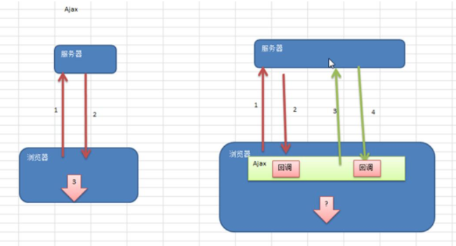

3）Netty主要针对在TCP协议下，面向Clients端的高并发应用，或者Peer-to-Peer场景下的大量数据持续传输的应用。

4）Netty本质是一个NIO框架，适用于服务器通讯相关的多种应用场景

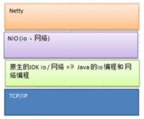

5）要透彻理解Netty，需要先学习NIO，这样我们才能阅读Netty的源码。

## 1.3 Netty的应用场景

### 1.3.1互联网行业

1）互联网行业：在分布式系统中，各个节点之间需要远程服务调用，高性能的RPC框架必不可少，Netty作为异步高性能的通信框架，往往作为基础通信组件被这些RPC框架使用。
2）典型的应用有：阿里分布式服务框架Dubbo的RPC框架使用Dubbo协议进行节点间通信，Dubbo协议默认使用Netty作为基础通信组件，用于实现各进程节点之间的内部通信

### 1.3.2游戏行业

1）无论是手游服务端还是大型的网络游戏，Java语言得到了越来越广泛的应用

2）Netty作为高性能的基础通信组件，提供 TCPUDP和HTTP协议栈，方便定制和开发私有协议栈，账号登录服务器
3）地图服务器之间可以方便的通过Netty进行高性能的通信

### 1.3.3大数据领域

1）经典的Hadoop的高性能通信和序列化组件Avro的RPC框架，默认采用Netty进行跨界点通信

2）它的Netty Service基于Netty框架二次封装实现。

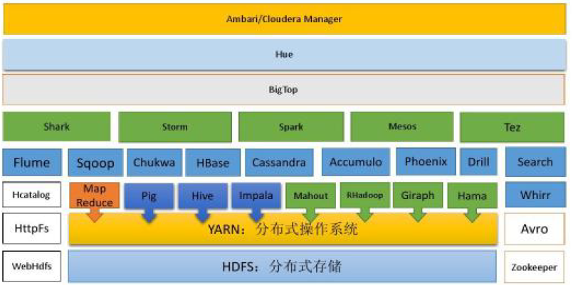

## 1.3.4其它开源项目使用到Netty

https://netty.io/wiki/related-projects.html

## 1.4Netty的学习参考资料


# BIO编程

## I/O模型

### I/O 模型基本说明

1) I/O 模型简单的理解：就是用什么样的通道进行数据的发送和接收，很大程度上决定了程序通信的性能
2) Java共支持3种网络编程模型/IO模式：BIO、NIO、AIO
3) Java `BIO` ： 同步并阻塞(**传统阻塞型**)，服务器实现模式为一个连接一个线程，即客户端有连接请求时服务器端就需要启动一个线程进行处理，如果这个连接不做任何事情会造成不必要的线程开销 【简单示意图】

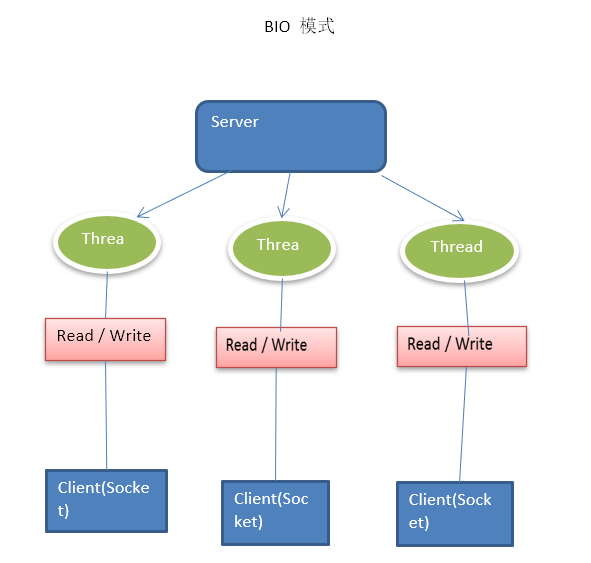

4) Java `NIO` ： **同步非阻塞**，服务器实现模式为一个线程处理多个请求(连接)，即客户端发送的连接请求都会注册到多路复用器上，多路复用器轮询到连接有I/O请求就进行处理
【简单示意图】

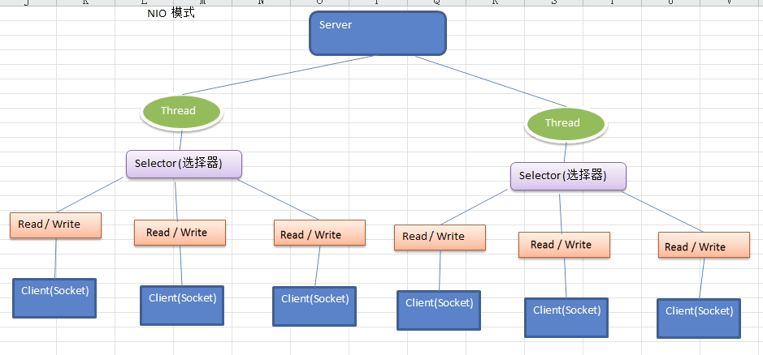

5) Java `AIO`(NIO.2) ： **异步非阻塞**，AIO 引入异步通道的概念，采用了 Proactor 模式，简化了程序编写，对于有效的请求才启动线程，它的特点是先由操作系统完成后才通知服务端程序启动线程去处理，一般适用于连接数较多且连接时间较长的应用

## BIO、NIO、AIO适用场景分析

1) BIO方式适用于**连接数目比较小且固定的架构**，这种方式对服务器资源要求比较高，并发局限于应用中，JDK1.4以前的唯一选择，但程序简单易理解。

2) NIO方式适用于**连接数目多且连接比较短**（轻操作）的架构，比如聊天服务器，弹幕系统，服务器间通讯等。编程比较复杂，JDK1.4开始支持。

3) AIO方式使用于**连接数目多且连接比较长**（重操作）的架构，比如相册服务器，充分调用OS参与并发操作，编程比较复杂，JDK7开始支持。【目前没有得到广泛应用】

## Java BIO 基本介绍

1) Java BIO 就是**传统的java io 编程**，其相关的类和接口在 `java.io`

2) `BIO(blocking I/O)` ： **同步阻塞**，服务器实现模式为一个连接一个线程，即客户端有连
接请求时服务器端就需要启动一个线程进行处理，如果这个连接不做任何事情会造
成不必要的线程开销，可以通过**线程池机制改善**(实现多个客户连接服务器)。 

3) BIO方式适用于连接数目比较小且固定的架构，这种方式对服务器资源要求比较高，
并发局限于应用中，JDK1.4以前的唯一选择，程序简单易理解

### Java BIO 工作机制

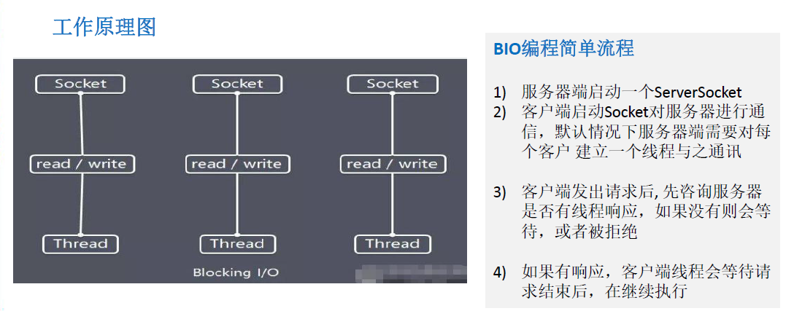


###  Java BIO应用实例

实例说明：
1）使用BIO模型编写一个服务器端，监听6666端口，当有客户端连接时，就启动一个线程与之通讯。

2）要求使用线程池机制改善，可以连接多个客户端.

3）服务器端可以接收客户端发送的数据（telnet方式即可）

4）代码演示

```java
import java.io.IOException;
import java.io.InputStream;
import java.net.ServerSocket;
import java.net.Socket;
import java.util.concurrent.ExecutorService;
import java.util.concurrent.Executors;

public class BioServer {

//线程池机制
//思路
//1.创建一个线程池
//2．如果有客户端连接，就创建一个线程，与之通讯（单独写一个方法）

    public static void main(String[] args) throws IOException {
        ExecutorService newCachedThreadPool = Executors.newCachedThreadPool();
        ServerSocket server = new ServerSocket(6666);
        System.out.println("服务器启动...");
        while (true) {
            System.out.println("线程信息" + Thread.currentThread().getName() + "\t" + Thread.currentThread().getId());
            //监听等待客户端连接
            System.out.println("等待连接...");//检测accept是阻塞的
            Socket socket = server.accept();
            System.out.println("连接到一个客户端...");
            //创建一个线程，与之通讯
            newCachedThreadPool.execute(new Runnable() {
                @Override
                public void run() {
                    handle(socket);
                }
            });

        }
    }

    //编写一个handler方法，和客户端通讯
    public static void handle(Socket socket) {
        System.out.println("线程信息" + Thread.currentThread().getName() + "\t" + Thread.currentThread().getId());
        byte[] bytes = new byte[1024];
        //通过socket获取输入流，
        try {
            InputStream inputStream = socket.getInputStream();
            int len = 0;
            //循环的读取客户端发送的数据
            while (true) {
                System.out.println("read...");//检测read是阻塞的
                len = inputStream.read(bytes);
                if (len!= -1) {
                    String s = new String(bytes, 0, len);
                    System.out.println(s);
                }else {
                    break;
                }
            }
        } catch (IOException e) {
            e.printStackTrace();
        } finally {
            try {
                socket.close();
            } catch (IOException e) {
                e.printStackTrace();
            }
            System.out.println("关闭client连接");
        }

    }
}

```

使用`telnet 127.0.0.1 6666`模拟客户端进行测试


### Java BIO 问题分析

1) 每个请求都需要创建独立的线程，与对应的客户端进行数据Read，业务处理，数据 Write 。
2) 当并发数较大时，需要**创建大量线程来处理连接**，系统资源占用较大。
3) 连接建立后，如果当前线程暂时没有数据可读，则线程就阻塞在 Read 操作上，造成线程资源浪费

# Java NIO编程

## Java NIO 基本介绍

1) Java NIO 全称 **java non-blocking IO**，是指 JDK 提供的新API。从 JDK1.4 开始，Java 提供了一系列改进的输入/输出的新特性，被统称为 NIO(即 New IO)，是**同步非阻塞**的

2) NIO 相关类都被放在 `java.nio` 包及子包下，并且对原 java.io包中的很多类进行改写。

3) NIO 有三大核心部分：`Selector(选择器)，Channel(通道)，Buffer(缓冲区)`

4) NIO是 面向**缓冲区** **，或者面向块** 编程的。数据读取到一个它稍后处理的缓冲区，需要时可在缓冲区中前后移动，这就增加了处理过程中的灵活性，使用它可以提供非阻塞式的高伸缩性网络

5) Java NIO的非阻塞模式，使一个线程从某通道发送请求或者读取数据，但是它仅能得到目前可用的数据，如果目前没有数据可用时，就什么都不会获取，**而不是保持线程阻塞**，所以直至数据变的可以读取之前，该线程可以继续做其他的事情。 非阻塞写也是如此，一个线程请求写入一些数据到某通道，但不需要等待它完全写入，这个线程同时可以去做别的事情。

6) 通俗理解：NIO是可以做到用一个线程来处理多个操作的。假设有10000个请求过来,根据实际情况，可以分配50或者100个线程来处理。不像之前的阻塞IO那样，非得分配10000个。

7) HTTP2.0使用了多路复用的技术，做到同一个连接并发处理多个请求，而且并发请求的数量比HTTP1.1大了好几个数量级。


8) 案例说明NIO的Buffer

```java
import java.nio.IntBuffer;

public class BasicBuffer {

    public static void main(String[] args) {
        //举例说明Buffer的使用（简单说明）
        //创建一个Buffer，大小为5，即可以存放5个int
        IntBuffer intBuffer = IntBuffer.allocate(5);

        //循环向buffer存放数据
        for (int i = 0; i < intBuffer.capacity(); i++) {
            intBuffer.put(10+i);
        }

        //如何从buffer读取数据
        intBuffer.flip(); //将buffer转换，读写切换

        while (intBuffer.hasRemaining()){
            System.out.println(intBuffer.get());
        }

    }
}
```

## NIO 和 BIO 的比较

1) BIO 以流的方式处理数据,而 NIO 以块的方式处理数据,块 I/O 的效率比流 I/O 高很多

2) BIO 是阻塞的，NIO 则是非阻塞的

3) BIO基于字节流和字符流进行操作，而 NIO 基于 Channel(通道)和 Buffer(缓冲区)进行操作，数据总是从通道读取到缓冲区中，或者从缓冲区写入到通道中。
Selector(选择器)用于监听多个通道的事件（比如：连接请求，数据到达等），因此使用**单个线程就可以监听多个客户端通**道

## NIO 三大核心原理示意图

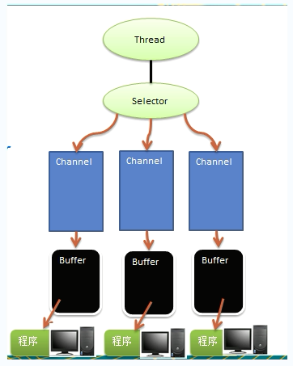


Selector 、 Channel 和 Buffer 的关系图(简单版)关系图的说明:
1) 每个channel 都会对应一个Buffer

2) Selector 对应一个线程， 一个线程对应多个channel(连接)

3) 该图反应了有三个channel 注册到 该selector //程序

4) 程序切换到哪个channel ，是由事件决定的, Event 就是一个重要的概念

5) Selector 会根据不同的事件，在各个通道上切换

6) Buffer 就是一个内存块 ， 底层是有一个数组

7) 数据的读取写入是通过Buffer, 这个和BIO , BIO 中要么是输入流，或者是输出流, 不能双向，但是NIO的Buffer 是可以读也可以写, 需要 `flip()` 方法切换

8) channel 是双向的, 可以返回底层操作系统的情况, 比如Linux ， 底层的操作系统通道就是双向的.

## 缓冲区(Buffer)

### 基本介绍

缓冲区（Buffer）：缓冲区本质上是一个可以读写数据的内存块，可以理解成是一个**容器对象(含数组)**，该对象提供了**一组方法**，可以更轻松地使用内存块，，缓冲区对象内置了一些机制，能够跟踪和记录缓冲区的状态变化情况。Channel 提供从文件、网络读取数据的渠道，但是读取或写入的数据都必须经由 Buffer，如图: 

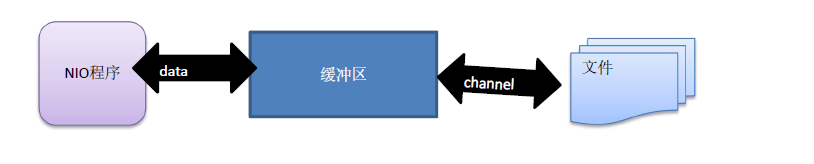

### Buffer 类及其子类

1) 在 NIO 中，Buffer 是一个顶层父类，它是一个抽象类, 类的层级关系图:

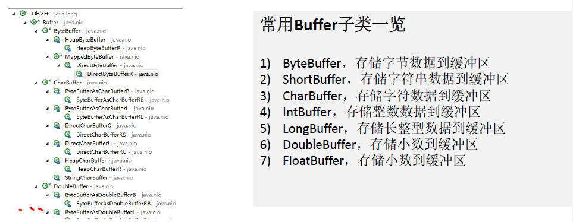

2) Buffer类定义了所有的缓冲区都具有的四个属性来提供关于其所包含的数据元素的信息:

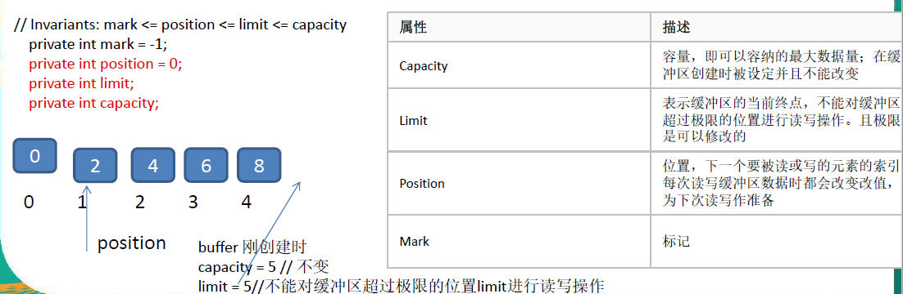


3) Buffer类相关方法一览

```java
public abstract class Buffer {
    //JDK1.4时，引入的api
    public final int capacity( )//返回此缓冲区的容量**
    public final int position( )//返回此缓冲区的位置**
    public final Buffer position (int newPositio)//设置此缓冲区的位置**
    public final int limit( )//返回此缓冲区的限制**
    public final Buffer limit (int newLimit)//设置此缓冲区的限制**
    public final Buffer mark( )//在此缓冲区的位置设置标记
    public final Buffer reset( )//将此缓冲区的位置重置为以前标记的位置
    public final Buffer clear( )//清除此缓冲区, 即将各个标记恢复到初始状态，但是数据并没真正擦除**
    public final Buffer flip( )//反转此缓冲区**
    public final Buffer rewind( )//重绕此缓冲区
    public final int remaining( )//返回当前位置与限制之间的元素数
    public final boolean hasRemaining( )//告知在当前位置和限制之间是否有元素**
    public abstract boolean isReadOnly( );//告知此缓冲区是否为只读缓冲区**

    //JDK1.6时引入的api
    public abstract boolean hasArray();//告知此缓冲区是否具有可访问的底层实现数组**
    public abstract Object array();//返回此缓冲区的底层实现数组**
    public abstract int arrayOffset();//返回此缓冲区的底层实现数组中第一个缓冲区元素的偏移量
    public abstract boolean isDirect();//告知此缓冲区是否为直接缓冲区
}
```

### ByteBuffer

从前面可以看出对于 Java 中的基本数据类型(boolean除外)，都有一个 Buffer 类型与之相对应，**最常用**的自然是`ByteBuffer` 类（二进制数据），该类的主要方法如下：

```java
public abstract class ByteBuffer {
    //缓冲区创建相关api
    public static ByteBuffer allocateDirect(int capacity)//创建直接缓冲区**
    public static ByteBuffer allocate(int capacity)//设置缓冲区的初始容量**
    public static ByteBuffer wrap(byte[] array)//把一个数组放到缓冲区中使用
    //构造初始化位置offset和上界length的缓冲区
    public static ByteBuffer wrap(byte[] array,int offset, int length)
    //缓存区存取相关API
    public abstract byte get( );//从当前位置position上get，get之后，position会自动+1 **
    public abstract byte get (int index);//从绝对位置get **
    public abstract ByteBuffer put (byte b);//从当前位置上添加，put之后，position会自动+1 **
    public abstract ByteBuffer put (int index, byte b);//从绝对位置上put **
}
```

## 通道(Channel)

### 基本介绍

1) NIO的通道类似于流，但有些区别如下：
	• 通道可以同时进行读写，而流只能读或者只能写
	• 通道可以实现异步读写数据
	• 通道可以从缓冲读数据，也可以写数据到缓冲:


2) BIO 中的 stream 是单向的，例如 FileInputStream 对象只能进行读取数据的操作，而 NIO 中的通道(Channel)是双向的，可以读操作，也可以写操作。

3) Channel在NIO中是一个接口`public interface Channel extends Closeable{}`

4) 常用的 Channel 类有：FileChannel、DatagramChannel、ServerSocketChannel 和SocketChannel。【ServerSocketChanne 类似ServerSocket , SocketChannel 类似 Socket】

5) FileChannel 用于文件的数据读写，DatagramChannel 用于 UDP 的数据读写，ServerSocketChannel 和 SocketChannel 用于 TCP的数据读写。


### FileChannel 类

FileChannel主要用来对本地文件进行 IO 操作，常见的方法有
1) `public int read(ByteBuffer dst)` ，从通道读取数据并放到缓冲区中
2) `public int write(ByteBuffer src)` ，把缓冲区的数据写到通道中
3) `public long transferFrom(ReadableByteChannel src, long position, long count)`，从目标通道中复制数据到当前通道
4) `public long transferTo(long position, long count, WritableByteChannel target)`，把数据从当前通道复制给目标通道


### 应用实例1-本地文件写数据

实例要求:
1) 使用前面学习后的ByteBuffer(缓冲) 和 FileChannel(通道)， 将 "hello,尚硅谷" 写入到file01.txt 中
2) 文件不存在就创建

```java
public class NIOFileChannel01 {

    public static void main(String[] args) throws IOException {
        String str ="hello,尚硅谷";

        //创建一个输出流 -> channel
        FileOutputStream outputStream = new FileOutputStream("d:\\file01.txt");

        //通过fileoutputstream获取对应的Filechannel
        //这个filechannel真实类型是FilechannelImpl
        FileChannel fileChannel = outputStream.getChannel();

        //创建一个缓冲区ByteBuffer
        ByteBuffer byteBuffer = ByteBuffer.allocate(1024);

        //将str放入byteBuffer
        byteBuffer.put(str.getBytes(StandardCharsets.UTF_8));

        //对byteBuffer进行flip,设置position=0开始读
        byteBuffer.flip();

        //将byteBuffer数据写入到filechannel
        fileChannel.write(byteBuffer);

        outputStream.close();


    }
}
```

### 应用实例2-本地文件读数据

实例要求:
1) 使用前面学习后的ByteBuffer(缓冲) 和 FileChannel(通道)， 将 file01.txt 中的数据读
入到程序，并显示在控制台屏幕
2) 假定文件已经存在

```java
public class NIOFileChannel01 {

    public static void main(String[] args) throws IOException {

        //创建一个输入流 -> channel
        File file = new File("d:\\file01.txt");
        FileInputStream inputStream = new FileInputStream(file);

        //通过fileinputstream获取对应的Filechannel->实际类型FilechannelImpl
        FileChannel channel = inputStream.getChannel();

        //创建缓冲区
        ByteBuffer buffer = ByteBuffer.allocate((int) file.length());

        //将通道的数据读入到Buffer   返回-1表示读取完毕
        channel.read(buffer);

        //将byteBuffer的字节数据转成string    array()返回内部的数组
        System.out.println(new String(buffer.array()));

        inputStream.close();
    }
}
```

### 应用实例3-使用一个Buffer完成文件读取写入

实例要求:
1) 使用 FileChannel(通道) 和 方法 read , write，完成文件的拷贝
2) 拷贝一个文本文件 1.txt , 放在项目下即可

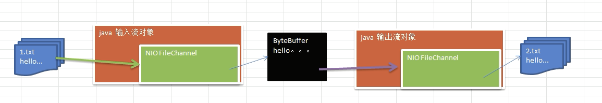

```java
public class NIOFileChannel03 {
    public static void main(String[] args) throws IOException {

        File file = new File("1.txt");

        FileInputStream fileInputStream = new FileInputStream(file);
        FileChannel inputStreamChannel = fileInputStream.getChannel();

        FileOutputStream fileOutputStream = new FileOutputStream("2.txt");
        FileChannel fileOutputStreamChannel = fileOutputStream.getChannel();


        ByteBuffer byteBuffer = ByteBuffer.allocate(5);
        while (true){

            //这里有一个重要的操作，一定不要忘了
            /* 重置标志位，清空buffer，重置position位置，之前写出是position等于limit
                public final Buffer clear() {
                    position = 0;
                    limit = capacity;
                    mark = -1;
                    return this;
                }
             */
            byteBuffer.clear();

            //从通道读取数据到缓冲区
            int len = inputStreamChannel.read(byteBuffer);
            if (len == -1){//表示读取完毕
                break;
            }
            //反转 position
            byteBuffer.flip();

            //将缓冲区数据写入到通道
            fileOutputStreamChannel.write(byteBuffer);
        }

        //关闭相应的流
        fileInputStream.close();
        fileOutputStream.close();
    }
}
```

### 应用实例4-拷贝文件`transferFrom` 方法

实例要求:
1) 使用 FileChannel(通道) 和 方法 transferFrom ，完成文件的拷贝
2) 拷贝一张图片

```java
public class NIOFileChannel04 {
    public static void main(String[] args) throws IOException {
        File file = new File("test.png");

        FileInputStream fileInputStream = new FileInputStream(file);
        FileChannel inputStreamChannel = fileInputStream.getChannel();

        FileOutputStream fileOutputStream = new FileOutputStream("test_bak.png");
        FileChannel fileOutputStreamChannel = fileOutputStream.getChannel();

        ByteBuffer byteBuffer = ByteBuffer.allocate(5);
        long position = 0;
        while (true) {

            long l = fileOutputStreamChannel.transferFrom(inputStreamChannel, position, 512);
            position += l;
            if (l==0){
                break;
            }
        }

        //关闭相应的流
        fileInputStream.close();
        fileOutputStream.close();
    }
}

```

### 关于Buffer 和 Channel的注意事项和细节

1) ByteBuffer 支持类型化的put 和 get, put 放入的是什么数据类型，get就应该使用相应的数据类型来取出，否则可能有 BufferUnderflowException 异常。[举例说明]

```java
public class ByteBUfferPutGet {
    public static void main(String[] args) {
        //创建一个Buffer
        ByteBuffer buffer = ByteBuffer.allocate(64);
        //类型化方式放入数据
        buffer.putInt(100);
        buffer.putLong(9);
        buffer.putChar('尚');
        buffer.putShort((short) 4);

        //反转
        buffer.flip();
        //取出
        System.out.println(buffer.getInt());
        System.out.println(buffer.getLong());
        System.out.println(buffer.getChar());
        System.out.println(buffer.getShort());

    }
}
```

2) 可以将一个普通Buffer 转成只读Buffer [举例说明]

```java
public class ReadOnlyBuffer {

    public static void main(String[] args)  {
        //创建一个buffer
        ByteBuffer buffer = ByteBuffer.allocate(64);
        for (int i = 0; i < 64; i++) {
            buffer.put((byte) i);
        }
        //读取
        buffer.flip();
        //得到一个只读的Buffer
        ByteBuffer asReadOnlyBuffer = buffer.asReadOnlyBuffer();
        System.out.println(asReadOnlyBuffer.getClass());

        while (buffer.hasRemaining()){
            System.out.println(buffer.get());
        }
    }
}
```

3) NIO 还提供了 **MappedByteBuffer**， 可以让文件直接在内存（堆外的内存）中进行修改， 而如何同步到文件由NIO 来完成. [举例说明]

```java
/**
 * 说明
 * 1.MappedByteBuffer可让文件直接在内存(堆外内存)修改,操作系统不需要拷贝一次
 */
public class MappedByteBufferTest {

    public static void main(String[] args)throws IOException {

        RandomAccessFile randomAccessFile = new RandomAccessFile("1.txt","rw");

        //获取对应通道
        FileChannel channel = randomAccessFile.getChannel();

        /*
         * 参数：Filechannel.MapMode.READWRITE使用的读写模式
         * 参数2：0：可以直接修改的起始位置
         * 参数3：5：是映射到内存的大小(不是索引位置),即将文件1.txt的多少个字节映射到内存
         * 可以直接修改的范围就是0-5
         * 实际类型DirectByteBuffer
         */
        MappedByteBuffer mappedByteBuffer = channel.map(FileChannel.MapMode.READ_WRITE, 0, 5);

        mappedByteBuffer.put(0, (byte) 'H');
        mappedByteBuffer.put(3, (byte) '9');

        randomAccessFile.close();
    }
}

```

4) 前面我们讲的读写操作，都是通过一个Buffer 完成的，**NIO 还支持 通过多个Buffer (即 Buffer 数组) 完成读写操作**，即 Scattering 【分散】和 Gathering【聚合】

```java
/**
 * Scattering：将数据写入到buffer时，可以采用buffer数组，依次写入[分散]
 * Gathering：从buffer读取数据时，可以采用buffer数组，依次读
 */
public class ScatteringAndGatheringTest {

    public static void main(String[] args) throws IOException {
        //使用 ServerSocketChannel和SocketChannel网络

        ServerSocketChannel serverSocketChannel = ServerSocketChannel.open();
        InetSocketAddress inetSocketAddress = new InetSocketAddress(7000);

        //绑定端口到socket并启动
        serverSocketChannel.socket().bind(inetSocketAddress);

        //创建buffer数组
        ByteBuffer[] byteBuffers = new ByteBuffer[2];
        byteBuffers[0] =  ByteBuffer.allocate(5);
        byteBuffers[1] =  ByteBuffer.allocate(3);

        //等待客户端连接（telnet测试）
        SocketChannel socketChannel = serverSocketChannel.accept();

        int messageLen = 8;//假定从客户端接收8个字习
        //循环读取
        while (true){
            int byteRead = 0;

            while (byteRead <messageLen){
                long read = socketChannel.read(byteBuffers);
                byteRead += read;//累计读取的字节数
                System.out.println("byteRead = " + byteRead);

                //使用流打印，看看当前的buffer的position和limit   map 映射成新的字符串流，循环打印
                Arrays.asList(byteBuffers).stream().map(it->{
                    return "position = "+ it.position() +"，limit" +it.limit();
                }).forEach(System.out::println);
            }

            //将所有的buffer进行反转
            Arrays.asList(byteBuffers).forEach(it->{ it.flip();  });

            //将数据显示到客户端
            long byteWrite = 0;
            while (byteWrite < messageLen){
                long write = socketChannel.write(byteBuffers);
                byteWrite += write;
            }
            //将所有的buffer进行clear
            Arrays.asList(byteBuffers).forEach(it->{ it.clear();  });

            System.out.print ("byteRead = " + byteRead+" byteWrite = " + byteWrite+" messageLen = " + messageLen);

        }

    }
}
```

## Selector(选择器)

### 基本介绍

1) Java 的 NIO，用非阻塞的 IO 方式。可以用一个线程，处理多个的客户端连接，就会使用到`Selector(选择器)`

2) **Selector 能够检测多个注册的通道上是否有事件发生(注意:多个Channel以事件的方式可以注册到同一个Selector)**，如果有事件发生，便获取事件然后针对每个事件进行相应的处理。这样就可以只用一个单线程去管理多个通道，也就是管理多个连接和请求。【示意图】

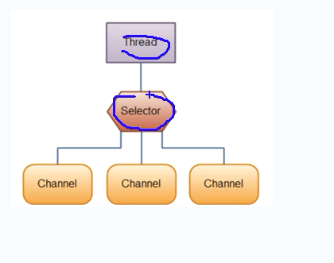

3) 只有在 连接/通道 真正有读写事件发生时，才会进行读写，就大大地减少了系统开销，并且不必为每个连接都创建一个线程，不用去维护多个线程

4) 避免了多线程之间的上下文切换导致的开销


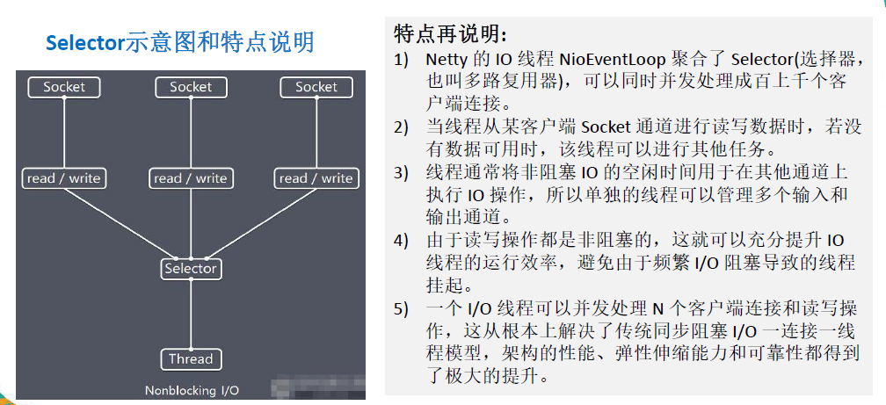

### Selector类相关方法

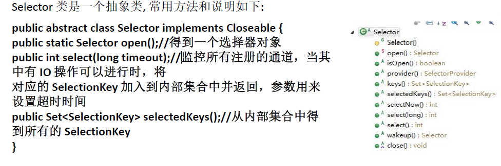

注意事项
1) NIO中的 ServerSocketChannel功能类似ServerSocket，SocketChannel功能类似Socket
2) selector 相关方法说明
`selector.select()`//阻塞
`selector.select(1000);/`/阻塞1000毫秒，在1000毫秒后返回
`selector.wakeup();`//唤醒selector
`selector.selectNow();`//不阻塞，立马返还

### NIO 非阻塞 网络编程原理分析图

NIO 非阻塞 网络编程相关的(Selector、SelectionKey、ServerScoketChannel和SocketChannel) 关系梳理图

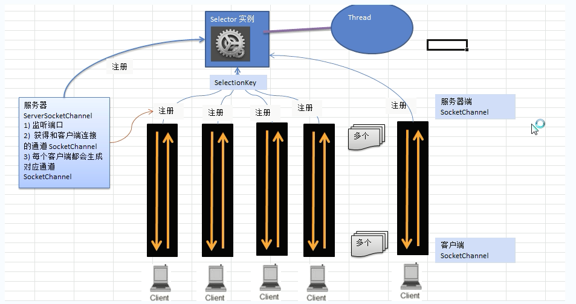


1. 当客户端连接时,会通过ServerSocketChannel得到SocketChannel
2. Selector 进行监听 select 方法, 返回有事件发生的通道的个数.
3. 将socketChannel注册到Selector上,register(Selector sel, int ops), 一个selector上可以注册多个SocketChannel
4. 注册后返回一个SelectionKey,会和该Selector关联(集合)
5. 进一步得到各个 SelectionKey (有事件发生的)
6. 在通过 SelectionKey 反向获取SocketChannel , 方法 channel()
7. 可以通过 得到的 channel , 完成业务处理
8. 代码撑腰。。

### NIO 非阻塞 网络编程快速入门

案例要求:
1) 编写一个 NIO 入门案例，实现服务器端和客户端之间的数据简单通讯（非阻塞）
2) 目的：理解NIO非阻塞网络编程机制

NIOServer

```java
package com.g.nio.c2s;

import java.io.IOException;
import java.net.InetSocketAddress;
import java.nio.ByteBuffer;
import java.nio.channels.SelectionKey;
import java.nio.channels.Selector;
import java.nio.channels.ServerSocketChannel;
import java.nio.channels.SocketChannel;
import java.util.Iterator;
import java.util.Set;

public class NIOServer {

    public static void main(String[] args) throws IOException {

        //创建ServerSocketChannel-> ServerSocket
        ServerSocketChannel serverSocketChannel = ServerSocketChannel.open();
        //得到一个Selecor对象
        Selector selector = Selector.open();

        //绑定一个端口6666，在服务器端监听
        serverSocketChannel.socket().bind(new InetSocketAddress(6666));

        //设置为非阻塞
        serverSocketChannel.configureBlocking(false);

        //把serverSocketChannel注册到selector关心事件为OP_ACCEPT
        serverSocketChannel.register(selector, SelectionKey.OP_ACCEPT);

        //循环等待客户端连接
        while (true) {

            //这里我们等待1s，如果没有事件发生，返回
            if (selector.select(1000) == 0) {
                System.out.println("服务器等待了1秒，无连接");
                continue;
            }

            //如果返回的>0，就获取到相关的selectionKey集合
            //1，如果返回的>0，表示已经获取到关注的事件
            //通过selectionKeys反向获取通道
            Set<SelectionKey> selectionKeys = selector.selectedKeys();

            //遍历Set<Selectionkey，使用迭代器遍历
            Iterator<SelectionKey> keyIterator = selectionKeys.iterator();

            while (keyIterator.hasNext()) {
                //获取到SelectionKey,根据key对应的通道发生的事件做相应处理
                SelectionKey key = keyIterator.next();


                if (key.isAcceptable()) {//如果是OP_ACCEPT，有新的客户端连接
                    //该该客户端生成一个SocketChannel
                    SocketChannel socketChannel = serverSocketChannel.accept();//accept属于阻塞，但是select已经检测到监听事件，直接读取运行，不会阻塞
                    //将 SocketChannel设置为非阻塞
                    socketChannel.configureBlocking(false);

                    //将socketChannel注册到selector，关注事件为OP READ，同时给socketChannel
                    //关联一个Buffer
                    socketChannel.register(selector, SelectionKey.OP_READ, ByteBuffer.allocate(1024));
                } else if (key.isReadable()) {//发生OP_READ
                    //通过key反向获取到对应channel
                    SocketChannel socketChannel = (SocketChannel) key.channel();
                    //获取到该chanel关联的buffer
                    ByteBuffer buffer = (ByteBuffer) key.attachment();
                    socketChannel.read(buffer);
                    System.out.println("from 客户端： " + new String(buffer.array(),0,buffer.position()));
                }
                //手动从集合中移动当前的selectionKey，防止重复操作
                keyIterator.remove();

            }

        }

    }
}
```

NIOClient

```java
package com.g.nio.c2s;

import java.io.IOException;
import java.net.InetSocketAddress;
import java.nio.ByteBuffer;
import java.nio.channels.SocketChannel;

public class NewIOClient {
    public static void main(String[] args) throws IOException {
        //得到一个网络通道
        SocketChannel socketChannel = SocketChannel.open();
        //设置非阻塞
        socketChannel.configureBlocking(false);

        //提供服务器端的ip和端口
        InetSocketAddress remote = new InetSocketAddress("127.0.0.1", 6666);
        //连接服务器
        if (!socketChannel.connect(remote)) {
            while (!socketChannel.finishConnect()) {
                System.out.println("因为连接需要时间，客户端不会阻塞，可以做其它工作..");
            }

            //如果连接成功，就发送数据
            String str = "你好，服务器，现在测试NIO...";
            //Wraps a byte array into a buffer
            ByteBuffer wrap = ByteBuffer.wrap(str.getBytes());

            //发送数据，将buffer数据写入channel
            socketChannel.write(wrap);

           System.in.read();//进行阻塞

        }
    }
}
```

## SelectionKey

1) SelectionKey，表示 Selector 和网络通道的注册关系, 共四种:

+ int OP_ACCEPT：有新的网络连接可以 accept，值为 16

+ int OP_CONNECT：代表连接已经建立，值为 8
  int OP_READ：代表读操作，值为 1

+ int OP_WRITE：代表写操作，值为 4


  源码中：

```java
public static final int OP_READ = 1 << 0;
public static final int OP_WRITE = 1 << 2;
public static final int OP_CONNECT = 1 << 3;
public static final int OP_ACCEPT = 1 << 4;
```

2) SelectionKey相关方法

```java
public abstract class SelectionKey {
    public abstract Selector selector();//得到与之关联的Selector 对象
    public abstract SelectableChannel channel();//得到与之关联的通道
    public final Object attachment();//得到与之关联的共享数据
    public abstract SelectionKey interestOps(int ops);//设置或改变监听事件
    public final boolean isAcceptable();//是否可以 accept
    public final boolean isReadable();//是否可以读
    public final boolean isWritable();//是否可以写
}
```

## ServerSocketChannel

1)ServerSocketChannel 在服务器端监听新的客户端 Socket 连接
2) 相关方法如下

```java
public abstract class ServerSocketChannel
extends AbstractSelectableChannel
implements NetworkChannel{
    public static ServerSocketChannel open();//得到一个 ServerSocketChannel 通道
    public final ServerSocketChannel bind(SocketAddress local);//设置服务器端端口号
    public final SelectableChannel configureBlocking(boolean block);//设置阻塞或非阻塞模式，取值 false 表示采用非阻塞模式
    public SocketChannel accept();//接受一个连接，返回代表这个连接的通道对象
    public final SelectionKey register(Selector sel, int ops);//注册一个选择器并设置监听事件
}
```

## SocketChannel

1) SocketChannel，网络 IO 通道，具体负责进行读写操作。NIO 把缓冲区的数据写入通道，或者把通道里的数据读到缓冲区。

2）相关方法如下

```java
public abstract class SocketChannel
extends AbstractSelectableChannel
implements ByteChannel, ScatteringByteChannel, GatheringByteChannel,
NetworkChannel{
    public static SocketChannel open();//得到一个SocketChannel 通道
    public final SelectableChannel configureBlocking(boolean block);//设置阻塞或非阻塞模式，取值 false 表示采用非阻塞模式
    public boolean connect(SocketAddress remote);//连接服务器
    public boolean finishConnect();//如果上面的方法连接失败，接下来就要通过该方法 完成连接操作
    public int write(ByteBuffer src);//往通道里写数据
    public int read(ByteBuffer dst);//从通道里读数据
    public final SelectionKey register(Selector sel, int ops, Object att);//注册一个选择器并设置监听事件，最后一个参数可以设置共享数据
    public final void close();//关闭通道
}
```

## NIO 网络编程应用实例-群聊系统

实例要求:
1) 编写一个 NIO 群聊系统，实现服务器端和客户端之间的数据简单通讯（非阻塞）
2) 实现多人群聊
3) 服务器端：可以监测用户上线，离线，并实现消息转发功能
4) 客户端：通过channel 可以无阻塞发送消息给其它所有用户，同时可以接受其它用户发送的消息(有服务器转发得到)
5) 目的：进一步理解NIO非阻塞网络编程机制

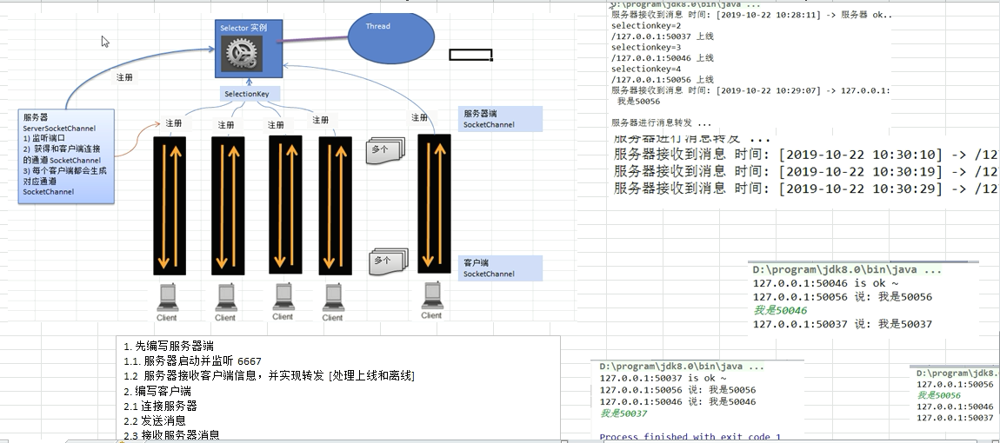

服务端

```java
package com.g.groupchat;

import java.io.IOException;
import java.net.InetSocketAddress;
import java.nio.ByteBuffer;
import java.nio.channels.*;
import java.util.Iterator;

public class GroupChatServer {
    //定义相关属性
    private Selector selector;
    private ServerSocketChannel listenChannel;
    private final static int PORT = 6667;

    //构造器，完成初始化工作
    GroupChatServer() {

        try {
            //得到选择器
            selector = Selector.open();
            //ServerSocketChannel
            listenChannel = ServerSocketChannel.open();
            //绑定端口
            listenChannel.socket().bind(new InetSocketAddress(PORT));
            //设置非阻塞模式
            listenChannel.configureBlocking(false);
            //将该listenchannel注册到selector
            listenChannel.register(selector, SelectionKey.OP_ACCEPT);

        } catch (IOException e) {
            e.printStackTrace();
        }

    }

    //监听代码
    public void listen() {
        try {
            //循环处理
            while (true) {
                int count = selector.select(2000);
                if (count > 0) {//有事件处理
                    //遍历得到selectionkey集合
                    Iterator<SelectionKey> iterator = selector.selectedKeys().iterator();
                    while (iterator.hasNext()) {
                        //取出selectionkey
                        SelectionKey key = iterator.next();
                        //监听到accept
                        if (key.isAcceptable()){
                            SocketChannel socketChannel = listenChannel.accept();
                            //设置非阻塞
                            socketChannel.configureBlocking(false);
                            //将该sc注册到seletor
                            socketChannel.register(selector,SelectionKey.OP_READ);
                            System.out.println(socketChannel.getRemoteAddress()+"上线了");
                        }else if (key.isReadable()){//通道发送read事件，即通道是可读的状态
                            //处理读【专门写方法】
                            readData(key);
                        }

                       //手动从集合中移动当前的selectionkey，防止重复操作
                       iterator.remove();
                    }
                } else {
                    System.out.println("wait........");
                }
            }
        } catch (IOException e) {
            e.printStackTrace();
        }
    }

    //读取客户端消息
    private void  readData(SelectionKey key){
        SocketChannel channel=null;
        try {
            //取到关联的channe
            channel = (SocketChannel) key.channel();
            //创建缓冲
            ByteBuffer buffer = ByteBuffer.allocate(1024);
            int readCount = channel.read(buffer);
            //根据count的值做处理
            if (readCount > 0 ){
                //把缓存区的数据转成字符串
                String msg = new String(buffer.array(), 0, buffer.position());
                //输出消息
                System.out.println("from 客户端： "  +msg);
                //向其他客户端转发消息(去掉自己)【专门写一个方法处理】
                sendInfoToOther(msg,channel);
            }
        } catch (IOException e) {
            try {
                System.out.println(channel.getRemoteAddress()+"离线了");
            } catch (IOException ioException) {
                ioException.printStackTrace();
            }finally {
                //取消注册
                try {
                    channel.close();
                } catch (IOException ioException) {
                    ioException.printStackTrace();
                }
            }

        }

    }

    //转发消息给其它客户（通道）
    private void sendInfoToOther(String msg, SocketChannel self) throws IOException {

        System.out.println("服务器转发消息中");

        //遍历所有注册到selector上的socketChannel，并排除self
        int sendCount = 0;
        for (SelectionKey key : selector.keys()) {
            //通过key取出通道SocketChannel
           Channel targetChannel = key.channel();
           if (targetChannel instanceof SocketChannel && targetChannel != self){
               //转型
               SocketChannel destChannel = (SocketChannel) targetChannel;
               //将msg存储到buff
               ByteBuffer buffer = ByteBuffer.wrap(msg.getBytes());
               //将buffer的数据写入通道
               destChannel.write(buffer);
               sendCount++;
           }
        }
        System.out.println("sendCount = " + sendCount);
    }


    public static void main(String[] args) {
        //创建一个服务器对象
        GroupChatServer groupChatServer = new GroupChatServer();
        groupChatServer.listen();
    }

}
```

客户端

```java
package com.g.groupchat;

import java.io.IOException;
import java.net.InetSocketAddress;
import java.nio.ByteBuffer;
import java.nio.channels.SelectionKey;
import java.nio.channels.Selector;
import java.nio.channels.SocketChannel;
import java.util.Iterator;
import java.util.Scanner;
import java.util.concurrent.TimeUnit;

public class GroupChatClient {

    //定义相关的属性
    private final static String HOST = "127.0.0.1";//服务器的ip
    private final static int PORT = 6667;//服务器的端口
    private Selector selector;
    private SocketChannel socketChannel;
    String username;

    public GroupChatClient() throws IOException {
        selector = Selector.open();
        //连接服务器
        socketChannel = SocketChannel.open(new InetSocketAddress(HOST, PORT));
        //设置非阻塞
        socketChannel.configureBlocking(false);
        //将channel注册到selector
        socketChannel.register(selector, SelectionKey.OP_READ);
        //得到username
        username = socketChannel.getLocalAddress().toString().substring(1);
        System.out.println(username + "is ok..");
    }


    //向服务器发送消息
    public void sendInfo(String info) {
        info = username + " 说 ：" + info;

        try {
            socketChannel.write(ByteBuffer.wrap(info.getBytes()));
        } catch (IOException e) {
            e.printStackTrace();
        }
    }

    //读取服务器消息
    public void readInfo() {
        try {
            int count = selector.select(2000);
            if (count > 0) {//有可用的通道
                Iterator<SelectionKey> iterator = selector.selectedKeys().iterator();

                while (iterator.hasNext()) {
                    SelectionKey key = iterator.next();
                    if (key.isReadable()) {
                        //得到相关的通道
                        SocketChannel channel = (SocketChannel) key.channel();
                        //得到一个Buffer
                        ByteBuffer buffer = ByteBuffer.allocate(1024);
                        channel.read(buffer);

                        //把读到的缓冲区的数据转成字符串
                        String msg = new String(buffer.array());
                        System.out.println(msg.trim());
                    }

                    iterator.remove();//删除当前的selectionkey，防止重复操伸
                }
            } else {
//                System.out.println("没有可用的通道...");
            }
        } catch (IOException e) {
            e.printStackTrace();
        }
    }

    public static void main(String[] args) throws IOException {
        //启动客户端
        GroupChatClient chatClient = new GroupChatClient();

        //启动一个线程,每个3秒，读取服务器端发送的数据
        new Thread(){
            public void run() {
                while (true){
                    chatClient.readInfo();
                    try {
                        TimeUnit.SECONDS.sleep(1);
                    } catch (InterruptedException e) {
                        e.printStackTrace();
                    }
                }
            }
        }.start();

        Scanner scanner = new Scanner(System.in);

        while (scanner.hasNextLine()){
            String msg = scanner.next();
            chatClient.sendInfo(msg);
        }
    }


}
```

## NIO与零拷贝

### 零拷贝基本介绍

1) 零拷贝是网络编程的关键，很多性能优化都离不开。
2) 在 Java 程序中，常用的零拷贝有 mmap(内存映射) 和 sendFile。那么，他们在OS 里，到底是怎么样的一个的设计？我们分析 mmap 和 sendFile 这两个零拷贝
3) 另外我们看下NIO 中如何使用零拷贝

### 传统IO数据读写

1) Java 传统 IO 和 网络编程的一段代码

```java
File file = new File("test.txt");
RandomAccessFile raf = new RandomAccessFile(file, "rw");
byte[] arr = new byte[(int) file.length()];
raf.read(arr);
Socket socket = new ServerSocket(8080).accept();
socket.getOutputStream().write(arr);
```

### 传统IO模型

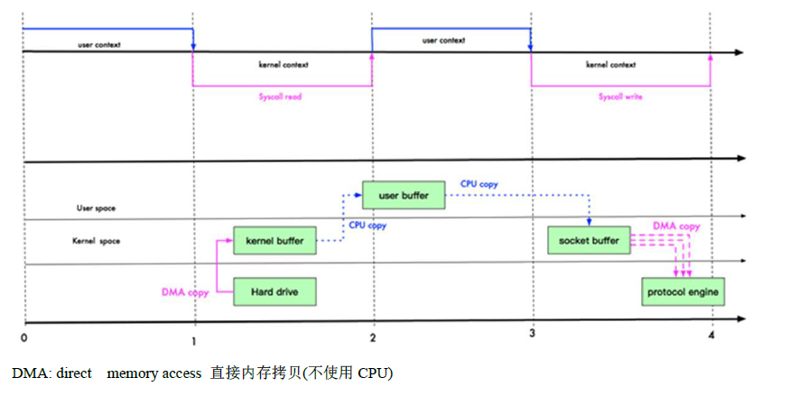

### mmap优化

1) mmap 通过内存映射，将文件映射到内核缓冲区，同时，用户空间可以共享内核空间的数据。这样，在进行网络传输时，就可以减少内核空间到用户空间的拷贝次数。如下图
2) mmap示意图

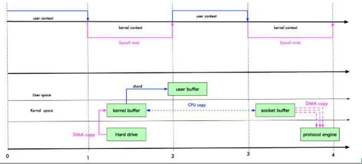


### sendFile 优化

1) Linux 2.1 版本 提供了sendFile 函数，其基本原理如下：数据根本不经过用户态，直接从内核缓冲区进入到 SocketBuffer，同时，由于和用
户态完全无关，就减少了一次上下文切换
2) 示意图和小结
提示：零拷贝从操作系统角度，是没有cpu 拷贝

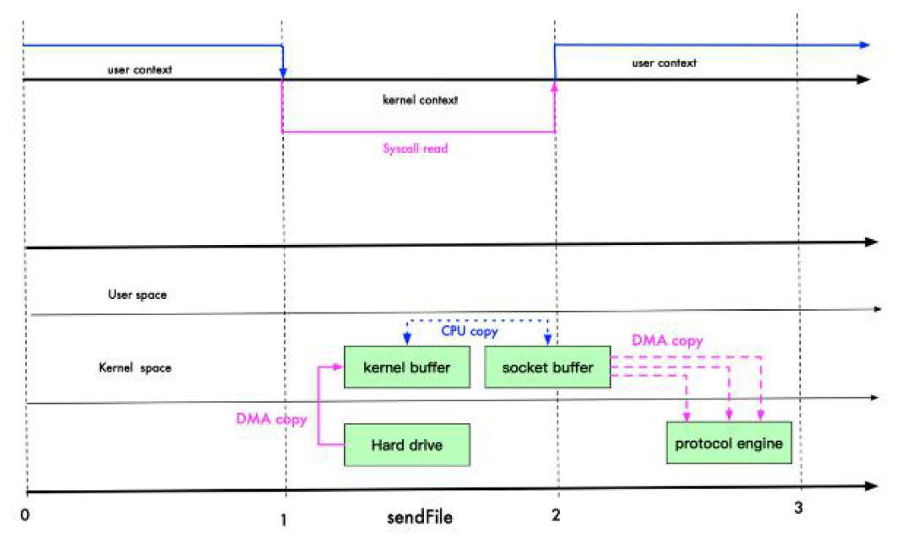

3) Linux 在 2.4 版本中，做了一些修改，避免了从内核缓冲区拷贝到 Socketbuffer 的操作，直接拷贝到协议栈，从而再一次减少了数据拷贝。

具体如下图和小结：
这里其实有 一次cpu 拷贝kernel buffer -> socket buffer但是，拷贝的信息很少，比如length , offset , 消耗低，可以忽略

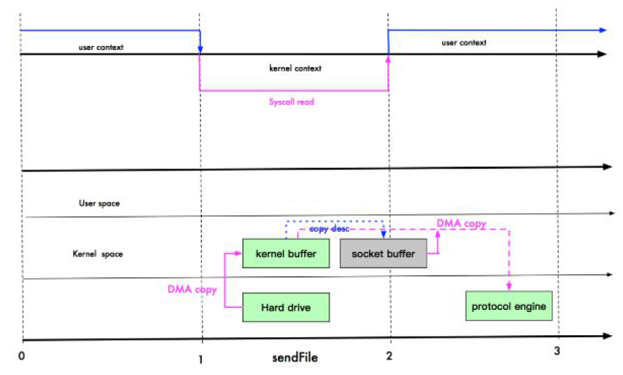

### 零拷贝的再次理解

1) 我们说零拷贝，是从操作系统的角度来说的。因为内核缓冲区之间，没有数据是重复的（**只有 kernel buffer 有一份数据**）。
2) 零拷贝不仅仅带来更少的数据复制，还能带来其他的性能优势，例如更少的上下文切换，更少的 CPU 缓存伪共享以及无 CPU 校验和计算。

### mmap 和 sendFile 的区别

1) mmap 适合小数据量读写，sendFile 适合大文件传输。

2) mmap 需要 4 次上下文切换，3 次数据拷贝；sendFile 需要 3 次上下文切换，最少 2 次数据拷贝。

3) sendFile 可以利用 DMA 方式，减少 CPU 拷贝，mmap 则不能（必须从内核拷贝到 Socket 缓冲区）。

### NIO 零拷贝案例 

案例要求：
1) 使用传统的IO 方法传递一个大文件
2) 使用NIO 零拷贝方式传递(**transferTo()方法**)一个大文件
3) 看看两种传递方式耗时时间分别是多少

NIO 0拷贝服务端

```java
package com.g.zerocopy;

import java.io.IOException;
import java.net.InetSocketAddress;
import java.net.ServerSocket;
import java.nio.ByteBuffer;
import java.nio.channels.ServerSocketChannel;
import java.nio.channels.SocketChannel;

public class NewIOZeroCopyServer {

    public static void main(String[] args) throws IOException {
        ServerSocketChannel serverSocketChannel = ServerSocketChannel.open();
        ServerSocket serverSocket = serverSocketChannel.socket();
        serverSocket.bind(new InetSocketAddress(7001));

        ByteBuffer byteBuffer = ByteBuffer.allocate(4096);

        while (true){
            SocketChannel socketChannel = serverSocketChannel.accept();
            int readCount = 0;
            while (readCount !=-1){
                readCount = socketChannel.read(byteBuffer);
                byteBuffer.rewind();//倒带
            }

        }
    }
}
```

```java
package com.g.zerocopy;

import java.io.FileInputStream;
import java.io.IOException;
import java.net.InetSocketAddress;
import java.nio.ByteBuffer;
import java.nio.channels.FileChannel;
import java.nio.channels.SocketChannel;

public class NewIOZeroCopyClient {

    public static void main(String[] args) throws IOException {
        SocketChannel socketChannel = SocketChannel.open();
        socketChannel.connect(new InetSocketAddress("127.0.0.1", 7001));

        //得到一个文件channel
        String fileName = "protoc-3.6.1-win32.zip";
        FileInputStream fileInputStream = new FileInputStream(fileName);
        FileChannel fileChannel = fileInputStream.getChannel();


        //准备发送
        long start = System.currentTimeMillis();
        //在linux下一个transferTo 方法就可以完成传输
        //在windows 下一次调用transferTo 只能发送8m，就需要分段传输文件，而且要主要
        //传输时的位置   long position  从哪里开始传, long count,传输多少个
        fileChannel.transferTo(0,fileChannel.size(),socketChannel);

        long end = System.currentTimeMillis();
        System.out.println("发送总字节数：" + fileChannel.size()+" 耗 时 " +( end-start));

        //关闭
        fileChannel.close();
    }
}
```

## Java AIO 基本介绍

1) JDK 7 引入了 Asynchronous I/O，即 AIO。在进行 I/O 编程中，常用到两种模式：Reactor和 Proactor。Java 的 NIO 就是 Reactor，当有事件触发时，服务器端得到通知，进行相应的处理
2) AIO 即 NIO2.0，叫做异步不阻塞的 IO。AIO 引入异步通道的概念，采用了Proactor 模式，简化了程序编写，有效的请求才启动线程，它的特点是先由操作系统完成后才通知服务端程序启动线程去处理，一般适用于连接数较多且连接时间较长的应用
3) 目前 AIO 还没有广泛应用，Netty 也是基于NIO, 而不是AIO， 因此我们就不详解AIO了，有兴趣的同学可以参考 <<Java新一代网络编程模型AIO原理及Linux系统AIO介绍>> http://www.52im.net/thread-306-1-1.html

## BIO、NIO、AIO对比表

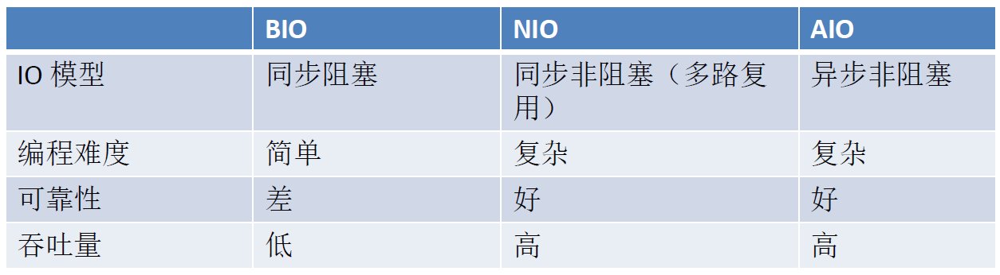

举例说明
1) 同步阻塞：到理发店理发，就一直等理发师，直到轮到自己理发。
2) 同步非阻塞：到理发店理发，发现前面有其它人理发，给理发师说下，先干其他事情，一会过来看是否轮到自己.
3) 异步非阻塞：给理发师打电话，让理发师上门服务，自己干其它事情，理发师自己来家给你理发

# Netty 概述

## 原生NIO存在的问题

1) NIO 的类库和 API 繁杂，使用麻烦：需要熟练掌握 Selector、ServerSocketChannel、SocketChannel、ByteBuffer 等。
2) 需要具备其他的额外技能：要熟悉 Java 多线程编程，因为 NIO 编程涉及到 Reactor模式【反应器模式】，你必须对多线程和网络编程非常熟悉，才能编写出高质量的 NIO 程序。
3) 开发工作量和难度都非常大：例如客户端面临断连重连、网络闪断、半包读写、失败缓存、网络拥塞和异常流的处理等等。
4) JDK NIO 的 Bug：例如臭名昭著的 Epoll Bug，它会导致 Selector 空轮询，最终导致 CPU 100%。直到 JDK 1.7 版本该问题仍旧存在，没有被根本解决。

## Netty官网说明

官网：https://netty.io/

Netty is an asynchronous event-driven network application frameworkfor rapid development of maintainable high performance protocol servers & clients

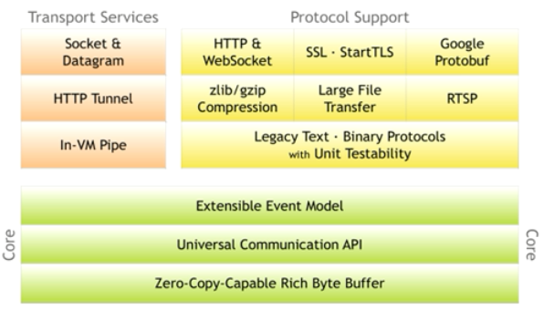

1) Netty 是由 JBOSS 提供的一个 Java 开源框架。Netty 提供异步的、基于事件驱动的网络应用程序框架，用以快速开发高性能、高可靠性的网络 IO 程序

2) Netty 可以帮助你快速、简单的开发出一个网络应用，相当于简化和流程化了 NIO 的开发过程

3) Netty 是目前最流行的 NIO 框架，Netty 在互联网领域、大数据分布式计算领域、游戏行业、通信行业等获得了广泛的应用，知名的 Elasticsearch 、Dubbo 框架内部都采用了 Netty。


## Netty的优点

Netty 对 JDK 自带的 NIO 的 API 进行了封装，解决了上述问题。
1) 设计优雅：适用于各种传输类型的统一 API 阻塞和非阻塞 Socket；基于灵活且可扩展的事件模型，可以清晰地分离关注点；高度可定制的线程模型 - 单线程，一个或多个线程池.

2) 使用方便：详细记录的 Javadoc，用户指南和示例；没有其他依赖项，JDK 5（Netty3.x）或 6（Netty 4.x）就足够了。

3) 高性能、吞吐量更高：延迟更低；减少资源消耗；最小化不必要的内存复制。

4) 安全：完整的 SSL/TLS 和 StartTLS 支持。

5) 社区活跃、不断更新：社区活跃，版本迭代周期短，发现的 Bug 可以被及时修复，同时，更多的新功能会被加入

## Netty版本说明

1) netty版本分为 netty3.x 和 netty4.x、netty5.x
2) 因为Netty5出现重大bug，已经被官网废弃了，目前推荐使用的是Netty4.x的稳定版本
3) 目前在官网可下载的版本 netty3.x netty4.0.x 和 netty4.1.x
4) 在本套课程中，我们讲解 Netty4.1.x 版本
5) netty 下载地址： https://bintray.com/netty/downloads/netty/


# Netty 高性能架构设计

## 线程模型基本介绍

1) 不同的线程模式，对程序的性能有很大影响，为了搞清Netty 线程模式，我们来系统的讲解下 各个线程模式， 最后看看Netty 线程模型有什么优越性.
2) 目前存在的线程模型有：

+ 传统阻塞 I/O 服务模型
+ Reactor 模式

3) 根据 Reactor 的数量和处理资源池线程的数量不同，有 3 种典型的实现
      • 单 Reactor 单线程；
      • 单 Reactor 多线程；
      • 主从 Reactor 多线程
4) Netty 线程模式(Netty 主要基于主从 Reactor 多线程模型做了一定的改进，其中主从Reactor 多线程模型有多个 Reactor)

## 传统阻塞 I/O 服务模型

工作原理图
黄色的框表示对象		蓝色的框表示线程		白色的框表示方法(API)

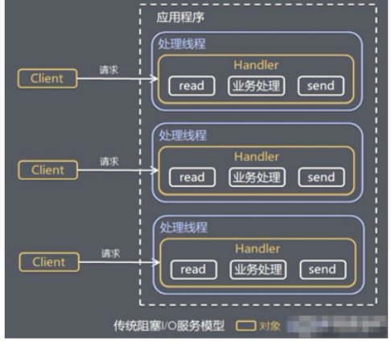


**模型特点**
1) 采用阻塞IO模式获取输入的数据
2) 每个连接都需要独立的线程完成数据的输入、业务处理、数据返回

**问题分析**
1) 当并发数很大，就会创建大量的线程，占用很大系统资源
2) 连接创建后，如果当前线程暂时没有数据可读，该线程会阻塞在read 操作，造成线程资源浪费

## Reactor 模式

针对传统阻塞 I/O 服务模型的 2 个缺点，解决方案：

1) 基于 I/O 复用模型：多个连接共用一个阻塞对象，应用程序只需要在一个阻塞对象等待，无需阻塞等待所有连接。当某个连接有新的数据可以处理时，操作系统通知应用程序，线程从阻塞状态返回，开始进行业务处理
Reactor 对应的叫法: 1. 反应器模式 2. 分发者模式(Dispatcher) 3. 通知者模式(notifier)
2) 基于线程池复用线程资源：不必再为每个连接创建线程，将连接完成后的业务处理任务分配给线程进行处理，一个线程可以处理多个连接的业务。


### I/O 复用结合线程池，就是Reactor 模式基本设计思想，如图：

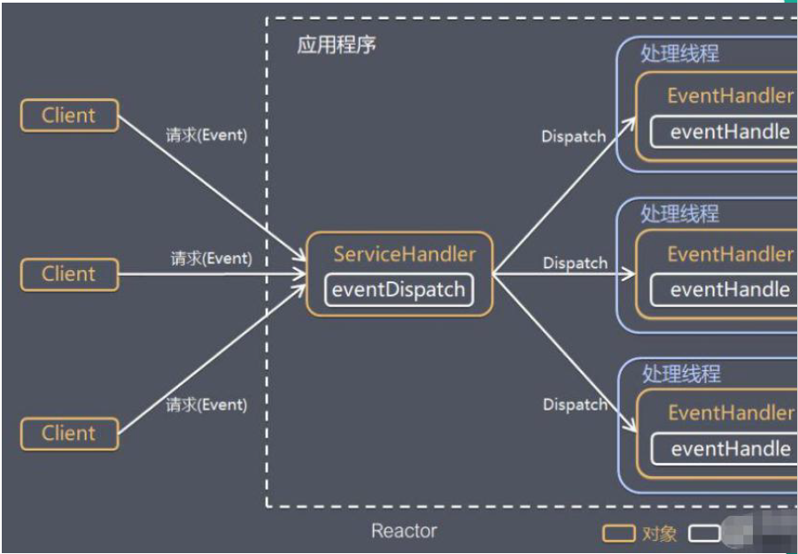

说明:
1) Reactor 模式，通过一个或多个输入同时传递给服务处理器的模式(基于事件驱动)
2) 服务器端程序处理传入的多个请求,并将它们同步分派到相应的处理线程， 因此Reactor模式也叫Dispatcher模式
3) Reactor 模式使用IO复用监听事件,收到事件后，分发给某个线程(进程), 这点就是网络服务器高并发处理关键

### Reactor 模式中 核心组成：

1) Reactor：Reactor 在一个单独的线程中运行，负责监听和分发事件，分发给适当的处理程序来对 IO 事件做出反应。 它就像公司的电话接线员，它接听来自客户的电话并将线路转移到适当的联系人；

2) Handlers：处理程序执行 I/O 事件要完成的实际事件，类似于客户想要与之交谈的公司中的实际官员。Reactor 通过调度适当的处理程序来响应 I/O 事件，处理程序执行非阻塞操作。

### Reactor 模式分类：

根据 Reactor 的数量和处理资源池线程的数量不同，有 3 种典型的实现
1) 单 Reactor 单线程
2) 单 Reactor 多线程
3) 主从 Reactor 多线程


## 单 Reactor 单线程

参考NIO的群聊系统


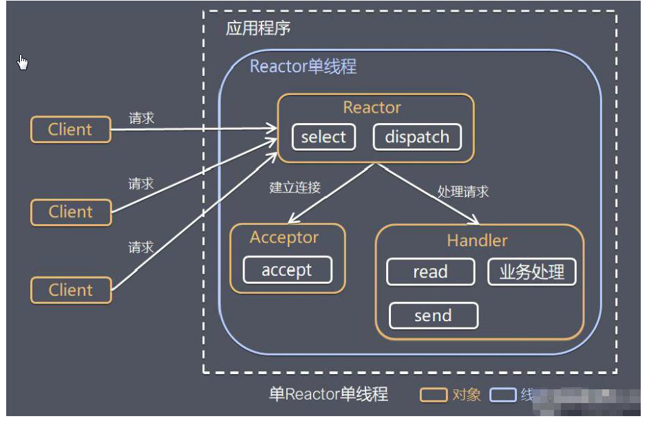

方案说明：
1) Select 是前面 I/O 复用模型介绍的标准网络编程 API，可以实现应用程序通过一个阻塞对象监听多路连接请求
2) Reactor 对象通过 Select 监控客户端请求事件，收到事件后通过 Dispatch 进行分发
3) 如果是建立连接请求事件，则由 Acceptor 通过 Accept 处理连接请求，然后创建一个Handler 对象处理连接完成后的后续业务处理
4) 如果不是建立连接事件，则 Reactor 会分发调用连接对应的 Handler 来响应
5) Handler 会完成 Read→业务处理→Send 的完整业务流程


结合实例：服务器端用一个线程通过多路复用搞定所有的 IO 操作（包括连接，读、写等），编码简单，清晰明了，但是如果客户端连接数量较多，将无法支撑，前面的 NIO群聊系统案例就属于这种模型。


方案优缺点分析：
1) 优点：模型简单，没有多线程、进程通信、竞争的问题，全部都在一个线程中完成
2) 缺点：性能问题，只有一个线程，无法完全发挥多核 CPU 的性能。Handler 在处理某个连接上的业务时，整个进程无法处理其他连接事件，很容易导致性能瓶颈
3) 缺点：可靠性问题，线程意外终止，或者进入死循环，会导致整个系统通信模块不可用，不能接收和处理外部消息，造成节点故障
4) 使用场景：客户端的数量有限，业务处理非常快速，比如 Redis在业务处理的时间复杂度 O(1) 的情况


## 单Reactor多线程

工作原理示意图：

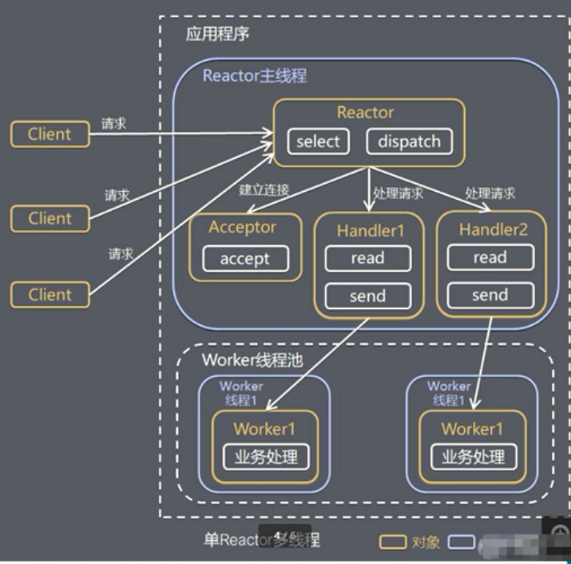方案说明
1) Reactor 对象通过select 监控客户端请求事件, 收到事件后，通过dispatch进行分发

2) 如果建立连接请求, 则右Acceptor 通过accept 处理连接请求, 然后创建一个Handler对象处理完成连接后的各种事件
3) 如果不是连接请求，则由reactor分发调用连接对应的handler 来处理

4) handler 只负责响应事件，不做具体的业务处理,通过read 读取数据后，会分发给后面的worker线程池的某个线程处理业务

5) worker 线程池会分配独立线程完成真正的业务，并将结果返回给handler

6) handler收到响应后，通过send 将结果返回给client


方案优缺点分析：
1) 优点：可以充分的利用多核cpu 的处理能力
2) 缺点：多线程数据共享和访问比较复杂， reactor 处理所有的事件的监听和响应，在单线程运行， 在高并发场景容易出现性能瓶颈.


## 主从 Reactor 多线程

工作原理示意图：
针对单 Reactor 多线程模型中，Reactor 在单线程中运行，高并发场景下容易成为性能瓶颈，可以让Reactor 在多线程中运行


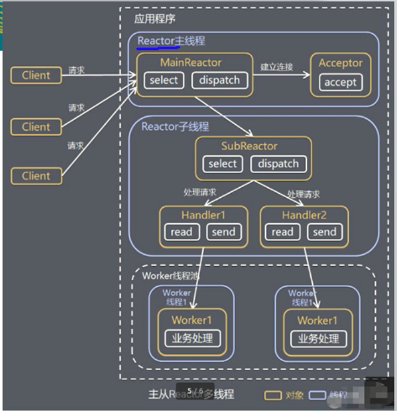

方案说明
1) Reactor主线程 MainReactor 对象通过select 监听连接事件, 收到事件后，通过Acceptor 处理连接事件
2) 当 Acceptor 处理连接事件后，MainReactor 将连接分配给SubReactor
3) subreactor 将连接加入到连接队列进行监听,并创建handler进行各种事件处理
4) 当有新事件发生时， subreactor 就会调用对应的handler处理
5) handler 通过read 读取数据，分发给后面的worker 线程处理
6) worker 线程池分配独立的worker 线程进行业务处理，并返回结果
7）handler收到响应的结果后，再通过send将结果返回给client
8）Reactor主线程可以对应多个Reactor子线程，即MainRecator可以关联多个SubReactor


Scalable IO in Java 对 Multiple Reactors 的原理图解：

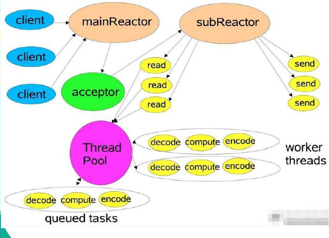


方案优缺点说明：
1) 优点：父线程与子线程的数据交互简单职责明确，父线程只需要接收新连接，子线程完成后续的业务处理。
2) 优点：父线程与子线程的数据交互简单，Reactor 主线程只需要把新连接传给子线程，子线程无需返回数据。
3) 缺点：编程复杂度较高


结合实例：这种模型在许多项目中广泛使用，包括 Nginx 主从 Reactor 多进程模型，Memcached 主从多线程，Netty 主从多线程模型的支持

## Reactor 模式小结

3 种模式用生活案例来理解
1) 单 Reactor 单线程，前台接待员和服务员是同一个人，全程为顾客服
2) 单 Reactor 多线程，1 个前台接待员，多个服务员，接待员只负责接待
3) 主从 Reactor 多线程，多个前台接待员，多个服务生


Reactor 模式具有如下的优点：
1) 响应快，不必为单个同步时间所阻塞，虽然 Reactor 本身依然是同步的
2) 可以最大程度的避免复杂的多线程及同步问题，并且避免了多线程/进程的切换开销
3) 扩展性好，可以方便的通过增加 Reactor 实例个数来充分利用 CPU 资源
4) 复用性好，Reactor 模型本身与具体事件处理逻辑无关，具有很高的复用性

## Netty模型

### 工作原理示意图1-简单版

Netty 主要基于主从 Reactors 多线程模型（如图）做了一定的改进，其中主从 Reactor 多线程模型有多个 Reactor

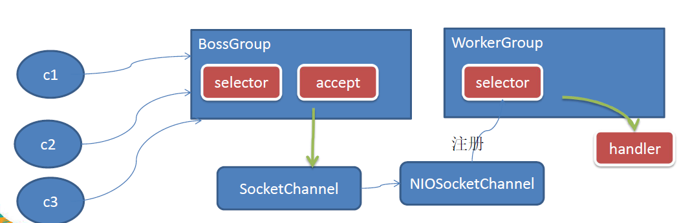

1) BossGroup 线程维护Selector , 只关注Accecpt
2) 当接收到Accept事件，获取到对应的SocketChannel, 封装成 NIOScoketChannel并注册到Worker 线程(事件循环), 并进行维护
3) 当Worker线程监听到selector 中通道发生自己感兴趣的事件后，就进行处理(就由handler)， 注意handler 已经加入到通道


### 工作原理示意图2-进阶版

Netty 主要基于主从Reactors 多线程模型（如图）做了一定的改进，其中主从 Reactor 多线程模型有多个 Reactor

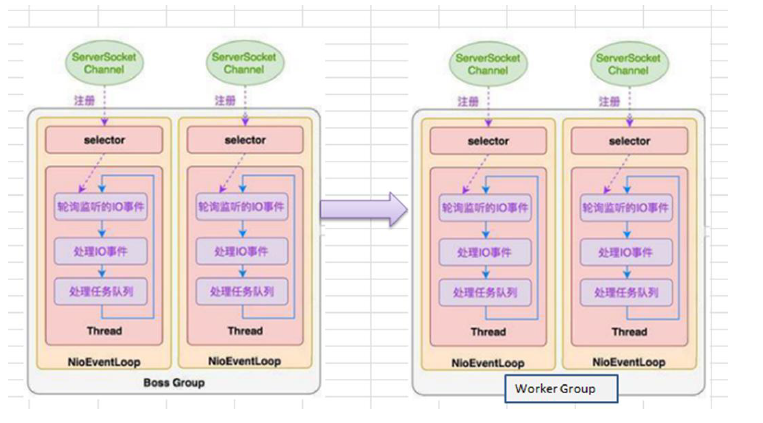

### 工作原理示意图-详细版

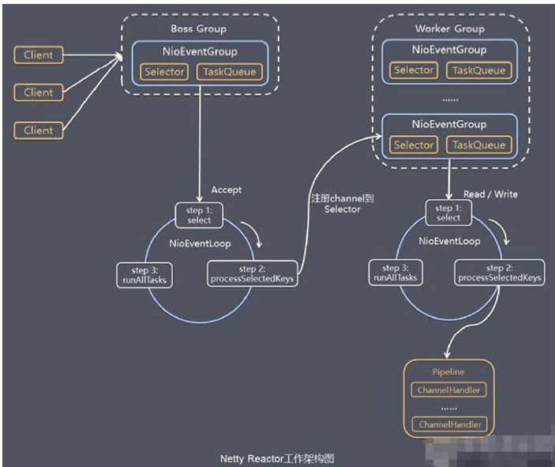


1) Netty抽象出两组线程池 BossGroup 专门负责接收客户端的连接,WorkerGroup 专门负责网络的读写

2) BossGroup 和 WorkerGroup 类型都是 NioEventLoopGroup
3) NioEventLoopGroup 相当于一个事件循环组, 这个组中含有多个事件循环 ，每一个事件循环是 NioEventLoop

4) NioEventLoop 表示一个不断循环的执行处理任务的线程， 每个NioEventLoop 都有一个selector , 用于监听绑定在其上的socket的网络通讯

5) NioEventLoopGroup 可以有多个线程, 即可以含有多个NioEventLoop

6) 每个Boss NioEventLoop 循环执行的步骤有3步

1. 轮询accept 事件

2. 处理accept 事件 , 与client建立连接 , 生成NioScocketChannel , 并将其注册到某个worker NIOEventLoop 上的 selector

3. 处理任务队列的任务 ， 即 runAllTasks

  

7) 每个 Worker NIOEventLoop 循环执行的步骤

1. 轮询read, write 事件

2. 处理i/o事件， 即read , write 事件，在对应NioScocketChannel 处理

3. 处理任务队列的任务 ， 即 runAllTasks

   

8) 每个Worker NIOEventLoop 处理业务时，会使用pipeline（管道），pipeline中包含了channel，即通过pipeline可以获取到对应通道，管道中维护了很多的处理器


一些重要概念

- Channel
  数据传输流，与channel相关的概念有以下四个，上一张图让你了解netty里面的Channel。

  

  Channel一览

  - Channel，表示一个连接，可以理解为每一个请求，就是一个Channel。
  - ChannelHandler，核心处理业务就在这里，用于处理业务请求。
  - ChannelHandlerContext，用于传输业务数据。
  - ChannelPipeline，用于保存处理过程需要用到的ChannelHandler和ChannelHandlerContext。

- ByteBuf
  ByteBuf是一个存储字节的容器，最大特点就是使用方便，它既有自己的读索引和写索引，方便你对整段字节缓存进行读写，也支持get/set，方便你对其中每一个字节进行读写，他的数据结构如下图所示：


ByteBuf数据结构


他有三种使用模式：

1. Heap Buffer 堆缓冲区
   堆缓冲区是ByteBuf最常用的模式，他将数据存储在堆空间。

2. Direct Buffer 直接缓冲区

   直接缓冲区是ByteBuf的另外一种常用模式，他的内存分配都不发生在堆，jdk1.4引入的nio的ByteBuffer类允许jvm通过本地方法调用分配内存，这样做有两个好处

   - 通过免去中间交换的内存拷贝, 提升IO处理速度; 直接缓冲区的内容可以驻留在垃圾回收扫描的堆区以外。
   - DirectBuffer 在 -XX:MaxDirectMemorySize=xxM大小限制下, 使用 Heap 之外的内存, GC对此”无能为力”,也就意味着规避了在高负载下频繁的GC过程对应用线程的中断影响.

3. Composite Buffer 复合缓冲区
   复合缓冲区相当于多个不同ByteBuf的视图，这是netty提供的，jdk不提供这样的功能。

### Netty快速入门实例-TCP服务

1) 实例要求：使用IDEA 创建Netty项目
2) Netty 服务器在 6668 端口监听，客户端能发送消息给服务器 "hello, 服务器~"
3) 服务器可以回复消息给客户端 "hello, 客户端~"
4) 目的：对Netty 线程模型 有一个初步认识, 便于理解Netty 模型理论
5) 看老师代码演示
	5.1 编写服务端 

​	5.2 编写客户端 

​	5.3 对netty 程序进行分析，看看netty模型特点
说明: 创建Maven项目，并引入Netty 包


```java
package com.g.netty.simple;

import io.netty.bootstrap.ServerBootstrap;
import io.netty.channel.ChannelFuture;
import io.netty.channel.ChannelInitializer;
import io.netty.channel.ChannelOption;
import io.netty.channel.EventLoopGroup;
import io.netty.channel.nio.NioEventLoopGroup;
import io.netty.channel.socket.SocketChannel;
import io.netty.channel.socket.nio.NioServerSocketChannel;
import io.netty.channel.socket.nio.NioSocketChannel;

public class NettyServer {

    public static void main(String[] args) throws InterruptedException {

        /*
        创建BossGroup和workerGroup
        说明：
            1．创建两个线程组bossGroup 和workerGroup
            2.bossGroup 只是处理连接请求，真正的和客户端业务处理，会交给workerGroup完成
            3．两个都是无限循环
            4.bossGroup和workerGroup含有的子线程（NioEventLoop）的个数   默认实际cpu核数*2
         */
        EventLoopGroup bossGroup = new NioEventLoopGroup(1);
        EventLoopGroup workGroup = new NioEventLoopGroup();

        try {
            //创建服务器端的启动对象，配置参数
            ServerBootstrap bootstrap = new ServerBootstrap();

            //使用链式编程来进行设置
            bootstrap.group(bossGroup,workGroup)//设置两个线程组
                    .channel(NioServerSocketChannel.class)//使用wiosocketchannel作为服务器的通道实现
                    .option(ChannelOption.SO_BACKLOG,128)//设置线程队列得到连接个数
                    .childOption(ChannelOption.SO_KEEPALIVE,true)//设置保持活动连接状态
                    .childHandler(new ChannelInitializer<SocketChannel>() {//创建一个通道测试对象（匿名对象）
                        //给pipeline设置处理器
                        @Override
                        protected void initChannel(SocketChannel ch) throws Exception {
                            ch.pipeline().addLast(new NettyServerHandler());
                        }
                    });//给我们的workerfroup的EventLoop对应的管道设置处理器

            System.out.println("f服务器 is ready");

            //绑定一个端口并且同步，生成了一个channelFujure对象
            //启动服务器（并绑定端口）
            ChannelFuture cf = bootstrap.bind(6668).sync();

            //对关闭通道进行监听
            ChannelFuture sync = cf.channel().closeFuture().sync();
        } finally {
            bossGroup.shutdownGracefully();
            workGroup.shutdownGracefully();
        }

    }
}
```

```java
package com.g.netty.simple;

import io.netty.buffer.ByteBuf;
import io.netty.buffer.Unpooled;
import io.netty.channel.Channel;
import io.netty.channel.ChannelHandlerContext;
import io.netty.channel.ChannelInboundHandlerAdapter;
import io.netty.channel.ChannelPipeline;

import java.nio.charset.StandardCharsets;

/**
 * 说明：
 * 1.我们自定义一个handler需要继承netty规定好的handlerAdapter
 * 2.这时我们自定义一个Handler，才能称为一个handler
 * @author gouwenyong0000
 */
public class NettyServerHandler extends ChannelInboundHandlerAdapter {

    /**读取数据实际（这里我们可以读取客户端发送的消息）
        1.ChannelHandlercontext ctx：上下文对象，含有管道pipeline，通道channel，地址
        2.object msg：就是客户端发送的数据默认lobject
    */
    @Override
    public void channelRead(ChannelHandlerContext ctx, Object msg) throws Exception {

        System.out.println("服务器读取线程："+Thread.currentThread().getName());
        System.out.println("server ctx = " + ctx);
        Channel channel = ctx.channel();
        ChannelPipeline pipeline = channel.pipeline();//本质是一个双向链接，出站入站


        //将msg转 成一个ByteBuf
        //ByteBuf是Netty提供的，不是NIO的ByteBuffer.
        ByteBuf byteBuf = (ByteBuf) msg;
        System.out.println("客户端消息：" + byteBuf.toString(StandardCharsets.UTF_8));
        System.out.println("客户端地址：" + channel.remoteAddress());

    }
    //读取数据完毕
    @Override
    public void channelReadComplete(ChannelHandlerContext ctx) throws Exception {
        //writeAndFlush 是write*flush
    //将数据写入到缓存，并刷新
    //一般讲，我们对这个发送的数据进行编码
        ctx.writeAndFlush(Unpooled.copiedBuffer("hello ,客户端---",StandardCharsets.UTF_8));
    }
    //处理异常，一般是需要关闭通道
    @Override
    public void exceptionCaught(ChannelHandlerContext ctx, Throwable cause) throws Exception {
        cause.printStackTrace();
        ctx.close();
    }
}
```
```java
package com.g.netty.simple;

import io.netty.bootstrap.Bootstrap;
import io.netty.channel.ChannelFuture;
import io.netty.channel.ChannelInitializer;
import io.netty.channel.nio.NioEventLoopGroup;
import io.netty.channel.socket.SocketChannel;
import io.netty.channel.socket.nio.NioSocketChannel;

public class NettyClient {
    public static void main(String[] args) throws InterruptedException {
        //客户端需要一个事件循环组
        NioEventLoopGroup group = new NioEventLoopGroup();

        try {
            //创建一个客户端启动对象
            //注意客户端使用的不是serverBootstrap而是Bootstrap
            Bootstrap bootstrap = new Bootstrap();

            //设置相关参数
            bootstrap.group(group)//设置线程组
                    .channel(NioSocketChannel.class)//设置客户端通道的实现类
                    .handler(new ChannelInitializer<SocketChannel>() {
                        @Override
                        protected void initChannel(SocketChannel ch) throws Exception {
                            ch.pipeline().addLast(new NettyClientHandler());//加入自己的处理器
                        }
                    })  ;

            System.out.println("客户端OK");
            //启动客户端去连接服务器端
            //关于ChannelFuture要分析，涉及到netty的异步模型
            ChannelFuture channelFuture = bootstrap.connect("127.0.0.1", 6668).sync();

            //给关闭通道进行监听
             channelFuture.channel().closeFuture().sync();

        } finally {
            group.shutdownGracefully();
        }
    }
}
```
```java
package com.g.netty.simple;

import io.netty.buffer.ByteBuf;
import io.netty.buffer.Unpooled;
import io.netty.channel.ChannelHandlerContext;
import io.netty.channel.ChannelInboundHandlerAdapter;

import java.nio.charset.StandardCharsets;

public class NettyClientHandler extends ChannelInboundHandlerAdapter {
    //当通道就绪就会触发该方法
    @Override
    public void channelActive(ChannelHandlerContext ctx) throws Exception {
        //writeAndFlush 是write +flush
        //将数据写入到缓存，并刷新
        //一般讲，我们对这个发送的数据进行编码
        System.out.println("client ctx = " + ctx);

        ctx.writeAndFlush(Unpooled.copiedBuffer("你好服务器", StandardCharsets.UTF_8));
    }
    //当通道有读取事件时，会触发
    @Override
    public void channelRead(ChannelHandlerContext ctx, Object msg) throws Exception {
        System.out.println("client ctx = " + ctx);
        //将msg转 成一个ByteBuf
        //ByteBuf是Netty提供的，不是NIO的ByteBuffer.
        ByteBuf byteBuf = (ByteBuf) msg;
        System.out.println("服务器消息：" + byteBuf.toString(StandardCharsets.UTF_8));
        System.out.println("服务器地址：" + ctx.channel().remoteAddress());
    }

    @Override
    public void exceptionCaught(ChannelHandlerContext ctx, Throwable cause) throws Exception {
        cause.printStackTrace();
        ctx.close();
    }
}
```

### 任务队列中的 Task 有 3 种典型使用场景

1) 用户程序自定义的普通任务 [举例说明]
2) 用户自定义定时任务
3) 非当前 Reactor 线程调用 Channel 的各种方法


例如在**推送系统**的业务线程里面，根据用户的标识，找到**对应的 Channel 引用**，然后调用 Write 类方法向该用户推送消息，就会进入到这种场景。最终的 Write 会提交到任务队列中后被**异步消费**

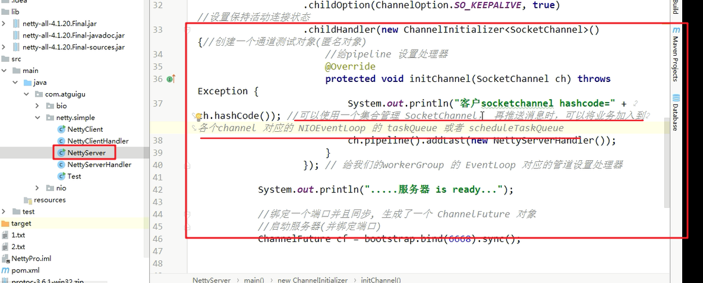


修改TCP案例的Handler

```java
package com.g.netty.simple;

import io.netty.buffer.ByteBuf;
import io.netty.buffer.Unpooled;
import io.netty.channel.Channel;
import io.netty.channel.ChannelHandlerContext;
import io.netty.channel.ChannelInboundHandlerAdapter;
import io.netty.channel.ChannelPipeline;

import java.nio.charset.StandardCharsets;
import java.util.concurrent.TimeUnit;

/**
 * 说明：
 * 1.我们自定义一个handler需要继承netty规定好的handlerAdapter
 * 2.这时我们自定义一个Handler，才能称为一个handler
 * @author gouwenyong0000
 */
public class NettyServerHandler extends ChannelInboundHandlerAdapter {

    /**读取数据实际（这里我们可以读取客户端发送的消息）
        1.ChannelHandlercontext ctx：上下文对象，含有管道pipeline，通道channel，地址
        2.object msg：就是客户端发送的数据默认lobject
    */
    @Override
    public void channelRead(ChannelHandlerContext ctx, Object msg) throws Exception {

//        System.out.println("服务器读取线程："+Thread.currentThread().getName());
//        System.out.println("server ctx = " + ctx);
//        Channel channel = ctx.channel();
//        ChannelPipeline pipeline = channel.pipeline();//本质是一个双向链接，出站入站
//
//
//        //将msg转 成一个ByteBuf
//        //ByteBuf是Netty提供的，不是NIO的ByteBuffer.
//        ByteBuf byteBuf = (ByteBuf) msg;
//        System.out.println("客户端消息：" + byteBuf.toString(StandardCharsets.UTF_8));
//        System.out.println("客户端地址：" + channel.remoteAddress());


        //比如这里我们有一个非常耗费时间的业务--> 异步执行  提交到该channel的NIOEventLoop的taskQueue
//        Thread.sleep(10000);
        ctx.channel().writeAndFlush(Unpooled.copiedBuffer("hello 客户端 阻塞的消息111",StandardCharsets.UTF_8));

        //解决方案1：用户自定义普通任务
        ctx.channel().eventLoop().execute(new Runnable() {
            @Override
            public void run() {
                try {
                    Thread.sleep(10000);
                } catch (InterruptedException e) {
                    e.printStackTrace();
                }
                ctx.channel().writeAndFlush(Unpooled.copiedBuffer("hello 客户端 自定义task的消息222",StandardCharsets.UTF_8));
            }
        });
        ctx.channel().eventLoop().execute(new Runnable() {
            @Override
            public void run() {
                try {
                    Thread.sleep(20000);//两个任务提交到一个线程的队列中，排队执行，加上上一个任务阻塞的10 +20 =30
                } catch (InterruptedException e) {
                    e.printStackTrace();
                }
                ctx.channel().writeAndFlush(Unpooled.copiedBuffer("hello 客户端 自定义task的消息333",StandardCharsets.UTF_8));
            }
        });

        //解决方案2：用户自定义定时任务  >> 该任务是提交到scheduleTaskQueue中
        ctx.channel().eventLoop().schedule(new Runnable() {
            @Override
            public void run() {
                try {
                    Thread.sleep(20000);//两个任务提交到一个线程的队列中，排队执行，加上上一个任务阻塞的10 +20 =30
                } catch (InterruptedException e) {
                    e.printStackTrace();
                }
                ctx.channel().writeAndFlush(Unpooled.copiedBuffer("hello 客户端 自定义task的消息444",StandardCharsets.UTF_8));
            }
        },5, TimeUnit.SECONDS);//延时5秒执行


        System.out.println("go on...");

    }
    //读取数据完毕
    @Override
    public void channelReadComplete(ChannelHandlerContext ctx) throws Exception {
        //writeAndFlush 是write*flush
    //将数据写入到缓存，并刷新
    //一般讲，我们对这个发送的数据进行编码
        ctx.writeAndFlush(Unpooled.copiedBuffer("hello ,客户端---",StandardCharsets.UTF_8));
    }
    //处理异常，一般是需要关闭通道
    @Override
    public void exceptionCaught(ChannelHandlerContext ctx, Throwable cause) throws Exception {
        cause.printStackTrace();
        ctx.close();
    }
}

```

### 方案再说明

1) Netty 抽象出两组线程池，BossGroup 专门负责接收客户端连接，WorkerGroup 专门负责网络读写操作。
2) NioEventLoop 表示一个不断循环执行处理任务的线程，每个 NioEventLoop 都有一个selector，用于监听绑定在其上的 socket 网络通道。
3) NioEventLoop 内部采用串行化设计，从消息的读取->解码->处理->编码->发送，始终由IO 线程 NioEventLoop 负责
	• NioEventLoopGroup 下包含多个 NioEventLoop
	• 每个 NioEventLoop 中包含有一个 Selector，一个 taskQueue
	• 每个 NioEventLoop 的 Selector 上可以注册监听多个 NioChannel
	• 每个 NioChannel 只会绑定在唯一的 NioEventLoop 上
	• 每个 NioChannel 都绑定有一个自己的 ChannelPipeline


## 异步模型

### 基本介绍

1) 异步的概念和同步相对。当一个异步过程调用发出后，调用者不能立刻得到结果。实际处理这个调用的组件在完成后，通过状态、通知和回调来通知调用者。

2) Netty 中的 I/O 操作是异步的，包括 Bind、Write、Connect 等操作会简单的返回一个ChannelFuture。

3) 调用者并不能立刻获得结果，而是通过 Future-Listener 机制，用户可以方便的主动获取或者通过通知机制获得 IO 操作结果

4) Netty 的异步模型是建立在 future 和 callback 的之上的。callback 就是回调。重点说Future，它的核心思想是：假设一个方法 fun，计算过程可能非常耗时，等待 fun返回显然不合适。那么可以在调用 fun 的时候，立马返回一个 Future，后续可以通过Future去监控方法 fun 的处理过程(即 ： Future-Listener 机制)


### Future 说明

1) 表示异步的执行结果, 可以通过它提供的方法来检测执行是否完成，比如检索计算等等.
2) ChannelFuture 是一个接口 ： `public interface ChannelFuture extends Future<Void>`我们**可以添加监听器，当监听的事件发生时，就会通知到监听器**. 案例说明

### 工作原理示意图

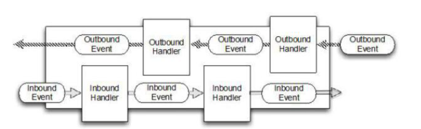

说明:
1) 在使用 Netty 进行编程时，拦截操作和转换出入站数据只需要您提供 callback 或利用future 即可。这使得**链式操作简单**、高效, 并有利于编写可重用的、通用的代码。

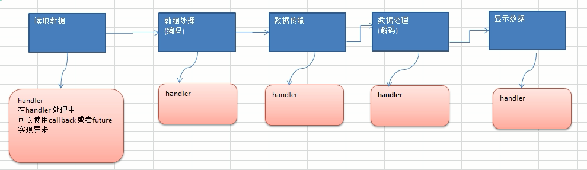2) Netty 框架的目标就是让你的业务逻辑从网络基础应用编码中分离出来、解脱出来

### Future-Listener 机制

1) 当 Future 对象刚刚创建时，处于非完成状态，调用者可以通过返回的 `ChannelFuture`来获取操作执行的状态，注册监听函数来执行完成后的操作。
2) 常见有如下操作
	• 通过 isDone 方法来判断当前操作是否完成；
	• 通过 isSuccess 方法来判断已完成的当前操作是否成功；
	• 通过 getCause 方法来获取已完成的当前操作失败的原因；
	• 通过 isCancelled 方法来判断已完成的当前操作是否被取消；
	• 通过 addListener 方法来注册监听器，当操作已完成(isDone 方法返回完成)，将会通知指定的监听器；如果 Future 对象已完成，则通知指定的监听器

3) 举例说明
演示：绑定端口是异步操作，当绑定操作处理完，将会调用相应的监听器处理逻辑

```java
serverBootstrap.bind(port).addListener(future -> {
    if(future.isSuccess()) {
    	System.out.println(newDate() + ": 端口["+ port + "]绑定成功!");
    } else{
    	System.err.println("端口["+ port + "]绑定失败!");
    }
});
```

小结：相比传统阻塞 I/O，执行 I/O 操作后线程会被阻塞住, 直到操作完成；异步处理的好处是不会造成线程阻塞，线程在 I/O 操作期间可以执行别的程序，在高并发情形下会更稳定和更高的吞吐量

## 快速入门实例-HTTP服务

1) 实例要求：使用IDEA 创建Netty项目
2) Netty 服务器在 9001端口监听，浏览器发出请求"http://localhost:9001/ "
3) 服务器可以回复消息给客户端 "Hello! 我是服务器 5 " , 并对特定请求资源进行过滤.
4) 目的：Netty 可以做Http服务开发，并且理解Handler实例和客户端及其请求的关系.

```java
package com.g.netty.http;

import io.netty.bootstrap.ServerBootstrap;
import io.netty.channel.ChannelFuture;
import io.netty.channel.nio.NioEventLoopGroup;
import io.netty.channel.socket.nio.NioServerSocketChannel;


public class TestServer {

    public static void main(String[] args) throws InterruptedException {
        NioEventLoopGroup bossGroup = new NioEventLoopGroup();
        NioEventLoopGroup workerGroup = new NioEventLoopGroup();

        try {

            ServerBootstrap serverBootstrap = new ServerBootstrap();
            serverBootstrap.group(bossGroup,workerGroup)
                    .channel(NioServerSocketChannel.class)
                    .childHandler(new TestServerInitializer());

            ChannelFuture channelFuture = serverBootstrap.bind(9001).sync();
            channelFuture.channel().closeFuture().sync();

        }finally {
            bossGroup.shutdownGracefully();
            workerGroup.shutdownGracefully();
        }

    }
}
```

```java
package com.g.netty.http;

import io.netty.channel.ChannelInitializer;
import io.netty.channel.ChannelPipeline;
import io.netty.channel.socket.SocketChannel;
import io.netty.handler.codec.http.HttpServerCodec;

public class TestServerInitializer extends ChannelInitializer<SocketChannel> {

    @Override
    protected void initChannel(SocketChannel ch) throws Exception {
        //向管道加入处理器
        //得到管道
        ChannelPipeline pipeline = ch.pipeline();
        /*加入一个netty提供的httpservercodec codec =>[coder-decoder]
        HttpServerCodec说明
        1.Httpservercodec 是netty提供的处理http的编-解码器*/
        pipeline.addLast("MyHttpServerCoded",new HttpServerCodec());
        //2.增加一个自定义的编解码器
        pipeline.addLast("MyTestHttpServerHandler",new TestHttpServerHandler());

    }
}
```
```java
package com.g.netty.http;

import io.netty.buffer.ByteBuf;
import io.netty.buffer.Unpooled;
import io.netty.channel.ChannelHandlerContext;
import io.netty.channel.SimpleChannelInboundHandler;
import io.netty.handler.codec.http.*;

import java.net.URI;
import java.nio.charset.StandardCharsets;

/**
 * 1. SimpleChannelInboundHandler 是ChannelInboundHandlerAdapter 的子类
 * 2. HttpObject 表示客户端和服务器端相互通讯的数据被封装成HttpObject类型
 */
public class TestHttpServerHandler extends SimpleChannelInboundHandler<HttpObject> {
    //读取客户端数据
    @Override
    protected void channelRead0(ChannelHandlerContext ctx, HttpObject msg) throws Exception {

        //判断msg是不是一个httprequest请求
        if (msg instanceof HttpRequest) {
            System.out.println("msg.getClass() = " + msg.getClass());
            System.out.println("客户端地址：" + ctx.channel().remoteAddress());


            //对浏览器请求服务器资源过滤    图标进行拦截
            HttpRequest request = (HttpRequest) msg;
            URI uri = new URI(request.uri());
            if("favicon.ico".equals(uri.getPath())){
                System.out.println("请求了favicon.ico，不做响应" );
                return;
            }

            //回复信息给浏览器  【http协议不是长链接，使用一次即断开】
            ByteBuf content = Unpooled.copiedBuffer("hello 我是服务器".getBytes(StandardCharsets.UTF_8));
            //构造-个http的相应，即httpResponse
            DefaultFullHttpResponse response = new DefaultFullHttpResponse(HttpVersion.HTTP_1_1
                    , HttpResponseStatus.OK, content);

            response.headers().set(HttpHeaderNames.CONTENT_TYPE, "text/plain;charset=utf-8");
            response.headers().set(HttpHeaderNames.CONTENT_LENGTH, content.readableBytes());

            //将构建好的response返回
            ctx.writeAndFlush(response);

        }
    }
}
```

# Netty 核心模块组件

## Bootstrap、ServerBootstrap

1) Bootstrap 意思是引导，一个 Netty 应用通常由一个 Bootstrap 开始，主要作用是配置整个 Netty 程序，串联各个组件，Netty 中 Bootstrap 类是客户端程序的启动引导类，ServerBootstrap 是服务端启动引导类

2) 常见的方法有

```java
public ServerBootstrap group(EventLoopGroup parentGroup, EventLoopGroup childGroup)//该方法用于服务器端，用来设置两个 EventLoop
public B group(EventLoopGroup group) //该方法用于客户端，用来设置一个 EventLoop
public B channel(Class<? extends C> channelClass)//该方法用来设置一个服务器端的通道实现
public <T> B option(ChannelOption<T> option, T value)//用来给 ServerChannel 添加配置
public <T> ServerBootstrap childOption(ChannelOption<T> childOption, T value)//用来给接收到的通道添加配置
public B handler(ChannelHandler handler)//该handler对应bossGroup
public ServerBootstrap childHandler(ChannelHandler childHandler)//该方法用来设置业务处理类（自定义的 handler）
public ChannelFuture bind(int inetPort)//该方法用于服务器端，用来设置占用的端口号
public ChannelFuture connect(String inetHost, int inetPort) //该方法用于客户端，用来连接服务器端
```

## Future、ChannelFuture

1) Netty 中所有的 IO 操作都是异步的，不能立刻得知消息是否被正确处理。但是可以过一会等它执行完成或者直接注册一个监听，具体的实现就是通过 Future 和ChannelFutures，他们可以注册一个监听，当操作执行成功或失败时监听会自动触发注册的监听事件
2) 常见的方法有

```java
Channel channel()//返回当前正在进行 IO 操作的通道
ChannelFuture sync()//等待异步操作执行完毕
```

## Channel

1) Netty 网络通信的组件，能够用于执行网络 I/O 操作。
2) 通过Channel 可获得当前网络连接的通道的状态
3) 通过Channel 可获得 网络连接的配置参数 （例如接收缓冲区大小）
4) Channel 提供异步的网络 I/O 操作(如建立连接，读写，绑定端口)，异步调用意味着任何 I/O 调用都将立即返回，并且不保证在调用结束时所请求的 I/O 操作已完成
5) 调用立即返回一个 ChannelFuture 实例，通过注册监听器到 ChannelFuture 上，可以I/O 操作成功、失败或取消时回调通知调用方

6) 支持关联 I/O 操作与对应的处理程序
7) 不同协议、不同的阻塞类型的连接都有不同的 Channel 类型与之对应，常用的Channel 类型:
	• NioSocketChannel，异步的客户端 TCP Socket 连接。
	• NioServerSocketChannel，异步的服务器端 TCP Socket 连接。
	• NioDatagramChannel，异步的 UDP 连接。
	• NioSctpChannel，异步的客户端 Sctp 连接。
	• NioSctpServerChannel，异步的 Sctp 服务器端连接，这些通道涵盖了 UDP 和 TCP 网络 IO
以及文件 IO。


## Selector

1) Netty 基于 Selector 对象实现 I/O 多路复用，通过 Selector 一个线程可以监听多个连接的 Channel 事件。
2) 当向一个 Selector 中注册 Channel 后，Selector 内部的机制就可以自动不断地查询(Select) 这些注册的 Channel 是否有已就绪的 I/O 事件（例如可读，可写，网络连接完成等），这样程序就可以很简单地使用一个线程高效地管理多个 Channel

## ChannelHandler 及其实现类

1) ChannelHandler 是一个接口，处理 I/O 事件或拦截 I/O 操作，并将其转发到其ChannelPipeline(业务处理链)中的下一个处理程序。
2) ChannelHandler 本身并没有提供很多方法，因为这个接口有许多的方法需要实现，方r便使用期间，可以继承它的子类
3) ChannelHandler 及其实现类一览图(后)

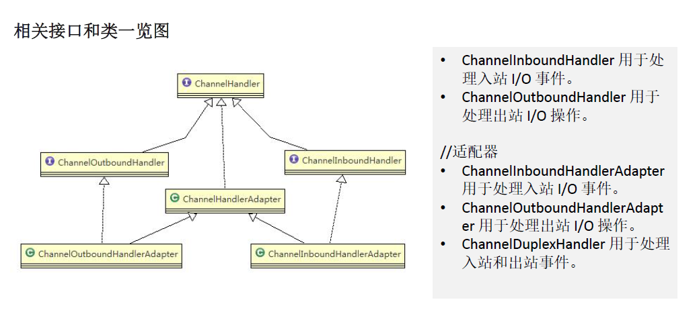

4) 我们经常需要自定义一个 Handler 类去继承ChannelInboundHandlerAdapter，然后通过重写相应方法实现业务逻辑，我们接下来看看一般都需要重写哪些方法

```java
public class ChannelInboundHandlerAdapter extends ChannelHandlerAdapter
implements ChannelInboundHandler {
	public ChannelInboundHandlerAdapter() { }
	public void channelRegistered(ChannelHandlerContext ctx) throws Exception {
		ctx.fireChannelRegistered();
	}
	public void channelUnregistered(ChannelHandlerContext ctx) throws Exception {
		ctx.fireChannelUnregistered();
	}
	//通道就绪事件
	public void channelActive(ChannelHandlerContext ctx) throws Exception {
		ctx.fireChannelActive();
	}
    public void channelInactive(ChannelHandlerContext ctx) throws Exception {
    	ctx.fireChannelInactive();
    }
    //通道读取数据事件
    public void channelRead(ChannelHandlerContext ctx, Object msg) throws
    Exception {
    	ctx.fireChannelRead(msg);
    }
	//数据读取完毕事件
	public void channelReadComplete(ChannelHandlerContext ctx)throws Exception {
        ctx.fireChannelReadComplete()
    }
    public void userEventTriggered(ChannelHandlerContext ctx，Object evt）throws Exception {
        ctx.fireUserEventTriggered(evt);
    }
    public void channelWritabilityChanged(ChannelHandlerContext ctx)throws Exception {
        ctx.fireChannelWritabilityChanged();
    }
	//通道发生异常事件1三A2-2
	public void exceptionGaught(ChannelHandlerContext ctx，Throwable cause)
	throws Exception{
         ctx.fireExceptionCaught(cause);
    }
 }

```

## Pipeline 和 ChannelPipeline

ChannelPipeline 是一个重点：
1) ChannelPipeline 是一个 Handler 的集合，它负责处理和拦截 inbound 或者outbound 的事件和操作，相当于一个贯穿 Netty 的链。(也可以这样理解：**ChannelPipeline 是 保存 ChannelHandler 的 List，用于处理或拦截 Channel 的入站事件和出站操作**)

2) ChannelPipeline 实现了一种高级形式的拦截过滤器模式，使用户可以完全控制事件的处理方式，以及 Channel 中各个的 ChannelHandler 如何相互交互

3) 在 Netty 中每个 Channel 都有且仅有一个 ChannelPipeline 与之对应，它们的组成关系如下

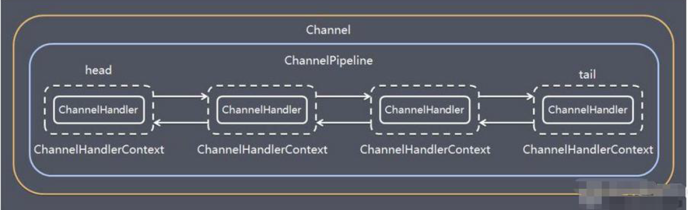

• 一个 Channel 包含了一个 ChannelPipeline，而 **ChannelPipeline 中又维护了一个由 ChannelHandlerContext组成的双向链表，并且每个 ChannelHandlerContext 中又关联着一个 ChannelHandle**r
• 入站事件和出站事件在一个双向链表中，入站事件会从链表 head 往后传递到最后一个入站的 handler，出站事件会从链表 tail 往前传递到最前一个出站的 handler，两种类型的 handler 互不干扰

4) 常用方法
• `ChannelPipeline addFirst(ChannelHandler... handlers)`，把一个业务处理类（handler）添加到链中的第一个位置
• `ChannelPipeline addLast(ChannelHandler... handlers)`，把一个业务处理类（handler）添加到链中的最后一个位置

## ChannelHandlerContext

1) 保存 Channel 相关的所有上下文信息，同时关联一个 ChannelHandler 对象

2) 即ChannelHandlerContext 中 包 含 一 个 具 体 的 事 件 处 理 器 ChannelHandler ，同 时ChannelHandlerContext 中也绑定了对应的 pipeline 和 Channel 的信息，方便对 ChannelHandler进行调用.

3) 常用方法
• `ChannelFuture close()`，关闭通道
• `ChannelOutboundInvoker flush()`，刷新
• `ChannelFuture writeAndFlush(Object msg)` ， 将 数 据 写 到 ChannelPipeline 中 当 前ChannelHandler 的下一个 ChannelHandler 开始处理（出站）

## ChannelOption

1) Netty 在创建 Channel 实例后,一般都需要设置 ChannelOption 参数。
2) ChannelOption 参数如下:
`ChannelOption.SO_BACKLOG`
对应 TCP/IP 协议 listen 函数中的 backlog 参数，用来初始化服务器可连接队列大小。服务端处理客户端连接请求是顺序处理的，所以同一时间只能处理一个客户端连接。多个客户端来的时候，服务端将不能处理的客户端连接请求放在队列中等待处理，backlog 参数指定了队列的大小。
`ChannelOption.SO_KEEPALIVE`
一直保持连接活动状态

## EventLoopGroup 和其实现类 NioEventLoopGroup

1) EventLoopGroup 是一组 EventLoop 的抽象，Netty 为了更好的利用多核 CPU 资源，一般会有多个 EventLoop 同时工作，每个 EventLoop 维护着一个 Selector 实例。
2) EventLoopGroup 提供 next 接口，可以从组里面按照一定规则获取其中一个EventLoop来处理任务。在 Netty 服务器端编程中，我们一般都需要提供两个
EventLoopGroup，例如：BossEventLoopGroup 和 WorkerEventLoopGroup。

3) 通常一个服务端口即一个 ServerSocketChannel对应一个Selector 和一个EventLoop线程。BossEventLoop 负责接收客户端的连接并将 SocketChannel 交给
WorkerEventLoopGroup 来进行 IO 处理，如下图所示

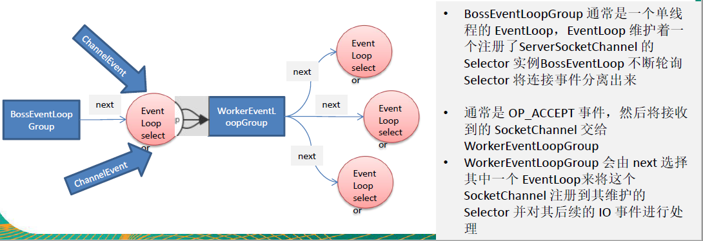

4) 常用方法
• `public NioEventLoopGroup()`，构造方法
• `public Future<?> shutdownGracefully()`，断开连接，关闭线程

## Unpooled 类

1) Netty 提供一个专门用来操作缓冲区(即Netty的数据容器)的工具类
2) 常用方法如下所示

```java
//通过给定的数据和字符编码返回一个 ByteBuf 对象（类似于 NIO 中的 ByteBuffer 但有区别）
public static ByteBuf copiedBuffer(CharSequence string, Charset charset)
```

3) 举例说明Unpooled 获取 Netty的数据容器ByteBuf 的基本使用 【案例演示】

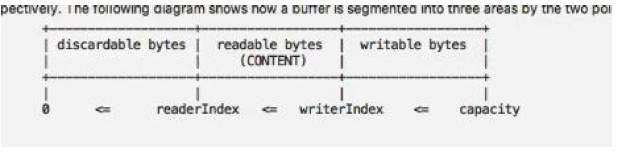

## Netty应用实例-群聊系统

实例要求:
1) 编写一个 Netty 群聊系统，实现服务器端和客户端之间的数据简单通讯（非阻塞）
2) 实现多人群聊
3) 服务器端：可以监测用户上线，离线，并实现消息转发功能
4) 客户端：通过channel 可以无阻塞发送消息给其它所有用户，同时可以接受其它用
户发送的消息(有服务器转发得到)
5) 目的：进一步理解Netty非阻塞网络编程机制

## Netty心跳检测机制案例

实例要求:
1) 编写一个 Netty心跳检测机制案例, 当服务器超过3秒没有读时，就提示读空闲
2) 当服务器超过5秒没有写操作时，就提示写空闲
3) 实现当服务器超过7秒没有读或者写操作时，就提示读写空闲

Netty 通过WebSocket编程实现服务器和客户端长连接
实例要求:
1) Http协议是无状态的, 浏览器和服务器间的请求响应一次，下一次会重新创建连接.
2) 要求：实现基于webSocket的长连接的全双工的交互

3) 改变Http协议多次请求的约束，实现长连接了， 服务器可以发送消息给浏览器
4) 客户端浏览器和服务器端会相互感知，比如服务器关闭了，浏览器会感知，同样浏览器关闭了，服务器会感知

# Google Protobuf