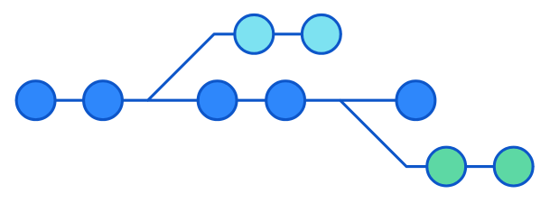
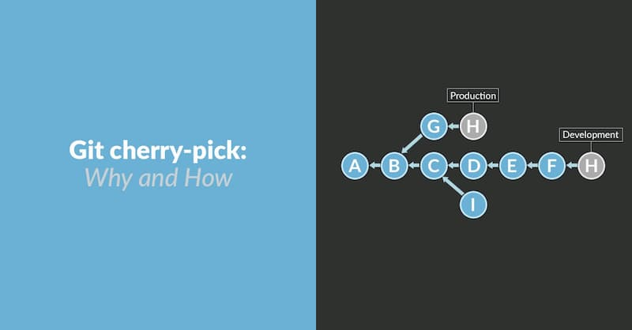

# 常用 Git 命令清单

http://www.ruanyifeng.com/blog/2015/12/)

我每天使用 Git ，但是很多命令记不住。

一般来说，日常使用只要记住下图6个命令，就可以了。但是熟练使用，恐怕要记住60～100个命令。


下面是我整理的常用 Git 命令清单。几个专用名词的译名如下。

 - Workspace：工作区
 - Index / Stage：暂存区
 - Repository：仓库区（或本地仓库）
 - Remote：远程仓库

## 一、新建代码库

 ```bash
 # 在当前目录新建一个Git代码库
 $ git init
 
 # 新建一个目录，将其初始化为Git代码库
 $ git init [project-name]
 
 # 下载一个项目和它的整个代码历史
 $ git clone [url]
 ```

## 二、配置

Git的设置文件为`.gitconfig`，它可以在用户主目录下（全局配置），也可以在项目目录下（项目配置）。

 ```bash
 # 显示当前的Git配置
 $ git config --list
 
 # 编辑Git配置文件
 $ git config -e [--global]
 
 # 设置提交代码时的用户信息
 $ git config [--global] user.name "[name]"
 $ git config [--global] user.email "[email address]"
 ```

## 三、增加/删除文件

 ```bash
 # 添加指定文件到暂存区
 $ git add [file1] [file2] ...
 
 # 添加指定目录到暂存区，包括子目录
 $ git add [dir]
 
 # 添加当前目录的所有文件到暂存区
 $ git add .
 
 # 添加每个变化前，都会要求确认
 # 对于同一个文件的多处变化，可以实现分次提交
 $ git add -p
 
 # 删除工作区文件，并且将这次删除放入暂存区
 $ git rm [file1] [file2] ...
 
 # 停止追踪指定文件，但该文件会保留在工作区
 $ git rm --cached [file]
 
 # 改名文件，并且将这个改名放入暂存区
 $ git mv [file-original] [file-renamed]
 ```

## 四、代码提交

 ```bash
 # 提交暂存区到仓库区
 $ git commit -m [message]
 
 # 提交暂存区的指定文件到仓库区
 $ git commit [file1] [file2] ... -m [message]
 
 # 提交工作区自上次commit之后的变化，直接到仓库区
 $ git commit -a
 
 # 提交时显示所有diff信息
 $ git commit -v
 
 # 使用一次新的commit，替代上一次提交
 # 如果代码没有任何新变化，则用来改写上一次commit的提交信息
 $ git commit --amend -m [message]
 
 # 重做上一次commit，并包括指定文件的新变化
 $ git commit --amend [file1] [file2] ...
 ```

## 五、分支

 ```bash
 # 列出所有本地分支
 $ git branch
 
 # 列出所有远程分支
 $ git branch -r
 
 # 列出所有本地分支和远程分支
 $ git branch -a
 
 # 新建一个分支，但依然停留在当前分支
 $ git branch [branch-name]
 
 # 新建一个分支，并切换到该分支
 $ git checkout -b [branch]
 
 # 新建一个分支，指向指定commit
 $ git branch [branch] [commit]
 
 # 新建一个分支，与指定的远程分支建立追踪关系
 $ git branch --track [branch] [remote-branch]
 
 # 切换到指定分支，并更新工作区
 $ git checkout [branch-name]
 
 # 切换到上一个分支
 $ git checkout -
 
 # 建立追踪关系，在现有分支与指定的远程分支之间
 $ git branch --set-upstream [branch] [remote-branch]
 
 # 合并指定分支到当前分支
 $ git merge [branch]
 
 # 选择一个commit，合并进当前分支
 $ git cherry-pick [commit]
 
 # 删除分支
 $ git branch -d [branch-name]
 
 # 删除远程分支
 $ git push origin --delete [branch-name]
 $ git branch -dr [remote/branch]
 
 #将main分支强制指向commiter
 $ git branch -f main commiter
 ```

## 六、标签

 ```bash
 # 列出所有tag
 $ git tag
 
 # 新建一个tag在当前commit
 $ git tag [tag]
 
 # 新建一个tag在指定commit
 $ git tag [tag] [commit]
 
 # 删除本地tag
 $ git tag -d [tag]
 
 # 删除远程tag
 $ git push origin :refs/tags/[tagName]
 
 # 查看tag信息
 $ git show [tag]
 
 # 提交指定tag
 $ git push [remote] [tag]
 
 # 提交所有tag
 $ git push [remote] --tags
 
 # 新建一个分支，指向某个tag
 $ git checkout -b [branch] [tag]
 ```

## 七、查看信息

 ```bash
 # 显示有变更的文件
 $ git status
 
 # 显示当前分支的版本历史
 $ git log
 
 # 显示commit历史，以及每次commit发生变更的文件
 $ git log --stat
 
 # 搜索提交历史，根据关键词
 $ git log -S [keyword]
 
 # 显示某个commit之后的所有变动，每个commit占据一行
 $ git log [tag] HEAD --pretty=format:%s
 
 # 显示某个commit之后的所有变动，其"提交说明"必须符合搜索条件
 $ git log [tag] HEAD --grep feature
 
 # 显示某个文件的版本历史，包括文件改名
 $ git log --follow [file]
 $ git whatchanged [file]
 
 # 显示指定文件相关的每一次diff
 $ git log -p [file]
 
 # 显示过去5次提交
 $ git log -5 --pretty --oneline
 
 # 显示所有提交过的用户，按提交次数排序
 $ git shortlog -sn
 
 # 显示指定文件是什么人在什么时间修改过
 $ git blame [file]
 
 # 显示暂存区和工作区的差异
 $ git diff
 
 # 显示暂存区和上一个commit的差异
 $ git diff --cached [file]
 
 # 显示工作区与当前分支最新commit之间的差异
 $ git diff HEAD
 
 # 显示两次提交之间的差异
 $ git diff [first-branch]...[second-branch]
 
 # 显示今天你写了多少行代码
 $ git diff --shortstat "@{0 day ago}"
 
 # 显示某次提交的元数据和内容变化
 $ git show [commit]
 
 # 显示某次提交发生变化的文件
 $ git show --name-only [commit]
 
 # 显示某次提交时，某个文件的内容
 $ git show [commit]:[filename]
 
 # 显示当前分支的最近几次提交
 $ git reflog
 ```

## 八、远程同步

 ```bash
 # 下载远程仓库的所有变动
 $ git fetch [remote]
 
 # 显示所有远程仓库
 $ git remote -v
 
 # 显示某个远程仓库的信息
 $ git remote show [remote]
 
 # 增加一个新的远程仓库，并命名
 $ git remote add [shortname] [url]
 
 # 取回远程仓库的变化，并与本地分支合并
 $ git pull [remote] [branch]
 
 # 上传本地指定分支到远程仓库
 $ git push [remote] [branch]
 
 # 强行推送当前分支到远程仓库，即使有冲突
 $ git push [remote] --force
 
 # 推送所有分支到远程仓库
 $ git push [remote] --all
 ```

## 九、撤销

 ```bash
 # 恢复暂存区的指定文件到工作区
 $ git checkout [file]
 
 # 恢复某个commit的指定文件到暂存区和工作区
 $ git checkout [commit] [file]
 
 # 恢复暂存区的所有文件到工作区
 $ git checkout .
 
 # 重置暂存区的指定文件，与上一次commit保持一致，但工作区不变
 $ git reset [file]
 
 # 重置暂存区与工作区，与上一次commit保持一致
 $ git reset --hard
 
 # 重置当前分支的指针为指定commit，同时重置暂存区，但工作区不变
 $ git reset [commit]
 
 # 重置当前分支的HEAD为指定commit，同时重置暂存区和工作区，与指定commit一致
 $ git reset --hard [commit]
 
 # 重置当前HEAD为指定commit，但保持暂存区和工作区不变
 $ git reset --keep [commit]
 
 # 新建一个commit，用来撤销指定commit
 # 后者的所有变化都将被前者抵消，并且应用到当前分支
 $ git revert [commit]
 
 # 暂时将未提交的变化移除，稍后再移入
 $ git stash
 $ git stash pop
 ```

## 十、其他

 ```bash
 # 生成一个可供发布的压缩包
 $ git archive
 ```

# Git 原理入门

Git 是最流行的版本管理工具，也是程序员的必备技能之一。

即使天天使用它，很多人也未必了解它的原理。Git 为什么可以管理版本？`git add`、`git commit`这些[基本命令](https://www.ruanyifeng.com/blog/2015/12/git-cheat-sheet.html)，到底在做什么，你说得清楚吗？

这篇文章用一个实例，解释 Git 的运行过程，帮助你理解 Git 的原理。



## 一、初始化

首先，让我们创建一个项目目录，并进入该目录。

> ```bash
> $ mkdir git-demo-project
> $ cd git-demo-project
> ```

我们打算对该项目进行版本管理，第一件事就是使用`git init`命令，进行初始化。

> ```bash
> $ git init
> ```

`git init`命令只做一件事，就是在项目根目录下创建一个`.git`子目录，用来保存版本信息。

> ```bash
> $ ls .git
> 
> branches/
> config
> description
> HEAD
> hooks/
> info/
> objects/
> refs/
> ```

上面命令显示，`.git`内部还有一些子目录，这里先不解释它们的含义。

## 二、保存对象

接下来，新建一个空文件`test.txt`。

> ```bash
> $ touch test.txt
> ```

然后，把这个文件加入 Git 仓库，也就是为`test.txt`的当前内容创建一个副本。

> ```bash
> $ git hash-object -w test.txt
> 
> e69de29bb2d1d6434b8b29ae775ad8c2e48c5391
> ```

上面代码中，`git hash-object`命令把`test.txt`的当前内容压缩成二进制文件，存入 Git。压缩后的二进制文件，称为一个 Git 对象，保存在`.git/objects`目录。

这个命令还会计算当前内容的 SHA1 哈希值（长度40的字符串），作为该对象的文件名。下面看一下这个新生成的 Git 对象文件。

> ```bash
> $ ls -R .git/objects
> 
> .git/objects/e6:
> 9de29bb2d1d6434b8b29ae775ad8c2e48c5391
> ```

上面代码可以看到，`.git/objects`下面多了一个子目录，目录名是哈希值的前2个字符，该子目录下面有一个文件，文件名是哈希值的后38个字符。

再看一下这个文件的内容。

> ```bash
> $ cat .git/objects/e6/9de29bb2d1d6434b8b29ae775ad8c2e48c5391
> ```

上面代码输出的文件内容，都是一些二进制字符。你可能会问，`test.txt`是一个空文件，为什么会有内容？这是因为二进制对象里面还保存一些元数据。

如果想看该文件原始的文本内容，要用`git cat-file`命令。

> ```bash
> $ git cat-file -p e69de29bb2d1d6434b8b29ae775ad8c2e48c5391
> ```

因为原始文件是空文件，所以上面的命令什么也看不到。现在向`test.txt`写入一些内容。

> ```bash
> $ echo 'hello world' > test.txt
> ```

因为文件内容已经改变，需要将它再次保存成 Git 对象。

> ```bash
> $ git hash-object -w test.txt
> 
> 3b18e512dba79e4c8300dd08aeb37f8e728b8dad
> ```

上面代码可以看到，随着内容改变，`test.txt`的哈希值已经变了。同时，新文件`.git/objects/3b/18e512dba79e4c8300dd08aeb37f8e728b8dad`也已经生成了。现在可以看到文件内容了。

> ```bash
> $ git cat-file -p 3b18e512dba79e4c8300dd08aeb37f8e728b8dad
> 
> hello world
> ```

## 三、暂存区

文件保存成二进制对象以后，还需要通知 Git 哪些文件发生了变动。所有变动的文件，Git 都记录在一个区域，叫做"暂存区"（英文叫做 index 或者 stage）。等到变动告一段落，再统一把暂存区里面的文件写入正式的版本历史。

`git update-index`命令用于在暂存区记录一个发生变动的文件。

> ```bash
> $ git update-index --add --cacheinfo 100644 \
> 3b18e512dba79e4c8300dd08aeb37f8e728b8dad test.txt
> ```

上面命令向暂存区写入文件名`test.txt`、二进制对象名（哈希值）和文件权限。

`git ls-files`命令可以显示暂存区当前的内容。

> ```bash
> $ git ls-files --stage
> 
> 100644 3b18e512dba79e4c8300dd08aeb37f8e728b8dad 0   test.txt
> ```

上面代码表示，暂存区现在只有一个文件`test.txt`，以及它的二进制对象名和权限。知道了二进制对象名，就可以在`.git/objects`子目录里面读出这个文件的内容。

`git status`命令会产生更可读的结果。

> ```bash
> $ git status
> 
> 要提交的变更：
>     新文件：   test.txt
> ```

上面代码表示，暂存区里面只有一个新文件`test.txt`，等待写入历史。

## 四、git add 命令

上面两步（保存对象和更新暂存区），如果每个文件都做一遍，那是很麻烦的。Git 提供了`git add`命令简化操作。

> ```bash
> $ git add --all
> ```

上面命令相当于，对当前项目所有变动的文件，执行前面的两步操作。

## 五、commit 的概念

暂存区保留本次变动的文件信息，等到修改了差不多了，就要把这些信息写入历史，这就相当于生成了当前项目的一个快照（snapshot）。

项目的历史就是由不同时点的快照构成。Git 可以将项目恢复到任意一个快照。快照在 Git 里面有一个专门名词，叫做 commit，生成快照又称为完成一次提交。

下文所有提到"快照"的地方，指的就是 commit。

## 六、完成提交

首先，设置一下用户名和 Email，保存快照的时候，会记录是谁提交的。

> ```bash
> $ git config user.name "用户名" 
> $ git config user.email "Email 地址"
> ```

接下来，要保存当前的目录结构。前面保存对象的时候，只是保存单个文件，并没有记录文件之间的目录关系（哪个文件在哪里）。

`git write-tree`命令用来将当前的目录结构，生成一个 Git 对象。

> ```bash
> $ git write-tree
> 
> c3b8bb102afeca86037d5b5dd89ceeb0090eae9d
> ```

上面代码中，目录结构也是作为二进制对象保存的，也保存在`.git/objects`目录里面，对象名就是哈希值。

让我们看一下这个文件的内容。

> ```bash
> $ git cat-file -p c3b8bb102afeca86037d5b5dd89ceeb0090eae9d
> 
> 100644 blob 3b18e512dba79e4c8300dd08aeb37f8e728b8dad    test.txt
> ```

可以看到，当前的目录里面只有一个`test.txt`文件。

所谓快照，就是保存当前的目录结构，以及每个文件对应的二进制对象。上一个操作，目录结构已经保存好了，现在需要将这个目录结构与一些元数据一起写入版本历史。

`git commit-tree`命令用于将目录树对象写入版本历史。

> ```bash
> $ echo "first commit" | git commit-tree c3b8bb102afeca86037d5b5dd89ceeb0090eae9d
> 
> c9053865e9dff393fd2f7a92a18f9bd7f2caa7fa
> ```

上面代码中，提交的时候需要有提交说明，`echo "first commit"`就是给出提交说明。然后，`git commit-tree`命令将元数据和目录树，一起生成一个 Git 对象。现在，看一下这个对象的内容。

> ```bash
> $ git cat-file -p c9053865e9dff393fd2f7a92a18f9bd7f2caa7fa
> 
> tree c3b8bb102afeca86037d5b5dd89ceeb0090eae9d
> author ruanyf  1538889134 +0800
> committer ruanyf  1538889134 +0800
> 
> first commit
> ```

上面代码中，输出结果的第一行是本次快照对应的目录树对象（tree），第二行和第三行是作者和提交人信息，最后是提交说明。

`git log`命令也可以用来查看某个快照信息。

> ```bash
> $ git log --stat c9053865e9dff393fd2f7a92a18f9bd7f2caa7fa
> 
> commit c9053865e9dff393fd2f7a92a18f9bd7f2caa7fa
> Author: ruanyf 
> Date:   Sun Oct 7 13:12:14 2018 +0800
> 
>     first commit
> 
>  test.txt | 1 +
>  1 file changed, 1 insertion(+)
> ```

## 七、git commit 命令

Git 提供了`git commit`命令，简化提交操作。保存进暂存区以后，只要`git commit`一个命令，就同时提交目录结构和说明，生成快照。

> ```bash
> $ git commit -m "first commit"
> ```

此外，还有两个命令也很有用。

`git checkout`命令用于切换到某个快照。

> ```bash
> $ git checkout c9053865e9dff393fd2f7a92a18f9bd7f2caa7fa
> ```

`git show`命令用于展示某个快照的所有代码变动。

> ```bash
> $ git show c9053865e9dff393fd2f7a92a18f9bd7f2caa7fa
> ```

## 八、branch 的概念

到了这一步，还没完。如果这时用`git log`命令查看整个版本历史，你看不到新生成的快照。

> ```bash
> $ git log
> ```

上面命令没有任何输出，这是为什么呢？快照明明已经写入历史了。

原来`git log`命令只显示当前分支的变动，虽然我们前面已经提交了快照，但是还没有记录这个快照属于哪个分支。

所谓分支（branch）就是指向某个快照的指针，分支名就是指针名。哈希值是无法记忆的，分支使得用户可以为快照起别名。而且，分支会自动更新，如果当前分支有新的快照，指针就会自动指向它。比如，master 分支就是有一个叫做 master 指针，它指向的快照就是 master 分支的当前快照。

用户可以对任意快照新建指针。比如，新建一个 fix-typo 分支，就是创建一个叫做 fix-typo 的指针，指向某个快照。所以，Git 新建分支特别容易，成本极低。

Git 有一个特殊指针`HEAD`， 总是指向当前分支的最近一次快照。另外，Git 还提供简写方式，`HEAD^`指向 `HEAD`的前一个快照（父节点），`HEAD~6`则是`HEAD`之前的第6个快照。

每一个分支指针都是一个文本文件，保存在`.git/refs/heads/`目录，该文件的内容就是它所指向的快照的二进制对象名（哈希值）。

## 九、更新分支

下面演示更新分支是怎么回事。首先，修改一下`test.txt`。

> ```bash
> $ echo "hello world again" > test.txt
> ```

然后，保存二进制对象。

> ```bash
> $ git hash-object -w test.txt
> 
> c90c5155ccd6661aed956510f5bd57828eec9ddb
> ```

接着，将这个对象写入暂存区，并保存目录结构。

> ```bash
> $ git update-index test.txt
> $ git write-tree
> 
> 1552fd52bc14497c11313aa91547255c95728f37
> ```

最后，提交目录结构，生成一个快照。

> ```bash
> $ echo "second commit" | git commit-tree 1552fd52bc14497c11313aa91547255c95728f37 -p c9053865e9dff393fd2f7a92a18f9bd7f2caa7fa
> 
> 785f188674ef3c6ddc5b516307884e1d551f53ca
> ```

上面代码中，`git commit-tree`的`-p`参数用来指定父节点，也就是本次快照所基于的快照。

现在，我们把本次快照的哈希值，写入`.git/refs/heads/master`文件，这样就使得`master`指针指向这个快照。

> ```bash
> $ echo 785f188674ef3c6ddc5b516307884e1d551f53ca > .git/refs/heads/master
> ```

现在，`git log`就可以看到两个快照了。

> ```bash
> $ git log
> 
> commit 785f188674ef3c6ddc5b516307884e1d551f53ca (HEAD -> master)
> Author: ruanyf 
> Date:   Sun Oct 7 13:38:00 2018 +0800
> 
>     second commit
> 
> commit c9053865e9dff393fd2f7a92a18f9bd7f2caa7fa
> Author: ruanyf 
> Date:   Sun Oct 7 13:12:14 2018 +0800
> 
>     first commit
> ```

`git log`的运行过程是这样的：

> 1. 查找`HEAD`指针对应的分支，本例是`master`
> 2. 找到`master`指针指向的快照，本例是`785f188674ef3c6ddc5b516307884e1d551f53ca`
> 3. 找到父节点（前一个快照）`c9053865e9dff393fd2f7a92a18f9bd7f2caa7fa`
> 4. 以此类推，显示当前分支的所有快照

最后，补充一点。前面说过，分支指针是动态的。原因在于，下面三个命令会自动改写分支指针。

> - `git commit`：当前分支指针移向新创建的快照。
> - `git pull`：当前分支与远程分支合并后，指针指向新创建的快照。
> - `git reset [commit_sha]`：当前分支指针重置为指定快照。

## 十、参考链接

- [How does git work internally](https://medium.com/@shalithasuranga/how-does-git-work-internally-7c36dcb1f2cf), Shalitha Suranga


# Git 使用规范流程

团队开发中，遵循一个合理、清晰的Git使用流程，是非常重要的。

否则，每个人都提交一堆杂乱无章的commit，项目很快就会变得难以协调和维护。

下面是[ThoughtBot](https://github.com/thoughtbot/guides/tree/master/protocol/git) 的Git使用规范流程。我从中学到了很多，推荐你也这样使用Git。


## 第一步：新建分支

首先，每次开发新功能，都应该新建一个单独的分支（这方面可以参考[《Git分支管理策略》](https://www.ruanyifeng.com/blog/2012/07/git.html)）。

> ```bash
> # 获取主干最新代码
> $ git checkout master
> $ git pull
> 
> # 新建一个开发分支myfeature
> $ git checkout -b myfeature
> ```

## 第二步：提交分支commit

分支修改后，就可以提交commit了。

> ```bash
> $ git add --all
> $ git status
> $ git commit --verbose
> ```

git add 命令的all参数，表示保存所有变化（包括新建、修改和删除）。从Git 2.0开始，all是 git add 的默认参数，所以也可以用 git add . 代替。

git status 命令，用来查看发生变动的文件。

git commit 命令的verbose参数，会列出 [diff](https://www.ruanyifeng.com/blog/2012/08/how_to_read_diff.html) 的结果。

## 第三步：撰写提交信息

提交commit时，必须给出完整扼要的提交信息，下面是一个范本。

> ```bash
> Present-tense summary under 50 characters
> 
> * More information about commit (under 72 characters).
> * More information about commit (under 72 characters).
> 
> http://project.management-system.com/ticket/123
> ```

第一行是不超过50个字的提要，然后空一行，罗列出改动原因、主要变动、以及需要注意的问题。最后，提供对应的网址（比如Bug ticket）。

## 第四步：与主干同步

分支的开发过程中，要经常与主干保持同步。

> ```bash
> $ git fetch origin
> $ git rebase origin/master
> ```

## 第五步：合并commit

分支开发完成后，很可能有一堆commit，但是合并到主干的时候，往往希望只有一个（或最多两三个）commit，这样不仅清晰，也容易管理。

那么，怎样才能将多个commit合并呢？这就要用到 git rebase 命令。

> ```bash
> $ git rebase -i origin/master
> ```

git rebase命令的i参数表示互动（interactive），这时git会打开一个互动界面，进行下一步操作。

下面采用[Tute Costa](https://robots.thoughtbot.com/git-interactive-rebase-squash-amend-rewriting-history)的例子，来解释怎么合并commit。

> ```bash
> pick 07c5abd Introduce OpenPGP and teach basic usage
> pick de9b1eb Fix PostChecker::Post#urls
> pick 3e7ee36 Hey kids, stop all the highlighting
> pick fa20af3 git interactive rebase, squash, amend
> 
> # Rebase 8db7e8b..fa20af3 onto 8db7e8b
> #
> # Commands:
> #  p, pick = use commit
> #  r, reword = use commit, but edit the commit message
> #  e, edit = use commit, but stop for amending
> #  s, squash = use commit, but meld into previous commit
> #  f, fixup = like "squash", but discard this commit's log message
> #  x, exec = run command (the rest of the line) using shell
> #
> # These lines can be re-ordered; they are executed from top to bottom.
> #
> # If you remove a line here THAT COMMIT WILL BE LOST.
> #
> # However, if you remove everything, the rebase will be aborted.
> #
> # Note that empty commits are commented out
> ```

上面的互动界面，先列出当前分支最新的4个commit（越下面越新）。每个commit前面有一个操作命令，默认是pick，表示该行commit被选中，要进行rebase操作。

4个commit的下面是一大堆注释，列出可以使用的命令。

> - pick：正常选中
> - reword：选中，并且修改提交信息；
> - edit：选中，rebase时会暂停，允许你修改这个commit（参考[这里](https://schacon.github.io/gitbook/4_interactive_rebasing.html)）
> - squash：选中，会将当前commit与上一个commit合并
> - fixup：与squash相同，但不会保存当前commit的提交信息
> - exec：执行其他shell命令

上面这6个命令当中，squash和fixup可以用来合并commit。先把需要合并的commit前面的动词，改成squash（或者s）。

> ```bash
> pick 07c5abd Introduce OpenPGP and teach basic usage
> s de9b1eb Fix PostChecker::Post#urls
> s 3e7ee36 Hey kids, stop all the highlighting
> pick fa20af3 git interactive rebase, squash, amend
> ```

这样一改，执行后，当前分支只会剩下两个commit。第二行和第三行的commit，都会合并到第一行的commit。提交信息会同时包含，这三个commit的提交信息。

> ```bash
> # This is a combination of 3 commits.
> # The first commit's message is:
> Introduce OpenPGP and teach basic usage
> 
> # This is the 2nd commit message:
> Fix PostChecker::Post#urls
> 
> # This is the 3rd commit message:
> Hey kids, stop all the highlighting
> ```

如果将第三行的squash命令改成fixup命令。

> ```bash
> pick 07c5abd Introduce OpenPGP and teach basic usage
> s de9b1eb Fix PostChecker::Post#urls
> f 3e7ee36 Hey kids, stop all the highlighting
> pick fa20af3 git interactive rebase, squash, amend
> ```

运行结果相同，还是会生成两个commit，第二行和第三行的commit，都合并到第一行的commit。但是，新的提交信息里面，第三行commit的提交信息，会被注释掉。

> ```bash
> # This is a combination of 3 commits.
> # The first commit's message is:
> Introduce OpenPGP and teach basic usage
> 
> # This is the 2nd commit message:
> Fix PostChecker::Post#urls
> 
> # This is the 3rd commit message:
> # Hey kids, stop all the highlighting
> ```

[Pony Foo](https://ponyfoo.com/articles/git-github-hacks)提出另外一种合并commit的简便方法，就是先撤销过去5个commit，然后再建一个新的。

> ```bash
> $ git reset HEAD~5
> $ git add .
> $ git commit -am "Here's the bug fix that closes #28"
> $ git push --force
> ```

squash和fixup命令，还可以当作命令行参数使用，自动合并commit。

> ```bash
> $ git commit --fixup  
> $ git rebase -i --autosquash 
> ```

这个用法请参考[这篇文章](https://fle.github.io/git-tip-keep-your-branch-clean-with-fixup-and-autosquash.html)，这里就不解释了。

## 第六步：推送到远程仓库

合并commit后，就可以推送当前分支到远程仓库了。

> ```bash
> $ git push --force origin myfeature
> ```

git push命令要加上force参数，因为rebase以后，分支历史改变了，跟远程分支不一定兼容，有可能要强行推送（参见[这里](http://willi.am/blog/2014/08/12/the-dark-side-of-the-force-push/)）。

## 第七步：发出Pull Request

提交到远程仓库以后，就可以发出 Pull Request 到master分支，然后请求别人进行代码review，确认可以合并到master。

# 如何撤销 Git 操作？

## 一、撤销提交

一种常见的场景是，提交代码以后，你突然意识到这个提交有问题，应该撤销掉，这时执行下面的命令就可以了。

> ```bash
> $ git revert HEAD
> ```

上面命令的原理是，在当前提交后面，新增一次提交，抵消掉上一次提交导致的所有变化。它不会改变过去的历史，所以是首选方式，没有任何丢失代码的风险。

`git revert` 命令只能抵消上一个提交，如果想抵消多个提交，必须在命令行依次指定这些提交。比如，抵消前两个提交，要像下面这样写。

> ```bash
> $ git revert [倒数第一个提交] [倒数第二个提交]
> ```

`git revert`命令还有两个参数。

> - `--no-edit`：执行时不打开默认编辑器，直接使用 Git 自动生成的提交信息。
> - `--no-commit`：只抵消暂存区和工作区的文件变化，不产生新的提交。

## 二、丢弃提交

如果希望以前的提交在历史中彻底消失，而不是被抵消掉，可以使用`git reset`命令，丢弃掉某个提交之后的所有提交。

> ```bash
> $ git reset [last good SHA]
> ```

`git reset`的原理是，让最新提交的指针回到以前某个时点，该时点之后的提交都从历史中消失。

默认情况下，`git reset`不改变工作区的文件（但会改变暂存区），`--hard`参数可以让工作区里面的文件也回到以前的状态。

> ```bash
> $ git reset --hard [last good SHA]
> ```

执行`git reset`命令之后，如果想找回那些丢弃掉的提交，可以使用`git reflog`命令，具体做法参考[这里](https://github.blog/2015-06-08-how-to-undo-almost-anything-with-git/#redo-after-undo-local)。不过，这种做法有时效性，时间长了可能找不回来。

## 三、替换上一次提交

提交以后，发现提交信息写错了，这时可以使用`git commit`命令的`--amend`参数，可以修改上一次的提交信息。

> ```bash
> $ git commit --amend -m "Fixes bug #42"
> ```

它的原理是产生一个新的提交对象，替换掉上一次提交产生的提交对象。

这时如果暂存区有发生变化的文件，会一起提交到仓库。所以，`--amend`不仅可以修改提交信息，还可以整个把上一次提交替换掉。

## 四、撤销工作区的文件修改

如果工作区的某个文件被改乱了，但还没有提交，可以用`git checkout`命令找回本次修改之前的文件。

> ```bash
> $ git checkout -- [filename]
> ```

它的原理是先找暂存区，如果该文件有暂存的版本，则恢复该版本，否则恢复上一次提交的版本。

注意，工作区的文件变化一旦被撤销，就无法找回了。

## 五、从暂存区撤销文件

如果不小心把一个文件添加到暂存区，可以用下面的命令撤销。

> ```bash
> $ git rm --cached [filename]
> ```

上面的命令不影响已经提交的内容。

## 六、撤销当前分支的变化

你在当前分支上做了几次提交，突然发现放错了分支，这几个提交本应该放到另一个分支。

> ```bash
> # 新建一个 feature 分支，指向当前最新的提交
> # 注意，这时依然停留在当前分支
> $ git branch feature
> 
> # 切换到这几次提交之前的状态
> $ git reset --hard [当前分支此前的最后一次提交]
> 
> # 切换到 feature 分支
> $ git checkout feature
> ```

上面的操作等于是撤销当前分支的变化，将这些变化放到一个新建的分支。

# `git cherry-pick` 教程

对于多分支的代码库，将代码从一个分支转移到另一个分支是常见需求。

这时分两种情况。一种情况是，你需要另一个分支的所有代码变动，那么就采用合并（`git merge`）。另一种情况是，你只需要部分代码变动（某几个提交），这时可以采用 Cherry pick。



## 一、基本用法

`git cherry-pick`命令的作用，就是将指定的提交（commit）应用于其他分支。

> ```bash
> $ git cherry-pick <commitHash>
> ```

上面命令就会将指定的提交`commitHash`，应用于当前分支。这会在当前分支产生一个新的提交，当然它们的哈希值会不一样。

举例来说，代码仓库有`master`和`feature`两个分支。

> ```bash
>     a - b - c - d   Master
>          \
>            e - f - g Feature
> ```

现在将提交`f`应用到`master`分支。

> ```bash
> # 切换到 master 分支
> $ git checkout master
> 
> # Cherry pick 操作
> $ git cherry-pick f
> ```

上面的操作完成以后，代码库就变成了下面的样子。

> ```bash
>     a - b - c - d - f   Master
>          \
>            e - f - g Feature
> ```

从上面可以看到，`master`分支的末尾增加了一个提交`f`。

`git cherry-pick`命令的参数，不一定是提交的哈希值，分支名也是可以的，表示转移该分支的最新提交。

> ```bash
> $ git cherry-pick feature
> ```

上面代码表示将`feature`分支的最近一次提交，转移到当前分支。

## 二、转移多个提交

Cherry pick 支持一次转移多个提交。

> ```bash
> $ git cherry-pick <HashA> <HashB>
> ```

上面的命令将 A 和 B 两个提交应用到当前分支。这会在当前分支生成两个对应的新提交。

如果想要转移一系列的连续提交，可以使用下面的简便语法。

> ```bash
> $ git cherry-pick A..B 
> ```

上面的命令可以转移从 A 到 B 的所有提交。它们必须按照正确的顺序放置：提交 A 必须早于提交 B，否则命令将失败，但不会报错。

注意，使用上面的命令，提交 A 将不会包含在 Cherry pick 中。如果要包含提交 A，可以使用下面的语法。

> ```bash
> $ git cherry-pick A^..B 
> ```

## 三、配置项

`git cherry-pick`命令的常用配置项如下。

**（1）`-e`，`--edit`**

打开外部编辑器，编辑提交信息。

**（2）`-n`，`--no-commit`**

只更新工作区和暂存区，不产生新的提交。

**（3）`-x`**

在提交信息的末尾追加一行`(cherry picked from commit ...)`，方便以后查到这个提交是如何产生的。

**（4）`-s`，`--signoff`**

在提交信息的末尾追加一行操作者的签名，表示是谁进行了这个操作。

**（5）`-m parent-number`，`--mainline parent-number`**

如果原始提交是一个合并节点，来自于两个分支的合并，那么 Cherry pick 默认将失败，因为它不知道应该采用哪个分支的代码变动。

`-m`配置项告诉 Git，应该采用哪个分支的变动。它的参数`parent-number`是一个从`1`开始的整数，代表原始提交的父分支编号。

> ```bash
> $ git cherry-pick -m 1 <commitHash>
> ```

上面命令表示，Cherry pick 采用提交`commitHash`来自编号1的父分支的变动。

一般来说，1号父分支是接受变动的分支（the branch being merged into），2号父分支是作为变动来源的分支（the branch being merged from）。

## 四、代码冲突

如果操作过程中发生代码冲突，Cherry pick 会停下来，让用户决定如何继续操作。

**（1）`--continue`**

用户解决代码冲突后，第一步将修改的文件重新加入暂存区（`git add .`），第二步使用下面的命令，让 Cherry pick 过程继续执行。

> ```bash
> $ git cherry-pick --continue
> ```

**（2）`--abort`**

发生代码冲突后，放弃合并，回到操作前的样子。

**（3）`--quit`**

发生代码冲突后，退出 Cherry pick，但是不回到操作前的样子。

## 五、转移到另一个代码库

Cherry pick 也支持转移另一个代码库的提交，方法是先将该库加为远程仓库。

> ```bash
> $ git remote add target git://gitUrl
> ```

上面命令添加了一个远程仓库`target`。

然后，将远程代码抓取到本地。

> ```bash
> $ git fetch target
> ```

上面命令将远程代码仓库抓取到本地。

接着，检查一下要从远程仓库转移的提交，获取它的哈希值。

> ```bash
> $ git log target/master
> ```

最后，使用`git cherry-pick`命令转移提交。

> ```bash
> $ git cherry-pick <commitHash>
> ```

（完）

# `git bisect` 命令教程

`git bisect`是一个很有用的命令，用来查找哪一次代码提交引入了错误。


它的原理很简单，就是将代码提交的历史，按照两分法不断缩小定位。所谓"两分法"，就是将代码历史一分为二，确定问题出在前半部分，还是后半部分，不断执行这个过程，直到范围缩小到某一次代码提交。

本文通过一个实例，解释如何使用这个命令。下面是一个[代码库](https://github.com/bradleyboy/bisectercise)，请将它克隆到本地。

> ```bash
> $ git clone git@github.com:bradleyboy/bisectercise.git
> $ cd bisectercise
> ```

这个库是一个网页`index.html`，在浏览器打开这个网页。

> ```bash
> $ open index.html
> ```


网页上是一个计数器，有两个按钮。点击`+`号按钮，可以看到计数器没有递增，反而递减，这说明代码有问题。

现在，就要来查找，到底哪一次代码提交，引入了错误。首先，检查一下代码提交历史。

> ```bash
> $ git log --pretty=oneline
> ```

可以看到，这个库一共有101次提交。最早的第一次提交的哈希是`4d83cf`。

`git bisect start`命令启动查错，它的格式如下。

> ```bash
> $ git bisect start [终点] [起点]
> ```

上面代码中，"终点"是最近的提交，"起点"是更久以前的提交。它们之间的这段历史，就是差错的范围。

这个例子中，我们选择全部的代码历史。起点是第一次提交`4d83cf`，终点是最近一次的`HEAD`。当然，指定其他范围也可以。

> ```bash
> $ git bisect start HEAD 4d83cf
> ```

执行上面的命令以后，代码库就会切换到这段范围正当中的那一次提交，本例是第51次提交。

现在刷新浏览器，点击`+`按钮，发现可以正常递增。使用`git bisect good`命令，标识本次提交（第51次）没有问题。

> ```bash
> $ git bisect good
> ```

既然第51次提交没有问题，就意味着错误是在代码历史的后半段引入的。执行上面的命令，Git 就自动切换到后半段的中点（第76次提交）。

现在刷新浏览器，点击`+`按钮，发现不能正常递增。使用`git bisect bad`命令，标识本次提交（第76）有问题。

> ```bash
> $ git bisect bad
> ```

执行上面的命令以后，Git 就自动切换到第51次到第76次的中点（第63次提交）。

接下来，不断重复这个过程，直到成功找到出问题的那一次提交为止。这时，Git 会给出如下的提示。

> ```bash
> b47892 is the first bad commit
> ```

既然找到那个有问题的提交，就可以[检查代码](https://github.com/bradleyboy/bisectercise/commit/b47892adec22ee3b0330aff37cbc5e695dfb99d6)，确定具体是什么错误。

然后，使用`git bisect reset`命令，退出查错，回到最近一次的代码提交。

> ```bash
> $ git bisect reset
> ```

现在就可以开始修复错误了。


# Git远程操作详解

[Git](https://zh.wikipedia.org/wiki/Git)是目前最流行的[版本管理系统](https://www.ruanyifeng.com/blog/2008/12/a_visual_guide_to_version_control.html)，学会Git几乎成了开发者的必备技能。

Git有很多优势，其中之一就是远程操作非常简便。本文详细介绍5个Git命令，它们的概念和用法，理解了这些内容，你就会完全掌握Git远程操作。

- git clone
- git remote
- git fetch
- git pull
- git push

本文针对初级用户，从最简单的讲起，但是需要读者对Git的基本用法有所了解。同时，本文覆盖了上面5个命令的几乎所有的常用用法，所以对于熟练用户也有参考价值。


## 一、git clone

远程操作的第一步，通常是从远程主机克隆一个版本库，这时就要用到`git clone`命令。

> ```javascript
> $ git clone <版本库的网址>
> ```

比如，克隆jQuery的版本库。

> ```javascript
> $ git clone https://github.com/jquery/jquery.git
> ```

该命令会在本地主机生成一个目录，与远程主机的版本库同名。如果要指定不同的目录名，可以将目录名作为`git clone`命令的第二个参数。

> ```javascript
> $ git clone <版本库的网址> <本地目录名>
> ```

`git clone`支持多种协议，除了HTTP(s)以外，还支持SSH、Git、本地文件协议等，下面是一些例子。

> ```javascript
> $ git clone http[s]://example.com/path/to/repo.git/
> $ git clone ssh://example.com/path/to/repo.git/
> $ git clone git://example.com/path/to/repo.git/
> $ git clone /opt/git/project.git 
> $ git clone file:///opt/git/project.git
> $ git clone ftp[s]://example.com/path/to/repo.git/
> $ git clone rsync://example.com/path/to/repo.git/
> ```

SSH协议还有另一种写法。

> ```javascript
> $ git clone [user@]example.com:path/to/repo.git/
> ```

通常来说，Git协议下载速度最快，SSH协议用于需要用户认证的场合。各种协议优劣的详细讨论请参考[官方文档](https://git-scm.com/book/en/Git-on-the-Server-The-Protocols)。

## 二、git remote

为了便于管理，Git要求每个远程主机都必须指定一个主机名。`git remote`命令就用于管理主机名。

不带选项的时候，`git remote`命令列出所有远程主机。

> ```javascript
> $ git remote
> origin
> ```

使用`-v`选项，可以参看远程主机的网址。

> ```javascript
> $ git remote -v
> origin  git@github.com:jquery/jquery.git (fetch)
> origin  git@github.com:jquery/jquery.git (push)
> ```

上面命令表示，当前只有一台远程主机，叫做origin，以及它的网址。

克隆版本库的时候，所使用的远程主机自动被Git命名为`origin`。如果想用其他的主机名，需要用`git clone`命令的`-o`选项指定。

> ```javascript
> $ git clone -o jQuery https://github.com/jquery/jquery.git
> $ git remote
> jQuery
> ```

上面命令表示，克隆的时候，指定远程主机叫做jQuery。

`git remote show`命令加上主机名，可以查看该主机的详细信息。

> ```javascript
> $ git remote show <主机名>
> ```

`git remote add`命令用于添加远程主机。

> ```javascript
> $ git remote add <主机名> <网址>
> ```

`git remote rm`命令用于删除远程主机。

> ```javascript
> $ git remote rm <主机名>
> ```

`git remote rename`命令用于远程主机的改名。

> ```javascript
> $ git remote rename <原主机名> <新主机名>
> ```

## 三、git fetch

一旦远程主机的版本库有了更新（Git术语叫做commit），需要将这些更新取回本地，这时就要用到`git fetch`命令。

> ```javascript
> $ git fetch <远程主机名>
> ```

上面命令将某个远程主机的更新，全部取回本地。

`git fetch`命令通常用来查看其他人的进程，因为它取回的代码对你本地的开发代码没有影响。

默认情况下，`git fetch`取回所有分支（branch）的更新。如果只想取回特定分支的更新，可以指定分支名。

> ```javascript
> $ git fetch <远程主机名> <分支名>
> ```

比如，取回`origin`主机的`master`分支。

> ```javascript
> $ git fetch origin master
> ```

所取回的更新，在本地主机上要用"远程主机名/分支名"的形式读取。比如`origin`主机的`master`，就要用`origin/master`读取。

`git branch`命令的`-r`选项，可以用来查看远程分支，`-a`选项查看所有分支。

> ```javascript
> $ git branch -r
> origin/master
> 
> $ git branch -a
> * master
>   remotes/origin/master
> ```

上面命令表示，本地主机的当前分支是`master`，远程分支是`origin/master`。

取回远程主机的更新以后，可以在它的基础上，使用`git checkout`命令创建一个新的分支。

> ```javascript
> $ git checkout -b newBrach origin/master
> ```

上面命令表示，在`origin/master`的基础上，创建一个新分支。

此外，也可以使用`git merge`命令或者`git rebase`命令，在本地分支上合并远程分支。

> ```javascript
> $ git merge origin/master
> # 或者
> $ git rebase origin/master
> ```

上面命令表示在当前分支上，合并`origin/master`。

## 四、git pull

`git pull`命令的作用是，取回远程主机某个分支的更新，再与本地的指定分支合并。它的完整格式稍稍有点复杂。

> ```javascript
> $ git pull <远程主机名> <远程分支名>:<本地分支名>
> ```

比如，取回`origin`主机的`next`分支，与本地的`master`分支合并，需要写成下面这样。

> ```javascript
> $ git pull origin next:master
> ```

如果远程分支是与当前分支合并，则冒号后面的部分可以省略。

> ```javascript
> $ git pull origin next
> ```

上面命令表示，取回`origin/next`分支，再与当前分支合并。实质上，这等同于先做`git fetch`，再做`git merge`。

> ```javascript
> $ git fetch origin
> $ git merge origin/next
> ```

在某些场合，Git会自动在本地分支与远程分支之间，建立一种追踪关系（tracking）。比如，在`git clone`的时候，所有本地分支默认与远程主机的同名分支，建立追踪关系，也就是说，本地的`master`分支自动"追踪"`origin/master`分支。

Git也允许手动建立追踪关系。

> ```javascript
> git branch --set-upstream master origin/next
> ```

上面命令指定`master`分支追踪`origin/next`分支。

如果当前分支与远程分支存在追踪关系，`git pull`就可以省略远程分支名。

> ```javascript
> $ git pull origin
> ```

上面命令表示，本地的当前分支自动与对应的`origin`主机"追踪分支"（remote-tracking branch）进行合并。

如果当前分支只有一个追踪分支，连远程主机名都可以省略。

> ```javascript
> $ git pull
> ```

上面命令表示，当前分支自动与唯一一个追踪分支进行合并。

如果合并需要采用rebase模式，可以使用`--rebase`选项。

> ```javascript
> $ git pull --rebase <远程主机名> <远程分支名>:<本地分支名>
> ```

如果远程主机删除了某个分支，默认情况下，`git pull` 不会在拉取远程分支的时候，删除对应的本地分支。这是为了防止，由于其他人操作了远程主机，导致`git pull`不知不觉删除了本地分支。

但是，你可以改变这个行为，加上参数 `-p` 就会在本地删除远程已经删除的分支。

> ```javascript
> $ git pull -p
> # 等同于下面的命令
> $ git fetch --prune origin 
> $ git fetch -p
> ```

## 五、git push

`git push`命令用于将本地分支的更新，推送到远程主机。它的格式与`git pull`命令相仿。

> ```javascript
> $ git push <远程主机名> <本地分支名>:<远程分支名>
> ```

注意，分支推送顺序的写法是<来源地>:<目的地>，所以`git pull`是<远程分支>:<本地分支>，而`git push`是<本地分支>:<远程分支>。

如果省略远程分支名，则表示将本地分支推送与之存在"追踪关系"的远程分支（通常两者同名），如果该远程分支不存在，则会被新建。

> ```javascript
> $ git push origin master
> ```

上面命令表示，将本地的`master`分支推送到`origin`主机的`master`分支。如果后者不存在，则会被新建。

如果省略本地分支名，则表示删除指定的远程分支，因为这等同于推送一个空的本地分支到远程分支。

> ```javascript
> $ git push origin :master
> # 等同于
> $ git push origin --delete master
> ```

上面命令表示删除`origin`主机的`master`分支。

如果当前分支与远程分支之间存在追踪关系，则本地分支和远程分支都可以省略。

> ```javascript
> $ git push origin
> ```

上面命令表示，将当前分支推送到`origin`主机的对应分支。

如果当前分支只有一个追踪分支，那么主机名都可以省略。

> ```javascript
> $ git push
> ```

如果当前分支与多个主机存在追踪关系，则可以使用`-u`选项指定一个默认主机，这样后面就可以不加任何参数使用`git push`。

> ```javascript
> $ git push -u origin master
> ```

上面命令将本地的`master`分支推送到`origin`主机，同时指定`origin`为默认主机，后面就可以不加任何参数使用`git push`了。

不带任何参数的`git push`，默认只推送当前分支，这叫做simple方式。此外，还有一种matching方式，会推送所有有对应的远程分支的本地分支。Git 2.0版本之前，默认采用matching方法，现在改为默认采用simple方式。如果要修改这个设置，可以采用`git config`命令。

> ```javascript
> $ git config --global push.default matching
> # 或者
> $ git config --global push.default simple
> ```

还有一种情况，就是不管是否存在对应的远程分支，将本地的所有分支都推送到远程主机，这时需要使用`--all`选项。

> ```javascript
> $ git push --all origin
> ```

上面命令表示，将所有本地分支都推送到`origin`主机。

如果远程主机的版本比本地版本更新，推送时Git会报错，要求先在本地做`git pull`合并差异，然后再推送到远程主机。这时，如果你一定要推送，可以使用`--force`选项。

> ```javascript
> $ git push --force origin 
> ```

上面命令使用`--force`选项，结果导致远程主机上更新的版本被覆盖。除非你很确定要这样做，否则应该尽量避免使用`--force`选项。

最后，`git push`不会推送标签（tag），除非使用`--tags`选项。

> ```javascript
> $ git push origin --tags
> ```

（完）