[TOC]


# Linux开山篇

## 本套Linux课程内容


## Linux学习方向


Linux入式开发工程师、Linux嵌入式开发工程师、在linux下做各种程序开发

## Linux 的应用领域

### 个人桌面应用领域

此领域是传统linux 应用最薄弱的环节，传统linux 由于界面简单、操作复杂、应用软件少的缺点，一直被windows 所压制，但近些年来随着 ubuntu、fedora [fɪˈdɔ:rə] 等优秀桌面环境的兴起，同时各大硬件厂商对其支持的加大，linux 在个人桌面领域的占有率在逐渐的提高。


### 服务器应用领域

linux 在服务器领域的应用是最强的。

linux 免费、稳定、高效等特点在这里得到了很好的体现，近些年来 linux 服务器市场得到了飞速的提升，尤其在一些高端领域尤为广泛。

### 嵌入式应用领域

近些年来linux 在嵌入式领域的应用得到了飞速的提高

linux 运行稳定、对网络的良好支持性、低成本，且可以根据需要进行软件裁剪，内核最小可以达到几百KB 等特点，使其近些年来在嵌入式领域的应用得到非常大的提高

主要应用：机顶盒、数字电视、网络电话、程控交换机、手机、PDA、智能家居、智能硬件等都是其应用领域。以后再物联网中应用会更加广泛


## 学习 Linux 的阶段（高手进阶过程）

**linux 是一个开源、免费的操作系统**，其稳定性、安全性、处理多并发已经得到业界的认可，目前很多中型，大型甚至是集群项目都在使用linux,很多软件公司考虑到开发成本都首选linux,在中国软件公司得到广泛的使用。

我个人认为学习linux 流程为:

第1 阶段：linux 环境下的基本操作命令，包括 文件操作命令(rm mkdir chmod, chown) 编辑工具使用（vi vim）linux 用户管理(useradd userdel usermod)等
第2 阶段：linux 的各种配置（环境变量配置，网络配置，服务配置）
第3 阶段：linux 下如何搭建对应语言的开发环境（大数据，JavaEE, Python 等）
第4 阶段：能编写shell 脚本，对Linux 服务器进行维护。
第5 阶段：能进行安全设置，防止攻击，保障服务器正常运行，能对系统调优。
第6 阶段：深入理解Linux 系统（对内核有研究），熟练掌握大型网站应用架构组成、并熟悉各个环节的部署和维护方法。

## Linux 的学习方法和建议

1)	高效而愉快的学习
2)	先建立一个整体框架，然后细节
3)	**不需要掌握所有的Linux 指令，要学会查询手册和百度**
4)	先know how ,再know why
5)	计算机是一门”做中学” 的学科 ,不是会了再做，而是做了才会.
6)	适当的囫囵吞枣
7)	Linux 不是编程，重点是实际操作，各种常用指令要玩的溜


# 基础篇  Linux 入门

## Linux介绍

1）Linux怎么读【里纽克斯，利尼克斯，里纳克斯】
2）Linux是一款操作系统，免费，开源，安全，高效，稳定，处理高并发非常强悍，现在很多的企业级的项目都部署到Linuxiunix服务器运行。
3）Linux创始入linux林纳斯


4）Linux的吉祥物


5）Linux 的主要发行版


6）目前主要的操作系统有
windows，android，车载系统1inux等。

## unix 是怎么来的


## Linux 是怎么来的


## linux 和 unix 关系一览图


## linux 和 Windows 比较


# 基础篇 VM 和 Linux 系统(CentOS)安装

## 安装vm 和Centos

学习Linux 需要一个环境，我们需要创建一个虚拟机，然后在虚拟机上安装一个 Centos 系统来学习。

1)	先安装virtual machine ,vm12
2)	再安装Linux (CentOS 6.8)
3)	原理示意图，这里我们画图说明一下 VM 和 CentOS 的关系。


## vm 软件和CentOS 的安装软件


## VM 安装的步骤


## 安装vm和Centos

1）创建虚拟机

这里在配置网络连接时，有三种形式，需要大家伙注意 ：


2）开始安装系统（CentOS6.8）

参考word文档

## CentOS 的终端使用和联网

1) 终端的使用，点击鼠标右键，即可选择打开终端


2) 配置网络，可以上网。

点击上面右侧的；两个计算机图片，选择启用eth0,即可成功连接到网络，就可以上网。


##  vmtools 安装

### 介绍

1)	可以直接粘贴命令在windows 和 centos 系统之间
2)	可以设置windows 和centos 的共享文件夹
3)	示意图


## vmtools 的安装和使用

安装vmtools的步骤:


1.	进入centos
2.	点击vm菜单的->install vmware tools
3.	centos会出现一个vm的安装包
4.	点击右键解压, 得到一个安装文件
5.	进入该vm解压的目录，该文件在 /root/桌面/vmware-tools-distrib/下
6.	安装./vmware-install.pl
7.	全部使用默认设置即可
8.	需要reboot重新启动即可生效


## 设置共享 文件夹


映射到`cd /mnt/hgfs` 目录下


# 基础篇  Linux目录结构

## 基本介绍:

linux的文件系统是采用级层式的树状目录结构，在此`结构中的最上层是根目录“/”`，然后在此目录下再创建其他的目录。
深刻理解linux树状文件目录是非常重要的，这里我给大家说明一下。


记住一句经典的话：`在Linux世界里，一切皆文件`

## 具体的目录结构


说明：

1)	linux 的目录中有且只要一个根目录 /
2)	linux 的各个目录存放的内容是规划好，不用乱放文件。
3)	linux 是以文件的形式管理我们的设备，因此linux 系统，一切皆为文件。
4)	linux 的各个文件目录下存放什么内容，大家必须有一个认识。
5)	学习后，你脑海中应该有一颗linux 目录树

# 实操篇 远程登录 Linux 系统

## 为什么需要远程登录Linux

### 示意图


### 说明

说明: 公司开发时候， 具体的情况是这样的

1)	linux 服务器是开发小组共享的.
2)	正式上线的项目是运行在公网的.
3)	因此程序员需要远程登录到centos 进行项目管理或者开发.
4)	画出简单的网络拓扑示意图(帮助理解)
5)	远程登录客户端有 Xshell5， Xftp5 , 我们学习使用 Xshell5 和 Xftp , 其它的远程工具大同

## 远程登录Linux-Xshell5

说明: Xshell 是目前最好的远程登录到 Linux 操作的软件，流畅的速度并且完美解决了**中文乱码**的问题， 是目前程序员首选的软件。
Xshell [1] 是一个强大的安全终端模拟软件，它支持 SSH1, SSH2, 以及 Microsoft Windows 平台的TELNET 协议。
Xshell 可以在Windows 界面下用来访问远端不同系统下的服务器，从而比较好的达到远程控制终端的目的。

**特别说明**：如果希望安装好 XShell 5 就可以远程访问 Linux 系统的话，需要有一个**前提**，就是`Linux 启用了SSHD 服务`，该`服务会监听22 号端口`。


### 查看方式是否开启SSHD服务

终端输入     `setup`

选择System services   进行查看SSHD服务


## 安装 XShell5 并使用

### XShell5 的关键配置


## 远程上传下载文件Xftp5


连接


# Linux实操篇 Vi和Vim编辑器


## vi和vim的基本介绍

所有的Linux系統都会**内建vi文本編辑器**。
**Vim**具有程序编辑的能力，可以看做是**Vi的增强版本**，可以主动的以字体颜色辨别语法的正确性，方便程序设计。代码补完、编译及错误跳转等方便编程的功能特别丰富，在程序员中被广泛使用。

## vi和vim常用的三种模式

+ 正常模式: 

  **在正常模式下，我们可以使用快捷键。**
  以vim 打开一个档案就直接进入一般模式了(这是默认的模式)。在这个模式中， 你可以使用『上下左右』按键来移动光标，你可以使用『删除字符』或『删除整行』来处理档案内容，也可以使用『复制、贴上』来处理你的文件数据。

+ 插入模式:
  按下i, I, o, O, a, A, r, R等任何一个字母之后才会进入编辑模式, 一般来说按i即可.

+ 命令行模式
  在这个模式当中，可以提供你相关指令，完成读取、存盘、替换、离开vim 、显示行号等的动作则是在此模式中达成的！


## vi和vim模式的相互切换

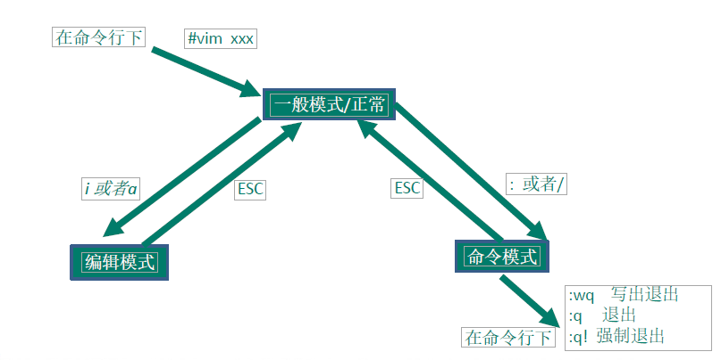

## 快捷键的使用案例

1)【复制】**拷贝当前行 `yy`** , **拷贝当前行至向下的5行 `5yy`**，并**粘贴 `p`**。

2)【删除】**删除当前行 `dd`**  , **删除当前行至向下的5行 `5dd`**

3)【查找】在文件中**查找某个单词**[**命令行下`/关键字，回车查找`,  `输入n 就是查找下一个`**] ,查询 `/word `   `n下一个`

4)【行号】设置文件的**行号**，取消文件的行号.[命令行下 **`: set nu` 和 `:set nonu`**]

5)【首尾】编辑/etc/profile 文件，使用快捷键到底文档的**最末行[G]**和**最首行[gg]**

6)【撤销】在一个文件中输入"hello" ,然后又**撤销**这个动作 **u**

7)【跳转】编辑 /etc/profile 文件，并将光标移动到 第20行**【shift+g】**

​		第一步：显示行号 ：set nu      第二步：输入20         第三步：输入`shift+g`

## vim和vi的快捷键键盘一览图

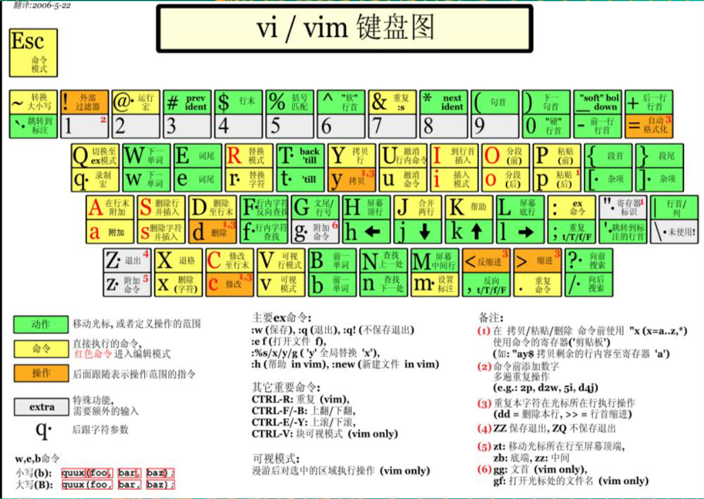

# 实操篇 开机、重启和用户登录注销

## 关机&重启命令

```sh
sync 				#把内存的数据同步到磁盘

shutdown –h now 	#立该进行关机
shutdown -h  1  	#"hello, 1 分钟后会关机了" 
shutdown –r now 	#现在重新启动计算机
halt				#关机，作用和上面一样.
reboot        		#现在重新启动计算机
```

> 注意世界：不管是重启系统还是关闭系统，首先要运行sync命令，把内存中的数据写到磁盘中，防止数据丢失

## 用户登录和注销

基本介绍

1)	登录时尽量少用root帐号登录，因为它是系统管理员，最大的权限，避免操作失误。可以利用普通用户登录，登录后再用**”su - 用户名’**命令`【su root】`来切换成系统管理员身份.
2)	在提示符下输入**logout 即可注销用户**

```shell
[root@hadoop1 linux-share]# logout
```

> 注意：
>
> 1)	logout 注销指令在图形运行级别无效，在 运行级别3下有效.
> 2)	运行级别这个概念，后面给大家介绍


# 实操篇 用户管理


## 基本介绍

Linux系统是一个多用户多任务的操作系统，任何一个要使用系统资源的用户，都必须首先向系统管理员申请一个账号，然后以这个账号的身份进入系统。

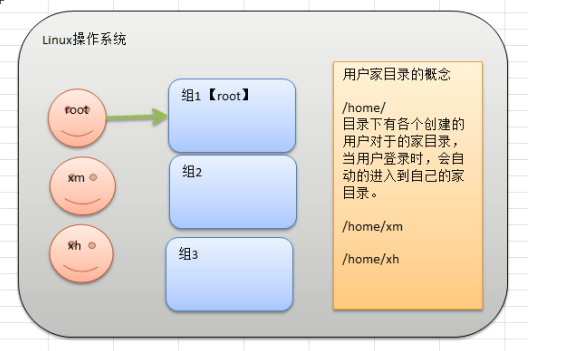

说明
1）Linux系统是一个多用户多任务的操作系统，任何一个要使用系统资源的用户，都必须首先向系统管理员申请一个账号，然后以这个账号的身份进入系统。
2）Linux的用户需要至少要属于一个组。

## 添加用户

基本语法:

`useradd [选项]  用户名`
应用案例
1)案例1:添加一个用户xiaoming

```sh
[root@hadoop1 xm]$ useradd xm  # 添加xm用户，添加到名称为xm的组，并且添加到xm组内

# 添加用户后会自动创建家目录
[root@hadoop1 xm]$ cd /home/
[root@hadoop1 home]$ ls
xm
```

> 细节说明
>
> 1)	当创建用户成功后，会自动的创建和用户同名的家目录
> 2)	也可以通过useradd -d  指定目录 新的用户名，给新创建的用户指定家目录，（PS：这个目录不能手动创建，自动创建）


特别说明：
cd 表示change directory, 切换目录.

## 指定/修改密码

`passwd    用户名`


应用案例

```sh
# 给xm用户指定密码，输入密码时界面不显示
[root@hadoop1 home]$ passwd xm
更改用户 xm 的密码 。
新的 密码：
无效的密码： WAY 过短
无效的密码： 过于简单
重新输入新的 密码：
passwd： 所有的身份验证令牌已经成功更新。
```

## 删除用户

基本语法

`userdel   用户名`

应用案例

1)	删除用户xiaoming，但是要保留家目录

```sh
[root@hadoop1 home]$ userdel xm
[root@hadoop1 home]$ ls /home/
xm
```

2)	删除用户以及用户主目录

```sh
[root@hadoop1 home]$ useradd xh 
[root@hadoop1 home]$ ls /home/
xh  xm
[root@hadoop1 home]$ userdel -r xh   # -r 表示删除删除用户及家目录
[root@hadoop1 home]$ ls /home/
xm
```

## 查询用户信息指令

基本语法
`id  用户名`
应用实例
案例1：请查询root 信息

```sh
[root@hadoop1 home]$ id root
uid=0(root) gid=0(root) 组=0(root)   # uid：用户id	gid：所在组的id号   组：组名称
[root@hadoop1 home]$ id xm
uid=500(xm) gid=500(xm) 组=500(xm)
```

细节说明
1) 当用户不存在时，返回无此用户

## 切换用户

介绍
在操作Linux中，如果当前用户的权限不够，可以通过 `su - 指令`，切换到高权限用户，比如root

基本语法
`su  – 切换用户名`
应用实例
1) 创建一个用户zf, ，指定密码，然后切换到zf.

```sh
[root@hadoop1 home]$ useradd zf   	#创建用户
[root@hadoop1 home]$ passwd zf		# 设置密码
更改用户 zf 的密码 。
新的 密码：
无效的密码： WAY 过短
无效的密码： 过于简单
重新输入新的 密码：
passwd： 所有的身份验证令牌已经成功更新。
[root@hadoop1 home]$ su zf  	# 切换到zf用户   root -> zf
[zf@hadoop1 home]$ cd /root
bash: cd: /root: 权限不够  		# 当用户权限不足时会给提示
[zf@hadoop1 home]$ exit			# 返回到原来的用户  zf->root
exit
[root@hadoop1 home]$
```


细节说明

1)	**从权限高的用户切换到权限低的用户，不需要输入密码**，反之需要。
2)	当需要返回到原来用户时，使用exit指令

## 查看当前用户/登录用户

基本语法：`whoami/ who am I`

```sh
[root@hadoop1 home]$ whoami
root
[root@hadoop1 home]$ who am i
root     pts/0        2021-04-28 07:48 (192.168.64.1)
```

## 用户组

### 新增组

指令：`groupadd 组名`

```sh
[root@hadoop1 home]$ groupadd def_group
```

### 删除组

指令(基本语法)

`groupdel 组名`

```sh
[root@hadoop1 home]$ groupdel def_group
```

### 增加用户时直接加上组

指令(基本语法)

`useradd  –g 用户组 用户名`

案例：增加一个用户zwj, 直接将他指定到wudang

```sh
[root@hadoop1 home]$ groupadd wudang		#创建一个组
[root@hadoop1 home]$ useradd -g wudang zwj	#创建zwj用户，并指定到wudang组
[root@hadoop1 home]$ id zwj					#查询zwj信息
uid=502(zwj) gid=502(wudang) 组=502(wudang)
[root@hadoop1 home]$ ls /home/				#自动创建home目录下用户目录
xm  zf  zwj
```

### 修改用户的组

指令（基本语法）
`usermod -g 用户组 用户名`

案例演示：创建一个shaolin 组，让将zwj 用户修改到shaolin

```sh
[root@hadoop1 home]$ groupadd shaolin
[root@hadoop1 home]$ usermod -g shaolun zwj
usermod：“shaolun”组不存在
[root@hadoop1 home]$ usermod -g shaolin zwj
[root@hadoop1 home]$ id zwj
uid=502(zwj) gid=503(shaolin) 组=503(shaolin)
```

## 用户和组的相关文件

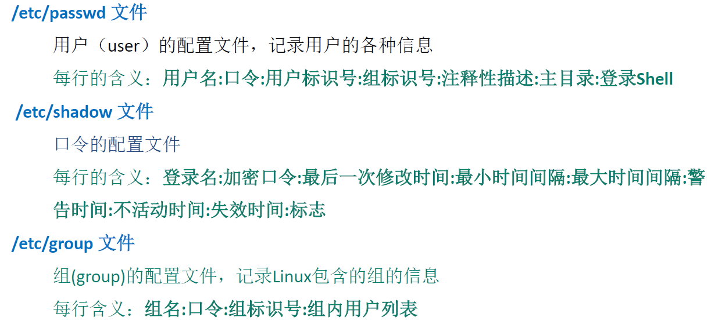

+ `/etc/passwd`文件
  用户**（user）的配置文件**，记录用户的各种信息
  每行的含义：`用户名：口令：用户标识号：组标识号：注释性描述：主目录：登录Shell`

  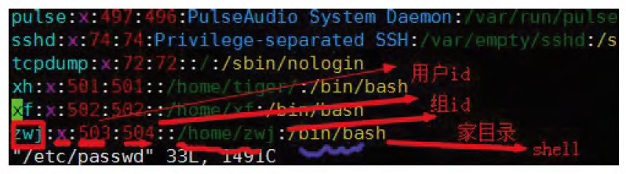

+ `/etc/shadow`文件
  口令的配置文件
  每行的含义：`登录名：加密口令：最后一次修改时间：最小时间间隔：最大时间间隔：警
  告时间：不活动时间：失效时间：标志`

+ `/etc/group`文件
  **组（group）的配置文件**，记录Linux包含的组的信息
  每行含义：`组名：口令组标识号：组内用户列表`

  

# 实操篇 实用指令

## 指定运行级别

基本介绍:
运行级别说明：
0：关机
1：单用户【找回丢失密码】
2：多用户状态没有网络服务
3：多用户状态有网络服务
4：系统未使用保留给用户
5：图形界面
6：系统重启
常用运行级别是**3和5** ，要修改默认的运行级别可改文件
**/etc/inittab**的id:5:initdefault:这一行中的数字

```sh
[root@hadoop1 etc]$ vim /etc/inittab 

# inittab is only used by upstart for the default runlevel.
#
# ADDING OTHER CONFIGURATION HERE WILL HAVE NO EFFECT ON YOUR SYSTEM.
#
# System initialization is started by /etc/init/rcS.conf
#
# Individual runlevels are started by /etc/init/rc.conf
#
# Ctrl-Alt-Delete is handled by /etc/init/control-alt-delete.conf
#
# Terminal gettys are handled by /etc/init/tty.conf and /etc/init/serial.conf,
# with configuration in /etc/sysconfig/init.
#
# For information on how to write upstart event handlers, or how
# upstart works, see init(5), init(8), and initctl(8).
#
# Default runlevel. The runlevels used are:
#   0 - halt (Do NOT set initdefault to this)
#   1 - Single user mode
#   2 - Multiuser, without NFS (The same as 3, if you do not have networking)
#   3 - Full multiuser mode
#   4 - unused
#   5 - X11
#   6 - reboot (Do NOT set initdefault to this)
# 
id:5:initdefault:
```

### 切换指定运行级别指令：

基本语法：`init [012356]`
应用实例：
案例1：通过init 来切换不同的运行级别，比如动 5 -> 3 ，然后关机。

```sh
[root@hadoop1 etc]$ init 3   # 图形化界面自动切换到命令行
[root@hadoop1 etc]$ init 5   # 命令行自动切换到图形化界面
[root@hadoop1 etc]$ init 0   # 关机
```


> 如何找回root密码

思路：进入到单用户模式，然后修改root密码。因为进入单用户模式，root不需要密码就可以登录。

开机引导时【按回车】-> 看到一个界面按e -> 进入新的界面高亮选中第二行（编辑内核kenor，输入1） 回车退出  -> 再次输入b，进入单用户模式 ，使用passwd root  来修改root用户的密码    -> 重启登陆      【该操作不能远程】

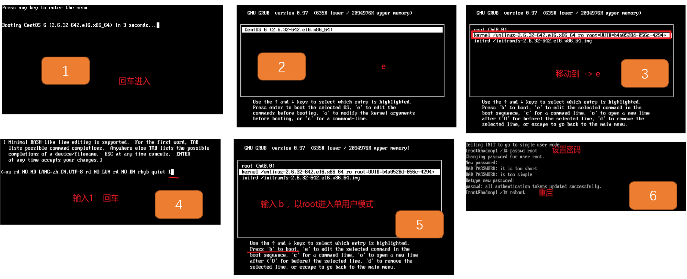


请设置我们的运行级别，linux 运行后，**直接进入到命令行界面，【即进入到3 运行级别】**
vim /etc/inittab
将id:5:initdefault:这一行中的数字, 5 这个数字改成对应的运行级别即可。

## 帮助指令

### 介绍

### man 获得帮助信息

•基本语法
`man [命令或配置文件]`（功能描述：获得帮助信息）
•应用实例
案例：查看ls命令的帮助信息

```sh
[root@hadoop1 ~]$ man ls   # 查看ls命令
```

### help 指令

•基本语法
`help 命令`（功能描述：获得shell内置命令的帮助信息）
•应用实例
案例：查看cd命令的帮助信息

```sh
[root@hadoop1 ~]$ help cd
cd: cd [-L|-P] [dir]
    Change the shell working directory.
```


百度帮助更直接
虽然上面两个都可以来获取指令帮助，但是需要英语功底，如果英语不太好的，我还是推荐大家直接百度靠谱。

## 文件目录类

### pwd 指令

•	基本语法
`pwd` (功能描述：显示当前工作目录的绝对路径)
•	应用实例
案例：显示当前工作目录的绝对路径

```sh
[root@hadoop1 ~]$ cd /
[root@hadoop1 /]$ pwd
/
[root@hadoop1 /]$ cd /root
[root@hadoop1 ~]$ pwd
/root
```

### ls 指令

基本语法
ls [选项] [目求或是文件]
常用选项
	-a：显示当前目录所有的文件和目录，包括隐藏的。
	-1：以列表的方式显示信息应用实例
案例：查看当前目录的所有内容信息

```sh
[root@hadoop1 ~]$ ls -al 桌面
总用量 8
drwxr-xr-x.  2 root root 4096 4月  27 08:54 .
dr-xr-x---. 27 root root 4096 4月  29 07:20 ..
[root@hadoop1 ~]$ ls -l
总用量 96
-rw-------. 1 root root  1246 4月  26 09:28 anaconda-ks.cfg
-rw-r--r--. 1 root root 41954 4月  26 09:28 install.log
-rw-r--r--. 1 root root  9154 4月  26 09:26 install.log.syslog
drwxr-xr-x. 2 root root  4096 4月  26 09:30 公共的
drwxr-xr-x. 2 root root  4096 4月  26 09:30 模板
drwxr-xr-x. 2 root root  4096 4月  26 09:30 视频
drwxr-xr-x. 2 root root  4096 4月  26 09:30 图片
drwxr-xr-x. 2 root root  4096 4月  26 09:30 文档
drwxr-xr-x. 2 root root  4096 4月  26 09:30 下载
drwxr-xr-x. 2 root root  4096 4月  26 09:30 音乐
drwxr-xr-x. 2 root root  4096 4月  27 08:54 桌面
[root@hadoop1 ~]$ ls 
```

### cd 指令

•基本语法

`cd  [参数]`  (功能描述：切换到指定目录)
•常用参数
	**绝对路径**和**相对路径**

​	`cd ~` 或者cd ：回到自己的家目录
​	`cd ..` 回到当前目录的上一级目录

> 如何理解绝对路径和相对路径
>
> 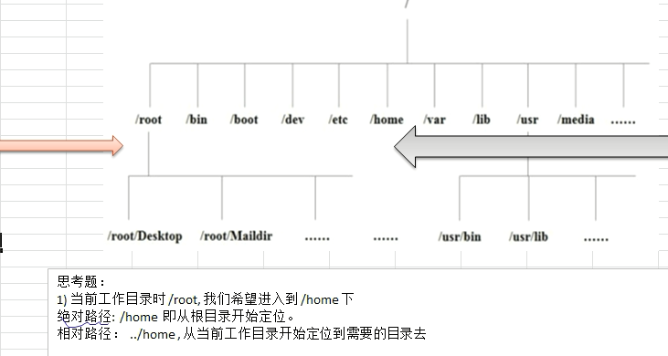

•	应用实例
案例1：使用绝对路径切换到root目录

```sh
[root@hadoop1 /]$ cd /root/  #绝对路径
```

案例2:  使用相对路径到/root 目录

```sh
[root@hadoop1 ~]$ cd ./			#相对路径
[root@hadoop1 ~]$ cd ../root
```

案例3：表示回到当前目录的上一级目录

```sh
[root@hadoop1 ~]$ cd ..
```

案例4：回到家目录

```sh
[root@hadoop1 /]$ cd ~
```

### mkdir 指令

mkdir指令用于创建目录

•基本语法
`mkdir  [选项] 要创建的目录`
•常用选项

- **-p** ：创建多级目录


应用实例
  案例1:创建一个目录/home/dog
  案例2:创建多级目录/home/animal/tiger

```sh
[root@hadoop1 ~]$ mkdir /home/dog
[root@hadoop1 ~]$ mkdir -p /home/animal/tiger   # 创建多级目录
[root@hadoop1 ~]$ ls -l /home/
总用量 20
drwxr-xr-x. 3 root root   4096 4月  29 07:47 animal
drwxr-xr-x. 2 root root   4096 4月  29 07:47 dog
drwx------. 4 xm   xm     4096 4月  28 07:58 xm
drwx------. 4 zf   zf     4096 4月  28 08:27 zf
drwx------. 4 zwj  wudang 4096 4月  28 08:39 zwj
```

### rmdir 指令

rmdir指令 **删除空目录**

•基本语法
`rmdir  [选项] 要删除的空目录`
•应用实例
案例1:删除一个目录/home/dog

```sh
[root@hadoop1 ~]$ rmdir /home/dog/
```


> 使用细节
> rmdir 删除的是空目录，如果目录下有内容时无法删除的。
> 提示：如果需要删除非空目录，需要使用 rm -rf 要删除的目录

```sh
[root@hadoop1 ~]$ mkdir /home/dog		# 删除空目录
[root@hadoop1 ~]$ cd /home/dog/
[root@hadoop1 dog]$ touch test.txt
[root@hadoop1 dog]$ rmdir /home/dog/
rmdir: 删除 "/home/dog/" 失败: 目录非空
[root@hadoop1 dog]$ rm -rf /home/dog/   # 删除非空目录  rm -rf dest_dir
```

### touch 指令

touch指令创建空文件

•基本语法
	`touch 文件名称`
•应用实例
案例1: 创建一个空文件hello.txt

```sh
[root@hadoop1 home]$ touch ./hello.txt
[root@hadoop1 home]$ ls -l
总用量 16
drwxr-xr-x. 3 root root   4096 4月  29 07:47 animal
-rw-r--r--. 1 root root      0 4月  29 07:57 hello.txt
drwx------. 4 xm   xm     4096 4月  28 07:58 xm
drwx------. 4 zf   zf     4096 4月  28 08:27 zf
drwx------. 4 zwj  wudang 4096 4月  28 08:39 zwj

[root@hadoop1 home]$ touch ok1.txt ok2.txt   # 一次性创建多个文件
[root@hadoop1 home]$ ls -l
总用量 16
drwxr-xr-x. 3 root root   4096 4月  29 07:47 animal
-rw-r--r--. 1 root root      0 4月  29 07:57 hello.txt
-rw-r--r--. 1 root root      0 4月  29 07:58 ok1.txt
-rw-r--r--. 1 root root      0 4月  29 07:58 ok2.txt
drwx------. 4 xm   xm     4096 4月  28 07:58 xm
drwx------. 4 zf   zf     4096 4月  28 08:27 zf
drwx------. 4 zwj  wudang 4096 4月  28 08:39 zwj
```

### cp 指令

cp 指令拷贝文件到指定目录


•基本语法
	`cp [选项] source dest`
•常用选项
	-r ：递归复制整个文件夹


•应用实例
案例1: 将/home/aaa.txt 拷贝到 /home/bbb 目录下[拷贝单个文件]

```sh
[root@hadoop1 home]$ touch aaa.txt
[root@hadoop1 home]$ ls
aaa.txt  animal  hello.txt  ok1.txt  ok2.txt  xm  zf  zwj
[root@hadoop1 home]$ rm -rf animal/ hello.txt  ok* xm zf zwj
[root@hadoop1 home]$ mkdir bbb
[root@hadoop1 home]$ ls
aaa.txt  bbb
[root@hadoop1 home]$ cp aaa.txt bbb/   # 表示将当前目录下的aaa.txt拷贝到当前bbb目录下
[root@hadoop1 home]$ ls -l ./bbb
总用量 0
-rw-r--r--. 1 root root 0 4月  29 08:04 aaa.txt
```

案例2: 递归复制整个文件夹，举例

```sh
[root@hadoop1 home]$ cp -r bbb/ a/   # 将bbb整个目录递归拷贝到a下面
[root@hadoop1 a]$ ls -l /home/a
总用量 4
drwxr-xr-x. 2 root root 4096 4月  29 08:07 bbb
```


> 使用细节
> 强制覆盖不提示的方法：\cp

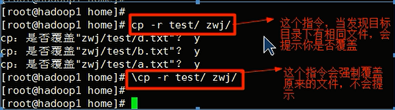

技术小技巧：可以通过 上下箭头 调出之前使用过的指令

### rm 指令

rm 指令移除文件或目录

•基本语法
	`rm  [选项] 要删除的文件或目录`
•常用选项
	-r ：递归删除整个文件夹
	-f ：强制删除不提示
•应用实例
案例1: 将/home/aaa.txt 删除
案例2: 递归删除整个文件夹 /home/bbb

```sh
[root@hadoop1 a]$ rm /home/aaa.txt 	#删除文件 带-f不提示删除
rm：是否删除普通空文件 "/home/aaa.txt"？y
[root@hadoop1 a]$ rm /home/bbb/
rm: 无法删除"/home/bbb/": 是一个目录
[root@hadoop1 a]$ rm -rf /home/bbb/   # 强制递归删除
```

•使用细节
强制删除不提示的方法：带上 -f参数即可

### mv 指令

mv 移动文件与目录或重命名

•基本语法
	`mv  oldNameFile newNameFile `   (功能描述：重命名) 
	`mv /temp/movefile /targetFolder` (功能描述：移动文件)
•应用实例
案例1: 将/home/aaa.txt 文件重新命名为pig.txt

```sh
[root@hadoop1 home]$ touch aaa.txt
[root@hadoop1 home]$ ls
aaa.txt
[root@hadoop1 home]$ mv aaa.txt pig.txt   #重命名文件
[root@hadoop1 home]$ ls
pig.txt
```

案例2:将/home/pig.txt  文件移动到/root 目录下

```sh
[root@hadoop1 home]$ mv /home/pig.txt /root/
[root@hadoop1 home]$ ls /home/
[root@hadoop1 home]$ ls /root/
anaconda-ks.cfg  install.log.syslog  公共的  视频  文档  音乐
install.log      pig.txt             模板    图片  下载  桌面
```

### cat 指令

cat 查看文件内容

•基本语法
	`cat  [选项] 要查看的文件`
•常用选项
	-n ：显示行号
•应用实例
案例1:  /etc/profile 文件内容，并显示行号

```sh
[root@hadoop1 home]$ cat /etc/profile		# 不显示行号只读查看文件
[root@hadoop1 home]$ cat -n  /etc/profile	 # 显示行号只读查看文件
```

•使用细节
cat 只能浏览文件，而不能修改文件，为了浏览方便，一般会带上 管道命令| more

```sh
[root@hadoop1 home]$ cat -n  /etc/profile | more  # 以cat指令打开文件，并分页显示及行号查看，按空格继续
```

### more 指令

more指令是一个基于VI编辑器的文本过滤器，它以全屏幕的方式按页显示文本文件的内容。 more指令中内置了若干快捷键，详见操作说明

•基本语法
	`more 要查看的文件`
•操作说明

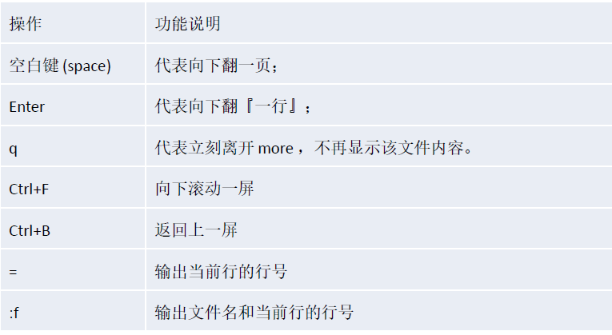•应用实例
案例: 采用more查看文件 /etc/profile

```sh
[root@hadoop1 home]$ more /etc/profile
```

### less 指令

less指令用来分屏查看文件内容，它的功能与more指令类似，但是比more指令更加强大，支持各种显示终端。less指令在显示文件内容时，**并不是一次将整个文件加载之后才显示，而是根据显示需要加载内容**，**对于显示大型文件具有较高的效率**。

•基本语法
	`less 要查看的文件`
•操作说明

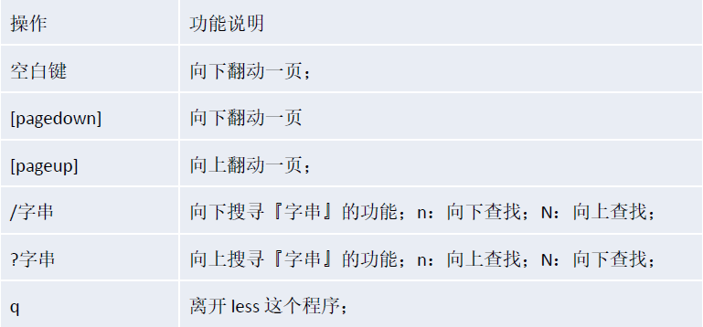


案例: 采用less查看一个【懒加载模式】

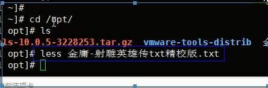

### echo 指令

echo输出内容到控制台。

•基本语法
	`echo  [选项] [输出内容]`
•应用实例
案例: 使用echo 指令输出环境变量

```sh
[root@hadoop1 home]$ echo $PATH  #输出$PATH环境变量
/usr/lib64/qt-3.3/bin:/usr/local/sbin:/usr/local/bin:/sbin:/bin:/usr/sbin:/usr/bin:/root/bin
```

案例: 使用echo 指令输出hello,world!

```sh
[root@hadoop1 home]$ echo "Hello world"
Hello world
```

### head 指令

head用于显示**文件的开头部分内容**，默认情况下head指令显示文件的前10行内容

•基本语法
	`head 文件` (功能描述：查看文件头10行内容)
	`head -n 5` 文件 (功能描述：查看文件头5行内容，5可以是任意行数)
•应用实例
案例: 查看/etc/profile 的前面5行代码

```sh
[root@hadoop1 home]$ head -n 5 /etc/profile
# /etc/profile

# System wide environment and startup programs, for login setup
# Functions and aliases go in /etc/bashrc

[root@hadoop1 home]$ 
```

### tail 指令

tail用于**输出文件中尾部的内容**，默认情况下tail指令显示文件的前10行内容。
基本语法
1）`tail 文件`（功能描述：查看文件头10行内容）
2）`tail -n 5 文件`（功能描述：查看文件头5行内容，5可以是任意行数）
3）`tail -f 文件`（功能描述：实时追踪该文档的所有更新）
应用实例
案例1：查看/etc/profile最后5行的代码

```sh
[root@hadoop1 home]$ tail -n 5 /etc/profile
    fi
done

unset i
unset -f pathmunge
[root@hadoop1 home]$ 
```

案例2：实时监控mydate.txt，看看到文件有变化时，是否看到，实时的追加日期

```sh
[root@hadoop1 home]$ tail -f mydate.txt 


# 开启另一个窗口,将ls的结果写入到mydate.txt中，执行tail -f mydate.txt 的窗口可以看到更新
ls -l >> /home/mydate.txt
```

### '>'  指令和'>>' 指令

'>'输出重定向和'>>'追加

'>'输出重定向：会将原来的文件的内容覆盖
'>>'追加：不会覆盖原来文件的内容，而是追加到文件的尾部。

基本语法
	1）`ls -l > 文件`		 （功能描述：列表的内容写入文件a.txt中（**覆盖写**）)
	2）`ls -al >> 文件`		（功能描述：列表的内容**追加**到文件aa.txt的末尾）
	3）`cat 文件1 > 文件2`	（功能描述：将文件1的内容覆盖到文件2）
	4）`echo "内容" >> 文件`   
应用实例
案例1：将/home目录下的文件列表覆盖写入到/home/a.txt中

```sh
[root@hadoop1 home]$ ls -l > a.txt  # 将ls -l的打印内容 覆盖写入到a.txt，写出文件不存在会自动创建
[root@hadoop1 home]$ ls
a.txt  mydate.txt
[root@hadoop1 home]$ more a.txt 
总用量 4
-rw-r--r--. 1 root root    0 4月  29 09:10 a.txt
-rw-r--r--. 1 root root 1347 4月  29 08:56 mydate.txt
[root@hadoop1 home]$ 
```

案例2：将当前日历信息追加到/home/mycal.txt文件中

```sh
[root@hadoop1 home]$ cal >> mycal.txt   # cal 查询日历  ，并追加写入到mycal.txt
[root@hadoop1 home]$ more mycal.txt 
      四月 2021     
日 一 二 三 四 五 六
             1  2  3
 4  5  6  7  8  9 10
11 12 13 14 15 16 17
18 19 20 21 22 23 24
25 26 27 28 29 30

[root@hadoop1 home]$ cal >> mycal.txt  	# 再次 追加写入到mycal.txt
[root@hadoop1 home]$ more mycal.txt 
      四月 2021     
日 一 二 三 四 五 六
             1  2  3
 4  5  6  7  8  9 10
11 12 13 14 15 16 17
18 19 20 21 22 23 24
25 26 27 28 29 30

      四月 2021     
日 一 二 三 四 五 六
             1  2  3
 4  5  6  7  8  9 10
11 12 13 14 15 16 17
18 19 20 21 22 23 24
25 26 27 28 29 30

[root@hadoop1 home]$ 
```

### ln 指令

软链接也成为符号链接，类似于**windows里的快捷方式**，主要存放了链接其他文件的路径

•基本语法
`ln -s [原文件或目录] [软链接名]` （功能描述：给原文件创建一个软链接）
•应用实例
案例1: 在/home 目录下创建一个软连接 linkToRoot，连接到/root 目录

```sh
[root@hadoop1 ~]$ ln -s /root/ /home/linkToRoot   #创建链接   源   链接位置
[root@hadoop1 ~]$ cd /home/
[root@hadoop1 home]$ ls -l
总用量 12
-rw-r--r--. 1 root root  117 4月  29 09:10 a.txt
lrwxrwxrwx. 1 root root    6 4月  29 20:41 linkToRoot -> /root/   # 指向/root
-rw-r--r--. 1 root root  308 4月  29 09:16 mycal.txt
-rw-r--r--. 1 root root 1347 4月  29 08:56 mydate.txt

[root@hadoop1 home]$ ls -l linkToRoot/   		# 查看连接
总用量 12
-rw-r--r--. 1 root root  117 4月  29 09:10 a.txt
lrwxrwxrwx. 1 root root    6 4月  29 20:41 linkToRoot -> /root/
-rw-r--r--. 1 root root  308 4月  29 09:16 mycal.txt
-rw-r--r--. 1 root root 1347 4月  29 08:56 mydate.txt
-rw-------. 1 root root  1246 4月  26 09:28 anaconda-ks.cfg
-rw-r--r--. 1 root root 41954 4月  26 09:28 install.log
-rw-r--r--. 1 root root  9154 4月  26 09:26 install.log.syslog
-rw-r--r--. 1 root root     0 4月  29 08:22 pig.txt
drwxr-xr-x. 2 root root  4096 4月  26 09:30 公共的
drwxr-xr-x. 2 root root  4096 4月  26 09:30 模板
drwxr-xr-x. 2 root root  4096 4月  26 09:30 视频
drwxr-xr-x. 2 root root  4096 4月  26 09:30 图片
drwxr-xr-x. 2 root root  4096 4月  26 09:30 文档
drwxr-xr-x. 2 root root  4096 4月  26 09:30 下载
drwxr-xr-x. 2 root root  4096 4月  26 09:30 音乐
drwxr-xr-x. 2 root root  4096 4月  27 08:54 桌面
```

案例2: 删除软连接linkToRoot

```sh
[root@hadoop1 home]$ rm -rf linkToRoot/			 # 不能带最后的/
rm: 无法删除"linkToRoot/.gvfs": 设备或资源忙
[root@hadoop1 home]$ rm -rf linkToRoot
```

细节说明
当我们使用pwd指令查看目录时，仍然看到的是软链接所在目录。

### history 指令

查看已经执行过历史命令,也可以执行历史指令

•基本语法
`history` （功能描述：查看已经执行过历史命令）
•应用实例
案例1: 显示所有的历史命令

```sh
[root@hadoop1 home]$ history 
    1  ll
    2  cd /opt/
    3  ls
    4  tar -zxvf VMwareTools-10.3.22-15902021.tar.gz 
    5  ls
    6  cd vmware-tools-distrib/
    7  ./vmware-install.pl 
```

案例2: 显示最近使用过的10个指令。

```sh
[root@hadoop1 home]$ history 10
   45  ln -s /root linkToRoot
   46  ls
   47  ls -l
   48  rm -rf linkToRoot/
   49  rm -rf linkToRoot
   50  history 
   51  history -n 10
   52  history |more 10
   53  history 
   54  history 10
```

案例3：执行历史编号为47的指令

```sh
[root@hadoop1 home]$ !47    # 执行历史编号为47的指令
ls -l
总用量 12
-rw-r--r--. 1 root root  117 4月  29 09:10 a.txt
-rw-r--r--. 1 root root  308 4月  29 09:16 mycal.txt
-rw-r--r--. 1 root root 1347 4月  29 08:56 mydate.txt
```

## 时间日期类

### date 指令-显示当前日期

+ 基本语法
  	1）`date`（功能描述：显示当前时间）
  	2）`date +%Y`（功能描述：显示当前年份）
  	3）`date +%m`（功能描述：显示当前月份）
  	4）`date +%d`（功能描述：显示当前是哪一天）
  	5）`date"+%Y-%m-%d%H:%M:%S"`（功能描述：显示年月日时分秒）
+ 应用实例
  案例1：显示当前时间信息
  案例2：显示当前时间年月日
  案例3：显示当前时间年月日时分秒

```sh
[root@hadoop1 home]$ date
2021年 04月 29日 星期四 20:57:46 CST
[root@hadoop1 home]$ date "+%Y- %m %d日"    # 
2021- 04 29日
[root@hadoop1 home]$ date "+%Y-%m-%m %H:%M:%S"
2021-04-04 20:59:28
```

### date 指令-设置日期

•基本语法
	`date  -s 字符串时间`
•应用实例
案例1: 设置系统当前时间，比如设置成2020-11-11 11:22:22

```sh
[root@hadoop1 home]$ date -s "2020-11-11 11:22:11"
2020年 11月 11日 星期三 11:22:11 CST
[root@hadoop1 home]$ date
2020年 11月 11日 星期三 11:22:16 CST
```

### cal 指令

查看日历指令

+ 基本语法
  `cal[选项]`   （功能描述：不加选项，显示本月日历）

+ 应用实例
  案例1：显示当前日历

  案例2：显示2020年日历

```sh
[root@hadoop1 home]$ cal   # 查看本月日历
      四月 2021     
日 一 二 三 四 五 六
             1  2  3
 4  5  6  7  8  9 10
11 12 13 14 15 16 17
18 19 20 21 22 23 24
25 26 27 28 29 30

[root@hadoop1 home]$ cal 2020		# 查看2020年日历
                               2020                               

        一月                   二月                   三月        
日 一 二 三 四 五 六  	 日 一 二 三 四 五 六   日 一 二 三 四 五 六
          1  2  3  4                      1    1  2  3  4  5  6  7
 5  6  7  8  9 10 11    2  3  4  5  6  7  8    8  9 10 11 12 13 14
12 13 14 15 16 17 18    9 10 11 12 13 14 15   15 16 17 18 19 20 21
19 20 21 22 23 24 25   16 17 18 19 20 21 22   22 23 24 25 26 27 28
26 27 28 29 30 31      23 24 25 26 27 28 29   29 30 31

        四月                   五月                   六月        
日 一 二 三 四 五 六   	日 一 二 三 四 五 六   日 一 二 三 四 五 六
          1  2  3  4                   1  2       1  2  3  4  5  6
 5  6  7  8  9 10 11    3  4  5  6  7  8  9    7  8  9 10 11 12 13
12 13 14 15 16 17 18   10 11 12 13 14 15 16   14 15 16 17 18 19 20
19 20 21 22 23 24 25   17 18 19 20 21 22 23   21 22 23 24 25 26 27
26 27 28 29 30         24 25 26 27 28 29 30   28 29 30
                       31
        七月                   八月                   九月        
日 一 二 三 四 五 六   	日 一 二 三 四 五 六   日 一 二 三 四 五 六
          1  2  3  4                      1          1  2  3  4  5
 5  6  7  8  9 10 11    2  3  4  5  6  7  8    6  7  8  9 10 11 12
12 13 14 15 16 17 18    9 10 11 12 13 14 15   13 14 15 16 17 18 19
19 20 21 22 23 24 25   16 17 18 19 20 21 22   20 21 22 23 24 25 26
26 27 28 29 30 31      23 24 25 26 27 28 29   27 28 29 30
                       30 31
        十月                  十一月                 十二月       
日 一 二 三 四 五 六   	日 一 二 三 四 五 六   日 一 二 三 四 五 六
             1  2  3    1  2  3  4  5  6  7          1  2  3  4  5
 4  5  6  7  8  9 10    8  9 10 11 12 13 14    6  7  8  9 10 11 12
11 12 13 14 15 16 17   15 16 17 18 19 20 21   13 14 15 16 17 18 19
18 19 20 21 22 23 24   22 23 24 25 26 27 28   20 21 22 23 24 25 26
25 26 27 28 29 30 31   29 30                  27 28 29 30 31
```

## 搜索查找类

### find 指令

find指令将从指定目录向下递归地遍历其各个子目录，将满足条件的文件或者目录显示在终端。

•基本语法
  `find  [搜索范围] [选项]`
•选项说明


应用实例
案例1: 按文件名：根据名称查找/home 目录下的hello.txt文件

```sh
# find 					  [查找范围] [文件名查找] [文件名]
[root@hadoop1 home]$ find /home/ -name hello.txt  
/home/hello.txt
```

案例2：按拥有者：查找/opt目录下，用户名称为 nobody的文件
```sh
[root@hadoop1 home]$ find /opt/ -user nobody	# 查找opt目录下属于nobody用户的文件
[root@hadoop1 home]$ find /opt/ -user root		# 查找opt目录下属于root用户的文件
```
案例3：查找整个linux系统下大于200m的文件（+n 大于 -n小于 n等于  n代表容量大小）   容量单位`k M G 区分大小写`
```sh
[root@hadoop1 home]$ find / -size +200M   # 从根目录下查找大于200M的文件   
/opt/VMwareTools-10.3.22-15902021.tar.gz
/usr/lib64/firefox/libxul.so
/usr/lib64/libLLVM-3.6-mesa.so

[root@hadoop1 home]$ find / -size -1k  # 从根目录下查找小于1kb的文件  
[root@hadoop1 home]$ find / -size 1k  # 从根目录下查找等于1kb的文件  
```

### locate 指令

locaate指令可以**快速定位文件路径**。locate指令利用事先建立的系统中所有文件名称及路径的**locate数据库实现快速定位给定的文件**。Locate指令**无需遍历整个文件系统**，查询速度较快。为了保证查询结果的准确度，管理员必须定期更新locate时刻。

•基本语法

`locate 搜索文件`
•特别说明

由于locate指令基于数据库进行查询，**所以第一次运行前，必须使用updatedb指令创建locate数据库**。

应用实例
案例1: 请使用locate 指令快速定位hello.txt 文件所在目录

```sh
[root@hadoop1 home]$ updatedb     		#第一次运行前，必须使用updatedb指令创建locate数据库
[root@hadoop1 home]$ locate hello.txt   # 查找名字为hello.txt文件的目录
/home/hello.txt
```

### grep 指令和管道符号 | 

grep 过滤查找，管道符，“|”，表示将**前一个命令的处理结果输出传递给后面的命令处理**。

•基本语法
	`grep [选项] 查找内容源文件`
•常用选项


应用实例
案例1: 请在hello.txt 文件中，查找 "yes"  所在行，并且显示行号

```sh
 # cat将浏览的内容（即cat返回到控制台的内容）  ->  交给grep过滤      -n 显示行号  -i 忽略大小写，默认区分大小写
[root@hadoop1 home]$ cat /home/hello.txt | grep -n yes  
7:yes
9:yes1
11:yes2
```

## 压缩和解压类

### gzip/gunzip 指令

​	gzip用于压缩文件，gunzip用于解压的

+ 基本语法
  `gzip 文件`    （功能描述：压缩文件，只能将文件压缩为*.gz文件）
  `gunzip 文件.gz`（功能描述：解压缩文件命令）

+ 应用实例
  案例1：gzip压缩，将/home下的hello.txt文件进行压缩

  ```sh
  [root@hadoop1 home]$ gzip /home/hello.txt    # 压缩完hello.txt.gz
  [root@hadoop1 home]$ ls -l
  总用量 16
  -rw-r--r--. 1 root root  117 4月  29 2021 a.txt
  -rw-r--r--. 1 root root   54 4月   9 22:02 hello.txt.gz
  -rw-r--r--. 1 root root  308 4月  29 2021 mycal.txt
  -rw-r--r--. 1 root root 1347 4月  29 2021 mydate.txt
  ```

  > 细节说明：当我们使用gzip对文件进行压缩后，不会保留原来的文件

+ 案例2：gunzip压缩，将/home下的hello.txt.gz文件进行解压缩

	```sh
	[root@hadoop1 home]$ gunzip hello.txt.gz 
	[root@hadoop1 home]$ ls
	a.txt  hello.txt  mycal.txt  mydate.txt
	```

	> 细节说明：当我们使用gunzip对文件进行解压后，压缩文件会删除

### zip/unzip 指令

zip 用于压缩文件，unzip 用于解压的，这个在项目打包发布中很有用的

•基本语法
	`zip [选项]   XXX.zip  将要压缩的内容`（功能描述：压缩文件和目录的命令） 
	`unzip [选项]  XXX.zip `（功能描述：解压缩文件）


•zip常用选项
	`-r`：递归压缩，即压缩目录

•unzip的常用选项
	`-d<目录>` ：指定解压后文件的存放目录


•应用实例
案例1: 将/home下的所有文件进行压缩成 home.zip

```sh
[root@hadoop1 home]$ zip -r home.zip /home/
  adding: home/ (stored 0%)
  adding: home/mycal.txt (deflated 63%)
  adding: home/a.txt (deflated 34%)
  adding: home/hello.txt (deflated 16%)
  adding: home/mydate.txt (deflated 82%)
[root@hadoop1 home]$ ls
a.txt  hello.txt  home.zip  mycal.txt  mydate.txt
```

案例2:  将home.zip 解压到/opt/temp目录下

```sh
[root@hadoop1 home]$ unzip -d /opt/temp home.zip 
Archive:  home.zip
   creating: /opt/temp/home/
  inflating: /opt/temp/home/mycal.txt  
  inflating: /opt/temp/home/a.txt    
  inflating: /opt/temp/home/hello.txt  
  inflating: /opt/temp/home/mydate.txt  
[root@hadoop1 home]$ ls -l /opt/temp/
总用量 4
drwxr-xr-x. 2 root root 4096 4月   9 22:16 home
```

### tar 指令

tar 指令是打包指令，最后打包后的文件是 .tar.gz 的文件。

•基本语法
	`tar  [选项]  XXX.tar.gz  打包的内容` (功能描述：打包目录，压缩后的文件格式.tar.gz)
•选项说明


应用实例
案例1: 压缩多个文件，将/home/a1.txt 和/home/a2.txt 压缩成 a.tar.gz

```sh
[root@hadoop1 home]$ tar -zcvf a.tar.gz a1.txt a2.txt # 将a1.txt a2.txt 压缩成a.tar。gz
a1.txt
a2.txt
[root@hadoop1 home]$ ls -l
总用量 20
-rw-r--r--. 1 root root    0 4月   9 22:23 a1.txt
-rw-r--r--. 1 root root    0 4月   9 22:23 a2.txt
-rw-r--r--. 1 root root  118 4月   9 23:16 a.tar.gz
```
案例2:  将/home 的文件夹压缩成myhome.tar.gz
```sh
[root@hadoop1 home]$ tar -zcvf myhome.tar.gz /home/
tar: 从成员名中删除开头的“/”
/home/
/home/a1.txt
/home/a2.txt
/home/mycal.txt
/home/a.txt
/home/a.tar.gz
/home/hello.txt
/home/mydate.txt
/home/a3.txt
tar: /home: 在我们读入文件时文件发生了变化
[root@hadoop1 home]$ ls
a1.txt  a2.txt  a3.txt  a.tar.gz  a.txt  hello.txt  mycal.txt  mydate.txt  myhome.tar.gz
```
案例3:   将a.tar.gz  解压到当前目录
```sh
[root@hadoop1 home]$ tar -zxvf a.tar.gz    # 解压到当前目录
a1.txt
a2.txt
[root@hadoop1 home]$ ls
a1.txt  a2.txt  a.tar.gz  hello.txt  mycal.txt  mydate.txt  myhome.tar.gz
```

案例4：将myhome.tar.gz 解压到/opt/tmp2目录下

> 指定解压的目录需要已存在，否则会报错

```sh
[root@hadoop1 home]$ tar -zxvf myhome.tar.gz -C /opt/temp2
tar: /opt/temp2：无法 chdir: 没有那个文件或目录
tar: Error is not recoverable: exiting now
[root@hadoop1 home]$ tar -zxvf myhome.tar.gz -C /opt/
home/
home/a1.txt
home/a2.txt
home/mycal.txt
tar: home/mycal.txt：时间戳 2021-04-29 09:16:41 是未来的 1676314.319616876 秒之后
home/a.txt
tar: home/a.txt：时间戳 2021-04-29 09:10:58 是未来的 1675971.319427966 秒之后
home/a.tar.gz
home/hello.txt
home/mydate.txt
tar: home/mydate.txt：时间戳 2021-04-29 08:56:38 是未来的 1675111.31932431 秒之后
home/a3.txt
[root@hadoop1 home]$ ls -l /opt/
总用量 55112
drwxr-xr-x. 2 root root     4096 4月   9 23:18 home
drwxr-xr-x. 2 root root     4096 3月  26 2015 rh
drwxr-xr-x. 3 root root     4096 4月   9 22:19 temp
-rw-r--r--. 1 root root 56414224 3月  25 2020 VMwareTools-10.3.22-15902021.tar.gz
drwxr-xr-x. 9 root root     4096 3月  25 2020 vmware-tools-distrib
```


# 实操篇 组管理和权限管理

## Linux组基本介绍

在linux中的**每个用户必须属于一个组，不能独立于组外**。在linux中**每个文件有所有者、所在组、其它组**的概念。

1)	所有者
2)	所在组
3)	其它组
4)	改变用户所在的组

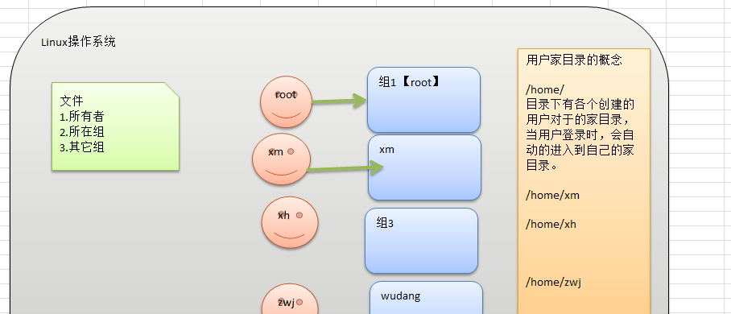

## 文件/目录 所有者

一般为文件的创建者,谁创建了该文件，就自然的成为该文件的所有者。

### 查看文件的所有者

1)	指令：`ls –ahl`

2）应用实例：创建一个组police，再创建一个用户tom，将tom放在police组然后使用tom来创建一个文件ok.txt，看看情况如何

```sh
[root@hadoop1 home]$ groupadd police
[root@hadoop1 home]$ useradd -g police tom
[root@hadoop1 home]$ id tom
uid=503(tom) gid=504(police) 组=504(police)

# 另外一个窗口
[tom@hadoop1 ~]$ touch ok.txt
[tom@hadoop1 ~]$ ls -lah
总用量 32K
drwx------. 4 tom  police 4.0K 4月  10 00:01 .
drwxr-xr-x. 3 root root   4.0K 4月   9 23:50 ..
-rw-------. 1 tom  police   29 4月   9 23:52 .bash_history
-rw-r--r--. 1 tom  police   18 5月  11 2016 .bash_logout
-rw-r--r--. 1 tom  police  176 5月  11 2016 .bash_profile
-rw-r--r--. 1 tom  police  124 5月  11 2016 .bashrc
drwxr-xr-x. 2 tom  police 4.0K 11月 12 2010 .gnome2
drwxr-xr-x. 4 tom  police 4.0K 4月  26 2021 .mozilla
-rw-r--r--. 1 tom  police    0 4月  10 00:01 ok.txt     # ok.txt 的所有者是tom用户   属于police组
```

### 修改文件所有者

•	指令：`chown 用户名 文件名`
•	应用案例
要求：使用root 创建一个文件apple.txt ，然后将其所有者修改成tom

```sh
[root@hadoop1 home]$ touch apple.txt
[root@hadoop1 home]$ ls -ahl
总用量 32K
drwxr-xr-x.  3 root root   4.0K 4月  10 00:06 .
dr-xr-xr-x. 24 root root   4.0K 4月  29 2021 ..
-rw-r--r--.  1 root root      0 4月  10 00:06 apple.txt
drwx------.  4 tom  police 4.0K 4月  10 00:01 tom
[root@hadoop1 home]$ chown tom apple.txt 
[root@hadoop1 home]$ ls -ahl   # -a 可以查看隐藏文件，linux已.开头的文件为隐藏文件
总用量 32K
drwxr-xr-x.  3 root root   4.0K 4月  10 00:06 .   
dr-xr-xr-x. 24 root root   4.0K 4月  29 2021 ..
-rw-r--r--.  1 tom  root      0 4月  10 00:06 apple.txt
drwx------.  4 tom  police 4.0K 4月  10 00:01 tom    # 所有者由上面的root修改为tom，文件所在组没有改变还是root组
```

> -a 可以查看隐藏文件，linux已 . 开头的文件为隐藏文件

### 组的创建

基本指令
	`groupadd 组名`
应用实例:
创建一个组monster ，创建一个用户fox ，并放入到 monster组中

```sh
[root@hadoop1 home]$ groupadd monster
[root@hadoop1 home]$ useradd -g monster fox
[root@hadoop1 home]$ id fox   # 查看用户
uid=504(fox) gid=505(monster) 组=505(monster)
```


## 文件/目录 所在组

当某个用户创建了一个文件后，默认这个文件的所在组就是该用户所在的组。

### 查看文件/目录所在组

•	基本指令
     `ls –ahl`
•	应用实例

### 		修改文件所在的组

•	基本指令
		`chgrp 组名 文件名`
•	应用实例

使用root用户创建文件orange.txt ,看看当前这个文件属于哪个组，然后将这个文件所在组，修改到police组。

```sh
[root@hadoop1 test]$ touch orange.txt
[root@hadoop1 test]$ ls -ahl
总用量 8.0K
drwxr-xr-x. 2 root root 4.0K 4月  10 00:18 .
drwxr-xr-x. 5 root root 4.0K 4月  10 00:17 ..
-rw-r--r--. 1 root root    0 4月  10 00:18 orange.txt
[root@hadoop1 test]$ chgrp police orange.txt   # 将orange.txt由root组修改为police组
[root@hadoop1 test]$ ls -ahl
总用量 8.0K
drwxr-xr-x. 2 root root   4.0K 4月  10 00:18 .
drwxr-xr-x. 5 root root   4.0K 4月  10 00:17 ..
-rw-r--r--. 1 root police    0 4月  10 00:18 orange.txt    
```

## 其它组

除文件的所有者和文件所在组的用户外，系统的其它用户都是文件的其它组。

## 改变用户所在组

在添加用户时，可以指定将该用户添加到哪个组中，同样的用**root的管理权限可以改变某个用户所在的组**。

### 改变用户所在组

1)	`usermod  –g  组名 用户名`
2)	`usermod  –d  目录名 用户名` 改变该用户登陆的初始目录。

应用实例
创建一个土匪组（bandit）将tom这个用户从原来所在的police组，修改到bandit（土匪）组。

```sh
[root@hadoop1 test]$ id tom
uid=503(tom) gid=504(police) 组=504(police)
[root@hadoop1 test]$ groupadd bandit
[root@hadoop1 test]$ usermod -g bandit tom         # tom用户 由police 组 -> bandit组
[root@hadoop1 test]$ id tom
uid=503(tom) gid=506(bandit) 组=506(bandit)
```

## 权限的基本介绍

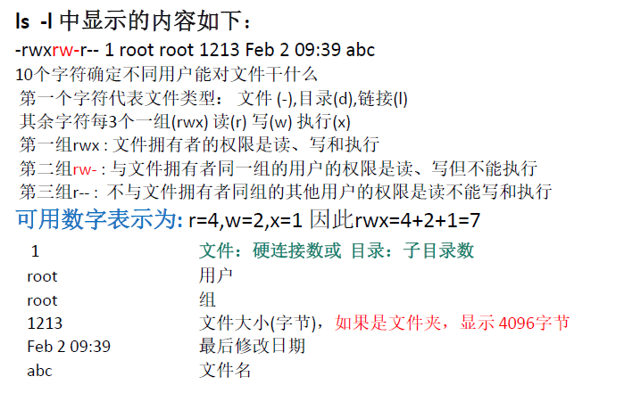

0-9位说明

1)	 第0位【-】确定文件类型(`d 目录`, `- 文件` , `l 软连接文件` , `c  字符设备【键盘鼠标】`, `b 块文件【硬盘】`  )
2)	第1-3位【rw-】确定所有者（该文件的所有者）拥有该文件的权限。---User
3)	第4-6位确定所属组（同用户组的）拥有该文件的权限，---Group
4)	第7-9位确定其他用户拥有该文件的权限 ---Other

## rwx权限详解

### rwx 作用到文件

1)	**[  r  ]**    代表可读(read): 可以**读取,查看**
2)	**[ w ]**    代表可写(write): 可**以修改,但是不代表可以删除该文件**,**删除一个文件**的前提条件是**对该文件所在的目录有写权限，才能删除该文件.**
3)	**[ x ]**    代表可执行(execute):可以被**执行**

### rwx作用到目录

1)	**[  r ]    **代表可读(read): 可以读取，ls查看目录内容
2)	**[ w ]**    代表可写(write): 可以修改,目录内创建+删除+重命名目录
3)	**[ x ]**    代表可执行(execute):可以**进入该目录**

## 权限管理

### 修改权限-chmod

+ 基本说明：
  通过chmod指令，可以修改文件或者目录的权限。


+ 第一种方式：**+ 、-、=** 变更权限
  u:所有者 g:所有组 o:其他人 a:所有人(u、g、o的总和)
  1)	`chmod   u=rwx,g=rx,o=x   文件目录名`
  2)	`chmod   o+w    文件目录名`    为其他用户组添加W【写】权限
  3)	`chmod   a-x    文件目录名`    为所有用户去掉X【执行】权限

  案例演示
  1)	给abc文件的所有者读写执行的权限，给所在组读执行权限，给其它组读执行权限。

  ```sh
  [root@hadoop1 home]$ touch abc
  [root@hadoop1 home]$ chmod u=rwx,g=rx,o=rx abc
  [root@hadoop1 home]$ ls -l abc
  -rwxr-xr-x. 1 root root 0 5月   7 23:19 abc
  ```

  2)	给abc文件的所有者除去执行的权限，增加组写的权限

  ```sh
  [root@hadoop1 home]$ chmod u-x,g+w abc
  [root@hadoop1 home]$ ls -l abc
  -rw-rwxr-x. 1 root root 0 5月   7 23:19 abc
  ```

  3)	给abc文件的所有用户添加读的权限

  ```sh
  [root@hadoop1 home]$ chmod  a+r abc
  [root@hadoop1 home]$ ls -l abc
  -rw-rwxr-x. 1 root root 0 5月   7 23:19 abc
  ```

  

+ 第二种方式：通过数字变更权限
  r=4 w=2 x=1        rwx=4+2+1=7 

  ​            `chmod u=rwx,g=rx,o=x    文件目录名`

  相当于`chmod   751  文件目录名`

  案例演示
  要求：将/home/abc.txt 文件的权限修改成 rwxr-xr-x, 使用给数字的方式实现：

  ```sh
  [root@hadoop1 home]$ touch /home/abc.txt
  [root@hadoop1 home]$ chmod 733 abc.txt
  [root@hadoop1 home]$ ls -l abc.txt
  -rwx-wx-wx. 1 root root 0 5月   7 23:25 abc.txt
  [root@hadoop1 home]$ chmod 755 abc.txt
  [root@hadoop1 home]$ ls -l abc.txt
  -rwxr-xr-x. 1 root root 0 5月   7 23:25 abc.txt
  ```

  

### 修改文件所有者-chown

+ 基本介绍
  `chown  newowner  file`  改变文件的所有者
  `chown newowner:newgroup  file`  改变用户的所有者和所有组

+ 常用参数 

  -R   如果是目录则使其下所有子文件或目录递归生效

+ 案例演示：

  1)	请将/home/abc .txt 文件的所有者修改成tom

  ```sh
  [root@hadoop1 home]$ ls -l abc.txt
  -rwxr-xr-x. 1 root root 0 5月   7 23:25 abc.txt
  [root@hadoop1 home]$ chown tom abc.txt 
  [root@hadoop1 home]$ ls -l abc.txt
  -rwxr-xr-x. 1 tom root 0 5月   7 23:25 abc.txt
  ```

  2)	请将/home/kkk 目录下所有的文件和目录的所有者都修改成tom

  ```sh
  [root@hadoop1 kkk]$ ll
  总用量 4
  drwxr-xr-x. 3 root root 4096 5月   7 23:38 a
  -rw-r-xr-x. 1 root root    0 5月   7 23:37 abc
  -rwxr-xr-x. 1 root root    0 5月   7 23:37 abc.txt
  [root@hadoop1 kkk]$ chown -R tom ./    # -R目录则使其下所有子文件或目录递归生效
  [root@hadoop1 kkk]$ ll
  总用量 4
  drwxr-xr-x. 3 tom root 4096 5月   7 23:38 a
  -rw-r-xr-x. 1 tom root    0 5月   7 23:37 abc
  -rwxr-xr-x. 1 tom root    0 5月   7 23:37 abc.txt
  ```

  

### 修改文件所在组-chgrp

+ 基本介绍
  `chgrp newgroup file`  改变文件的所有组

+ 常用参数 

  -R   如果是目录则使其下所有子文件或目录递归生效

+ 案例演示：
  1)	请将/home/abc .txt 文件的所在组修改成bandit

  ```sh
  [root@hadoop1 kkk]$ chgrp bandit /home/abc.txt 
  [root@hadoop1 kkk]$ ll /home/abc.txt 
  -rwxr-xr-x. 1 tom bandit 0 5月   7 23:25 /home/abc.txt
  ```

  2)	请将/home/kkk 目录下所有的文件和目录的所在组都修改成 bandit

  ```sh
  [root@hadoop1 kkk]$ chgrp -R bandit ./
  [root@hadoop1 kkk]$ ll
  总用量 4
  drwxr-xr-x. 3 tom bandit 4096 5月   7 23:38 a
  -rw-r-xr-x. 1 tom bandit    0 5月   7 23:37 abc
  -rwxr-xr-x. 1 tom bandit    0 5月   7 23:37 abc.txt
  ```

### 最佳实践

police ，bandit 
jack, jerry: 警察
xh, xq: 土匪

(1)	创建组

```sh
bash> groupadd police 
bash> groupadd bandit
```

(2)	创建用户

```sh
[root@hadoop1 kkk]$ useradd -g police jack
[root@hadoop1 kkk]$ useradd -g police jerry
[root@hadoop1 kkk]$ useradd -g bandit xh
[root@hadoop1 kkk]$ useradd -g bandit xq
```

(3)	jack 创建一个文件，自己可以读写，本组人可以读，其它组没人任何权限【su 切换用户   前提 需要设置用户密码】

```sh
[jack@hadoop1 ~]$ vim jack01.txt
[jack@hadoop1 ~]$ ll
总用量 4

# 方式1
-rw-r--r--. 1 jack police 11 5月   7 23:49 jack01.txt
[jack@hadoop1 ~]$ chmod u=rw,g=r,o= jack01.txt 
[jack@hadoop1 ~]$ ll
总用量 4
-rw-r-----. 1 jack police 11 5月   7 23:49 jack01.txt

# 方式2
[jack@hadoop1 ~]$ chmod u=rw,g=r,o-r jack01.txt 
[jack@hadoop1 ~]$ ll
总用量 4
-rw-r-----. 1 jack police 11 5月   7 23:49 jack01.txt
```

(4)	jack 修改该文件，让其它组人可以读, 本组人可以读写

```sh
[jack@hadoop1 ~]$ chmod o=r,g=rw jack01.txt 
[jack@hadoop1 ~]$ ll
总用量 4
-rw-rw-r--. 1 jack police 11 5月   7 23:49 jack01.txt
```

(5)	xh 投靠警察，看看是否可以读写.

```sh
[xh@hadoop1 jack]$ su root
密码：
# 修改xh为police组
[root@hadoop1 jack]$ usermod -g police xh
[root@hadoop1 jack]$ id xh
uid=507(xh) gid=504(police) 组=504(police)

# 查看/home/jack目录，的权限，该目录所在组和其他组都该目录不具有任何权限
[root@hadoop1 home]$ ls -l /home |grep 'jack'
drwx------. 4 jack  police  4096 5月   7 23:49 jack

# 为/home/jack/目录所在组增加rx权限
[root@hadoop1 home]$ chmod g=rx /home/jack/
[root@hadoop1 home]$ ls -l /home |grep 'jack'
drwxr-x---. 4 jack  police  4096 5月   7 23:49 jack

# xh需要重新登录后可以进入jack的家目录【xh未修改/home/jack之前不能进入该目录】
[tom@hadoop1 /]$ su xh
密码：
[xh@hadoop1 /]$ cd /home/jack/
[xh@hadoop1 jack]$ ls
jack01.txt
[xh@hadoop1 jack]$ ll
总用量 4
-rw-rw-r--. 1 jack police 11 5月   7 23:49 jack01.txt
[xh@hadoop1 jack]$ vim jack01.txt   # 具有读和写的权限
```

# 实操篇 定时任务调度

## crond 任务调度

​	crontab 进行定时任务的设置。

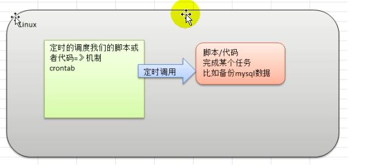

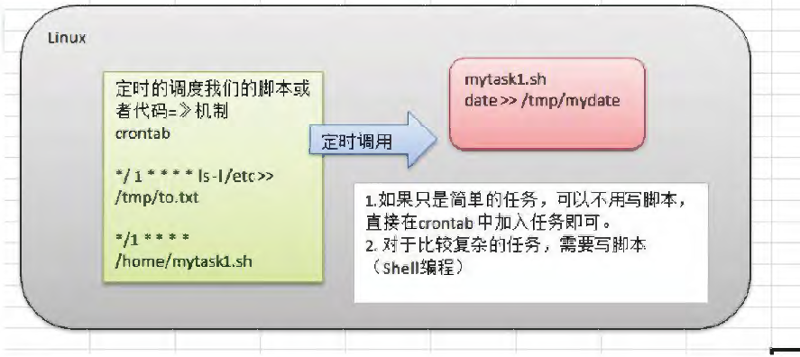

## 概述

任务调度：是指系统在某个时间执行的特定的命令或程序。
任务调度分类：

1.系统工作：有些重要的工作必须周而复始地执行。如病毒扫描等

2.个别用户工作：个别用户可能希望执行某些程序，比如对mysql数据库的备份。

+ 基本语法
  `crontab [选项]`

+ 常用选项
  

## 快速入门

设置任务调度文件：`/etc/crontab`
设置个人任务调度步骤：

1. 执行`crontab –e 命令`。
2. 接着输入任务到调度文件
   如：`*/1 * * * * ls –l  /etc/ > /tmp/to.txt` 
   意思说每小时的每分钟执行`ls –l /etc/ > /tmp/to.txt`

```sh
# 1.执行crontab -e   按i编辑任务，输入*/1 * * * * ls –l  /etc/ > /tmp/to.txt，后显示如下，去ls -l /tmp | grep 'to.*'查看结果
[root@hadoop1 tmp]$ crontab -e
no crontab for root - using an empty one
crontab: installing new crontab
```


**命令参数细节说明**

五个占位符的说明


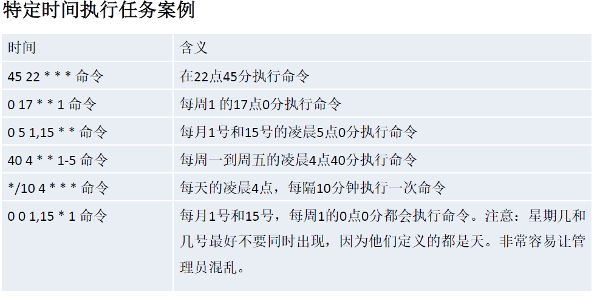

## 任务调度应用实例

**案例1：每隔1分钟，就将当前的日期信息，追加到 /tmp/mydate 文件中**

①创建 ` touch  /home/mytask1.sh`
写入内容：`date >> /tmp/mydate`
并赋予可执行权限`chmod 744 /home/mytask1.sh`

②`crontab –e`

③添加内容：`*/1 * * * * /home/mytask1.sh`

**案例2：每隔1分钟，将当前日期和日历都追加到/home/mycal 文件中**

①创建` touch /home/mytask2.sh`
写入内容：`vim /home/mytask2.sh`

 ```sh
 date >> /tmp/mycal 
 cal>> /tmp/mycal 
 ```

并赋予可执行权限`chmod 744 /home/mytask2.sh`

②`crontab –e`

③添加内容：`*/1 * * * * /home/mytask2.sh`

**案例3:    每天凌晨2:00 将mysql数据库testdb ，备份到文件mydb.bak中。**

①创建` touch /home/mytask3.sh`
写入内容：`vim /home/mytask3.sh`

 ```sh
/usr/local/mysql/bin/mysqldump -u root -p root testdb > /tmp/mybd.bak
 ```

并赋予可执行权限`chmod 744 /home/mytask3.sh`

②`crontab –e`

③添加内容：`0 2 * * * /home/mytask3.sh`

## crond 相关指令:

1)	`crontab –r`：终止任务调度。
2)	`crontab –l`：列出当前有那些任务调度
3)	`service crond restart`   [重启任务调度]


# 实操篇 Linux磁盘分区、挂载

## 分区基础知识

### 分区的方式：

+ 1）mbr分区：

  + 1 最多支持四个主分区

  + 2 系统只能安装在主分区

  + 3 扩展分区要占一个主分区

  + 4 MBR最大只支持2TB，但拥有最好的兼容性

+ 2）gtp分区：

  + 1.支持无限多个主分区（但操作系统可能限制，比如windows下最多128个分区）
  + 2最大支持18EB的大容量（EB-1024 PB，PB=1024 TB）
  + 3.windows7 64位以后支持gtp

### windows下的磁盘分区

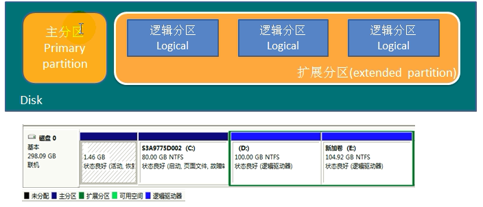

## Linux分区

### 原理介绍

1）Linux来说无论有几介分区，分给哪一目录使用，它归根结底就只有一个根目录，一个独立且唯一的文件结构，Linux中每个分区都是用来组成整个文件系统的一部分。

2）

3）示意图