# Linux开山篇

## 本套Linux课程内容

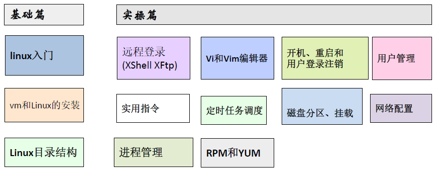

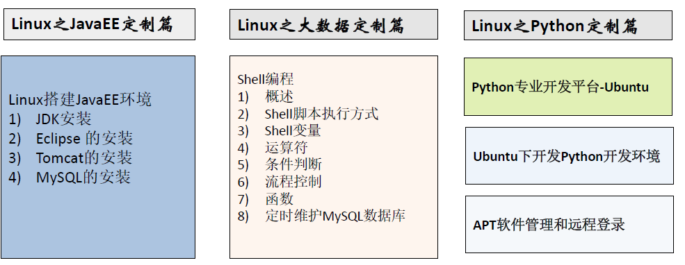

## Linux学习方向

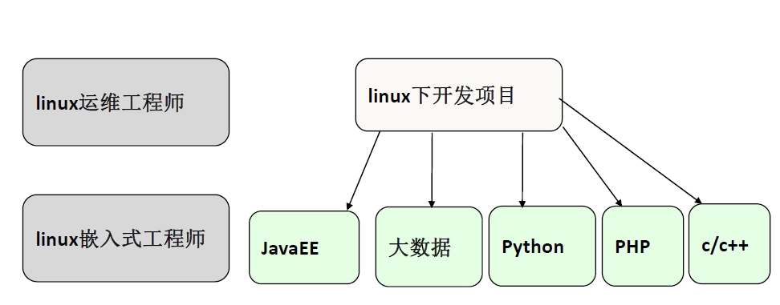

Linux入式开发工程师、Linux嵌入式开发工程师、在linux下做各种程序开发

## Linux 的应用领域

### 个人桌面应用领域

此领域是传统linux 应用最薄弱的环节，传统linux 由于界面简单、操作复杂、应用软件少的缺点，一直被windows 所压制，但近些年来随着 ubuntu、fedora [fɪˈdɔ:rə] 等优秀桌面环境的兴起，同时各大硬件厂商对其支持的加大，linux 在个人桌面领域的占有率在逐渐的提高。

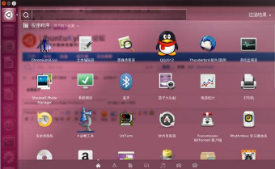

### 服务器应用领域

linux 在服务器领域的应用是最强的。

linux 免费、稳定、高效等特点在这里得到了很好的体现，近些年来 linux 服务器市场得到了飞速的提升，尤其在一些高端领域尤为广泛。

### 嵌入式应用领域

近些年来linux 在嵌入式领域的应用得到了飞速的提高

linux 运行稳定、对网络的良好支持性、低成本，且可以根据需要进行软件裁剪，内核最小可以达到几百KB 等特点，使其近些年来在嵌入式领域的应用得到非常大的提高

主要应用：机顶盒、数字电视、网络电话、程控交换机、手机、PDA、智能家居、智能硬件等都是其应用领域。以后再物联网中应用会更加广泛

## 学习 Linux 的阶段（高手进阶过程）

**linux 是一个开源、免费的操作系统**，其稳定性、安全性、处理多并发已经得到业界的认可，目前很多中型，大型甚至是集群项目都在使用linux,很多软件公司考虑到开发成本都首选linux,在中国软件公司得到广泛的使用。

我个人认为学习linux 流程为:

第1 阶段：linux 环境下的基本操作命令，包括 文件操作命令(rm mkdir chmod, chown) 编辑工具使用（vi vim）linux 用户管理(useradd userdel usermod)等
第2 阶段：linux 的各种配置（环境变量配置，网络配置，服务配置）
第3 阶段：linux 下如何搭建对应语言的开发环境（大数据，JavaEE, Python 等）
第4 阶段：能编写shell 脚本，对Linux 服务器进行维护。
第5 阶段：能进行安全设置，防止攻击，保障服务器正常运行，能对系统调优。
第6 阶段：深入理解Linux 系统（对内核有研究），熟练掌握大型网站应用架构组成、并熟悉各个环节的部署和维护方法。

## Linux 的学习方法和建议

1)	高效而愉快的学习
2)	先建立一个整体框架，然后细节
3)	**不需要掌握所有的Linux 指令，要学会查询手册和百度**
4)	先know how ,再know why
5)	计算机是一门”做中学” 的学科 ,不是会了再做，而是做了才会.
6)	适当的囫囵吞枣
7)	Linux 不是编程，重点是实际操作，各种常用指令要玩的溜

# 基础篇  Linux 入门

## Linux介绍

1）Linux怎么读【里纽克斯，利尼克斯，里纳克斯】
2）Linux是一款操作系统，免费，开源，安全，高效，稳定，处理高并发非常强悍，现在很多的企业级的项目都部署到Linuxiunix服务器运行。
3）Linux创始入linux林纳斯

4）Linux的吉祥物

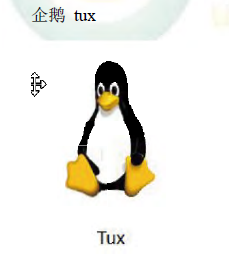

|      |      |
| ---- | ---- |
|      |      |
5）Linux 的主要发行版

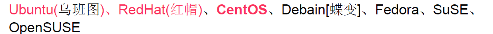

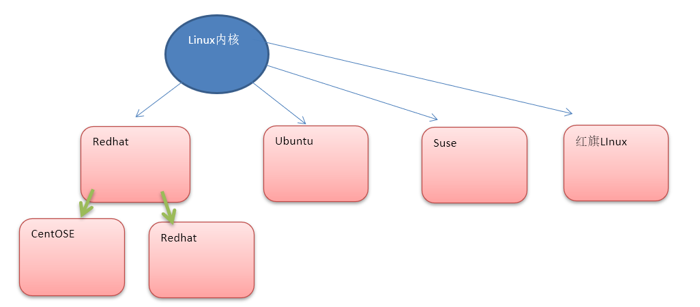

6）目前主要的操作系统有
windows，android，车载系统1inux等。

## unix 是怎么来的

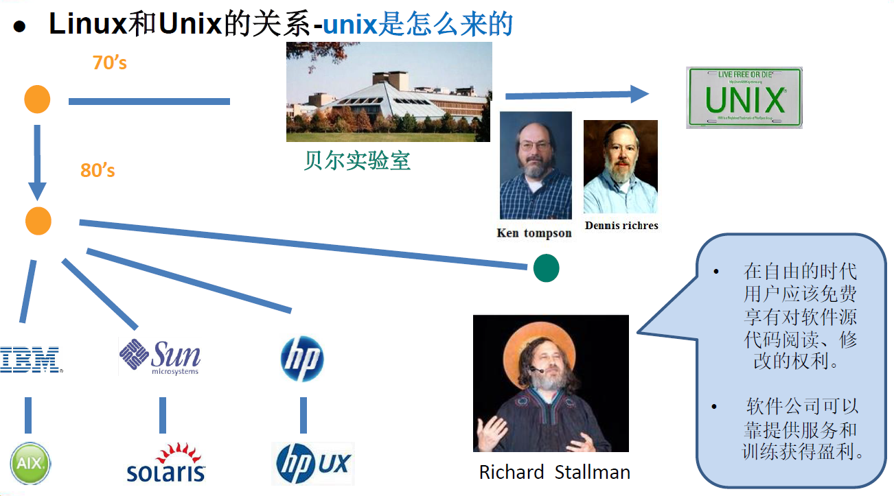

## Linux 是怎么来的

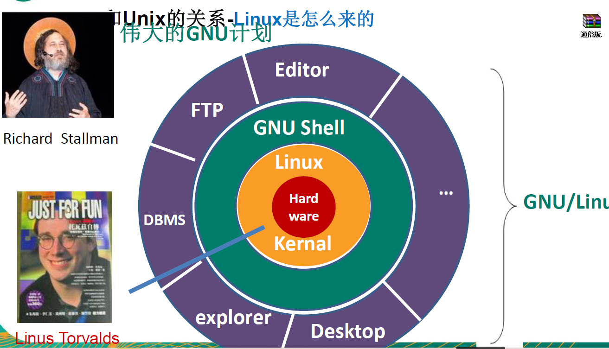

## linux 和 unix 关系一览图

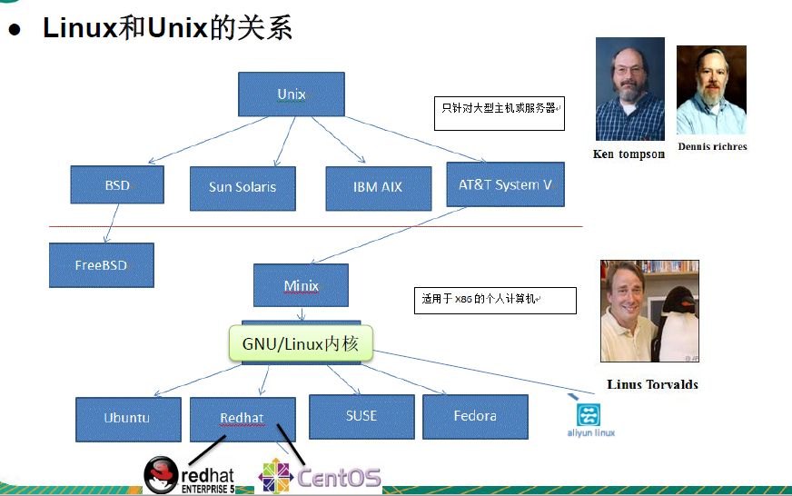

## linux 和 Windows 比较

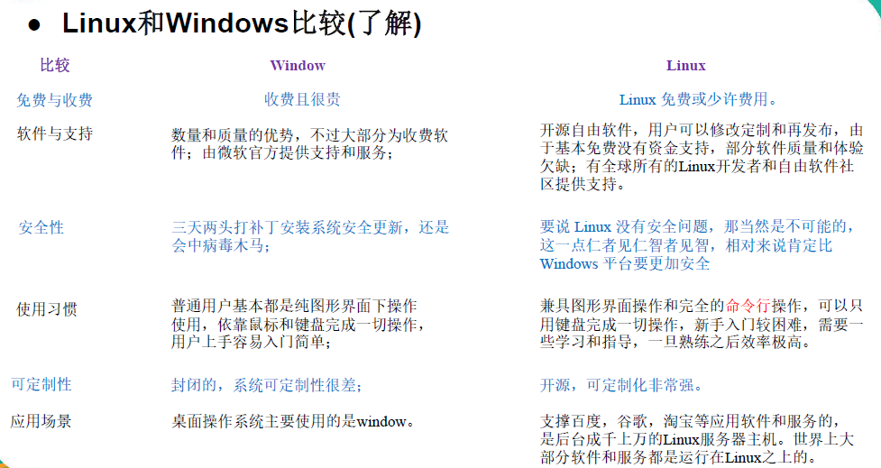

# 基础篇 VM 和 Linux 系统(CentOS)安装

## 安装vm 和Centos

学习Linux 需要一个环境，我们需要创建一个虚拟机，然后在虚拟机上安装一个 Centos 系统来学习。

1)	先安装virtual machine ,vm12
2)	再安装Linux (CentOS 6.8)
3)	原理示意图，这里我们画图说明一下 VM 和 CentOS 的关系。

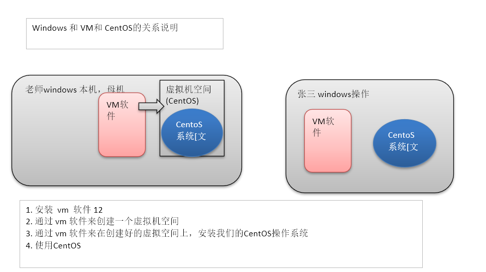

## vm 软件和CentOS 的安装软件

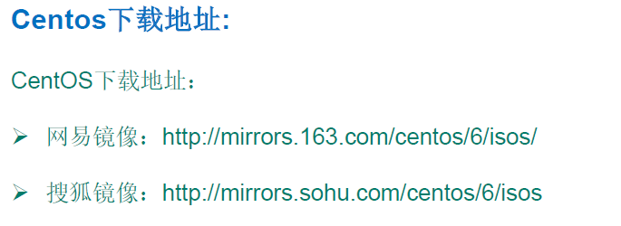

## VM 安装的步骤

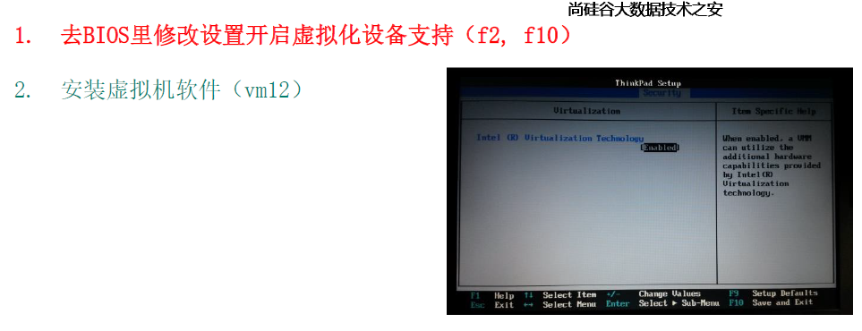

## 安装vm和Centos

1）创建虚拟机

这里在配置网络连接时，有三种形式，需要大家伙注意 ：

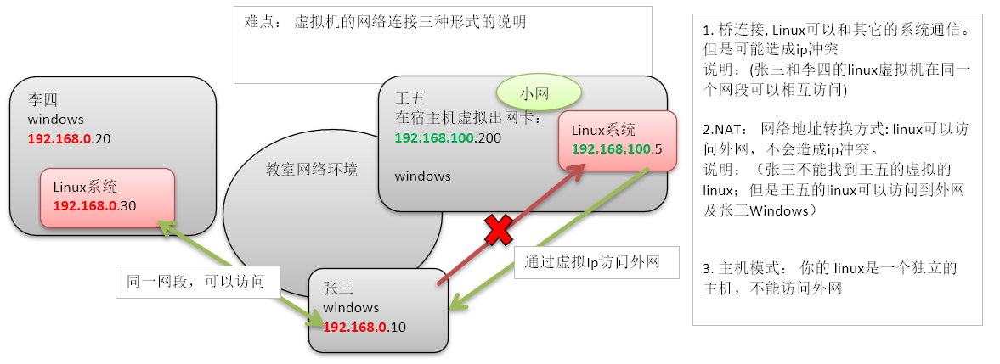

2）开始安装系统（CentOS6.8）

参考word文档

## CentOS 的终端使用和联网

1) 终端的使用，点击鼠标右键，即可选择打开终端

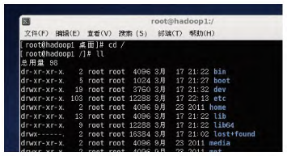

2) 配置网络，可以上网。

点击上面右侧的；两个计算机图片，选择启用eth0,即可成功连接到网络，就可以上网。

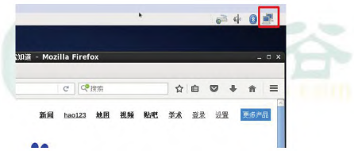

##  vmtools 安装

### 介绍

1)	可以直接粘贴命令在windows 和 centos 系统之间
2)	可以设置windows 和centos 的共享文件夹
3)	示意图

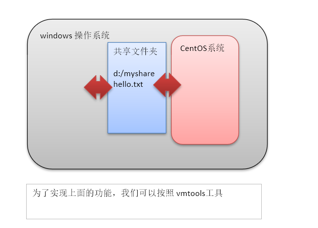

## vmtools 的安装和使用

安装vmtools的步骤:

1.	进入centos
2.	点击vm菜单的->install vmware tools
3.	centos会出现一个vm的安装包
4.	点击右键解压, 得到一个安装文件
5.	进入该vm解压的目录，该文件在 /root/桌面/vmware-tools-distrib/下
6.	安装./vmware-install.pl
7.	全部使用默认设置即可
8.	需要reboot重新启动即可生效

## 设置共享 文件夹

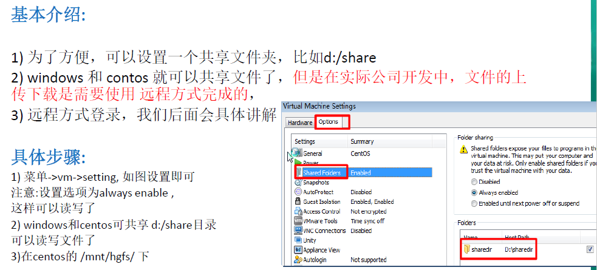

映射到`cd /mnt/hgfs` 目录下

# 基础篇  Linux目录结构

## 基本介绍:

linux的文件系统是采用级层式的树状目录结构，在此`结构中的最上层是根目录“/”`，然后在此目录下再创建其他的目录。
深刻理解linux树状文件目录是非常重要的，这里我给大家说明一下。

记住一句经典的话：`在Linux世界里，一切皆文件`

## 具体的目录结构

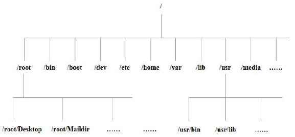

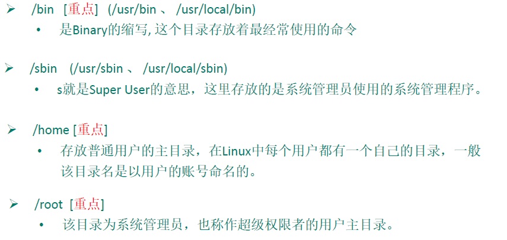

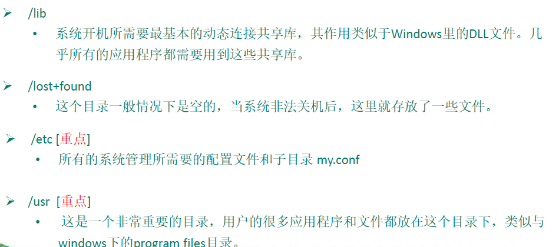

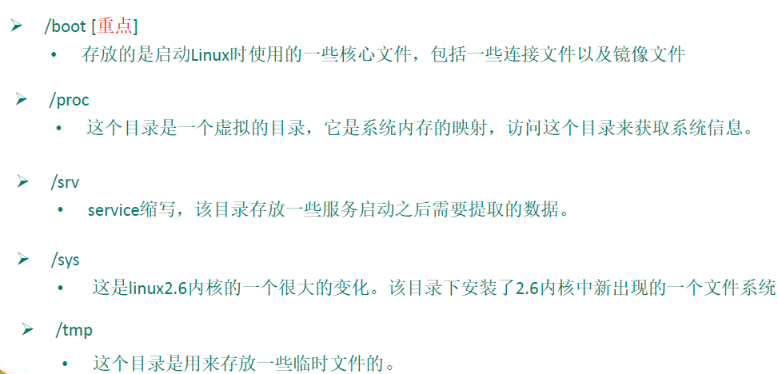

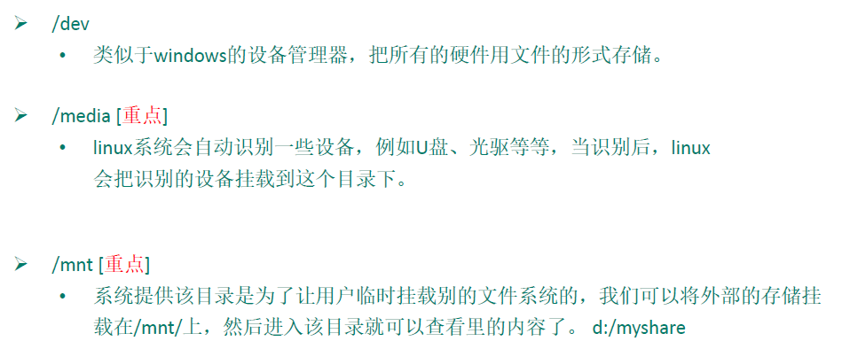

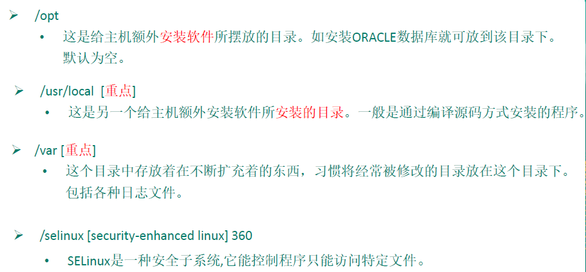

说明：

1)	linux 的目录中有且只要一个根目录 /
2)	linux 的各个目录存放的内容是规划好，不用乱放文件。
3)	linux 是以文件的形式管理我们的设备，因此linux 系统，一切皆为文件。
4)	linux 的各个文件目录下存放什么内容，大家必须有一个认识。
5)	学习后，你脑海中应该有一颗linux 目录树

# 实操篇 远程登录 Linux 系统

## 为什么需要远程登录Linux

### 示意图

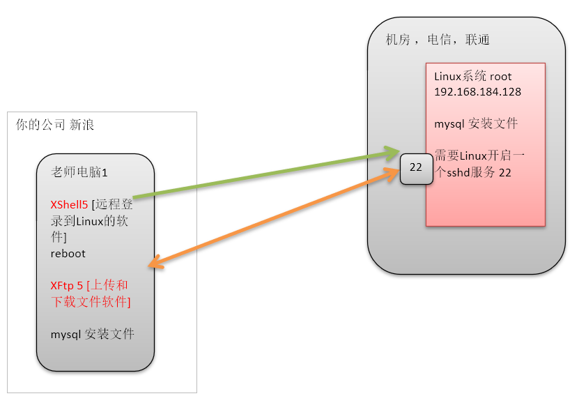

### 说明

说明: 公司开发时候， 具体的情况是这样的

1)	linux 服务器是开发小组共享的.
2)	正式上线的项目是运行在公网的.
3)	因此程序员需要远程登录到centos 进行项目管理或者开发.
4)	画出简单的网络拓扑示意图(帮助理解)
5)	远程登录客户端有 Xshell5， Xftp5 , 我们学习使用 Xshell5 和 Xftp , 其它的远程工具大同

## 远程登录Linux-Xshell5

说明: Xshell 是目前最好的远程登录到 Linux 操作的软件，流畅的速度并且完美解决了**中文乱码**的问题， 是目前程序员首选的软件。
Xshell [1] 是一个强大的安全终端模拟软件，它支持 SSH1, SSH2, 以及 Microsoft Windows 平台的TELNET 协议。
Xshell 可以在Windows 界面下用来访问远端不同系统下的服务器，从而比较好的达到远程控制终端的目的。

**特别说明**：如果希望安装好 XShell 5 就可以远程访问 Linux 系统的话，需要有一个**前提**，就是`Linux 启用了SSHD 服务`，该`服务会监听22 号端口`。

### 查看方式是否开启SSHD服务

终端输入     `setup`

选择System services   进行查看SSHD服务

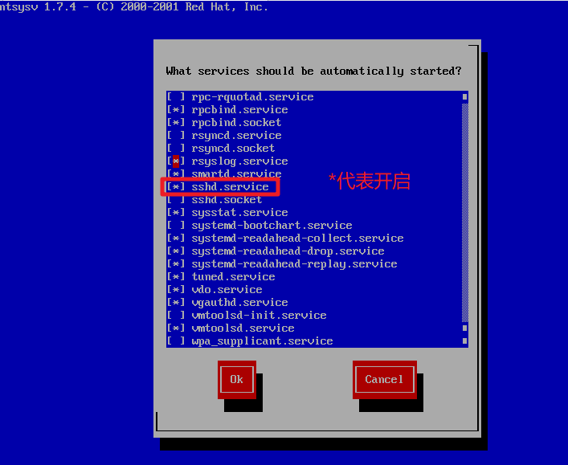

## 安装 XShell5 并使用

### XShell5 的关键配置

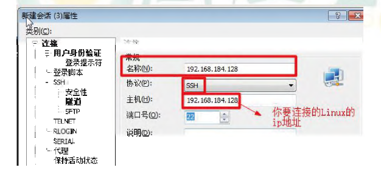

## 远程上传下载文件Xftp5

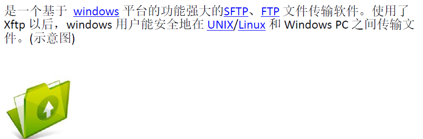

连接

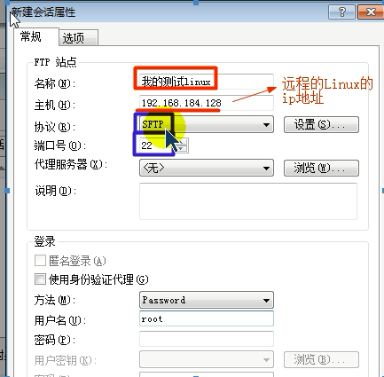

# Linux实操篇 Vi和Vim编辑器

