# 多线程

## 基本概念：程序、进程、线程

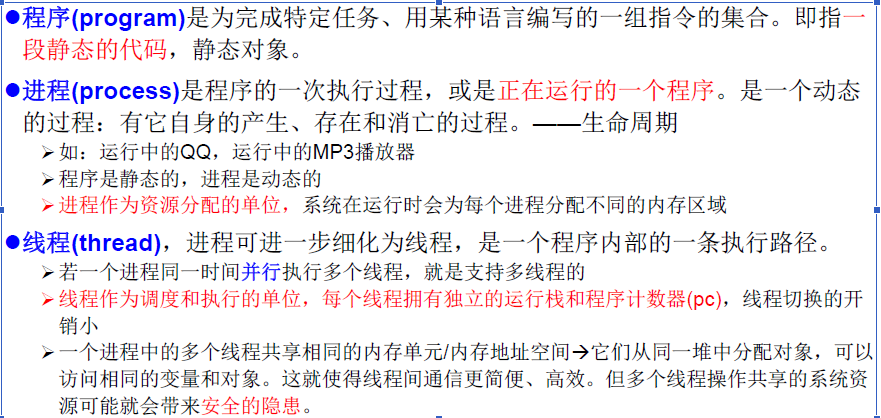

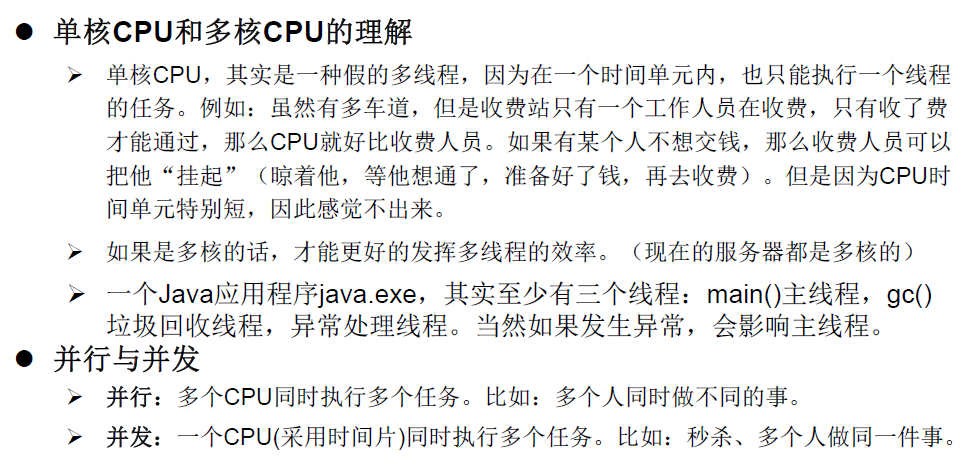

使用多线程的优点

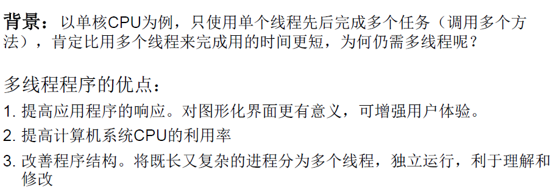

何时需要多线程

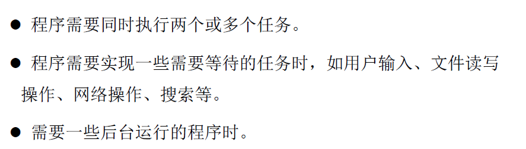

## 线程的创建和使用

### 线程的创建和启动

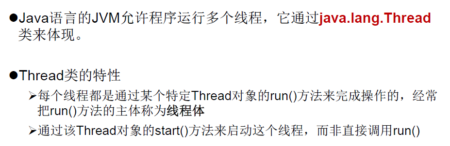

#### 方式一：继承Thread类的方式

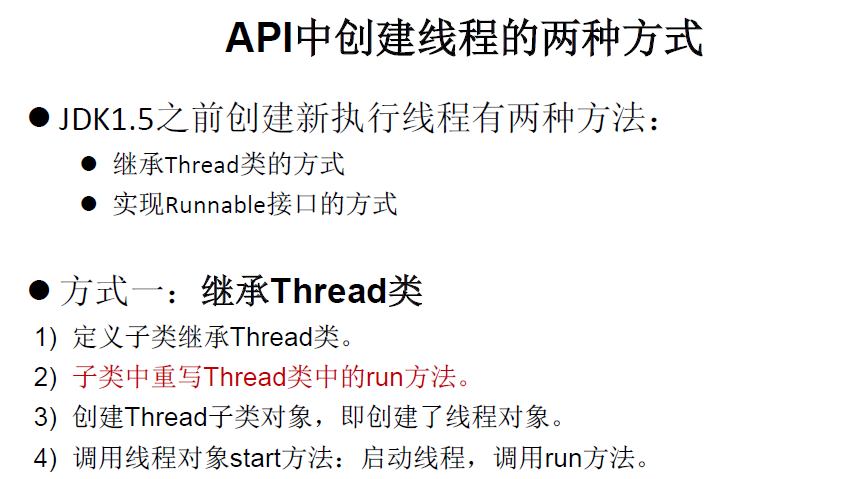

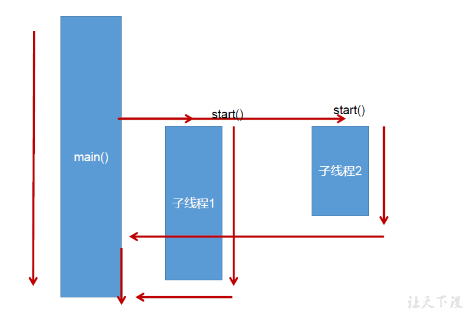

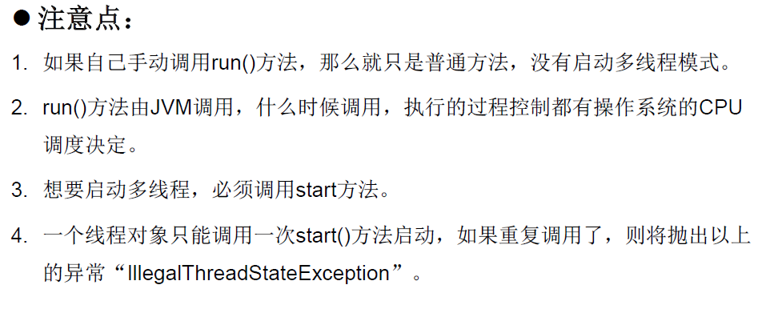

```java
package com.atguigu.java;
/**
 * 多线程的创建，方式一：
 * 1.创建一个继承于Thread类的子类
 * 2.重写Thread类的run()
 * 3.创建Thread类的子类的对象
 * 4·通过此对象调用start()
 */
public class ThreadTest {
    public static void main(String[] args) {
        //3.创建Thread类的子类的对象
        MyThread myThread = new MyThread();
        //4·通过此对象调用start()：①启动当前当前线程 ②调用当前线程的run()方法
        myThread.start();
        //问题一：我们不能通过直接调用run()方法的方式启动线程
//        myThread.run();

        //问题二：再启动一个线程，遍历100以内的偶数，不可以还让已经start()的线程去执行，会报IllegalThreadStateException
        //if (threadStatus != 0)//如果线程的状态不是0（not yet started尚未启动）
        //            throw new IllegalThreadStateException();
        //myThread.start();
        new MyThread().start();

        //如下操作仍然是在main线程中执行的
        for (int i = 0; i < 100; i++) {
            System.out.println(Thread.currentThread().getName()+":"+"ThreadTest.main");

        }

        //创建Thread类的匿名子类的方式
        new Thread(){
            @Override
            public void run() {
                for (int i = 0; i < 100; i++) {
                    if (i % 2 == 1){
                        System.out.println(Thread.currentThread().getName()+":"+i);
                    }

                }
            }
        }.start();
    }
}

//1.创建一个继承于Thread类的子类
class MyThread extends Thread{
    //2.重写Thread类的run()
    @Override
    public void run() {
        //例子：遍历100以内的所有的偶数
        for (int i = 0; i < 100; i++) {
            if (i % 2 == 0){
                System.out.println(Thread.currentThread().getName()+":"+ i);
            }

        }
    }
}
```

#### 方式二：实现Runnable接口

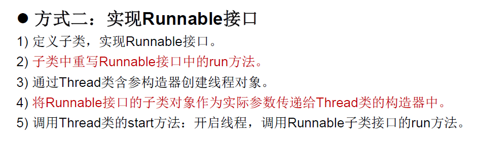

```java
package atguigu.java;

/**
 * 创建多线程的方式二：实现Runnable接口
 * 1. 创建一个实现了Runnable接口的类
 * 2. 实现类去实现Runnable中的抽象方法：run()
 * 3. 创建实现类的对象
 * 4. 将此对象作为参数传递到Thread类的构造器中，创建Thread类的对象
 * 5. 通过Thread类的对象调用start()
 *
 *
 * 比较创建线程的两种方式。
 * 开发中：优先选择：实现Runnable接口的方式
 * 原因：1. 实现的方式没有类的单继承性的局限性
 *      2. 实现的方式更适合来处理多个线程有共享数据的情况。
 *
 * 联系：public class Thread implements Runnable
 * 相同点：两种方式都需要重写run(),将线程要执行的逻辑声明在run()中。
 *
 */
//1. 创建一个实现了Runnable接口的类
class MThread implements Runnable{

    //2. 实现类去实现Runnable中的抽象方法：run()
    @Override
    public void run() {
        for (int i = 0; i < 100; i++) {
            if(i % 2 == 0){
                System.out.println(Thread.currentThread().getName() + ":" + i);
            }

        }
    }
}


public class ThreadTest1 {
    public static void main(String[] args) {
        //3. 创建实现类的对象
        MThread mThread = new MThread();
        //4. 将此对象作为参数传递到Thread类的构造器中，创建Thread类的对象
        Thread t1 = new Thread(mThread);
        t1.setName("线程1");
        //5. 通过Thread类的对象调用start():① 启动线程 ②调用当前线程的run()-->调用了Runnable类型的target的run()
        t1.start();

        //再启动一个线程，遍历100以内的偶数
        Thread t2 = new Thread(mThread);
        t2.setName("线程2");
        t2.start();
    }

}

```

> Thread中run源码

```java
/* What will be run. */
private Runnable target;   
...
@Override
    public void run() {
        if (target != null) {
            target.run();
        }
    }
```


### Thread类

#### 构造器

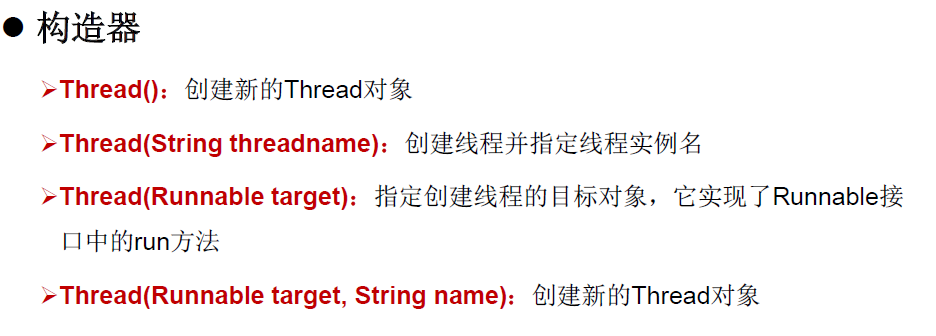

#### 常用方法

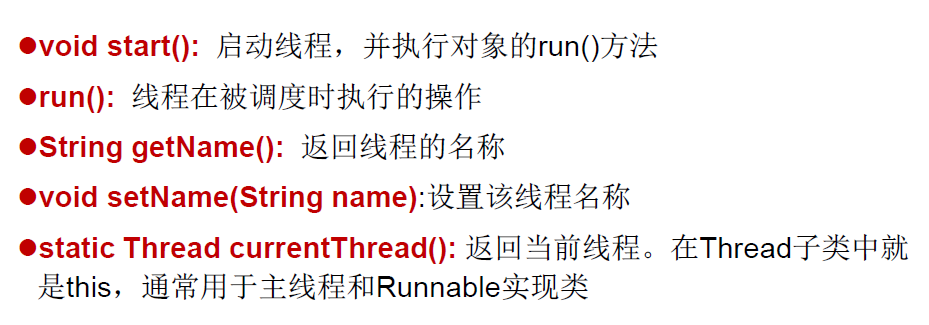

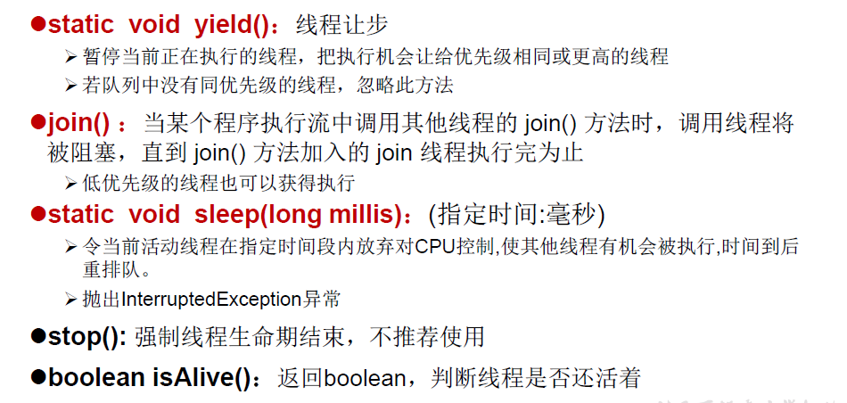

线程调度

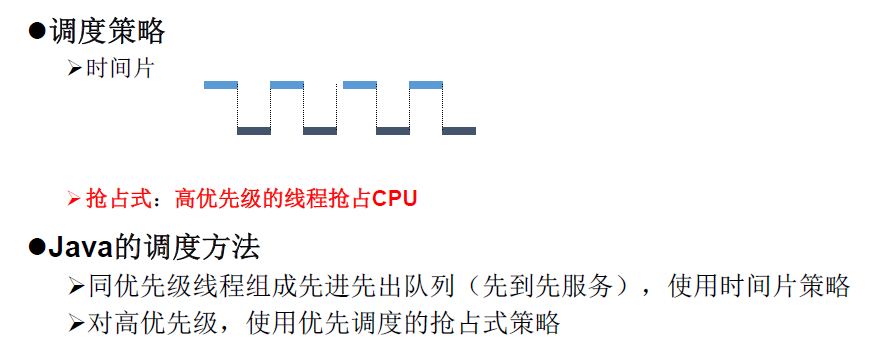

线程的优先级

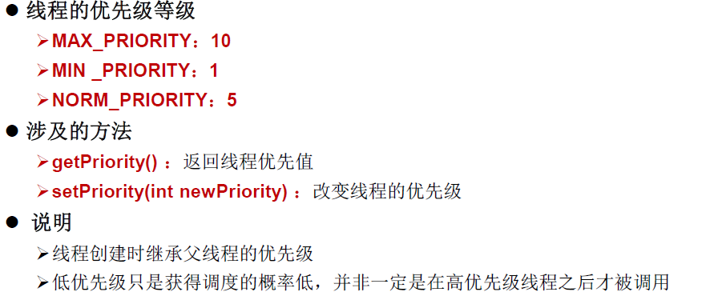

线程分类

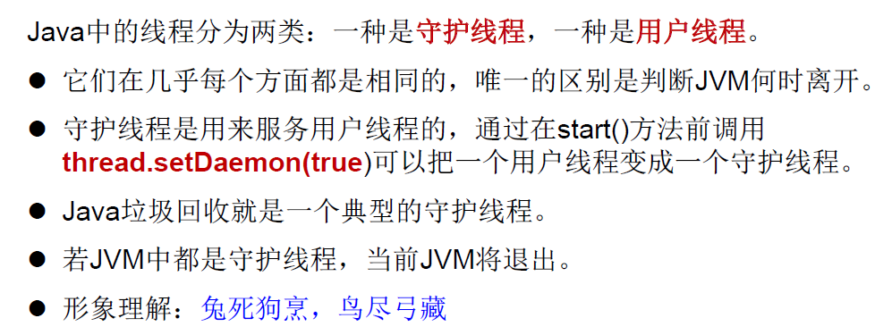

```java
package atguigu.java;

/**
 * 测试Thread中的常用方法：
 * 1. start():启动当前线程；调用当前线程的run()
 * 2. run(): 通常需要重写Thread类中的此方法，将创建的线程要执行的操作声明在此方法中
 * 3. currentThread():静态方法，返回执行当前代码的线程
 * 4. getName():获取当前线程的名字
 * 5. setName():设置当前线程的名字
 * 6. yield():释放当前cpu的执行权
 * 7. join():在线程a中调用线程b的join(),此时线程a就进入阻塞状态，直到线程b完全执行完以后，线程a才
 *           结束阻塞状态。
 * 8. stop():已过时。当执行此方法时，强制结束当前线程。
 * 9. sleep(long millitime):让当前线程“睡眠”指定的millitime毫秒。在指定的millitime毫秒时间内，当前
 *                          线程是阻塞状态。
 * 10. isAlive():判断当前线程是否存活
 *
 *
 * 线程的优先级：
 * 1.
 * MAX_PRIORITY：10
 * MIN _PRIORITY：1
 * NORM_PRIORITY：5  -->默认优先级
 * 2.如何获取和设置当前线程的优先级：
 *   getPriority():获取线程的优先级
 *   setPriority(int p):设置线程的优先级
 *
 *   说明：高优先级的线程要抢占低优先级线程cpu的执行权。但是只是从概率上讲，高优先级的线程高概率的情况下
 *   被执行。并不意味着只有当高优先级的线程执行完以后，低优先级的线程才执行。
 *
 *
 */
class HelloThread extends Thread{
    @Override
    public void run() {
        for (int i = 0; i < 100; i++) {
            if(i % 2 == 0){
//此处只能try-catch，因为子类重写的方法抛出的异常必须不大于父类的
//                try {
//                    sleep(10);
//                } catch (InterruptedException e) {
//                    e.printStackTrace();
//                }

                System.out.println(Thread.currentThread().getName() + ":" + Thread.currentThread().getPriority() + ":" + i);
            }

//            if(i % 20 == 0){
//                yield();//释放当前cpu的执行权
//            }

        }

    }
    //通过构造器命名
    public HelloThread(String name){
        super(name);
    }
}


public class ThreadMethodTest {
    public static void main(String[] args) {

        HelloThread h1 = new HelloThread("Thread：1");

//        h1.setName("线程一");
        //设置分线程的优先级
        h1.setPriority(Thread.MAX_PRIORITY);

        h1.start();

        //给主线程命名
        Thread.currentThread().setName("主线程");
        Thread.currentThread().setPriority(Thread.MIN_PRIORITY);

        for (int i = 0; i < 100; i++) {
            if(i % 2 == 0){
                System.out.println(Thread.currentThread().getName() + ":" + Thread.currentThread().getPriority() + ":" + i);
            }

//            if(i == 20){
//                try {
//                    h1.join();
//                } catch (InterruptedException e) {
//                    e.printStackTrace();
//                }
//            }

        }

//        System.out.println(h1.isAlive());

    }
}
```


举例：存在线程安全问题

> 继承Thread

```java
package atguigu.java;

/**
 *
 * 例子：创建三个窗口卖票，总票数为100张.使用继承Thread类的方式
 *
 * 存在线程的安全问题，待解决。
 *
 */
class Window extends Thread{


    private static int ticket = 100;
    @Override
    public void run() {

        while(true){

            if(ticket > 0){
                System.out.println(getName() + "：卖票，票号为：" + ticket);
                ticket--;
            }else{
                break;
            }

        }

    }
}


public class WindowTest {
    public static void main(String[] args) {
        Window t1 = new Window();
        Window t2 = new Window();
        Window t3 = new Window();


        t1.setName("窗口1");
        t2.setName("窗口2");
        t3.setName("窗口3");

        t1.start();
        t2.start();
        t3.start();

    }
}

```

> 实现Runnable接口

```java
package atguigu.java;

/**
 * 例子：创建三个窗口卖票，总票数为100张.使用实现Runnable接口的方式
 * 存在线程的安全问题，待解决。
 *
 */
class Window1 implements Runnable{

    private int ticket = 100;

    @Override
    public void run() {
        while(true){
            if(ticket > 0){
                System.out.println(Thread.currentThread().getName() + ":卖票，票号为：" + ticket);
                ticket--;
            }else{
                break;
            }
        }
    }
}


public class WindowTest1 {
    public static void main(String[] args) {
        Window1 w = new Window1();

        Thread t1 = new Thread(w);
        Thread t2 = new Thread(w);
        Thread t3 = new Thread(w);

        t1.setName("窗口1");
        t2.setName("窗口2");
        t3.setName("窗口3");

        t1.start();
        t2.start();
        t3.start();
    }

}

```


## 线程的生命周期

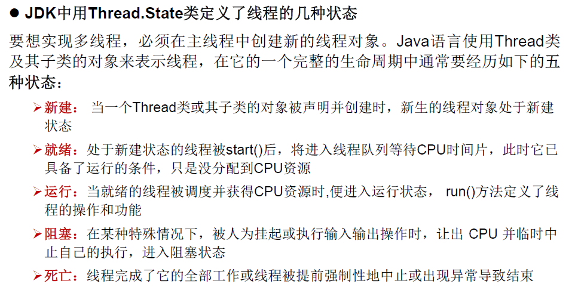

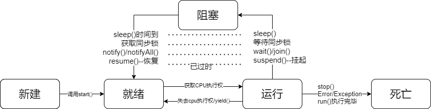

说明：
1.生命周期关注两个概念：状态、相应的方法
2.关注：状态a-->状态b:哪些方法执行了（回调方法）
        某个方法主动调用：状态a-->状态b
3.阻塞：临时状态，不可以作为最终状态
  死亡：最终状态。

## 线程的同步

### 线程安全问题

2.	问题的原因：
`当多条语句在操作同一个线程共享数据`时，一个线程对多条语句只执行了一部分，还没有执行完，另一个线程参与进来执行。导致共享数据的错误。
3.	解决办法：
对多条操作共享数据的语句，只能让一个线程都执行完，在执行过程中，其他线程不可以参与执行。

### Synchronized的使用方法

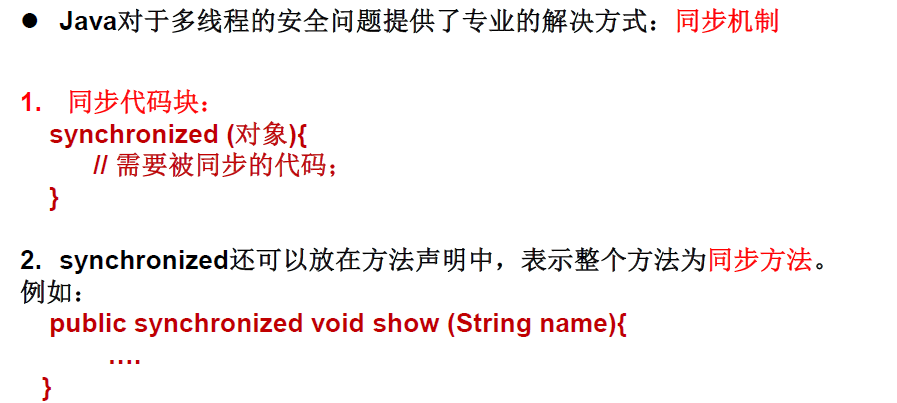

同步代码块

```java
package com.atguigu.java;

/**
 * 例子：创建三个窗口卖票，总票数为100张.使用实现Runnable接口的方式
 * 1.问题：卖票过程中，出现了重票、错票 -->出现了线程的安全问题
 * 2.问题出现的原因：当某个线程操作车票的过程中，尚未操作完成时，其他线程参与进来，也操作车票。
 * 3.如何解决：当一个线程a在操作ticket的时候，其他线程不能参与进来。直到线程a操作完ticket时，其他
 *            线程才可以开始操作ticket。这种情况即使线程a出现了阻塞，也不能被改变。
 * 4.在Java中，我们通过同步机制，来解决线程的安全问题。
 *  方式一：同步代码块
 *   synchronized(同步监视器){
 *      //需要被同步的代码
 *   }
 *  说明：1.操作共享数据的代码，即为需要被同步的代码。  -->不能包含代码多了，也不能包含代码少了。
 *       2.共享数据：多个线程共同操作的变量。比如：ticket就是共享数据。
 *       3.同步监视器(Monitor)，俗称：锁。任何一个类的对象，都可以充当锁。
 *          要求：多个线程必须要共用同一把锁。
 *       补充：在实现Runnable接口创建多线程的方式中，我们可以考虑使用this充当同步监视器。
 *            在继承Thread类创建多线程的方式中，慎用this充当同步监视器。可以考虑使用 当前类.class
 *  方式二：同步方法。
 *     如果操作共享数据的代码完整的声明在一个方法中，我们不妨将此方法声明同步的。
 *  5.同步的方式，解决了线程的安全问题。---好处
 *    操作同步代码时，只能有一个线程参与，其他线程等待。相当于是一个单线程的过程，效率低。 ---局限性
 */
public class Windows {
    public static void main(String[] args) {
        Window window = new Window();
        new Thread(window, "1号").start();
        new Thread(window, "2号").start();
        new Thread(window, "3号").start();

    }
}

class Window implements Runnable {
    int ticket = 100;

    @Override
    public void run() {
        while (true) {
            if (ticket > 0) {
                try {
                    Thread.sleep(100);
                } catch (InterruptedException e) {
                    e.printStackTrace();
                }
                System.out.println(Thread.currentThread().getName() + ":" + ticket--);
            } else {
                break;
            }
        }
    }
}
```

同步方法

```java
package com.atguigu.java;

/**
 * 使用同步方法处理继承Thread类的方式中的线程安全问题
 * 
 *  关于同步方法的总结：
 *  1. 同步方法仍然涉及到同步监视器，只是不需要我们显式的声明。
 *  2. 非静态的同步方法，同步监视器是：this
 *     静态的同步方法，同步监视器是：当前类.class
 */
class Window4 extends Thread {

    private static int ticket = 100;

    @Override
    public void run() {

        while (true) {

            show();
        }

    }

    //非静态方法的同步监视器：this
    //静态方法的同步监视器：类.class
    private static synchronized void show(){//同步监视器：Window4.class
        //private synchronized void show(){ //同步监视器：t1,t2,t3。此种解决方式是错误的
        if (ticket > 0) {

            try {
                Thread.sleep(100);
            } catch (InterruptedException e) {
                e.printStackTrace();
            }

            System.out.println(Thread.currentThread().getName() + "：卖票，票号为：" + ticket);
            ticket--;
        }
    }
}


public class WindowTest4 {
    public static void main(String[] args) {
        Window4 t1 = new Window4();
        Window4 t2 = new Window4();
        Window4 t3 = new Window4();


        t1.setName("窗口1");
        t2.setName("窗口2");
        t3.setName("窗口3");

        t1.start();
        t2.start();
        t3.start();

    }
}
```


**同步锁机制** 

+ 同步机制中的锁
  在《Thinking in Java》中，是这么说的：`对于并发工作，你需要某种方式来防止两个任务访问相同的资源（其实就是共享资源竞争）`。防止这种冲突的方法就是当资源被一个任务使用时，在其上加锁。第一个访问某项资源的任务必须锁定这项资源，使其他任务在其被解锁之前，就无法访问它了，而在其被解锁之时，另一个任务就可以锁定并使用它了。
+ synchronized的锁是什么？
  + **任意对象都可以作为同步锁。所有对象都自动含有单一的锁（监视器）**。
  + **`同步方法`的锁：`静态方法（类名.class）`、`非静态方法（this）`**
  + **`同步代码块`：自己指定，很多时候也是指定为this或类名.class**
+ 注意：
  + **必须确保使用同一个资源的多个线程共用`一把锁(ps:继承Thread 创建线程对象时注意使用同一把锁)`**，这个非常重要，否则就无法保证共享资源的安全
  
  + **一个线程类中的所有静态方法共用同一把锁（类名.class ps：类只会加载一次）**，**所有非静态方法共用同一把锁（this）**，同步代码块（指定需谨慎）
  
    


**同步的范围**

1、如何找问题，即代码是否存在线程安全？（非常重要）
	（1）明确哪些代码是多线程运行的代码
	（2）明确多个线程是否有共享数据
（	3）明确多线程运行代码中是否有多条语句操作共享数据

2、如何解决呢？（非常重要）
对多条操作共享数据的语句，只能让一个线程都执行完，在执行过程中，其也线程不可以参与执行。
即所有操作共享数据的这些语句都要放在同步范围中

3、切记：

​	范围太小：没锁住所有有安全问题的代码

​	范围太大：没发挥多线程的功能。

**释放锁的操作**

+ 当前线程的同步方法、同步代码块执行结束。
+ 当前线程在同步代码块、同步方法中遇到break，return终止了该代码块、该方法的继续执行。
+ 当前线程在同步代码块、同步方法中出现了未处理的Error或Exception，导致异常结束。
+ 当前线程在同步代码块、同步方法中执行了线程对象的wait（）方法，当前线程暂停，并释放锁。

**不会释放锁的操作**

+ 线程执行同步代码块或同步方法时，程序调用**Thread.sleep（）**
  **Thread.yield（）**方法暂停当前线程的执行
+ 线程执行同步代码块时，**其他线程调用了该线程的suspend（）方法将该线程挂起，该线程不会释放锁（同步监视器）**。
  - 应尽量避免使用suspend（）和resume（）来控制线程 


### 线程安全的懒汉式

```java
package com.atguigu.java;

public class SingletonTest {
    public static void main(String[] args) {
        Single instance = Single.getInstance();
        Single instance1 = Single.getInstance();
    }
}

class Single {

    private static Single instance;
    private Single(){}

    public static Single getInstance(){

     //方式一：性能稍差
//            synchronized (Single.class){
//                if (instance ==null){
//                    instance = new Single();
//                }
//            }

       //方式二：
        if (instance == null){
            synchronized (Single.class){
                if (instance ==null){
                    instance = new Single();
                }
            }
        }
        return instance;
    }
}
```

### 死锁

+ 死锁
  + 不同的线程分别占用对方需要的同步资源不放弃，都在等待对方放弃自己需要的同步资源，就形成了线程的死锁
  + 出现死锁后，不会出现异常，不会出现提示，只是所有的线程都处于阻塞状态，无法继续

+ 解决方法
  + 专门的算法、原则
  + 尽量减少同步资源的定义
  + 尽量避免 套同步

```java
package com.atguigu.java1;

/**
 * 1·死锁的理解：不同的线程分别占用对方需要的同步资源不放弃，
 * 都在等待对方放弃自己需要的同步资源，就形成了线程的死锁
 *2.说明：
 * 1）出现死锁后，不会出现异常，不会出现提示，只是所有的线程都处于阻塞状态，无法继续
 * 2）我们使用同步时，要避免出现死锁。
 *
 */
public class ThreadTest {
    public static void main(String[] args) {
        StringBuilder s1 = new StringBuilder();
        StringBuilder s2 = new StringBuilder();

        new Thread() {
            @Override
            public void run() {
                synchronized (s1) {
                    s1.append('a');
                    s2.append("1");
                    try {
                        Thread.sleep(100);
                    } catch (InterruptedException e) {
                        e.printStackTrace();
                    }

                    synchronized (s2) {
                        s1.append('b');
                        s2.append("2");
                    }
                }
                System.out.println(s1);
                System.out.println(s2);

            }
        }.start();
        new Thread(() -> {
            synchronized (s2) {
                s1.append('c');
                s2.append("3");
                try {
                    Thread.sleep(100);
                } catch (InterruptedException e) {
                    e.printStackTrace();
                }
                synchronized (s1) {
                    s1.append('d');
                    s2.append("4");
                }
            }
            System.out.println(s1);
            System.out.println(s2);
        }).start();

    }

}
```

### Lock锁

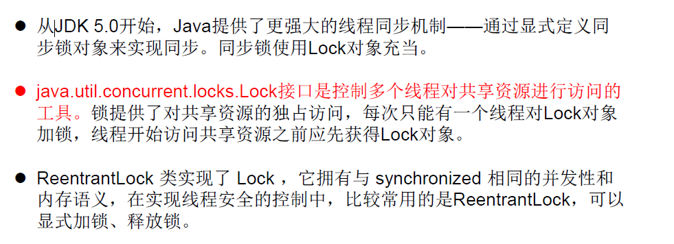

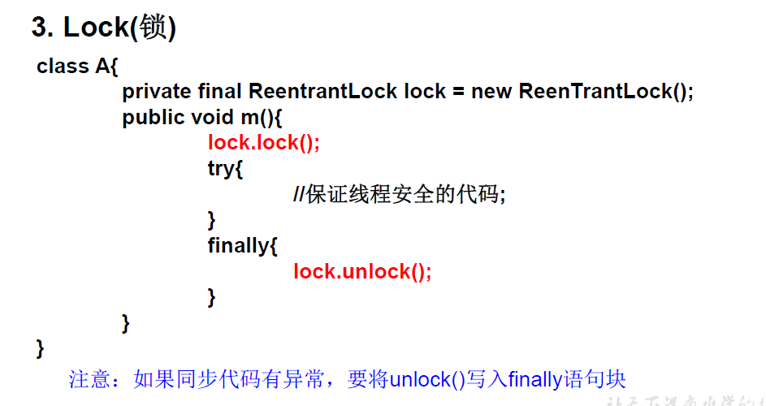

```java
package com.atguigu.java1;

import java.util.concurrent.locks.ReentrantLock;

/**
 * 解决线程安全问题的方式三：Lock锁  --- JDK5.0新增
 *
 * 1. 面试题：synchronized 与 Lock的异同？
 *   相同：二者都可以解决线程安全问题
 *   不同：synchronized机制在执行完相应的同步代码以后，自动的释放同步监视器
 *        Lock需要手动的启动同步（lock()），同时结束同步也需要手动的实现（unlock()）
 *
 * 2.优先使用顺序：
 * Lock  同步代码块（已经进入了方法体，分配了相应资源）  同步方法（在方法体之外）
 *
 *
 *  面试题：如何解决线程安全问题？有几种方式
 * @author shkstart
 * @create 2019-02-15 下午 3:38
 */
class Window implements Runnable{

    private int ticket = 100;
    //1.实例化ReentrantLock
    private ReentrantLock lock = new ReentrantLock();

    @Override
    public void run() {
        while(true){
            try{

                //2.调用锁定方法lock()
                lock.lock();

                if(ticket > 0){

                    try {
                        Thread.sleep(100);
                    } catch (InterruptedException e) {
                        e.printStackTrace();
                    }

                    System.out.println(Thread.currentThread().getName() + "：售票，票号为：" + ticket);
                    ticket--;
                }else{
                    break;
                }
            }finally {
                //3.调用解锁方法：unlock()
                lock.unlock();
            }

        }
    }
}

public class LockTest {
    public static void main(String[] args) {
        Window w = new Window();

        Thread t1 = new Thread(w);
        Thread t2 = new Thread(w);
        Thread t3 = new Thread(w);

        t1.setName("窗口1");
        t2.setName("窗口2");
        t3.setName("窗口3");

        t1.start();
        t2.start();
        t3.start();
    }
}

```

### synchronized与Lock的对比

1. Lock是显式锁（手动开启和关闭锁，别忘记关闭锁），synchronized是隐式锁，出了作用域自动释放

2. Lock只有代码块锁，synchronized有代码块锁和方法锁

3. 使用Lock锁，JVM将花费较少的时间来调度线程，性能更好。并且具有更好的扩展性（提供更多的子类）

   

优先使用顺序：Lock >同步代码块（已经进入了方法体，分配了相应资源）同步方法（在方法体之外）

## 线程的通信

+ `wait()与notify()和notifyA()`
  + wait( )：**令当前线程挂起并放弃CPU、同步资源并等待，使别的线程可访问并修改共享资源**，而当前线程排队等候其他线程调用notify( )或notifyAll( )方法唤醒，唤醒后等待重新获得对监视器的所有权后才能继续执行。
  + notifyl（）：唤醒正在排队等待同步资源的线程中优先级最高者结束等待(`通过锁对象唤醒`)
  + notifyAll（）：唤醒正在排队等待资源的所有线程结束等待(`通过锁对象唤醒`)
+ 这`三个方法只有在synchronized方法或synchronized代码块中才能使用，否则会报java.lang.llegalMonitorStateException异常`。
+ 因为`这三个方法必须由锁对象调用(this或者显式声明的锁对象)`，`而任意对象都可以作为synchronized的同步锁`，因此这三个方法只能在Object类中声明。


> wait（）方法

+ 在当前线程中调用方法：`对象名.wait()`
+ 使当前线程进入等待（某对象）状态，直到另一线程对该对象发出notify（或notifyAll）为止。
+ 调用方法的必要条件：当前线程必须具有对该对象的监控权（加锁）
+ 调用此方法后，当前线程将`释放对象监控权，然后进入等待`
+ 在当前线程被notify后，要重新获得监控权，然后从断点处继续代码的执行。

> notify（）/notifyAll（）

+ 在当前线程中调用方法：`对象名.notify（）`

+ 功能：唤醒等待该对象监控权的一个/所有线程。

  调用方法的必要条件：当前线程必须具有对该对象的监控权（加锁）


```java
/**
 * 线程通信的例子：使用两个线程打印 1-100。线程1, 线程2 交替打印
 *
 * 涉及到的三个方法：
 * wait():一旦执行此方法，当前线程就进入阻塞状态，并释放同步监视器。
 * notify():一旦执行此方法，就会唤醒被wait的一个线程。如果有多个线程被wait，就唤醒优先级高的那个。
 * notifyAll():一旦执行此方法，就会唤醒所有被wait的线程。
 *
 * 说明：
 * 1.wait()，notify()，notifyAll()三个方法必须使用在同步代码块或同步方法中。
 * 2.wait()，notify()，notifyAll()三个方法的调用者必须是同步代码块或同步方法中的同步监视器(即锁对象)。
 *    否则，会出现IllegalMonitorStateException异常
 * 3.wait()，notify()，notifyAll()三个方法是定义在java.lang.Object类中。
 *
 * 面试题：sleep() 和 wait()的异同？
 * 1.相同点：一旦执行方法，都可以使得当前的线程进入阻塞状态。
 * 2.不同点：1）两个方法声明的位置不同：Thread类中声明sleep() , Object类中声明wait()
 *          2）调用的要求不同：sleep()可以在任何需要的场景下调用。 wait()/notify/notifyAll必须使用在同步代码块或同步方法中
 *          3）关于是否释放同步监视器：如果两个方法都使用在同步代码块或同步方法中，sleep()不会释放锁，wait()会释放锁。
 *
 */
public class Conn {
    public static void main(String[] args) {
        Printer printer = new Printer();
        new Thread(printer, "No.1").start();
        new Thread(printer, "No.2").start();
    }
}

class Printer implements Runnable {
    private int i = 0;
    private Object obj = new Object();

    @Override
    public void run() {
        //synchronized (this) {
        synchronized (obj) {
            while (i <= 100) {
               // this.notify();
                obj.notify();//唤醒一个需要获取当前obj锁的线程
                System.out.println(Thread.currentThread().getName() + ":" + i++);
                try {
                    //使得调用如下wait()方法的线程进入阻塞状态，会释放锁
                    //阻塞之后的代码需要下次唤醒之后从该处继续执行
//                    this.wait();
                    obj.wait();
                } catch (InterruptedException e) {
                    e.printStackTrace();
                }

            }
        }
    }
}
```

生产者消费者模型

```java
package com.atguigu.java2;

/**
 * 线程通信的应用：经典例题：生产者/消费者问题
 *
 * 生产者(Productor)将产品交给店员(Clerk)，而消费者(Customer)从店员处取走产品，
 * 店员一次只能持有固定数量的产品(比如:20），如果生产者试图生产更多的产品，店员
 * 会叫生产者停一下，如果店中有空位放产品了再通知生产者继续生产；如果店中没有产品
 * 了，店员会告诉消费者等一下，如果店中有产品了再通知消费者来取走产品。
 *
 * 分析：
 * 1. 是否是多线程问题？是，生产者线程，消费者线程
 * 2. 是否有共享数据？是，店员（或产品）
 * 3. 如何解决线程的安全问题？同步机制,有三种方法
 * 4. 是否涉及线程的通信？是
 *
 */
class Clerk{

    private int productCount = 0;
    //生产产品
    public synchronized void produceProduct() {

        if(productCount < 20){
            productCount++;
            System.out.println(Thread.currentThread().getName() + ":开始生产第" + productCount + "个产品");

            notify();

        }else{
            //等待
            try {
                wait();
            } catch (InterruptedException e) {
                e.printStackTrace();
            }
        }

    }
    //消费产品
    public synchronized void consumeProduct() {
        if(productCount > 0){
            System.out.println(Thread.currentThread().getName() + ":开始消费第" + productCount + "个产品");
            productCount--;

            notify();
        }else{
            //等待
            try {
                wait();
            } catch (InterruptedException e) {
                e.printStackTrace();
            }
        }

    }
}

class Producer extends Thread{//生产者

    private Clerk clerk;

    public Producer(Clerk clerk) {
        this.clerk = clerk;
    }

    @Override
    public void run() {
        System.out.println(getName() + ":开始生产产品.....");

        while(true){

            try {
                Thread.sleep(10);
            } catch (InterruptedException e) {
                e.printStackTrace();
            }

            clerk.produceProduct();
        }

    }
}

class Consumer extends Thread{//消费者
    private Clerk clerk;

    public Consumer(Clerk clerk) {
        this.clerk = clerk;
    }

    @Override
    public void run() {
        System.out.println(getName() + ":开始消费产品.....");

        while(true){

            try {
                Thread.sleep(20);
            } catch (InterruptedException e) {
                e.printStackTrace();
            }

            clerk.consumeProduct();
        }
    }
}

public class ProductTest {

    public static void main(String[] args) {
        Clerk clerk = new Clerk();

        Producer p1 = new Producer(clerk);
        p1.setName("生产者1");

        Consumer c1 = new Consumer(clerk);
        c1.setName("消费者1");
        Consumer c2 = new Consumer(clerk);
        c2.setName("消费者2");

        p1.start();
        c1.start();
        c2.start();

    }
}

```

## JDK5.0新增线程创建方式

### 创建多线程的方式三：实现Callable接口

+ 与使用Runnable相比，Callable功能更强大些
  	+ 相比run（）方法，可以有返回值
  	+ 方法可以抛出异常
  	+ 支持泛型的返回值
  	+ 需要借助FutureTask类，比如获取返回结果get()
+ Future接口
  + 可以对具体Runnable，Callable任务的执行结果进行取消、查询是否完成、获取结果等。
  + `FutrueTask是Futrue接口的唯一的实现类`
  + `FutureTask同时实现了Runnable，Future接口`。它既可以作为Runnable被线程执行，又可以作为Future得到Callable的返回值

```java
package com.atguigu.java2;

import java.util.concurrent.Callable;
import java.util.concurrent.ExecutionException;
import java.util.concurrent.FutureTask;

/**
 * 创建线程的方式三：实现Callable接口。 --- JDK 5.0新增
 *
 *
 * 如何理解实现Callable接口的方式创建多线程比实现Runnable接口创建多线程方式强大？
 * 1. call()可以有返回值的。
 * 2. call()可以抛出异常，被外面的操作捕获，获取异常的信息
 * 3. Callable是支持泛型的
 *
 */
//1.创建一个实现Callable的实现类
class NumThread implements Callable{
    //2.实现call方法，将此线程需要执行的操作声明在call()中
    @Override
    public Object call() throws Exception {
        int sum = 0;
        for (int i = 1; i <= 100; i++) {
            if(i % 2 == 0){
                System.out.println(i);
                sum += i;
            }
        }
        return sum;
    }
}


public class ThreadNew {
    public static void main(String[] args) {
        //3.创建Callable接口实现类的对象
        NumThread numThread = new NumThread();
        //4.将此Callable接口实现类的对象作为传递到FutureTask构造器中，创建FutureTask的对象
        FutureTask futureTask = new FutureTask(numThread);
        //5.将FutureTask的对象作为参数传递到Thread类的构造器中，创建Thread对象，并调用start()
        new Thread(futureTask).start();

        try {
            //6.获取Callable中call方法的返回值
            //get()返回值即为FutureTask构造器参数Callable实现类重写的call()的返回值。
            Object sum = futureTask.get();
            System.out.println("总和为：" + sum);
        } catch (InterruptedException e) {
            e.printStackTrace();
        } catch (ExecutionException e) {
            e.printStackTrace();
        }
    }

}
```

### 创建多线程的方式四：使用线程池

+ 背景：经常创建和销毁、使用量特别大的资源，比如并发情况下的线程，对性能影响很大。
+ 思路：提前创建好多个线程，放入线程池中，使用时直接获取，使用完放回池中。可以避免频繁创建销毁、实现重复利用。类似生活中的公共交通工具。
+ 好处：
+ 提高响应速度（减少了创建新线程的时间）
+ 降低资源消耗（重复利用线程池中线程，不需要每次都创建）
+ 便于线程管理
  + corePoolSize：核心池的大小
  + maximumPoolSize：最大线程数
  + keepAliveTime：线程没有任务时最多保持多长时间后会终止
  + …

+  JDK 5.0起提供了线程池相关API：`ExecutorService` 和 `Executors`
+ ExecutorService：真正的线程池接口。常见子类**ThreadPoolExecutor**
  + `void execute(Runnable command)` ：执行任务/命令，没有返回值，**一般用来执行Runnable**
  + `<T> Future<T> submit(Callable<T> task)`：执行任务，有返回值，**一般用来执行Callable**
  + `void shutdown()` ：关闭连接池
+ Executors：工具类、线程池的工厂类，用于创建并返回不同类型的线程池
  + `Executors.newCachedThreadPool()`：创建一个可根据需要创建新线程的线程池
  + `Executors.newFixedThreadPool(n)`; 创建一个可重用固定线程数的线程池
  + `Executors.newSingleThreadExecutor()` ：创建一个只有一个线程的线程池
  + `Executors.newScheduledThreadPool(n)`：创建一个线程池，它可安排在给定延迟后运行命令或者定期地执行。

```java
package com.atguigu.java2;

import java.util.concurrent.ExecutorService;
import java.util.concurrent.Executors;
import java.util.concurrent.ThreadPoolExecutor;

/**
 * 创建线程的方式四：使用线程池
 *
 * 好处：
 * 1.提高响应速度（减少了创建新线程的时间）
 * 2.降低资源消耗（重复利用线程池中线程，不需要每次都创建）
 * 3.便于线程管理
 *      corePoolSize：核心池的大小
 *      maximumPoolSize：最大线程数
 *      keepAliveTime：线程没有任务时最多保持多长时间后会终止
 *
 *
 * 面试题：创建多线程有几种方式？四种！
 */

class NumberThread implements Runnable{

    @Override
    public void run() {
        for(int i = 0;i <= 100;i++){
            if(i % 2 == 0){
                System.out.println(Thread.currentThread().getName() + ": " + i);
            }
        }
    }
}

class NumberThread1 implements Runnable{

    @Override
    public void run() {
        for(int i = 0;i <= 100;i++){
            if(i % 2 != 0){
                System.out.println(Thread.currentThread().getName() + ": " + i);
            }
        }
    }
}

public class ThreadPool {

    public static void main(String[] args) {
        //1. 提供指定线程数量的线程池
        ExecutorService service = Executors.newFixedThreadPool(10);
        ThreadPoolExecutor service1 = (ThreadPoolExecutor) service;
        //设置线程池的属性
//        System.out.println(service.getClass());
//        service1.setCorePoolSize(15);
//        service1.setKeepAliveTime();


        //2.执行指定的线程的操作。需要提供实现Runnable接口或Callable接口实现类的对象
        service.execute(new NumberThread());//适合适用于Runnable
        service.execute(new NumberThread1());//适合适用于Runnable

//        service.submit(Callable callable);//适合使用于Callable
        //3.关闭连接池
        service.shutdown();
    }

}

```

# 常用类

## 字符串相关的类

### String类及常用方法

### String特性


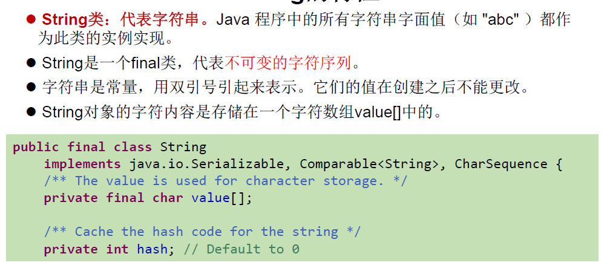

```java
   /*
  String:字符串，使用一对""引起来表示。
  1.String声明为final的，不可被继承
  2.String实现了Serializable接口：表示字符串是支持序列化的。
          实现了Comparable接口：表示String可以比较大小
  3.String内部定义了final char[] value用于存储字符串数据
  4.String:代表不可变的字符序列。简称：不可变性。
      体现：1.当对字符串重新赋值时，需要重新指定内存区域赋值，不能使用原有的value进行赋值。
           2. 当对现有的字符串进行连接操作时，也需要重新指定内存区域赋值，不能使用原有的value进行赋值。
           3. 当调用String的replace()方法修改指定字符或字符串时，也需要重新指定内存区域赋值，不能使用原有的value进行赋值。
  5.通过字面量的方式（区别于new）给一个字符串赋值，此时的字符串值声明在字符串常量池中。
  6.字符串常量池中是不会存储相同内容(使用String类的equals（）比较，返回true)的字符串的。
   */
    @Test
    public void test1(){
        String s1 = "abc";//字面量的定义方式
        String s2 = "abc";
        s1 = "hello";

        System.out.println(s1 == s2);//比较s1和s2的地址值

        System.out.println(s1);//hello
        System.out.println(s2);//abc

        System.out.println("*****************");

        String s3 = "abc";
        s3 += "def";
        System.out.println(s3);//abcdef
        System.out.println(s2);

        System.out.println("*****************");

        String s4 = "abc";
        String s5 = s4.replace('a', 'm');
        System.out.println(s4);//abc
        System.out.println(s5);//mbc

    }
```

#### 内存结构

`String s= new String（"hello"）；在内存中创建了几个对象？请说明.`

> 两个:一个是堆空间中new结构，另一个是char[]对应的常量池中的数据："abc"
>
> 
>
> 当JVM遇到上述代码时,会先检索常量池中是否存在“abc”，如果不存在“abc”这个字符串，则会先在常量池中创建这个一个字符串。然后再执行new操作，会在堆内存中创建一个存储“abc”的String对象，对象的引用赋值给str2。


+ 字符串常量（字面量 ）存储在字符串常量池， 目的是共享

+ 字符串非常量对象存储在堆中。

```java
    /*
     String的实例化方式：
     方式一：通过字面量定义的方式  常量池
     方式二：通过new + 构造器的方式 堆空间开辟

      面试题：String s = new String("abc");方式创建对象，在内存中创建了几个对象？
             两个:一个是堆空间中new结构，另一个是char[]对应的常量池中的数据："abc"

      */
    @Test
    public void test2(){
        //通过字面量定义的方式：此时的s1和s2的数据javaEE声明在方法区中的字符串常量池中。
        String s1 = "javaEE";
        String s2 = "javaEE";
        //通过new + 构造器的方式:此时的s3和s4保存的地址值，是数据在堆空间中开辟空间以后对应的地址值。
        String s3 = new String("javaEE");
        String s4 = new String("javaEE");

        System.out.println(s1 == s2);//true
        System.out.println(s1 == s3);//false
        System.out.println(s1 == s4);//false
        System.out.println(s3 == s4);//false

        System.out.println("***********************");
        Person p1 = new Person("Tom",12);
        Person p2 = new Person("Tom",12);

        System.out.println(p1.name.equals(p2.name));//true
        System.out.println(p1.name == p2.name);//true  通过字面量定义

        p1.name = "Jerry";
        System.out.println(p2.name);//Tom
    }

```

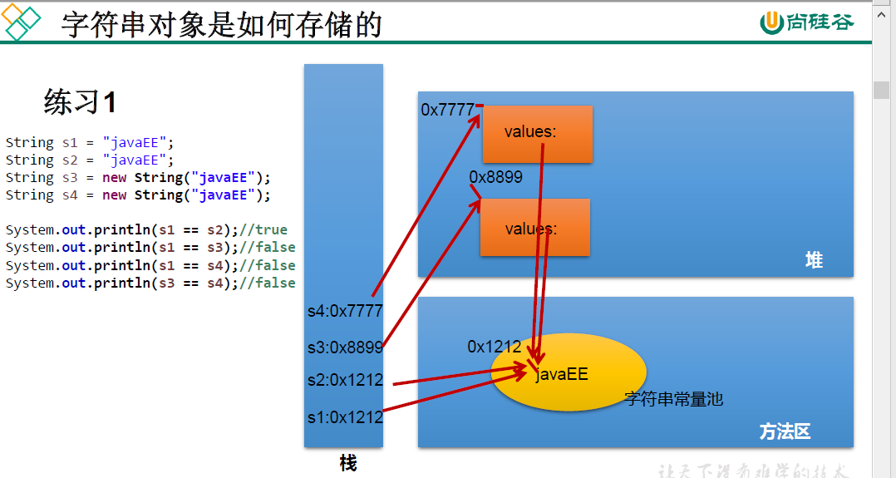

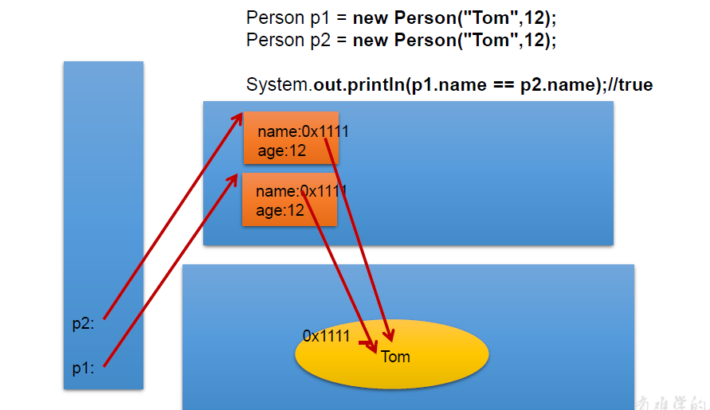

#### String易错点：

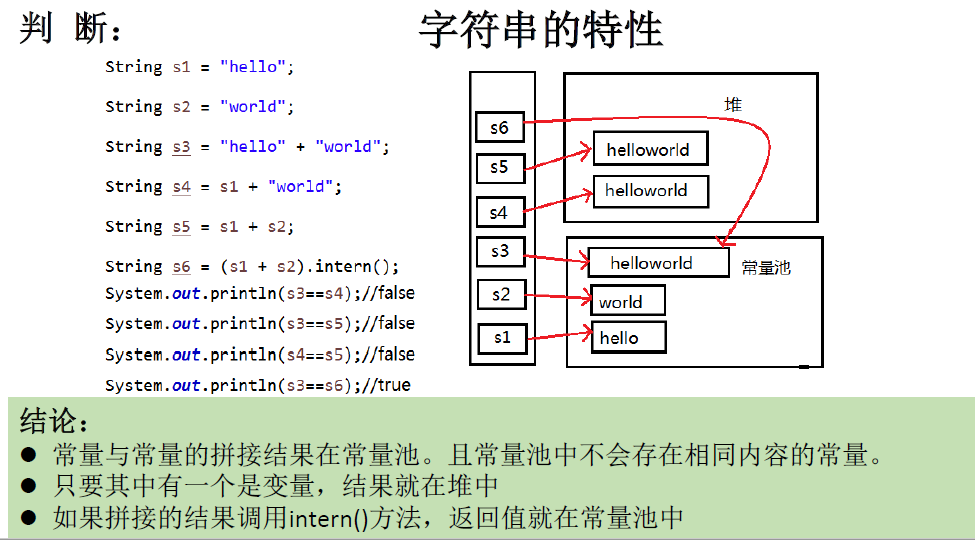

```java
	/*
    结论：
    1.常量与常量的拼接结果在常量池。且常量池中不会存在相同内容的常量。
    2.只要其中有一个是变量，结果就在堆中。
    3.字符串（new/字面值/拼接）的调用intern()方法，返回值就在常量池中
     */
	@Test
    public void test3(){
        String s1 = "javaEE";
        String s2 = "hadoop";

        String s3 = "javaEEhadoop";
        String s4 = "javaEE" + "hadoop";
        String s5 = s1 + "hadoop";
        String s6 = "javaEE" + s2;
        String s7 = s1 + s2;

        System.out.println(s3 == s4);//true
        System.out.println(s3 == s5);//false
        System.out.println(s3 == s6);//false
        System.out.println(s3 == s7);//false
        System.out.println(s5 == s6);//false
        System.out.println(s5 == s7);//false
        System.out.println(s6 == s7);//false

        String s8 = s6.intern();//返回值得到的s8使用的常量值中已经存在的“javaEEhadoop”
        System.out.println(s3 == s8);//true
    }

    @Test
    public void test4(){
        String s1 = "javaEEhadoop";
        String s2 = "javaEE";
        String s3 = s2 + "hadoop";
        System.out.println(s1 == s3);//false

        final String s4 = "javaEE";//s4:final修饰的常量
        String s5 = s4 + "hadoop";
        System.out.println(s1 == s5);//true

    }
```

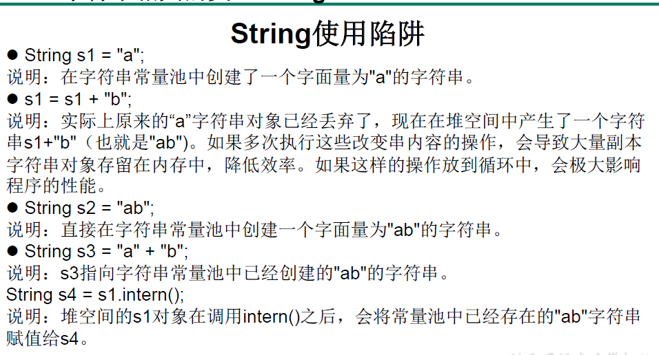

面试题：

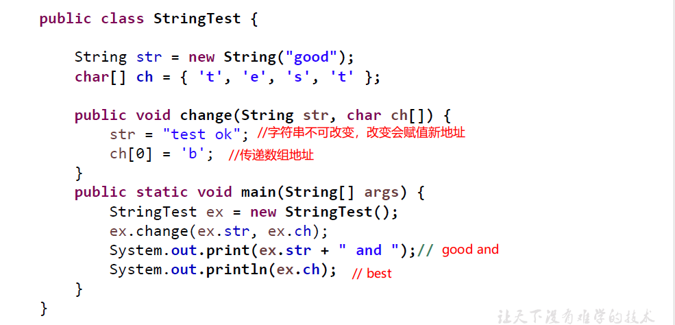

> 

### 常用方法


```
int length()：返回字符串的长度： return value.length
char charAt(int index)： 返回某索引处的字符return value[index]
boolean isEmpty()：判断是否是空字符串：return value.length == 0
String toLowerCase()：使用默认语言环境，将 String 中的所有字符转换为小写
String toUpperCase()：使用默认语言环境，将 String 中的所有字符转换为大写
String trim()：返回字符串的副本，忽略前导空白和尾部空白
boolean equals(Object obj)：比较字符串的内容是否相同
boolean equalsIgnoreCase(String anotherString)：与equals方法类似，忽略大小写
String concat(String str)：将指定字符串连接到此字符串的结尾。 等价于用“+”
int compareTo(String anotherString)：比较两个字符串的大小
String substring(int beginIndex)：返回一个新的字符串，它是此字符串的从beginIndex开始截取到最后的一个子字符串。
String substring(int beginIndex, int endIndex) ：返回一个新字符串，它是此字符串从beginIndex开始截取到endIndex(不包含)的一个子字符串。

boolean endsWith(String suffix)：测试此字符串是否以指定的后缀结束
boolean startsWith(String prefix)：测试此字符串是否以指定的前缀开始
boolean startsWith(String prefix, int toffset)：测试此字符串从指定索引开始的子字符串是否以指定前缀开始

boolean contains(CharSequence s)：当且仅当此字符串包含指定的 char 值序列时，返回 true
int indexOf(String str)：返回指定子字符串在此字符串中第一次出现处的索引
int indexOf(String str, int fromIndex)：返回指定子字符串在此字符串中第一次出现处的索引，从指定的索引开始
int lastIndexOf(String str)：返回指定子字符串在此字符串中最右边出现处的索引
int lastIndexOf(String str, int fromIndex)：返回指定子字符串在此字符串中最后一次出现处的索引，从指定的索引开始反向搜索
注：indexOf和lastIndexOf方法如果未找到都是返回-1

替换：
String replace(char oldChar, char newChar)：返回一个新的字符串，它是通过用 newChar 替换此字符串中出现的所有 oldChar 得到的。
String replace(CharSequence target, CharSequence replacement)：使用指定的字面值替换序列替换此字符串所有匹配字面值目标序列的子字符串。
String replaceAll(String regex, String replacement)：使用给定的 replacement 替换此字符串所有匹配给定的正则表达式的子字符串。
String replaceFirst(String regex, String replacement)：使用给定的 replacement 替换此字符串匹配给定的正则表达式的第一个子字符串。
匹配:
boolean matches(String regex)：告知此字符串是否匹配给定的正则表达式。
切片：
String[] split(String regex)：根据给定正则表达式的匹配拆分此字符串。
String[] split(String regex, int limit)：根据匹配给定的正则表达式来拆分此字符串，最多不超过limit个，如果超过了，剩下的全部都放到最后一个元素中。

```

```java
package com.atguigu.java;

import org.junit.Test;


public class StringMethodTest {

    /*
int length()：返回字符串的长度： return value.length
char charAt(int index)： 返回某索引处的字符return value[index]
boolean isEmpty()：判断是否是空字符串：return value.length == 0
String toLowerCase()：使用默认语言环境，将 String 中的所有字符转换为小写
String toUpperCase()：使用默认语言环境，将 String 中的所有字符转换为大写
String trim()：返回字符串的副本，忽略前导空白和尾部空白
boolean equals(Object obj)：比较字符串的内容是否相同
boolean equalsIgnoreCase(String anotherString)：与equals方法类似，忽略大小写
String concat(String str)：将指定字符串连接到此字符串的结尾。 等价于用“+”
int compareTo(String anotherString)：比较两个字符串的大小
String substring(int beginIndex)：返回一个新的字符串，它是此字符串的从beginIndex开始截取到最后的一个子字符串。
String substring(int beginIndex, int endIndex) ：返回一个新字符串，它是此字符串从beginIndex开始截取到endIndex(不包含)的一个子字符串。

     */
    @Test
    public void test1() {
        String s1 = "HelloWorld";
        System.out.println(s1.length());
        System.out.println(s1.charAt(0));
        System.out.println(s1.charAt(9));
//        System.out.println(s1.charAt(10));
//        s1 = "";
        System.out.println(s1.isEmpty());

        String s2 = s1.toLowerCase();
        System.out.println(s1);//s1不可变的，仍然为原来的字符串
        System.out.println(s2);//改成小写以后的字符串

        String s3 = "   he  llo   world   ";
        String s4 = s3.trim();
        System.out.println("-----" + s3 + "-----");
        System.out.println("-----" + s4 + "-----");
    }
    
       @Test
    public void test2() {
        String s1 = "HelloWorld";
        String s2 = "helloworld";
        System.out.println(s1.equals(s2));
        System.out.println(s1.equalsIgnoreCase(s2));

        String s3 = "abc";
        String s4 = s3.concat("def");
        System.out.println(s4);

        String s5 = "abc";
        String s6 = new String("abe");
        System.out.println(s5.compareTo(s6));//涉及到字符串排序

        String s7 = "北京尚硅谷教育";
        String s8 = s7.substring(2);
        System.out.println(s7);
        System.out.println(s8);

        String s9 = s7.substring(2, 5);
        System.out.println(s9);
    }
    
        /*
boolean endsWith(String suffix)：测试此字符串是否以指定的后缀结束
boolean startsWith(String prefix)：测试此字符串是否以指定的前缀开始
boolean startsWith(String prefix, int toffset)：测试此字符串从指定索引开始的子字符串是否以指定前缀开始

boolean contains(CharSequence s)：当且仅当此字符串包含指定的 char 值序列时，返回 true
int indexOf(String str)：返回指定子字符串在此字符串中第一次出现处的索引
int indexOf(String str, int fromIndex)：返回指定子字符串在此字符串中第一次出现处的索引，从指定的索引开始
int lastIndexOf(String str)：返回指定子字符串在此字符串中最右边出现处的索引
int lastIndexOf(String str, int fromIndex)：返回指定子字符串在此字符串中最后一次出现处的索引，从指定的索引开始反向搜索

注：indexOf和lastIndexOf方法如果未找到都是返回-1

     */
    @Test
    public void test3(){
        String str1 = "hellowworld";
        boolean b1 = str1.endsWith("rld");
        System.out.println(b1);

        boolean b2 = str1.startsWith("He");
        System.out.println(b2);

        boolean b3 = str1.startsWith("ll",2);
        System.out.println(b3);

        String str2 = "wor";
        System.out.println(str1.contains(str2));

        System.out.println(str1.indexOf("lol"));

        System.out.println(str1.indexOf("lo",5));

        String str3 = "hellorworld";

        System.out.println(str3.lastIndexOf("or"));
        System.out.println(str3.lastIndexOf("or",6));

        //什么情况下，indexOf(str)和lastIndexOf(str)返回值相同？
        //情况一：存在唯一的一个str。情况二：不存在str
    }
    
       /*
替换：
String replace(char oldChar, char newChar)：返回一个新的字符串，它是通过用 newChar 替换此字符串中出现的所有 oldChar 得到的。
String replace(CharSequence target, CharSequence replacement)：使用指定的字面值替换序列替换此字符串所有匹配字面值目标序列的子字符串。
String replaceAll(String regex, String replacement)：使用给定的 replacement 替换此字符串所有匹配给定的正则表达式的子字符串。
String replaceFirst(String regex, String replacement)：使用给定的 replacement 替换此字符串匹配给定的正则表达式的第一个子字符串。

匹配:
boolean matches(String regex)：告知此字符串是否匹配给定的正则表达式。

切片：
String[] split(String regex)：根据给定正则表达式的匹配拆分此字符串。
String[] split(String regex, int limit)：根据匹配给定的正则表达式来拆分此字符串，最多不超过limit个，如果超过了，剩下的全部都放到最后一个元素中。

     */
    @Test
    public void test4(){
        String str1 = "北京尚硅谷教育北京";
        String str2 = str1.replace('北', '东');

        System.out.println(str1);
        System.out.println(str2);


        String str3 = str1.replace("北京", "上海");
        System.out.println(str3);

        System.out.println("*************************");
        String str = "12hello34world5java7891mysql456";
        //把字符串中的数字替换成,，如果结果中开头和结尾有，的话去掉
        String string = str.replaceAll("\\d+", ",").replaceAll("^,|,$", "");
        System.out.println(string);

        System.out.println("*************************");
        str = "12345";
        //判断str字符串中是否全部有数字组成，即有1-n个数字组成
        boolean matches = str.matches("\\d+");
        System.out.println(matches);
        String tel = "0571-4534289";
        //判断这是否是一个杭州的固定电话
        boolean result = tel.matches("0571-\\d{7,8}");
        System.out.println(result);


        System.out.println("*************************");
        str = "hello|world|java";
        String[] strs = str.split("\\|");
        for (int i = 0; i < strs.length; i++) {
            System.out.println(strs[i]);
        }
        System.out.println();
        str2 = "hello.world.java";
        String[] strs2 = str2.split("\\.");
        for (int i = 0; i < strs2.length; i++) {
            System.out.println(strs2[i]);
        }

    }

}
```


### String与基本数据类型转换

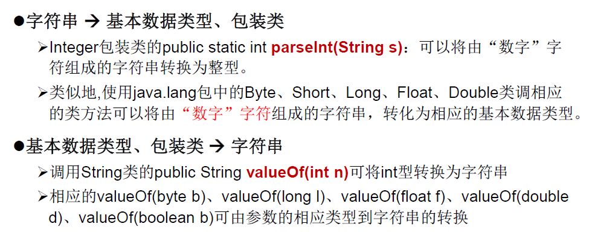

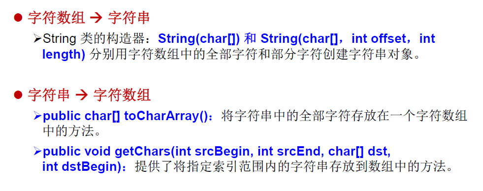

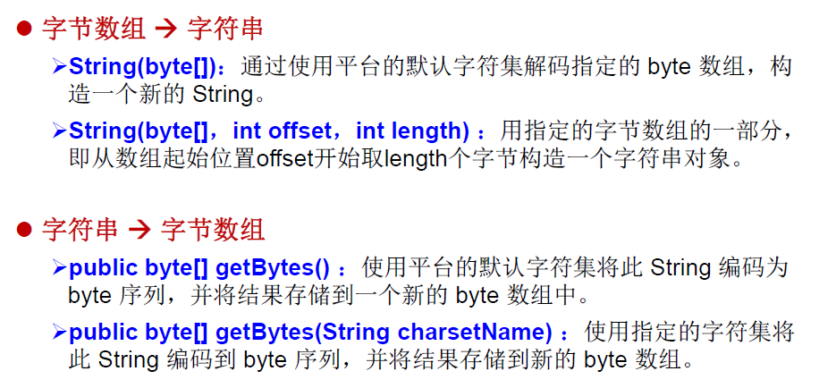

```java
package com.atguigu.java;

import org.junit.Test;

import java.io.UnsupportedEncodingException;
import java.util.Arrays;

/**
 * 涉及到String类与其他结构之间的转换
 *
 */
public class StringTest1 {
  /*
    复习：
    String 与基本数据类型、包装类之间的转换。

    String --> 基本数据类型、包装类：调用包装类的静态方法：parseXxx(str)
    基本数据类型、包装类 --> String:调用String重载的valueOf(xxx)

     */
    @Test
    public void test1(){
        String str1 = "123";
//        int num = (int)str1;//错误的
        int num = Integer.parseInt(str1);

        String str2 = String.valueOf(num);//"123"
        String str3 = num + "";

        System.out.println(str1 == str3);
    }

    /*
    String 与 char[]之间的转换

    String --> char[]:调用String的toCharArray()
    char[] --> String:调用String的构造器
     */
    @Test
    public void test2(){
        String str1 = "abc123";  //题目： a21cb3

        char[] charArray = str1.toCharArray();
        for (int i = 0; i < charArray.length; i++) {
            System.out.println(charArray[i]);
        }

        char[] arr = new char[]{'h','e','l','l','o'};
        String str2 = new String(arr);
        System.out.println(str2);
    }
    /*
    String 与 byte[]之间的转换
    编码：String --> byte[]:调用String的getBytes()
    解码：byte[] --> String:调用String的构造器

    编码：字符串 -->字节  (看得懂 --->看不懂的二进制数据)
    解码：编码的逆过程，字节 --> 字符串 （看不懂的二进制数据 ---> 看得懂）

    说明：解码时，要求解码使用的字符集必须与编码时使用的字符集一致，否则会出现乱码。
     */
    @Test
    public void test3() throws UnsupportedEncodingException {
        String str1 = "abc123中国";
        byte[] bytes = str1.getBytes();//使用默认的字符集，进行编码。
        System.out.println(Arrays.toString(bytes));

        byte[] gbks = str1.getBytes("gbk");//使用gbk字符集进行编码。
        System.out.println(Arrays.toString(gbks));

        System.out.println("******************");

        String str2 = new String(bytes);//使用默认的字符集，进行解码。
        System.out.println(str2);

        String str3 = new String(gbks);
        System.out.println(str3);//出现乱码。原因：编码集和解码集不一致！


        String str4 = new String(gbks, "gbk");
        System.out.println(str4);//没有出现乱码。原因：编码集和解码集一致！


    }

}

```

### StringBuffer、StringBuilder

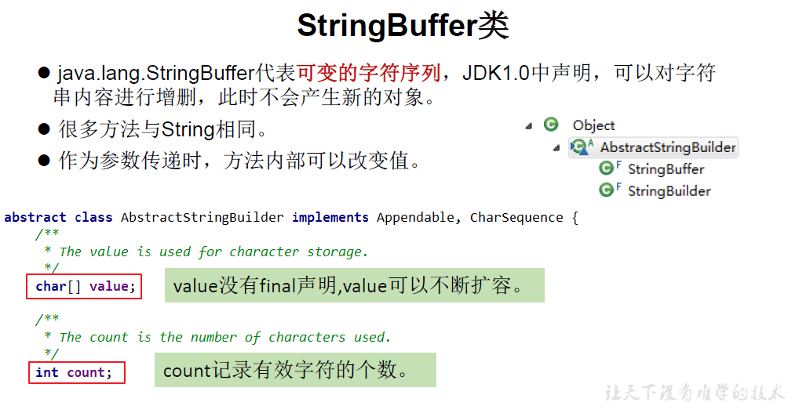

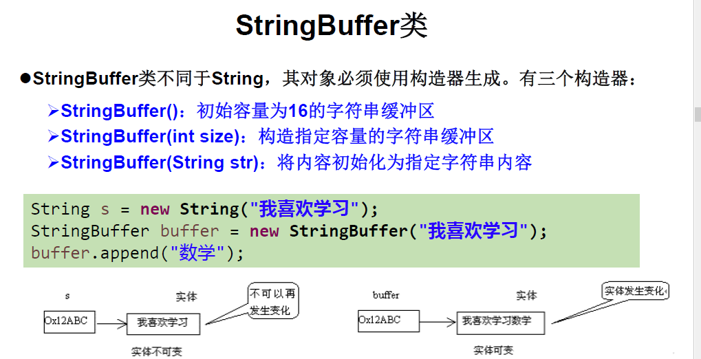


 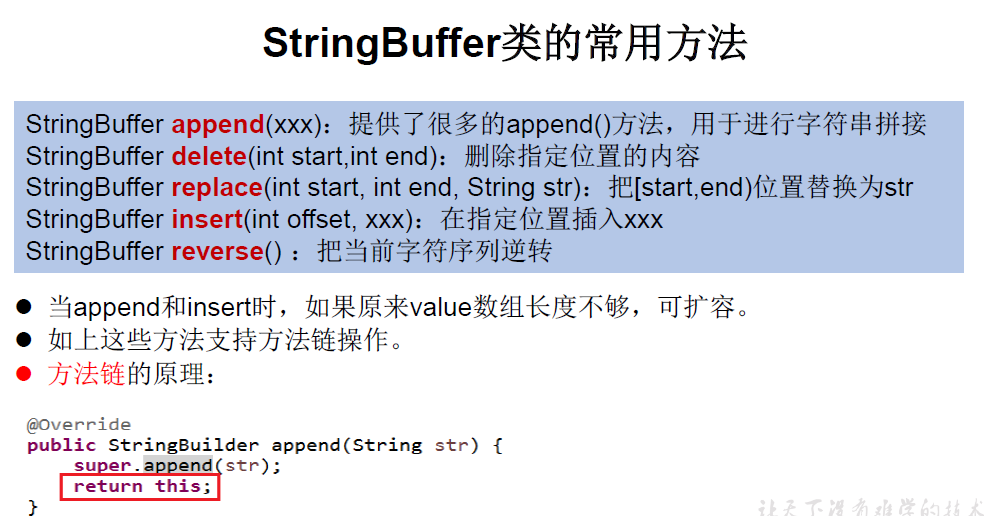

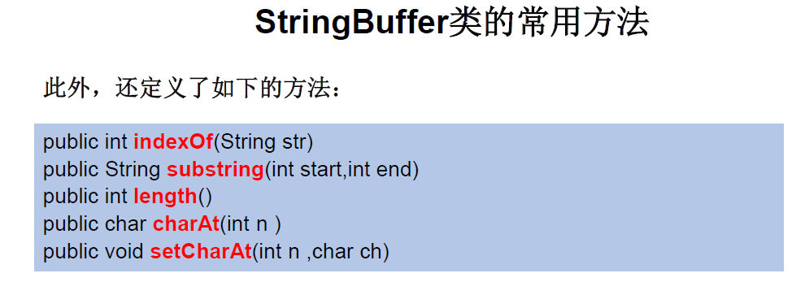

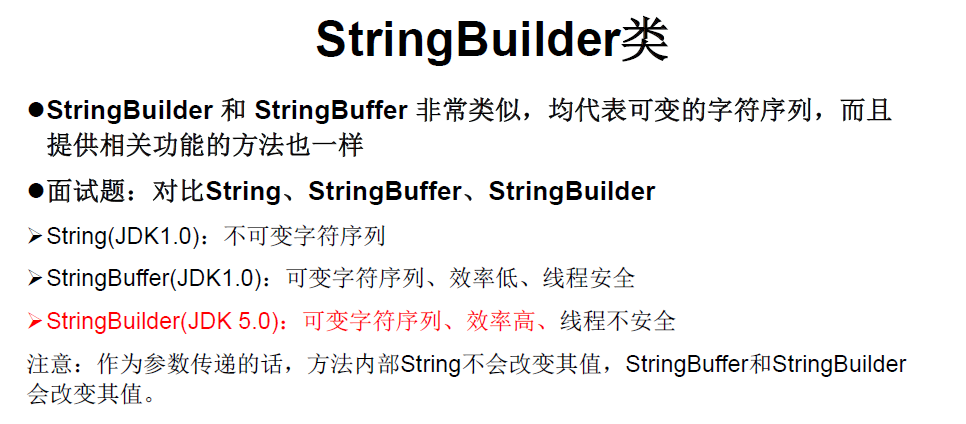

```java
package com.atguigu.java;

import org.junit.Test;

/**
 * 关于stringBuffer和StringBuilder的使用
 */
public class StringBufferTest {
    /*
    String、StringBuffer、StringBuilder三者的异同？
    String:不可变的字符序列；底层使用char[]存储
    StringBuffer:可变的字符序列；线程安全的，效率低；底层使用char[]存储
    StringBuilder:可变的字符序列；jdk5.0新增的，线程不安全的，效率高；底层使用char[]存储

    源码分析：
    String str = new String();//char[] value = new char[0];
    String str1 = new String("abc");//char[] value = new char[]{'a','b','c'};

    StringBuffer sb1 = new StringBuffer();//char[] value = new char[16];底层创建了一个长度是16的数组。
    System.out.println(sb1.length());//
    sb1.append('a');//value[0] = 'a';
    sb1.append('b');//value[1] = 'b';

    StringBuffer sb2 = new StringBuffer("abc");//char[] value = new char["abc".length() + 16];

    //问题1. System.out.println(sb2.length());//3
    //问题2. 扩容问题:如果要添加的数据底层数组盛不下了，那就需要扩容底层的数组。
             默认情况下，扩容为原来容量的2倍 + 2，同时将原有数组中的元素复制到新的数组中。

            指导意义：开发中建议大家使用：StringBuffer(int capacity) 或 StringBuilder(int capacity)


     */
    @Test
    public void test1(){
        StringBuffer sb1 = new StringBuffer("abc");
        sb1.setCharAt(0,'m');
        System.out.println(sb1);

        StringBuffer sb2 = new StringBuffer();
        System.out.println(sb2.length());//0
    }

    /*
StringBuffer的常用方法：
StringBuffer append(xxx)：提供了很多的append()方法，用于进行字符串拼接
StringBuffer delete(int start,int end)：删除指定位置的内容
StringBuffer replace(int start, int end, String str)：把[start,end)位置替换为str
StringBuffer insert(int offset, xxx)：在指定位置插入xxx
StringBuffer reverse() ：把当前字符序列逆转
public int indexOf(String str)
public String substring(int start,int end):返回一个从start开始到end索引结束的左闭右开区间的子字符串
public int length()
public char charAt(int n )
public void setCharAt(int n ,char ch)

    总结：
    增：append(xxx)
    删：delete(int start,int end)
    改：setCharAt(int n ,char ch) / replace(int start, int end, String str)
    查：charAt(int n )
    插：insert(int offset, xxx)
    长度：length();
    *遍历：for() + charAt() / toString()
 */
    @Test
    public void test2(){
        StringBuffer s1 = new StringBuffer("abc");
        s1.append(1);
        s1.append('1');
        System.out.println(s1);
//        s1.delete(2,4);
//        s1.replace(2,4,"hello");
//        s1.insert(2,false);
//        s1.reverse();
        String s2 = s1.substring(1, 3);
        System.out.println(s1);
        System.out.println(s1.length());
        System.out.println(s2);
    }

    /*
对比String、StringBuffer、StringBuilder三者的效率：
从高到低排列：StringBuilder > StringBuffer > String
 */
    @Test
    public void test3(){
        //初始设置
        long startTime = 0L;
        long endTime = 0L;
        String text = "";
        StringBuffer buffer = new StringBuffer("");
        StringBuilder builder = new StringBuilder("");
        //开始对比
        startTime = System.currentTimeMillis();
        for (int i = 0; i < 20000; i++) {
            buffer.append(String.valueOf(i));
        }
        endTime = System.currentTimeMillis();
        System.out.println("StringBuffer的执行时间：" + (endTime - startTime));

        startTime = System.currentTimeMillis();
        for (int i = 0; i < 20000; i++) {
            builder.append(String.valueOf(i));
        }
        endTime = System.currentTimeMillis();
        System.out.println("StringBuilder的执行时间：" + (endTime - startTime));

        startTime = System.currentTimeMillis();
        for (int i = 0; i < 20000; i++) {
            text = text + i;
        }
        endTime = System.currentTimeMillis();
        System.out.println("String的执行时间：" + (endTime - startTime));

    }

}
```

### 算法题

```java
package com.atguigu.exer;

public class StringDemo {
    /*
    将一个字符串进行反转。将字符串中指定部分进行反转。比如"abedefg"反转为"abfedcg"
     */
    //方式一：
    public String reverse1(String str, int startIndex, int endIndex) {

        if (str == null || str.length() == 0) {
            return "";
        }
        char[] arr = str.toCharArray();
        for (int i = startIndex, j = endIndex; j > i; i++, j--) {
            char temp = arr[i];
            arr[i] = arr[j];
            arr[j] = temp;

        }
        return new String(arr);
    }

    //方式二：使用String的拼接
    public String reverse2(String str,int startIndex,int endIndex){
        if(str != null){
            //第1部分
            String reverseStr = str.substring(0,startIndex);
            //第2部分
            for(int i = endIndex;i >= startIndex;i--){
                reverseStr += str.charAt(i);
            }
            //第3部分
            reverseStr += str.substring(endIndex + 1);

            return reverseStr;

        }
        return null;
    }
    //方式三：使用StringBuffer/StringBuilder替换String
    public String reverse3(String str,int startIndex,int endIndex){
        if(str != null){
            StringBuilder builder = new StringBuilder(str.length());

            //第1部分
            builder.append(str.substring(0,startIndex));
            //第2部分
            for(int i = endIndex;i >= startIndex;i--){

                builder.append(str.charAt(i));
            }
            //第3部分
            builder.append(str.substring(endIndex + 1));

            return builder.toString();
        }
        return null;

    }
}
```

```java
package com.atguigu.exer;

import org.junit.Test;
/**
    获取一个字符串在另一个字符串中出现的次数。
      比如：获取“ab”在 “abkkcadkabkebfkaabkskab” 中出现的次数

*/
public class StringDemo2 {

    /**
     * 获取subStr在mainStr中出现的次数
     * @param mainStr
     * @param subStr
     * @return
     */
    public int getCount(String mainStr,String subStr){
        int mainLength = mainStr.length();
        int subLength = subStr.length();
        int count = 0;
        int index = 0;
        if(mainLength >= subLength){
            //方式一：
//            while((index = mainStr.indexOf(subStr)) != -1){
//                count++;
//                mainStr = mainStr.substring(index + subStr.length());
//            }
            //方式二：对方式一的改进
            while((index = mainStr.indexOf(subStr,index)) != -1){
                count++;
                index += subLength;
            }

            return count;
        }else{
            return 0;
        }
    }

    @Test
    public void testGetCount(){
        String mainStr = "abkkcadkabkebfkaabkskab";
        String subStr = "ab";
        int count = getCount(mainStr, subStr);
        System.out.println(count);
    }
}
```


```java
package com.atguigu.exer;

import org.junit.Test;

import java.util.Arrays;

/**
 * 获取两个字符串中最大相同子串。比如：
 * str1 = "abcwerthelloyuiodefabcdef";
 * str2 = "cvhellobnm"
 * 提示：将短的那个串进行长度依次递减的子串与较长的串比较。
 * 利用String.contains()
 	
 *	核心思想：长度为x的字符串是是否是相同子串
 * 
 */
public class StringDemo3 {

    /*
   
    步骤：
        1.两个比较的较短的作为子串
        2.遍历：取出所有1,2,3...length个字符的组合结果（倒序遍历速度快）
                整串判断是否存在
                然后，整串-1 =len，对长串进行循环截取截取【0,0+len）  【1，1+len） 【2,2+len）...判断
                然后，整串-3 =len，对长串进行循环截取截取【0,0+len）  【1，1+len） 【2,2+len）...判断
     */
     /** 记录出现     */
    private static List<String> res = new ArrayList<>();

    public static void get(String lengthStr, String shortStr) {

        for (int len = shortStr.length(); len > 0; len--) {//截取进行比较的子串长度

            for (int j = 0; j + len <= shortStr.length(); j++) {//循环截取子串
                String substring = shortStr.substring(j, j + len);
                System.out.println(substring);
                if (lengthStr.contains(substring)){
                    res.add(substring);
                }
            }
            if (res.size()>0){
                break;
            }
        }

    }
       
    // 如果存在多个长度相同的最大相同子串
    // 此时先返回String[]，后面可以用集合中的ArrayList替换，较方便
    public String[] getMaxSameString1(String str1, String str2) {
        if (str1 != null && str2 != null) {
            StringBuffer sBuffer = new StringBuffer();
            String maxString = (str1.length() > str2.length()) ? str1 : str2;
            String minString = (str1.length() > str2.length()) ? str2 : str1;

            int len = minString.length();
            for (int i = 0; i < len; i++) {
                for (int x = 0, y = len - i; y <= len; x++, y++) {
                    String subString = minString.substring(x, y);
                    if (maxString.contains(subString)) {
                        sBuffer.append(subString + ",");
                    }
                }
                // System.out.println(sBuffer);
                if (sBuffer.length() != 0) {
                    break;
                }
            }
            String[] split = sBuffer.toString().replaceAll(",$", "").split("\\,");
            return split;
        }

        return null;
    }

    
    
    @Test
    public void testGetMaxSameString() {
        String str1 = "abcwerthello1yuiodefabcdef";
        String str2 = "cvhello1bnmabcdef";
        String[] maxSameStrings = getMaxSameString1(str1, str2);
        System.out.println(Arrays.toString(maxSameStrings));

    }

}
```

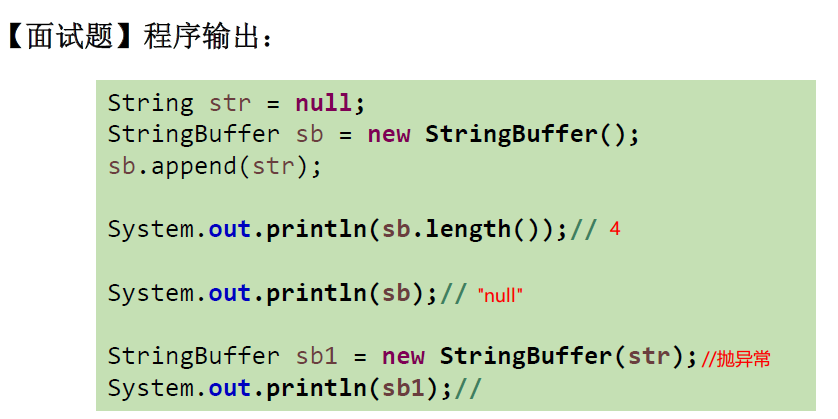

## 日期时间API

### System静态方法

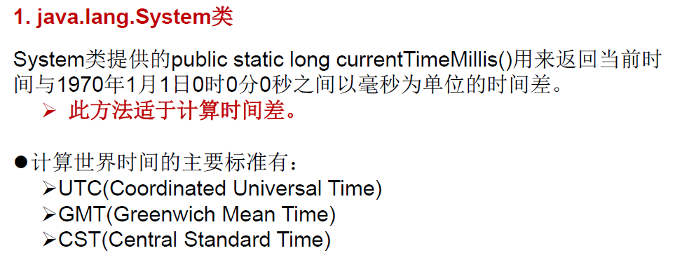

```java
//1.System类中的currentTimeMillis()
    @Test
    public void test1(){
        long time = System.currentTimeMillis();
        //返回当前时间与1970年1月1日0时0分0秒之间以毫秒为单位的时间差。
        //称为时间戳
        System.out.println(time);
    }
```


### Date类

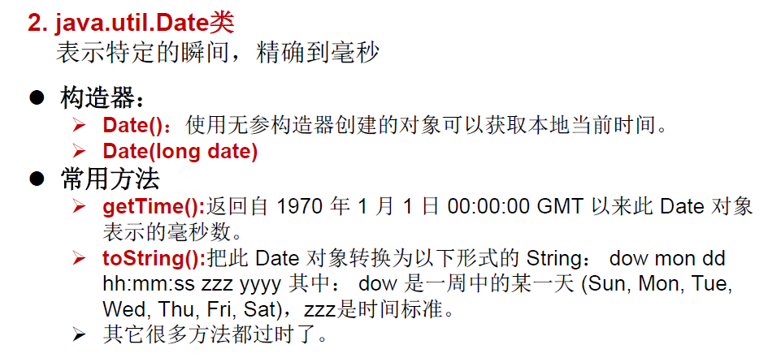

```java
   /*
    java.util.Date类
           |---java.sql.Date类

    1.两个构造器的使用
        >构造器一：Date()：创建一个对应当前时间的Date对象
        >构造器二：创建指定毫秒数的Date对象
    2.两个方法的使用
        >toString():显示当前的年、月、日、时、分、秒
        >getTime():获取当前Date对象对应的毫秒数。（时间戳）

    3. java.sql.Date对应着数据库中的日期类型的变量
        >如何实例化
        >如何将java.util.Date对象转换为java.sql.Date对象
     */
    @Test
    public void test2(){
        //构造器一：Date()：创建一个对应当前时间的Date对象
        Date date1 = new Date();
        System.out.println(date1.toString());//Sat Feb 16 16:35:31 GMT+08:00 2019

        System.out.println(date1.getTime());//1550306204104

        //构造器二：创建指定毫秒数的Date对象
        Date date2 = new Date(155030620410L);
        System.out.println(date2.toString());

        //创建java.sql.Date对象
        java.sql.Date date3 = new java.sql.Date(35235325345L);
        System.out.println(date3);//1971-02-13

        //如何将java.util.Date对象转换为java.sql.Date对象
        //情况一：
//        Date date4 = new java.sql.Date(2343243242323L);
//        java.sql.Date date5 = (java.sql.Date) date4;
        //情况二：
        Date date6 = new Date();
        java.sql.Date date7 = new java.sql.Date(date6.getTime());


    }
```


### SimpleDateFormat类

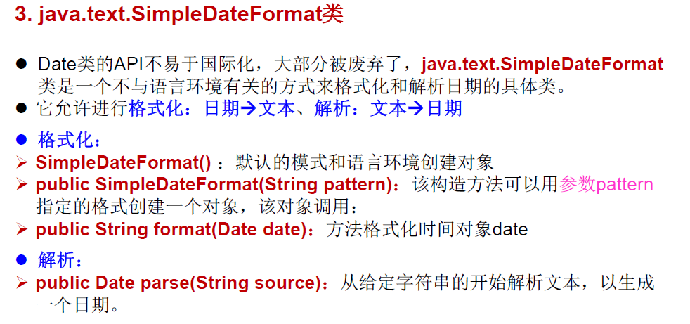

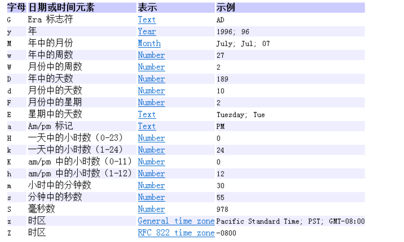

```java
 /*
    SimpleDateFormat的使用：SimpleDateFormat对日期Date类的格式化和解析

    1.两个操作：
    1.1 格式化：日期 --->字符串
    1.2 解析：格式化的逆过程，字符串 ---> 日期

    2.SimpleDateFormat的实例化

     */
    @Test
    public void testSimpleDateFormat() throws ParseException {
        //实例化SimpleDateFormat:使用默认的构造器
        SimpleDateFormat sdf = new SimpleDateFormat();

        //格式化：日期 --->字符串
        Date date = new Date();
        System.out.println(date);

        String format = sdf.format(date);
        System.out.println(format);

        //解析：格式化的逆过程，字符串 ---> 日期
        String str = "19-12-18 上午11:43";//默认格式
        Date date1 = sdf.parse(str);
        System.out.println(date1);

        //*************按照指定的方式格式化和解析：调用带参的构造器*****************
//        SimpleDateFormat sdf1 = new SimpleDateFormat("yyyyy.MMMMM.dd GGG hh:mm aaa");//02021.四月.11 公元 08:08 下午
        SimpleDateFormat sdf1 = new SimpleDateFormat("yyyy-MM-dd hh:mm:ss");
        //格式化
        String format1 = sdf1.format(date);
        System.out.println(format1);//2019-02-18 11:48:27
        //解析:要求字符串必须是符合SimpleDateFormat识别的格式(通过构造器参数体现),
        //否则，抛异常
        Date date2 = sdf1.parse("2020-02-18 11:48:27");
        System.out.println(date2);
    }

    /*
    练习一：字符串"2020-09-08"转换为java.sql.Date

    练习二："三天打渔两天晒网"   1990-01-01  xxxx-xx-xx 打渔？晒网？

    举例：2020-09-08 ？ 总天数

    总天数 % 5 == 1,2,3 : 打渔
    总天数 % 5 == 4,0 : 晒网

    总天数的计算？
    方式一：( date2.getTime() - date1.getTime()) / (1000 * 60 * 60 * 24) + 1
    方式二：1990-01-01  --> 2019-12-31  +  2020-01-01 -->2020-09-08
     */
    @Test
    public void testExer() throws ParseException {
        String birth = "2020-09-08";

        SimpleDateFormat sdf1 = new SimpleDateFormat("yyyy-MM-dd");
        Date date = sdf1.parse(birth);
//        System.out.println(date);

        java.sql.Date birthDate = new java.sql.Date(date.getTime());
        System.out.println(birthDate);
    }
```


### Calendar类

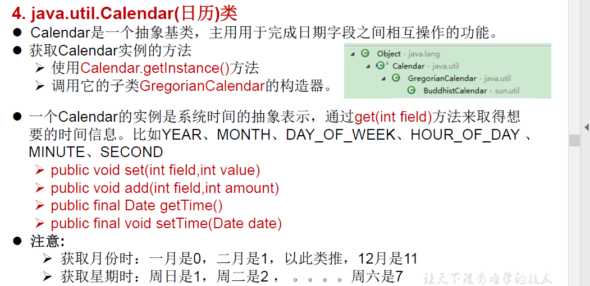


```java
   /*
    Calendar日历类(抽象类）的使用
     */
    @Test
    public void testCalendar(){
        //1.实例化
        //方式一：创建其子类（GregorianCalendar）的对象
        //方式二：调用其静态方法getInstance()
        Calendar calendar = Calendar.getInstance();
//        System.out.println(calendar.getClass());

        //2.常用方法
        //get()
        int days = calendar.get(Calendar.DAY_OF_MONTH);
        System.out.println(days);
        System.out.println(calendar.get(Calendar.DAY_OF_YEAR));

        //set()
        //calendar可变性
        calendar.set(Calendar.DAY_OF_MONTH,22);
        days = calendar.get(Calendar.DAY_OF_MONTH);
        System.out.println(days);

        //add()
        calendar.add(Calendar.DAY_OF_MONTH,-3);
        days = calendar.get(Calendar.DAY_OF_MONTH);
        System.out.println(days);

        //getTime():日历类---> Date
        Date date = calendar.getTime();
        System.out.println(date);

        //setTime():Date ---> 日历类
        Date date1 = new Date();
        calendar.setTime(date1);
        days = calendar.get(Calendar.DAY_OF_MONTH);
        System.out.println(days);

    }
```


### JDK8.0新日期类

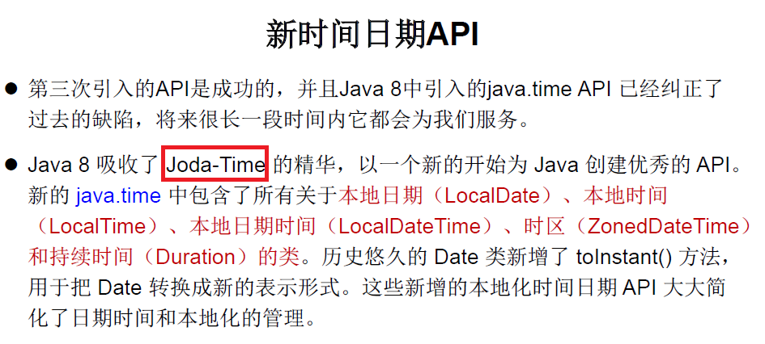


> JDK1.8以前使用需要引入`Joda-Time包`
>
> ```xml
> <!-- https://mvnrepository.com/artifact/joda-time/joda-time -->
> <dependency>
>     <groupId>joda-time</groupId>
>     <artifactId>joda-time</artifactId>
>     <version>2.10.10</version>
> </dependency>
> ```

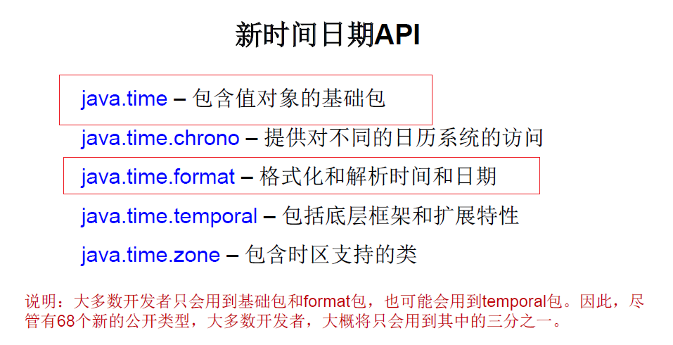

#### `LocalDate, LocalTime, LocalDateTime`

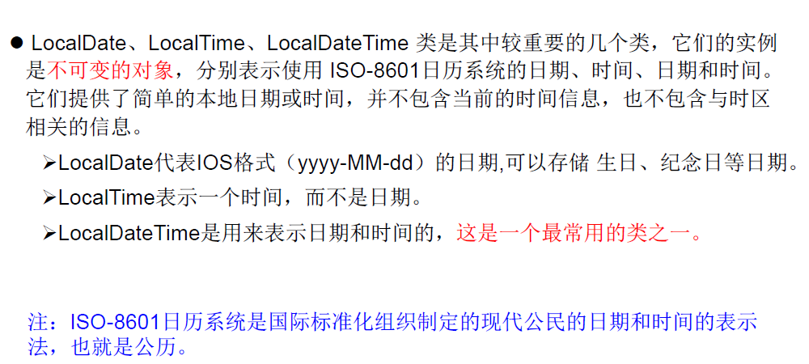

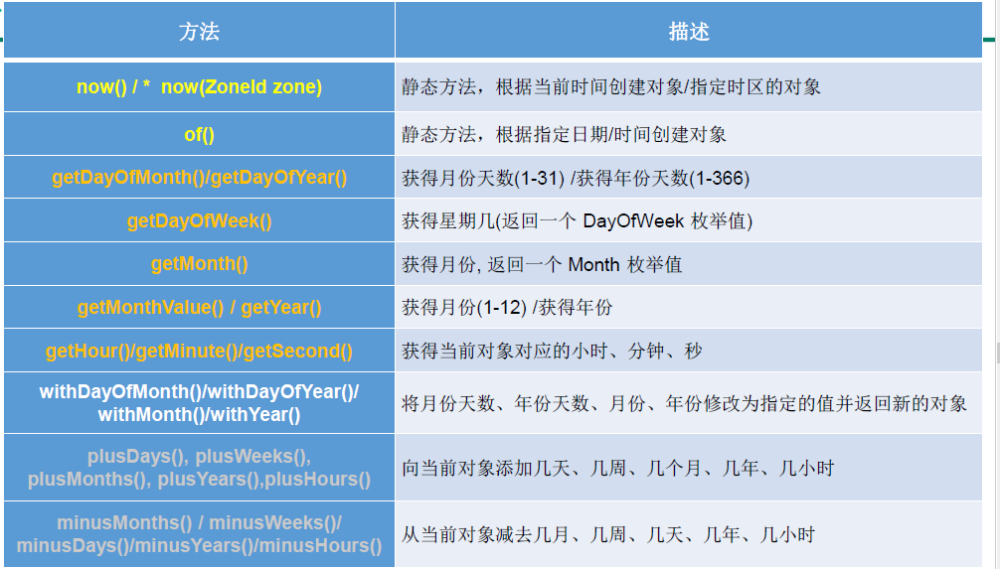

```java
package com.atguigu.java;

import org.junit.Test;

import java.time.*;
import java.time.format.DateTimeFormatter;
import java.time.format.FormatStyle;
import java.time.temporal.TemporalAccessor;
import java.util.Date;

/**
 * jdk 8中日期时间API的测试
 *
 */
public class JDK8DateTimeTest {

    @Test
    public void testDate(){
        //偏移量
        Date date1 = new Date(2020 - 1900,9 - 1,8);//存在偏移量  年：1900  月份0开始 
        System.out.println(date1);//Tue Sep 08 00:00:00 GMT+08:00 2020
    }

    /*
    LocalDate、LocalTime、LocalDateTime 的使用
    说明：
        1.LocalDateTime相较于LocalDate、LocalTime，使用频率要高
        2.类似于Calendar
     */
    @Test
    public void test1(){
         //now() ：获取当前日期、时间、日期+时间
        LocalDate localdate = LocalDate.now();
        System.out.println(localdate);//2021-04-11

        LocalTime localtime = LocalTime.now();
        System.out.println(localtime);//20:49:20.393

        LocalDateTime localDateTime = LocalDateTime.now();
        System.out.println(localDateTime);// 2021-04-11T20:49:20.393


        //of()：设置指定的年、月、日、时、分、秒。没有偏移量
        LocalDateTime localDateTime1=localDateTime.of(2020,4,3,13,23,43);
        System.out.println(localDateTime1);//2020-04-03T13:23:43

        //getXxx
        System.out.println(localDateTime1.getDayOfMonth());//3
        System.out.println(localDateTime1.getDayOfWeek());//FRIDAY
        System.out.println(localDateTime1.getMonth());//APRIL
        System.out.println(localDateTime1.getMonthValue());//4
        System.out.println(localDateTime1.getMinute());//23

        //体现不可变性
        //withXxx()：设置相关属性
        LocalDateTime localDateTime2 = localDateTime1.withDayOfMonth(22);
        System.out.println(localDateTime1);//2020-04-03T13:23:43
        System.out.println(localDateTime2);//2020-04-22T13:23:43

        LocalDateTime localDateTime3 = localDateTime1.withDayOfYear(22);
        System.out.println(localDateTime1);//2020-04-03T13:23:43
        System.out.println(localDateTime3);//2020-01-22T13:23:43

        //plusXxx() ：加
        //minusXxx(): 减
        LocalDateTime localDateTime4 = localDateTime1.plusDays(3);
        System.out.println(localDateTime1);//2020-04-03T13:23:43
        System.out.println(localDateTime4);//2020-04-06T13:23:43

        LocalDateTime localDateTime5 = localDateTime1.minusDays(6);
        System.out.println(localDateTime1);
        System.out.println(localDateTime5);
    }


  

}
```

#### `瞬时：Instant`

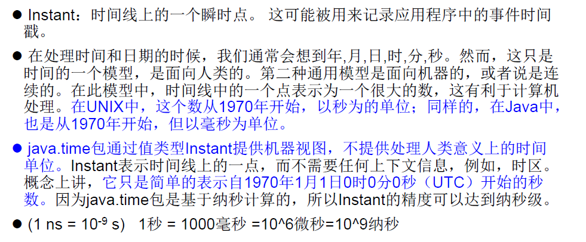

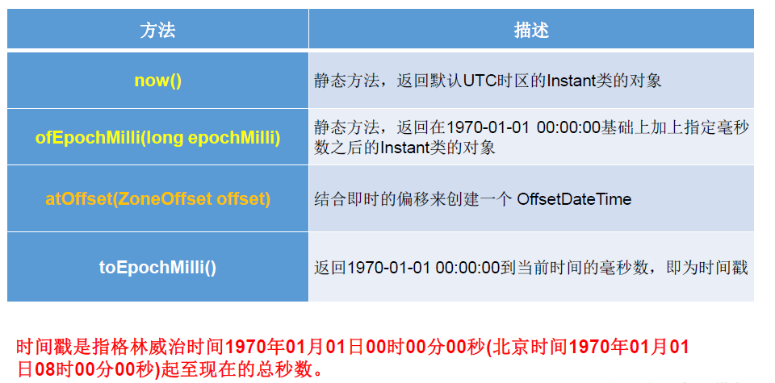

```java
    /*
    Instant的使用
    类似于 java.util.Date类

     */
    @Test
    public void test2(){
        //now():获取本初子午线对应的标准时间
        Instant instant = Instant.now();
        System.out.println(instant);//2019-02-18T07:29:41.719Z

        //根据时区添加时间的偏移量
        OffsetDateTime offsetDateTime = instant.atOffset(ZoneOffset.ofHours(8));
        System.out.println(offsetDateTime);//2019-02-18T15:32:50.611+08:00

        //toEpochMilli():获取自1970年1月1日0时0分0秒（UTC）开始的毫秒数  ---> Date类的getTime()
        long milli = instant.toEpochMilli();
        System.out.println(milli);

        //ofEpochMilli():通过给定的毫秒数，获取Instant实例  -->Date(long millis)
        Instant instant1 = Instant.ofEpochMilli(1550475314878L);
        System.out.println(instant1);
    }
```

格式化与解析日期或时间

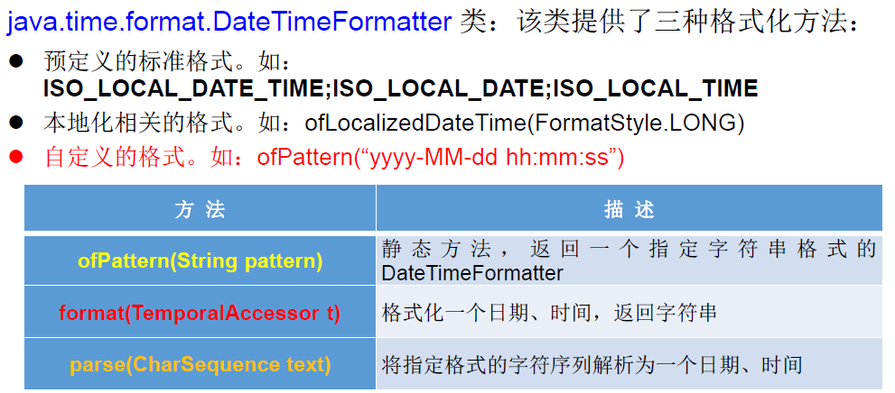

```java
  /*
    DateTimeFormatter:格式化或解析日期、时间
    类似于SimpleDateFormat

     */

    @Test
    public void test3(){
//        方式一：预定义的标准格式。如：ISO_LOCAL_DATE_TIME;ISO_LOCAL_DATE;ISO_LOCAL_TIME
        DateTimeFormatter formatter = DateTimeFormatter.ISO_LOCAL_DATE_TIME;
        //格式化:日期-->字符串
        LocalDateTime localDateTime = LocalDateTime.now();
        String str1 = formatter.format(localDateTime);
        System.out.println(localDateTime);
        System.out.println(str1);//2019-02-18T15:42:18.797

        //解析：字符串 -->日期
        TemporalAccessor parse = formatter.parse("2019-02-18T15:42:18.797");
        System.out.println(parse);

//        方式二：
//        本地化相关的格式。如：ofLocalizedDateTime()
//        FormatStyle.LONG / FormatStyle.MEDIUM / FormatStyle.SHORT :适用于LocalDateTime
        DateTimeFormatter formatter1 = DateTimeFormatter.ofLocalizedDateTime(FormatStyle.LONG);
        //格式化
        String str2 = formatter1.format(localDateTime);
        System.out.println(str2);//2019年2月18日 下午03时47分16秒


//      本地化相关的格式。如：ofLocalizedDate()
//      FormatStyle.FULL / FormatStyle.LONG / FormatStyle.MEDIUM / FormatStyle.SHORT : 适用于LocalDate
        DateTimeFormatter formatter2 = DateTimeFormatter.ofLocalizedDate(FormatStyle.MEDIUM);
        //格式化
        String str3 = formatter2.format(LocalDate.now());
        System.out.println(str3);//2019-2-18


//       重点： 方式三：自定义的格式。如：ofPattern(“yyyy-MM-dd hh:mm:ss”)
        DateTimeFormatter formatter3 = DateTimeFormatter.ofPattern("yyyy-MM-dd hh:mm:ss");
        //格式化
        String str4 = formatter3.format(LocalDateTime.now());
        System.out.println(str4);//2019-02-18 03:52:09

        //解析
        TemporalAccessor accessor = formatter3.parse("2019-02-18 03:52:09");
        System.out.println(accessor);

    }
```


#### 其他API

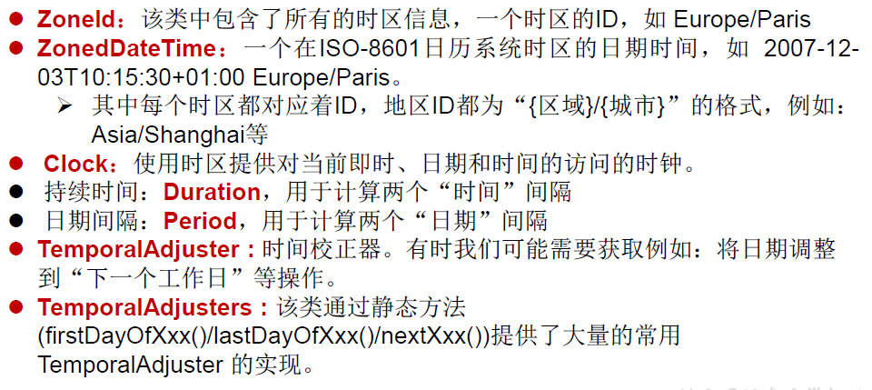

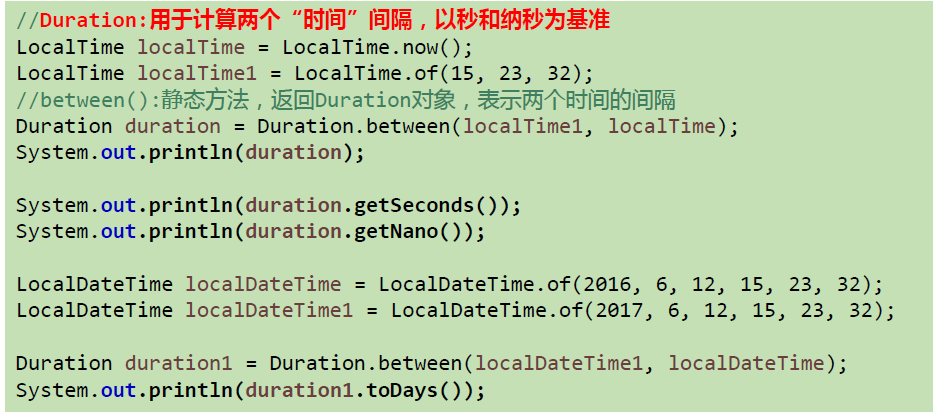

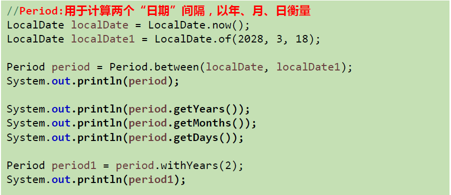

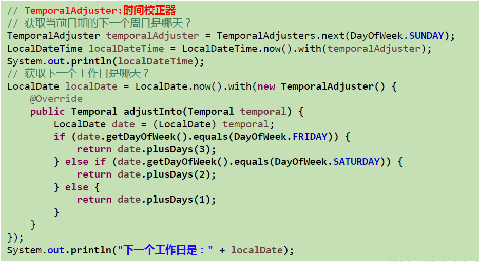


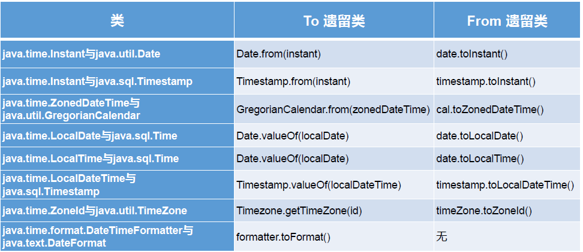

## Java比较器

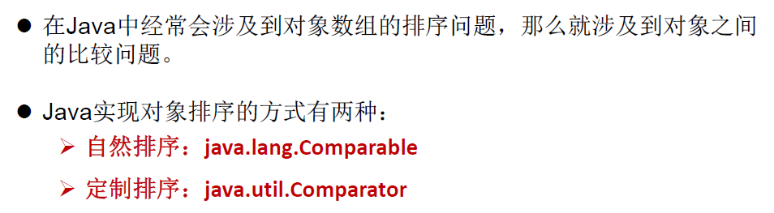

### 方式一：自然排序：`java.lang.Comparable`

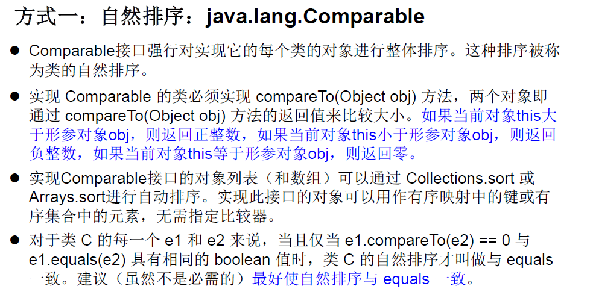

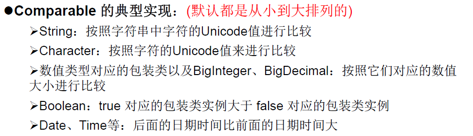

```java
package com.atguigu.java;

import org.junit.Test;

import java.util.Arrays;
import java.util.Comparator;

/**
 * 一、说明：Java中的对象，正常情况下，只能进行比较：==  或  != 。不能使用 > 或 < 的
 *          但是在开发场景中，我们需要对多个对象进行排序，言外之意，就需要比较对象的大小。
 *          如何实现？使用两个接口中的任何一个：Comparable 或 Comparator
 *
 * 二、Comparable接口与Comparator的使用的对比：
 *    Comparable接口的方式一旦一定，保证Comparable接口实现类的对象在任何位置都可以比较大小。
 *    Comparator接口属于临时性的比较。

 */
public class CompareTest {
    /*
    Comparable接口的使用举例：  自然排序
    1.像String、包装类等实现了Comparable接口，重写了compareTo(obj)方法，给出了比较两个对象大小的方式。
    2.像String、包装类重写compareTo()方法以后，进行了从小到大的排列
    3. 重写compareTo(obj)的规则：
        如果当前对象this大于形参对象obj，则返回正整数，
        如果当前对象this小于形参对象obj，则返回负整数，
        如果当前对象this等于形参对象obj，则返回零。
    4. 对于自定义类来说，如果需要排序，我们可以让自定义类实现Comparable接口，重写compareTo(obj)方法。
       在compareTo(obj)方法中指明如何排序
     */
    @Test
    public void test1(){
        String[] arr = new String[]{"AA","CC","KK","MM","GG","JJ","DD"};
        //
        Arrays.sort(arr);

        System.out.println(Arrays.toString(arr));

    }

    @Test
    public void test2(){
        Goods[] arr = new Goods[5];
        arr[0] = new Goods("lenovoMouse",34);
        arr[1] = new Goods("dellMouse",43);
        arr[2] = new Goods("xiaomiMouse",12);
        arr[3] = new Goods("huaweiMouse",65);
        arr[4] = new Goods("microsoftMouse",43);

        Arrays.sort(arr);

        System.out.println(Arrays.toString(arr));
    }

   

```

### 方式二：定制排序：`java.util.Comparator`

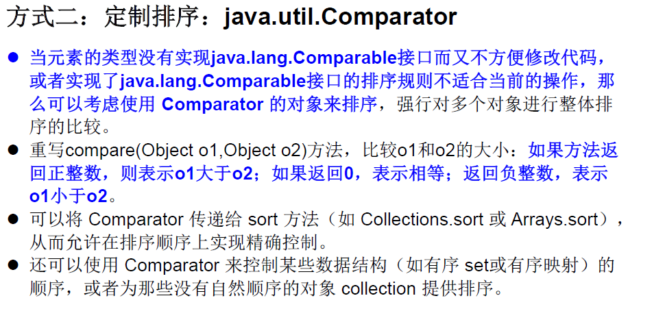

```java
    /*
   Comparator接口的使用：定制排序
   1.背景：
   当元素的类型没有实现java.lang.Comparable接口而又不方便修改代码，
   或者实现了java.lang.Comparable接口的排序规则不适合当前的操作，
   那么可以考虑使用 Comparator 的对象来排序
   2.重写compare(Object o1,Object o2)方法，比较o1和o2的大小：
   如果方法返回正整数，则表示o1大于o2；
   如果返回0，表示相等；
   返回负整数，表示o1小于o2。

    */
    @Test
    public void test3(){
        String[] arr = new String[]{"AA","CC","KK","MM","GG","JJ","DD"};

        Comparator compare= new Comparator(){

            //按照字符串从大到小的顺序排列
            @Override
            public int compare(Object o1, Object o2) {
                if(o1 instanceof String && o2 instanceof  String){
                    String s1 = (String) o1;
                    String s2 = (String) o2;
                    return -s1.compareTo(s2);
                }
//                return 0;
                throw new RuntimeException("输入的数据类型不一致");
            }
        };

        Arrays.sort(arr,compare);
        System.out.println(Arrays.toString(arr));
    }
```


## System类

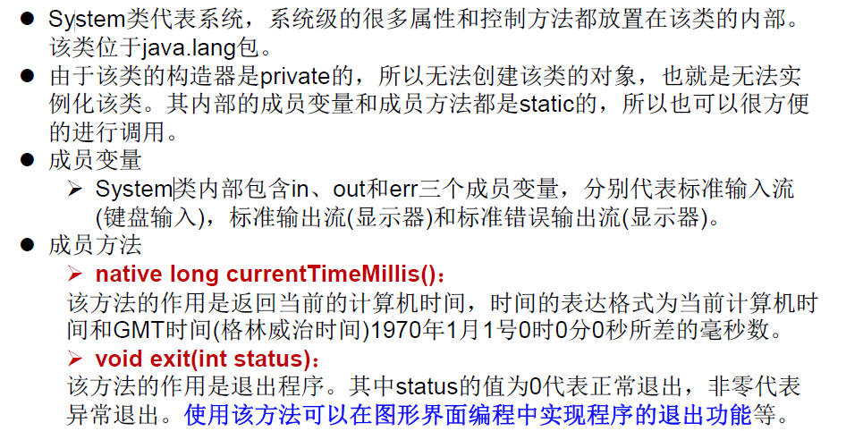

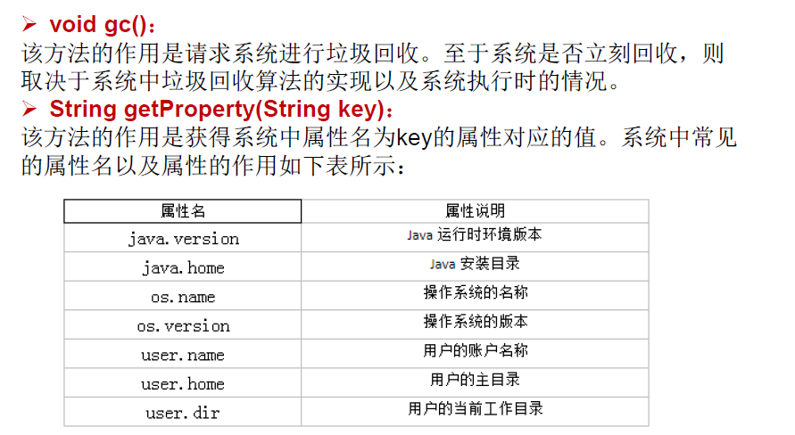

```java
 @Test
    public void test1() {
        String javaVersion = System.getProperty("java.version");
        System.out.println("java的version:" + javaVersion);//java的version:1.8.0_241

        String javaHome = System.getProperty("java.home");
        System.out.println("java的home:" + javaHome);//java的home:D:\Java\jdk1.8.0_241\jre

        String osName = System.getProperty("os.name");
        System.out.println("os的name:" + osName);//os的name:Windows 10

        String osVersion = System.getProperty("os.version");
        System.out.println("os的version:" + osVersion);//os的version:10.0

        String userName = System.getProperty("user.name");
        System.out.println("user的name:" + userName);//user的name:gouwenyong0000

        String userHome = System.getProperty("user.home");
        System.out.println("user的home:" + userHome);//user的home:C:\Users\gouwenyong0000

        String userDir = System.getProperty("user.dir");
        System.out.println("user的dir:" + userDir);//user的dir:D:\code\day21alwayclass-1

    }
```

## Math类

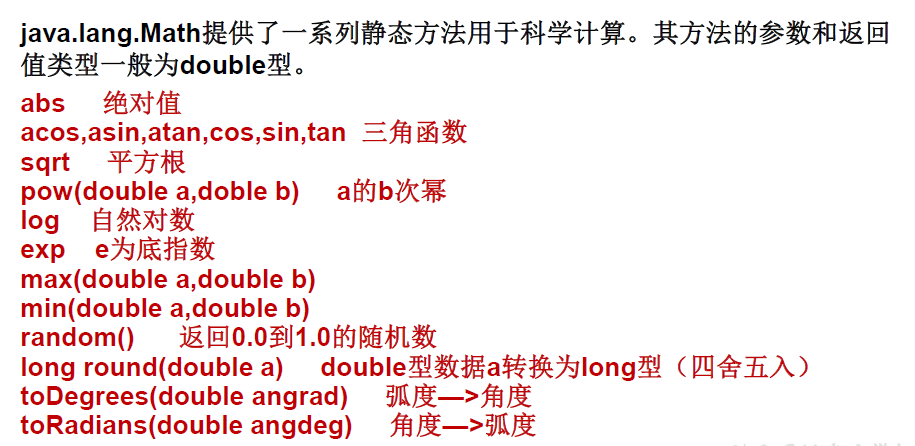


## BigInteger与BigDecimal

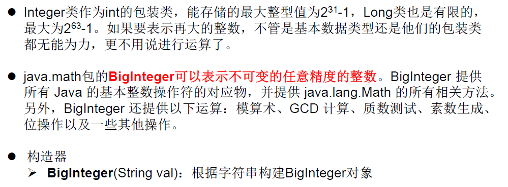

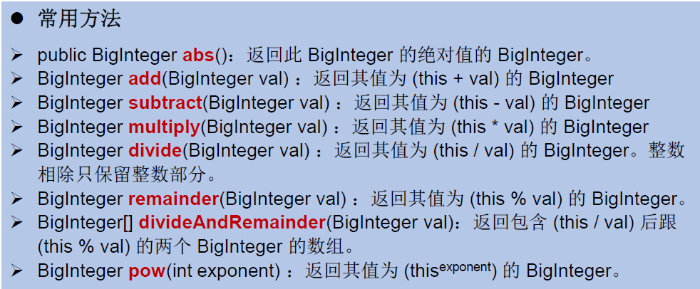

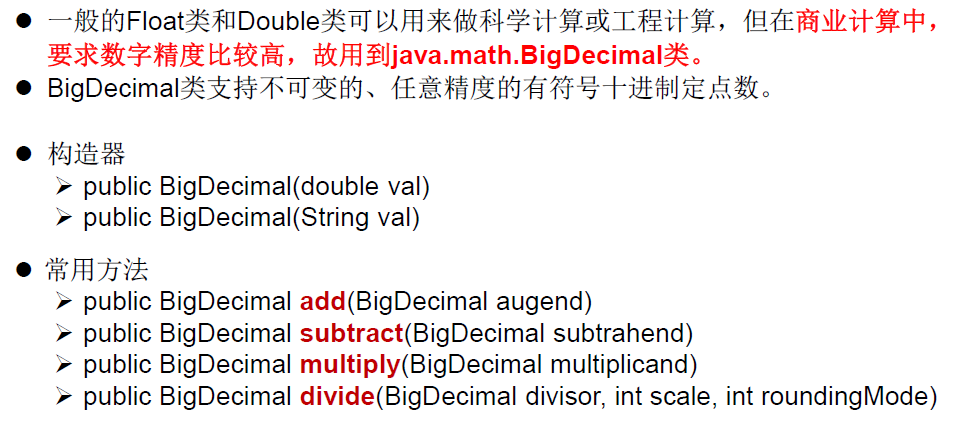


```java
    @Test
    public void test2() {
        BigInteger bi = new BigInteger("1243324112234324324325235245346567657653");
        BigDecimal bd = new BigDecimal("12435.351");
        BigDecimal bd2 = new BigDecimal("11");
        System.out.println(bi);//1243324112234324324325235245346567657653
//         System.out.println(bd.divide(bd2));
        //BigDecimal.ROUND_HALF_UP表示四舍五入
        System.out.println(bd.divide(bd2, BigDecimal.ROUND_HALF_UP));//1130.486
       
        System.out.println(bd.divide(bd2, 25, BigDecimal.ROUND_HALF_UP));
 		//1130.4864545454545454545454545

    }
```

# 枚举类

## 概念

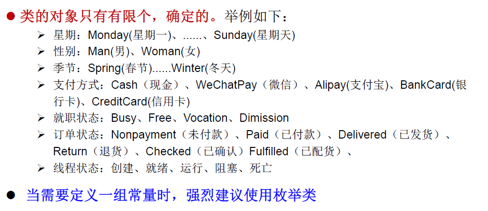

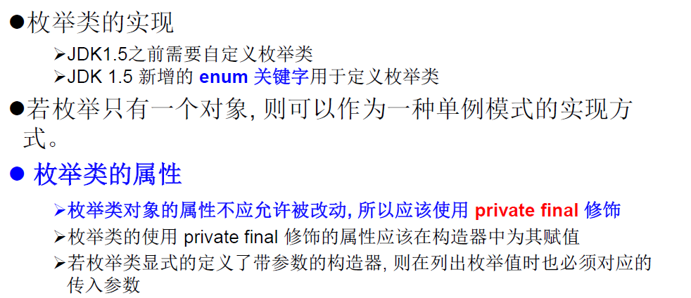


## 自定义枚举类

1，`私有化类的构造器`，保证不能在类的外部创建其对象
2，在类的内部创建枚举类的实例。声明为：`public static final`
3，对象如果有实例变量，应该声明为`private final`，并在构造器中初始化

```java
package com.atguigu.java;

/**
 * 一、枚举类的使用
 * 1.枚举类的理解：类的对象只有有限个，确定的。我们称此类为枚举类
 * 2.当需要定义一组常量时，强烈建议使用枚举类
 * 3.如果枚举类中只有一个对象，则可以作为单例模式的实现方式。
 *
 * 二、如何定义枚举类
 * 方式一：jdk5.0之前，自定义枚举类
 * 方式二：jdk5.0，可以使用enum关键字定义枚举类
 *
 *
 */
public class SeasonTest {

    public static void main(String[] args) {
        Season spring = Season.SPRING;
        System.out.println(spring);

    }

}
//自定义枚举类
class Season{
    //1.声明Season对象的属性:private final修饰
    private final String seasonName;
    private final String seasonDesc;

    //2.私有化类的构造器,并给对象属性赋值
    private Season(String seasonName,String seasonDesc){
        this.seasonName = seasonName;
        this.seasonDesc = seasonDesc;
    }

    //3.提供当前枚举类的多个对象：public static final的
    public static final Season SPRING = new Season("春天","春暖花开");
    public static final Season SUMMER = new Season("夏天","夏日炎炎");
    public static final Season AUTUMN = new Season("秋天","秋高气爽");
    public static final Season WINTER = new Season("冬天","冰天雪地");

    //4.其他诉求1：获取枚举类对象的属性
    public String getSeasonName() {
        return seasonName;
    }

    public String getSeasonDesc() {
        return seasonDesc;
    }
    //4.其他诉求1：提供toString()
    @Override
    public String toString() {
        return "Season{" +
                "seasonName='" + seasonName + '\'' +
                ", seasonDesc='" + seasonDesc + '\'' +
                '}';
    }
}

```

## 使用enum定义枚举类

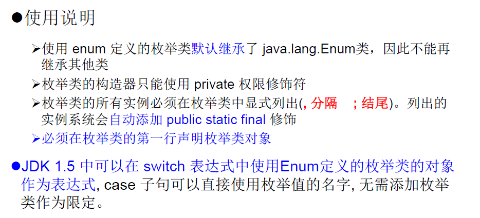


```java
package com.atguigu.java;

/**
 *
 * 三、Enum类中的常用方法：
 *    values()方法：返回枚举类型的对象数组。该方法可以很方便地遍历所有的枚举值。
 *    valueOf(String str)：可以把一个字符串转为对应的枚举类对象。要求字符串必须是枚举类对象的“名字”。如不是，会有运行时异常：IllegalArgumentException。
 *    toString()：返回当前枚举类对象常量的名称
 *
 * 四、使用enum关键字定义的枚举类实现接口的情况
 *   情况一：实现接口，在enum类中实现抽象方法
 *   情况二：让枚举类的对象分别实现接口中的抽象方法
 

 * 说明：定义的枚举类默认继承于java.lang.Enum类
 *
 */
public class SeasonTest1 {
    public static void main(String[] args) {
        Season1 summer = Season1.SUMMER;
        //toString():返回枚举类对象的名称
        System.out.println(summer.toString());

//        System.out.println(Season1.class.getSuperclass());
        System.out.println("****************");
        //values():返回所有的枚举类对象构成的数组
        Season1[] values = Season1.values();
        for(int i = 0;i < values.length;i++){
            System.out.println(values[i]);
            values[i].show();
        }
        System.out.println("****************");
        Thread.State[] values1 = Thread.State.values();
        for (int i = 0; i < values1.length; i++) {
            System.out.println(values1[i]);
        }

        //valueOf(String objName):返回枚举类中对象名是objName的对象。
        Season1 winter = Season1.valueOf("WINTER");
        //如果没有objName的枚举类对象，则抛异常：IllegalArgumentException
//        Season1 winter = Season1.valueOf("WINTER1");
        System.out.println(winter);
        winter.show();
    }
}

interface Info{
    void show();
}

//使用enum关键字枚举类
enum Season1 implements Info{
    //1.提供当前枚举类的对象，多个对象之间用","隔开，末尾对象";"结束
    SPRING("春天","春暖花开"){
        @Override
        public void show() {
            System.out.println("春天在哪里？");
        }
    },
    SUMMER("夏天","夏日炎炎"){
        @Override
        public void show() {
            System.out.println("宁夏");
        }
    },
    AUTUMN("秋天","秋高气爽"){
        @Override
        public void show() {
            System.out.println("秋天不回来");
        }
    },
    WINTER("冬天","冰天雪地"){
        @Override
        public void show() {
            System.out.println("大约在冬季");
        }
    };

    //2.声明Season对象的属性:private final修饰
    private final String seasonName;
    private final String seasonDesc;

    //2.私有化类的构造器,并给对象属性赋值

    private Season1(String seasonName,String seasonDesc){
        this.seasonName = seasonName;
        this.seasonDesc = seasonDesc;
    }

    //4.其他诉求1：获取枚举类对象的属性
    public String getSeasonName() {
        return seasonName;
    }

    public String getSeasonDesc() {
        return seasonDesc;
    }
//    //4.其他诉求1：提供toString()
//
//    @Override
//    public String toString() {
//        return "Season1{" +
//                "seasonName='" + seasonName + '\'' +
//                ", seasonDesc='" + seasonDesc + '\'' +
//                '}';
//    }


//    @Override
//    public void show() {
//        System.out.println("这是一个季节");
//    }
}
```

## Enum类的主要方法

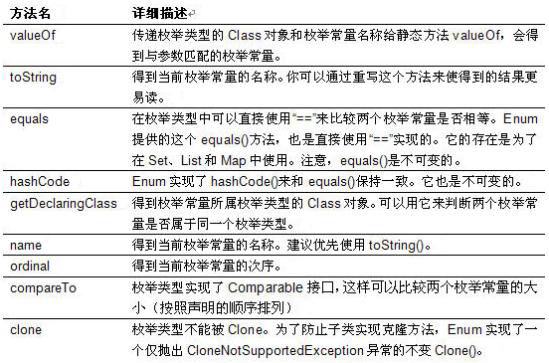

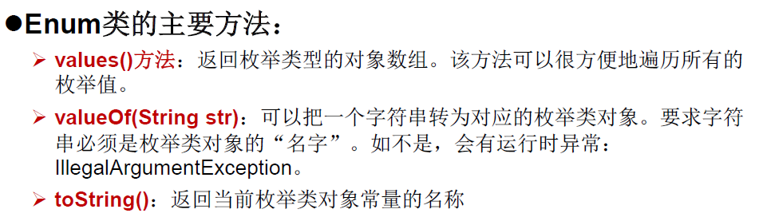

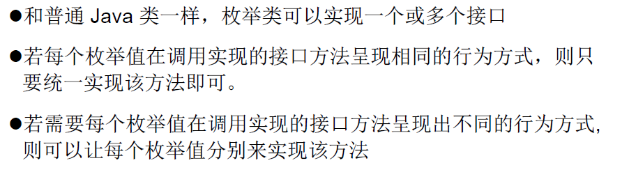


# 注解(Annotation)

## 注解(Annotation)概述

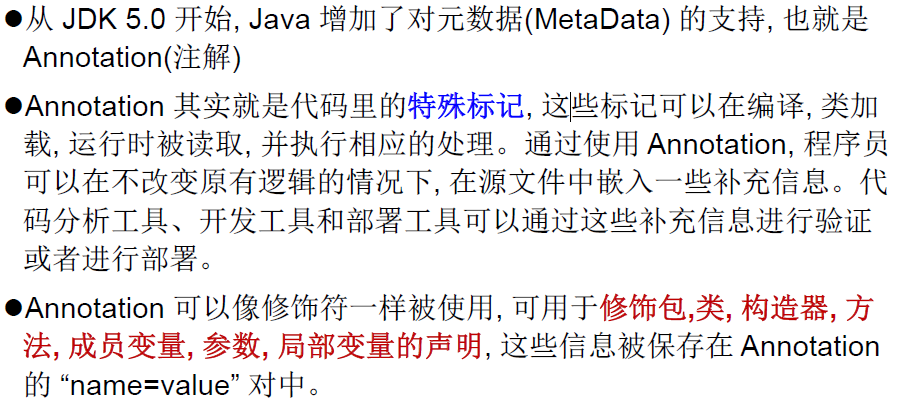

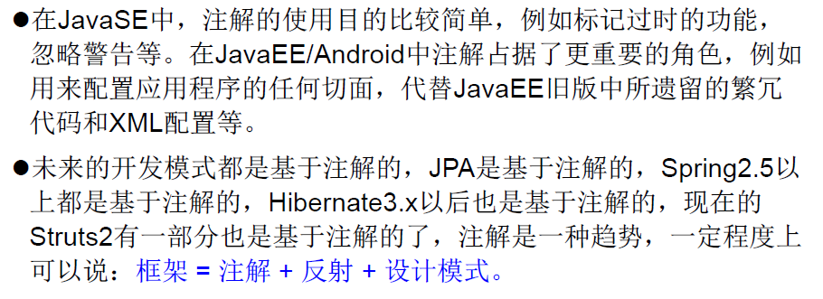

## 常见的Annotation示例

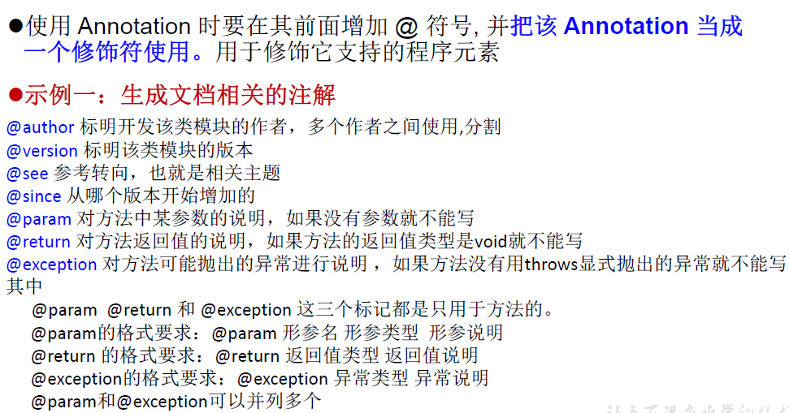

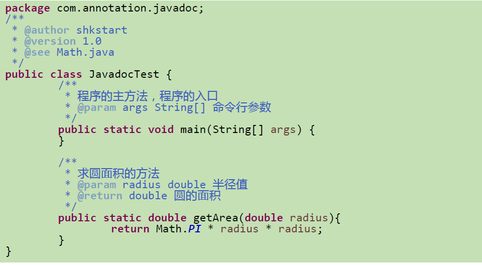

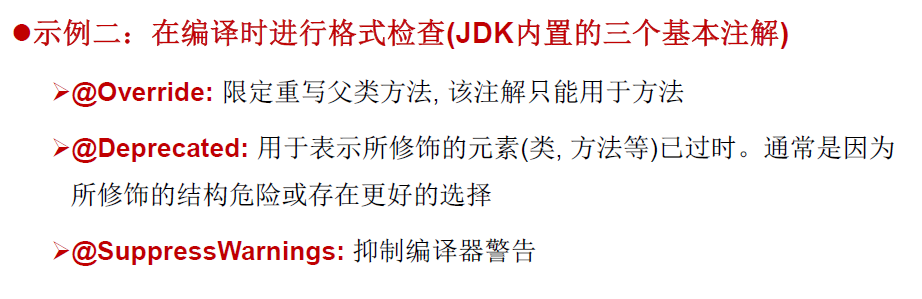

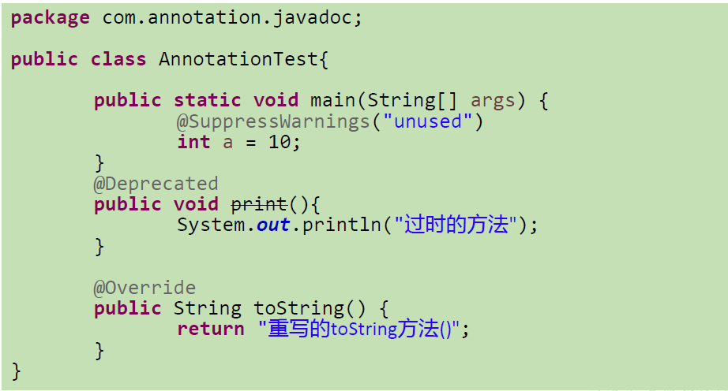

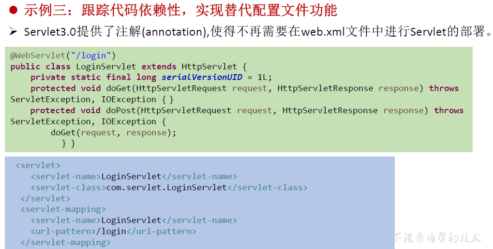

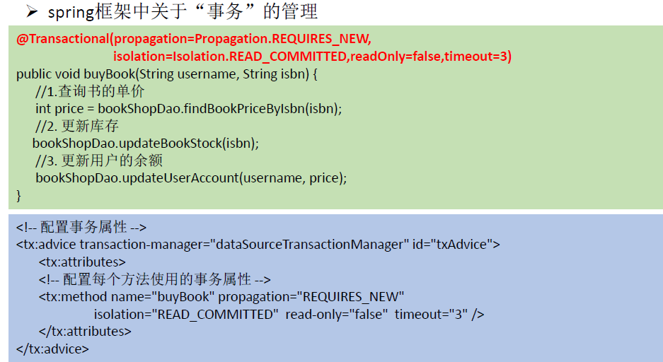

## 自定义Annotation

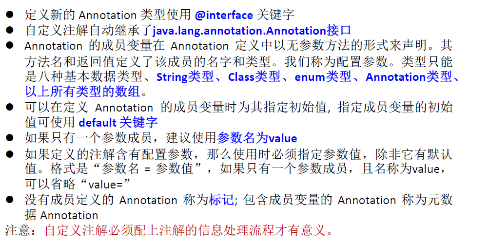

## JDK中的元注解

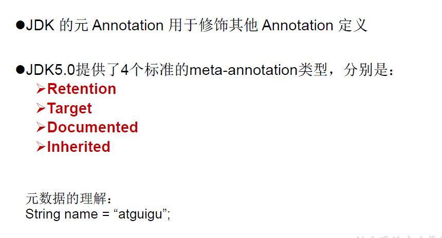

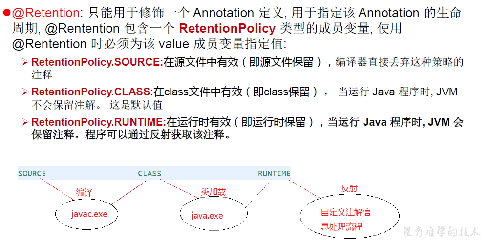

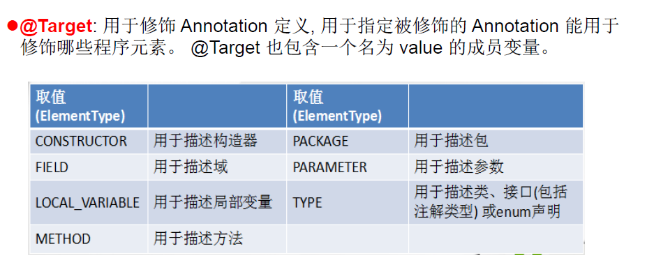

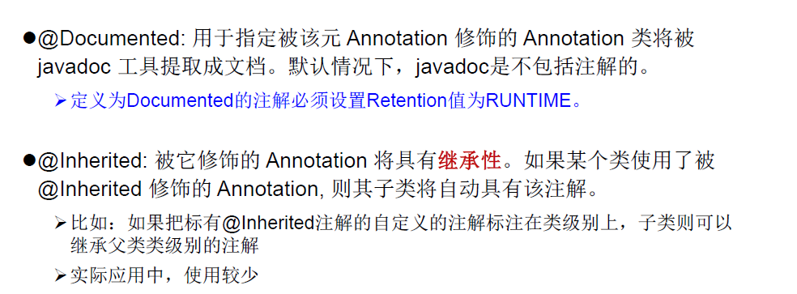

## 利用反射获取注解信息

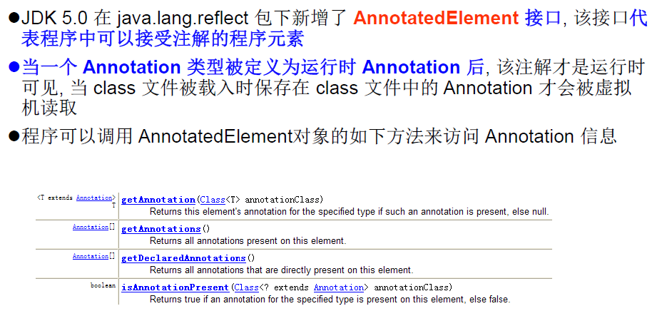

## JDK 8中注解的新特性

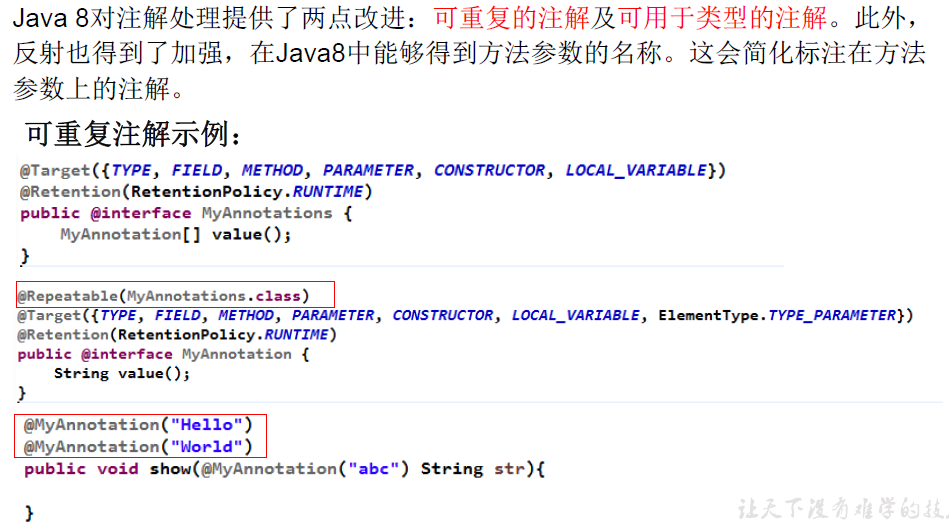

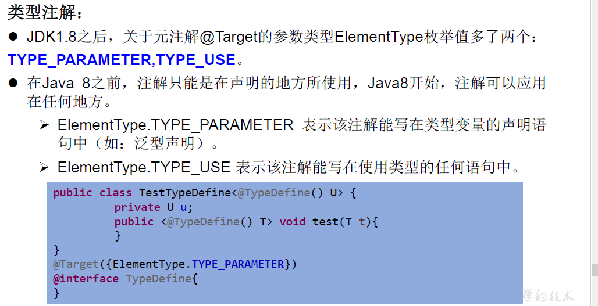

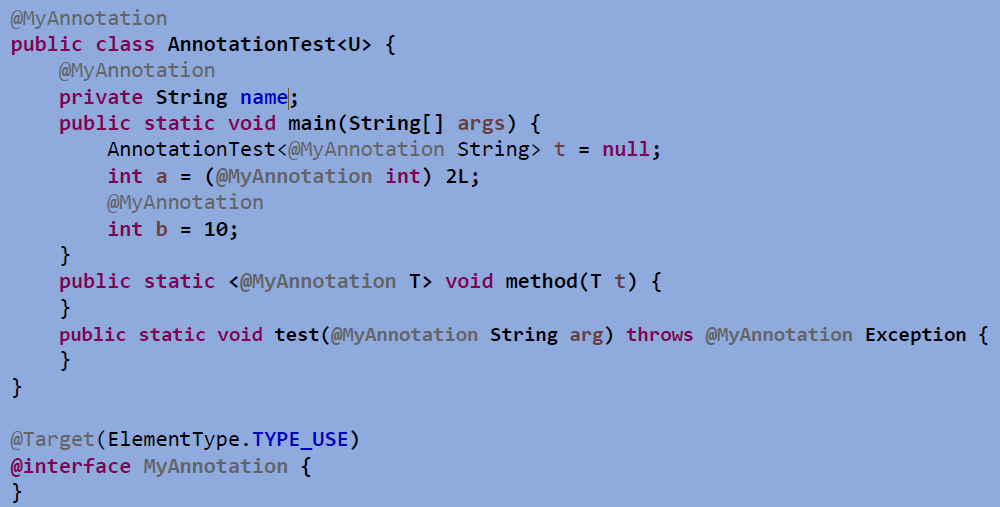


## 代码及总结

```java
package com.atguigu.java1;

import org.junit.Test;

import java.lang.annotation.Annotation;
import java.util.ArrayList;
import java.util.Date;

/**
 * 注解的使用
 *
 * 1. 理解Annotation:
 * ① jdk 5.0 新增的功能
 *
 * ② Annotation 其实就是代码里的特殊标记, 这些标记可以在编译, 类加载, 运行时被读取, 并执行相应的处理。通过使用 Annotation,
 * 程序员可以在不改变原有逻辑的情况下, 在源文件中嵌入一些补充信息。
 *
 * ③在JavaSE中，注解的使用目的比较简单，例如标记过时的功能，忽略警告等。在JavaEE/Android
 * 中注解占据了更重要的角色，例如用来配置应用程序的任何切面，代替JavaEE旧版中所遗留的繁冗
 * 代码和XML配置等。
 *
 * 2. Annocation的使用示例
 * 示例一：生成文档相关的注解
 * 示例二：在编译时进行格式检查(JDK内置的三个基本注解)
     @Override: 限定重写父类方法, 该注解只能用于方法
     @Deprecated: 用于表示所修饰的元素(类, 方法等)已过时。通常是因为所修饰的结构危险或存在更好的选择
     @SuppressWarnings: 抑制编译器警告

  * 示例三：跟踪代码依赖性，实现替代配置文件功能
  *
  * 3. 如何自定义注解：参照@SuppressWarnings定义
      * ① 注解声明为：@interface
      * ② 内部定义成员，通常使用value表示
      * ③ 可以指定成员的默认值，使用default定义
      * ④ 如果自定义注解没有成员，表明是一个标识作用。

     如果注解有成员，在使用注解时，需要指明成员的值。
     自定义注解必须配上注解的信息处理流程(使用反射)才有意义。
     自定义注解通过都会指明两个元注解：Retention、Target

     4. jdk 提供的4种元注解
       元注解：对现有的注解进行解释说明的注解
     Retention：指定所修饰的 Annotation 的生命周期：SOURCE\CLASS（默认行为）\RUNTIME
            只有声明为RUNTIME生命周期的注解，才能通过反射获取。
     Target:用于指定被修饰的 Annotation 能用于修饰哪些程序元素
     *******出现的频率较低*******
     Documented:表示所修饰的注解在被javadoc解析时，保留下来。
     Inherited:被它修饰的 Annotation 将具有继承性。

     5.通过反射获取注解信息 ---到反射内容时系统讲解

     6. jdk 8 中注解的新特性：可重复注解、类型注解

     6.1 可重复注解：① 在MyAnnotation上声明@Repeatable，成员值为MyAnnotations.class
                    ② MyAnnotation的Target和Retention等元注解与MyAnnotations相同。

     6.2 类型注解：
     ElementType.TYPE_PARAMETER 表示该注解能写在类型变量的声明语句中（如：泛型声明）。
     ElementType.TYPE_USE 表示该注解能写在使用类型的任何语句中。

      *
 */

@Inherited
@Repeatable(MyAnnotations.class)
@Retention(RetentionPolicy.RUNTIME)
@Target({TYPE, FIELD, METHOD, PARAMETER, CONSTRUCTOR, LOCAL_VARIABLE,TYPE_PARAMETER,TYPE_USE})
 @interface MyAnnotation {

    String value() default "hello";
}

@Inherited
@Retention(RetentionPolicy.RUNTIME)
@Target({TYPE, FIELD, METHOD, PARAMETER, CONSTRUCTOR, LOCAL_VARIABLE})
 @interface MyAnnotations {

    MyAnnotation[] value();
}


public class AnnotationTest {

    public static void main(String[] args) {
        Person p = new Student();
        p.walk();

        Date date = new Date(2020, 10, 11);
        System.out.println(date);

        @SuppressWarnings("unused")
        int num = 10;

//        System.out.println(num);

        @SuppressWarnings({ "unused", "rawtypes" })
        ArrayList list = new ArrayList();
    }

    @Test
    public void testGetAnnotation(){
        Class clazz = Student.class;
        Annotation[] annotations = clazz.getAnnotations();
        for(int i = 0;i < annotations.length;i++){
            System.out.println(annotations[i]);
        }
    }
}


//jdk 8之前的写法：
//@MyAnnotations({@MyAnnotation(value="hi"),@MyAnnotation(value="hi")})
@MyAnnotation(value="hi")
@MyAnnotation(value="abc")
class Person{
    private String name;
    private int age;

    public Person() {
    }
    @MyAnnotation
    public Person(String name, int age) {
        this.name = name;
        this.age = age;
    }
    @MyAnnotation
    public void walk(){
        System.out.println("人走路");
    }
    public void eat(){
        System.out.println("人吃饭");
    }
}

interface Info{
    void show();
}

class Student extends Person implements Info{

    @Override
    public void walk() {
        System.out.println("学生走路");
    }

    public void show() {

    }
}

class Generic<@MyAnnotation T>{

    public void show() throws @MyAnnotation RuntimeException{

        ArrayList<@MyAnnotation String> list = new ArrayList<>();

        int num = (@MyAnnotation int) 10L;
    }

}
```

# 集合

## Java集合框架概述

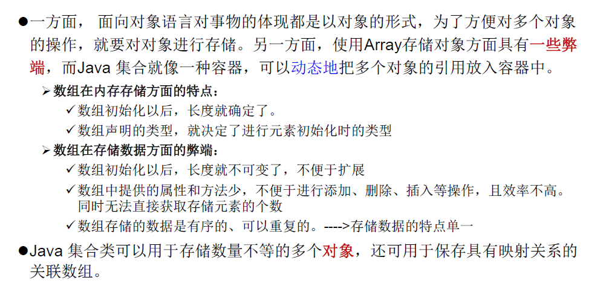

### 集合的使用场景

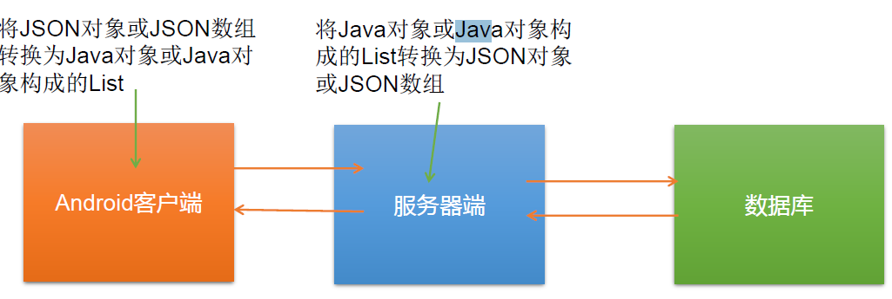

### 集合框架概述

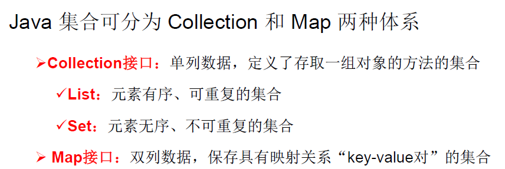

#### Collection接口继承树

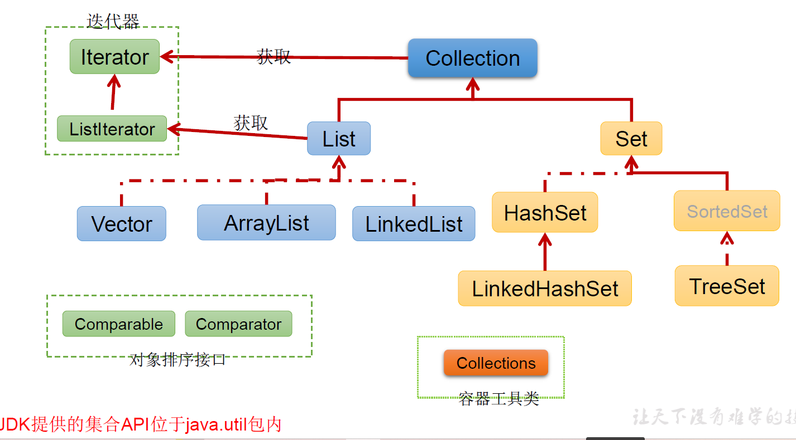

#### Map接口继承树

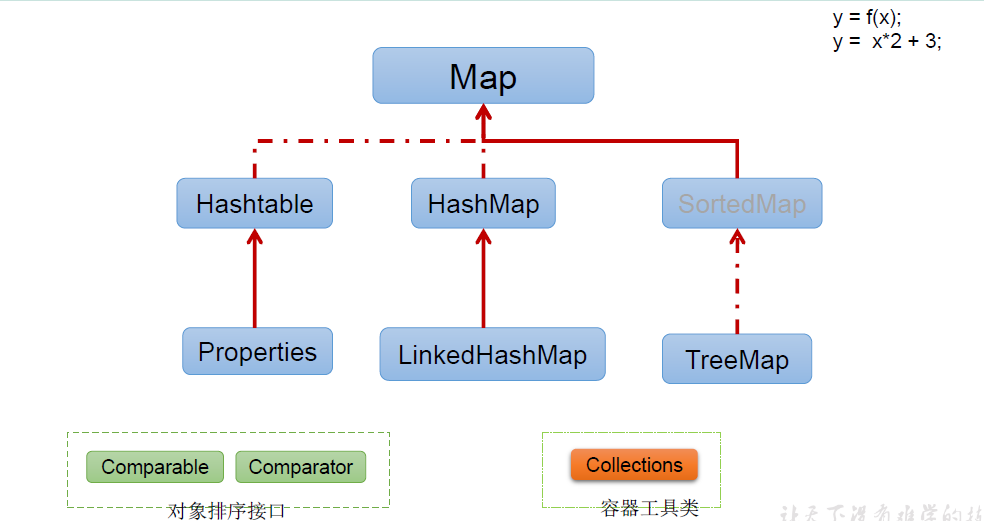

#### 总结及代码

```java
package com.atguigu.java2;

import org.junit.Test;

import java.util.ArrayList;
import java.util.Collection;
import java.util.Date;

/**
 * 一、集合框架的概述
 *
 * 1.集合、数组都是对多个数据进行存储操作的结构，简称Java容器。
 *  说明：此时的存储，主要指的是内存层面的存储，不涉及到持久化的存储（.txt,.jpg,.avi，数据库中）
 *
 * 2.1 数组在存储多个数据方面的特点：
 *      > 一旦初始化以后，其长度就确定了。
 *      > 数组一旦定义好，其元素的类型也就确定了。我们也就只能操作指定类型的数据了。
 *       比如：String[] arr;int[] arr1;Object[] arr2;
 * 2.2 数组在存储多个数据方面的缺点：
 *      > 一旦初始化以后，其长度就不可修改。
 *      > 数组中提供的方法非常有限，对于添加、删除、插入数据等操作，非常不便，同时效率不高。
 *      > 获取数组中实际元素的个数的需求，数组没有现成的属性或方法可用
 *      > 数组存储数据的特点：有序、可重复。对于无序、不可重复的需求，不能满足。
 *
 * 二、集合框架
 *      |----Collection接口：单列集合，用来存储一个一个的对象
 *          |----List接口：存储有序的、可重复的数据。  -->“动态”数组
 *              |----ArrayList、LinkedList、Vector
 *
 *          |----Set接口：存储无序的、不可重复的数据   -->高中讲的“集合”
 *              |----HashSet、LinkedHashSet、TreeSet
 *
 *      |----Map接口：双列集合，用来存储一对(key - value)一对的数据   -->高中函数：y = f(x)
 *              |----HashMap、LinkedHashMap、TreeMap、Hashtable、Properties
 *
 *

```

## Collection接口方法

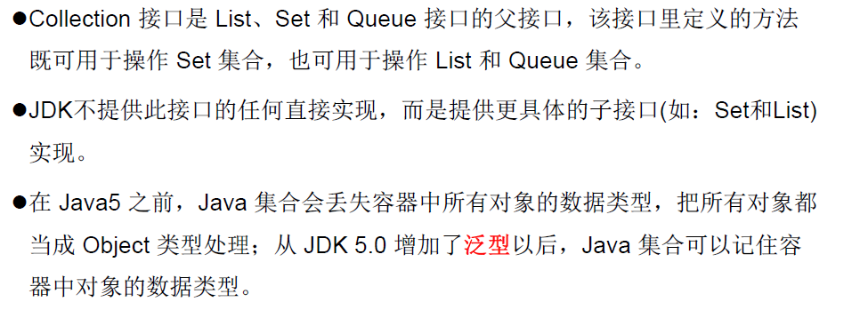

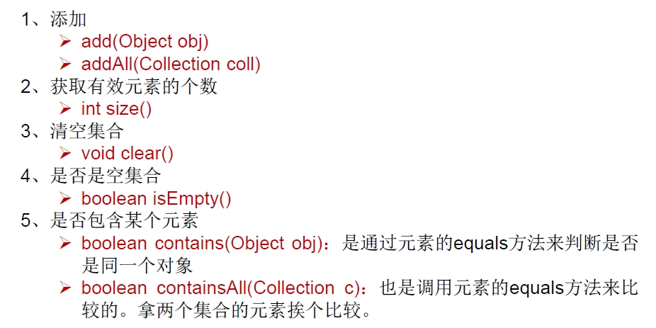

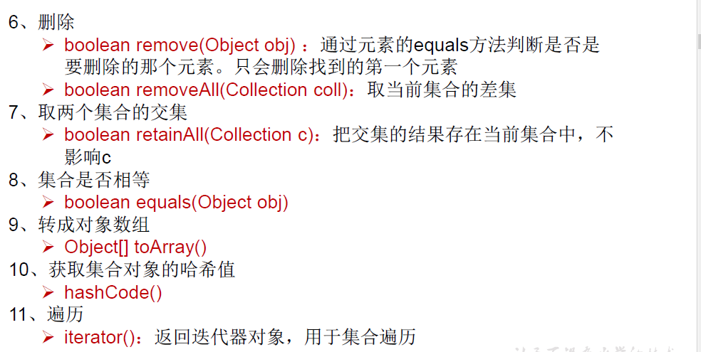

```java
 /** 
 * 三、Collection接口中的方法的使用
  * 结论：
 * 向Collection接口的实现类的对象中添加数据obj时，要求obj所在类要重写equals().
 */
public class CollectionTest {

    @Test
    public void test1(){
        Collection coll = new ArrayList();

        //add(Object e):将元素e添加到集合coll中
        coll.add("AA");
        coll.add("BB");
        coll.add(123);//自动装箱
        coll.add(new Date());

        //size():获取添加的元素的个数
        System.out.println(coll.size());//4

        //addAll(Collection coll1):将coll1集合中的元素添加到当前的集合中
        Collection coll1 = new ArrayList();
        coll1.add(456);
        coll1.add("CC");
        coll.addAll(coll1);

        System.out.println(coll.size());//6
        System.out.println(coll);

        //clear():清空集合元素
        coll.clear();

        //isEmpty():判断当前集合是否为空
        System.out.println(coll.isEmpty());

    }
       @Test
    public void test1(){
        Collection coll = new ArrayList();
        coll.add(123);
        coll.add(456);
//        Person p = new Person("Jerry",20);
//        coll.add(p);
        coll.add(new Person("Jerry",20));
        coll.add(new String("Tom"));
        coll.add(false);
        //1.contains(Object obj):判断当前集合中是否包含obj
        //我们在判断时会调用obj对象所在类的equals()。
        boolean contains = coll.contains(123);
        System.out.println(contains);//true
        System.out.println(coll.contains(new String("Tom")));//true  调用equals()
//        System.out.println(coll.contains(p));//true  相同引用
        System.out.println(coll.contains(new Person("Jerry",20)));//false -->true

        //2.containsAll(Collection coll1):判断形参coll1中的所有元素是否都存在于当前集合中。
        Collection coll1 = Arrays.asList(123,4567);
        System.out.println(coll.containsAll(coll1));
    }

    @Test
    public void test2(){
        //3.remove(Object obj):从当前集合中移除obj元素。
        Collection coll = new ArrayList();
        coll.add(123);
        coll.add(456);
        coll.add(new Person("Jerry",20));
        coll.add(new String("Tom"));
        coll.add(false);

        coll.remove(1234);
        System.out.println(coll);

        coll.remove(new Person("Jerry",20));
        System.out.println(coll);

        //4. removeAll(Collection coll1):差集：从当前集合中移除coll1中所有的元素。
        Collection coll1 = Arrays.asList(123,456);
        coll.removeAll(coll1);
        System.out.println(coll);


    }

    @Test
    public void test3(){
        Collection coll = new ArrayList();
        coll.add(123);
        coll.add(456);
        coll.add(new Person("Jerry",20));
        coll.add(new String("Tom"));
        coll.add(false);

        //5.retainAll(Collection coll1):交集：获取当前集合和coll1集合的交集，并返回给当前集合
//        Collection coll1 = Arrays.asList(123,456,789);
//        coll.retainAll(coll1);
//        System.out.println(coll);

        //6.equals(Object obj):要想返回true，需要当前集合和形参集合的元素都相同。List需要考虑添加顺序
        Collection coll1 = new ArrayList();
        coll1.add(456);
        coll1.add(123);
        coll1.add(new Person("Jerry",20));
        coll1.add(new String("Tom"));
        coll1.add(false);

        System.out.println(coll.equals(coll1));


    }

    @Test
    public void test4(){
        Collection coll = new ArrayList();
        coll.add(123);
        coll.add(456);
        coll.add(new Person("Jerry",20));
        coll.add(new String("Tom"));
        coll.add(false);

        //7.hashCode():返回当前对象的哈希值
        System.out.println(coll.hashCode());

        //8.集合 --->数组：toArray()
        Object[] arr = coll.toArray();
        for(int i = 0;i < arr.length;i++){
            System.out.println(arr[i]);
        }

        //拓展：数组 --->集合:调用Arrays类的静态方法asList()
        List<String> list = Arrays.asList(new String[]{"AA", "BB", "CC"});
        System.out.println(list);
		//注意：
        List arr1 = Arrays.asList(new int[]{123, 456});
        System.out.println(arr1.size());//1

        List arr2 = Arrays.asList(new Integer[]{123, 456});
        System.out.println(arr2.size());//2

        //9.iterator():返回Iterator接口的实例，用于遍历集合元素。放在IteratorTest.java中测试

    }

}
```


## Iterator迭代器接口

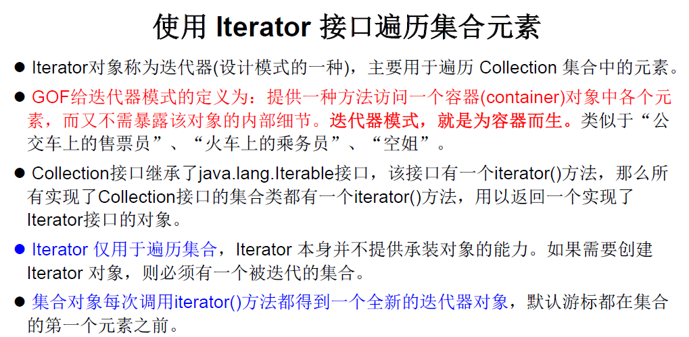

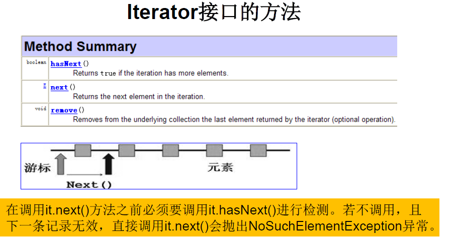

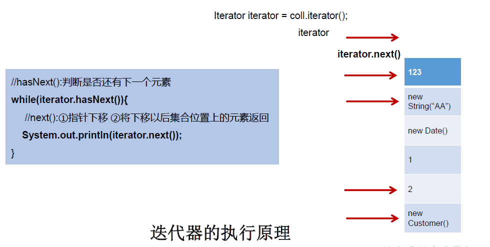

```java
import org.junit.Test;

import java.util.ArrayList;
import java.util.Collection;
import java.util.Iterator;

/**
 * 集合元素的遍历操作，使用迭代器Iterator接口
 * 1.内部的方法：hasNext() 和  next()
 * 2.集合对象每次调用iterator()方法都得到一个全新的迭代器对象，
 * 默认游标都在集合的第一个元素之前。
 * 3.内部定义了remove(),可以在遍历的时候，删除集合中的元素。此方法不同于集合直接调用remove()
 *
 */
public class IteratorTest {

    @Test
    public void test1(){
        Collection coll = new ArrayList();
        coll.add(123);
        coll.add(456);
        coll.add(new Person("Jerry",20));
        coll.add(new String("Tom"));
        coll.add(false);

        Iterator iterator = coll.iterator();
        //方式一：
//        System.out.println(iterator.next());
//        System.out.println(iterator.next());
//        System.out.println(iterator.next());
//        System.out.println(iterator.next());
//        System.out.println(iterator.next());
//        //报异常：NoSuchElementException
//        System.out.println(iterator.next());

        //方式二：不推荐
//        for(int i = 0;i < coll.size();i++){
//            System.out.println(iterator.next());
//        }

        //方式三：推荐
        ////hasNext():判断是否还有下一个元素
        while(iterator.hasNext()){
            //next():①指针下移 ②将下移以后集合位置上的元素返回
            System.out.println(iterator.next());
        }

    }
}
```


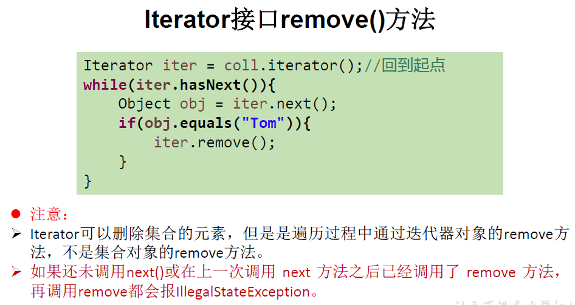

```java
    @Test
    public void test2(){

        Collection coll = new ArrayList();
        coll.add(123);
        coll.add(456);
        coll.add(new Person("Jerry",20));
        coll.add(new String("Tom"));
        coll.add(false);

        //错误方式一：
//        Iterator iterator = coll.iterator();
//        while((iterator.next()) != null){
//            System.out.println(iterator.next());
//        }

        //错误方式二：
        //集合对象每次调用iterator()方法都得到一个全新的迭代器对象，默认游标都在集合的第一个元素之前。
        while (coll.iterator().hasNext()){
            System.out.println(coll.iterator().next());
        }
    }


        //遍历集合
        iterator = coll.iterator();
        while (iterator.hasNext()){
            System.out.println(iterator.next());
        }
    }
```


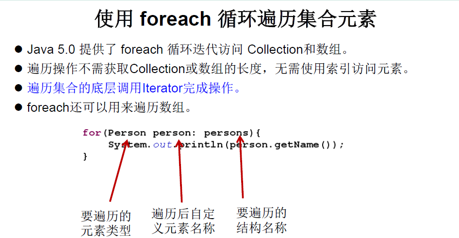

```java
/**
 * jdk 5.0 新增了foreach循环，用于遍历集合、数组
 */
public class ForTest {

    @Test
    public void test1(){
        Collection coll = new ArrayList();
        coll.add(123);
        coll.add(456);
        coll.add(new Person("Jerry",20));
        coll.add(new String("Tom"));
        coll.add(false);

        //for(集合元素的类型 局部变量 : 集合对象)
        //内部仍然调用了迭代器。
        for(Object obj : coll){
            System.out.println(obj);
        }
    }

    @Test
    public void test2(){
        int[] arr = new int[]{1,2,3,4,5,6};
        //for(数组元素的类型 局部变量 : 数组对象)
        for(int i : arr){
            System.out.println(i);
        }
    }

    //练习题
    @Test
    public void test3(){

        String[] arr = new String[]{"MM","MM","MM"};

//        //方式一：普通for赋值
//        for(int i = 0;i < arr.length;i++){
//            arr[i] = "GG";
//        }

        //方式二：增强for循环
        for(String s : arr){
            s = "GG";
        }

        for(int i = 0;i < arr.length;i++){
            System.out.println(arr[i]);
        }


    }
}

```

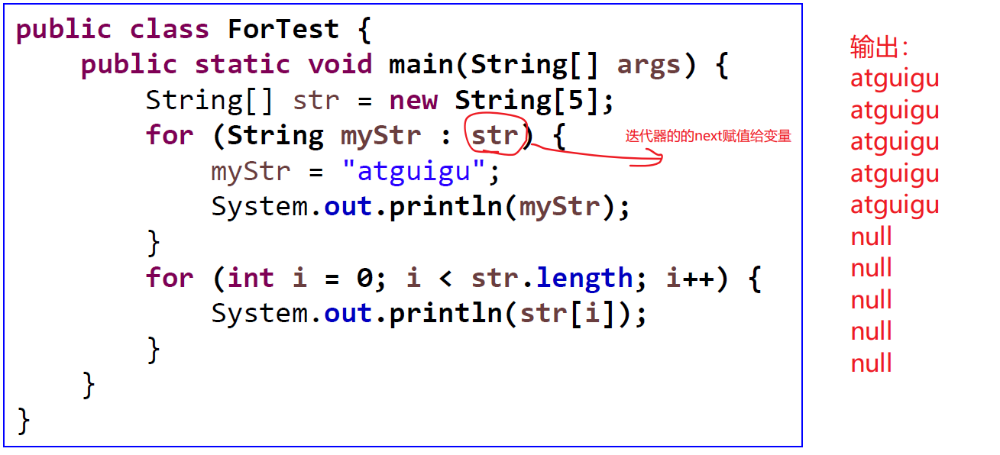

## Collection子接口一：List

### 概述

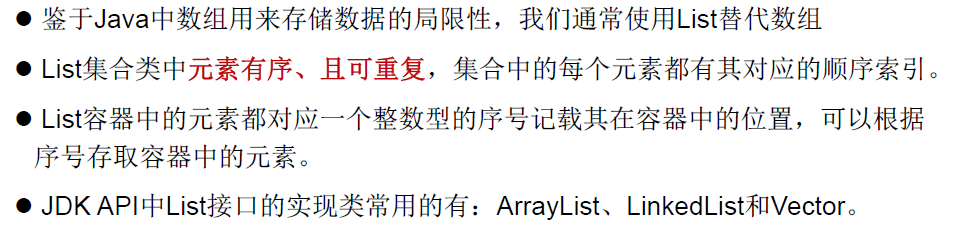

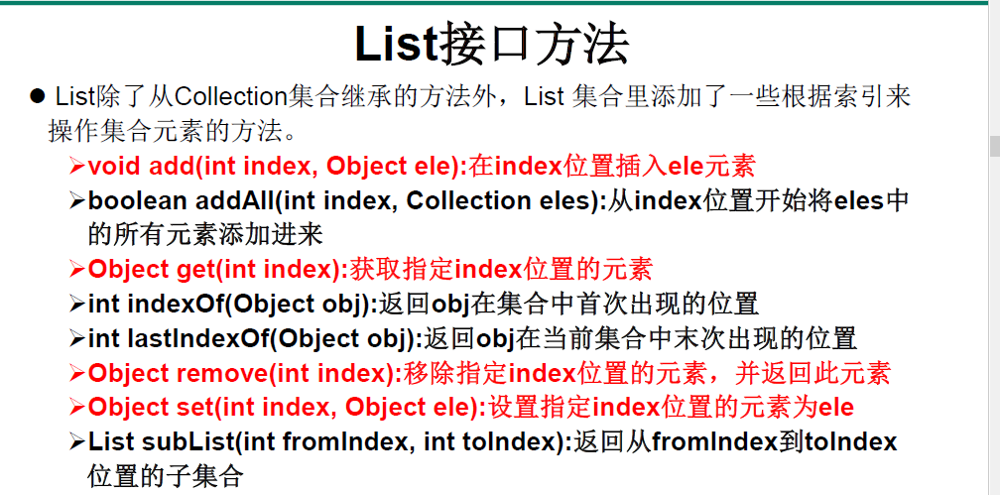

### 代码及源码分析

```java
package com.atguigu.java;

import org.junit.Test;

import java.util.ArrayList;
import java.util.Arrays;
import java.util.Iterator;
import java.util.List;

/**
 * 1. List接口框架
 *
 *    |----Collection接口：单列集合，用来存储一个一个的对象
 *          |----List接口：存储有序的、可重复的数据。  -->“动态”数组,替换原有的数组
 *              |----ArrayList：作为List接口的主要实现类；线程不安全的，效率高；底层使用Object[] elementData存储
 *              |----LinkedList：对于频繁的插入、删除操作，使用此类效率比ArrayList高；底层使用双向链表存储
 *              |----Vector：作为List接口的古老实现类；线程安全的，效率低；底层使用Object[] elementData存储
 *
 *
 *   2. ArrayList的源码分析：
 *   2.1 jdk 7情况下
 *      ArrayList list = new ArrayList();//底层创建了长度是10的Object[]数组elementData
 *      list.add(123);//elementData[0] = new Integer(123);
 *      ...
 *      list.add(11);//如果此次的添加导致底层elementData数组容量不够，则扩容。
 *      默认情况下，扩容为原来的容量的1.5倍，同时需要将原有数组中的数据复制到新的数组中。
 *
 *      结论：建议开发中使用带参的构造器：ArrayList list = new ArrayList(int capacity)
 *
 *   2.2 jdk 8中ArrayList的变化：
 *      ArrayList list = new ArrayList();//底层Object[] elementData初始化为{}.并没有创建长度为10的数组
 *
 *      list.add(123);//第一次调用add()时，底层才创建了长度10的数组，并将数据123添加到elementData[0]
 *      ...
 *      后续的添加和扩容操作与jdk 7 无异。
 *   2.3 小结：jdk7中的ArrayList的对象的创建类似于单例的饿汉式，而jdk8中的ArrayList的对象
 *            的创建类似于单例的懒汉式，延迟了数组的创建，节省内存。
 *
 *  3. LinkedList的源码分析：
 *      LinkedList list = new LinkedList(); 内部声明了Node类型的first和last属性，默认值为null
 *      list.add(123);//将123封装到Node中，创建了Node对象。
 *
 *      其中，Node定义为：体现了LinkedList的双向链表的说法
 *      private static class Node<E> {
             E item;
             Node<E> next;
             Node<E> prev;

             Node(Node<E> prev, E element, Node<E> next) {
             this.item = element;
             this.next = next;
             this.prev = prev;
             }
         }
 *
 *   4. Vector的源码分析：jdk7和jdk8中通过Vector()构造器创建对象时，底层都创建了长度为10的数组。
 *      在扩容方面，默认扩容为原来的数组长度的2倍。
 *
 *  面试题：ArrayList、LinkedList、Vector三者的异同？
 *  同：三个类都是实现了List接口，存储数据的特点相同：存储有序的、可重复的数据
 *  不同：见上
 *
 *
 *
 *   5. List接口中的常用方法
 *
 */
public class ListTest {

    /*
void add(int index, Object ele):在index位置插入ele元素
boolean addAll(int index, Collection eles):从index位置开始将eles中的所有元素添加进来
Object get(int index):获取指定index位置的元素
int indexOf(Object obj):返回obj在集合中首次出现的位置
int lastIndexOf(Object obj):返回obj在当前集合中末次出现的位置
Object remove(int index):移除指定index位置的元素，并返回此元素
Object set(int index, Object ele):设置指定index位置的元素为ele
List subList(int fromIndex, int toIndex):返回从fromIndex到toIndex位置的子集合

总结：常用方法
增：add(Object obj)
删：remove(int index) / remove(Object obj)
改：set(int index, Object ele)
查：get(int index)
插：add(int index, Object ele)
长度：size()
遍历：① Iterator迭代器方式
     ② 增强for循环
     ③ 普通的循环

     */
    
     @Test
    public void test1(){
        ArrayList list = new ArrayList();
        list.add(123);
        list.add(456);
        list.add("AA");
        list.add(new Person("Tom",12));
        list.add(456);

        System.out.println(list);

        //void add(int index, Object ele):在index位置插入ele元素,其余顺序后移
        list.add(1,"BB");
        System.out.println(list);

        //boolean addAll(int index, Collection eles):从index位置开始将eles中的所有元素添加进来
        List list1 = Arrays.asList(1, 2, 3);
        list.addAll(list1);
//        list.add(list1);//当成一个元素添加进去
        System.out.println(list.size());//9

        //Object get(int index):获取指定index位置的元素
        System.out.println(list.get(0));

    }

    @Test
    public void test2(){
        ArrayList list = new ArrayList();
        list.add(123);
        list.add(456);
        list.add("AA");
        list.add(new Person("Tom",12));
        list.add(456);
        //int indexOf(Object obj):返回obj在集合中首次出现的位置。如果不存在，返回-1.
        int index = list.indexOf(4567);
        System.out.println(index);

        //int lastIndexOf(Object obj):返回obj在当前集合中末次出现的位置。如果不存在，返回-1.
        System.out.println(list.lastIndexOf(456));

        //Object remove(int index):移除指定index位置的元素，并返回此元素
        Object obj = list.remove(0);
        System.out.println(obj);
        System.out.println(list);

        //Object set(int index, Object ele):设置指定index位置的元素为ele
        list.set(1,"CC");
        System.out.println(list);

        //List subList(int fromIndex, int toIndex):返回从fromIndex到toIndex位置的左闭右开区间的子集合
        List subList = list.subList(2, 4);
        System.out.println(subList);
        System.out.println(list);


    }

  @Test
    public void test3(){
        ArrayList list = new ArrayList();
        list.add(123);
        list.add(456);
        list.add("AA");

        //方式一：Iterator迭代器方式
        Iterator iterator = list.iterator();
        while(iterator.hasNext()){
            System.out.println(iterator.next());
        }

        System.out.println("***************");

        //方式二：增强for循环
        for(Object obj : list){
            System.out.println(obj);
        }

        System.out.println("***************");

        //方式三：普通for循环
        for(int i = 0;i < list.size();i++){
            System.out.println(list.get(i));
        }
    }
   
}
```

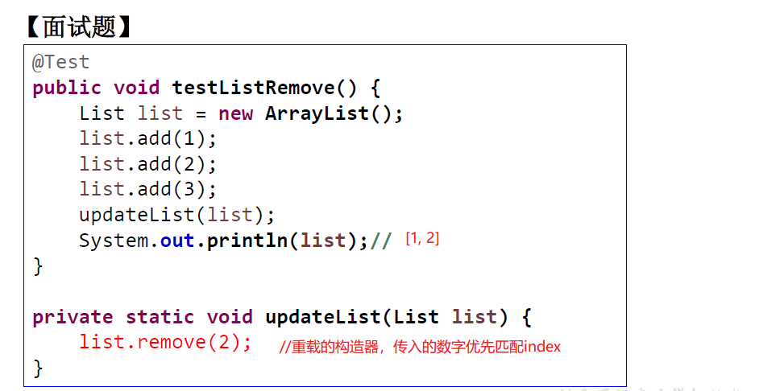

### List实现类之一：ArrayList

+ ArrayList是List接口的典型实现类、主要实现类
+ 本质上，ArrayList是对象引用的一个"变长”数组

+ **ArrayList的JDK1.8之前与之后的实现区别？**
  + `JDK1.7`：ArrayList像饿汉式，`直接创建一个初始容量为10的数组`
  +  `JDK1.8`：ArrayList像懒汉式，`一开始创建一个长度为0的数组，当添加第一个元素时再创建一个始容量为10的数组`
  + *第一次扩容1.5倍，如果还不够，再次扩容到新的最小需求容量*
+ `Arrays.asList（...)法返回的List集合`，既不是ArrayList实例，也不是Vector实例。Arrays.asList（.）返回值是一个固定长度的List集合

### List实现类之二：LinkedList

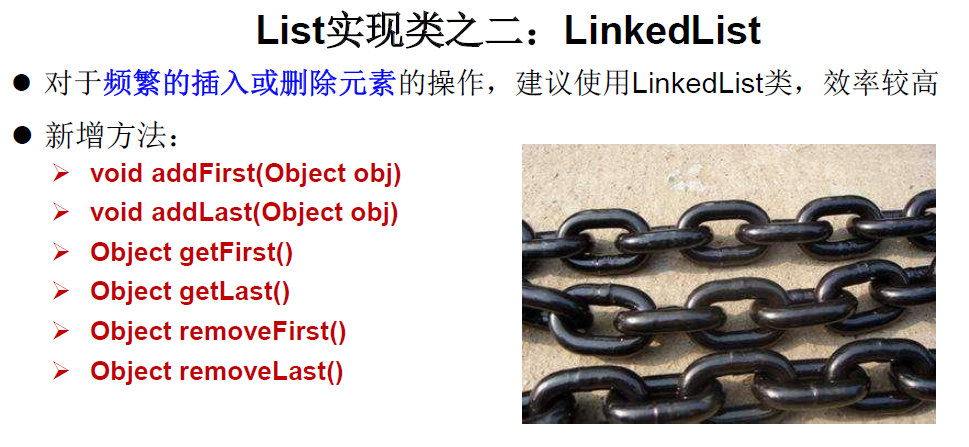

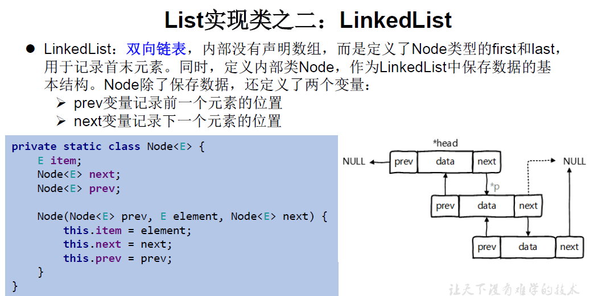

### List实现类之三：Vector

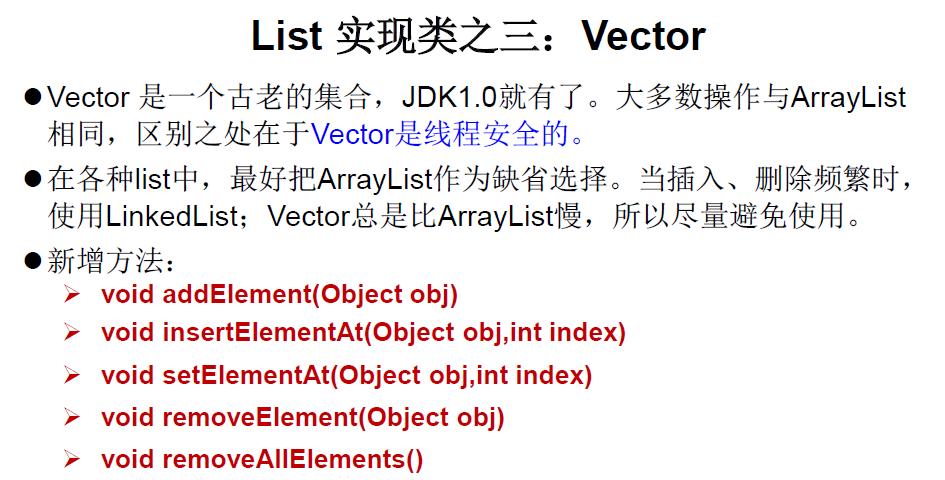


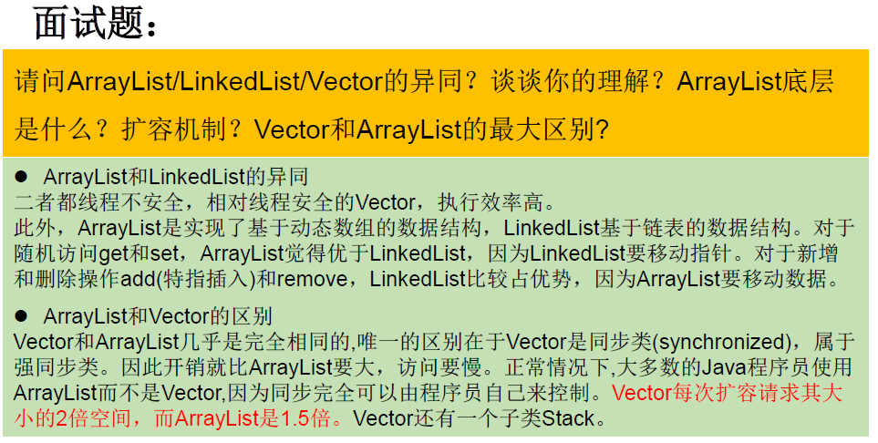


## Collection子接口二：Set

+ Set接口是Collection的子接口，set接口没有提供额外的方法
+ Set 集合`不允许包含相同的元素`，如果试把两个相同的元素加入同一个Set 集合中，则添加操作失败。
+ Set 判断两个对象是否相同不是使用 == 运算符，而是根据 equals() 方法
+ `无序性`：不等于随机性。存储的数据在底层数组中并非按照数组索引的顺序添加，而是根据数据的`哈希值决定`的。

```
/**
 * 1. Set接口的框架：
 *
 * |----Collection接口：单列集合，用来存储一个一个的对象
 *          |----Set接口：存储无序的、不可重复的数据   -->高中讲的“集合”
 *              |----HashSet：作为Set接口的主要实现类；线程不安全的；可以存储null值
 *                  |----LinkedHashSet：作为HashSet的子类；遍历其内部数据时，可以按照添加的顺序遍历
 *                                      对于频繁的遍历操作，LinkedHashSet效率高于HashSet.
 *              |----TreeSet：可以按照添加对象的指定属性，进行排序。
 *
 *
 *  1. Set接口中没有额外定义新的方法，使用的都是Collection中声明过的方法。
 *
 *  2. 要求：向Set(主要指：HashSet、LinkedHashSet)中添加的数据，其所在的类一定要重写hashCode()和equals()
 *     要求：重写的hashCode()和equals()尽可能保持一致性：相等的对象必须具有相等的散列码
 *      重写两个方法的小技巧：对象中用作 equals() 方法比较的 Field，都应该用来计算 hashCode 值。
 *
 *
 */
```


### Set实现类之一：HashSet

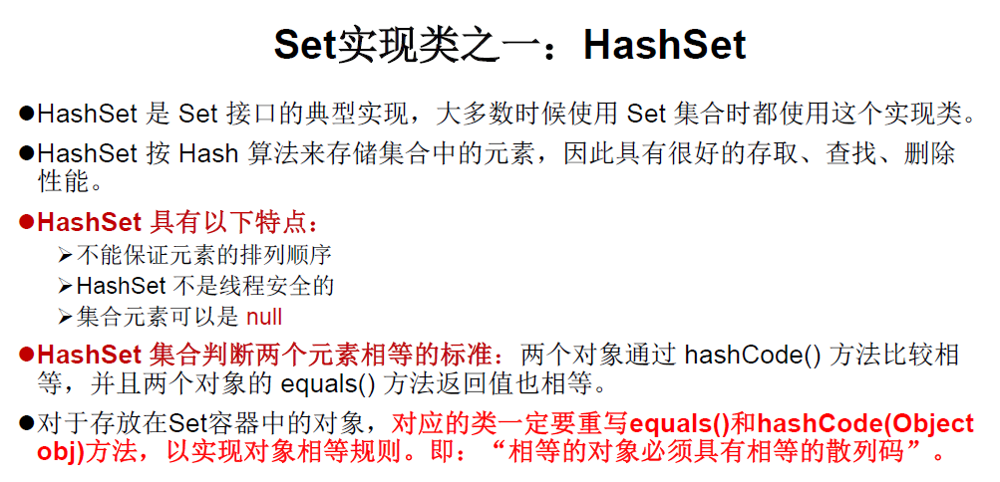

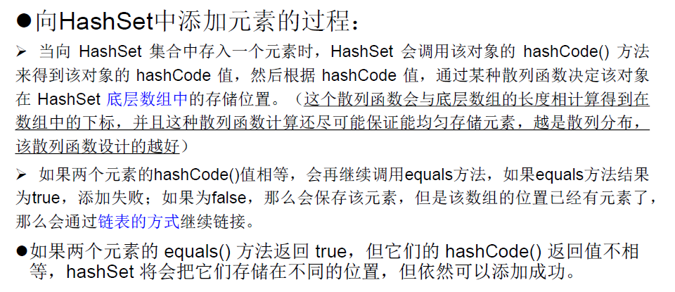

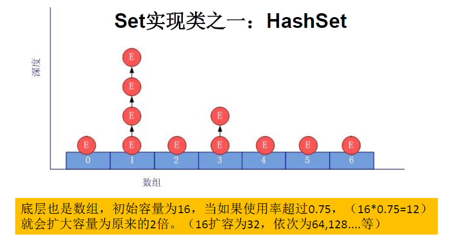

### 重写`hashCode（）/equals（）`方法的基本原则

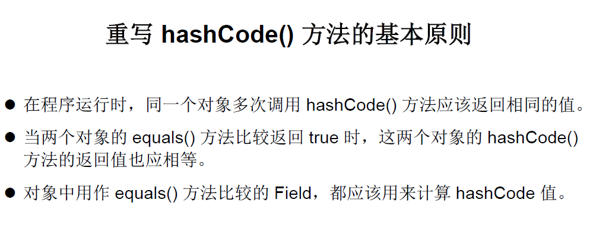

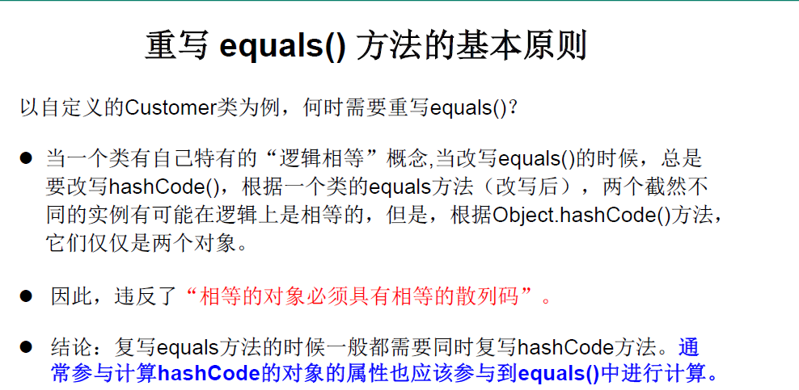

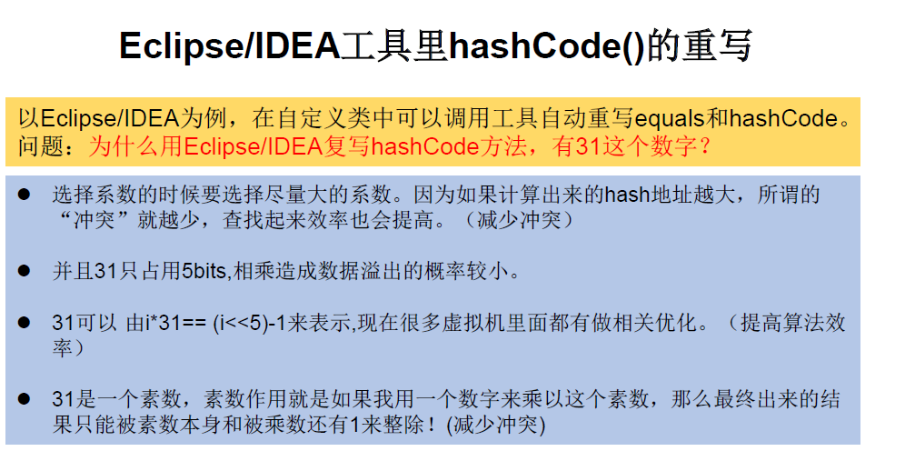

### 代码及总结

```java
package com.atguigu.java1;

import org.junit.Test;

import java.util.HashSet;
import java.util.Iterator;
import java.util.LinkedHashSet;
import java.util.Set;


public class SetTest {
    /*
    一、Set：存储无序的、不可重复的数据
    以HashSet为例说明：
    1. 无序性：不等于随机性。存储的数据在底层数组中并非按照数组索引的顺序添加，而是根据数据的哈希值决定的。

    2. 不可重复性：保证添加的元素按照equals()判断时，不能返回true.即：相同的元素只能添加一个。

    二、添加元素的过程：以HashSet为例：
        我们向HashSet中添加元素a,首先调用元素a所在类的hashCode()方法，计算元素a的哈希值，
        此哈希值接着通过某种算法计算出在HashSet底层数组中的存放位置（即为：索引位置），判断
        数组此位置上是否已经有元素：
            如果此位置上没有其他元素，则元素a添加成功。 --->情况1
            如果此位置上有其他元素b(或以链表形式存在的多个元素），则比较元素a与元素b的hash值：
                如果hash值不相同，则元素a添加成功。--->情况2
                如果hash值相同，进而需要调用元素a所在类的equals()方法：
                       equals()返回true,元素a添加失败
                       equals()返回false,则元素a添加成功。--->情况2

        对于添加成功的情况2和情况3而言：元素a 与已经存在指定索引位置上数据以链表的方式存储。
        jdk 7 :元素a放到数组中，指向原来的元素。
        jdk 8 :原来的元素在数组中，指向元素a
        总结：七上八下

        HashSet底层：数组+链表的结构。

     */

    @Test
    public void test1(){
        Set set = new HashSet();
        set.add(456);
        set.add(123);
        set.add(123);
        set.add("AA");
        set.add("CC");
        set.add(new User("Tom",12));
        set.add(new User("Tom",12));
        set.add(129);

        Iterator iterator = set.iterator();
        while(iterator.hasNext()){
            System.out.println(iterator.next());
        }
    }

}
```

#### 面试题：


<a href= "https://blog.csdn.net/lkforce/article/details/107617258" >对象添加到HashSet(或HashMap)后修改Hash值(PS:重写后修改属性就会改变hash值)，无法remove的原因</a>

添加时底层回保存添加时各种属性计算的hashcode值，再次修改属性后，计算的值会不同，

hashset添加时会首先比较hashcode值


下面我们再转到HashMap中的put()方法来看看：

```java
    public V put(K key, V value) {
        if (key == null)
            return putForNullKey(value);
        int hash = hash(key.hashCode());
        int i = indexFor(hash, table.length);//将hash值映射到数组索引
        for (Entry<K,V> e = table[i]; e != null; e = e.next) {
            Object k;
            if (e.hash == hash && ((k = e.key) == key || key.equals(k))) {
                V oldValue = e.value;
                e.value = value;
                e.recordAccess(this);
                return oldValue;
            }
        }

        modCount++;
        addEntry(hash, key, value, i);//传入添加时计算的hash值，k-v，保存数组的索引i
        return null;
    }
```

```java
//内部entry   
 static class Node<K,V> implements Map.Entry<K,V> {
        final int hash;//hash值
        final K key;
        V value;
        Node<K,V> next;

        Node(int hash, K key, V value, Node<K,V> next) {
            this.hash = hash;
            this.key = key;
            this.value = value;
            this.next = next;
        }
    }
```


hash(key.hashCode())是获取key的散列码，indexFor(hash, table.length)是获取在底层存放数组中的索引位置，如果在该位置已经存放了元素，则会比较该位置上元素的散列码与关键字，如果这些都相同，则说明是同一个对象，那么不会重复添加，当然如果找到的位置上未存放有元素，或不是重复的元素，则调用addEntry()方法将元素保存起来。

那么我们仔细再来看下这段代码。在使用hash()方法获取散列码时，传递了key.hashCode()这样的参数，key是什么呢，key是在调用HashSet的add()方法时传递进来的要保存的对象。我们在判断是否重复元素时，会用到散列码，使用传递进来的对象的hashCode()方法计算出其散列码值，再使用hash()方法对该散列码重新运算得到一个新值，那么这个hashCode()方法是比较重要的。除了hashCode()这个方法外，还有一个方法：equals()，它主要是用来判断两个对象是否是相同的对象。为什么又会调用到这个方法呢？我们说，当两个对象散列码相同的时候，不一定是相同的两个对象，仅只能说明关键字使用散列函数运算后得到的存储位置一致，至于是否为相同对象，还得通过equals()方法判断。

```java
public class TestHashSet {
    public static void main(String[] args) {
        HashSet set = new HashSet();
        Person p1 = new Person(1001, "AA");
        Person p2 = new Person(1002, "BB");
        set.add(p1);
        set.add(p2);
        p1.name = "CC";
        set.remove(p1);
        //添加是使用AA+10001计算的hashcode，remove使用的cc+1001  hashcode计算哈市值
        System.out.println(set);//[Person{id=1002, name='BB'}, Person{id=1001, name='CC'}]

        set.add(new Person(1001, "CC"));
        System.out.println(set);//[Person{id=1002, name='BB'}, Person{id=1001, name='CC'}, Person{id=1001, name='CC'}]

        set.add(new Person(1001, "AA"));
        System.out.println(set);//[Person{id=1002, name='BB'}, Person{id=1001, name='CC'}, Person{id=1001, name='CC'}, Person{id=1001, name='AA'}]
    }
}

class Person {
    int id;
    String name;

    public Person(int id, String name) {
        this.id = id;
        this.name = name;
    }

    @Override
    public boolean equals(Object o) {
        if (this == o) {
            return true;
        }
        if (o == null || getClass() != o.getClass()) {
            return false;
        }

        Person person = (Person) o;

        if (id != person.id) return false;
        return name.equals(person.name);
    }

    @Override
    public int hashCode() {
        int result = id;
        result = 31 * result + name.hashCode();
        return result;
    }

    @Override
    public String toString() {
        return "Person{" +
                "id=" + id +
                ", name='" + name + '\'' +
                '}';
    }
}
```


### Set实现类之二：LinkedHashSet

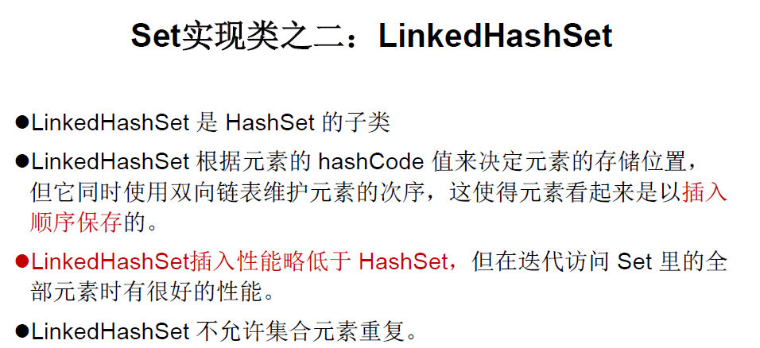

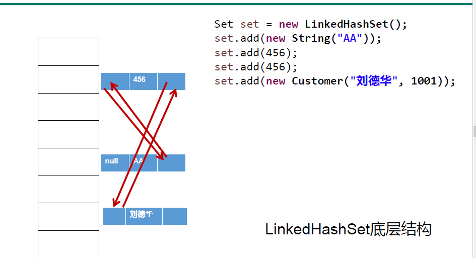


```java

    //LinkedHashSet的使用
    //LinkedHashSet作为HashSet的子类，在添加数据的同时，每个数据还维护了两个引用，记录此数据前一个
    //数据和后一个数据。
    //优点：对于频繁的遍历操作，LinkedHashSet效率高于HashSet
    @Test
    public void test2(){
        Set set = new LinkedHashSet();
        set.add(456);
        set.add(123);
        set.add(123);
        set.add("AA");
        set.add("CC");
        set.add(new User("Tom",12));
        set.add(new User("Tom",12));
        set.add(129);

        Iterator iterator = set.iterator();
        while(iterator.hasNext()){
            System.out.println(iterator.next());
        }
    }
```


### Set实现类之三：TreeSet

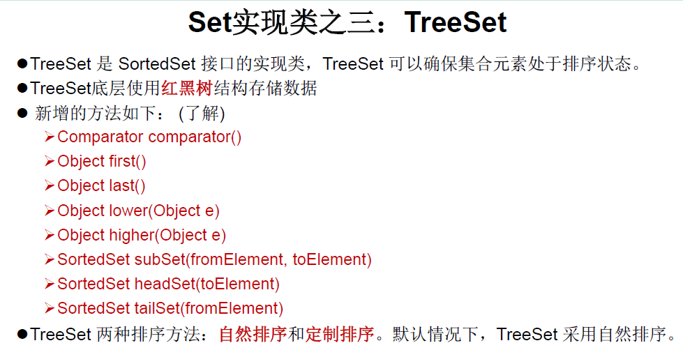

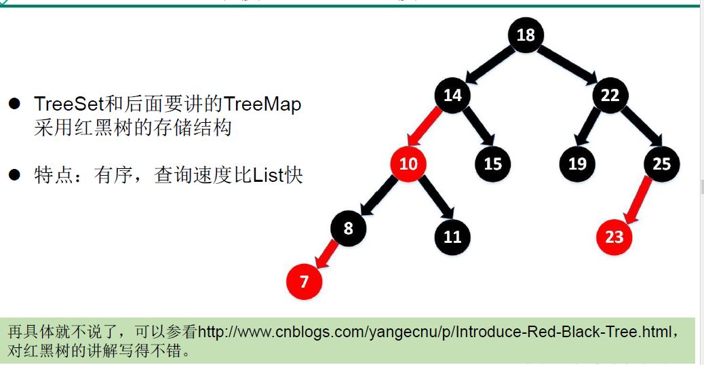

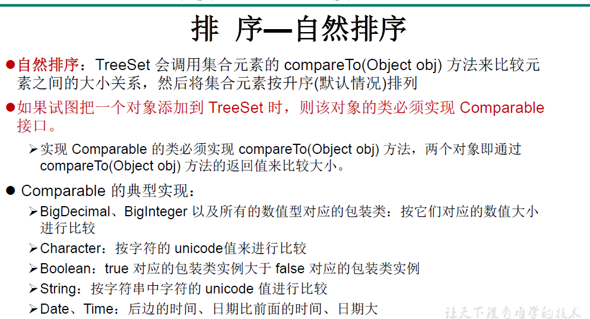

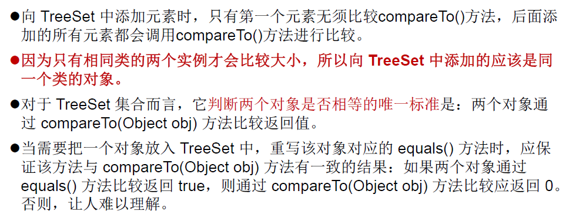

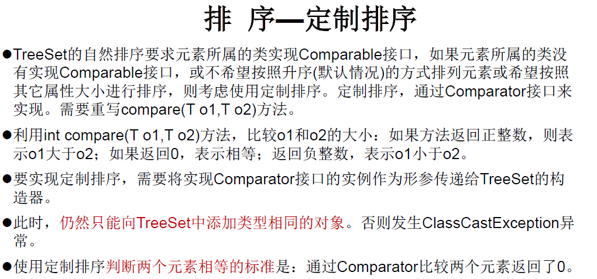

```java
package com.atguigu.java1;

import org.junit.Test;

import java.util.Comparator;
import java.util.Iterator;
import java.util.TreeSet;

public class TreeSetTest {

    /*
    1.向TreeSet中添加的数据，要求是相同类的对象。
    2.两种排序方式：自然排序（实现Comparable接口） 和 定制排序（Comparator）


    3.自然排序中，比较两个对象是否相同的标准为：compareTo()返回0.不再是equals().
    4.定制排序中，比较两个对象是否相同的标准为：compare()返回0.不再是equals().
     */
    @Test
    public void test1(){
        TreeSet set = new TreeSet();

        //失败：不能添加不同类的对象
//        set.add(123);
//        set.add(456);
//        set.add("AA");
//        set.add(new User("Tom",12));

            //举例一：
//        set.add(34);
//        set.add(-34);
//        set.add(43);
//        set.add(11);
//        set.add(8);

        //举例二：
        set.add(new User("Tom",12));
        set.add(new User("Jerry",32));
        set.add(new User("Jim",2));
        set.add(new User("Mike",65));
        set.add(new User("Jack",33));
        set.add(new User("Jack",56));


        Iterator iterator = set.iterator();
        while(iterator.hasNext()){
            System.out.println(iterator.next());
        }

    }

    @Test
    public void test2(){
        Comparator com = new Comparator() {
            //按照年龄从小到大排列
            @Override
            public int compare(Object o1, Object o2) {
                if(o1 instanceof User && o2 instanceof User){
                    User u1 = (User)o1;
                    User u2 = (User)o2;
                    return Integer.compare(u1.getAge(),u2.getAge());
                }else{
                    throw new RuntimeException("输入的数据类型不匹配");
                }
            }
        };
		//通过构造器指定排序方式（定制排序）
        TreeSet set = new TreeSet(com);
        set.add(new User("Tom",12));
        set.add(new User("Jerry",32));
        set.add(new User("Jim",2));
        set.add(new User("Mike",65));
        set.add(new User("Mary",33));
        set.add(new User("Jack",33));
        set.add(new User("Jack",56));


        Iterator iterator = set.iterator();
        while(iterator.hasNext()){
            System.out.println(iterator.next());
        }
    }

}

```


## Map接口

### 概述

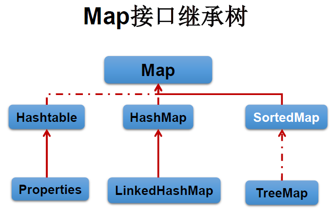

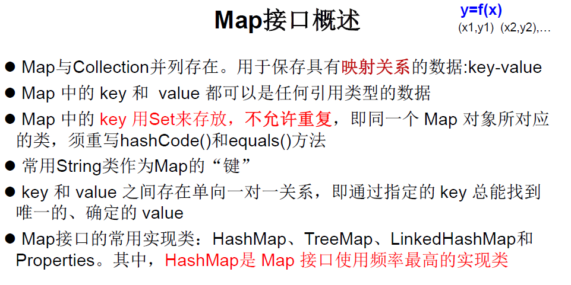


<a href= "https://blog.csdn.net/lkforce/article/details/107617258" >对象添加到HashSet(或HashMap)后修改Hash值(PS:重写后修改属性就会改变hash值)，无法remove的原因</a>

### Map接口常用方法

添加、删除、修改操作：

```java
Object put(Object key,Object value)：将指定key-value添加到(或修改)当前map对象中,并返回被替换的key对应的value，没有发生替换返回null
void putAll(Map m):将m中的所有key-value对存放到当前map中
Object remove(Object key)：移除指定key的key-value对，并返回value
void clear()：清空当前map中的所有数据
```

元素查询的操作：

```java
Object get(Object key)：获取指定key对应的value
boolean containsKey(Object key)：是否包含指定的key
boolean containsValue(Object value)：是否包含指定的value
int size()：返回map中key-value对的个数
boolean isEmpty()：判断当前map是否为空
boolean equals(Object obj)：判断当前map和参数对象obj是否相等
```

元视图操作的方法：

```java
Set keySet()：返回所有key构成的Set集合
Collection values()：返回所有value构成的Collection集合
Set entrySet()：返回所有key-value对构成的Set集合
```

#### 代码及总结

```java
package com.atguigu.java;

import org.junit.Test;

import java.util.*;

/**
 * 一、Map的实现类的结构：
 *  |----Map:双列数据，存储key-value对的数据   ---类似于高中的函数：y = f(x)
 *         |----HashMap:作为Map的主要实现类；线程不安全的，效率高；存储null的key和value
 *              |----LinkedHashMap:保证在遍历map元素时，可以按照添加的顺序实现遍历。
 *                      原因：在原有的HashMap底层结构基础上，添加了一对指针，指向前一个和后一个元素。
 *                      对于频繁的遍历操作，此类执行效率高于HashMap。
 *         |----TreeMap:保证按照添加的key-value对进行排序，实现排序遍历。此时考虑key的自然排序或定制排序
 *                      底层使用红黑树
 *         |----Hashtable:作为古老的实现类；线程安全的，效率低；不能存储null的key和value
 *              |----Properties:常用来处理配置文件。key和value都是String类型
 *
 *
 *      HashMap的底层：数组+链表  （jdk7及之前）
 *                    数组+链表+红黑树 （jdk 8）
 *
 *
 *  面试题：
 *  1. HashMap的底层实现原理？
 *  2. HashMap 和 Hashtable的异同？
 *  3. CurrentHashMap 与 Hashtable的异同？（暂时不讲）
 *
 *  二、Map结构的理解：
 *    Map中的key:无序的、不可重复的，使用Set存储所有的key  ---> key所在的类要重写equals()和hashCode() （以HashMap为例）
 *    Map中的value:无序的、可重复的，使用Collection存储所有的value --->value所在的类要重写equals()
 *    一个键值对：key-value构成了一个Entry对象。
 *    Map中的entry:无序的、不可重复的，使用Set存储所有的entry
 *
 *  三、HashMap的底层实现原理？以jdk7为例说明：
 *      HashMap map = new HashMap():
 *      在实例化以后，底层创建了长度是16的一维数组Entry[] table。
 *      ...可能已经执行过多次put...
 *      map.put(key1,value1):
 *      首先，调用key1所在类的hashCode()计算key1哈希值，此哈希值经过某种算法计算以后，得到在Entry数组中的存放位置。
 *      如果此位置上的数据为空，此时的key1-value1添加成功。 ----情况1
 *      如果此位置上的数据不为空，(意味着此位置上存在一个或多个数据(以链表形式存在)),比较key1和已经存在的一个或多个数据
 *      的哈希值：
 *              如果key1的哈希值与已经存在的数据的哈希值都不相同，此时key1-value1添加成功。----情况2
 *              如果key1的哈希值和已经存在的某一个数据(key2-value2)的哈希值相同，继续比较：调用key1所在类的equals(key2)方法，比较：
 *                      如果equals()返回false:此时key1-value1添加成功。----情况3
 *                      如果equals()返回true:使用value1替换value2。
 *
 *       补充：关于情况2和情况3：此时key1-value1和原来的数据以链表的方式存储。
 *
 *      在不断的添加过程中，会涉及到扩容问题，当超出临界值(且要存放的位置非空)时，扩容。默认的扩容方式：扩容为原来容量的2倍，并将原有的数据复制过来。
 *
 *      jdk8 相较于jdk7在底层实现方面的不同：
 *      1. new HashMap():底层没有创建一个长度为16的数组
 *      2. jdk 8底层的数组是：Node[],而非Entry[]
 *      3. 首次调用put()方法时，底层创建长度为16的数组
 *      4. jdk7底层结构只有：数组+链表。jdk8中底层结构：数组+链表+红黑树。
 *         4.1 形成链表时，七上八下（jdk7:新的元素指向旧的元素。jdk8：旧的元素指向新的元素）
           4.2 当数组的某一个索引位置上的元素以链表形式存在的数据个数 > 8 且当前数组的长度 > 64时，此时此索引位置上的所数据改为使用红黑树存储。
 *
 *      DEFAULT_INITIAL_CAPACITY : HashMap的默认容量，16
 *      DEFAULT_LOAD_FACTOR：HashMap的默认加载因子：0.75
 *      threshold：扩容的临界值，=容量*填充因子：16 * 0.75 => 12
 *      TREEIFY_THRESHOLD：Bucket中链表长度大于该默认值，转化为红黑树:8
 *      MIN_TREEIFY_CAPACITY：桶中的Node被树化时最小的hash表容量:64
 *
 *  四、LinkedHashMap的底层实现原理（了解）
 *      源码中：
 *      static class Entry<K,V> extends HashMap.Node<K,V> {
             Entry<K,V> before, after;//能够记录添加的元素的先后顺序
             Entry(int hash, K key, V value, Node<K,V> next) {
                super(hash, key, value, next);
             }
         }
 *
 *
 *   五、Map中定义的方法：
 添加、删除、修改操作：
 Object put(Object key,Object value)：将指定key-value添加到(或修改)当前map对象中
 void putAll(Map m):将m中的所有key-value对存放到当前map中
 Object remove(Object key)：移除指定key的key-value对，并返回value
 void clear()：清空当前map中的所有数据
 元素查询的操作：
 Object get(Object key)：获取指定key对应的value
 boolean containsKey(Object key)：是否包含指定的key
 boolean containsValue(Object value)：是否包含指定的value
 int size()：返回map中key-value对的个数
 boolean isEmpty()：判断当前map是否为空
 boolean equals(Object obj)：判断当前map和参数对象obj是否相等
 元视图操作的方法：
 Set keySet()：返回所有key构成的Set集合
 Collection values()：返回所有value构成的Collection集合
 Set entrySet()：返回所有key-value对构成的Set集合

 *总结：常用方法：
 * 添加：put(Object key,Object value)
 * 删除：remove(Object key)
 * 修改：put(Object key,Object value)
 * 查询：get(Object key)
 * 长度：size()
 * 遍历：keySet() / values() / entrySet()
 *
 *
 * @author shkstart
 * @create 2019 上午 11:15
 */
public class MapTest {

    /*
 元视图操作的方法：
 Set keySet()：返回所有key构成的Set集合
 Collection values()：返回所有value构成的Collection集合
 Set entrySet()：返回所有key-value对构成的Set集合

     */
    @Test
    public void test5(){
        Map map = new HashMap();
        map.put("AA",123);
        map.put(45,1234);
        map.put("BB",56);

        //遍历所有的key集：keySet()
        Set set = map.keySet();
            Iterator iterator = set.iterator();
            while(iterator.hasNext()){
                System.out.println(iterator.next());
        }
        System.out.println();
        //遍历所有的value集：values()
        Collection values = map.values();
        for(Object obj : values){
            System.out.println(obj);
        }
        System.out.println();
        //遍历所有的key-value
        //方式一：entrySet()
        Set entrySet = map.entrySet();
        Iterator iterator1 = entrySet.iterator();
        while (iterator1.hasNext()){
            Object obj = iterator1.next();
            //entrySet集合中的元素都是entry
            Map.Entry entry = (Map.Entry) obj;
            System.out.println(entry.getKey() + "---->" + entry.getValue());

        }
        System.out.println();
        //方式二：
        Set keySet = map.keySet();
        Iterator iterator2 = keySet.iterator();
        while(iterator2.hasNext()){
            Object key = iterator2.next();
            Object value = map.get(key);
            System.out.println(key + "=====" + value);

        }

    }


    /*
 元素查询的操作：
 Object get(Object key)：获取指定key对应的value
 boolean containsKey(Object key)：是否包含指定的key
 boolean containsValue(Object value)：是否包含指定的value
 int size()：返回map中key-value对的个数
 boolean isEmpty()：判断当前map是否为空
 boolean equals(Object obj)：判断当前map和参数对象obj是否相等
     */
    @Test
    public void test4(){
        Map map = new HashMap();
        map.put("AA",123);
        map.put(45,123);
        map.put("BB",56);
        // Object get(Object key)
        System.out.println(map.get(45));
        //containsKey(Object key)
        boolean isExist = map.containsKey("BB");
        System.out.println(isExist);

        isExist = map.containsValue(123);
        System.out.println(isExist);

        map.clear();

        System.out.println(map.isEmpty());

    }

    /*
     添加、删除、修改操作：
 Object put(Object key,Object value)：将指定key-value添加到(或修改)当前map对象中
 void putAll(Map m):将m中的所有key-value对存放到当前map中
 Object remove(Object key)：移除指定key的key-value对，并返回value
 void clear()：清空当前map中的所有数据
     */
    @Test
    public void test3(){
        Map map = new HashMap();
        //添加
        map.put("AA",123);
        map.put(45,123);
        map.put("BB",56);
        //修改
        map.put("AA",87);

        System.out.println(map);

        Map map1 = new HashMap();
        map1.put("CC",123);
        map1.put("DD",123);

        map.putAll(map1);

        System.out.println(map);

        //remove(Object key)
        Object value = map.remove("CC");
        System.out.println(value);
        System.out.println(map);

        //clear()
        map.clear();//与map = null操作不同
        System.out.println(map.size());
        System.out.println(map);
    }

    @Test
    public void test2(){
        Map map = new HashMap();
        map = new LinkedHashMap();
        map.put(123,"AA");
        map.put(345,"BB");
        map.put(12,"CC");

        System.out.println(map);
    }


    @Test
    public void test1(){
        Map map = new HashMap();
//        map = new Hashtable();
        map.put(null,123);

    }
}

```


### Map实现类之一：HashMap

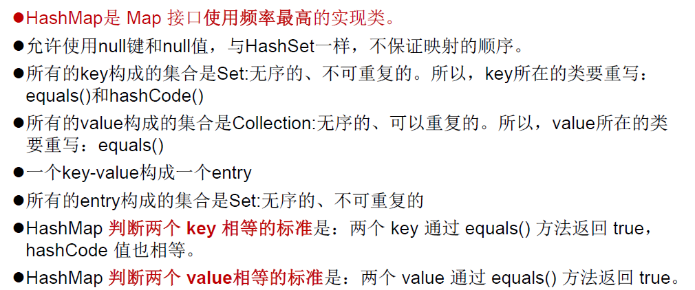


#### 数据结构及源码分析

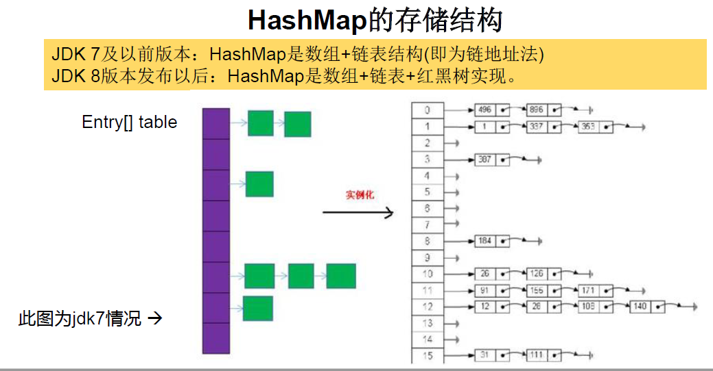

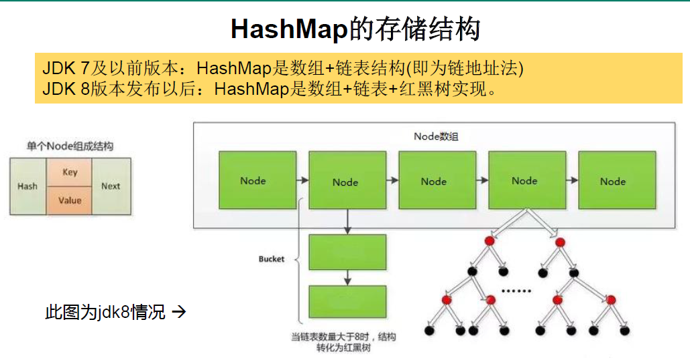

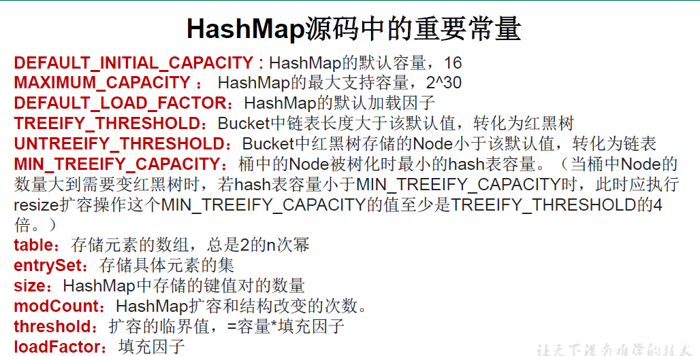

##### 1.8之前

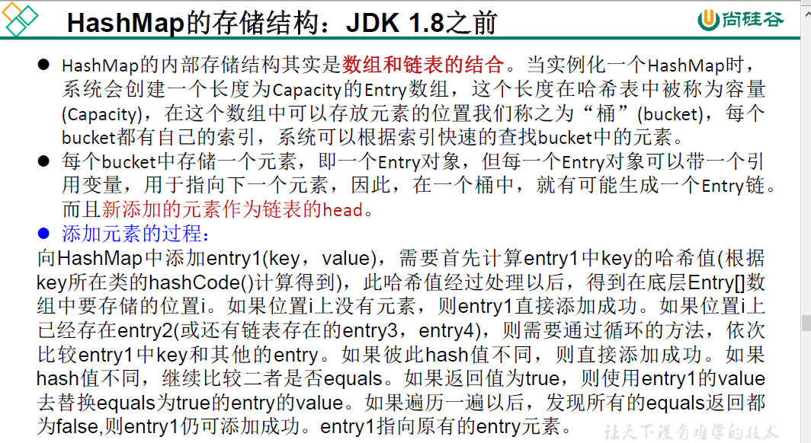

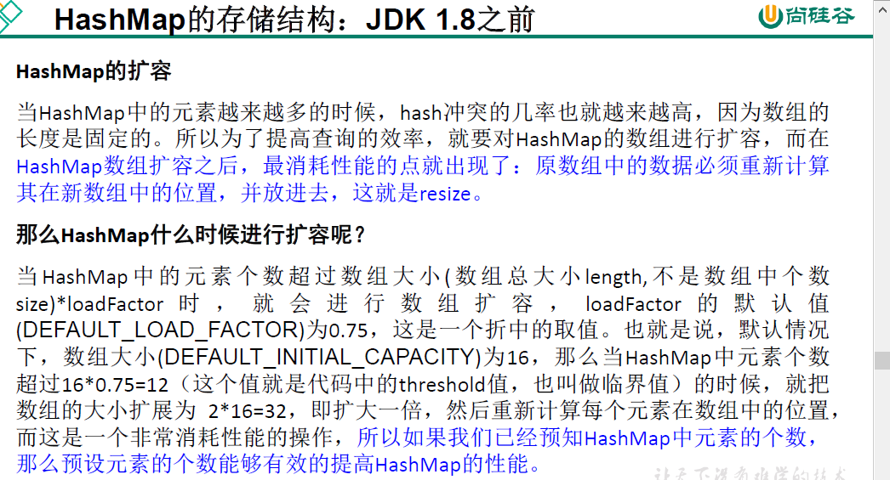


##### jdk1.8


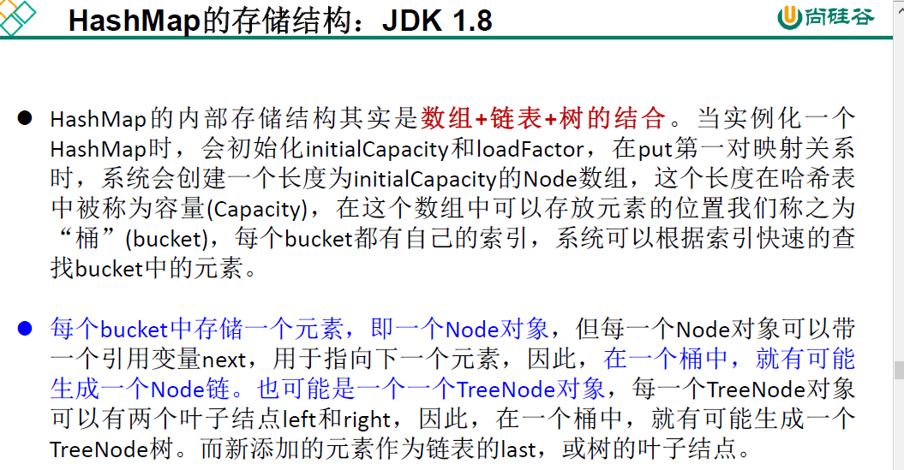

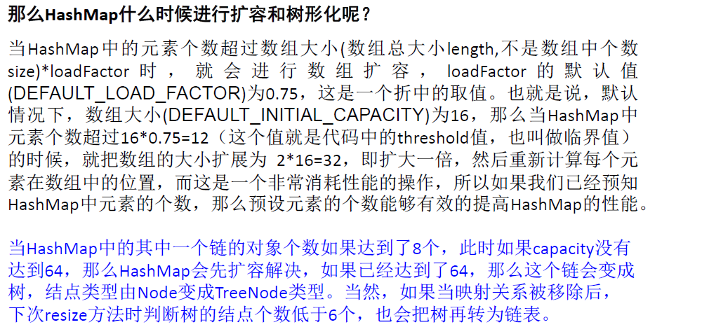

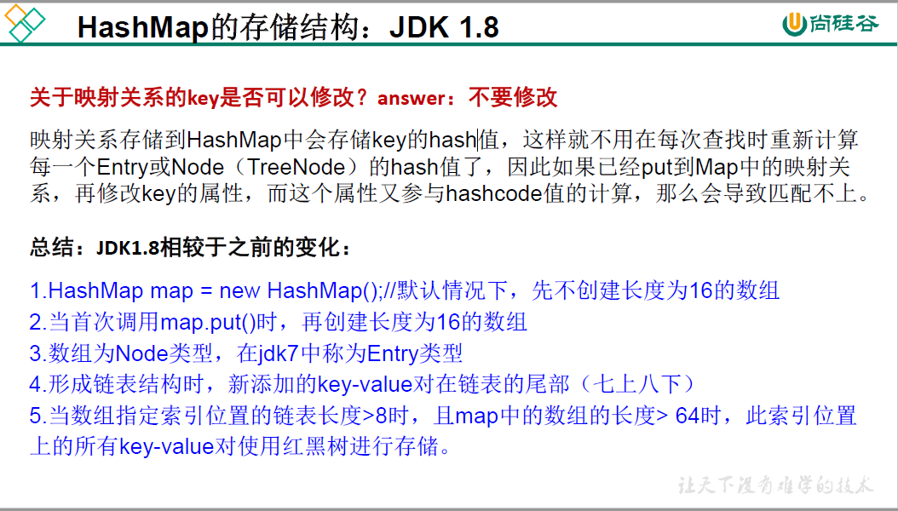


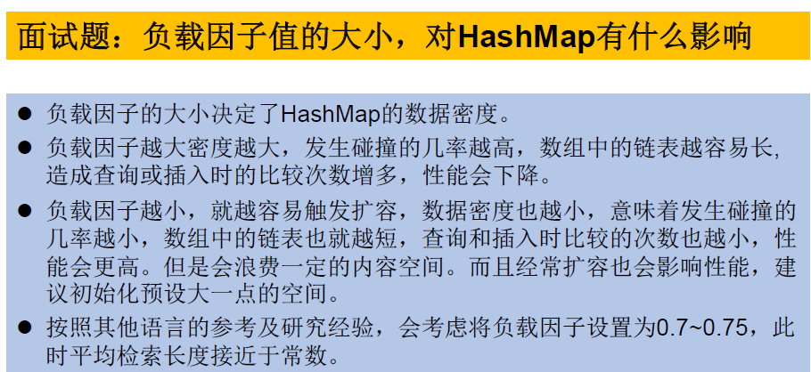

### Map实现类之二：LinkedHashMap

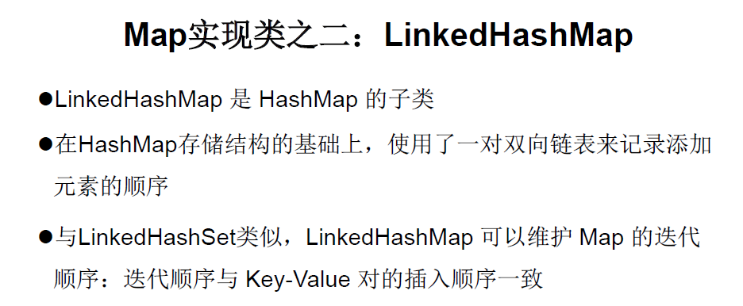

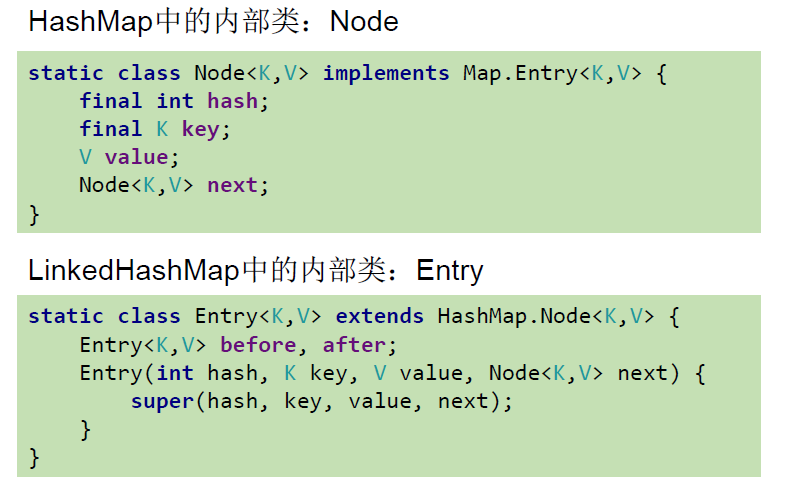

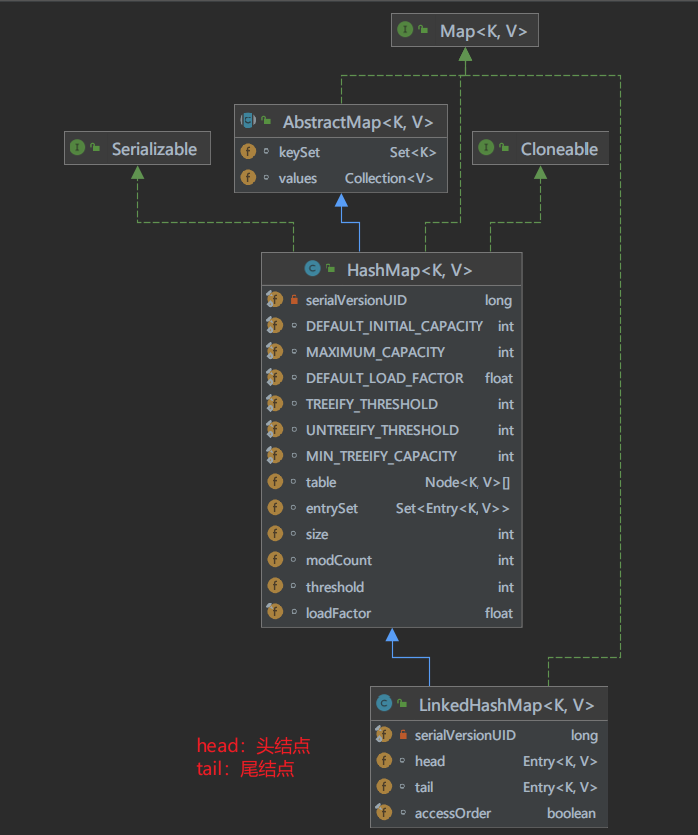

### Map实现类之三：TreeMap

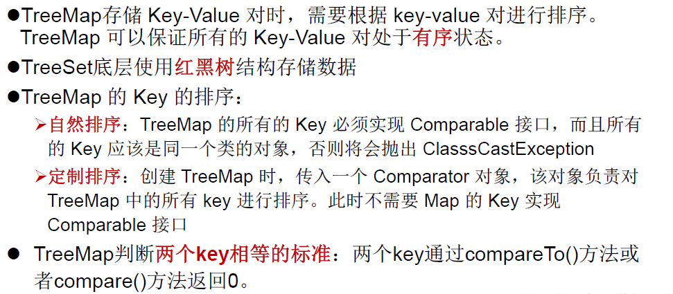

### Map实现类之四：Hashtable

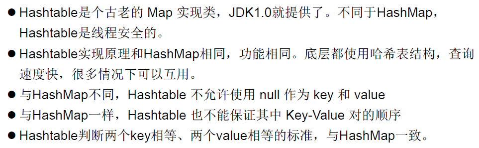

### Map实现类之五：Properties

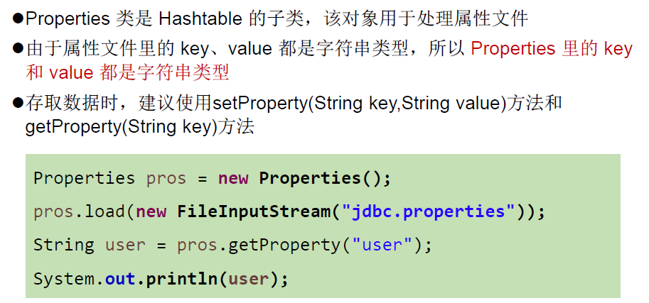

## Collections工具类


