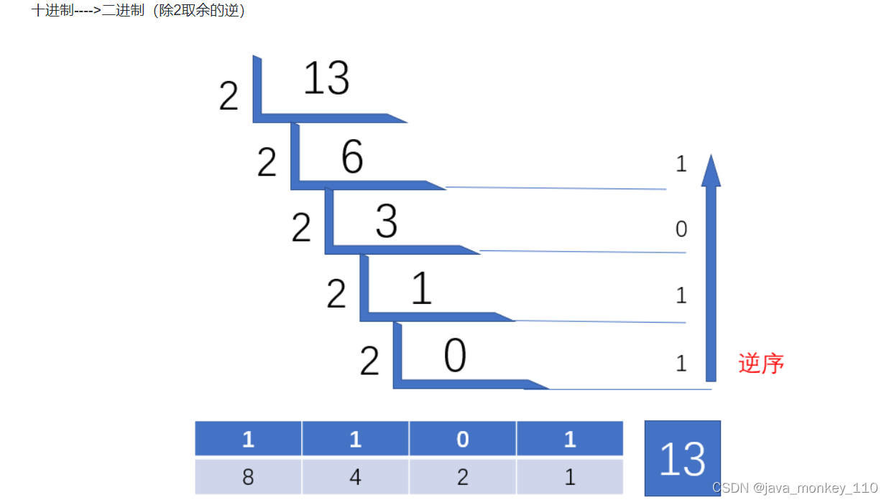

> 本文由 [简悦 SimpRead](http://ksria.com/simpread/) 转码， 原文地址 [www.cnblogs.com](https://www.cnblogs.com/zh94/p/16195373.html)

[原创声明：作者：陈咬金、 博客地址：https://www.cnblogs.com/zh94/](https://www.cnblogs.com/zh94/)

基本概念
====

1、当前常见的 CPU 位数是 32 位和 64 位，所谓 32 位处理器就是一次只能处理 32 位，也就是 4 个字节的数据，而 64 位处理器一次则能处理 64 位，即 8 个字节的数据。关于 64 位处理器 、32 和 64 位含义 、32 和 64 位区别

2、一字节（1Byte）等于 8 位（8bit），位是计算机存储数据的最小单位，也就是计算存储的数据是一系列二进制位信息。每个位用 0 或 1 表示。**（大 B 和小 b 的区别需注意哦）**

3、为什么一个字节是 8 位？ 

现在通用的说法是 8 位可以涵盖所有的字符编码，即 ASCII 编码。但历史上也存在过 4 位或者 7 位为 1Byte 的场景，只是在后续的字符集标准统一中逐渐被 8bit 所替代。除了历史原因之外，还有数据存储的需要（必须要能在一个字节内表示超过 100 种状态，包括常用数字，大小写字母等），再加上早期计算机存储价格昂贵，所以 8bit 也是在当时符合二进制特性的必然结果。1Byte 为何是 8bit、 1Byte 为何是 8bit、 二进制世界秘密

4、二进制加减运算，加法：0+0=0，0+1=1，1+0=1，1+1=10 ，逢 2 进 1。二进制加法、 二进制减法

5、二进制转十进制及十进制转二进制。2、10 进制互相转换

**上述列出了一些基本概念和对应的可参考链接，建议先优先了解一下。尤其是二进制和十进制的互相转换以及二进制的加减法规则，在后面都会具体涉及到。**

机器数、真值
======

人类用十进制完全是因为我们有 10 个手指头。如果有一天你看到一个外星人，它只有 4 个手指头，那么他使用的一定是四进制，如图所示：


如果能看明白上图，说明你已经明白了进制和手指头的关系了。现代的计算机内部使用门电路，它们只能表示 0 或者 1 两个状态。如果计算机是一个人，那么他只有两个手指头，所以它使用二进制。  
是的，就是这样，所谓的进制，实际上并不是什么神秘的东西，只是关于数的一种表示方式而已了。门电路概念

机器数
---

机器数分为：无符号数和有符号数两种。

**一个数在计算机中的二进制表示形式,  叫做这个数的机器数。机器数是带符号的，在计算机用一个数的最高位存放符号， 正数为 0，负数为 1。**

比如，十进制中的数 +3 ，计算机字长为 8 位，转换成二进制就是 00000011。

如果是 -3 ，就是 10000011 。那么，这里的 00000011 和 10000011 就是机器数。

真值
--

所有数字在计算机底层都以[二进制]形式存在。最高位表示符号位，java中不存在类似于C语言中的 unsigned 类型

因为第一位是符号位，所以机器数的形式值就不等于真正的数值。

例如上面的有符号数 10000011，其最高位 1 代表负，其真正数值是 -3 而不是形式值 131（10000011 转换成十进制等于 131）。

所以，为区别起见，将带符号位的机器数对应的真正数值称为机器数的真值。

例：

```
0000 0001 的真值 = +000 0001 = +1
1000 0001 的真值 = –000 0001 = –1
```

对于整数，有四种表示方式：

*   二进制 (binary)：0,1 ，满 2 进 1. 以 **0b 或 0B** 开头。
*   十进制 (decimal)：0-9 ，满 10 进 1。
*   八进制 (octal)：0-7 ，满 8 进 1. 以数字 0 开头表示。
*   十六进制 (hex)：0-9 及 A-F，满 16 进 1. 以 **0x 或 0X 开头**表示。此处的 A-F 不区分大小写。如：0x21AF +1= 0X21B0

```java
public static void main(String[] args) {
        int num1 =0b110;
        int num2=110;
        //int num3=0128;//0开头表示八进制，0-7
        int num3 = 0130;
        int  num4=0x110A;

        System.out.println(num1);//6
        System.out.println(num2);//110
        System.out.println(num3);//88
        System.out.println(num4);//4362

    }
```


--------

原码、反码、补码
========

为了妥善的处理数据运算过程中符号位的问题，于是就产生了把符号位和数值位一起编码起来表示相应的数的各种表示方法。例如我们熟悉的原码、反码、补码、移码等。通常将未经编码的数称为真值，编码后的数称为机器数或者机器码。

**计算机当前所使用的机器数是采用的补码的方式**。在探求为何机器要使用补码之前, 让我们先了解原码, 反码和补码的概念。对于一个数, 计算机要使用一定的编码方式进行存储， 原码, 反码, 补码是机器存储一个具体数字的编码方式。

原码
--

原码就是符号位加上真值的绝对值, 即用第一位表示符号, 其余位表示值. 比如如果是 8 位二进制:

```
[+1]原 = 0000 0001
[-1]原 = 1000 0001
```

第一位是符号位. 因为第一位是符号位, 所以 8 位二进制数的取值范围就是:

```
[01111111，11111111]
```

转换为真值后即：

```
[127，-127 ]
```

原码是人脑最容易理解和计算的表示方式。原码也可以理解为最原始的机器码。

反码
--

反码的表示方法是：  
正数的反码是其本身，  
负数的反码是在其原码的基础上, 符号位不变，其余各个位取反。

```
[+1] = [00000001]原 = [00000001]反

[-1] = [10000001]原 = [11111110]反
```

可见如果一个反码表示的是负数, 人脑无法直观的看出来它的数值. 通常要将其转换成原码再计算。

补码
--

补码的表示方法是:  
正数的补码就是其本身，  
负数的补码是在其原码的基础上, 符号位不变, 其余各位取反, 最后 + 1. (即在反码的基础上 + 1)。

```
[+1] = [00000001]原 = [00000001]反 = [00000001]补
[-1] = [10000001]原 = [11111110]反 = [11111111]补
```

对于负数, 补码表示方式也是人脑无法直观看出其数值的. 通常也需要转换成原码在计算其数值。

互相转换、注意事项
---------

进制的基本转换

*   十进制 二进制互转
    *   二进制转成十进制 乘以 2 的幂数
    *   十进制转成二进制 除以 2 取余数
*   二进制 八进制互转（`3个二进制 -> 1位8进制 111-> 07`）
*   二进制 十六进制互转（`4个二进制 -> 1位16进制 1010 -> 0xA`）

取余法  



------------------------------------------------------------------------------------------


注意：我们在最初的基本概念中提到了二进制和十进制的转换方式。但是需要知道的是，一个数在计算机中的二进制表示方式叫做机器数。

而机器数是有符号的，我们将对应的最高位存放符号，0 位正数，1 位负数。所以机器数并不等于二进制。

由此我们才引出了真值的概念，例如：符号数 10000011，在十进制中对应的值为 131，但是在机器数中，由于 1 表示负数，所以其真正数值是 - 3，而并不是 131。

符号数：10000011，我们需要先消除其符号位的影响，将其调整为正数：00000011，此时将正数转换为 10 进制为 3，然后再加上最初的符号位表示负数，所以为 - 3。

**需知道的是，二进制仅是以 2 为基数的计数方式而已，在二进制中是无法区分正数和负数的。而如果想区分正数和负数那么必须在二进制的最高一位中用 0 和 1 来表示符号以此来表示正负。那么此时最高位的 0 和 1 已经不是二进制的一种计数方式了，而只是一种符号的标识，该符号的标识则是万万不可以直接参与二进制的计算的。**

**当我们用最高位中的 0 和 1 来表示正负时，此时该二进制的数已经不再是符合二进制规则的数了，而是机器数。**

二进制仅仅是以 2 为基数的计算方式，此时最高位的值已经不再是通过 2 位基数的计算方式而计算出来的，而只是一个表示正负的标识了，所以此时该数值则已经不再是符合二进制规则的数了，而是机器数。

所以，也只有机器数才可以表示正负。而机器数所对应得到的结果则是真数，而并不是 10 进制数。

如果此时抛出来一个问题：10000011 转换为对应的 10 进制，那么对应的结果则是 131，但如果是转换为真数，则是 - 3。同样的，如果是将 00000011 转换为对应的 10 进制，则是 3，而如果转换为真数，则也是 3。

所以当我们看到一个以 8 位数所表示的二进制数时，则一定要确认该二进制数是表示机器数，还是二进制数？是转换为 10 进制数，还是真数。其中最大的区别则是，最高的符号位到底是参与二进制的运算，还是仅仅表示符号位。

机器数转真数：  
10000011 > 消除最高位 1 的影响先转为正数 > 00000011 > 再将该正数以二进制的方式转为十进制为 > 3 > 此时再将最初的符号添加回来 > 3 调整为 - 3。

二进制数转 10 进制数：  
10000011 > 无需消除最高位 1 的影响直接转为正数 > 10000011 > 再将该正数以二进制的方式转为十进制为 > 131 > 无需添加符号位 > 131 仍然为 131。

所以可知，真数和 10 进制数最大的区别则是是否忽略最高位，在确认完是否忽略最高位，得到最初的正数后，该正数的计算方式，则和二进制转十进制的方式完全相同。其实就是二进制转十进制。哈哈。

那么在注意了二进制数和机器数以及十进制数和真数的区别之后。我们则需要注意的另外一个问题则是：

机器数是包含原码、反码、补码。其中三者之间是可以互相转换的。原码转反码转补码，这块上面已经说明过了，而补码则也可以通过想反的方式重新转换为原码。

而此处需要知晓的则是，反码和补码当然是不可以直接转为真数的，而必须要通过原码才可以进行转换。

这个其实也没什么问题，毕竟原码经过层层转换后得到补码，而补码又可以直接转换为真数，当然不可能了。

接下来则是，为什么原码需要转换为补码，为什么原码不是计算机的计算方式，而是补码？

为什么补码才是计算机的真正计算方式
-----------------

现在我们知道了计算机可以有三种编码方式表示一个数. 对于正数因为三种编码方式的结果都相同:

```
[+1] = [00000001]原 = [00000001]反 = [00000001]补
```

所以不需要过多解释. 但是对于负数:

```
[-1] = [10000001]原 = [11111110]反 = [11111111]补
```

可见原码, 反码和补码是完全不同的. 既然原码才是被人脑直接识别并用于计算表示方式, 为何还会有反码和补码呢?

首先, 因为人脑可以知道第一位是符号位, 在计算的时候我们会根据符号位, 选择对真值区域的加减。  
但是对于计算机, 加减乘数已经是最基础的运算, 要设计的尽量简单. 计算机辨别 "符号位" 显然会让计算机的基础电路设计变得十分复杂! 于是人们想出了将符号位也参与运算的方法. 我们知道, 根据运算法则减去一个正数等于加上一个负数, 即: 1-1 = 1 + (-1) = 0 , 所以机器可以只有加法而没有减法, 这样计算机运算的设计就更简单了。

于是人们开始探索 将符号位参与运算, 并且只保留加法的方法. 首先来看原码:  
计算十进制的表达式: 1-1=0

```
1 - 1 = 1 + (-1) = [00000001]原 + [10000001]原 = [10000010]原 = -2
```

如果用原码表示, 让符号位也参与计算, 显然对于减法来说, 结果是不正确的. 这也就是为何计算机内部不使用原码表示一个数。  
为了解决原码做减法的问题, 出现了反码：  
计算十进制的表达式: 1-1=0

```
1 - 1 = 1 + (-1) = [0000 0001]原 + [1000 0001]原= [0000 0001]反 + [1111 1110]反 = [1111 1111]反 = [1000 0000]原 = -0
```

发现用反码计算减法, 结果的真值部分是正确的. 而唯一的问题其实就出现在 "0" 这个特殊的数值上. 虽然人们理解上 + 0 和 - 0 是一样的, 但是 0 带符号是没有任何意义的. 而且会有 [0000 0000] 原和 [1000 0000] 原两个编码表示 0。

于是补码的出现, 解决了 0 的符号以及两个编码的问题：

```
1-1 = 1 + (-1) = [0000 0001]原 + [1000 0001]原 = [0000 0001]补 + [1111 1111]补 = [0000 0000]补=[0000 0000]原
```

这里说明一下，二进制想加：0000 0001+1111 1111 = 1 0000 0000，但由于是 8 位数，所以最终的值为 0000 0000。

**这样 0 用 [0000 0000] 表示, 而以前出现问题的 - 0 则不存在了. 而且可以用 [1000 0000] 表示 - 128:**

```
(-1) + (-127) = [1000 0001]原 + [1111 1111]原 = [1111 1111]补 + [1000 0001]补 = [1000 0000]补
```

**由于我们使用原码来表示正时，最大值为：01111111，最小值为：11111111，所以直接转换为对应的 10 进制后的结果为，127，-127。  
而此处使用补码后，由于补码的规则是，首位不变，其它反转，并 + 1。所以 (-1)+(-127) 刚好为 - 128。**

使用补码, 不仅仅修复了 0 的符号以及存在两个编码的问题, 而且还能够多表示一个最低数. 这就是为什么 8 位二进制, 使用原码或反码表示的范围为 [-127, +127], 而使用补码表示的范围为 [-128, 127]。

因为机器使用补码, 所以对于编程中常用到的 32 位 int 类型, 可以表示范围是: [-2 的 31 次方, 2 的 31 次方 - 1] 因为第一位表示的是符号位. 而使用补码表示时又可以多保存一个最小值。

**Amazing，我们在上面最初使用原码进行加法运算时，由于我们人脑还需要先判断一下最高位的符号后，才能进行二进制运算，然后再添加上对应的符号位。而采用补码后，直接将对应的符号位也参与运算，将补码的数值直接相加，得到的竟然刚好也就是二进制转换后的结果。这样一来，计算机的基础电路设计就可以更加简单，而无需关注符号位的问题，仅需要按照二进制的加法法则执行即可。简直完美。所以这也是补码作为计算机的真正计算方式的原因之一！**

但，补码后所得到的值想加刚好就是直接二进制的值相加后的结果，真的是就刚好这么巧吗？其实不然，背后还蕴含这很有意思的数学原理，详情可参考：  
[深入理解原码、补码](https://www.jianshu.com/p/ffc97c4d2306) & [数的机器码表示](https://www.cnblogs.com/delongzhang/p/12525737.html) & [机器码原理](https://blog.csdn.net/alinyua/article/details/79702879) & [原码、补码原理](https://www.cnblogs.com/zhangziqiu/archive/2011/03/30/computercode.html)

位运算
===

文章最顶部基本概念处列到了 “10 进制 2 进制互转”，以及“2 进制加减法” 对应的相关链接。  
此处再推荐几个在线计算的网址，便于将自己的计算结果进行二次验证：  
[在线原码、补码、10 进制互转](https://www.23bei.com/tool-56.html) 

 [在线进制转换](https://tool.oschina.net/hexconvert/) 

 [在线二进制加减法](https://www.99cankao.com/digital-computation/binaryarith.php)

接下来则开始涉及到位运算了。

概念
--

什么是位运算？我们先来看下百度百科的概念：

```
程序中的所有数在计算机内存中都是以二进制的形式储存的。位运算就是直接对整数在内存中的二进制位进行操作。
```

百度百科中所给的解释是具备歧义性的，按照百度百科的解释，直接对整数在内存中的二进制位进行操作就是位运算的话，那么使用二进制数进行算术运算法（+，-，*，/ ）岂不是也属于位运算？

我们再来看下维基百科所给的概念解释：

```
位操作是程序设计中对位模式或二进制数的一元和二元操作。在许多古老的微处理器上，位运算比加减运算略快，通常位运算比乘除法运算要快很多。在现代架构中，情况并非如此：位运算的运算速度通常与加法运算相同（仍然快于乘法运算）。
```

维基百科中针对位运算的概念相对合理，通过维基百科中的概念我们可以很明显的区分到，位运算是和加减乘除这些算数运算符是不同的。不同的 CPU 针对位运算的操作是较快于 (乘 / 除) 法运算的。

**所以这也才是我们需要了解位运算的真正原因，那就是 CPU 处理器针对位运算符的计算是快于算术运算符的！在特定的编码场景下使用位运算的执行速率则是远远大于算术运算的！**

```
网络上针对位运算较多的内容解释是：位运算是直接对整数在内存中的二进制位进行操作，所以位运算更加节省内存、提高运算效率等等的。其实这是很不严谨的说法，很容易误导大家对位运算的理解，因为所有的整数最终在计算机中都是二进制数，那么所有对整数的运算岂不是都是位运算？当然不是啦。且，位运算真正快的原因也并不是因为节省内存，而主要是因为CPU对位运算的支持！和内存并没有较大关联。
```

为何位运算 CPU 执行速率更快
----------------

程序中的基本运算包含：

*   算术运算：加、减、乘、除、取余
*   按位运算：按位或 “|”、按位与 “&”、按位取反 “~”、按位异或 “^”
*   移位运算：左移 x<<k；右移 x>>k

其中按位运算和移位运算均属于位运算的范畴。

位运算的具体执行逻辑，我们下面会详细说明。这里先以位运算中的 与 运算符 “&” 来简单说明下位运算的主要执行逻辑：  
& 与运算符的运算规则是：两个位都为 1 时，则结果为 1。如：3&5 即 0000 0011& 0000 0101 = 0000 0001，因此 3&5 的值得 1。

根据与运算符的规则可知，位运算的整体执行逻辑实际是较为简单的，更多的是进行位数的比较，从而得到一个结果，这种较为简单的运算逻辑，则对于 CPU 处理器来说，在电路的设计中则也会更加简单许多，以下为与运算符所涉及到的 CPU 电路图：


而对于一个除法来说呢，在 CPU 中所对应的电路图设计则是这样的：


可以看到，整个 CPU 电路图的设计复杂了不止一个层级，所以这也就是为何位运算比我们人常用的算术运算更快的直接原因了。因为对于整个 CPU 的执行逻辑来说从设计层面就复杂了很多。

当然，提到 CPU 的电路图设计，就不得不提到对应的 CPU 中晶体管的特性了，而晶体管中所涉及到的开关（01）的特性也就构成了逻辑电路，从而构成了与门、或门、非门、异或门等电路特性。  
这块内容，可以参考如下链接：  
[位运算中隐藏的 CPU 秘密](https://cloud.tencent.com/developer/article/1888845)  
[程序中的位运算于基本电路关系](https://blog.csdn.net/weixin_29199873/article/details/112593631)  
[程序中位运算于基本电路 - 知乎](https://zhuanlan.zhihu.com/p/162068578)  
[四位计算机的原理及实现](https://www.ruanyifeng.com/blog/2011/03/4-bit_computer.html)  
[位运算的理解](https://icode.best/i/71527842038806)  
[程序中的取余是如何实现的](https://www.zhihu.com/question/21070971)  
[二进制乘除法的实现](https://blog.csdn.net/xiangwanpeng/article/details/78083623)

CPU 中的电路设计和数学的算法实现有着很精妙的联系，计算机前辈的力量是无穷的。那到了这里，我们也就知道了程序中基本运算在执行速率上的真正差别实际上是在 CPU 这一层级的，了解了这些之后，我们也就可以接着开始说明位运算符的真正执行逻辑了。  
（位运算仅需进行 01 的比较，和移位等简单的逻辑操作，基本上和直接执行二进制的相加规则一样，在电路设计和逻辑上均更加简单，而乘除求余则在电路的设计中较为复杂）

位运算符
====

首先需知道的是，计算机中执行位运算，肯定是采用的补码的方式进行的位计算哦，所以对于真值为负数的情况下，必须先转为补码才能进行计算。

<table><thead><tr><th>符号</th><th>描述</th><th>运算规则</th></tr></thead><tbody><tr><td>&amp;</td><td>与</td><td>两个位都为 1 时，结果才为 1</td></tr><tr><td>|</td><td>或</td><td>两个位都为 0 时，结果才为 0</td></tr><tr><td>^</td><td>异或</td><td>两个位相同为 0，相异为 1</td></tr><tr><td>~</td><td>取反</td><td>0 变 1，1 变 0</td></tr><tr><td>&lt;&lt;</td><td>左移</td><td>各二进位全部左移若干位，高位丢弃，低位补 0</td></tr><tr><td>&gt;&gt;</td><td>右移</td><td>各二进位全部右移若干位，对无符号数，高位补 0。各编译器处理方法不一样，有的补符号位（算术右移），有的补 0（逻辑右移）</td></tr></tbody></table>

`& 与`运算符
------

运算规则：两位同时为 1，结果才为 1，否则结果为 0。

```
0&0=0  0&1=0  1&0=0  1&1=1
```

例如：2 & -2


注意：负数当然是按照补码的方式来进行位计算哦。

### & 与运算符的用途：

根据与运算符的计算特性，我们常用的使用方式有：  
**1、判断奇偶数**  
我们知道，按照二进制和十进制（除二取余）的换算方式，如果是偶数的情况下，换算为二进制后**末位**必然是 0，如果是奇数则末位为 1。比如：2 >10 ，3 > 11，100 >1100100，121 > 1111001。

所以，我们按照与运算符的运算规则，**使用 if(a & 1)1 表示为奇数，if(a & 1)0，则表示为偶数。**  
如：  
121 & 1 = 1111001 & 0000001 = 0000001  
2 & 1 =10 & 01 =00

使用与运算符的方式，则完全可以替代掉：if (a % 2 == 0) 来判断奇偶数的方式，且位运算符由于 CPU 的支持，执行效率也更高。

关于二进制转十进制的方式，参考基本概念中 URL 即可。

**2、取一个数的指定位**  
比如取数 X=1010 1110 高 4 位，只需要另外找一个数，令 Y 的高 4 位为 1，其余位为 0，即 Y=1111 0000，然后将 X 和 Y 进行与运算，（X & Y = 1010 1110 & 1111 0000 = 1010 0000）即可得到 X 的指定高 4 位。

如果想获取 X 的低 4 位的数，则将 Y 的低 4 位为 1，其余位数为 0 即可，（X & Y=1010 1110 & 0000 1111=0000 1110）便可得到 X 的指定低 4 位。

`| 或` 运算符
-------

运算规则：两个位都为 0 时，则结果为 0。否则则为 1。

```
0|0=0  0|1=1  1|0=1  1|1=1
```

例如：2 | -2 =-2


### | 或运算符的用途

首先与和或是两个相反的概念，所以上述所提到的与的用途，在这里只要略作改造就也适合于或运算符。但是  
目的是一样的，所以对应相同用途的场景，这里不再赘述。

**1、常用来对一个数据的某些位设置为 1**  
比如将数 X=1010 1110 的低 4 位设置为 1，只需要另找一个数 Y，令 Y 的低 4 位为 1，其余位为 0，即 Y=0000 1111，然后将 X 与 Y 进行按位或运算（X|Y=1010 1111）即可得到。

同样的，使用 & 运算符，则可以方便的将某些位设置为 0，如上述的 X & Y，将 X 的低 4 位设置为 0，则  
X & Y = 1010 1110 & 1111 0000 = 1010 0000。

以上则说明 & 和 | 灵活运用，其实是可以达到相同效果的。但实际使用中则并不然，首先对于上述低 4 位设置为 1 的场景，我们只需要找一个 Y 的数，令 Y 的低 4 位为 1，其余位为 0，这样一个数是很好找的，是一个固定的数，比如：15。转换为二进制后为 1111。

但如果使用 & 运算符来面对这个场景，则需要找一个 Y，Y 的第四位为 0，其余位置为 1，这样一个数则很难找，并且随着位数的不同，值也是不断变换的，比如：1111 0000=240，但如果是 12 位数，1111 1111 0000=4080。所以如果使用 & 运算符来在该场景下则是没有 | 运算符更加方便的。

尽管 & 和 | 的规则相反，可灵活变更，但针对特定场景下，还是使用特定的运算符效果更佳 O。

`^ 异或`运算符
-------

运算规则：两个位相同为 0，相异为 1。

```
0^0=0  0^1=1  1^0=1  1^1=0
```

例如：2 ^ -2


### ^ 异或运算符用途

1、交换两个数

```
a=a^b;      //a=a^b
b=a^b;      //b=(a^b)^b=a^0=a
a=a^b;      //a=(a^b)^(a^b^b)=0^b=0
```

交换两个数的原理，即上面注释所写内容。

不使用位运算的方式交换两个数，则需要定义一个中间变量 C，来承接其中的一个数的交换，对于 Java 来说，定义一个新的 Int 变量 C，则表示内存中需开辟一个 4 字节的空间。

所以根据服务特性来选择合适的方式即可，对内存使用率有强要求则使用位运算，没要求则都可以。

```
static void swap(int a, int b) {    int c = a;    a = b;    b = c;}

static void swapBit(int a, int b) {    a = a ^ b;    b = a ^ b;    a = a ^ b;}
```

`~ 取反`运算符
-------

运算规则：0 变 1，1 变 0。


`<< `左移运算符
--------

运算规则：将一个运算对象的各二进制位全部左移若干位（左边的二进制位丢弃，右边补 0）。

设 a=15，即二进制数 00001111，左移 2 位得 00111100，即十进制数 60。

**左移一位相当于该数乘以 2，左移 2 位相当于该数乘以 2^2=4。上面举的例子 15<< 2=60，即乘了 4。  
（结论：左移 n 位等于乘以 2 的 n 次方）**

设 a=-46，补码后为，1010 1110，a = a<< 2 将 a 的二进制位左移 2 位、右补 0，即得 a=1011 1000，转换为真值后为 - 56。

设 a=110，补码后为：0110 1110，a = a<<2 将 a 的二进制位左移 2 位，右补 0，即得 a=1011 1000，转换为真值后为 184。

**以此可知，左移 n 位等于乘以 2 的 n 次方，该结论仅适用于该数左移时被溢出舍弃的高位中不包含 1 的情况，如果溢出的高位中包含 1，则不符合上述结论。**

`>>` 右移运算符
--------

运算规则：将一个数的各二进制位全部右移若干位，正数左补 0，负数左补 1，右边丢弃。  
例如：a=a>>2 将 a 的二进制位右移 2 位，左补 0 或者 左补 1 需要看被移数是正还是负。

设 a=16，补码后为 00010000，a = a<<2 将 a 的二进制位右移 2 位，左边补 0，即得 a=00000100，转换为真值后为 4。

设 a=-16，补码后为 11110000，a = a<<2 将 a 的二进制位右移 2 位，左边补 1，得到 a=11111100，转换真值后为 - 4。

结论：右移运算符，操作数每右移一位，相当于该数除以 2。


运算规则总结
----

<table><thead><tr><th>符号</th><th>解释</th><th>运算规则</th></tr></thead><tbody><tr><td>&lt;&lt;</td><td>左移</td><td><code onclick="mdcp.copyCode(event)">空位补0：被移除的最高位丢弃，空缺位补0。</code></td></tr><tr><td>&gt;&gt;</td><td>右移</td><td><code onclick="mdcp.copyCode(event)">根据被移除的最高位不同【即符号位】</code><br><code onclick="mdcp.copyCode(event)">最高位0，右移后，空缺位补0；</code><br><code onclick="mdcp.copyCode(event)">最高位1，右移后，空缺位补1</code>；</td></tr><tr><td>&gt;&gt;&gt;</td><td>无符号右移</td><td><code onclick="mdcp.copyCode(event)">被移除的最高位无论是0还是1，空缺位都用0补。</code></td></tr><tr><td>&amp;</td><td>与</td><td><code onclick="mdcp.copyCode(event)">二进制位进行&amp;运算，只有1&amp;1时结果是1，否则是0；</code></td></tr><tr><td>|</td><td>或</td><td><code onclick="mdcp.copyCode(event)">二进制位进行|运算，只有0|0时结果是0，否则是1；</code></td></tr><tr><td>^</td><td>异或</td><td><code onclick="mdcp.copyCode(event)">相同二进制位进行^运算，结果是0；1^1=0，0^0=0</code><br><code onclick="mdcp.copyCode(event)">不相同二进制位^运算结果是1。1^0=1，0^1=1</code></td></tr><tr><td>~</td><td>取反</td><td><code onclick="mdcp.copyCode(event)">正数取反，各二进制码按补码各位取反</code><br><code onclick="mdcp.copyCode(event)">负数取反，各二进制码按补码各位取反</code></td></tr></tbody></table>

#### 运算过程：

```java
@Test
    public  void testBit() {
        // 正数 : 原码 反码 补码 一样
        // 负数数 : 补码=反码 + 1  【符号位始终保持不变】
      /*
         -10  运算转换成int
         原码：10000000 00000000 00000000 00001010
         反码: 11111111 11111111 11111111 11110101
         补码: 11111111 11111111 11111111 11110110 计算机底层保存
        */

        /* ------------------------------[-10 >> 2]-----------------------------------------
            [-10补码]       1 1111111 11111111 11111111 11110110
            补码>> 2运算后   1 1111111 11111111 11111111 11111101   考虑符号位，负数补1，正数补0
                    -1     1 1111111 11111111 11111111 11111100
             取反得到结果    1 0000000 00000000 00000000 00000011   结果十进制-3
         */
        System.out.println(-10 >> 2);// -3
        /*----------------------------[10 >> 2]-------------------------------------------
            10   00000000 00000000 00000000 00001010[原码,反码,补码]

           [补码]    00000000 00000000 00000000 00001010
            >> 2    00000000 00000000 00000000 00000010
                                       [补码还原]    -> 2
         */
        System.out.println(10 >> 2);// 2

        /*------------------------------[-10 << 2]-----------------------------------------
            [-10补码]       1 1111111 11111111 11111111 11110110
            补码<<2运算后    1 1111111 11111111 11111111 11011000   考虑符号位，负数补1，正数补0
                    -1     1 1111111 11111111 11111111 11010111
             取反得到结果    1 0000000 00000000 00000000 00101000   结果十进制-10
         */
        System.out.println(-10 << 2 );//-40
        /*-----------------------------[10 >> 2]------------------------------------------
            10   00000000 00000000 00000000 00001010[原码,反码,补码]

           [补码]    00000000 00000000 00000000 00001010
            << 2    00000000 00000000 00000000 00101000
                                       [补码还原]    -> 40
         */
        System.out.println(10 >> 2);// 40


        /* -------------------------[ -10 >>>2]----------------------------------------------
        -10补码         1 1111111 11111111 11111111 11110110
        补码>>>2运算后   0 0111111 11111111 11111111 11111101考虑符号位，负数补1，正数补0
        最高位0，反码一致 0 0111111 11111111 11111111 11111101
        最高位0，补码一致 0 0111111 11111111 11111111 11111101   结果十进制1073741821
         */
        System.out.println(-10 >>> 2);//1,073,741,821
        /* -------------------------[ 10 >>>2]----------------------------------------------
        10补码          0 0000000 00000000 00000000 00001010
        补码>>>2运算后   0 0000000 00000000 00000000 00000010
        最高位0，反码一致 0 0000000 00000000 00000000 00000010
        最高位0，补码一致 0 0000000 00000000 00000000 00000010   结果十进制1073741821
         */
        System.out.println(10 >>> 2);//2

       /*-------------------------- & | ^ ~ --------------------------------------
              原码           反码          补码
         -3   1000 0011     1111 1100     1111 1101
         10   0000 1010     0000 1010     0000 1010
         */

        // 1111 1101 & 0000 1010 = 0000 1000[补码]  -->  0000 1000[原码]   8
        System.out.println(-3 & 10);//8

        // 1111 1101 | 0000 1010 = 1111 1111[补码]  -->  1000 0001[原码]  -1
        System.out.println(-3 | 10);//-1

        // 1111 1101 | 0000 1010 = 1111 0111[补码]  -->  1000 1001[原码]  -9
        System.out.println(-3 ^ 10);//-9

        // ~1111 1101 =  0000 0010[补码]  -->  0000 0010[原码]  2
        System.out.println(~ -3 );//2

        // ~0000 1010 =  1111 0101[补码]  -->  1000 1011[原码]  -11
        System.out.println(~ 10 );//-11

        int i = 21;
        // 因为运算符优先级，需要加括号
        System.out.println("i << 2 : " + (i << 2));// 84 相当于* 2²
        System.out.println("i << 26 : " + (i << 26));// 1409286144
        System.out.println("i << 27 : " + (i << 27));// -1476395008

        int j = -21;
        System.out.println("i << 2 : " + (j << 2));// -84
        System.out.println("i << 26 : " + (j << 26));// -1409286144
        System.out.println("i << 27 : " + (j << 27));// 1476395008

        int m = 12, n = 5;
        System.out.println("m & n ： " + (m & n));//4
        System.out.println("m | n ： " + (m | n));//13
        System.out.println("m ^ n ： " + (m ^ n));//9

        System.out.println(~(6));// -7
        // 6的补码：      0000 0110
        // 取反          1111 1001
        //还原成原码：    1000 0111 = -7（原码、补码、反码不操作符号位）
    }
```


Java 位运算
========

位运算本身就是处理器、计算机自身所提供的能力，所以针对位运算的使用，实际上是不限于任何编程语言的，此处之所以以 JAVA 为例，主要是因为本人常用的开发语言是 JAVA，哈哈。

针对 JAVA 中位运算的使用，实际上在 JDK 中有这很丰富的案例，比如：

1、JDK 中线程池 ThreadPoolExecutor 的实现当中使用 Integer 类型（4 字节，32 位）其中高 3 位保存线程池状态，而低 29 位保存线程池内有效线程数量。

2、比如 JDK 的 HashMap 中使用位运算的方式将初始化容量的数值，快速的转换为 2 的 n 次幂。以及计算 key 的 hash 时，根据该 key 的 hashCode 结果，再将该 hashCode 的高 16 位和低 16 位通过位运算的方式进行混合，以此降低 hash 碰撞的概率等等。

3、比如我们直接打开常用的 Integer 类的源码，也会发现里面有大量的位运算的使用。

此处仅是为了通过上述举例的方式来以此说明位运算在 Java 生态中的使用程度，实际上是非常丰富的，并且由于位运算独特的计算特性，在某些相对特殊的代码场景下，使用位运算会意想不到的将问题给简单化。

如果想了解更多在 JAVA 中的使用场景和案例，建议大家直接翻看各种源码即可。

**以上是一些举例，以下再做一些小的补充说明：**

在 Java 当中的位运算，是只针对 Int 类型和 Long 类型有效（java 中，一个 int 的长度始终是 32 位，也就是 4 个字节, 它操作的都是该整数的二进制数，Long 则是 64 位，表示 8 字节。），而对于 byte，char，short，当为这三个类型时，JVM 会先把他们转换为 Int 类型后再进行操作。

使用 toBinaryString() 可以将对应的十进制转为对应的补码。

```java
System.out.println(Integer.toBinaryString(10));//1010
System.out.println(Integer.toBinaryString(-10));//11111111111111111111111111111101
System.out.println(Long.toBinaryString(10));//1010
System.out.println(Long.toBinaryString(-10));//1111111111111111111111111111111111111111111111111111111111110110


// 进制字符串与数字转换
int j = 0b11001001100101100000001011010010;
System.out.println("j = " + j);
//使用下面解析会报错，范围限定在最大值和最小值之间，带符号
//int i = Integer.parseInt("11001001100101100000001011010010", 2);

int i = (int)Long.parseLong("11001001100101100000001011010010", 2);//按二进制解析字符串
System.out.println("i = " + i);
//        j = -912915758
//        i = -912915758


```

如上代码可知，Integer 和 Long 转换为补码时，Integer 为 32 位，Long 是 64 位。实际上上述的基本类型 32 位还是 64 位，均是直接定义在源码当中的，感兴趣直接看对应的 Integer 和 Long 的源码即可。


## java中 byte操作技巧`0xff` 

byte short  int 运算都会转换成int计算

1. **0xff 的作用一      截断**

十六进制 0xff 的长度是一个字节，即八位，二进制为：1111 1111，那么一个 8bit 数与 1111 1111 与运算还是这个数本身，**但是一个 16bit 数与 0xff 就被截断了，比如 `1100110011001100 & 0xff 结果为 11001100`**。那如果想不被截断怎么办？把 0xff 扩展为二个字节即：0xffff，那么以此类推，0xffffff,0xffffffff 都出来了。

2. **0xff 的作用二:    无符号处理**

java 专属，由于 java 没有 unsigned 类型，所以为了适应与其他语言二进制通讯时各种数据的一致性，需要做一些处理。

最直观的例子：**`int a = -127 & 0xFF ; // 等同于 unsigned int c = 129;` (这里的 - 127 与 129 是字节，只为了直观而写的具体数字)**

> 这里要严格说明一点：再 32 位机器上，0xff 实际上是 0x00000000 00000000 00000000 11111111，
>
> 而 - 127 是 11111111 11111111 11111111 10000001 (补码形式), 那么 - 127 & 0xff 的结果自然是
>
> 00000000 00000000 00000000 10000001 即 129.
>
> 简而言之，该作用主要是为了将 `有符号数转换为无符号数`。


这个截取是根据需求而定的，可以是 >>8 也可以是 >>16,>>24, 等等

而跟 <u>`& 0xff` 运算的意义其实就是截断</u>，将 123456 的高位右移 8 位，通过 0xff 截取出来。实际意义就是取字节，比如一个 4 字节的数，需要将每个字节内容取出来转换出目标数据，那么通过 >> 并且 &0xff 运算 就可以去除想要的部分。

```java
byte b = (byte) 0xff;//-1
int unsignedInt = Byte.toUnsignedInt(b);// unsignedInt = 255
int i = b;// i = -1 

// 不使用& 0xff 易错点
System.out.println(Integer.toBinaryString(-106 << 16));             // 11111111 10010110 00000000 00000000
System.out.println(Integer.toBinaryString((-106 & 0xff) << 16));    // 00000000 10010110 00000000 00000000
//【-106【1001 0110】 << 16】byte做运算时，会隐式转换成int，涉及到负数时，没有做有符号转无符号操作

//JDK源码toUnsignedInt
public static int toUnsignedInt(byte x) {
     return ((int) x) & 0xff;
}

```


**再详细点：4 字节 ，32 位，按照大端方式排列【Java采用】，**

```
最高位                      最低位
11111111 10101010 11000011 10101010
```

最高位 8 字节要移到最低位那么，这个 8 个字节 `>>（3*8）`，然后与 0xff 运算，即[`Num>>（3*8）&0xff`]，取出

然后后续得 `Num>>(2*8) & 0xff ;Num>>(1*8) & 0xff;Num & 0xff`, 均可取出。代码如下：

```java
int a = 0b11111111_10101010_11000011_10101010;
int bit1 = a >> 24 & 0xff;//此处>>右移最高位补充符号位，但是截取后不关心高位
int bit2 = a >> 16 & 0xff;
int bit3 = a >> 8 & 0xff;
int bit4 = a >> 0 & 0xff;

System.out.println(Integer.toBinaryString(bit1));//11111111
System.out.println(Integer.toBinaryString(bit2));//10101010
System.out.println(Integer.toBinaryString(bit3));//11000011
System.out.println(Integer.toBinaryString(bit4));//10101010
```


### int拆分byte与合并

```java
int a = 1234567890; // 补码：01001001 10010110 00000010 11010010

byte[] b1 = new byte[4];

//拆分
b1[0] = (byte) ((a >> 24) & 0xff);  //73    补码：0100 1001
b1[1] = (byte) ((a >> 16) & 0xff);  //-106  补码：1001 0110
b1[2] = (byte) ((a >> 8) & 0xff);   //2     补码：0000 0010
b1[3] = (byte) (a & 0xff);          //-46   补码：1101 0010

//合并
int b2 = ((b1[0] & 0xff) << 24) |
        ((b1[1] & 0xff) << 16) |
        ((b1[2] & 0xff) << 8) |
        (b1[3] & 0xff);
System.out.println(b2);//正确结果 【1234567890】


int b3 = (b1[0]) << 24 | (b1[1]) << 16 | (b1[2]) << 8 | (b1[3]);
System.out.println(b3);//错误结果【-46】，没有做有符号转无符号操作，导致结果不对。

//错误分析：(b1[1]) << 16 【-106【1001 0110】 << 16】byte做运算时，会隐式转换成int[ 11111111 11111111 11111111 10010110]，涉及到负数时，没有做有符号转无符号操作
System.out.println(Integer.toBinaryString(-106));                   // 11111111 11111111 11111111 10010110
System.out.println(Integer.toBinaryString(-106 << 16));             // 11111111 10010110 00000000 00000000
System.out.println(Integer.toBinaryString((-106 & 0xff) << 16));    // 00000000 10010110 00000000 00000000
```

将 int a 转换成字节，一般情况下，int 4 字节，那么需要 4 个 byte 来保存，又因为 java 是大端排序，那么 byte[0] 为最高位，所以需要 >>24, 这么一个个的把 a 的 4 个字节取出存入 byte 数组中，这里 **0xff 不仅截断，而且还将有符号转换成了无符号**。

那么将字节转换回去就不一样了，不是截断而是融合 ，因此需要将 & 改为 |，并且还得把每个字节移到所在实际位置，比如 byte[0] 是最高位，因此还得将其移到 4 个字节的头部即需要 <<24，那么后续得以此类推。一个完成的 int32 型就出现了。但是由于 java 的原因，再做位移操作之前还是不能少了有符号转无符号操作。


### Byte  int float转换工具类

```java

public class BitOperationsUtil {
    
    /**
     * 将字节数组转换为整数
     */
    private static int byteArrayToInt(byte[] b) {
        if (b.length != 4) {
            throw new IllegalArgumentException("The byte array must have a length of exactly 4");
        }
        //这个函数将一个字节数组 b 中的四个字节按顺序组合成一个32位的整数。
        // 每个字节通过左移操作符 << 与 accum 进行合并，然后使用按位或操作符 | 进行合并。
        return ((b[0] & 0xFF) << 24) |
                ((b[1] & 0xFF) << 16) |
                ((b[2] & 0xFF) << 8) |
                (b[3] & 0xFF);
    }

    /**
     * 方法：将一个int类型的整数照大端序（Big-Endian）转换为长度为4的字节数组
     */
    public static byte[] intToByteArray(int value) {
        byte[] bytes = new byte[4];

        // 将int按照大端序（Big-Endian）存储到字节数组中
        bytes[0] = (byte) ((value >> 24) & 0xFF);//右移>>最高位补充符号位，但是截取后不关心
        bytes[1] = (byte) ((value >> 16) & 0xFF);
        bytes[2] = (byte) ((value >> 8) & 0xFF);
        bytes[3] = (byte) (value & 0xFF);

        return bytes;
    }
    
    //实现小端序（Little-Endian），则字节顺序会相反
    public static byte[] intToByteArrayLE(int value) {
        byte[] bytes = new byte[4];

        // 将int按照小端序（Little-Endian）存储到字节数组中
        bytes[3] = (byte) ((value >> 24) & 0xFF);
        bytes[2] = (byte) ((value >> 16) & 0xFF);
        bytes[1] = (byte) ((value >> 8) & 0xFF);
        bytes[0] = (byte) (value & 0xFF);

        return bytes;
	}

    /**
     * 将字节数组转换为浮点数
     */
    public static float bytesToFloat(byte[] b) {
        int accum = byteArrayToInt(b);
        return Float.intBitsToFloat(accum);
    }
}
```

测试

```java
@Test
    public void testBytesToFloat() {
        // 测试用例1：正常情况
        byte[] bytes = {0x01, 0x02, 0x03, 0x04};
        float result = Bit2.bytesToFloat(bytes);

        assertEquals("The float value should be 16843009", 16843009f, result);

    }

    @Test
    public void testByteArrayToInt() {
        // 测试用例1：正常情况
        byte[] bytes = {0x01, 0x02, 0x03, 0x04};
        int result = Bit2.byteArrayToInt(bytes);
        assertEquals(, "The int value should be 16843009", 16843009, result);


    }

    @Test
    public void testIntToByteArray() {
        // 测试用例1：正常情况
        int value = 16843009;
        byte[] result = Bit2.intToByteArray(value);
        assertArrayEquals("The byte array should be {1, 2, 3, 4}", new byte[]{(byte) 0x01, (byte) 0x02, (byte) 0x03, (byte) 0x04}, result);

        // 测试用例2：边界情况
        value = 0;
        result = Bit2.intToByteArray(value);
        assertArrayEquals("The byte array should be {0, 0, 0, 0}", new byte[]{(byte) 0x00, (byte) 0x00, (byte) 0x00, (byte) 0x00}, result);

        // 测试用例3：边界情况
        value = Integer.MAX_VALUE;
        result = Bit2.intToByteArray(value);
        assertArrayEquals("The byte array should be {255, 255, 255, 255}", new byte[]{(byte) 0xff, (byte) 0xff, (byte) 0xff, (byte) 0xff}, result);
    }

```


# 其它参考链接

以下参考链接，仅供参考，部分链接中的内容，可能会具备一些歧义，请读者自行分辨。

[位运算教程](https://www.runoob.com/w3cnote/bit-operation.html)  
[位运算介绍](https://segmentfault.com/a/1190000039101602)  
[java 位运算](https://blog.csdn.net/javazejian/article/details/51181320)  
[位运算技巧](https://www.zhihu.com/question/38206659)  
[位运算常用方式](https://zhuanlan.zhihu.com/p/65968533)