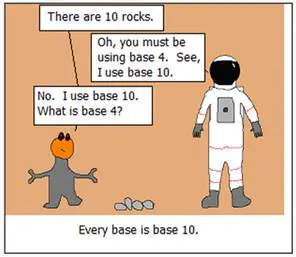
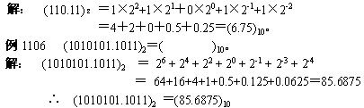
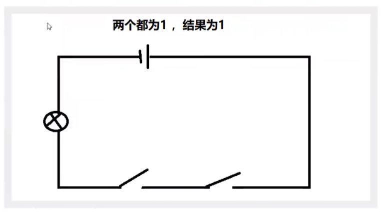
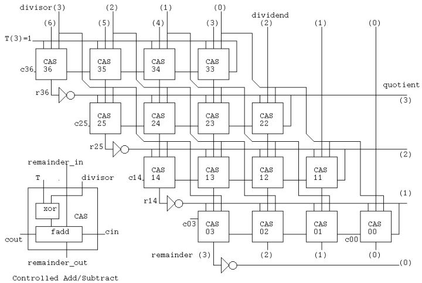
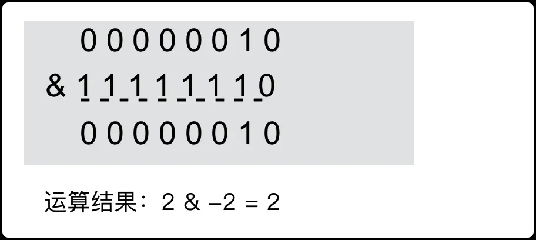
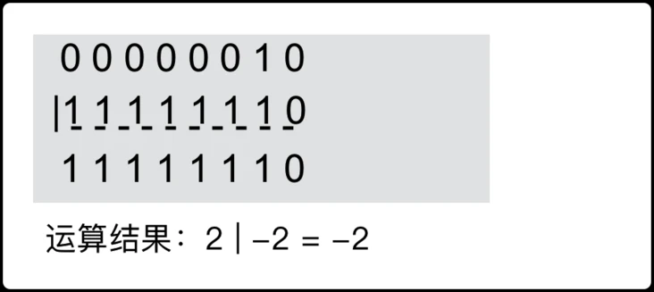
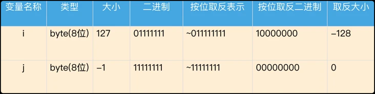

> 本文由 [简悦 SimpRead](http://ksria.com/simpread/) 转码， 原文地址 [www.cnblogs.com](https://www.cnblogs.com/zh94/p/16195373.html)

基本概念
====

1、当前常见的 CPU 位数是 32 位和 64 位，所谓 32 位处理器就是一次只能处理 32 位，也就是 4 个字节的数据，而 64 位处理器一次则能处理 64 位，即 8 个字节的数据。关于 64 位处理器 、32 和 64 位含义 、32 和 64 位区别

2、一字节（1Byte）等于 8 位（8bit），位是计算机存储数据的最小单位，也就是计算存储的数据是一系列二进制位信息。每个位用 0 或 1 表示。**（大 B 和小 b 的区别需注意哦）**

3、为什么一个字节是 8 位？ 

现在通用的说法是 8 位可以涵盖所有的字符编码，即 ASCII 编码。但历史上也存在过 4 位或者 7 位为 1Byte 的场景，只是在后续的字符集标准统一中逐渐被 8bit 所替代。除了历史原因之外，还有数据存储的需要（必须要能在一个字节内表示超过 100 种状态，包括常用数字，大小写字母等），再加上早期计算机存储价格昂贵，所以 8bit 也是在当时符合二进制特性的必然结果。1Byte 为何是 8bit、 1Byte 为何是 8bit、 二进制世界秘密

4、二进制加减运算，加法：0+0=0，0+1=1，1+0=1，1+1=10 ，逢 2 进 1。二进制加法、 二进制减法

5、二进制转十进制及十进制转二进制。2、10 进制互相转换

**上述列出了一些基本概念和对应的可参考链接，建议先优先了解一下。尤其是二进制和十进制的互相转换以及二进制的加减法规则，在后面都会具体涉及到。**

机器数、真值
------

人类用十进制完全是因为我们有 10 个手指头。如果有一天你看到一个外星人，它只有 4 个手指头，那么他使用的一定是四进制，如图所示：



如果能看明白上图，说明你已经明白了进制和手指头的关系了。现代的计算机内部使用门电路，它们只能表示 0 或者 1 两个状态。如果计算机是一个人，那么他只有两个手指头，所以它使用二进制。  
是的，就是这样，所谓的进制，实际上并不是什么神秘的东西，只是关于数的一种表示方式而已了。门电路概念

机器数
---

机器数分为：无符号数和有符号数两种。

**一个数在计算机中的二进制表示形式,  叫做这个数的机器数。机器数是带符号的，在计算机用一个数的最高位存放符号， 正数为 0，负数为 1。**

比如，十进制中的数 +3 ，计算机字长为 8 位，转换成二进制就是 00000011。

如果是 -3 ，就是 10000011 。那么，这里的 00000011 和 10000011 就是机器数。

真值
--

所有数字在计算机底层都以[二进制]形式存在。最高位表示符号位，java中不存在类似于C语言中的 unsigned 类型

因为第一位是符号位，所以机器数的形式值就不等于真正的数值。

例如上面的有符号数 10000011，其最高位 1 代表负，其真正数值是 -3 而不是形式值 131（10000011 转换成十进制等于 131）。

所以，为区别起见，将带符号位的机器数对应的真正数值称为机器数的真值。

例：

```
0000 0001 的真值 = +000 0001 = +1
1000 0001 的真值 = –000 0001 = –1
```

## 表示方式

对于整数，有四种表示方式：

*   二进制 (binary)：0,1 ，满 2 进 1. 以 **0b 或 0B** 开头。
*   十进制 (decimal)：0-9 ，满 10 进 1。
*   八进制 (octal)：0-7 ，满 8 进 1. 以数字 0 开头表示。
*   十六进制 (hex)：0-9 及 A-F，满 16 进 1. 以 **0x 或 0X 开头**表示。此处的 A-F 不区分大小写。如：`0x21AF +1= 0X21B0`

```java
public static void main(String[] args) {
        int num1 =0b110;
        int num2=110;
        //int num3=0128;//0开头表示八进制，0-7
        int num3 = 0130;
        int  num4=0x110A;

        System.out.println(num1);//6
        System.out.println(num2);//110
        System.out.println(num3);//88
        System.out.println(num4);//4362

    }
```


原码、反码、补码
========

为了妥善的处理数据运算过程中符号位的问题，于是就产生了把符号位和数值位一起编码起来表示相应的数的各种表示方法。例如我们熟悉的原码、反码、补码、移码等。通常将未经编码的数称为真值，编码后的数称为机器数或者机器码。

**计算机当前所使用的机器数是采用的补码的方式**。在探求为何机器要使用补码之前, 让我们先了解原码, 反码和补码的概念。对于一个数, 计算机要使用一定的编码方式进行存储， 原码, 反码, 补码是机器存储一个具体数字的编码方式。

原码
--

原码就是符号位加上真值的绝对值, 即用第一位表示符号, 其余位表示值. 比如如果是 8 位二进制:

```
[+1]原 = 0000 0001
[-1]原 = 1000 0001
```

第一位是符号位. 因为第一位是符号位, 所以 8 位二进制数的取值范围就是:

```
[01111111，11111111]
```

转换为真值后即：

```
[127，-127 ]
```

原码是人脑最容易理解和计算的表示方式。原码也可以理解为最原始的机器码。

反码
--

反码的表示方法是：  

+ 正数的反码是其本身，  
+ 负数的反码是在其原码的基础上, 符号位不变，其余各个位取反。

```
[+1] = [00000001]原 = [00000001]反

[-1] = [10000001]原 = [11111110]反
```

可见如果一个反码表示的是负数, 人脑无法直观的看出来它的数值. 通常要将其转换成原码再计算。

补码
--

补码的表示方法是:  

+ 正数的补码就是其本身，  
+ 负数的补码是在其原码的基础上, 符号位不变, 其余各位取反, 最后 + 1. (即在反码的基础上 + 1)。

```
[+1] = [00000001]原 = [00000001]反 = [00000001]补
[-1] = [10000001]原 = [11111110]反 = [11111111]补
```

对于负数, 补码表示方式也是人脑无法直观看出其数值的. 通常也需要转换成原码在计算其数值。


## 机器数

注意：我们在最初的基本概念中提到了二进制和十进制的转换方式。但是需要知道的是，一个数在计算机中的二进制表示方式叫做机器数。

而机器数是有符号的，我们将对应的最高位存放符号，0 位正数，1 位负数。所以机器数并不等于二进制。

由此我们才引出了真值的概念，例如：符号数 10000011，在十进制中对应的值为 131，但是在机器数中，由于 1 表示负数，所以其真正数值是 - 3，而并不是 131。

符号数：10000011，我们需要先消除其符号位的影响，将其调整为正数：00000011，此时将正数转换为 10 进制为 3，然后再加上最初的符号位表示负数，所以为 - 3。

**需知道的是，二进制仅是以 2 为基数的计数方式而已，在二进制中是无法区分正数和负数的。而如果想区分正数和负数那么必须在二进制的最高一位中用 0 和 1 来表示符号以此来表示正负。那么此时最高位的 0 和 1 已经不是二进制的一种计数方式了，而只是一种符号的标识，该符号的标识则是万万不可以直接参与二进制的计算的。**

**当我们用最高位中的 0 和 1 来表示正负时，此时该二进制的数已经不再是符合二进制规则的数了，而是机器数。**

二进制仅仅是以 2 为基数的计算方式，此时最高位的值已经不再是通过 2 位基数的计算方式而计算出来的，而只是一个表示正负的标识了，所以此时该数值则已经不再是符合二进制规则的数了，而是机器数。

所以，也只有机器数才可以表示正负。而机器数所对应得到的结果则是真数，而并不是 10 进制数。

如果此时抛出来一个问题：10000011 转换为对应的 10 进制，那么对应的结果则是 131，但如果是转换为真数，则是 - 3。同样的，如果是将 00000011 转换为对应的 10 进制，则是 3，而如果转换为真数，则也是 3。

所以当我们看到一个以 8 位数所表示的二进制数时，则一定要确认该二进制数是表示机器数，还是二进制数？是转换为 10 进制数，还是真数。其中最大的区别则是，最高的符号位到底是参与二进制的运算，还是仅仅表示符号位。

机器数转真数：  
10000011 > 消除最高位 1 的影响先转为正数 > 00000011 > 再将该正数以二进制的方式转为十进制为 > 3 > 此时再将最初的符号添加回来 > 3 调整为 - 3。

二进制数转 10 进制数：  
10000011 > 无需消除最高位 1 的影响直接转为正数 > 10000011 > 再将该正数以二进制的方式转为十进制为 > 131 > 无需添加符号位 > 131 仍然为 131。

所以可知，真数和 10 进制数最大的区别则是是否忽略最高位，在确认完是否忽略最高位，得到最初的正数后，该正数的计算方式，则和二进制转十进制的方式完全相同。其实就是二进制转十进制。哈哈。

那么在注意了二进制数和机器数以及十进制数和真数的区别之后。我们则需要注意的另外一个问题则是：

机器数是包含原码、反码、补码。其中三者之间是可以互相转换的。原码转反码转补码，这块上面已经说明过了，而补码则也可以通过想反的方式重新转换为原码。

而此处需要知晓的则是，反码和补码当然是不可以直接转为真数的，而必须要通过原码才可以进行转换。

这个其实也没什么问题，毕竟原码经过层层转换后得到补码，而补码又可以直接转换为真数，当然不可能了。

接下来则是，为什么原码需要转换为补码，为什么原码不是计算机的计算方式，而是补码？

为什么补码才是计算机的真正计算方式
-----------------

现在我们知道了计算机可以有三种编码方式表示一个数. 对于正数因为三种编码方式的结果都相同:

```
[+1] = [00000001]原 = [00000001]反 = [00000001]补
```

所以不需要过多解释. 但是对于负数:

```
[-1] = [10000001]原 = [11111110]反 = [11111111]补
```

可见原码, 反码和补码是完全不同的. 既然原码才是被人脑直接识别并用于计算表示方式, 为何还会有反码和补码呢?

首先, 因为人脑可以知道第一位是符号位, 在计算的时候我们会根据符号位, 选择对真值区域的加减。  
但是对于计算机, 加减乘数已经是最基础的运算, 要设计的尽量简单. 计算机辨别 "符号位" 显然会让计算机的基础电路设计变得十分复杂! 于是人们想出了将符号位也参与运算的方法. 我们知道, 根据运算法则减去一个正数等于加上一个负数, 即: 1-1 = 1 + (-1) = 0 , 所以机器可以只有加法而没有减法, 这样计算机运算的设计就更简单了。

于是人们开始探索 将符号位参与运算, 并且只保留加法的方法. 首先来看原码:  
计算十进制的表达式: 1-1=0

```
1 - 1 = 1 + (-1) = [00000001]原 + [10000001]原 = [10000010]原 = -2
```

如果用原码表示, 让符号位也参与计算, 显然对于减法来说, 结果是不正确的. 这也就是为何计算机内部不使用原码表示一个数。  
为了解决原码做减法的问题, 出现了反码：  
计算十进制的表达式: 1-1=0

```
1 - 1 = 1 + (-1) = [0000 0001]原 + [1000 0001]原= [0000 0001]反 + [1111 1110]反 = [1111 1111]反 = [1000 0000]原 = -0
```

发现用反码计算减法, 结果的真值部分是正确的. 而唯一的问题其实就出现在 "0" 这个特殊的数值上. 虽然人们理解上 + 0 和 - 0 是一样的, 但是 0 带符号是没有任何意义的. 而且会有 [0000 0000] 原和 [1000 0000] 原两个编码表示 0。

于是补码的出现, 解决了 0 的符号以及两个编码的问题：

```
1-1 = 1 + (-1) = [0000 0001]原 + [1000 0001]原 = [0000 0001]补 + [1111 1111]补 = [0000 0000]补=[0000 0000]原
```

这里说明一下，二进制想加：0000 0001+1111 1111 = 1 0000 0000，但由于是 8 位数，所以最终的值为 0000 0000。

**这样 0 用 [0000 0000] 表示, 而以前出现问题的 - 0 则不存在了. 而且可以用 [1000 0000] 表示 - 128:**

```
(-1) + (-127) = [1000 0001]原 + [1111 1111]原 = [1111 1111]补 + [1000 0001]补 = [1000 0000]补
```

**由于我们使用原码来表示正时，最大值为：01111111，最小值为：11111111，所以直接转换为对应的 10 进制后的结果为，127，-127。  
而此处使用补码后，由于补码的规则是，首位不变，其它反转，并 + 1。所以 (-1)+(-127) 刚好为 - 128。**

使用补码, 不仅仅修复了 0 的符号以及存在两个编码的问题, 而且还能够多表示一个最低数. 这就是为什么 8 位二进制, 使用原码或反码表示的范围为 [-127, +127], 而使用补码表示的范围为 [-128, 127]。

因为机器使用补码, 所以对于编程中常用到的 32 位 int 类型, 可以表示范围是: [-2 的 31 次方, 2 的 31 次方 - 1] 因为第一位表示的是符号位. 而使用补码表示时又可以多保存一个最小值。

**Amazing，我们在上面最初使用原码进行加法运算时，由于我们人脑还需要先判断一下最高位的符号后，才能进行二进制运算，然后再添加上对应的符号位。而采用补码后，直接将对应的符号位也参与运算，将补码的数值直接相加，得到的竟然刚好也就是二进制转换后的结果。这样一来，计算机的基础电路设计就可以更加简单，而无需关注符号位的问题，仅需要按照二进制的加法法则执行即可。简直完美。所以这也是补码作为计算机的真正计算方式的原因之一！**

但，补码后所得到的值想加刚好就是直接二进制的值相加后的结果，真的是就刚好这么巧吗？其实不然，背后还蕴含这很有意思的数学原理，详情可参考：  
[深入理解原码、补码](https://www.jianshu.com/p/ffc97c4d2306) & [数的机器码表示](https://www.cnblogs.com/delongzhang/p/12525737.html) & [机器码原理](https://blog.csdn.net/alinyua/article/details/79702879) & [原码、补码原理](https://www.cnblogs.com/zhangziqiu/archive/2011/03/30/computercode.html)


# 进制转换 （包括小数）

## 一、二进制数转换成十进制数

由二进制数转换成十进制数的基本做法是，把二进制数首先写成加权系数展开式，然后按十进制加法规则求和。这种做法称为"**按权相加**"法。

例如把二进制数 110.11 转换成十进制数。



------

## 二、十进制数转换为二进制数

十进制数转换为二进制数时，由于整数和小数的转换方法不同，所以先将十进制数的整数部分和小数部分分别转换后，再加以合并。

### 1. 十进制整数转换为二进制整数

十进制整数转换为二进制整数采用"**除2取余，逆序排列**"法。具体做法是：用2去除十进制整数，可以得到一个商和余数；再用2去除商，又会得到一个商和余数，如此进行，直到商为零时为止，然后把先得到的余数作为二进制数的低位有效位，后得到的余数作为二进制数的高位有效位，依次排列起来。

例如把 (173)10 转换为二进制数。

解：


### 2．十进制小数转换为二进制小数

十进制小数转换成二进制小数采用"**乘2取整，顺序排列"**法。具体做法是：用2乘十进制小数，可以得到积，将积的整数部分取出，再用2乘余下的小数 部分，又得到一个积，再将积的整数部分取出，如此进行，直到积中的小数部分为零，或者达到所要求的精度为止。

然后把取出的整数部分按顺序排列起来，先取的整数作为二进制小数的高位有效位，后取的整数作为低位有效位。

例如把（0.8125）转换为二进制小数。

解：


例：

```
（173.8125）10＝（ ）2
```

解：

```
在上个例子中得（173）10＝（10101101）2
得（0.8125）10＝（0.1101）2
```

把整数部分和小数部分合并得：

```
（173.8125）10＝（10101101.1101）2
```

十进制小数转换成二进制小数采用"**乘2取整，顺序排列**"法。具体做法是：用2乘十进制小数，可以得到积，将积的整数部分取出，再用2乘余下的小数部分，又 得到一个积，再将积的整数部分取出，如此进行，直到积中的整数部分为零，或者整数部分为1，此时0或1为二进制的最后一位。或者达到所要求的精度为止。

然后把取出的整数部分按顺序排列起来，先取的整数作为二进制小数的高位有效位，后取的整数作为低位有效位。　

**十进制小数转二进制**

如：**0.625=（0.101）B**

```
0.625*2=1.25======取出整数部分1 
0.25*2=0.5========取出整数部分0 
0.5*2=1==========取出整数部分1 
```

再如：**0.7=（0.1 0110 0110...）B**

```
0.7*2=1.4========取出整数部分1 
0.4*2=0.8========取出整数部分0 
0.8*2=1.6========取出整数部分1 
0.6*2=1.2========取出整数部分1 
0.2*2=0.4========取出整数部分0　 
0.4*2=0.8========取出整数部分0 
0.8*2=1.6========取出整数部分1 
0.6*2=1.2========取出整数部分1 
0.2*2=0.4========取出整数部分0
```


# 基本数据类型

8种基本数据类型：boolean、byte、char、short、int、long、float、double，及对应包装类型如下：

| 数据类型  | 字节数 | 取值范围                                    |
| :-------- | :----- | :------------------------------------------ |
| `byte`    | 1      | -128 到 127                                 |
| `short`   | 2      | -32768 到 32767                             |
| `int`     | 4      | -2147483648 到 2147483647                   |
| `long`    | 8      | -9223372036854775808 到 9223372036854775807 |
| `float`   | 4      | ±1.4E-45 到 ±3.4028235E38                   |
| `double`  | 8      | ±4.9E-324 到 ±1.7976931348623157E308        |
| `char`    | 2      | 0 到 65535                                  |
| `boolean` | 1      | `true` 或 `false`                           |

对应包装类型的常量缓存以及自动装箱拆箱的坑参见上篇博客：

位运算
===

文章最顶部基本概念处列到了 “10 进制 2 进制互转”，以及“2 进制加减法” 对应的相关链接。  
此处再推荐几个在线计算的网址，便于将自己的计算结果进行二次验证：  
[在线原码、补码、10 进制互转](https://www.23bei.com/tool-56.html) 

 [在线进制转换](https://tool.oschina.net/hexconvert/) 

 [在线二进制加减法](https://www.99cankao.com/digital-computation/binaryarith.php)

接下来则开始涉及到位运算了。

概念
--

什么是位运算？我们先来看下百度百科的概念：

```
程序中的所有数在计算机内存中都是以二进制的形式储存的。位运算就是直接对整数在内存中的二进制位进行操作。
```

百度百科中所给的解释是具备歧义性的，按照百度百科的解释，直接对整数在内存中的二进制位进行操作就是位运算的话，那么使用二进制数进行算术运算法（+，-，*，/ ）岂不是也属于位运算？

我们再来看下维基百科所给的概念解释：

```
位操作是程序设计中对位模式或二进制数的一元和二元操作。在许多古老的微处理器上，位运算比加减运算略快，通常位运算比乘除法运算要快很多。在现代架构中，情况并非如此：位运算的运算速度通常与加法运算相同（仍然快于乘法运算）。
```

维基百科中针对位运算的概念相对合理，通过维基百科中的概念我们可以很明显的区分到，位运算是和加减乘除这些算数运算符是不同的。不同的 CPU 针对位运算的操作是较快于 (乘 / 除) 法运算的。

**所以这也才是我们需要了解位运算的真正原因，那就是 CPU 处理器针对位运算符的计算是快于算术运算符的！在特定的编码场景下使用位运算的执行速率则是远远大于算术运算的！**

```
网络上针对位运算较多的内容解释是：位运算是直接对整数在内存中的二进制位进行操作，所以位运算更加节省内存、提高运算效率等等的。其实这是很不严谨的说法，很容易误导大家对位运算的理解，因为所有的整数最终在计算机中都是二进制数，那么所有对整数的运算岂不是都是位运算？当然不是啦。且，位运算真正快的原因也并不是因为节省内存，而主要是因为CPU对位运算的支持！和内存并没有较大关联。
```

为何位运算 CPU 执行速率更快
----------------

程序中的基本运算包含：

*   算术运算：加、减、乘、除、取余
*   按位运算：按位或 “|”、按位与 “&”、按位取反 “~”、按位异或 “^”
*   移位运算：左移 x<<k；右移 x>>k

其中按位运算和移位运算均属于位运算的范畴。

位运算的具体执行逻辑，我们下面会详细说明。这里先以位运算中的 与 运算符 “&” 来简单说明下位运算的主要执行逻辑：  
& 与运算符的运算规则是：两个位都为 1 时，则结果为 1。如：3&5 即 0000 0011& 0000 0101 = 0000 0001，因此 3&5 的值得 1。

根据与运算符的规则可知，位运算的整体执行逻辑实际是较为简单的，更多的是进行位数的比较，从而得到一个结果，这种较为简单的运算逻辑，则对于 CPU 处理器来说，在电路的设计中则也会更加简单许多，以下为与运算符所涉及到的 CPU 电路图：



而对于一个除法来说呢，在 CPU 中所对应的电路图设计则是这样的：



可以看到，整个 CPU 电路图的设计复杂了不止一个层级，所以这也就是为何位运算比我们人常用的算术运算更快的直接原因了。因为对于整个 CPU 的执行逻辑来说从设计层面就复杂了很多。

当然，提到 CPU 的电路图设计，就不得不提到对应的 CPU 中晶体管的特性了，而晶体管中所涉及到的开关（01）的特性也就构成了逻辑电路，从而构成了与门、或门、非门、异或门等电路特性。  
这块内容，可以参考如下链接：  
[位运算中隐藏的 CPU 秘密](https://cloud.tencent.com/developer/article/1888845)  
[程序中的位运算于基本电路关系](https://blog.csdn.net/weixin_29199873/article/details/112593631)  
[程序中位运算于基本电路 - 知乎](https://zhuanlan.zhihu.com/p/162068578)  
[四位计算机的原理及实现](https://www.ruanyifeng.com/blog/2011/03/4-bit_computer.html)  
[位运算的理解](https://icode.best/i/71527842038806)  
[程序中的取余是如何实现的](https://www.zhihu.com/question/21070971)  
[二进制乘除法的实现](https://blog.csdn.net/xiangwanpeng/article/details/78083623)

CPU 中的电路设计和数学的算法实现有着很精妙的联系，计算机前辈的力量是无穷的。那到了这里，我们也就知道了程序中基本运算在执行速率上的真正差别实际上是在 CPU 这一层级的，了解了这些之后，我们也就可以接着开始说明位运算符的真正执行逻辑了。  
（位运算仅需进行 01 的比较，和移位等简单的逻辑操作，基本上和直接执行二进制的相加规则一样，在电路设计和逻辑上均更加简单，而乘除求余则在电路的设计中较为复杂）


位运算符
====

运算规则总结
----

<table><thead><tr><th>符号</th><th>解释</th><th>运算规则</th></tr></thead><tbody><tr><td>&lt;&lt;</td><td>左移</td><td><code onclick="mdcp.copyCode(event)">空位补0：被移除的最高位丢弃，空缺位补0。</code></td></tr><tr><td>&gt;&gt;</td><td>右移</td><td><code onclick="mdcp.copyCode(event)">根据被移除的最高位不同【即符号位】</code><br><code onclick="mdcp.copyCode(event)">最高位0，右移后，空缺位补0；</code><br><code onclick="mdcp.copyCode(event)">最高位1，右移后，空缺位补1</code>；</td></tr><tr><td>&gt;&gt;&gt;</td><td>无符号右移</td><td><code onclick="mdcp.copyCode(event)">被移除的最高位无论是0还是1，空缺位都用0补。</code></td></tr><tr><td>&amp;</td><td>与</td><td><code onclick="mdcp.copyCode(event)">二进制位进行&amp;运算，只有1&amp;1时结果是1，否则是0；</code></td></tr><tr><td>|</td><td>或</td><td><code onclick="mdcp.copyCode(event)">二进制位进行|运算，只有0|0时结果是0，否则是1；</code></td></tr><tr><td>^</td><td>异或</td><td><code onclick="mdcp.copyCode(event)">相同二进制位进行^运算，结果是0；1^1=0，0^0=0</code><br><code onclick="mdcp.copyCode(event)">不相同二进制位^运算结果是1。1^0=1，0^1=1</code></td></tr><tr><td>~</td><td>取反</td><td><code onclick="mdcp.copyCode(event)">正数取反，各二进制码按补码各位取反</code><br><code onclick="mdcp.copyCode(event)">负数取反，各二进制码按补码各位取反</code></td></tr></tbody></table>

#### 运算过程：

```java
@Test
    public  void testBit() {
        // 正数 : 原码 反码 补码 一样
        // 负数数 : 补码=反码 + 1  【符号位始终保持不变】
      /*
         -10  运算转换成int
         原码：10000000 00000000 00000000 00001010
         反码: 11111111 11111111 11111111 11110101
         补码: 11111111 11111111 11111111 11110110 计算机底层保存
        */

        /* ------------------------------[-10 >> 2]-----------------------------------------
            [-10补码]       1 1111111 11111111 11111111 11110110
            补码>> 2运算后   1 1111111 11111111 11111111 11111101   考虑符号位，负数补1，正数补0
                    -1     1 1111111 11111111 11111111 11111100
             取反得到结果    1 0000000 00000000 00000000 00000011   结果十进制-3
         */
        System.out.println(-10 >> 2);// -3
        /*----------------------------[10 >> 2]-------------------------------------------
            10   00000000 00000000 00000000 00001010[原码,反码,补码]

           [补码]    00000000 00000000 00000000 00001010
            >> 2    00000000 00000000 00000000 00000010
                                       [补码还原]    -> 2
         */
        System.out.println(10 >> 2);// 2

        /*------------------------------[-10 << 2]-----------------------------------------
            [-10补码]       1 1111111 11111111 11111111 11110110
            补码<<2运算后    1 1111111 11111111 11111111 11011000   考虑符号位，负数补1，正数补0
                    -1     1 1111111 11111111 11111111 11010111
             取反得到结果    1 0000000 00000000 00000000 00101000   结果十进制-10
         */
        System.out.println(-10 << 2 );//-40
        /*-----------------------------[10 >> 2]------------------------------------------
            10   00000000 00000000 00000000 00001010[原码,反码,补码]

           [补码]    00000000 00000000 00000000 00001010
            << 2    00000000 00000000 00000000 00101000
                                       [补码还原]    -> 40
         */
        System.out.println(10 >> 2);// 40


        /* -------------------------[ -10 >>>2]----------------------------------------------
        -10补码         1 1111111 11111111 11111111 11110110
        补码>>>2运算后   0 0111111 11111111 11111111 11111101考虑符号位，负数补1，正数补0
        最高位0，反码一致 0 0111111 11111111 11111111 11111101
        最高位0，补码一致 0 0111111 11111111 11111111 11111101   结果十进制1073741821
         */
        System.out.println(-10 >>> 2);//1,073,741,821
        /* -------------------------[ 10 >>>2]----------------------------------------------
        10补码          0 0000000 00000000 00000000 00001010
        补码>>>2运算后   0 0000000 00000000 00000000 00000010
        最高位0，反码一致 0 0000000 00000000 00000000 00000010
        最高位0，补码一致 0 0000000 00000000 00000000 00000010   结果十进制1073741821
         */
        System.out.println(10 >>> 2);//2

       /*-------------------------- & | ^ ~ --------------------------------------
              原码           反码          补码
         -3   1000 0011     1111 1100     1111 1101
         10   0000 1010     0000 1010     0000 1010
         */

        // 1111 1101 & 0000 1010 = 0000 1000[补码]  -->  0000 1000[原码]   8
        System.out.println(-3 & 10);//8

        // 1111 1101 | 0000 1010 = 1111 1111[补码]  -->  1000 0001[原码]  -1
        System.out.println(-3 | 10);//-1

        // 1111 1101 | 0000 1010 = 1111 0111[补码]  -->  1000 1001[原码]  -9
        System.out.println(-3 ^ 10);//-9

        // ~1111 1101 =  0000 0010[补码]  -->  0000 0010[原码]  2
        System.out.println(~ -3 );//2

        // ~0000 1010 =  1111 0101[补码]  -->  1000 1011[原码]  -11
        System.out.println(~ 10 );//-11

        int i = 21;
        // 因为运算符优先级，需要加括号
        System.out.println("i << 2 : " + (i << 2));// 84 相当于* 2²
        System.out.println("i << 26 : " + (i << 26));// 1409286144
        System.out.println("i << 27 : " + (i << 27));// -1476395008

        int j = -21;
        System.out.println("i << 2 : " + (j << 2));// -84
        System.out.println("i << 26 : " + (j << 26));// -1409286144
        System.out.println("i << 27 : " + (j << 27));// 1476395008

        int m = 12, n = 5;
        System.out.println("m & n ： " + (m & n));//4
        System.out.println("m | n ： " + (m | n));//13
        System.out.println("m ^ n ： " + (m ^ n));//9

        System.out.println(~(6));// -7
        // 6的补码：      0000 0110
        // 取反          1111 1001
        //还原成原码：    1000 0111 = -7（原码、补码、反码不操作符号位）
    }
```


`& `与运算符
------

运算规则：两位同时为 1，结果才为 1，否则结果为 0。

```
0&0=0  0&1=0  1&0=0  1&1=1
```

例如：2 & -2



注意：负数当然是按照补码的方式来进行位计算哦。


根据与运算符的计算特性，我们常用的使用方式有：  

### **1、判断奇偶数**  

我们知道，按照二进制和十进制（除二取余）的换算方式，如果是偶数的情况下，换算为二进制后**末位**必然是 0，如果是奇数则末位为 1。比如：2 >10 ，3 > 11，100 >1100100，121 > 1111001。

所以，我们按照与运算符的运算规则，**使用 if(a & 1)1 表示为奇数，if(a & 1)0，则表示为偶数。**  
如：  
121 & 1 = 1111001 & 0000001 = 0000001  
2 & 1 =10 & 01 =00

使用与运算符的方式，则完全可以替代掉：if (a % 2 == 0) 来判断奇偶数的方式，且位运算符由于 CPU 的支持，执行效率也更高。

关于二进制转十进制的方式，参考基本概念中 URL 即可。

### **2、取一个数的指定位**  

比如取数 X=1010 1110 高 4 位，只需要另外找一个数，令 Y 的高 4 位为 1，其余位为 0，即 Y=1111 0000，然后将 X 和 Y 进行与运算，（X & Y = 1010 1110 & 1111 0000 = 1010 0000）即可得到 X 的指定高 4 位。

如果想获取 X 的低 4 位的数，则将 Y 的低 4 位为 1，其余位数为 0 即可，（X & Y=1010 1110 & 0000 1111=0000 1110）便可得到 X 的指定低 4 位。

`| ` 或运算符
-------

运算规则：两个位都为 0 时，则结果为 0。否则则为 1。

```java
0|0=0  0|1=1  1|0=1  1|1=1
```

例如：2 | -2 =-2



### | 或运算符的用途

首先与和或是两个相反的概念，所以上述所提到的与的用途，在这里只要略作改造就也适合于或运算符。但是  
目的是一样的，所以对应相同用途的场景，这里不再赘述。

#### **1、常用来对一个数据的某些位设置为 1**  

比如将数 X=1010 1110 的低 4 位设置为 1，只需要另找一个数 Y，令 Y 的低 4 位为 1，其余位为 0，即 Y=0000 1111，然后将 X 与 Y 进行按位或运算（X|Y=1010 1111）即可得到。

同样的，使用 & 运算符，则可以方便的将某些位设置为 0，如上述的 X & Y，将 X 的低 4 位设置为 0，则  
X & Y = 1010 1110 & 1111 0000 = 1010 0000。

以上则说明 & 和 | 灵活运用，其实是可以达到相同效果的。但实际使用中则并不然，首先对于上述低 4 位设置为 1 的场景，我们只需要找一个 Y 的数，令 Y 的低 4 位为 1，其余位为 0，这样一个数是很好找的，是一个固定的数，比如：15。转换为二进制后为 1111。

但如果使用 & 运算符来面对这个场景，则需要找一个 Y，Y 的第四位为 0，其余位置为 1，这样一个数则很难找，并且随着位数的不同，值也是不断变换的，比如：1111 0000=240，但如果是 12 位数，1111 1111 0000=4080。所以如果使用 & 运算符来在该场景下则是没有 | 运算符更加方便的。

尽管 & 和 | 的规则相反，可灵活变更，但针对特定场景下，还是使用特定的运算符效果更佳 O。

`^ 异或`运算符
-------

运算规则：两个位相同为 0，相异为 1。

```
0^0=0  0^1=1  1^0=1  1^1=0
```

例如：2 ^ -2


### ^ 异或运算符用途

#### 1、交换两个数

```java
a=a^b;      //a=a^b
b=a^b;      //b=(a^b)^b=a^0=a
a=a^b;      //a=(a^b)^(a^b^b)=0^b=0
```

交换两个数的原理，即上面注释所写内容。

不使用位运算的方式交换两个数，则需要定义一个中间变量 C，来承接其中的一个数的交换，对于 Java 来说，定义一个新的 Int 变量 C，则表示内存中需开辟一个 4 字节的空间。

所以根据服务特性来选择合适的方式即可，对内存使用率有强要求则使用位运算，没要求则都可以。

```java
static void swap(int a, int b) {    int c = a;    a = b;    b = c;}

static void swapBit(int a, int b) {    a = a ^ b;    b = a ^ b;    a = a ^ b;}
```

`~ 取反`运算符
-------

运算规则：0 变 1，1 变 0。



`<< `左移运算符
--------

运算规则：将一个运算对象的各二进制位全部左移若干位（左边的二进制位丢弃，右边补 0）。

设 a=15，即二进制数 00001111，左移 2 位得 00111100，即十进制数 60。

**左移一位相当于该数乘以 2，左移 2 位相当于该数乘以 2^2=4。上面举的例子 15<< 2=60，即乘了 4。  
（结论：左移 n 位等于乘以 2 的 n 次方）**

设 a=-46，补码后为，1010 1110，a = a<< 2 将 a 的二进制位左移 2 位、右补 0，即得 a=1011 1000，转换为真值后为 - 56。

设 a=110，补码后为：0110 1110，a = a<<2 将 a 的二进制位左移 2 位，右补 0，即得 a=1011 1000，转换为真值后为 184。

**以此可知，左移 n 位等于乘以 2 的 n 次方，该结论仅适用于该数左移时被溢出舍弃的高位中不包含 1 的情况，如果溢出的高位中包含 1，则不符合上述结论。**

`>>` 右移运算符
--------

运算规则：将一个数的各二进制位全部右移若干位，正数左补 0，负数左补 1，右边丢弃。  
例如：a=a>>2 将 a 的二进制位右移 2 位，左补 0 或者 左补 1 需要看被移数是正还是负。

设 a=16，补码后为 00010000，a = a<<2 将 a 的二进制位右移 2 位，左边补 0，即得 a=00000100，转换为真值后为 4。

设 a=-16，补码后为 11110000，a = a<<2 将 a 的二进制位右移 2 位，左边补 1，得到 a=11111100，转换真值后为 - 4。

结论：右移运算符，操作数每右移一位，相当于该数除以 2。

## `>>>`无符号右移运算符

无符号右移运算符将整数的位向右移动给定的位数。符号位用 0 填充。按位补零右移运算符由符号 >>> 表示

`zero-fill（零-填充）` 这个就更明显了，直接就说了，用0填充，所以右移后空位不管你符号位是啥，我都只填0。

> **. Java中的无符号左移运算符**
>
> 与无符号右移不同，Java 中没有“<<<”运算符，因为逻辑 (<<) 和算术左移 (<<<) 操作是相同的。


```java
byte num1 = 8;
byte num2 = -8;

System.out.println(num1 >>> 2);// 2
System.out.println(num2 >>> 2);// 1073741822
```

# 数据类型宽化窄化

## 什么是符号扩展

符号扩展（Sign Extension）用于在数值类型转换时扩展二进制位的长度，以保证转换后的数值和原数值的符号（正或负）和大小相同，一般用于较窄的类型（如byte）向较宽的类型（如int）转换。扩展二进制位长度指的是，在原数值的二进制位左边补齐若干个符号位（0表示正，1表示负）。

举例来说，

> 如果用6个bit表示十进制数10，二进制码为"00 1010"，如果将它进行符号扩展为16bits长度，结果是"0000 0000 0000 1010"，即在左边补上10个0（因为10是正数，符号为0），符号扩展前后数值的大小和符号都保持不变；

> 如果用10bits表示十进制数-15，使用“2的补码”编码后，二进制码为"11 1111 0001"，如果将它进行符号扩展为16bits，结果是"1111 1111 1111 0001",即在左边补上6个1（因为-15是负数，符号为1），符号扩展前后数值的大小和符号都保持不变。

## 窄化 宽化的规则

这个规则是《Java解惑》总结的：

+ **如果最初的数值类型是有符号的(int long short byte)，那么就执行符号扩展；如果是char类型，那么不管它要被转换成什么类型，都执行零扩展。**
+ **还有另外一条规则也需要记住，如果目标类型的长度小于源类型的长度，则直接截取目标类型的长度。例如将int型转换成byte型，直接截取int型的右边8位**。

所以java在进行类型扩展时候会根据原始数据类型, 来执行符号扩展还是零扩展. 数值类型转数值类型的符号扩展不会改变值的符号和大小.

```java
符号位扩展：
   byte： -128  		 0x80 						        10000000	
   int ： -128 	   0xFFFFFF80	11111111111111111111111110000000
   
   
   byte： 64  		 	   0x40 						01000000	
   int ： 64 	   		   0x40					        01000000
```

## 显示隐式转换

> 隐式转换：byte转int，值不变。 符号位扩展 char零位扩展
> 显式转换：int转byte，超出范围的部分被截断。
> 浮点数转整数：float和double转int，取整数部分。

```java
// 隐式转换  填充符号位
byte b = 57;//0x39  
int i = b; // i 的值为 57   0x39

byte b1 = -71;//0xB9
int i1 = b; // i 的值为 -71 0xFFFFFFB9
补码：0xFFFFFFB9
反码：0xFFFFFFB8
原码：0x00000047 = 71


// 显式转换   截取
int i = 1048633;//0x100039
byte b = (byte) i; // b 的值为 57  0x39

int i1 = -2147483591; //0x80000039
byte b1 = (byte) i1; // b 的值为 57   0x39

// 整数与浮点数转换
float f = 10.35f;
double d = 20.6;

int i = (int) f;// 10
int j = (int) d;// 20
```


## **几个转型的例子**

在进行类型转换时，一定要了解表达式的含义，不能光靠感觉。最好的方法是将你的意图明确表达出来。

+ 在将一个`char`型数值`c`转型为一个宽度更宽的类型时，**并且不希望有符号扩展**，可以如下编码：

```java
int i = c & 0xffff;
```

上文曾提到过，`0xffff`是`int`型字面量，所以在进行`&`操作之前，编译器会自动将`c`转型成`int`型，即在`c`的二进制编码前添加16个0，然后再和`0xffff`进行`&`操作，所表达的意图是强制将前16置0，后16位保持不变。虽然这个操作不是必须的，但是明确表达了不进行符号扩展的意图。

+ **如果需要符号扩展**，则可以如下编码：

```java
int i = (short)c; //Cast causes sign extension
```

首先将`c`转换成`short`类型，它和char是 等宽度的，并且是有符号类型，再将short类型转换成int类型时，会自动进行符号扩展，即如果short为负数，则在左边补上16个1，否则补上16个0.

+ 如果在将一个byte数值b转型为一个char时，并且不希望有符号扩展，那么必须使用一个位掩码来限制它：

```java
char c = (char)(b & 0xff);
```

`(b & 0xff)`的结果是32位的int类型，前24被强制置0，后8位保持不变，然后转换成char型时，直接截取后16位。这样不管b是正数还是负数，转换成char时，都相当于是在左边补上8个0，即进行零扩展而不是符号扩展。

+ 如果需要符号扩展，则编码如下：

```java
char c = (char)b; //Sign extension is performed
```

此时为了明确表达需要符号扩展的意图，注释是必须的。

**测试**

```c
Integer c1 = 0x80000000;
System.out.println(c1);//-2147483648
System.out.println((long)c1);//-2147483648
System.out.println((c1&0x00000000ffffffffL));//2147483648
```

显然，强制向上转型是有符号扩展，结果不变，`&0x00000000ffffffffL`操作后，高32位补0，最后得到长整型`2147483648`的值

```java
Integer`源码也有将int转成无符号long型方法`toUnsignedLong
public static long toUnsignedLong(int x) {
        return ((long) x) & 0xffffffffL;
 }
```

## 窄数字类型提升至宽类型时使用符号位扩展还是零扩展

```java
System.out.println((int)(char)(byte)-1);// 65535  
```

结果为什么是65535而不是-1？

窄的整型转换成较宽的整型时符号扩展规则：如果最初的数值类型是有符号的，那么就执行符号扩展（即如果符号位为1，则扩展为1，如果为零，则扩展为0）；如果它是char，那么不管它将要被提升成什么类型，都执行零扩展。

了解上面的规则后，我们再来看看迷题：因为byte是有符号的类型，所以在将byte数值-1（二进制为：11111111）提升到char时，会发生符号位扩展，又符号位为1，所以就补8个1，最后为16个1；然后从char到int的提升时，由于是char型提升到其他类型，所以采用零扩展而不是符号扩展，结果int数值就成了65535。

如果将一个char数值c转型为一个宽度更宽的类型时，只是以零来扩展，但如果清晰表达以零扩展的意图，则可以考虑使用一个位掩码：

```java
int i = c & 0xffff;//实质上等同于：int i = c ;  
```

如果将一个char数值c转型为一个宽度更宽的整型，并且希望有符号扩展，那么就先将char转型为一个short，它与char上个具有同样的宽度，但是它是有符号的：

```java
int i = (short)c;  
```

如果将一个byte数值b转型为一个char，并且不希望有符号扩展，那么必须使用一个位掩码来限制它：

```java
char c = (char)(b & 0xff);// char c = (char) b;为有符号扩展  
```


##  ((byte)0x90 == 0x90)?

答案是不等的，尽管外表看起来是成立的，但是它却等于false。为了比较byte数值(byte)0x90和int数值0x90，Java通过拓宽原生类型将byte提升为int，然后比较这两个int数值。因为byte是一个有符号类型，所以这个转换执行的是符号扩展，将负的byte数值提升为了在数字上相等的int值（10010000?111111111111111111111111 10010000）。在本例中，该转换将(byte)0x90提升为int数值-112，它不等于int数值的0x90，即+144。

> 0x90   表示int  144，补码：10010000  
>
> (byte)0x90  :  强制转换成byte，截取后最高位成为符号位 ，表示值：-112
>
> ((byte)0x90 == 0x90)： 强转后byte与int运行提升为int，符号位扩展后还是-122 ！=144

解决办法：使用一个屏蔽码来消除符号扩展的影响，从而将byte转型为int。

```java
((byte)0x90 & 0xff)== 0x90  
```

## int整数相乘溢出

我们计算一天中的微秒数：

```java
long microsPerDay = 24 * 60 * 60 * 1000 * 1000;// 正确结果应为：86400000000  
System.out.println(microsPerDay);// 实际上为：500654080  
```

问题在于计算过程中溢出了。这个计算式完全是以int运算来执行的，并且只有在运算完成之后，其结果才被提升为long，而此时已经太迟：计算已经溢出。

解决方法使计算表达式的第一个因子明确为long型，这样可以强制表达式中所有的后续计算都用long运算来完成，这样结果就不会溢出：

```java
long microsPerDay = 24L * 60 * 60 * 1000 * 1000;  
```

##  负的十六进制与八进制字面常量

“数字字面常量”的类型都是int型，而不管他们是几进制，所以“2147483648”、“0x180000000（十六进制，共33位，所以超过了整数的取值范围）”字面常量是错误的，编译时会报超过[int的取值范围](https://so.csdn.net/so/search?q=int的取值范围&spm=1001.2101.3001.7020)了，所以要确定以long来表示

“2147483648L”、“0x180000000L”。

十进制字面常量只有一个特性，即所有的十进制字面常量都是正数，如果想写一个负的十进制，则需要在正的十进制字面常量前加上“-”即可。

十六进制或八进制字面常量可就不一定是正数或负数，是正还是负，则要根据当前情况看：如果十六进制和八进制字面常量的最高位被设置成了1，那么它们就是负数：

```java
System.out.println(0x80);//128   
//0x81看作是int型，最高位(第32位)为0，所以是正数  
System.out.println(0x81);//129   
System.out.println(0x8001);//32769  
System.out.println(0x70000001);//1879048193   
//字面量0x80000001为int型，最高位(第32位)为1，所以是负数  
System.out.println(0x80000001);//-2147483647  
//字面量0x80000001L强制转为long型，最高位（第64位）为0，所以是正数  
System.out.println(0x80000001L);//2147483649  
//最小int型  
System.out.println(0x80000000);//-2147483648  
//只要超过32位，就需要在字面常量后加L强转long，否则编译时出错  
System.out.println(0x8000000000000000L);//-9223372036854775808  
```

从上面可以看出，十六进制的字面常量表示的是int型，如果超过32位，则需要在后面加“L”，否则编译过不过。如

果为32，则为负int正数，超过32位，则为long型，但需明确指定为long。

```java
System.out.println(Long.toHexString(0x100000000L + 0xcafebabe));// cafebabe  
```

结果为什么不是0x1cafebabe？该程序执行的加法是一个混合类型的计算：左操作数是long型，而右操作数是int类型。为了执行该计算，Java将int类型的数值用拓宽原生类型转换提升为long类型，然后对两个long类型数值相加。因为int是有符号的整数类型，所以这个转换执行的是符号扩展。

这个加法的右操作数0xcafebabe为32位，将被提升为long类型的数值0xffffffffcafebabeL，之后这个数值加上了左操

作0x100000000L。当视为int类型时，经过符号扩展之后的右操作数的高32位是-1，而左操作数的第32位是1，两个数值相加得到了0：

```java
0x 0xffffffffcafebabeL
+0x 0000000100000000L
-----------------------------
0x 00000000cafebabeL
```

如果要得到正确的结果0x1cafebabe，则需在第二个操作数组后加上“L”明确看作是正的long型即可，此时相加时拓

展符号位就为0：

```java
System.out.println(Long.toHexString(0x100000000L + 0xcafebabeL));// 1cafebabe  
```


Java 位运算
========


位运算本身就是处理器、计算机自身所提供的能力，所以针对位运算的使用，实际上是不限于任何编程语言的，此处之所以以 JAVA 为例，主要是因为本人常用的开发语言是 JAVA，针对 JAVA 中位运算的使用，实际上在 JDK 中有这很丰富的案例，比如：

1、JDK 中线程池 ThreadPoolExecutor 的实现当中使用 Integer 类型（4 字节，32 位）其中高 3 位保存线程池状态，而低 29 位保存线程池内有效线程数量。

2、比如 JDK 的 HashMap 中使用位运算的方式将初始化容量的数值，快速的转换为 2 的 n 次幂。以及计算 key 的 hash 时，根据该 key 的 hashCode 结果，再将该 hashCode 的高 16 位和低 16 位通过位运算的方式进行混合，以此降低 hash 碰撞的概率等等。

3、比如我们直接打开常用的 Integer 类的源码，也会发现里面有大量的位运算的使用。

此处仅是为了通过上述举例的方式来以此说明位运算在 Java 生态中的使用程度，实际上是非常丰富的，并且由于位运算独特的计算特性，在某些相对特殊的代码场景下，使用位运算会意想不到的将问题给简单化。

如果想了解更多在 JAVA 中的使用场景和案例，建议大家直接翻看各种源码即可。

**以上是一些举例，以下再做一些小的补充说明：**

在 Java 当中的位运算，是只针对 Int 类型和 Long 类型有效（java 中，一个 int 的长度始终是 32 位，也就是 4 个字节, 它操作的都是该整数的二进制数，Long 则是 64 位，表示 8 字节。），**而对于 byte，char，short，当为这三个类型时，JVM 会先把他们转换为 Int 类型后再进行操作**【**自动扩展到int**】。

包装类的parseLong、toUnsignedInt、 toBinaryString() 可以对字节形式转换。

```java
byte b = (byte) 0xff;//  0xff 是int，补码按byte 【8字节】截取后-1
int unsignedInt = Byte.toUnsignedInt(b); //将符号位也参与到运算，得到无符号数
System.out.println("unsignedInt = " + unsignedInt);//255


long l = Long.parseLong("ff", 16);//16 表示十六进制，将0xff 解析成long整数
System.out.println(l);//255


// 进制字符串与数字转换
int j = 0b11001001100101100000001011010010; // -912915758 负整数 
System.out.println("j = " + j);

//注意：使用Integer.parseInt解析会报错，范围限定在最大值和最小值之间，考虑符号位 超出了int范围
//int i = Integer.parseInt("11001001100101100000001011010010", 2);


int i = (int)Long.parseLong("11001001100101100000001011010010", 2);//2表示按二进制解析字符串 
System.out.println("i = " + i);
//        j = -912915758
//        i = -912915758


//打印进制
System.out.println(Integer.toBinaryString(10));//1010
System.out.println(Integer.toBinaryString(-10));//11111111111111111111111111111101
System.out.println(Integer.toOctalString(-10));//37777777766
System.out.println(Integer.toHexString(-10));//fffffff6
System.out.println(Long.toBinaryString(10));//1010
```

如上代码可知，Integer 和 Long 转换为补码时，Integer 为 32 位，Long 是 64 位。实际上上述的基本类型 32 位还是 64 位，均是直接定义在源码当中的，感兴趣直接看对应的 Integer 和 Long 的源码即可。

## java中 byte操作技巧`0xff` 

在java中，byte short  int 运算都会转换成int计算，byte short 都是按符号位宽化。

1. **0xff 的作用一      截断**

十六进制 `0xff` 的长度是一个字节8bit，但是其**字面值是int**，底层补码 `0x000000ff`   ，那么一个 8bit 数与 其 与运算还是这个数本身，**但是一个 16bit 数与 0xff 就被截断了，比如 `1100110011001100 & 0xff 结果为 11001100`**。那如果想不被截断怎么办？把 0xff 扩展为二个字节即：0xffff，那么以此类推，0xffffff,0xffffffff 都出来了。

2. **0xff 的作用二:    无符号处理**

java 专属，由于 java 没有 unsigned 类型，所以为了适应与其他语言二进制通讯时各种数据的一致性，需要做一些处理。

最直观的例子：**`int a = -127 & 0xFF ; // 等同于 unsigned int c = 129;` (这里的 - 127 与 129 是字节，只为了直观而写的具体数字)**

> `0xFF`整数默认字面值int，与byte、short等运算时小于4字节的都自动宽化【按对应符号位或者零位】，
>
> 
>
> 这里要严格说明一点：再 32 位机器上，0xff 实际上是 0x00000000 00000000 00000000 11111111，
>
> 而 - 127 是 11111111 11111111 11111111 10000001 (补码形式), 那么 - 127 & 0xff 的结果自然是
>
> 00000000 00000000 00000000 10000001 即 129.
>
> 简而言之，该作用主要是为了将 `有符号数转换为无符号数`。


**再详细点：4 字节 ，32 位，按照大端方式排列【Java采用】，**

```
最高位                      最低位
11111111 10101010 11000011 10101010
```

最高位 8 字节要移到最低位那么，这个 8 个字节 `>>（3*8）`，然后与 0xff 运算，即[`Num>>（3*8）&0xff`]，取出

然后后续得 `Num>>(2*8) & 0xff ;Num>>(1*8) & 0xff;Num & 0xff`, 均可取出。代码如下：

```java
int a = 0b11111111_10101010_11000011_10101010;
int bit1 = (a >> 24) & 0xff;//此处>>右移最高位补充符号位，但是截取后不关心高位
int bit2 = (a >> 16) & 0xff;
int bit3 = (a >> 8 ) & 0xff;
int bit4 = (a >> 0) & 0xff;

System.out.println(Integer.toBinaryString(bit1));//11111111
System.out.println(Integer.toBinaryString(bit2));//10101010
System.out.println(Integer.toBinaryString(bit3));//11000011
System.out.println(Integer.toBinaryString(bit4));//10101010
```

### 符号位为负的Long十六进制转换成java基本long整型

```java
    public static void main(String[] args) {

        //将一个最高位为1的long 长度64bit的数转换成 java中long，显示为负数

        String hexStr = "ffffffffffffffff";//需要去掉0x 表示 -1，如果直接用Long.parseLong(hexStr, 16) 会报错

        //思路： 64bit 拆分成两个32bit int，用Long.parseLong(highHex, 16) 去解析成int，去除符号位干扰，在位运算合并
        String highHex = hexStr.substring(0, 8);
        String lowHex = hexStr.substring(8,16);

        long highPart = Long.parseLong(highHex, 16);
        long lowPart = Long.parseLong(lowHex, 16);

        // 确保高位部分正确扩展符号位
        long result = (highPart & 0xffffffffL) << 32 | lowPart;
        System.out.println(result);//-1
        
    }
```

### int拆分byte与合并

```java
int a = 1234567890; // 补码：01001001 10010110 00000010 11010010

byte[] b1 = new byte[4];

//拆分
b1[0] = (byte) ((a >> 24) & 0xff);  //73    补码：0100 1001
b1[1] = (byte) ((a >> 16) & 0xff);  //-106  补码：1001 0110
b1[2] = (byte) ((a >> 8) & 0xff);   //2     补码：0000 0010
b1[3] = (byte) (a & 0xff);          //-46   补码：1101 0010

//合并
int b2 = ((b1[0] & 0xff) << 24) |
        ((b1[1] & 0xff) << 16) |
        ((b1[2] & 0xff) << 8) |
        (b1[3] & 0xff);
System.out.println(b2);//正确结果 【1234567890】


int b3 = (b1[0]) << 24 | (b1[1]) << 16 | (b1[2]) << 8 | (b1[3]);
System.out.println(b3);//错误结果【-46】，没有做有符号转无符号操作，导致结果不对。

//错误分析：(b1[1]) << 16 【-106【1001 0110】 << 16】byte做运算时，会隐式转换成int[ 11111111 11111111 11111111 10010110]，涉及到负数时，没有做有符号转无符号操作
System.out.println(Integer.toBinaryString(-106));                   // 11111111 11111111 11111111 10010110
System.out.println(Integer.toBinaryString(-106 << 16));             // 11111111 10010110 00000000 00000000
System.out.println(Integer.toBinaryString((-106 & 0xff) << 16));    // 00000000 10010110 00000000 00000000
```

将 int a 转换成字节，一般情况下，int 4 字节，那么需要 4 个 byte 来保存，又因为 java 是大端排序，那么 byte[0] 为最高位，所以需要 >>24, 这么一个个的把 a 的 4 个字节取出存入 byte 数组中，这里 **0xff 不仅截断，而且还将有符号转换成了无符号**。

那么将字节转换回去就不一样了，不是截断而是融合 ，因此需要将 & 改为 |，并且还得把每个字节移到所在实际位置，比如 byte[0] 是最高位，因此还得将其移到 4 个字节的头部即需要 <<24，那么后续得以此类推。一个完成的 int32 型就出现了。但是由于 java 的原因，再做位移操作之前还是不能少了有符号转无符号操作。


### Byte  int float转换工具类

```java

public class BitOperationsUtil {
    
    /**
     * 将字节数组转换为整数
     */
    private static int byteArrayToInt(byte[] b) {
        if (b.length != 4) {
            throw new IllegalArgumentException("The byte array must have a length of exactly 4");
        }
        //这个函数将一个字节数组 b 中的四个字节按顺序组合成一个32位的整数。
        // 每个字节通过左移操作符 << 与 accum 进行合并，然后使用按位或操作符 | 进行合并。
        return ((b[0] & 0xFF) << 24) |
                ((b[1] & 0xFF) << 16) |
                ((b[2] & 0xFF) << 8) |
                (b[3] & 0xFF);
    }

    /**
     * 方法：将一个int类型的整数照大端序（Big-Endian）转换为长度为4的字节数组
     */
    public static byte[] intToByteArray(int value) {
        byte[] bytes = new byte[4];

        // 将int按照大端序（Big-Endian）存储到字节数组中
        bytes[0] = (byte) ((value >> 24) & 0xFF);//右移>>最高位补充符号位，但是截取后不关心
        bytes[1] = (byte) ((value >> 16) & 0xFF);
        bytes[2] = (byte) ((value >> 8) & 0xFF);
        bytes[3] = (byte) (value & 0xFF);

        return bytes;
    }
    
    //实现小端序（Little-Endian），则字节顺序会相反
    public static byte[] intToByteArrayLE(int value) {
        byte[] bytes = new byte[4];

        // 将int按照小端序（Little-Endian）存储到字节数组中
        bytes[3] = (byte) ((value >> 24) & 0xFF);
        bytes[2] = (byte) ((value >> 16) & 0xFF);
        bytes[1] = (byte) ((value >> 8) & 0xFF);
        bytes[0] = (byte) (value & 0xFF);

        return bytes;
	}

    /**
     * 将字节数组转换为浮点数
     */
    public static float bytesToFloat(byte[] b) {
        int accum = byteArrayToInt(b);
        return Float.intBitsToFloat(accum);
    }
}
```

测试

```java
@Test
    public void testBytesToFloat() {
        // 测试用例1：正常情况
        byte[] bytes = {0x01, 0x02, 0x03, 0x04};
        float result = Bit2.bytesToFloat(bytes);

        assertEquals("The float value should be 16843009", 16843009f, result);

    }

    @Test
    public void testByteArrayToInt() {
        // 测试用例1：正常情况
        byte[] bytes = {0x01, 0x02, 0x03, 0x04};
        int result = Bit2.byteArrayToInt(bytes);
        assertEquals(, "The int value should be 16843009", 16843009, result);


    }

    @Test
    public void testIntToByteArray() {
        // 测试用例1：正常情况
        int value = 16843009;
        byte[] result = Bit2.intToByteArray(value);
        assertArrayEquals("The byte array should be {1, 2, 3, 4}", new byte[]{(byte) 0x01, (byte) 0x02, (byte) 0x03, (byte) 0x04}, result);

        // 测试用例2：边界情况
        value = 0;
        result = Bit2.intToByteArray(value);
        assertArrayEquals("The byte array should be {0, 0, 0, 0}", new byte[]{(byte) 0x00, (byte) 0x00, (byte) 0x00, (byte) 0x00}, result);

        // 测试用例3：边界情况
        value = Integer.MAX_VALUE;
        result = Bit2.intToByteArray(value);
        assertArrayEquals("The byte array should be {255, 255, 255, 255}", new byte[]{(byte) 0xff, (byte) 0xff, (byte) 0xff, (byte) 0xff}, result);
    }

```


# Java解惑

## 解惑3： int整数相乘溢出

我们计算一天中的微秒数：

```java
long microsPerDay = 24 * 60 * 60 * 1000 * 1000;// 正确结果应为：86400000000  
System.out.println(microsPerDay);// 实际上为：500654080  
```

问题在于计算过程中溢出了。这个计算式完全是以int运算来执行的，并且只有在运算完成之后，其结果才被提升为long，而此时已经太迟：计算已经溢出。

解决方法使计算表达式的第一个因子明确为long型，这样可以强制表达式中所有的后续计算都用long运算来完成，这样结果就不会溢出：

```java
long microsPerDay = 24L * 60 * 60 * 1000 * 1000;  
```


这个教训很简单：当**你在操作很大的数字时，千万要提防溢出——它可是一个缄默杀手**。即使用来保存结果的变量已足够大，也并不意味着要产生结果的计算具有正确的类型。当你拿不准时，就使用long运算来执行整个计算。

## 解惑5：十六进制字面量隐藏负数

下面的程序是对两个十六进制（hex）字面常量进行相加，然后打印出十六进制的结果。这个程序会打印出什么呢？

```cpp
public class JoyOfHex{
	public static void main(String[] args){
		System.out.println( Long.toHexString(0x100000000L + 0xcafebabe));
	}
}
```

看起来很明显，该程序应该打印出1cafebabe。毕竟，这确实就是十六进制数字 10000000016 与cafebabe16 的和。该程序使用的是long 型运算，它可以支持16 位十六进制数，因此运算溢出是不可能的。


然而，如果你运行该程序，你就会发现它打印出来的是cafebabe，并没有任何前导的1。这个输出表示的是正确结果的低32 位，但是不知何故，第33 位丢失了。看起来程序好像执行的是int 型运算而不是long 型运算，或者是忘了加第一个操作数。这里到底发生了什么呢？


**十进制字面常量具有一个很好的属性，即所有的十进制字面常量都是正的，而十六进制或是八进制字面常量并不具备这个属性**。要想书写一个负的十进制常量，可以使用一元取反操作符（-）连接一个十进制字面常量。以这种方式，你可以用十进制来书写任何int 或long 型的数值，不管它是正的还是负的，并且负的十进制常数可以很明确地用一个减号符号来标识。但是十六进制和八进制字面常量并不是这么回事，它们可以具有正的以及负的数值。如果十六进制和八进制字面常量的最高位被置位了，那么它们就是负数。在这个程序中，数字0xcafebabe是一个int 常量，它的最高位被置位了，所以它是一个负数。它等于十进制数值-889275714。


该程序执行的加法是一种混合类型的计算（mixed—type computation）：**左操作数是long类型，而右操作数是int类型**。为了执行该计算， Java将int类型的数值用拓宽原生类型转换[JLS 5.1.2]提升为long类型，然后对两个long类型数值相加。**因为int是有符号的整数类型，所以这个转换执行的是符号扩展**；它将负的int类型数值提升为一个以在数值上相等的long类型数值。


这个加法的右操作数0xcafebabe 被提升为了long 类型的数值0xffffffffcafebabeL。这个数值之后被加到了左操作数0x100000000L 上。当作为int 类型来被审视时，经过符号扩展之后的右操作数的高32 位是-1，而左操作数的高32 位是1，将这两个数值相加就得到了0，这也就解释了为什么在程序输出中前导1 丢失了。下面所示是用手写的加法实现。（在加法上面的数字是进位。）

```cobol
1111111
0xffffffffcafebabeL
+ 0x0000000100000000L
---------------------
0x00000000cafebabeL
```


订正该程序非常简单，只需用一个long 十六进制字面常量来表示右操作数即可。这就可以避免了具有破坏力的符号扩展，并且程序也就可以打印出我们所期望的结果1cafebabe：

```cpp
public class JoyOfHex{
	public static void main(String[] args){
		System.out.println(Long.toHexString(0x100000000L + 0xcafebabeL));
	}
}
```

这个谜题给我们的教训是：混**合类型的计算可能会产生混淆，尤其是十六进制和 八进制字面常量无需显式的减号符号就可以表示负的数值。为了避免这种窘境， 通常最好是避免混合类型的计算**。对于语言的设计者们来说，应该考虑支持无符 号的整数类型，从而根除符号扩展的可能性。可能会有这样的争辩：负的十六进 制和八进制字面常量应该被禁用，但是这可能会挫伤程序员，他们经常使用十六 进制字面常量来表示那些符号没有任何重要含义的


## 解惑6. 多重转换-窄数字类型提升至宽类型时使用符号位扩展还是零扩展


> ```java
> System.out.println((int)(char)(byte)-1);// 65535  
> ```
>
> **疑惑**：结果为什么是65535而不是-1？


> **窄的整型转换成较宽的整型时符号扩展规则：**
>
> + **如果最初的数值类型是有符号的，那么就执行符号扩展（即如果符号位为1，则扩展为1，如果为零，则扩展为0）；**
> + **如果它是char，那么不管它将要被提升成什么类型，都执行零扩展。**

了解上面的规则后，我们再来看看迷题：因为byte是有符号的类型，所以在将byte数值-1（二进制为：11111111）提升到char时，会发生符号位扩展，又符号位为1，所以就补8个1，最后为16个1；然后从char到int的提升时，由于是char型提升到其他类型，所以采用零扩展而不是符号扩展，结果int数值就成了65535。

如果将一个char数值c转型为一个宽度更宽的类型时，只是以零来扩展，但如果清晰表达以零扩展的意图，则可以考虑使用一个位掩码：

```java
int i = c & 0xffff;//实质上等同于：int i = c ;  
```

如果将一个char数值c转型为一个宽度更宽的整型，并且希望有符号扩展，那么就先将char转型为一个short，它与char上个具有同样的宽度，但是它是有符号的：

```java
int i = (short)c;  
```

如果将一个byte数值b转型为一个char，并且不希望有符号扩展，那么必须使用一个位掩码来限制它：

```java
char c = (char)(b & 0xff);// char c = (char) b;为有符号扩展  
```


## 解惑24 字节与int超范围比较的隐式符号位扩展

```java
class BigDelight {
    public static void main(String[] args) {
        for (byte b = Byte.MIN_VALUE; b < Byte.MAX_VALUE; b++) {
            if (b == 0x90)
                System.out.print("Joy!");
        }
    }
}
```

这个例子会打印什么呢？直觉上当然会打印的是Joy！但实际上==两边不会相等。


简单地说， 0x90是一个int常量，它超出了byte数值的范围。这与直觉是相悖的，因为0x90是一个两位的十六进制字面常量，每一个十六进制位都占据4个比特的位置，所以整个数值也只占据8个比特，即1个byte。问题在于byte是有符号类型。常量0x90是一个正的最高位被置位的8位int数值。合法的byte数值是从-128到+127，但是int常量0x90等于+144。


一个byte与一个int进行的比较是一个混合类型比较。如果你把byte数值想像为苹果，把int数值想像为桔子，那么该程序就是在拿苹果与桔子比较。请考虑表达式（（byte） 0x90 == 0x90），尽管外表看起来是成立的，但是它却等于false。为了比较byte数值(byte) 0x90和int数值0x90, Java通过拓宽原生类型转换将byte提升为 int[JLS 5.1.2]，然后比较这两个int数值。因为byte是一个有符号类型，所以这个转换执行的是符号扩展，将负的byte数值提升为了在数字上相等的int数值。在本例中，该转换将**`(byte)0x90`提升为int数值-112，**它不等于**int数值`0x90`，即+144**。

 

解决的办法有两种，一是把0x90装换为byte，这样这个值肯定是在Byte的最大值和最小值之间。第二种方法是以前提到过的通过 `(b & 0xff)`来实现无符号的扩展。混合类型比较真心害人。


## **解惑27 变幻莫测的i值**


与谜题26中的程序一样，下面的程序也包含了一个记录在终止前有多少次迭代的循环。与那个程序不同的是，这个程序使用的是左移操作符（<<）。你的任务照旧是要指出这个程序将打印什么。当你阅读这个程序时，请记住 Java 使用的是基于2的补码的二进制算术运算，因此-1在任何有符号的整数类型中（byte、short、int或long）的表示都是所有的位被置位：
```java
public class Shifty {
  public static void main(String[] args) {
    int i = 0;
    while (-1 << i != 0)
      i++;
    System.out.println(i);
  }
}
```


常量-1是所有32位都被置位的int数值（0xffffffff）。左移操作符将0移入到由移位所空出的右边的最低位，因此表达式（-1 << i）将i最右边的位设置为0，并保持其余的32 - i位为1。很明显，这个循环将完成32次迭代，因为-1 << i对任何小于32的i来说都不等于0。你可能期望终止条件测试在i等于32时返回false，从而使程序打印32，**但是它打印的并不是32。实际上，它不会打印任何东西，而是进入了一个无限循环。**

问题在于（-1 << 32）等于-1而不是0，**因为移位操作符之使用其右操作数的低5位作为移位长度，或者是低6位**，如果其左操作数是一个long类数值[JLS 15.19]。

> 这条规则作用于全部的三个移位操作符：<<、>>和>>>。移位长度总是介于0到31之间，如果左操作数是long类型的，则介于0到63之间。这个长度是对32取余的，如果左操作数是long类型的，则对64取余。如果试图对一个int数值移位32位，或者是对一个long数值移位64位，都只能返回这个数值自身的值。没有任何移位长度可以让一个int数值丢弃其所有的32位，或者是让一个long数值丢弃其所有的64位。

幸运的是，有一个非常容易的方式能够订正该问题。我们不是让-1重复地移位不同的移位长度，而是将前一次移位操作的结果保存起来，并且让它在每一次迭代时都向左再移1位。下面这个版本的程序就可以打印出我们所期望的32：

```java
public class Shifty {
  public static void main(String[] args) {
    int distance = 0;
    for (int val = -1; val != 0; val <<= 1)
      distance++;
    System.out.println(distance);
  }
}
```

这个订正过的程序说明了一条普遍的原则：如果可能的话，移位长度应该是常量。如果移位长度紧盯着你不放，那么你让其值超过31，或者如果左操作数是long类型的，让其值超过63的可能性就会大大降低。当然，你并不可能总是可以使用常量的移位长度。当你必须使用一个非常量的移位长度时，请确保你的程序可以应付这种容易产生问题的情况，或者压根就不会碰到这种情况。

前面提到的移位操作符的行为还有另外一个令人震惊的结果。很多程序员都希望具有负的移位长度的右移操作符可以起到左移操作符的作用，反之亦然。但是情况并非如此。右移操作符总是起到右移的作用，而左移操作符也总是起到左移的作用。负的移位长度通过只保留低5位而剔除其他位的方式被转换成了正的移位长度——如果左操作数是long类型的，则保留低6位。因此，如果要将一个int数值左移，其移位长度为-1，那么移位的效果是它被左移了31位。

**总之，移位长度是对32取余的，或者如果左操作数是long类型的，则对64取余**。因此，使用任何移位操作符和移位长度，都不可能将一个数值的所有位全部移走。同时，我们也不可能用右移操作符来执行左移操作，反之亦然。如果可能的话，请使用常量的移位长度，如果移位长度不能设为常量，那么就要千万当心。
语言设计者可能应该考虑将移位长度限制在从0到以位为单位的类型尺寸的范围内，并且修改移位长度为类型尺寸时的语义，让其返回0。尽管这可以避免在本谜题中所展示的混乱情况，但是它可能会带来负面的执行结果，因为Java的移位操作符的语义正是许多处理器上的移位指令的语义。


## 谜题28：循环者 毗邻的浮点数值增量小于 空隙

下面的谜题以及随后的五个谜题对你来说是扭转了局面，它们不是向你展示某些代码，然后询问你这些代码将做些什么，它们要让你去写代码，但是数量会很少。这些谜题被称为“循环者（looper）”。你眼前会展示出一个循环，它看起来应该很快就终止的，而你的任务就是写一个变量声明，在将它作用于该循环之上时，使得该循环无限循环下去。例如，考虑下面的for循环：

```java
for (int i = start; i <= start + 1; i++) {}
```

看起来它好像应该只迭代两次，但是通过利用在谜题26中所展示的溢出行为，可以使它无限循环下去。下面的的声明就采用了这项技巧：

```java
int start = Integer.MAX_VALUE - 1;
```


现在该轮到你了。什么样的声明能够让下面的循环变成一个无限循环？
`while (i == i + 1) {}`
仔细查看这个while循环，它真的好像应该立即终止。一个数字永远不会等于它自己加1，对吗？嗯，如果这个数字是无穷大的，又会怎样呢？Java强制要求使用IEEE 754浮点数算术运算[IEEE 754]，它可以让你用一个double或float来表示无穷大。正如我们在学校里面学到的，无穷大加1还是无穷大。如果i在循环开始之前被初始化为无穷大，那么终止条件测试(i == i + 1)就会被计算为true，从而使循环永远都不会终止。

你可以用任何被计算为无穷大的浮点算术表达式来初始化i，例如：
`double i = 1.0 / 0.0;`
不过，你最好是能够利用标准类库为你提供的常量：
`double i = Double.POSITIVE_INFINITY;`


事实上，你不必将i初始化为无穷大以确保循环永远执行。任何足够大的浮点数都可以实现这一目的，例如：
`double i = 1.0e40;`
这样做之所以可以起作用，是因为**一个浮点数值越大，它和其后继数值之间的间隔就越大。浮点数的这种分布是用固定数量的有效位来表示它们的必然结果。对一个足够大的浮点数加1不会改变它的值，因为1是不足以“填补它与其后继者之间的空隙”。**

浮点数操作返回的是最接近其精确的数学结果的浮点数值。一旦毗邻的浮点数值之间的距离大于2，那么对其中的一个浮点数值加1将不会产生任何效果，因为其结果没有达到两个数值之间的一半。对于float类型，加1不会产生任何效果的最小级数是225，即33,554,432；而对于double类型，最小级数是254，大约是1.8 × 1016。
毗邻的浮点数值之间的距离被称为一个ulp，它是“最小单位（unit in the last place）”的首字母缩写词。在5.0版中，引入了Math.ulp方法来计算float或double数值的ulp。

总之，用一个double或一个float数值来表示无穷大是可以的。大多数人在第一次听到这句话时，多少都会有一点吃惊，可能是因为我们无法用任何整数类型来表示无穷大的原因。第二点，将一个很小的浮点数加到一个很大的浮点数上时，将不会改变大的浮点数的值。这过于违背直觉了，因为对实际的数字来说这是不成立的。我们应该记住二进制浮点算术只是对实际算术的一种近似。


## 谜题29：Nan  一个不等于自身的数

请提供一个对i的声明，将下面的循环转变为一个无限循环：

```java
while (i != i) {}
```


这个循环可能比前一个还要使人感到困惑。不管在它前面作何种声明，它看起来确实应该立即终止。一个数字总是等于它自己，对吗？
对，但是IEEE 754浮点算术保留了一个特殊的值用来表示一个不是数字的数量[IEEE 754]。这个值就是NaN（“不是一个数字（Not a Number）”的缩写），对于所有没有良好的数字定义的浮点计算，例如0.0/0.0，其值都是它。规范中描述道，NaN不等于任何浮点数值，包括它自身在内[JLS 15.21.1]。因此，如果i在循环开始之前被初始化为NaN，那么终止条件测试(i != i)的计算结果就是true，循环就永远不会终止。很奇怪但却是事实。
你可以用任何计算结果为NaN的浮点算术表达式来初始化i，例如：
`double i = 0.0 / 0.0;`
同样，为了表达清晰，你可以使用标准类库提供的常量：
`double i = Double.NaN;`
NaN还有其他的惊人之处。任何浮点操作，只要它的一个或多个操作数为NaN，那么其结果为NaN。这条规则是非常合理的，但是它却具有奇怪的结果。例如，下面的程序将打印false：

```java
class Test {
  public static void main(String[] args) {
    double i = 0.0 / 0.0;
    System.out.println(i - i == 0);
  }
}
```


这条计算NaN的规则所基于的原理是：一旦一个计算产生了NaN，它就被损坏了，没有任何更进一步的计算可以修复这样的损坏。NaN值意图使受损的计算继续执行下去，直到方便处理这种情况的地方为止。
总之，float和double类型都有一个特殊的NaN值，用来表示不是数字的数量。对于涉及NaN值的计算，其规则很简单也很明智，但是这些规则的结果可能是违背直觉的。


## 谜题31：复合赋值隐式转换中的窄化宽化

请提供一个对i的声明，将下面的循环转变为一个无限循环：

```java
while (i != 0) {
  i >>>= 1;
}
```


回想一下，**>>>=是对应于无符号右移操作符的赋值操作符。0被从左移入到由移位操作而空出来的位上，即使被移位的负数也是如此。**

这个循环比前面三个循环要稍微复杂一点，因为其循环体非空。在其循环题中，i的值由它右移一位之后的值所替代。为了使移位合法，i必须是一个整数类型（byte、char、short、int或long）。无符号右移操作符把0从左边移入，因此看起来这个循环执行迭代的次数与最大的整数类型所占据的位数相同，即64次。如果你在循环的前面放置如下的声明，那么这确实就是将要发生的事情：
`long i = -1; // -1L has all 64 bits set`


你怎样才能将它转变为一个无限循环呢？解决本谜题的**关键在于`>>>=`是一个复合赋值操作符**。（复合赋值操作符包括`*=、/=、%=、+=、-=、<<=、>>=、>>>=、&=、^=和|=`。）有关混合操作符的一个不幸的事实是，**它们可能会自动地执行窄化原始类型转换**[JLS 15.26.2]，这种转换把一种数字类型转换成了另一种更缺乏表示能力的类型。**窄化原始类型转换可能会丢失级数的信息，或者是数值的精度[JLS 5.1.3]**。


让我们更具体一些，假设你在循环的前面放置了下面的声明：
`short i = -1;`
因为i的初始值**（(short)0xffff）**是非0的，所以循环体会被执行。在执行**移位操作**时，**第一步是将i提升为int类型**。所有算数操作都会对short、byte和char类型的操作数执行这样的提升。这种提升是一个拓宽原始类型转换，因此没有任何信息会丢失。这种提升执行的是符号扩展，**因此所产生的int数值是0xffffffff**。然后，这个数值右移1位，但不使用符号扩展，**因此产生了int数值0x7fffffff**。最后，这个数值被存回到i中。**为了将int数值存入short变量，Java执行的是可怕的窄化原始类型转换，它直接将高16位截掉。这样就只剩下(short)0xffff了，我们又回到了开始处**。循环的第二次以及后续的迭代行为都是一样的，因此循环将永远不会终止。


如果你将i声明为一个short或byte变量，并且初始化为任何负数，那么这种行为也会发生。如果你声明i为一个char，那么你将无法得到无限循环，因为char是无符号的，所以发生在移位之前的拓宽原始类型转换不会执行符号扩展。

总之，**不要在short、byte或char类型的变量之上使用复合赋值操作符。因为这样的表达式执行的是混合类型算术运算，它容易造成混乱。更糟的是，它们执行将隐式地执行会丢失信息的窄化转型，其结果是灾难性的。**
对语言设计者的教训是语言不应该自动地执行窄化转换。还有一点值得好好争论的是，Java是否应该禁止在short、byte和char变量上使用复合赋值操作符。


## 谜题34：float类型和int转换问题

与谜题26和27中的程序一样，下面的程序有一个单重的循环，它记录迭代的次数，并在循环终止时打印这个数。那么，这个程序会打印出什么呢？

```java
public class Count {
  public static void main(String[] args) {
    final int START = 2000000000;
    int count = 0;
    for (float f = START; f < START + 50; f++)
      count++;
    System.out.println(count);
  }
}
```


表面的分析也许会认为这个程序将打印50，毕竟，循环变量（f）被初始化为2,000,000,000，而终止值比初始值大50，并且这个循环具有传统的“半开”形式：它使用的是 < 操作符，这是的它包括初始值但是不包括终止值。

然而，这种分析遗漏了关键的一点：**循环变量是float类型的，而非int类型的**。回想一下谜题28，很明显，增量操作（f++）不能正常工作。F的初始值接近于Integer.MAX_VALUE，因此它需要用31位来精确表示，而float类型只能提供24位的精度。**对如此巨大的一个float数值进行增量操作将不会改变其值**。因此，**这个程序看起来应该无限地循环下去，因为f永远也不可能解决其终止值。但是，如果你运行该程序，就会发现它并没有无限循环下去，事实上，它立即就终止了，并打印出0。怎么回事呢？**


问题在于终止条件测试失败了，其方式与增量操作失败的方式非常相似。这个循环只有在循环索引f比(float)(START + 50)小的情况下才运行。在将一个int与一个float进行比较时，会自动执行从int到float的提升[JLS 15.20.1]。遗憾的是，这种提升是会导致精度丢失的三种拓宽原始类型转换的一种[JLS 5.1.2]。（另外两个是从long到float和从long到double。）

f的初始值太大了，以至于在对其加上50，然后将结果转型为float时，所产生的数值等于直接将f转换成float的数值。换句话说，`(float)2000000000 == 2000000050`，因此表达式`f < START + 50`即使是在循环体第一次执行之前就是false，所以，循环体也就永远的不到机会去运行。
订正这个程序非常简单，只需将循环变量的类型从float修改为int即可。这样就避免了所有与浮点数计算有关的不精确性：

```java
for (int f = START; f < START + 50; f++)
     count++;
```


如果不使用计算机，你如何才能知道2,000,000,050与2,000,000,000有相同的float表示呢？关键是要观察到2,000,000,000有10个因子都是2：它是一个2乘以9个10，而每个10都是5×2。这意味着2,000,000,000的二进制表示是以10个0结尾的。50的二进制表示只需要6位，所以将50加到2,000,000,000上不会对右边6位之外的其他为产生影响。特别是，从右边数过来的第7位和第8位仍旧是0。提升这个31位的int到具有24位精度的float会在第7位和第8位之间四舍五入，从而直接丢弃最右边的7位。而最右边的6位是2,000,000,000与2,000,000,050位以不同之处，因此它们的float表示是相同的。


这个谜题寓意很简单：**不要使用浮点数作为循环索引，因为它会导致无法预测的行为。如果你在循环体内需要一个浮点数，那么请使用int或long循环索引，并将其转换为float或double。在将一个int或long转换成一个float或double时，你可能会丢失精度，但是至少它不会影响到循环本身。当你使用浮点数时，要使用double而不是float，除非你肯定float提供了足够的精度，并且存在强制性的性能需求迫使你使用float。适合使用float而不是double的时刻是非常非常少的。**

对语言设计者的教训，仍然是悄悄地丢失精度对程序员来说是非常令人迷惑的。请查看谜题31有关这一点的深入讨论。


## 谜题59：整型字面常量的前面加上一个0；这会使它变成一个八进制字面常量

下面的程序在计算一个int数组中的元素两两之间的差，将这些差置于一个集合中，然后打印该集合的尺寸大小。那么，这个程序将打印出什么呢？

```java
import java.util.*;
public class Differences {
  public static void main(String[ ] args) {
    int vals[ ] = { 789, 678, 567, 456, 345, 234, 123, 012 };
    Set diffs = new HashSet();
    for (int i = 0; i < vals.length; i++)
      for (int j = i; j < vals.length; j++)
        diffs.add(vals[i] - vals[j]);
    System.out.println(diffs.size());
  }
}
```


外层循环迭代数组中的每一个元素，而内层循环从外层循环当前迭代到的元素开始迭代到数组中的最后一个元素。因此，这个嵌套的循环将遍历数组中每一种可能的两两组合。（元素可以与其自身组成一对。）这个嵌套循环中的每一次迭代都计算了一对元素之间的差（总是正的），并将这个差存储到了集合中，集合是可以消除重复元素的。因此，本谜题就带来了一个问题，在由vals数组中的元素结成的对中，有多少唯一的正的差存在呢？

当你仔细观察程序中的数组时，会发现其构成模式非常明显：**连续两个元素之间的差总是111**。因此，两个元素之间的差是它们在数组之间的偏移量之差的函数。如果两个元素是相同的，那么它们的差就是0；如果两个元素是相邻的，那么它们的差就是111；如果两个元素被另一个元素分割开了，那么它们的差就是222；以此类推。看起来不同的差的数量与元素间不同的距离的数量是相等的，也就是等于数组的尺寸，即8。**如果你运行该程序，就会发现它打印的是14。怎么回事呢？**


上面的分析有一个小的漏洞。要想了解清楚这个缺陷，我们可以通过将println语句中的.size()这几个字符移除掉，来打印出集合中的内容。这么做会产生下面的输出：
[111,222,446,557,668,113,335,444,779,224,0,333,555,666]
这些数字并非都是111的倍数。在vals数组中肯定有两个毗邻的元素的差是113。如果你观察该数组的声明，不可能很清楚地发现原因所在：
`int vals[ ] = { 789, 678, 567, 456, 345, 234, 123, 012 };`
但是如果你打印数组的内容，你就会看见下面的内容：
`[789,678,567,456,345,234,123,10]`
为什么数组中的最后一个元素是10而不是12呢？**因为以0开头的整数类型字面常量将被解释成为八进制数值[JLS 3.10.1]。这个隐晦的结构是从C编程语言那里遗留下来东西**，C语言产生于1970年代，那时八进制比现在要通用得多。

一旦你知道了012 == 10，就会很清楚为什么该程序打印出了14：有6个不涉及最后一个元素的唯一的非0差，有7个涉及最后一个元素的非0差，还有0，加在一起正好是14个唯一的差。订正该程序的方法更加明显：将八进制整型字面常量012替换为十进制整型字面常量12。如果你这么做了，该程序将打印出我们所期望的8。

本谜题的教训很简单：千万不要在一个整型字面常量的前面加上一个0；这会使它变成一个八进制字面常量。有意识地使用八进制整型字面常量的情况相当少见，你应该对所有的这种特殊用法增加注释。对语言设计者来说，在决定应该包含什么特性时，应该考虑到其限制条件。当有所迟疑时，应该将它剔除在外。

# 其它参考链接

以下参考链接，仅供参考，部分链接中的内容，可能会具备一些歧义，请读者自行分辨。

[位运算教程](https://www.runoob.com/w3cnote/bit-operation.html)  
[位运算介绍](https://segmentfault.com/a/1190000039101602)  
[java 位运算](https://blog.csdn.net/javazejian/article/details/51181320)  
[位运算技巧](https://www.zhihu.com/question/38206659)  
[位运算常用方式](https://zhuanlan.zhihu.com/p/65968533)