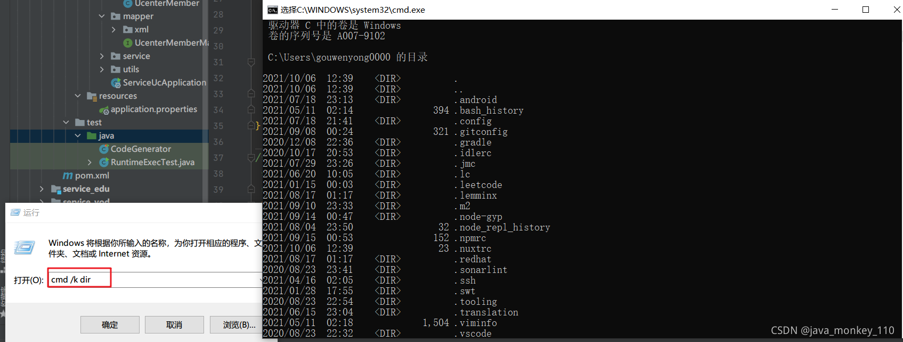
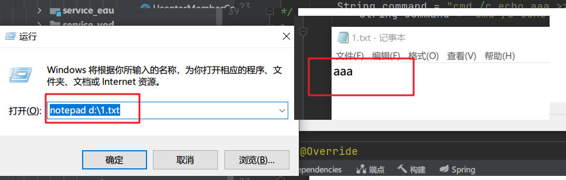
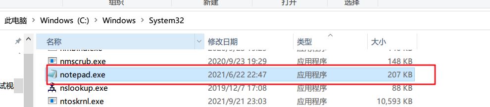

# 前言

每个 Java 应用程序都有一个 Runtime 类实例，使应用程序能够与其运行的环境相连接。可以通过 getRuntime 方法获取当前运行时。 应用程序不能创建自己的 Runtime 类实例。我们可以通过 Runtime.exec() 用来执行外部程序或命令

## 一、概述

在 Java 中要想执行脚本或者调用程序必须通过 ProcessBuilder 和 Runtime 类，以上两个类任选一个就行，关于他们的介绍如下：

`ProcessBuilder.start()` 和 `Runtime.exec()` 方法都被用来创建一个操作系统进程（执行命令行操作），并返回 Process 子类的一个实例，该实例可用来控制进程状态并获得相关信息。  
Process 类提供了执行从进程输入、执行输出到进程、等待进程完成、检查进程的退出状态以及销毁（杀掉）进程的方法。创建进程的方法可能无法针对某些本机平台上的特定进程很好地工作，比如，本机窗口进程，守护进程，Microsoft Windows 上的 Win16/DOS 进程，或者 shell 脚本。创建的子进程没有自己的终端或控制台。它的所有标准 io（即 stdin、stdout 和 stderr）操作都将通过三个流 (getOutputStream()、getInputStream() 和 getErrorStream()) 重定向到父进程。父进程使用这些流来提供到子进程的输入和获得从子进程的输出。因为有些本机平台仅针对标准输入和输出流提供有限的缓冲区大小，如果读写子 进程的输出流或输入流迅速出现失败，则可能导致子进程阻塞，甚至产生死锁。 当没有 Process 对象的更多引用时，不是删掉子进程，而是继续异步执行子进程。 对于带有 Process 对象的 Java 进程，没有必要异步或并发执行由 Process 对象表示的进程。  
每个 ProcessBuilder 实例管理一个进程属性集。ProcessBuilder 的 start() 方法利用这些属性创建一个新的 Process 实例。start() 方法可以从同一实例重复调用，以利用相同或者相关的属性创建新的子进程。  
不同点：  
ProcessBuilder.start() 和 Runtime.exec() 传递的参数有所不同，Runtime.exec() 可接受一个单独的字符串，这个字符串是通过空格来分隔可执行命令程序和参数的；也可以接受字符串数组参数。而 ProcessBuilder 的构造函数是一个字符串列表或者数组。列表中第一个参数是可执行命令程序，其他的是命令行执行是需要的参数。  
通过查看 JDK 源码可知，Runtime.exec 最终是通过调用 ProcessBuilder 来真正执行操作的。

## **二、Runtime 演示示例**

### 1. 在 windows 下调用 dos 命令：

下面演示了在 windows 下执行 dos 命令 "chdir"，并将执行结果输出的示例。

```java
public class TestDos {  
  
    /** 
     * 在windows下执行dos命令并在console端输出 
     *  
     * @throws Exception  
     */  
    public static void main(String[] args) throws Exception {  
        String strCmd = "chdir";//待执行的dos命令(chdir命令作用是列出当前的工作目录)  
        Process process = Runtime.getRuntime().exec("cmd /k " + strCmd);//通过cmd程序执行cmd命令  
        //process.waitFor();  
        //读取屏幕输出  
        BufferedReader strCon = new BufferedReader(new InputStreamReader(process.getInputStream()));  
        String line;  
        while ((line = strCon.readLine()) != null) {  
            System.out.println(line);  
            }  
    }  
}
```


如果不需要进行屏幕输出的话可以简写成如下方式：

```java
public class TestDos {  
  
    /** 
     * 在windows下调用dos命令 
     *  
     * @throws Exception  
     */  
    public static void main(String[] args) throws Exception {  
        String strCmd = "dos命令";//待执行的dos命令  
        Runtime.getRuntime().exec("cmd /c " + strCmd).waitFor();//通过cmd程序执行dos命令  
    }  
}
```


注：执行 dos 命令时，需在命令前加上 "cmd /x" 参数，其中 x 可以为 c 或者 k 值，具体说明如下：

cmd /c chdir 是执行完 dir 命令后关闭命令窗口。  
cmd /k chdir 是执行完 dir 命令后不关闭命令窗口。  
cmd /c start chdir 会打开一个新窗口后执行 dir 指令，原窗口会关闭。  
cmd /k start chdir 会打开一个新窗口后执行 dir 指令，原窗口不会关闭。

### 2. 在 windows 下调用外部程序：

下面演示了调用 QQ 程序的过程：

```java
/** 
 * 在windows下调用QQ程序示例 
 * */  
public class CallQQ {  
  
    /** 
     * @param args 
     * @throws Exception  
     */  
    public static void main(String[] args) throws Exception {  
        Runtime.getRuntime().exec("D:\\Program Files (x86)\\Tencent\\QQ\\QQProtect\\Bin\\QQProtect.exe");  
    }  
}
```


### 3. 在 Linux 下执行 shell 命令：

下面演示了在 Linux 中执行 shell 命令 pwd，并显示执行结果：

```java
/** 
 * 执行Linux的shell命令并在console端输出结果 
 */  
public class CallShell {  
  
    /** 
     * @throws Exception  
     */  
    public static void main(String[] args) throws Exception {  
        String strCmd = "pwd";//执行shell命令  
        Process process = Runtime.getRuntime().exec(strCmd);//通过执行cmd命令调用protoc.exe程序  
        BufferedReader strCon = new BufferedReader(new InputStreamReader(process.getInputStream()));  
        String line;  
        while ((line = strCon.readLine()) != null) {  
            System.out.println("java print:"+line);  
            }  
    }  
}
```


### 4. 在 Linux 下调用 shell 脚本并输出结果：


```java
/** 
 * 在linux下调用shell脚本并在console端输出脚本的执行结果 
 * */  
public class CallShell {  
  
    /** 
     * @throws Exception  
     */  
    public static void main(String[] args) throws Exception {  
        String strCmd = "/home/zhu/test/test.sh";//待调用shell脚本  
        Process process = Runtime.getRuntime().exec(strCmd);//通过执行cmd命令调用protoc.exe程序  
        BufferedReader strCon = new BufferedReader(new InputStreamReader(process.getInputStream()));  
        String line;  
        while ((line = strCon.readLine()) != null) {  
            System.out.println("java print:"+line);  
            }  
    }  
}
```


## 三、ProcessBuilder 使用示例

ProcessBuilder 的使用参考如下：

```java
String[] as = new String[]{“待执行命令 1”，"待执行命令 2"，.........};  
ProcessBuilder pb = new ProcessBuilder(as);  
pb.start();  
```

使用 ProcessBuilder 可以依次执行多个命令


案例
====

## Runtime.exec() 入门

+ `public Process exec(String command)-`----在单独的进程中执行指定的字符串命令。
+ `public Process exec(String [] cmdArray)`---在单独的进程中执行指定命令和变量
+ `public Process exec(String command, String [] envp)-`---在指定环境的独立进程中执行指定命令和变量
+ `public Process exec(String [] cmdArray, String [] envp)`----在指定环境的独立进程中执行指定的命令和变量
+ `public Process exec(String command,String[] envp,File dir)`----在有指定环境和工作目录的独立进程中执行指定的字符串命令
+ `public Process exec(String[] cmdarray,String[] envp,File dir)`----在指定环境和工作目录的独立进程中执行指定的命令和变量


Runtime.getRuntime().exec() 获得的就是 Process 类，exec() 方法有多个重载可以使用，针对不同的情况设置不同的参数。另外需要注意的是执行的 windows 和 linux 的命令的写法是不同的。

```java
import java.io.BufferedReader;
import java.io.IOException;
import java.io.InputStream;
import java.io.InputStreamReader;

public class RuntimeExecTest {

	@Test
    public  void test() {
	//linux  cmd命令
	Runtime.getRuntime().exec(new String[]{"/bin/sh","-c","javap -l xxx > output.txt"});//通过bin/sh  解释执行该命令

		//Windows  cmd
//        String[] cmd = new String[]{"shutdown" ,"-s" ,"-t" ,"3600"};//定时关机
        String[] cmd = new String[]{"cmd" ,"-s" ,"-t" ,"3600"};//定时关机
//        String[] cmd = new String[]{"cmd.exe", "/C", "wmic process get name"};//

        // 输出aaa到1.txt  然后 使用记事本打开该文件
        String command = "cmd /c echo aaa >> d:\\1.txt && notepad d:\\1.txt";// && 命令之间需连接符连接
        Process process=null;
        try {
            process = Runtime.getRuntime().exec(command，null); 
            new Thread(new SerializeTask(process.getInputStream())).start();//处理
            new Thread(new SerializeTask(process.getErrorStream())).start();
            process.getOutputStream().close();
            int exitValue = process.waitFor();
            if (process.exitValue() != 0) {
                    System.out.println("error!");
             }
            System.out.println("返回值：" + exitValue);
        } catch (Exception e) {
            e.printStackTrace();
        }finally{
            process.destroy();//关闭进程
        }

    }
}

/**
 * 打印输出线程
 */
class SerializeTask implements Runnable {
    private InputStream in;

    public SerializeTask(InputStream in) {
        this.in = in;
    }

    @Override
    public void run() {
        BufferedReader br = null;
        try {
            br = new BufferedReader(new InputStreamReader(in));
            String line = null;
            while ((line = br.readLine()) != null) {
                System.out.println(line);
            }
        } catch (IOException e) {
            e.printStackTrace();
        } finally {
            try {
                if (br != null)
                    br.close();
            } catch (IOException e) {
                e.printStackTrace();
            }
        }
    }
}
```

## 注意事项

* 等待命令执行结束用 `waitFor()`，其返回值就是命令的返回值。
* 如果出现程序执行被挂起，没有任何反应的情况，是由于没有读取命令子进程的正常输出流或错误输出流导致缓冲区被占满，进程被锁住。这个时候需要把输出流中的内容给读出来。最好的做法是使用两个线程，分别同时读取正常输出流和错误输出流。
* 执行 Windows 平台上的命令时使用`cmd.exe /C`，如`cmd.exe /C dir`。
* `Process.getOutputStream()` 写入命令时需要以换行符结束`\n`
* 记得关闭命令子进程的输出流，通过`Process.getOutputStream().close()`，这样不会导致命令子进程被锁住。
* Runtime.exec() 不等同于直接执行 command line 命令。Runtime.exec() 很有局限性, 对有些命令不能直接把 command line 里的内容当作 String 参数传给 exec(). 比如重定向等命令。举个例子:`javap -l xxx > output.txt`。这时要用到 exec 的第二种重载，即 input 参数为`String[]:Process p = Runtime.getRuntime().exec(new String[]{"/bin/sh","-c","javap -l xxx > output.txt"});//通过bin/sh 解释执行该命令`
* 多个命令需要组合执行时，可以使用 && 命令连接符，或者通过Proccess的outputstream输入执行，参考下一节工具类

  > 当我们需要一次执行多个命令的时候，命令之间需要用连接符连接，不同的连接符有不同的效果。下面我们总结一下，加以区分。
  >
  > (1)  `;` 
  >
  > 分号，没有任何逻辑关系的连接符。当多个命令用分号连接时，各命令之间的执行成功与否彼此没有任何影响，都会一条一条执行下去。
  >
  > (2) `||`
  >
  > 逻辑或，当用此连接符连接多个命令时，前面的命令执行成功，则后面的命令不会执行。前面的命令执行失败，后面的命令才会执行。
  >
  > (3) `&&`
  >
  > 逻辑与，当用此连接符连接多个命令时，前面的命令执行成功，才会执行后面的命令，前面的命令执行失败，后面的命令不会执行，与 || 正好相反。
  >
  > (4) `|`
  >
  > 管道符，当用此连接符连接多个命令时，前面命令执行的正确输出，会交给后面的命令继续处理。若前面的命令执行失败，则会报错，若后面的命令无法处理前面命令的输出，也会报错。
  >
  > 例 ls | grep *.txt

##  cmd 解释器执行命令详解

部分 cmd 命令需要 cmd 解释器来执行【在系统内不存在相应 notepad.exe ping.exe ，winrar【需要提前配置环境变量】等具体可执行文件】，所以 java Runtime 执行 dir 会报错，，需要使用`cmd /c dir`  
`/c` : 打开命令窗口执行完毕自动关闭  
`/k`：打开命令窗口执行完毕不自动关闭

* `cmd /c dir` 是执行完dir命令后关闭命令窗口。
* `cmd /k dir` 是执行完dir命令后不关闭命令窗口。
* `cmd /c start dir` 会打开一个新窗口后执行dir指令，原窗口会关闭。
* `cmd /k start dir` 会打开一个新窗口后执行dir指令，原窗口不会关闭。

> 可以通过 win+R 运行窗口打开测试 notepad 类型的命令是在系统内存在`notepad d:\1.txt`  
>   
>   
> 

## CMD - OutputStream连续输入命令模式

```java
import java.io.*;
import java.util.Scanner;

public class Test1 {

    public static void main(String[] args) {

        try {
            Runtime runtime = Runtime.getRuntime();
            String[] cmds = {"cmd", "/k"};//此处必须用/k参数
            Process exec = runtime.exec(cmds);

            BufferedReader ResultErrorBuff = new BufferedReader(new InputStreamReader(exec.getErrorStream(), "gbk"));
            BufferedReader ResultSuccessBuff = new BufferedReader(new InputStreamReader(exec.getInputStream(), "gbk"));

            //处理回显
            new Thread(() -> processingReturnValues(ResultSuccessBuff)).start();
            new Thread(() -> processingReturnValues(ResultErrorBuff)).start();


            BufferedWriter bufferedWriter = new BufferedWriter(new OutputStreamWriter(exec.getOutputStream(), "gbk"));
            Scanner scanner = new Scanner(System.in);
            while (true) {
                System.out.print("输入需要执行的命令>>>");
                String inCmd = scanner.nextLine();

                if (inCmd.equals("break")) {
                    bufferedWriter.write("exit");
                    bufferedWriter.newLine();
                    bufferedWriter.flush();
                    //等价于
                    exec.destroy();
                    break;
                }
                bufferedWriter.write(inCmd);
                bufferedWriter.newLine();//必须输入换行符  cmd默认按换行符 拆包
                bufferedWriter.flush();
            }
            System.out.println("exec.waitFor() = " + exec.waitFor());

        } catch (IOException | InterruptedException e) {
            throw new RuntimeException(e);
        }
    }
	//处理回显函数
    private static void processingReturnValues(BufferedReader ResultErrorBuff) {
        try {
            String line = null;
            while ((line = ResultErrorBuff.readLine()) != null) {
                System.out.println(line);
            }
        } catch (IOException e) {
            throw new RuntimeException(e);
        } finally {
            if (ResultErrorBuff != null) {
                try {
                    ResultErrorBuff.close();
                } catch (IOException e) {
                    throw new RuntimeException(e);
                }
            }
        }
    }
}
```

# Apache Common-Exec 

强烈建议使用 apache 的第三方库，该库提供了更加详细的设置和监控方法等等。

执行的命令被称为 CommandLine，可使用该类的 addArgument() 方法为其添加参数，parse() 方法将你提供的命令包装好一个可执行的命令。命令是由执行器 Executor 类来执行的，DefaultExecutor 类的 execute() 方法执行命令，exitValue 也可以通过该方法返回接收。设置 ExecuteWatchdog 可指定进程在出错后多长时间结束，这样有效防止了 run-away 的进程。此外 common-exec 还支持异步执行，Executor 通过设置一个 ExecuteResultHandler 类，该类的实例会接收住错误异常和退出代码。

```java
CommandLine cmdLine = new CommandLine("AcroRd32.exe");
cmdLine.addArgument("/p");
    cmdLine.addArgument("/h");
    cmdLine.addArgument("${file}");
    HashMap map = new HashMap();
    map.put("file", new File("invoice.pdf"));
    commandLine.setSubstitutionMap(map);

    DefaultExecuteResultHandler resultHandler = new DefaultExecuteResultHandler();

    ExecuteWatchdog watchdog = new ExecuteWatchdog(60*1000);
    Executor executor = new DefaultExecutor();
    executor.setExitValue(1);
    executor.setWatchdog(watchdog);
    executor.execute(cmdLine, resultHandler);

    // some time later the result handler callback was invoked so we
    // can safely request the exit value
    int exitValue = resultHandler.waitFor();
```


# java shell命令工具类

```java
import java.io.BufferedReader;
import java.io.DataOutputStream;
import java.io.IOException;
import java.io.InputStreamReader;
import java.util.List;

/**
 * java shell命令工具类
 * 借助OutputStream  执行多条命令的组合  注意以\n  表示结束
 * 
 * javac JavaShellUtil.java -encoding utf-8
 */
public class JavaShellUtil {

    public static String lineSeparator = System.getProperty("line.separator");
    public static String COMMAND_SH = "sh";
    public static String COMMAND_EXIT = "exit\n";
    public static String COMMAND_LINE_END = "\n";

    static {
        if (System.getProperty("os.name").toUpperCase().contains("WINDOWS")) {
            System.out.println("window");
            COMMAND_SH = "cmd";
        } else {
            System.out.println("unix");
        }

    }

    public static void main(String[] args) {

        //启动一个Process  ，借助outputstream输出多条命令
        System.out.println(JavaShellUtil.execCommand("dir").toString());
        System.out.println(JavaShellUtil.execCommand("ls -l").toString());
        //System.out.println(JavaShellUtil.execCommand("ping www.baidu.com").toString());
        System.out.println(JavaShellUtil.execCommand("aapt v").toString());
        System.out.println(JavaShellUtil.execCommand("aapt.exe").toString());

    }

    public static CommandResult execCommand(String command) {
        return execCommand(new String[]{command}, true);
    }

    public static CommandResult execCommand(String command, boolean isNeedResultMsg) {
        return execCommand(new String[]{command}, isNeedResultMsg);
    }

    public static CommandResult execCommand(List<String> commands, boolean isNeedResultMsg) {
        return execCommand(commands == null ? null : commands.toArray(new String[]{}), isNeedResultMsg);
    }

    /**
     * execute shell commands
     * {@link CommandResult#result} is -1, there maybe some excepiton.
     *
     * @param commands     command array
     * @param needResponse whether need result msg
     */
    public static CommandResult execCommand(String[] commands, final boolean needResponse) {
        int result = -1;
        if (commands == null || commands.length == 0) {
            return new CommandResult(result, null, "空命令");
        }

        Process process = null;

        final StringBuilder successMsg = new StringBuilder();
        final StringBuilder errorMsg = new StringBuilder();

        DataOutputStream os = null;
        try {
            process = Runtime.getRuntime().exec(COMMAND_SH);
            os = new DataOutputStream(process.getOutputStream());
            for (String command : commands) {
                if (command == null) {
                    continue;
                }
                // donnot use os.writeBytes(commmand), avoid chinese charset error
                os.write(command.getBytes());
                os.writeBytes(COMMAND_LINE_END);
                os.flush();
            }
            os.writeBytes(COMMAND_EXIT);
            os.flush();

            
            //启动两个线程,解决process.waitFor()阻塞问题
            final BufferedReader successReadBuff = new BufferedReader(new InputStreamReader(process.getInputStream()));
            final BufferedReader errorReadBuff = new BufferedReader(new InputStreamReader(process.getErrorStream()));
            new Thread(new Runnable() {
                public void run() {
                    try {
                        if (needResponse) {
                            String s;
                            while ((s = successReadBuff.readLine()) != null) {
                                successMsg.append(s);
                                successMsg.append(lineSeparator);
                            }
                        }
                    } catch (IOException e) {
                        e.printStackTrace();
                    }
                }
            }).start();
            new Thread(new Runnable() {
                public void run() {
                    try {
                        if (needResponse) {
                            String s;
                            while ((s = errorReadBuff.readLine()) != null) {
                                errorMsg.append(s);
                                errorMsg.append(lineSeparator);
                            }
                        }
                    } catch (IOException e) {
                        e.printStackTrace();
                    }
                }
            }).start();
            result = process.waitFor();
            if (errorReadBuff != null) {
                errorReadBuff.close();
            }
            if (successReadBuff != null) {
                successReadBuff.close();
            }

        } catch (Exception e) {
            e.printStackTrace();
        } finally {
            try {
                if (os != null) {
                    os.close();
                }
            } catch (IOException e) {
                e.printStackTrace();
            } finally {
                if (process != null) {
                    process.destroy();//关闭进程
                }
            }

        }
        return new CommandResult(result, successMsg == null ? null : successMsg.toString(), errorMsg == null ? null
                : errorMsg.toString());
    }

    public static class CommandResult {

        public int result;
        public String responseMsg;
        public String errorMsg;

        public CommandResult(int result) {
            this.result = result;
        }

        public CommandResult(int result, String responseMsg, String errorMsg) {
            this.result = result;
            this.responseMsg = responseMsg;
            this.errorMsg = errorMsg;
        }

        @Override
        public String toString() {
            return "CommandResult{" +
                    "errorMsg='" + errorMsg + '\'' +
                    ", result=" + result +
                    ", responseMsg='" + responseMsg + '\'' +
                    '}';
        }
    }
}
```

# Java解惑82 

如果你用一行命令行带上参数 slave 去运行这个程序，它会打印什么呢？如果你使用的命令行不带任何参数，它又会打印什么呢

```java
public class BeerBlast {
    static final String COMMAND = "java BeerBlast slave";

    public static void main(String[] args) throws Exception {
        if (args.length == 1 && args[0].equals("slave")) {

            for (int i = 99; i > 0; i--) {
                System.out.println(i +
                        " bottles of beer on the wall");
                System.out.println(i + " bottles of beer");
                System.out.println(
                        "You take on down, pass it around,");
                System.out.println((i - 1) +
                        " bottles of beer on the wall");
                System.out.println();
            }
        } else {
// Master
            Process process = Runtime.getRuntime().exec(COMMAND);
            int exitValue = process.waitFor();
            System.out.println("exit value = " + exitValue);
        }
    }
}
```


解惑：

如果你使用参数 slave 来运行该程序，它就会打印出那首激动人心的名为”99 Bottles of Beer on the Wall”的童谣的歌词，这没有什么神秘的。如果你不使用该参数来运行这个程序，它会启动一个 slave 进程来打印这首歌谣，但是你看不到 slave 进程的输出。主进程会等待 slave 进程结束，然后打印出 slave进程的退出值(exit value)。根据惯例，0 值表示正常结束，所以 0 就是你可能期望该程序打印的东西。如果你运行了程序，你可能会发现该程序只会悬挂在那里，不会打印任何东西，看起来 slave 进程好像永远都在运行着。所以你可能会
觉得你应该一直都能听到”99 Bottles of Beer on the Wall”这首童谣，即使是这首歌被唱走调了也是如此，但是这首歌只有 99 句，而且，电脑是很快的，你假设的情况应该是不存在的，那么这个程序出了什么问题呢？

这个秘密的线索可以在 Process 类的文档中找到，它叙述道：“由于某些本地平台只提供有限大小的缓冲，所以如果未能迅速地读取子进程(subprocess)的输出流，就有可能会导致子进程的阻塞，甚至是死锁” [Java-API]。这恰好就是这里所发生的事情：没有足够的缓冲空间来保存这首冗长的歌谣。为了确保 slave进程能够结束，父进程必须排空(drain)它的输出流，而这个输出流从 master线程的角度来看是输入流。下面的这个工具方法会在后台线程中完成这项工作：

```java

static void drainInBackground(final InputStream is) {
    new Thread(new Runnable(){
            public void run(){
            try{
                while( is.read() >= 0 );
            } catch(IOException e){
            // return on IOException
            }
    }
}).start();
```

如果我们修改原有的程序，在等待 slave 进程之前调用这个方法，程序就会打印出 0：

```java
}else{ // Master
Process process = Runtime.getRuntime().exec(COMMAND);
drainInBackground(process.getInputStream());
int exitValue = process.waitFor();
System.out.println("exit value = " + exitValue);
}
```

这里的教训是：**为了确保子进程能够结束，你必须排空它的输出流；对于错误流（error stream）也是一样**，而且它可能会更麻烦，因为你无法预测进程什么时候会倾倒（dump）一些输出到这个流中。在 5.0 版本中，加入了一个名为ProcessBuilder 的类用于排空这些流。它的 redirectErrorStream 方法将各个流合并起来，所以你只需要排空这一个流**。如果你决定不合并输出流和错误流，你必须并行地（concurrently）排空它们**。试图顺序化地（sequentially）排空它们会导致子进程被挂起。多年以来，很多程序员都被这个缺陷所刺痛。这里对于 API 计者们的教训是，Process 类应该避免这个错误，也许应该自动地排空输出流和错误流，除非用户表示要读取它们。更一般的讲，API 应该设计得更容易做出正确的事，而很难或不可能做出错误的事。


# FQA一些注意事项：

**Java中Process和Runtime()使用，以及调用cmd命令阻塞在process.waitfor( )的问题解决**

在java中调用php程序，由于有很多控制台输出，导致一直阻塞在process.waitfor( )，只有强制终止java程序后，结果文件才会输出。根据下面两个博客内容成功解决。

用Java编写应用时，有时需要在程序中调用另一个现成的可执行程序或系统命令，这时可以通过组合使用Java提供的Runtime类和Process类的方法实现。下面是一种比较典型的程序模式：

```java
　　Process process = Runtime.getRuntime().exec("p.exe");
　　process.waitfor( );
```

在上面的程序中，第一行的“p.exe”是要执行的程序名；Runtime.getRuntime()返回当前应用程序的Runtime对象，该对象的exec()方法指示Java虚拟机创建一个子进程执行指定的可执行程序，并返回与该子进程对应的Process对象实例。通过Process可以控制该子进程的执行或获取该子进程的信息。第二条语句的目的等待子进程完成再往下执行。但在windows平台上，如果处理不当，有时并不能得到预期的结果。

下面是笔者在实际编程中总结的几种需要注意的情况：

　　1、执行DOS的内部命令如果要执行一条DOS内部命令，有两种方法。一种方法是把命令解释器包含在exec()的参数中。例如，执行dir命令，在NT上，可写成`exec ("cmd.exe /c dir")，`在windows 95/98下，可写成“`command.exe/c dir`”，**其中参数“/c”表示命令执行后关闭Dos立即关闭窗口**。另一种方法是，把内部命令放在一个批命令my_dir.bat文件中，在Java程序中写成exec("my_dir.bat")。如果仅仅写成exec("dir")，Java虚拟机则会报运行时错误。前一种方法要保证程序的可移植性，需要在程序中读取运行的操作系统平台，以调用不同的命令解释器。后一种方法则不需要做更多的处理。

　　　2、打开一个不可执行的文件打开一个不可执行的文件，但该文件存在关联的应用程序，则可以有两种方式。以打开一个word文档a.doc文件为例，Java中可以有以下两种写法：

```java
exec("start a.doc");

exec(" c:\\Program Files\\MicrosoftOffice\\office winword.exe a.doc");
```

显然，前一种方法更为简捷方便。

　　　3、**执行一个有标准输出的DOS可执行程序在windows 平台上，运行被调用程序的DOS窗口在程序执行完毕后往往并不会自动关闭，从而导致Java应用程序阻塞在waitfor( )。导致该现象的一个可能的原因是，该可执行程序的标准输出比较多，而运行窗口的标准输出缓冲区不够大。解决的办法是，利用Java提供的Process 类提供的方法让Java虚拟机截获被调用程序的DOS运行窗口的标准输出，在waitfor()命令之前读出窗口的标准输出缓冲区中的内容。**

一段典型的程序如下：

```java
String str;
Process process =Runtime.getRuntime().exec("cmd /c dir windows");
BufferedReader bufferedReader = newBufferedReader( new InputStreamReader(process.getInputStream()));
while ( (str=bufferedReader.readLine()) !=null) { System.out.println(str); 　}

process.waitfor(); 
```

示例这里换成

```java
public static boolean  resize(String   pic,String   picTo,int width,int height)  {

    boolean result = true;
    String cmd = "cmd /c  convert -sample " + width + "x" + height + "   "" + pic + """ +"   "" + picTo+""";
    log.debug(cmd);
    try {
        Process process = Runtime.getRuntime().exec(cmd);
        if (process.getErrorStream().read() != -1) {
            result = false;
            process.destroy();
        }
    } catch (IOException e) {
        log.debug("creat icon pic fail!" + e);
        result = false;
    }

    /*BufferedReader bufferedReader = new BufferedReader( newInputStreamReader(process.getInputStream());
        while ( (str=bufferedReader.readLine()) != null)System.out.println(str); 　 */
    return result;

}
```

我使用上面的程序处理不好使。然后通过搜索相关文章看到了如下内容。问题被解决。^-^

```java
Process process = Runtime.getRuntime.exec(cmd); // 执行调用命令

InputStream is = process.getInputStream(); // 获取对应进程的输出流
BufferedReader br = new Buffered(new InputStreamReader(is)); // 缓冲读入
StringBuilder buf = new StringBuilder(); // 保存对应进程的输出结果流
String line = null;
while((line = br.readLine()) != null) buf.append(line); // 循环等待进程结束
System.out.println("ffmpeg输出内容为：" + buf);
……
```

 本来一般都是这样来调用程序并获取进程的输出流的，但是我在windows上执行这样的调用的时候却总是在while那里被堵塞了，结果造成ffmpeg程序在执行了一会后不再执行，这里从官方的参考文档中我们可以看到这是由于缓冲区的问题，由于java进程没有清空ffmpeg程序写到缓冲区的内容，结果导致ffmpeg程序一直在等待。在网上也查找了很多这样的问题，不过说的都是使用单独的线程来进行控制，我也尝试过很多网是所说的方法，可一直没起什么作用。下面就是我的解决方法了，注意到上述代码中的红色部分了么？这里就是关键，我把它改成如下结果就可以正常运行了。

```java
InputStream is = process.getErrorStream(); // 获取ffmpeg进程的输出流
```

 注意到没？我把它改成获取错误流这样进程就不会被堵塞了，而我之前一直想的是同样的命令我手动调用的时候可以完成，而java调用却总是完成不了，一直认为是getInputStream的缓冲区没有被清空，不过问题确实是缓冲区的内容没有被清空，但不是getInputStream的，而是getErrorStream的缓冲区，这样问题就得到解决了。所以我们在遇到java调用外部程序而导致线程阻塞的时候，可以考虑使用两个线程来同时清空process获取的两个输入流，如下这段程序：

```java
……
Process p = Runtime.getRuntime().exec("php.exe test.php");
//Process p = Runtime.getRuntime().exec("cmd.exe /c dir");
final InputStream is1 = p.getInputStream();

new Thread(new Runnable() {
    public void run() {
        BufferedReader br = new BufferedReader(new InputStreamReader(is1));
        try {
            while (br.readLine() != null) ;
        } catch (Exception e) {
            e.printStackTrace();
        }
    }

}).start(); // 启动单独的线程来清空p.getInputStream()的缓冲区

InputStream is2 = p.getErrorStream();
BufferedReader br2 = new BufferedReader(new InputStreamReader(is2));
StringBuilder buf = new StringBuilder(); // 保存输出结果流
String line = null;
while ((line = br2.readLine()) != null) buf.append(line); //
System.out.println("输出结果为：" + buf);
……
```

 通过这样我们使用一个线程来读取process.getInputStream()的输出流，使用另外一个线程来获取process.getErrorStream()的输出流，这样我们就可以保证缓冲区得到及时的清空而不担心线程被阻塞了。当然根据需要你也可以保留process.getInputStream()流中的内容，这个就看调用的程序的处理了。

假如源码内发现用了大量System.err.print，需要使用getErrorStream()捕捉！关于System.err和System.out的区别，可以参考别的日志。这两个流走的是不同的管道。所以需要分别捕捉。


# exec方法envp设置系统环境变量参数

因为没有设置到Python的系统环境变量，所以执行Python脚本时，要设置

```java
public static void main(String[] args) {
	String[] cmdarray = new String[] { "cmd", "/c", "python D:\\python2\\test.py"};
	String[] envp = new String[] {"path=D:\\Anaconda3\\envs\\leantwo"};
	try {
		Process process = Runtime.getRuntime().exec(cmdarray, envp);
		BufferedReader in = new BufferedReader(
		new InputStreamReader(process.getInputStream()));
		String line = null;
		while ((line = in.readLine()) != null) {
			System.out.println(line);
		}
		in.close();
		int re = process.waitFor();
		System.out.println(re);
	} catch (Exception e) {
		e.printStackTrace();
	}
}
```


### 前言

环境变量这个概念不陌生， 就是操作系统的环境变量。

系统变量就是java本身维护的变量。 通过 System.getProperty 的方式获取。

对于不同的操作系统来说， 环境变量的处理可能会有一些不统一的地方， 比如说： 不区分大小写 等等。

### Java 获取环境变量

Java 获取环境变量的方式很简单：

```java
//System.getEnv()  得到所有的环境变量
//System.getEnv(key) 得到某个环境变量的值

Map map = System.getenv();
	Iterator it = map.entrySet().iterator();
	while(it.hasNext())	{
		Entry entry = (Entry)it.next();
		System.out.print(entry.getKey()+"=");
		System.out.println(entry.getValue());
	}
```

如果是windows 系统， 打印出来的值通过从 “我的电脑” 里看到的环境变量是一样的。

### Java 获取和设置系统变量

Java 获取环境变量的方式也很简单：

```java
//System.getProperties()  得到所有的系统变量
//System.getProperty(key)  得到某个系统变量的值	

Properties properties = System.getProperties();
	Iterator it =  properties.entrySet().iterator();
	while(it.hasNext()){
		Entry entry = (Entry)it.next();
		System.out.print(entry.getKey()+"=");
		System.out.println(entry.getValue());
	}
```

 系统变量除了可以获取之外， 还可以通过System.setProperty(key, value)  的方式设置自己需要的系统变量。


默认情况下， java 设置了哪些系统变量：

```
java.version Java 运行时环境版本
java.vendor Java 运行时环境供应商
java.vendor.url Java 供应商的 URL
java.home Java 安装目录
java.vm.specification.version Java 虚拟机规范版本
java.vm.specification.vendor Java 虚拟机规范供应商
java.vm.specification.name Java 虚拟机规范名称
java.vm.version Java 虚拟机实现版本
java.vm.vendor Java 虚拟机实现供应商
java.vm.name Java 虚拟机实现名称
java.specification.version Java 运行时环境规范版本
java.specification.vendor Java 运行时环境规范供应商
java.specification.name Java 运行时环境规范名称
java.class.version Java 类格式版本号
java.class.path Java 类路径
java.library.path 加载库时搜索的路径列表
java.io.tmpdir 默认的临时文件路径
java.compiler 要使用的 JIT 编译器的名称
java.ext.dirs 一个或多个扩展目录的路径
os.name 操作系统的名称
os.arch 操作系统的架构
os.version 操作系统的版本
file.separator 文件分隔符(在 UNIX 系统中是"/")
path.separator 路径分隔符(在 UNIX 系统中是":")
line.separator 行分隔符(在 UNIX 系统中是"/n")
user.name 用户的账户名称
user.home 用户的主目录
user.dir 用户的当前工作目录
```


补充

1. 在.bat ;  .cmd 或  .sh 中会通过 set 的方式设置一些变量，

比如weblogic 的 setDomainEnv.cmd

set SUN_JAVA_HOME=C:\Oracle\Middleware\jdk160_21

这里设置的是环境变量

2. 在log4j 的配置中， 有时会配置log file 的产生路径。 

比如 ${LOG_DIR}/logfile.log， 这里的LOG_DIR 是被系统属性的变量替换的。

3. 看一下java 源码， 通过 System.getProperties() 的方式获取系统变量时， 会有一个安全的检查

```java
public static Properties getProperties() {
SecurityManager sm = getSecurityManager();
    if (sm != null) {
    sm.checkPropertiesAccess();
}

return props;
}
```

在 单个Java application  测试时， System 里的SecurityManager 是空的。
在Applet 运行时， 会结合 .policy 这个文件来检查权限。

如果给一个空的SecurityManager 会发现就会抛出权限异常。

```java
public static void main(String[] args) {
	// TODO Auto-generated method stub
	System.setSecurityManager(new SecurityManager());
	//SecurityManager sm = System.getSecurityManager();
	//System.out.println(sm);
	System.getSecurityManager().checkPropertiesAccess();
}
```


## 环境变量不生效排查

+ 环境变量未生效  通过**检查打印当时环境变量**
+ **检查环境变量是否配置**或者i**dea重启，生效变量**