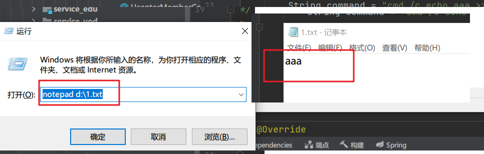

# 前言

每个 Java 应用程序都有一个 Runtime 类实例，使应用程序能够与其运行的环境相连接。可以通过 getRuntime 方法获取当前运行时。 应用程序不能创建自己的 Runtime 类实例。我们可以通过 Runtime.exec() 用来执行外部程序或命令


入门案例
====

## Runtime.exec() 有四种调用方法

*   `public Process exec(String command);`
*   `public Process exec(String [] cmdArray);`
*   `public Process exec(String command, String [] envp);`
*   `public Process exec(String [] cmdArray, String [] envp);`


下面通过一个 Demo 来 展示 如何用 Java 来调用 Windows 上的 wmic 命令来获取系统中当前的进程信息。

```java
import java.io.BufferedReader;
import java.io.IOException;
import java.io.InputStream;
import java.io.InputStreamReader;

public class RuntimeExecTest {
    /**
     * @param args
     */
    public static void main(String[] args) {
        test();
    }

    private static void test() {
	//linux  cmd命令
	Runtime.getRuntime().exec(new String[]{"/bin/sh","-c","javap -l xxx > output.txt"});//通过bin/sh  解释执行该命令

		//Windows  cmd
//        String[] cmd = new String[]{"shutdown" ,"-s" ,"-t" ,"3600"};//定时关机
        String[] cmd = new String[]{"cmd" ,"-s" ,"-t" ,"3600"};//定时关机

//        String[] cmd = new String[]{"cmd.exe", "/C", "wmic process get name"};

        // 输出aaa到1.txt  然后 使用记事本打开该文件
        String command = "cmd /c echo aaa >> d:\\1.txt && notepad d:\\1.txt";// && 命令之间需连接符连接
        Process process=null;
        try {
            process = Runtime.getRuntime().exec(command，null); 
            new Thread(new SerializeTask(process.getInputStream())).start();
            new Thread(new SerializeTask(process.getErrorStream())).start();
            process.getOutputStream().close();
            int exitValue = process.waitFor();
            System.out.println("返回值：" + exitValue);
        } catch (Exception e) {
            e.printStackTrace();
        }finally{
            process.destroy();//关闭进程
        }

    }
}

/**
 * 打印输出线程
 */
class SerializeTask implements Runnable {
    private InputStream in;

    public SerializeTask(InputStream in) {
        this.in = in;
    }

    @Override
    public void run() {
        BufferedReader br = null;
        try {
            br = new BufferedReader(new InputStreamReader(in));
            String line = null;
            while ((line = br.readLine()) != null) {
                System.out.println(line);
            }
        } catch (IOException e) {
            e.printStackTrace();
        } finally {
            try {
                if (br != null)
                    br.close();
            } catch (IOException e) {
                e.printStackTrace();
            }
        }
    }
}
```

注意事项
----

* 等待命令执行结束用 waitFor()，其返回值就是命令的返回值。

* 如果出现程序执行被挂起，没有任何反应的情况，是由于没有读取命令子进程的正常输出流或错误输出流导致缓冲区被占满，进程被锁住。这个时候需要把输出流中的内容给读出来。最好的做法是使用两个线程，分别同时读取正常输出流和错误输出流。

* 执行 Windows 平台上的命令时使用`cmd.exe /C`，如`cmd.exe /C dir`。

* 记得关闭命令子进程的输出流，通过`Process.getOutputStream().close()`，这样不会导致命令子进程被锁住。

* Runtime.exec() 不等同于直接执行 command line 命令。Runtime.exec() 很有局限性, 对有些命令不能直接把 command line 里的内容当作 String 参数传给 exec(). 比如重定向等命令。举个例子:`javap -l xxx > output.txt`。这时要用到 exec 的第二种重载，即 input 参数为`String[]:Process p = Runtime.getRuntime().exec(new String[]{"/bin/sh","-c","javap -l xxx > output.txt"});//通过bin/sh 解释执行该命令`

* 多个命令需要组合执行时，可以使用 && 命令连接符，或者通过Proccess的outputstream输入执行，参考下一节工具类

  > 当我们需要一次执行多个命令的时候，命令之间需要用连接符连接，不同的连接符有不同的效果。下面我们总结一下，加以区分。
  >
  > (1)  `;` 
  >
  > 分号，没有任何逻辑关系的连接符。当多个命令用分号连接时，各命令之间的执行成功与否彼此没有任何影响，都会一条一条执行下去。
  >
  > (2) `||`
  >
  > 逻辑或，当用此连接符连接多个命令时，前面的命令执行成功，则后面的命令不会执行。前面的命令执行失败，后面的命令才会执行。
  >
  > (3) `&&`
  >
  > 逻辑与，当用此连接符连接多个命令时，前面的命令执行成功，才会执行后面的命令，前面的命令执行失败，后面的命令不会执行，与 || 正好相反。
  >
  > (4) `|`
  >
  > 管道符，当用此连接符连接多个命令时，前面命令执行的正确输出，会交给后面的命令继续处理。若前面的命令执行失败，则会报错，若后面的命令无法处理前面命令的输出，也会报错。
  >
  > 例 ls | grep *.txt

##  cmd 解释器执行命令详解

部分 [cmd](https://so.csdn.net/so/search?q=cmd&spm=1001.2101.3001.7020) 命令需要 cmd 解释器来执行【在系统内不存在相应 notepad.exe ping.exe ，winrar【需要提前配置环境变量】等具体可执行文件】，所以 java Runtime 执行 dir 会报错，，需要使用`cmd /c dir`  
`/c` : 打开命令窗口执行完毕自动关闭  
`/k`：打开命令窗口执行完毕不自动关闭

> 可以通过 win+R 打开测试 notepad 类型的命令是在系统内存在`notepad d:\1.txt`  
>   
>   
> 

## eg. java 利用控制台 与cmd输入交互

```java
public class Test1 {

    public static void main(String[] args) {

        try {
            Runtime runtime = Runtime.getRuntime();
            String[] cmds = {"cmd", "/k"};//此处必须用/k参数
            Process exec = runtime.exec(cmds);

            BufferedReader  ResultErrorBuff = new BufferedReader(new InputStreamReader(exec.getErrorStream(), "gbk"));
            BufferedReader  ResultSuccessBuff = new BufferedReader(new InputStreamReader(exec.getInputStream(), "gbk"));

            //处理回显
            new Thread(new Runnable() {
                @Override
                public void run() {
                    try {
                        String line = null;
                        while ((line = ResultSuccessBuff.readLine()) != null) {
                            System.out.println(line);
                        }
                    } catch (IOException e) {
                        throw new RuntimeException(e);
                    }finally {
                        if (ResultSuccessBuff != null) {
                            try {
                                ResultSuccessBuff.close();
                            } catch (IOException e) {
                                throw new RuntimeException(e);
                            }
                        }
                    }
                }
            }).start();
            new Thread(new Runnable() {
                @Override
                public void run() {
                    try {
                        String line = null;
                        while ((line = ResultErrorBuff.readLine()) != null) {
                            System.out.println(line);
                        }
                    } catch (IOException e) {
                        throw new RuntimeException(e);
                    } finally {
                        if (ResultErrorBuff != null) {
                            try {
                                ResultErrorBuff.close();
                            } catch (IOException e) {
                                throw new RuntimeException(e);
                            }
                        }
                    }
                }
            }).start();


            BufferedWriter bufferedWriter = new BufferedWriter(new OutputStreamWriter(exec.getOutputStream(),"gbk"));
            Scanner scanner = new Scanner(System.in);
            while (true) {
                System.out.print("输入需要执行的命令>>>");
                String inCmd = scanner.nextLine();

                if (inCmd.equals("break")){
                    bufferedWriter.write("exit");
                    bufferedWriter.newLine();
                    bufferedWriter.flush();
                    //等价于
                    exec.destroy();
                    break;
                }
                bufferedWriter.write(inCmd);
                bufferedWriter.newLine();
                bufferedWriter.flush();
            }
            System.out.println("exec.waitFor() = " + exec.waitFor());

        } catch (IOException | InterruptedException e) {
            throw new RuntimeException(e);
        } 
    }
}
```

# java shell命令工具类

```java
import java.io.BufferedReader;
import java.io.DataOutputStream;
import java.io.IOException;
import java.io.InputStreamReader;
import java.util.List;

/**
 * java shell命令工具类
 * 借助OutputStream  执行多条命令的组合  注意以\n  表示结束
 * 
 * javac JavaShellUtil.java -encoding utf-8
 */
public class JavaShellUtil {

    public static String lineSeparator = System.getProperty("line.separator");
    public static String COMMAND_SH = "sh";
    public static String COMMAND_EXIT = "exit\n";
    public static String COMMAND_LINE_END = "\n";

    static {
        if (System.getProperty("os.name").toUpperCase().contains("WINDOWS")) {
            System.out.println("window");
            COMMAND_SH = "cmd";
        } else {
            System.out.println("unix");
        }

    }

    public static void main(String[] args) {

        //启动一个Process  ，借助outputstream输出多条命令
        System.out.println(JavaShellUtil.execCommand("dir").toString());
        System.out.println(JavaShellUtil.execCommand("ls -l").toString());
        //System.out.println(JavaShellUtil.execCommand("ping www.baidu.com").toString());
        System.out.println(JavaShellUtil.execCommand("aapt v").toString());
        System.out.println(JavaShellUtil.execCommand("aapt.exe").toString());

    }

    public static CommandResult execCommand(String command) {
        return execCommand(new String[]{command}, true);
    }

    public static CommandResult execCommand(String command, boolean isNeedResultMsg) {
        return execCommand(new String[]{command}, isNeedResultMsg);
    }

    public static CommandResult execCommand(List<String> commands, boolean isNeedResultMsg) {
        return execCommand(commands == null ? null : commands.toArray(new String[]{}), isNeedResultMsg);
    }

    /**
     * execute shell commands
     * {@link CommandResult#result} is -1, there maybe some excepiton.
     *
     * @param commands     command array
     * @param needResponse whether need result msg
     */
    public static CommandResult execCommand(String[] commands, final boolean needResponse) {
        int result = -1;
        if (commands == null || commands.length == 0) {
            return new CommandResult(result, null, "空命令");
        }

        Process process = null;

        final StringBuilder successMsg = new StringBuilder();
        final StringBuilder errorMsg = new StringBuilder();

        DataOutputStream os = null;
        try {
            process = Runtime.getRuntime().exec(COMMAND_SH);
            os = new DataOutputStream(process.getOutputStream());
            for (String command : commands) {
                if (command == null) {
                    continue;
                }
                // donnot use os.writeBytes(commmand), avoid chinese charset error
                os.write(command.getBytes());
                os.writeBytes(COMMAND_LINE_END);
                os.flush();
            }
            os.writeBytes(COMMAND_EXIT);
            os.flush();

            
            //启动两个线程,解决process.waitFor()阻塞问题
            final BufferedReader successReadBuff = new BufferedReader(new InputStreamReader(process.getInputStream()));
            final BufferedReader errorReadBuff = new BufferedReader(new InputStreamReader(process.getErrorStream()));
            new Thread(new Runnable() {
                public void run() {
                    try {
                        if (needResponse) {
                            String s;
                            while ((s = successReadBuff.readLine()) != null) {
                                successMsg.append(s);
                                successMsg.append(lineSeparator);
                            }
                        }
                    } catch (IOException e) {
                        e.printStackTrace();
                    }
                }
            }).start();
            new Thread(new Runnable() {
                public void run() {
                    try {
                        if (needResponse) {
                            String s;
                            while ((s = errorReadBuff.readLine()) != null) {
                                errorMsg.append(s);
                                errorMsg.append(lineSeparator);
                            }
                        }
                    } catch (IOException e) {
                        e.printStackTrace();
                    }
                }
            }).start();
            result = process.waitFor();
            if (errorReadBuff != null) {
                errorReadBuff.close();
            }
            if (successReadBuff != null) {
                successReadBuff.close();
            }

        } catch (Exception e) {
            e.printStackTrace();
        } finally {
            try {
                if (os != null) {
                    os.close();
                }
            } catch (IOException e) {
                e.printStackTrace();
            } finally {
                if (process != null) {
                    process.destroy();//关闭进程
                }
            }

        }
        return new CommandResult(result, successMsg == null ? null : successMsg.toString(), errorMsg == null ? null
                : errorMsg.toString());
    }

    public static class CommandResult {

        public int result;
        public String responseMsg;
        public String errorMsg;

        public CommandResult(int result) {
            this.result = result;
        }

        public CommandResult(int result, String responseMsg, String errorMsg) {
            this.result = result;
            this.responseMsg = responseMsg;
            this.errorMsg = errorMsg;
        }

        @Override
        public String toString() {
            return "CommandResult{" +
                    "errorMsg='" + errorMsg + '\'' +
                    ", result=" + result +
                    ", responseMsg='" + responseMsg + '\'' +
                    '}';
        }
    }
}
```

### Java中Process和Runtime()使用，以及调用cmd命令阻塞在process.waitfor( )的问题解决

在java中调用php程序，由于有很多控制台输出，导致一直阻塞在process.waitfor( )，只有强制终止java程序后，结果文件才会输出。根据下面两个博客内容成功解决。

用Java编写应用时，有时需要在程序中调用另一个现成的可执行程序或系统命令，这时可以通过组合使用Java提供的Runtime类和Process类的方法实现。下面是一种比较典型的程序模式：

```java
　　Process process = Runtime.getRuntime().exec("p.exe");
　　process.waitfor( );
```

在上面的程序中，第一行的“p.exe”是要执行的程序名；Runtime.getRuntime()返回当前应用程序的Runtime对象，该对象的exec()方法指示Java虚拟机创建一个子进程执行指定的可执行程序，并返回与该子进程对应的Process对象实例。通过Process可以控制该子进程的执行或获取该子进程的信息。第二条语句的目的等待子进程完成再往下执行。但在windows平台上，如果处理不当，有时并不能得到预期的结果。下面是笔者在实际编程中总结的几种需要注意的情况：

　　1、执行DOS的内部命令如果要执行一条DOS内部命令，有两种方法。一种方法是把命令解释器包含在exec()的参数中。例如，执行dir命令，在NT上，可写成exec ("cmd.exe /c dir")，在windows 95/98下，可写成“command.exe/c dir”，其中参数“/c”表示命令执行后关闭Dos立即关闭窗口。另一种方法是，把内部命令放在一个批命令my_dir.bat文件中，在Java程序中写成exec("my_dir.bat")。如果仅仅写成exec("dir")，Java虚拟机则会报运行时错误。前一种方法要保证程序的可移植性，需要在程序中读取运行的操作系统平台，以调用不同的命令解释器。后一种方法则不需要做更多的处理。

　　　2、打开一个不可执行的文件打开一个不可执行的文件，但该文件存在关联的应用程序，则可以有两种方式。以打开一个word文档a.doc文件为例，Java中可以有以下两种写法：

```java
exec("start a.doc");

exec(" c:\\Program Files\\MicrosoftOffice\\office winword.exe a.doc");
```

显然，前一种方法更为简捷方便。

　　　3、**执行一个有标准输出的DOS可执行程序在windows 平台上，运行被调用程序的DOS窗口在程序执行完毕后往往并不会自动关闭，从而导致Java应用程序阻塞在waitfor( )。导致该现象的一个可能的原因是，该可执行程序的标准输出比较多，而运行窗口的标准输出缓冲区不够大。解决的办法是，利用Java提供的Process 类提供的方法让Java虚拟机截获被调用程序的DOS运行窗口的标准输出，在waitfor()命令之前读出窗口的标准输出缓冲区中的内容。**

一段典型的程序如下：

```java
String str;

Process process =Runtime.getRuntime().exec("cmd /c dir windows");

BufferedReader bufferedReader = newBufferedReader( new InputStreamReader(process.getInputStream()));

while ( (str=bufferedReader.readLine()) !=null) System.out.println(str); 　

process.waitfor(); 
```

示例这里换成

```java
public static boolean  resize(String   pic,String   picTo,int width,int height)  {

       boolean result = true;

        String cmd = "cmd /c  convert -sample " + width + "x" + height + "   "" + pic + """ +"   "" + picTo+""";

        log.debug(cmd);

       try {

            Process process = Runtime.getRuntime().exec(cmd);

           if (process.getErrorStream().read() != -1) {

                 result = false;

                 process.destroy();

            }

        } catch (IOException e) {

            log.debug("creat icon pic fail!" + e);

           result = false;

       }

       /*BufferedReader bufferedReader = new BufferedReader( newInputStreamReader(process.getInputStream());

        while ( (str=bufferedReader.readLine()) != null)System.out.println(str); 　 */

       return result;

    }
```

我使用上面的程序处理不好使。然后通过搜索相关文章看到了如下内容。问题被解决。^-^

```java
Process process = Runtime.getRuntime.exec(cmd); // 执行调用命令

InputStream is = process.getInputStream(); // 获取对应进程的输出流
BufferedReader br = new Buffered(new InputStreamReader(is)); // 缓冲读入
StringBuilder buf = new StringBuilder(); // 保存对应进程的输出结果流
String line = null;
while((line = br.readLine()) != null) buf.append(line); // 循环等待进程结束
System.out.println("ffmpeg输出内容为：" + buf);
……
```

 本来一般都是这样来调用程序并获取进程的输出流的，但是我在windows上执行这样的调用的时候却总是在while那里被堵塞了，结果造成ffmpeg程序在执行了一会后不再执行，这里从官方的参考文档中我们可以看到这是由于缓冲区的问题，由于java进程没有清空ffmpeg程序写到缓冲区的内容，结果导致ffmpeg程序一直在等待。在网上也查找了很多这样的问题，不过说的都是使用单独的线程来进行控制，我也尝试过很多网是所说的方法，可一直没起什么作用。下面就是我的解决方法了，注意到上述代码中的红色部分了么？这里就是关键，我把它改成如下结果就可以正常运行了。

```java
InputStream is = process.getErrorStream(); // 获取ffmpeg进程的输出流
```

 注意到没？我把它改成获取错误流这样进程就不会被堵塞了，而我之前一直想的是同样的命令我手动调用的时候可以完成，而java调用却总是完成不了，一直认为是getInputStream的缓冲区没有被清空，不过问题确实是缓冲区的内容没有被清空，但不是getInputStream的，而是getErrorStream的缓冲区，这样问题就得到解决了。所以我们在遇到java调用外部程序而导致线程阻塞的时候，可以考虑使用两个线程来同时清空process获取的两个输入流，如下这段程序：

```java
……

  Process p = Runtime.getRuntime().exec("php.exe test.php");

      //Process p = Runtime.getRuntime().exec("cmd.exe /c dir");

         final InputStream is1 = p.getInputStream();

         new Thread(new Runnable() {

             public void run() {

                 BufferedReader br = new BufferedReader(new InputStreamReader(is1));

                 try{

                 while(br.readLine() != null) ;

                 }

                 catch(Exception e) {

            e.printStackTrace();

                 }

             }

         }).start(); // 启动单独的线程来清空p.getInputStream()的缓冲区

         InputStream is2 = p.getErrorStream();

         BufferedReader br2 = new BufferedReader(new InputStreamReader(is2)); 

         StringBuilder buf = new StringBuilder(); // 保存输出结果流

         String line = null;

         while((line = br2.readLine()) != null) buf.append(line); // 

         System.out.println("输出结果为：" + buf);

……
```

 通过这样我们使用一个线程来读取process.getInputStream()的输出流，使用另外一个线程来获取process.getErrorStream()的输出流，这样我们就可以保证缓冲区得到及时的清空而不担心线程被阻塞了。当然根据需要你也可以保留process.getInputStream()流中的内容，这个就看调用的程序的处理了。

假如源码内发现用了大量System.err.print，需要使用getErrorStream()捕捉！关于System.err和System.out的区别，可以参考别的日志。这两个流走的是不同的管道。所以需要分别捕捉。


# exec方法envp设置系统环境变量参数

因为没有设置到Python的系统环境变量，所以执行Python脚本时，要设置

```java
public static void main(String[] args) {
	String[] cmdarray = new String[] { "cmd", "/c", "python D:\\python2\\test.py"};
	String[] envp = new String[] {"path=D:\\Anaconda3\\envs\\leantwo"};
	try {
		Process process = Runtime.getRuntime().exec(cmdarray, envp);
		BufferedReader in = new BufferedReader(
		new InputStreamReader(process.getInputStream()));
		String line = null;
		while ((line = in.readLine()) != null) {
			System.out.println(line);
		}
		in.close();
		int re = process.waitFor();
		System.out.println(re);
	} catch (Exception e) {
		e.printStackTrace();
	}
}
```

## 环境变量不生效排查

+ 环境变量未生效  通过**检查打印当时环境变量**
+ **检查环境变量是否配置**或者i**dea重启，生效变量**


### 前言

环境变量这个概念不陌生， 就是操作系统的环境变量。

系统变量就是java本身维护的变量。 通过 System.getProperty 的方式获取。

对于不同的操作系统来说， 环境变量的处理可能会有一些不统一的地方， 比如说： 不区分大小写 等等。

### Java 获取环境变量

Java 获取环境变量的方式很简单：

```java
//System.getEnv()  得到所有的环境变量
//System.getEnv(key) 得到某个环境变量的值

Map map = System.getenv();
	Iterator it = map.entrySet().iterator();
	while(it.hasNext())	{
		Entry entry = (Entry)it.next();
		System.out.print(entry.getKey()+"=");
		System.out.println(entry.getValue());
	}
```

如果是windows 系统， 打印出来的值通过从 “我的电脑” 里看到的环境变量是一样的。

### Java 获取和设置系统变量

Java 获取环境变量的方式也很简单：

```java
//System.getProperties()  得到所有的系统变量
//System.getProperty(key)  得到某个系统变量的值	

Properties properties = System.getProperties();
	Iterator it =  properties.entrySet().iterator();
	while(it.hasNext()){
		Entry entry = (Entry)it.next();
		System.out.print(entry.getKey()+"=");
		System.out.println(entry.getValue());
	}
```

 系统变量除了可以获取之外， 还可以通过System.setProperty(key, value)  的方式设置自己需要的系统变量。


默认情况下， java 设置了哪些系统变量：

```
java.version Java 运行时环境版本
java.vendor Java 运行时环境供应商
java.vendor.url Java 供应商的 URL
java.home Java 安装目录
java.vm.specification.version Java 虚拟机规范版本
java.vm.specification.vendor Java 虚拟机规范供应商
java.vm.specification.name Java 虚拟机规范名称
java.vm.version Java 虚拟机实现版本
java.vm.vendor Java 虚拟机实现供应商
java.vm.name Java 虚拟机实现名称
java.specification.version Java 运行时环境规范版本
java.specification.vendor Java 运行时环境规范供应商
java.specification.name Java 运行时环境规范名称
java.class.version Java 类格式版本号
java.class.path Java 类路径
java.library.path 加载库时搜索的路径列表
java.io.tmpdir 默认的临时文件路径
java.compiler 要使用的 JIT 编译器的名称
java.ext.dirs 一个或多个扩展目录的路径
os.name 操作系统的名称
os.arch 操作系统的架构
os.version 操作系统的版本
file.separator 文件分隔符(在 UNIX 系统中是"/")
path.separator 路径分隔符(在 UNIX 系统中是":")
line.separator 行分隔符(在 UNIX 系统中是"/n")
user.name 用户的账户名称
user.home 用户的主目录
user.dir 用户的当前工作目录
```


补充

1. 在.bat ;  .cmd 或  .sh 中会通过 set 的方式设置一些变量，

比如weblogic 的 setDomainEnv.cmd

set SUN_JAVA_HOME=C:\Oracle\Middleware\jdk160_21

这里设置的是环境变量

2. 在log4j 的配置中， 有时会配置log file 的产生路径。 

比如 ${LOG_DIR}/logfile.log， 这里的LOG_DIR 是被系统属性的变量替换的。

3. 看一下java 源码， 通过 System.getProperties() 的方式获取系统变量时， 会有一个安全的检查

```java
public static Properties getProperties() {
SecurityManager sm = getSecurityManager();
    if (sm != null) {
    sm.checkPropertiesAccess();
}

return props;
}
```

在 单个Java application  测试时， System 里的SecurityManager 是空的。
在Applet 运行时， 会结合 .policy 这个文件来检查权限。

如果给一个空的SecurityManager 会发现就会抛出权限异常。

```java
public static void main(String[] args) {
	// TODO Auto-generated method stub
	System.setSecurityManager(new SecurityManager());
	//SecurityManager sm = System.getSecurityManager();
	//System.out.println(sm);
	System.getSecurityManager().checkPropertiesAccess();
}
```


# WinRAR的命令行模式用法介绍

1. 最简单的压缩命令：`winrar a asdf.txt.rar asdf.txt` 

​	a的意思是进行压缩动作，后面第一个参数是被压缩后的文件名，后缀当然是rar了，最后面 的参数就是要被压缩的文件名

2. 最简单的解压缩命令：`winrar e asdf.txt.rar` 

​	e的意思是执行解压缩，解压缩的文件是后面这唯一的参数，但是这个e解压缩是把解出来的 文件释放到当前目录下面，与asdf.txt.rar文件并列了，因此，更加实用的是下面的带路径 解压缩。

3. 带路径的解压缩命令`：winrar x asdf.rar` 

​	x的意思是执行带绝对路径解压动作，这会在当前文件夹下创建一个文件夹asdf，把压缩包 里的文件、文件夹不改动结构释放到文件asdf里面，就像我们在winrar的图形界面下看到的 一样。

因工作中要对数据打包，顺便研究了下WinRAR的命令行模式，自己写了些例子，基本用法如下：

测试压缩文件准备：文件夹test_data，内部包含子文件夹，分别存放了一些*.log和*.txt文件。

测试代码如下：

```sh
rem 压缩全部文件，按类型压缩,zip打包
 WinRAR.exe a num_all.zip .\test_data\
 WinRAR.exe a num_txt.zip .\test_data\num*.txt
 WinRAR.exe a num_log.zip .\test_data\num*.log
 
 rem 压缩全部文件，按类型压缩,rar打包
 WinRAR.exe a num_all.rar .\test_data\
 WinRAR.exe a num_txt.rar .\test_data\num*.txt
 WinRAR.exe a num_log.rar .\test_data\num*.log

rem 默认压缩根目录，递归处理子文件夹使用 -r
 WinRAR.exe a -r num_all_tg.zip .\test_data\*.*
 WinRAR.exe a -r num_all_txt.zip .\test_data\*.txt
 WinRAR.exe a -r num_all_log.rar .\test_data\*.log
 
 
rem 添加注释，注释从一个txt文件读取，txt文件名info.txt
 WinRAR.exe c -zinfo.txt num_all.zip
 WinRAR.exe c -zinfo.txt num_all.rar
 
 rem 从压缩包中读取注释，写入到read.txt文件,默认ASCII，参数-scuc表示unicode
  WinRAR.exe cw num_all.zip read1_ASCII.txt
  WinRAR.exe cw num_all.rar read2_ASCII.txt
  WinRAR.exe cw -scuc num_all.rar read_unicode.txt
  
  rem 从压缩包中删除制定文件
  WinRAR.exe d  num_all_tg.zip *.log
 
 rem 解压到当前目录下,不包含压缩包内的路径
 WinRAR.exe e  num_all_tg.zip
 rem 解压到制定目录下,不包含压缩包内的路径
 WinRAR.exe e  num_all_tg.zip .\test_d2
 rem 解压到当前目录下,只解压制定类型的文件
 WinRAR.exe e num_all_tg.zip *.log
 
 rem 给压缩包内的文件重命名
  WinRAR.exe rn num_all_tg.zip num(1).txt  num(1).bak num(2).txt num(2).bak
  WinRAR.exe rn num_all.rar *.txt *.bak
  
 rem 使用压缩包捏的绝对路径解压
  WinRAR.exe x  num_all_tg.zip
 rem 使用压缩包捏的绝对路径解压，解压指定类型文件
  WinRAR.exe x  num_all_tg.zip *.log
 rem 使用压缩包捏的绝对路径解压，解压指定类型文件,并解压到指定文件夹
  WinRAR.exe x  num_all_tg.zip *log  .\new_data\
```

以上为winrar的基本压缩，解压命令。

关于winrar 的开关选项，以后有空再研究整理。

 

备注：WinRAR.exe为安装完后，从安装目录将主程序winRAR.exe拷贝出来即可，该程序是独立可运行的。

以下为winRAR的命令帮助原文：

Alphabetic commands list

------

| [**a**](http://www.cnblogs.com/HELPCmdA.htm)        | add files to an archive                       |
| --------------------------------------------------- | --------------------------------------------- |
| [**c**](http://www.cnblogs.com/HELPCmdC.htm)        | add an archive comment                        |
| [**ch**](http://www.cnblogs.com/HELPCmdCH.htm)      | change archive parameters                     |
| [**cv**](http://www.cnblogs.com/HELPCmdCV.htm)      | convert archives                              |
| [**cw**](http://www.cnblogs.com/HELPCmdCW.htm)      | write an archive comment to file              |
| [**d**](http://www.cnblogs.com/HELPCmdD.htm)        | delete files from an archive                  |
| [**e**](http://www.cnblogs.com/HELPCmdE.htm)        | extract files from an archive, ignoring paths |
| [**f**](http://www.cnblogs.com/HELPCmdF.htm)        | freshen files within an archive               |
| [**i**](http://www.cnblogs.com/HELPCmdI.htm)        | find string in archives                       |
| [**k**](http://www.cnblogs.com/HELPCmdK.htm)        | lock an archive                               |
| [**m**](http://www.cnblogs.com/HELPCmdM.htm)        | move files and folders to an archive          |
| [**r**](http://www.cnblogs.com/HELPCmdR.htm)        | repair a damaged archive                      |
| [**rc**](http://www.cnblogs.com/HELPCmdRC.htm)      | reconstruct missing volumes                   |
| [**rn**](http://www.cnblogs.com/HELPCmdRN.htm)      | rename archived files                         |
| [**rr[N\]**](http://www.cnblogs.com/HELPCmdRR.htm)  | add data recovery record                      |
| [**rv[N\]**](http://www.cnblogs.com/HELPCmdRV.htm)  | create recovery volumes                       |
| [**s[name\]**](http://www.cnblogs.com/HELPCmdS.htm) | convert an archive to a self-extracting type  |
| [**s-**](http://www.cnblogs.com/HELPCmdSm.htm)      | remove SFX module                             |
| [**t**](http://www.cnblogs.com/HELPCmdT.htm)        | test archive files                            |
| [**u**](http://www.cnblogs.com/HELPCmdU.htm)        | update files within an archive                |
| [**x**](http://www.cnblogs.com/HELPCmdX.htm)        | extract files from an archive with full paths |

 

 

**Winrar的命令行模式程序在安装目录下的 rar.exe (打包压缩程序)，unrar.exe(解压缩程序)，以我安装的winrar5.3为例，帮助文档如下：**

 **..\WinRAR\Rar.exe：**

```
 RAR 5.30 beta 2    版权所有 (C) 1993-2015 Alexander Roshal
 试用版本            输入 RAR -? 以获得帮助
 
 用法:rar <命令> -<参数 1> -<参数 N> <压缩文件> <文件...>
                <@列表文件...> <解压路径\>
 
 <命令>
   a             添加文件到压缩文件
   c             添加压缩文件注释
   ch            更改压缩文件参数
   cw            将压缩文件注释写入文件
   d             从压缩文件中删除文件
   e             提取文件无需压缩文件的路径
   f             更新压缩文件里的文件
   i[par]=<str>  查找压缩文件中的字符串
   k             锁定压缩文件
   l[t[a],b]     列出压缩文件内容 [technical[all], bare]
   m[f]          移动到压缩文件 [仅文件]
   p             打印文件到 stdout
   r             修复压缩文件
   rc            重建丢失的分卷
   rn            重命名已压缩文件
   rr[N]         添加数据恢复记录
   rv[N]         创建恢复分卷
   s[name|-]     转换压缩文件为自解压或自解压转换为压缩文件
   t             测试压缩文件
   u             更新压缩文件中的文件
   v[t[a],b]     详细列出压缩文件内容 [technical[all],bare]
   x             使用完整路径提取文件
 
 <参数>
   -             停止参数扫描
   @[+]          禁用 [启用] 文件列表
   ac            压缩或解压后清除存档属性
   ad            添加压缩文件名到目标路径
   ag[格式]      使用当前日期生成压缩文件名
   ai            忽略文件属性
   ao            添加具有压缩属性的文件
   ap<格式>      添加路径到压缩文件中
   as            同步压缩文件内容
   c-            禁用注释显示
   cfg-          禁用读取配置
   cl            转换名称到小写
   cu            转换名称到大写
   df            压缩文件后删除原来的文件
   dh            打开已共享文件
   dr            删除文件到回收站
   ds            对固实压缩文件禁用名称排序
   dw            压缩文件后清除文件
   e[+]<attr>    设置文件排除和包含属性
   ed            不要添加空目录
   en            不要放置 '压缩文件结束' 区块
   ep            从名称里排除路径
   ep1           从名称里排除基目录
   ep2           扩展路径到完整路径
   ep3           扩展路径为完整路径包括驱动器盘符
   f             更新文件
   hp[password]  加密文件数据和文件头
   ht[b|c]       为文件校验和选择哈希类型 [BLAKE2,CRC32]
   id[c,d,p,q]   禁用信息
   ieml[addr]    通过电邮发送压缩文件
   ierr          发送所有消息到 stderr
   ilog[name]    记录错误到文件（仅注册版本）
   inul          禁用所有消息
   ioff          完成操作后关闭电脑
   isnd          启用声音
   k             锁定压缩文件
   kb            保留损坏的已解压缩文件
   log[f][=name] 将名称写入日志文件
   m<0..5>       设置压缩级别(0-存储...3-默认...5-最大)
   ma[4|5]       指定压缩格式的一个版本
   mc<par>       设置高级压缩参数
   md<n>[k,m,g]  字典大小显示为 KB, MB 或 GB
   ms[ext;ext]   指定要存储的文件类型
   mt<threads>   设置线程数
   n<file>       额外的包含过滤器的文件
   n@            从 stdin 读取额外的过滤器掩码
   n@<list>      从列表文件读取额外的过滤器掩码
   o[+|-]        设置覆盖模式
   oc            设置 NTFS 压缩属性
   oh            将硬链接保存为链接而非文件
   oi[0-4][:min] 将完全相同的文件保存为引用
   ol[a]         将符号链接作为链接处理 [绝对路径]
   or            自动重命名文件
   os            保存 NTFS 流
   ow            保存或恢复文件所有者和组
   p[password]   设置密码
   p-            不查询密码
   qo[-|+]       添加快速打开信息 [无|强制]
   r             递归子目录
   r-            禁用递归
   r0            仅为通配符名称递归子目录
   ri<P>[:<S>]   设置优先级 (0-默认,1-最小..15-最大) 和睡眠时间为 ms
   rr[N]         添加数据恢复记录
   rv[N]         创建恢复分卷
   s[<N>,v[-],e] 创建固实压缩文件
   s-            禁用固实压缩文件
   sc<chr>[obj]  指定字符集
   sfx[name]     创建自解压文档
   si[name]      从标准输入 (stdin) 读取数据
   sl<size>      处理小于指定大小的文件
   sm<size>      处理大于指定大小的文件
   t             压缩文件后测试文件
   ta<date>      处理在 <日期> 之后修改过的文件，以 YYYYMMDDHHMMSS 格式
   tb<date>      处理在 <日期> 之前修改过的文件，以 YYYYMMDDHHMMSS 格式
   tk            保存原来的压缩文件时间
   tl            设置压缩文件时间为最新的文件
   tn<time>      处理比 <时间> 较新的文件
   to<time>      处理比 <时间> 较旧的文件
   ts<m,c,a>[N]  保存或恢复文件时间（修改，创建，访问）
   u             更新文件
   v<size>[k,b]  创建分卷大小为=<size>*1000 [*1024, *1]
   vd            创建分卷之前清除磁盘内容
   ver[n]        文件版本控制
   vn            使用旧式的分卷命名方案
   vp            创建每个分卷之前暂停
   w<path>       指定工作目录
   x<file>       排除指定的文件
   x@            读取文件名以从 stdin 排除
   x@<list>      排除指定列表文件里列出的文件
   y             对所有询问假定选择“是”
   z[file]       从文件读取压缩文件注释
```


 

 **..\WinRAR\unRar.exe：**

```
UNRAR 5.30 beta 2 免费软件      版权所有 (C) 1993-2015 Alexander Roshal
用法:unrar <命令> -<参数 1> -<参数 N> <压缩文件> <文件...>
               <@列表文件...> <解压路径\>

<命令>
  e             提取文件无需压缩文件的路径
  l[t[a],b]     列出压缩文件内容 [technical[all], bare]
  p             打印文件到 stdout
  t             测试压缩文件
  v[t[a],b]     详细列出压缩文件内容 [technical[all],bare]
  x             使用完整路径提取文件

<参数>
  -             停止参数扫描
  @[+]          禁用 [启用] 文件列表
  ac            压缩或解压后清除存档属性
  ad            添加压缩文件名到目标路径
  ag[格式]      使用当前日期生成压缩文件名
  ai            忽略文件属性
  ap<格式>      添加路径到压缩文件中
  c-            禁用注释显示
  cfg-          禁用读取配置
  cl            转换名称到小写
  cu            转换名称到大写
  dh            打开已共享文件
  ep            从名称里排除路径
  ep3           扩展路径为完整路径包括驱动器盘符
  f             更新文件
  id[c,d,p,q]   禁用信息
  ierr          发送所有消息到 stderr
  inul          禁用所有消息
  ioff          完成操作后关闭电脑
  kb            保留损坏的已解压缩文件
  n<file>       额外的包含过滤器的文件
  n@            从 stdin 读取额外的过滤器掩码
  n@<list>      从列表文件读取额外的过滤器掩码
  o[+|-]        设置覆盖模式
  oc            设置 NTFS 压缩属性
  ol[a]         将符号链接作为链接处理 [绝对路径]
  or            自动重命名文件
  ow            保存或恢复文件所有者和组
  p[password]   设置密码
  p-            不查询密码
  r             递归子目录
  ri<P>[:<S>]   设置优先级 (0-默认,1-最小..15-最大) 和睡眠时间为 ms
  sc<chr>[obj]  指定字符集
  sl<size>      处理小于指定大小的文件
  sm<size>      处理大于指定大小的文件
  ta<date>      处理在 <日期> 之后修改过的文件，以 YYYYMMDDHHMMSS 格式
  tb<date>      处理在 <日期> 之前修改过的文件，以 YYYYMMDDHHMMSS 格式
  tn<time>      处理比 <时间> 较新的文件
  to<time>      处理比 <时间> 较旧的文件
  ts<m,c,a>[N]  保存或恢复文件时间（修改，创建，访问）
  u             更新文件
  v             列出所有分卷
  ver[n]        文件版本控制
  vp            创建每个分卷之前暂停
  x<file>       排除指定的文件
  x@            读取文件名以从 stdin 排除
  x@<list>      排除指定列表文件里列出的文件
  y             对所有询问假定选择“是”
```

 

Fetty：姓名、性别、年龄、具体职业不详，更无联系方式。 本人在博客园发布的文章（包括但不限于：简体中文、英文、标点符号、图像，以及以上任意组合等）均为敲打键盘、鼠标、屏幕等工具所造成结果，用于检验本人电脑、显示器的各项机械性能、光电性能，并不代表本人观点，如有雷同，不胜荣幸！