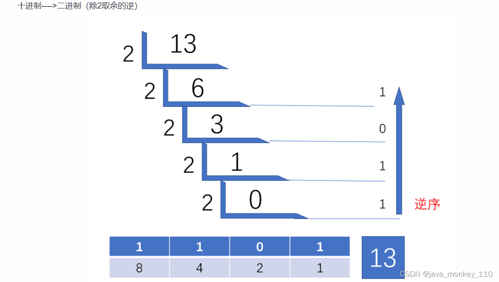

java 中书写形式
----------

所有数字在计算机底层都以[二进制]形式存在。最高位表示符号位，java中不存在类似于C语言中的 unsigned 类型

> 最高位是 1 表示负数 原码表示形式 `-1 => 1000 0001`  
> 最高位是 1 表示正数 原码表示形式 `1 => 0000 0001`

对于整数，有四种表示方式：

*   二进制 (binary)：0,1 ，满 2 进 1. 以 **0b 或 0B** 开头。
*   十进制 (decimal)：0-9 ，满 10 进 1。
*   八进制 (octal)：0-7 ，满 8 进 1. 以数字 0 开头表示。
*   十六进制 (hex)：0-9 及 A-F，满 16 进 1. 以 **0x 或 0X 开头**表示。此处的 A-F 不区分大小写。如：0x21AF +1= 0X21B0

```java
public static void main(String[] args) {
        int num1 =0b110;
        int num2=110;
        //int num3=0128;//0开头表示八进制，0-7
        int num3 = 0130;
        int  num4=0x110A;

        System.out.println(num1);//6
        System.out.println(num2);//110
        System.out.println(num3);//88
        System.out.println(num4);//4362

    }
```

原码、反码、补码
--------

二进制的整数有如下三种形式：

*   原码：直接将一个数值换成二进制数。最高位是符号位
*   负数的反码：**是对原码按位取反，只是`最高位（符号位）确定为1`**。
*   负数的补码：其反码加 1。

**计算机底层以二进制补码的形式保存所有的整数**。

*   正数的原码、反码、补码都相同
*   负数的补码是其反码 + 1

> 为什么要使用原码、反码、补码表示形式呢？  
> 计算机辨别 “符号位” 显然会让计算机的基础电路设计变得十分复杂! 于是人们想出了将符号位也参与运算的方法. 我们知道, 根据运算法则减去一个正数等于加上一个负数, 即: 1-1 = 1 + (-1) = 0 , 所以机器可以只有加法而没有减法, 这样计算机运算的设计就更简单了。  
> 

进制转换
----

进制的基本转换

*   十进制 二进制互转
    *   二进制转成十进制 乘以 2 的幂数
    *   十进制转成二进制 除以 2 取余数
*   二进制 八进制互转（`3个二进制 -> 1位8进制 111-> 07`）
*   二进制 十六进制互转（`4个二进制 -> 1位16进制 1010 -> 0xA`）

取余法  


位运算
------------------------------------------------------------------------------------------

运算规则
----

<table><thead><tr><th>符号</th><th>解释</th><th>运算规则</th></tr></thead><tbody><tr><td>&lt;&lt;</td><td>左移</td><td><code onclick="mdcp.copyCode(event)">空位补0：被移除的最高位丢弃，空缺位补0。</code></td></tr><tr><td>&gt;&gt;</td><td>右移</td><td><code onclick="mdcp.copyCode(event)">根据被移除的最高位不同【即符号位】</code><br><code onclick="mdcp.copyCode(event)">最高位0，右移后，空缺位补0；</code><br><code onclick="mdcp.copyCode(event)">最高位1，右移后，空缺位补1</code>；</td></tr><tr><td>&gt;&gt;&gt;</td><td>无符号右移</td><td><code onclick="mdcp.copyCode(event)">被移除的最高位无论是0还是1，空缺位都用0补。</code></td></tr><tr><td>&amp;</td><td>与</td><td><code onclick="mdcp.copyCode(event)">二进制位进行&amp;运算，只有1&amp;1时结果是1，否则是0；</code></td></tr><tr><td>|</td><td>或</td><td><code onclick="mdcp.copyCode(event)">二进制位进行|运算，只有0|0时结果是0，否则是1；</code></td></tr><tr><td>^</td><td>异或</td><td><code onclick="mdcp.copyCode(event)">相同二进制位进行^运算，结果是0；1^1=0，0^0=0</code><br><code onclick="mdcp.copyCode(event)">不相同二进制位^运算结果是1。1^0=1，0^1=1</code></td></tr><tr><td>~</td><td>取反</td><td><code onclick="mdcp.copyCode(event)">正数取反，各二进制码按补码各位取反</code><br><code onclick="mdcp.copyCode(event)">负数取反，各二进制码按补码各位取反</code></td></tr></tbody></table>

运算过程：
-----

```java
@Test
    public  void testBit() {
        // 正数 : 原码 反码 补码 一样
        // 负数数 : 补码=反码 + 1  【符号位始终保持不变】
      /*
         -10  运算转换成int
         原码：10000000 00000000 00000000 00001010
         反码: 11111111 11111111 11111111 11110101
         补码: 11111111 11111111 11111111 11110110 计算机底层保存
        */

        /* ------------------------------[-10 >> 2]-----------------------------------------
            [-10补码]       1 1111111 11111111 11111111 11110110
            补码>> 2运算后   1 1111111 11111111 11111111 11111101   考虑符号位，负数补1，正数补0
                    -1     1 1111111 11111111 11111111 11111100
             取反得到结果    1 0000000 00000000 00000000 00000011   结果十进制-3
         */
        System.out.println(-10 >> 2);// -3
        /*----------------------------[10 >> 2]-------------------------------------------
            10   00000000 00000000 00000000 00001010[原码,反码,补码]

           [补码]    00000000 00000000 00000000 00001010
            >> 2    00000000 00000000 00000000 00000010
                                       [补码还原]    -> 2
         */
        System.out.println(10 >> 2);// 2

        /*------------------------------[-10 << 2]-----------------------------------------
            [-10补码]       1 1111111 11111111 11111111 11110110
            补码<<2运算后    1 1111111 11111111 11111111 11011000   考虑符号位，负数补1，正数补0
                    -1     1 1111111 11111111 11111111 11010111
             取反得到结果    1 0000000 00000000 00000000 00101000   结果十进制-10
         */
        System.out.println(-10 << 2 );//-40
        /*-----------------------------[10 >> 2]------------------------------------------
            10   00000000 00000000 00000000 00001010[原码,反码,补码]

           [补码]    00000000 00000000 00000000 00001010
            << 2    00000000 00000000 00000000 00101000
                                       [补码还原]    -> 40
         */
        System.out.println(10 >> 2);// 40


        /* -------------------------[ -10 >>>2]----------------------------------------------
        -10补码         1 1111111 11111111 11111111 11110110
        补码>>>2运算后   0 0111111 11111111 11111111 11111101考虑符号位，负数补1，正数补0
        最高位0，反码一致 0 0111111 11111111 11111111 11111101
        最高位0，补码一致 0 0111111 11111111 11111111 11111101   结果十进制1073741821
         */
        System.out.println(-10 >>> 2);//1,073,741,821
        /* -------------------------[ 10 >>>2]----------------------------------------------
        10补码          0 0000000 00000000 00000000 00001010
        补码>>>2运算后   0 0000000 00000000 00000000 00000010
        最高位0，反码一致 0 0000000 00000000 00000000 00000010
        最高位0，补码一致 0 0000000 00000000 00000000 00000010   结果十进制1073741821
         */
        System.out.println(10 >>> 2);//2

       /*-------------------------- & | ^ ~ --------------------------------------
              原码           反码          补码
         -3   1000 0011     1111 1100     1111 1101
         10   0000 1010     0000 1010     0000 1010
         */

        // 1111 1101 & 0000 1010 = 0000 1000[补码]  -->  0000 1000[原码]   8
        System.out.println(-3 & 10);//8

        // 1111 1101 | 0000 1010 = 1111 1111[补码]  -->  1000 0001[原码]  -1
        System.out.println(-3 | 10);//-1

        // 1111 1101 | 0000 1010 = 1111 0111[补码]  -->  1000 1001[原码]  -9
        System.out.println(-3 ^ 10);//-9

        // ~1111 1101 =  0000 0010[补码]  -->  0000 0010[原码]  2
        System.out.println(~ -3 );//2

        // ~0000 1010 =  1111 0101[补码]  -->  1000 1011[原码]  -11
        System.out.println(~ 10 );//-11

        int i = 21;
        // 因为运算符优先级，需要加括号
        System.out.println("i << 2 : " + (i << 2));// 84 相当于* 2²
        System.out.println("i << 26 : " + (i << 26));// 1409286144
        System.out.println("i << 27 : " + (i << 27));// -1476395008

        int j = -21;
        System.out.println("i << 2 : " + (j << 2));// -84
        System.out.println("i << 26 : " + (j << 26));// -1409286144
        System.out.println("i << 27 : " + (j << 27));// 1476395008

        int m = 12, n = 5;
        System.out.println("m & n ： " + (m & n));//4
        System.out.println("m | n ： " + (m | n));//13
        System.out.println("m ^ n ： " + (m ^ n));//9

        System.out.println(~(6));// -7
        // 6的补码：      0000 0110
        // 取反          1111 1001
        //还原成原码：    1000 0111 = -7（原码、补码、反码不操作符号位）
    }
```

## java中 byte操作技巧`0xff` 

**0xff 的作用一**

十六进制 0xff 的长度是一个字节，即八位，二进制为：1111 1111，那么一个 8bit 数与 1111 1111 与运算还是这个数本身，**但是一个 16bit 数与 0xff 就被截断了，比如 1100110011001100 & 0xff 结果为 11001100**。那如果想不被截断怎么办？把 0xff 扩展为二个字节即：0xffff，那么以此类推，0xffffff,0xffffffff 都出来了。

**0xff 的作用二:**

java 专属，由于 java 没有 unsigned 类型，所以为了适应与其他语言二进制通讯时各种数据的一致性，需要做一些处理。

最直观的例子：**int a = -127 & 0xFF ; // 等同于 unsigned int c = 129; (这里的 - 127 与 129 是字节，只为了直观而写的具体数字)**

> 这里要严格说明一点：再 32 位机器上，0xff 实际上是 0x00000000 00000000 00000000 11111111，
>
> 而 - 127 是 11111111 11111111 11111111 10000001 (补码形式), 那么 - 127 & 0xff 的结果自然是
>
> 00000000 00000000 00000000 10000001 即 129.
>
> 简而言之，该作用主要是为了将 `有符号数转换为无符号数`。


这个是根据需求而定的，可以是 >>8 也可以是 >>16,>>24, 等等

而跟 & 0xff 运算的意义其实就是截断，将 123456 的高位右移 8 位，通过 0xff 截取出来。实际意义就是取字节，比如一个 4 字节的数，需要将每个字节内容取出来转换出目标数据，那么通过 >> 并且 &0xff 运算 就可以去除想要的部分。

**再详细点：4 字节 ，32 位，按照大端方式排列，**

**最高位                                         最低位**

**11111111 10101010 11000011 10101010**

**最高位 8 字节要移到最低位那么，这个 8 个字节 `>>（3*8）`，然后与 0xff 运算，取出，然后后续得 `>>(2*8) & 0xff ;>>(1*8) & 0xff`, 均可取出。**

### int拆分byte与合并

```java
		int   a   =   1234567890; 
		byte b1[] = new byte[4];

		// 取出每一个字节
		b1[0]   =   (byte)((a   >>   24)   &   0xff);
		b1[1]   =   (byte)((a   >>   16)   &   0xff);
		b1[2]   =   (byte)((a   >>   8)   &   0xff); 
		b1[3]   =   (byte) (a   &   0xff); 
		
		int b2 = (b1[0]& 0xff) <<24 | (b1[1] & 0xff)<<16 | (b1[2] &0xff)<<8| (b1[3]& 0xff);
		int b3 = (b1[0]) <<24 | (b1[1])<<16 | (b1[2])<<8| (b1[3]);
		System.out.println(b2);//正确结果
		System.out.println(b3);//错误结果，没有做有符号转无符号操作，导致结果不对。
```

将 int a 转换成字节，一般情况下，int 4 字节，那么需要 4 个 byte 来保存，又因为 java 是大端排序，那么 byte[0] 为最高位，所以需要 >>24, 这么一个个的把 a 的 4 个字节取出存入 byte 数组中，这里 0xff 不仅截断，而且还将有符号转换成了无符号。

那么将字节转换回去就不一样了，不是截断而是融合 ，因此需要将 & 改为 |，并且还得把每个字节移到所在实际位置，比如 byte[0] 是最高位，因此还得将其移到 4 个字节的头部即需要 <<24，那么后续得以此类推。一个完成的 int32 型就出现了。但是由于 java 的原因，再做位移操作之前还是不能少了有符号转无符号操作。