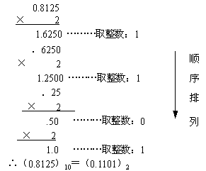
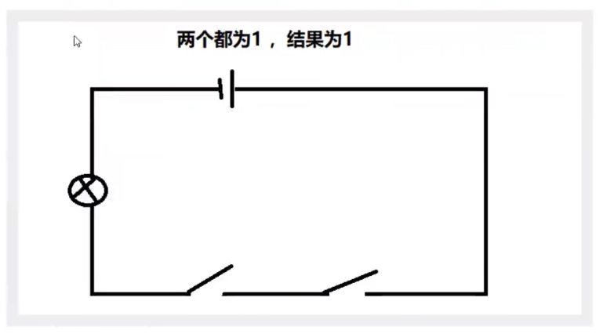
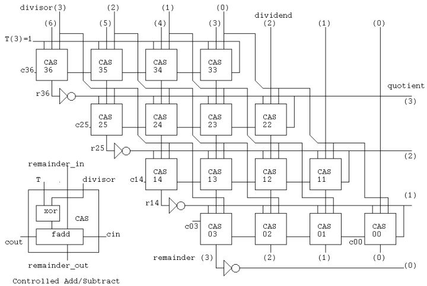

> 本文由 [简悦 SimpRead](http://ksria.com/simpread/) 转码， 原文地址 [www.cnblogs.com](https://www.cnblogs.com/zh94/p/16195373.html)

基本概念
====

## **字节（Byte）与位（bit）**

- **位（bit）**：计算机存储数据的最小单位，表示二进制数据 0 或 1。
- **字节（Byte）**：常用的数据存储单位，1 字节等于 8 位。
- 大 B 和小 b 的区别：
  - **bit** 通常用小写 **b** 表示，例如 8 **b**it。
  - **Byte** 通常用大写 **B** 表示，例如 1 **B**yte。

> **为什么一个字节是 8 位？**
>
> - **历史原因**：早期计算机设计中，6 位、7 位字节也曾存在。但为了统一字符编码标准，最终 8 位被广泛采用。
> - **字符编码需求**：8 位（2<sup>8</sup> = 256）可以表示 256 种不同的状态，足以涵盖 ASCII 编码中的所有字符，包括数字、大小写字母、常用符号等。
> - **技术与成本考量**：在早期计算机发展阶段，8 位在数据表示能力和硬件成本之间取得了较好的平衡，成为了事实标准。


##  **二进制加减运算**

- 二进制加法规则：
  - 0 + 0 = 0
  - 0 + 1 = 1
  - 1 + 0 = 1
  - 1 + 1 = 10  （逢 2 进 1，即本位为 0，向高位进 1）


## 进制的种类及表示


  对于整数，有四种表示方式：

  *   **二进制 (Binary - 0b 或 0B)**：  使用 `0` 和 `1`，逢 2 进 1。  在 Java 中以 `0b` 或 `0B` 开头表示。  是计算机最基础的进制，因为计算机的硬件（门电路）天然地只能表示两种状态。
  *   **十进制 (Decimal)**： 使用 `0-9`，逢 10 进 1。  是我们日常生活中最常用的进制，在 Java 中直接书写数字即为十进制。
  *   **八进制 (Octal - 0)**： 使用 `0-7`，逢 8 进 1。 在 Java 中以 `0` 开头表示（注意是数字 0，不是字母 'o'）。  八进制在早期的计算机系统中较为常用，因为它能简洁地表示 3 位二进制数。
  *   **十六进制 (Hexadecimal - 0x 或 0X)**： 使用 `0-9` 和 `A-F` (或 `a-f`)，逢 16 进 1。 在 Java 中以 `0x` 或 `0X` 开头表示。 十六进制常用于表示内存地址、颜色代码、字符编码等，因为它可以简洁地表示 4 位二进制数。如：`0x21AF +1= 0X21B0`

  ```java
  int num1 = 0b110; // 二进制 110 (十进制 6)
  int num2 = 110; // 十进制 110
  int num3 = 0130; // 八进制 130 (十进制 88)
  int num4 = 0x110A; // 十六进制 110A (十进制 4362)
  ```

  

机器数、真值
------

**为什么需要区分机器数和真值？**

这是因为计算机为了能够表示负数，在二进制编码中引入了**符号位**。  符号位的加入使得机器数的形式不再直接等同于其数值大小。我们需要通过一定的**解码规则**（即编码方式，如原码、反码、补码）才能将机器数还原成它真正代表的数值，也就是真值。


**机器数 (Machine Number)**：

- 这是**数字在计算机内部的二进制表示形式**。
- 它包括**符号位**和**数值位**，共同构成了计算机能够直接存储和运算的二进制编码。
- 机器数是**带有编码方式**的，例如原码、反码、补码等，不同的编码方式会影响机器数的表示和运算。
- **例如：**  `10000011` (8位二进制)  可以是一个机器数。

**真值 (True Value)**：

- 这是**机器数所代表的实际数值**，也就是我们人类通常理解的带有正负号的数值。
- 真值是**不带编码方式**的，它直接反映了数值的大小和正负。
- **例如：**  机器数 `10000011` (如果采用原码表示)  对应的真值是  `-3`。

### 机器数

**机器数定义**： 数值在计算机中以二进制形式表示，这种表示形式就被称为机器数。

**分类**：

- **无符号数**：  用于**表示非负数**（即 0 和正数）。所有位都用来表示数值的大小，没有符号位。

- **有符号数**： 用于表示**正数、负数和零**。需要用一位来表示符号（正负），其余位表示数值的大小。

- > **符号位**： 对于有符号数，通常用最高位作为符号位：
  >
  > - **0**：表示正数或零。
  > - **1**：表示负数。

比如，十进制中的数 +3 ，计算机字长为 8 位，转换成二进制就是 00000011。

如果是 -3 ，就是 10000011 。那么，这里的 00000011 和 10000011 就是机器数。

### 真值

**Java 中无 `unsigned` 类型**：Java 语言与 C 语言不同，**不提供 `unsigned` (无符号) 类型**。这意味着 Java 中的整数类型（如 `int`, `long`, `byte`, `short`）默认都是**有符号数**。


**机器数的形式值 ≠ 真值**：由于符号位的存在，机器数本身的形式值（直接将二进制数转换为十进制）并不等于它所代表的实际数值（真值）。

- 例如，机器数 `10000011` (8位) 的形式值是十进制的 131，但如果将其视为有符号数，它的真值实际上是 `-3` (使用原码表示时，但更常见的是补码表示，真值会根据补码规则计算)。


**真值的概念**：为了区分机器数的二进制表示形式和它代表的实际数值，引入了 **真值**  的概念。**真值才是机器数真正代表的数值大小**。

例：

```
0000 0001 的真值 = +000 0001 = +1
1000 0001 的真值 = –000 0001 = –1
```


原码、反码、补码
========

**1. 编码的必要性：符号位的处理**

正如您所说，计算机底层使用二进制，但为了表示正数和负数，需要一种方法来区分符号。 最直观的想法就是用一位来专门表示符号，这就是符号位的由来。 然而，仅仅增加一个符号位会导致一些问题，尤其是在进行加减运算时。 为了更有效地进行运算，并解决一些原码和反码的缺陷，就发展出了反码和补码等更高级的编码方式。

**2. 真值 vs. 机器数 (机器码)**

- **真值 (True Value)**：  是我们日常生活中使用的带正负号的数值，例如 +3, -5, 0 等。 真值是人类易于理解的数值表示。
- **机器数 (Machine Number) 或 机器码 (Machine Code)**：  是真值在计算机内部的二进制编码表示形式。  机器数是计算机能够直接识别和处理的。  不同的编码方式（原码、反码、补码、移码）会产生不同的机器数。

**3. 原码 (Sign-Magnitude)**

- **定义：**  原码是最直观的编码方式。  符号位为 0 表示正数，为 1 表示负数。 数值位直接用真值的绝对值的二进制表示。
- 示例 (8 位二进制)：
  - `+7` 的原码： `00000111`  (符号位 0，数值位 7 的二进制 0000111)
  - `-7` 的原码： `10000111`  (符号位 1，数值位 7 的二进制 0000111)
- **优点：**  简单直观，易于理解，与真值的转换非常直接。
- 缺点：
  - **零的表示不唯一：**  `+0` 和 `-0` 都有不同的原码表示 (`00000000` 和 `10000000`)，这在逻辑上不统一。
  - **加减运算复杂：**  使用原码进行加减运算时，符号位和数值位需要分开处理，加法和减法的规则也不同，导致电路设计复杂。 例如，正数加正数、负数加负数、正数加负数等情况都需要不同的处理逻辑。

**4. 反码 (One's Complement)**

- 定义：

    为了解决原码加减法复杂的问题，提出了反码。

  - **正数：**  反码与原码相同。
  - **负数：**  符号位为 1，数值位对原码的数值位**按位取反** (0 变 1, 1 变 0)。

- 示例 (8 位二进制)：

  - `+7` 的反码： `00000111`
  - `-7` 的反码： `11111000` ( `+7` 原码 `00000111`，数值位 `0000111` 取反得到 `1111000`，符号位保持 `1`)

- **优点：**  在进行某些运算时，反码可以简化运算规则，例如，减法可以通过加其反码来实现。

- 缺点：

  - **零的表示仍然不唯一：**  `+0` 和 `-0` 仍然有不同的反码表示 (`00000000` 和 `11111111`)。
  - **加减运算仍然存在问题：**  虽然比原码有所改进，但在跨零点的加减运算中，仍然需要考虑循环进位的问题，逻辑上不够简洁。

**5. 补码 (Two's Complement)**

- 定义：

    补码是现代计算机系统中最核心的编码方式，它在反码的基础上进一步改进。

  - **正数：**  补码与原码相同，也与反码相同。
  - **负数：**  符号位为 1，反码的基础上**末位加 1**。

- 示例 (8 位二进制)：

  - `+7` 的补码： `00000111`
  - `-7` 的补码： `11111001` ( `+7` 反码 `11111000`，末位加 1 得到 `11111001`)

- 核心优势：

  - **零的表示唯一：**  `+0` 和 `-0` 的补码都是 `00000000`，消除了零的表示不唯一的问题。
  - **加减法运算统一：**  使用补码，可以将减法运算转化为加法运算，加法和减法可以使用同一套加法电路完成，大大简化了计算机硬件设计。  例如，`A - B`  可以转化为  `A + (-B)`，而 `-B`  的补码可以通过对 `B` 的补码（即原码，因为正数的原码、反码、补码相同）取反加一得到。
  - **表示范围扩大：**  对于 n 位二进制数，补码可以表示  -2<sup>n-1</sup>  到  2<sup>n-1</sup>-1，比原码和反码多表示一个负数（例如，8 位补码可以表示 -128 到 +127，而原码和反码只能表示 -127 到 +127）。  多出来的一个负数用来表示  -2<sup>n-1</sup> （例如，8 位补码中的 `10000000` 表示 -128）。

>  **为什么计算机使用补码？**
>
> 正是由于补码的这些显著优点，特别是**加减法运算的统一**和**零的表示唯一性**，使得补码成为现代计算机系统中表示有符号数的**首选**和**通用标准**。  使用补码大大简化了计算机的运算器设计，提高了运算效率和可靠性。


为什么补码才是计算机的真正计算方式
-----------------

现在我们知道了计算机可以有三种编码方式表示一个数. 对于正数因为三种编码方式的结果都相同:

```
[+1] = [00000001]原 = [00000001]反 = [00000001]补
```

所以不需要过多解释. 但是对于负数:

```
[-1] = [10000001]原 = [11111110]反 = [11111111]补
```

可见原码, 反码和补码是完全不同的. 既然原码才是被人脑直接识别并用于计算表示方式, 为何还会有反码和补码呢?

首先, 因为人脑可以知道第一位是符号位, 在计算的时候我们会根据符号位, 选择对真值区域的加减。  
但是对于计算机, 加减乘数已经是最基础的运算, 要设计的尽量简单. 计算机辨别 "符号位" 显然会让计算机的基础电路设计变得十分复杂! 于是人们想出了将符号位也参与运算的方法. 我们知道, 根据运算法则减去一个正数等于加上一个负数, 即: 1-1 = 1 + (-1) = 0 , 所以机器可以只有加法而没有减法, 这样计算机运算的设计就更简单了。

于是人们开始探索 将符号位参与运算, 并且只保留加法的方法. 首先来看原码:  
计算十进制的表达式: 1-1=0

```
1 - 1 = 1 + (-1) = [00000001]原 + [10000001]原 = [10000010]原 = -2
```

如果用原码表示, 让符号位也参与计算, 显然对于减法来说, 结果是不正确的. 这也就是为何计算机内部不使用原码表示一个数。  
为了解决原码做减法的问题, 出现了反码：  
计算十进制的表达式: 1-1=0

```
1 - 1 = 1 + (-1) = [0000 0001]原 + [1000 0001]原= [0000 0001]反 + [1111 1110]反 = [1111 1111]反 = [1000 0000]原 = -0
```

发现用反码计算减法, 结果的真值部分是正确的. 而唯一的问题其实就出现在 "0" 这个特殊的数值上. 虽然人们理解上 + 0 和 - 0 是一样的, 但是 0 带符号是没有任何意义的. 而且会有 [0000 0000] 原和 [1000 0000] 原两个编码表示 0。

于是补码的出现, 解决了 0 的符号以及两个编码的问题：

```
1-1 = 1 + (-1) = [0000 0001]原 + [1000 0001]原 = [0000 0001]补 + [1111 1111]补 = [0000 0000]补=[0000 0000]原
```

这里说明一下，二进制想加：0000 0001+1111 1111 = 1 0000 0000，但由于是 8 位数，所以最终的值为 0000 0000。

**这样 0 用 [0000 0000] 表示, 而以前出现问题的 - 0 则不存在了. 而且可以用 [1000 0000] 表示 - 128:**

```
(-1) + (-127) = [1000 0001]原 + [1111 1111]原 = [1111 1111]补 + [1000 0001]补 = [1000 0000]补
```

**由于我们使用原码来表示正时，最大值为：01111111，最小值为：11111111，所以直接转换为对应的 10 进制后的结果为，127，-127。  
而此处使用补码后，由于补码的规则是，首位不变，其它反转，并 + 1。所以 (-1)+(-127) 刚好为 - 128。**

使用补码, 不仅仅修复了 0 的符号以及存在两个编码的问题, 而且还能够多表示一个最低数. 这就是为什么 8 位二进制, 使用原码或反码表示的范围为 [-127, +127], 而使用补码表示的范围为 [-128, 127]。

因为机器使用补码, 所以对于编程中常用到的 32 位 int 类型, 可以表示范围是: [-2 的 31 次方, 2 的 31 次方 - 1] 因为第一位表示的是符号位. 而使用补码表示时又可以多保存一个最小值。

**Amazing，我们在上面最初使用原码进行加法运算时，由于我们人脑还需要先判断一下最高位的符号后，才能进行二进制运算，然后再添加上对应的符号位。而采用补码后，直接将对应的符号位也参与运算，将补码的数值直接相加，得到的竟然刚好也就是二进制转换后的结果。这样一来，计算机的基础电路设计就可以更加简单，而无需关注符号位的问题，仅需要按照二进制的加法法则执行即可。简直完美。所以这也是补码作为计算机的真正计算方式的原因之一！**

但，补码后所得到的值想加刚好就是直接二进制的值相加后的结果，真的是就刚好这么巧吗？其实不然，背后还蕴含这很有意思的数学原理，详情可参考：  
[深入理解原码、补码](https://www.jianshu.com/p/ffc97c4d2306) & [数的机器码表示](https://www.cnblogs.com/delongzhang/p/12525737.html) & [机器码原理](https://blog.csdn.net/alinyua/article/details/79702879) & [原码、补码原理](https://www.cnblogs.com/zhangziqiu/archive/2011/03/30/computercode.html)


# 进制转换 （包括小数）

## 一、二进制数转换成十进制数

由二进制数转换成十进制数的基本做法是，把二进制数首先写成加权系数展开式，然后按十进制加法规则求和。这种做法称为"**按权相加**"法。

例如把二进制数 110.11 转换成十进制数。


------

## 二、十进制数转换为二进制数

十进制数转换为二进制数时，由于整数和小数的转换方法不同，所以先将十进制数的整数部分和小数部分分别转换后，再加以合并。

### 1. 十进制整数转二进制

十进制整数转换为二进制整数采用"**除2取余，逆序排列**"法。具体做法是：用2去除十进制整数，可以得到一个商和余数；再用2去除商，又会得到一个商和余数，如此进行，直到商为零时为止，然后把先得到的余数作为二进制数的低位有效位，后得到的余数作为二进制数的高位有效位，依次排列起来。

例如把 (173)10 转换为二进制数。

解：


### 2．十进制小数转二进制

十进制小数转换成二进制小数采用"**乘2取整，顺序排列"**法。具体做法是：用2乘十进制小数，可以得到积，将积的整数部分取出，再用2乘余下的小数 部分，又得到一个积，再将积的整数部分取出，如此进行，直到积中的小数部分为零，或者达到所要求的精度为止。

然后把取出的整数部分按顺序排列起来，先取的整数作为二进制小数的高位有效位，后取的整数作为低位有效位。

例如把（0.8125）转换为二进制小数。

解：



例：

```
（173.8125）10＝（ ）2
```

解：

```
在上个例子中得（173）10＝（10101101）2
得（0.8125）10＝（0.1101）2
```

把整数部分和小数部分合并得：

```
（173.8125）10＝（10101101.1101）2
```

十进制小数转换成二进制小数采用"**乘2取整，顺序排列**"法。具体做法是：用2乘十进制小数，可以得到积，将积的整数部分取出，再用2乘余下的小数部分，又 得到一个积，再将积的整数部分取出，如此进行，直到积中的整数部分为零，或者整数部分为1，此时0或1为二进制的最后一位。或者达到所要求的精度为止。

然后把取出的整数部分按顺序排列起来，先取的整数作为二进制小数的高位有效位，后取的整数作为低位有效位。　

**十进制小数转二进制**

如：**0.625=（0.101）B**

```
0.625*2=1.25======取出整数部分1 
0.25*2=0.5========取出整数部分0 
0.5*2=1==========取出整数部分1 
```

再如：**0.7=（0.1 0110 0110...）B**

```
0.7*2=1.4========取出整数部分1 
0.4*2=0.8========取出整数部分0 
0.8*2=1.6========取出整数部分1 
0.6*2=1.2========取出整数部分1 
0.2*2=0.4========取出整数部分0　 
0.4*2=0.8========取出整数部分0 
0.8*2=1.6========取出整数部分1 
0.6*2=1.2========取出整数部分1 
0.2*2=0.4========取出整数部分0
```


# 基本数据类型

8种基本数据类型：boolean、byte、char、short、int、long、float、double，及对应包装类型如下：

| 数据类型  | 字节数 | 取值范围                                    |
| :-------- | :----- | :------------------------------------------ |
| `byte`    | 1      | -128 到 127                                 |
| `short`   | 2      | -32768 到 32767                             |
| `int`     | 4      | -2147483648 到 2147483647                   |
| `long`    | 8      | -9223372036854775808 到 9223372036854775807 |
| `float`   | 4      | ±1.4E-45 到 ±3.4028235E38                   |
| `double`  | 8      | ±4.9E-324 到 ±1.7976931348623157E308        |
| `char`    | 2      | 0 到 65535                                  |
| `boolean` | 1      | `true` 或 `false`                           |

对应包装类型的常量缓存以及自动装箱拆箱的坑参见上篇博客：


# 数据如何存储

## **数据存储的基本概念**

在计算机内存中，数据以字节 (byte) 为单位进行存储。每个字节都有一个唯一的内存地址。对于单字节数据（如 `byte` 类型），存储方式很简单，一个字节对应一个地址。但对于多字节数据类型（如 `int`, `float`, `double`, `long`），需要多个连续的字节来存储。这时就涉及到字节的排列顺序，也就是 "大小端" 的概念。


## **大小端 (Endianness) 的解释**

Endianness 描述了多字节数据类型的字节在内存中排列的顺序。主要有两种类型：

- **大端 (Big-Endian):** 在大端系统中，数据的最高有效字节 (MSB) 存储在最低的内存地址，而最低有效字节 (LSB) 存储在最高的内存地址。 这类似于我们从左到右阅读数字的方式。
- **小端 (Little-Endian):** 在小端系统中，数据的最低有效字节 (LSB) 存储在最低的内存地址，而最高有效字节 (MSB) 存储在最高的内存地址。

> **示例 (概念性)**
>
> 假设你有一个整数值 `0x12345678`。
>
> - **大端存储 (Big-Endian Storage):** 在内存中，它将存储为：`12 34 56 78` (最高有效字节在前)。
> - **小端存储 (Little-Endian Storage):** 在内存中，它将存储为：`78 56 34 12` (最低有效字节在前)。


### **Java 与 Endianness**

Java 默认使用 **大端 (Big-Endian)** 字节顺序来表示内存中和数据传输过程中的基本数据类型，而**不考虑**底层操作系统或处理器架构的 endianness。 这种设计选择确保了 Java 应用程序的平台独立性和一致性。

关于 Java 和 endianness，你需要了解以下几点：

- **默认大端 (Default Big-Endian):**  Java 虚拟机 (JVM) 通常以大端字节顺序运行。 当你编写 Java 代码来存储或传输多字节数据时，Java 会将其作为大端处理。
- **网络字节顺序 (Network Byte Order):** 大端也被称为 "网络字节顺序"，Java 对它的坚持对于网络编程非常有利。 它确保了从 Java 应用程序发送的数据能够被使用网络协议的其他系统正确解释，因为网络协议通常假定为大端顺序。
- **字节顺序一致性 (Byte Order Consistency):** Java 对大端的一致使用有助于保持可移植性。 你通常无需担心 endianness 问题，因为你的 Java 应用程序可以在不同的平台（例如 Windows、Linux、macOS）或不同的处理器架构（例如 x86、ARM）上运行。

### **Endianness 在 Java 中何时重要**

虽然 Java 通常会透明地处理 endianness，但在某些情况下，它会变得相关：

- **与本地库或系统交互 (Interacting with Native Libraries or Systems):** 如果你的 Java 代码与使用不同 endianness 的本地库（例如，使用 JNI - Java Native Interface）或系统（如小端 x86 架构）交互，你可能需要在交换二进制数据时注意字节顺序的差异。
- **二进制数据的文件 I/O (File I/O with Binary Data):** 当读取或写入由具有不同 endianness 的系统创建的二进制数据文件时，你可能需要处理字节顺序转换，以确保数据被正确解释。
- **ByteBuffer 类 (ByteBuffer Class):**  Java 的 `ByteBuffer` 类提供了在需要时显式控制字节顺序的方法。 你可以使用 `order(ByteOrder.BIG_ENDIAN)` 或 `order(ByteOrder.LITTLE_ENDIAN)` 等方法来设置通过 `ByteBuffer` 读取和写入数据时所需的字节顺序。

### **总结**

对于大多数 Java 开发而言，你无需深入关心 endianness，因为 Java 内部使用大端作为默认值来处理它。 但是，当与外部系统或本地代码进行二进制数据交换时，尤其是在涉及文件 I/O 或网络通信的场景中，理解 endianness 并使用 `ByteBuffer` 等工具来管理字节顺序可能会变得必要。

##  IEEE 754 标准

 IEEE 754 标准，这是一个关于浮点数算术的标准，在计算机科学和工程领域至关重要。它定义了浮点数的表示方法、运算规则以及异常处理，确保了不同计算机系统之间浮点数计算的一致性和可移植性。

以下是关于 IEEE 754 标准的详细说明：

### **什么是 IEEE 754 标准？**

IEEE 754 是由电气和电子工程师协会 (IEEE) 制定的国际标准，全称为 "IEEE 754-2019 - IEEE Standard for Floating-Point Arithmetic"。  它定义了：

- **浮点数格式 (Floating-point formats):**  规定了如何用二进制形式表示浮点数，包括单精度 (32 位)、双精度 (64 位) 和其他精度。
- **浮点数运算 (Floating-point operations):**  定义了加法、减法、乘法、除法、平方根等基本运算的规则，以及舍入规则。
- **异常处理 (Exception handling):**  规定了如何处理浮点运算中可能出现的异常情况，例如除以零、溢出、无效操作等。

### **为什么 IEEE 754 标准如此重要？**

在 IEEE 754 标准出现之前，不同的计算机系统可能使用不同的浮点数表示方法和运算规则，导致：

- **不一致的计算结果:**  同一个浮点数计算在不同的机器上可能得到不同的结果。
- **程序不可移植:**  依赖于特定浮点数行为的程序难以在不同系统之间移植。
- **数值计算的复杂性:**  程序员需要深入了解不同系统的浮点数实现细节，才能编写可靠的数值计算程序。

IEEE 754 标准的出现解决了这些问题，它：

- **实现了浮点数计算的标准化:**  使得在符合 IEEE 754 标准的系统上，浮点数计算结果具有高度的一致性。
- **提高了程序的可移植性:**  编写符合 IEEE 754 标准的程序更容易在不同平台上运行，并得到预期的结果。
- **简化了数值计算:**  程序员可以基于统一的标准进行浮点数编程，无需过多关注底层硬件的差异。

### **IEEE 754 浮点数格式**

IEEE 754 标准定义了多种浮点数格式，最常用的是：

- **单精度浮点数 (Single-precision, 32-bit, `float` in Java/C):**
  - 总共 32 位，分为三个部分：
    - **符号位 (Sign bit, 1 bit):**  `0` 表示正数，`1` 表示负数。
    - **指数部分 (Exponent, 8 bits):**  使用偏移量表示法 (biased exponent) 存储指数值，偏移量为 127。
    - **尾数部分 (Fraction/Mantissa, 23 bits):**  存储规格化后的尾数 (有效数字)，小数点前有一位隐含的 `1`。
- **双精度浮点数 (Double-precision, 64-bit, `double` in Java/C):**
  - 总共 64 位，分为三个部分：
    - **符号位 (Sign bit, 1 bit):**  `0` 表示正数，`1` 表示负数。
    - **指数部分 (Exponent, 11 bits):**  使用偏移量表示法存储指数值，偏移量为 1023。
    - **尾数部分 (Fraction/Mantissa, 52 bits):**  存储规格化后的尾数，小数点前有一位隐含的 `1`。

### **IEEE 754 浮点数的表示方法 (简述)**

IEEE 754 浮点数采用科学计数法的思想来表示数字，形式上类似于：

```
± 尾数 × 2^指数
```

具体来说，一个 IEEE 754 浮点数的表示过程包括：

1. **符号位 (Sign):**  确定浮点数的正负号。
2. 指数 (Exponent):
   - 将实际指数值加上一个偏移量 (bias) 存储在指数部分。
   - 单精度偏移量为 127，双精度偏移量为 1023。
   - 这样做可以将指数表示为无符号整数，方便比较大小。
3. 尾数 (Mantissa/Significand):
   - 将浮点数规格化为 `1.xxxx... × 2^指数` 的形式 (除了 0 和非规格化数)。
   - 由于规格化后小数点前总是 `1`，因此 IEEE 754 标准将这个 `1` 隐含地存储，只存储小数点后的部分，从而节省一位存储空间，提高精度。

### **特殊值**

IEEE 754 标准还定义了一些特殊值，用于表示特殊情况：

- **零 (Zero):**  符号位为 `0` 或 `1`，指数部分和尾数部分都为 `0`。  区分正零和负零。
- **无穷大 (Infinity):**  指数部分为最大值 (全 `1`)，尾数部分为 `0`。  区分正无穷大和负无穷大。
- **NaN (Not a Number):**  指数部分为最大值 (全 `1`)，尾数部分不为 `0`。  表示无效操作的结果，例如 `0/0` 或 `sqrt(-1)`。
- **非规格化数 (Denormalized numbers):**  用于表示非常接近于 0 的数。  指数部分为最小值 (全 `0`)，尾数部分不为 `0`。  非规格化数牺牲了精度来表示更小的数值。

### **Endianness 与 IEEE 754**

正如之前讨论的，Endianness (大小端) 也会影响 IEEE 754 浮点数在内存中的字节存储顺序。

- **大端系统 (Big-Endian):**  浮点数的最高有效字节 (包括符号位、指数高位、尾数高位) 存储在较低的内存地址。
- **小端系统 (Little-Endian):**  浮点数的最低有效字节存储在较低的内存地址。

**Java 和 IEEE 754**

Java 语言和 Java 虚拟机 (JVM) 完全遵循 IEEE 754 标准来处理 `float` 和 `double` 类型的浮点数运算。 这保证了 Java 程序在不同平台上浮点数计算结果的一致性。

**总结 IEEE 754 标准的优点**

- **标准化和一致性:**  统一了浮点数的表示和运算规则，避免了不同系统之间的差异。
- **可移植性:**  基于 IEEE 754 标准编写的程序更容易在不同平台上移植。
- **数值计算的可靠性:**  提供了对特殊值和异常情况的处理机制，提高了数值计算的可靠性。
- **广泛应用:**  几乎所有现代计算机系统都支持 IEEE 754 标准，成为浮点数运算的行业标准。


### **案例 1: 单精度浮点数 (float) 转换 -  十进制 123.456f  转换为 IEEE 754 二进制表示**

为了更深入地理解 IEEE 754 标准，我们来补充一些浮点数和 IEEE 754 二进制表示之间转换的案例，包括单精度 (float) 和双精度 (double)。


**步骤 1:  确定符号位 (Sign bit)**

- 123.456 是正数，所以符号位为 **0**。

**步骤 2:  转换为二进制形式 (整数部分和小数部分)**

- **整数部分 (123):**  123 的二进制是 `1111011`

- **小数部分 (0.456):**  需要将小数部分转换为二进制。 我们可以通过不断乘以 2 并取整数部分来得到二进制小数：

  - 0.456 * 2 = 0.912  -> 整数部分: 0
  - 0.912 * 2 = 1.824  -> 整数部分: 1
  - 0.824 * 2 = 1.648  -> 整数部分: 1
  - 0.648 * 2 = 1.296  -> 整数部分: 1
  - 0.296 * 2 = 0.592  -> 整数部分: 0
  - 0.592 * 2 = 1.184  -> 整数部分: 1
  - 0.184 * 2 = 0.368  -> 整数部分: 0
  - 0.368 * 2 = 0.736  -> 整数部分: 0
  - 0.736 * 2 = 1.472  -> 整数部分: 1
  - 0.472 * 2 = 0.944  -> 整数部分: 0
  - ... (继续下去，直到达到所需的精度或重复)

  所以，0.456 的二进制近似为 `011101001...`

- **合并整数和小数部分:**  123.456 的二进制近似为 `1111011.011101001...`

**步骤 3:  规格化 (Normalization) 并确定指数 (Exponent) 和尾数 (Mantissa)**

- **规格化:** 将二进制数表示为 `1.xxxx... × 2^指数` 的形式。  将小数点左移 6 位，得到 `1.111011011101001... × 2^6`
- **尾数 (Mantissa):**  小数点后的部分 `111011011101001...`  单精度尾数部分为 23 位，我们需要截取或舍入到 23 位。 假设我们截取前 23 位： `11101101110100100000000`
- **指数 (Exponent):**  指数是 6。  对于单精度浮点数，指数偏移量 (bias) 是 127。  所以，存储的指数值是 `6 + 127 = 133`。  133 的二进制是 `10000101`。

**步骤 4:  组合符号位、指数和尾数**

- **符号位:** `0`

- **指数:** `10000101`

- **尾数:** `11101101110100100000000`

- **IEEE 754 二进制表示 (单精度):**

  `0 10000101 11101101110100100000000`

  转换为十六进制表示（每 4 位二进制转换为 1 位十六进制）：

  `4 2 F 6 E 9 7 9`  ->  `0x42F6E979`

**验证 (使用 Java 代码)**


```Java
float floatValue = 123.456f;
int floatBits = Float.floatToIntBits(floatValue);
String hexString = String.format("%08X", floatBits); // 格式化为 8 位十六进制
System.out.println("Float 123.456f 的 IEEE 754 十六进制表示: 0x" + hexString);
// 输出: Float 123.456f 的 IEEE 754 十六进制表示: 0x42F6E979
```

### **案例 2: 双精度浮点数 (double) 转换 - 十进制 -0.75 转换为 IEEE 754 二进制表示**

**步骤 1:  确定符号位 (Sign bit)**

- -0.75 是负数，所以符号位为 **1**。

**步骤 2:  转换为二进制形式 (整数部分和小数部分)**

- **整数部分 (0):**  0 的二进制是 `0`

- **小数部分 (0.75):**

  - 0.75 * 2 = 1.5  -> 整数部分: 1
  - 0.5 * 2 = 1.0   -> 整数部分: 1
  - 0.0 * 2 = 0.0   -> 整数部分: 0 (结束)

  所以，0.75 的二进制是 `0.11`

- **合并整数和小数部分:**  0.75 的二进制是 `0.11`

**步骤 3:  规格化 (Normalization) 并确定指数 (Exponent) 和尾数 (Mantissa)**

- **规格化:** 将二进制数表示为 `1.xxxx... × 2^指数` 的形式。 将小数点右移 1 位，得到 `1.1 × 2^-1`
- **尾数 (Mantissa):**  小数点后的部分 `1`。 双精度尾数部分为 52 位，我们需要用 0 填充到 52 位： `1000000000000000000000000000000000000000000000000000`
- **指数 (Exponent):**  指数是 -1。  对于双精度浮点数，指数偏移量 (bias) 是 1023。  所以，存储的指数值是 `-1 + 1023 = 1022`。 1022 的二进制是 `01111111110`。

**步骤 4:  组合符号位、指数和尾数**

- **符号位:** `1`

- **指数:** `01111111110`

- **尾数:** `1000000000000000000000000000000000000000000000000000`

- **IEEE 754 二进制表示 (双精度):**

  `1 01111111110 1000000000000000000000000000000000000000000000000000`

  转换为十六进制表示（每 4 位二进制转换为 1 位十六进制）：

  `C 0 E 0 0 0 0 0 0 0 0 0 0 0 0 0`  ->  `0xC0E0000000000000`

**验证 (使用 Java 代码)**

Java

```
double doubleValue = -0.75;
long doubleBits = Double.doubleToLongBits(doubleValue);
String hexString = String.format("%016X", doubleBits); // 格式化为 16 位十六进制
System.out.println("Double -0.75 的 IEEE 754 十六进制表示: 0x" + hexString);
// 输出: Double -0.75 的 IEEE 754 十六进制表示: 0xC0E0000000000000
```

### **Java 代码示例 -  浮点数和字节数组双向转换 (包含字节顺序控制)**

以下代码综合了之前的示例，并展示了如何使用 `ByteBuffer` 进行浮点数和字节数组的双向转换，并控制字节顺序：

```Java
import java.nio.ByteBuffer;
import java.nio.ByteOrder;

public class IEEE754ConversionExample {

    public static void main(String[] args) {
        float floatValue = 123.456f;
        double doubleValue = -0.75;

        // Float 转换为字节数组 (大端和小端)
        byte[] floatBigEndianBytes = floatToBytes(floatValue, ByteOrder.BIG_ENDIAN);
        byte[] floatLittleEndianBytes = floatToBytes(floatValue, ByteOrder.LITTLE_ENDIAN);

        System.out.println("Float value: " + floatValue);
        System.out.print("Float Big-Endian Bytes: "); printHexBytes(floatBigEndianBytes);
        System.out.print("Float Little-Endian Bytes: "); printHexBytes(floatLittleEndianBytes);

        // 字节数组转换为 Float (大端和小端)
        float floatFromBigEndian = bytesToFloat(floatBigEndianBytes, ByteOrder.BIG_ENDIAN);
        float floatFromLittleEndian = bytesToFloat(floatLittleEndianBytes, ByteOrder.LITTLE_ENDIAN);

        System.out.println("Float from Big-Endian Bytes: " + floatFromBigEndian);
        System.out.println("Float from Little-Endian Bytes: " + floatFromLittleEndian);


        System.out.println("\n---------------------\n");

        // Double 转换为字节数组 (大端和小端)
        byte[] doubleBigEndianBytes = doubleToBytes(doubleValue, ByteOrder.BIG_ENDIAN);
        byte[] doubleLittleEndianBytes = doubleToBytes(doubleValue, ByteOrder.LITTLE_ENDIAN);

        System.out.println("Double value: " + doubleValue);
        System.out.print("Double Big-Endian Bytes: "); printHexBytes(doubleBigEndianBytes);
        System.out.print("Double Little-Endian Bytes: "); printHexBytes(doubleLittleEndianBytes);

        // 字节数组转换为 Double (大端和小端)
        double doubleFromBigEndian = bytesToDouble(doubleBigEndianBytes, ByteOrder.BIG_ENDIAN);
        double doubleFromLittleEndian = bytesToDouble(doubleLittleEndianBytes, ByteOrder.LITTLE_ENDIAN);

        System.out.println("Double from Big-Endian Bytes: " + doubleFromBigEndian);
        System.out.println("Double from Little-Endian Bytes: " + doubleFromLittleEndian);
    }


    // Float to byte array
    public static byte[] floatToBytes(float value, ByteOrder byteOrder) {
        ByteBuffer buffer = ByteBuffer.allocate(4);
        buffer.order(byteOrder);
        buffer.putFloat(value);
        return buffer.array();
    }

    // Byte array to float
    public static float bytesToFloat(byte[] bytes, ByteOrder byteOrder) {
        ByteBuffer buffer = ByteBuffer.wrap(bytes);
        buffer.order(byteOrder);
        return buffer.getFloat();
    }

    // Double to byte array
    public static byte[] doubleToBytes(double value, ByteOrder byteOrder) {
        ByteBuffer buffer = ByteBuffer.allocate(8);
        buffer.order(byteOrder);
        buffer.putDouble(value);
        return buffer.array();
    }

    // Byte array to double
    public static double bytesToDouble(byte[] bytes, ByteOrder byteOrder) {
        ByteBuffer buffer = ByteBuffer.wrap(bytes);
        buffer.order(byteOrder);
        return buffer.getDouble();
    }

    // Helper function to print byte array in hex
    public static void printHexBytes(byte[] bytes) {
        for (byte b : bytes) {
            System.out.printf("%02X ", b);
        }
        System.out.println();
    }
}
```

## 工具类ByteBuffer

在 Java 中，`ByteBuffer` 类是处理字节顺序的关键工具。它允许你显式地控制数据的字节顺序，这在处理二进制数据、网络编程以及与不同系统交互时至关重要。

**ByteBuffer 和字节顺序**

`ByteBuffer` 是 Java NIO (New I/O) 库的一部分，它提供了一种高效的方式来操作字节缓冲区。  `ByteBuffer` 实例可以被配置为使用大端 (Big-Endian) 或小端 (Little-Endian) 字节顺序。

**设置字节顺序**

你可以使用 `ByteBuffer` 的 `order()` 方法来设置字节顺序。 `order()` 方法接受一个 `ByteOrder` 枚举类型作为参数，`ByteOrder` 枚举类型有两个常量：

- `ByteOrder.BIG_ENDIAN`: 设置为大端字节顺序。
- `ByteOrder.LITTLE_ENDIAN`: 设置为小端字节顺序。

如果你不显式地设置字节顺序，`ByteBuffer` 默认使用 **大端 (Big-Endian)** 字节顺序。

### **示例代码：使用 ByteBuffer 处理字节顺序**

以下代码示例演示了如何使用 `ByteBuffer` 来写入和读取不同字节顺序的整数：

```Java
public class ByteBufferEndianness {

    public static void main(String[] args) {
        int intValue = 0x12345678; // 要存储的整数值

        // 1. 使用大端字节顺序 (默认)
        ByteBuffer bigEndianBuffer = ByteBuffer.allocate(4); // 分配 4 字节缓冲区 (int 类型)
        bigEndianBuffer.order(ByteOrder.BIG_ENDIAN); // 显式设置为大端 (虽然默认已经是大端)
        bigEndianBuffer.putInt(intValue); // 写入整数

        System.out.println("大端字节顺序：");
        System.out.println("原始整数值: 0x" + Integer.toHexString(intValue));
        System.out.println("字节数组 (十六进制): " + byteArrayToHex(bigEndianBuffer.array()));

        bigEndianBuffer.rewind(); // 重置缓冲区位置以便读取
        int bigEndianReadValue = bigEndianBuffer.getInt(); // 从大端缓冲区读取整数
        System.out.println("从大端缓冲区读取的整数值: 0x" + Integer.toHexString(bigEndianReadValue));


        System.out.println("\n---------------------\n");

        // 2. 使用小端字节顺序
        ByteBuffer littleEndianBuffer = ByteBuffer.allocate(4);
        littleEndianBuffer.order(ByteOrder.LITTLE_ENDIAN); // 设置为小端字节顺序
        littleEndianBuffer.putInt(intValue); // 写入整数

        System.out.println("小端字节顺序：");
        System.out.println("原始整数值: 0x" + Integer.toHexString(intValue));
        System.out.println("字节数组 (十六进制): " + byteArrayToHex(littleEndianBuffer.array()));

        littleEndianBuffer.rewind(); // 重置缓冲区位置以便读取
        int littleEndianReadValue = littleEndianBuffer.getInt(); // 从小端缓冲区读取整数
        System.out.println("从小端缓冲区读取的整数值: 0x" + Integer.toHexString(littleEndianReadValue));

    }

    // 辅助方法：将字节数组转换为十六进制字符串
    private static String byteArrayToHex(byte[] byteArray) {
        StringBuilder hexString = StringBuilder.newBuilder();
        for (byte b : byteArray) {
            hexString.append(String.format("%02X ", b)); // 格式化为两位十六进制
        }
        return hexString.toString();
    }
}
```

**代码解释:**

1. **创建 ByteBuffer:**  `ByteBuffer.allocate(4)` 创建一个容量为 4 字节的 `ByteBuffer`，足以存储一个 `int` 类型的数据。
2. 设置字节顺序:
   - `bigEndianBuffer.order(ByteOrder.BIG_ENDIAN);`  显式地将 `bigEndianBuffer` 设置为大端字节顺序。 虽然默认已经是大端，但为了代码清晰，建议显式设置。
   - `littleEndianBuffer.order(ByteOrder.LITTLE_ENDIAN);` 将 `littleEndianBuffer` 设置为小端字节顺序。
3. **写入整数:** `buffer.putInt(intValue);`  将整数值 `intValue` 写入到 `ByteBuffer` 中。 `putInt()` 方法会根据 `ByteBuffer` 当前的字节顺序来写入字节。
4. **查看字节数组:**  `buffer.array()`  返回 `ByteBuffer` 底层字节数组。 `byteArrayToHex()` 方法将字节数组转换为十六进制字符串，方便我们查看字节的实际存储顺序。
5. **重置缓冲区位置:** `buffer.rewind();`  将 `ByteBuffer` 的位置重置为 0，以便从缓冲区的开头开始读取数据。
6. **读取整数:** `buffer.getInt();`  从 `ByteBuffer` 中读取一个整数。 `getInt()` 方法会根据 `ByteBuffer` 当前的字节顺序来解释字节并返回整数值.

**运行结果 (示例):**

```
大端字节顺序：
原始整数值: 0x12345678
字节数组 (十六进制): 12 34 56 78
从大端缓冲区读取的整数值: 0x12345678

---------------------

小端字节顺序：
原始整数值: 0x12345678
字节数组 (十六进制): 78 56 34 12
从小端缓冲区读取的整数值: 0x12345678
```

**结果分析:**

- **大端:** 字节数组 `12 34 56 78`  与原始整数值 `0x12345678` 的十六进制表示一致，最高有效字节 `12` 在最前面。
- **小端:** 字节数组 `78 56 34 12`  字节顺序反转，最低有效字节 `78` 在最前面。

**ByteBuffer 的其他重要方法:**

- `allocateDirect(int capacity)`:  创建直接字节缓冲区。直接缓冲区可能在某些 I/O 操作中提供更好的性能，但分配和释放的开销可能更高。
- `asIntBuffer()`, `asLongBuffer()`, `asFloatBuffer()`, `asDoubleBuffer()`, `asShortBuffer()`, `asCharBuffer()`:  创建视图缓冲区，允许你以特定的数据类型（int, long, float, double, short, char）来操作 `ByteBuffer` 的内容，同时保持对字节顺序的控制。
- `putXXX()`, `getXXX()`:  提供各种 `put` 和 `get` 方法来写入和读取不同数据类型的数据 (例如 `putInt()`, `getInt()`, `putFloat()`, `getFloat()`, 等等)。 这些方法都会考虑 `ByteBuffer` 当前的字节顺序。

**总结与最佳实践**

- **显式设置字节顺序:**  为了代码清晰和避免混淆，建议始终显式地使用 `ByteBuffer.order()` 方法设置所需的字节顺序，即使你想要使用默认的大端顺序。
- **网络编程和二进制数据处理:**  在网络编程和处理二进制数据文件时，务必仔细考虑字节顺序。 确保你的 Java 代码使用的字节顺序与外部系统或协议要求的字节顺序一致。
- **ByteBuffer 的灵活性:** `ByteBuffer` 提供了强大的字节顺序控制能力，可以满足各种场景下的需求。  熟悉 `ByteBuffer` 的 API 对于处理字节数据至关重要。
- **默认大端:** 记住 Java `ByteBuffer` 默认使用大端字节顺序，这通常与网络协议一致。

通过使用 `ByteBuffer` 和 `ByteOrder` 枚举，你可以精确地控制 Java 中字节数据的字节顺序，从而确保数据在不同系统和环境之间正确地交换和解释。

### 浮点数（`Float.floatToIntBits` ）和字节数组转换

在 Java 中，浮点数（`float` 和 `double`）和字节数组之间的转换是常见的操作，尤其是在处理二进制数据、网络通信或文件存储时。  Java 提供了多种方式来实现这些转换，其中使用 `ByteBuffer` 类是推荐的方法，因为它允许你显式地控制字节顺序（Endianness）。

**1. `float` 转换为字节数组 (float to byte array)**

要将 `float` 转换为字节数组，你需要执行以下步骤：

1. **获取 `float` 的整数位表示:**  使用 `Float.floatToIntBits(float)` 方法将 `float` 值转换为其 IEEE 754 单精度浮点数的整数位表示 (int)。
2. **将整数位写入 `ByteBuffer`:** 创建一个 `ByteBuffer`，并使用 `putInt(int)` 方法将整数位写入缓冲区。  你可以根据需要设置 `ByteBuffer` 的字节顺序（大端或小端）。
3. **从 `ByteBuffer` 获取字节数组:** 使用 `ByteBuffer.array()` 方法获取底层的字节数组。

**示例代码 (float to byte array):**

```Java
import java.nio.ByteBuffer;
import java.nio.ByteOrder;

public class FloatByteConversion {

    public static void main(String[] args) {
        float floatValue = 123.456f;

        // 1. 获取 float 的整数位表示
        int floatBits = Float.floatToIntBits(floatValue);

        // 2. 创建 ByteBuffer 并写入整数位 (默认大端)
        ByteBuffer byteBuffer = ByteBuffer.allocate(4); // float 是 4 字节
        byteBuffer.putInt(floatBits);

        // 3. 获取字节数组
        byte[] byteArray = byteBuffer.array();

        System.out.println("Float value: " + floatValue);
        System.out.print("Byte array (Big-Endian): ");
        for (byte b : byteArray) {
            System.out.printf("%02X ", b); // 打印十六进制表示
        }
        System.out.println();

        // 示例：转换为小端字节顺序
        ByteBuffer littleEndianBuffer = ByteBuffer.allocate(4);
        littleEndianBuffer.order(ByteOrder.LITTLE_ENDIAN); // 设置为小端
        littleEndianBuffer.putInt(floatBits);
        byte[] littleEndianByteArray = littleEndianBuffer.array();

        System.out.print("Byte array (Little-Endian): ");
        for (byte b : littleEndianByteArray) {
            System.out.printf("%02X ", b);
        }
        System.out.println();
    }
}
```

**2. 字节数组转换为 `float` (byte array to float)**

要将字节数组转换回 `float`，你需要执行相反的步骤：

1. **将字节数组包装到 `ByteBuffer`:** 创建一个 `ByteBuffer`，并使用 `ByteBuffer.wrap(byte[])` 方法将字节数组包装到缓冲区中。 确保设置与写入时相同的字节顺序。
2. **从 `ByteBuffer` 读取整数位:** 使用 `ByteBuffer.getInt()` 方法从缓冲区读取整数位。
3. **将整数位转换为 `float`:** 使用 `Float.intBitsToFloat(int)` 方法将整数位表示转换回 `float` 值。

**示例代码 (byte array to float):**


```Java
import java.nio.ByteBuffer;
import java.nio.ByteOrder;

public class FloatByteConversion {

    public static void main(String[] args) {
        // 假设我们有之前大端字节数组
        byte[] bigEndianByteArray = {0x42, 0xF6, 0xE9, 0x79}; // 123.456f 的大端字节表示

        // 1. 包装字节数组到 ByteBuffer (默认大端)
        ByteBuffer byteBuffer = ByteBuffer.wrap(bigEndianByteArray);

        // 2. 从 ByteBuffer 读取整数位
        int floatBits = byteBuffer.getInt();

        // 3. 将整数位转换为 float
        float floatValue = Float.intBitsToFloat(floatBits);

        System.out.println("Byte array (Big-Endian): 42 F6 E9 79");
        System.out.println("Float value: " + floatValue);

        // 示例：从小端字节数组转换
        byte[] littleEndianByteArray = {0x79, (byte)0xE9, (byte)0xF6, 0x42}; // 123.456f 的小端字节表示
        ByteBuffer littleEndianBuffer = ByteBuffer.wrap(littleEndianByteArray);
        littleEndianBuffer.order(ByteOrder.LITTLE_ENDIAN); // 设置为小端
        int littleEndianFloatBits = littleEndianBuffer.getInt();
        float littleEndianFloatValue = Float.intBitsToFloat(littleEndianFloatBits);

        System.out.println("Byte array (Little-Endian): 79 E9 F6 42");
        System.out.println("Float value (Little-Endian): " + littleEndianFloatValue);
    }
}
```


位运算
===

文章最顶部基本概念处列到了 “10 进制 2 进制互转”，以及“2 进制加减法” 对应的相关链接。  
此处再推荐几个在线计算的网址，便于将自己的计算结果进行二次验证：  
[在线原码、补码、10 进制互转](https://www.23bei.com/tool-56.html) 

 [在线进制转换](https://tool.oschina.net/hexconvert/) 

 [在线二进制加减法](https://www.99cankao.com/digital-computation/binaryarith.php)

接下来则开始涉及到位运算了。

概念
--

什么是位运算？我们先来看下百度百科的概念：

```
程序中的所有数在计算机内存中都是以二进制的形式储存的。位运算就是直接对整数在内存中的二进制位进行操作。
```

百度百科中所给的解释是具备歧义性的，按照百度百科的解释，直接对整数在内存中的二进制位进行操作就是位运算的话，那么使用二进制数进行算术运算法（+，-，*，/ ）岂不是也属于位运算？

我们再来看下维基百科所给的概念解释：

```
位操作是程序设计中对位模式或二进制数的一元和二元操作。在许多古老的微处理器上，位运算比加减运算略快，通常位运算比乘除法运算要快很多。在现代架构中，情况并非如此：位运算的运算速度通常与加法运算相同（仍然快于乘法运算）。
```

维基百科中针对位运算的概念相对合理，通过维基百科中的概念我们可以很明显的区分到，位运算是和加减乘除这些算数运算符是不同的。不同的 CPU 针对位运算的操作是较快于 (乘 / 除) 法运算的。

**所以这也才是我们需要了解位运算的真正原因，那就是 CPU 处理器针对位运算符的计算是快于算术运算符的！在特定的编码场景下使用位运算的执行速率则是远远大于算术运算的！**

```
网络上针对位运算较多的内容解释是：位运算是直接对整数在内存中的二进制位进行操作，所以位运算更加节省内存、提高运算效率等等的。其实这是很不严谨的说法，很容易误导大家对位运算的理解，因为所有的整数最终在计算机中都是二进制数，那么所有对整数的运算岂不是都是位运算？当然不是啦。且，位运算真正快的原因也并不是因为节省内存，而主要是因为CPU对位运算的支持！和内存并没有较大关联。
```

为何位运算 CPU 执行速率更快
----------------

程序中的基本运算包含：

*   算术运算：加、减、乘、除、取余
*   按位运算：按位或 “|”、按位与 “&”、按位取反 “~”、按位异或 “^”
*   移位运算：左移 x<<k；右移 x>>k

其中按位运算和移位运算均属于位运算的范畴。

位运算的具体执行逻辑，我们下面会详细说明。这里先以位运算中的 与 运算符 “&” 来简单说明下位运算的主要执行逻辑：  
& 与运算符的运算规则是：两个位都为 1 时，则结果为 1。如：3&5 即 0000 0011& 0000 0101 = 0000 0001，因此 3&5 的值得 1。

根据与运算符的规则可知，位运算的整体执行逻辑实际是较为简单的，更多的是进行位数的比较，从而得到一个结果，这种较为简单的运算逻辑，则对于 CPU 处理器来说，在电路的设计中则也会更加简单许多，以下为与运算符所涉及到的 CPU 电路图：



而对于一个除法来说呢，在 CPU 中所对应的电路图设计则是这样的：



可以看到，整个 CPU 电路图的设计复杂了不止一个层级，所以这也就是为何位运算比我们人常用的算术运算更快的直接原因了。因为对于整个 CPU 的执行逻辑来说从设计层面就复杂了很多。

当然，提到 CPU 的电路图设计，就不得不提到对应的 CPU 中晶体管的特性了，而晶体管中所涉及到的开关（01）的特性也就构成了逻辑电路，从而构成了与门、或门、非门、异或门等电路特性。  
这块内容，可以参考如下链接：  
[位运算中隐藏的 CPU 秘密](https://cloud.tencent.com/developer/article/1888845)  
[程序中的位运算于基本电路关系](https://blog.csdn.net/weixin_29199873/article/details/112593631)  
[程序中位运算于基本电路 - 知乎](https://zhuanlan.zhihu.com/p/162068578)  
[四位计算机的原理及实现](https://www.ruanyifeng.com/blog/2011/03/4-bit_computer.html)  
[位运算的理解](https://icode.best/i/71527842038806)  
[程序中的取余是如何实现的](https://www.zhihu.com/question/21070971)  
[二进制乘除法的实现](https://blog.csdn.net/xiangwanpeng/article/details/78083623)

CPU 中的电路设计和数学的算法实现有着很精妙的联系，计算机前辈的力量是无穷的。那到了这里，我们也就知道了程序中基本运算在执行速率上的真正差别实际上是在 CPU 这一层级的，了解了这些之后，我们也就可以接着开始说明位运算符的真正执行逻辑了。  
（位运算仅需进行 01 的比较，和移位等简单的逻辑操作，基本上和直接执行二进制的相加规则一样，在电路设计和逻辑上均更加简单，而乘除求余则在电路的设计中较为复杂）


位运算符
====

运算规则总结
----

| 运算符 | 名称       | 运算规则                                  | 应用场景                                                     |
| ------ | ---------- | ----------------------------------------- | ------------------------------------------------------------ |
| `<<`   | 左移       | 左移指定位数，右补 0                      | 乘 2<sup>n</sup> (不溢出时)                                  |
| `>>`   | 右移       | 有符号右移，右移指定位数，左补符号位      | 除以 2<sup>n</sup> 向下取整 (正负数都适用)                   |
| `>>>`  | 无符号右移 | 无符号右移，右移指定位数，左补 0          | 处理无符号数、逻辑右移、位掩码等                             |
| `&`    | 按位与     | 对应位都为 1 时结果为 1，否则为 0         | 位掩码 (提取/清除位)、判断某位是否为 1                       |
| `|`    | 按位或     | 对应位只要有一个为 1 时结果为 1，否则为 0 | 常用于设置特定位为 1 或合并位标志。                          |
| `~`    | 按位非     | 单目运算符，每一位取反 (0 变 1, 1 变 0)   | 位取反、生成掩码                                             |
| `^`    | 按位异或   | 对应位不同时结果为 1，相同时为 0          | 翻转特定位、判断是否相同、简单加密/解密、交换数值 (不使用临时变量) |


运算过程：

```java
@Test
    public  void testBit() {
        // 正数 : 原码 反码 补码 一样
        // 负数数 : 补码=反码 + 1  【符号位始终保持不变】
      /*
         -10  运算转换成int
         原码：10000000 00000000 00000000 00001010
         反码: 11111111 11111111 11111111 11110101
         补码: 11111111 11111111 11111111 11110110 计算机底层保存
        */

        /* ------------------------------[-10 >> 2]-----------------------------------------
            [-10补码]       1 1111111 11111111 11111111 11110110
            补码>> 2运算后   1 1111111 11111111 11111111 11111101   考虑符号位，负数补1，正数补0
                    -1     1 1111111 11111111 11111111 11111100
             取反得到结果    1 0000000 00000000 00000000 00000011   结果十进制-3
         */
        System.out.println(-10 >> 2);// -3
        /*----------------------------[10 >> 2]-------------------------------------------
            10   00000000 00000000 00000000 00001010[原码,反码,补码]

           [补码]    00000000 00000000 00000000 00001010
            >> 2    00000000 00000000 00000000 00000010
                                       [补码还原]    -> 2
         */
        System.out.println(10 >> 2);// 2

        /*------------------------------[-10 << 2]-----------------------------------------
            [-10补码]       1 1111111 11111111 11111111 11110110
            补码<<2运算后    1 1111111 11111111 11111111 11011000   考虑符号位，负数补1，正数补0
                    -1     1 1111111 11111111 11111111 11010111
             取反得到结果    1 0000000 00000000 00000000 00101000   结果十进制-10
         */
        System.out.println(-10 << 2 );//-40
        /*-----------------------------[10 >> 2]------------------------------------------
            10   00000000 00000000 00000000 00001010[原码,反码,补码]

           [补码]    00000000 00000000 00000000 00001010
            << 2    00000000 00000000 00000000 00101000
                                       [补码还原]    -> 40
         */
        System.out.println(10 >> 2);// 40


        /* -------------------------[ -10 >>>2]----------------------------------------------
        -10补码         1 1111111 11111111 11111111 11110110
        补码>>>2运算后   0 0111111 11111111 11111111 11111101考虑符号位，负数补1，正数补0
        最高位0，反码一致 0 0111111 11111111 11111111 11111101
        最高位0，补码一致 0 0111111 11111111 11111111 11111101   结果十进制1073741821
         */
        System.out.println(-10 >>> 2);//1,073,741,821
        /* -------------------------[ 10 >>>2]----------------------------------------------
        10补码          0 0000000 00000000 00000000 00001010
        补码>>>2运算后   0 0000000 00000000 00000000 00000010
        最高位0，反码一致 0 0000000 00000000 00000000 00000010
        最高位0，补码一致 0 0000000 00000000 00000000 00000010   结果十进制1073741821
         */
        System.out.println(10 >>> 2);//2

       /*-------------------------- & | ^ ~ --------------------------------------
              原码           反码          补码
         -3   1000 0011     1111 1100     1111 1101
         10   0000 1010     0000 1010     0000 1010
         */

        // 1111 1101 & 0000 1010 = 0000 1000[补码]  -->  0000 1000[原码]   8
        System.out.println(-3 & 10);//8

        // 1111 1101 | 0000 1010 = 1111 1111[补码]  -->  1000 0001[原码]  -1
        System.out.println(-3 | 10);//-1

        // 1111 1101 | 0000 1010 = 1111 0111[补码]  -->  1000 1001[原码]  -9
        System.out.println(-3 ^ 10);//-9

        // ~1111 1101 =  0000 0010[补码]  -->  0000 0010[原码]  2
        System.out.println(~ -3 );//2

        // ~0000 1010 =  1111 0101[补码]  -->  1000 1011[原码]  -11
        System.out.println(~ 10 );//-11

        int i = 21;
        // 因为运算符优先级，需要加括号
        System.out.println("i << 2 : " + (i << 2));// 84 相当于* 2²
        System.out.println("i << 26 : " + (i << 26));// 1409286144
        System.out.println("i << 27 : " + (i << 27));// -1476395008

        int j = -21;
        System.out.println("i << 2 : " + (j << 2));// -84
        System.out.println("i << 26 : " + (j << 26));// -1409286144
        System.out.println("i << 27 : " + (j << 27));// 1476395008

        int m = 12, n = 5;
        System.out.println("m & n ： " + (m & n));//4
        System.out.println("m | n ： " + (m | n));//13
        System.out.println("m ^ n ： " + (m ^ n));//9

        System.out.println(~(6));// -7
        // 6的补码：      0000 0110
        // 取反          1111 1001
        //还原成原码：    1000 0111 = -7（原码、补码、反码不操作符号位）
    }
```

## 逻辑位运算符 (Logical Bitwise Operators)

逻辑位运算符对两个操作数的**对应位**进行逻辑运算。

### 按位与 (`&`) - AND

**运算规则:**  如果两个操作数的**对应位都为 1**，则结果位为 **1**，否则为 **0**。

**真值表:**

| 位 1 | 位 2 | 位 1 & 位 2 |
| :--- | :--- | :---------- |
| 0    | 0    | 0           |
| 0    | 1    | 0           |
| 1    | 0    | 0           |
| 1    | 1    | 1           |

**应用场景:**

- **位掩码 (Bit Masking):**  用于提取或清除某些位。 例如，要提取一个数的低 4 位，可以与 `0x0F` (二进制 `00001111`) 进行按位与运算。
- **判断某位是否为 1:**  将目标数与一个只有特定位为 1 的掩码进行按位与，如果结果非零，则说明目标数对应位为 1。

**示例 (8 位二进制):**

```
操作数 1:  01011010  (十进制 90)
操作数 2:  11001100  (十进制 204)
------------------
结果 (90 & 204): 01001000  (十进制 72)


// 位掩码示例：提取低 4 位
数:          10110111
掩码 (0x0F):  00001111
------------------
结果:         00000111  (提取了低 4 位)
```

#### **1、判断奇偶数**  

**原理：**

- **偶数和奇数的二进制表示**：
  - **偶数**的二进制表示中，**最低位（最右边一位）总是 0**。  例如，十进制 6 的二进制是 `00000110`，最低位是 0。
  - **奇数**的二进制表示中，**最低位总是 1**。 例如，十进制 7 的二进制是 `00000111`，最低位是 1。
- **按位与运算符 (`&`) 的作用**：
  - `x & y`  运算的结果是，如果 `x` 和 `y` 的对应位都为 1，则结果位为 1，否则为 0。
- **判断奇偶性的方法**：
  - 要判断一个整数 `num` 的奇偶性，我们可以将其与 **1** (二进制 `00000001`) 进行按位与运算： `num & 1`。
  - **如果结果为 0**： 说明 `num` 的二进制最低位是 0，因此 `num` 是**偶数**。
  - **如果结果为 1**： 说明 `num` 的二进制最低位是 1，因此 `num` 是**奇数**。

**示例 (假设使用 8 位二进制):**

- **判断 偶数 6:**

  ```
  数 (6 的二进制):   00000110
  1  (1 的二进制):   00000001
  ------------------
  结果 (6 & 1):     00000000  (十进制 0)
  ```

  结果为 0，所以 6 是偶数。

- **判断 奇数 7:**

  ```
  数 (7 的二进制):   00000111
  1  (1 的二进制):   00000001
  ------------------
  结果 (7 & 1):     00000001  (十进制 1)
  ```

  结果为 1，所以 7 是奇数。

**代码示例 (Java):**

```java
public class EvenOddCheck {
    public static void main(String[] args) {
        int num1 = 6;
        int num2 = 7;

        if ((num1 & 1) == 0) {
            System.out.println(num1 + " 是偶数"); // 输出：6 是偶数
        } else {
            System.out.println(num1 + " 是奇数");
        }

        if ((num2 & 1) == 0) {
            System.out.println(num2 + " 是偶数");
        } else {
            System.out.println(num2 + " 是奇数"); // 输出：7 是奇数
        }
    }
}
```

**优点：**

- **效率高:** 位运算是计算机底层直接支持的操作，速度非常快，比使用取模运算符 (`%`) 判断奇偶性通常更高效。
- **简洁:**  代码简洁明了，易于理解。


### 按位或 (`|`) - OR

**运算规则:**  如果两个操作数的**对应位只要有一个为 1**，则结果位为 **1**，否则为 **0**。

**真值表:**

| 位 1 | 位 2 | 位 1 `| `位 2 |
| :--- | :--- | :------------ |
| 0    | 0    | 0             |
| 0    | 1    | 1             |
| 1    | 0    | 1             |
| 1    | 1    | 1             |

**应用场景:**

- **设置某些位为 1:**  将目标数与一个特定位为 1 的掩码进行按位或运算，可以将目标数对应的位设置为 1，而其他位保持不变。
- **合并位标志:**  将多个表示不同状态的位标志合并为一个整数。

**示例 (8 位二进制):**

```
操作数 1:  01011010  (十进制 90)
操作数 2:  11001100  (十进制 204)
------------------
结果 (90 | 204): 11011110  (十进制 222)

// 设置低 4 位为 1
数:          10110000
掩码 (0x0F):  00001111
------------------
结果:         10111111  (低 4 位被设置为 1)
```


### 按位异或 (`^`) - XOR (Exclusive OR)

**运算规则:**  如果两个操作数的**对应位不同**，则结果位为 **1**，如果**相同**，则结果位为 **0**。

**真值表:**

| 位 1 | 位 2 | 位 1 ^ 位 2 |
| :--- | :--- | :---------- |
| 0    | 0    | 0           |
| 0    | 1    | 1           |
| 1    | 0    | 1           |
| 1    | 1    | 0           |


**应用场景:**

- **翻转特定位:**  将目标数与一个特定位为 1 的掩码进行异或运算，可以将目标数对应位进行翻转 (0 变 1, 1 变 0)，而其他位保持不变。

- **判断两个数是否相同:**  如果两个数异或的结果为 0，则说明这两个数相同。

- **简单加密/解密:**  异或运算具有自反性 (A ^ B ^ B = A)，可以用于简单的加密和解密。

- **交换两个数的值 (不使用临时变量):**  可以使用异或运算来交换两个变量的值，而无需借助额外的临时变量。

  - ```java
    a=a^b;      //a=a^b
    b=a^b;      //b=(a^b)^b=a^0=a
    a=a^b;      //a=(a^b)^(a^b^b)=0^b=0
    
    //只适合整数
    ```

**示例 (8 位二进制):**

```
操作数 1:  01011010  (十进制 90)
操作数 2:  11001100  (十进制 204)
------------------
结果 (90 ^ 204): 10010110  (十进制 150)

// 翻转低 4 位
数:          10110000
掩码 (0x0F):  00001111
------------------
结果:         10111111  (低 4 位被翻转)
```


### 按位非 (`~`) - NOT

**运算规则:**  **单目运算符**，对操作数的每一位进行**取反**操作，即 **0 变为 1，1 变为 0**。

**真值表:**

| 位   | ~ 位 |
| :--- | :--- |
| 0    | 1    |
| 1    | 0    |

**应用场景:**

- **位取反:**  对一个数的二进制位进行整体反转。
- **生成掩码:**  结合按位与和按位或，可以生成一些特定的掩码。

**示例 (8 位二进制):**

```
操作数:     01011010  (十进制 90)
------------------
结果 (~90): 10100101  (十进制 -91,  补码表示)

// 注意：对于有符号数，按位非会改变数的正负性，并且结果仍然是补码表示。
```


## 位移运算符 (Shift Operators)

### 左移 (Left Shift)  `<<`

**运算规则:**  将二进制数的所有位都向**左**移动指定的位数。  左移后，**右边空出的位用 0 填充**。

**效果:**  左移 `n` 位，相当于将原数乘以 2 的 `n` 次方 (2<sup>n</sup>)，在不溢出的情况下。

**符号位:** 左移运算中，**符号位也会跟着移动**。 如果移动后符号位发生变化（例如，正数左移后变为负数），则可能发生**溢出**，结果可能不再是预期的数值。

**示例 (8 位二进制, 假设原数为正数):**

```
原数 (十进制 3):   00000011
左移 1 位 (3 << 1): 00000110  (十进制 6, 3 * 2)
左移 2 位 (3 << 2): 00001100  (十进制 12, 3 * 4)
左移 3 位 (3 << 3): 00011000  (十进制 24, 3 * 8)
```

**示例 (8 位二进制, 假设原数为负数, 补码表示):**

```
原数 (十进制 -3, 补码): 11111101
左移 1 位 (-3 << 1):  11111010  (十进制 -6, -3 * 2)
左移 2 位 (-3 << 2):  11110100  (十进制 -12, -3 * 4)
左移 3 位 (-3 << 3):  11101000  (十进制 -24, -3 * 8)
```

### 右移 (Right Shift)  `>>`  (有符号右移)

**运算规则:** 将二进制数的所有位都向**右**移动指定的位数。  右移时，**左边空出的位用符号位填充**。 这被称为**符号位扩展**，目的是保持数值的正负性不变。

**效果:**  右移 `n` 位，相当于将原数除以 2 的 `n` 次方 (2<sup>n</sup>)，并向下取整 (对于正数和负数都适用)。

**符号位:**  右移运算会**保留原数的符号位**。  正数右移后仍然是正数或零，负数右移后仍然是负数。

**示例 (8 位二进制, 正数):**

```
原数 (十进制 12):  00001100
右移 1 位 (12 >> 1): 00000110  (十进制 6, 12 / 2)
右移 2 位 (12 >> 2): 00000011  (十进制 3, 12 / 4)
右移 3 位 (12 >> 3): 00000001  (十进制 1, 12 / 8 向下取整)
```

**示例 (8 位二进制, 负数, 补码表示):**

```
原数 (十进制 -12, 补码): 11110100
右移 1 位 (-12 >> 1):  11111010  (十进制 -6, -12 / 2)
右移 2 位 (-12 >> 2):  11111101  (十进制 -3, -12 / 4)
右移 3 位 (-12 >> 3):  11111110  (十进制 -2, -12 / 8 向下取整)
```

**注意负数右移的结果：** 负数右移是**向下取整**，例如 -12 >> 3 结果是 -2 而不是 -1。 这是因为负数除以 2 并向下取整的结果是更小的负数。

### 无符号右移 (Unsigned Right Shift)  `>>>`

**运算规则:**  将二进制数的所有位都向**右**移动指定的位数。  右移时，**左边空出的位用 0 填充**。 这被称为**零扩展**【`zero-fill（零-填充）` 】。

**效果:**  无符号右移将**忽略符号位**，将数视为**无符号数**进行右移。  对于正数，无符号右移和有符号右移结果相同。  但对于负数，结果会大相径庭。

**符号位:**  无符号右移**不保留符号位**。  即使原数是负数，右移后也可能变成正数 (因为最高位被填充为 0)。

**应用场景:**  无符号右移通常用于处理**无符号整数**，或者需要**逻辑右移**（即不考虑符号位，单纯的位移）的场景，例如位掩码、位标志位操作等。

**示例 (8 位二进制, 正数):**  与有符号右移结果相同

```
原数 (十进制 12):  00001100
无符号右移 1 位 (12 >>> 1): 00000110  (十进制 6)
```

**示例 (8 位二进制, 负数, 补码表示):**

```
原数 (十进制 -12, 补码): 11110100
无符号右移 1 位 (-12 >>> 1): 01111010  (十进制 122,  符号位变为 0，数值发生巨大变化)
无符号右移 2 位 (-12 >>> 2): 00111101  (十进制 61)
```

**可以看到，负数进行无符号右移后，由于符号位被 0 填充，整个数会变成一个很大的正数。**


> **Java中的无符号左移运算符**
>
> 与无符号右移不同，Java 中没有“<<<”运算符，因为逻辑 (<<) 和算术左移 (<<<) 操作是相同的。


# java中字符串和数字转换


### 字符串转换为数字 (String to Number)

Java 提供了多种方法将字符串转换为数字类型，主要使用各种数字包装类（如 `Integer`, `Double`, `Long` 等）的静态方法。

#### a) 转换为 `int` (Integer)

- **`Integer.parseInt(String s)`**:  这是将字符串转换为基本类型 `int` 最常用的方法。

  ```Java
  String strInt = "123";
  int numInt = Integer.parseInt(strInt);
  System.out.println(numInt); // 输出: 123
  ```

- **`Integer.valueOf(String s)`**:  此方法将字符串转换为 `Integer` 对象。如果需要，自动拆箱可以将这个 `Integer` 对象转换为基本类型 `int`。

  ```Java
  String strIntObj = "456";
  Integer intObj = Integer.valueOf(strIntObj);
  int numIntVal = intObj; // 自动拆箱为 int
  System.out.println(numIntVal); // 输出: 456
  ```

#### b) 转换为 `double` (Double)

- **`Double.parseDouble(String s)`**: 将字符串转换为基本类型 `double`。

  ```Java
  String strDouble = "3.14";
  double numDouble = Double.parseDouble(strDouble);
  System.out.println(numDouble); // 输出: 3.14
  ```

- **`Double.valueOf(String s)`**: 将字符串转换为 `Double` 对象，可以自动拆箱为基本类型 `double`。

  ```Java
  String strDoubleObj = "2.718";
  Double doubleObj = Double.valueOf(strDoubleObj);
  double numDoubleVal = doubleObj; // 自动拆箱为 double
  System.out.println(numDoubleVal); // 输出: 2.718
  ```

#### c) 转换为其他数字类型

类似的 `parseXXX()` 和 `valueOf()` 方法也存在于其他数字类型的包装类中：

- `Short`: `Short.parseShort()`, `Short.valueOf()`
- `Long`: `Long.parseLong()`, `Long.valueOf()`
- `Float`: `Float.parseFloat()`, `Float.valueOf()`
- `BigDecimal`: `new BigDecimal(String s)` (用于高精度十进制数)
- `BigInteger`: `new BigInteger(String s)` (用于任意精度的整数)

#### d) 处理 `NumberFormatException` 异常

如果输入字符串不是有效的数字格式，例如 `parseInt()` 和 `parseDouble()` 这样的方法会抛出 `NumberFormatException` 异常。 您应该处理这个异常，以防止程序崩溃。

```java
String invalidStr = "abc";
try {
    int num = Integer.parseInt(invalidStr);
} catch (NumberFormatException e) {
    System.err.println("字符串转换为数字时出错: " + e.getMessage());
}
```

#### f) 16进制字符串转换为整数

在 Java 中，将十六进制字符串转换为整数，主要可以使用 `Integer.parseInt()` 和 `Integer.valueOf()` 这两个方法，并**指定进制基数 (radix) 为 16**。

**方法：**

- **`Integer.parseInt(String s, int radix)`**:  将指定基数 (radix) 的字符串表示形式解析为 `int` 类型的整数。 对于十六进制，`radix` 参数应设置为 `16`。

  ```Java
  String hexString = "FF"; // 十六进制字符串 "FF" (十进制 255)
  int decimalValue = Integer.parseInt(hexString, 16);
  System.out.println("十六进制字符串 \"" + hexString + "\" 转换为十进制整数: " + decimalValue); // 输出: 十六进制字符串 "FF" 转换为十进制整数: 255
  ```

- **`Integer.valueOf(String s, int radix)`**:  与 `parseInt()` 类似，但此方法返回的是 `Integer` 对象，而不是基本类型 `int`。 同样需要将 `radix` 参数设置为 `16` 来指定十六进制。

  ```Java
  String hexStringObj = "2A"; // 十六进制字符串 "2A" (十进制 42)
  Integer integerObject = Integer.valueOf(hexStringObj, 16);
  int decimalValueFromObject = integerObject.intValue(); // 或者直接自动拆箱: int decimalValueFromObject = integerObject;
  System.out.println("十六进制字符串 \"" + hexStringObj + "\" 转换为十进制整数 (通过 Integer 对象): " + decimalValueFromObject); // 输出: 十六进制字符串 "2A" 转换为十进制整数 (通过 Integer 对象): 42
  ```

**代码示例：**

```Java
public class HexStringToInt {
    public static void main(String[] args) {
        String hexStr1 = "1A3F";
        String hexStr2 = "0xABC"; //  注意：即使字符串包含 "0x" 前缀，parseInt 和 valueOf 也能正确解析 (但建议不要包含前缀，更规范)
        String hexStr3 = "7FFFFFFF"; // 十六进制表示的 int 最大值
        String hexStr4 = "80000000"; // 十六进制表示的 int 最小值 (负数补码表示)
        String hexStr5 = "FFFFFFFF"; // 十六进制表示的 int -1 (补码表示)

        try {
            int dec1 = Integer.parseInt(hexStr1, 16);
            System.out.println("\"" + hexStr1 + "\" (Hex) = " + dec1 + " (Decimal)"); // 输出: "1A3F" (Hex) = 6719 (Decimal)

            int dec2 = Integer.parseInt(hexStr2, 16);
            System.out.println("\"" + hexStr2 + "\" (Hex) = " + dec2 + " (Decimal)"); // 输出: "0xABC" (Hex) = 2748 (Decimal)

            int dec3 = Integer.parseInt(hexStr3, 16);
            System.out.println("\"" + hexStr3 + "\" (Hex) = " + dec3 + " (Decimal)"); // 输出: "7FFFFFFF" (Hex) = 2147483647 (Decimal)

            int dec4 = Integer.parseInt(hexStr4, 16);
            System.out.println("\"" + hexStr4 + "\" (Hex) = " + dec4 + " (Decimal)"); // 输出: "80000000" (Hex) = -2147483648 (Decimal)  注意：结果为负数，因为十六进制表示的是补码

            int dec5 = Integer.parseInt(hexStr5, 16);
            System.out.println("\"" + hexStr5 + "\" (Hex) = " + dec5 + " (Decimal)"); // 输出: "FFFFFFFF" (Hex) = -1 (Decimal)  注意：结果为负数，因为十六进制表示的是补码

        } catch (NumberFormatException e) {
            System.err.println("十六进制字符串转换错误: " + e.getMessage());
        }
    }
}
```

**要点总结：**

- **指定基数 16:**  在 `Integer.parseInt()` 和 `Integer.valueOf()` 方法中，**第二个参数必须设置为 `16`**，明确告知 Java 虚拟机 (JVM)  输入的字符串是十六进制格式。
- **大小写不敏感:**  十六进制字符串中的 `A-F` 或 `a-f` 字母**大小写不敏感**，`"0xFF"` 和 `"0xff"` 都会被正确解析。
- **可选的 "0x" 前缀:**  虽然 `parseInt()` 和 `valueOf()` 方法可以处理带有 `"0x"` 或 `"0X"` 前缀的十六进制字符串，但**更规范的做法是直接提供不带前缀的十六进制字符串**，例如 `"FF"` 而不是 `"0xFF"`。
- **错误处理:**  如果输入的字符串**不是有效的十六进制格式**，或者**超出了 `int` 类型的表示范围**，会抛出 `NumberFormatException` 异常，需要进行适当的异常处理。
- ==**补码表示:**  需要注意的是，当十六进制字符串表示的数值超出 `int` 的正数范围，或者表示负数时（例如，`"80000000"` 和 `"FFFFFFFF"`），`Integer.parseInt()` 会将其解析为对应的**有符号 `int` 值 (补码表示)**，结果可能为负数。  如果需要将超出 `int` 范围的十六进制字符串解析为无符号数，则需要使用 `Long.parseUnsignedLong(String s, 16)` (Java 8+)。==


### 数字转换为字符串 (Number to String) 并指定进制

 Java 中，将数字转换为字符串，并考虑到进制和无符号数的概念，涉及到不同的方法和注意事项。  下面我将详细解释如何在 Java 中进行数字到字符串的转换，并涵盖进制和无符号数的相关方面。

#### 1. 数字转换为字符串 (Number to String) 并指定进制

Java 提供了方便的方法将整数转换为不同进制的字符串表示形式。 这些方法主要位于 `Integer` 和 `Long` 类中。

##### a) 转换为二进制字符串 (Binary String)

- **`Integer.toBinaryString(int i)`**:  将 `int` 类型的整数转换为二进制字符串。

- **`Long.toBinaryString(long l)`**:  将 `long` 类型的整数转换为二进制字符串。

  ```Java
  int decimalNum = 10;
  String binaryString = Integer.toBinaryString(decimalNum);
  System.out.println("十进制 " + decimalNum + " 转换为二进制字符串: " + binaryString); // 输出: 十进制 10 转换为二进制字符串: 1010
  
  long longNum = 255L;
  String binaryLongString = Long.toBinaryString(longNum);
  System.out.println("十进制 " + longNum + " 转换为二进制字符串 (long): " + binaryLongString); // 输出: 十进制 255 转换为二进制字符串 (long): 11111111
  ```

##### c) 转换为十六进制字符串 (Hexadecimal String)

- **`Integer.toHexString(int i)`**:  将 `int` 类型的整数转换为十六进制字符串 (小写字母)。

- **`Long.toHexString(long l)`**:  将 `long` 类型的整数转换为十六进制字符串 (小写字母)。

  ```Java
  int decimalNum = 255;
  String hexString = Integer.toHexString(decimalNum);
  System.out.println("十进制 " + decimalNum + " 转换为十六进制字符串: " + hexString); // 输出: 十进制 255 转换为十六进制字符串: ff
  
  long longNum = 4095L;
  String hexLongString = Long.toHexString(longNum);
  System.out.println("十进制 " + longNum + " 转换为十六进制字符串 (long): " + hexLongString); // 输出: 十进制 4095 转换为十六进制字符串 (long): fff
  ```

##### d) 转换为十进制字符串 (Decimal String) - 默认情况

- **`String.valueOf(Number n)`**:  通用的方法，可以将各种数字类型转换为十进制字符串。

- **`Integer.toString(int i)`**:  将 `int` 转换为十进制字符串。

- **`Long.toString(long l)`**:  将 `long` 转换为十进制字符串。

- **`String.format(String format, Object... args)`**:  可以使用格式化字符串进行更精细的控制。

  ```Java
  int num = 12345;
  String decimalString1 = String.valueOf(num);
  String decimalString2 = Integer.toString(num);
  String decimalString3 = String.format("%d", num); // 使用格式化字符串
  System.out.println("十进制数 " + num + " 转换为十进制字符串: " + decimalString1 + ", " + decimalString2 + ", " + decimalString3);
  // 输出: 十进制数 12345 转换为十进制字符串: 12345, 12345, 12345
  ```

#### 2. 无符号数转换为字符串 (Unsigned Number to String)

Java 的基本整数类型 (`byte`, `short`, `int`, `long`) 都是**有符号**的。  但是，在某些场景下，我们可能需要将一个有符号整数 **视为无符号数** 并转换为字符串。  尤其是在处理位运算结果、网络协议、硬件交互等底层数据时。

从 **Java 8** 开始，`Integer` 和 `Long` 类提供了一些静态方法来支持无符号数的运算和字符串转换：

##### a)  `Integer.toUnsignedString(int i)` 和 `Long.toUnsignedString(long value)` (Java 8+)和部分源码

- **`Integer.toUnsignedString(int i)`**:  将 `int` 类型的整数**视为无符号数**，并转换为十进制字符串。

- **`Long.toUnsignedString(long value)`**:  将 `long` 类型的整数**视为无符号数**，并转换为十进制字符串。

  

  ```Java
  int signedInt = -1; // int 的 -1 的补码是 32 位全 1，可以 *看作* 无符号的 32 位最大值
  String unsignedDecimalString = Integer.toUnsignedString(signedInt);
  System.out.println("有符号 int -1 视为无符号数转换为十进制字符串: " + unsignedDecimalString); // 输出: 有符号 int -1 视为无符号数转换为十进制字符串: 4294967295
  
  long signedLong = -1L; // long 的 -1 的补码是 64 位全 1，可以 *看作* 无符号的 64 位最大值
  String unsignedDecimalLongString = Long.toUnsignedString(signedLong);
  System.out.println("有符号 long -1 视为无符号数转换为十进制字符串 (long): " + unsignedDecimalLongString); // 输出: 有符号 long -1 视为无符号数转换为十进制字符串 (long): 18446744073709551615
  ```

  **注意：**  `Integer.toUnsignedString()` 和 `Long.toUnsignedString()`  **不会改变数字的二进制表示**，它们只是在**字符串转换时，将数字解释为无符号数来计算十进制值**。  底层的数字仍然是有符号的 `int` 或 `long` 类型。

  > 
  >  Long.toUnsignedString()中部分源码
  > ```java
  >
  >     private static BigInteger toUnsignedBigInteger(long i) {
  >         if (i >= 0L)
  >             return BigInteger.valueOf(i);
  >         else {
  >             int upper = (int) (i >>> 32);
  >             int lower = (int) i;
  > 
  >             // return (upper << 32) + lower
  >             return (BigInteger.valueOf(Integer.toUnsignedLong(upper))).shiftLeft(32).
  >                 add(BigInteger.valueOf(Integer.toUnsignedLong(lower)));
  >         }
  >     }
  > 
  > ```
  >
  > 这段代码的核心思想是：
  >
  > Java 的 `long` 类型是有符号的，要表示 64 位无符号整数，需要使用 `BigInteger` 类，因为 `BigInteger` 可以表示任意大小的整数。
  >
  > 对于非负的 `long` 值，可以直接转换为 `BigInteger`。
  >
  > 对于负的 `long` 值，需要将其视为无符号数来转换。  方法是将 64 位的 `long` 分成高 32 位和低 32 位，分别将这两部分当作无符号 32 位整数转换为 `BigInteger`，然后将高 32 位的部分左移 32 位，再与低 32 位部分相加，最终得到完整的 64 位无符号 `BigInteger` 表示。

> Integer.toUnsignedString(int i)部分源码
>
> ```java
> //功能:  将有符号 int 转换为无符号 long。 
> public static long toUnsignedLong(int x) {
>      return ((long) x) & 0xffffffffL;
>  }
> ```
>
> **`(long) x`**:  将 `int` 转换为 `long`，如果 `x` 是负数，会进行符号扩展，`long` 的高位会变成 `1`。
>
> **`& 0xffffffffL`**:  使用掩码 `0xffffffffL`，将 `long` 的高 32 位清零，只保留低 32 位。 这相当于**截断了符号扩展**，并将 `int` 的 32 位二进制数据视为**无符号数**来解释。
>
> 
>
> **`return ((long) x) & 0xffffffffL;`**
>
> - 这是方法的核心语句，负责执行转换并返回值。让我们分解一下：
>   - **`((long) x)`**:  这部分代码执行了**类型转换 (Type Casting)**。 它将输入的 `int` 值 `x` 转换为 `long` 类型。
>     - 当 `int` 转换为 `long` 时，数值会保持不变。 如果 `x` 是正数，`long` 类型的值仍然是相同的正数。  如果 `x` 是负数（在二进制补码表示下），会进行**符号扩展 (Sign Extension)**，即 `long` 类型的高位会用 1 填充，以保持负数值的补码表示。
>   - **`& 0xffffffffL`**:  这部分代码执行了**按位与运算 (Bitwise AND)**。
>     - **`0xffffffffL`**:  这是一个 **`long` 类型的十六进制字面量 (Literal)**，表示十六进制数值 `0xffffffff`。 让我们详细解释一下这个十六进制值：
>       - `ffffffff`:  八个 `f`，所以 `0xffffffff` 在二进制中是 32 个 `1`: `11111111 11111111 11111111 11111111`。表示无符号int最大值
>       - `L`:  后缀 `L` 表明这是一个 `long` 类型的字面量。  这很重要，因为如果去掉 `L`，`0xffffffff` 会被默认当作 `int` 类型，在某些情况下可能会导致问题。
>     - **`((long) x) & 0xffffffffL` 的作用**:  将 `(long) x` 的值与 `0xffffffffL` 进行按位与运算。  `0xffffffffL`  这个掩码 (Mask) 的特点是：它的 **低 32 位都是 1**，而 **高 32 位都是 0**。
>       - **按位与运算的特性**:  任何位与 `1` 进行与运算，结果保持原位不变。 任何位与 `0` 进行与运算，结果都变为 `0`。
>       - 因此，`((long) x) & 0xffffffffL` 的效果是：
>         - **保留 `(long) x` 的 低 32 位 不变** (因为与 `0xffffffffL` 的低 32 位 `1` 进行与运算)。
>         - 将 `(long) x` 的 **高 32 位 全部设置为 0** (因为与 `0xffffffffL` 的高 32 位 `0` 进行与运算)。

##### b)  无符号数转换为其他进制字符串 (二进制、八进制、十六进制)

对于二进制、八进制和十六进制字符串，`Integer.toBinaryString()`, `Integer.toOctalString()`, `Integer.toHexString()` 等方法**本身就是按照无符号的方式进行转换的**。  也就是说，它们会直接将数字的二进制补码表示转换为对应的进制字符串，而**不会考虑符号位**。

例如，对于 `int -1` (补码是 32 位全 1):

```Java
int signedNegativeOne = -1;
String binaryString = Integer.toBinaryString(signedNegativeOne);
String octalString = Integer.toOctalString(signedNegativeOne);
String hexString = Integer.toHexString(signedNegativeOne);

System.out.println("有符号 int -1 的二进制字符串 (无符号解释): " + binaryString); // 输出: 11111111111111111111111111111111 (32 个 1)
System.out.println("有符号 int -1 的八进制字符串 (无符号解释): " + octalString);   // 输出: 37777777777
System.out.println("有符号 int -1 的十六进制字符串 (无符号解释): " + hexString);   // 输出: ffffffff
```

可以看到，即使是对负数 `-1` 进行转换，`toBinaryString`, `toOctalString`, `toHexString`  也输出了其补码的无符号解释形式。  因此，对于二进制、八进制和十六进制字符串转换，这些方法已经 implicitly 地处理了无符号数的概念。

### 3.  总结

| 转换方向              | 方法 (Java)                                                  | 进制     | 无符号数处理                                                 |
| --------------------- | ------------------------------------------------------------ | -------- | ------------------------------------------------------------ |
| 数字 (int) -> 字符串  | `Integer.toBinaryString(int i)`                              | 二进制   | 默认无符号解释 (直接输出补码的二进制表示)                    |
|                       | `Integer.toOctalString(int i)`                               | 八进制   | 默认无符号解释 (直接输出补码的八进制表示)                    |
|                       | `Integer.toHexString(int i)`                                 | 十六进制 | 默认无符号解释 (直接输出补码的十六进制表示)                  |
|                       | `Integer.toString(int i)` / `String.valueOf(int i)` / `String.format("%d", int i)` | 十进制   | 默认有符号解释 (输出带符号的十进制数)                        |
|                       | `Integer.toUnsignedString(int i)` (Java 8+)                  | 十进制   | **显式** 无符号解释 (将有符号 int 视为无符号数，计算并输出十进制字符串) |
| 数字 (long) -> 字符串 | `Long.toBinaryString(long l)`                                | 二进制   | 默认无符号解释                                               |
|                       | `Long.toOctalString(long l)`                                 | 八进制   | 默认无符号解释                                               |
|                       | `Long.toHexString(long l)`                                   | 十六进制 | 默认无符号解释                                               |
|                       | `Long.toString(long l)` / `String.valueOf(long l)` / `String.format("%d", long l)` | 十进制   | 默认有符号解释                                               |
|                       | `Long.toUnsignedString(long l)` (Java 8+)                    | 十进制   | **显式** 无符号解释                                          |

### String.format输出指定输出格式

#### 语法

**格式说明符语法分解**

一个完整的格式说明符遵循以下结构（方括号 `[]` 表示可选部分）：

```
%[argument_index$][flags][width][.precision]conversion
```

**1.  `%` (百分号):  格式说明符的开始**

- 每个格式说明符都必须以百分号 `%` 开头，用来标识这是一个格式化的占位符，而不是普通文本。

**2.  `[argument_index$]` (可选参数索引):  指定参数**

- **可选部分**，用于显式指定要格式化的参数在参数列表中的位置。
- `argument_index` 是一个正整数，从 1 开始计数，表示参数在 `String.format()` 方法参数列表中的索引位置。
- `$` 符号必须紧跟在索引数字之后。
- 用途：
  - **参数重用:**  允许在格式字符串中多次使用同一个参数。
  - **参数顺序调整:**  可以不按参数列表的顺序来格式化参数。

**示例:**

```java
String formattedString = String.format("%2$s %1$d", 10, "Hello");
System.out.println(formattedString); // 输出: Hello 10

// 解释:
// %2$s:  使用第二个参数 ( "Hello" )，格式化为字符串 (%s)
// %1$d:  使用第一个参数 ( 10    )，格式化为十进制整数 (%d)
```

**3.  `[flags]` (可选标志):  修改输出格式**

- **可选部分**，用于控制输出的对齐方式、正负号显示、空格、零填充、千位分隔符等。

- 可以同时使用多个标志。

- **常用标志：**

  - **`-` (减号):  左对齐**

    - 默认情况下，输出是右对齐的。使用 `-` 标志可以使输出在字段宽度内左对齐。

    ```java
    String leftAligned = String.format("%-10s", "Java");
    System.out.println("[" + leftAligned + "]"); // 输出: [Java      ] (Java 左对齐，后面填充空格)
    ```

  - **`+` (加号):  显示正数的正号 `+`**

    - 默认情况下，正数不显示正号，负数显示负号 `-`。 使用 `+` 标志可以强制正数也显示正号。

    ```Java
    String withPlusSign = String.format("%+d", 10);
    System.out.println(withPlusSign); // 输出: +10
    String negativeNum = String.format("%+d", -10);
    System.out.println(negativeNum); // 输出: -10 (负数仍然显示负号)
    ```

  - **`` (空格):  正数前加空格**

    - 为正数在前面添加一个空格，为负数显示负号 `-`。 用于对齐正负数输出。

    ```Java
    String spaceForPositive = String.format("% d", 20);
    System.out.println("[" + spaceForPositive + "]"); // 输出: [ 20] (正数前有一个空格)
    String spaceForNegative = String.format("% d", -20);
    System.out.println("[" + spaceForNegative + "]"); // 输出: [-20] (负数显示负号)
    ```

  - **`0` (零):  零填充**

    - 当指定了字段宽度时，如果输出长度小于宽度，默认用空格填充。 使用 `0` 标志可以改为用零 `0` 在数字前面填充。  通常用于数字类型。

    ```Java
    String zeroPadded = String.format("%05d", 123);
    System.out.println(zeroPadded); // 输出: 00123 (宽度为 5，不足部分用零填充)
    ```

  - **`,` (逗号):  千位分隔符**

    - 根据区域设置，为数字添加千位分隔符（例如，逗号 `,` 或点 `.`）。

    ```Java
    String commaSeparated = String.format("%,d", 1234567);
    System.out.println(commaSeparated); // 输出 (取决于区域设置，例如美国): 1,234,567
    ```

  - **`(` (左括号):  负数用括号括起来**

    - 将负数括在括号中，而不是使用负号 `-`。

    ```Java
    String negativeInParentheses = String.format("%(d", -50);
    System.out.println(negativeInParentheses); // 输出: (50)
    String positiveNumParen = String.format("%(d", 50);
    System.out.println(positiveNumParen); // 输出: 50 (正数不受影响)
    ```

  - **`#` (井号):  特定格式前缀**

    - 根据转换类型，添加特定的前缀。
      - `%#x` 或 `%#X`:  十六进制数会添加 `0x` 或 `0X` 前缀。
      - `%#o`:  八进制数会添加 `0` 前缀。
      - `%#f`, `%#e`, `%#E`, `%#g`, `%#G`:  强制浮点数输出包含小数点（即使是整数）。

    ```Java
    String hexPrefixLower = String.format("%#x", 255);
    System.out.println(hexPrefixLower); // 输出: 0xff
    
    String octPrefix = String.format("%#o", 8);
    System.out.println(octPrefix); // 输出: 010
    
    String floatDecimalPoint = String.format("%#.0f", 10.0);
    System.out.println(floatDecimalPoint); // 输出: 10. (强制显示小数点)
    ```

**4.  `[width]` (可选宽度):  字段宽度**

- **可选部分**，指定输出字段的最小宽度（字符数）。
- `width` 是一个正整数。
- 如果格式化后的字符串长度小于 `width`，则会用空格填充 (默认右对齐，左对齐时在右侧填充)。
- 如果格式化后的字符串长度大于或等于 `width`，则宽度设置无效，会完整显示字符串。

**示例:**


```Java
String widthExample = String.format("%10s", "Hello");
System.out.println("[" + widthExample + "]"); // 输出: [     Hello] (总宽度为 10，右对齐，前面填充空格)

String shortString = String.format("%2s", "World");
System.out.println("[" + shortString + "]"); // 输出: [World] (宽度 2 小于 "World" 长度，宽度设置无效)
```

**5.  `[.precision]` (可选精度):  精度**

- **可选部分**，精度值总是以小数点 `.` 开头。
- **含义取决于转换类型 (`conversion`):**
  - **对于浮点数 (`%f`, `%e`, `%E`, `%g`, `%G`):**  精度指定小数点后要显示的位数。
  - **对于字符串 (`%s`):** 精度指定字符串的最大长度。 如果字符串长度超过精度值，则会被截断。
  - **对于整数 (`%d`, `%x`, `%o` 等):**  精度通常不适用，或者有特定于某些转换类型的含义（例如，`%d` 精度用于控制最少输出的数字位数，但较少使用）。

**示例:**

- **浮点数精度:**

  ```Java
  double pi = Math.PI;
  String precisionFloat = String.format("%.3f", pi);
  System.out.println(precisionFloat); // 输出: 3.142 (保留 3 位小数)
  ```

- **字符串精度 (最大长度):**

  ```Java
  String longString = "This is a long string";
  String truncatedString = String.format("%.10s", longString);
  System.out.println(truncatedString); // 输出: This is a (截取前 10 个字符)
  ```

**6.  `conversion` (转换类型):  指示如何格式化参数**

- **必需部分**，指定参数的数据类型以及如何将其格式化为字符串。
- **常用转换类型字符：**
  - **`'b'` 或 `'B'`**:  `boolean` 类型。 输出 "true" 或 "false" (或 "TRUE" 或 "FALSE" 如果是 `%B`)。
  - **`'c'` 或 `'C'`**:  `char` 类型。 输出 Unicode 字符。
  - **`'d'`**:  整数类型 (`byte`, `short`, `int`, `long`, `BigInteger`)。 输出十进制整数。
  - **`'o'`**:  整数类型。 输出八进制整数。
  - **`'x'` 或 `'X'`**:  整数类型。 输出十六进制整数 (`%x` 小写字母, `%X` 大写字母)。
  - **`'e'` 或 `'E'`**:  浮点类型 (`float`, `double`, `BigDecimal`)。 输出科学计数法 (`%e` 小写 'e', `%E` 大写 'E')。
  - **`'f'`**:  浮点类型。 输出十进制浮点数。
  - **`'g'` 或 `'G'`**:  浮点类型。 通用浮点格式。 根据精度和数值大小，自动选择使用 `%f` 或 `%e` 格式 (`%g` 小写, `%G` 大写)。
  - **`'a'` 或 `'A'`**:  浮点类型。 十六进制浮点数。
  - **`'s'` 或 `'S'`**:  任何类型。  作为字符串输出 (`%s` 原始字符串, `%S` 转换为大写)。
  - **`'h'` 或 `'H'`**:  任何类型。 输出参数的哈希码的十六进制表示 (`%h` 小写, `%H` 大写)。
  - **`'n'`**:  平台独立的行分隔符 (换行符)。  不接受任何标志、宽度或精度。
  - **`'%'`**:  输出字面百分号 `%`。 不接受任何标志、宽度或精度。

**示例:**


```Java
boolean boolValue = true;
char charValue = 'A';
int intValue = 123;
double doubleValue = 45.67;
String stringValue = "Text";

System.out.println(String.format("Boolean: %b", boolValue));     // 输出: Boolean: true
System.out.println(String.format("Character: %c", charValue));   // 输出: Character: A
System.out.println(String.format("Decimal Integer: %d", intValue)); // 输出: Decimal Integer: 123
System.out.println(String.format("Hex Integer (lower): %x", intValue)); // 输出: Hex Integer (lower): 7b
System.out.println(String.format("Float: %f", doubleValue));       // 输出: Float: 45.670000
System.out.println(String.format("String: %s", stringValue));     // 输出: String: Text
System.out.println(String.format("Line Separator: %n"));         // 输出: Line Separator: (换行)
System.out.println(String.format("Percentage: %%"));              // 输出: Percentage: %
```


#### **数字格式说明符**

以下是一些常用的 `String.format()` 中用于数字格式化的说明符：

- **`%d`**:  格式化整数 (十进制)。
- **`%f`**:  格式化浮点数 (十进制)。
- **`%e` 或 `%E`**:  格式化浮点数 (科学计数法)。 `%e` 使用小写 'e'，`%E` 使用大写 'E'。
- **`%x` 或 `%X`**:  格式化整数 (十六进制)。 `%x` 使用小写字母，`%X` 使用大写字母。
- **`%o`**:  格式化整数 (八进制)。
- **`%g` 或 `%G`**:  通用浮点格式。根据精度和数值大小，自动选择使用 `%f` 或 `%e` 格式。
- **`%n`**:  平台独立的行分隔符 (换行符)。

#### **格式说明符的修饰符 (Flags, Width, Precision)**

格式说明符可以包含可选的修饰符，以进一步控制格式：

- Flags (标志):
  - `-`:  左对齐 (默认是右对齐)。
  - `+`:  为正数显示加号 (`+`)，为负数显示减号 (`-`)。
  - ``:  为正数在前面加空格，为负数显示减号 (`-`)。
  - `0`:  用零填充空白 (用于数字前面补零)。
  - `,`:  使用特定于区域设置的千位分隔符 (例如，逗号 `,` 或点 `.`)。
  - `(`:  将负数括在括号中。
  - `#`:  根据格式类型使用特定前缀 (例如，十六进制 `%#x` 会添加 `0x` 前缀，八进制 `%#o` 会添加 `0` 前缀)。
- **Width (宽度):**  指定字段的最小宽度。如果格式化后的字符串长度小于宽度，则会用空格 (或零，如果使用了 `0` 标志) 填充。
- **Precision (精度):**  对于浮点数 (`%f`, `%e`, `%E`, `%g`, `%G`)，精度指定小数点后的位数。对于字符串 (`%s`)，精度指定字符串的最大长度。精度以小数点 `.` 开头，后跟数字。


以下是一些使用 `String.format()` 将数字转换为字符串并进行格式化的示例：

#### **1. 格式化整数 (%d)**

```Java
int num = 12345;

String formattedInt = String.format("整数: %d", num);
System.out.println(formattedInt); // 输出: 整数: 12345

String paddedInt = String.format("宽度为 10 的整数 (右对齐): %10d", num);
System.out.println(paddedInt); // 输出: 宽度为 10 的整数 (右对齐):      12345

String leftAlignedInt = String.format("宽度为 10 的整数 (左对齐): %-10d", num);
System.out.println(leftAlignedInt); // 输出: 宽度为 10 的整数 (左对齐): 12345

String zeroPaddedInt = String.format("零填充的宽度为 10 的整数: %010d", num);
System.out.println(zeroPaddedInt); // 输出: 零填充的宽度为 10 的整数: 0000012345

String commaSeparatedInt = String.format("带千位分隔符的整数: %,d", 1234567);
System.out.println(commaSeparatedInt); // 输出 (取决于区域设置，例如美国): 带千位分隔符的整数: 1,234,567
```

#### **2. 格式化浮点数 (%f)**

```Java
double pi = Math.PI;

String formattedFloat = String.format("浮点数: %f", pi);
System.out.println(formattedFloat); // 输出: 浮点数: 3.141593 (默认精度为 6 位小数)

String precisionFloat = String.format("保留两位小数的浮点数: %.2f", pi);
System.out.println(precisionFloat); // 输出: 保留两位小数的浮点数: 3.14

String widthAndPrecisionFloat = String.format("宽度为 10，保留两位小数的浮点数: %10.2f", pi);
System.out.println(widthAndPrecisionFloat); // 输出: 宽度为 10，保留两位小数的浮点数:       3.14

String scientificNotationFloat = String.format("科学计数法: %e", 1234.56);
System.out.println(scientificNotationFloat); // 输出: 科学计数法: 1.234560e+03

String generalFloat = String.format("通用浮点格式: %g", 1234.56);
System.out.println(generalFloat); // 输出: 通用浮点格式: 1234.56

String largeGeneralFloat = String.format("通用浮点格式 (大数): %g", 1234567890.123);
System.out.println(largeGeneralFloat); // 输出: 通用浮点格式 (大数): 1.23457e+09 (自动切换到科学计数法)
```

#### **3. 格式化十六进制和八进制整数 (%x, %X, %o)**

```Java
int hexNum = 255;
int octNum = 64;

String hexStringLower = String.format("十六进制 (小写): %x", hexNum);
System.out.println(hexStringLower); // 输出: 十六进制 (小写): ff

String hexStringUpper = String.format("十六进制 (大写): %X", hexNum);
System.out.println(hexStringUpper); // 输出: 十六进制 (大写): FF

String octString = String.format("八进制: %o", octNum);
System.out.println(octString); // 输出: 八进制: 100

String hexWithPrefix = String.format("带 0x 前缀的十六进制: %#x", hexNum);
System.out.println(hexWithPrefix); // 输出: 带 0x 前缀的十六进制: 0xff

String octWithPrefix = String.format("带 0 前缀的八进制: %#o", octNum);
System.out.println(octWithPrefix); // 输出: 带 0 前缀的八进制: 0100
```

#### **4.  使用多个格式说明符**

```Java
String name = "Alice";
int age = 30;
double salary = 60000.50;

String userInfo = String.format("姓名: %s, 年龄: %d, 薪水: %.2f", name, age, salary);
System.out.println(userInfo);
// 输出: 姓名: Alice, 年龄: 30, 薪水: 60000.50
```

#### **总结 `String.format()` 的优点**

- **强大的格式化能力:**  `String.format()` 提供了丰富的格式说明符和修饰符，可以满足各种复杂的数字格式化需求。
- **代码可读性:**  使用格式说明符可以使代码更清晰易懂，更容易看出数字的格式化方式。
- **国际化支持:**  `String.format()` 可以根据不同的区域设置进行本地化格式化，例如，千位分隔符和货币符号。
- **灵活性:**  可以格式化各种数据类型，包括整数、浮点数、日期、时间、字符串等。

总而言之，`String.format()` 是 Java 中将数字转换为字符串并进行格式化的首选方法，尤其是在需要精确控制输出格式或进行复杂格式化时。  它比简单的 `String.valueOf()` 或字符串连接符更加强大和灵活。


### 总结

Java 提供了方便且强大的方法来在字符串和数字之间进行转换。对于字符串到数字的转换，请使用包装类的 `parseXXX()` 或 `valueOf()` 方法，并记住处理潜在的 `NumberFormatException` 错误。 对于数字到字符串的转换，`String.valueOf()`、`toString()`、字符串连接以及 `String.format()` 提供了灵活的选项，具体使用哪种取决于您的需求。


# 数据类型宽化窄化

## 什么是符号扩展

符号扩展（Sign Extension）用于在数值类型转换时扩展二进制位的长度，以保证转换后的数值和原数值的符号（正或负）和大小相同，一般用于较窄的类型（如byte）向较宽的类型（如int）转换。扩展二进制位长度指的是，在原数值的二进制位左边补齐若干个符号位（0表示正，1表示负）。

举例来说，

> 如果用6个bit表示十进制数10，二进制码为"00 1010"，如果将它进行符号扩展为16bits长度，结果是"0000 0000 0000 1010"，即在左边补上10个0（因为10是正数，符号为0），符号扩展前后数值的大小和符号都保持不变；

> 如果用10bits表示十进制数-15，使用“2的补码”编码后，二进制码为"11 1111 0001"，如果将它进行符号扩展为16bits，结果是"1111 1111 1111 0001",即在左边补上6个1（因为-15是负数，符号为1），符号扩展前后数值的大小和符号都保持不变。

## 窄化 宽化的规则

这个规则是《Java解惑》总结的：

+ **如果最初的数值类型是有符号的(int long short byte)，那么就执行符号扩展；如果是char类型，那么不管它要被转换成什么类型，都执行零扩展。**
+ **还有另外一条规则也需要记住，如果目标类型的长度小于源类型的长度，则直接截取目标类型的长度。例如将int型转换成byte型，直接截取int型的右边8位**。

所以java在进行类型扩展时候会根据原始数据类型, 来执行符号扩展还是零扩展. 数值类型转数值类型的符号扩展不会改变值的符号和大小.

```java
符号位扩展：
   byte： -128  		 0x80 						        10000000	
   int ： -128 	   0xFFFFFF80	11111111111111111111111110000000
   
   
   byte： 64  		 	   0x40 						01000000	
   int ： 64 	   		   0x40					        01000000
```

## 显示隐式转换

> 隐式转换：byte转int，值不变。 符号位扩展 char零位扩展
> 显式转换：int转byte，超出范围的部分被截断。
> 浮点数转整数：float和double转int，取整数部分。

```java
// 隐式转换  填充符号位
byte b = 57;//0x39  
int i = b; // i 的值为 57   0x39

byte b1 = -71;//0xB9
int i1 = b; // i 的值为 -71 0xFFFFFFB9
补码：0xFFFFFFB9
反码：0xFFFFFFB8
原码：0x00000047 = 71


// 显式转换   截取
int i = 1048633;//0x100039
byte b = (byte) i; // b 的值为 57  0x39

int i1 = -2147483591; //0x80000039
byte b1 = (byte) i1; // b 的值为 57   0x39

// 整数与浮点数转换
float f = 10.35f;
double d = 20.6;

int i = (int) f;// 10
int j = (int) d;// 20
```


## **几个转型的例子**

在进行类型转换时，一定要了解表达式的含义，不能光靠感觉。最好的方法是将你的意图明确表达出来。

+ 在将一个`char`型数值`c`转型为一个宽度更宽的类型时，**并且不希望有符号扩展**，可以如下编码：

```java
int i = c & 0xffff;
```

上文曾提到过，`0xffff`是`int`型字面量，所以在进行`&`操作之前，编译器会自动将`c`转型成`int`型，即在`c`的二进制编码前添加16个0，然后再和`0xffff`进行`&`操作，所表达的意图是强制将前16置0，后16位保持不变。虽然这个操作不是必须的，但是明确表达了不进行符号扩展的意图。

+ **如果需要符号扩展**，则可以如下编码：

```java
int i = (short)c; //Cast causes sign extension
```

首先将`c`转换成`short`类型，它和char是 等宽度的，并且是有符号类型，再将short类型转换成int类型时，会自动进行符号扩展，即如果short为负数，则在左边补上16个1，否则补上16个0.

+ 如果在将一个byte数值b转型为一个char时，并且不希望有符号扩展，那么必须使用一个位掩码来限制它：

```java
char c = (char)(b & 0xff);
```

`(b & 0xff)`的结果是32位的int类型，前24被强制置0，后8位保持不变，然后转换成char型时，直接截取后16位。这样不管b是正数还是负数，转换成char时，都相当于是在左边补上8个0，即进行零扩展而不是符号扩展。

+ 如果需要符号扩展，则编码如下：

```java
char c = (char)b; //Sign extension is performed
```

此时为了明确表达需要符号扩展的意图，注释是必须的。

**测试**

```c
Integer c1 = 0x80000000;
System.out.println(c1);//-2147483648
System.out.println((long)c1);//-2147483648
System.out.println((c1&0x00000000ffffffffL));//2147483648
```

显然，强制向上转型是有符号扩展，结果不变，`&0x00000000ffffffffL`操作后，高32位补0，最后得到长整型`2147483648`的值

```java
Integer`源码也有将int转成无符号long型方法`toUnsignedLong
public static long toUnsignedLong(int x) {
        return ((long) x) & 0xffffffffL;
 }
```

## 窄数字类型提升至宽类型时使用符号位扩展还是零扩展

```java
System.out.println((int)(char)(byte)-1);// 65535  
```

结果为什么是65535而不是-1？

窄的整型转换成较宽的整型时符号扩展规则：如果最初的数值类型是有符号的，那么就执行符号扩展（即如果符号位为1，则扩展为1，如果为零，则扩展为0）；如果它是char，那么不管它将要被提升成什么类型，都执行零扩展。

了解上面的规则后，我们再来看看迷题：因为byte是有符号的类型，所以在将byte数值-1（二进制为：11111111）提升到char时，会发生符号位扩展，又符号位为1，所以就补8个1，最后为16个1；然后从char到int的提升时，由于是char型提升到其他类型，所以采用零扩展而不是符号扩展，结果int数值就成了65535。

如果将一个char数值c转型为一个宽度更宽的类型时，只是以零来扩展，但如果清晰表达以零扩展的意图，则可以考虑使用一个位掩码：

```java
int i = c & 0xffff;//实质上等同于：int i = c ;  
```

如果将一个char数值c转型为一个宽度更宽的整型，并且希望有符号扩展，那么就先将char转型为一个short，它与char上个具有同样的宽度，但是它是有符号的：

```java
int i = (short)c;  
```

如果将一个byte数值b转型为一个char，并且不希望有符号扩展，那么必须使用一个位掩码来限制它：

```java
char c = (char)(b & 0xff);// char c = (char) b;为有符号扩展  
```


##  ((byte)0x90 == 0x90)?

答案是不等的，尽管外表看起来是成立的，但是它却等于false。为了比较byte数值(byte)0x90和int数值0x90，Java通过拓宽原生类型将byte提升为int，然后比较这两个int数值。因为byte是一个有符号类型，所以这个转换执行的是符号扩展，将负的byte数值提升为了在数字上相等的int值（10010000?111111111111111111111111 10010000）。在本例中，该转换将(byte)0x90提升为int数值-112，它不等于int数值的0x90，即+144。

> 0x90   表示int  144，补码：10010000  
>
> (byte)0x90  :  强制转换成byte，截取后最高位成为符号位 ，表示值：-112
>
> ((byte)0x90 == 0x90)： 强转后byte与int运行提升为int，符号位扩展后还是-122 ！=144

解决办法：使用一个屏蔽码来消除符号扩展的影响，从而将byte转型为int。

```java
((byte)0x90 & 0xff)== 0x90  
```

## int整数相乘溢出

我们计算一天中的微秒数：

```java
long microsPerDay = 24 * 60 * 60 * 1000 * 1000;// 正确结果应为：86400000000  
System.out.println(microsPerDay);// 实际上为：500654080  
```

问题在于计算过程中溢出了。这个计算式完全是以int运算来执行的，并且只有在运算完成之后，其结果才被提升为long，而此时已经太迟：计算已经溢出。

解决方法使计算表达式的第一个因子明确为long型，这样可以强制表达式中所有的后续计算都用long运算来完成，这样结果就不会溢出：

```java
long microsPerDay = 24L * 60 * 60 * 1000 * 1000;  
```

##  负的十六进制与八进制字面常量

“数字字面常量”的类型都是int型，而不管他们是几进制，所以“2147483648”、“0x180000000（十六进制，共33位，所以超过了整数的取值范围）”字面常量是错误的，编译时会报超过[int的取值范围](https://so.csdn.net/so/search?q=int的取值范围&spm=1001.2101.3001.7020)了，所以要确定以long来表示

“2147483648L”、“0x180000000L”。

十进制字面常量只有一个特性，即所有的十进制字面常量都是正数，如果想写一个负的十进制，则需要在正的十进制字面常量前加上“-”即可。

十六进制或八进制字面常量可就不一定是正数或负数，是正还是负，则要根据当前情况看：如果十六进制和八进制字面常量的最高位被设置成了1，那么它们就是负数：

```java
System.out.println(0x80);//128   
//0x81看作是int型，最高位(第32位)为0，所以是正数  
System.out.println(0x81);//129   
System.out.println(0x8001);//32769  
System.out.println(0x70000001);//1879048193   
//字面量0x80000001为int型，最高位(第32位)为1，所以是负数  
System.out.println(0x80000001);//-2147483647  
//字面量0x80000001L强制转为long型，最高位（第64位）为0，所以是正数  
System.out.println(0x80000001L);//2147483649  
//最小int型  
System.out.println(0x80000000);//-2147483648  
//只要超过32位，就需要在字面常量后加L强转long，否则编译时出错  
System.out.println(0x8000000000000000L);//-9223372036854775808  
```

从上面可以看出，十六进制的字面常量表示的是int型，如果超过32位，则需要在后面加“L”，否则编译过不过。如

果为32，则为负int正数，超过32位，则为long型，但需明确指定为long。

```java
System.out.println(Long.toHexString(0x100000000L + 0xcafebabe));// cafebabe  
```

结果为什么不是0x1cafebabe？该程序执行的加法是一个混合类型的计算：左操作数是long型，而右操作数是int类型。为了执行该计算，Java将int类型的数值用拓宽原生类型转换提升为long类型，然后对两个long类型数值相加。因为int是有符号的整数类型，所以这个转换执行的是符号扩展。

这个加法的右操作数0xcafebabe为32位，将被提升为long类型的数值0xffffffffcafebabeL，之后这个数值加上了左操

作0x100000000L。当视为int类型时，经过符号扩展之后的右操作数的高32位是-1，而左操作数的第32位是1，两个数值相加得到了0：

```java
0x 0xffffffffcafebabeL
+0x 0000000100000000L
-----------------------------
0x 00000000cafebabeL
```

如果要得到正确的结果0x1cafebabe，则需在第二个操作数组后加上“L”明确看作是正的long型即可，此时相加时拓

展符号位就为0：

```java
System.out.println(Long.toHexString(0x100000000L + 0xcafebabeL));// 1cafebabe  
```


Java 位运算
========


位运算本身就是处理器、计算机自身所提供的能力，所以针对位运算的使用，实际上是不限于任何编程语言的，此处之所以以 JAVA 为例，主要是因为本人常用的开发语言是 JAVA，针对 JAVA 中位运算的使用，实际上在 JDK 中有这很丰富的案例，比如：

1、JDK 中线程池 ThreadPoolExecutor 的实现当中使用 Integer 类型（4 字节，32 位）其中高 3 位保存线程池状态，而低 29 位保存线程池内有效线程数量。

2、比如 JDK 的 HashMap 中使用位运算的方式将初始化容量的数值，快速的转换为 2 的 n 次幂。以及计算 key 的 hash 时，根据该 key 的 hashCode 结果，再将该 hashCode 的高 16 位和低 16 位通过位运算的方式进行混合，以此降低 hash 碰撞的概率等等。

3、比如我们直接打开常用的 Integer 类的源码，也会发现里面有大量的位运算的使用。

此处仅是为了通过上述举例的方式来以此说明位运算在 Java 生态中的使用程度，实际上是非常丰富的，并且由于位运算独特的计算特性，在某些相对特殊的代码场景下，使用位运算会意想不到的将问题给简单化。

如果想了解更多在 JAVA 中的使用场景和案例，建议大家直接翻看各种源码即可。

**以上是一些举例，以下再做一些小的补充说明：**

在 Java 当中的位运算，是只针对 Int 类型和 Long 类型有效（java 中，一个 int 的长度始终是 32 位，也就是 4 个字节, 它操作的都是该整数的二进制数，Long 则是 64 位，表示 8 字节。），**而对于 byte，char，short，当为这三个类型时，JVM 会先把他们转换为 Int 类型后再进行操作**【**自动扩展到int**】。

包装类的parseLong、toUnsignedInt、 toBinaryString() 可以对字节形式转换。

```java
byte b = (byte) 0xff;//  0xff 是int，补码按byte 【8字节】截取后-1
int unsignedInt = Byte.toUnsignedInt(b); //将符号位也参与到运算，得到无符号数
System.out.println("unsignedInt = " + unsignedInt);//255


long l = Long.parseLong("ff", 16);//16 表示十六进制，将0xff 解析成long整数
System.out.println(l);//255


// 进制字符串与数字转换
int j = 0b11001001100101100000001011010010; // -912915758 负整数 
System.out.println("j = " + j);

//注意：使用Integer.parseInt解析会报错，范围限定在最大值和最小值之间，考虑符号位 超出了int范围
//int i = Integer.parseInt("11001001100101100000001011010010", 2);


int i = (int)Long.parseLong("11001001100101100000001011010010", 2);//2表示按二进制解析字符串 
System.out.println("i = " + i);
//        j = -912915758
//        i = -912915758


//打印进制
System.out.println(Integer.toBinaryString(10));//1010
System.out.println(Integer.toBinaryString(-10));//11111111111111111111111111111101
System.out.println(Integer.toOctalString(-10));//37777777766
System.out.println(Integer.toHexString(-10));//fffffff6
System.out.println(Long.toBinaryString(10));//1010
```

如上代码可知，Integer 和 Long 转换为补码时，Integer 为 32 位，Long 是 64 位。实际上上述的基本类型 32 位还是 64 位，均是直接定义在源码当中的，感兴趣直接看对应的 Integer 和 Long 的源码即可。

## java中 byte操作技巧`0xff` 

在java中，byte short  int 运算都会转换成int计算，byte short 都是按符号位宽化。

1. **0xff 的作用一      截断**

十六进制 `0xff` 的长度是一个字节8bit，但是其**字面值是int**，底层补码 `0x000000ff`   ，那么一个 8bit 数与 其 与运算还是这个数本身，**但是一个 16bit 数与 0xff 就被截断了，比如 `1100110011001100 & 0xff 结果为 11001100`**。那如果想不被截断怎么办？把 0xff 扩展为二个字节即：0xffff，那么以此类推，0xffffff,0xffffffff 都出来了。

2. **0xff 的作用二:    无符号处理**

java 专属，由于 java 没有 unsigned 类型，所以为了适应与其他语言二进制通讯时各种数据的一致性，需要做一些处理。

最直观的例子：**`int a = -127 & 0xFF ; // 等同于 unsigned int c = 129;` (这里的 - 127 与 129 是字节，只为了直观而写的具体数字)**

> `0xFF`整数默认字面值int，与byte、short等运算时小于4字节的都自动宽化【按对应符号位或者零位】，
>
> 
>
> 这里要严格说明一点：再 32 位机器上，0xff 实际上是 0x00000000 00000000 00000000 11111111，
>
> 而 - 127 是 11111111 11111111 11111111 10000001 (补码形式), 那么 - 127 & 0xff 的结果自然是
>
> 00000000 00000000 00000000 10000001 即 129.
>
> 简而言之，该作用主要是为了将 `有符号数转换为无符号数`。


**再详细点：4 字节 ，32 位，按照大端方式排列【Java采用】，**

```
最高位                      最低位
11111111 10101010 11000011 10101010
```

最高位 8 字节要移到最低位那么，这个 8 个字节 `>>（3*8）`，然后与 0xff 运算，即[`Num>>（3*8）&0xff`]，取出

然后后续得 `Num>>(2*8) & 0xff ;Num>>(1*8) & 0xff;Num & 0xff`, 均可取出。代码如下：

```java
int a = 0b11111111_10101010_11000011_10101010;
int bit1 = (a >> 24) & 0xff;//此处>>右移最高位补充符号位，但是截取后不关心高位
int bit2 = (a >> 16) & 0xff;
int bit3 = (a >> 8 ) & 0xff;
int bit4 = (a >> 0) & 0xff;

System.out.println(Integer.toBinaryString(bit1));//11111111
System.out.println(Integer.toBinaryString(bit2));//10101010
System.out.println(Integer.toBinaryString(bit3));//11000011
System.out.println(Integer.toBinaryString(bit4));//10101010
```

### 符号位为负的Long十六进制转换成java基本long整型

```java
    public static void main(String[] args) {

        //将一个最高位为1的long 长度64bit的数转换成 java中long，显示为负数

        String hexStr = "ffffffffffffffff";//需要去掉0x 表示 -1，如果直接用Long.parseLong(hexStr, 16) 会报错

        //思路： 64bit 拆分成两个32bit int，用Long.parseLong(highHex, 16) 去解析成int，去除符号位干扰，在位运算合并
        String highHex = hexStr.substring(0, 8);
        String lowHex = hexStr.substring(8,16);

        long highPart = Long.parseLong(highHex, 16);
        long lowPart = Long.parseLong(lowHex, 16);

        // 确保高位部分正确扩展符号位
        long result = (highPart & 0xffffffffL) << 32 | lowPart;
        System.out.println(result);//-1
        
    }
```

### int拆分byte与合并

```java
int a = 1234567890; // 补码：01001001 10010110 00000010 11010010

byte[] b1 = new byte[4];

//拆分
b1[0] = (byte) ((a >> 24) & 0xff);  //73    补码：0100 1001
b1[1] = (byte) ((a >> 16) & 0xff);  //-106  补码：1001 0110
b1[2] = (byte) ((a >> 8) & 0xff);   //2     补码：0000 0010
b1[3] = (byte) (a & 0xff);          //-46   补码：1101 0010

//合并
int b2 = ((b1[0] & 0xff) << 24) |
        ((b1[1] & 0xff) << 16) |
        ((b1[2] & 0xff) << 8) |
        (b1[3] & 0xff);
System.out.println(b2);//正确结果 【1234567890】


int b3 = (b1[0]) << 24 | (b1[1]) << 16 | (b1[2]) << 8 | (b1[3]);
System.out.println(b3);//错误结果【-46】，没有做有符号转无符号操作，导致结果不对。

//错误分析：(b1[1]) << 16 【-106【1001 0110】 << 16】byte做运算时，会隐式转换成int[ 11111111 11111111 11111111 10010110]，涉及到负数时，没有做有符号转无符号操作
System.out.println(Integer.toBinaryString(-106));                   // 11111111 11111111 11111111 10010110
System.out.println(Integer.toBinaryString(-106 << 16));             // 11111111 10010110 00000000 00000000
System.out.println(Integer.toBinaryString((-106 & 0xff) << 16));    // 00000000 10010110 00000000 00000000
```

将 int a 转换成字节，一般情况下，int 4 字节，那么需要 4 个 byte 来保存，又因为 java 是大端排序，那么 byte[0] 为最高位，所以需要 >>24, 这么一个个的把 a 的 4 个字节取出存入 byte 数组中，这里 **0xff 不仅截断，而且还将有符号转换成了无符号**。

那么将字节转换回去就不一样了，不是截断而是融合 ，因此需要将 & 改为 |，并且还得把每个字节移到所在实际位置，比如 byte[0] 是最高位，因此还得将其移到 4 个字节的头部即需要 <<24，那么后续得以此类推。一个完成的 int32 型就出现了。但是由于 java 的原因，再做位移操作之前还是不能少了有符号转无符号操作。


### Byte  int float转换工具类

```java

public class BitOperationsUtil {
    
    /**
     * 将字节数组转换为整数
     */
    private static int byteArrayToInt(byte[] b) {
        if (b.length != 4) {
            throw new IllegalArgumentException("The byte array must have a length of exactly 4");
        }
        //这个函数将一个字节数组 b 中的四个字节按顺序组合成一个32位的整数。
        // 每个字节通过左移操作符 << 与 accum 进行合并，然后使用按位或操作符 | 进行合并。
        return ((b[0] & 0xFF) << 24) |
                ((b[1] & 0xFF) << 16) |
                ((b[2] & 0xFF) << 8) |
                (b[3] & 0xFF);
    }

    /**
     * 方法：将一个int类型的整数照大端序（Big-Endian）转换为长度为4的字节数组
     */
    public static byte[] intToByteArray(int value) {
        byte[] bytes = new byte[4];

        // 将int按照大端序（Big-Endian）存储到字节数组中
        bytes[0] = (byte) ((value >> 24) & 0xFF);//右移>>最高位补充符号位，但是截取后不关心
        bytes[1] = (byte) ((value >> 16) & 0xFF);
        bytes[2] = (byte) ((value >> 8) & 0xFF);
        bytes[3] = (byte) (value & 0xFF);

        return bytes;
    }
    
    //实现小端序（Little-Endian），则字节顺序会相反
    public static byte[] intToByteArrayLE(int value) {
        byte[] bytes = new byte[4];

        // 将int按照小端序（Little-Endian）存储到字节数组中
        bytes[3] = (byte) ((value >> 24) & 0xFF);
        bytes[2] = (byte) ((value >> 16) & 0xFF);
        bytes[1] = (byte) ((value >> 8) & 0xFF);
        bytes[0] = (byte) (value & 0xFF);

        return bytes;
	}

    /**
     * 将字节数组转换为浮点数
     */
    public static float bytesToFloat(byte[] b) {
        int accum = byteArrayToInt(b);
        return Float.intBitsToFloat(accum);
    }
}
```

测试

```java
@Test
    public void testBytesToFloat() {
        // 测试用例1：正常情况
        byte[] bytes = {0x01, 0x02, 0x03, 0x04};
        float result = Bit2.bytesToFloat(bytes);

        assertEquals("The float value should be 16843009", 16843009f, result);

    }

    @Test
    public void testByteArrayToInt() {
        // 测试用例1：正常情况
        byte[] bytes = {0x01, 0x02, 0x03, 0x04};
        int result = Bit2.byteArrayToInt(bytes);
        assertEquals(, "The int value should be 16843009", 16843009, result);


    }

    @Test
    public void testIntToByteArray() {
        // 测试用例1：正常情况
        int value = 16843009;
        byte[] result = Bit2.intToByteArray(value);
        assertArrayEquals("The byte array should be {1, 2, 3, 4}", new byte[]{(byte) 0x01, (byte) 0x02, (byte) 0x03, (byte) 0x04}, result);

        // 测试用例2：边界情况
        value = 0;
        result = Bit2.intToByteArray(value);
        assertArrayEquals("The byte array should be {0, 0, 0, 0}", new byte[]{(byte) 0x00, (byte) 0x00, (byte) 0x00, (byte) 0x00}, result);

        // 测试用例3：边界情况
        value = Integer.MAX_VALUE;
        result = Bit2.intToByteArray(value);
        assertArrayEquals("The byte array should be {255, 255, 255, 255}", new byte[]{(byte) 0xff, (byte) 0xff, (byte) 0xff, (byte) 0xff}, result);
    }

```


# Java解惑

## 解惑3： int整数相乘溢出

我们计算一天中的微秒数：

```java
long microsPerDay = 24 * 60 * 60 * 1000 * 1000;// 正确结果应为：86400000000  
System.out.println(microsPerDay);// 实际上为：500654080  
```

问题在于计算过程中溢出了。这个计算式完全是以int运算来执行的，并且只有在运算完成之后，其结果才被提升为long，而此时已经太迟：计算已经溢出。

解决方法使计算表达式的第一个因子明确为long型，这样可以强制表达式中所有的后续计算都用long运算来完成，这样结果就不会溢出：

```java
long microsPerDay = 24L * 60 * 60 * 1000 * 1000;  
```


这个教训很简单：当**你在操作很大的数字时，千万要提防溢出——它可是一个缄默杀手**。即使用来保存结果的变量已足够大，也并不意味着要产生结果的计算具有正确的类型。当你拿不准时，就使用long运算来执行整个计算。

## 解惑5：十六进制字面量隐藏负数

下面的程序是对两个十六进制（hex）字面常量进行相加，然后打印出十六进制的结果。这个程序会打印出什么呢？

```cpp
public class JoyOfHex{
	public static void main(String[] args){
		System.out.println( Long.toHexString(0x100000000L + 0xcafebabe));
	}
}
```

看起来很明显，该程序应该打印出1cafebabe。毕竟，这确实就是十六进制数字 10000000016 与cafebabe16 的和。该程序使用的是long 型运算，它可以支持16 位十六进制数，因此运算溢出是不可能的。


然而，如果你运行该程序，你就会发现它打印出来的是cafebabe，并没有任何前导的1。这个输出表示的是正确结果的低32 位，但是不知何故，第33 位丢失了。看起来程序好像执行的是int 型运算而不是long 型运算，或者是忘了加第一个操作数。这里到底发生了什么呢？


**十进制字面常量具有一个很好的属性，即所有的十进制字面常量都是正的，而十六进制或是八进制字面常量并不具备这个属性**。要想书写一个负的十进制常量，可以使用一元取反操作符（-）连接一个十进制字面常量。以这种方式，你可以用十进制来书写任何int 或long 型的数值，不管它是正的还是负的，并且负的十进制常数可以很明确地用一个减号符号来标识。但是十六进制和八进制字面常量并不是这么回事，它们可以具有正的以及负的数值。如果十六进制和八进制字面常量的最高位被置位了，那么它们就是负数。在这个程序中，数字0xcafebabe是一个int 常量，它的最高位被置位了，所以它是一个负数。它等于十进制数值-889275714。


该程序执行的加法是一种混合类型的计算（mixed—type computation）：**左操作数是long类型，而右操作数是int类型**。为了执行该计算， Java将int类型的数值用拓宽原生类型转换[JLS 5.1.2]提升为long类型，然后对两个long类型数值相加。**因为int是有符号的整数类型，所以这个转换执行的是符号扩展**；它将负的int类型数值提升为一个以在数值上相等的long类型数值。


这个加法的右操作数0xcafebabe 被提升为了long 类型的数值0xffffffffcafebabeL。这个数值之后被加到了左操作数0x100000000L 上。当作为int 类型来被审视时，经过符号扩展之后的右操作数的高32 位是-1，而左操作数的高32 位是1，将这两个数值相加就得到了0，这也就解释了为什么在程序输出中前导1 丢失了。下面所示是用手写的加法实现。（在加法上面的数字是进位。）

```cobol
1111111
0xffffffffcafebabeL
+ 0x0000000100000000L
---------------------
0x00000000cafebabeL
```


订正该程序非常简单，只需用一个long 十六进制字面常量来表示右操作数即可。这就可以避免了具有破坏力的符号扩展，并且程序也就可以打印出我们所期望的结果1cafebabe：

```cpp
public class JoyOfHex{
	public static void main(String[] args){
		System.out.println(Long.toHexString(0x100000000L + 0xcafebabeL));
	}
}
```

这个谜题给我们的教训是：混**合类型的计算可能会产生混淆，尤其是十六进制和 八进制字面常量无需显式的减号符号就可以表示负的数值。为了避免这种窘境， 通常最好是避免混合类型的计算**。对于语言的设计者们来说，应该考虑支持无符 号的整数类型，从而根除符号扩展的可能性。可能会有这样的争辩：负的十六进 制和八进制字面常量应该被禁用，但是这可能会挫伤程序员，他们经常使用十六 进制字面常量来表示那些符号没有任何重要含义的


## 解惑6. 多重转换-窄数字类型提升至宽类型时使用符号位扩展还是零扩展


> ```java
> System.out.println((int)(char)(byte)-1);// 65535  
> ```
>
> **疑惑**：结果为什么是65535而不是-1？


> **窄的整型转换成较宽的整型时符号扩展规则：**
>
> + **如果最初的数值类型是有符号的，那么就执行符号扩展（即如果符号位为1，则扩展为1，如果为零，则扩展为0）；**
> + **如果它是char，那么不管它将要被提升成什么类型，都执行零扩展。**

了解上面的规则后，我们再来看看迷题：因为byte是有符号的类型，所以在将byte数值-1（二进制为：11111111）提升到char时，会发生符号位扩展，又符号位为1，所以就补8个1，最后为16个1；然后从char到int的提升时，由于是char型提升到其他类型，所以采用零扩展而不是符号扩展，结果int数值就成了65535。

如果将一个char数值c转型为一个宽度更宽的类型时，只是以零来扩展，但如果清晰表达以零扩展的意图，则可以考虑使用一个位掩码：

```java
int i = c & 0xffff;//实质上等同于：int i = c ;  
```

如果将一个char数值c转型为一个宽度更宽的整型，并且希望有符号扩展，那么就先将char转型为一个short，它与char上个具有同样的宽度，但是它是有符号的：

```java
int i = (short)c;  
```

如果将一个byte数值b转型为一个char，并且不希望有符号扩展，那么必须使用一个位掩码来限制它：

```java
char c = (char)(b & 0xff);// char c = (char) b;为有符号扩展  
```


## 解惑24 字节与int超范围比较的隐式符号位扩展

```java
class BigDelight {
    public static void main(String[] args) {
        for (byte b = Byte.MIN_VALUE; b < Byte.MAX_VALUE; b++) {
            if (b == 0x90)
                System.out.print("Joy!");
        }
    }
}
```

这个例子会打印什么呢？直觉上当然会打印的是Joy！但实际上==两边不会相等。


简单地说， 0x90是一个int常量，它超出了byte数值的范围。这与直觉是相悖的，因为0x90是一个两位的十六进制字面常量，每一个十六进制位都占据4个比特的位置，所以整个数值也只占据8个比特，即1个byte。问题在于byte是有符号类型。常量0x90是一个正的最高位被置位的8位int数值。合法的byte数值是从-128到+127，但是int常量0x90等于+144。


一个byte与一个int进行的比较是一个混合类型比较。如果你把byte数值想像为苹果，把int数值想像为桔子，那么该程序就是在拿苹果与桔子比较。请考虑表达式（（byte） 0x90 == 0x90），尽管外表看起来是成立的，但是它却等于false。为了比较byte数值(byte) 0x90和int数值0x90, Java通过拓宽原生类型转换将byte提升为 int[JLS 5.1.2]，然后比较这两个int数值。因为byte是一个有符号类型，所以这个转换执行的是符号扩展，将负的byte数值提升为了在数字上相等的int数值。在本例中，该转换将**`(byte)0x90`提升为int数值-112，**它不等于**int数值`0x90`，即+144**。

 

解决的办法有两种，一是把0x90装换为byte，这样这个值肯定是在Byte的最大值和最小值之间。第二种方法是以前提到过的通过 `(b & 0xff)`来实现无符号的扩展。混合类型比较真心害人。


## **解惑27 变幻莫测的i值**


与谜题26中的程序一样，下面的程序也包含了一个记录在终止前有多少次迭代的循环。与那个程序不同的是，这个程序使用的是左移操作符（<<）。你的任务照旧是要指出这个程序将打印什么。当你阅读这个程序时，请记住 Java 使用的是基于2的补码的二进制算术运算，因此-1在任何有符号的整数类型中（byte、short、int或long）的表示都是所有的位被置位：
```java
public class Shifty {
  public static void main(String[] args) {
    int i = 0;
    while (-1 << i != 0)
      i++;
    System.out.println(i);
  }
}
```


常量-1是所有32位都被置位的int数值（0xffffffff）。左移操作符将0移入到由移位所空出的右边的最低位，因此表达式（-1 << i）将i最右边的位设置为0，并保持其余的32 - i位为1。很明显，这个循环将完成32次迭代，因为-1 << i对任何小于32的i来说都不等于0。你可能期望终止条件测试在i等于32时返回false，从而使程序打印32，**但是它打印的并不是32。实际上，它不会打印任何东西，而是进入了一个无限循环。**

问题在于（-1 << 32）等于-1而不是0，**因为移位操作符之使用其右操作数的低5位作为移位长度，或者是低6位**，如果其左操作数是一个long类数值[JLS 15.19]。

> 这条规则作用于全部的三个移位操作符：<<、>>和>>>。移位长度总是介于0到31之间，如果左操作数是long类型的，则介于0到63之间。这个长度是对32取余的，如果左操作数是long类型的，则对64取余。如果试图对一个int数值移位32位，或者是对一个long数值移位64位，都只能返回这个数值自身的值。没有任何移位长度可以让一个int数值丢弃其所有的32位，或者是让一个long数值丢弃其所有的64位。

幸运的是，有一个非常容易的方式能够订正该问题。我们不是让-1重复地移位不同的移位长度，而是将前一次移位操作的结果保存起来，并且让它在每一次迭代时都向左再移1位。下面这个版本的程序就可以打印出我们所期望的32：

```java
public class Shifty {
  public static void main(String[] args) {
    int distance = 0;
    for (int val = -1; val != 0; val <<= 1)
      distance++;
    System.out.println(distance);
  }
}
```

这个订正过的程序说明了一条普遍的原则：如果可能的话，移位长度应该是常量。如果移位长度紧盯着你不放，那么你让其值超过31，或者如果左操作数是long类型的，让其值超过63的可能性就会大大降低。当然，你并不可能总是可以使用常量的移位长度。当你必须使用一个非常量的移位长度时，请确保你的程序可以应付这种容易产生问题的情况，或者压根就不会碰到这种情况。

前面提到的移位操作符的行为还有另外一个令人震惊的结果。很多程序员都希望具有负的移位长度的右移操作符可以起到左移操作符的作用，反之亦然。但是情况并非如此。右移操作符总是起到右移的作用，而左移操作符也总是起到左移的作用。负的移位长度通过只保留低5位而剔除其他位的方式被转换成了正的移位长度——如果左操作数是long类型的，则保留低6位。因此，如果要将一个int数值左移，其移位长度为-1，那么移位的效果是它被左移了31位。

**总之，移位长度是对32取余的，或者如果左操作数是long类型的，则对64取余**。因此，使用任何移位操作符和移位长度，都不可能将一个数值的所有位全部移走。同时，我们也不可能用右移操作符来执行左移操作，反之亦然。如果可能的话，请使用常量的移位长度，如果移位长度不能设为常量，那么就要千万当心。
语言设计者可能应该考虑将移位长度限制在从0到以位为单位的类型尺寸的范围内，并且修改移位长度为类型尺寸时的语义，让其返回0。尽管这可以避免在本谜题中所展示的混乱情况，但是它可能会带来负面的执行结果，因为Java的移位操作符的语义正是许多处理器上的移位指令的语义。


## 谜题28：循环者 毗邻的浮点数值增量小于 空隙

下面的谜题以及随后的五个谜题对你来说是扭转了局面，它们不是向你展示某些代码，然后询问你这些代码将做些什么，它们要让你去写代码，但是数量会很少。这些谜题被称为“循环者（looper）”。你眼前会展示出一个循环，它看起来应该很快就终止的，而你的任务就是写一个变量声明，在将它作用于该循环之上时，使得该循环无限循环下去。例如，考虑下面的for循环：

```java
for (int i = start; i <= start + 1; i++) {}
```

看起来它好像应该只迭代两次，但是通过利用在谜题26中所展示的溢出行为，可以使它无限循环下去。下面的的声明就采用了这项技巧：

```java
int start = Integer.MAX_VALUE - 1;
```


现在该轮到你了。什么样的声明能够让下面的循环变成一个无限循环？
`while (i == i + 1) {}`
仔细查看这个while循环，它真的好像应该立即终止。一个数字永远不会等于它自己加1，对吗？嗯，如果这个数字是无穷大的，又会怎样呢？Java强制要求使用IEEE 754浮点数算术运算[IEEE 754]，它可以让你用一个double或float来表示无穷大。正如我们在学校里面学到的，无穷大加1还是无穷大。如果i在循环开始之前被初始化为无穷大，那么终止条件测试(i == i + 1)就会被计算为true，从而使循环永远都不会终止。

你可以用任何被计算为无穷大的浮点算术表达式来初始化i，例如：
`double i = 1.0 / 0.0;`
不过，你最好是能够利用标准类库为你提供的常量：
`double i = Double.POSITIVE_INFINITY;`


事实上，你不必将i初始化为无穷大以确保循环永远执行。任何足够大的浮点数都可以实现这一目的，例如：
`double i = 1.0e40;`
这样做之所以可以起作用，是因为**一个浮点数值越大，它和其后继数值之间的间隔就越大。浮点数的这种分布是用固定数量的有效位来表示它们的必然结果。对一个足够大的浮点数加1不会改变它的值，因为1是不足以“填补它与其后继者之间的空隙”。**

浮点数操作返回的是最接近其精确的数学结果的浮点数值。一旦毗邻的浮点数值之间的距离大于2，那么对其中的一个浮点数值加1将不会产生任何效果，因为其结果没有达到两个数值之间的一半。对于float类型，加1不会产生任何效果的最小级数是225，即33,554,432；而对于double类型，最小级数是254，大约是1.8 × 1016。
毗邻的浮点数值之间的距离被称为一个ulp，它是“最小单位（unit in the last place）”的首字母缩写词。在5.0版中，引入了Math.ulp方法来计算float或double数值的ulp。

总之，用一个double或一个float数值来表示无穷大是可以的。大多数人在第一次听到这句话时，多少都会有一点吃惊，可能是因为我们无法用任何整数类型来表示无穷大的原因。第二点，将一个很小的浮点数加到一个很大的浮点数上时，将不会改变大的浮点数的值。这过于违背直觉了，因为对实际的数字来说这是不成立的。我们应该记住二进制浮点算术只是对实际算术的一种近似。


## 谜题29：Nan  一个不等于自身的数

请提供一个对i的声明，将下面的循环转变为一个无限循环：

```java
while (i != i) {}
```


这个循环可能比前一个还要使人感到困惑。不管在它前面作何种声明，它看起来确实应该立即终止。一个数字总是等于它自己，对吗？
对，但是IEEE 754浮点算术保留了一个特殊的值用来表示一个不是数字的数量[IEEE 754]。这个值就是NaN（“不是一个数字（Not a Number）”的缩写），对于所有没有良好的数字定义的浮点计算，例如0.0/0.0，其值都是它。规范中描述道，NaN不等于任何浮点数值，包括它自身在内[JLS 15.21.1]。因此，如果i在循环开始之前被初始化为NaN，那么终止条件测试(i != i)的计算结果就是true，循环就永远不会终止。很奇怪但却是事实。
你可以用任何计算结果为NaN的浮点算术表达式来初始化i，例如：
`double i = 0.0 / 0.0;`
同样，为了表达清晰，你可以使用标准类库提供的常量：
`double i = Double.NaN;`
NaN还有其他的惊人之处。任何浮点操作，只要它的一个或多个操作数为NaN，那么其结果为NaN。这条规则是非常合理的，但是它却具有奇怪的结果。例如，下面的程序将打印false：

```java
class Test {
  public static void main(String[] args) {
    double i = 0.0 / 0.0;
    System.out.println(i - i == 0);
  }
}
```


这条计算NaN的规则所基于的原理是：一旦一个计算产生了NaN，它就被损坏了，没有任何更进一步的计算可以修复这样的损坏。NaN值意图使受损的计算继续执行下去，直到方便处理这种情况的地方为止。
总之，float和double类型都有一个特殊的NaN值，用来表示不是数字的数量。对于涉及NaN值的计算，其规则很简单也很明智，但是这些规则的结果可能是违背直觉的。


## 谜题31：复合赋值隐式转换中的窄化宽化

请提供一个对i的声明，将下面的循环转变为一个无限循环：

```java
while (i != 0) {
  i >>>= 1;
}
```


回想一下，**>>>=是对应于无符号右移操作符的赋值操作符。0被从左移入到由移位操作而空出来的位上，即使被移位的负数也是如此。**

这个循环比前面三个循环要稍微复杂一点，因为其循环体非空。在其循环题中，i的值由它右移一位之后的值所替代。为了使移位合法，i必须是一个整数类型（byte、char、short、int或long）。无符号右移操作符把0从左边移入，因此看起来这个循环执行迭代的次数与最大的整数类型所占据的位数相同，即64次。如果你在循环的前面放置如下的声明，那么这确实就是将要发生的事情：
`long i = -1; // -1L has all 64 bits set`


你怎样才能将它转变为一个无限循环呢？解决本谜题的**关键在于`>>>=`是一个复合赋值操作符**。（复合赋值操作符包括`*=、/=、%=、+=、-=、<<=、>>=、>>>=、&=、^=和|=`。）有关混合操作符的一个不幸的事实是，**它们可能会自动地执行窄化原始类型转换**[JLS 15.26.2]，这种转换把一种数字类型转换成了另一种更缺乏表示能力的类型。**窄化原始类型转换可能会丢失级数的信息，或者是数值的精度[JLS 5.1.3]**。


让我们更具体一些，假设你在循环的前面放置了下面的声明：
`short i = -1;`
因为i的初始值**（(short)0xffff）**是非0的，所以循环体会被执行。在执行**移位操作**时，**第一步是将i提升为int类型**。所有算数操作都会对short、byte和char类型的操作数执行这样的提升。这种提升是一个拓宽原始类型转换，因此没有任何信息会丢失。这种提升执行的是符号扩展，**因此所产生的int数值是0xffffffff**。然后，这个数值右移1位，但不使用符号扩展，**因此产生了int数值0x7fffffff**。最后，这个数值被存回到i中。**为了将int数值存入short变量，Java执行的是可怕的窄化原始类型转换，它直接将高16位截掉。这样就只剩下(short)0xffff了，我们又回到了开始处**。循环的第二次以及后续的迭代行为都是一样的，因此循环将永远不会终止。


如果你将i声明为一个short或byte变量，并且初始化为任何负数，那么这种行为也会发生。如果你声明i为一个char，那么你将无法得到无限循环，因为char是无符号的，所以发生在移位之前的拓宽原始类型转换不会执行符号扩展。

总之，**不要在short、byte或char类型的变量之上使用复合赋值操作符。因为这样的表达式执行的是混合类型算术运算，它容易造成混乱。更糟的是，它们执行将隐式地执行会丢失信息的窄化转型，其结果是灾难性的。**
对语言设计者的教训是语言不应该自动地执行窄化转换。还有一点值得好好争论的是，Java是否应该禁止在short、byte和char变量上使用复合赋值操作符。


## 谜题34：float类型和int转换问题

与谜题26和27中的程序一样，下面的程序有一个单重的循环，它记录迭代的次数，并在循环终止时打印这个数。那么，这个程序会打印出什么呢？

```java
public class Count {
  public static void main(String[] args) {
    final int START = 2000000000;
    int count = 0;
    for (float f = START; f < START + 50; f++)
      count++;
    System.out.println(count);
  }
}
```


表面的分析也许会认为这个程序将打印50，毕竟，循环变量（f）被初始化为2,000,000,000，而终止值比初始值大50，并且这个循环具有传统的“半开”形式：它使用的是 < 操作符，这是的它包括初始值但是不包括终止值。

然而，这种分析遗漏了关键的一点：**循环变量是float类型的，而非int类型的**。回想一下谜题28，很明显，增量操作（f++）不能正常工作。F的初始值接近于Integer.MAX_VALUE，因此它需要用31位来精确表示，而float类型只能提供24位的精度。**对如此巨大的一个float数值进行增量操作将不会改变其值**。因此，**这个程序看起来应该无限地循环下去，因为f永远也不可能解决其终止值。但是，如果你运行该程序，就会发现它并没有无限循环下去，事实上，它立即就终止了，并打印出0。怎么回事呢？**


问题在于终止条件测试失败了，其方式与增量操作失败的方式非常相似。这个循环只有在循环索引f比(float)(START + 50)小的情况下才运行。在将一个int与一个float进行比较时，会自动执行从int到float的提升[JLS 15.20.1]。遗憾的是，这种提升是会导致精度丢失的三种拓宽原始类型转换的一种[JLS 5.1.2]。（另外两个是从long到float和从long到double。）

f的初始值太大了，以至于在对其加上50，然后将结果转型为float时，所产生的数值等于直接将f转换成float的数值。换句话说，`(float)2000000000 == 2000000050`，因此表达式`f < START + 50`即使是在循环体第一次执行之前就是false，所以，循环体也就永远的不到机会去运行。
订正这个程序非常简单，只需将循环变量的类型从float修改为int即可。这样就避免了所有与浮点数计算有关的不精确性：

```java
for (int f = START; f < START + 50; f++)
     count++;
```


如果不使用计算机，你如何才能知道2,000,000,050与2,000,000,000有相同的float表示呢？关键是要观察到2,000,000,000有10个因子都是2：它是一个2乘以9个10，而每个10都是5×2。这意味着2,000,000,000的二进制表示是以10个0结尾的。50的二进制表示只需要6位，所以将50加到2,000,000,000上不会对右边6位之外的其他为产生影响。特别是，从右边数过来的第7位和第8位仍旧是0。提升这个31位的int到具有24位精度的float会在第7位和第8位之间四舍五入，从而直接丢弃最右边的7位。而最右边的6位是2,000,000,000与2,000,000,050位以不同之处，因此它们的float表示是相同的。


这个谜题寓意很简单：**不要使用浮点数作为循环索引，因为它会导致无法预测的行为。如果你在循环体内需要一个浮点数，那么请使用int或long循环索引，并将其转换为float或double。在将一个int或long转换成一个float或double时，你可能会丢失精度，但是至少它不会影响到循环本身。当你使用浮点数时，要使用double而不是float，除非你肯定float提供了足够的精度，并且存在强制性的性能需求迫使你使用float。适合使用float而不是double的时刻是非常非常少的。**

对语言设计者的教训，仍然是悄悄地丢失精度对程序员来说是非常令人迷惑的。请查看谜题31有关这一点的深入讨论。


## 谜题59：整型字面常量的前面加上一个0；这会使它变成一个八进制字面常量

下面的程序在计算一个int数组中的元素两两之间的差，将这些差置于一个集合中，然后打印该集合的尺寸大小。那么，这个程序将打印出什么呢？

```java
import java.util.*;
public class Differences {
  public static void main(String[ ] args) {
    int vals[ ] = { 789, 678, 567, 456, 345, 234, 123, 012 };
    Set diffs = new HashSet();
    for (int i = 0; i < vals.length; i++)
      for (int j = i; j < vals.length; j++)
        diffs.add(vals[i] - vals[j]);
    System.out.println(diffs.size());
  }
}
```


外层循环迭代数组中的每一个元素，而内层循环从外层循环当前迭代到的元素开始迭代到数组中的最后一个元素。因此，这个嵌套的循环将遍历数组中每一种可能的两两组合。（元素可以与其自身组成一对。）这个嵌套循环中的每一次迭代都计算了一对元素之间的差（总是正的），并将这个差存储到了集合中，集合是可以消除重复元素的。因此，本谜题就带来了一个问题，在由vals数组中的元素结成的对中，有多少唯一的正的差存在呢？

当你仔细观察程序中的数组时，会发现其构成模式非常明显：**连续两个元素之间的差总是111**。因此，两个元素之间的差是它们在数组之间的偏移量之差的函数。如果两个元素是相同的，那么它们的差就是0；如果两个元素是相邻的，那么它们的差就是111；如果两个元素被另一个元素分割开了，那么它们的差就是222；以此类推。看起来不同的差的数量与元素间不同的距离的数量是相等的，也就是等于数组的尺寸，即8。**如果你运行该程序，就会发现它打印的是14。怎么回事呢？**


上面的分析有一个小的漏洞。要想了解清楚这个缺陷，我们可以通过将println语句中的.size()这几个字符移除掉，来打印出集合中的内容。这么做会产生下面的输出：
[111,222,446,557,668,113,335,444,779,224,0,333,555,666]
这些数字并非都是111的倍数。在vals数组中肯定有两个毗邻的元素的差是113。如果你观察该数组的声明，不可能很清楚地发现原因所在：
`int vals[ ] = { 789, 678, 567, 456, 345, 234, 123, 012 };`
但是如果你打印数组的内容，你就会看见下面的内容：
`[789,678,567,456,345,234,123,10]`
为什么数组中的最后一个元素是10而不是12呢？**因为以0开头的整数类型字面常量将被解释成为八进制数值[JLS 3.10.1]。这个隐晦的结构是从C编程语言那里遗留下来东西**，C语言产生于1970年代，那时八进制比现在要通用得多。

一旦你知道了012 == 10，就会很清楚为什么该程序打印出了14：有6个不涉及最后一个元素的唯一的非0差，有7个涉及最后一个元素的非0差，还有0，加在一起正好是14个唯一的差。订正该程序的方法更加明显：将八进制整型字面常量012替换为十进制整型字面常量12。如果你这么做了，该程序将打印出我们所期望的8。

本谜题的教训很简单：千万不要在一个整型字面常量的前面加上一个0；这会使它变成一个八进制字面常量。有意识地使用八进制整型字面常量的情况相当少见，你应该对所有的这种特殊用法增加注释。对语言设计者来说，在决定应该包含什么特性时，应该考虑到其限制条件。当有所迟疑时，应该将它剔除在外。

# 


