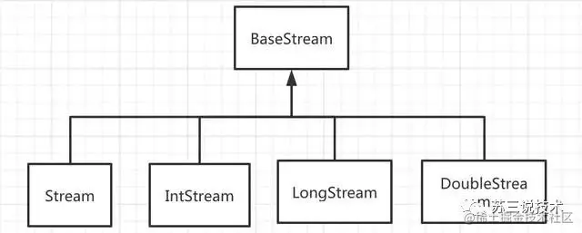
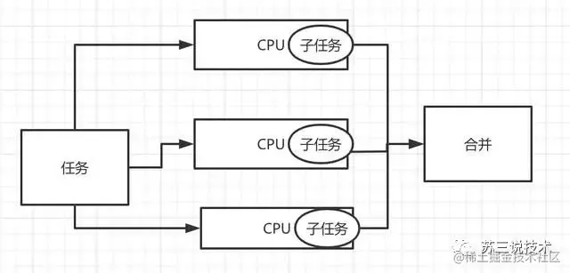

> 本文由 [简悦 SimpRead](http://ksria.com/simpread/) 转码， 原文地址 [juejin.cn](https://juejin.cn/post/6904465203446939662)

### 前言

如果有些朋友以前没有使用过 java8 stream 这种链式编程方式做开发，想学习一下。 如果有些朋友只学习了一部分用法，想学习更多。 如果有些朋友想看看有没有好的示例适用于实际工作当中。 那么恭喜你，这篇文章非常适合你。

首先，我们一起看看 stream 的继承关系： 

Stream、IntStream、LongStream、DoubleStream 的父接口都是 BaseStream。BaseStream 的四个子接口方法都差不多，只是 IntStream、LongStream、DoubleStream 直接存储基本类型，可以避免自动装 / 拆箱，效率会更高一些。但是，我们实际上使用 Stream 更多一些。

我们再看看 stream 的工作流程图： 

### 为什么要学 stream 的链式编程方式

**业务需求 1**：指定一个字符串数组，找出里面相同的元素，并且统计重复的次数。

我们以前大概是这样做的：

```
public class CountTest {

    @Test
      public void testCount1() {
        List<String> list = Lists.newArrayList("a", "b", "ab", "abc", "a", "ab", "a", "abcd", "bd", "abc");

        Map<String, Long> countMap = new HashMap<>();
        for (String data : list) {
            Long aLong = countMap.get(data);
            if (Objects.isNull(aLong)) {
                countMap.put(data, 1L);
            } else {
                countMap.put(data, ++aLong);
            }
        }

        countMap.forEach((key, value) -> System.out.println("key:" + key + " value:" + value));
    }
}
复制代码
```

执行结果：

```
key:a value:3
key:ab value:2
key:b value:1
key:bd value:1
key:abc value:2
key:abcd value:1
复制代码
```

我们再看看如果用 java8 的 stream 可以怎么做：

```
public class CountTest {

    @Test
    public void testCount2() {
     List<String> list = Lists.newArrayList("a", "b", "ab",      "abc", "a", "ab", "a", "abcd", "bd", "abc");
        Map<String, Long> countMap =         list.stream().collect(Collectors.groupingBy(Function.identity(), Collectors.counting()));
        countMap.forEach((key, value) ->         System.out.println("key:" + key + " value:" + value));
    }
}
复制代码
```

执行结果：

```
key:a value:3
key:ab value:2
key:b value:1
key:bd value:1
key:abc value:2
key:abcd value:1
复制代码
```

我们可以看到 testCount1 和 testCount2 执行结果相同，仅仅一行代码：

```
Map<String, Long> countMap = list.stream().collect(Collectors.groupingBy(Function.identity(), Collectors.counting()));
复制代码
```

就可以实现上面 testCount1 中多行代码的逻辑。

**业务需求 2**：从一个指定的字符串数组中，查找指定的字符串是否存在

我们以前大概是这样做的：

```
public class FindTest {

    @Test
    public void testFind1() {
        String findStr = "bd";
        List<String> list = Lists.newArrayList("a", "b", "ab", "abc", "a", "ab", "a", "abcd", "bd", "abc");
        boolean match = false;
        for (String data : list) {
            if (data.equals(findStr)) {
                match = true;
                break;
            }
        }
        //结果：match:true
        System.out.println("match:" + match);
    }
}
复制代码
```

我们再看看如果用 java8 的 stream 可以怎么做：

```
public class MatchTest {

    @Test
    public void testFind2() {
        String findStr = "bd";
        List<String> list = Lists.newArrayList("a", "b", "ab", "abc", "a", "ab", "a", "abcd", "bd", "abc");
        boolean match = list.stream().anyMatch(x -> x.equals(findStr));
        //结果：match:true
        System.out.println("match:" + match);
    }
}
复制代码
```

我们可以看到调用 testFind1 和 testFind2 方法执行结果也是一样的。但是，用 java8 stream 的语法，又只用一行代码就完成功能了，真棒。

### java8 stream 超详细用法指南

stream 的操作符大体上分为两种：中间操作符和终止操作符

### 中间操作：

#### 1.filter(T-> boolean)

过滤数据，保留 boolean 为 true 的元素，返回一个集合

```
public class FilterTest {
    @Test
    public void testFilter() {
        List<Integer> list = Lists.newArrayList(20, 23, 25, 28, 30, 33, 37, 40);
        //从指定数据集合中过滤出大于等于30的数据集合
        List<Integer> collect = list.stream().filter(x -> x >= 30).collect(Collectors.toList());
        //结果：[30, 33, 37, 40]
        System.out.println(collect);
    }
}
复制代码
```

collect(Collectors.toList()) 可以把流转换为 List 类型，collect 实际上是一个终止操作。

#### 2.map(T -> R)

转换操作符，可以做数据转换，比如：把字符串转换成 int、long、double，或者把一个实体转换成另外一个实体。包含：map，mapToInt、mapToLong、mapToDouble

```
public class MapTest {


    @Test
    public void testMap() {
        List<String> list = Lists.newArrayList("1", "2", "3", "4", "5", "6");
        List<Long> collect1 = list.stream().map(x -> Long.parseLong(x)).collect(Collectors.toList());
        //结果：[1, 2, 3, 4, 5, 6]
        System.out.println(collect1);

        //结果：111111
        list.stream().mapToInt(x -> x.length()).forEach(System.out::print);
        System.out.println("");

        //结果：111111
        list.stream().mapToLong(x -> x.length()).forEach(System.out::print);
        System.out.println("");

        //结果：1.01.01.01.01.01.0
        list.stream().mapToDouble(x -> x.length()).forEach(System.out::print);
    }
}
复制代码
```

#### 3.flatMap(T -> Stream)

将流中的每一个元素 T 映射为一个流，再把每一个流连接成为一个流

```
public class FlatMapTest {

    @Test
    public void testFlatMap() {
        List<List<String>>  list = new ArrayList<List<String>>(){{
            add(Lists.newArrayList("a","b","c"));
            add(Lists.newArrayList("d","e","f"));
            add(Lists.newArrayList("j","k","y"));
        }};
        //结果：[[a, b, c], [d, e, f], [j, k, y]]
        System.out.println(list);
        List<String> collect = list.stream().flatMap(List::stream).collect(Collectors.toList());
        //结果：[a, b, c, d, e, f, j, k, y]
        System.out.println(collect);
    }
}
复制代码
```

我们可以看到 flatMap 可以轻松把字符串的二维数据变成一位数组。

#### 4.distinct

去重，类似于 msql 中的 distinct 的作用，底层使用了 equals 方法做比较。

```
public class DistinctTest {

    @Test
    public void testDistinct() {
        List<String> list = Lists.newArrayList("a", "b", "ab", "abc", "a", "ab", "a", "abcd", "bd", "abc");
        List<String> collect = list.stream().distinct().collect(Collectors.toList());
        //结果：[a, b, ab, abc, abcd, bd]
        System.out.println(collect);
    }
}
复制代码
```

其实，去重还有另外一种办法，可以用 Collectors.toSet()，后面会讲到。

#### 5.sorted

对元素进行排序，前提是实现 Comparable 接口，当然也可以自定义比较器。

```
public class SortTest {

    @Test
    public void testSort() {
        List<Integer> list = Lists.newArrayList(5, 3, 7, 1, 4, 6);
        List<Integer> collect = list.stream().sorted((a, b) -> a.compareTo(b)).collect(Collectors.toList());
        //结果：[1, 3, 4, 5, 6, 7]
        System.out.println(collect);
    }
}
复制代码
```

#### 6.limit

限流操作，有点类似于 mysql 中的 limit 功能，比如：有 10 个元素，只取前面 3 个元素

```
public class LimitTest {

    @Test
    public void testLimit() {
        List<String> list = Lists.newArrayList("a", "b", "ab", "abc", "a", "ab", "a", "abcd", "bd", "abc");
        List<String> collect = list.stream().limit(3).collect(Collectors.toList());
        //结果：[a, b, ab]
        System.out.println(collect);
    }
}
复制代码
```

#### 7.skip

跳过操作，比如：有个 10 个元素，从第 5 个元素开始去后面的元素

```
public class SkipTest {

    @Test
    public void testSkip() {
        List<String> list = Lists.newArrayList("a", "b", "ab", "abc", "a", "ab", "a", "abcd", "bd", "abc");
        List<String> collect = list.stream().skip(5).collect(Collectors.toList());
        //结果：[ab, a, abcd, bd, abc]
        System.out.println(collect);
    }
}
复制代码
```

#### 8.peek

挑出操作，

```
public class PeekTest {
    @Test
    public void testPeek() {
        List<String> list = Lists.newArrayList("a", "b", "ab", "abc", "a", "ab", "a", "abcd", "bd", "abc");
        //结果：abababcaabaabcdbdabc
        list.stream().peek(x -> x.toUpperCase()).forEach(System.out::print);
    }
}
复制代码
```

眼尖的朋友会发现，进行 x.toUpperCase() 转换为大写功能，但是实际上没有生效。把 peek 改成 map 方法试试：

```
public class PeekTest {
    @Test
    public void testPeek() {
        List<String> list = Lists.newArrayList("a", "b", "ab", "abc", "a", "ab", "a", "abcd", "bd", "abc");
        //结果：ABABABCAABAABCDBDABC
        list.stream().map(x -> x.toUpperCase()).forEach(System.out::print);
    }
}
复制代码
```

我们可以看到，用 map 操作转换成大写功能生效了，但是用 peek 操作却没有生效。peek 只是对 Stream 中的元素进行某些操作，但是操作之后的数据并不返回到 Stream 中，所以 Stream 中的元素还是原来的元素。

### 终止操作：

#### 1.forEach

遍历操作，包含：forEach 和 forEachOrdered

forEach：支持并行处理

forEachOrdered：是按顺序处理的，遍历速度较慢

```
public class ForEachTest {

    @Test
    public void testForEach() {
        List<String> list = Lists.newArrayList("a", "b", "ab");
        //结果：a b ab
        list.stream().forEach(x-> System.out.print(x+' '));
        System.out.println("");

        //可以简化
        //结果：a b ab
        list.forEach(x-> System.out.print(x+' '));
        System.out.println("");

        //结果：a b ab
        list.stream().forEachOrdered(x-> System.out.print(x+' '));
    }
}
复制代码
```

#### 2.collect

收集操作，将所有的元素收集起来，Collectors 提供了非常多收集器。包含：toMap、toSet、toList、joining，groupingBy，maxBy，minBy 等操作。

toMap：将数据流转换为 map，里面包含的元素是用 key/value 的形式的

toSet：将数据流转换为 set，里面包含的元素不可重复

toList：将数据流转出为 list，里面包含的元素是有序的

joining：拼接字符串

groupingBy：分组，可以将 list 转换 map

couting：统计元素数量

maxBy：获取最大元素

minBy：获取最小元素

summarizingInt: 汇总 int 类型的元素，返回 IntSummaryStatistics，再调用具体的方法对元素进行统计：getCount（统计数量），getSum（求和），getMin（获取最小值），getMax（获取最大值），getAverage（获取平均值）

summarizingLong：汇总 long 类型的元素，用法同 summarizingInt

summarizingDouble：汇总 double 类型的元素，用法同 summarizingInt

averagingInt：获取 int 类型的元素的平均值，返回一个 double 类型的数据

averagingLong：获取 long 类型的元素的平均值，用法同 averagingInt

averagingDouble：获取 double 类型的元素的平均值，用法同 averagingInt

mapping：获取映射，可以将原始元素的一部分内容作为一个新元素返回

```
public class CollectTest {

    @Data
    @AllArgsConstructor
    class User {
        private String name;
        private Integer age;
    }


    @Test
    public void testCollect() {
        List<String> list0 = Lists.newArrayList("a", "b", "ab");
        Map<String, String> collect0 = list0.stream().collect(Collectors.toMap(String::new, Function.identity()));
        //结果：{ab=ab, a=a, b=b}
        System.out.println(collect0);

        List<String> list = Lists.newArrayList("a", "b", "ab", "a", "b", "ab");
        List<String> collect1 = list.stream().collect(Collectors.toList());
        //结果：[a, b, ab, a, b, ab]
        System.out.println(collect1);

        //结果：[a, ab, b]
        Set<String> collect2 = list.stream().collect(Collectors.toSet());
        System.out.println(collect2);

        String collect3 = list.stream().collect(Collectors.joining(","));
        //结果：a,b,ab,a,b,ab
        System.out.println(collect3);

        Map<String, List<String>> collect4 = list.stream().collect(Collectors.groupingBy(Function.identity()));
        //结果：{ab=[ab, ab], a=[a, a], b=[b, b]}
        System.out.println(collect4);

        Long collect = list.stream().collect(Collectors.counting());
        //结果：6
        System.out.println(collect);

        String collect5 = list.stream().collect(Collectors.maxBy((a, b) -> a.compareTo(b))).orElse(null);
        //结果：b
        System.out.println(collect5);

        String collect6 = list.stream().collect(Collectors.minBy((a, b) -> a.compareTo(b))).orElse(null);
        //结果：a
        System.out.println(collect6);

        List<String> list2 = Lists.newArrayList("2", "3", "5");
        IntSummaryStatistics summaryStatistics = list2.stream().collect(Collectors.summarizingInt(x -> Integer.parseInt(x)));
        long sum = summaryStatistics.getSum();
        //结果：10
        System.out.println(sum);

        Double collect7 = list2.stream().collect(Collectors.averagingInt(x -> Integer.parseInt(x)));
        //结果：3.3333333333333335
        System.out.println(collect7);

        List<User> userList = new ArrayList<User>() {{
            add(new User("jack",23));
            add(new User("james",30));
            add(new User("curry",28));
        }};
        List<String> collect8 = userList.stream().collect(Collectors.mapping(User::getName, Collectors.toList()));
        //[jack, james, curry]
        System.out.println(collect8);
    }
}
复制代码
```

#### 3.find

查找操作，包含：findFirst、findAny

findFirst：找到第一个，返回的类型为 Optional

findAny：使用 stream() 时找到的是第一个元素，使用 parallelStream() 并行时找到的是其中一个元素，返回的类型为 Optional

```
public class FindOpTest {

    @Test
    public void testFindOp() {
        List<String> list = Lists.newArrayList("a", "b", "ab", "abc", "bc", "ab");
        //查找第一匹配的元素
        String data1 = list.stream().findFirst().orElse(null);
        //结果: a
        System.out.println(data1);

        String data2 = list.stream().findAny().orElse(null);
        //结果: a
        System.out.println(data2);
    }
}
复制代码
```

#### 4.match

匹配操作，包含：allMatch、anyMatch、noneMatch

allMatch：所有元素都满足条件，返回 boolean 类型

anyMatch：任意一个元素满足条件，返回 boolean 类型

noneMatch：所有元素都不满足条件，返回 boolean 类型

```
public class MatchTest {

    @Test
    public void testMatch() {
        List<Integer> list = Lists.newArrayList(2, 3, 5, 7);
        boolean allMatch = list.stream().allMatch(x -> x > 1);
        //结果：true
        System.out.println(allMatch);

        boolean allMatch2 = list.stream().allMatch(x -> x > 2);
        //结果：false
        System.out.println(allMatch2);

        boolean anyMatch = list.stream().anyMatch(x -> x > 2);
        //结果：true
        System.out.println(anyMatch);

        boolean noneMatch1 = list.stream().noneMatch(x -> x > 5);
        //结果：false
        System.out.println(noneMatch1);

        boolean noneMatch2 = list.stream().noneMatch(x -> x > 7);
        //结果：true
        System.out.println(noneMatch2);
    }
}
复制代码
```

#### 5.count

统计操作，效果跟调用集合的 size() 方法类似

```
public class CountOpTest {

    @Test
    public void testCountOp() {
        List<String> list = Lists.newArrayList("a", "b", "ab");
        long count = list.stream().count();
        //结果：3
        System.out.println(count);
    }
}
复制代码
```

### 6.min、max

min：获取最小值，返回 Optional 类型的数据

max：获取最大值，返回 Optional 类型的数据

```
public class MaxMinTest {

    @Test
    public void testMaxMin() {
        List<Integer> list = Lists.newArrayList(2, 3, 5, 7);
        Optional<Integer> max = list.stream().max((a, b) -> a.compareTo(b));
        //结果：7
        System.out.println(max.get());

        Optional<Integer> min = list.stream().min((a, b) -> a.compareTo(b));
        //结果：2
        System.out.println(min.get());
    }
}
复制代码
```

### 7.reduce

规约操作，将整个数据流的值规约为一个值，count、min、max 底层就是使用 reduce。

reduce 操作可以实现从 Stream 中生成一个值，其生成的值不是随意的，而是根据指定的计算模型。

```
public class ReduceTest {

    @Test
    public void testReduce() {
        List<Integer> list = Lists.newArrayList(2, 3, 5, 7);
        Integer sum1 = list.stream().reduce(0, Integer::sum);
        //结果：17
        System.out.println(sum1);

        Optional<Integer> reduce = list.stream().reduce((a, b) -> a + b);
        //结果：17
        System.out.println(reduce.get());

        Integer max = list.stream().reduce(0, Integer::max);
        //结果：7
        System.out.println(max);

        Integer min = list.stream().reduce(0, Integer::min);
        //结果：0
        System.out.println(min);


        Optional<Integer> reduce1 = list.stream().reduce((a, b) -> a > b ? b : a);
        //2
        System.out.println(reduce1.get());
    }
}
复制代码
```

### 8.toArray

数组操作，将数据流的元素转换成数组。

```
public class ArrayTest {

    @Test
    public void testArray() {
        List<String> list = Lists.newArrayList("a", "b", "ab");
        String[] strings = list.stream().toArray(String[]::new);
        //结果：a b ab
        for (int i = 0; i < strings.length; i++) {
            System.out.print(strings[i]+" ");
        }
    }
}
复制代码
```

stream 和 parallelStream 的区别 stream：是单管道，称其为流，其主要用于集合的逻辑处理。

parallelStream：是多管道，提供了流的并行处理，它是 Stream 的另一重要特性，其底层使用 Fork/Join 框架实现

```
public class StreamTest {

    @Test
    public void testStream() {
        List<Integer> list = Lists.newArrayList(1,2, 3,4, 5,6, 7);
        //结果：1234567
        list.stream().forEach(System.out::print);
    }
}
复制代码
```

```
public class ParallelStreamTest {
    @Test
    public void testParallelStream() {
        List<Integer> list = Lists.newArrayList(1,2, 3,4, 5,6, 7);
        //结果：5726134
        list.parallelStream().forEach(System.out::print);
    }
}
复制代码
```

我们可以看到直接使用 parallelStream 的 forEach 遍历数据，是没有顺序的。

如果要让 parallelStream 遍历时有顺序怎么办呢？

```
public class ParallelStreamTest {

    @Test
    public void testParallelStream() {
        List<Integer> list = Lists.newArrayList(1,2, 3,4, 5,6, 7);
        //结果：1234567
        list.parallelStream().forEachOrdered(System.out::print);
    }
}
复制代码
```

parallelStream 的工作原理：



### 实际工作中的案例

1. 从两个集合中找相同的元素。一般用于批量数据导入的场景，先查询出数据，再批量新增或修改。

```
public class WorkTest {

    @Test
    public void testWork1() {
        List<String> list1 = Lists.newArrayList("a", "b", "ab");
        List<String> list2 = Lists.newArrayList("a", "c", "ab");
        List<String> collect = list1.stream()
                .filter(x -> list2.stream().anyMatch(e -> e.equals(x)))
                .collect(Collectors.toList());
        //结果：[a, ab]
        System.out.println(collect);

    }
}
复制代码
```

2. 有两个集合 a 和 b，过滤出集合 a 中有，但是集合 b 中没有的元素。这种情况可以使用在假如指定一个 id 集合，根据 id 集合从数据库中查询出数据集合，再根据 id 集合过滤出数据集合中不存在的 id，这些 id 就是需要新增的。

```
@Test
public void testWork2() {
    List<String> list1 = Lists.newArrayList("a", "b", "ab");
    List<String> list2 = Lists.newArrayList("a", "c", "ab");
    List<String> collect = list1.stream()
      .filter(x -> list2.stream().noneMatch(e -> e.equals(x)))
      .collect(Collectors.toList());
    //结果：[b]
    System.out.println(collect);
}
复制代码
```

3. 根据条件过滤数据，并且去重做数据转换

```
@AllArgsConstructor
  @Data
  class User {
      private String name;
      private Integer age;
  }

  @Test
  public void testWork3() {
      List<User> userList = new ArrayList<User>() {{
          add(new User("jack",23));
          add(new User("james",30));
          add(new User("curry",28));
          add(new User("tom",27));
          add(new User("sue",29));
      }};

      List<String> collect = userList.stream()
              .filter(x -> x.getAge() > 27)
              .sorted((a, b) -> a.getAge().compareTo(b.getAge()))
              .limit(2)
              .map(User::getName)
              .collect(Collectors.toList());
      //结果：[curry, sue]
      System.out.println(collect);
  }
复制代码
```

4. 统计指定集合中，姓名相同的人中年龄最小的年龄

```
@Test
public void testWork4() {
    List<User> userList = new ArrayList<User>() {{
        add(new User("tom", 23));
        add(new User("james", 30));
        add(new User("james", 28));
        add(new User("tom", 27));
        add(new User("sue", 29));
    }};

    userList.stream().collect(Collectors.groupingBy(User::getName))
            .forEach((name, list) -> {
                User user = list.stream().sorted((a, b) -> a.getAge().compareTo(b.getAge())).findFirst().orElse(null);
                //结果：name:sue,age:29
                //     name:tom,age:23
                //     name:james,age:28
                System.out.println("name:" + name + ",age:" + user.getAge());
            });
}
复制代码
```

### 最后说一句 (求关注，别白嫖我)

如果这篇文章对您有所帮助，或者有所启发的话，帮忙关注一下，您的支持是我坚持写作最大的动力。

求一键三连：点赞、转发、在看。

此外关注公众号：【苏三说技术】，在公众号中回复：面试、代码神器、开发手册、时间管理有超赞的粉丝福利，另外回复：加群，可以跟很多 BAT 大厂的前辈交流和学习。