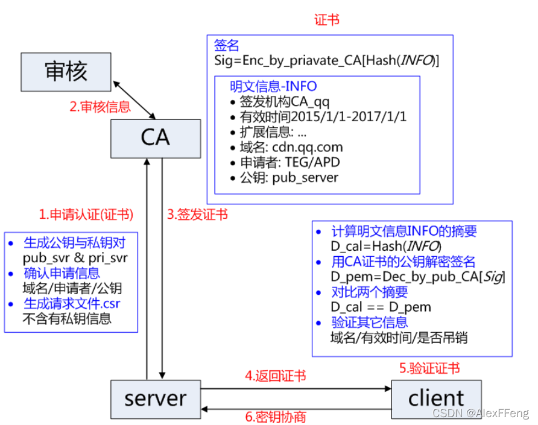

> 本文由 [简悦 SimpRead](http://ksria.com/simpread/) 转码， 原文地址 [blog.csdn.net](https://blog.csdn.net/weixin_44811851/article/details/121995190)

**什么是 CA？**
===========

数字证书认证机构
--------

> 数字证书认证机构 (Certicate Authority，缩写为 CA)，是 负责发放和管理数字证书的权威机构 并作为受信任的第三方，承担公钥体系中公钥合法性检验的责任。

什么是证书？
======

> 共享密钥加密（对称密钥加密）：加密和解密使用相同密钥。  
> 对称加密算法：DES、3DES、DESX、Blowfish、IDEA、RC4、RC5、RC6 和 AES。  
>   
> 公开密钥加密（非对称密钥加密）：公开密钥加密使用一对非对称的密钥。一把叫做私有密钥，一把叫做公开密钥。私有密钥不能让其他任何人知道，而公开密钥则可以随意发布，任何人都可以获得。使用此加密方式，发送密文的一方使用公开密钥进行加密处理，对方收到被加密的信息后，再使用自己的私有密钥进行解密。利用这种方式，不需要发送用来解密的私有密钥，也不必担心密钥被攻击者窃听盗走。  
>   
> 常见的非对称加密算法：RSA、ECC（移动设备用）、Diffie-Hellman、El Gamal、DSA（数字签名用）。  

要使数字证书有用，它的结构必须采用一种可理解且可靠的形式，以便人们可以轻松地检索并理解证书内的信息。例如，护照采用这样一种结构：人们可以轻松地理解以前从未见过的那一类护照中的信息。同样，只要数字证书是标准化的，则无论颁发该证书的是哪个机构，人们都可以阅读并理解该证书。  
S/MIME 标准规定：用于 S/MIME 的数字证书应遵守国际电信同盟 (ITU) X.509 标准。S/MIME 版本 3 明确要求数字证书应遵循 X.509 的第 3 版。由于 S/MIME 依赖于已建立的数字证书结构公认标准，因此 S/MIME 标准建立在该标准的发展之上，从而提高了它的认可度。

CA 证书
=====

X.509 标准规定数字证书应包含标准化信息。具体地说，X.509 版本 3 证书包含下列字段：  
**版本号** 证书所遵循的 X.509 标准的版本。  
**序列号** 唯一标识证书且由证书颁发机构颁发的编号。  
**签名算法：** CA 用于对证书进行数字签名的 hash 算法。

证书签名：
=====

**颁发者名称：** 实际颁发该证书的证书颁发机构的标识。  
**有效期：** 数字证书保持有效的时间段，并包含起始日期和过期日期。  
**使用者名称：** 数字证书所有者的姓名。  
**使用者公钥信息：** 与数字证书所有者关联的公钥以及与该公钥关联的特定公钥算法。  
**颁发者唯一标识符：** 可以用来唯一标识数字证书颁发者的信息。  
**使用者唯一标识符：** 可以用来唯一标识数字证书所有者的信息。  
**扩充信息：** 与证书的使用和处理有关的其他信息。  
**证书颁发机构的数字签名：** 使用指纹算法中指定的 HASH 算法以及证书颁发机构的[私钥](https://so.csdn.net/so/search?q=%E7%A7%81%E9%92%A5&spm=1001.2101.3001.7020)进行加密的数字签名。  
**X.509 通用的证书格式：** 包含三个文件：**key**，**csr**，**crt**。  
key 是私钥文件。  
csr 是证书签名请求文件，用于提交给证书颁发机构（CA）对证书签名。  
crt 是由证书颁发机构（CA）签名后的证书，或者是开发者自签名的证书，包含证书持有人的信息，持有人的 **公钥** ，以及签署者的签名等信息。

Diffie-Hellman 加密算法
===================

密钥协商算法：  
通讯双方（张三、李四) 需要先约定好算法参数（algorithm parameters): 一个素数 p 作为模数，一个素数 g 作为基数 (g 也称为 “生成元”）。这两个算法参数是可以对外公开滴。

对于张三而言，需要先想好一个秘密的自然数 a 作为私钥（不能公开），然后计算 A = g/a mod p 作为自己的公钥 (可以公开)。

对李四而言也类似，先想好一个秘密的自然数 b 作为私钥〈不能公开)，然后计算 B= gAb mod p 作为自己的公钥 (可以公开)。

张三和李四互相交换各自的公钥。  
然后张三计算出 k = B/a mod p，李四计算出 k = ANb mod p

好处:  
张三和李四分别计算出来的 k 必定是一致的  
张三和李四都无法根据已知的数来推算出对方的私钥（张三无法推算出 b，李四无法推算出 a）  
对于一个旁观者（偷窥者），虽然能看到 p，g，A，B，但是无法推算出 a 和 b(就是说，旁观者无法推算出双方的私钥)，自然也无法推算出 k

CA 证书认证流程：
==========

1、申请认证（证书）
----------

*   `服务端 S`向第三方权威机构 CA 申请证书，`服务器 S`先生成公钥和私钥对
*   确认信息里面绑定我们当前使用哪个域名，以及申请者以及公钥
*   生成请求文件`.csr`（csr 是我们`服务端 S`向 CA 提交申请的文件）注意：提交信息里不包含私钥

2、审核信息
------

*   CA 收到`服务端 S`发送的信息先去审核（CA 通过线上、线下等多种手段验证申请者提供信息的真实性）
    
*   审核通过，CA 会向申请者签发认证文件 - 证书。
    
*   证书包含以下信息：申请者公钥、申请者的组织信息和个人信息、签发机构 CA 的信息、有效时间、证书序列号等信息的明文，同时包含一个签名
    

3、签发证书
------

*   签名证书里的 明文信息 通过哈希算法加密 -------> 摘要 1（注意：这个就是后面的摘要 1）
    
*   CA 机构会产生一对公钥和私钥，用私钥对信息（摘要 1）加密，拿到了一个签名
    
*   <签名>和 <明文信息> 组成了 | 证书 | ，把这个证书发给`服务器`
    

4、返回证书
------

*   `服务器 S`把 CA 证书发送给`客户端 C`

5、验证证书
------

客户端会内置信任 CA 的证书信息 (包含公钥)，如果 CA 不被信任，则找不到对应 CA 的证书，证书也会被判定非法。

*   `客户端 C` 利用对应 CA 的公钥解密签名数据，拿到了摘要 1
    
*   `客户端 C` 读取证书中的相关的明文信息，采用哈希算法**加密**得到信息摘要 2
    
*   对比证书的信息摘要，如果一致，则可以确认证书的合法性，即公钥合法
    
*   然后提取出 公钥 pub_server
    
*   通过这一步客户端认可了`服务器`，拿到了`服务器`的公钥
    

> 在这个过程注意几点：  
>   
> 1. 申请证书不需要提供私钥，确保私钥永远只能服务器掌握；  
>   
> 2. 证书的合法性仍然依赖于非对称加密算法，证书主要是增加了服务器信息以及签名；  
>   
> 3. 内置 CA 对应的证书称为根证书，颁发者和使用者相同，自己为自己签名，即自签名证书；  
>   
> 4. 证书 = 公钥 + 申请者与颁发者信息 + 签名；