> 本文由 [简悦 SimpRead](http://ksria.com/simpread/) 转码， 原文地址 [mp.weixin.qq.com](https://mp.weixin.qq.com/s/IkQZv6itp9A_C9na29k2Gw)


传输控制协议（英语：TransmissionControlProtocol，缩写：TCP）是一种面向连接的、可靠的、基于字节流的传输层通信协议，由 IETF 的 RFC793 定义。在简化的计算机网络 OSI 模型中，它完成第四层传输层所指定的功能。

# 一、协议体


---------

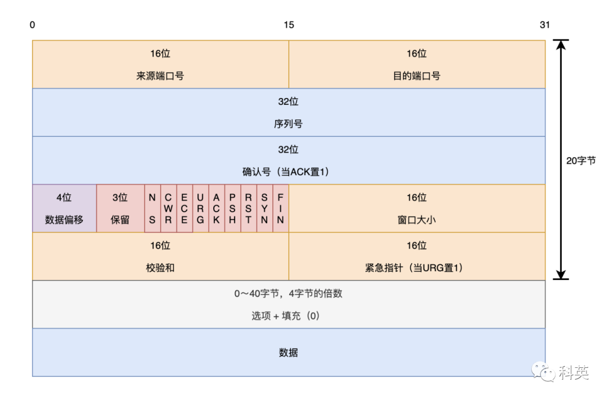

图 1 TCP 协议体

下面详细介绍每个参数的含义：

*   来源端口号（16 位）：识别发送连接端口。
    
*   目的端口号（16 位）：识别接收连接端口。
    
*   序列号（seq，32 位）：用来解决网络乱序问题。
    
    如果含有同步化标志（SYN），则此为最初的序列号（ISN），第一个数据字节的序列号为 ISN + 1；如果没有同步化标志（SYN），则此为第一个数据比特的序列号。
    
*   **确认号**（ack，32 位）：期望收到的数据的开始序列号，发送端收到这个确认应答以后可以认为在这个序号以前的数据都已经被正常接收。用来解决丢包的问题。
    
*   数据偏移（4 位）：以 4 字节为单位计算出的数据段开始地址的偏移值。相对于 TCP 头开始位置，没有选项时该值为 5。
    
*   保留（3 位）：须置 0
    
*   标志符（9 位）
    
*   NS：ECN-nonce。ECN 显式拥塞通知（Explicit Congestion Notification）是对 TCP 的扩展，定义于 RFC 3540 （2003）。ECN 允许拥塞控制的端对端通知而避免丢包。ECN 为一项可选功能，如果底层网络设施支持，则可能被启用 ECN 的两个端点使用。在 ECN 成功协商的情况下，ECN 感知路由器可以在 IP 头中设置一个标记来代替丢弃数据包，以标明阻塞即将发生。数据包的接收端回应发送端的表示，降低其传输速率，就如同在往常中检测到包丢失那样。
    
*   CWR：Congestion Window Reduced，定义于 RFC 3168（2001）。
    
*   **ECE**：ECN-Echo 有两种意思，取决于 SYN 标志的值，定义于 RFC 3168（2001）。
    
*   URG：为 1 表示高优先级数据包，紧急指针字段有效。
    
*   ACK：为 1 表示确认号字段有效。
    
*   PSH：为 1 表示是带有 PUSH 标志的数据，指示接收方应该尽快将这个报文段交给应用层而不用等待缓冲区装满。
    
*   RST：为 1 表示出现严重差错。可能需要重新创建 TCP 连接。还可以用于拒绝非法的报文段和拒绝连接请求。
    
*   SYN：为 1 表示这是连接请求或是连接接受请求，用于创建连接和使顺序号同步。
    
*   FIN：为 1 表示发送方没有数据要传输了，要求释放连接。
    
*   窗口大小（WIN，16 位）：表示从确认号开始，本报文的发送方可以接收的字节数，即接收窗口大小。用于流量控制。
    
*   校验和（Checksum，16 位）：对整个的 TCP 报文段，包括 TCP 头部和 TCP 数据，以 16 位字进行计算所得。这是一个强制性的字段。
    
*   紧急指针（16 位）：本报文段中的紧急数据的最后一个字节的序号。
    
*   选项（最多 40 字节）：每个选项的开始是 1 字节的 kind 字段，说明选项的类型。
    
*   0：选项表结束（1 字节）
    
*   1：无操作（1 字节）用于选项字段之间的字边界对齐。
    
*   2：最大报文段长度（4 字节，Maximum Segment Size，MSS）通常在创建连接而设置 SYN 标志的数据包中指明这个选项，指明本端所能接收的最大长度的报文段。通常将 MSS 设置为（MTU-40）字节，携带 TCP 报文段的 IP 数据报的长度就不会超过 MTU（MTU 最大长度为 1518 字节，最短为 64 字节），从而避免本机发生 IP 分片。只能出现在同步报文段中，否则将被忽略。
    
*   3：窗口扩大因子（3 字节，wscale），取值 0-14。用来把 TCP 的窗口的值左移的位数，使窗口值乘倍。只能出现在同步报文段中，否则将被忽略。这是因为现在的 TCP 接收数据缓冲区（接收窗口）的长度通常大于 65535 字节。
    
*   4：sackOK，发送端支持并同意使用 SACK 选项。
    
*   5：SACK 实际工作的选项。
    
*   8：时间戳（10 字节，TCP Timestamps Option，TSopt），
    
    发送端的时间戳（Timestamp Value field，TSval，4 字节），时间戳回显应答（Timestamp Echo Reply field，TSecr，4 字节）
    
*   19：MD5 摘要，将 TCP 伪首部、校验和为 0 的 TCP 首部、TCP 数据段、通信双方约定的密钥（可选）计算出 MD5 摘要值并附加到该选项中，作为类似对 TCP 报文的签名。通过 RFC 2385 引入，主要用于增强 BGP 通信的安全性。
    
*   29：安全摘要，通过 RFC 5925 引入，将 “MD5 摘要” 的散列方法更换为 SHA 散列算法。  
    

Linux 中 TCP 头结构体定义如下：

```c++
struct tcphdr {
    __be16  source;
    __be16  dest;
    __be32  seq;
    __be32  ack_seq;
    #if defined(__LITTLE_ENDIAN_BITFIELD)
    __u16   res1:4,
            doff:4,
            fin:1,
            syn:1,
            rst:1,
            psh:1,
            ack:1,
            urg:1,
            ece:1,
            cwr:1;
    #elif defined(__BIG_ENDIAN_BITFIELD)
    __u16   doff:4,
            res1:4,
            cwr:1,
            ece:1,
            urg:1,
            ack:1,
            psh:1,
            rst:1,
            syn:1,
            fin:1;
    #else
    #error  "Adjust your <asm/byteorder.h> defines"
    #endif
    __be16  window;
    __sum16 check;
    __be16  urg_ptr;
};
```

# 二、三次握手


----------


## 2.1 三次握手过程详解

一对终端同时初始化一个它们之间的连接是可能的。但通常是由一端（服务端）打开一个套接字（socket）然后监听来自另一方（客户端）的连接，这就是通常所指的被动打开（passive open）。服务端被动打开以后，客户端就能开始创建主动打开（active open）。

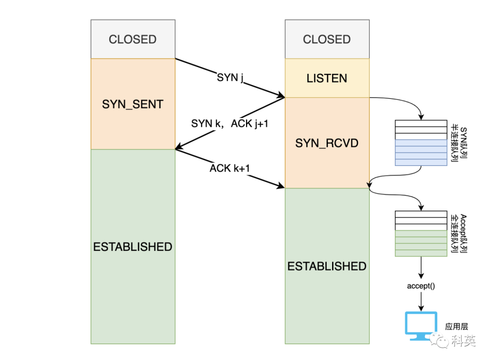

图 2 TCP 三次握手

服务端执行了 listen 函数后，就在服务端创建两个队列：

*   SYN 队列：存放完成了二次握手的结果，也称半连接队列。队列长度受 listen 函数的参数 backlog 影响，受 tcp_max_syn_backlog 的限制，内核参数 tcp_max_syn_backlog 定义了处于 SYN_RECV 的 TCP 最大连接数，当处于 SYN_RECV 状态的 TCP 连接数超过 tcp_max_syn_backlog 后，tcp_abort_on_overflow 决定超过时的行为（0：默认，丢弃 SYN 包；1：返回 RST 报文）；
    
*   Accept 队列：存放完成了三次握手的结果，等待 accept 调用，也称全连接队列。队列长度受 listen 函数的参数 backlog 影响，受 somaxconn 的限制，内核参数 somaxconn 定义了处于 ESTABLISHED 的 TCP 最大连接数，默认值为 128。超过队列长度，默认丢弃。
    

**三次握手详细过程：**

1.  客户端的协议栈向服务端发送 SYN 包，并告诉服务端当前发送序列号 j（ISN），客户端进入 SYNC_SENT 状态；
    
2.  服务端的协议栈收到这个 SYN 包之后，检查 SYN 合法性，然后会创建一个半连接的对象，将其加入到内核的「 SYN 队列」。接着给客户端发送 SYN+ACK 包，确认序列号为 j+1，表示对 SYN 包 j 的确认，服务端序列号为 k（ISN），服务端进入 SYNC_RCVD 状态，这时处于半连接状态；
    
3.  客户端协议栈收到 ACK 之后，使得应用程序从 connect 调用返回（或者监听的 socket 有读事件），表示客户端到服务端的单向连接建立成功，客户端的状态为 ESTABLISHED，同时客户端协议栈也会对服务端的 SYN 包进行应答，确认序号为 k+1；
    
4.  当服务器端收到这个 ACK 包的时候，从「 SYN 队列」取出对应的半连接对象，然后创建一个新的全连接对象放入到「 Accept 队列」，这个时候服务端到客户端的单向连接也建立成功，服务端也进入 ESTABLISHED 状态；服务端调用 accept 函数，从「Accept 队列」中取出全连接对象，创建一个新的用于双向通信的 sockfd。第三次握手是可以携带数据的，前两次握手是不可以携带数据的。
    

### 

## 2.2 初始化序列号（ISN）

TCP 刚建立连接时，需要「初始化的序列号」ISN 是随机的，原因是：

*   为了防止历史报文被下一个相同四元组的连接接收（主要方面）；
    
*   为了安全性，防止黑客伪造相同序列号的 TCP 报文被对方接收；  
    

随机生成算法：ISN = M + F(localhost, localport, remotehost, remoteport)。

*   M 是一个计时器，这个计时器每隔 4 微秒加 1，转一圈要 4.55 个小时；
    
*   F 是一个 Hash 算法（MD5），根据源 IP、目的 IP、源端口、目的端口生成一个随机数值。
    

基本不可能随机成一样的 ISN。

### 

2.3 为什么三次握手？而不是二次、四次握手？

采用三次握手有三个原因：

*   防止重复历史连接的初始化（主要原因）；
    
*   同步双方的初始化序列号 ISN；
    
*   避免资源浪费。
    

不使用两次握手和四次握手的原因：

*   两次握手：无法防止历史连接的建立，会造成双方资源的浪费，也无法可靠的同步双方序列号；
    
*   四次握手：三次握手就已经理论上最少可靠连接建立，所以不需要使用更多的通信次数。
    

### 2.3.1 阻止重复历史连接的初始化，同时避免资源浪费

二次握手会有下面的现象：

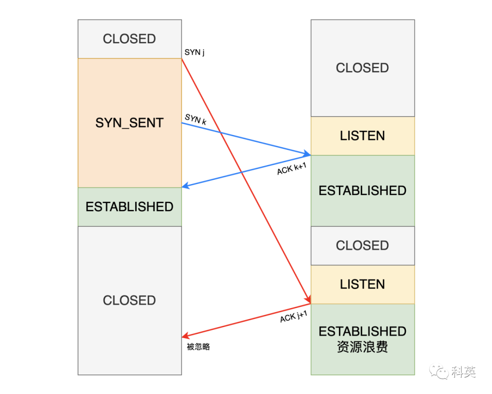

图 3 二次握手

1.  客户端发出的第一次握手并没有丢失，而是在某个网络结点长时间的滞留了，以致延误到连接释放以后的某个时间才到达服务端；
    
2.  本来这是一个早已失效的报文。但服务端收到此失效的连接请求报文后，就误认为是客户端再次发出的一个新的连接请求；
    
3.  于是就向客户端发出确认报文，同意建立连接。假设不采用三次握手，那么只要服务端发出确认，新的连接就建立了；
    
4.  由于最近客户端并没有发出建立连接的请求，因此不会理睬服务端的确认报文，也不会向服务端发送数据，但服务端却以为新的连接已经建立，并一直等待客户端发来数据；
    
5.  这样，服务端的很多连接占用的资源就白白浪费掉了。
    

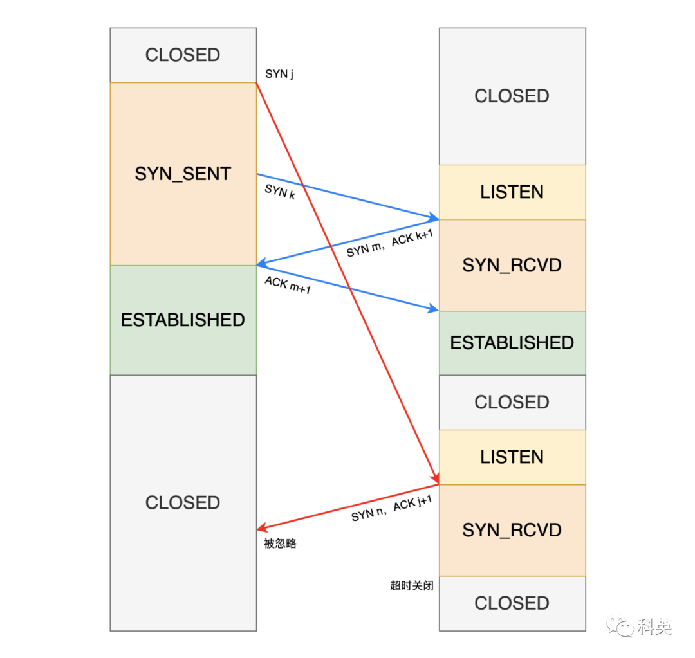

图 4

采用三次握手可以防止上述现象发生。因为客户端已经关闭，不会向服务端的 FIN 发出确认，所以服务端由于收不到确认，不会建立连接，资源就不会浪费。

### 2.3.2 同步双方的初始序列号

通信的双方， 都各自维护一个序列号， 序列号是可靠传输的一个关键因素，它的作用：

*   接收方可以去除重复的数据；
    
*   接收方可以根据数据包的序列号进行排序，解决网络乱序问题；
    
*   发送方可以根据确认包中确认序列号，知道哪些已经被对方接收，用来解决丢包的问题；
    

当客户端发送携带「初始序列号」的 SYN 包时，需要服务端回一个 ACK 包，表示客户端的 SYN 包已被服务端成功接收；那当服务端发送「初始序列号」给客户端的时候，依然也要得到客户端的应答回应。这样一来一回，才能确保双方的初始序列号能被可靠的同步。

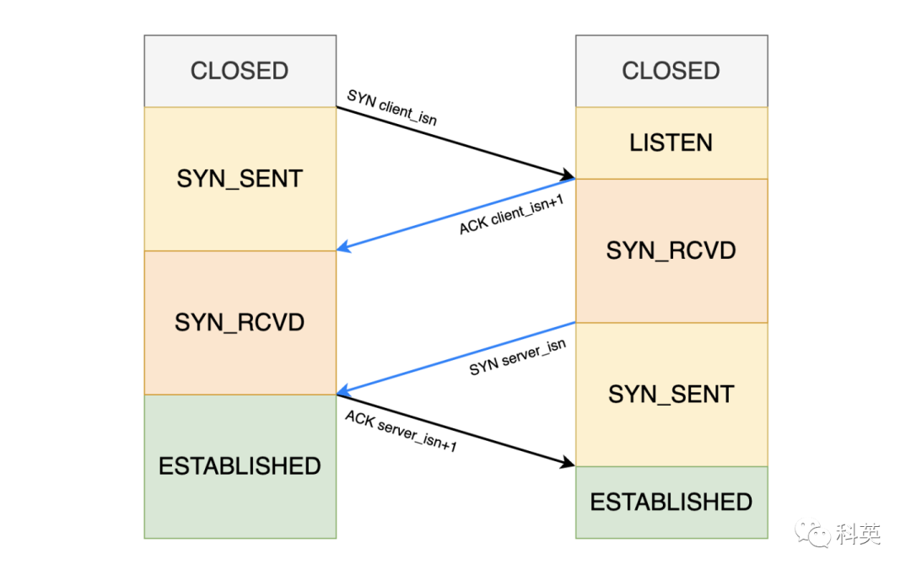

图 5 四次握手

四次握手其实可以同步双方的「初始化序号」，但由于第二步和第三步可以合并成一步，所以就成了「三次握手」；而两次握手只保证了客户端的「初始序列号」能被服务端成功接收，没办法保证双方的「初始序列号」都能被确认接收。

### 

## 2.4 异常情况

### 2.4.1 第一次握手丢了

客户端给服务端发的 SYN 包丢失后，也就不会收到 SYN+ACK，然后会启动「超时重传」，重传的 SYN 包的序列号都是一样的。

在 Linux 里，客户端的 SYN 包最大重传次数由 tcp_syn_retries 内核参数控制，可以修改，默认值一般是 6。

```
# cat /proc/sys/net/ipv4/tcp_syn_retries
```

第一次超时重传是在 1 秒后，第二次在 2 秒后，第三次在 4 秒后，第四次在 8 秒后，第五次在 16 秒后，第六次在 32 秒后。每次超时的时间是上一次的 2 倍。

当第六次超时重传后，会继续等待 32 秒，如果服务端仍然没有回应 ACK，客户端就不再发送 SYN 包，然后断开 TCP 连接。所以，总耗时是 1+2+4+8+16+32+64=127 秒，大约 2 分钟左右。

### 2.4.2 第二次握手丢了

服务器给客户端发的 SYN + ACK 包丢了，会造成双方超时重传：

*   客户端迟迟收不到服务端回应的 ACK，发生超时重传，重传 SYN，和上面第一次握手丢了一样，第五次超时重传超时后断开连接；
    
*   服务端发了 SYN，也需要客户端回应 ACK 包，不然也会超时重传，重传 SYN+ACK。第五次重传超时后断开连接。
    

在 Linux 下，SYN+ACK 报文的最大重传次数由 tcp_synack_retries 内核参数决定，默认值是 5。

```
# cat /proc/sys/net/ipv4/tcp_synack_retries
```

### 2.4.3 第三次握手丢了

客户端发给服务端的 ACK 包丢了，会导致服务端超时重传 SYN+ACK，而不是客户端超时重传 ACK 包，这里强调下，所有 ACK 不会「超时重传」。

和上面第二次握手丢了服务端的行为一样，第 tcp_synack_retries 次超时重传超时后，服务端断开连接。但是客户端已经是 ESTABLISHED 状态，最后会因为发送数据失败，关闭连接。

2.4.4 SYN 攻击与避免

攻击者短时间伪造大量不同的 IP 地址发送 SYN 报文，服务端每接收到一个 SYN 报文，就进入 SYN_RCVD 状态，但服务端发给伪 IP 的的 ACK+SYN 报文，无法得到回应 ACK 报文，不停的往「半连接队列」塞数据，打满半连接队列，后续再收到 SYN 报文就会丢弃，导致其他正常的客户端无法和服务端建立连接。

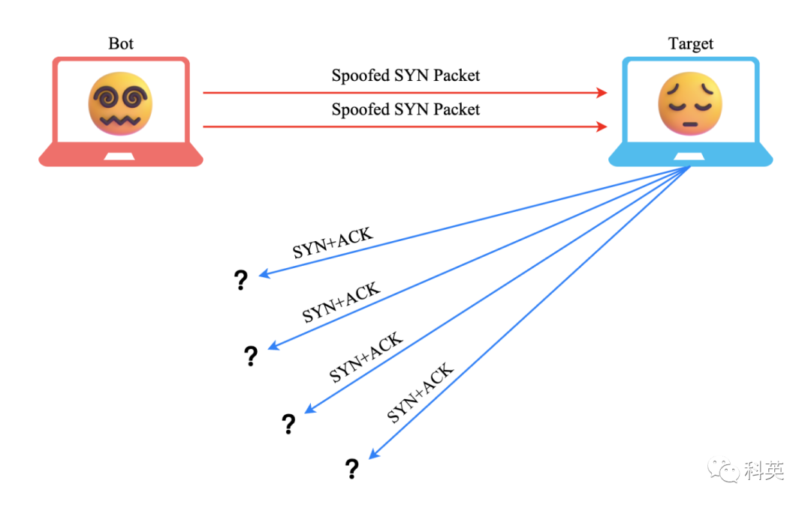

图 6 SYN 洪水攻击

开启 net.ipv4.tcp.tcp_syncookies，可以解决 SYN 攻击。参数有下面三个值：

*   0 值，表示关闭该功能；
    
*   1 值，表示仅当 「SYN 队列」满时，再启用它；
    
*   2 值，表示无条件开启功能。
    

开启 syncookies 功能可以绕过「SYN 队列」成功建立连接。过程如下图：

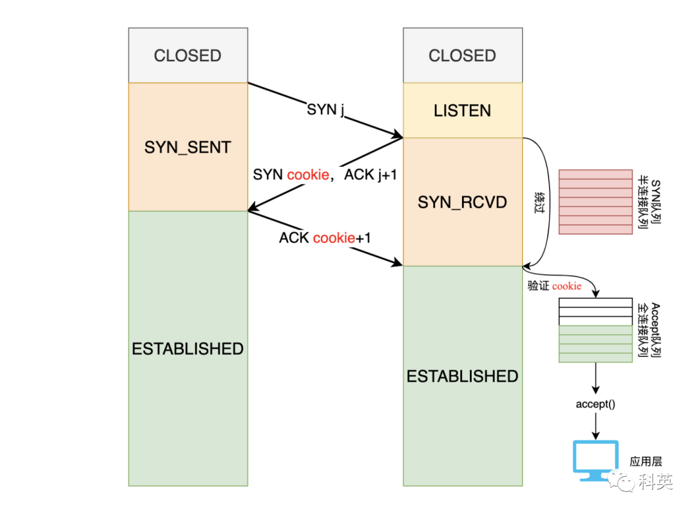

图 7

*   当「 SYN 队列」被打满后，后续服务端收到 SYN 包，不会丢弃，而是根据算法（通过原地址端口，目的地址端口和时间戳打造一个特别的 Sequence Number）计算出一个 cookie 值；将 cookie 值放到第二次握手报文的「序列号」里，然后发给客户端；
    
*   客户端收到 SYN+ACK 包后，正常回应 ACK cookie+1；攻击者伪装的 IP 不会应答；
    
*   服务端接收到客户端的应答报文时，服务端会检查这个 ACK 包的合法性。如果合法，将该连接对象放入到「 Accept 队列」。
    
*   最后应用程序通过调用 accpet() 接口，从「 Accept 队列」取出连接对象。
    

那么在应对 SYN 攻击时，只需要设置 tcp_syncookies 为 1，命令如下：

```
$ echo 1 > /proc/sys/net/ipv4/tcp_syncookies
```

# 三、四次挥手


----------

### 

## 3.1 四次挥手详细过程

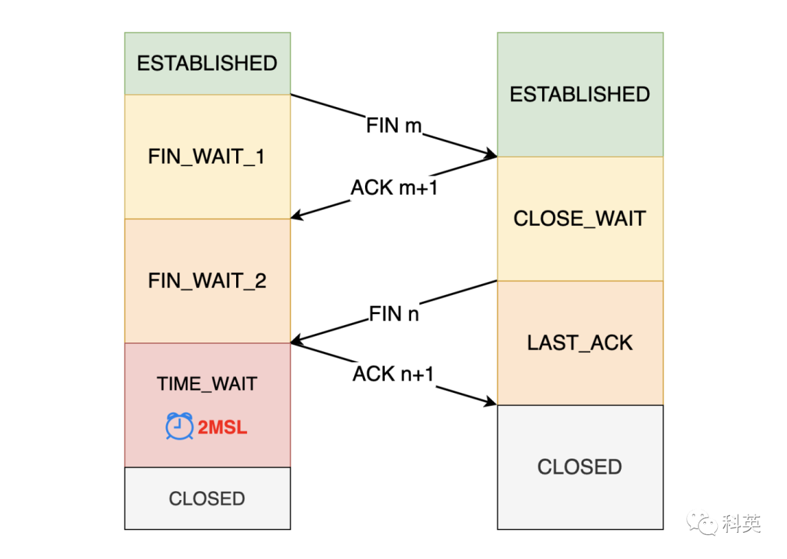

图 8 TCP 四次挥手

客户端和服务端都可以主动发起关闭连接请求，为了方便描述过程，后面均称主动发起关闭连接的一方为「主动方」，另一方为「被动方」。

1.  「主动方」想要关闭连接，会发送一个 FIN 报文，序号 m，之后「主动方」进入 FIN_WAIT_1 状态，仅仅表示「主动方」不再发送数据了但是还能接收数据；
    
2.  「被动方」收到 FIN 报文后，就向「主动方」发送 ACK m + 1 应答报文，并向接收缓冲区写入一个文件结束符 EOF，排在未读数据之后，然后「被动方」进入 CLOSE_WAIT 状态；
    
3.  「主动方」收到「被动方」的 ACK 应答报文之后进入 FIN_WAIT_2 状态；
    
4.  「被动方」把数据发送完并且调用 read 函数读到 EOF 后，调用 close 函数，也向「主动方」发送 FIN 报文，序号 n，然后「被动方」进入 LAST_ACK 状态；
    
5.  「主动方」收到「被动方」的 FIN 报文后，回一个 ACK n + 1 应答报文，然后进入 TIME_WAIT 状态；
    
6.  「被动方」收到了 ACK 应答报文后，就进入了 CLOSED 状态，至此「被动方」已经完成连接的关闭；
    
7.  「主动方」在经过 2MSL 一段时间后，自动进入 CLOSED 状态，至此「主动方」也完成连接的关闭。
    

从上面过程可知，「被动方」通常需要等待发送和处理完数据，所以「被动方」的 FIN 和 ACK 一般都会分开发送，因此是需要四次挥手。但是在特定情况下（「被动方」在收到第一次握手后，没有要处理的数据了），四次挥手是可以变成三次挥手的。

「被动方」才有 CLOSE_WAIT 状态，如果「被动方」因为代码 bug 没有调用 close 函数关闭连接，那么就无法发出 FIN 报文，也就无法使得 CLOSE_WAIT 状态转变为 LAST_ACK 状态。TCP 的连接信息是由内核维护的，当进程崩溃后，内核回收该进程的所有 TCP 连接，内核会与对端完成四次挥手。

### 

## 3.2 MSL（最长分节生命期 ）

MSL（maximum segment lifetime）是任何 IP 数据报能够在因特网中存活的最长时间。其实它的实现不是靠计时器来完成的，在每个数据报里都包含有一个被称为 TTL（time to live）的 8 位字段，它的最大值为 255。TTL 可译为「生存时间」，这个生存时间由源主机设置初始值，它表示的是一个 IP 数据报可以经过的最大跳跃数，每经过一个路由器，就相当于经过了一跳，它的值就减 1，当此值减为 0 时，则所在的路由器会将其丢弃，同时发送 ICMP 报文通知源主机。

MSL 与 TTL 的区别：MSL 的单位是时间，而 TTL 是经过路由跳数。所以 MSL 应该要大于等于 TTL 消耗为 0 的时间，以确保报文已被自然消亡。TTL 的值一般是 64，Linux 将 MSL 设置为 30 秒，意味着 Linux 认为数据报文经过 64 个路由器的时间不会超过 30 秒。

### 

## 3.3 TIME_WAIT 状态 (等待 2MSL)

### 3.3.1 TIME_WAIT 的作用

主动方才会有 TIME_WAIT 状态，它的作用有两个：

*   防止收到具有相同五元组的历史连接中的旧数据包，否则就会导致后面的连接收到一个无效的数据；
    
*   保证「被动方」的连接能被正确的关闭，即保证最后的 ACK 能让「被动方」接收，从而帮其正常关闭。
    

1、防止收到具有相同五元组的历史连接中的旧数据包

前面讲过，序列号和初始化序列号并不是无限递增的，初始化序号可能回环，这意味着无法根据序列号来判断新老数据。因此 TCP 设计了 TIME_WAIT 状态，持续 2MSL 时长，这个时间足以让双方的往返数据包都被丢弃，使得历史连接的数据包在网络中都自然消失，再出现的数据包一定都是新建立连接所产生的。

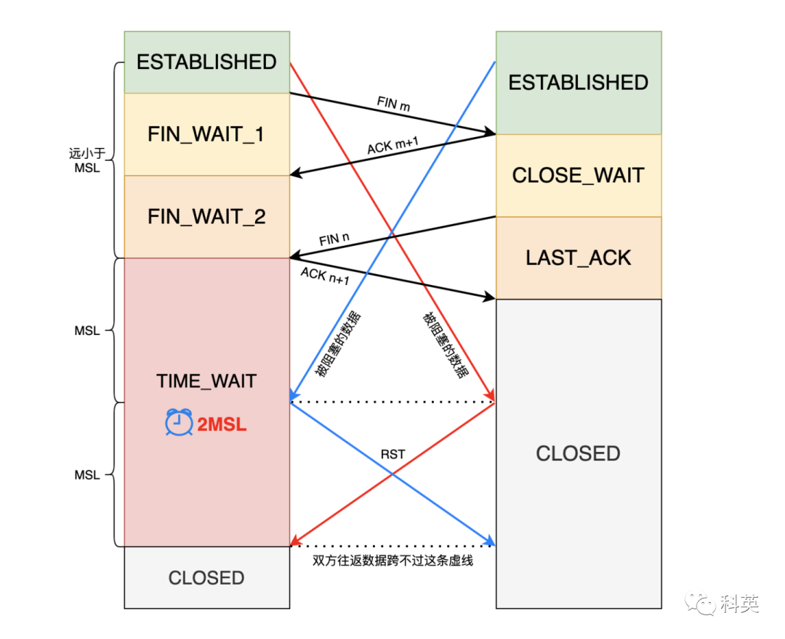

图 9

2、保证「被动关闭方」的连接能被正确的关闭

假设「主动方」的 TIME_WAIT 时间短或者没有，发完最后一次 ACK 报文后很快或直接进入 CLOSED 状态，如果该 ACK 报文丢失了，「被动方」则超时重传 FIN 报文，而这时「主动方」已经进入关闭状态了，收到 FIN 报文后，会回 RST 报文。「被动方」收到 RST 报文后，将其解释为一个错误（Connection reset by peer），然后异常关闭连接，进入 CLOSED 状态。详细步骤如下图：

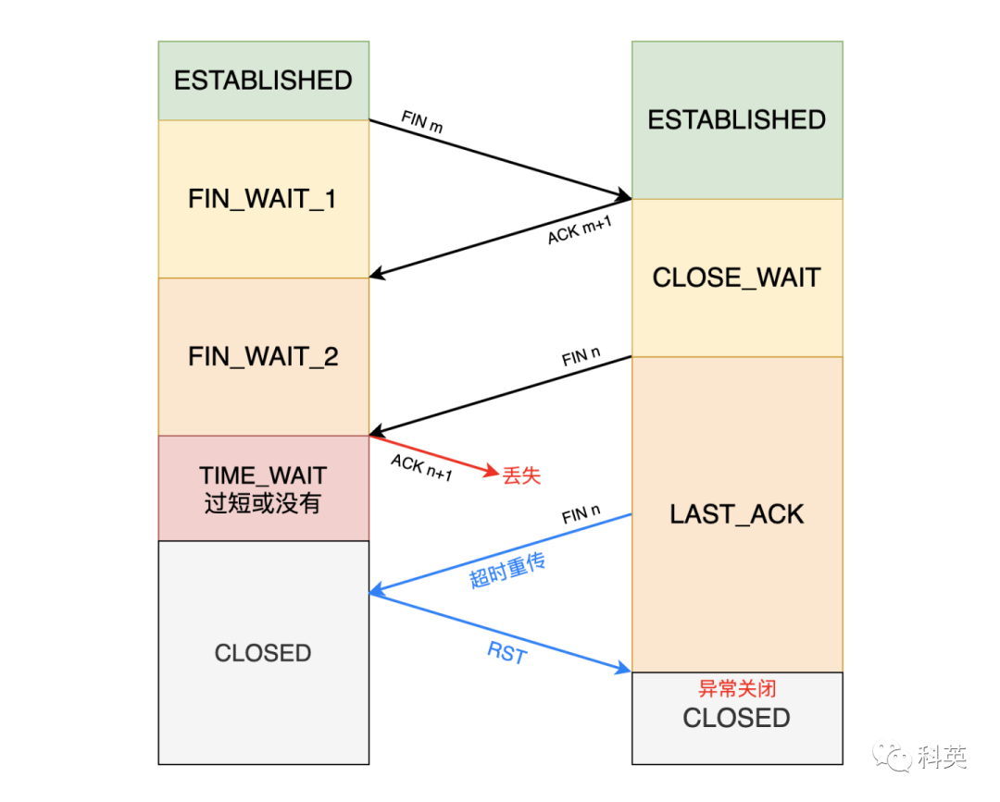

图 10

为了防止这种情况出现，「主动方」必须等待足够长的时间，确保「被动方」能够收到 ACK，也就是确保「主动方」不会再收到 FIN (「被动方」收不到 ACK 会超时重传 FIN)。TIME_WAIT 等待的 2MSL 一定大于等于 往 (ACK) 返(FIN) 的时间。只要在 TIME_WAIT 状态，收到 FIN，就会重置 2MSL 的计时器，也就是为啥不把 TIME_WAIT 设置成大于 2MSL 的原因。

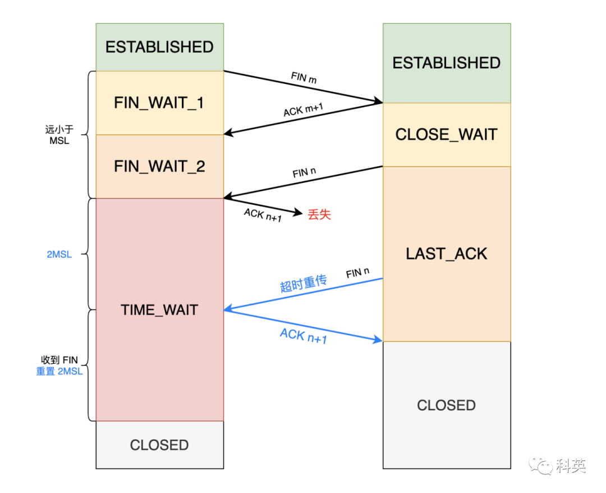

图 11

Linux 系统停留在 TIME_WAIT 的时间为固定的 60 秒。其定义在 Linux 内核代码里的名称为 TCP_TIMEWAIT_LEN：

```
#define TCP_TIMEWAIT_LEN (60*HZ) /* how long to wait to destroy TIME-WAIT                                      state, about 60 seconds  */
```

如果要修改 TIME_WAIT 的时间长度，只能修改 TCP_TIMEWAIT_LEN 的值，并重新编译 Linux 内核。

3.3.2 TIME_WAIT 过多的危害

占用端口资源：客户端（主动关闭连接）的 TIME_WAIT 状态过多，客户端都是跟一样的「目的 IP：PORT 」的服务端建立连接，当客户端的 TIME_WAIT 状态连接过多，无效占用的端口也过多，端口资源是有限的，一般可以开启的端口为 15000～60000，可以通过 net.ipv4.ip_local_port_range 参数指定范围。如果占满了所有端口，那么就无法再跟「目的 IP：PORT」一样的服务端建立连接。但是可以跟另一个「目的 IP：PORT」的服务端建立连接，因为一个连接是由五元组（源 IP、源端口、目的 IP、目的端口和协议）唯一标识的。

> 举个例子：当压测同一「目的 IP：PORT」 的 TCP 服务性能时，每个机器最多模拟 6 万多个连接。

占用系统资源：服务端（主动关闭连接）的 TIME_WAIT 状态过多，并不会导致端口资源受限，因为服务端只监听一个端口，而且由一个五元组唯一标识一个 TCP 连接，因此理论上服务端可以建立远远大于端口数量的连接，但是 TCP 连接过多，会占用系统资源，比如文件描述符、内存资源和 CPU 资源等。

3.3.3 TIME_WAIT 的优化

有下面 3 个优化方法，没有银弹，都有利有弊：

*   打开 net.ipv4.tcp_tw_reuse 和 net.ipv4.tcp_timestamps 选项；
    
*   修改 net.ipv4.tcp_max_tw_buckets 内核参数；
    
*   程序中使用 SO_LINGER ，程序强制使用 RST 暴力关闭。
    

1、打开 net.ipv4.tcp_tw_reuse 和 net.ipv4.tcp_timestamps 选项

开启 net.ipv4.tcp_tw_reuse 和 net.ipv4.tcp_timestamps（默认开启，支持时间戳） 选项后，客户端（主动关闭方）在调用 connect() 函数时，如果相同五元组的连接持续处于 TIME_WAIT 状态时间大于 1s 时，内核会复用该连接。

开启 net.ipv4.tcp_timestamps 后，会在 TCP 头的「选项」里添加两个 4 字节的时间戳，一个保存发送该数据包的时间，另一个保存最近一次接收对方发的数据的到达时间。由于引入了时间戳，前面提到的 2MSL 问题就解决了，重复或阻塞的数据包会因为时间戳过期被自然丢弃。

```
# cat /proc/sys/net/ipv4/tcp_timestamps
```

2、修改 net.ipv4.tcp_max_tw_buckets 内核参数

当系统中处于 TIME_WAIT 的连接数一旦超过这个值 tcp_max_tw_buckets 时，不会有新的 TIME_WAIT 产生，直接关闭。一旦端口全部被占用，服务就异常了，tcp_max_tw_buckets 对你的系统起到一个保护的作用，争取补救时间。弊端是会出现图 10 的现象。

```
# cat /proc/sys/net/ipv4/tcp_max_tw_buckets
```

3、程序中使用 SO_LINGER

可以通过设置 socket 选项，来调整 close 关闭连接的行为。

```
structlinger so_linger; 
so_linger.l_onoff =1; 
so_linger.l_linger =0; 
setsockopt(fd, SOL_SOCKET, SO_LINGER,&so_linger,sizeof(so_linger));
```

如果 l_onoff 为非 0 且 l_linger 值为 0，那么调用 close 后，会立该发送一个 RST 报文给对方，直接跳过四次挥手，直接关闭，自然也就跳过了 TIME_WAIT 状态。

> TIME_WAIT 是我们的朋友，它是有助于我们的，不要试图避免这个状态，而是应该弄清楚它。如果服务端要避免过多的 TIME_WAIT 状态的连接，就永远不要主动断开连接，让客户端去断开，由分布在各处的客户端去承受 TIME_WAIT。                   ---《UNIX 网络编程》

### 

## 3.4 保活机制

通过 socket 接口设置 SO_KEEPALIVE 选项才能开启 TCP 保活机制，否则无法使用 TCP 保活机制。在一段时间内，没有任何连接相关的活动，TCP 保活机制会开始工作，每隔一段时间发送一个探测报文（包含非常少的数据），如果连续几个探测报文都没有得到回应，那么认为该 TCP 连接已经失效，系统内核将错误信息通知 TCP 连接对象，关闭连接。

Linux 有内核参数，可以设置保活时间、保活探测次数、保活探测时间间隔，以下均为默认值：

```
net.ipv4.tcp_keepalive_time=7200 //没有活动7200秒后，启动保活机制
net.ipv4.tcp_keepalive_intvl=75  //每75秒探测一次
net.ipv4.tcp_keepalive_probes=9  //最多探测9次
```

*   如果探测报文有回应，有下面两种情况：
    
*   当回应正常的探测报文的 Pong，那么重置保活时间，即再没有任何活动 7200 秒后再启动保活机制；
    
*   当回应的是 RST 报文，可能是对端主机宕机并重启，没有对应的连接信息，然后本端关闭连接；
    
*   如果 9 次探测报文都没有回应，那么关闭连接，可能对端主机宕机或者网络不通；
    

TCP 默认的保活机制至少需要经过 2 小时 11 分 15 秒（7200 + 75 * 9）才能发现连接死亡，相当于「低保」，一般都是自己实现应用层的保活机制。

### 

## 3.5 异常情况

### 3.5.1 第一次挥手丢了

当「主动方」调用 close 函数后，就会向「被动方」发送 FIN 报文，此时客户端的连接进入 FIN_WAIT_1 状态。

如果第一次挥手丢失了，那么「主动方」迟迟收不到「被动方」的 ACK 的话，就会触发超时重传 FIN 报文，重发次数由 tcp_orphan_retries 参数（默认 0）控制。超时重传次数超过 tcp_orphan_retries 后，再等一段时间（指数增加）还是没有收到第二次握手，就关闭连接。

```
# cat /proc/sys/net/ipv4/tcp_orphan_retries
```

### 3.5.2 第二次挥手丢了

在前面提过，ACK 报文不会超时重传，所以如果「被动方」的第二次挥手丢失了，「主动方」就会超时重传 FIN 报文，直到收到服务端的第二次挥手。与第一次挥手丢失行为一样。

### 3.5.3 第三次挥手丢了

当「主动方」收到第二次挥手 ACK 后，进入 FIN_WAIT_2 状态。

对于调用 close 函数主动关闭的连接，由于无法再发送和接收数据，所以 FIN_WAIT2 状态不可以持续太久，会启用一个计时器，时间长度由 tcp_fin_timeout 控制，默认 60 秒，如果计时器超时了还没有收到第三次挥手 FIN 报文，就直接进入 CLOSED 状态。

```
# cat /proc/sys/net/ipv4/tcp_fin_timeout
```

但是对于调用 shutdown 函数主动关闭的连接，只关闭发送方向，没有关闭接收方向，没有计时器。如果「主动方」一直没收到第三次挥手，那么「主动方」将会一直处于 FIN_WAIT2 状态。

「被动方」处于 CLOSE_WAIT 状态时，调用 close 函数，内核会发出 FIN 报文，然后进入 LAST_ACK 状态，等待「主动方」返回 ACK 来确认连接关闭。如果第三次挥手 ACK 丢失了，「被动方」就会超时重传 FIN 报文，重发次数仍然由 tcp_orphan_retries 参数决定，最后还是没有收到直接进入 CLOSED 状态。

### 3.5.4 第四次挥手丢了

如果第四次挥手的 ACK 报文丢了，「被动方」就会超时重传 FIN 报文，重发次数仍然由 tcp_orphan_retries 参数决定。「主动方」在收到 FIN 后，进入 TIME_WAIT 状态，开启时长为 2MSL 的计时器，如果途中再次收到第三次挥手 FIN 报文后，就会重置 2MSL 的计时器。如果第四次挥手一直丢失，但是第三次挥手不丢失，会使「主动方」迟迟关闭不了连接。

# 四、状态机


---------

TCP 有限状态机的 11 种状态之间的变化如下。

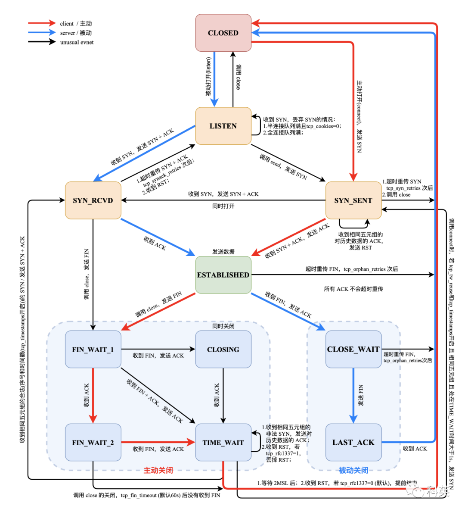

图 12

Linux 系统中查看 TCP 状态的命令如下：

```
netstat -napt
```

# 五、可靠传输


----------

### 

## 5.1 保证顺序

通常在每个 TCP 报文中都有一对序号和确认号。TCP 报文发送者称自己的字节流的编号为序号（sequence number），称接收到对方的字节流编号为确认号。每一个字节传输过后，SN 号都会递增 1。

通过使用序号和确认号，TCP 层可以把收到的报文中的字节按正确的顺序交付给应用层。序号是 32 位的无符号数，在它增大到 2^32-1 时，便会回绕到 0。对于初始化序列号（ISN）的选择是 TCP 中关键的一个操作，它可以确保强壮性和安全性。

发送确认包 ACK，携带了接收到的对方发来的字节流的序列号，称为确认号，以告诉对方已经成功接收的数据流的字节位置。ACK 并不意味着数据已经交付了上层应用程序。

### 

## 5.2 超时重传（Retransmission timeout，RTO）

对每一个发送了但没有 ACK 的包，都有设一个计时器，超时后就重新尝试。超时时间不宜过短，时间必须大于往返时间 RTT，否则会引起不必要的重传。也不宜过长，导致传输时间变长。

估计往返时间，需要 TCP 通过采样 RTT 的时间，然后进行加权平均，算出一个值，而且这个值是动态变化的，因为网络状况不断地变化。除了采样 RTT，还要采样 RTT 的波动范围，计算出一个估计的超时时间。由于重传时间是不断变化的，我们称为自适应重传算法（Adaptive Retransmission Algorithm）。

TCP 的策略是超时间隔加倍。每当遇到一次超时重传的时候，都会将下一次超时时间间隔设为先前值的两倍，直到最大值。多次超时，说明网络环境差，不宜频繁重传。

### 

## 5.3 快速重传

接收方在收到了序号为 100、102、103 的数据包后，发现没有收到 101 的包，还没等发送方超时重传 101 的包，接收方快速向发送方返回 3 个对 101 包的确认包 ACK。发送方收到 3 次对同一个包的确认，就重传最后一个未被确认的包（101 包）。降低了传输延时，提高了传输速度。

阈值设为 3 被证实可以减少乱序包导致的无作用的重传（spurious retransmission）。

### 

## 5.4 选择确认

还有更好的解决重传的方式，需要在 TCP 头里的选项里加一个 SACK（Selective Acknowledgment）的参数，可以将缓存的详情发送给发送方。例如可以发送 ACK 6、SACK 8、SACK 9，有了详情，发送方一下子就能看出来是 7 丢了。极大改善了 TCP 重传的效率。

### 

## 5.5 校验和

TCP 的 16 位的校验和（checksum）的计算和检验过程如下：

发送者将 TCP 报文的头部和数据部分的和计算出来，再对其求反码，就得到了校验和，然后将结果装入报文中传输。（这里用反码和的原因是这种方法的循环进位使校验和可以在 16 位、32 位、64 位等情况下的计算结果再叠加后相同）

接收者在收到报文后再按相同的算法计算一次校验和。这里使用的反码使得接收者不用再将校验和字段保存起来后清零，而可以直接将报文连同校验加总。如果计算结果是全部为一，那么就表示了报文的完整性和正确性。

注意：TCP 校验和也包括了 96 位的伪头部，其中有源地址、目的地址、协议以及 TCP 的长度。这可以避免报文被错误地路由。

# 六、流量控制


----------

流量控制用来避免发送方发送得过快而使接收方来不及完全收下，一般由接收方通告给发送方进行控制。

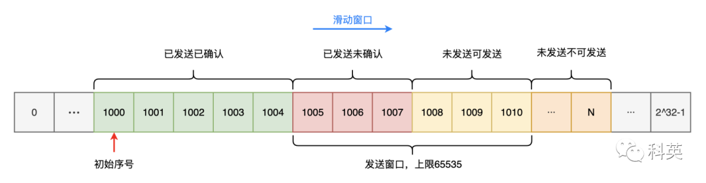

图 13 发送方窗口

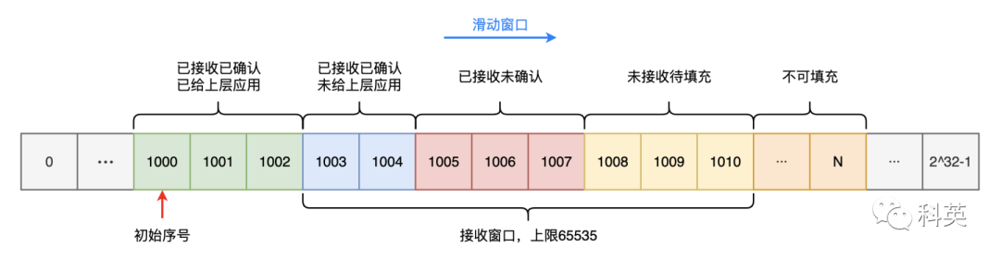

图 14 接收方窗口

TCP 使用滑动窗口协议实现流量控制。接收方在「接收窗口」指出还可接收的字节数量。发送方在没有收到新的确认包的情况下，最多发送「接收窗口」允许的字节数量。接收方可修改「接收窗口」的值。

当接收方宣布「接收窗口」的值为 0 时，发送方停止发送数据，开始了「保持定时器」（persist timer），以避免因随后的修改「接收窗口」的数据包丢失，使连接的双方进入死锁。当「保持定时器」到期时，发送方尝试发送一个小的 ZWP 包（Zero Window Probe），期待接收方回复一个带着新的「接收窗口」大小的确认包。一般 ZWP 包会设置成 3 次，如果 3 次过后「接收窗口」还是 0 的话，有的 TCP 实现就会发 RST 把连接断了。

如果接收方处理数据很慢，它会发布一系列小的「接收窗口」，这被称作低能窗口综合症。因为它在 TCP 的数据包中发送很少的有效字节，相对于 TCP 包头是很大的开销。解决这个问题，就要避免对小的「接收窗口」做出响应，直到有足够大的「接收窗口」再响应，有下面两种算法：

*   接收端使用 David D Clark 算法，如果收到的数据导致「接收窗口」小于某个值，可以直接把确认包的接收窗口的值置为 0，阻止发送端再发数据。等到接收端处理了一些数据后「接收窗口」大于等于了 MSS（最大分段大小，是在单个分段中 TCP 愿意接受的数据的字节数最大值），或者接收端 buffer 有一半为空，就可以把「接收窗口」打开让发送端再发数据过来。
    
*   发送端使用 Nagle 算法，条件一：接收窗口 >= MSS 且 待发送数据 >= MSS；条件二：收到之前发送数据的确认包 ACK。这两个条件有一个满足，才会发数据，否则就是在积累数据。Nagle 算法默认是打开的，所以对于一些需要小包且实时性要求高的场景，需要关闭这个算法。可以调用 setsockopt 设置 socket 的 TCP_NODELAY 选项来关闭这个算法。
    

# 七、拥塞控制


----------

拥塞控制是发送方根据网络的承载情况控制分组的发送量，以获取高性能又能避免拥塞崩溃（congestion collapse，网络性能下降几个数量级）。发送方与接收方根据确认包或者包丢失的情况，以及定时器，估计网络拥塞情况，从而修改数据流的行为，这称为拥塞控制或网络拥塞避免。

TCP 的现代实现包含四种相互影响的拥塞控制算法：慢启动、拥塞避免、快速重传、快速恢复。

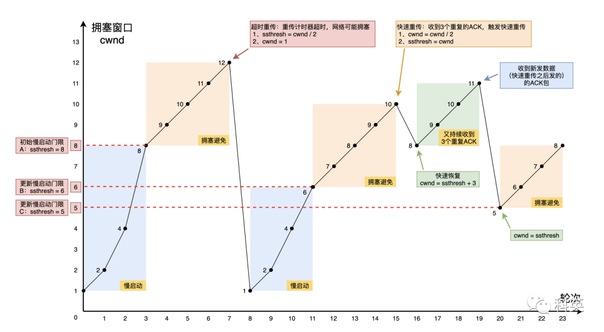

图 15 TCP 拥塞控制

### 

## 7.1 慢启动：每收到一个 ACK，cwnd 增加 1，指数增长

TCP 在刚建立连接完成后，首先是慢启动过程，目的是一点一点试探着来发包，逐渐扩大发包量，避免一上来就造成网络拥堵。

如图 1，这里假定拥塞窗口 cwnd 和发送窗口 swnd 相等，下面举个例子：

*   连接建立完成后，一开始初始化 cwnd = 1，表示可以传一个 MSS 大小的数据；
    
*   当收到一个 ACK 确认应答后，cwnd 增加 1，于是一次能够发送 2 个；
    
*   当收到 2 个的 ACK 确认应答后， cwnd 增加 2，于是就可以比之前多发 2 个，所以这一次能够发送 4 个；
    
*   当这 4 个的 ACK 确认到来的时候，每个确认 cwnd 增加 1， 4 个确认 cwnd 增加 4，于是就可以比之前多发 4 个，所以这一次能够发送 8 个。
    

可以看出慢启动算法，cwnd 是指数增长的。

慢启动门限 ssthresh （slow start threshold）是慢启动和拥塞避免的分界线。

*   当 cwnd < ssthresh 时，使用慢启动算法。
    
*   当 cwnd >= ssthresh 时，就会使用拥塞避免算法。
    

### 

## 7.2 拥塞避免：每收到一个 ACK，cwnd 增加 1/cwnd，线性增长

前面说道，当拥塞窗口 cwnd 超过慢启动门限 ssthresh 就会进入拥塞避免算法。一般来说 ssthresh 的大小是 65535 字节。

接上面的慢启动例子，图 1 中 ssthresh 为 8， 当 8 个 ACK 应答确认到来时，每个确认增加 1/8，8 个 ACK 确认 cwnd 一共增加 1，于是下次能够发送 9 个 MSS 大小的数据，变成了线性增长。

随着 cwnd 线性增长，网络慢慢进入拥塞状态，导致发生丢包，就会发生重传，重传有两种算法：超时重传和快速重传，对应两种拥塞算法。

### 

## 7.3 超时重传：使用拥塞发生算法

接着上面例子，第 7 轮发生了超时重传，这个时候，ssthresh 和 cwnd 的值会发生变化：

*   ssthresh 设为 cwnd / 2，
    
*   cwnd 重置为 1（是恢复为 cwnd 初始化值，我这里假定 cwnd 初始化值 1）
    

Linux 针对每一个 TCP 连接的 cwnd 初始化值是 10，也就是 10 个 MSS，可以用下面命令查看初始值：

```
ss -nli|grep cwnd
```

接下来回到 7.1 的慢启动过程。

### 

## 7.4 快速重传：使用快速恢复算法

快速重传和快速恢复算法一般同时使用，快速恢复算法认为，你还能收到 3 个重复 ACK 说明网络也不那么糟糕，所以没有必要像超时重传那么保守。

正如前面所说，进入快速恢复之前，cwnd 和 ssthresh 已被更新了：

*   cwnd = cwnd/2 ，也就是设置为原来的一半;
    
*   ssthresh = cwnd;
    

然后，进入快速恢复算法如下：

*   拥塞窗口 cwnd = ssthresh + 3 （ 3 的意思是确认有 3 个数据包被收到了）；
    
*   重传丢失的数据包；
    
*   如果再收到重复的 ACK，那么 cwnd 增加 1，目的是为了尽快将丢失的数据包发给目标，从而解决拥塞的根本问题（三次相同的 ACK 导致的快速重传），所以这一过程中 cwnd 反而是逐渐增大的；
    
*   如果收到新数据的 ACK 后，把 cwnd 设置为当前的 ssthresh 的值，原因是该 ACK 确认了新的数据，说明快速重传之前的数据都已收到，该恢复过程已经结束，可以回到恢复之前的状态了，也即再次进入拥塞避免状态；
    

也就是没有像「超时重传」一下降到初始值，而是还在比较高的值，后续呈线性增长。

快速恢复是对慢启动的一种优化。

### 

## 7.5 BBR 拥塞算法

前面的拥塞算法都是基于丢包发生的重传，来判断网络发生了拥塞，而 BBR 是基于延时来判断拥塞。

*   第一个问题是丢包并不代表网络拥塞了，也可能是网络本来就丢包。例如公网上带宽不满也会丢包，这个时候就认为拥塞了，退缩了，其实是不对的。
    
*   第二个问题是 TCP 的拥塞控制要等到将中间设备缓存都填充满了，才发生丢包，从而降低速度，这时候已经晚了。其实 TCP 只要填满线路就可以了，不应该直接连缓存也填满。
    

为了优化这两个问题，后来有了 TCP BBR 拥塞算法。它企图找到一个平衡点，就是通过不断地加快发送速度，将管道填满，但是不要填满中间设备的缓存，因为这样时延会增加，在这个平衡点可以很好的达到高带宽和低时延的平衡。


图 16

# **八、参考**


------------

图解网络 - 小林 codingxiaolincoding.com/network/

网络编程实战 - 极客时间 time.geekbang.org/column/intro/100032701?code=sQAdg%252F8lHhv-S9mV9wrz7v95gGz3fSeYsUbsLU0bvSU%253D&source=app_share&tab=catalog

趣谈网络协议 - 极客时间 time.geekbang.org/column/intro/100007101?code=7gKtp1Bevx-jozIhDsBbEbYyR8V2P3JgMzL%252FwM47piY%253D&source=app_share&tab=catalog

