[原文](https://mp.weixin.qq.com/s?__biz=MzUxOTc4NjEyMw==&amp;mid=2247549033&amp;idx=2&amp;sn=22f4bf0f750bf7e5a340f010af272366&amp;chksm=f9f61b8dce81929b5829f1c511cfdf84eb92c5b490de908ef3e8bb7ee679ce2b27ca431b7cbe&amp;scene=126&amp;sessionid=1670760724&amp;subscene=91&amp;clicktime=1670760730&amp;enterid=1670760730&amp;ascene=3&amp;devicetype=iOS16.1.2&amp;version=18001f2a&amp;nettype=WIFI&amp;abtest_cookie=AAACAA%3D%3D&amp;lang=zh_CN&amp;fontScale=100&amp;exportkey=n_ChQIAhIQ%2Fm36YqZghsCV%2FIKrE2H7UxLaAQIE97dBBAEAAAAAAGklDKI5duEAAAAOpnltbLcz9gKNyK89dVj0papneiF7fdww2uDnin6wBVYaSP7i%2FvjMOmwZq6s%2FH5LcbSMdrABrWynJriTIlH9j3xscs6pUH5ecwn4YpiZpaTY439XrGaK9d2rCsRgQVa2WF%2FD8rbvrgQkGyh%2Fga6UYCa6h%2FyjMUnevOcZwyLror0lLtU348WG7tpQFmrD%2BeiFMeoKiMu5T%2BrmKSn4oVmPW25l5xQmcxxq8qnUEnM9Wma7XJBlhxPDhS%2BWZ9ZUyylV4pbXJ&amp;pass_ticket=xygbzaTDzHEOzI8vG7RICyhPsdvFfUeW05qIaRipoTngskcIOVnc2cqrDyB9PX96CeeK4Hl%2FlnctQDW5ee%2BosA%3D%3D&amp;wx_header=3)

[TOC]

* * *

CompletableFuture 实现了 CompletionStage 接口和 Future 接口，前者是对后者的一个扩展，增加了异步回调、流式处理、多个 Future 组合处理的能力，使 Java 在处理多任务的协同工作时更加顺畅便利。

一、创建异步任务
-----------------------------------------------------------------------------------------------------------------------------------------------

### 1、Future.submit

通常的线程池接口类 ExecutorService，其中 execute 方法的返回值是 void，即无法获取异步任务的执行状态，3 个重载的 submit 方法的返回值是 Future，可以据此获取任务执行的状态和结果，示例如下：

```java
@Test
public void test3() throws Exception {
    // 创建异步执行任务:
    ExecutorService executorService= Executors.newSingleThreadExecutor();
    Future<Double> cf = executorService.submit(()->{
        System.out.println(Thread.currentThread()+" start,time->"+System.currentTimeMillis());
        try {
            Thread.sleep(2000);
        } catch (InterruptedException e) {
        }
        if(false){
            throw new RuntimeException("test");
        }else{
            System.out.println(Thread.currentThread()+" exit,time->"+System.currentTimeMillis());
            return 1.2;
        }
    });
    System.out.println("main thread start,time->"+System.currentTimeMillis());
    //等待子任务执行完成,如果已完成则直接返回结果
    //如果执行任务异常，则get方法会把之前捕获的异常重新抛出
    System.out.println("run result->"+cf.get());
    System.out.println("main thread exit,time->"+System.currentTimeMillis());
}
```

执行结果如下：

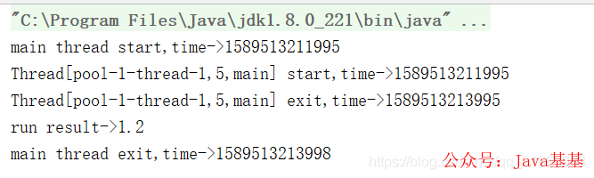

子线程是异步执行的，主线程休眠等待子线程执行完成，子线程执行完成后唤醒主线程，主线程获取任务执行结果后退出。

很多博客说使用不带等待时间限制的 get 方法时，如果子线程执行异常了会导致主线程长期阻塞，这其实是错误的，子线程执行异常时其异常会被捕获，然后修改任务的状态为异常结束并唤醒等待的主线程，get 方法判断任务状态发生变更，就终止等待了，并抛出异常。将上述用例中 if(false) 改成 if(true) ，执行结果如下：

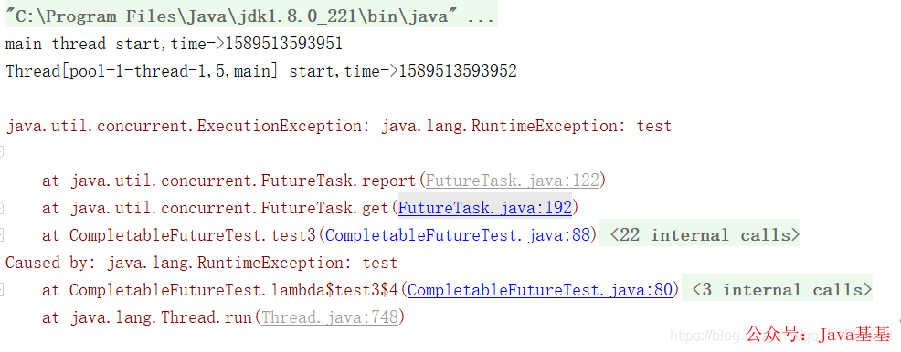

get 方法抛出异常导致主线程异常终止。

### 2、supplyAsync / runAsync

supplyAsync 表示创建带返回值的异步任务的，相当于`ExecutorService submit(Callable<T> task)` 方法，runAsync 表示创建无返回值的异步任务，相当于`ExecutorService submit(Runnable task)`方法，这两方法的效果跟 submit 是一样的，测试用例如下：

```java
@Test
public void test2() throws Exception {
    // 创建异步执行任务，有返回值
    CompletableFuture<Double> cf = CompletableFuture.supplyAsync(()->{
        System.out.println(Thread.currentThread()+" start,time->"+System.currentTimeMillis());
        try {
            Thread.sleep(2000);
        } catch (InterruptedException e) {
        }
        if(true){
            throw new RuntimeException("test");
        }else{
            System.out.println(Thread.currentThread()+" exit,time->"+System.currentTimeMillis());
            return 1.2;
        }
    });
    System.out.println("main thread start,time->"+System.currentTimeMillis());
    //等待子任务执行完成
    System.out.println("run result->"+cf.get());
    System.out.println("main thread exit,time->"+System.currentTimeMillis());
}

Test
public void test4() throws Exception {
    // 创建异步执行任务，无返回值
    CompletableFuture cf = CompletableFuture.runAsync(()->{
        System.out.println(Thread.currentThread()+" start,time->"+System.currentTimeMillis());
        try {
            Thread.sleep(2000);
        } catch (InterruptedException e) {
        }
        if(false){
            throw new RuntimeException("test");
        }else{
            System.out.println(Thread.currentThread()+" exit,time->"+System.currentTimeMillis());
        }
    });
    System.out.println("main thread start,time->"+System.currentTimeMillis());
    //等待子任务执行完成
    System.out.println("run result->"+cf.get());
    System.out.println("main thread exit,time->"+System.currentTimeMillis());
}
```

这两方法各有一个重载版本，可以指定执行异步任务的 Executor 实现，如果不指定，默认使用`ForkJoinPool.commonPool()`，如果机器是单核的，则默认使用 ThreadPerTaskExecutor，该类是一个内部类，每次执行 execute 都会创建一个新线程。测试用例如下：

```java
@Test
 public void test2() throws Exception {
     ForkJoinPool pool=new ForkJoinPool();
     // 创建异步执行任务:
     CompletableFuture<Double> cf = CompletableFuture.supplyAsync(()->{
         System.out.println(Thread.currentThread()+" start,time->"+System.currentTimeMillis());
         try {
             Thread.sleep(2000);
         } catch (InterruptedException e) {
         }
         if(true){
             throw new RuntimeException("test");
         }else{
             System.out.println(Thread.currentThread()+" exit,time->"+System.currentTimeMillis());
             return 1.2;
         }
     },pool);
     System.out.println("main thread start,time->"+System.currentTimeMillis());
     //等待子任务执行完成
     System.out.println("run result->"+cf.get());
     System.out.println("main thread exit,time->"+System.currentTimeMillis());
 }

@Test
 public void test4() throws Exception {
     ExecutorService executorService= Executors.newSingleThreadExecutor();
     // 创建异步执行任务:
     CompletableFuture cf = CompletableFuture.runAsync(()->{
         System.out.println(Thread.currentThread()+" start,time->"+System.currentTimeMillis());
         try {
             Thread.sleep(2000);
         } catch (InterruptedException e) {
         }
         if(false){
             throw new RuntimeException("test");
         }else{
             System.out.println(Thread.currentThread()+" exit,time->"+System.currentTimeMillis());
         }
     },executorService);
     System.out.println("main thread start,time->"+System.currentTimeMillis());
     //等待子任务执行完成
     System.out.println("run result->"+cf.get());
     System.out.println("main thread exit,time->"+System.currentTimeMillis());
 }
```


[二、异步回调](https://mp.weixin.qq.com/s?__biz=MzUzMTA2NTU2Ng==&mid=2247487551&idx=1&sn=18f64ba49f3f0f9d8be9d1fdef8857d9&scene=21#wechat_redirect)
---------------------------------------------------------------------------------------------------------------------------------------------

### [1、thenApply / thenApplyAsync](https://mp.weixin.qq.com/s?__biz=MzUzMTA2NTU2Ng==&mid=2247487551&idx=1&sn=18f64ba49f3f0f9d8be9d1fdef8857d9&scene=21#wechat_redirect)

thenApply 表示某个任务执行完成后执行的动作，即回调方法，会将该任务的执行结果即方法返回值作为入参传递到回调方法中，测试用例如下：

```java
@Test
public void test5() throws Exception {
    ForkJoinPool pool=new ForkJoinPool();
    // 创建异步执行任务:
    CompletableFuture<Double> cf = CompletableFuture.supplyAsync(()->{
        System.out.println(Thread.currentThread()+" start job1,time->"+System.currentTimeMillis());
        try {
            Thread.sleep(2000);
        } catch (InterruptedException e) {
        }
        System.out.println(Thread.currentThread()+" exit job1,time->"+System.currentTimeMillis());
        return 1.2;
    },pool);
    //cf关联的异步任务的返回值作为方法入参，传入到thenApply的方法中
    //thenApply这里实际创建了一个新的CompletableFuture实例
    CompletableFuture<String> cf2=cf.thenApply((result)->{
        System.out.println(Thread.currentThread()+" start job2,time->"+System.currentTimeMillis());
        try {
            Thread.sleep(2000);
        } catch (InterruptedException e) {
        }
        System.out.println(Thread.currentThread()+" exit job2,time->"+System.currentTimeMillis());
        return "test:"+result;
    });
    System.out.println("main thread start cf.get(),time->"+System.currentTimeMillis());
    //等待子任务执行完成
    System.out.println("run result->"+cf.get());
    System.out.println("main thread start cf2.get(),time->"+System.currentTimeMillis());
    System.out.println("run result->"+cf2.get());
    System.out.println("main thread exit,time->"+System.currentTimeMillis());
}
```

其执行结果如下：

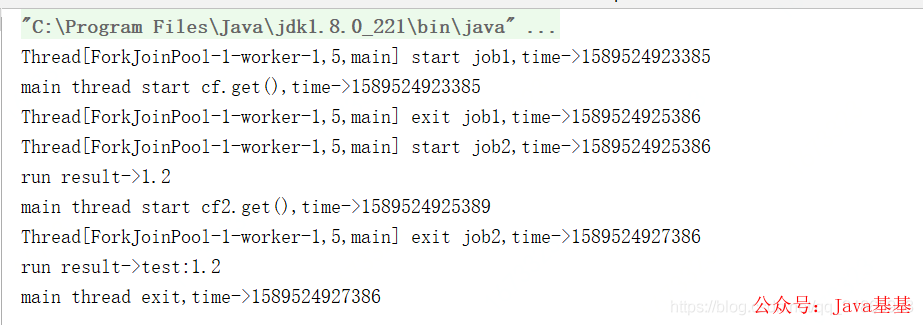

job1 执行结束后，将 job1 的方法返回值作为入参传递到 job2 中并立即执行 job2。

thenApplyAsync 与 thenApply 的区别在于，前者是将 job2 提交到线程池中异步执行，实际执行 job2 的线程可能是另外一个线程，后者是由执行 job1 的线程立即执行 job2，即两个 job 都是同一个线程执行的。将上述测试用例中 thenApply 改成 thenApplyAsync 后，执行结果如下：

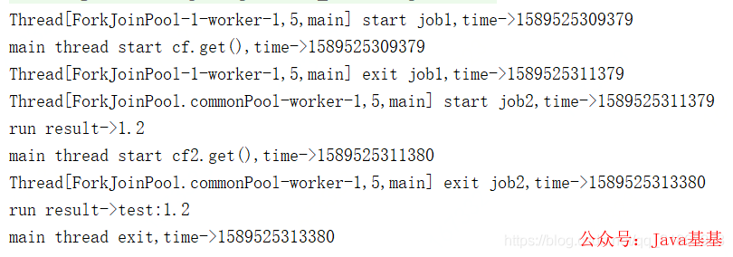

从输出可知，执行 job1 和 job2 是两个不同的线程。thenApplyAsync 有一个重载版本，可以指定执行异步任务的 Executor 实现，如果不指定，默认使用`ForkJoinPool.commonPool()`。

下述的多个方法，每个方法都有两个以 Async 结尾的方法，一个使用默认的 Executor 实现，一个使用指定的 Executor 实现，不带 Async 的方法是由触发该任务的线程执行该任务，带 Async 的方法是由触发该任务的线程将任务提交到线程池，执行任务的线程跟触发任务的线程不一定是同一个。

### [2、thenAccept / thenRun](https://mp.weixin.qq.com/s?__biz=MzUzMTA2NTU2Ng==&mid=2247487551&idx=1&sn=18f64ba49f3f0f9d8be9d1fdef8857d9&scene=21#wechat_redirect)

thenAccept 同 thenApply 接收上一个任务的返回值作为参数，但是无返回值；thenRun 的方法没有入参，也买有返回值，测试用例如下：

```java
@Test
public void test6() throws Exception {
    ForkJoinPool pool=new ForkJoinPool();
    // 创建异步执行任务:
    CompletableFuture<Double> cf = CompletableFuture.supplyAsync(()->{
        System.out.println(Thread.currentThread()+" start job1,time->"+System.currentTimeMillis());
        try {
            Thread.sleep(2000);
        } catch (InterruptedException e) {
        }
        System.out.println(Thread.currentThread()+" exit job1,time->"+System.currentTimeMillis());
        return 1.2;
    },pool);
    //cf关联的异步任务的返回值作为方法入参，传入到thenApply的方法中
    CompletableFuture cf2=cf.thenApply((result)->{
        System.out.println(Thread.currentThread()+" start job2,time->"+System.currentTimeMillis());
        try {
            Thread.sleep(2000);
        } catch (InterruptedException e) {
        }
        System.out.println(Thread.currentThread()+" exit job2,time->"+System.currentTimeMillis());
        return "test:"+result;
    }).thenAccept((result)-> { //接收上一个任务的执行结果作为入参，但是没有返回值
        System.out.println(Thread.currentThread()+" start job3,time->"+System.currentTimeMillis());
        try {
            Thread.sleep(2000);
        } catch (InterruptedException e) {
        }
        System.out.println(result);
        System.out.println(Thread.currentThread()+" exit job3,time->"+System.currentTimeMillis());
    }).thenRun(()->{ //无入参，也没有返回值
        System.out.println(Thread.currentThread()+" start job4,time->"+System.currentTimeMillis());
        try {
            Thread.sleep(2000);
        } catch (InterruptedException e) {
        }
        System.out.println("thenRun do something");
        System.out.println(Thread.currentThread()+" exit job4,time->"+System.currentTimeMillis());
    });
    System.out.println("main thread start cf.get(),time->"+System.currentTimeMillis());
    //等待子任务执行完成
    System.out.println("run result->"+cf.get());
    System.out.println("main thread start cf2.get(),time->"+System.currentTimeMillis());
    //cf2 等待最后一个thenRun执行完成
    System.out.println("run result->"+cf2.get());
    System.out.println("main thread exit,time->"+System.currentTimeMillis());
}
```

其执行结果如下：

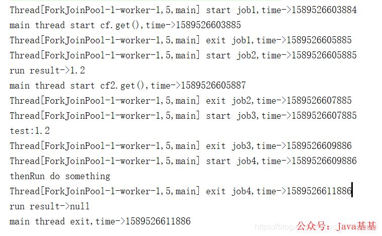

### [3、 exceptionally](https://mp.weixin.qq.com/s?__biz=MzUzMTA2NTU2Ng==&mid=2247487551&idx=1&sn=18f64ba49f3f0f9d8be9d1fdef8857d9&scene=21#wechat_redirect)

exceptionally 方法指定某个任务执行异常时执行的回调方法，会将抛出异常作为参数传递到回调方法中，如果该任务正常执行则会 exceptionally 方法返回的 CompletionStage 的 result 就是该任务正常执行的结果，测试用例如下：

```java
@Test
public void test2() throws Exception {
    ForkJoinPool pool=new ForkJoinPool();
    // 创建异步执行任务:
    CompletableFuture<Double> cf = CompletableFuture.supplyAsync(()->{
        System.out.println(Thread.currentThread()+"job1 start,time->"+System.currentTimeMillis());
        try {
            Thread.sleep(2000);
        } catch (InterruptedException e) {
        }
        if(true){
            throw new RuntimeException("test");
        }else{
            System.out.println(Thread.currentThread()+"job1 exit,time->"+System.currentTimeMillis());
            return 1.2;
        }
    },pool);
    //cf执行异常时，将抛出的异常作为入参传递给回调方法
    CompletableFuture<Double> cf2= cf.exceptionally((param)->{
         System.out.println(Thread.currentThread()+" start,time->"+System.currentTimeMillis());
        try {
            Thread.sleep(2000);
        } catch (InterruptedException e) {
        }
        System.out.println("error stack trace->");
        param.printStackTrace();
        System.out.println(Thread.currentThread()+" exit,time->"+System.currentTimeMillis());
         return -1.1;
    });
    //cf正常执行时执行的逻辑，如果执行异常则不调用此逻辑
    CompletableFuture cf3=cf.thenAccept((param)->{
        System.out.println(Thread.currentThread()+"job2 start,time->"+System.currentTimeMillis());
        try {
            Thread.sleep(2000);
        } catch (InterruptedException e) {
        }
        System.out.println("param->"+param);
        System.out.println(Thread.currentThread()+"job2 exit,time->"+System.currentTimeMillis());
    });
    System.out.println("main thread start,time->"+System.currentTimeMillis());
    //等待子任务执行完成,此处无论是job2和job3都可以实现job2退出，主线程才退出，如果是cf，则主线程不会等待job2执行完成自动退出了
    //cf2.get时，没有异常，但是依然有返回值，就是cf的返回值
    System.out.println("run result->"+cf2.get());
    System.out.println("main thread exit,time->"+System.currentTimeMillis());
}
```

其输出如下：

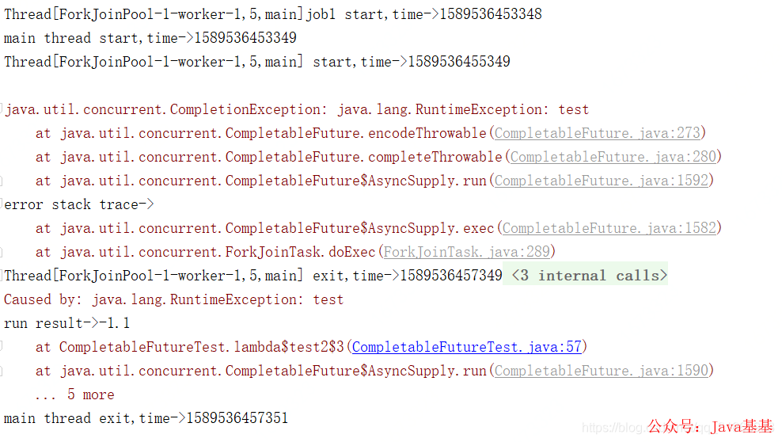

抛出异常后，只有 cf2 执行了，cf3 没有执行。将上述示例中的 if(true) 改成 if(false)，其输出如下：

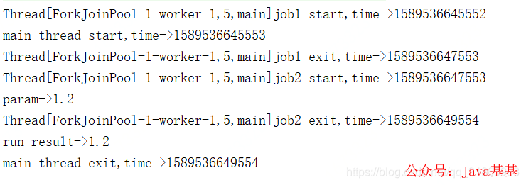

cf2 没有指定，其 result 就是 cf 执行的结果，理论上 cf2.get 应该立即返回的，此处是等待了 cf3，即 job2 执行完成后才返回，具体原因且待下篇源码分析时再做探讨。

### [4、whenComplete](https://mp.weixin.qq.com/s?__biz=MzUzMTA2NTU2Ng==&mid=2247487551&idx=1&sn=18f64ba49f3f0f9d8be9d1fdef8857d9&scene=21#wechat_redirect)

whenComplete 是当某个任务执行完成后执行的回调方法，会将执行结果或者执行期间抛出的异常传递给回调方法，如果是正常执行则异常为 null，回调方法对应的 CompletableFuture 的 result 和该任务一致，如果该任务正常执行，则 get 方法返回执行结果，如果是执行异常，则 get 方法抛出异常。测试用例如下：

```java
@Test
public void test10() throws Exception {
    // 创建异步执行任务:
    CompletableFuture<Double> cf = CompletableFuture.supplyAsync(()->{
        System.out.println(Thread.currentThread()+"job1 start,time->"+System.currentTimeMillis());
        try {
            Thread.sleep(2000);
        } catch (InterruptedException e) {
        }
        if(false){
            throw new RuntimeException("test");
        }else{
            System.out.println(Thread.currentThread()+"job1 exit,time->"+System.currentTimeMillis());
            return 1.2;
        }
    });
    //cf执行完成后会将执行结果和执行过程中抛出的异常传入回调方法，如果是正常执行的则传入的异常为null
    CompletableFuture<Double> cf2=cf.whenComplete((a,b)->{
        System.out.println(Thread.currentThread()+"job2 start,time->"+System.currentTimeMillis());
        try {
            Thread.sleep(2000);
        } catch (InterruptedException e) {
        }
        if(b!=null){
            System.out.println("error stack trace->");
            b.printStackTrace();
        }else{
            System.out.println("run succ,result->"+a);
        }
        System.out.println(Thread.currentThread()+"job2 exit,time->"+System.currentTimeMillis());
    });
    //等待子任务执行完成
    System.out.println("main thread start wait,time->"+System.currentTimeMillis());
    //如果cf是正常执行的，cf2.get的结果就是cf执行的结果
    //如果cf是执行异常，则cf2.get会抛出异常
    System.out.println("run result->"+cf2.get());
    System.out.println("main thread exit,time->"+System.currentTimeMillis());
}
```

执行结果如下：

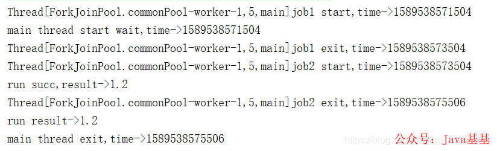

将上述示例中的 if(false) 改成 if(true)，其输出如下：

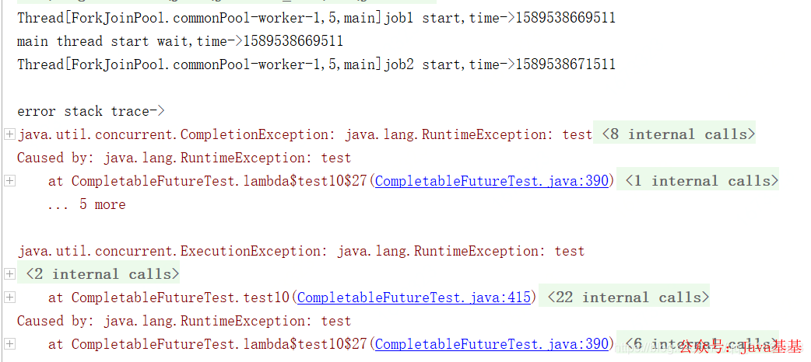

### [5、handle](https://mp.weixin.qq.com/s?__biz=MzUzMTA2NTU2Ng==&mid=2247487551&idx=1&sn=18f64ba49f3f0f9d8be9d1fdef8857d9&scene=21#wechat_redirect)

跟 whenComplete 基本一致，区别在于 handle 的回调方法有返回值，且 handle 方法返回的 CompletableFuture 的 result 是回调方法的执行结果或者回调方法执行期间抛出的异常，与原始 CompletableFuture 的 result 无关了。测试用例如下：

```java
@Test
public void test10() throws Exception {
    // 创建异步执行任务:
    CompletableFuture<Double> cf = CompletableFuture.supplyAsync(()->{
        System.out.println(Thread.currentThread()+"job1 start,time->"+System.currentTimeMillis());
        try {
            Thread.sleep(2000);
        } catch (InterruptedException e) {
        }
        if(true){
            throw new RuntimeException("test");
        }else{
            System.out.println(Thread.currentThread()+"job1 exit,time->"+System.currentTimeMillis());
            return 1.2;
        }
    });
    //cf执行完成后会将执行结果和执行过程中抛出的异常传入回调方法，如果是正常执行的则传入的异常为null
    CompletableFuture<String> cf2=cf.handle((a,b)->{
        System.out.println(Thread.currentThread()+"job2 start,time->"+System.currentTimeMillis());
        try {
            Thread.sleep(2000);
        } catch (InterruptedException e) {
        }
        if(b!=null){
            System.out.println("error stack trace->");
            b.printStackTrace();
        }else{
            System.out.println("run succ,result->"+a);
        }
        System.out.println(Thread.currentThread()+"job2 exit,time->"+System.currentTimeMillis());
        if(b!=null){
            return "run error";
        }else{
            return "run succ";
        }
    });
    //等待子任务执行完成
    System.out.println("main thread start wait,time->"+System.currentTimeMillis());
    //get的结果是cf2的返回值，跟cf没关系了
    System.out.println("run result->"+cf2.get());
    System.out.println("main thread exit,time->"+System.currentTimeMillis());
}
```

其执行结果如下：

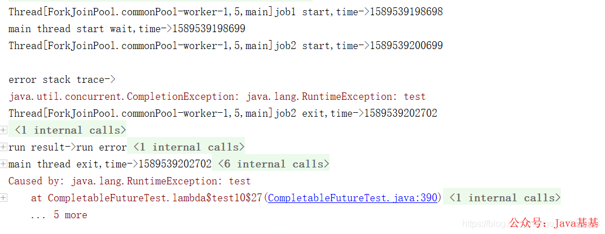

将上述示例中的 if(true) 改成 if(false)，其输出如下：

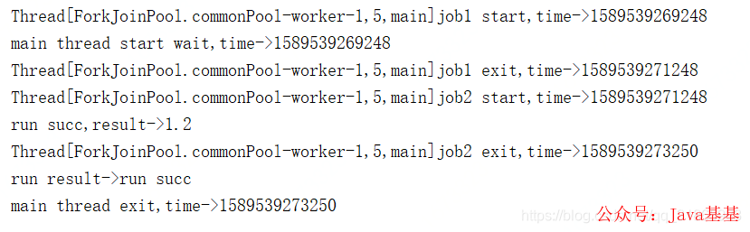

> 基于 Spring Cloud Alibaba + Gateway + Nacos + RocketMQ + Vue & Element 实现的后台管理系统 + 用户小程序，支持 RBAC 动态权限、多租户、数据权限、工作流、三方登录、支付、短信、商城等功能
> 
> *   项目地址：https://github.com/YunaiV/yudao-cloud
>     
> *   视频教程：https://doc.iocoder.cn/video/
>     

[三、组合处理](https://mp.weixin.qq.com/s?__biz=MzUzMTA2NTU2Ng==&mid=2247487551&idx=1&sn=18f64ba49f3f0f9d8be9d1fdef8857d9&scene=21#wechat_redirect)
---------------------------------------------------------------------------------------------------------------------------------------------

### [1、thenCombine / thenAcceptBoth / runAfterBoth](https://mp.weixin.qq.com/s?__biz=MzUzMTA2NTU2Ng==&mid=2247487551&idx=1&sn=18f64ba49f3f0f9d8be9d1fdef8857d9&scene=21#wechat_redirect)

这三个方法都是将两个 CompletableFuture 组合起来，只有这两个都正常执行完了才会执行某个任务，区别在于，thenCombine 会将两个任务的执行结果作为方法入参传递到指定方法中，且该方法有返回值；

thenAcceptBoth 同样将两个任务的执行结果作为方法入参，但是无返回值；runAfterBoth 没有入参，也没有返回值。注意两个任务中只要有一个执行异常，则将该异常信息作为指定任务的执行结果。测试用例如下：

```java
@Test
public void test7() throws Exception {
    ForkJoinPool pool=new ForkJoinPool();
    // 创建异步执行任务:
    CompletableFuture<Double> cf = CompletableFuture.supplyAsync(()->{
        System.out.println(Thread.currentThread()+" start job1,time->"+System.currentTimeMillis());
        try {
            Thread.sleep(2000);
        } catch (InterruptedException e) {
        }
        System.out.println(Thread.currentThread()+" exit job1,time->"+System.currentTimeMillis());
        return 1.2;
    });
    CompletableFuture<Double> cf2 = CompletableFuture.supplyAsync(()->{
        System.out.println(Thread.currentThread()+" start job2,time->"+System.currentTimeMillis());
        try {
            Thread.sleep(1500);
        } catch (InterruptedException e) {
        }
        System.out.println(Thread.currentThread()+" exit job2,time->"+System.currentTimeMillis());
        return 3.2;
    });
    //cf和cf2的异步任务都执行完成后，会将其执行结果作为方法入参传递给cf3,且有返回值
    CompletableFuture<Double> cf3=cf.thenCombine(cf2,(a,b)->{
        System.out.println(Thread.currentThread()+" start job3,time->"+System.currentTimeMillis());
        System.out.println("job3 param a->"+a+",b->"+b);
        try {
            Thread.sleep(2000);
        } catch (InterruptedException e) {
        }
        System.out.println(Thread.currentThread()+" exit job3,time->"+System.currentTimeMillis());
        return a+b;
    });

    //cf和cf2的异步任务都执行完成后，会将其执行结果作为方法入参传递给cf3,无返回值
    CompletableFuture cf4=cf.thenAcceptBoth(cf2,(a,b)->{
        System.out.println(Thread.currentThread()+" start job4,time->"+System.currentTimeMillis());
        System.out.println("job4 param a->"+a+",b->"+b);
        try {
            Thread.sleep(1500);
        } catch (InterruptedException e) {
        }
        System.out.println(Thread.currentThread()+" exit job4,time->"+System.currentTimeMillis());
    });

    //cf4和cf3都执行完成后，执行cf5，无入参，无返回值
    CompletableFuture cf5=cf4.runAfterBoth(cf3,()->{
        System.out.println(Thread.currentThread()+" start job5,time->"+System.currentTimeMillis());
        try {
            Thread.sleep(1000);
        } catch (InterruptedException e) {
        }
        System.out.println("cf5 do something");
        System.out.println(Thread.currentThread()+" exit job5,time->"+System.currentTimeMillis());
    });

    System.out.println("main thread start cf.get(),time->"+System.currentTimeMillis());
    //等待子任务执行完成
    System.out.println("cf run result->"+cf.get());
    System.out.println("main thread start cf5.get(),time->"+System.currentTimeMillis());
    System.out.println("cf5 run result->"+cf5.get());
    System.out.println("main thread exit,time->"+System.currentTimeMillis());
}
```

其运行结果如下：

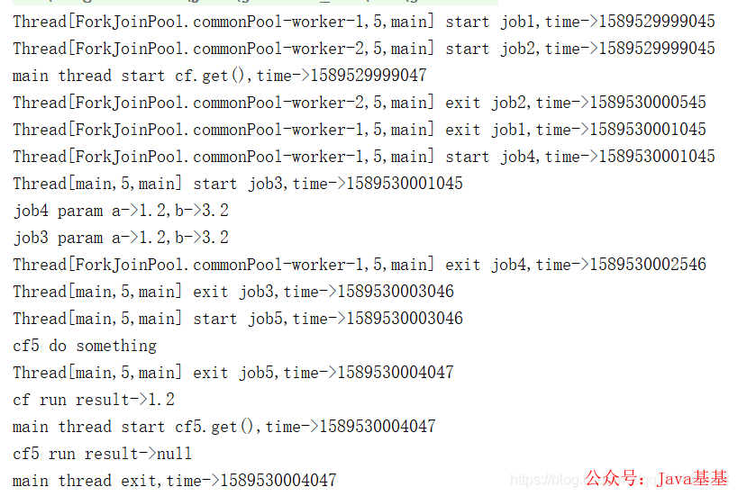

job1 和 job2 几乎同时运行，job2 比 job1 先执行完成，等 job1 退出后，job3 和 job4 几乎同时开始运行，job4 先退出，等 job3 执行完成，job5 开始了，等 job5 执行完成后，主线程退出。

### [2、applyToEither / acceptEither / runAfterEither](https://mp.weixin.qq.com/s?__biz=MzUzMTA2NTU2Ng==&mid=2247487551&idx=1&sn=18f64ba49f3f0f9d8be9d1fdef8857d9&scene=21#wechat_redirect)

这三个方法都是将两个 CompletableFuture 组合起来，只要其中一个执行完了就会执行某个任务，其区别在于 applyToEither 会将已经执行完成的任务的执行结果作为方法入参，并有返回值；

acceptEither 同样将已经执行完成的任务的执行结果作为方法入参，但是没有返回值；runAfterEither 没有方法入参，也没有返回值。注意两个任务中只要有一个执行异常，则将该异常信息作为指定任务的执行结果。测试用例如下：

```java
@Test
public void test8() throws Exception {
    // 创建异步执行任务:
    CompletableFuture<Double> cf = CompletableFuture.supplyAsync(()->{
        System.out.println(Thread.currentThread()+" start job1,time->"+System.currentTimeMillis());
        try {
            Thread.sleep(2000);
        } catch (InterruptedException e) {
        }
        System.out.println(Thread.currentThread()+" exit job1,time->"+System.currentTimeMillis());
        return 1.2;
    });
    CompletableFuture<Double> cf2 = CompletableFuture.supplyAsync(()->{
        System.out.println(Thread.currentThread()+" start job2,time->"+System.currentTimeMillis());
        try {
            Thread.sleep(1500);
        } catch (InterruptedException e) {
        }
        System.out.println(Thread.currentThread()+" exit job2,time->"+System.currentTimeMillis());
        return 3.2;
    });
    //cf和cf2的异步任务都执行完成后，会将其执行结果作为方法入参传递给cf3,且有返回值
    CompletableFuture<Double> cf3=cf.applyToEither(cf2,(result)->{
        System.out.println(Thread.currentThread()+" start job3,time->"+System.currentTimeMillis());
        System.out.println("job3 param result->"+result);
        try {
            Thread.sleep(2000);
        } catch (InterruptedException e) {
        }
        System.out.println(Thread.currentThread()+" exit job3,time->"+System.currentTimeMillis());
        return result;
    });

    //cf和cf2的异步任务都执行完成后，会将其执行结果作为方法入参传递给cf3,无返回值
    CompletableFuture cf4=cf.acceptEither(cf2,(result)->{
        System.out.println(Thread.currentThread()+" start job4,time->"+System.currentTimeMillis());
        System.out.println("job4 param result->"+result);
        try {
            Thread.sleep(1500);
        } catch (InterruptedException e) {
        }
        System.out.println(Thread.currentThread()+" exit job4,time->"+System.currentTimeMillis());
    });

    //cf4和cf3都执行完成后，执行cf5，无入参，无返回值
    CompletableFuture cf5=cf4.runAfterEither(cf3,()->{
        System.out.println(Thread.currentThread()+" start job5,time->"+System.currentTimeMillis());
        try {
            Thread.sleep(1000);
        } catch (InterruptedException e) {
        }
        System.out.println("cf5 do something");
        System.out.println(Thread.currentThread()+" exit job5,time->"+System.currentTimeMillis());
    });

    System.out.println("main thread start cf.get(),time->"+System.currentTimeMillis());
    //等待子任务执行完成
    System.out.println("cf run result->"+cf.get());
    System.out.println("main thread start cf5.get(),time->"+System.currentTimeMillis());
    System.out.println("cf5 run result->"+cf5.get());
    System.out.println("main thread exit,time->"+System.currentTimeMillis());
}
```

其运行结果如下：

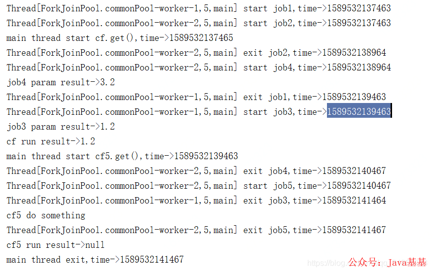

job1 和 job2 同时开始运行，job2 先执行完成，然后 job4 开始执行，理论上 job3 和 job4 应该同时开始运行，但是此时只有 job4 开始执行了，job3 是等待 job1 执行完成后才开始执行，job4 先于 job3 执行完成，然后 job5 开始执行，等 job5 执行完成后，主线程退出。上述差异且到下篇源码分析时再做探讨。

### [3、thenCompose](https://mp.weixin.qq.com/s?__biz=MzUzMTA2NTU2Ng==&mid=2247487551&idx=1&sn=18f64ba49f3f0f9d8be9d1fdef8857d9&scene=21#wechat_redirect)

thenCompose 方法会在某个任务执行完成后，将该任务的执行结果作为方法入参然后执行指定的方法，该方法会返回一个新的 CompletableFuture 实例，如果该 CompletableFuture 实例的 result 不为 null，则返回一个基于该 result 的新的 CompletableFuture 实例；如果该 CompletableFuture 实例为 null，则，然后执行这个新任务，测试用例如下：

```java
@Test
public void test9() throws Exception {
    // 创建异步执行任务:
    CompletableFuture<Double> cf = CompletableFuture.supplyAsync(()->{
        System.out.println(Thread.currentThread()+" start job1,time->"+System.currentTimeMillis());
        try {
            Thread.sleep(2000);
        } catch (InterruptedException e) {
        }
        System.out.println(Thread.currentThread()+" exit job1,time->"+System.currentTimeMillis());
        return 1.2;
    });
    CompletableFuture<String> cf2= cf.thenCompose((param)->{
        System.out.println(Thread.currentThread()+" start job2,time->"+System.currentTimeMillis());
        try {
            Thread.sleep(2000);
        } catch (InterruptedException e) {
        }
        System.out.println(Thread.currentThread()+" exit job2,time->"+System.currentTimeMillis());
        return CompletableFuture.supplyAsync(()->{
            System.out.println(Thread.currentThread()+" start job3,time->"+System.currentTimeMillis());
            try {
                Thread.sleep(2000);
            } catch (InterruptedException e) {
            }
            System.out.println(Thread.currentThread()+" exit job3,time->"+System.currentTimeMillis());
            return "job3 test";
        });
    });
    System.out.println("main thread start cf.get(),time->"+System.currentTimeMillis());
    //等待子任务执行完成
    System.out.println("cf run result->"+cf.get());
    System.out.println("main thread start cf2.get(),time->"+System.currentTimeMillis());
    System.out.println("cf2 run result->"+cf2.get());
    System.out.println("main thread exit,time->"+System.currentTimeMillis());
}
```

其输出如下：

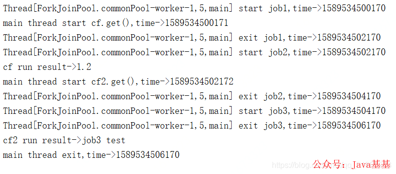

job1 执行完成后 job2 开始执行，等 job2 执行完成后会把 job3 返回，然后执行 job3，等 job3 执行完成后，主线程退出。

### [4、allOf / anyOf](https://mp.weixin.qq.com/s?__biz=MzUzMTA2NTU2Ng==&mid=2247487551&idx=1&sn=18f64ba49f3f0f9d8be9d1fdef8857d9&scene=21#wechat_redirect)

allOf 返回的 CompletableFuture 是多个任务都执行完成后才会执行，只有有一个任务执行异常，则返回的 CompletableFuture 执行 get 方法时会抛出异常，如果都是正常执行，则 get 返回 null。

```java
@Test
public void test11() throws Exception {
    // 创建异步执行任务:
    CompletableFuture<Double> cf = CompletableFuture.supplyAsync(()->{
        System.out.println(Thread.currentThread()+" start job1,time->"+System.currentTimeMillis());
        try {
            Thread.sleep(2000);
        } catch (InterruptedException e) {
        }
        System.out.println(Thread.currentThread()+" exit job1,time->"+System.currentTimeMillis());
        return 1.2;
    });
    CompletableFuture<Double> cf2 = CompletableFuture.supplyAsync(()->{
        System.out.println(Thread.currentThread()+" start job2,time->"+System.currentTimeMillis());
        try {
            Thread.sleep(1500);
        } catch (InterruptedException e) {
        }
        System.out.println(Thread.currentThread()+" exit job2,time->"+System.currentTimeMillis());
        return 3.2;
    });
    CompletableFuture<Double> cf3 = CompletableFuture.supplyAsync(()->{
        System.out.println(Thread.currentThread()+" start job3,time->"+System.currentTimeMillis());
        try {
            Thread.sleep(1300);
        } catch (InterruptedException e) {
        }
          throw new RuntimeException("test");
        System.out.println(Thread.currentThread()+" exit job3,time->"+System.currentTimeMillis());
        return 2.2;
    });
    //allof等待所有任务执行完成才执行cf4，如果有一个任务异常终止，则cf4.get时会抛出异常，都是正常执行，cf4.get返回null
    //anyOf是只有一个任务执行完成，无论是正常执行或者执行异常，都会执行cf4，cf4.get的结果就是已执行完成的任务的执行结果
    CompletableFuture cf4=CompletableFuture.allOf(cf,cf2,cf3).whenComplete((a,b)->{
       if(b!=null){
           System.out.println("error stack trace->");
           b.printStackTrace();
       }else{
           System.out.println("run succ,result->"+a);
       }
    });

    System.out.println("main thread start cf4.get(),time->"+System.currentTimeMillis());
    //等待子任务执行完成
    System.out.println("cf4 run result->"+cf4.get());
    System.out.println("main thread exit,time->"+System.currentTimeMillis());
}
```

其输出如下：

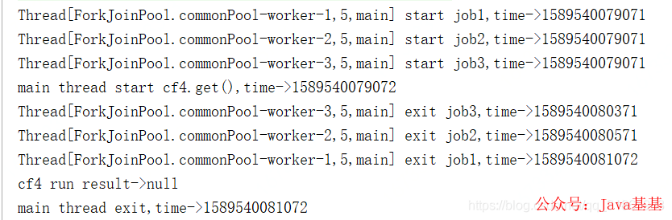

主线程等待最后一个 job1 执行完成后退出。anyOf 返回的 CompletableFuture 是多个任务只要其中一个执行完成就会执行，其 get 返回的是已经执行完成的任务的执行结果，如果该任务执行异常，则抛出异常。将上述测试用例中 allOf 改成 anyOf 后，其输出如下：

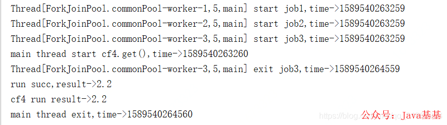

* * *


